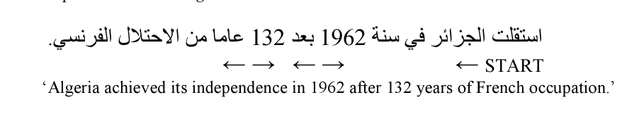
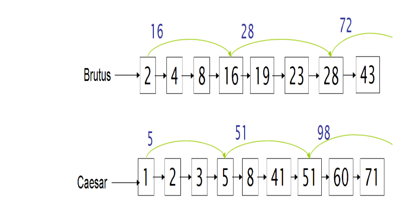
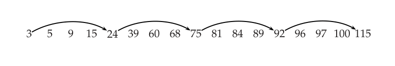

# 第 2 章 词项词汇表与倒排记录表

[返回系列目录](../introduction-to-information-retrieval.md) · [上一篇：第 1 章 布尔检索](./01-boolean-retrieval.md) · [下一篇：第 3 章 词典与容错检索](./03-dictionaries-and-tolerant-retrieval.md)

原书印刷页 19–48；PDF 第 56–85 页。

<!-- source: PDF 56; printed: 19 -->

回顾倒排索引（inverted index）构建的主要步骤：

1. 收集需要建立索引的文档。
2. 对文本进行词元化（tokenize）。
3. 对词元（token）进行语言学预处理。
4. 对每个词项（term）出现的文档建立索引。

在本章中，我们首先简要提及如何定义文档的基本单位，以及如何确定其包含的字符序列（第 2.1 节）。然后，我们将详细探讨词元化和语言学预处理中一些实质性的语言学问题，这些问题决定了系统使用的词汇表（vocabulary）（第 2.2 节）。词元化是将字符流切分为词元的过程，而语言学预处理则处理构建词元的等价类，这些等价类即为被索引的词项集合。索引本身在第 1 章和第 4 章中介绍。接着我们回到倒排记录表（postings list）的实现。在第 2.3 节中，我们考察一种支持更快速查询的扩展倒排记录表数据结构，而第 2.4 节则涵盖构建适用于处理短语和邻近查询的倒排记录数据结构，这类查询通常出现在扩展布尔模型和 Web 中。

## 2.1 文档界定与字符序列解码

### 2.1.1 获取文档中的字符序列

作为索引过程输入的数字文档通常是文件或 Web 服务器上的字节。处理的第一步是将该字节序列转换为线性的字符序列。对于 ASCII 编码的纯英文文本，这非常简单。但通常情况会变得更加

<!-- source: PDF 57; printed: 20 -->

复杂。字符序列可能由各种单字节或多字节编码方案之一进行编码，例如 Unicode UTF-8，或各种国家或供应商特定的标准。我们需要确定正确的编码。这可以被视为一个机器学习分类问题，如第 13 章所述<sup>[1]</sup>，但通常通过启发式方法、用户选择或使用提供的文档元数据来处理。一旦确定了编码，我们就会将字节序列解码为字符序列。我们可能会保存对编码的选择，因为它提供了一些关于文档是用什么语言编写的证据。

> **脚注 1（原书第 20 页）**：分类器（classifier）是一个函数，它接受某种对象并将其分配到多个不同类别中的一个（见第 13 章）。通常，分类是通过概率模型等机器学习方法完成的，但也可以通过手工编写的规则来完成。

字符可能必须从某些二进制表示（如 Microsoft Word DOC 文件）和/或压缩格式（如 zip 文件）中解码出来。同样，我们必须确定文档格式，然后必须使用适当的解码器。即使对于纯文本文档，也可能需要进行额外的解码。在 XML 文档中（第 10.1 节，第 197 页），字符实体（如 `&amp;`）需要被解码以给出正确的字符，即用 `&` 替换 `&amp;`。最后，文档的文本部分可能需要从其他不被处理的材料中提取出来。如果标记（markup）将被忽略，这可能是对 XML 文件的期望处理方式；对于 postscript 或 PDF 文件，我们几乎肯定希望这样做。在本书中，我们将不再进一步讨论这些问题，并从现在起假设我们的文档是一个字符列表。商业产品通常需要支持广泛的文档类型和编码，因为用户希望系统能直接处理他们现有的数据。通常，他们只是将文档视为应用程序内部的文本，甚至不知道它在磁盘上是如何编码的。这个问题通常通过获得处理解码文档格式和字符编码的软件库的许可来解决。

文本是字符的线性序列这一观点也受到了一些书写系统（如阿拉伯语）的质疑，在这些系统中，文本呈现出一些二维和混合顺序的特征，如图 2.1 和图 2.2 所示。但是，尽管存在一些复杂的书写系统约定，其所表示的声音仍然存在一个底层的序列，因此本质上仍然保留了线性结构，这就是阿拉伯语数字表示中所体现的，如图 2.1 所示。

### 2.1.2 选择文档单位

**[边注：文档单位（DOCUMENT UNIT）]** 下一个阶段是确定用于索引的文档单位（document unit）。到目前为止，我们一直假设文档是用于索引目的的固定单位。例如，我们将文件夹中的每个文件作为一个文档。但是有

<!-- source: PDF 58; printed: 21 -->


**图 2.1** 带有元音符号的现代标准阿拉伯语单词示例。书写方向从右到左，字母在组合时会发生复杂的形变。短元音（此处为 /i/ 和 /u/）以及词尾的 /n/（鼻音化）的表示偏离了严格的线性，而是表示为字母上方和下方的变音符号。尽管如此，所表示的文本仍然清晰地是代表声音的字符的线性排序。像这里这样的全元音化通常只出现在《古兰经》和儿童读物中。日常文本是不带元音符号的（不表示短元音，但表示 ā 的字母仍然会出现）或部分带元音符号的，在作者认为存在歧义的地方插入短元音。这些选择给索引增加了进一步的复杂性。
图中文字：ك ت ا ب ٌ ⇐ كِتَابٌ / un b ā t i k / /kitābun/ 'a book' ('一本书')


**图 2.2** 字符的概念线性顺序不一定是你页面上看到的顺序。在从右向左书写的语言（如希伯来语和阿拉伯语）中，穿插从左向右的文本（如数字和美元金额）是非常常见的。借助现代 Unicode 表示概念，文件中的字符顺序与概念顺序相匹配，而显示字符的反转由渲染系统处理，但这对于使用旧编码的文档可能并不成立。
图中文字：استقلت الجزائر في سنة 1962 بعد 132 عاما من الاحتلال الفرنسي. ← → ← → ← START 'Algeria achieved its independence in 1962 after 132 years of French occupation.' ('阿尔及利亚在被法国占领 132 年后于 1962 年获得独立。')

很多情况下你可能想采用不同的做法。传统的 Unix（mbox 格式）电子邮件文件将一系列电子邮件消息（一个邮件文件夹）存储在一个文件中，但你可能希望将每封电子邮件消息视为一个单独的文档。现在许多电子邮件消息包含附加文档，你可能希望将电子邮件消息及其包含的每个附件视为单独的文档。如果电子邮件消息带有附加的 zip 文件，你可能希望解码该 zip 文件并将其包含的每个文件视为单独的文档。反过来看，各种 Web 软件（如 latex2html）会将你可能视为单个文档的内容（例如，Powerpoint 文件或 LATEX 文档）拆分为每个幻灯片或小节的单独 HTML 页面，并存储为单独的文件。在这些情况下，你可能希望将多个文件合并为一个文档。

**[边注：索引粒度（INDEXING GRANULARITY）]** 更一般地说，对于非常长的文档，会出现索引粒度（indexing granularity）的问题。对于书籍集合，将整本

<!-- source: PDF 59; printed: 22 -->

书作为一个文档建立索引通常是个坏主意。搜索“Chinese toys”（中国玩具）可能会返回一本在第一章提到“China”（中国）而在最后一章提到“toys”（玩具）的书，但这并不能使其与查询相关。相反，我们很可能希望将每一章或每一段作为一个微型文档进行索引。这样匹配的结果更有可能相关，而且由于文档较小，用户将更容易在文档中找到相关的段落。但为什么要止步于此呢？我们可以将单个句子视为微型文档。很明显，这里存在查准率/召回率（precision/recall）的权衡。如果单位变得太小，我们很可能会错过重要的段落，因为词项分布在几个微型文档中；而如果单位太大，我们往往会得到虚假的匹配，并且用户很难找到相关信息。

大文档单位带来的问题可以通过使用显式或隐式的邻近搜索（第 2.4.2 节和第 7.2.2 节）来缓解，而我们所暗示的由此产生的系统性能权衡将在第 8 章中讨论。索引粒度的问题，特别是需要同时在多个粒度级别上对文档进行索引的需求，在 XML 检索中显得尤为突出，并将在第 10 章中再次讨论。信息检索（IR）系统的设计应提供粒度的选择。为了做出良好的选择，部署系统的人必须对文档集、用户及其可能的信息需求和使用模式有很好的了解。目前，我们从现在起将假设已经选择了一个合适大小的文档单位，并在需要时采用了适当的划分或聚合文件的方法。

## 2.2 确定词项的词汇表

### 2.2.1 词元化

给定一个字符序列和一个定义的文档单位，词元化（tokenization）是将其切分成小块（称为词元（token））的任务，也许同时丢弃某些字符，如标点符号。下面是一个词元化的例子：

输入（Input）：Friends, Romans, Countrymen, lend me your ears;
（朋友们，罗马人，同胞们，请倾听我的声音；）
输出（Output）：`Friends` `Romans` `Countrymen` `lend` `me` `your` `ears`

**[边注：词元（TOKEN） / 词型（TYPE） / 词项（TERM）]** 这些词元通常被宽泛地称为词项（term）或词（word），但有时区分词型/词元（type/token）是很重要的。词元（token）是某个特定文档中字符序列的一个实例，这些字符被组合在一起作为一个有用的语义单元进行处理。词型（type）是包含相同字符序列的所有词元的类。词项（term）是包含在 IR 系统词典（dictionary）中的（可能是经过归一化的）词型。索引词项的集合可能与词元完全不同，例如，它们可能是

<!-- source: PDF 60; printed: 23 -->

这些词元通常被宽泛地称为词项（term）或词（word），但有时区分词型（type）和词元（token）是很重要的。词元（token）是特定文档中出现的字符序列的实例，它们被组合在一起作为有用的语义单元进行处理。词型（type）是包含相同字符序列的所有词元的集合。词项（term）是包含在信息检索系统词典中的（可能经过归一化的）词型。索引词项的集合可能与词元完全不同，例如，它们可以是分类体系中的语义标识符，但在现代信息检索系统的实践中，它们与文档中的词元密切相关。然而，它们通常不是完全等同于文档中出现的词元，通常是通过第 2.2.3 节中讨论的各种归一化过程从词元派生而来的。<sup>[2]</sup> 例如，如果要建立索引的文档是 to sleep perchance to dream（去睡觉，也许去做梦），那么有 5 个词元，但只有 4 个词型（因为有 2 个 to 的实例）。然而，如果 to 从索引中被省略（作为停用词，见第 2.2.2 节，原书第 27 页），那么将只有 3 个词项：sleep、perchance 和 dream。

词元化阶段的主要问题是：应该使用哪些正确的词元？在这个例子中，这看起来相当简单：在空格处切分并丢弃标点符号。这是一个起点，但即使对于英语，也有许多棘手的情况。例如，你该如何处理撇号（apostrophe）在表示所有格和缩写时的各种用法？

> Mr. O’Neill thinks that the boys’ stories about Chile’s capital aren’t amusing.（奥尼尔先生认为男孩们关于智利首都的故事并不好笑。）

对于 O’Neill，以下哪种是期望的词元化结果？

> neill
> oneill
> o’neill
> o’ neill
> o neill ?

对于 aren’t，是：

> aren’t
> arent
> are n’t
> aren t ?

一个简单的策略是仅在所有非字母数字字符处进行切分，但是虽然 o neill 看起来还可以，aren t 直觉上看起来就很糟糕。对于所有这些情况，选择决定了哪些布尔查询会匹配。查询 neill AND capital 将在三种情况下匹配，而在另外两种情况下不匹配。查询 o’neill AND capital 会在多少种情况下匹配？如果不进行查询预处理，那么它只会在五种情况中的一种匹配。对于

> **脚注 2（原书第 23 页）**：也就是说，按照这里的定义，未被索引的词元（停用词）不是词项，如果多个词元通过归一化合并在一起，它们将以归一化形式作为一个词项被索引。然而，在第 13-18 章讨论分类和聚类时，由于没有索引，我们放宽了这个定义。在这些章节中，我们取消了必须包含在词典中的要求。词项指的是归一化后的词。

<!-- source: PDF 61; printed: 24 -->

布尔查询或自由文本查询，你总是希望对文档和查询词进行完全相同的词元化，通常是通过使用相同的词元分析器（tokenizer）来处理查询。这保证了文本中的字符序列将始终与查询中输入的相同序列相匹配。<sup>[3]</sup>

这些词元化问题是特定于语言的。因此，需要知道文档的语言。基于使用短字符子序列作为特征的分类器进行语言识别（language identification）是非常有效的；大多数语言都有独特的特征模式（参考文献见原书第 46 页）。

对于大多数语言及其特定领域，存在一些我们希望识别为词项的不寻常的特定词元，例如编程语言 C++ 和 C#，飞机名称如 B-52，或电视节目名称如 M\*A\*S\*H——它已经充分融入流行文化，以至于你会发现诸如 M\*A\*S\*H-style hospitals（M\*A\*S\*H 风格的医院）这样的用法。计算机技术引入了新型的字符序列，词元分析器可能应该将它们词元化为单个词元，包括电子邮件地址（jblack@mail.yahoo.com）、Web URL（http://stuff.big.com/new/specials.html）、数字 IP 地址（142.32.48.231）、包裹追踪号（1Z9999W99845399981）等。一种可能的解决方案是从索引中省略诸如货币金额、数字和 URL 之类的词元，因为它们的存在极大地扩展了词汇表的大小。然而，这会带来巨大的代价，限制了人们可以搜索的内容。例如，人们可能希望在 bug 数据库中搜索发生错误的行号。诸如电子邮件日期之类的具有明确语义类型的项，通常作为文档元数据单独建立索引（见第 6.1 节，原书第 110 页）。

在英语中，连字符（hyphen）用于各种目的，从分隔单词中的元音（co-education）到连接名词作为名称（Hewlett-Packard），再到作为文字编辑手段来显示词组（the hold-him-back-and-drag-him-away maneuver，即“把他拉回来并拖走”的策略）。人们很容易觉得第一个例子应该被视为一个词元（实际上更常见的写法就是 coeducation），最后一个例子应该被分成多个词，而中间的情况则不清楚。因此，自动处理连字符可能会很复杂：它可以作为一个分类问题来处理，或者更常见的是通过一些启发式规则来处理，例如允许单词带有短的连字符前缀，但不允许较长的连字符形式。

从概念上讲，在空格处切分也可能会把本应视为单个词元的内容切分开来。这最常发生在名称（San Francisco, Los Angeles）上，但也发生在借用的外来短语（au fait）和复

> **脚注 3（原书第 24 页）**：对于自由文本情况，这很直接。布尔查询的情况更为复杂：这种词元化可能会从一个查询词中产生多个词项。这可以通过使用 AND 组合这些词项或作为短语查询来处理（见第 2.4 节，原书第 39 页）。系统更难处理相反的情况，即用户输入了两个词项，而这两个词项在文档处理中被词元化在了一起。

<!-- source: PDF 62; printed: 25 -->

合词（compound）上，这些复合词有时写成一个词，有时用空格分隔（例如 white space 与 whitespace）。其他包含内部空格且我们可能希望将其视为单个词元的情况包括电话号码（(800) 234-2333）和日期（Mar 11, 1983）。在空格处切分词元可能会导致糟糕的检索结果，例如，如果搜索 York University 主要返回包含 New York University 的文档。连字符和不可分空格的问题甚至会相互影响。机票广告经常包含像 San Francisco-Los Angeles 这样的项，如果仅仅进行空格切分，将会得到不幸的结果。在这些情况下，词元化问题与处理短语查询（我们将在第 2.4 节，原书第 39 页讨论）相互作用，特别是如果我们希望对 lowercase、lower-case 和 lower case 的查询返回相同的结果。后两者可以通过在连字符处切分并使用短语索引来处理。要正确处理第一种情况，则取决于系统是否知道它有时被写成两个词，并以此方式对其进行索引。在实践中，一些布尔检索系统（如 Westlaw 和 Lexis-Nexis，见例 1.1）使用的一种有效策略是，鼓励用户在任何可能的地方输入连字符，并且只要存在连字符形式，系统就会将查询泛化，以涵盖单字、连字符和双字这三种形式，因此对 over-eager 的查询将搜索 over-eager OR "over eager" OR overeager。然而，这种策略依赖于用户培训，因为如果你使用其他两种形式之一进行查询，你将得不到任何泛化。

每种新语言都会带来一些新问题。例如，法语中撇号有一种变体用法，用于以元音开头的单词前的缩略定冠词“the”（例如 l’ensemble），并且在祈使句和疑问句中，连字符与后置的附着代词连用（例如 donne-moi ‘give me’，即“给我”）。正确处理第一种情况将影响相当大比例的名词和形容词的正确索引：你会希望提到 l’ensemble 和 un ensemble 的文档都被索引在 ensemble 下。

其他语言以新的方式使问题变得更加困难。德语在书写复合名词（compound）时不加空格（例如，Computerlinguistik ‘computational linguistics’，即“计算语言学”；Lebensversicherungsgesellschaftsangestellter ‘life insurance company employee’，即“人寿保险公司员工”）。德语检索系统极大地受益于复合词拆分器（compound-splitter）模块的使用，该模块通常通过检查一个词是否可以细分为出现在词汇表中的多个词来实现。这种现象在主要的东亚语言（例如中文、日文、韩文和泰文）中达到了极限情况，这些语言在书写文本时词与词之间没有任何空格。图 2.3 展示了一个例子。这里的一种方法是执行分词（word segmentation）作为先期的语言处理。分词方法各不相同，从拥有一个大型词汇表并采用最长词汇匹配加上一些针对未登录词的启发式规则，到使用机器学习序列模型（如隐马尔可夫模型或条件随机场），这些模型在手工分词的语料上进行训练（参考文献见

<!-- source: PDF 63; printed: 26 -->

> 莎拉波娃现在居住在美国东南部的佛罗里达。今年4月
> 9日，莎拉波娃在美国第一大城市纽约度过了18岁生
> 日。生日派对上，莎拉波娃露出了甜美的微笑。

**图 2.3** 使用中国大陆简体字的标准未分词中文文本形式。词与词之间没有空格，甚至句子之间也没有——中文句号（。）后面明显的空格只是一种排版错觉，是由将字符放置在其方形框的左侧引起的。第一句话只是汉字词语，它们之间没有空格。第二句和第三句包含阿拉伯数字和标点符号，打断了汉字。

<br>

> 和尚

**图 2.4** 中文分词中的歧义。这两个字符可以被视为一个词，意思是“monk”（和尚），也可以被视为两个词的序列，意思分别是“and”（和）与“still”（尚）。

<br>

> a &nbsp;&nbsp;&nbsp;&nbsp;&nbsp;&nbsp; an &nbsp;&nbsp;&nbsp;&nbsp;&nbsp; and &nbsp;&nbsp;&nbsp;&nbsp; are &nbsp;&nbsp;&nbsp;&nbsp; as &nbsp;&nbsp;&nbsp;&nbsp;&nbsp; at &nbsp;&nbsp;&nbsp;&nbsp;&nbsp; be &nbsp;&nbsp;&nbsp;&nbsp;&nbsp; by &nbsp;&nbsp;&nbsp;&nbsp;&nbsp; for &nbsp;&nbsp;&nbsp;&nbsp; from
> has &nbsp;&nbsp;&nbsp;&nbsp; he &nbsp;&nbsp;&nbsp;&nbsp;&nbsp; in &nbsp;&nbsp;&nbsp;&nbsp;&nbsp;&nbsp; is &nbsp;&nbsp;&nbsp;&nbsp;&nbsp;&nbsp; it &nbsp;&nbsp;&nbsp;&nbsp;&nbsp;&nbsp; its &nbsp;&nbsp;&nbsp;&nbsp;&nbsp; of &nbsp;&nbsp;&nbsp;&nbsp;&nbsp; on &nbsp;&nbsp;&nbsp;&nbsp;&nbsp; that &nbsp;&nbsp;&nbsp; the
> to &nbsp;&nbsp;&nbsp;&nbsp;&nbsp; was &nbsp;&nbsp;&nbsp;&nbsp; were &nbsp;&nbsp;&nbsp; will &nbsp;&nbsp;&nbsp; with

**图 2.5** 包含 25 个在 Reuters-RCV1 中常见的、语义上非选择性词的停用词表。

<br>

第 2.5 节）。由于字符序列存在多种可能的分词方式（见图 2.4），所有这些方法有时都会犯错，因此你永远无法保证得到一致且唯一的词元化结果。另一种方法是放弃基于词的索引，而仅通过短字符子序列（字符 k-gram）进行所有索引，无论特定序列是否跨越词边界。这种方法之所以吸引人，有三个原因：单个汉字更像是一个音节而不是一个字母，并且通常具有一定的语义内容；大多数词都很短（最常见的长度是 2 个字符）；而且，鉴于书写系统中缺乏分词的标准化，无论如何，词边界应该放在哪里并不总是很清楚。即使在英语中，某些放置词边界的情况也仅仅是拼写习惯——想想 notwithstanding 与 not to mention，或者 into 与 on to——但人们受过教育，在书写这些词时会一致地使用空格。

<!-- source: PDF 64; printed: 27 -->

### 2.2.2 剔除常见词项：停用词

有时，一些极其常见的词似乎对帮助选择匹配用户需求的文档没有什么价值，它们会被完全从词汇表中排除。这些词被称为停用词（stop word）。确定停用词表（stop list）的一般策略是按文档集频率（collection frequency，即每个词项在文档集中出现的总次数）对词项进行排序，然后取出最频繁的词项，通常还会根据被索引文档领域的语义内容进行手工过滤，以此作为停用词表，其成员在索引过程中会被丢弃。图 2.5 展示了一个停用词表的例子。使用停用词表可以显著减少系统必须存储的倒排记录数量；我们将在第 5 章中给出关于此的一些统计数据（见第 87 页表 5.1）。而且很多时候，不对停用词进行索引几乎没有坏处：使用 *the* 和 *by* 等词项进行关键字搜索似乎没什么用。然而，对于短语搜索来说情况并非如此。包含两个停用词的短语查询 "President of the United States"（美国总统）比 *President* AND "United States" 更精确。如果单词 *to* 被作为停用词剔除，*flights to London*（飞往伦敦的航班）的含义很可能会丢失。如果前三个词被剔除，系统仅仅搜索包含单词 *think* 的文档，那么搜索 Vannevar Bush 的文章 *As we may think*（诚如所思）将会很困难。一些特殊的查询类型受到的影响尤为严重。一些歌曲名称和著名的诗句完全由通常在停用词表上的单词组成（*To be or not to be*（生存还是毁灭），*Let It Be*（顺其自然），*I don't want to be*（我不想成为），...）。

随着时间的推移，信息检索系统的总体趋势已经从标准使用相当大的停用词表（200–300 个词项）转变为使用非常小的停用词表（7–12 个词项），甚至完全不使用停用词表。Web 搜索引擎通常不使用停用词表。现代信息检索系统的一些设计恰恰集中在如何利用语言的统计特性，以便能够以更好的方式处理常见词。我们将在第 5.3 节（第 95 页）展示良好的压缩技术如何大大降低存储常见词倒排记录的成本。随后，第 6.2.1 节（第 117 页）讨论了标准词项权重计算如何导致非常常见的词对文档排名几乎没有影响。最后，第 7.1.5 节（第 140 页）展示了具有按影响度排序索引的信息检索系统如何在权重变小时提前终止扫描倒排记录表，因此，尽管停用词的倒排记录表非常长，常见词也不会为平均查询带来大量额外的处理成本。因此，对于大多数现代信息检索系统来说，包含停用词的额外成本并没有那么大——无论是在索引大小还是在查询处理时间方面。

<!-- source: PDF 65; printed: 28 -->

| Query term | Terms in documents that should be matched |
| :--- | :--- |
| Windows | Windows |
| windows | Windows, windows, window |
| window | window, windows |

**图 2.6** 查询词项的非对称扩展如何有效地对用户期望进行建模的示例。

### 2.2.3 归一化（词项的等价类构建）

将我们的文档（以及查询）分解为词元后，最简单的情况是查询中的词元恰好与文档词元列表中的词元相匹配。然而，在许多情况下，两个字符序列并不完全相同，但你希望发生匹配。例如，如果你搜索 *USA*，你可能希望也能匹配包含 *U.S.A.* 的文档。

词元归一化（token normalization）是将词元规范化的过程，使得即使词元的字符序列存在表面上的差异，也能发生匹配。<sup>[4]</sup> 最标准的归一化方法是隐式地创建等价类（equivalence classes），通常以集合中的一个成员来命名。例如，如果在文档文本和查询中，词元 *anti-discriminatory* 和 *antidiscriminatory* 都被映射到词项 *antidiscriminatory*，那么搜索其中一个词项将检索到包含任意一个的文档。

仅仅使用像删除连字符这样的映射规则的优点在于，要完成的等价类构建是隐式的，而不是预先完全计算好的：由于这些规则而碰巧变得相同的词项就构成了等价类。只有编写这种删除字符的规则才比较容易。由于等价类是隐式的，因此何时可能需要添加字符并不明显。例如，很难知道要将 *antidiscriminatory* 转换为 *anti-discriminatory*。

创建等价类的另一种替代方法是维护未归一化词元之间的关系。这种方法可以扩展到手工构建的同义词表，例如 *car*（汽车）和 *automobile*（汽车），我们将在第 9 章进一步讨论这个主题。这些词项关系可以通过两种方式实现。通常的方法是对未归一化的词元进行索引，并维护一个查询扩展列表，其中包含针对某个查询词项需要考虑的多个词汇表条目。这样，一个查询词项实际上就是几个倒排记录表的析取（并集）。另一种方法是在索引构建期间执行扩展。当文档包含 *automobile* 时，我们也在 *car* 下对其进行索引（通常反之亦然）。使用这两种方法中的任何一种都比等价类构建效率低得多，因为有更多的倒排记录需要存储和合并。第一种

> **脚注 4（原书第 28 页）**：它通常也被称为词项归一化（term normalization），但我们倾向于保留词项（term）这个名称来表示归一化过程的输出。

<!-- source: PDF 66; printed: 29 -->

方法增加了一个查询扩展词典，并需要在查询时进行更多的处理，而第二种方法需要更多的空间来存储倒排记录。传统上，扩展倒排记录表所需的空间被认为更具劣势，但考虑到现代的存储成本，由独立的倒排记录表带来的灵活性增加是很有吸引力的。

这些方法比等价类更灵活，因为扩展列表可以重叠而不必完全相同。这意味着扩展中可以存在非对称性。图 2.6 展示了如何利用这种非对称性的一个例子：如果用户输入 *windows*，我们希望允许与大写的 *Windows* 操作系统匹配，但如果用户输入 *window*，这就不太合理了，尽管该查询匹配小写的 *windows* 是合理的。

应该进行多少程度的等价类构建或查询扩展，是一个相当开放的问题。做一些显然是个好主意。但是做太多很容易产生意想不到的后果，即以非预期的方式扩大查询范围。例如，考虑到首字母缩略词中可选使用句号的普遍模式，通过从词元中删除句号将 *U.S.A.* 和 *USA* 归为后者的等价类，乍一看似乎非常合理。然而，如果我将 *C.A.T.* 作为我的查询词项，如果它匹配文档中出现的每一个单词 *cat*（猫），我可能会相当苦恼。<sup>[5]</sup>

下面我们介绍一些常用的归一化形式及其实现方法。在许多情况下，它们似乎很有帮助，但也可能带来负面影响。事实上，你可能会担心等价类构建的许多细节，但结果往往表明，只要对查询和文档的处理保持一致，这些微小的细节可能对整体性能没有太大的综合影响。

**重音和变音符号。** 英语中字符上的变音符号地位相当边缘化，我们很可能希望 *cliché* 和 *cliche*（陈词滥调）能够匹配，或者 *naive* 和 *naïve*（天真）能够匹配。这可以通过对词元进行归一化以去除变音符号来实现。在许多其他语言中，变音符号是书写系统的常规组成部分，用于区分不同的发音。有时，单词仅仅通过它们的重音符号来区分。例如，在西班牙语中，*peña* 的意思是“悬崖”，而 *pena* 的意思是“悲伤”。尽管如此，通常需要着重考虑用户会怎样针对这些词输入查询，规范性或语言学上的判断居于次要位置。在许多情况下，用户输入单词查询时不会带有变音符号，无论是出于速度、懒惰、软件限制的原因，还是源于过去在许多计算机系统上难以使用非 ASCII 文本的时代所养成的习惯。在这些情况下，最好将所有单词等同于没有变音符号的形式。

> **脚注 5（原书第 29 页）**：在我们撰写本章时（2005 年 8 月），Google 上的情况确实如此：查询 *C.A.T.* 的首个结果是一个关于猫的网站，即 Cat Fanciers Web Site http://www.fanciers.com/。

<!-- source: PDF 67; printed: 30 -->

**大写/大小写折叠。** 一种常见的策略是通过将所有字母转换为小写来进行大小写折叠（case-folding）。通常这是一个好主意：它将允许句子开头的 *Automobile* 实例与查询 *automobile* 匹配。当大多数用户对 *Ferrari*（法拉利）汽车感兴趣却输入 *ferrari* 时，这对 Web 搜索引擎也会有所帮助。另一方面，这种大小写折叠可能会将最好保持区分的单词等同起来。许多专有名词源自普通名词，因此仅通过大小写来区分，包括公司（*General Motors* 通用汽车，*The Associated Press* 美联社）、政府组织（*the Fed* 美联储 vs. *fed* 喂养）和人名（*Bush* 布什，*Black* 布莱克）。我们已经提到了一个首字母缩略词导致意外查询扩展的例子，它不仅涉及缩略词归一化（*C.A.T.* $\rightarrow$ *CAT*），还涉及大小写折叠（*CAT* $\rightarrow$ *cat*）。

对于英语，将每个词元都小写化的一种替代方法是仅将部分词元小写化。最简单的启发式方法是将句子开头的单词，以及出现在全大写标题或大多数/所有单词都大写的标题中的所有单词转换为小写。这些单词通常是被大写了的普通单词。句子中间大写的单词保持大写（这通常是正确的）。这将在很大程度上避免在应该保持区分的情况下进行大小写折叠。同样的任务可以通过机器学习序列模型更准确地完成，该模型使用更多特征来决定何时进行大小写折叠。这被称为真实大小写还原（truecasing）。然而，如果你的用户通常无论单词的正确大小写如何都使用小写，那么试图以这种方式获得正确的大写可能无济于事。因此，将所有内容小写化通常仍然是最实用的解决方案。

**英语中的其他问题。** 其他可能的归一化非常特殊，且为英语所独有。例如，你可能希望将 *ne'er* 和 *never*（从不）等同起来，或者将英式拼写 *colour* 和美式拼写 *color*（颜色）等同起来。日期、时间和类似项目有多种格式，带来了额外的挑战。你可能希望将 *3/12/91* 和 *Mar. 12, 1991* 合并在一起。然而，这里的正确处理变得复杂，因为在美国，*3/12/91* 是 *Mar. 12, 1991*（1991年3月12日），而在欧洲它是 *3 Dec 1991*（1991年12月3日）。

**其他语言。** 英语在万维网（WWW）上一直保持着主导地位；大约 60% 的网页是英文的（Gerrand 2007）。但这仍然留下了 40% 的网络，而且非英语部分预计会随着时间的推移而增长，因为只有不到三分之一的互联网用户和不到 10% 的世界人口主要讲英语。并且已经有了变化的迹象：Sifry (2007) 报告称，只有大约三分之一的博客文章是英文的。

其他语言在等价类构建方面再次呈现出独特的问题。

<!-- source: PDF 68; printed: 31 -->


**图 2.7** 日语使用了多种混合的书写系统，并且和中文一样，不进行分词。这段文本主要由汉字组成，平假名音节表用于词尾屈折变化和虚词。拉丁字母部分实际上是一个日语表达，但被 2004 年诺贝尔和平奖得主 Wangari Maathai 用作一项环保运动的名称。他的名字在第一行中间使用片假名音节表书写。最后一行的前四个字符表示一个货币金额，我们希望将其与 ¥500,000（500,000 日元）进行匹配。

图中文字：
ノーベル平和賞を受賞したワンガリ・マータイさんが名誉会長を務め
るMOTTAINAIキャンペーンの一環として、毎日新聞社とマガ
ジンハウスは「私の、もったいない」を募集します。皆様が日ごろ
「もったいない」と感じて実践していることや、それにまつわるエピ
ソードを800字以内の文章にまとめ、簡単な写真、イラスト、図
などを添えて10月20日までにお送りください。大賞受賞者には、
50万円相当の旅行券とエコ製品2点の副賞が贈られます。

法语中表示 *the*（定冠词）的单词不仅根据其后名词的性别（阳性或阴性）和数量有不同的形式，而且还取决于其后的单词是否以元音开头：*le, la, l', les*。我们很可能希望将 *the* 的这些不同形式归入同一个等价类。德语有一种约定，即带有变音符号（umlaut）的元音可以替换为两个元音组成的二合字母。我们会希望将 *Schütze* 和 *Schuetze* 视为等价。

如图 2.7 所示，日语是一种众所周知的复杂书写系统。现代日语标准上是多种字母的混合，主要是汉字、两种音节表（平假名和片假名）以及西方字符（拉丁字母、阿拉伯数字和各种符号）。虽然通过教育系统在书写系统的选择上存在强烈的约定和标准化，但在许多情况下，同一个词可以用多种书写系统来书写。例如，一个词可能会用片假名书写以表示强调（有点像斜体）。或者一个词有时可能用平假名书写，有时用汉字书写。因此，成功的检索需要在不同的书写系统之间进行复杂的等价类划分。特别是，最终用户通常可能会提交完全由平假名组成的查询，因为它更容易输入，就像西方最终用户通常全部使用小写字母一样。

正在被索引的文档集（document collections）可能包含来自许多不同语言的文档。或者单个文档很容易包含多种语言的文本。例如，一封法语电子邮件可能会引用用英语编写的合同文档中的条款。最常见的情况是，在预定的粒度（例如整个文档或单个段落）上检测语言并应用特定于语言的词元化和归一化规则，但这仍然无法正确处理简短引用中发生语言切换的情况。当文档集包含多

<!-- source: PDF 69; printed: 32 -->

种语言时，单个索引可能必须包含几种语言的词项（terms）。一种选择是在文档上运行语言识别分类器，然后在词汇表（vocabulary）中为词项标记其语言。或者也可以简单地省略这种标记，因为完全相同的字符序列在不同语言中都是一个词的情况相对罕见。

在处理外来词或复杂词汇，特别是外国名字时，拼写可能不清楚，或者可能存在不同的音译标准导致不同的拼写（例如，*Chebyshev* 和 *Tchebycheff*，或者 *Beijing* 和 *Peking*）。处理这个问题的一种方法是使用启发式方法将词项与语音等价物进行等价类划分或扩展。传统且最著名的此类算法是 Soundex 算法，我们将在第 3.4 节（第 63 页）中介绍。

### 2.2.4 词干提取与词形还原

出于语法原因，文档会使用一个词的不同形式，例如 *organize, organizes* 和 *organizing*。此外，还有一些具有相似含义的派生相关词族，例如 *democracy, democratic* 和 *democratization*。在许多情况下，搜索这些词中的一个时，返回包含该集合中另一个词的文档似乎是有用的。

词干提取（stemming）和词形还原（lemmatization）的目标都是将词的屈折形式，有时也包括派生相关的形式，还原为共同的基础形式。例如：

am, are, is $\Rightarrow$ be （是）
car, cars, car's, cars' $\Rightarrow$ car （车）

这种文本映射的结果将类似于：

the boy's cars are different colors （男孩的车颜色不同） $\Rightarrow$
the boy car be differ color

然而，这两个词在风格上有所不同。**词干提取**（stemming）通常指的是一种粗糙的启发式过程，它砍掉词的尾部，希望在大多数情况下能正确实现这一目标，并且通常包括去除派生词缀。**词形还原**（lemmatization）通常指的是利用词汇表和词的形态学分析来正确地处理，通常旨在仅去除屈折词尾并返回词的基础形式或词典形式，这被称为**词元**（lemma）。如果遇到词元（token）*saw*，词干提取可能只返回 *s*，而词形还原将尝试返回 *see* 或 *saw*，这取决于该词元（token）是用作动词还是名词。两者的不同之处还在于，词干提取最常将派生相关的词合并，而词形还原通常只合并一个词元（lemma）的不同屈折形式。

<!-- source: PDF 70; printed: 33 -->

用于词干提取或词形还原的语言学处理通常由索引过程的一个附加插件组件来完成，目前存在许多这样的组件，包括商业的和开源的。

英语中最常用的词干提取算法是 Porter 算法（Porter 1980），该算法已被反复证明在经验上非常有效。整个算法太长且复杂，无法在此展示，但我们将说明其一般性质。Porter 算法包含 5 个词汇缩减阶段，按顺序应用。在每个阶段内，有各种选择规则的约定，例如从每个规则组中选择适用于最长后缀的规则。在第一阶段，此约定与以下规则组一起使用：

$$ 
\begin{array}{lll}
\text{Rule} & & \text{Example} \\
\text{SSES} \rightarrow \text{SS} & & \text{caresses} \rightarrow \text{caress} \\
\text{IES} \rightarrow \text{I} & & \text{ponies} \rightarrow \text{poni} \\
\text{SS} \rightarrow \text{SS} & & \text{caress} \rightarrow \text{caress} \\
\text{S} \rightarrow & & \text{cats} \rightarrow \text{cat}
\end{array} 
\tag{2.1}
$$

许多后期的规则使用了词的测度（measure）的概念，它粗略地检查音节的数量，以查看一个词是否足够长，从而可以合理地将规则的匹配部分视为后缀，而非词干的一部分。例如，规则：

$(m > 1) \quad \text{EMENT} \quad \rightarrow$

会将 *replacement* 映射为 *replac*，但不会将 *cement* 映射为 *c*。Porter 词干提取器的官方网站是：

`http://www.tartarus.org/~martin/PorterStemmer/`

还存在其他词干提取器，包括较早的、单遍的 Lovins 词干提取器（Lovins 1968），以及较新的 Paice/Husk 词干提取器（Paice 1990）；参见：

`http://www.cs.waikato.ac.nz/~eibe/stemmers/`
`http://www.comp.lancs.ac.uk/computing/research/stemming/`

图 2.8 展示了这些词干提取器不同行为的非正式比较。词干提取器使用特定于语言的规则，但它们需要的知识少于词形还原器，后者需要完整的词汇表和形态学分析才能正确地对词进行词形还原。特定领域可能还需要特殊的词干提取规则。然而，确切的词干形式并不重要，重要的是它所形成的等价类。

除了使用词干提取器，你还可以使用**词形还原器**（lemmatizer），这是一种来自自然语言处理的工具，它进行完整的形态学分析以准确识别每个词的词元（lemma）。进行完整的形态学分析对检索带来的好处充其量是非常有限的。很难给出更多定论，

<!-- source: PDF 71; printed: 34 -->

**示例文本（Sample text）：** Such an analysis can reveal features that are not easily visible from the variations in the individual genes and can lead to a picture of expression that is more biologically transparent and accessible to interpretation （这种分析可以揭示从单个基因的变异中不易看出的特征，并能得出一个在生物学上更透明、更易于解释的表达图景）

**Lovins 词干提取器：** such an analys can reve featur that ar not eas vis from th vari in th individu gen and can lead to a pictur of expres that is mor biolog transpar and acces to interpres

**Porter 词干提取器：** such an analysi can reveal featur that ar not easili visibl from the variat in the individu gene and can lead to a pictur of express that is more biolog transpar and access to interpret

**Paice 词干提取器：** such an analys can rev feat that are not easy vis from the vary in the individ gen and can lead to a pict of express that is mor biolog transp and access to interpret

**图 2.8** 三种词干提取算法在示例文本上的比较。

因为这两种形式的归一化总体上往往不会提高英语信息检索（information retrieval）的性能——至少提高得不多。虽然它对某些查询有很大帮助，但同样也会严重损害其他查询的性能。词干提取提高了召回率（recall），同时损害了查准率（precision）。作为可能出错的一个例子，请注意 Porter 词干提取器将以下所有词：

operate operating operates operation operative operatives operational （操作、操作中、操作、操作、操作的、操作员、操作上的）

都提取为 *oper*。然而，由于 *operate* 及其各种形式是一个常见的动词，我们预计在使用 Porter 词干提取时，在以下查询中会损失相当大的查准率：

operational AND research （运筹学）
operating AND system （操作系统）
operative AND dentistry （牙体修复学）

对于像这样的情况，转而使用词形还原器并不能完全解决问题，因为特定的屈折形式用于特定的搭配中：包含 *operate* 和 *system* 这两个词的句子并不是查询 `operating AND system` 的良好匹配。从词项归一化中获得更好的价值，更多地取决于词语使用的语用问题，而非语言形态学的形式问题。

对于具有更多形态变化的语言（如西班牙语、德语和芬兰语），情况则有所不同。欧洲 CLEF 评测的结果反复表明，使用词干提取器（以及针对德语等语言的复合词拆分）可以带来相当大的收益；参见第 2.5 节中的参考文献。

<!-- source: PDF 72; printed: 35 -->

**练习 2.1**

[*]

下列说法是正确还是错误？

- **a.** 在布尔检索系统中，词干提取（stemming）从不降低查准率（precision）。

- **b.** 在布尔检索系统中，词干提取从不降低召回率（recall）。

- **c.** 词干提取会增加词汇表（vocabulary）的大小。

- **d.** 词干提取应该在建立索引时调用，在处理查询时不应调用。

**练习 2.2**

[*]

建议对以下单词使用哪种归一化形式（包括单词本身作为一种可能）：

- **a.** 'Cos

- **b.** Shi'ite

- **c.** cont'd

- **d.** Hawai'i

- **e.** O'Rourke

**练习 2.3**

[*]

以下单词对被 Porter 词干提取器提取为相同的形式。你认为哪些单词对不应该被合并（conflated）？请给出你的理由。

- **a.** abandon/abandonment

- **b.** absorbency/absorbent

- **c.** marketing/markets

- **d.** university/universe

- **e.** volume/volumes

**练习 2.4**

[*]

对于式（2.1）中所示的 Porter 词干提取器规则组：

- **a.** 包含像 SS $\rightarrow$ SS 这样的恒等规则的目的是什么？

- **b.** 仅应用此规则组，以下单词将被提取为什么词干？

circus

canaries

boss

- **c.** 应该添加什么规则来正确提取 pony 的词干？

- **d.** 对 ponies 和 pony 的词干提取可能看起来很奇怪。它对检索有有害影响吗？为什么有或为什么没有？

<!-- source: PDF 73; printed: 36 -->



**图 2.9** 带有跳跃指针的倒排记录表。当跳跃指针的终点仍然小于另一个表中的项时，倒排记录的交集运算可以使用跳跃指针。

图中文字：Brutus, Caesar

## 2.3 基于跳跃指针的倒排记录表快速求交算法

在本章的剩余部分，我们将讨论倒排记录表数据结构的扩展以及提高倒排记录表使用效率的方法。回顾第 1.3 节（原书第 10 页）中基本的倒排记录表求交操作：我们同时遍历两个倒排记录表，其时间与倒排记录项的总数成正比。如果表的长度分别为 $m$ 和 $n$，则求交操作需要 $O(m + n)$ 次运算。我们能做得更好吗？也就是说，从经验上看，我们通常能在次线性（sublinear）时间内处理倒排记录表的交集吗？如果索引变化不是太快，我们是可以做到的。

**跳表（SKIP LIST）** 一种实现方法是使用跳表（skip list），即（在建立索引时）在倒排记录表中增加跳跃指针（skip pointer），如图 2.9 所示。跳跃指针实际上是捷径，它允许我们避免处理倒排记录表中那些不会出现在搜索结果中的部分。接下来的两个问题是：跳跃指针应该放置在哪里，以及如何使用跳跃指针进行高效的合并。

首先考虑高效合并，以图 2.9 为例。假设我们已经遍历了图中的表，直到我们在两个表中都匹配到了 8 并将其移入结果表。我们同时向前移动两个指针，得到上方表中的 16 和下方表中的 41。此时最小的项是上方表中的元素 16。与其简单地向前移动上方指针，我们首先检查跳表指针，并注意到 28 也小于 41。因此，我们可以顺着跳表指针，将上方指针直接向前移动到 28。这样我们就避免了遍历上方表中的 19 和 23。根据确切检查跳跃指针的时机不同，带有跳跃指针的倒排记录表求交算法有多种变体版本。其中一个版本显示

<!-- source: PDF 74; printed: 37 -->

```text
INTERSECTWITHSKIPS(p1, p2)
 1 answer ← ⟨⟩
 2 while p1 ≠ NIL and p2 ≠ NIL
 3 do if docID(p1) = docID(p2)
 4    then ADD(answer, docID(p1))
 5         p1 ← next(p1)
 6         p2 ← next(p2)
 7    else if docID(p1) < docID(p2)
 8         then if hasSkip(p1) and (docID(skip(p1)) ≤ docID(p2))
 9              then while hasSkip(p1) and (docID(skip(p1)) ≤ docID(p2))
10                   do p1 ← skip(p1)
11              else p1 ← next(p1)
12         else if hasSkip(p2) and (docID(skip(p2)) ≤ docID(p1))
13              then while hasSkip(p2) and (docID(skip(p2)) ≤ docID(p1))
14                   do p2 ← skip(p2)
15              else p2 ← next(p2)
16 return answer
```

**图 2.10** 带有跳跃指针的倒排记录表求交算法。

在图 2.10 中。跳跃指针仅对原始的倒排记录表可用。对于复杂查询中的中间结果，调用 `hasSkip(p)` 将始终返回 false。最后，请注意，跳跃指针的存在仅对 AND 查询有帮助，对 OR 查询没有帮助。

我们应该把跳跃指针放在哪里？这里存在一个权衡（tradeoff）。更多的跳跃指针意味着更短的跳跃跨度，我们也更有可能执行跳跃。但这也意味着需要对跳跃指针进行大量的比较，以及需要大量的空间来存储跳跃指针。较少的跳跃指针意味着较少的指针比较，但随之而来的是较长的跳跃跨度，这意味着跳跃的机会将变少。一个在实践中被证明行之有效的放置跳跃指针的简单启发式方法是：对于长度为 $P$ 的倒排记录表，使用 $\sqrt{P}$ 个均匀分布的跳跃指针。这个启发式方法还可以改进；它忽略了查询词项分布的任何细节。

如果索引相对静态，构建有效的跳跃指针很容易；如果倒排记录表因为更新而不断变化，这就比较困难了。恶意的删除策略可能会使跳表失效。

对于系统构建者来说，为倒排索引（inverted index）选择最佳的编码方式是一场不断变化的游戏，因为它强烈依赖于底层的计算机技术及其相对的速度和容量。传统上，CPU 速度较慢，因此高压缩比的技术并不是最优的。现在 CPU 速度很快而磁盘速度很慢，因此减小磁盘上倒排记录表的大小占据了主导地位。然而，如果你运行的搜索引擎将所有内容都放在内

<!-- source: PDF 75; printed: 38 -->

存中，那么情况又会发生变化。我们将在第 4.1 节（原书第 68 页）讨论硬件参数对索引构建时间的影响，并在第 5 章讨论索引大小对系统速度的影响。

**练习 2.5**

[*]

为什么跳跃指针对于 x OR y 形式的查询没有用？

**练习 2.6**

[*]

我们有一个双词查询。对于其中一个词项，其倒排记录表包含以下 16 个记录项：

[4,6,10,12,14,16,18,20,22,32,47,81,120,122,157,180]

对于另一个词项，其倒排记录表只有一个记录项：

[47]。

计算使用以下两种策略对这两个倒排记录表求交集时需要进行多少次比较。简要说明你的答案的理由：

- **a.** 使用标准的倒排记录表

- **b.** 使用带有跳跃指针存储的倒排记录表，跳跃长度为 $\sqrt{P}$，如第 2.3 节所建议的那样。

**练习 2.7**

[*]

考虑以下带有跳跃指针的倒排记录表与另一个倒排记录表的求交运算：



**图 练习 2.7** 带有跳跃指针的倒排记录表。

图中文字：3 5 9 15 24 39 60 68 75 81 84 89 92 96 97 100 115

以及以下中间结果倒排记录表（因此没有跳跃指针）：

3 5 89 95 97 99 100 101

跟踪图 2.10（原书第 37 页）中的倒排记录表求交算法。

- **a.** 跳跃指针被跟随（即 $p_1$ 前进到 $\text{skip}(p_1)$）的次数是多少？

- **b.** 该算法在对这两个表求交集时将进行多少次倒排记录比较？

- **c.** 如果在不使用跳跃指针的情况下对倒排记录表求交集，将进行多少次倒排记录比较？

<!-- source: PDF 76; printed: 39 -->

## 2.4 位置倒排记录与短语查询

许多复杂或技术性的概念以及许多组织和产品名称都是多词复合词或短语。我们希望能够将诸如 Stanford University 这样的查询作为一个短语来处理，这样文档中类似 The inventor Stanford Ovshinsky never went to university.（发明家斯坦福·奥夫辛斯基从未上过大学。）的句子就不会被匹配。大多数现代搜索引擎支持使用双引号语法（“stanford university”）进行短语查询（phrase queries），事实证明这种方式非常容易被用户理解并成功使用。多达 10% 的 Web 查询是短语查询，还有更多是隐式短语查询（例如人名），输入时没有使用双引号。为了能够支持此类查询，倒排记录表（postings lists）仅仅是包含单个词项的文档列表已经不够了。在本节中，我们将考虑支持短语查询的两种方法及其组合。搜索引擎不仅应该支持短语查询，还应该高效地实现它们。一个相关但不同的概念是词项邻近度加权（term proximity weighting），即如果查询词项在文本中彼此靠得越近，文档的评分就越高。该技术将在第 7.2.2 节（原书第 144 页）的排序检索背景下进行介绍。

### 2.4.1 双词索引

处理短语的一种方法是将文档中每对连续的词项视为一个短语。例如，文本 Friends, Romans, Countrymen（朋友们，罗马人，同胞们）将生成以下双词（biwords）：

```text
friends romans
romans countrymen
```

在这个模型中，我们将每个双词视为一个词汇表（vocabulary）词项。这样就能直接处理双词短语查询。更长的短语可以通过分解来处理。查询 stanford university palo alto 可以分解为基于双词的布尔查询：

“stanford university” AND “university palo” AND “palo alto”

在实践中，可以预期该查询的效果相当好，但偶尔也会出现误报（false positives）。如果不检查文档，我们就无法验证匹配上述布尔查询的文档是否确实包含原始的 4 词短语。

在可能的查询中，名词和名词短语在描述人们感兴趣搜索的概念时具有特殊地位。但是相关的名词通常会被各种功能词隔开，例如在短语 the abolition of slavery（废除奴隶制）或 renegotiation of the constitution（重新谈判宪法）中。这些需求可以通过以下方式纳入双词索引模型中。

<!-- source: PDF 77; printed: 40 -->

首先，我们对文本进行词元化（tokenize）并执行词性标注（part-of-speech-tagging）<sup>[6]</sup>。然后，我们可以将词项分组为名词（包括专有名词，记为 N）和功能词（包括冠词和介词，记为 X）以及其他类别。现在，将任何形式为 NX*N 的词项串视为一个扩展双词（extended biword）。每个这样的扩展双词都成为词汇表中的一个词项。例如：

```text
renegotiation of the constitution
N             X  X   N
```

为了使用这种扩展双词索引处理查询，我们还需要将其解析为 N 和 X，然后将查询分割成扩展双词，以便在索引中进行查找。

在将较长的查询解析为布尔查询时，该算法并不总是以直觉上最优的方式工作。使用上述算法，查询

cost overruns on a power plant（发电厂的成本超支）

被解析为

“cost overruns” AND “overruns power” AND “power plant”

然而，省略中间的双词似乎是一个更好的查询。通过使用更精确的词性模式来定义哪些扩展双词应该被索引，可以获得更好的结果。

双词索引的概念可以扩展到更长的词序列，如果索引包含可变长度的词序列，通常称之为短语索引（phrase index）。实际上，对单个词项的搜索在双词索引中无法自然地处理（你需要扫描词典以查找包含该词项的所有双词），因此我们还需要一个单词词项的索引。虽然总是存在误报匹配的可能性，但在长度为 3 或更长的索引短语上发生误报匹配的几率确实变得非常小。但另一方面，存储更长的短语有可能极大地扩展词汇表的大小。为长度大于 2 的短语维护详尽的短语索引是一个令人望而生畏的前景，甚至使用详尽的双词词典也会极大地扩展词汇表的大小。然而，在本节末尾，我们将讨论在复合索引方案中使用部分短语索引策略的实用性。

> **脚注 6（原书第 40 页）**：词性标注器将词分类为名词、动词等——或者在实践中，通常分类为更细粒度的类别，如“复数专有名词”。现在存在许多相当准确（每个标签的准确率约为 96%）的词性标注器，通常通过机器学习方法在手工标注的文本上进行训练。例如，参见 Manning and Schütze (1999, ch. 10)。

<!-- source: PDF 78; printed: 41 -->

```text
to, 993427:
  ⟨ 1, 6: ⟨7, 18, 33, 72, 86, 231⟩;
    2, 5: ⟨1, 17, 74, 222, 255⟩;
    4, 5: ⟨8, 16, 190, 429, 433⟩;
    5, 2: ⟨363, 367⟩;
    7, 3: ⟨13, 23, 191⟩; ... ⟩

be, 178239:
  ⟨ 1, 2: ⟨17, 25⟩;
    4, 5: ⟨17, 191, 291, 430, 434⟩;
    5, 3: ⟨14, 19, 101⟩; ... ⟩
```

**图 2.11** 位置索引示例。单词 to 的文档频率为 993,477，在文档 1 中出现了 6 次，位置分别为 7、18、33 等。

### 2.4.2 位置索引

由于上述原因，双词索引并不是标准的解决方案。相反，最常使用的是位置索引（positional index）。在这里，对于词汇表中的每个词项，我们存储形式为 docID: ⟨position1, position2, ... ⟩ 的倒排记录（postings），如图 2.11 所示，其中每个位置都是文档中的一个词元索引。每条倒排记录通常还会记录词项频率（term frequency），原因将在第 6 章中讨论。

为了处理短语查询，你仍然需要访问每个不同词项的倒排索引条目。和以前一样，你将从频率最低的词项开始，然后进一步限制可能的候选列表。在合并操作中，使用了与以前相同的通用技术，但不仅仅是检查两个词项是否都在文档中，你还需要检查它们在文档中出现的位置是否与正在评估的短语查询兼容。这需要计算词之间的偏移量。

**例 2.1：满足短语查询。** 假设 to 和 be 的倒排记录表如图 2.11 所示，查询为 “to be or not to be”（生存还是毁灭）。需要访问的倒排记录表为：to, be, or, not。我们将检查 to 和 be 的倒排记录表的求交过程。我们首先寻找同时包含这两个词项的文档。然后，我们在列表中寻找 be 出现的位置，其词元索引比 to 的位置高 1，接着我们寻找每个词的另一次出现，其词元索引比第一次出现高 4。在上述列表中，可能匹配的出现模式是：

```text
to: ⟨...; 4:⟨...,429,433⟩; ...⟩
be: ⟨...; 4:⟨...,430,434⟩; ...⟩
```

<!-- source: PDF 79; printed: 42 -->

```text
POSITIONALINTERSECT(p1, p2, k)
 1 answer ← ⟨⟩
 2 while p1 ≠ NIL and p2 ≠ NIL
 3 do if docID(p1) = docID(p2)
 4    then l ← ⟨⟩
 5         pp1 ← positions(p1)
 6         pp2 ← positions(p2)
 7         while pp1 ≠ NIL
 8         do while pp2 ≠ NIL
 9            do if |pos(pp1) − pos(pp2)| ≤ k
10               then ADD(l, pos(pp2))
11               else if pos(pp2) > pos(pp1)
12                    then break
13               pp2 ← next(pp2)
14            while l ≠ ⟨⟩ and |l[0] − pos(pp1)| > k
15            do DELETE(l[0])
16            for each ps ∈ l
17            do ADD(answer, ⟨docID(p1), pos(pp1), ps⟩)
18            pp1 ← next(pp1)
19         p1 ← next(p1)
20         p2 ← next(p2)
21    else if docID(p1) < docID(p2)
22         then p1 ← next(p1)
23         else p2 ← next(p2)
24 return answer
```

**图 2.12** 倒排记录表 $p_1$ 和 $p_2$ 的邻近求交算法。该算法寻找两个词项出现在彼此相距 $k$ 个词以内的位置，并返回一个包含 docID 以及在 $p_1$ 和 $p_2$ 中词项位置的三元组列表。

同样的通用方法也适用于 $k$ 词以内的邻近搜索（proximity searches），正如我们在例 1.1（原书第 15 页）中看到的那样：

employment /3 place（就业 /3 地点）

这里，/k 表示“在（两侧的）$k$ 个词以内”。显然，位置索引可用于此类查询；而双词索引则不能。我们在图 2.12 中展示了一个满足 $k$ 词以内邻近搜索的算法；在练习 2.12 中会对其进行进一步讨论。

**位置索引的大小。** 采用位置索引会显著增加所需的倒排记录存储空间，即使我们对位置值/偏移量进行压缩，正如我们

<!-- source: PDF 80; printed: 43 -->

我们将在第 5.3 节（原书第 95 页）中讨论。实际上，转向位置索引也会改变倒排记录交集操作的渐近复杂度，因为现在要检查的项数不再受文档数量的限制，而是受文档集 $T$ 中词元总数的限制。也就是说，布尔查询的复杂度是 $\Theta(T)$ 而不是 $\Theta(N)$。然而，大多数应用程序别无选择，只能接受这一点，因为现在大多数用户都期望拥有短语和邻近搜索的功能。

让我们检查一下使用位置索引对空间的影响。现在，倒排记录需要为词项的每次出现提供一个条目。因此，索引大小取决于平均文档大小。平均网页包含不到 1000 个词项，但像 SEC 股票申报文件、书籍甚至一些史诗等文档很容易达到 100,000 个词项。考虑一个平均每 1000 个词项中出现 1 次的词项。结果是，大型文档会导致存储倒排记录表所需空间增加两个数量级：

| 文档大小 (Document size) | 预期倒排记录数 (Expected postings) | 位置倒排记录中的预期条目数 (Expected entries in positional posting) |
| --- | --- | --- |
| 1000 | 1 | 1 |
| 100,000 | 1 | 100 |

虽然确切的数字取决于文档类型和被索引的语言，但一些粗略的经验法则是，预期位置索引的大小是非位置索引的 2 到 4 倍，并且预期压缩后的位置索引大约是原始未压缩文档的原始文本（去除标记等之后）大小的三分之一到一半。表 5.1（原书第 87 页）和表 5.6（原书第 103 页）给出了一个示例集合的具体数字。

### 2.4.3 混合方案 (Combination schemes)

双词索引和位置索引的策略可以有效地结合起来。如果用户经常查询特定的短语，例如 Michael Jackson，那么不断合并位置倒排记录表是非常低效的。混合策略对某些查询使用短语索引（或仅仅是双词索引），而对其他短语查询使用位置索引。包含在短语索引中的好查询是那些基于最近查询行为已知很常见的查询。但这并不是唯一的标准：评估成本最高的短语查询是那些单个词很常见但所需短语相对罕见的查询。将 Britney Spears 添加为短语索引条目可能只会使该查询的加速比达到 3 左右，因为大多数提到这两个词中任何一个的文档都是有效结果，而将 The Who 添加为短语索引条目可能会使该查询加速 1000 倍。因此，拥有后者更可取，即使它是一个相对不太常见的查询。

<!-- source: PDF 81; printed: 44 -->

Williams et al. (2004) 评估了一种更复杂的方案，该方案采用了这两种索引，并额外使用了一个部分的**下一个词索引**（next word index）作为前两种策略之间的折中方案。对于每个词项，下一个词索引记录文档中紧随其后的词项。他们得出结论，这种策略允许典型的混合 Web 短语查询在仅使用位置索引所需时间的四分之一内完成，同时比仅使用位置索引多占用 26% 的空间。

**习题 2.8** [⋆]
假设使用双词索引。给出一个文档的例子，该文档在查询 New York University 时会被返回，但实际上是一个不应被返回的误报（false positive）。

**习题 2.9** [⋆]
下面显示了位置索引的一部分，格式为：term: doc1: ⟨position1, position2, . . . ⟩; doc2: ⟨position1, position2, . . . ⟩; 等等。

```text
angels: 2: ⟨36,174,252,651⟩; 4: ⟨12,22,102,432⟩; 7: ⟨17⟩;
fools: 2: ⟨1,17,74,222⟩; 4: ⟨8,78,108,458⟩; 7: ⟨3,13,23,193⟩;
fear: 2: ⟨87,704,722,901⟩; 4: ⟨13,43,113,433⟩; 7: ⟨18,328,528⟩;
in: 2: ⟨3,37,76,444,851⟩; 4: ⟨10,20,110,470,500⟩; 7: ⟨5,15,25,195⟩;
rush: 2: ⟨2,66,194,321,702⟩; 4: ⟨9,69,149,429,569⟩; 7: ⟨4,14,404⟩;
to: 2: ⟨47,86,234,999⟩; 4: ⟨14,24,774,944⟩; 7: ⟨199,319,599,709⟩;
tread: 2: ⟨57,94,333⟩; 4: ⟨15,35,155⟩; 7: ⟨20,320⟩;
where: 2: ⟨67,124,393,1001⟩; 4: ⟨11,41,101,421,431⟩; 7: ⟨16,36,736⟩;
```

如果有的话，哪些文档匹配以下每个查询，其中引号内的每个表达式都是一个短语查询？

- **a.** "fools rush in"
- **b.** "fools rush in" AND "angels fear to tread"

**习题 2.10** [⋆]
考虑以下位置索引片段，格式为：

```text
word: document: ⟨position, position, . . .⟩; document: ⟨position, . . .⟩
. . .
Gates: 1: ⟨3⟩; 2: ⟨6⟩; 3: ⟨2,17⟩; 4: ⟨1⟩;
IBM: 4: ⟨3⟩; 7: ⟨14⟩;
Microsoft: 1: ⟨1⟩; 2: ⟨1,21⟩; 3: ⟨3⟩; 5: ⟨16,22,51⟩;
```

`/k` 运算符，`word1 /k word2` 查找在 `word2` 的 `k` 个词以内（任意一侧）出现的 `word1`，其中 `k` 是一个正整数参数。因此 `k = 1` 要求 `word1` 与 `word2` 相邻。

- **a.** 描述满足查询 Gates /2 Microsoft 的文档集。
- **b.** 描述 `k` 的每组值，使得查询 Gates /k Microsoft 返回不同的文档集作为答案。

<!-- source: PDF 82; printed: 45 -->

**习题 2.11** [⋆⋆]
考虑合并给定文档的两个位置倒排记录表的一般过程，以确定文档满足 `/k` 子句的文档位置（通常每个词项在单个文档中可能出现在多个位置）。我们从指向每个词项出现位置的指针开始，并沿着文档中的出现列表移动每个指针，在移动时检查我们是否命中了 `/k`。任一指针的每次移动都算作一步。令 $L$ 表示这两个词项在文档中出现的总次数。如果我们希望结果中包含带有位置的倒排记录，那么合并过程的大 O 复杂度是多少？

**习题 2.12** [⋆⋆]
考虑将两个倒排记录表求交集的基本算法（图 1.6，原书第 11 页）改编为图 2.12（原书第 42 页）中的算法，该算法处理邻近查询。用于此操作的朴素算法可能是 $O(P L_{\max}^2)$，其中 $P$ 是倒排记录表长度的总和（即文档频率的总和），$L_{\max}$ 是文档的最大长度（以词元计）。

- **a.** 仔细阅读该算法并解释其工作原理。
- **b.** 该算法的复杂度是多少？仔细证明你的答案。
- **c.** 对于某些查询和数据分布，是否有其他算法更有效？它的复杂度是多少？

**习题 2.13** [⋆⋆]
假设我们希望使用倒排记录交集过程来简单地确定满足 `/k` 子句的文档列表，而不是像图 2.12（原书第 42 页）中那样返回位置列表。为简单起见，假设 $k \ge 2$。令 $L$ 表示这两个词项在文档集中出现的总次数（即它们的文档集频率之和）。以下哪项是正确的？证明你的答案。

- **a.** 合并可以在与 $L$ 呈线性关系且与 $k$ 无关的步数内完成，并且我们可以确保每个指针只向右移动。
- **b.** 合并可以在与 $L$ 呈线性关系且与 $k$ 无关的步数内完成，但指针可能会被迫非单调移动（即有时会后退）。
- **c.** 在某些情况下，合并可能需要 $kL$ 步。

**习题 2.14** [⋆⋆]
信息检索系统如何结合使用位置索引和停用词？潜在的问题是什么，如何处理？

## 2.5 参考资料和进一步阅读

关于**东亚语言**（East Asian languages）字符级处理的详尽讨论可以在 Lunde (1998) 中找到。字符二元语法（bigram）索引可能是索引中文最标准的方法，尽管有些系统使用分词。由于语言和书写系统的差异，分词在日语中最常见（Luk and Kwok 2002, Kishida

<!-- source: PDF 83; printed: 46 -->

et al. 2005）。未分词文本上的字符 $k$-gram 索引的结构与第 3.2.2 节（原书第 54 页）中的结构不同：那里的 $k$-gram 词典指向常规词典中条目的倒排记录表，而这里它直接指向文档的倒排记录表。有关中文分词的进一步讨论，请参见 Sproat et al. (1996)、Sproat and Emerson (2003)、Tseng et al. (2005) 和 Gao et al. (2005)。

Lita et al. (2003) 提出了一种真实大小写恢复（truecasing）的方法。关于计算形态学的自然语言处理工作在 (Sproat 1992, Beesley and Karttunen 2003) 中有介绍。

语言识别可能最早是在密码学中探索的；例如，Konheim (1981) 提出了一种字符级 $k$-gram 语言识别算法。虽然也使用了其他方法，例如寻找特定的独特功能词和字母组合，但随着数字文本的广泛出现，许多人探索了字符 $n$-gram 技术，并发现它非常成功（Beesley 1998, Dunning 1994, Cavnar and Trenkle 1994）。书面语言识别被认为是一个相当简单的问题，而口语识别仍然比较困难；有关最近的综述，请参见 Hughes et al. (2006)。

关于词干提取在英语中的正面和负面影响的实验和讨论可以在以下著作中找到：Salton (1989)、Harman (1991)、Krovetz (1995)、Hull (1996)。Hollink et al. (2004) 提供了特定语言方法在 8 种欧洲语言上有效性的详细结果。就相对于基线系统的平均精度均值（mean average precision，见原书第 159 页）的百分比变化而言，去除变音符号可获得高达 23% 的提升（对芬兰语、法语和瑞典语特别有帮助）。词干提取对芬兰语（30% 的改进）和西班牙语（10% 的改进）有显著帮助，但对于大多数语言（包括英语），词干提取的收益在 0–5% 之间，而词形还原器的结果甚至更差。复合词拆分对瑞典语获得了 25% 的提升，对德语获得了 15% 的提升，但对荷兰语只有 4%。与其使用特定语言的方法，索引字符 $k$-gram（正如我们对中文建议的那样）通常可以给出同样好或更好的结果：使用词内字符 4-gram 而不是词，在芬兰语中获得了 37% 的提升，在瑞典语中获得了 27% 的提升，在德语中获得了 20% 的提升，同时对其他语言（如荷兰语、西班牙语和英语）甚至也有轻微的正面影响。Tomlinson (2003) 提出了大致相似的结果。Bar-Ilan and Gutman (2005) 指出，在他们研究时（2003 年），主要的商业 Web 搜索引擎缺乏像样的特定语言处理；例如，在 www.google.fr 上查询 l'électricité 并没有分离出冠词 l'，而只是匹配了精确包含这个冠词+名词字符串的页面。

信息检索中**跳跃表**（skip list）指针的经典介绍可以在 Moffat and Zobel (1996) 中找到。扩展技术在 Boldi and Vigna (2005) 中进行了讨论。算法文献中的主要论文是 Pugh (1990)，它使用多级跳跃指针来提供预期的 $O(\log P)$ 列表访问（与使用树数据结构相同的预期

<!-- source: PDF 84; printed: 47 -->

效率与使用树形数据结构相同），且实现复杂度更低。在实践中，使用跳跃指针的有效性取决于各种系统参数。Moffat and Zobel (1996) 报告称，使用跳跃指针可使合取查询的运行速度提高约五倍，但 Bahle et al. (2002, p. 217) 报告指出，在现代 CPU 下，使用跳表反而会减慢搜索速度，因为它增加了倒排记录表（postings list）的大小（即磁盘 I/O 主导了性能）。相比之下，Strohman and Croft (2007) 再次表明，在为近期 CPU 的大内存空间和多核进行优化的系统架构中，跳跃指针能带来良好的性能提升。

Johnson et al. (2006) 报告称，在 2002 年的两个 Web 查询日志中，11.7% 的查询包含短语查询，尽管 Kammenhuber et al. (2006) 报告在另一个不同的数据集中只有 3% 的短语查询。Silverstein et al. (1999) 指出，许多没有显式短语运算符的查询实际上是隐式短语搜索。

<!-- source: PDF 85; printed: 48 -->

<!-- 原书此页为空白，仅有重复的版本页脚。 -->

[返回系列目录](../introduction-to-information-retrieval.md) · [上一篇：第 1 章 布尔检索](./01-boolean-retrieval.md) · [下一篇：第 3 章 词典与容错检索](./03-dictionaries-and-tolerant-retrieval.md)
