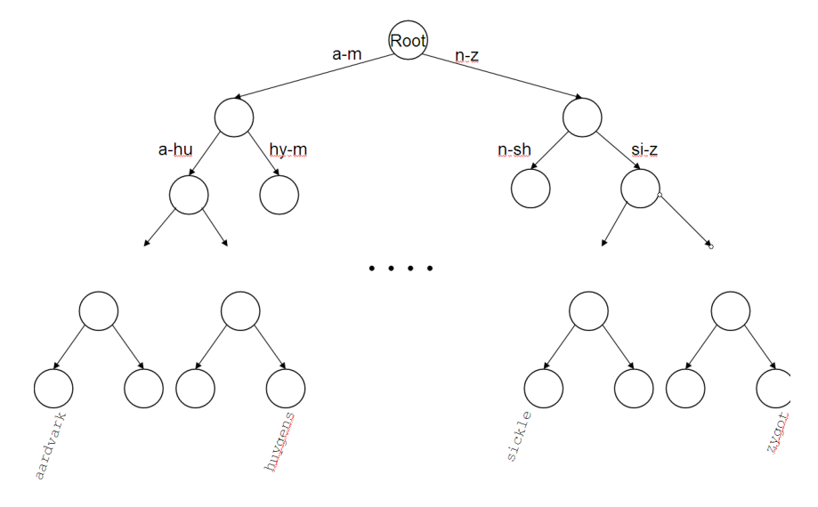
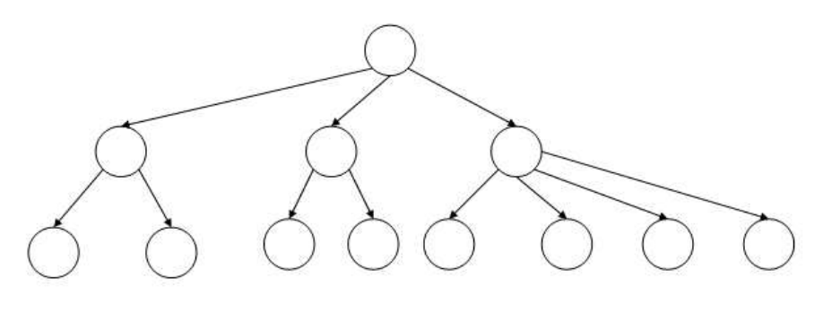
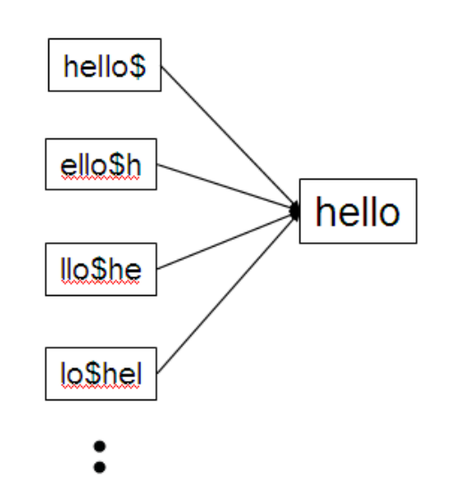
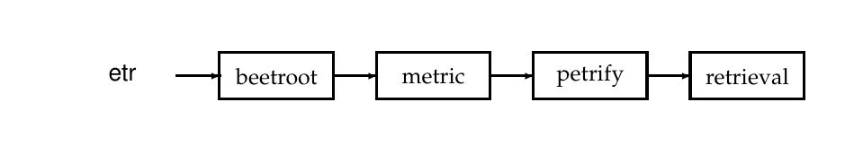
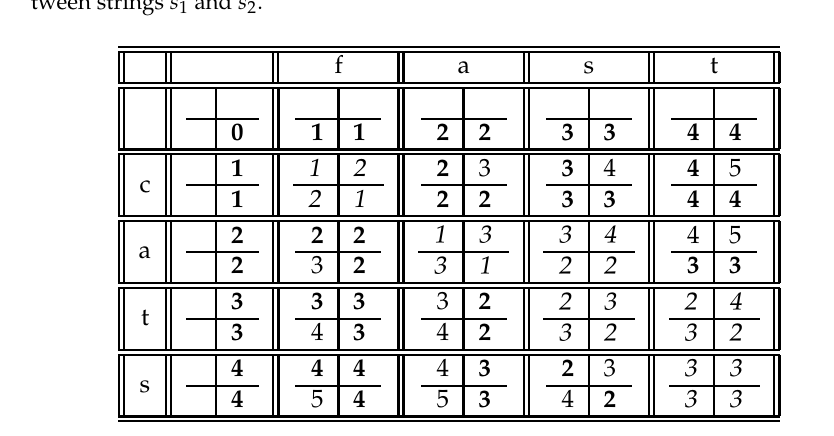
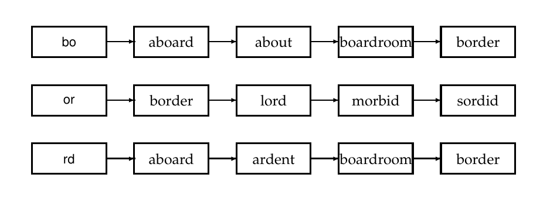

# 第 3 章 词典与容错检索

[返回系列目录](../introduction-to-information-retrieval.md) · [上一篇：第 2 章 词项词汇表与倒排记录表](./02-term-vocabulary-and-postings-lists.md) · [下一篇：第 4 章 索引构建](./04-index-construction.md)

原书印刷页 49–66；PDF 第 86–103 页。

<!-- source: PDF 86; printed: 49 -->

在第 1 章和第 2 章中，我们探讨了用于处理布尔查询和邻近查询的倒排索引的基本思想。在这里，我们将开发对查询中的拼写错误以及替代拼写具有鲁棒性的技术。

在第 3.1 节中，我们将开发有助于在倒排索引的词汇表中搜索词项的数据结构。在第 3.2 节中，我们研究通配符查询（wildcard query）的思想：例如 `*a*e*i*o*u*` 这样的查询，它寻找包含按顺序包含所有五个元音字母的任何词项的文档。`*` 符号表示任何（可能为空的）字符串。当用户不确定如何拼写查询词项，或者寻找包含查询词项变体的文档时，他们会向搜索引擎提出此类查询；例如，查询 `automat*` 将寻找包含 `automatic`、`automation` 和 `automated` 中任何一个词项的文档。

然后我们转向其他形式的不精确查询，重点关注第 3.3 节中的拼写错误。用户犯拼写错误可能是偶然的，也可能是因为他们正在搜索的词项（例如，Herman）在文档集中没有明确的拼写。我们详细介绍了几种纠正查询中拼写错误的技术，包括一次纠正一个词项以及纠正整个查询词项字符串。最后，在第 3.4 节中，我们研究一种寻找在语音上与查询词项相近的词汇表词项的方法。这在像 Herman 这样的例子中特别有用，因为用户可能不知道专有名词在文档集中的文档里是如何拼写的。

因为我们将在本章中开发倒排索引的许多变体，所以我们有时会使用“标准倒排索引”（standard inverted index）一词来指代在第 1 章和第 2 章中开发的倒排索引，其中每个词汇表词项都有一个包含文档集中文档的倒排记录表。

## 3.1 词典的搜索结构

给定一个倒排索引和一个查询，我们的首要任务是确定每个查询词项是否存在于词汇表中，如果存在，则识别指向

<!-- source: PDF 87; printed: 50 -->

相应倒排记录的指针。这种词汇表查找操作使用一种称为词典（dictionary）的经典数据结构，并且有两大类解决方案：哈希（hashing）和搜索树（search trees）。在数据结构的文献中，词汇表中的条目（在我们的例子中是词项）通常被称为键（keys）。解决方案（哈希或搜索树）的选择取决于许多问题：（1）我们可能有多少个键？（2）这个数量是可能保持静态，还是会发生很大变化——在发生变化的情况下，我们是可能只有新键插入，还是也会有一些词典中的键被删除？（3）访问各种键的相对频率是多少？

哈希已被用于一些搜索引擎的词典查找。每个词汇表词项（键）被哈希成一个足够大空间上的整数，使得哈希冲突不太可能发生；如果发生冲突，则通过需要小心维护的辅助结构来解决。<sup>[1]</sup> 在查询时，我们分别对每个查询词项进行哈希，并遵循指向相应倒排记录的指针，同时考虑任何解决哈希冲突的逻辑。没有简单的方法可以找到查询词项的微小变体（例如像 `resume` 这样的单词的带重音和不带重音的版本），因为这些可能会被哈希成非常不同的整数。特别是，我们无法寻找（例如）所有以 `automat` 为前缀的词项，这是我们在下面第 3.2 节中需要的操作。最后，在词汇表大小不断增长的环境（如 Web）中，为当前需求设计的哈希函数在几年后可能就不够用了。

搜索树克服了其中的许多问题——例如，它们允许我们枚举所有以 `automat` 开头的词汇表词项。最著名的搜索树是二叉树（binary tree），其中每个内部节点有两个子节点。词项的搜索从树的根节点开始。每个内部节点（包括根节点）代表一个二元测试，根据测试结果，搜索将进入该节点下方的两个子树之一。图 3.1 给出了用于词典的二叉搜索树的示例。高效的搜索（比较次数为 $O(\log M)$）取决于树是否平衡：任何节点下两个子树的词项数量要么相等，要么相差一。这里的主要问题是重新平衡（rebalancing）：当词项被插入二叉搜索树或从二叉搜索树中删除时，需要对其进行重新平衡，以保持平衡属性。

为了减轻重新平衡的负担，一种方法是允许内部节点下的子树数量在一个固定的区间内变化。常用于词典的搜索树是 B树（B-tree）——一种搜索树，其中每个内部节点有数量在区间 $[a, b]$ 内的子节点，其中 $a$ 和 $b$ 是适当的正整数；图 3.2 显示了一个 $a = 2$ 且 $b = 4$ 的示例。内部节点下的每个分支再次代表对一系列字

> **脚注 1（原书第 50 页）**：所谓的完美哈希函数旨在防止冲突，但在实现和计算上都相当复杂。

<!-- source: PDF 88; printed: 51 -->


**图 3.1** 一棵二叉搜索树。在这个例子中，根节点处的分支将词汇表词项划分为两棵子树，一棵是首字母在 a 和 m 之间的词项，另一棵是其余的词项。
图中文字：Root（根节点）；a-m、n-z、a-hu、hy-m、n-sh、si-z 为字符顺序区间；aardvark（土豚）、huygens（惠更斯）、sickle（镰刀）、zygote（合子）为示例词项。

符序列的测试，如图 3.1 的二叉树示例所示。B树可以被视为将二叉树的多个层级“折叠”成一层；当词典的一部分驻留在磁盘上时，这尤其有利，在这种情况下，这种折叠起到了预取即将进行的二元测试的作用。在这些情况下，整数 $a$ 和 $b$ 由磁盘块的大小决定。第 3.5 节包含了关于搜索树和 B树的进一步背景知识的指针。

需要注意的是，与哈希不同，搜索树要求文档集中使用的字符具有规定的顺序；例如，英文字母表的 26 个字母总是按 A 到 Z 的特定顺序排列。一些亚洲语言（如中文）并不总是有唯一的排序，尽管现在所有语言（包括中文和日文）都为其字符集采用了标准的排序系统。

## 3.2 通配符查询

通配符查询用于以下任何情况：（1）用户不确定查询词项的拼写（例如，`Sydney` 与 `Sidney`，这

<!-- source: PDF 89; printed: 52 -->


**图 3.2** 一棵 B树。在这个例子中，每个内部节点有 2 到 4 个子节点。

导致通配符查询 `S*dney`）；（2）用户知道一个词项的多种拼写变体，并（有意识地）寻找包含任何变体的文档（例如，`color` 与 `colour`）；（3）用户寻找会被词干提取（stemming）捕获的词项变体，但不确定搜索引擎是否执行词干提取（例如，`judicial` 与 `judiciary`，导致通配符查询 `judicia*`）；（4）用户不确定外来词或短语的正确拼写（例如，查询 `Universit* Stuttgart`）。

像 `mon*` 这样的查询被称为尾部通配符查询（trailing wildcard query），因为 `*` 符号只出现一次，在搜索字符串的末尾。词典上的搜索树是处理尾部通配符查询的便捷方式：我们沿着树依次跟随符号 `m`、`o` 和 `n` 向下遍历，此时我们可以枚举词典中以 `mon` 为前缀的词项集合 $W$。最后，我们在标准倒排索引上使用 $|W|$ 次查找来检索包含 $W$ 中任何词项的所有文档。

但是，如果 `*` 符号不局限于搜索字符串末尾的通配符查询该怎么办呢？在处理这种一般情况之前，我们先提到尾部通配符查询的一个轻微泛化。首先，考虑头部通配符查询（leading wildcard queries），即形式为 `*mon` 的查询。考虑词典上的一棵逆向 B树（reverse B-tree）——其中 B树的每条从根到叶子的路径对应于词典中反向书写的一个词项：因此，词项 `lemon` 在 B树中将由路径 `root-n-o-m-e-l` 表示。沿着逆向 B树向下遍历，就可以枚举词汇表中具有给定后缀的所有词项 $R$。

事实上，结合使用常规 B树和逆向 B树，我们可以处理更一般的情况：包含单个 `*` 符号的通配符查询，例如 `se*mon`。为此，我们使用常规 B树来枚举以 `se` 为前缀的词典词项集合 $W$，然后使用逆向 B树来

<!-- source: PDF 90; printed: 53 -->

枚举以 `mon` 为后缀的词项集合 $R$。接下来，我们将这两个集合求交集 $W \cap R$，得到以 `se` 为前缀且以 `mon` 为后缀的词项集合。最后，我们使用标准的倒排索引（inverted index）来检索包含该交集中任意词项的所有文档。因此，我们可以使用两棵 B 树（一棵常规 B 树和一棵反向 B 树）来处理包含单个 `*` 符号的通配符查询。

### 3.2.1 一般的通配符查询

我们现在研究两种处理一般通配符查询的技术。这两种技术有一个共同的策略：将给定的通配符查询 $q_w$ 表示为在特殊构建的索引上的布尔查询（Boolean query）$Q$，使得 $Q$ 的答案是匹配 $q_w$ 的词汇表（vocabulary）词项集合的超集。然后，我们将 $Q$ 答案中的每个词项与 $q_w$ 进行核对，丢弃那些不匹配 $q_w$ 的词汇表词项。此时，我们就得到了匹配 $q_w$ 的词汇表词项，并可以求助于标准的倒排索引。

**轮排索引**

我们用于一般通配符查询的第一个特殊索引是轮排索引（permuterm index），它是倒排索引的一种形式。首先，我们在字符集中引入一个特殊符号 `$`，用来标记词项的结束。因此，词项 `hello` 在这里表示为扩充词项 `hello$`。接下来，我们构建一个轮排索引，其中每个词项（用 `$` 扩充后）的各种旋转（rotations）都指向原始的词汇表词项。图 3.3 给出了词项 `hello` 的这样一个轮排索引条目的示例。

我们将轮排索引中旋转后的词项集合称为轮排词汇表（permuterm vocabulary）。

这个索引如何帮助我们处理通配符查询呢？考虑通配符查询 `m*n`。关键在于旋转这样一个通配符查询，使得 `*` 符号出现在字符串的末尾——因此旋转后的通配符查询变成了 `n$m*`。接下来，我们在轮排索引中查找这个字符串，其中寻找 `n$m*`（通过搜索树）会导向词项 `man` 和 `moron` 等的旋转形式。

既然轮排索引使我们能够识别出匹配通配符查询的原始词汇表词项，我们就可以在标准的倒排索引中查找这些词项以检索匹配的文档。因此，我们可以处理任何带有单个 `*` 符号的通配符查询。但是像 `fi*mo*er` 这样的查询怎么办呢？在这种情况下，我们首先枚举字典中位于 `er$fi*` 的轮排索引中的词项。并非所有这样的字典词项中间都会有字符串 `mo` —— 我们通过穷举枚举来过滤掉它们，检查每个候选词项看它是否包含 `mo`。在这个例子中，词项 `fishmonger`（鱼贩）能在过滤中保留下来，而 `filibuster`（阻挠议事）则不能。然后我们

<!-- source: PDF 91; printed: 54 -->


**图 3.3** 轮排索引的一部分。
图中文字：hello$, ello$h, llo$he, lo$hel, hello

将保留下来的词项输入标准的倒排索引中进行文档检索。轮排索引的一个缺点是其词典会变得相当大，因为它包含了每个词项的所有旋转形式。

请注意上述 B 树和轮排索引之间的密切相互作用。实际上，这表明该结构也许应该被视为一棵轮排 B 树（permuterm B-tree）。然而，我们在描述轮排索引时遵循传统术语，将其与允许我们选择具有给定前缀的旋转形式的 B 树区分开来。

### 3.2.2 用于通配符查询的 k-gram 索引

虽然轮排索引很简单，但它会导致每个词项的旋转数量大幅膨胀；对于英语词项词典来说，这可能意味着空间增加近十倍。我们现在介绍第二种处理通配符查询的技术，称为 k-gram 索引（k-gram index）。我们还将在第 3.3.4 节中使用 k-gram 索引。k-gram 是 $k$ 个字符的序列。因此，`cas`、`ast` 和 `stl` 都是出现在词项 `castle`（城堡）中的 3-gram。我们使用特殊字符 `$` 来表示词项的开头或结尾，因此为 `castle` 生成的完整 3-gram 集合是：`$ca`、`cas`、`ast`、`stl`、`tle`、`le$`。

在 k-gram 索引中，词典包含出现在词汇表任意词项中的所有 k-gram。每个倒排记录表（postings list）从一个 k-gram 指向所有包含该 k-gram 的词汇表

<!-- source: PDF 92; printed: 55 -->


**图 3.4** 3-gram 索引中倒排记录表的示例。这里展示了 3-gram `etr`。匹配的词汇表词项在倒排记录中按字典序排列。
图中文字：etr, beetroot, metric, petrify, retrieval

词项。例如，3-gram `etr` 将指向诸如 `metric` 和 `retrieval` 等词汇表词项。图 3.4 给出了一个示例。

这样的索引如何帮助我们处理通配符查询呢？考虑通配符查询 `re*ve`。我们正在寻找包含以 `re` 开头且以 `ve` 结尾的任意词项的文档。因此，我们运行布尔查询 `$re` AND `ve$`。这在 3-gram 索引中进行查找，并产生一个匹配词项的列表，如 `relive`、`remove` 和 `retrieve`。然后，在标准的倒排索引中查找这些匹配词项中的每一个，以产生匹配查询的文档。

然而，使用 k-gram 索引存在一个困难，需要进一步的处理步骤。考虑对查询 `red*` 使用上述 3-gram 索引。按照上述过程，我们首先向 3-gram 索引发出布尔查询 `$re` AND `red`。这会导致匹配到诸如 `retired` 这样的词项，它包含两个 3-gram `$re` 和 `red` 的合取，但并不匹配原始的通配符查询 `red*`。

为了应对这个问题，我们引入了一个后过滤（post-filtering）步骤，在该步骤中，将 3-gram 索引上布尔查询枚举出的词项与原始查询 `red*` 逐一进行核对。这是一个简单的字符串匹配操作，可以剔除像 `retired` 这样不匹配原始查询的词项。保留下来的词项然后像往常一样在标准的倒排索引中进行搜索。

我们已经看到，一个通配符查询可能会导致枚举出多个词项，其中每个词项都成为标准倒排索引上的单词项查询。搜索引擎确实允许使用布尔运算符组合通配符查询，例如，`re*d` AND `fe*ri`。这种查询的合适语义是什么？由于每个通配符查询都会变成单词项查询的析取（disjunction），这个例子的合适解释是我们有一个析取的合取（conjunction of disjunctions）：我们寻找包含任何匹配 `re*d` 的词项以及任何匹配 `fe*ri` 的词项的所有文档。

即使没有通配符查询的布尔组合，处理通配符查询也可能相当昂贵，因为在特殊索引中增加了查找、过滤，最后还要查找标准倒排索引。搜索引擎可能支持如此丰富的功能，但最常见的是，该功能隐藏在一个大多数

<!-- source: PDF 93; printed: 56 -->

用户从不使用的界面（比如“高级查询”界面）后面。在搜索界面中暴露这种功能通常会鼓励用户即使在不需要时也调用它（例如，通过输入查询的前缀后跟一个 `*`），从而增加了搜索引擎的处理负载。

**练习 3.1**
在轮排索引中，每个轮排词汇表词项都指向派生出它的原始词汇表词项。一个轮排词汇表词项的倒排记录表中可以有多少个原始词汇表词项？

**练习 3.2**
写出由词项 `mama` 生成的轮排索引词典中的条目。

**练习 3.3**
如果你想在轮排通配符索引中搜索 `s*ng`，应该在什么键上进行查找？

**练习 3.4**
参考图 3.4；标题中指出倒排记录中的词汇表词项是按字典序排列的。为什么这种排序是有用的？

**练习 3.5**
再次考虑第 3.2.1 节中的查询 `fi*mo*er`。对于这个查询，会在 bigram（2-gram）索引上生成什么布尔查询？你能想出一个匹配第 3.2.1 节中轮排查询但不满足这个布尔查询的词项吗？

**练习 3.6**
给出一个句子的例子，如果搜索仅仅使用 bigram 的合取，该句子会错误地匹配通配符查询 `mon*h`。

## 3.3 拼写纠错

接下来我们探讨纠正查询中拼写错误的问题。例如，当用户输入查询 `carot` 时，我们可能希望检索包含词项 `carrot`（胡萝卜）的文档。Google 报告（http://www.google.com/jobs/britney.html）称，以下内容均被视为查询 `britney spears` 的拼写错误：`britian spears`、`britney's spears`、`brandy spears` 和 `prittany spears`。我们分两步来解决这个问题：第一步基于编辑距离（edit distance），第二步基于 k-gram 重叠度（k-gram overlap）。在深入探讨这些方法的算法细节之前，我们首先回顾一下搜索引擎如何将拼写纠错作为用户体验的一部分来提供。

<!-- source: PDF 94; printed: 57 -->

## 3.3 Spelling correction

### 3.3.1 Implementing spelling correction

大多数拼写纠错算法都基于两个基本原则。

1. 对于拼写错误的查询的各种备选正确拼写，选择“最近”的一个。这要求我们在两个查询之间有一个距离或邻近度（proximity）的概念。我们将在第 3.3.3 节中探讨这些邻近度度量。
2. 当两个拼写正确的查询打平（或几乎打平）时，选择更常见的一个。例如，grunt 和 grant 似乎都同样有可能是 grnt 的纠错结果。那么，算法应该选择 grunt 和 grant 中更常见的一个作为纠错结果。关于更常见的最简单概念是考虑词项在文档集中的出现次数；因此，如果 grunt 出现的次数比 grant 多，它就会成为被选中的纠错结果。许多搜索引擎（尤其是 Web 搜索引擎）采用了另一种更常见的概念。其思想是使用在其他用户输入的查询中最常见的纠错结果。这里的想法是，如果 grunt 作为查询被输入的次数比 grant 多，那么输入 grnt 的用户更有可能是想输入查询 grunt。

从第 3.3.3 节开始，我们将描述查询之间邻近度的概念，以及它们的高效计算方法。拼写纠错算法建立在这些邻近度计算的基础之上；然后，它们的功能会通过以下几种方式之一呈现给用户：

1. 对于查询 carot，总是检索包含 carot 以及 carot 的任何“拼写纠错”版本（包括 carrot 和 tarot）的文档。
2. 同上述（1），但仅当查询词项 carot 不在词典中时才这样做。
3. 同上述（1），但仅当原始查询返回的文档数量少于预设数量（例如少于五篇文档）时才这样做。
4. 当原始查询返回的文档数量少于预设数量时，搜索界面向最终用户提供拼写建议：该建议由拼写纠错后的查询词项组成。因此，搜索引擎可能会向用户回复：“您是不是要找 carrot？”

### 3.3.2 Forms of spelling correction

我们重点关注两种特定形式的拼写纠错，我们称之为孤立词项纠错（isolated-term correction）和上下文敏感纠错（context-sensitive correction）。在孤立词项纠错中，我们试图一次纠正一个查询词项——即使在

<!-- source: PDF 95; printed: 58 -->

我们面对的是一个多词项查询时也是如此。carot 的例子展示了这种类型的纠错。这种孤立词项纠错将无法检测出（例如）查询 flew form Heathrow（从希思罗机场起飞，form 为 from 的误拼）包含了词项 from 的拼写错误——因为查询中的每个词项在孤立状态下拼写都是正确的。

我们首先考察两种解决孤立词项纠错的技术：编辑距离和 k-gram 重合度。然后我们继续讨论上下文敏感纠错。

### 3.3.3 Edit distance

<br>

**EDIT DISTANCE**

给定两个字符串 $s_1$ 和 $s_2$，它们之间的编辑距离（edit distance）是将 $s_1$ 转换为 $s_2$ 所需的最少编辑操作次数。最常见的是，为此允许的编辑操作包括：(i) 在字符串中插入一个字符；(ii) 从字符串中删除一个字符；以及 (iii) 将字符串中的一个字符替换为另一个字符；对于这些操作，编辑距离有时被称为 Levenshtein 距离（Levenshtein distance）。例如，cat 和 dog 之间的编辑距离是 3。事实上，编辑距离的概念可以推广为允许对不同种类的编辑操作赋予不同的权重，例如，将字符 s 替换为字符 p 的权重可能高于将其替换为字符 a 的权重（后者在键盘上离 s 更近）。根据字母相互替换的可能性以这种方式设置权重在实践中非常有效（关于语音相似性的独立问题，请参见第 3.4 节）。然而，我们在此处剩余的讨论将集中在所有编辑操作具有相同权重的情况。

<br>

**LEVENSHTEIN DISTANCE**

众所周知，如何在 $O(|s_1| \times |s_2|)$ 的时间内计算两个字符串之间的（加权）编辑距离，其中 $|s_i|$ 表示字符串 $s_i$ 的长度。其思想是使用图 3.5 中的动态规划算法，其中 $s_1$ 和 $s_2$ 中的字符以数组形式给出。该算法填充矩阵 $m$ 中的（整数）项，该矩阵的两个维度等于正在计算编辑距离的两个字符串的长度；矩阵的 $(i, j)$ 项将保存（在算法执行后）由 $s_1$ 的前 $i$ 个字符和 $s_2$ 的前 $j$ 个字符组成的字符串之间的编辑距离。核心的动态规划步骤描绘在图 3.5 的第 8-10 行中，其中取最小值的三个量分别对应于在 $s_1$ 中替换一个字符、在 $s_1$ 中插入一个字符以及在 $s_2$ 中插入一个字符。

图 3.6 展示了图 3.5 中 Levenshtein 距离计算的一个示例。典型的单元格 $[i, j]$ 有四个项，格式化为 $2 \times 2$ 的单元格。每个单元格右下角的项是其他三个项的最小值，对应于图 3.5 中的主要动态规划步骤。其他三个项是 $m[i - 1, j - 1] + 0$ 或 $1$（取决于 $s_1[i]$ 是否等于

<!-- source: PDF 96; printed: 59 -->

```text
EDITDISTANCE(s1, s2)
 1 int m[i, j] = 0
 2 for i ← 1 to |s1|
 3 do m[i, 0] = i
 4 for j ← 1 to |s2|
 5 do m[0, j] = j
 6 for i ← 1 to |s1|
 7 do for j ← 1 to |s2|
 8    do m[i, j] = min{m[i - 1, j - 1] + if (s1[i] = s2[j]) then 0 else 1 fi,
 9                     m[i - 1, j] + 1,
10                     m[i, j - 1] + 1}
11 return m[|s1|, |s2|]
```

**图 3.5** 计算字符串 $s_1$ 和 $s_2$ 之间编辑距离的动态规划算法。



**图 3.6** Levenshtein 距离计算示例。表中 $[i, j]$ 项的 $2 \times 2$ 单元格显示了三个数字，它们的最小值即为第四个数字。斜体数字所在的单元格决定了本例中的编辑距离。

图中文字：f, a, s, t, c, a, t, s

$s_2[j]$）、$m[i - 1, j] + 1$ 和 $m[i, j - 1] + 1$。带有斜体数字的单元格描绘了我们确定 Levenshtein 距离的路径。

然而，拼写纠错问题要求的不仅仅是计算编辑距离：给定一个字符串集合 $S$（对应于词汇表中的词项）和一个查询字符串 $q$，我们在 $V$ 中寻找与 $q$ 编辑距离最小的字符串。我们可以将其视为一个解码问题，其中码字（$V$ 中的字符串）是预先规定好的。显而易见的做法是计算从 $q$ 到 $V$ 中每个字符串的编辑距离，然后再选择

<!-- source: PDF 97; printed: 60 -->

编辑距离最小的字符串。这种穷举搜索的代价极其高昂。因此，在实践中使用了许多启发式方法来高效地检索可能与查询词项具有较小编辑距离的词汇表词项。

最简单的此类启发式方法是将搜索限制在与查询字符串以相同字母开头的词典词项中；其期望是拼写错误不会发生在查询的第一个字符上。这种启发式方法的一个更复杂的变体是使用轮排索引（permuterm index）的一个版本，其中我们省略词尾符号 $\$ $。考虑查询字符串 $q$ 的所有旋转（rotation）的集合。对于该集合中的每个旋转 $r$，我们遍历 B 树进入轮排索引，从而检索出所有具有以 $r$ 开头的旋转的词典词项。例如，如果 $q$ 是 mase，并且我们考虑旋转 $r =$ sema，我们将检索出诸如 semantic 和 semaphore 之类的词典词项，它们与 $q$ 的编辑距离并不小。不幸的是，我们会错过更相关的词典词项，如 mare 和 mane。为了解决这个问题，我们改进了这种旋转方案：对于每个旋转，在执行 B 树遍历之前，我们省略长度为 $\ell$ 个字符的后缀。这确保了从词典中检索到的词项集合 $R$ 中的每个词项都包含一个与 $q$ 相同的“长”子串。$\ell$ 的值可以取决于 $q$ 的长度。或者，我们可以将其设置为一个固定的常数，例如 2。

### 3.3.4 k-gram indexes for spelling correction

为了进一步限制我们计算与查询词项编辑距离的词汇表词项集合，我们现在展示如何调用第 3.2.2 节（原书第 54 页）的 k-gram 索引来辅助检索与查询 $q$ 具有较小编辑距离的词汇表词项。一旦我们检索到这些词项，我们就可以从中找出与 $q$ 编辑距离最小的词项。

事实上，我们将使用 k-gram 索引来检索与查询有许多共同 k-gram 的词汇表词项。我们将证明，对于“许多共同 k-gram”的合理定义，检索过程本质上就是对查询字符串 $q$ 中 k-gram 的倒排记录进行一次单遍扫描。

图 3.7 中的 2-gram（或 bigram）索引显示了查询 bord 中三个 bigram 的倒排记录（的一部分）。假设我们想要检索包含这三个 bigram 中至少两个的词汇表词项。对倒排记录进行一次单遍扫描（很大程度上如同第 1 章中那样）将使我们能够枚举所有此类词项；在图 3.7 的例子中，我们将枚举出 aboard、boardroom 和 border。

这种对倒排记录线性扫描求交集的直接应用，立即暴露了简单要求匹配的词汇表词项包含固定数量的查询 $q$ 的 k-gram 的缺点：像 boardroom 这样对 bord 来说不太合理的“纠错”也被枚举出来了。因此，

<!-- source: PDF 98; printed: 61 -->

因此，我们需要更细致的指标来衡量词汇表词项与 $q$ 之间 $k$-gram 的重合度。当重合度指标是用于衡量两个集合 $A$ 和 $B$ 之间重合度的 **Jaccard 系数**（Jaccard coefficient，定义为 $|A \cap B|/|A \cup B|$）时，可以对线性扫描求交算法进行改编。我们考虑的两个集合分别是查询 $q$ 中的 $k$-gram 集合，以及词汇表词项中的 $k$-gram 集合。随着扫描的进行，我们从一个词汇表词项 $t$ 处理到下一个，动态计算 $q$ 和 $t$ 之间的 Jaccard 系数。如果该系数超过预设阈值，我们将 $t$ 添加到输出中；如果没有，我们继续处理倒排记录中的下一个词项。为了计算 Jaccard 系数，我们需要 $q$ 和 $t$ 中的 $k$-gram 集合。


**图 3.7** 匹配查询 bord 中的三个 2-gram 中的至少两个。
图中文字：bo, aboard, about, boardroom, border, or, border, lord, morbid, sordid, rd, aboard, ardent, boardroom, border

由于我们正在扫描 $q$ 中所有 $k$-gram 的倒排记录，我们手头已经有了这些 $k$-gram。那么 $t$ 的 $k$-gram 呢？原则上，我们可以从 $t$ 中动态枚举它们；但在实践中，这不仅速度慢，而且可能不可行，因为倒排记录条目本身很可能不包含完整的字符串 $t$，而是 $t$ 的某种编码。关键的观察在于，为了计算 Jaccard 系数，我们只需要字符串 $t$ 的长度。为了理解这一点，回顾图 3.7 的例子，并考虑当针对查询 $q = \text{bord}$ 的倒排记录扫描到达词项 $t = \text{boardroom}$ 时的情形。我们知道有两个 2-gram 匹配。如果倒排记录存储了 boardroom 中（预先计算好的）2-gram 的数量（即 8），我们就拥有了计算 Jaccard 系数所需的所有信息，其值为 $2/(8 + 3 - 2)$；分子来自倒排记录命中的数量（2，来自 bo 和 rd），而分母是 bord 和 boardroom 中 2-gram 数量的总和，减去倒排记录命中的数量。

我们可以将 Jaccard 系数替换为其他允许在倒排记录扫描期间进行高效动态计算的指标。我们如何使用这些

<!-- source: PDF 99; printed: 62 -->

指标来进行拼写纠错呢？一种有一些经验支持的方法是，首先使用 $k$-gram 索引枚举一组候选词汇表词项，这些词项是 $q$ 的潜在纠错结果。然后，我们计算从 $q$ 到该集合中每个词项的编辑距离，从集合中选择与 $q$ 编辑距离较小的词项。

### 3.3.5 上下文敏感的拼写纠错

孤立词项纠错无法纠正诸如 flew form Heathrow（从希思罗机场起飞，原意应为 flew from Heathrow）这样的拼写错误，因为这三个查询词项的拼写都是正确的。当这样的短语检索到的文档很少时，搜索引擎可能希望提供纠正后的查询 flew from Heathrow。实现这一点的最简单方法是枚举这三个查询词项中每一个的纠错结果（使用第 3.3.4 节之前介绍的方法），即使每个查询词项的拼写都是正确的，然后尝试在短语中替换每个纠错结果。对于 flew form Heathrow 这个例子，我们枚举诸如 fled form Heathrow 和 flew fore Heathrow 这样的短语。对于每个这样的替换短语，搜索引擎运行查询并确定匹配结果的数量。

如果我们找到单个词项的许多纠错结果，这种枚举可能会非常昂贵，因为我们可能会遇到大量备选方案的组合。通常使用几种启发式方法来裁剪这个空间。在上面的例子中，当我们扩展 flew 和 form 的备选方案时，我们只保留在文档集或查询日志（包含用户以前的查询）中最频繁出现的组合。例如，我们会保留 flew from 作为备选方案来尝试并扩展为三词项的纠错查询，但可能不会保留 fled fore 或 flea form。在这个例子中，与双词（biword）flew from 相比，双词 fled fore 可能很罕见。然后，我们只尝试将排名靠前的双词列表（如 flew from）扩展到 Heathrow 的纠错结果。作为使用文档集中双词统计信息的替代方案，我们可以使用用户发出的查询日志；当然，这些日志可能包含带有拼写错误的查询。

**练习 3.7**
如果 $|s_i|$ 表示字符串 $s_i$ 的长度，证明 $s_1$ 和 $s_2$ 之间的编辑距离永远不会超过 $\max\{|s_1|, |s_2|\}$。

**练习 3.8**
计算 paris 和 alice 之间的编辑距离。写出由图 3.5 中的算法计算出的所有前缀之间距离的 $5 \times 5$ 数组。

**练习 3.9**
编写伪代码，展示在扫描 $k$-gram 索引的倒排记录时动态计算 Jaccard 系数的细节，如第 61 页所述。

**练习 3.10**
计算查询 bord 与图 3.7 中包含 2-gram or 的每个词项之间的 Jaccard 系数。

<!-- source: PDF 100; printed: 63 -->

**练习 3.11**
考虑四词项查询 catched in the rye（在麦田里被抓住，原意应为 catcher in the rye），并假设每个查询词项都有五个由孤立词项纠错建议的备选词项。如果我们不裁剪纠错短语的空间，而是为每个词项尝试所有六个变体，我们必须考虑多少个可能的纠错短语？

**练习 3.12**
对于查询的每个前缀——catched、catched in 和 catched in the——我们都有许多由每个词项及其备选词项产生的替换前缀。假设我们只保留这些替换前缀中排名前 10 的（通过其在文档集中的出现次数来衡量）。我们将其余的从扩展为更长前缀的考虑中剔除：因此，如果 batched in 不是文档集中最常见的 10 个双词项查询之一，我们就不考虑将 batched in 的任何扩展作为 catched in the rye 的可能纠错结果。在每个阶段，我们剔除了多少个可能的替换前缀？

**练习 3.13**
我们能否保证仅保留并扩展 catched in 的 10 个最常见的替换前缀，就一定会得到 catched in the 的 10 个最常见的替换前缀之一？

## 3.4 语音纠错

我们最后一种容错检索技术与语音纠错（phonetic correction）有关：由于用户输入的查询听起来像目标词项而产生的拼写错误。此类算法特别适用于人名搜索。这里的主要思想是为每个词项生成一个“语音哈希（phonetic hash）”，使得发音相似的词项哈希到相同的值。这个想法起源于 20 世纪初国际警察部门的工作，旨在匹配通缉犯的名字，尽管这些名字在不同国家的拼写不同。它主要用于纠正专有名词中的语音拼写错误。

用于这种语音哈希的算法通常统称为 **soundex** 算法。然而，存在一种原始的 soundex 算法及其各种变体，建立在以下方案之上：

1. 将每个要索引的词项转换为 4 个字符的简化形式。构建从这些简化形式到原始词项的倒排索引；称之为 soundex 索引。

2. 对查询词项执行相同的操作。

3. 当查询需要 soundex 匹配时，搜索此 soundex 索引。

不同 soundex 算法的差异在于将词项转换为 4 字符形式的方式。一种常用的转换会产生一个 4 字符代码，其中第一个字符是英文字母，其他三个是 0 到 9 之间的数字。

<!-- source: PDF 101; printed: 64 -->

1. 保留词项的第一个字母。

2. 将以下字母的所有出现替换为 '0'（零）：'A'、'E'、'I'、'O'、'U'、'H'、'W'、'Y'。

3. 按如下方式将字母转换为数字：
   B、F、P、V 转换为 1。
   C、G、J、K、Q、S、X、Z 转换为 2。
   D、T 转换为 3。
   L 转换为 4。
   M、N 转换为 5。
   R 转换为 6。

4. 重复移除每对连续相同数字中的一个。

5. 从结果字符串中移除所有零。在结果字符串末尾填充零，并返回前四个位置，这将由一个字母后跟三个数字组成。

作为 soundex 映射的示例，Hermann 映射为 H655。给定一个查询（例如 herman），我们计算其 soundex 代码，然后从 soundex 索引中检索与此 soundex 代码匹配的所有词汇表词项，然后再在标准倒排索引上运行生成的查询。

该算法基于几个观察结果：（1）在转录名字时，元音被视为可互换的；（2）发音相似的辅音（例如 D 和 T）被放入等价类中。这导致相关的名字通常具有相同的 soundex 代码。虽然这些规则在许多情况下（尤其是欧洲语言）有效，但此类规则往往依赖于书写系统。例如，中文名字可以用威妥玛拼音（Wade-Giles）或汉语拼音（Pinyin）转录。虽然 soundex 适用于这两种转录中的某些差异，例如将威妥玛拼音的 hs 和汉语拼音的 x 都映射为 2，但在其他情况下则会失败，例如威妥玛拼音的 j 和汉语拼音的 r 被映射为不同的值。

**练习 3.14**
找到两个拼写不同但 soundex 代码相同的专有名词。

**练习 3.15**
找到两个发音相似但 soundex 代码不同的专有名词。

<!-- source: PDF 102; printed: 65 -->

## 3.5 参考文献及进一步阅读

Knuth (1997) 是关于搜索树（search tree）信息的综合来源，其中包括 B 树（B-tree）及其在词典搜索中的应用。

Garfield (1976) 给出了轮排索引（permuterm index）最早的完整描述之一。Ferragina and Venturini (2007) 提出了一种解决轮排索引空间爆炸问题的方法。

拼写纠错最早的正式处理之一归功于 Damerau (1964)。我们所使用的编辑距离（edit distance）概念由 Levenshtein (1965) 提出，而图 3.5 中的算法则由 Wagner and Fischer (1974) 提出。Peterson (1980) 和 Kukich (1992) 开发了基于编辑距离的方法的变体，最终 Zobel and Dart (1995) 对几种方法进行了详细的实证研究，结果表明 $k$-gram 索引在寻找候选的不匹配词方面非常有效，但应与更细粒度的技术（如编辑距离）结合使用，以确定最可能的拼写错误。Gusfield (1997) 是关于字符串算法（如编辑距离）的标准参考文献。

用于拼写纠错的概率模型（“噪声通道”模型，noisy channel models）由 Kernighan et al. (1990) 首创，并由 Brill and Moore (2000) 以及 Toutanova and Moore (2002) 进一步发展。在这些模型中，拼写错误的查询被视为正确查询的概率性损坏。它们与第 12 章中介绍的语言模型（language model）方法具有相似的数学基础，并且还提供了结合语音相似度、键盘上的接近度以及来自用户实际拼写错误数据的方法。许多人将它们视为最先进（state-of-the-art）的方法。Cucerzan and Brill (2004) 展示了如何将这项工作扩展到基于搜索引擎日志中查询重构（query reformulation）来学习拼写纠错模型。

soundex 算法归功于 Margaret K. Odell 和 Robert C. Russelli（源自 1918 年和 1922 年授予的美国专利）；此处描述的版本借鉴了 Bourne and Ford (1961)。Zobel and Dart (1996) 评估了各种语音匹配算法，发现 soundex 算法的一种变体在一般拼写纠错中表现不佳，但其他基于词项发音的语音相似度的算法表现良好。

<!-- source: PDF 103; printed: 66 -->

<!-- 原书此页为空白，仅有重复的版本页脚。 -->

[返回系列目录](../introduction-to-information-retrieval.md) · [上一篇：第 2 章 词项词汇表与倒排记录表](./02-term-vocabulary-and-postings-lists.md) · [下一篇：第 4 章 索引构建](./04-index-construction.md)
