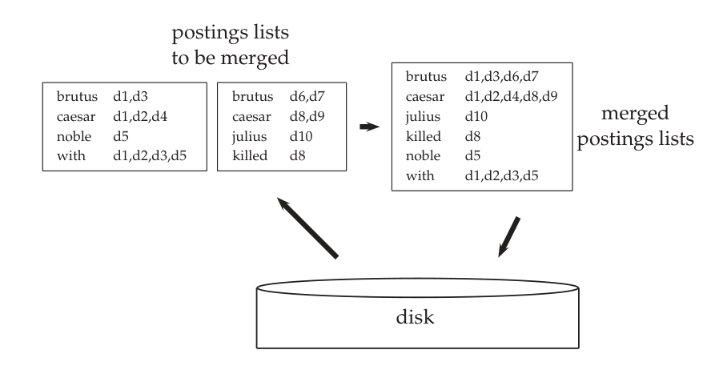
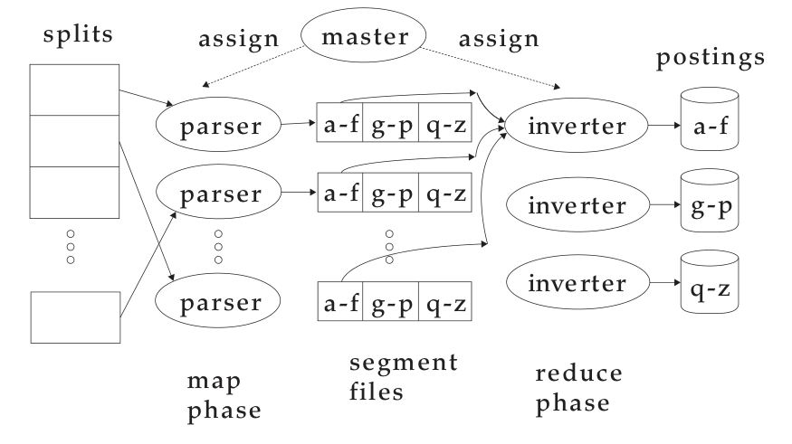
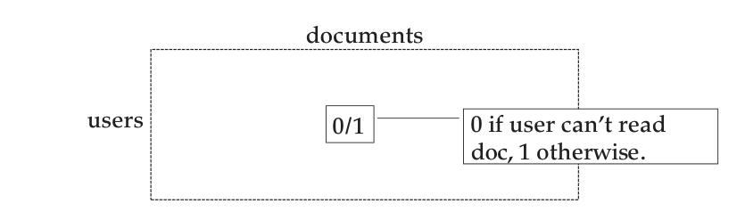

# 第 4 章 索引构建

[返回系列目录](../introduction-to-information-retrieval.md) · [上一篇：第 3 章 词典与容错检索](./03-dictionaries-and-tolerant-retrieval.md) · [下一篇：第 5 章 索引压缩](./05-index-compression.md)

原书印刷页 67–84；PDF 第 104–121 页。

<!-- source: PDF 104; printed: 67 -->

在本章中，我们将探讨如何构建倒排索引（inverted index）。我们将这一过程称为索引构建（index construction）或建立索引（indexing）；执行该过程的过程或机器称为索引器（indexer）。索引算法的设计受限于硬件约束。因此，我们在本章开头首先回顾与建立索引相关的计算机硬件基础知识。然后，我们介绍基于块的排序索引（blocked sort-based indexing，第 4.2 节），这是一种为静态文档集（static collections）设计的高效单机算法，可以看作是我们在第 1 章中介绍的基本基于排序的索引算法的更具可扩展性的版本。第 4.3 节描述了单遍内存索引（single-pass in-memory indexing），该算法具有更好的扩展特性，因为它不需要将词汇表（vocabulary）保存在内存中。对于像 Web 这样非常大的文档集，建立索引必须在包含成百上千台机器的计算机集群上分布式进行。我们在第 4.4 节中讨论这一点。频繁变化的文档集需要第 4.5 节中介绍的动态索引（dynamic indexing），以便文档集中的变化能立即反映在索引中。最后，我们在第 4.6 节中涵盖了建立索引时可能出现的一些复杂问题——例如安全性和用于排序检索的索引。

索引构建与在其他章中涵盖的几个主题相互关联。索引器需要原始文本，但文档有多种编码方式（见第 2 章）。索引器会对中间文件和最终索引进行压缩和解压缩（见第 5 章）。在 Web 搜索中，文档不在本地文件系统上，必须通过蜘蛛程序或爬虫抓取（见第 20 章）。在企业搜索中，大多数文档封装在各种内容管理系统、电子邮件应用程序和数据库中。我们在第 4.7 节中给出了一些示例。尽管大多数这些应用程序可以通过 http 访问，但原生应用程序编程接口（API）通常更高效。读者应该意识到，构建将原始文本提供给索引过程的子系统本身可能就是一个具有挑战性的问题。

<!-- source: PDF 105; printed: 68 -->

**表 4.1** 2007 年的典型系统参数。寻道时间是将磁盘磁头定位到新位置所需的时间。每字节传输时间是当磁头处于正确位置时从磁盘到内存的传输速率。

| 符号 (Symbol) | 统计量 (Statistic) | 值 (Value) |
|---|---|---|
| $s$ | 平均寻道时间 (average seek time) | $5\text{ ms} = 5 \times 10^{-3}\text{ s}$ |
| $b$ | 每字节传输时间 (transfer time per byte) | $0.02\ \mu\text{s} = 2 \times 10^{-8}\text{ s}$ |
| | 处理器时钟频率 (processor's clock rate) | $10^9\text{ s}^{-1}$ |
| $p$ | 底层操作 (lowlevel operation)<br>（例如，比较并交换一个字） | $0.01\ \mu\text{s} = 10^{-8}\text{ s}$ |
| | 主存大小 (size of main memory) | 几 GB (several GB) |
| | 磁盘空间大小 (size of disk space) | 1 TB 或更大 (1 TB or more) |

## 4.1 硬件基础

在构建信息检索（information retrieval, IR）系统时，许多决策都基于系统运行所在的计算机硬件的特性。因此，我们在本章开头简要回顾一下计算机硬件。2007 年典型系统的性能特征如表 4.1 所示。本书中用于激发 IR 系统设计灵感所需的硬件基础知识列表如下。

* 访问内存中的数据比访问磁盘上的数据快得多。访问内存中的一个字节需要几个时钟周期（大约 $5 \times 10^{-9}$ 秒），但从磁盘传输它需要长得多的时间（大约 $2 \times 10^{-8}$ 秒）。因此，我们希望尽可能多地将数据保存在内存中，特别是那些我们需要频繁访问的数据。我们将把频繁使用的磁盘数据保存在主存中的技术称为缓存（caching）。

* 在进行磁盘读写时，磁盘磁头移动到数据所在磁盘部分需要一段时间。这段时间称为寻道时间（seek time），对于典型磁盘，平均为 5 毫秒。在寻道期间没有数据传输。为了最大化数据传输率，将要一起读取的数据块因此应该连续地存储在磁盘上。例如，使用表 4.1 中的数字，如果 10 兆字节（MB）的数据作为一个块存储，从磁盘传输到内存可能只需 0.2 秒；但如果它被存储在 100 个不连续的块中，则最多需要 $0.2 + 100 \times (5 \times 10^{-3}) = 0.7$ 秒，因为我们需要将磁盘磁头移动多达 100 次。

* 操作系统通常读取和写入整个数据块。因此，从磁盘读取单个字节所花费的时间可能与读取整个数据块的时间一样多。

<!-- source: PDF 106; printed: 69 -->

8、16、32 和 64 千字节（KB）的块大小很常见。我们将主存中存储正在读取或写入的块的部分称为缓冲区（buffer）。

* 从磁盘到内存的数据传输由系统总线处理，而不是由处理器处理。这意味着在磁盘 I/O 期间，处理器可用于处理数据。我们可以利用这一事实，通过在磁盘上存储压缩数据来加快数据传输速度。假设有一种高效的解压缩算法，读取然后解压缩压缩数据的总时间通常少于读取未压缩数据的时间。

* IR 系统中使用的服务器通常具有几千兆字节（GB）的主存，有时甚至几十 GB。可用的磁盘空间要大几个数量级。

## 4.2 基于块的排序索引

构建非位置索引的基本步骤如图 1.4（第 8 页）所示。我们首先遍历一遍文档集，收集所有的词项-docID 对。然后，我们以词项为主键、docID 为次键对这些对进行排序。最后，我们将每个词项的 docID 组织成一个倒排记录表（postings list），并计算词项频率和文档频率等统计信息。对于小型文档集，所有这些都可以在内存中完成。在本章中，我们描述需要使用辅助存储的大型文档集的方法。

为了使索引构建更高效，我们将词项表示为 termID（而不是像图 1.4 中那样使用字符串），其中每个 termID 是一个唯一的序列号。我们可以在处理文档集时动态构建从词项到 termID 的映射；或者，在两遍（two-pass）方法中，我们在第一遍编译词汇表，在第二遍构建倒排索引。本章描述的索引构建算法都只对数据进行单遍（single pass）处理。第 4.7 节给出了在某些应用中（例如，当磁盘空间稀缺时）更受青睐的多遍算法的参考文献。

在本章中，我们使用 Reuters-RCV1 文档集作为我们的模型文档集，该文档集包含大约 1 GB 的文本。它由 1996 年 8 月 20 日至 1997 年 8 月 19 日的一年期间通过路透社新闻专线发送的大约 800,000 篇文档组成。图 4.1 显示了一个典型的文档，但请注意，在本书中我们忽略了图像等多媒体信息，只关注文本。Reuters-RCV1 涵盖了广泛的国际主题，包括政治、商业、体育和（如本例所示的）科学。该文档集的一些关键统计数据如表 4.2 所示。

<!-- source: PDF 107; printed: 70 -->

**表 4.2** Reuters-RCV1 的文档集统计数据。为了本书中的计算，数值已四舍五入。未舍入的数值为：806,791 篇文档，每篇文档 222 个词元，391,523 个（不同的）词项，包含空格和标点符号时每个词元 6.04 字节，不包含空格和标点符号时每个词元 4.5 字节，每个词项 7.5 字节，以及 96,969,056 个词元。此表中的数字对应于表 5.1（第 87 页）中的第三行（“大小写折叠”）。

| 符号 (Symbol) | 统计量 (Statistic) | 值 (Value) |
|---|---|---|
| $N$ | 文档数 (documents) | 800,000 |
| $L_{\text{ave}}$ | 每篇文档平均词元数 (avg. # tokens per document) | 200 |
| $M$ | 词项数 (terms) | 400,000 |
| | 每个词元平均字节数（含空格/标点） | 6 |
| | 每个词元平均字节数（不含空格/标点） | 4.5 |
| | 每个词项平均字节数 (avg. # bytes per term) | 7.5 |
| $T$ | 词元总数 (tokens) | 100,000,000 |


**图 4.1** 路透社新闻专线的文档。
**图中新闻译文**：标题为“极端天气形成罕见的南极云”。新闻发布于 2006 年 8 月 1 日美国东部时间凌晨 3:20。悉尼（路透社）——澳大利亚科学家周二表示，南极上空极端天气形成的罕见珍珠母色云层，可能是全球变暖的一种迹象。这种云被称为珠母云，呈现出纤细柔和的缤纷色彩；7 月 25 日，人们在澳大利亚莫森站气象基地上空拍摄到了这一壮观景象。界面路径为“首页 > 新闻 > 科学 > 文章”，操作包括通过电子邮件发送文章、打印、转载和调整字号；栏目包括美国、国际、商业、市场、政治、娱乐、科技、体育和奇闻。

图中文字：REUTERS, Extreme conditions create rare Antarctic clouds, You are here: Home > News > Science > Article, Go to a Section: U.S. International Business Markets Politics Entertainment Technology Sports Oddly Enough, Tue Aug 1, 2006 3:20am ET, Email This Article | Print This Article | Reprints, SYDNEY (Reuters) - Rare, mother-of-pearl colored clouds caused by extreme weather conditions above Antarctica are a possible indication of global warming, Australian scientists said on Tuesday., Known as nacreous clouds, the spectacular formations showing delicate wisps of colors were photographed in the sky over an Australian meteorological base at Mawson Station on July 25., [-] Text [+]

Reuters-RCV1 有 1 亿个词元。如果为 termID 和 docID 各使用 4 个字节，收集该文档集的所有 termID-docID 对因此需要 0.8 GB 的存储空间。如今典型的文档集通常比 Reuters-RCV1 大一到两个数量级。很容易看出，如果我们试图在内存中对它们的 termID-docID 对进行排序，这样的文档集甚至会使大型计算机不堪重负。如果在索引构建期间中间文件的大小在可用内存的一个小倍数范围内，那么第 5 章中介绍的压缩技术可以提供帮助；然而，许多大型文档集的倒排记录文件即使在压缩后也无法装入内存。

在主存不足的情况下，我们需要使用外部排序算法（external sorting algorithm），即使用磁盘的算法。为了获得可接受的速度，这种算法的核心要求是它必须最小化排序期间随机磁盘寻道的次数——正如我们在第 4.1 节中所解释的，顺序磁盘读取比寻道快得多。一种解决方案是基于块的排序索引算-

<!-- source: PDF 108; printed: 71 -->

```text
BSBINDEXCONSTRUCTION()
1 n ← 0
2 while (all documents have not been processed)
3 do n ← n + 1
4    block ← PARSENEXTBLOCK()
5    BSBI-INVERT(block)
6    WRITEBLOCKTODISK(block, fn)
7 MERGEBLOCKS(f1, ..., fn; f_merged)
```

**图 4.2** 基于块的排序索引。该算法将倒排后的块存储在文件 $f_1, \ldots, f_n$ 中，并将合并后的索引存储在 $f_{\text{merged}}$ 中。

这种算法的核心要求是它必须最小化排序期间的随机磁盘寻道次数——正如我们在第 4.1 节中所解释的，顺序磁盘读取比寻道快得多。一种解决方案是图 4.2 所示的基于块的排序索引算法（blocked sort-based indexing algorithm），或称 BSBI。BSBI (i) 将文档集分割成大小相等的部分，(ii) 在内存中对每个部分的 termID-docID 对进行排序，(iii) 将中间排序结果存储在磁盘上，以及 (iv) 将所有中间结果合并为最终索引。

该算法将文档解析为 termID-docID 对，并在内存中累积这些对，直到一个固定大小的块被填满（图 4.2 中的 `PARSENEXTBLOCK`）。我们选择合适的块大小以使其能够轻松放入内存，从而允许进行快速的内存排序。然后将该块进行倒排并写入磁盘。倒排（inversion）包括两个步骤。首先，我们对 termID-docID 对进行排序。接下来，我们将具有相同 termID 的所有 termID-docID 对收集到一个倒排记录表（postings list）中，其中倒排记录（posting）仅仅是一个 docID。其结果，即我们刚刚读取的块的倒排索引，随后被写入磁盘。将此应用于 Reuters-RCV1，并假设我们可以在内存中容纳 1000 万个 termID-docID 对，我们最终会得到 10 个块，每个块都是文档集一部分的倒排索引。

在最后一步中，该算法将这 10 个块同时合并为一个大型的合并索引。图 4.3 展示了一个包含两个块的示例，其中我们使用 $d_i$ 来表示文档集中的第 $i$ 篇文档。为了进行合并，我们同时打开所有块文件，并为正在读取的 10 个块维护较小的读取缓冲区，同时为正在写入的最终合并索引维护一个写入缓冲区。在每次迭代中，我们使用优先队列或类似的数据结构选择尚未处理的最小 termID。读取并合并该 termID 的所有倒排记录表，然后将合并后的表写回磁盘。必要时，每个读取缓冲区会从其对应的文件中重新填充。

BSBI 的开销有多大？它的时间复杂度是 $\Theta(T \log T)$，因为时间复杂度最高的步骤是排序，而 $T$ 是我们必须排序的项数（即 termID-docID 对的数量）的上限。但是

<!-- source: PDF 109; printed: 72 -->



**图 4.3** 基于块的排序索引中的合并过程。两个块（“待合并的倒排记录表”）从磁盘加载到内存中，在内存中进行合并（“合并后的倒排记录表”），然后写回磁盘。为了提高可读性，我们显示的是词项而不是 termID。

图中文字：postings lists to be merged（待合并的倒排记录表）、disk（磁盘）、merged postings lists（合并后的倒排记录表）；brutus、caesar、noble、with、julius、killed 为示例词项，d1–d10 为文档编号。

实际的索引构建时间通常由解析文档（`PARSENEXTBLOCK`）和执行最终合并（`MERGEBLOCKS`）所需的时间主导。练习 4.6 要求你计算 RCV1 的总索引构建时间，其中包括这些步骤以及倒排块并将它们写入磁盘的时间。

请注意，在个人计算机标配 1GB 或更大内存的时代，Reuters-RCV1 并不算特别大。通过适当的压缩（第 5 章），我们本可以在一台配置不算太高的服务器的内存中为 RCV1 创建倒排索引。然而，对于比这大几个数量级的文档集，我们所描述的技术是必不可少的。

**练习 4.1**
如果我们需要 $T \log_2 T$ 次比较（其中 $T$ 是 termID-docID 对的数量），并且每次比较需要两次磁盘寻道，那么如果我们使用磁盘而不是内存进行存储，并使用未优化的排序算法（即非外部排序算法），Reuters-RCV1 的索引构建需要多长时间？请使用表 4.1 中的系统参数。

**练习 4.2** [$\star$]
你将如何在基于块的排序索引中动态创建词典，以避免对数据进行额外的遍历？

<!-- source: PDF 110; printed: 73 -->

```text
SPIMI-INVERT(token_stream)
1  output_file = NEWFILE()
2  dictionary = NEWHASH()
3  while (free memory available)
4  do token ← next(token_stream)
5     if term(token) ∉ dictionary
6     then postings_list = ADDTODICTIONARY(dictionary, term(token))
7     else postings_list = GETPOSTINGSLIST(dictionary, term(token))
8     if full(postings_list)
9     then postings_list = DOUBLEPOSTINGSLIST(dictionary, term(token))
10    ADDTOPOSTINGSLIST(postings_list, docID(token))
11 sorted_terms ← SORTTERMS(dictionary)
12 WRITEBLOCKTODISK(sorted_terms, dictionary, output_file)
13 return output_file
```

**图 4.4** 单遍内存索引中块的倒排。

## 4.3 单遍内存索引

基于块的排序索引具有极好的扩展性，但它需要一个数据结构来将词项映射到 termID。对于非常大的文档集，这个数据结构无法放入内存中。一种更具扩展性的替代方案是单遍内存索引（single-pass in-memory indexing），或称 SPIMI。SPIMI 使用词项而不是 termID，将每个块的词典写入磁盘，然后为下一个块启动一个新的词典。只要有足够的可用磁盘空间，SPIMI 就可以对任何大小的文档集进行索引。

SPIMI 算法如图 4.4 所示。算法中解析文档并将其转换为 term-docID 对（我们在此称之为词元（token））流的部分已被省略。在词元流上重复调用 `SPIMI-INVERT`，直到整个文档集被处理完毕。

在每次连续调用 `SPIMI-INVERT` 期间，词元被逐个处理（第 4 行）。当一个词项首次出现时，它会被添加到词典中（最好实现为哈希表），并创建一个新的倒排记录表（第 6 行）。第 7 行的调用返回该倒排记录表，用于处理该词项的后续出现。

BSBI 和 SPIMI 之间的一个区别是，SPIMI 直接将倒排记录添加到其倒排记录表中（第 10 行）。与首先收集所有 termID-docID 对然后再对它们进行排序（正如我们在 BSBI 中所做的那样）不同，每个倒排记录表都是动态的（即，其大小随着增长而调整），并且可以立即用于收集倒排记录。这有两个优点：它更快，因为不需要排序；它节省内存，因为我们跟踪了倒排记录表所属的词项，

<!-- source: PDF 111; printed: 74 -->

因此不需要存储倒排记录的 termID。结果，单次调用 `SPIMI-INVERT` 可以处理的块要大得多，并且整个索引构建过程也更加高效。

因为当我们第一次遇到一个词项时，我们不知道它的倒排记录表会有多大，所以我们最初为一个较短的倒排记录表分配空间，并在每次填满时将空间加倍（第 8-9 行）。这意味着会浪费一些内存，这抵消了由于在中间数据结构中省略 termID 所带来的内存节省。然而，在 SPIMI 中动态构建一个块的索引的总体内存需求仍然低于 BSBI。

当内存耗尽时，我们将该块的索引（由词典和倒排记录表组成）写入磁盘（第 12 行）。在执行此操作之前，我们必须对词项进行排序（第 11 行），因为我们希望按字典序写入倒排记录表，以促进最终的合并步骤。如果每个块的倒排记录表以未排序的顺序写入，那么合并块就无法通过对每个块进行简单的线性扫描来完成。

每次调用 `SPIMI-INVERT` 都会将一个块写入磁盘，就像在 BSBI 中一样。SPIMI 的最后一步（对应于图 4.2 中的第 7 行；未在图 4.4 中显示）是将这些块合并为最终的倒排索引。

除了为每个块构建新的词典结构并消除昂贵的排序步骤之外，SPIMI 还有第三个重要组件：压缩。如果我们采用压缩技术，倒排记录和词典词项都可以紧凑地存储在磁盘上。压缩进一步提高了算法的效率，因为我们可以处理更大的块，并且单个块在磁盘上需要的空间更少。关于算法的这一方面，我们建议读者参考相关文献（第 4.7 节）。

SPIMI 的时间复杂度为 $\Theta(T)$，因为不需要对词元进行排序，并且所有操作最多与文档集的大小呈线性关系。

## 4.4 分布式索引

文档集通常非常大，以至于我们无法在一台机器上高效地执行索引构建。对于万维网来说尤其如此，我们需要大型计算机集群<sup>[1]</sup>来构建任何合理规模的 Web 索引。因此，Web 搜索引擎使用分布式索引算法（distributed indexing algorithms）来进行索引构建。构建过程的结果是一个分布在多台机器上的分布式索引——要么根据词项划分，要么根据文档划分。在本节中，我们将描述针对按词项划分的索引的分布式索引技术。大多数大型搜索引擎更倾向于按文档

> **脚注 1（原书第 74 页）**：本章中的集群（cluster）是指一组紧密耦合、密切协同工作的计算机。这个词的这种含义不同于第 16-18 章中将簇（cluster）用作语义相似的文档组的用法。

<!-- source: PDF 112; printed: 75 -->

划分的索引（它很容易从词项划分的索引生成）。我们将在第 20.3 节（原书第 454 页）进一步讨论这个主题。

本节描述的分布式索引构建方法是 MapReduce 的一个应用，MapReduce 是一种用于分布式计算的通用架构。

MapReduce 是为大型计算机集群设计的。集群的意义在于，在由标准部件（处理器、内存、磁盘）构建的廉价商用机器或节点上解决大型计算问题，而不是在具有专用硬件的超级计算机上。尽管此类集群中有成百上千台机器可用，但单台机器随时可能发生故障。因此，鲁棒的分布式索引的一个要求是，我们将工作划分为可以轻松分配的块，并且在发生故障时可以重新分配。**主节点**（master node）负责指导将任务分配和重新分配给各个工作节点的过程。

MapReduce 的 map 阶段和 reduce 阶段将计算任务分割成标准机器可以在短时间内处理的块。MapReduce 的各个步骤如图 4.5 所示，图 4.6 展示了一个包含两篇文档的文档集上的示例。首先，输入数据（在我们的例子中是网页集合）被分割成 $n$ 个**分片**（split），分片大小的选择是为了确保工作能够均匀地（块不应太大）且高效地（我们需要管理的块的总数不应太大）分布；在分布式索引中，16 MB 或 64 MB 是合适的大小。分片不会预先分配给机器，而是由主节点持续不断地分配：当一台机器完成处理一个分片时，它会被分配下一个分片。如果一台机器宕机或由于硬件问题变得迟缓，它正在处理的分片会被简单地重新分配给另一台机器。

通常，MapReduce 通过将大型计算问题重构为对**键-值对**（key-value pair）的操作，将其分解为更小的部分。对于索引构建，键-值对的形式为 (termID, docID)。在分布式索引中，从词项到 termID 的映射也是分布式的，因此比单机索引更复杂。一个简单的解决方案是为高频词项维护一个（可能是预先计算好的）映射，并将其复制到所有节点，而对于低频词项则直接使用词项（而不是 termID）。我们在此不讨论这个问题，并假设所有节点共享一致的 词项 $\rightarrow$ termID 映射。

MapReduce 的 **map 阶段**（map phase）包括将输入数据的分片映射为键-值对。这与我们在 BSBI 和 SPIMI 中遇到的解析任务相同，因此我们将执行 map 阶段的机器称为**解析器**（parser）。每个解析器将其输出写入本地中间文件，即**段文件**（segment file）（如图 4.5 中的 a-f、g-p、q-z 所示）。

对于 **reduce 阶段**（reduce phase），我们希望给定键的所有值都存储在一起，以便可以快速读取和处理它们。这是通过

<!-- source: PDF 113; printed: 76 -->



**图 4.5** 使用 MapReduce 进行分布式索引的示例。改编自 Dean and Ghemawat (2004)。
图中文字：splits 分片；assign 分配；master 主节点；parser 解析器；map phase map 阶段；segment files 段文件；inverter 倒排器；reduce phase reduce 阶段；postings 倒排记录。

将键划分为 $j$ 个词项分区，并让解析器将每个词项分区的键-值对写入单独的段文件中来实现的。在图 4.5 中，词项分区是根据首字母划分的：a–f、g–p、q–z，且 $j = 3$。（我们选择这些键范围是为了便于说明。通常，键范围不需要对应于连续的词项或 termID。）词项分区由操作索引系统的人员定义（练习 4.10）。然后，解析器写入相应的段文件，每个词项分区一个。因此，每个词项分区对应于 $r$ 个段文件，其中 $r$ 是解析器的数量。例如，图 4.5 显示了 a–f 分区的三个 a–f 段文件，对应于图中显示的三个解析器。

将给定键（此处为：termID）的所有值（此处为：docID）收集到一个表中是 reduce 阶段中**倒排器**（inverter）的任务。主节点将每个词项分区分配给不同的倒排器——并且，与解析器的情况一样，在倒排器发生故障或速度变慢时重新分配词项分区。每个词项分区（对应于 $r$ 个段文件，每个解析器上一个）由一个倒排器处理。我们在此假设段文件的大小是单台机器可以处理的（练习 4.9）。最后，对每个键的值列表进行排序，并写入最终排序的倒排记录表（图中的“postings”）。（请注意，图 4.6 中的倒排记录包含词项频率，而本章其他小节中的每个倒排记录仅仅是一个没有词项频率信息的 docID。）图 4.5 中显示了 a–f 的数据流。这就完成了倒排索引的构建。

<!-- source: PDF 114; printed: 77 -->

**map 和 reduce 函数的模式 (Schema of map and reduce functions)**
map: input $\rightarrow$ list($k, v$)
reduce: ($k$, list($v$)) $\rightarrow$ output

**索引构建模式的实例化 (Instantiation of the schema for index construction)**
map: web collection $\rightarrow$ list(termID, docID)
reduce: ($\langle \text{termID}_1, \text{list(docID)} \rangle, \langle \text{termID}_2, \text{list(docID)} \rangle, \dots$) $\rightarrow$ ($\text{postings\_list}_1, \text{postings\_list}_2, \dots$)

**索引构建示例 (Example for index construction)**
map: $d_2$ : C died. $d_1$ : C came, C c'ed. $\rightarrow$ ($\langle \text{C}, d_2 \rangle, \langle \text{died}, d_2 \rangle, \langle \text{C}, d_1 \rangle, \langle \text{came}, d_1 \rangle, \langle \text{C}, d_1 \rangle, \langle \text{c'ed}, d_1 \rangle$)
reduce: ($\langle \text{C}, (d_2, d_1, d_1) \rangle, \langle \text{died}, (d_2) \rangle, \langle \text{came}, (d_1) \rangle, \langle \text{c'ed}, (d_1) \rangle$) $\rightarrow$ ($\langle \text{C}, (d_1:2, d_2:1) \rangle, \langle \text{died}, (d_2:1) \rangle, \langle \text{came}, (d_1:1) \rangle, \langle \text{c'ed}, (d_1:1) \rangle$)

> **图 4.6** MapReduce 中的 map 和 reduce 函数。通常，map 函数生成一个键-值对列表。一个键的所有值在 reduce 阶段被收集到一个列表中。然后进一步处理该列表。图中展示了这两个函数在索引构建中的实例化及示例。由于 map 阶段以分布式方式处理文档，因此 termID-docID 对最初不需要像本例中那样正确排序。为了提高可读性，该示例显示的是词项而不是 termID。我们将 Caesar 简写为 C，将 conquered 简写为 c'ed。

解析器和倒排器并不是两组独立的机器。主节点识别空闲机器并向它们分配任务。同一台机器可以在 map 阶段作为解析器，在 reduce 阶段作为倒排器。而且通常还有其他与索引构建并行运行的作业，因此在作为解析器和倒排器之间，机器可能会执行一些抓取或其他不相关的任务。

为了在倒排器归约数据之前最小化写入时间，每个解析器将其段文件写入其本地磁盘。在 reduce 阶段，主节点向倒排器传达相关段文件的位置（例如，a–f 分区的 $r$ 个段文件的位置）。每个段文件只需要一次顺序读取，因为与特定倒排器相关的所有数据都由解析器写入了单个段文件中。这种设置最小化了索引构建期间所需的网络流量。

图 4.6 显示了 MapReduce 函数的一般模式。输入和输出通常本身就是键-值对列表，因此几个 MapReduce 作业可以按顺序运行。事实上，这就是 2004 年 Google 索引系统的设计。我们在本节中描述的内容仅对应于该索引系统中五到十个 MapReduce 操作中的一个。另一个 MapReduce 操作将我们刚刚创建的词项划分的索引转换为文档划分的索引。

MapReduce 为在分布式环境中实现索引构建提供了一个鲁棒且概念上简单的框架。通过提供一种将索引构建拆分为更小任务的半自动方法，它可以扩展到几乎任意大的文档集，前提是拥有

<!-- source: PDF 115; printed: 78 -->

足够规模的计算机集群。

**练习 4.3**
对于 $n = 15$ 个分片、$r = 10$ 个段和 $j = 3$ 个词项分区，在 MapReduce 架构中为 Reuters-RCV1 创建分布式索引需要多长时间？基于表 4.1 对集群机器进行假设。

## 4.5 动态索引

到目前为止，我们一直假设文档集是静态的。这对于很少或从不改变的集合（例如，《圣经》或莎士比亚作品）来说是没问题的。但是大多数文档集都会被频繁修改，不断有文档被添加、删除和更新。这意味着需要将新词项添加到词典中，并且需要更新现有词项的倒排记录表。

实现这一点的最简单方法是定期从头开始重建索引。如果随着时间的推移更改的数量很少，并且使新文档可被搜索的延迟是可以接受的——而且如果有足够的资源在旧索引仍可用于查询时构建新索引，那么这是一个很好的解决方案。

如果要求快速包含新文档，一种解决方案是维护两个索引：一个大型的主索引（main index）和一个存储新文档的小型**辅助索引**（auxiliary index）。辅助索引保存在内存中。搜索在两个索引上运行并合并结果。删除操作存储在无效位向量（invalidation bit vector）中。然后，我们可以在返回搜索结果之前过滤掉已删除的文档。文档的更新通过删除并重新插入它们来实现。

每次辅助索引变得太大时，我们将其合并到主索引中。这种合并操作的成本取决于我们在文件系统中存储索引的方式。如果我们将每个倒排记录表存储为一个单独的文件，那么合并仅仅包括用辅助索引的相应倒排记录表来扩展主索引的每个倒排记录表。在这种方案中，保留辅助索引的原因是为了减少随着时间的推移所需的磁盘寻道次数。单独更新每篇文档最多需要 $M_{\text{ave}}$ 次磁盘寻道，其中 $M_{\text{ave}}$ 是文档集中文档词汇表的平均大小。有了辅助索引，我们只在合并辅助索引和主索引时才对磁盘施加额外的负载。

不幸的是，每个倒排记录表一个文件的方案是不可行的，因为大多数文件系统无法高效地处理数量极其庞大的文件。最简单的替代方案是将索引存储为一个大文件，即作为所有倒排记录表的串联。在现实中，我们通常在两个极端之间选择一种折中方案（第 4.7 节）。为了简化讨论，我们在这里选择将索引存储为一个大文件的简单选项。

<!-- source: PDF 116; printed: 79 -->

```text
LMERGEADDTOKEN(indexes, Z0, token)
 1 Z0 ← MERGE(Z0, {token})
 2 if |Z0| = n
 3 then for i ← 0 to ∞
 4      do if Ii ∈ indexes
 5         then Zi+1 ← MERGE(Ii, Zi)
 6              (Zi+1 是磁盘上的临时索引。)
 7              indexes ← indexes − {Ii}
 8         else Ii ← Zi    (Zi 成为永久索引 Ii。)
 9              indexes ← indexes ∪ {Ii}
10              BREAK
11      Z0 ← ∅

LOGARITHMICMERGE()
 1 Z0 ← ∅    (Z0 是内存中的索引。)
 2 indexes ← ∅
 3 while true
 4 do LMERGEADDTOKEN(indexes, Z0, GETNEXTTOKEN())
```

**图 4.7** 对数合并。每个词元 (termID, docID) 最初由 `LMERGEADDTOKEN` 添加到内存索引 $Z_0$ 中。`LOGARITHMICMERGE` 初始化 $Z_0$ 和 `indexes`。

在这种方案中，我们处理每条倒排记录（posting） $\lfloor T/n \rfloor$ 次，因为在 $\lfloor T/n \rfloor$ 次合并的每一次中我们都会访问它，其中 $n$ 是辅助索引的大小，$T$ 是倒排记录的总数。因此，总体时间复杂度为 $\Theta(T^2/n)$。（这里我们忽略词项的表示，仅考虑 docID。为了计算时间复杂度，倒排记录表（postings list）可以简单地看作是 docID 的列表。）

我们可以通过引入 $\log_2(T/n)$ 个大小分别为 $2^0 \times n, 2^1 \times n, 2^2 \times n \ldots$ 的索引 $I_0, I_1, I_2, \ldots$ 来获得比 $\Theta(T^2/n)$ 更好的性能。倒排记录在这个索引序列中向上渗透，并且在每一层只被处理一次。这种方案被称为对数合并（logarithmic merging）（图 4.7）。和以前一样，最多 $n$ 条倒排记录被累积在内存辅助索引中，我们称之为 $Z_0$。当达到限制 $n$ 时，$Z_0$ 中的 $2^0 \times n$ 条倒排记录被转移到在磁盘上创建的新索引 $I_0$ 中。下一次 $Z_0$ 满时，它与 $I_0$ 合并创建一个大小为 $2^1 \times n$ 的索引 $Z_1$。然后 $Z_1$ 要么存储为 $I_1$（如果还没有 $I_1$），要么与 $I_1$ 合并成 $Z_2$（如果 $I_1$ 存在）；依此类推。我们通过查询内存中的 $Z_0$ 和磁盘上所有当前有效的索引 $I_i$ 并合并结果来服务搜索请求。熟悉二项堆数据结构（binomial heap data structure）<sup>[2]</sup> 的读者会认出

> **脚注 2（原书第 79 页）**：例如，参见 (Cormen et al. 1990, Chapter 19)。

<!-- source: PDF 117; printed: 80 -->

它与对数合并中倒排索引（inverted index）结构的相似性。

总体索引构建时间为 $\Theta(T \log(T/n))$，因为每条倒排记录在 $\log(T/n)$ 层的每一层上只被处理一次。我们用这种效率的提升换取了查询处理的减慢；我们现在需要合并来自 $\log(T/n)$ 个索引的结果，而不仅仅是两个（主索引和辅助索引）。与辅助索引方案一样，我们仍然需要偶尔合并非常大的索引（这会在合并期间减慢搜索系统的速度），但这发生的频率较低，并且参与合并的索引平均较小。

拥有多个索引使整个文档集（collection）统计信息的维护变得复杂。例如，它会影响第 3.3 节（第 56 页）中的拼写纠错算法，该算法选择命中次数最多的纠错备选项。在有多个索引和一个失效位向量的情况下，一个词项（term）的正确命中次数不再是一个简单的查找。事实上，信息检索（IR）系统的所有方面——索引维护、查询处理、分布式等——在对数合并中都更加复杂。

由于动态索引的这种复杂性，一些大型搜索引擎采用了从头重建（reconstruction-from-scratch）的策略。它们不动态构建索引。相反，它们定期从头构建一个新索引。然后将查询处理切换到新索引，并删除旧索引。

**练习 4.4**
对于 $n = 2$ 且 $1 \le T \le 30$，对图 4.7 中的算法进行逐步模拟。创建一个表格，显示在处理了 $T = 2 * k$ 个词元（$1 \le k \le 15$）的每个时间点，三个索引 $I_0, \ldots, I_3$ 中哪些正在使用。表格的前三行如下所示。

| | $I_3$ | $I_2$ | $I_1$ | $I_0$ |
|---|---|---|---|---|
| 2 | 0 | 0 | 0 | 0 |
| 4 | 0 | 0 | 0 | 1 |
| 6 | 0 | 0 | 1 | 0 |

## 4.6 其他类型的索引

本章仅描述了非位置索引的构建。除了我们需要容纳大得多的数据量之外，位置索引的主要区别在于必须处理 (termID, docID, (position1, position2, ...)) 三元组，而不是 (termID, docID) 二元组，并且词元和倒排记录除了包含 docID 之外还包含位置信息。有了这个改变，这里讨论的算法都可以应用于位置索引。

在我们目前考虑的索引中，倒排记录表是按照 docID 排序的。正如我们在第 5 章中看到的，这有利于压-

<!-- source: PDF 118; printed: 81 -->


**图 4.8** 用于访问控制列表的用户-文档矩阵。如果用户 $i$ 有权访问文档 $j$，则元素 $(i, j)$ 为 1，否则为 0。在查询处理期间，用户的访问倒排记录表与索引的文本部分返回的结果列表进行交集运算。
图中文字：documents (文档); users (用户); 0/1; 0 if user can't read doc, 1 otherwise. (如果用户无法阅读文档则为 0，否则为 1。)

缩——我们可以压缩 ID 之间较小的间距（gap），而不是压缩 docID，从而减少索引的空间需求。然而，当我们构建排序检索系统（ranked retrieval systems）（第 6 章和第 7 章）——与布尔检索系统相对——时，这种索引结构并不是最优的。在排序检索中，倒排记录通常根据权重或影响度（impact）进行排序，权重最高的倒排记录排在最前面。采用这种组织方式，在查询处理期间扫描长倒排记录表时，通常可以在权重变得非常小，以至于可以预测任何后续文档与查询的相似度都很低时提前终止（参见第 6 章）。在按 docID 排序的索引中，新文档总是插入到倒排记录表的末尾。在按影响度排序的索引（第 7.1.5 节，第 140 页）中，插入可以发生在任何位置，从而使倒排索引的更新变得复杂。

安全性（Security）是企业检索系统的一个重要考虑因素。低级别员工不应该能够找到公司的工资单，但授权经理需要能够搜索到它。用户的搜索结果列表绝不能包含他们被禁止打开的文档；文档本身的存在就可能是敏感信息。

用户授权通常通过访问控制列表（access control lists, ACLs）来调节。在信息检索系统中，可以通过将每个文档表示为可以访问它的用户集合（图 4.8），然后对生成的用户-文档矩阵进行倒排来处理 ACL。倒排的 ACL 索引为每个用户提供了一个他们可以访问的文档的“倒排记录表”——即用户的访问列表。然后将搜索结果与此列表进行交集运算。然而，当访问权限发生变化时，这种索引很难维护——我们在第 4.5 节中讨论常规倒排记录表的增量索引时已经讨论过这些困难。它还需要为有权访问大型文档子集的用户处理非常长的倒排记录表。因此，通常在查询时通过直接从文件系统检索访问信息来验证用户成员身份——尽管这会减慢检索速度。

<!-- source: PDF 119; printed: 82 -->

**表 4.3** 在基于块的排序索引中为 Reuters-RCV1 构建索引的五个步骤。行号参考图 4.2。

| 步骤 | | 时间 |
|---|---|---|
| 1 | 读取文档集（第 4 行） | |
| 2 | 对各 $10^7$ 条记录进行 10 次初始排序（第 5 行） | |
| 3 | 写入 10 个块（第 6 行） | |
| 4 | 合并的总磁盘传输时间（第 7 行） | |
| 5 | 实际合并的时间（第 7 行） | |
| | 总计 | |

**表 4.4** 一个大型文档集的统计信息。

| 符号 | 统计量 | 值 |
|---|---|---|
| $N$ | 文档数量 | 1,000,000,000 |
| $L_{\text{ave}}$ | 每篇文档的词元数量 | 1000 |
| $M$ | 不同词项的数量 | 44,000,000 |

我们在第 3 章中讨论了用于存储和检索词项（而不是文档）的索引。

**练习 4.5**
拼写纠错会危及文档级别的安全性吗？考虑拼写纠错基于用户无权访问的文档的情况。

**练习 4.6**
基于块的排序索引中的总索引构建时间在表 4.3 中进行了分解。假设系统具有表 4.1 中给出的参数，请填写该表中 Reuters-RCV1 的时间列。

**练习 4.7**
针对表 4.4 中较大的文档集重复练习 4.6。选择一个符合当前技术实际情况的块大小（记住一个块应该很容易放入主存中）。你需要多少个块？

**练习 4.8**
假设我们有一个中等大小的文档集，其索引可以使用图 1.4（第 8 页）中简单的内存索引算法来构建。对于这个文档集，比较图 1.4 中简单算法和基于块的排序索引在内存、磁盘和时间方面的需求。

**练习 4.9**
假设 MapReduce 中的机器每台有 100 GB 的磁盘空间。进一步假设词项 *the* 的倒排记录表大小为 200 GB。那么所描述的 MapReduce 算法将无法运行以构建索引。你将如何修改 MapReduce 以便它能处理这种情况？

<!-- source: PDF 120; printed: 83 -->

**练习 4.10**
为了实现最佳的负载均衡，MapReduce 中的 inverter 必须获得大小相似的分段倒排记录文件。对于一个新的文档集，键值对的分布可能无法预先知道。你会如何解决这个问题？

**练习 4.11**
将 MapReduce 应用于计算一组文件中每个词项出现频率的问题。详细说明该任务的 map 和 reduce 操作。按照图 4.6 的思路写出一个例子。

**练习 4.12**
我们曾断言（第 80 页）辅助索引可能会损害文档集统计信息的质量。一个例子是词项权重计算方法 idf，其定义为 $\log(N/\text{df}_i)$，其中 $N$ 是文档总数，$\text{df}_i$ 是包含词项 $i$ 的文档数（第 6.2.1 节，第 117 页）。请证明，当仅在主索引上计算 idf 时，即使是一个很小的辅助索引也可能导致 idf 出现显著误差。考虑一个突然频繁出现的罕见词项（例如，热带风暴 Flossie 中的 Flossie）。

## 4.7 参考资料及进一步阅读

Witten et al. (1999, Chapter 5) 对索引构建这一主题进行了广泛的探讨，并介绍了在内存、磁盘空间和时间之间具有不同权衡的其他索引算法。总的来说，基于块的排序索引（BSBI）在这三个方面都表现良好。然而，如果节省内存或磁盘空间是主要标准，那么其他算法可能是更好的选择。参见 Witten et al. (1999) 的表 5.4 和表 5.5；BSBI 最接近“基于排序的多路归并（sort-based multiway merge）”，但这两种算法在词典结构和压缩的使用上有所不同。

Moffat and Bell (1995) 展示了如何“就地（in situ）”构建索引，也就是说，磁盘空间的使用量接近最终索引所需的大小，并且只需要最少的额外临时文件（另见 Harman and Candela (1990)）。他们将 Lesk (1988) 和 Somogyi (1990) 归功于最早在索引构建中采用排序方法的人。

第 4.3 节中的 SPIMI 方法出自 (Heinz and Zobel 2003)。我们简化了该算法的几个方面，包括压缩，以及每个词项的数据结构除了倒排记录表之外，还包含其文档频率和内务管理信息这一事实。我们推荐 Heinz and Zobel (2003) 以及 Zobel and Moffat (2006) 作为关于索引构建的最新、深入的论述。其他在词汇表大小方面具有良好扩展性的算法需要对数据进行多次遍历，例如 FAST-INV (Fox and Lee 1991, Harman et al. 1992)。

MapReduce 架构由 Dean and Ghemawat (2004) 引入。MapReduce 的一个开源实现可在 http://lucene.apache.org/hadoop/ 获取。Ribeiro-Neto et al. (1999) 和 Melnik et al. (2001) 描述了其他

<!-- source: PDF 121; printed: 84 -->

分布式索引方法。关于分布式信息检索（IR）的介绍性章节有 (Baeza-Yates and Ribeiro-Neto 1999, Chapter 9) 和 (Grossman and Frieder 2004, Chapter 8)。另见 Callan (2000)。

Lester et al. (2005) 以及 Büttcher and Clarke (2005a) 分析了对数合并的性质，并将其与其他构建方法进行了比较。该方法最早的应用之一是在 Lucene (http://lucene.apache.org) 中。Büttcher et al. (2006) 和 Lester et al. (2006) 讨论了其他动态索引方法。后一篇论文还讨论了用从头构建的新索引替换旧索引的策略。

Heinz et al. (2002) 比较了用于在内存中累积词汇表的数据结构。Büttcher and Clarke (2005b) 讨论了多用户共享倒排索引的安全模型。关于 Reuters-RCV1 文档集的详细特征描述可以在 (Lewis et al. 2004) 中找到。NIST 负责分发该文档集（见 http://trec.nist.gov/data/reuters/reuters.html）。

Garcia-Molina et al. (1999, Chapter 2) 深入回顾了与系统设计相关的计算机硬件。

一个用于企业搜索的高效索引器需要能够与企业中保存文本数据的众多应用程序进行高效通信，这些应用程序包括 Microsoft Outlook、IBM 的 Lotus 软件、Oracle 和 MySQL 等数据库、Open Text 等内容管理系统，以及 SAP 等企业资源规划软件。

[返回系列目录](../introduction-to-information-retrieval.md) · [上一篇：第 3 章 词典与容错检索](./03-dictionaries-and-tolerant-retrieval.md) · [下一篇：第 5 章 索引压缩](./05-index-compression.md)
