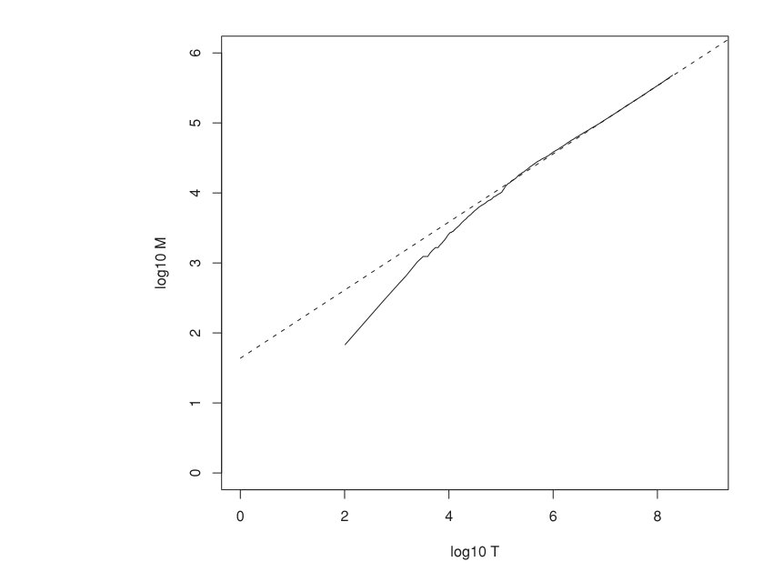
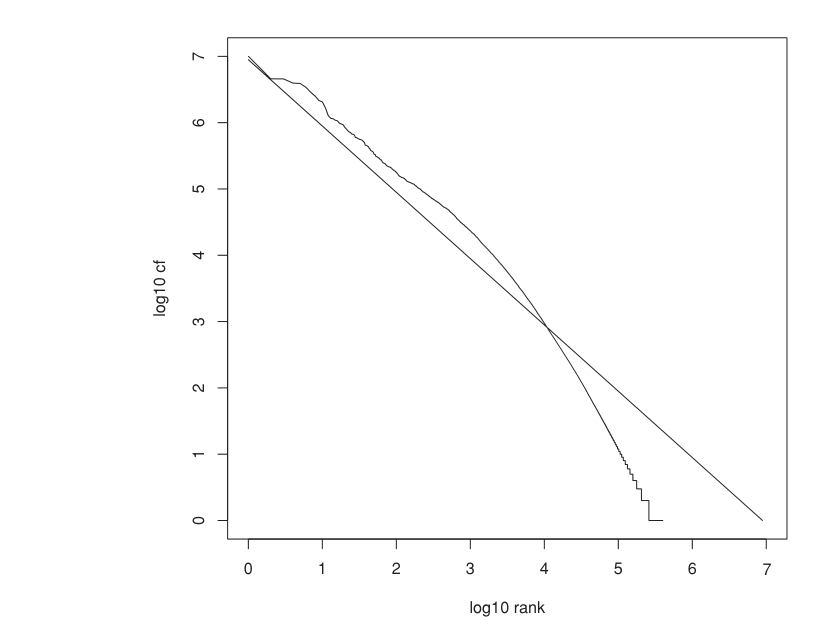
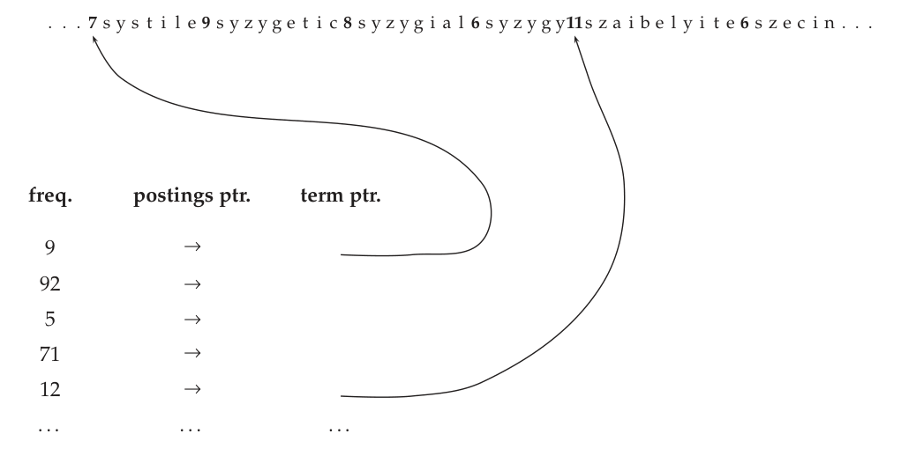
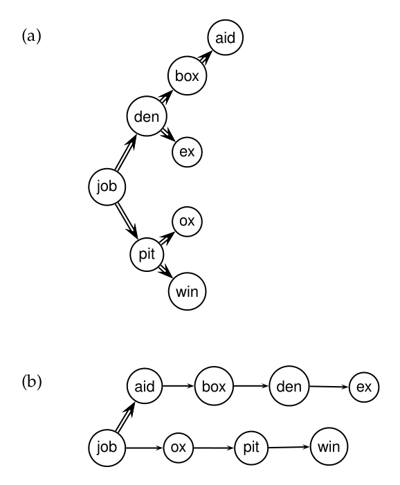
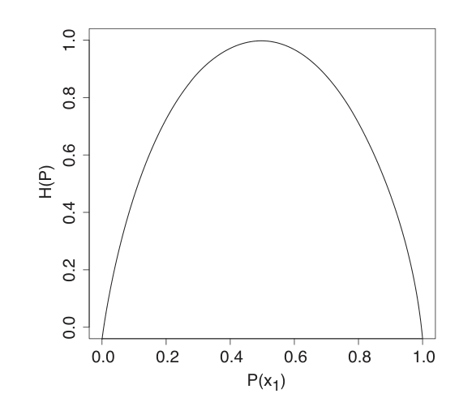

# 第 5 章 索引压缩

[返回系列目录](../introduction-to-information-retrieval.md) · [上一篇：第 4 章 索引构建](./04-index-construction.md) · [下一篇：第 6 章 评分、词项加权与向量空间模型](./06-scoring-term-weighting-and-vector-space-model.md)

原书印刷页 85–108；PDF 第 122–145 页。

<!-- source: PDF 122; printed: 85 -->

第 1 章介绍了词典（dictionary）和倒排索引（inverted index）作为信息检索（information retrieval, IR）中的核心数据结构。在本章中，我们将采用一些对词典和倒排索引进行压缩的技术，这些技术对于高效的信息检索系统是必不可少的。

压缩的一个好处是显而易见的。我们需要更少的磁盘空间。正如我们将看到的，1:4 的压缩比很容易实现，这有可能将存储索引的成本降低 75%。

压缩还有两个更微妙的好处。第一个是增加了缓存（caching）的使用。搜索系统对词典和索引的某些部分的使用频率远高于其他部分。例如，如果我们缓存一个常用查询词项（term）$t$ 的倒排记录表（postings list），那么响应单词项查询 $t$ 所需的计算就可以完全在内存中完成。通过压缩，我们可以将更多的信息装入主存中。在处理包含 $t$ 的查询时，我们无需花费磁盘寻道时间，而是在内存中访问其倒排记录表并对其进行解压。正如我们在下文将看到的，存在简单且高效的解压方法，因此解压倒排记录表所带来的性能损失很小。结果，我们能够大幅减少信息检索系统的响应时间。由于内存是比磁盘空间更昂贵的资源，因此由于缓存带来的速度提升（而非空间需求的减少）通常是进行压缩的主要动机。

压缩的第二个更微妙的优势是加快了数据从磁盘到内存的传输速度。高效的解压算法在现代硬件上运行得非常快，以至于从磁盘传输一个压缩数据块然后再解压它的总时间，通常少于传输相同大小的未压缩数据块的时间。例如，通过加载小得多的压缩倒排记录表，即使加上解压的开销，我们也可以减少输入/输出（I/O）时间。因此，在大多数情况下，检索系统在压缩的倒排记录表上运行得比在未压缩的倒排记录表上更快。

如果压缩的主要目标是节省磁盘空间，那么速度

<!-- source: PDF 123; printed: 86 -->

压缩算法的速度就无关紧要了。但是，为了提高缓存利用率和加快磁盘到内存的传输速度，解压速度必须很高。我们在本章中讨论的压缩算法非常高效，因此可以满足索引压缩的所有三个目的。

在本章中，我们将倒排记录（posting）定义为倒排记录表中的一个 docID。例如，倒排记录表 (6; 20, 45, 100)（其中 6 是该表对应词项的 termID）包含三个倒排记录。正如第 2.4.2 节（第 41 页）所讨论的，大多数搜索系统中的倒排记录还包含频率和位置信息；但在这里我们只考虑简单的 docID 倒排记录。有关压缩频率和位置信息的参考文献，请参见第 5.4 节。

本章首先对我们想要压缩的实体——大型文档集（collection）中的词项和倒排记录——的分布进行了统计特征分析（第 5.1 节）。然后我们探讨词典的压缩，使用将词典视为单一字符串（dictionary-as-a-string）的方法和分块存储（blocked storage）（第 5.2 节）。第 5.3 节描述了两种压缩倒排记录文件的技术：可变字节编码（variable byte encoding）和 $\gamma$ 编码（$\gamma$ encoding）。

## 5.1 信息检索中词项的统计特性

与上一章一样，我们使用 Reuters-RCV1 作为我们的模型文档集（见表 4.2，第 70 页）。我们在表 5.1 中给出了该文档集的一些词项和倒排记录统计数据。“$\Delta$%” 表示与上一行相比尺寸的减少量。“T%” 是相对于未过滤（unfiltered）状态的累计减少量。

该表显示了不同预处理级别下的词项数量（第 2 列）。词项数量是决定词典大小的主要因素。无位置信息的倒排记录数量（第 3 列）是该文档集无位置信息索引预期大小的指标。带有位置信息的索引的预期大小与其必须编码的位置数量有关（第 4 列）。

总体而言，表 5.1 中的统计数据表明，预处理极大地影响了词典的大小和无位置信息倒排记录的数量。词干提取（stemming）和大小写转换（case folding）各自使（不同的）词项数量减少了 17%，并分别使无位置信息倒排记录的数量减少了 4% 和 3%。对最频繁词汇的处理也很重要。30 词法则（rule of 30）指出，最常见的 30 个词占书面文本中词元（token）的 30%（在表中为 31%）。在索引过程中剔除 150 个最常见的词（作为停用词（stop word）；参见第 2.2.2 节，第 27 页）可以减少 25% 到 30% 的无位置信息倒排记录。但是，尽管包含 150 个词的停用词表将倒排记录的数量减少了四分之一或更多，这种尺寸的减小并不会延续到压缩后索引的大小上。正如我们在本章后面将看到的，频繁词的倒排记录表在压缩后每个倒排记录只需要几个比特。

表中的变化量处于大型文档集的典型范围内。请注意，

<!-- source: PDF 124; printed: 87 -->

**表 5.1** 预处理对 Reuters-RCV1 的词项、无位置信息倒排记录和词元数量的影响。“$\Delta$%” 表示与上一行相比尺寸的减少量，但“30 stop words”和“150 stop words”均以“case folding”作为参考行。“T%” 是相对于未过滤状态的累计（“总”）减少量。我们使用 Porter 词干提取器进行了词干提取（第 2 章，第 33 页）。

| | (distinct) terms: number | $\Delta$% | T% | nonpositional postings: number | $\Delta$% | T% | tokens (= number of position entries in postings): number | $\Delta$% | T% |
|---|---|---|---|---|---|---|---|---|---|
| unfiltered | 484,494 | | | 109,971,179 | | | 197,879,290 | | |
| no numbers | 473,723 | −2 | −2 | 100,680,242 | −8 | −8 | 179,158,204 | −9 | −9 |
| case folding | 391,523 | −17 | −19 | 96,969,056 | −3 | −12 | 179,158,204 | −0 | −9 |
| 30 stop words | 391,493 | −0 | −19 | 83,390,443 | −14 | −24 | 121,857,825 | −31 | −38 |
| 150 stop words | 391,373 | −0 | −19 | 67,001,847 | −30 | −39 | 94,516,599 | −47 | −52 |
| stemming | 322,383 | −17 | −33 | 63,812,300 | −4 | −42 | 94,516,599 | −0 | −52 |

然而，对于某些文本集合，减少的百分比可能会有很大差异。例如，对于包含高比例法语文本的网页集合，法语的词形还原器（lemmatizer）对词汇表（vocabulary）大小的缩减程度远大于 Porter 词干提取器对纯英文集合的缩减程度，因为法语是比英语在形态上更丰富的语言。

我们在本章剩余部分描述的压缩技术是无损的（lossless），也就是说，所有信息都被保留了下来。使用有损压缩（lossy compression）可以获得更好的压缩比，它会丢弃一些信息。大小写转换、词干提取和停用词消除都是有损压缩的形式。类似地，向量空间模型（第 6 章）和诸如潜在语义索引（latent semantic indexing）（第 18 章）等降维技术创建了紧凑的表示形式，我们无法从中完全恢复原始文档集。当“丢失”的信息不太可能被搜索系统使用时，有损压缩是有意义的。例如，Web 搜索的特点是文档数量庞大、查询简短，并且用户通常只查看前几页的结果。因此，我们可以丢弃那些仅用于排名靠后结果的文档的倒排记录。因此，在某些检索场景中，可以使用有损方法进行压缩而不会降低任何有效性。

在介绍压缩词典的技术之前，我们希望估计文档集中不同词项的数量 $M$。人们有时会说语言具有特定大小的词汇表。《牛津英语词典》（OED）第二版定义了超过 600,000 个单词。但是大多数大型文档集的词汇表比 OED 大得多。OED 不包含大多数人名、地名、产品名或科学

<!-- source: PDF 125; printed: 88 -->

实体（如基因）的名称。这些名称需要包含在倒排索引中，以便我们的用户可以搜索它们。


**图 5.1** Heaps 定律。对于 Reuters-RCV1，词汇表大小 $M$ 作为文档集大小 $T$（词元数量）的函数。对于这些数据，虚线 $\log_{10} M = 0.49 * \log_{10} T + 1.64$ 是最佳的最小二乘拟合。因此，$k = 10^{1.64} \approx 44$ 且 $b = 0.49$。
图中文字：y轴：log10 M；x轴：log10 T

### 5.1.1 Heaps 定律：估计词项数量

掌握 $M$ 的一个更好方法是 Heaps 定律（Heaps' law），它将词汇表大小估计为文档集大小的函数：

$$ M = k T^b \tag{5.1} $$

其中 $T$ 是文档集中的词元数量。参数 $k$ 和 $b$ 的典型值为：$30 \le k \le 100$ 且 $b \approx 0.5$。Heaps 定律的动机是，文档集大小和词汇表大小之间最简单的可能关系在双对数（log-log）空间中是线性的，并且这种线性假设通常在实践中得到证实，如针对 Reuters-RCV1 的图 5.1 所示。在这种情况下，对于 $T > 10^5 = 100,000$，在参数值 $b = 0.49$ 和 $k = 44$ 时拟合得非常好。例如，对于前 1,000,020 个词元，Heaps 定律

<!-- source: PDF 126; printed: 89 -->

预测有 38,323 个词项：

$$ 44 \times 1,000,020^{0.49} \approx 38,323. $$

实际数量是 38,365 个词项，非常接近预测值。

参数 $k$ 的变化很大，因为词汇表的增长很大程度上取决于文档集的性质及其处理方式。大小写转换（Case-folding）和词干提取（stemming）会降低词汇表的增长率，而包含数字和拼写错误则会增加增长率。无论特定文档集的参数值是多少，Heaps 定律表明 (i) 词典大小会随着文档集中文档数量的增加而持续增加，而不是达到一个最大词汇表大小，以及 (ii) 对于大型文档集，词典的大小相当大。这两个假设已被经验证明在大型文本集合中是成立的（第 5.4 节）。因此，词典压缩对于一个有效的系统检索系统非常重要。

### 5.1.2 Zipf 定律：对词项分布进行建模

我们还想了解词项在文档中是如何分布的。这有助于我们刻画第 5.3 节中压缩倒排记录表算法的性质。

文档集中词项分布的一个常用模型是 Zipf 定律（Zipf's law）。它指出，如果 $t_1$ 是文档集中最常见的词项，$t_2$ 是第二常见的词项，依此类推，那么第 $i$ 个最常见词项的文档集频率 $\text{cf}_i$ 与 $1/i$ 成正比：

$$ \text{cf}_i \propto \frac{1}{i}. \tag{5.2} $$

因此，如果最频繁的词项出现了 $\text{cf}_1$ 次，那么第二频繁的词项的出现次数是其一半，第三频繁的词项的出现次数是其三分之一，依此类推。直观上，频率随着排名的增加而非常迅速地下降。式（5.2）是形式化这种快速下降的最简单方法之一，并且人们发现它是一个相当好的模型。

等价地，我们可以将 Zipf 定律写为 $\text{cf}_i = c i^k$ 或 $\log \text{cf}_i = \log c + k \log i$，其中 $k = -1$，$c$ 是将在第 5.3.2 节中定义的一个常数。因此，它是一个指数为 $k = -1$ 的幂律（power law）。有关另一个幂律（刻画网页上链接分布的定律），请参见第 19 章第 426 页。

图 5.2 中的双对数图绘制了 Reuters-RCV1 中词项的文档集频率与其排名的函数关系。图中还显示了一条斜率为 –1 的直线，对应于 Zipf 函数 $\log \text{cf}_i = \log c - \log i$。数据对该定律的拟合并不是特别好，但足以作为我们在第 5.3 节计算中词项分布的模型。

<!-- source: PDF 127; printed: 90 -->


**图 5.2** Reuters-RCV1 的 Zipf 定律。图中绘制了文档集中词项的频率与频率排名的函数关系。直线是 Zipf 定律预测的分布（加权最小二乘拟合；截距为 6.95）。
图中文字：log10 cf, log10 rank

**练习 5.1** [$\star$]
假设每个倒排记录占用一个机器字（machine word），基于表 5.1 中的不同词元化方法，未压缩的（非位置）索引的大小是多少？这些数字与表 5.6 相比如何？

## 5.2 词典压缩

本节介绍了一系列实现越来越高压缩比的词典数据结构。如表 5.1 所示，与倒排记录文件相比，词典很小。那么，如果它只占信息检索系统整体空间需求的一小部分，为什么还要压缩它呢？

决定信息检索系统响应时间的主要因素之一是处理查询所需的磁盘寻道（disk seek）次数。如果词典的一部分在磁盘上，那么在查询评估中就需要更多的磁盘寻道。因此，压缩词典的主要目标是将其（或至少其大部分）放入主存中，以支持高查询吞吐

<!-- source: PDF 128; printed: 91 -->

| term | document frequency | pointer to postings list |
| :--- | :--- | :--- |
| a | 656,265 | $\longrightarrow$ |
| aachen | 65 | $\longrightarrow$ |
| ... | ... | ... |
| zulu | 221 | $\longrightarrow$ |
| **space needed:** 20 bytes | 4 bytes | 4 bytes |

**图 5.3** 将词典存储为固定宽度条目的数组。

量。尽管非常大的文档集的词典可以放入标准桌面机器的内存中，但在许多其他应用场景中并非如此。例如，大型公司的企业搜索服务器可能必须对多 TB 级别的文档集进行索引，由于存在许多不同语言的文档，其词汇表相对较大。我们还希望能够为手机和车载计算机等受限硬件设计搜索系统。希望节省内存的其他原因是快速的启动时间以及必须与其他应用程序共享资源。你个人电脑上的搜索系统必须与你同时使用的占用大量内存的文字处理套件和平共处。

### 5.2.1 将词典视为单一字符串

词典最简单的数据结构是将词汇表按字典序（lexicographically）排序，并将其存储在固定宽度条目的数组中，如图 5.3 所示。我们为词项本身分配 20 个字节（因为在英语中很少有词项超过 20 个字符），为它的文档频率分配 4 个字节，为指向其倒排记录表的指针分配 4 个字节。4 字节的指针可以寻址 4 吉字节（GB）的地址空间。对于像 Web 这样的大型文档集，我们需要为每个指针分配更多的字节。我们通过二分查找（binary search）在数组中查找词项。

对于 Reuters-RCV1，在这种方案中我们需要 $M \times (20 + 4 + 4) = 400,000 \times 28 = 11.2$ 兆字节（MB）来存储词典。

为词项使用固定宽度的条目显然是浪费的。英语中词项的平均长度约为 8 个字符（第 70 页表 4.2），因此在固定宽度方案中，我们平均浪费了 12 个字符。此外，我们无法存储超过 20 个字符的词项，例如 hydrochlorofluorocarbons 和 supercalifragilisticexpialidocious。我们可以通过将词典词项存储为一个长字符串来克服这些缺点，如图 5.4 所示。指向下一个词项的指针也用于标定当前词项的结尾。和以前一样，我们通过在（现在更小的）表中进行二分查找来定位数据结构中的词项。与固定宽度存储相比，该方案为我们节省了 60% 的空间——平均节省了（占

<!-- source: PDF 129; printed: 92 -->

```text
. . . s y s t i l e s y z y g e t i c s y z y g i a l s y z y g y s z a i b e l y i t e s z e c i n s z o n o . . .
      ^             ^                 ^               ^           ^                   ^
      |             |                 |               |           |                   |
freq. | postings ptr| term ptr.       |               |           |                   |
  9   |      -->    |-----------------+               |           |                   |
 92   |      -->    |---------------------------------+           |                   |
  5   |      -->    |---------------------------------------------+                   |
 71   |      -->    |---------------------------------------------------------+       |
 12   |      -->    |-----------------------------------------------------------------+
 ...       ...           ...
4 bytes   4 bytes       3 bytes
```

**图 5.4** 将词典视为单一字符串的存储方式。指针标记前一个词项的结尾和下一个词项的开头。例如，本例中的前三个词项是 systile、syzygetic 和 syzygial。

之前为词项分配的 20 个字节中的）12 个字节。然而，我们现在还需要存储词项指针。词项指针需要寻址 $400,000 \times 8 = 3.2 \times 10^6$ 个位置，因此它们需要 $\log_2 3.2 \times 10^6 \approx 22$ 位或 3 个字节长。

在这个新方案中，Reuters-RCV1 词典需要 $400,000 \times (4 + 4 + 3 + 8) = 7.6$ MB：频率和倒排记录指针各 4 个字节，词项指针 3 个字节，词项平均 8 个字节。因此，我们将空间需求减少了三分之一，从 11.2 MB 降至 7.6 MB。

### 5.2.2 按块存储

我们可以通过将字符串中的词项分组为大小为 $k$ 的块（block），并且仅为每个块的第一个词项保留一个词项指针，来进一步压缩词典（图 5.5）。我们将字符串中词项的长度作为一个额外的字节存储在词项的开头。因此，我们消除了 $k - 1$ 个词项指针，但需要额外的 $k$ 个字节来存储每个词项的长度。对于 $k = 4$，我们节省了 $(k - 1) \times 3 = 9$ 个字节的词项指针空间，但需要额外的 $k = 4$ 个字节来存储词项长度。因此，Reuters-RCV1 词典的总空间需求每四个词项的块减少了 5 个字节，或者总共减少了 $400,000 \times 1/4 \times 5 = 0.5$ MB，使我们降至 7.1 MB。

<!-- source: PDF 130; printed: 93 -->

大小为 $k$ 的块，并且只为每个块的第一个词项保留一个词项指针（图 5.5）。我们将字符串中词项的长度作为一个额外的字节存储在词项的开头。因此，我们消除了 $k - 1$ 个词项指针，但需要额外的 $k$ 个字节来存储每个词项的长度。对于 $k = 4$，我们节省了 $(k - 1) \times 3 = 9$ 个字节的词项指针空间，但需要额外的 $k = 4$ 个字节来存储词项长度。因此，Reuters-RCV1 词典的总空间需求在每个包含四个词项的块上减少了 5 个字节，总共减少了 $400,000 \times 1/4 \times 5 = 0.5$ MB，使其降至 7.1 MB。



**图 5.5** 每个块包含四个词项的成块存储。第一个块由 systile、syzygetic、syzygial 和 syzygy 组成，长度分别为 7、9、8 和 6 个字符。每个词项前面都有一个编码其长度的字节，指示需要跳过多少字节才能到达后续词项。
图中文字：freq.（频率）；postings ptr.（倒排记录指针）；term ptr.（词项指针）。

通过增加块大小 $k$，我们可以获得更好的压缩效果。然而，在压缩率和词项查找速度之间存在权衡。对于图 5.6 中的八词项词典，二分查找的步骤显示为双线，而列表查找的步骤显示为单线。我们在未压缩的词典中通过二分查找来搜索词项（a）。在压缩词典中，我们首先通过二分查找定位词项所在的块，然后通过遍历该块的线性查找来确定其在列表中的位置（b）。假设每个词项在查询中出现的概率相等，在（a）中搜索未压缩词典平均需要 $(0 + 1 + 2 + 3 + 2 + 1 + 2 + 2)/8 \approx 1.6$ 步。例如，查找 aid 和 box 这两个词项分别需要三步和两步。在（b）中，块大小为 $k = 4$，我们平均需要 $(0 + 1 + 2 + 3 + 4 + 1 + 2 + 3)/8 = 2$ 步，增加了约 25%。例如，查找 den 需要一步二分查找和块内的两步查找。通过增加 $k$，我们可以使压缩词典的大小任意接近最小的 $400,000 \times (4 + 4 + 1 + 8) = 6.8$ MB，但对于较大的 $k$ 值，词项查找会变得极其缓慢。

<br>前端编码

我们在词典中尚未利用的一个冗余来源是，按字母顺序排序的列表中的连续条目共享公共前缀。这一观察引出了**前端编码**（front coding）（图 5.7）。一个公共前缀

<!-- source: PDF 131; printed: 94 -->



**图 5.6** 未压缩词典的搜索（a）和通过 $k = 4$ 的成块方法压缩的词典的搜索（b）。
图中文字：(a) aid, box, den, ex, job, ox, pit, win；(b) aid, box, den, ex, job, ox, pit, win。

<br>

成块压缩（$k = 4$）中的一个块...
8automata8automate9automatic10automation

$$ \Downarrow $$

...使用前端编码进一步压缩。
8automat*a1$\diamond$e2$\diamond$ic3$\diamond$ion

**图 5.7** 前端编码。具有相同前缀（“automat”）的词项序列通过用 $*$ 标记前缀的结尾，并在后续词项中用 $\diamond$ 替换它来进行编码。和以前一样，每个条目的第一个字节编码字符数。

<!-- source: PDF 132; printed: 95 -->

**表 5.2** Reuters-RCV1 的词典压缩。

| 数据结构 | 大小 (MB) |
| --- | --- |
| 词典，定长 | 11.2 |
| 词典，指向字符串的词项指针 | 7.6 |
| $\sim$，采用成块方法，$k = 4$ | 7.1 |
| $\sim$，采用成块方法和前端编码 | 5.9 |

被识别用于词项列表的一个子序列，然后用一个特殊字符来引用。在 Reuters 的情况下，正如我们在实验中发现的那样，前端编码又节省了 1.2 MB。

具有更大压缩率的其他方案依赖于**最小完美哈希**（minimal perfect hashing），即一种将 $M$ 个词项无冲突地映射到 $[1, \ldots, M]$ 的哈希函数。然而，我们无法增量地调整完美哈希，因为每个新词项都会引起冲突，因此需要创建一个新的完美哈希函数。因此，它们不能用于动态环境中。

即使使用最好的压缩方案，对于非常大的文本集合和内存有限的硬件，将整个词典存储在主存中也可能是不可行的。如果我们必须将词典划分到存储在磁盘上的页面中，那么我们可以使用 B 树对每个页面的第一个词项进行索引。为了处理大多数查询，搜索系统无论如何都必须访问磁盘来获取倒排记录。为了从磁盘检索词项的词典页面而进行的一次额外寻道，虽然显著增加了处理查询所需的时间，但仍在可容忍的范围内。

表 5.2 总结了这四种词典数据结构所实现的压缩效果。

**练习 5.2**
估计在成块词典存储中，块大小为 $k = 8$ 和 $k = 16$ 时 Reuters-RCV1 词典的空间使用情况。

**练习 5.3**
估计在块大小为 $k = 4$（图 5.6，b）、$k = 8$ 和 $k = 16$ 的情况下，Reuters-RCV1 压缩词典中词项查找所需的时间。与 $k = 1$（图 5.6，a）相比，速度减慢了多少？

### 5.3 倒排记录表压缩

回想一下表 4.2（第 70 页），Reuters-RCV1 有 800,000 篇文档，每篇文档 200 个词元，每个词元 6 个字符，以及 100,000,000 条倒排记录，在本章中我们将倒排记录定义为倒排记录表中的一个 docID，即不包括频率和位置信息。这些数字

<!-- source: PDF 133; printed: 96 -->

**表 5.3** 编码间距而不是文档 ID。例如，对于 computer，我们存储间距 107, 5, 43, ...，而不是 docID 283154, 283159, 283202, ...。第一个 docID 保持不变（仅在 arachnocentric 中显示）。

| | 编码 | 倒排记录表 | | | | | |
| --- | --- | --- | --- | --- | --- | --- | --- |
| the | docIDs | ... | 283042 | 283043 | 283044 | 283045 |
| | gaps | | | 1 | 1 | 1 |
| computer | docIDs | ... | 283047 | 283154 | 283159 | 283202 |
| | gaps | | | 107 | 5 | 43 |
| arachnocentric | docIDs | 252000 | 500100 | | | |
| | gaps | 252000 | 248100 | | | |

对应于表 5.1 中的第 3 行（“大小写转换”）。文档标识符的长度为 $\log_2 800,000 \approx 20$ 位。因此，文档集的大小约为 $800,000 \times 200 \times 6$ 字节 $= 960$ MB，未压缩的倒排记录表文件的大小为 $100,000,000 \times 20/8 = 250$ MB。

为了设计一种更高效的倒排记录表文件表示方法，即每个文档使用少于 20 位的表示方法，我们观察到高频词项的倒排记录彼此靠得很近。想象一下，逐个遍历文档集中的文档，寻找像 computer 这样的高频词项。我们会找到一个包含 computer 的文档，然后跳过几个不包含它的文档，接着又是一个包含该词项的文档，依此类推（见表 5.3）。关键思想是，倒排记录之间的*间距*（gap）很短，存储它们所需的空间远小于 20 位。事实上，对于最频繁的词项（如 the 和 for），间距大多等于 1。但是，对于在文档集中仅出现一两次的罕见词项（例如表 5.3 中的 arachnocentric），其间距与 docID 具有相同的数量级，需要 20 位。为了经济地表示这种间距分布，我们需要一种可变编码方法，对短间距使用较少的位数。

为了用比大数字更少的空间来编码小数字，我们考察两种类型的方法：字节级压缩（bytewise compression）和比特级压缩（bitwise compression）。顾名思义，这些方法分别尝试用最少数量的字节和比特来编码间距。

#### 5.3.1 可变字节编码

<br>可变字节编码

<br>延续位

**可变字节**（Variable byte, VB）编码使用整数个字节来编码间距。一个字节的最后 7 位是“有效载荷（payload）”，用于编码间距的一部分。该字节的第一位是**延续位**（continuation bit）。对于编码间距的最后一个字节，它被设置为 1，否则设置为 0。为了解码可变字节码，我们读取一个延续位为 0 的字节序列，该序列以一个延续位为 1 的字节结束。然后我们提取并拼接这些 7 位的部分。图 5.8 给出了伪代码

<!-- source: PDF 134; printed: 97 -->

```text
VBENCODENUMBER(n)
1 bytes ← ⟨⟩
2 while true
3 do PREPEND(bytes, n mod 128)
4    if n < 128
5    then BREAK
6    n ← n div 128
7 bytes[LENGTH(bytes)] += 128
8 return bytes

VBENCODE(numbers)
1 bytestream ← ⟨⟩
2 for each n ∈ numbers
3 do bytes ← VBENCODENUMBER(n)
4    bytestream ← EXTEND(bytestream, bytes)
5 return bytestream

VBDECODE(bytestream)
1 numbers ← ⟨⟩
2 n ← 0
3 for i ← 1 to LENGTH(bytestream)
4 do if bytestream[i] < 128
5    then n ← 128 × n + bytestream[i]
6    else n ← 128 × n + (bytestream[i] − 128)
7         APPEND(numbers, n)
8         n ← 0
9 return numbers
```

**图 5.8 VB 编码与解码。** 函数 div 和 mod 分别计算整数除法和整数除法后的余数。PREPEND 将一个元素添加到列表的开头，例如，PREPEND(⟨1,2⟩, 3) = ⟨3, 1, 2⟩。EXTEND 扩展一个列表，例如，EXTEND(⟨1,2⟩, ⟨3, 4⟩) = ⟨1, 2, 3, 4⟩。

**表 5.4 VB 编码。** 间距使用整数个字节进行编码。每个字节的第一位（延续位）指示编码是否以该字节结束（1）或不结束（0）。

| docIDs | 824 | 829 | 215406 |
| :--- | :--- | :--- | :--- |
| gaps | | 5 | 214577 |
| VB code | 00000110 10111000 | 10000101 | 00001101 00001100 10110001 |

<!-- source: PDF 135; printed: 98 -->

**表 5.5 一元编码和 $\gamma$ 编码的示例。** 一元编码仅显示较小的数字。$\gamma$ 编码中的逗号仅为了提高可读性，并不是实际编码的一部分。

| number | unary code | length | offset | $\gamma$ code |
| :--- | :--- | :--- | :--- | :--- |
| 0 | 0 | | | 0 |
| 1 | 10 | 0 | | 0 |
| 2 | 110 | 10 | 0 | 10,0 |
| 3 | 1110 | 10 | 1 | 10,1 |
| 4 | 11110 | 110 | 00 | 110,00 |
| 9 | 1111111110 | 1110 | 001 | 1110,001 |
| 13 | | 1110 | 101 | 1110,101 |
| 24 | | 11110 | 1000 | 11110,1000 |
| 511 | | 111111110 | 11111111 | 111111110,11111111 |
| 1025 | | 11111111110 | 0000000001 | 11111111110,0000000001 |

的伪代码，表 5.4 给出了一个 VB 编码的倒排记录表（postings list）示例。<sup>[1]</sup>

使用 VB 压缩，正如我们在实验中验证的那样，Reuters-RCV1 的压缩索引大小为 116 MB。这比未压缩索引的大小减少了 50% 以上（见表 5.6）。

VB 编码的思想也可以应用于比字节更大或更小的单位：32 位字、16 位字以及 4 位字或半字节（nibble）。更大的字进一步减少了必要的位操作量，代价是压缩效果较差（或没有压缩）。小于字节的字长可以获得更好的压缩率，代价是更多的位操作。通常，字节在压缩率和解压速度之间提供了一个很好的折中。

对于大多数信息检索（IR）系统来说，可变字节编码在时间和空间之间提供了极好的折中。它们也很容易实现——第 5.4 节中提到的大多数替代方案都更复杂。但是，如果磁盘空间是稀缺资源，我们可以通过使用位级编码（bit-level encoding）来实现更好的压缩率，特别是两种密切相关的编码：接下来我们将讨论的 $\gamma$ 编码，以及 $\delta$ 编码（练习 5.9）。

### 5.3.2 $\gamma$ 编码

VB 编码根据间距的大小使用自适应数量的字节。位级编码在更细粒度的位级别上自适应编码的长度。最

> **脚注 1（原书第 98 页）**：请注意，表中的起始值是 0。因为我们从不需要对为 0 的 docID 或间距进行编码，所以在实践中起始值通常是 1，因此 10000000 编码 1，10000101 编码 6（而不是表中的 5），依此类推。

<!-- source: PDF 136; printed: 99 -->

简单的位级编码是一元编码（unary code）。$n$ 的一元编码是 $n$ 个 1 后面跟一个 0 的字符串（见表 5.5 的前两列）。显然，这不是一种非常高效的编码，但它很快就会派上用场。

原则上，一种编码能有多高效？假设 $1 \le G \le 2^n$ 的 $2^n$ 个间距 $G$ 出现的概率都相等，那么最优编码为每个 $G$ 使用 $n$ 个位。因此，某些间距（在这种情况下 $G = 2^n$）不能用少于 $\log_2 G$ 个位来编码。我们的目标是尽可能接近这个下界。

一种在最优编码常数因子范围内的的方法是 $\gamma$ 编码（$\gamma$ encoding）。$\gamma$ 编码通过将间距 $G$ 的表示拆分为长度（length）和偏移量（offset）对来实现变长编码。偏移量是 $G$ 的二进制表示，但去掉了前导的 1。<sup>[2]</sup> 例如，对于 13（二进制 1101），偏移量是 101。长度使用一元编码对偏移量的长度进行编码。对于 13，偏移量的长度是 3 位，其一元编码为 1110。因此，13 的 $\gamma$ 编码是 1110101，即长度 1110 和偏移量 101 的拼接。表 5.5 的最右列给出了 $\gamma$ 编码的其他示例。

解码 $\gamma$ 编码时，首先读取一元编码，直到遇到终止它的 0，例如，在解码 1110101 时读取前四位 1110。现在我们知道了偏移量的长度：3 位。然后可以正确读取偏移量 101，并加上编码时截掉的 1：$101 \rightarrow 1101 = 13$。

偏移量的长度是 $\lfloor \log_2 G \rfloor$ 位，长度的长度是 $\lfloor \log_2 G \rfloor + 1$ 位，因此整个编码的长度是 $2 \times \lfloor \log_2 G \rfloor + 1$ 位。$\gamma$ 编码的长度总是奇数，并且它们在我们所称的最优编码长度 $\log_2 G$ 的 2 倍因子范围内。我们是在假设 1 到 $2^n$ 之间的 $2^n$ 个间距等概率出现的前提下得出这个最优值的。但这未必符合实际情况。通常，我们无法先验地知道间距的概率分布。

决定离散概率分布<sup>[3]</sup> $P$ 的编码特性（包括编码是否最优）的特征是其熵（entropy）$H(P)$，定义如下：

$$
H(P) = - \sum_{x \in X} P(x) \log_2 P(x)
$$

其中 $X$ 是我们需要能够编码的所有可能数字的集合（因此 $\sum_{x \in X} P(x) = 1.0$）。熵是衡量不确定性的指标，如图 5.9 所示，对于两个可能结果的概率分布 $P$，即 $X = \{x_1, x_2\}$。当 $P(x_1) = P(x_2) = 0.5$ 时，关于下一个出现的 $x_i$ 是哪个的不确定性最大，此时熵达到最大值（$H(P) = 1$）；并且

> **脚注 2（原书第 99 页）**：我们在这里假设 $G$ 没有前导 0。如果有，在删除前导 1 之前先将它们移除。

> **脚注 3（原书第 99 页）**：想要复习概率论基本概念的读者可以参考 Rice (2006) 或 Ross (2006)。请注意，我们感兴趣的是整数（间距、频率等）上的概率分布，但概率分布的编码特性与结果是否为整数无关。

<!-- source: PDF 137; printed: 100 -->



**图 5.9** 具有两个结果 $x_1$ 和 $x_2$ 的样本空间中，熵 $H(P)$ 作为 $P(x_1)$ 的函数。
图中文字：H(P), P(x1)

当存在绝对确定性时，即 $P(x_1) = 1, P(x_2) = 0$ 以及 $P(x_1) = 0, P(x_2) = 1$ 时，熵达到最小值（$H(P) = 0$）。

可以证明，如果满足某些条件（见参考文献），编码 $L$ 的期望长度 $E(L)$ 的下界是 $H(P)$。还可以进一步证明，对于 $1 < H(P) < \infty$，$\gamma$ 编码在这个最优编码的 3 倍因子范围内，并且对于较大的 $H(P)$ 趋近于 2：

$$
\frac{E(L_\gamma)}{H(P)} \le 2 + \frac{1}{H(P)} \le 3.
$$

这个结果的显著之处在于它对任何概率分布 $P$ 都成立。因此，在对间距分布的特性一无所知的情况下，我们可以应用 $\gamma$ 编码，并确信对于大熵分布，它们在最优编码的约 2 倍因子范围内。像 $\gamma$ 编码这样，对于任意分布 $P$ 都具有在最优编码常数因子范围内这一特性的编码，被称为通用编码（universal code）。

除了通用性之外，$\gamma$ 编码还有两个对索引压缩有用的特性。首先，它们是无前缀的（prefix free），即没有任何一个 $\gamma$ 编码是另一个的前缀。这意味着 $\gamma$ 编码序列总是存在唯一的解码——并且我们不需要在它们之间使用分隔符，因为分隔符会降低编码的效率。第二个特性是 $\gamma$ 编码是无参数的（parameter free）。对于许多其他高效的编码，我们必须将模型（例如二项分布）的参数拟合到分布

<!-- source: PDF 138; printed: 101 -->

索引中间隔的分布。这使得压缩和解压的实现变得复杂。例如，参数需要被存储和检索。而且在动态索引中，间隔的分布可能会发生变化，从而使得原来的参数不再适用。无参数编码避免了这些问题。

$\gamma$ 编码能对倒排索引（inverted index）实现多大程度的压缩？为了回答这个问题，我们使用第 5.1.2 节中介绍的词项分布模型——齐普夫定律（Zipf's law）。根据齐普夫定律，文档集频率 $\text{cf}_i$ 与排名 $i$ 的倒数成正比，也就是说，存在一个常数 $c'$ 使得：

$$ \text{cf}_i = \frac{c'}{i} \tag{5.3} $$

我们可以选择一个不同的常数 $c$，使得分数 $c/i$ 成为相对频率且总和为 1（即 $c/i = \text{cf}_i/T$）：

$$ 1 = \sum_{i=1}^{M} \frac{c}{i} = c \sum_{i=1}^{M} \frac{1}{i} = c H_M \tag{5.4} $$

$$ c = \frac{1}{H_M} \tag{5.5} $$

其中 $M$ 是不同词项的数量，$H_M$ 是第 $M$ 个调和数（harmonic number）。<sup>[4]</sup> Reuters-RCV1 有 $M = 400,000$ 个不同的词项，且 $H_M \approx \ln M$，因此我们有

$$ c = \frac{1}{H_M} \approx \frac{1}{\ln M} = \frac{1}{\ln 400,000} \approx \frac{1}{13}. $$

因此，第 $i$ 个词项的相对频率大约为 $1/(13i)$，并且在长度为 $L$ 的文档中，词项 $i$ 的预期平均出现次数为：

$$ L \frac{c}{i} \approx \frac{200 \times \frac{1}{13}}{i} \approx \frac{15}{i} $$

这里我们将相对频率解释为词项出现的概率。回想一下，200 是 Reuters-RCV1 中每篇文档的平均词元（token）数（表 4.2）。

现在我们已经推导出了表征文档集（collection）中词项分布的词项统计数据，进而推导出了倒排记录表（postings lists）中间隔的分布。根据这些统计数据，我们可以计算使用 $\gamma$ 编码压缩的倒排索引的空间需求。我们首先将词汇表分层为大小为 $Lc = 15$ 的块。平均而言，词项 $i$ 每篇

> **脚注 4（原书第 101 页）**：请注意，不幸的是，熵和调和数的常规符号都是 $H$。在本章中，上下文应该能清楚地表明指的是哪一个。

<!-- source: PDF 139; printed: 102 -->

| | $N$ 篇文档 |
|---|---|
| $Lc$ 个最频繁的词项 | 每个词项有 $N$ 个大小为 1 的间隔 |
| $Lc$ 个次频繁的词项 | 每个词项有 $N/2$ 个大小为 2 的间隔 |
| $Lc$ 个再次频繁的词项 | 每个词项有 $N/3$ 个大小为 3 的间隔 |
| ... | ... |

**图 5.10** 用于估计 $\gamma$ 编码倒排索引大小的词项分层。

---

文档出现 $15/i$ 次。因此，对于第一个块中的词项，每篇文档的平均出现次数 $\bar{f}$ 为 $1 \le \bar{f}$，对应于每个词项总共有 $N$ 个间隔。对于第二个块中的词项，平均值为 $\frac{1}{2} \le \bar{f} < 1$，对应于每个词项有 $N/2$ 个间隔，对于第三个块中的词项，平均值为 $\frac{1}{3} \le \bar{f} < \frac{1}{2}$，对应于每个词项有 $N/3$ 个间隔，依此类推。（我们取下界是因为它简化了后续的计算。正如我们将看到的，即使有这个假设，最终的估计也过于悲观。）我们将做出一个有些不切实际的假设，即给定词项的所有间隔都具有相同的大小，如图 5.10 所示。假设间隔呈这种均匀分布，那么我们在块 1 中有大小为 1 的间隔，在块 2 中有大小为 2 的间隔，依此类推。

使用 $\gamma$ 编码对 $N/j$ 个大小为 $j$ 的间隔进行编码，第 $j$ 个块中一个词项的倒排记录表（对应于图中的一行）所需的比特数为：

$$ \text{bits-per-row} = \frac{N}{j} \times (2 \times \lfloor \log_2 j \rfloor + 1) $$
$$ \approx \frac{2N \log_2 j}{j}. $$

为了对整个块进行编码，我们需要 $(Lc) \cdot (2N \log_2 j)/j$ 个比特。总共有 $M/(Lc)$ 个块，因此整个倒排记录文件将占用：

$$ \sum_{j=1}^{\frac{M}{Lc}} \frac{2NLc \log_2 j}{j}. \tag{5.6} $$

<!-- source: PDF 140; printed: 103 -->

**表 5.6** Reuters-RCV1 的索引和词典压缩。压缩率取决于文档集中实际文本的比例。Reuters-RCV1 包含大量的 XML 标记。使用两种最好的压缩方案，即 $\gamma$ 编码和带前端编码的分块技术，压缩后的索引与文档集大小的比率对于 Reuters-RCV1 来说特别小：$(101 + 5.9)/3600 \approx 0.03$。

| 数据结构 | 大小 (MB) |
|---|---|
| 词典，定长 | 11.2 |
| 词典，指向字符串的词项指针 | 7.6 |
| $\sim$，带分块，$k = 4$ | 7.1 |
| $\sim$，带分块和前端编码 | 5.9 |
| 文档集（文本、XML 标记等） | 3600.0 |
| 文档集（文本） | 960.0 |
| 词项-文档关联矩阵 | 40,000.0 |
| 倒排记录，未压缩（32位字） | 400.0 |
| 倒排记录，未压缩（20位） | 250.0 |
| 倒排记录，可变字节编码 | 116.0 |
| 倒排记录，$\gamma$ 编码 | 101.0 |

---

对于 Reuters-RCV1，$\frac{M}{Lc} \approx 400,000/15 \approx 27,000$ 且

$$ \sum_{j=1}^{27,000} \frac{2 \times 10^6 \times 15 \log_2 j}{j} \approx 224 \text{ MB}. \tag{5.7} $$

因此，对于我们 960 MB 的文档集，压缩后的倒排索引的倒排记录文件大小为 224 MB，是原始文档集大小的四分之一。

当我们在 Reuters-RCV1 上运行 $\gamma$ 压缩时，压缩后索引的实际大小甚至更低：101 MB，略多于文档集大小的十分之一。预测值与实际值之间存在差异的原因是：（i）齐普夫定律并不能很好地近似 Reuters-RCV1 词项频率的实际分布；（ii）间隔不是均匀的。对于表 4.2 中未舍入的数字，齐普夫模型预测的索引大小为 251 MB。如果词项频率是由齐普夫模型生成的，并为这些人工词项创建压缩索引，那么压缩后的大小为 254 MB。因此，只要关于词项频率分布的假设是准确的，模型的预测就是正确的。

表 5.6 总结了本章介绍的压缩技术。Reuters-RCV1 的词项-文档关联矩阵（第 4 页图 1.1）的大小为 $400,000 \times 800,000 = 40 \times 8 \times 10^9$ 比特或 40 GB。

$\gamma$ 编码实现了极高的压缩率——对于 Reuters-RCV1，比可变字节编码好约 15%。但它们的解码成本很高。这是因为解码 $\gamma$ 编码序列需要许多位级别的操作（移位和掩码），因为编码之间的边界通常会

<!-- source: PDF 141; printed: 104 -->

落在机器字的中间某个位置。因此，对于 $\gamma$ 编码，查询处理的成本比可变字节编码更高。我们选择可变字节编码还是 $\gamma$ 编码取决于应用程序的特征，例如，我们赋予节省磁盘空间与最大化查询响应时间的相对权重。

表 5.6 中索引的压缩率约为 25%：400 MB（未压缩，每个倒排记录存储为 32 位字）对比 101 MB（$\gamma$ 编码）和 116 MB（VB 编码）。这表明 $\gamma$ 编码和 VB 编码都满足了我们在本章开头所述的目标。索引压缩通过减少所需的磁盘空间、增加可保留在缓存中的信息量以及加快从磁盘到内存的数据传输速度，极大地提高了索引的时间和空间效率。

**习题 5.4** $[\star]$
计算表 5.3 和表 5.5 中数字的可变字节编码。

**习题 5.5** $[\star]$
计算倒排记录表 $\langle 777, 17743, 294068, 31251336 \rangle$ 的可变字节编码和 $\gamma$ 编码。在可能的情况下使用间隔代替文档 ID（docID）。将二进制编码写成 8 位块的形式。

**习题 5.6**
考虑倒排记录表 $\langle 4, 10, 11, 12, 15, 62, 63, 265, 268, 270, 400 \rangle$ 及其对应的间隔表 $\langle 4, 6, 1, 1, 3, 47, 1, 202, 3, 2, 130 \rangle$。假设倒排记录表的长度是单独存储的，因此系统知道倒排记录表何时结束。使用可变字节编码：（i）在 1 个字节中能编码的最大间隔是多少？（ii）在 2 个字节中能编码的最大间隔是多少？（iii）在上述编码下，该倒排记录表需要多少个字节？（仅计算用于编码数字序列的空间。）

**习题 5.7**
一个小技巧是注意到间隔的长度不能为 0，并且移位后剩下要编码的内容也不能为 0。基于这些观察：（i）建议对可变字节编码进行修改，使其能够在相同的空间内编码稍大一点的间隔。（ii）在 1 个字节中能编码的最大间隔是多少？（iii）在 2 个字节中能编码的最大间隔是多少？（iv）在这种编码下，习题 5.6 中的倒排记录表需要多少个字节？（仅计算用于编码数字序列的空间。）

**习题 5.8** $[\star]$
从以下 $\gamma$ 编码的间隔序列中，首先重建间隔序列，然后重建倒排记录序列：1110001110101011111101101111011。

**习题 5.9**
$\gamma$ 编码对于大数（例如表 5.5 中的 1025）相对低效，因为它们使用低效的一元编码来编码偏移量的长度。**$\delta$ 编码**（$\delta$ codes）与 $\gamma$ 编码的不同之处在于，它们使用 $\gamma$ 编码而不是一元编码来编码代码的第一部分（长度）。偏移量的编码是相同的。例如，7 的 $\delta$ 编码是 10,0,11（同样，我们添加逗号以提高可读性）。10,0 是长度（在本例中为 2）的 $\gamma$ 编码，而偏移量的编码（11）保持不变。（i）计算其他数字的 $\delta$ 编码

<!-- source: PDF 142; printed: 105 -->

**表 5.7** 在基于块的排序索引构建中要合并的两个间距序列

| | |
|---|---|
| 运行块 1 的 $\gamma$ 编码间距序列 | 1110110111111001011111111110100011111001 |
| 运行块 2 的 $\gamma$ 编码间距序列 | 11111010000111111000100011111110010000011111010101 |

表 5.5 中的其他数字计算 $\delta$ 编码。在什么数字范围内，$\delta$ 编码比 $\gamma$ 编码短？(ii) 在表 5.6 中，$\gamma$ 编码优于可变字节编码，因为索引包含停用词，从而有许多小间距。证明如果大间距占主导地位，可变字节编码更紧凑。(iii) 比较在大间距占主导地位的间距分布下，$\delta$ 编码和可变字节编码的压缩率。

**练习 5.10**
回顾上述索引大小的计算过程，并明确指出得出式（5.6）所做的所有近似。

**练习 5.11**
对于你选择的一个文档集，确定文档数、词项数以及文档的平均长度。(i) 根据式（5.6）预测的倒排索引有多大？(ii) 实现一个索引构建器，为该文档集创建 $\gamma$ 压缩的倒排索引。实际索引有多大？(iii) 实现一个使用可变字节编码的索引构建器。可变字节编码的索引有多大？

**练习 5.12**
为了能够在主存中容纳尽可能多的倒排记录，在索引构建期间压缩中间索引文件是一个好主意。(i) 这使得基于块的排序索引构建中的运行块合并变得更加复杂。作为一个例子，计算表 5.7 中间距的 $\gamma$ 编码合并序列。(ii) 使用压缩时，索引构建在空间上更高效。你是否也期望它更快？

**练习 5.13**
(i) 证明根据齐普夫定律（Zipf's law），词汇表的大小是有限的，而根据希普斯定律（Heaps' law），词汇表的大小是无限的。(ii) 我们能从齐普夫定律推导出希普斯定律吗？

## 5.4 参考文献和进一步阅读

希普斯定律由 Heaps (1978) 发现。另见 Baeza-Yates and Ribeiro-Neto (1999)。对大型文档集中词汇表增长的详细研究见 (Williams and Zobel 2005)。齐普夫定律由 Zipf (1949) 提出。Witten and Bell (1990) 研究了该定律拟合的质量。其他词项分布模型，包括 K 混合模型（K mixture）和双泊松模型（two-poisson model），在 Manning and Schütze (1999, Chapter 15) 中有讨论。Carmel et al. (2001)、Büttcher and Clarke (2006)、Blanco and Barreiro (2007) 以及 Ntoulas and Cho (2007) 表明，有损压缩可以实现良好的压缩效果，且检索效能没有下降或没有显著下降。

词典压缩在 Witten et al. (1999, Chapter 4) 中有详细介绍，推荐作为补充阅读。

<!-- source: PDF 143; printed: 106 -->

第 5.3.1 节基于 (Scholer et al. 2002)。作者发现，可变字节编码处理查询的速度是位级压缩索引或未压缩索引的两倍，与最佳的位级压缩方法相比，压缩率仅有 30% 的损失。他们还表明，压缩索引不仅在磁盘使用率上，而且在查询处理速度上都可以优于未压缩索引。与 VB 编码相比，“可变半字节”（variable nibble）编码在一次实验中显示出 5% 到 10% 的更好压缩率，但效能下降了多达三分之一 (Anh and Moffat 2005)。Trotman (2003) 也建议使用 VB 编码，除非磁盘空间非常紧张。在最近的工作中，Anh and Moffat (2005; 2006a) 和 Zukowski et al. (2006) 构建了字对齐的二进制编码，这些编码在解压速度上更快，且效率至少与 VB 编码相当。Zhang et al. (2007) 研究了在现代硬件上对倒排记录表使用多种不同压缩技术时，缓存效能的提升。

$\delta$ 编码（练习 5.9）和 $\gamma$ 编码由 Elias (1975) 引入，他证明了这两种编码都是通用编码。此外，当 $H(P) \to \infty$ 时，$\delta$ 编码是渐近最优的。如果大数（大于 15）占主导地位，$\delta$ 编码的性能优于 $\gamma$ 编码。关于信息论（包括熵的概念）的一个很好的入门读物是 (Cover and Thomas 1991)。虽然 Elias 编码只是渐近最优的，但算术编码（arithmetic codes）(Witten et al. 1999, Section 2.4) 可以被构造为对任何 $P$ 都任意接近最优值 $H(P)$。

Witten et al. (1999; Sections 3.3 and 3.4 and Chapter 5) 涵盖了其他几种索引压缩技术。他们建议使用*参数化编码*（parameterized codes）进行索引压缩，这种编码显式地对每个词项的间距概率分布进行建模。例如，他们表明对于大型文档集，*哥伦布编码*（Golomb codes）比 $\gamma$ 编码实现了更好的压缩率。Moffat and Zobel (1992) 比较了几种参数化方法，包括 LLRUN (Fraenkel and Klein 1985)。

倒排记录表中间距的分布取决于 docID 到文档的分配。许多研究人员研究了以有利于间距序列高效压缩的方式分配 docID (Moffat and Stuiver 1996; Blandford and Blelloch 2002; Silvestri et al. 2004; Blanco and Barreiro 2006; Silvestri 2007)。这些技术将小范围内的 docID 分配给一个簇（cluster）中的文档，其中一个簇可以由给定时间段内、特定网站上或共享其他属性的所有文档组成。因此，当来自一个簇的文档序列出现在倒排记录表中时，它们的间距很小，可以更有效地被压缩。

词项频率和词位置的压缩与倒排记录表中 docID 的压缩有着不同的考虑因素。参见 Scholer et al. (2002) 和 Zobel and Moffat (2006)。Zobel and Moffat (2006) 通常被推荐为关于倒排

<!-- source: PDF 144; printed: 107 -->

索引（包括索引压缩）的深入且最新的教程。

本章仅探讨布尔检索的索引压缩。对于排序检索（第 6 章），根据词项频率而不是 docID 对倒排记录进行排序是有利的。在查询处理期间，许多倒排记录表的扫描可以提前终止，因为较小的权重不会改变迄今为止找到的排名最高的 $k$ 篇文档的排名。预先计算并将权重（而不是频率）存储在索引中不是一个好主意，因为它们不能像整数那样被很好地压缩（参见第 140 页第 7.1.5 节）。

在高效的信息检索系统中，文档压缩也可能很重要。de Moura et al. (2000) 和 Brisaboa et al. (2007) 描述了允许在压缩文本中直接搜索词项和短语的压缩方案，这对于像 gzip 和 compress 这样的标准文本压缩实用程序是不可行的。

**练习 5.14** [$\star$]
我们将一元编码（unary codes）定义为“10”：以 0 结尾的 1 的序列。互换 0 和 1 的角色会产生等效的“01”一元编码。当使用这种 01 一元编码时，$\gamma$ 编码的构造可以表述如下：（1）使用 $b = \lfloor\log_2 j\rfloor + 1$ 位将 $G$ 写成二进制。（2）在前面加上 $(b - 1)$ 个 0。(i) 用这种替代的 $\gamma$ 编码对表 5.5 中的数字进行编码。(ii) 证明该方法产生了一个定义良好的替代 $\gamma$ 编码，即它具有相同的长度并且可以被唯一解码。

**练习 5.15** [$\star\star\star$]
一元编码在上述定义的意义上不是通用编码。然而，存在一种间距分布，对于该分布一元编码是最优的。这是哪种分布？

**练习 5.16**
给出一些违反所有间距大小相同这一假设的词项示例（我们在估计 $\gamma$ 编码索引的空间需求时做出了该假设）。这些词项的一般特征是什么？

**练习 5.17**
考虑一个倒排记录表大小为 $n$ 的词项，例如 $n = 10,000$。比较该词项分布均匀（即所有间距大小相同）时与分布不均匀时，$\gamma$ 压缩的间距编码倒排记录表的大小。哪个压缩后的倒排记录表更小？

**练习 5.18**
计算式（5.7）中的总和，并证明其总计约为 251 MB。使用表 4.2 中的数字，但不要对 $Lc$、$c$ 和词汇表块的数量进行四舍五入。

<!-- source: PDF 145; printed: 108 -->

<!-- 原书此页为空白，仅有重复的版本页脚。 -->

[返回系列目录](../introduction-to-information-retrieval.md) · [上一篇：第 4 章 索引构建](./04-index-construction.md) · [下一篇：第 6 章 评分、词项加权与向量空间模型](./06-scoring-term-weighting-and-vector-space-model.md)
