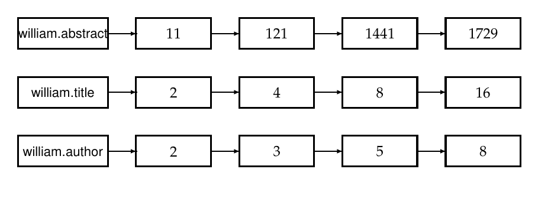
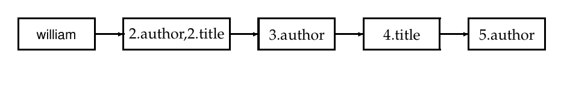
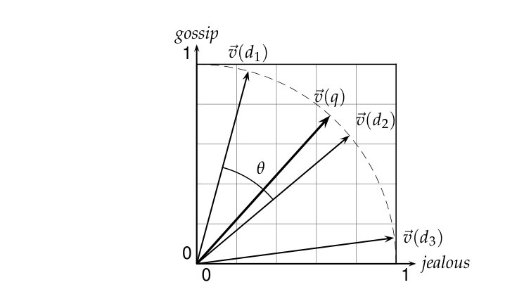
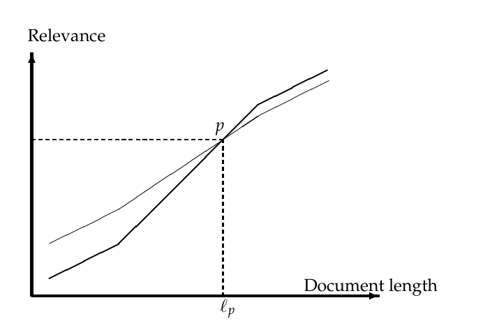
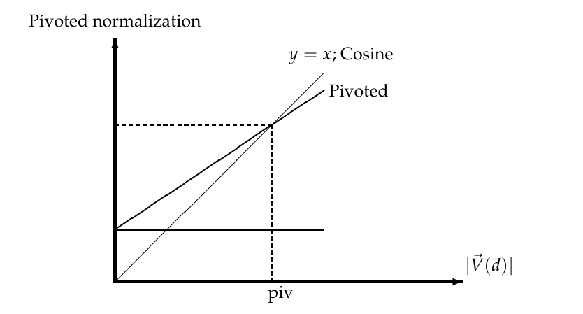

# 第 6 章 评分、词项加权与向量空间模型

[返回系列目录](../introduction-to-information-retrieval.md) · [上一篇：第 5 章 索引压缩](./05-index-compression.md) · [下一篇：第 7 章 完整搜索系统中的评分计算](./07-computing-scores-in-a-complete-search-system.md)

原书印刷页 109–134；PDF 第 146–171 页。

<!-- source: PDF 146; printed: 109 -->

到目前为止，我们处理的都是支持布尔查询的索引：一篇文档要么匹配查询，要么不匹配。在大型文档集（collection）的情况下，匹配的文档数量可能会远远超过人类用户可能筛选的数量。因此，搜索引擎对匹配查询的文档进行排序（rank-order）是至关重要的。为此，搜索引擎会针对当前的查询，为每篇匹配的文档计算一个评分（score）。在本章中，我们将开始研究如何为 (查询, 文档) 对分配评分。本章包含三个主要思想。

1. 我们在第 6.1 节中介绍参数化索引（parametric index）和域索引（zone index），它们有两个用途。首先，它们允许我们通过元数据（metadata，例如文档编写所用的语言）来索引和检索文档。其次，它们为我们提供了一种简单的方法，用于根据查询对文档进行评分（从而进行排序）。
2. 接下来，在第 6.2 节中，我们将基于词项（term）出现的统计信息，提出对文档中词项的重要性进行加权（weighting）的思想。
3. 在第 6.3 节中，我们将展示通过将每篇文档视为由这些权重组成的向量，我们可以计算查询与每篇文档之间的评分。这种观点被称为向量空间评分（vector space scoring）。

第 6.4 节探讨了向量空间模型中词项加权的几种变体。第 7 章探讨了向量空间评分的计算方面以及相关主题。

随着我们对这些思想的深入，查询的概念将呈现出多种细微差别。在第 6.1 节中，我们考虑的查询要求特定的查询词项出现在匹配文档的指定区域中。从第 6.2 节开始，我们实际上将放宽匹配文档特定区域的要求；相反，我们将研究所谓的自由文本（free text）查询，它仅仅由查询词项组成，而不指定它们的相对顺序、重要性或它们应该在文档中的哪个位置被找到。我们对评分的大部分研究都将基于后一种将查询视为这样一组词项的概念。

<!-- source: PDF 147; printed: 110 -->

## 6.1 参数化索引与域索引

到目前为止，我们一直将文档视为词项的序列。事实上，大多数文档都具有额外的结构。数字文档通常以机器可识别的形式编码与每篇文档相关的某些元数据（metadata）。所谓元数据，我们指的是关于文档的特定形式的数据，例如其作者、标题和出版日期。这种元数据通常包括诸如创建日期和文档格式之类的字段（field），以及作者，可能还有文档的标题。一个字段的可能取值应该被认为是有限的——例如，所有创作日期的集合。

考虑这种形式的查询：“find documents authored by William Shakespeare in 1601, containing the phrase alas poor Yorick”（查找威廉·莎士比亚在 1601 年撰写的、包含短语 alas poor Yorick 的文档）。此时的查询处理与往常一样包含倒排记录（posting）的求交操作，区别在于我们可能会合并来自标准倒排索引（inverted index）以及参数化索引（parametric index）的倒排记录。每个字段（例如，创建日期）都有一个参数化索引；它允许我们仅选择匹配查询中指定日期的文档。图 6.1 展示了用户视角下的这种参数化搜索。某些字段可能采用有序值，例如日期；在上述示例查询中，年份 1601 就是这样一个字段值。搜索引擎可能支持对这种有序值进行范围查询；为此，可以使用类似 B 树的结构来构建该字段的词典（dictionary）。

域（zone）与字段类似，区别在于域的内容可以是任意的自由文本。字段可能只具有相对较小的一组取值，而域可以被认为是任意的、无限制数量的文本。例如，文档标题和摘要通常被视为域。我们可以为文档的每个域构建一个单独的倒排索引，以支持诸如“find documents with merchant in the title and william in the author list and the phrase gentle rain in the body”（查找标题中包含 merchant、作者列表中包含 william 且正文中包含短语 gentle rain 的文档）之类的查询。这相当于构建了一个如图 6.2 所示的索引。参数化索引的词典来自固定的词汇表（vocabulary）（语言集合或日期集合），而域索引的词典必须组织源自该域文本的任何词汇表。

事实上，我们可以通过在倒排记录中编码词项出现的域来减小词典的大小。例如，在图 6.3 中，我们展示了如何对 william 在各种文档的标题和作者域中的出现情况进行编码。当词典大小成为一个问题时（因为我们要求词典能够装入主存），这种编码非常有用。但是，图 6.3 的编码之所以有用，还有一个重要原因：使用一种我们将称之为加权域评分（weighted zone scoring）的技术来高效计算评分。

<!-- source: PDF 148; printed: 111 -->


**图 6.1** 参数化搜索。在这个例子中，我们有一个文档集，其中的字段允许我们通过诸如 Author（作者）之类的域和诸如 Language（语言）之类的字段来选择出版物。
**图中检索表单译文**：Bibliographic Search 为“书目检索”；Search category、Value 分别为“检索类别”“取值”。字段包括作者、标题、出版日期、语言、项目、类型和主题组。作者示例为 Widom, J 或 Garcia-Molina；标题允许只输入一部分。日期示例 1997、&lt;1997、&gt;1997 分别限制为 1997 年、1997 年之前或之后出版的文档。语言指文档的写作语言，English 为英语，ANY 为不限。Sorted by 表示排序依据；按钮用于开始书目检索，底部还可按文档 ID 查找。

图中文字：Bibliographic Search, Search category, Value, Author, Example: Widom, J or Garcia-Molina, Title, Also a part of the title possible, Date of publication, Example: 1997 or <1997 or >1997 limits the search to the documents appeared in, before and after 1997 respectively, Language, Language the document was written in, English, Project, ANY, Type, ANY, Subject group, ANY, Sorted by, Date of publication, Start bibliographic search, Find document via ID


**图 6.2** 基本域索引；域被编码为词典项的扩展。
图中文字：william.abstract, 11, 121, 1441, 1729, william.title, 2, 4, 8, 16, william.author, 2, 3, 5, 8


**图 6.3** 域索引，其中域被编码在倒排记录中，而不是词典中。
图中文字：william, 2.author,2.title, 3.author, 4.title, 5.author

<!-- source: PDF 149; printed: 112 -->

### 6.1.1 加权域评分

到目前为止，在第 6.1 节中，我们一直专注于基于字段和域的布尔查询来检索文档。现在我们转向域和字段的第二个应用。

给定一个布尔查询 $q$ 和一篇文档 $d$，加权域评分通过计算域评分的线性组合，为 $(q, d)$ 对分配一个区间 $[0, 1]$ 内的评分，其中文档的每个域贡献一个布尔值。更具体地说，考虑一个文档集，其中每篇文档都有 $\ell$ 个域。设 $g_1, \dots, g_\ell \in [0, 1]$ 且满足 $\sum_{i=1}^\ell g_i = 1$。对于 $1 \le i \le \ell$，设 $s_i$ 为表示 $q$ 与第 $i$ 个域之间匹配（或不匹配）的布尔评分。例如，如果所有查询词项都出现在某个域中，则该域的布尔评分可以为 1，否则为 0；实际上，它可以是任何将查询词项在域中的存在情况映射为 0 或 1 的布尔函数。那么，加权域评分定义为

$$
\sum_{i=1}^\ell g_i s_i. 
\tag{6.1}
$$

加权域评分有时也被称为排序布尔检索（ranked Boolean retrieval）。

**例 6.1：** 考虑在一个文档集中进行查询 shakespeare，其中每篇文档都有三个域：author（作者）、title（标题）和 body（正文）。如果查询词项 shakespeare 存在于某个域中，则该域的布尔评分函数取值为 1，否则为 0。在这样一个文档集中进行加权域评分将需要三个权重 $g_1, g_2$ 和 $g_3$，分别对应于 author、title 和 body 域。假设我们设置 $g_1 = 0.2, g_2 = 0.3$ 且 $g_3 = 0.5$（这样三个权重之和为 1）；这对应于这样一种应用：author 域中的匹配对总评分的重要性最低，title 域稍高，而 body 域的贡献更大。因此，如果词项 shakespeare 出现在某篇文档的 title 和 body 域中，但没有出现在 author 域中，则该文档的评分将为 0.8。

我们如何实现加权域评分的计算？一种简单的方法是依次计算每篇文档的评分，将来自各个域的所有贡献相加。然而，我们现在将展示如何直接从倒排索引中计算加权域评分。图 6.4 中的算法处理了查询 $q$ 是由查询词项 $q_1$ 和 $q_2$ 组成的双词项查询的情况，并且布尔函数为 AND：如果两个查询词项都存在于一个域中，则为 1，否则为 0。在描述完该算法之后，我们将描述如何扩展到更复杂的查询和布尔函数。

读者可能已经注意到该算法与图 1.6 中的算法非常相似。实际上，它们表示相同的倒排记录遍历，区别在于，它不仅仅是将文档添加到结果集中以用于

<!-- source: PDF 150; printed: 113 -->

```text
ZONESCORE(q1, q2)
 1 float scores[N] = [0]
 2 constant g[ℓ]
 3 p1 ← postings(q1)
 4 p2 ← postings(q2)
 5 // scores[] 是一个数组，为每个文档包含一个评分项，初始化为零。
 6 // p1 和 p2 被初始化为指向它们各自倒排记录表的开头。
 7 // 假设 g[] 被初始化为各自的域权重。
 8 while p1 ≠ NIL and p2 ≠ NIL
 9 do if docID(p1) = docID(p2)
10    then scores[docID(p1)] ← WEIGHTEDZONE(p1, p2, g)
11         p1 ← next(p1)
12         p2 ← next(p2)
13    else if docID(p1) < docID(p2)
14         then p1 ← next(p1)
15         else p2 ← next(p2)
16 return scores
```

**图 6.4** 从两个倒排记录表计算加权域评分的算法。假设函数 `WEIGHTEDZONE`（此处未显示）计算式（6.1）的内层循环。

除了不仅仅是将文档添加到布尔 AND 查询的结果集中之外，我们现在为每个这样的文档计算一个评分。

一些文献将上面的 `scores[]` 数组称为一组**累加器**（accumulator）。当我们考虑比 AND 更复杂的布尔函数时，这样做的原因就会很清楚；因此，即使文档不包含所有查询词项，我们也可能为其分配一个非零评分。

### 6.1.2 学习权重

我们如何确定加权域评分的权重 $g_i$？这些权重可以由专家（或者原则上由用户）指定；但越来越多地，这些权重是使用经过人工编辑评判的训练样例“学习”得到的。后一种方法属于信息检索中评分和排序的一类通用方法，称为**机器学习相关性**（machine-learned relevance）。我们在这里对该主题进行简要介绍，因为加权域评分为引入它提供了一个清晰的背景；完整的展开需要对机器学习的理解，这被推迟到第 15 章。

1. 我们获得了一组训练样例（training example），其中每个样例都是一个由查询 $q$ 和文档 $d$ 组成的元组，以及

<!-- source: PDF 151; printed: 114 -->

对 $d$ 关于 $q$ 的相关性评判（relevance judgment）。在最简单的形式中，每个相关性评判要么是相关（Relevant），要么是不相关（Non-relevant）。该方法更复杂的实现会利用更细致的评判。

2. 然后从这些样例中“学习”权重 $g_i$，以便学习到的评分近似于训练样例中的相关性评判。

对于加权域评分，该过程可以被视为学习由各个域贡献的布尔匹配评分的线性函数。这种方法中昂贵的部分是劳动密集型地收集用户生成的相关性评判，以便从中学习权重，特别是在频繁变化的文档集（如 Web）中。我们现在详细说明一个简单的例子，说明我们如何将学习权重 $g_i$ 的问题简化为一个简单的优化问题。

我们现在考虑加权域评分的一个简单情况，其中每个文档都有一个标题（title）域和一个正文（body）域。给定查询 $q$ 和文档 $d$，我们使用给定的布尔匹配函数计算布尔变量 $s_T(d, q)$ 和 $s_B(d, q)$，这取决于 $d$ 的标题（或正文）域是否与查询 $q$ 匹配。例如，图 6.4 中的算法对该布尔函数使用了查询词项的 AND 操作。我们将使用常数 $g \in [0, 1]$，通过 $s_T(d, q)$ 和 $s_B(d, q)$ 为每个（文档，查询）对计算一个 0 到 1 之间的评分，如下所示：

$$
score(d, q) = g \cdot s_T(d, q) + (1 - g)s_B(d, q). \tag{6.2}
$$

我们现在描述如何从一组训练样例中确定常数 $g$，其中每个样例都是形如 $\Phi_j = (d_j, q_j, r(d_j, q_j))$ 的三元组。在每个训练样例中，给定的训练文档 $d_j$ 和给定的训练查询 $q_j$ 由人工编辑进行评估，该编辑提供一个相关性评判 $r(d_j, q_j)$，其值为相关（Relevant）或不相关（Non-relevant）。这在图 6.5 中进行了说明，其中显示了七个训练样例。

对于每个训练样例 $\Phi_j$，我们有布尔值 $s_T(d_j, q_j)$ 和 $s_B(d_j, q_j)$，我们使用它们通过式（6.2）计算评分

$$
score(d_j, q_j) = g \cdot s_T(d_j, q_j) + (1 - g)s_B(d_j, q_j). \tag{6.3}
$$

我们现在将此计算出的评分与同一文档-查询对 $(d_j, q_j)$ 的人工相关性评判进行比较；为此，我们将每个相关（Relevant）评判量化为 1，将每个不相关（Non-relevant）评判量化为 0。假设我们将权重为 $g$ 的评分函数的误差定义为

$$
\varepsilon(g, \Phi_j) = (r(d_j, q_j) - score(d_j, q_j))^2,
$$

<!-- source: PDF 152; printed: 115 -->

| Example | DocID | Query | $s_T$ | $s_B$ | Judgment |
|---|---|---|---|---|---|
| $\Phi_1$ | 37 | linux | 1 | 1 | Relevant |
| $\Phi_2$ | 37 | penguin | 0 | 1 | Non-relevant |
| $\Phi_3$ | 238 | system | 0 | 1 | Relevant |
| $\Phi_4$ | 238 | penguin | 0 | 0 | Non-relevant |
| $\Phi_5$ | 1741 | kernel | 1 | 1 | Relevant |
| $\Phi_6$ | 2094 | driver | 0 | 1 | Relevant |
| $\Phi_7$ | 3191 | driver | 1 | 0 | Non-relevant |

**图 6.5** 训练样例的说明。

| $s_T$ | $s_B$ | Score |
|---|---|---|
| 0 | 0 | 0 |
| 0 | 1 | $1 - g$ |
| 1 | 0 | $g$ |
| 1 | 1 | 1 |

**图 6.6** $s_T$ 和 $s_B$ 的四种可能组合。

其中我们已将编辑的相关性评判 $r(d_j, q_j)$ 量化为 0 或 1。那么，一组训练样例的总误差由下式给出

$$
\sum_j \varepsilon(g, \Phi_j). \tag{6.4}
$$

从给定的训练样例中学习常数 $g$ 的问题随后简化为选择使式（6.4）中总误差最小化的 $g$ 值。

在第 6.1.3 节的公式中，在式（6.4）中选择 $g$ 的最佳值简化为在区间 $[0, 1]$ 上最小化 $g$ 的二次函数的问题。这种简化在第 6.1.3 节中详细说明。

### 6.1.3 最优权重 g

我们首先注意到，对于任何 $s_T(d_j, q_j) = 0$ 且 $s_B(d_j, q_j) = 1$ 的训练样例 $\Phi_j$，由式（6.2）计算的评分为 $1 - g$。以类似的方式，我们可以写出式（6.2）为 $s_T(d_j, q_j)$ 和 $s_B(d_j, q_j)$ 的其他三种可能组合计算的评分；这在图 6.6 中进行了总结。

令 $n_{01r}$（相应地，$n_{01n}$）表示 $s_T(d_j, q_j) = 0$ 且 $s_B(d_j, q_j) = 1$ 并且编辑评判为相关（相应地，不相关）的训练样例的数量。那么，在式（6.4）中，由 $s_T(d_j, q_j) = 0$ 且 $s_B(d_j, q_j) = 1$ 的训练样例对总误差的贡献

<!-- source: PDF 153; printed: 116 -->

为

$$
[1 - (1 - g)]^2 n_{01r} + [0 - (1 - g)]^2 n_{01n}.
$$

通过以类似方式写出 $s_T(d_j, q_j)$ 和 $s_B(d_j, q_j)$ 值的其他三种组合的训练样例的误差贡献（并以显而易见的方式扩展符号），对应于式（6.4）的总误差为

$$
(n_{01r} + n_{10n})g^2 + (n_{10r} + n_{01n})(1 - g)^2 + n_{00r} + n_{11n}. \tag{6.5}
$$

通过对式（6.5）关于 $g$ 求导并将结果设为零，可以得出 $g$ 的最优值为

$$
\frac{n_{10r} + n_{01n}}{n_{10r} + n_{10n} + n_{01r} + n_{01n}}. \tag{6.6}
$$

**练习 6.1**
当使用加权域评分时，是否所有域都必须使用相同的布尔匹配函数？

**练习 6.2**
在上述权重为 $g_1 = 0.2, g_2 = 0.31$ 和 $g_3 = 0.49$ 的例 6.1 中，一个文档可能获得的所有不同评分值是什么？

**练习 6.3**
将图 6.4 中的算法重写为包含两个以上查询词项的情况。

**练习 6.4**
为图 6.4 中两个倒排记录表情况下的 `WeightedZone` 函数编写伪代码。

**练习 6.5**
将式（6.6）应用于图 6.5 中的样本训练集，以估计该样本的 $g$ 的最佳值。

**练习 6.6**
对于在练习 6.5 中估计的 $g$ 值，计算每个（查询，文档）样例的加权域评分。这些评分与图 6.5 中的相关性评判（量化为 0/1）有何关系？

**练习 6.7**
为什么式（6.6）中 $g$ 的表达式不涉及 $s_T(d_t, q_t)$ 和 $s_B(d_t, q_t)$ 具有相同值的训练样例？

<!-- source: PDF 154; printed: 117 -->

## 6.2 词项频率与权重计算

到目前为止，评分主要取决于查询词项是否出现在文档的某个域中。我们采取下一个符合逻辑的步骤：如果文档或域更频繁地提及某个查询词项，那么它与该查询的相关性就更大，因此应该获得更高的评分。为了说明这一点，我们回顾一下第 1.4 节中引入的自由文本查询（free text query）的概念：在这种查询中，查询词项以自由格式输入到搜索界面中，没有任何连接搜索运算符（例如布尔运算符）。这种在网络上极其流行的查询方式，仅仅将查询视为一组词。那么，一个合理的评分机制就是计算一个评分，该评分是每个查询词项与文档之间匹配得分在所有查询词项上的总和。

为此，我们为文档中的每个词项分配一个该词项的权重（weight），该权重取决于该词项在文档中出现的次数。我们希望基于词项 $t$ 在文档 $d$ 中的权重，计算查询词项 $t$ 和文档 $d$ 之间的评分。最简单的方法是将权重指定为等于词项 $t$ 在文档 $d$ 中出现的次数。这种权重计算方案被称为词项频率（term frequency），记为 $\text{tf}_{t,d}$，下标依次表示词项和文档。

对于文档 $d$，由上述 tf 权重（或者实际上任何将 $t$ 在 $d$ 中出现的次数映射为正实数值的权重函数）确定的一组权重，可以被视为该文档的定量摘要。在这种文档视图中（在文献中被称为词袋模型（bag of words model）），文档中词项的确切顺序被忽略了，但每个词项出现的次数是重要的（与布尔检索相反）。我们只保留有关每个词项出现次数的信息。因此，在这种视图下，文档 “Mary is quicker than John”（玛丽比约翰快）与文档 “John is quicker than Mary”（约翰比玛丽快）是完全相同的。尽管如此，直觉上，具有相似词袋表示的两个文档在内容上也是相似的。我们将在第 6.3 节进一步发展这种直觉。

在此之前，我们首先研究一个问题：文档中的所有词都同等重要吗？显然不是；在第 2.2.2 节（原书第 27 页）中，我们探讨了停用词（stop words）的概念——我们决定完全不建立索引的词，因此它们对检索和评分没有任何贡献。

### 6.2.1 逆文档频率

如上所述的原始词项频率存在一个严重的问题：在评估查询的相关性时，所有词项都被认为同等重要。事实上，某些词项在确定相关性时几乎没有或完全没有区分能力。例如，一个关于汽车工业的文档集很可能在几乎每篇文档中都包含词项 auto。为了达到这个

<!-- source: PDF 155; printed: 118 -->

| Word | cf | df |
|---|---|---|
| try | 10422 | 8760 |
| insurance | 10440 | 3997 |

**图 6.7** 文档集频率（cf）和文档频率（df）的表现不同，如这个来自路透社文档集的例子所示。

目的，我们引入一种机制，用于减弱那些在文档集中出现频率过高以至于对确定相关性失去意义的词项的影响。一个直接的想法是降低具有高文档集频率（collection frequency，定义为词项在文档集中出现的总次数）的词项的词项权重。这个想法是通过一个随其文档集频率增长的因子来降低词项的 tf 权重。

然而，为此目的更常用的做法是使用文档频率（document frequency）$\text{df}_t$，定义为文档集中包含词项 $t$ 的文档数量。这是因为在试图区分文档以进行评分时，使用文档级别的统计量（例如包含某词项的文档数量）比使用该词项在整个文档集范围内的统计量更好。倾向于使用 df 而不是 cf 的原因如图 6.7 所示，其中一个简单的例子表明文档集频率（cf）和文档频率（df）的表现可能截然不同。特别是，try 和 insurance 的 cf 值大致相等，但它们的 df 值却有显著差异。直觉上，我们希望在针对 insurance 的查询中，包含 insurance 的少数文档获得的提升，要高于在针对 try 的查询中，包含 try 的众多文档所获得的提升。

词项的文档频率 df 是如何用来缩放其权重的呢？像往常一样，将文档集中的文档总数记为 $N$，我们定义词项 $t$ 的逆文档频率（inverse document frequency，idf）如下：

$$
\text{idf}_t = \log \frac{N}{\text{df}_t}
\tag{6.7}
$$

因此，罕见词项的 idf 很高，而频繁词项的 idf 可能很低。图 6.8 给出了包含 806,791 篇文档的路透社文档集中 idf 的示例；在这个例子中，对数以 10 为底。事实上，正如我们将在练习 6.12 中看到的，对数的具体底数对排序并不重要。我们将在原书第 227 页给出式（6.7）中特定形式的合理性证明。

### 6.2.2 Tf-idf 权重计算

现在我们将词项频率和逆文档频率的定义结合起来，为每篇文档中的每个词项生成一个复合权重。

<!-- source: PDF 156; printed: 119 -->

| term | $\text{df}_t$ | $\text{idf}_t$ |
|---|---|---|
| car | 18,165 | 1.65 |
| auto | 6723 | 2.08 |
| insurance | 19,241 | 1.62 |
| best | 25,235 | 1.5 |

**图 6.8** idf 值示例。这里我们给出了包含 806,791 篇文档的路透社文档集中具有不同频率的词项的 idf 值。

tf-idf 权重计算方案分配给文档 $d$ 中词项 $t$ 的权重由下式给出：

$$
\text{tf-idf}_{t,d} = \text{tf}_{t,d} \times \text{idf}_t
\tag{6.8}
$$

换句话说，$\text{tf-idf}_{t,d}$ 分配给文档 $d$ 中词项 $t$ 的权重具有以下特点：

1. 当 $t$ 在少数文档中多次出现时，权重最高（从而赋予这些文档很高的区分能力）；
2. 当该词项在文档中出现次数较少，或者在许多文档中出现时，权重较低（从而提供较弱的相关性信号）；
3. 当该词项在几乎所有文档中都出现时，权重最低。

此时，我们可以将每篇文档视为一个向量（vector），其中每个分量对应词典中的一个词项，并且每个分量的权重由式（6.8）给出。对于未在文档中出现的词典词项，此权重为零。这种向量形式将被证明对评分和排序至关重要；我们将在第 6.3 节中展开这些想法。作为第一步，我们引入重叠度评分（overlap score）度量：文档 $d$ 的评分是每个查询词项在 $d$ 中出现次数在所有查询词项上的总和。这个思路可以进一步改进：将求和项从每个查询词项 $t$ 在 $d$ 中的出现次数，替换为该词项在 $d$ 中的 tf-idf 权重。

$$
\operatorname{Score}(q, d) = \sum_{t \in q} \text{tf-idf}_{t,d}
\tag{6.9}
$$

在第 6.3 节中，我们将推导式（6.9）的更严谨形式。

**练习 6.8**
为什么一个词项的 idf 总是有限的？

**练习 6.9**
在每篇文档中都出现的词项的 idf 是多少？将其与停用词表的使用进行比较。

<!-- source: PDF 157; printed: 120 -->

| | Doc1 | Doc2 | Doc3 |
|---|---|---|---|
| car | 27 | 4 | 24 |
| auto | 3 | 33 | 0 |
| insurance | 0 | 33 | 29 |
| best | 14 | 0 | 17 |

**图 6.9** 练习 6.10 的 tf 值表。

**练习 6.10**
考虑图 6.9 中表示为 Doc1、Doc2、Doc3 的 3 篇文档的词项频率表。使用图 6.8 中的 idf 值，计算每篇文档中词项 car、auto、insurance、best 的 tf-idf 权重。

**练习 6.11**
文档中某个词项的 tf-idf 权重能超过 1 吗？

**练习 6.12**
式（6.7）中对数的底数如何影响式（6.9）中的评分计算？对数的底数如何影响给定查询下两篇文档的相对评分？

**练习 6.13**
如果式（6.7）中的对数以 2 为底计算，请提出一个词项 idf 的简单近似值。

## 6.3 用于评分的向量空间模型

在第 6.2 节（原书第 117 页）中，我们提出了文档向量的概念，它捕获了文档中词项的相对重要性。将一组文档表示为公共向量空间中的向量被称为向量空间模型（vector space model），它是从对查询的文档评分、文档分类到文档聚类等一系列信息检索操作的基础。我们首先阐述向量空间评分的基本思想；这一发展过程中的关键一步是将查询视为与文档集处于同一向量空间中的向量（第 6.3.2 节）。

### 6.3.1 点积

我们用 $\vec{V}(d)$ 表示从文档 $d$ 导出的向量，该向量中每个词典词项对应一个分量。除非另有说明，读者可以假设这些分量是使用 tf-idf 权重计算方案计算的，尽管特定的权重计算方案对后续讨论并不重要。那么，文档集中的一组文档就可以被视为向量空间中的一组向量，其中有一个坐标轴对应于

<!-- source: PDF 158; printed: 121 -->

每个词项。这种表示方法丢失了每篇文档中词项的相对顺序；回想一下我们在第 6.2 节（第 117 页）中的例子，我们指出文档 *Mary is quicker than John*（玛丽比约翰快）和 *John is quicker than Mary*（约翰比玛丽快）在这种词袋（bag of words）表示中是完全相同的。

我们如何量化这个向量空间中两篇文档之间的相似度？最初的尝试可能会考虑两个文档向量之间向量差的大小。这种度量方法存在一个缺点：两篇内容非常相似的文档可能会因为其中一篇比另一篇长得多而产生显著的向量差。因此，两篇文档中词项的相对分布可能是相同的，但其中一篇的绝对词项频率可能会大得多。

为了补偿文档长度的影响，量化两篇文档 $d_1$ 和 $d_2$ 之间相似度的标准方法是计算它们向量表示 $\vec{V}(d_1)$ 和 $\vec{V}(d_2)$ 的余弦相似度（cosine similarity）：

$$
\operatorname{sim}(d_1, d_2) = \frac{\vec{V}(d_1) \cdot \vec{V}(d_2)}{|\vec{V}(d_1)||\vec{V}(d_2)|},
\tag{6.10}
$$

其中分子表示向量 $\vec{V}(d_1)$ 和 $\vec{V}(d_2)$ 的点积（dot product，也称为内积），而分母是它们的欧几里得长度（Euclidean length）的乘积。两个向量的点积 $\vec{x} \cdot \vec{y}$ 定义为 $\sum_{i=1}^M x_i y_i$。令 $\vec{V}(d)$ 表示文档 $d$ 的文档向量，具有 $M$ 个分量 $\vec{V}_1(d) \dots \vec{V}_M(d)$。$d$ 的欧几里得长度定义为 $\sqrt{\sum_{i=1}^M \vec{V}_i^2(d)}$。

因此，式（6.10）中分母的作用是将向量 $\vec{V}(d_1)$ 和 $\vec{V}(d_2)$ 长度归一化（length-normalize）为单位向量 $\vec{v}(d_1) = \vec{V}(d_1)/|\vec{V}(d_1)|$ 和


**图 6.10** 余弦相似度图示。$\operatorname{sim}(d_1, d_2) = \cos \theta$。
图中文字：gossip, jealous, $\vec{v}(q)$, $\vec{v}(d_1)$, $\vec{v}(d_2)$, $\vec{v}(d_3)$, $\theta$, 0, 1

<!-- source: PDF 159; printed: 122 -->

| | Doc1 | Doc2 | Doc3 |
|---|---|---|---|
| car | 0.88 | 0.09 | 0.58 |
| auto | 0.10 | 0.71 | 0 |
| insurance | 0 | 0.71 | 0.70 |
| best | 0.46 | 0 | 0.41 |

**图 6.11** 图 6.9 中文档的欧几里得归一化 tf 值。

| term | SaS | PaP | WH |
|---|---|---|---|
| affection | 115 | 58 | 20 |
| jealous | 10 | 7 | 11 |
| gossip | 2 | 0 | 6 |

**图 6.12** 三部小说中的词项频率。这三部小说分别是奥斯汀的《理智与情感》（Sense and Sensibility）、《傲慢与偏见》（Pride and Prejudice）以及勃朗特的《呼啸山庄》（Wuthering Heights）。

$\vec{v}(d_2) = \vec{V}(d_2)/|\vec{V}(d_2)|$。然后我们可以将式（6.10）重写为

$$
\operatorname{sim}(d_1, d_2) = \vec{v}(d_1) \cdot \vec{v}(d_2).
\tag{6.11}
$$

**例 6.2：** 考虑图 6.9 中的文档。现在我们对表中三篇文档的 tf 值分别应用欧几里得归一化。对于 Doc1、Doc2 和 Doc3，量 $\sqrt{\sum_{i=1}^M \vec{V}_i^2(d)}$ 的值分别为 30.56、46.84 和 41.30。这些文档最终的欧几里得归一化 tf 值如图 6.11 所示。

因此，式（6.11）可以看作是两个文档向量归一化版本的点积。该度量是两个向量之间夹角 $\theta$ 的余弦值，如图 6.10 所示。相似度度量 $\operatorname{sim}(d_1, d_2)$ 有什么用？给定一篇文档 $d$（可能是文档集中的某篇 $d_i$），考虑在文档集中搜索与 $d$ 最相似的文档。这种搜索在用户可能指定一篇文档并寻找类似文档的系统中非常有用——这是搜索引擎结果列表中作为“类似网页”（more like this）功能提供的一项特性。我们将寻找与 $d$ 最相似的文档的问题，转化为寻找具有最高点积（sim 值）$\vec{v}(d) \cdot \vec{v}(d_i)$ 的 $d_i$ 的问题。我们可以通过计算 $\vec{v}(d)$ 与 $\vec{v}(d_1), \dots , \vec{v}(d_N)$ 中每一个的点积，然后挑选出最高的 sim 值来实现这一点。

**例 6.3：** 图 6.12 显示了三个词项（affection、jealous 和 gossip）在以下三部小说中的出现次数：简·奥斯汀的《理智与情感》（Sense and Sensibility，简称 SaS）和《傲慢与偏见》（Pride and Prejudice，简称 PaP），以及艾米莉·勃朗特的《呼啸山庄》（Wuthering Heights，简称 WH）。

<!-- source: PDF 160; printed: 123 -->

| term | SaS | PaP | WH |
|---|---|---|---|
| affection | 0.996 | 0.993 | 0.847 |
| jealous | 0.087 | 0.120 | 0.466 |
| gossip | 0.017 | 0 | 0.254 |

**图 6.13** 图 6.12 中三部小说的词项向量。这些向量仅基于原始词项频率，并假设它们是文档集中仅有的词项进行归一化。（由于 affection 和 jealous 在所有三篇文档中都出现，在大多数公式中它们的 tf-idf 权重将为 0。）

当然，每部小说中还出现了许多其他词项。在这个例子中，我们将每部小说表示为一个三维单位向量，（仅）对应于这三个词项；我们在这里使用原始词项频率，没有 idf 乘数。最终的权重如图 6.13 所示。

现在考虑生成的这些三维向量对之间的余弦相似度。简单的计算表明 $\operatorname{sim}(\vec{v}(\text{SAS}), \vec{v}(\text{PAP}))$ 为 0.999，而 $\operatorname{sim}(\vec{v}(\text{SAS}), \vec{v}(\text{WH}))$ 为 0.888；因此，奥斯汀创作的两本书（SaS 和 PaP）彼此之间的距离，要比它们与勃朗特的《呼啸山庄》之间的距离近得多。事实上，前两者的相似度几乎是完美的（当仅限于我们考虑的这三个词项时）。这里我们考虑了 tf 权重，但我们当然也可以使用其他词项权重函数。

将包含 $N$ 篇文档的文档集视为向量的集合，自然会引出将文档集视为词项-文档矩阵（term-document matrix）的观点：这是一个 $M \times N$ 的矩阵，其行表示 $M$ 个词项（维度），$N$ 个列中的每一列对应一篇文档。像往常一样，被索引的词项可以在索引前进行词干提取；例如，jealous 和 jealousy 在词干提取下将被视为单一维度。这种矩阵视图在第 18 章中将被证明是有用的。

### 6.3.2 将查询视为向量

将文档表示为向量还有一个更有说服力的理由：我们也可以将查询（query）视为一个向量。考虑查询 $q = \text{jealous gossip}$。在图 6.12 和 6.13 的三个坐标上，该查询变成了单位向量 $\vec{v}(q) = (0, 0.707, 0.707)$。现在的核心思想是：为每篇文档 $d$ 分配一个等于点积的评分

$$
\vec{v}(q) \cdot \vec{v}(d).
$$

在图 6.13 的例子中，《呼啸山庄》是该查询得分最高的文档，评分为 0.509，《傲慢与偏见》以 0.085 的评分远远落后位居第二，而《理智与情感》以 0.074 的评分垫底。这个简单的例子有些误导性：在实践中，维度的数量

<!-- source: PDF 161; printed: 124 -->

将远大于三：它将等于词汇表大小 $M$。

总结一下，通过将查询视为“词袋”，我们能够将其当作一篇非常短的文档来处理。因此，我们可以使用查询向量和文档向量之间的余弦相似度作为该文档对该查询评分的度量。然后可以使用生成的评分来为查询选择得分最高的文档。因此我们有

$$
\operatorname{score}(q, d) = \frac{\vec{V}(q) \cdot \vec{V}(d)}{|\vec{V}(q)||\vec{V}(d)|}.
\tag{6.12}
$$

即使一篇文档不包含所有查询词项，它也可能对某个查询具有很高的余弦评分。请注意，前面的讨论并不依赖于文档向量中词项的任何特定权重，尽管目前我们可以将它们视为 tf 或 tf-idf 权重。事实上，查询向量和文档向量都有许多可能的权重方案，如例 6.4 所示，并在第 6.4 节中进一步展开。

计算查询向量与文档集中每个文档向量之间的余弦相似度、对生成的评分进行排序并选择前 $K$ 篇文档可能会非常昂贵——单次相似度计算可能需要进行数万维的点积，需要数万次算术运算。在第 7.1 节中，我们将研究如何为此目的使用倒排索引（inverted index），随后介绍一系列用于改进此过程的启发式方法。

**例 6.4：** 我们现在考虑在一个包含 $N = 1,000,000$ 篇文档的虚构文档集上进行查询 best car insurance，其中 auto、best、car 和 insurance 的文档频率分别为 5000、50000、10000 和 1000。

| term | query tf | query df | query idf | $w_{t,q}$ | document tf | document wf | $w_{t,d}$ | product |
|---|---|---|---|---|---|---|---|---|
| auto | 0 | 5000 | 2.3 | 0 | 1 | 1 | 0.41 | 0 |
| best | 1 | 50000 | 1.3 | 1.3 | 0 | 0 | 0 | 0 |
| car | 1 | 10000 | 2.0 | 2.0 | 1 | 1 | 0.41 | 0.82 |
| insurance | 1 | 1000 | 3.0 | 3.0 | 2 | 2 | 0.82 | 2.46 |

在这个例子中，查询中词项的权重仅仅是 idf（对于不在查询中的词项，如 auto，则为零）；这反映在列标题 $w_{t,q}$ 中（auto 的条目为零，因为查询不包含词项 auto）。对于文档，我们使用 tf 权重，不使用 idf，但进行欧几里得归一化。前者显示在标题为 wf 的列下，而后者显示在标题为 $w_{t,d}$ 的列下。现在调用式（6.9）得到净评分为 $0 + 0 + 0.82 + 2.46 = 3.28$。

### 6.3.3 计算向量评分

在典型的设置中，我们有一个文档集，其中每篇文档由一个向量表示，一个由向量表示的自由文本查询，以及一个正整数 $K$。我们

<!-- source: PDF 162; printed: 125 -->

```text
COSINESCORE(q)
1  float Scores[N] = 0
2  Initialize Length[N]
3  for each query term t
4  do calculate wt,q and fetch postings list for t
5     for each pair(d, tft,d) in postings list
6     do Scores[d] += wft,d × wt,q
7  Read the array Length[d]
8  for each d
9  do Scores[d] = Scores[d]/Length[d]
10 return Top K components of Scores[]
```

**图 6.14** 计算向量空间评分的基本算法。

寻找文档集中对给定查询具有最高向量空间评分的 $K$ 篇文档。我们现在开始研究如何确定对某个查询具有最高向量空间评分的 $K$ 篇文档。通常，我们寻找这些按评分递减排序的前 $K$ 篇文档；例如，许多搜索引擎使用 $K = 10$ 来检索并对第一页的十个最佳结果进行排序。这里我们给出该计算的基本算法；我们将在第 7 章中对高效技术和近似方法进行更全面的探讨。

图 6.14 给出了计算向量空间评分的基本算法。数组 `Length` 保存 $N$ 篇文档中每一篇的长度（归一化因子），而数组 `Scores` 保存每篇文档的评分。当在第 9 步最终计算出评分后，第 10 步剩下的就是挑选出评分最高的 $K$ 篇文档。

从第 3 步开始的最外层循环重复更新 `Scores`，依次迭代每个查询词项 $t$。在第 5 步中，我们计算词项 $t$ 在查询向量中的权重。第 6-8 步通过加上词项 $t$ 的贡献来更新每篇文档的评分。这种一次一个查询词项地累加贡献的过程有时被称为**每次一词**（term-at-a-time）评分或累加，因此数组 `Scores` 的 $N$ 个元素被称为**累加器**（accumulator）。为此，似乎有必要在每个倒排记录条目中存储词项 $t$ 在文档 $d$ 中的权重 $\text{wf}_{t,d}$（到目前为止，我们使用 tf 或 tf-idf 作为该权重，但保留了在第 6.4 节中开发其他函数的可能性）。实际上这是浪费的，因为存储这个权重可能需要一个浮点数。有两个想法可以帮助缓解这个空间问题。首先，如果我们使用逆文档频率，我们不需要预先计算 $\text{idf}_t$；只需在 $t$ 的倒排记录表头部存储 $N/\text{df}_t$ 即可。其次，我们为每个倒排记录条目存储词项频率 $\text{tf}_{t,d}$。最后，第 12 步提取前 $K$ 个评分——这需要一个优先队列

<!-- source: PDF 163; printed: 126 -->

数据结构，通常使用堆（heap）来实现。构建这样一个堆最多需要 $2N$ 次比较，随后可以以 $O(\log N)$ 次比较的代价从堆中提取出前 $K$ 个最高评分中的每一个。

请注意，图 6.14 的通用算法并没有规定我们如何遍历各个查询词项的倒排记录表的具体实现；我们可以像从第 3 步开始的循环那样一次遍历一个词项，或者实际上我们也可以像图 1.6 中那样并发地遍历它们。在这种并发的倒排记录遍历中，我们一次计算一篇文档的评分，因此它有时被称为**每次一文档**（document-at-a-time）评分。我们将在第 7.1.5 节中对此进行更多讨论。

**习题 6.14**
如果我们在建立向量空间之前将 jealous 和 jealousy 进行词干提取（stem）为同一个词干，请详细说明应如何修改 tf 和 idf 的定义。

**习题 6.15**
回顾在习题 6.10 中计算的 tf-idf 权重。计算每篇文档的欧几里得归一化文档向量，其中每个向量有四个分量，对应四个词项中的每一个。

**习题 6.16**
验证习题 6.15 中每个文档向量的分量平方和为 1（在舍入误差范围内）。为什么会这样？

**习题 6.17**
使用习题 6.15 中计算的词项权重，针对查询 car insurance，在以下每种查询词项权重计算情况下，按计算出的评分对三篇文档进行排序：

1. 如果词项在查询中出现，则其权重为 1，否则为 0。
2. 欧几里得归一化的 idf。

## 6.4 tf-idf 函数的变体

为了给每篇文档中的每个词项分配权重，人们考虑了 tf 和 tf-idf 的许多替代方案。我们在这里讨论其中一些主要的方案；更完整的探讨将推迟到第 11 章。我们将在第 6.4.3 节（第 128 页）总结这些替代方案。

### 6.4.1 亚线性 tf 缩放

一篇文档中某个词项出现 20 次，其重要性似乎不太可能真正是出现 1 次的 20 倍。因此，有大量研究探讨了超越简单计算词项出现次数的词项频率变体。一种常见的修改是

<!-- source: PDF 164; printed: 127 -->

改用词项频率的对数，其赋予的权重由下式给出：

$$
\text{wf}_{t,d} = 
\begin{cases} 
1 + \log \text{tf}_{t,d} & \text{if } \text{tf}_{t,d} > 0 \\
0 & \text{otherwise} 
\end{cases} 
\tag{6.13}
$$

在这种形式下，我们可以像式（6.13）那样用其他函数 $\text{wf}$ 替换 tf，从而得到：

$$
\text{wf-idf}_{t,d} = \text{wf}_{t,d} \times \text{idf}_t. 
\tag{6.14}
$$

然后可以通过将式（6.9）中的 tf-idf 替换为式（6.14）中定义的 wf-idf 来修改式（6.9）。

### 6.4.2 最大 tf 归一化

一种经过充分研究的技术是通过文档中的最大 tf 来对该文档中出现的所有词项的 tf 权重进行归一化。对于每篇文档 $d$，令 $\text{tf}_{\max}(d) = \max_{\tau \in d} \text{tf}_{\tau,d}$，其中 $\tau$ 遍历 $d$ 中的所有词项。然后，我们通过下式计算文档 $d$ 中每个词项 $t$ 的归一化词项频率：

$$
\text{ntf}_{t,d} = a + (1 - a) \frac{\text{tf}_{t,d}}{\text{tf}_{\max}(d)}, 
\tag{6.15}
$$

其中 $a$ 是一个介于 0 和 1 之间的值，通常设置为 0.4，尽管一些早期工作使用了 0.5。式（6.15）中的项 $a$ 是一个**平滑**（smoothing）项，其作用是衰减第二项的贡献——第二项可以看作是通过 $d$ 中的最大 tf 值对 tf 进行的缩放。在第 13 章讨论分类时，我们将进一步遇到平滑；其基本思想是避免 $\text{ntf}_{t,d}$ 因为 $\text{tf}_{t,d}$ 的适度变化（例如从 1 变为 2）而发生大幅波动。最大 tf 归一化的主要思想是缓解以下异常情况：我们在较长的文档中观察到较高的词项频率，仅仅是因为较长的文档倾向于一遍又一遍地重复相同的词。为了理解这一点，考虑以下极端例子：假设我们取一篇文档 $d$，并通过简单地将 $d$ 的副本附加到其自身来创建一篇新文档 $d'$。虽然 $d'$ 对任何查询的相关性都不应高于 $d$，但使用式（6.9）会赋予它两倍于 $d$ 的评分。将式（6.9）中的 $\text{tf-idf}_{t,d}$ 替换为 $\text{ntf-idf}_{t,d}$ 可以消除此例中的异常。最大 tf 归一化确实存在以下问题：

1. 该方法在以下意义上是不稳定的：停用词表的改变可能会极大地改变词项权重（从而改变排序）。因此，它很难调优。
2. 一篇文档可能包含一个异常词项，该词项的出现次数异常大，不能代表该文档的内容。

<!-- source: PDF 165; printed: 128 -->

| Term frequency | | Document frequency | | Normalization | |
|---|---|---|---|---|---|
| n (natural) | $\text{tf}_{t,d}$ | n (no) | $1$ | n (none) | $1$ |
| l (logarithm) | $1 + \log(\text{tf}_{t,d})$ | t (idf) | $\log \frac{N}{\text{df}_t}$ | c (cosine) | $\frac{1}{\sqrt{w_1^2+w_2^2+\ldots+w_M^2}}$ |
| a (augmented) | $0.5 + \frac{0.5 \times \text{tf}_{t,d}}{\max_t(\text{tf}_{t,d})}$ | p (prob idf) | $\max\{0, \log \frac{N-\text{df}_t}{\text{df}_t}\}$ | u (pivoted unique) | $1/u$ (第 6.4.4 节) |
| b (boolean) | $\begin{cases} 1 & \text{if } \text{tf}_{t,d} > 0 \\ 0 & \text{otherwise} \end{cases}$ | | | b (byte size) | $1/\text{CharLength}^\alpha, \alpha < 1$ |
| L (log ave) | $\frac{1+\log(\text{tf}_{t,d})}{1+\log(\text{ave}_{t\in d}(\text{tf}_{t,d}))}$ | | | | |

**图 6.15** tf-idf 变体的 SMART 记法。这里的 *CharLength* 是文档中的字符数。

3. 更一般地说，最频繁词项的出现次数与许多其他词项大致相同的文档，其处理方式应不同于分布更倾斜的文档。

### 6.4.3 文档和查询权重计算方案

式（6.12）对于使用任何形式的向量空间评分的信息检索系统都是基础。从一种向量空间评分方法到另一种方法的变体，取决于向量 $\vec{V}(d)$ 和 $\vec{V}(q)$ 中权重的具体选择。图 6.15 列出了用于 $\vec{V}(d)$ 和 $\vec{V}(q)$ 的一些主要权重计算方案，以及用于表示特定权重组合的助记符；这种助记符系统有时被称为 SMART 记法，沿用了一个早期文本检索系统作者的命名。用于表示权重组合的助记符采用 *ddd.qqq* 的形式，其中第一个三元组给出了文档向量的词项权重计算，而第二个三元组给出了查询向量中的权重计算。每个三元组中的第一个字母指定了权重计算的词项频率分量，第二个字母指定了文档频率分量，第三个字母指定了所使用的归一化形式。对 $\vec{V}(d)$ 和 $\vec{V}(q)$ 应用不同的归一化函数是很常见的。例如，一个非常标准的权重计算方案是 *lnc.ltc*，其中文档向量具有对数加权的词项频率、无 idf（出于有效性和效率两方面的考虑）以及余弦归一化，而查询向量使用对数加权的词项频率、idf 权重计算以及余弦归一化。

<!-- source: PDF 166; printed: 129 -->

### 6.4.4 Pivoted normalized document length

在第 6.3.1 节中，我们通过向量的欧几里得长度对每个文档向量进行了归一化，从而将所有文档向量转换为单位向量。这样做消除了有关原始文档长度的所有信息；这掩盖了较长文档的一些微妙之处。首先，较长的文档由于包含更多的词项，将具有更高的 tf 值。其次，较长的文档包含更多不同的词项。这些因素共同作用会提高较长文档的评分（score），这（至少对于某些信息需求而言）是不自然的。较长的文档大致可以分为两类：（1）*冗长的*（verbose）文档，本质上重复相同的内容——在这些文档中，文档的长度不会改变不同词项的相对权重；（2）涵盖多个不同主题的文档，其中搜索词项可能只匹配文档的一小部分，而无法匹配全部——在这种情况下，词项的相对权重与匹配查询词项的单个短文档截然不同。为了补偿这种现象，需要一种独立于词项频率和文档频率的文档长度归一化形式。为此，我们引入了一种对文档集（collection）中文档的向量表示进行归一化的形式，使得生成的“归一化”文档不一定是单位长度。然后，当我们计算（单位）查询向量与这样一个归一化文档之间的点积评分时，该评分会发生偏移，以考虑文档长度对相关性（relevance）的影响。这种对文档长度的补偿形式被称为**枢轴文档长度归一化**（pivoted document length normalization）。

考虑一个文档集以及针对该文档集的查询集合。假设对于每个查询 $q$ 和每个文档 $d$，我们都得到了一个关于 $d$ 是否与查询 $q$ 相关的布尔判断；在第 8 章中，我们将看到如何为查询集合和文档集获取这样一组相关性判断。给定这组相关性判断，我们可以计算相关性概率作为文档长度的函数，并对集合中的所有查询取平均值。生成的图可能类似于图 6.16 中用粗线绘制的曲线。为了计算这条曲线，我们按长度将文档分桶，并计算每个桶中相关文档的比例，然后绘制该比例与每个桶的中位文档长度的关系图。（因此，尽管图 6.16 中的“曲线”看起来是连续的，但它实际上是离散文档长度桶的直方图。）

另一方面，细线曲线显示了如果我们使用余弦归一化式（6.12）所规定的相关性，相同的文档和查询集合可能会发生什么情况——因此，余弦归一化倾向于扭曲计算出的相关性与真实相关性之间的关系，其代价是牺牲了较长的文档。细线和粗线曲线在对应于文档长度 $\ell_p$ 的点 $p$ 处交叉，我们将其称为枢轴

<!-- source: PDF 167; printed: 130 -->


**图 6.16** 枢轴文档长度归一化。
图中文字：Relevance 相关性；Document length 文档长度；$\ell_p$；$p$。

长度（length）；虚线在 $x$ 轴和 $y$ 轴上标记了该点。枢轴文档长度归一化的思想是围绕 $p$ 逆时针“旋转”余弦归一化曲线，使其更紧密地匹配代表相关性与文档长度关系的粗线曲线。正如本节开头所提到的，我们通过在式（6.12）中为每个文档向量 $\vec{V}(d)$ 使用一个归一化因子来实现这一点，该因子随文档长度调整：对于长度小于 $\ell_p$ 的文档，它大于向量的欧几里得长度；对于较长的文档，它小于向量的欧几里得长度。

为此，我们首先注意到式（6.12）分母中 $\vec{V}(d)$ 的归一化项是其欧几里得长度，记为 $|\vec{V}(d)|$。在枢轴文档长度归一化的最简单实现中，我们在分母中使用与 $|\vec{V}(d)|$ 呈线性关系的归一化因子，但其斜率 $< 1$，如图 6.17 所示。在该图中，$x$ 轴表示 $|\vec{V}(d)|$，而 $y$ 轴表示我们可以使用的可能的归一化因子。细线 $y = x$ 描绘了余弦归一化的使用。请注意代表枢轴长度归一化的粗线的以下几个方面：

1. 它与文档长度呈线性关系，形式为

$$ a|\vec{V}(d)| + (1 - a)\text{piv}, \tag{6.16} $$

<!-- source: PDF 168; printed: 131 -->


**图 6.17** 通过线性缩放实现枢轴文档长度归一化。
图中文字：Pivoted normalization 枢轴归一化；$y = x$; Cosine 余弦；Pivoted 枢轴；piv；$|\vec{V}(d)|$。

其中 $\text{piv}$ 是两条曲线相交处的余弦归一化值。

2. 它的斜率是 $a < 1$，并且 (3) 它在 $\text{piv}$ 处与 $y = x$ 线相交。

有人提出，在实践中，式（6.16）可以很好地近似为

$$ a u_d + (1 - a)\text{piv}, $$

其中 $u_d$ 是文档 $d$ 中唯一词项的数量。

当然，枢轴文档长度归一化并不适用于所有应用。例如，在常见问题解答的文档集（例如，在客户服务网站上）中，相关性可能与文档长度关系不大。在其他情况下，这种依赖关系可能比简单的线性枢轴归一化所能解释的更为复杂。在这些情况下，文档长度可以作为第 6.1.2 节中基于机器学习的评分方法中的一个特征。

**练习 6.18**
衡量两个向量相似度的一种方法是它们之间的欧几里得距离（Euclidean distance，或 $L_2$ 距离）：

$$ |\vec{x} - \vec{y}| = \sqrt{\sum_{i=1}^M (x_i - y_i)^2} $$

<!-- source: PDF 169; printed: 132 -->

| word | query tf | query wf | query df | query idf | $q_i = \text{wf-idf}$ | document tf | document wf | $d_i = \text{normalized wf}$ | $q_i \cdot d_i$ |
|---|---|---|---|---|---|---|---|---|---|
| digital | | | 10,000 | | | | | | |
| video | | | 100,000 | | | | | | |
| cameras | | | 50,000 | | | | | | |

**表 6.1** 练习 6.19 的余弦计算。

给定查询 $q$ 和文档 $d_1, d_2, \ldots$，我们可以按照与 $q$ 的欧几里得距离递增的顺序对文档 $d_i$ 进行排序。证明如果 $q$ 和 $d_i$ 都被归一化为单位向量，那么由欧几里得距离产生的排序与由余弦相似度产生的排序是相同的。

**练习 6.19**
通过填写表 6.1 中的空列，计算查询“digital cameras”（数码相机）和文档“digital cameras and video cameras”（数码相机和摄像机）之间的向量空间相似度。假设 $N = 10,000,000$，对查询和文档使用对数词项权重（wf 列），仅对查询使用 idf 权重，仅对文档使用余弦归一化。将 and 视为停用词（stop word）。在 tf 列中输入词项计数。最终的相似度评分是多少？

**练习 6.20**
证明对于查询 affection，图 6.13 中三个文档评分的相对排序与查询 jealous gossip 的评分排序相反。

**练习 6.21**
在图 6.13 中将查询转换为单位向量时，我们为每个查询词项分配了相等的权重。还有哪些其他有原则的方法是合理的？

**练习 6.22**
考虑查询词项不在 $M$ 个已索引词项集合中的情况；因此，我们对查询向量的标准构造会导致 $\vec{V}(q)$ 不在由文档集创建的向量空间中。应如何调整向量空间表示来处理这种情况？

**练习 6.23**
参考练习 6.10 中四个词项和三个文档的 tf 和 idf 值。对于以下每种权重方案，计算查询 best car insurance 得分最高的两个文档：(i) `nnn.atc`；(ii) `ntc.atc`。

**练习 6.24**
假设单词 coyote 没有出现在练习 6.10 和 6.23 使用的文档集中。应如何计算查询 coyote insurance 的 `ntc.atc` 评分？

<!-- source: PDF 170; printed: 133 -->

## 6.5 参考文献及进一步阅读

第 7 章探讨了向量空间评分的计算方面。Luhn (1957; 1958) 描述了最早报道的一些词项权重计算（term weighting）的应用。他的论文详细论述了中等频率词项（既不太常见也不太罕见的词项）的重要性，可以被认为是 tf-idf 及相关权重计算方案的先驱。Spärck Jones (1972) 在这一直觉的基础上，通过详细的实验展示了逆文档频率（inverse document frequency）在词项权重计算中的应用。Salton and Buckley (1987)、Robertson and Jones (1976)、Croft and Harper (1979) 以及 Papineni (2001) 对 idf 进行了一系列的扩展和理论证明。Robertson 维护了一个网页（http://www.soi.city.ac.uk/~ser/idf.html），其中包含了 idf 的历史，包括早于期刊文章电子版出现的早期论文的电子副本。Singhal et al. (1996a) 开发了主元文档长度归一化（pivoted document length normalization）。概率语言模型（language model，第 11 章）开发了比 tf-idf 更细致的权重计算技术；读者将在第 11.4.3 节中找到相关进展。

我们观察到，通过为文档中的每个词项分配一个权重，文档可以被视为一个词项权重向量，文档集（collection）中的每个词项对应一个权重。由 Salton 及其同事在康奈尔大学开发的 SMART 信息检索（information retrieval）系统 (Salton 1971b) 可能是第一个将文档视为权重向量的系统。第 6.3.3 节中描述的余弦评分的基本计算归功于 Zobel and Moffat (2006)。Turtle and Flood (1995) 讨论了“每次一个词项”（term-at-a-time）和“每次一篇文档”（document-at-a-time）这两种查询评估策略。

图 6.15 中用于 tf-idf 词项权重计算方案的 SMART 符号体系在 (Salton and Buckley 1988, Singhal et al. 1995; 1996b) 中提出。并非该符号体系的所有版本都是一致的；我们最紧密地遵循 (Singhal et al. 1996b) 的版本。Moffat and Zobel (1998) 开发了一种更详细、更详尽的符号体系，考虑了更多种类的词项和文档频率（document frequency）权重计算方案。除了符号体系之外，Moffat and Zobel (1998) 还试图建立一个可行权重函数的空间，通过该空间可以使用爬山法（hill-climbing approaches），从表现良好的权重计算方案开始，然后进行局部改进以确定最佳组合。然而，他们报告称，这种爬山法未能得出关于最佳权重计算方案的任何结论。

<!-- source: PDF 171; printed: 134 -->

<!-- 原书此页为空白，仅有重复的版本页脚。 -->

[返回系列目录](../introduction-to-information-retrieval.md) · [上一篇：第 5 章 索引压缩](./05-index-compression.md) · [下一篇：第 7 章 完整搜索系统中的评分计算](./07-computing-scores-in-a-complete-search-system.md)
