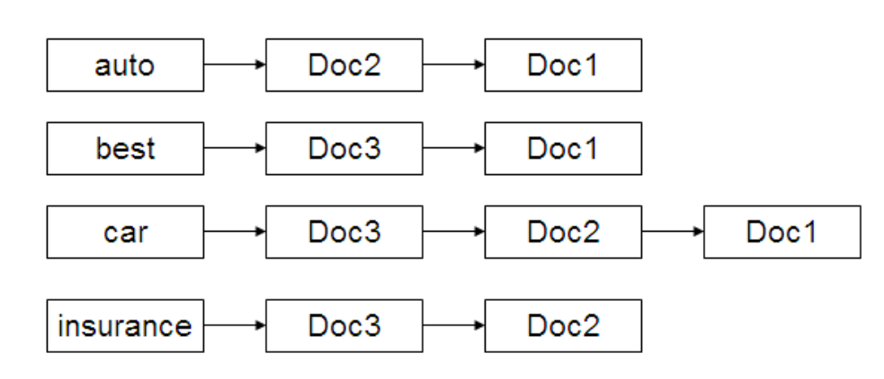
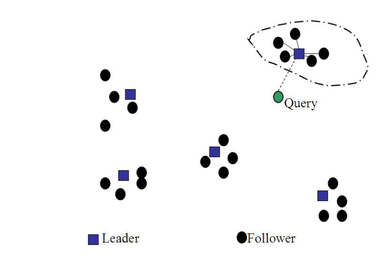
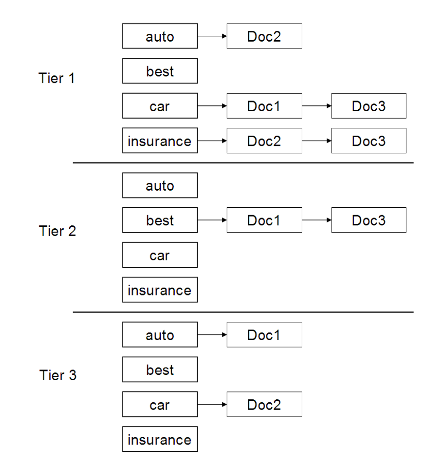
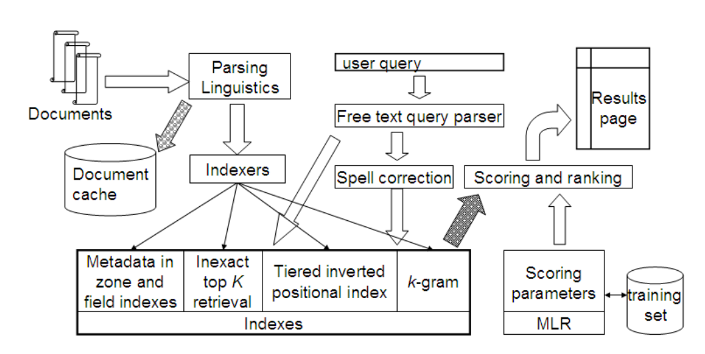

# 第 7 章 完整搜索系统中的评分计算

[返回系列目录](../introduction-to-information-retrieval.md) · [上一篇：第 6 章 评分、词项加权与向量空间模型](./06-scoring-term-weighting-and-vector-space-model.md) · [下一篇：第 8 章 信息检索的评估](./08-evaluation-in-information-retrieval.md)

原书印刷页 135–150；PDF 第 172–187 页。

<!-- source: PDF 172; printed: 135 -->

第 6 章介绍了用于评分的文档词项权重计算的基础理论，引出了向量空间模型以及第 6.3.3 节（原书第 124 页）的基本余弦评分算法。在本章中，我们首先在第 7.1 节介绍用于加速该计算的启发式方法；其中许多启发式方法在提高速度的同时，冒着无法完全找到与查询最匹配的前 $K$ 篇文档的风险。其中一些启发式方法可以推广到余弦评分之外。有了第 7.1 节的内容，我们基本上就具备了构建一个完整搜索引擎所需的所有组件。因此，我们从余弦评分退后一步，来探讨搜索引擎中计算评分这一更普遍的问题。在第 7.2 节中，我们概述了一个完整的搜索引擎，包括不仅支持余弦评分，还支持更一般的排序因素（如查询词项邻近度）的索引和结构。我们在第 7.2.4 节中描述了所有这些不同部分是如何组合在一起的。本章最后是第 7.3 节，我们将讨论自由文本查询的向量空间模型如何与常见的查询操作符相互作用。

## 7.1 高效评分与排序

我们首先回顾图 6.14 中的算法。对于诸如 $q =$ jealous gossip（嫉妒的流言蜚语）这样的查询，我们可以立即得出两个观察结果：

1. 单位向量 $\vec{v}(q)$ 只有两个非零分量。
2. 在没有对查询词项进行任何权重计算的情况下，这些非零分量是相等的——在这种情况下，两者都等于 0.707。

为了对匹配该查询的文档进行排序，我们真正感兴趣的是文档集中文档的相对（而不是绝对）评分。为此，只需计算每个文档单位向量 $\vec{v}(d)$ 与 $\vec{V}(q)$（其中查询向量的所有非零分量都设为 1）之间的余弦相似度，而不是与单位向量 $\vec{v}(q)$ 的余弦相似度。对于任何

<!-- source: PDF 173; printed: 136 -->

```text
FASTCOSINESCORE(q)
1  float Scores[N] = 0
2  for each d
3  do 将 Length[d] 初始化为文档 d 的长度
4  for each query term t
5  do 计算 w_{t,q} 并获取 t 的倒排记录表
6     for each pair(d, tf_{t,d}) in postings list
7     do 将 wf_{t,d} 加到 Scores[d] 中
8  读取数组 Length[d]
9  for each d
10 do 将 Scores[d] 除以 Length[d]
11 return Scores[] 中最大的 K 个分量
```

**图 7.1** 向量空间评分的一种更快的算法。

两个文档 $d_1, d_2$，有

$$ \vec{V}(q) \cdot \vec{v}(d_1) > \vec{V}(q) \cdot \vec{v}(d_2) \Leftrightarrow \vec{v}(q) \cdot \vec{v}(d_1) > \vec{v}(q) \cdot \vec{v}(d_2). \tag{7.1} $$

对于任何文档 $d$，余弦相似度 $\vec{V}(q) \cdot \vec{v}(d)$ 是查询 $q$ 中所有词项在 $d$ 中的权重的加权和。这反过来可以通过倒排记录求交来计算，完全如同图 6.14 中的算法一样，只是修改了第 8 行，因为我们将 $w_{t,q}$ 设为 1，使得该步骤中的乘加运算变成了单纯的加法；结果如图 7.1 所示。我们遍历倒排索引中 $q$ 的词项的倒排记录，累加每篇文档的总评分——这与处理布尔查询非常相似，不同之处在于我们为出现在任何被遍历的倒排记录中的每篇文档分配一个正评分。正如第 6.3.3 节所述，我们为每个词典词项维护一个 idf 值，并为每个倒排记录条目维护一个 tf 值。该方案为任何查询词项的倒排记录中的每篇文档计算评分；此类文档的总数可能大大小于 $N$。

给定这些评分，在向用户展示结果之前的最后一步是挑选出评分最高的 $K$ 篇文档。虽然可以对完整的评分集合进行排序，但更好的方法是使用堆（heap）来按顺序仅检索前 $K$ 篇文档。假设 $J$ 是余弦评分非零的文档数量，构建这样一个堆可以在 $2J$ 步比较内完成，随后可以通过 $\log J$ 步比较从堆中“读出” $K$ 篇最高评分文档中的每一篇。

<!-- source: PDF 174; printed: 137 -->

### 7.1.1 非精确前 $K$ 篇文档检索

到目前为止，我们一直专注于精确检索查询中评分最高的 $K$ 篇文档。现在我们考虑一些方案，通过这些方案我们生成的 $K$ 篇文档**很可能**属于查询中评分最高的 $K$ 篇文档。这样做，我们希望大幅降低计算输出的 $K$ 篇文档的成本，而不会实质性地改变用户对前 $K$ 个结果感知到的相关性。因此，在大多数应用中，检索出评分非常接近前 $K$ 篇最佳文档的 $K$ 篇文档就足够了。在接下来的几节中，我们将详细介绍检索这 $K$ 篇文档的方案，同时可能避免计算文档集中大多数（即 $N$ 篇中的大部分）文档的评分。

从用户的角度来看，这种非精确的前 $K$ 篇检索未必是件坏事。无论如何，根据余弦度量得出的前 $K$ 篇文档不一定是查询的最佳 $K$ 篇文档：余弦相似度仅仅是用户感知相关性的一个替代指标。在下面的第 7.1.2–7.1.6 节中，我们给出了一些启发式方法，使用这些方法我们很可能检索到余弦评分接近前 $K$ 篇文档的 $K$ 篇文档。计算输出的主要成本源于计算查询与大量文档之间的余弦相似度。有大量文档参与竞争也会增加最后阶段从堆中剔除并选出前 $K$ 篇文档的选择成本。我们现在考虑一系列旨在消除大量文档而无需计算其余弦评分的想法。这些启发式方法具有以下两步方案：

1. 找到一个候选文档集合 $A$，其中 $K < |A| \ll N$。$A$ 不一定包含查询中评分最高的前 $K$ 篇文档，但很可能包含许多评分接近前 $K$ 篇的文档。
2. 返回 $A$ 中评分最高的前 $K$ 篇文档。

从这些想法的描述中可以清楚地看出，其中许多想法需要根据手头的文档集和应用程序来调整参数；有关设置这些参数的经验指南可以在本章末尾找到。还应注意的是，大多数这些启发式方法非常适合自由文本查询，但不适用于布尔查询或短语查询。

### 7.1.2 索引消除

对于多词项查询 $q$，很明显我们只考虑至少包含一个查询词项的文档。我们可以使用额外的启发式方法进一步推进：

1. 我们只考虑包含 idf 超过预设阈值的词项的文档。因此，在倒排记录遍历中，我们只遍历

<!-- source: PDF 175; printed: 138 -->

高 idf 词项的倒排记录。这具有相当显著的好处：低 idf 词项的倒排记录表通常很长；将这些从竞争中移除后，我们需要计算余弦值的文档集合将大大减少。看待这种启发式方法的一种方式是：低 idf 词项被视为停用词，不参与评分。例如，对于查询 catcher in the rye（麦田里的守望者），我们只遍历 catcher 和 rye 的倒排记录。当然，截断阈值可以根据查询以自适应的方式进行调整。

2. 我们只考虑包含许多（作为特例，所有）查询词项的文档。这可以在倒排记录遍历期间完成；我们只为包含所有（或许多）查询词项的文档计算评分。这种方案的一个危险在于，通过要求文档中必须存在所有（甚至许多）查询词项才考虑对其进行余弦计算，我们最终输出的候选文档可能少于 $K$ 篇。这个问题将在第 7.2.1 节中进一步讨论。

### 7.1.3 优胜者表

优胜者表（champion lists，有时也称为 fancy lists 或 top docs）的想法是，为词典中的每个词项 $t$ 预先计算出 $t$ 的权重最高的 $r$ 篇文档的集合；$r$ 的值是预先选择的。对于 tf-idf 权重计算，这些将是词项 $t$ 的 tf 值最高的 $r$ 篇文档。我们将这 $r$ 篇文档的集合称为词项 $t$ 的优胜者表。

现在，给定一个查询 $q$，我们按如下方式创建一个集合 $A$：我们取构成 $q$ 的每个词项的优胜者表的并集。我们现在将余弦计算仅限制在 $A$ 中的文档上。该方案中的一个关键参数是值 $r$，它高度依赖于应用程序。直观地说，与 $K$ 相比，$r$ 应该很大，特别是如果我们使用第 7.1.2 节中描述的任何形式的索引消除。这里的一个问题是，值 $r$ 是在索引构建时设置的，而 $K$ 依赖于应用程序，并且可能直到收到查询时才可用；结果我们可能（如索引消除的情况一样）发现自己得到的集合 $A$ 少于 $K$ 篇文档。没有理由对词典中的所有词项使用相同的 $r$ 值；例如，对于较罕见的词项，可以将其设置得更高。

### 7.1.4 静态质量得分与排序

**静态质量得分**（STATIC QUALITY SCORES）
我们现在在静态质量得分这一稍微更一般的背景下，进一步发展优胜者表的想法。在许多搜索引擎中，我们可以为每篇文档 $d$ 提供一种质量度量 $g(d)$，该度量与查询无关，因此是静态的。这种质量度量可以看作是 0 到 1 之间的一个数字。例如，在网络新闻报道的背景下，$g(d)$ 可以从网民对该报道的好评数量中得出。

<!-- source: PDF 176; printed: 139 -->



**图 7.2** 静态质量排序索引。在这个例子中，我们假设 Doc1、Doc2 和 Doc3 的静态质量评分分别为 $g(1) = 0.25$、$g(2) = 0.5$、$g(3) = 1$。

图中文字：auto, best, car, insurance, Doc1, Doc2, Doc3

网民的青睐程度。第 4.6 节（原书第 80 页）对此主题提供了进一步的讨论，第 21 章在 Web 搜索的背景下也进行了讨论。

文档 $d$ 的净评分（net score）是 $g(d)$ 与由（例如）式（6.12）导出的依赖于查询的评分的某种组合。精确的组合可以通过第 6.1.2 节的机器学习方法来确定，这将在第 15.4.1 节中进一步展开；但为了我们在此处的阐述，让我们考虑一个简单的求和：

$$
\text{net-score}(q, d) = g(d) + \frac{\vec{V}(q) \cdot \vec{V}(d)}{|\vec{V}(q)||\vec{V}(d)|}. \tag{7.2}
$$

在这种简单形式中，假设两者都在 0 和 1 之间，静态质量 $g(d)$ 和来自式（6.10）的依赖于查询的评分具有相等的贡献。其他相对权重也是可能的；我们启发式方法的有效性将取决于具体的相对权重。

首先，考虑按照 $g(d)$ 的降序对每个词项的倒排记录表中的文档进行排序。这允许我们执行图 1.6 的倒排记录求交算法。为了通过对每个查询词项的倒排记录进行单次遍历来执行求交，图 1.6 的算法依赖于按文档 ID 排序的倒排记录。但实际上，我们只要求所有倒排记录按单一的共同顺序排序；在这里，我们依赖 $g(d)$ 值来提供这种共同排序。这在图 7.2 中得到了说明，其中倒排记录按 $g(d)$ 的降序排列。

第一个想法是优胜者表的直接扩展：对于一个精心选择的值 $r$，我们为每个词项 $t$ 维护一个包含 $r$ 个文档的全局优胜者表（global champion list），这些文档

<!-- source: PDF 177; printed: 140 -->

具有最高的 $g(d) + \text{tf-idf}_{t,d}$ 值。与迄今为止考虑的所有倒排记录表一样，该表本身按共同的顺序（按文档 ID 或静态质量）排序。然后在查询时，我们仅计算这些全局优胜者表并集中的文档的净评分（7.2）。直观地说，这具有将注意力集中在可能具有较高净评分的文档上的效果。

我们用另一个想法来结束对全局优胜者表的讨论。我们为每个词项 $t$ 维护两个由不相交的文档集组成的倒排记录表，每个表都按 $g(d)$ 值排序。第一个表我们称为 high（高），包含 $t$ 的 tf 值最高的 $m$ 个文档。第二个表我们称为 low（低），包含所有其他包含 $t$ 的文档。在处理查询时，我们首先仅扫描查询词项的 high 表，为所有（或超过一定数量的）查询词项的 high 表中的任何文档计算净评分。如果在此过程中我们获得了 $K$ 个文档的评分，我们就终止。如果没有，我们继续扫描 low 表，对这些倒排记录表中的文档进行评分。这个想法在第 7.2.1 节中得到了进一步的发展。

### 7.1.5 影响度排序

在迄今为止描述的所有倒排记录表中，我们始终按照某种共同的顺序对文档进行排序：通常按文档 ID 排序，但在第 7.1.4 节中按静态质量评分排序。正如第 6.3.3 节末尾所指出的，这种共同的排序支持并发遍历所有查询词项的倒排记录表，在遇到每个文档时计算其评分。以这种方式计算评分有时被称为逐文档评分（document-at-a-time scoring）。我们现在将介绍一种用于非精确前 $K$ 个检索的技术，其中倒排记录并不都按共同的顺序排序，从而排除了这种并发遍历。因此，我们将要求像图 6.14 的方案中那样，每次一个词项地“累加”评分，这样我们就有了逐词项评分（term-at-a-time scoring）。

这个想法是按照 $\text{tf}_{t,d}$ 的降序对词项 $t$ 的倒排记录表中的文档 $d$ 进行排序。因此，文档的排序在不同的倒排记录表之间会有所不同，我们无法通过并发遍历所有查询词项的倒排记录表来计算评分。给定按 $\text{tf}_{t,d}$ 降序排列的倒排记录表，人们发现有两个想法可以显著降低我们为其累加评分的文档数量：（1）在遍历查询词项 $t$ 的倒排记录表时，我们在考虑了倒排记录表的前缀后停止——要么在看到固定数量的文档 $r$ 之后，要么在 $\text{tf}_{t,d}$ 的值降至阈值以下之后；（2）在图 6.14 的外层循环中累加评分时，我们按 idf 的降序考虑查询词项，以便首先考虑可能对最终评分贡献最大的查询词项。后一个想法在处理查询时也可以是自适应的：当我们遇到 idf 较低的查询词项时，我们可以根据

<!-- source: PDF 178; printed: 141 -->

处理前一个查询词项引起的文档评分变化来决定是否继续。如果这些变化极小，我们可以省略剩余查询词项的累加，或者处理它们倒排记录表的更短前缀。

这些想法构成了第 7.1.2–7.1.4 节中介绍的方法的共同推广。我们也可以实现一种静态排序的版本，其中每个倒排记录表按静态评分和依赖于查询的评分的加性组合进行排序。我们将再次失去倒排记录之间排序的一致性，从而不得不每次处理一个查询词项，并在进行过程中为所有文档累加评分。根据特定的评分函数，文档的倒排记录表可以按词项频率以外的其他量进行排序；在这种更一般的设置下，这个想法被称为影响度排序（impact ordering）。

### 7.1.6 聚类剪枝

在聚类剪枝（cluster pruning）中，我们有一个预处理步骤，在此期间我们对文档向量进行聚类。然后在查询时，我们仅考虑少数几个簇中的文档作为候选者，并为它们计算余弦评分。具体来说，预处理步骤如下：

1. 从文档集中随机挑选 $\sqrt{N}$ 个文档。称这些为领导者（leaders）。
2. 对于每个不是领导者的文档，我们计算其最近的领导者。

我们将不是领导者的文档称为追随者（followers）。直观地说，在使用随机选择的 $\sqrt{N}$ 个领导者导出的追随者划分中，每个领导者的预期追随者数量 $\approx N/\sqrt{N} = \sqrt{N}$。接下来，查询处理过程如下：

1. 给定查询 $q$，找到最接近 $q$ 的领导者 $L$。这需要计算从 $q$ 到每个 $\sqrt{N}$ 个领导者的余弦相似度。
2. 候选集 $A$ 由 $L$ 及其追随者组成。我们计算该候选集中所有文档的余弦评分。

使用随机选择的领导者进行聚类速度很快，并且可能反映文档向量在向量空间中的分布：文档密集的向量空间区域可能会产生多个领导者，从而产生更精细的子区域划分。这在图 7.3 中得到了说明。

聚类剪枝的变体引入了额外的参数 $b_1$ 和 $b_2$，两者都是正整数。在预处理步骤中，我们将每个追随者附加到其最近的 $b_1$ 个领导者，而不是单个最近的领导者。在查询时，我们考虑最接近查询 $q$ 的 $b_2$ 个领导者。显然，上述基本方案对应于 $b_1 = b_2 = 1$ 的情况。此外，增加 $b_1$ 或

<!-- source: PDF 179; printed: 142 -->



**图 7.3** 聚类剪枝。

图中文字：Query（查询）、Leader（领头文档）、Follower（跟随文档）。

$b_2$ 会增加找到更有可能属于真正最高评分前 $K$ 个文档集合中的 $K$ 个文档的可能性，代价是更多的计算量。我们在第 16 章（原书第 354 页）描述聚类时会重申这种方法。

**练习 7.1**
我们在上文（图 7.2）建议静态质量排序的倒排记录按 $g(d)$ 的降序排列。为什么我们使用降序而不是升序？

**练习 7.2**
在讨论优胜者表时，我们简单地使用具有最大 tf 值的 $r$ 个文档来创建 $t$ 的优胜者表。但在考虑全局优胜者表时，我们也使用了 idf，识别出具有最大 $g(d) + \text{tf-idf}_{t,d}$ 值的文档。为什么我们要区分这两种情况？

**练习 7.3**
如果我们只有单词项查询，请解释为什么使用 $r = K$ 的全局优胜者表足以识别出评分最高的 $K$ 个文档。如果我们对于任何固定的整数 $s > 1$ 只有 $s$ 个词项的查询，对这个想法的一个简单修改是什么？

**练习 7.4**
解释所有 high 表和 low 表中按 $g(d)$ 值进行的共同全局排序如何有助于提高评分计算的效率。

<!-- source: PDF 180; printed: 143 -->

**练习 7.5**
再次考虑练习 6.23 中的数据，使用 `nnn.atc` 进行与查询相关的评分。假设我们给定 Doc1 的静态质量评分为 1，Doc2 的静态质量评分为 2。根据式（7.2），确定 Doc3 的静态质量评分在什么范围内，会使其成为查询 *best car insurance*（最好的汽车保险）的第一、第二或第三个结果。

**练习 7.6**
画出图 6.9 中数据按频率排序的倒排记录。

**练习 7.7**
假设图 6.11 中 Doc1、Doc2 和 Doc3 的静态质量评分分别为 0.25、0.5 和 1。当每个倒排记录表按照静态质量评分与图 6.11 中欧几里得归一化 tf 值之和进行排序时，画出按影响力排序（impact ordering）的倒排记录。

**练习 7.8**
平面上的最近邻问题如下：给定平面上的 $N$ 个数据点，我们将它们预处理成某种数据结构，使得给定一个查询点 $Q$ 时，我们在 $N$ 中寻找欧几里得距离上最接近 $Q$ 的点。显然，如果我们希望避免计算 $Q$ 到每一个数据点（原文为 query points）的距离，簇修剪（cluster pruning）可以作为解决平面上最近邻问题的一种方法。设计一个平面上的简单示例，使得在有两个领导者（leaders）的情况下，簇修剪返回的答案是不正确的（它不是最接近 $Q$ 的数据点）。

## 7.2 信息检索系统的组成部分

在本节中，我们将结合迄今为止提出的思想，描述一个检索并对文档进行评分的基础搜索系统。我们首先在向量空间之外，进一步探讨评分的思想。随后，我们将把所有这些元素组合在一起，勾勒出一个完整的系统。因为我们考虑的是一个完整的系统，所以在本节中我们不局限于向量空间检索。事实上，我们的完整系统将为向量空间以及其他查询操作符和检索形式提供支持。在第 7.3 节中，我们将回到向量空间查询如何与其他查询操作符交互的问题。

### 7.2.1 层级索引

我们在第 7.1.2 节中提到，当使用索引消除等启发式方法进行非精确的 top-$K$ 检索时，我们偶尔会发现候选集 $A$ 中的文档数量少于 $K$ 个。解决这个问题的一个常见方法是使用**层级索引**（TIERED INDEXES），它可以被视为优胜者表的推广。我们在图 7.4 中说明了这个想法，其中我们表示了图 6.9 中的文档和词项。在这个例子中，我们将第 1 层的 tf 阈值设置为 20，第 2 层的阈值设置为 10，这意味着第 1 层索引仅包含 tf 值超过 20 的倒排记录项，而第 2 层索引仅

<!-- source: PDF 181; printed: 144 -->


**图 7.4** 层级索引。如果我们未能从第 1 层获得 $K$ 个结果，查询处理将“回退”到第 2 层，依此类推。在每一层内，倒排记录按文档 ID 排序。
图中文字：Tier 1/第 1 层；Tier 2/第 2 层；Tier 3/第 3 层；auto/auto；best/best；car/car；insurance/insurance；Doc1/Doc1；Doc2/Doc2；Doc3/Doc3。

包含 tf 值超过 10 的倒排记录项。在这个例子中，我们选择在每一层内按文档 ID 对倒排记录项进行排序。

### 7.2.2 查询词项邻近性

特别是对于 Web 上的自由文本查询（第 19 章），用户更喜欢大多数或所有查询词项在其中彼此靠近出现的文档，

<!-- source: PDF 182; printed: 145 -->

因为这证明该文档包含专注于其查询意图的文本。考虑一个包含两个或多个查询词项 $t_1, t_2, \ldots, t_k$ 的查询。设 $\omega$ 为文档 $d$ 中包含所有查询词项的最小窗口的宽度，以窗口中的单词数来衡量。例如，如果文档仅仅由句子 *The quality of mercy is not strained*（慈悲的品质是不受勉强的）组成，那么对于查询 *strained mercy*，最小窗口将是 4。直观地说，$\omega$ 越小，$d$ 与查询的匹配度就越好。在文档不包含所有查询词项的情况下，我们可以将 $\omega$ 设置为一个极大的数字。我们还可以考虑在计算 $\omega$ 时仅考虑非停用词的变体。这种邻近性加权评分函数偏离了纯粹的余弦相似度，而更接近于 Google 和其他 Web 搜索引擎显然在使用的“软合取”（soft conjunctive）语义。

我们如何设计这样一个依赖于 $\omega$ 的**邻近性加权**（PROXIMITY WEIGHTING）评分函数呢？最简单的答案依赖于我们在下面第 7.2.3 节中介绍的“手工编码”（hand coding）技术。一种更具可扩展性的方法可以追溯到第 6.1.2 节——我们将整数 $\omega$ 视为评分函数中的另一个特征，其重要性由机器学习分配，这将在第 15.4.1 节中进一步展开。

### 7.2.3 设计解析与评分函数

常见的搜索界面，特别是 Web 上面向消费者的搜索应用程序，倾向于向最终用户屏蔽查询操作符。其目的是向此类应用程序中主要为非技术受众的用户隐藏这些操作符的复杂性，从而鼓励自由文本查询。给定这样的界面，配备了各种检索操作符索引的搜索引擎应该如何处理诸如 *rising interest rates*（不断上升的利率）这样的查询？更一般地说，考虑到我们研究过的可能影响文档评分的各种因素，我们应该如何组合这些特征？

答案当然取决于用户群体、查询分布和文档集。通常，查询解析器（query parser）用于将用户指定的关键字转换为带有各种操作符的查询，并在底层索引上执行。有时，这种执行可能需要对底层索引进行多次查询；例如，查询解析器可能会发出一系列查询：

1. 将用户生成的查询字符串作为短语查询运行。使用由 3 个词项 *rising interest rates* 组成的向量作为查询，通过向量空间评分对它们进行排序。
2. 如果包含短语 *rising interest rates* 的文档少于十篇，则运行两个双词项短语查询 *rising interest* 和 *interest rates*；同样使用向量空间评分对它们进行排序。

<!-- source: PDF 183; printed: 146 -->

3. 如果结果仍然少于十个，则运行由三个单独查询词项组成的向量空间查询。

这些步骤中的每一步（如果被调用）都可能产生一个已评分的文档列表，我们为其中的每个文档计算一个评分。该评分必须结合来自向量空间评分、静态质量、邻近性加权以及潜在的其他因素的贡献——特别是因为一个文档可能会出现在多个步骤的列表中。这就需要一个聚合评分函数，它能从多个来源进行文档相关性的**证据积累**（EVIDENCE ACCUMULATION）。我们如何设计查询解析器，又如何设计聚合评分函数呢？

答案取决于具体的应用环境。在许多企业环境中，应用程序构建者利用可用评分操作符的工具包以及查询解析层，来手动配置评分函数和查询解析器。这些应用程序构建者利用可用的域、元数据以及对典型文档和查询的知识来调整解析和评分。在特征不经常变化的文档集中（在企业应用程序中，文档集和查询特征的显著变化通常伴随着不常发生的事件，例如引入新的文档格式或文档管理系统，或者与另一家公司合并）。另一方面，Web 搜索面临着一个不断变化的文档集，新特征无时无刻不在被引入。在这种环境下，评分因素的数量可能达到数百个，使得手工调整评分成为一项困难的任务。为了解决这个问题，使用机器学习评分变得越来越普遍，这扩展了我们在第 6.1.2 节中介绍的思想，并将在第 15.4.1 节中进一步讨论。

### 7.2.4 综合应用

我们现在已经学习了支持自由文本查询以及布尔、域和字段查询的基础搜索系统所需的所有组件。我们简要回顾一下各个部分是如何组合成一个整体系统的；这在图 7.5 中进行了描绘。

在该图中，文档从左侧流入以进行解析和语言学处理（语言和格式检测、词元化和词干提取）。生成的词元流输入到两个模块中。首先，我们在文档缓存中保留每个已解析文档的副本。这将使我们能够生成结果摘要（snippets）：在查询的结果列表中伴随每个文档的文本片段。该摘要试图向用户简明扼要地解释为什么该文档与查询匹配。这种摘要的自动生成是第 8.7 节的主题。词元的第二份副本被送入一组索引器中，这些索引器创建一组索引，包括存储每个文档元数据的域和字段索引，

<!-- source: PDF 184; printed: 147 -->



**图 7.5** 一个完整的搜索系统。数据路径主要针对自由文本查询显示。

图中文字：Documents 文档; Parsing Linguistics 语法分析 语言学处理; user query 用户查询; Free text query parser 自由文本查询解析器; Results page 结果页面; Document cache 文档缓存; Indexers 索引器; Spell correction 拼写纠错; Scoring and ranking 评分与排序; Metadata in zone and field indexes 域和字段索引中的元数据; Inexact top K retrieval 非精确前 K 个检索; Tiered inverted positional index 分层倒排位置索引; k-gram k-gram 索引; Indexes 索引; Scoring parameters 评分参数; MLR 机器学习排序; training set 训练集。

（分层）位置索引、用于拼写纠错和其他容错检索的索引，以及用于加速非精确前 $K$ 个检索的结构。自由文本用户查询（顶部居中）既直接发送到索引，也通过一个生成拼写纠错候选的模块发送到索引。正如第 3 章所述，后者可以选择仅在原始查询未能检索到足够结果时才被调用。检索到的文档（深色箭头）被传递给评分模块，该模块基于机器学习排序（machine-learned ranking, MLR）计算评分，这是一种基于第 6.1.2 节（将在第 15.4.1 节中进一步展开）的技术，用于对文档进行评分和排序。最后，这些排好序的文档被渲染为结果页面。

**练习 7.9**
解释如何调整第 1.3 节中首次引入的倒排记录表求交算法，以找到包含所有查询词项的最小整数窗口 $\omega$。

**练习 7.10**
调整此过程，使其在并非所有查询词项都出现在文档中时也能工作。

## 7.3 向量空间评分与查询操作符的交互

我们引入了向量空间模型作为自由文本查询的范式。在本章的最后，我们将讨论向量空间评分模型如何

<!-- source: PDF 185; printed: 148 -->

与我们在前面章节中学习的查询操作符相关联。这种关系应该从两个层面来看：一是复杂用户可能提出的查询的表达能力，二是支持各种检索方法评估的索引。在构建搜索引擎时，我们可能会选择为最终用户支持多种查询操作符。在这样做的过程中，我们需要了解索引的哪些组件可以共享以执行各种查询操作符，以及如何处理混合了各种查询操作符的用户查询。

向量空间评分支持所谓的自由文本检索（free text retrieval），其中查询被指定为一组单词，没有任何查询操作符连接它们。它允许对与查询匹配的文档进行评分并因此进行排序，这与前面学习的布尔查询、通配符查询和短语查询不同。传统上，这种自由文本查询的解释是，任何检索到的文档中至少存在一个查询词项。然而最近，像 Google 这样的 Web 搜索引擎普及了这样一种观念：在它们的查询框中输入的一组词项（因此表面上看是一个自由文本查询）带有合取查询的语义，只检索包含所有或大部分查询词项的文档。

### 布尔检索

显然，向量空间索引可以用来回答布尔查询，只要当词项 $t$ 出现在文档 $d$ 中时，$t$ 在 $d$ 的文档向量中的权重非零即可。反之则不成立，因为布尔索引默认不维护词项权重信息。从用户的角度来看，没有简单的方法可以将向量空间查询和布尔查询结合起来：向量空间查询从根本上说是一种证据积累（evidence accumulation）的形式，其中文档中出现更多的查询词项会增加文档的评分。另一方面，布尔检索要求用户指定一个公式，通过特定关键字组合的出现（或不出现）来选择文档，而不会在它们之间引入任何相对排序。在数学上，实际上可以调用所谓的 $p$-范数（$p$-norms）来结合布尔查询和向量空间查询，但我们不知道有哪个系统利用了这一事实。

### 通配符查询

通配符查询和向量空间查询需要不同的索引，除了一点基本层面上的共性，即两者都可以使用倒排记录和词典（例如，用于通配符查询的三元语法词典）来实现。如果搜索引擎允许用户在自由文本查询中指定通配符操作符（例如，查询 `rom* restaurant`（rom* 餐厅）），我们可以将查询的通配符部分解释为在向量空间中生成多个词项（在这个例子中，`rome`（罗马）

<!-- source: PDF 186; printed: 149 -->

和 `roman`（罗马的）将是两个这样的词项），所有这些词项都被添加到查询向量中。然后像往常一样执行向量空间查询，对匹配的文档进行评分和排序；因此，同时包含 `rome` 和 `roma`（罗马）的文档的评分可能会高于只包含其中一个的文档。当然，确切的评分排序将取决于匹配文档中每个词项的相对权重。

### 短语查询

将文档表示为向量从根本上说是有损的：在将文档编码为向量的过程中，文档中词项的相对顺序丢失了。即使我们试图以某种方式将每个双词（biword）视为一个词项（从而成为向量空间中的一个轴），不同轴上的权重也不是独立的：例如，短语 `German shepherd`（德国牧羊犬）被编码在 `german shepherd` 轴上，但同时在 `german`（德国）和 `shepherd`（牧羊犬）轴上也立即具有非零权重。此外，诸如 idf 之类的概念必须扩展到此类双词。因此，为向量空间检索构建的索引通常不能用于短语查询。此外，无法要求为短语查询提供向量空间评分——我们只知道文档中每个词项的相对权重。

对于查询 `german shepherd`，我们可以使用向量空间检索来识别大量包含这两个词项的文档，但无法规定它们必须连续出现。另一方面，短语检索告诉我们文档中存在短语 `german shepherd`，而没有任何关于该短语的相对频率或权重的指示。虽然这两种检索范式（短语和向量空间）在索引和检索算法方面因此具有不同的实现，但在某些情况下它们可以有效地结合起来，正如第 7.2.3 节中查询解析的三步示例所示。

## 7.4 参考文献及进一步阅读

Anh et al. (2001)、Garcia et al. (2004)、Anh and Moffat (2006b) 以及 Persin et al. (1996) 描述了用于带有提前终止的快速查询处理的启发式方法。Singitham et al. (2004) 和 Chierichetti et al. (2007) 研究了簇修剪（cluster pruning）；另见第 16.6 节（第 372 页）。**TOP DOCS** 优胜者表（champion lists）在 Persin (1994) 和 Brown (1995)（以 top docs 为名）中进行了描述，并在 Brin and Page (1998)、Long and Suel (2003) 中得到了进一步发展。虽然这些启发式方法非常适合可以被视为向量的自由文本查询，但它们使短语查询变得复杂；关于支持加权和布尔/短语搜索的索引结构，请参见 Anh and Moffat (2006c)。Carmel et al. (2001)、Clarke et al. (2000) 和 Song et al. (2005) 探讨了查询

<!-- source: PDF 187; printed: 150 -->

词项邻近性在评估相关性中的应用。Fuhr (1989)、Fuhr and Pfeifer (1994)、Cooper et al. (1994)、Bartell (1994)、Bartell et al. (1998) 以及 Cohen et al. (1998) 在学习排序函数方面做出了开创性的工作。

[返回系列目录](../introduction-to-information-retrieval.md) · [上一篇：第 6 章 评分、词项加权与向量空间模型](./06-scoring-term-weighting-and-vector-space-model.md) · [下一篇：第 8 章 信息检索的评估](./08-evaluation-in-information-retrieval.md)
