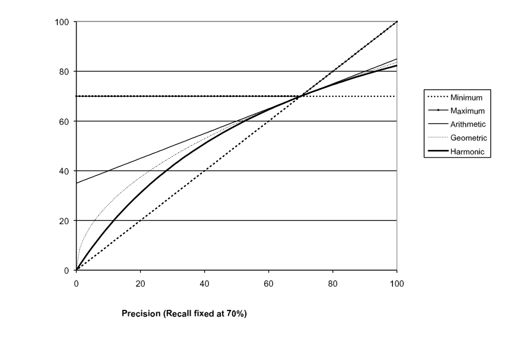
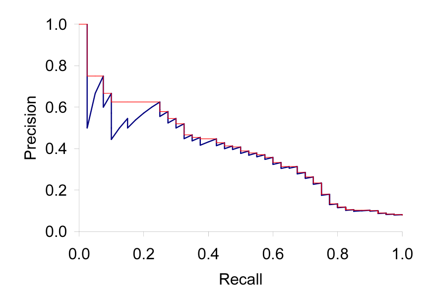
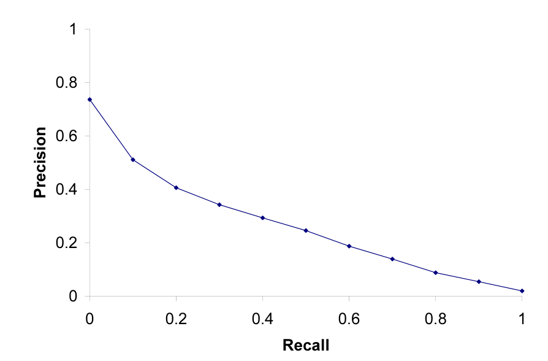
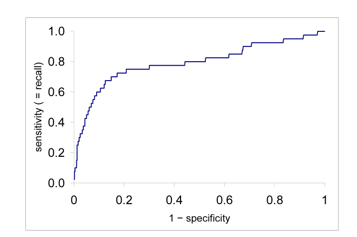

# 第 8 章 信息检索的评估

[返回系列目录](../introduction-to-information-retrieval.md) · [上一篇：第 7 章 完整搜索系统中的评分计算](./07-computing-scores-in-a-complete-search-system.md) · [下一篇：第 9 章 相关反馈与查询扩展](./09-relevance-feedback-and-query-expansion.md)

原书印刷页 151–176；PDF 第 188–213 页。

<!-- source: PDF 188; printed: 151 -->

在前面的章节中，我们已经看到了设计信息检索（IR）系统的许多备选方案。我们如何知道这些技术中哪些在哪些应用中是有效的？我们应该使用停用词表吗？应该进行词干提取吗？应该使用逆文档频率权重计算吗？信息检索已经发展成为一门高度经验性的学科，需要进行仔细而彻底的评价，以证明新技术在具有代表性的文档集上的优越性能。

在本章中，我们首先讨论如何衡量 IR 系统的有效性（第 8.1 节）以及最常用于此目的的测试集（第 8.2 节）。然后，我们介绍相关文档和不相关文档的直观概念，以及为评价无排序检索结果而开发的正式评价方法（第 8.3 节）。这包括解释标准用于文档检索及相关任务（如文本分类）的各种评价指标，以及它们为何适用。接着，我们扩展这些概念，开发用于评价排序检索结果的进一步指标（第 8.4 节），并讨论如何开发可靠且信息丰富的测试集（第 8.5 节）。

然后，我们回过头来介绍用户效用（user utility）的概念，以及如何通过使用文档相关性来近似它（第 8.6 节）。关键的效用指标是用户的满意度。响应速度和索引大小是影响用户满意度的因素。假设结果的相关性是最重要的因素似乎是合理的：极快但无用的答案并不能让用户满意。然而，用户的感知并不总是与系统设计者对质量的观念相一致。例如，用户满意度通常在很大程度上取决于用户界面设计问题，包括用户界面的布局、清晰度和响应性，这些都与返回结果的质量无关。我们还会涉及衡量系统质量的其他指标，特别是生成高质量结果摘要片段（snippets），这极大地影响了用户效用，但在基本的相关性排序范式中并未被衡量（第 8.7 节）。

<!-- source: PDF 189; printed: 152 -->

## 8.1 信息检索系统评价

为了以标准方式衡量特设信息检索（ad hoc information retrieval）的有效性，我们需要一个包含以下三项内容的测试集：

1. 一个文档集
2. 一组信息需求测试套件，可表达为查询
3. 一组相关性判断，标准做法是对每个查询-文档对进行相关或不相关的二元评估。

信息检索系统评价的标准方法围绕着相关文档和不相关文档的概念展开。相对于用户的信息需求，测试集中的文档被赋予相关或不相关的二元分类（**相关性**，RELEVANCE）。这一决定被称为相关性的**黄金标准**（GOLD STANDARD）或**真实情况**（GROUND TRUTH）判断。测试文档集和信息需求套件必须具有合理的规模：你需要在相当大的测试集上平均性能，因为结果在不同的文档和信息需求上差异很大。根据经验法则，通常发现 50 个信息需求是一个足够的最小值。

相关性是相对于**信息需求**（INFORMATION NEED）而不是查询来评估的。例如，一个信息需求可能是：

> 关于喝红酒是否比喝白葡萄酒在降低心脏病发作风险方面更有效的信息。

这可能会被转换为如下查询：

> wine AND red AND white AND heart AND attack AND effective（葡萄酒 AND 红 AND 白 AND 心脏 AND 发作 AND 有效）

如果一篇文档解决了所述的信息需求，那么它就是相关的，而不是因为它恰好包含查询中的所有词。这种区别在实践中经常被误解，因为信息需求并不明显。但是，尽管如此，信息需求是存在的。如果用户在 Web 搜索引擎中输入 python，他们可能想知道在哪里可以买到宠物蟒蛇（python）。或者他们可能想要关于 Python 编程语言的信息。从一个单词查询中，系统很难知道信息需求是什么。但是，尽管如此，用户确实有一个信息需求，并且可以根据返回结果与其信息需求的相关性来判断它们。为了评价一个系统，我们需要对信息需求进行公开的表达，这可以用来判断返回的文档是相关的还是不相关的。在这一点上，我们做了一个简化：相关性可以合理地被认为是一个尺度，有些文档高度相关，而另一些则勉强相关。但目前，我们将仅使用相关性的二元决定。我们

<!-- source: PDF 190; printed: 153 -->

将在第 8.5.1 节讨论使用二元相关性判断的原因及替代方案。

许多系统包含各种可以调整以优化系统性能的权重（通常称为参数）。报告通过调整这些参数以在该测试集上最大化性能而获得的结果是错误的。这是因为这种调整夸大了系统的预期性能，因为权重将被设置为在特定的一组查询上最大化性能，而不是针对随机抽样的查询。在这种情况下，正确的程序是拥有一个或多个**开发测试集**（DEVELOPMENT TEST COLLECTION），并在开发测试集上调整参数。然后，测试人员使用这些权重在测试集上运行系统，并报告该测试集上的结果，作为性能的无偏估计。

## 8.2 标准测试集

以下是最标准的测试集和评价系列的列表。我们特别关注用于特设信息检索系统评价的测试集，但也提到了几个用于文本分类的类似测试集。

**Cranfield 测试集**（CRANFIELD）。这是允许对信息检索有效性进行精确量化衡量的开创性测试集，但如今它太小了，除了最基本的初步实验外，不适合做任何事情。它从 20 世纪 50 年代末开始在英国收集，包含 1398 篇空气动力学期刊文章的摘要、一组 225 个查询，以及所有（查询，文档）对的详尽相关性判断。

**文本检索会议**（TREC）。美国国家标准与技术研究院（NIST）自 1992 年以来一直运行一个大型 IR 测试平台评价系列。在这个框架内，在一系列不同的测试集上有很多评测任务，但最著名的测试集是 1992 年至 1999 年前 8 次 TREC 评价期间用于 TREC 特设（Ad Hoc）任务的测试集。总的来说，这些测试集包括 6 张 CD，包含 189 万篇文档（主要是但不限于新闻专线文章）以及对 450 个信息需求的相关性判断，这些信息需求被称为主题（topics），并在详细的文本段落中指定。单个测试集是在这些数据的不同子集上定义的。早期的 TREC 每次包含 50 个信息需求，在不同但重叠的文档集上进行评价。TREC 6–8 提供了关于约 528,000 篇新闻专线和外国广播信息服务文章的 150 个信息需求。这可能是未来工作中使用的最佳子集，因为它是最大的，而且主题更加一致。因为测试

<!-- source: PDF 191; printed: 154 -->

文档集如此之大，以至于没有详尽的相关性判断。相反，NIST 评估员的相关性判断仅适用于在 TREC 评价中提交的某些系统返回的前 $k$ 篇文档，而该信息需求正是为该评价开发的。

近年来，NIST 在更大的文档集上进行了评价，包括包含 2500 万个网页的 **GOV2** 网页集合。从一开始，NIST 测试文档集就比研究人员以前可用的任何文档集大几个数量级，而 GOV2 现在是可轻松用于研究目的的最大 Web 集合。尽管如此，GOV2 的规模仍然比大型 Web 搜索公司当前索引的文档集规模小 2 个数量级以上。

**NII 信息检索系统测试集**（NTCIR）。NTCIR 项目构建了各种与 TREC 集合规模相似的测试集，重点关注东亚语言和**跨语言信息检索**（CROSS-LANGUAGE INFORMATION RETRIEVAL），其中使用一种语言进行查询，而在包含一种或多种其他语言文档的文档集上进行检索。参见：http://research.nii.ac.jp/ntcir/data/data-en.html

**跨语言评价论坛**（CLEF）。该评价系列集中于欧洲语言和跨语言信息检索。参见：http://www.clef-campaign.org/

**Reuters-21578 和 Reuters-RCV1**（REUTERS）。对于文本分类，最常用的测试集是包含 21578 篇新闻专线文章的 Reuters-21578 集合；参见第 13 章，第 279 页。最近，路透社发布了更大的路透社语料库第 1 卷（RCV1），包含 806,791 篇文档；参见第 4 章，第 69 页。它的规模和丰富的标注使其成为未来研究的更好基础。

**20 Newsgroups**。这是另一个广泛使用的文本分类集合，由 Ken Lang 收集。它包含来自 20 个 Usenet 新闻组的各 1000 篇文章（新闻组名称被视为类别）。在删除重复文章后（通常的使用方式），它包含 18941 篇文章。

## 8.3 无排序检索集合的评价

给定这些要素，如何衡量系统的有效性？衡量信息检索有效性最常用和最基本的两个指标是查准率（precision）和召回率（recall）。它们首先针对简单的无排序情况进行定义，即一个

<!-- source: PDF 192; printed: 155 -->

IR 系统针对查询返回一个文档集。稍后我们将看到如何将这些概念扩展到排序检索的情况。

**查准率（PRECISION）**

查准率（Precision，$P$）是检索到的文档中相关文档所占的比例

$$ \text{Precision} = \frac{\#(\text{relevant items retrieved})}{\#(\text{retrieved items})} = P(\text{relevant}|\text{retrieved}) \tag{8.1} $$

**召回率（RECALL）**

召回率（Recall，$R$）是相关文档中被检索到的比例

$$ \text{Recall} = \frac{\#(\text{relevant items retrieved})}{\#(\text{relevant items})} = P(\text{retrieved}|\text{relevant}) \tag{8.2} $$

通过检查以下列联表可以清楚地理解这些概念：

$$ \begin{array}{|l|l|l|} \hline & \text{Relevant} & \text{Nonrelevant} \\ \hline \text{Retrieved} & \text{true positives (tp)} & \text{false positives (fp)} \\ \hline \text{Not retrieved} & \text{false negatives (fn)} & \text{true negatives (tn)} \\ \hline \end{array} \tag{8.3} $$

那么：

$$ \begin{equation} \begin{aligned} P &= tp/(tp + fp) \\ R &= tp/(tp + fn) \end{aligned} \tag{8.4} \end{equation} $$

**准确率（ACCURACY）**

读者可能会想到的一个明显的替代方案是通过其准确率（accuracy）来评估信息检索系统，即其分类正确的比例。就上述列联表而言，准确率 = $(tp + tn)/(tp + fp + fn + tn)$。这似乎是合理的，因为实际存在两个类别，即相关的和不相关的，并且信息检索系统可以被认为是一个试图对它们进行标记的二分类器（它检索出它认为是相关的文档子集）。这正是常用于评估机器学习分类问题的有效性指标。

准确率不适合作为信息检索问题的评估指标，这是有充分理由的。在几乎所有情况下，数据都是极度倾斜的：通常超过 99.9% 的文档属于不相关类别。一个旨在最大化准确率的系统，只需将所有文档视为对所有查询都不相关，就能表现得很好。即使系统相当不错，试图将某些文档标记为相关几乎总是会导致很高的假正例率。然而，将所有文档标记为不相关对于信息检索系统的用户来说是完全不能令人满意的。用户总是希望看到一些文档，并且可以

<!-- source: PDF 193; printed: 156 -->

假设只要他们能获得一些有用的信息，他们对看到一些假正例是有一定容忍度的。查准率和召回率（查全率）这两个指标将评估的重点集中在真正例的返回上，询问找到了多少百分比的相关文档，以及同时返回了多少假正例。

拥有查准率和召回率这两个数字的优势在于，在许多情况下，其中一个比另一个更重要。典型的网络冲浪者希望第一页上的每个结果都是相关的（高查准率），但对了解更不用说查看每一个相关文档毫无兴趣。相比之下，各种专业搜索人员（如律师助理和情报分析师）非常关注尽可能获得高召回率，并且为了获得高召回率，他们会容忍相当低的查准率结果。搜索自己硬盘的个人通常也对高召回率搜索感兴趣。尽管如此，这两个量显然是相互权衡的：你总是可以通过检索所有查询的所有文档来获得 1 的召回率（但查准率非常低）！召回率是检索到的文档数量的非递减函数。另一方面，在一个好的系统中，查准率通常随着检索到的文档数量的增加而降低。通常，我们希望在只容忍一定百分比的假正例的情况下获得一定程度的召回率。

**F 测量值（F MEASURE）**

权衡查准率和召回率的单一指标是 F 测量值（F measure），它是查准率和召回率的加权调和平均值：

$$ F = \frac{1}{\alpha \frac{1}{P} + (1 - \alpha) \frac{1}{R}} = \frac{(\beta^2 + 1)PR}{\beta^2 P + R} \quad \text{where} \quad \beta^2 = \frac{1 - \alpha}{\alpha} \tag{8.5} $$

其中 $\alpha \in [0, 1]$，因此 $\beta^2 \in [0, \infty]$。默认的平衡 F 测量值（balanced F measure）对查准率和召回率赋予相同的权重，这意味着令 $\alpha = 1/2$ 或 $\beta = 1$。它通常写为 $F_1$，是 $F_{\beta=1}$ 的简写，尽管用 $\alpha$ 表示的公式更透明地展示了 F 测量值作为加权调和平均值的本质。当使用 $\beta = 1$ 时，右侧的公式简化为：

$$ F_{\beta=1} = \frac{2PR}{P + R} \tag{8.6} $$

然而，使用平均权重并不是唯一的选择。$\beta < 1$ 的值强调查准率，而 $\beta > 1$ 的值强调召回率。例如，如果要强调召回率，可能会使用 $\beta = 3$ 或 $\beta = 5$ 的值。召回率、查准率和 F 测量值本质上是 0 到 1 之间的指标，但它们也非常普遍地写成百分比形式，在 0 到 100 的范围内。

为什么我们使用调和平均值而不是更简单的平均值（算术平均值）？回想一下，我们总是可以通过返回所有文档来获得 100% 的召回率，因此我们总是可以通过

<!-- source: PDF 194; printed: 157 -->

**图 8.1** 将调和平均值与其他平均值进行比较的图表。该图展示了在召回率固定为 70% 时，查准率和召回率的各种平均值的计算切面。调和平均值总是小于算术平均值或几何平均值，并且通常非常接近两个数字中的最小值。当查准率也为 70% 时，所有指标重合。

图中文字：Precision (Recall fixed at 70%) 查准率（召回率固定为 70%）；Minimum 最小值；Maximum 最大值；Arithmetic 算术平均值；Geometric 几何平均值；Harmonic 调和平均值。

相同的过程获得 50% 的算术平均值。这强烈表明算术平均值是一个不合适的指标。相比之下，如果我们假设每 10,000 个文档中有 1 个与查询相关，那么该策略的调和平均值得分为 0.02%。调和平均值总是小于或等于算术平均值和几何平均值。当两个数字的值相差很大时，调和平均值更接近它们的最小值，而不是它们的算术平均值；见图 8.1。

**练习 8.1** [$\star$]
一个 IR 系统返回了 8 个相关文档和 10 个不相关文档。文档集中共有 20 个相关文档。该系统在此次搜索中的查准率是多少，召回率是多少？

**练习 8.2** [$\star$]
平衡 F 测量值（又名 $F_1$）被定义为查准率和召回率的调和平均值。使用调和平均值而不是“求平均”（使用算术平均值）有什么优势？

<!-- source: PDF 195; printed: 158 -->

**图 8.2** 查准率/召回率图。

图中文字：Recall 召回率；Precision 查准率。

**练习 8.3** [$\star\star$]
推导式（8.5）中显示的两个 F 测量值公式之间的等价性，已知 $\alpha = 1/(\beta^2 + 1)$。

## 8.4 排序检索结果的评估

查准率、召回率和 F 测量值是基于集合的指标。它们是使用无序的文档集计算得出的。如果要评估现在搜索引擎中标准的排序检索结果，我们需要扩展这些指标（或定义新指标）。在排序检索环境中，合适的检索文档集自然由前 $k$ 个检索到的文档给出。对于每个这样的集合，可以绘制查准率和召回率的值，以生成一条查准率-召回率曲线（precision-recall curve），如图 8.2 所示。

**查准率-召回率曲线（PRECISION-RECALL CURVE）**

查准率-召回率曲线具有独特的锯齿形状：如果检索到的第 $(k + 1)$ 个文档是不相关的，那么召回率与前 $k$ 个文档相同，但查准率下降了。如果它是相关的，那么查准率和召回率都会增加，曲线向右上方突起。消除这些抖动通常很有用，标准的方法是使用插值查准率（interpolated precision）：在某个召回率水平 $r$ 下的插值查准率 $p_{\text{interp}}$ 定义为

**插值查准率（INTERPOLATED PRECISION）**

<!-- source: PDF 196; printed: 159 -->

定义为在任何召回率级别 $r' \ge r$ 下找到的最高查准率：

$$
\tag{8.7}
p_{interp}(r) = \max_{r' \ge r} p(r')
$$

其理由是，如果多看几篇文档能够提高已查看文档集中相关文档的比例（即，如果更大集合的查准率更高），几乎任何人都愿意多看几篇。在图 8.2 中，插值查准率由较细的线表示。根据这个定义，召回率为 0 时的插值查准率是明确定义的（练习 8.4）。

| Recall | Interp. Precision |
| :---: | :---: |
| 0.0 | 1.00 |
| 0.1 | 0.67 |
| 0.2 | 0.63 |
| 0.3 | 0.55 |
| 0.4 | 0.45 |
| 0.5 | 0.41 |
| 0.6 | 0.36 |
| 0.7 | 0.29 |
| 0.8 | 0.13 |
| 0.9 | 0.10 |
| 1.0 | 0.08 |

**表 8.1** 11点插值平均查准率的计算。数据来自图 8.2 所示的查准率-召回率曲线。

检查整个查准率-召回率曲线能提供很多信息，但人们通常希望将这些信息浓缩为几个数字，甚至是一个数字。传统的做法（例如在前 8 次 TREC Ad Hoc 评估中使用）是计算**11点插值平均查准率**（11-point interpolated average precision）。对于每个信息需求，在 0.0, 0.1, 0.2, ..., 1.0 这 11 个召回率级别上测量插值查准率。对于图 8.2 中的查准率-召回率曲线，这 11 个值如表 8.1 所示。然后，对于每个召回率级别，我们计算测试集中每个信息需求在该召回率级别下的插值查准率的算术平均值。这样就可以绘制出一条包含 11 个点的综合查准率-召回率曲线。图 8.3 展示了 TREC 8 中一个具有代表性的优秀系统的此类结果示例图。

近年来，其他指标变得更加普遍。在 TREC 社区中最标准的是**平均查准率均值**（Mean Average Precision, MAP），它提供了一个跨越各个召回率级别的单一数值质量度量。在众多评估指标中，MAP 已被证明具有特别好的区分度和稳定性。对于单个信息需求，平均查准率（Average Precision）是指

<!-- source: PDF 197; printed: 160 -->

**图 8.3** 某个具有代表性的 TREC 系统在 50 个查询上的 11 点平均查准率/召回率图。该系统的平均查准率均值为 0.2553。
图中文字：Precision = 查准率；Recall = 召回率。

在每篇相关文档被检索到之后，计算此时前 $k$ 篇文档集合的查准率，然后将这些查准率求平均，最后再对所有信息需求求平均。也就是说，如果信息需求 $q_j \in Q$ 的相关文档集合为 $\{d_1, \ldots d_{m_j}\}$，并且 $R_{jk}$ 是从排名第一的结果直到文档 $d_k$ 的排序检索结果集合，那么

$$
\tag{8.8}
\text{MAP}(Q) = \frac{1}{|Q|} \sum_{j=1}^{|Q|} \frac{1}{m_j} \sum_{k=1}^{m_j} \text{Precision}(R_{jk})
$$

当某篇相关文档完全没有被检索到时，[1] 上式中的查准率值取为 0。对于单个信息需求，平均查准率近似于未插值的查准率-召回率曲线下的面积，因此 MAP 大致相当于一组查询的查准率-召回率曲线下的平均面积。

使用 MAP 时，不需要选择固定的召回率级别，也没有插值过程。测试集的 MAP 值是各个信息需求的平均

> **脚注 1（原书第 160 页）**：系统可能不会针对查询对文档集中的所有文档进行完全排序，或者无论如何，评估活动可能仅基于为每个信息需求提交的前 $k$ 个结果。

<!-- source: PDF 198; printed: 161 -->

查准率的算术平均值。（这使得在最终报告的数值中，每个信息需求的权重相等，即使某些查询有许多相关文档，而其他查询只有极少数相关文档。）在单个系统内测量时，计算出的 MAP 得分通常在不同信息需求之间差异很大，例如在 0.1 到 0.7 之间。事实上，对于单个信息需求，不同系统之间的 MAP 值的一致性，通常要高于同一系统在不同信息需求上的 MAP 值的一致性。这意味着测试信息需求集合必须足够大且具有多样性，才能代表系统在不同查询下的有效性。

上述指标考虑了所有召回率级别下的查准率。对于许多重要的应用，特别是 Web 搜索，这可能与用户关系不大。真正重要的是第一页或前三页上有多少好结果。这导致了在固定的较低检索结果数量（如 10 篇或 30 篇文档）下测量查准率。这被称为“**前 $k$ 个结果的查准率**”（Precision at $k$），例如“前 10 个结果的查准率”（Precision at 10）。它的优点是不需要估计相关文档集合的大小，但缺点是它是常用评估指标中最不稳定的，并且平均效果不好，因为查询的相关文档总数对前 $k$ 个结果的查准率有很大影响。

缓解这个问题的一种替代方法是 **R-查准率**（R-precision）。它要求有一个已知相关文档的集合 $Rel$，我们从中计算返回的前 $|Rel|$ 篇文档的查准率。（集合 $Rel$ 可能是不完整的，例如当 $Rel$ 是通过在一组实验中对特定系统汇总的前 $k$ 个结果进行相关性判定而形成时。）R-查准率针对相关文档集合的大小进行了调整：一个完美的系统在每个查询上的该指标得分都可以是 1，而如果文档集中只有 8 篇文档与某个信息需求相关，即使是完美的系统，其前 20 个结果的查准率也只能达到 0.4。因此，在不同查询之间对该指标求平均更有意义。与前 $k$ 个结果的查准率相比，这个指标更难向普通用户解释，但比 MAP 容易解释。如果一个查询有 $|Rel|$ 篇相关文档，我们检查系统的前 $|Rel|$ 个结果，发现其中有 $r$ 篇是相关的，那么根据定义，不仅查准率（即 R-查准率）是 $r/|Rel|$，而且该结果集的召回率也是 $r/|Rel|$。因此，R-查准率实际上等同于**查准率-召回率平衡点**（break-even point），这是有时使用的另一个指标，根据这种相等关系成立来定义。像前 $k$ 个结果的查准率一样，R-查准率仅描述了查准率-召回率曲线上的一个点，而不是试图总结整个曲线上的有效性，并且有点不清楚为什么人们会对查准率-召回率平衡点感兴趣，而不是对曲线上的最佳点（具有最大 F 值的点）或特定应用感兴趣的检索级别（前 $k$ 个结果的查准率）感兴趣。尽管如此，经验表明 R-查准率与 MAP 高度相关，尽管它只测量了

<!-- source: PDF 199; printed: 162 -->

**图 8.4** 对应于图 8.2 中查准率-召回率曲线的 ROC 曲线。
图中文字：sensitivity (= recall) = 敏感度（= 召回率）；1 - specificity = 1 - 特异度。

曲线上的单个点。

评估中有时使用的另一个概念是 **ROC 曲线**（ROC curve）。（“ROC”代表“接收者操作特征”（Receiver Operating Characteristics），但知道这一点对大多数人并没有帮助。）ROC 曲线绘制的是真阳性率或**敏感度**（sensitivity）与假阳性率或（1 - 特异度）之间的关系。在这里，敏感度只是召回率的另一个术语。假阳性率由 $fp/(fp + tn)$ 给出。图 8.4 显示了对应于图 8.2 中查准率-召回率曲线的 ROC 曲线。ROC 曲线总是从图的左下角走向右上角。对于一个好的系统，图形在左侧陡峭地上升。对于未排序的结果集，由 $tn/(fp + tn)$ 给出的**特异度**（specificity）并不被认为是一个非常有用的概念。因为真阴性的集合总是非常大，对于所有信息需求，它的值几乎都为 1（相应地，假阳性率的值几乎为 0）。也就是说，图 8.2 中“有趣”的部分是 $0 < \text{召回率} < 0.4$，这部分在图 8.4 中被压缩到了一个小角落。但是，当观察整个检索范围时，ROC 曲线可能是有意义的，它提供了另一种观察数据的方式。在许多领域，一种常见的综合指标是报告 ROC 曲线下的面积，这是 MAP 的 ROC 类似物。查准率-召回率曲线有时被宽泛地称为 ROC 曲线。这是可以理解的，但不准确。

最后一种越来越被广泛采用的方法，特别是在与机器学习排序方法结合使用时（见第 15.4 节，第 341 页），是**累计收益**（cumulative gain）指标，特别是**归一化折损累计收益**（normalized discounted cumulative gain, NDCG）。

<!-- source: PDF 200; printed: 163 -->

积增益（normalized discounted cumulative gain, NDCG）。NDCG 专为非二元相关性概念的情况而设计（参见第 8.5.1 节）。与前 $k$ 个结果的查准率（precision at $k$）类似，它在排名前 $k$ 的搜索结果上进行评估。对于查询集 $Q$，设 $R(j, d)$ 为评估人员对查询 $j$ 的文档 $d$ 给出的相关性评分。那么，

$$ \operatorname{NDCG}(Q, k) = \frac{1}{|Q|} \sum_{j=1}^{|Q|} Z_{kj} \sum_{m=1}^{k} \frac{2^{R(j,m)} - 1}{\log_2(1 + m)}, \tag{8.9} $$

其中 $Z_{kj}$ 是一个归一化因子，其计算目的是使得对于查询 $j$，完美排名的前 $k$ 个结果的 NDCG 为 1。对于检索到的文档数 $k' < k$ 的查询，最后一个求和计算到 $k'$ 为止。

**练习 8.4** [*]
在召回率为 0 时的插值查准率的可能值有哪些？

**练习 8.5** [**]
查准率和召回率之间是否总是存在一个查准率-召回率平衡点（break-even point）？要么证明其必然存在，要么给出一个反例。

**练习 8.6** [**]
$F_1$ 的值与查准率-召回率平衡点之间有什么关系？

**练习 8.7** [**]
两个集合的 Dice 系数（Dice coefficient）是衡量它们交集大小并按其自身大小进行缩放的一种度量（给出的值在 0 到 1 之间）：

$$ \operatorname{Dice}(X, Y) = \frac{2|X \cap Y|}{|X| + |Y|} $$

证明平衡 F 测度（$F_1$）等于检索到的文档集与相关文档集的 Dice 系数。

**练习 8.8** [*]
考虑一个信息需求，文档集中有 4 篇相关文档。对比在该文档集上运行的两个系统。它们的前 10 个结果的相关性判定如下（最左边的项是排名最高的搜索结果）：

系统 1：R N R N N &nbsp;&nbsp; N N N R R

系统 2：N R N N R &nbsp;&nbsp; R R N N N

- **a.** 每个系统的 MAP 是多少？哪个系统的 MAP 更高？
- **b.** 这个结果在直觉上合理吗？这说明了在获得良好 MAP 评分时什么才是重要的？
- **c.** 每个系统的 R-查准率（R-precision）是多少？（它对系统的排名与 MAP 相同吗？）

<!-- source: PDF 201; printed: 164 -->

**练习 8.9** [**]
以下 R 和 N 的列表代表了从包含 10,000 篇文档的文档集中，响应某个查询而检索出的 20 篇文档的排名列表中的相关（R）和不相关（N）文档。排名列表的顶部（系统认为最有可能相关的文档）位于列表的左侧。此列表显示了 6 篇相关文档。假设文档集中总共有 8 篇相关文档。

R R N N N &nbsp;&nbsp; N N N R N &nbsp;&nbsp; R N N N R &nbsp;&nbsp; N N N N R

- **a.** 系统在前 20 个结果上的查准率是多少？
- **b.** 前 20 个结果上的 $F_1$ 是多少？
- **c.** 系统在 25% 召回率时的未插值查准率是多少？
- **d.** 在 33% 召回率时的插值查准率是多少？
- **e.** 假设这 20 篇文档是系统的完整结果集。该查询的 MAP 是多少？

现在，假设系统返回了包含全部 10,000 篇文档的排名列表，而这些是返回的前 20 个结果。

- **f.** 该系统可能具有的最大 MAP 是多少？
- **g.** 该系统可能具有的最小 MAP 是多少？
- **h.** 在一组实验中，只有前 20 个结果是人工评估的。(e) 中的结果用于近似 (f)–(g) 的范围。对于这个例子，通过计算 (e) 而不是计算该查询的 (f) 和 (g)，MAP 的误差（绝对值）最大能有多大？

## 8.5 评估相关性

为了正确评估一个系统，你的测试信息需求必须与测试文档集中的文档密切相关，并且适合该系统的预期用途。这些信息需求最好由领域专家来设计。使用查询词项的随机组合作为信息需求通常不是一个好主意，因为它们通常不符合信息需求的实际分布。

给定信息需求和文档后，你需要收集相关性评估。这是一个耗时且昂贵的过程，需要人工参与。对于像 Cranfield 这样微小的文档集，可以获得每个查询和文档对的详尽相关性判定。对于大型现代文档集，通常只对每个查询的文档子集进行相关性评估。最标准的方法是池化（pooling），即在一个文档子集上评估相关性，该子集由多个不同信息检索系统（通常是待评估的系统）返回的前 $k$ 篇文档组成，可能还包括其他来源，例如布尔关键字搜索的结果或专家搜索者在交互过程中发现的文档。

<!-- source: PDF 202; printed: 165 -->

| | | 裁判 2 相关性 | | |
|---|---|---|---|---|
| | | 是 | 否 | 总计 |
| **裁判 1** | 是 | 300 | 20 | 320 |
| **相关性** | 否 | 10 | 70 | 80 |
| | 总计 | 310 | 90 | 400 |

观察到的裁判意见一致的比例
$P(A) = (300 + 70)/400 = 370/400 = 0.925$

池化边缘概率
$P(\text{不相关}) = (80 + 90)/(400 + 400) = 170/800 = 0.2125$
$P(\text{相关}) = (320 + 310)/(400 + 400) = 630/800 = 0.7878$

两名裁判偶然达成一致的概率
$P(E) = P(\text{不相关})^2 + P(\text{相关})^2 = 0.2125^2 + 0.7878^2 = 0.665$

Kappa 统计量
$\kappa = (P(A) - P(E))/(1 - P(E)) = (0.925 - 0.665)/(1 - 0.665) = 0.776$

▶ **表 8.2** 计算 kappa 统计量。

人类并不是一种能够可靠报告文档对查询相关性黄金标准判定的设备。相反，人类及其相关性判定是非常特殊且多变的。但这并不是一个需要解决的问题：归根结底，信息检索系统的成功取决于它在多大程度上能够满足这些特殊人类的需求，一次满足一个信息需求。

尽管如此，考虑并衡量裁判之间在相关性判定上的一致性程度是很有趣的。在社会科学中，衡量裁判之间一致性的常用指标是 kappa 统计量（kappa statistic）。它是为分类判定设计的，并对简单的同意率进行了偶然一致率的校正。

$$ \text{kappa} = \frac{P(A) - P(E)}{1 - P(E)} \tag{8.10} $$

其中 $P(A)$ 是裁判意见一致的次数比例，$P(E)$ 是他们预期偶然达成一致的次数比例。后者的估计方法有多种选择：如果我们简单地说我们正在做一个二分类决定，并且不作其他假设，那么预期的偶然一致率是 0.5。然而，通常分配的类别分布是倾斜的，并且通常使用边缘（marginal）统计量来计算预期一致率。[2] 仍然有两种方法来执行此操作，具体取决于人们是池化

> **脚注 2（原书第 165 页）**：对于列联表（如表 8.2 所示），边缘统计量是通过对行或列求和形成的。边缘概率 $a_{i.k} = \sum_j a_{ijk}$。

<!-- source: PDF 203; printed: 166 -->

跨裁判的边缘分布，还是分别使用每个裁判的边缘概率；这两种形式都被使用过，但我们展示的是池化版本，因为在裁判之间的评估存在系统性差异时，它更为保守。计算过程如表 8.2 所示。如果两名裁判总是意见一致，kappa 值将为 1；如果他们仅以偶然的概率达成一致，kappa 值为 0；如果他们比随机情况更差，则为负值。如果有两名以上的裁判，通常会计算平均成对 kappa 值。根据经验法则，kappa 值高于 0.8 被认为是良好的一致性，kappa 值在 0.67 到 0.8 之间被认为是尚可的一致性，而低于 0.67 的一致性被视为为评估提供了可疑基础的数据，尽管精确的截断值取决于数据的使用目的。

在 TREC 评估和医学信息检索文档集中，已经测量了裁判间相关性的一致性。使用上述经验法则，一致性水平通常落在“尚可”（0.67–0.8）的范围内。人类在二元相关性判定上的一致性相当有限，这一事实是不要求测试集创建者提供更细粒度相关性标签的原因之一。为了回答尽管个体评估者的判定存在差异，信息检索评估结果是否仍然有效的问题，人们进行了实验，将两名裁判中某一位的意见作为黄金标准进行评估。这种选择可能会对报告的评分产生相当大的绝对差异，但通常发现，它对正在比较有效性的不同系统或单一系统的变体的相对有效性排名几乎没有影响。

### 8.5.1 相关性概念的批评与辩护

由相关和不相关文档的标准模型所支持的系统评估的优势在于，我们拥有一个固定的环境，在其中我们可以改变信息检索系统和系统参数来进行比较实验。与对检索有效性进行用户研究相比，这种正式测试的成本要低得多，并且能够更清晰地诊断改变系统参数的效果。事实上，一旦我们有了一个我们信任的正式度量标准，我们就可以通过机器学习方法来优化有效性，而不是手动调整参数。当然，如果正式度量标准不能很好地描述用户实际想要的东西，这样做将无法有效提高用户满意度。我们的观点是，在实践中，用于信息检索评估的标准正式度量标准虽然是一种简化，但已经足够好了，并且最近在优化信息检索中正式评估度量标准方面的工作取得了辉煌的成功。有许多在正式评估环境中开发的技术在实际操作环境中提高了有效性的例子，例如在 TREC 背景下开发的文档长度归一化方法（第 6.4.4 节和第 11.4.3 节）

<!-- source: PDF 204; printed: 167 -->

以及用于在评分中调整参数权重的机器学习方法（第 6.1.2 节）。

这并不是说所使用的抽象中不存在潜在的问题。一篇文档的相关性被视为与文档集中其他文档的相关性是独立的。（这个假设实际上内置于大多数检索系统中——文档是针对查询进行评分的，而不是相互之间进行评分——并且在评估方法中也被假定。）评估是二元的：不存在任何细微的相关性评估。文档对信息需求的相关性被视为一种绝对的、客观的决定。但正如我们上面所讨论的，相关性的判断是主观的，因人而异。在实践中，人类评估员也是不完美的测量工具，容易受到理解和注意力偏差的影响。我们还必须假设用户的信息需求在他们开始查看检索结果时不会发生变化。任何基于单一文档集的结果都会因文档集、查询和相关性判断集的选择而产生严重偏差：这些结果可能无法从一个领域转移到另一个领域，或者转移到不同的用户群体。

其中一些问题可能是可以修复的。最近的一些评估（包括 INEX、一些 TREC 评测任务和 NTCIR）采用了相关性的序数概念，将文档分为 3 或 4 类，区分了稍微相关的文档和高度相关的文档。有关在 INEX 评估中如何实现这一点的详细讨论，请参见第 10.4 节（原书第 210 页）。

我们提出的基于相关性的评估存在一个明显的问题，即相关性和**边缘相关性**（marginal relevance）之间的区别：在用户查看了某些其他文档之后，某篇文档是否仍然具有独特的有用性（Carbonell and Goldstein 1998）。即使一篇文档高度相关，其信息也可能与已经检查过的其他文档完全冗余。最极端的情况是重复的文档——这种现象在万维网上实际上非常普遍——但当几篇文档提供关于某个事件的类似摘要时，也很容易发生这种情况。在这种情况下，边缘相关性显然是衡量对用户效用的更好指标。最大化边缘相关性需要返回表现出多样性和新颖性的文档。衡量这一点的一种方法是使用不同的事实或实体作为评估单元。这也许能更直接地衡量对用户的真实效用，但这样做会使创建测试文档集变得更加困难。

**习题 8.10** [⋆⋆]
下表显示了两名人类评估员如何对 12 篇文档针对特定信息需求的相关性进行评分（0 = 不相关，1 = 相关）。假设您编写了一个信息检索系统，该系统针对此查询返回文档集 {4, 5, 6, 7, 8}。

<!-- source: PDF 205; printed: 168 -->

| docID | 评估员 1 | 评估员 2 |
|---|---|---|
| 1 | 0 | 0 |
| 2 | 0 | 0 |
| 3 | 1 | 1 |
| 4 | 1 | 1 |
| 5 | 1 | 0 |
| 6 | 1 | 0 |
| 7 | 1 | 0 |
| 8 | 1 | 0 |
| 9 | 0 | 1 |
| 10 | 0 | 1 |
| 11 | 0 | 1 |
| 12 | 0 | 1 |

- **a.** 计算两名评估员之间的 kappa 测度。
- **b.** 如果仅当两名评估员意见一致时才认为文档相关，请计算您的系统的查准率、召回率和 $F_1$ 值。
- **c.** 如果只要有任何一名评估员认为文档相关就认为该文档相关，请计算您的系统的查准率、召回率和 $F_1$ 值。

## 8.6 更广阔的视角：系统质量与用户效用

正式的评估指标与我们最终关注的人类效用指标之间存在一定距离：每个用户对系统针对其提出的每个信息需求所给出的结果有多满意？衡量人类满意度的标准方法是通过各种类型的用户研究。这些可能包括定量指标（既有客观的，如完成任务的时间；也有主观的，如对搜索引擎的满意度评分）以及定性指标（如用户对搜索界面的评论）。在本节中，我们将涉及允许进行定量评估的其他系统方面以及用户效用问题。

### 8.6.1 系统问题

除了检索质量之外，还有许多实用的基准可以用来评估信息检索系统。这些包括：

*   它的索引速度有多快，即对于某种文档长度分布，它每小时能索引多少篇文档？（参见第 4 章）
*   它的搜索速度有多快，即其延迟作为索引大小的函数是怎样的？
*   其查询语言的表达能力如何？它在处理复杂查询时的速度有多快？

<!-- source: PDF 206; printed: 169 -->

*   它的文档集有多大，就文档数量而言，或者就文档集包含分布在广泛主题上的信息而言？

除了查询语言的表达能力之外，所有这些标准都是可以直接测量的：我们可以量化速度或大小。各种类型的特征检查表可以使查询语言的表达能力变得半精确。

### 8.6.2 用户效用

我们真正想要的是一种基于系统的相关性、速度和用户界面来量化总体用户满意度的方法。其中一部分是了解我们希望使其满意的用户群体的分布，这完全取决于应用场景。对于网络搜索引擎来说，满意的搜索用户是那些找到了他们想要的东西的人。衡量此类用户的一个间接指标是他们倾向于返回同一个搜索引擎。因此，衡量用户的返回率是一个有效的指标，当然，如果您还能衡量这些用户使用其他搜索引擎的频率，该指标将更加有效。但广告商也是现代网络搜索引擎的用户。如果客户点击进入他们的网站然后进行购买，他们就会很满意。在电子商务网站上，用户很可能是想购买某种东西。因此，我们可以衡量购买时间，或者转化为买家的搜索者比例。在店面网站上，如果完成了购买，也许用户和店主的需求都得到了满足。然而，一般来说，我们需要决定我们试图优化的是最终用户的满意度还是电子商务网站所有者的满意度。通常，是店主在向我们付费。

对于“企业”（公司、政府或学术机构）内网搜索引擎，相关的指标更可能是用户生产力：用户花费多少时间寻找他们需要的信息。还有许多其他关于信息安全等问题的实用标准，我们在第 4.6 节（原书第 80 页）中提到过。

用户满意度很难衡量，这也是标准方法使用搜索结果相关性作为替代指标的部分原因。获取用户满意度的标准直接方法是进行用户研究，让人们参与任务，通常会测量各种指标，观察参与者，并使用人种学访谈技术来获取关于满意度的定性信息。用户研究在系统设计中非常有用，但执行起来既耗时又昂贵。它们也很难做好，需要专业知识来设计研究和解释结果。我们在这里不讨论人类可用性测试的细节。

<!-- source: PDF 207; printed: 170 -->

### 8.6.3 改进已部署的系统

如果一个信息检索系统已经建立并被大量用户使用，系统的构建者可以通过部署系统的变体版本，并记录在用户使用过程中指示用户对一个变体与另一个变体满意度的指标，来评估可能的更改。这种方法经常被网络搜索引擎使用。

其中最常见的版本是 **A/B 测试**（A/B testing），这是一个借用自广告业的术语。对于这样的测试，当前系统和提议的系统之间只改变了一件事，并且一小部分流量（例如，1–10% 的用户）被随机引导到变体系统，而大多数用户使用当前系统。例如，如果我们希望调查对排序算法的更改，我们将随机抽样的用户重定向到变体系统，并评估诸如人们点击顶部结果或第一页上任何结果的频率等指标。（这种特定的分析方法被称为**点击日志分析**（clickthrough log analysis）或**点击流挖掘**（clickstream mining）。在第 9.1.7 节（原书第 187 页）中，它作为一种隐式反馈方法被进一步讨论。）

A/B 测试的基础是运行一系列单变量测试（按顺序或并行）：对于每个测试，只有一个参数与对照组（当前在线系统）不同。因此，很容易看出改变每个参数是否会产生正面或负面的影响。这种对在线系统的测试可以轻松且廉价地衡量更改对用户的影响，并且在拥有足够大的用户群的情况下，甚至可以测量非常小的正面和负面影响。原则上，通过以不相关（随机）的方式同时改变多个事物，并进行标准的多变量统计分析（如多元线性回归），可以获得更强的分析能力。然而在实践中，A/B 测试被广泛使用，因为 A/B 测试易于部署、易于理解，并且易于向管理层解释。

## 8.7 结果摘要

在选择或对匹配查询的文档进行排序之后，我们希望呈现一个对用户提供丰富信息的结果列表。在许多情况下，用户不想检查所有返回的文档，因此我们希望使结果列表提供足够的信息，以便用户可以根据与其信息需求的相关性自行对文档进行最终排序。[3]实现这一点的标准方法是提供一个**摘要**（snippet），即文档的简短总结，其设计目的是让用户能够决定其相关性。通常，摘要由文档标题和简短的

> **脚注 3（原书第 170 页）**：在强调召回率的领域中存在例外。例如，在许多法律披露案件中，法律助理将审查与关键字搜索匹配的每一篇文档。

<!-- source: PDF 208; printed: 171 -->

摘要，它是自动提取的。问题在于如何设计摘要以最大化其对用户的效用。

两种基本的摘要类型是**静态摘要**（static summary）（无论查询是什么，摘要总是相同的）和**动态摘要**（dynamic summary）（或依赖于查询的摘要），后者根据从查询推断出的用户信息需求进行定制。动态摘要试图解释为什么针对当前查询检索到了特定文档。

静态摘要通常由文档的子集和/或与文档相关的元数据组成。最简单的摘要形式是提取文档的前两句话或前 50 个词，或者提取文档的特定域（zone），例如标题和作者。除了文档的域之外，摘要还可以使用与文档相关的元数据。这可能是提供作者或日期的另一种方式，或者可能包含旨在提供摘要的元素，例如可能出现在 Web HTML 页面的 `meta` 元素中的 `description` 元数据。这种摘要通常在建立索引时被提取并缓存，这样在显示搜索结果时就可以快速检索和呈现它，而必须访问实际文档内容可能是一个相对昂贵的操作。

在自然语言处理（NLP）领域，关于更好的**文本摘要**（text summarization）方法已有大量研究。大多数此类工作仍然只旨在从原始文档中选择句子进行展示，并集中于如何选择好的句子。这些模型通常将位置因素（偏好文档的首尾段落以及段落的首尾句子）与内容因素（强调包含关键词项的句子，这些词项在整个文档集（collection）中的文档频率（document frequency）较低，但在返回的特定文档中频率较高且分布良好）结合起来。在复杂的 NLP 方法中，系统会为摘要合成句子，要么进行全文生成，要么编辑并可能组合文档中使用的句子。例如，它可能会删除一个关系从句，或者用代词所指代的名词短语替换该代词。最后一类方法仍处于研究领域，很少用于搜索结果：直接使用原始文档中的句子更容易、更安全，而且通常甚至更好。

动态摘要在文档上显示一个或多个“窗口”，旨在呈现对用户评估文档相对于其信息需求最有效用的片段。通常这些窗口包含一个或多个查询词项，因此通常被称为**上下文关键字**（keyword-in-context, KWIC）片段，尽管有时它们可能仍然是像标题这样的文本片段，这些片段是因其与查询无关的信息价值而被选中的，就像静态摘要的情况一样。动态摘要是与评分（scoring）结合生成的。如果查询作为一个短语被找到，文档中该短语的出现位置将

<!-- source: PDF 209; printed: 172 -->

> ... In recent years, Papua ***New Guinea*** has faced severe ***economic*** difficulties and ***economic*** growth has slowed, partly as a result of weak governance and civil war, and partly as a result of external factors such as the Bougainville civil war which led to the closure in 1989 of the Panguna mine (at that time the most important foreign exchange earner and contributor to Government finances), the Asian financial crisis, a decline in the prices of gold and copper, and a fall in the production of oil. PNG’s ***economic development*** record over the past few years is evidence that governance issues underly many of the country’s problems. Good governance, which may be defined as the transparent and accountable management of human, natural, ***economic*** and financial resources for the purposes of equitable and sustainable development, flows from proper public sector management, efficient fiscal and accounting mechanisms, and a willingness to make service delivery a priority in practice. ...
>
> **图中示例文档译文**：……近年来，巴布亚新几内亚面临严重的经济困难，经济增长放缓。部分原因在于治理薄弱和内战，部分原因则在于外部因素，例如布干维尔内战导致潘古纳矿场于 1989 年关闭（该矿场当时是最重要的外汇收入来源和政府财政贡献者）、亚洲金融危机、金铜价格下跌，以及石油产量减少。巴布亚新几内亚近几年的经济发展状况表明，治理问题是该国许多问题的根源。良好治理可定义为：为实现公平和可持续发展，以透明且可问责的方式管理人力、自然、经济和金融资源。它源自适当的公共部门管理、高效的财政与会计机制，以及在实践中优先提供公共服务的意愿。……

> **图 8.5** 动态片段文本选择的示例。该片段是为响应查询 new guinea economic development 而为某文档生成的。图中以粗斜体显示了所选片段文本在原始文档中出现的位置。

被显示为摘要。如果没有，则将选择文档中包含多个查询词项的窗口。通常，这些窗口可能只是向查询词项的左右延伸一定数量的词。这是可以有效采用 NLP 技术的地方：用户更喜欢读起来通顺的片段，因为它们包含完整的短语。

动态摘要通常被认为极大地提高了信息检索（IR）系统的可用性，但它们给 IR 系统设计带来了复杂性。动态摘要无法预先计算，但另一方面，如果系统只有位置索引，那么它就无法轻松重建搜索引擎命中结果周围的上下文以生成这样的动态摘要。这是使用静态摘要的原因之一。在拥有大容量且廉价磁盘驱动器的世界中，解决这个问题的标准方案是在建立索引时在本地缓存所有文档（尽管这种方法引发了各种远未解决的法律、信息安全和控制问题），如图 7.5（第 147 页）所示。然后，系统可以简单地扫描即将出现在显示的搜索结果列表中的文档，以找到包含查询词的片段。除了简单地访问文本之外，生成一个好的 KWIC 片段还需要一些心思。给定文档中出现的各种关键字，目标是选择满足以下条件的片段：(i) 最大限度地提供有关文档中这些词项讨论的信息，(ii) 足够独立以便于阅读，以及 (iii) 足够短以适应通常对摘要可用空间的严格限制。

<!-- source: PDF 210; printed: 173 -->

生成片段必须很快，因为系统通常会为其处理的每个查询生成许多片段。通常不会缓存整个文档，而是只缓存文档的一个宽裕但固定大小的前缀，例如可能 10,000 个字符。对于大多数常见的短文档，整个文档因此被缓存，但大量的本地存储不会浪费在可能非常巨大的文档上。长度超过前缀大小的文档的摘要将仅基于前缀中的材料，无论如何，这通常是寻找文档摘要的有用域（zone）。

如果文档自上次被爬虫和索引器处理以来已更新，这些更改将既不在缓存中也不在索引中。在这些情况下，索引和摘要都无法准确反映文档的当前内容，但摘要与实际文档内容之间的差异对最终用户来说将更加明显。

## 8.8 参考文献及进一步阅读

查询相关性（relevance）概念的定义和实现在 1953 年起步艰难。Swanson (1988) 报告说，在当年两个团队之间的一项评估中，他们一致认为 1390 篇文档与一组 98 个问题有不同程度的相关性，但对另外 1577 篇文档存在分歧，并且这些分歧从未得到解决。

对 IR 系统的严格正式测试首先在 20 世纪 50 年代末开始的 Cranfield 实验中完成。关于 Cranfield 测试集及其相关实验的回顾性讨论可以在 (Cleverdon 1991) 中找到。早期 IR 实验的另一个开创性系列是 Gerard Salton 及其同事在 SMART 系统上进行的实验 (Salton 1971b; 1991)。Voorhees and Harman (2005) 详细描述了 TREC 评估。在线信息可在 http://trec.nist.gov/ 获取。最初，很少有研究人员计算其实验结果的统计显著性，但 IR 社区越来越要求这样做 (Hull 1993)。对 IR 系统有效性的用户研究起步较晚 (Saracevic and Kantor 1988; 1996)。

召回率（查全率，recall）和查准率（precision）的概念最早由 Kent et al. (1955) 使用，尽管 precision 一词直到后来才出现。**F 测量值**（F measure）（或者更确切地说，它的补数 $E = 1 - F$）是由 van Rijsbergen (1979) 引入的。他提供了广泛的理论讨论，表明采用边际相关性递减原则（在某一点上，用户将不愿意牺牲一个单位的查准率来换取增加的一个单位的召回率）会导致调和平均数成为结合查准率和召回率的合适方法（并因此被采用，而不是最小值或几何平均数）。

<!-- source: PDF 211; printed: 174 -->

Buckley and Voorhees (2000) 比较了几种评估指标，包括前 $k$ 个结果的查准率（precision at $k$）、MAP 和 **R-查准率**（R-precision），并评估了每种指标的错误率。R-查准率被采纳为 TREC HARD 追踪任务的官方评估指标 (Allan 2005)。Aslam and Yilmaz (2005) 研究了它与 MAP 之间令人惊讶的紧密相关性，这在早期的研究中已被注意到 (Tague-Sutcliffe and Blustein 1995, Buckley and Voorhees 2000)。用于评估 IR 系统的标准程序是 Chris Buckley 在 TREC 评估中使用的 `trec_eval` 程序，它计算了许多排序检索有效性的指标。可以从 http://trec.nist.gov/trec_eval/ 下载。

Kekäläinen and Järvelin (2002) 论证了在处理非常大的文档集时，分级相关性判断的优越性，而 Järvelin and Kekäläinen (2002) 在此背景下引入了基于累积增益的方法来进行 IR 系统评估。Sakai (2007) 基于 NTCIR 任务中的分级相关性判断，对评估指标的稳定性和敏感性进行了研究，并得出结论认为 NDCG 是评估文档排序的最佳指标。

Schamber et al. (1990) 考察了相关性的概念，强调了其多维和特定于上下文的性质，但也认为它可以被有效地测量。(Voorhees 2000) 是研究相关性判断的变化及其对 TREC Ad Hoc 任务中检索系统评分和排序影响的标准文章。Voorhees 得出结论，尽管分数会发生变化，但排序是相当稳定的。Hersh et al. (1994) 对医学 IR 文档集提出了类似的分析。相比之下，Kekäläinen (2005) 分析了一些后期的 TREC，探索了 4 级相关性判断和累积增益的概念，认为所使用的相关性度量确实会实质性地影响系统排序。另见 Harter (1998)。Zobel (1998) 研究了 TREC 用于收集将被评估相关性的文档子集的池化（pooling）方法是否可靠和公平，并得出结论认为是可靠和公平的。

Carletta (1996) 讨论了 **kappa 统计量**（kappa statistic）及其在语言相关目的中的应用。许多标准文献（例如，Siegel and Castellan 1988）提出了预期一致性的池化计算，但 Di Eugenio and Glass (2004) 主张倾向于非池化一致性（尽管可能呈现多种指标）。关于可能实际上更好的其他一致性指标的进一步讨论，请参见 Lombard et al. (2002) 和 Krippendorff (2003)。

文本摘要多年来一直被积极探索。关于句子选择的现代工作是由 Kupiec et al. (1995) 发起的。更近期的工作包括 (Barzilay and Elhadad 1997) 和 (Jing 2000)，以及在年度 DUC 会议和其他 NLP 场所发表的广泛工作。Tombros and Sanderson (1998) 展示了在 IR 环境中动态摘要的优势。Turpin et al. (2007) 探讨了如何高效地生成片段。

<!-- source: PDF 212; printed: 175 -->

点击日志分析在 (Joachims 2002b, Joachims et al. 2005) 中进行了研究。

在一系列论文中，Hersh、Turpin 及其同事表明，在批量实验中评估的形式化检索效能的提升，并不总是能转化为对用户而言更好的系统 (Hersh et al. 2000a;b; 2001, Turpin and Hersh 2001; 2002)。

信息检索的用户界面和人为因素（如人类信息搜寻模型和可用性测试）超出了本书的涵盖范围。有关这些主题的更多信息可以在其他教科书中找到，包括 (Baeza-Yates and Ribeiro-Neto 1999, ch. 10) 和 (Korfhage 1997)，以及专注于认知方面的论文集 (Spink and Cole 2005)。

<!-- source: PDF 213; printed: 176 -->

<!-- 原书此页为空白，仅有重复的版本页脚。 -->

[返回系列目录](../introduction-to-information-retrieval.md) · [上一篇：第 7 章 完整搜索系统中的评分计算](./07-computing-scores-in-a-complete-search-system.md) · [下一篇：第 9 章 相关反馈与查询扩展](./09-relevance-feedback-and-query-expansion.md)
