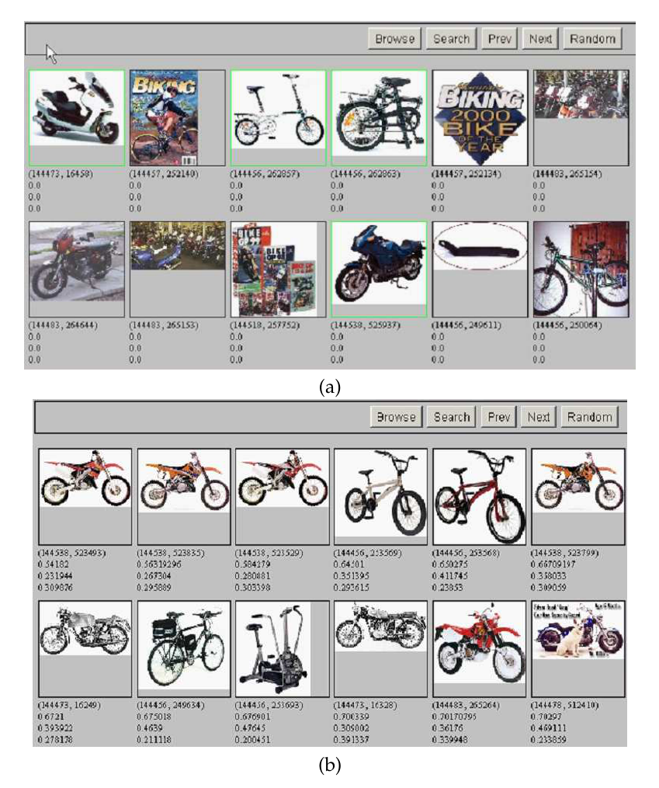
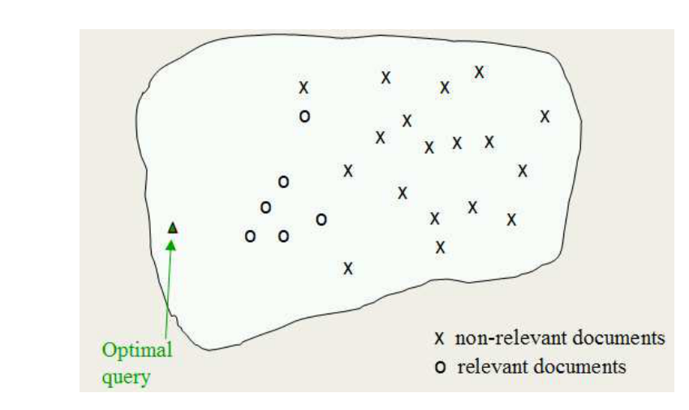
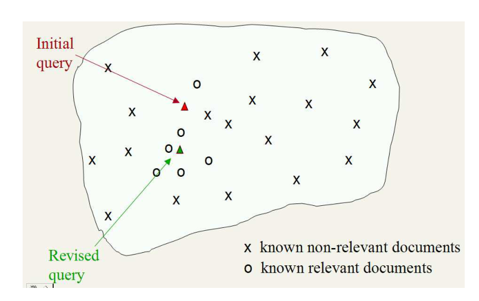
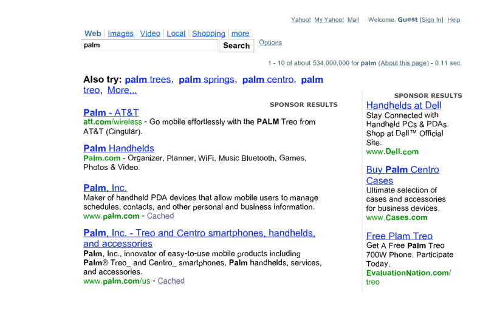

# 第 9 章 相关反馈与查询扩展

[返回系列目录](../introduction-to-information-retrieval.md) · [上一篇：第 8 章 信息检索的评估](./08-evaluation-in-information-retrieval.md) · [下一篇：第 10 章 XML 检索](./10-xml-retrieval.md)

原书印刷页 177–194；PDF 第 214–231 页。

<!-- source: PDF 214; printed: 177 -->

**同义词（SYNONYMY）**

在大多数文档集中，同一个概念可能会用不同的词来表达。这个问题被称为同义词（synonymy）问题，它对大多数信息检索系统的召回率（查全率）都有影响。例如，你希望对 aircraft（航空器）的搜索能匹配到 plane（飞机）（但仅限于指代飞机的文献，而不是 woodworking plane（木工刨）），并且希望对 thermodynamics（热力学）的搜索能在适当的讨论中匹配到 heat（热量）。用户通常会尝试通过手动改进查询来自己解决这个问题，正如第 1.4 节所讨论的那样；在本章中，我们将讨论系统如何帮助进行查询改进，这可以是全自动的，也可以是需要用户参与的。

解决这个问题的方法分为两大类：全局方法（global methods）和局部方法（local methods）。全局方法是独立于查询及其返回结果来扩展或重新表述查询词项的技术，因此查询措辞的改变将使新查询匹配到其他语义相似的词项。全局方法包括：

* 使用同义词词典或 WordNet 进行查询扩展/重新表述（第 9.2.2 节）
* 通过自动生成同义词词典进行查询扩展（第 9.2.3 节）
* 拼写纠错等技术（在第 3 章中讨论）

局部方法则根据最初似乎与查询匹配的文档来调整查询。这里的基本方法有：

* 相关反馈（第 9.1 节）
* 伪相关反馈（Pseudo relevance feedback），也称为盲相关反馈（Blind relevance feedback）（第 9.1.6 节）
* （全局）间接相关反馈（第 9.1.7 节）

在本章中，我们将提及所有这些方法，但我们将重点关注相关反馈，它是最常用且最成功的方法之一。

<!-- source: PDF 215; printed: 178 -->

## 9.1 相关反馈与伪相关反馈

**相关反馈（RELEVANCE FEEDBACK）**

相关反馈（relevance feedback, RF）的思想是让用户参与到检索过程中，从而改善最终的结果集。具体而言，用户对初始结果集中文档的相关性给出反馈。基本流程如下：

* 用户发出一个（简短、简单的）查询。
* 系统返回一个初始的检索结果集。
* 用户将一些返回的文档标记为相关或不相关。
* 系统根据用户的反馈计算出信息需求的更好表示。
* 系统显示修改后的检索结果集。

相关反馈可以经历一次或多次这样的迭代。该过程利用了这样一个思想：当你对文档集不够了解时，可能很难构造一个好的查询，但判断特定文档是否相关却很容易，因此进行这种迭代式的查询改进是有意义的。在这种场景下，相关反馈在跟踪用户不断变化的信息需求方面也很有效：看到某些文档可能会引导用户改进他们对所寻找信息的理解。

图像搜索提供了一个很好的相关反馈示例。不仅很容易看到实际效果，而且在这个领域中，用户很容易难以用语言表达他们想要什么，但却可以轻松指出相关或不相关的图像。在用户于以下演示系统上输入初始查询 bike（自行车）后：

http://nayana.ece.ucsb.edu/imsearch/imsearch.html

初始结果（在本例中为图像）被返回。在图 9.1（a）中，用户已选择其中一些作为相关图像。这些图像将用于改进查询，而显示的其他结果对重新表述没有影响。图 9.1（b）随后显示了在这一轮相关反馈之后计算出的新的排名靠前的结果。

图 9.2 展示了一个文本信息检索的例子，其中用户希望了解太空卫星的新应用。

### 9.1.1 用于相关反馈的 Rocchio 算法

Rocchio 算法是实现相关反馈的经典算法。它对将相关反馈信息融入第 6.3 节的向量空间模型中的方法进行了建模。

<!-- source: PDF 216; printed: 179 -->

**图 9.1** 图像上的相关反馈搜索。（a）用户查看查询 bike（自行车）的初始查询结果，选择顶行的第一、第三和第四个结果以及底行的第四个结果作为相关结果，并提交此反馈。（b）用户看到修改后的结果集。查准率得到了极大的提高。摘自 http://nayana.ece.ucsb.edu/imsearch/imsearch.html (Newsam et al. 2001)。
图中文字：(a) (b) Browse (浏览) Search (搜索) Prev (上一页) Next (下一页) Random (随机)

<!-- source: PDF 217; printed: 180 -->

**(a)**
Query: New space satellite applications

**(b)**

+ 1\. 0.539, 08/13/91, NASA Hasn’t Scrapped Imaging Spectrometer
+ 2\. 0.533, 07/09/91, NASA Scratches Environment Gear From Satellite Plan
&nbsp;&nbsp;&nbsp;3\. 0.528, 04/04/90, Science Panel Backs NASA Satellite Plan, But Urges Launches of Smaller Probes
&nbsp;&nbsp;&nbsp;4\. 0.526, 09/09/91, A NASA Satellite Project Accomplishes Incredible Feat: Staying Within Budget
&nbsp;&nbsp;&nbsp;5\. 0.525, 07/24/90, Scientist Who Exposed Global Warming Proposes Satellites for Climate Research
&nbsp;&nbsp;&nbsp;6\. 0.524, 08/22/90, Report Provides Support for the Critics Of Using Big Satellites to Study Climate
&nbsp;&nbsp;&nbsp;7\. 0.516, 04/13/87, Arianespace Receives Satellite Launch Pact From Telesat Canada

+ 8\. 0.509, 12/02/87, Telecommunications Tale of Two Companies

**(c)**
2.074 new &nbsp;&nbsp;&nbsp;&nbsp;&nbsp;&nbsp;&nbsp;&nbsp;&nbsp;&nbsp;&nbsp;&nbsp; 15.106 space
30.816 satellite &nbsp;&nbsp;&nbsp;&nbsp;&nbsp;&nbsp; 5.660 application
5.991 nasa &nbsp;&nbsp;&nbsp;&nbsp;&nbsp;&nbsp;&nbsp;&nbsp;&nbsp;&nbsp;&nbsp; 5.196 eos
4.196 launch &nbsp;&nbsp;&nbsp;&nbsp;&nbsp;&nbsp;&nbsp;&nbsp;&nbsp; 3.972 aster
3.516 instrument &nbsp;&nbsp;&nbsp;&nbsp; 3.446 arianespace
3.004 bundespost &nbsp;&nbsp;&nbsp; 2.806 ss
2.790 rocket &nbsp;&nbsp;&nbsp;&nbsp;&nbsp;&nbsp;&nbsp;&nbsp;&nbsp; 2.053 scientist
2.003 broadcast &nbsp;&nbsp;&nbsp;&nbsp;&nbsp; 1.172 earth
0.836 oil &nbsp;&nbsp;&nbsp;&nbsp;&nbsp;&nbsp;&nbsp;&nbsp;&nbsp;&nbsp;&nbsp;&nbsp;&nbsp;&nbsp;&nbsp; 0.646 measure

**(d)**
\* 1\. 0.513, 07/09/91, NASA Scratches Environment Gear From Satellite Plan
\* 2\. 0.500, 08/13/91, NASA Hasn’t Scrapped Imaging Spectrometer
&nbsp;&nbsp;&nbsp;3\. 0.493, 08/07/89, When the Pentagon Launches a Secret Satellite, Space Sleuths Do Some Spy Work of Their Own
&nbsp;&nbsp;&nbsp;4\. 0.493, 07/31/89, NASA Uses ‘Warm’ Superconductors For Fast Circuit
\* 5\. 0.492, 12/02/87, Telecommunications Tale of Two Companies
&nbsp;&nbsp;&nbsp;6\. 0.491, 07/09/91, Soviets May Adapt Parts of SS-20 Missile For Commercial Use
&nbsp;&nbsp;&nbsp;7\. 0.490, 07/12/88, Gaping Gap: Pentagon Lags in Race To Match the Soviets In Rocket Launchers
&nbsp;&nbsp;&nbsp;8\. 0.490, 06/14/90, Rescue of Satellite By Space Agency To Cost $90 Million

**图中查询与新闻标题译文**：初始查询为“新的空间卫星应用”。（b）中的标题依次为：① NASA 尚未取消成像光谱仪；② NASA 从卫星计划中删去环境观测设备；③ 科学委员会支持 NASA 卫星计划，但敦促发射更小的探测器；④ NASA 卫星项目创下惊人之举：开支不超预算；⑤ 揭示全球变暖问题的科学家提议用卫星开展气候研究；⑥ 报告为反对使用大型卫星研究气候的人提供支持；⑦ 阿丽亚娜空间公司获得加拿大 Telesat 的卫星发射合同；⑧ 两家公司的电信故事。（d）中新增的标题包括：五角大楼发射秘密卫星时，太空侦探也展开自己的侦察；NASA 使用“温暖”的超导体制造高速电路；苏联可能将 SS-20 导弹的部件改作商业用途；巨大差距：五角大楼在追赶苏联火箭发射装置的竞赛中落后；航天机构营救卫星将耗资 9000 万美元。（c）保留原查询扩展词项及权重，便于复现英文检索。

**图 9.2** 文本集上的相关反馈示例。（a）初始查询。（b）用户标记了一些相关文档（用加号表示）。（c）然后查询被扩展了 18 个词项，其权重如图所示。（d）随后显示了修改后的排名靠前的结果。\* 标记了在相关反馈阶段被判定为相关的文档。

<!-- source: PDF 218; printed: 181 -->

**图 9.3** 用于分离相关文档和不相关文档的 Rocchio 最优查询。
图中文字：Optimal query 最优查询；X non-relevant documents X 不相关文档；o relevant documents o 相关文档。

**基本理论**。我们希望找到一个查询向量（记为 $\vec{q}$），使其与相关文档的相似度最大化，同时与不相关文档的相似度最小化。如果 $C_r$ 是相关文档集，而 $C_{nr}$ 是不相关文档集，那么我们希望找到：[1]

$$ \vec{q}_{opt} = \underset{\vec{q}}{\arg\max} [\operatorname{sim}(\vec{q}, C_r) - \operatorname{sim}(\vec{q}, C_{nr})], \tag{9.1} $$

其中 sim 的定义如式（6.10）所示。在余弦相似度下，用于分离相关文档和不相关文档的最优查询向量 $\vec{q}_{opt}$ 为：

$$ \vec{q}_{opt} = \frac{1}{|C_r|} \sum_{\vec{d}_j \in C_r} \vec{d}_j - \frac{1}{|C_{nr}|} \sum_{\vec{d}_j \in C_{nr}} \vec{d}_j \tag{9.2} $$

也就是说，最优查询是相关文档质心与不相关文档质心之间的向量差；参见图 9.3。然而，这个观察结果并不是非常有用，正是因为相关文档的完整集合是未知的：这正是我们想要寻找的。

**Rocchio (1971) 算法**。这是相关反馈机

> **脚注 1（原书第 181 页）**：在公式中，$\arg\max_x f(x)$ 返回使函数 $f(x)$ 的值最大化的 $x$ 值。类似地，$\arg\min_x f(x)$ 返回使函数 $f(x)$ 的值最小化的 $x$ 值。

<!-- source: PDF 219; printed: 182 -->

**图 9.4** Rocchio 算法的应用。一些文档已被标记为相关和不相关，初始查询向量根据此反馈进行移动。
图中文字：Initial query 初始查询；Revised query 修正后的查询；x known non-relevant documents x 已知不相关文档；o known relevant documents o 已知相关文档。

制，该机制在 1970 年左右由 Salton 的 SMART 系统引入并推广。
在真实的 IR 查询环境中，我们有一个用户查询，以及对已知相关文档和不相关文档的部分了解。该算法提出使用修改后的查询 $\vec{q}_m$：

$$ \vec{q}_m = \alpha \vec{q}_0 + \beta \frac{1}{|D_r|} \sum_{\vec{d}_j \in D_r} \vec{d}_j - \gamma \frac{1}{|D_{nr}|} \sum_{\vec{d}_j \in D_{nr}} \vec{d}_j \tag{9.3} $$

其中 $\vec{q}_0$ 是原始查询向量，$D_r$ 和 $D_{nr}$ 分别是已知相关文档和不相关文档的集合，而 $\alpha$、$\beta$ 和 $\gamma$ 是附加到每一项的权重。这些权重控制着在信任已判定文档集与信任查询之间的平衡：如果我们有大量已判定的文档，我们会希望 $\beta$ 和 $\gamma$ 更高。从 $\vec{q}_0$ 开始，新查询向相关文档的质心移动一定距离，并远离不相关文档的质心一定距离。这个新查询可用于标准向量空间模型中的检索（见第 6.3 节）。通过减去不相关文档的向量，我们很容易离开向量空间的正象限。在 Rocchio 算法中，负的词项权重会被忽略。也就是说，词项权重被设置为 0。图 9.4 展示了应用相关反馈的效果。

相关反馈可以同时提高召回率和查准率。但是，在实践中，它已被证明在以下情况中对提高召回率最为有用：

<!-- source: PDF 220; printed: 183 -->

即召回率很重要的情况。这部分是因为该技术扩展了查询，但部分也是用例的影响：当用户希望获得高召回率时，可以预期他们会花时间审查结果并对搜索进行迭代。正反馈也被证明比负反馈有价值得多，因此大多数 IR 系统设置 $\gamma < \beta$。合理的值可能是 $\alpha = 1$、$\beta = 0.75$ 和 $\gamma = 0.15$。事实上，许多系统（例如图 9.1 中的图像搜索系统）仅允许正反馈，这等同于设置 $\gamma = 0$。另一种替代方案是仅使用被 IR 系统排名最高且被标记为不相关的文档作为负反馈（此时，在式（9.3）中 $|D_{nr}| = 1$）。虽然比较各种相关反馈变体的许多实验结果相当不确定，但一些研究表明，这种被称为 *Ide dec-hi* 的变体是最有效的，或者至少是表现最稳定的。

### 9.1.2 概率相关反馈

如果用户已经告诉我们一些相关和不相关的文档，那么我们无需在向量空间中对查询重新加权，而是可以着手构建一个分类器。一种实现方法是使用朴素贝叶斯概率模型。如果 $R$ 是一个表示文档相关性的布尔指示变量，那么我们可以估计 $\hat{P}(x_t = 1|R)$，即词项 $t$ 出现在文档中的概率（取决于它是否相关），如下所示：

$$ \begin{aligned} \hat{P}(x_t = 1|R = 1) &= |VR_t|/|VR| \\ \hat{P}(x_t = 1|R = 0) &= (df_t - |VR_t|)/(N - |VR|) \end{aligned} \tag{9.4} $$

其中 $N$ 是文档总数，$df_t$ 是包含 $t$ 的文档数，$VR$ 是已知相关文档的集合，而 $VR_t$ 是该集合中包含 $t$ 的子集。尽管已知相关文档集可能只是真实相关文档集的一个很小的子集，但如果我们假设相关文档集是所有文档集的一个很小的子集，那么上面给出的估计将是合理的。这为另一种改变查询词项权重的方法提供了基础。我们将在第 11 章和第 13 章中更多地讨论此类概率方法，并特别在第 11.3.4 节（第 228 页）中概述其在相关反馈中的应用。目前，请注意仅使用式（9.4）作为词项加权的基础可能是不够的。这些公式仅使用文档集统计信息以及被判定为相关的文档内的词项分布信息。它们没有保留原始查询的任何记忆。

### 9.1.3 相关反馈何时有效？

相关反馈的成功取决于某些假设。首先，用户必须具备足够的知识，以便能够提出一个初始查询，

<!-- source: PDF 221; printed: 184 -->

该查询至少在某种程度上接近他们想要的文档。无论如何，这在基本情况下对于成功的信息检索都是必需的，但重要的是要看到相关反馈本身无法解决的各类问题。仅靠相关反馈不足以解决的情况包括：

*   **拼写错误** (Misspellings)。如果用户拼写词项的方式与文档集中任何文档的拼写方式不同，那么相关反馈不太可能有效。这可以通过第 3 章的拼写纠错技术来解决。
*   **跨语言信息检索** (Cross-language information retrieval)。在基于词项分布的向量空间中，另一种语言的文档并不在附近。相反，同一种语言的文档会更紧密地聚类在一起。
*   **搜索者词汇与文档集词汇不匹配** (Mismatch of searcher's vocabulary versus collection vocabulary)。如果用户搜索 laptop（笔记本电脑），但所有文档都使用词项 notebook computer，那么查询将会失败，相关反馈也很可能无效。

其次，相关反馈方法要求相关文档彼此相似。也就是说，它们应该聚类。理想情况下，所有相关文档中的词项分布将与用户标记的文档中的词项分布相似，而所有不相关文档中的词项分布将与相关文档中的不同。如果所有相关文档都紧密地聚类在一个单一原型周围，或者至少，如果存在不同的原型，相关文档具有显著的词汇重叠，而相关文档和不相关文档之间的相似度很小，那么情况就会很好。隐含地，Rocchio 相关反馈模型将相关文档视为一个单一的簇，并通过该簇的质心对其进行建模。如果相关文档是一个多峰类（multimodal class），即它们由向量空间内的几个文档簇组成，这种方法的效果就不那么好。这可能发生在以下情况：

*   文档的子集使用不同的词汇，例如 Burma 与 Myanmar（缅甸的不同称呼）。
*   答案集本质上是析取（disjunctive）的查询，例如 Pop stars who once worked at Burger King（曾在汉堡王工作过的流行歌星）。
*   一般概念的实例，通常表现为更具体概念的析取，例如 felines（猫科动物）。

文档集中良好的编辑内容通常可以为这个问题提供解决方案。例如，一篇关于不同群体对缅甸（Burma）局势态度的文章可能会引入不同各方使用的术语，从而将文档簇链接起来。

<!-- source: PDF 222; printed: 185 -->

相关反馈未必受用户欢迎。用户通常不愿意提供显式反馈，或者通常不希望延长搜索交互过程。此外，在应用相关反馈之后，通常更难理解为什么会检索到某篇特定的文档。

相关反馈也可能存在实际问题。直接应用相关反馈技术生成的长查询对于典型的 IR（信息检索）系统来说效率低下。这会导致检索的计算成本很高，并可能给用户带来很长的响应时间。对此的一个部分解决方案是，仅对相关文档中某些突出的词项（例如按词项频率排名前 20 的词项）重新计算权重。一些实验结果也表明，像这样使用有限数量的词项可能会产生更好的结果（Harman 1992），尽管其他研究表明，就检索到的文档质量而言，使用更多的词项会更好（Buckley et al. 1994b）。

### 9.1.4 Web 上的相关反馈

一些 Web 搜索引擎提供“相似/相关页面”功能：用户在结果集中指出一篇从满足其信息需求的角度来看具有示范性的文档，并请求更多类似的文档。这可以被视为一种特别简单的相关反馈形式。然而，总体而言，相关反馈在 Web 搜索中很少被使用。一个例外是 Excite Web 搜索引擎，它最初提供了完整的相关反馈功能。然而，由于缺乏使用，该功能最终被取消。在 Web 上，很少有人使用高级搜索界面，大多数人希望在一次交互中完成搜索。但缺乏采用也可能反映了另外两个因素：相关反馈很难向普通用户解释，而且相关反馈主要是一种提高召回率的策略，而 Web 搜索用户极少关心是否获得了足够的召回率。

Spink et al. (2000) 展示了在 Excite 搜索引擎中使用相关反馈的结果。只有大约 4% 的用户查询会话使用了相关反馈选项，而且这些通常是利用每个结果旁边的“更多类似结果”（More like this）链接。大约 70% 的用户只看了第一页的结果，并没有进一步深究。对于使用相关反馈的人来说，大约三分之二的情况下结果得到了改善。

最近一项重要研究方向是使用点击流数据（用户点击了哪些链接）来提供间接的相关反馈。这种数据的使用在 (Joachims 2002b, Joachims et al. 2005) 中得到了详细研究。Web 链接结构的成功应用（见第 21 章）也可以被视为隐式反馈，只不过是由页面作者而不是读者提供的（尽管在实践中大多数作者也是读者）。

<!-- source: PDF 223; printed: 186 -->

**练习 9.1**
在 Rocchio 算法中，“查找类似页面”（Find pages like this one）搜索对应于 $\alpha/\beta/\gamma$ 的什么权重设置？

**练习 9.2** [*]
给出相关反馈在 Web 搜索中很少被使用的三个原因。

### 9.1.5 相关反馈策略的评估

交互式相关反馈可以极大地提高检索性能。经验表明，一轮相关反馈通常非常有用。两轮有时会稍微更有用一些。成功使用相关反馈需要足够多的已评判文档，否则该过程是不稳定的，因为它可能会偏离用户的信息需求。因此，建议至少有五篇已评判的文档。

以合理且有启发性的方式评估相关反馈的有效性存在一些微妙之处。显而易见的第一个策略是从初始查询 $q_0$ 开始，并计算查准率-召回率图。在用户进行一轮反馈之后，我们计算修改后的查询 $q_m$，并再次计算查准率-召回率图。在这里，在两轮中我们都评估了整个文档集所有文档的性能，这使得比较变得直观。如果我们这样做，我们会发现相关反馈带来了惊人的提升：平均查准率均值（mean average precision）提升了约 50%。但不幸的是，这是在作弊。这种提升部分是因为已知相关文档（由用户评判）现在的排名更高了。公平起见，我们应该只针对用户未见过的文档进行评估。

第二个想法是使用剩余文档集（文档集减去那些被评估为相关的文档）中的文档进行第二轮评估。这似乎是一个更现实的评估。不幸的是，此时测量到的性能通常可能低于原始查询。如果相关文档很少，因此其中相当一部分已经在第一轮中被用户评判过，情况尤其如此。不同相关反馈变体方法的相对性能可以进行有效的比较，但很难有效地比较使用和不使用相关反馈的性能，因为文档集大小和相关文档的数量在反馈前后发生了变化。

因此，这两种方法都不完全令人满意。第三种方法是拥有两个文档集，一个用于初始查询和相关性评判，第二个用于比较评估。$q_0$ 和 $q_m$ 的性能可以在第二个文档集上进行有效的比较。

也许评估相关反馈效用的最佳方法是对其有效性进行用户研究，特别是通过进行基于时间的比较：

<!-- source: PDF 224; printed: 187 -->

| | $k = 50$ 时的查准率 | |
|---|---|---|
| 词项权重计算 | 无 RF | 伪 RF |
| lnc.ltc | 64.2% | 72.7% |
| Lnu.ltu | 74.2% | 87.0% |

**图 9.5** 显示伪相关反馈极大提高性能的结果。这些结果取自 TREC 4 中的 Cornell SMART 系统（Buckley et al. 1995），并且还对比了两种不同长度归一化方案（L 与 l）的使用；参见图 6.15（第 128 页）。伪相关反馈包括向每个查询添加 20 个词项。

用户使用相关反馈与使用其他策略（如查询重构）相比，找到相关文档的速度有多快，或者，用户在一定时间内能找到多少篇相关文档。这种用户效用的概念是最公平的，也最接近真实的系统使用情况。

### 9.1.6 伪相关反馈

伪相关反馈（pseudo relevance feedback），也称为盲相关反馈（blind relevance feedback），提供了一种自动局部分析的方法。它将相关反馈的手动部分自动化，从而使用户无需进行长时间的交互即可获得改进的检索性能。该方法是进行常规检索以找到初始的最相关文档集，然后假设排名前 $k$ 的文档是相关的，最后在此假设下像以前一样进行相关反馈。

这种自动技术在大多数情况下是有效的。有证据表明，它往往比全局分析（第 9.2 节）效果更好。人们发现它可以提高 TREC ad hoc 任务的性能。例如，参见图 9.5 中的结果。但它并非没有自动过程的危险。例如，如果查询是关于铜矿（copper mines），而排名前几的文档都是关于智利的矿山，那么查询可能会向关于智利的文档方向发生查询漂移（query drift）。

### 9.1.7 间接相关反馈

我们也可以使用间接的证据来源，而不是关于相关性的显式反馈，作为相关反馈的基础。这通常被称为隐式（相关）反馈（implicit relevance feedback）。隐式反馈不如显式反馈可靠，但比不包含任何用户评判证据的伪相关反馈更有用。此外，虽然用户通常不愿意提供显式反馈，但对于高流量系统（如 Web 搜索引擎）来说，很容易大量收集隐式反馈。

<!-- source: PDF 225; printed: 188 -->

在 Web 上，DirectHit 引入了这样一种理念：将用户更经常选择查看的文档排名靠前。换句话说，对链接的点击被假定为表明该页面可能与查询相关。这种方法做出了各种假设，例如结果列表中显示的文档摘要（用户据此选择点击哪些文档）能够指示这些文档的相关性。在最初的 DirectHit 搜索引擎中，关于页面点击率的数据是全局收集的，而不是针对特定用户或查询的。这是点击流挖掘（clickstream mining）这一通用领域的一种形式。如今，一种密切相关的方法被用于对与 Web 搜索查询匹配的广告进行排名（第 19 章）。

### 9.1.8 总结

相关反馈已被证明在提高结果相关性方面非常有效。它的成功使用要求查询的相关文档集为中等到大型。完整的相关反馈对用户来说通常是繁重的，而且在大多数 IR 系统中其实现效率并不高。在许多情况下，其他类型的交互式检索可能会以更少的工作量带来大致相同的相关性提升。

除了核心的 ad hoc 检索场景之外，相关反馈的其他用途包括：

*   跟踪不断变化的信息需求（例如，感兴趣的汽车型号名称随时间变化）
*   维护信息过滤器（例如，用于新闻提要）。此类过滤器将在第 13 章中进一步讨论。
*   主动学习（决定知道哪些示例的类别最有用，以降低标注成本）。

**练习 9.3**
在什么条件下，式（9.3）中修改后的查询 $q_m$ 会与原始查询 $q_0$ 相同？在所有其他情况下，$q_m$ 是否比 $q_0$ 更接近相关文档的质心？

**练习 9.4**
为什么正反馈可能比负反馈对 IR 系统更有用？为什么只使用一篇不相关文档可能比使用多篇更有效？

**练习 9.5**
假设用户的初始查询是 cheap CDs cheap DVDs extremely cheap CDs。用户检查了两篇文档 $d_1$ 和 $d_2$。她评判内容为 CDs cheap software cheap CDs 的 $d_1$ 为相关，内容为 cheap thrills DVDs 的 $d_2$ 为不相关。假设我们使用直接词项频率（不进行缩放，也不进行文档……

<!-- source: PDF 226; printed: 189 -->

frequency）。不需要对向量进行长度归一化。使用如式（9.3）所示的 Rocchio 相关反馈，相关反馈后修改的查询向量会是什么？假设 $\alpha = 1, \beta = 0.75, \gamma = 0.25$。

**练习 9.6**
[$\star$]
Omar 实现了一个相关反馈 Web 搜索系统，为了提高效率，他打算仅基于返回页面的标题文本中的词进行相关反馈。用户将对 3 个结果进行排序。第一个用户 Jinxing 查询：

> banana slug (香蕉海蛞蝓)

返回的前三个标题是：

> banana slug Ariolimax columbianus (香蕉海蛞蝓 太平洋香蕉蛞蝓)
> Santa Cruz mountains banana slug (圣克鲁斯山脉 香蕉海蛞蝓)
> Santa Cruz Campus Mascot (圣克鲁斯校区 吉祥物)

Jinxing 判定前两篇文档相关，第三篇不相关。假设 Omar 的搜索引擎使用词项频率（term frequency），但不使用长度归一化和 IDF。假设他使用的是 Rocchio 相关反馈机制，且 $\alpha = \beta = \gamma = 1$。请给出将要运行的最终修改后的查询。（请按字母顺序列出向量元素。）

## 9.2 查询重构的全局方法

在本节中，我们将简要讨论三种扩展查询的全局方法：简单地辅助用户进行扩展、使用人工构建的同义词词典（thesaurus），以及自动构建同义词词典。

### 9.2.1 查询重构的词汇表工具

搜索过程中的各种用户支持可以帮助用户了解他们的搜索是否有效。这包括关于因在停用词表上而被从查询中省略的词的信息、词被提取词干后的结果、每个词项或短语的命中数量，以及词是否被动态地转换为短语。信息检索系统还可以通过同义词词典或受控词汇表（controlled vocabulary）来建议搜索词项。也可以允许用户浏览倒排索引中的词项列表，从而找到文档集中出现的优质词项。

### 9.2.2 查询扩展

在相关反馈中，用户提供关于文档的额外输入（通过将结果集中的文档标记为相关或不相关），并且该输入用于对查询中的词项进行重新加权以获取文档。另一方面，在查询扩展（query expansion）中，用户提供关于查询词或短语的额外输入，可能会建议额外的查询词项。一些搜索引擎（尤其是 Web 上的）

<!-- source: PDF 227; printed: 190 -->

**图 9.6** 2006 年 Yahoo! Web 搜索引擎界面中的查询扩展示例。扩展的查询建议出现在“Search Results”栏的正下方。
图中文字：Web（网页）、Images（图片）、Video（视频）、Local（本地）、Shopping（购物）、more（更多）、Options（选项）、Also try（还可尝试）；建议查询为 palm trees（棕榈树）、palm springs（棕榈泉）、palm centro、palm treo，More... 表示更多建议。

会在响应查询时建议相关的查询；然后用户可以选择使用这些备选查询建议中的一个。图 9.6 展示了 Yahoo! Web 搜索引擎中提供的查询建议选项的示例。

这种形式的查询扩展的核心问题是如何为用户生成备选或扩展的查询。最常见的查询扩展形式是全局分析（global analysis），即使用某种形式的同义词词典。对于查询中的每个词项 $t$，可以使用同义词词典中 $t$ 的同义词和相关词自动扩展查询。同义词词典的使用可以与词项加权的思想相结合：例如，可以对添加的词项赋予比原始查询词项更低的权重。

构建用于查询扩展的同义词词典的方法包括：

*   使用由人类编辑维护的受控词汇表。在这里，每个概念都有一个规范词项（canonical term）。传统图书馆主题索引的主题词（例如美国国会图书馆主题词表）或杜威十进制分类法（Dewey Decimal system）都是受控词汇表的例子。受控词汇表的使用在资源丰富的领域非常普遍。一个著名的例子是与 MedLine 一起用于查询生物医学研究文献的统一医学语言系统（Unified Medical Language System, UMLS）。例如，在图 9.7 中，neoplasms（肿瘤）被添加到了一个

<!-- source: PDF 228; printed: 191 -->

*   User query: `cancer`
*   PubMed query: `("neoplasms"[TIAB] NOT Medline[SB]) OR "neoplasms"[MeSH Terms] OR cancer[Text Word]`

*   User query: `skin itch`
*   PubMed query: `("skin"[MeSH Terms] OR ("integumentary system"[TIAB] NOT Medline[SB]) OR "integumentary system"[MeSH Terms] OR skin[Text Word]) AND (("pruritus"[TIAB] NOT Medline[SB]) OR "pruritus"[MeSH Terms] OR itch[Text Word])`

**图 9.7** 通过 PubMed 同义词词典进行查询扩展的示例。当用户在 PubMed 界面（http://www.ncbi.nlm.nih.gov/entrez/）上向 Medline 发出查询时，他们的查询会被映射到如图所示的 Medline 词汇表上。

对 cancer（癌症）的搜索中。这种 Medline 查询扩展也与 Yahoo! 的例子形成了对比。Yahoo! 的界面是交互式查询扩展（interactive query expansion）的一个例子，而 PubMed 进行的是自动查询扩展。除非用户选择检查提交的查询，否则他们甚至可能没有意识到发生了查询扩展。

*   人工构建的同义词词典。在这里，人类编辑为概念构建了同义名称集，而没有指定规范词项。UMLS 元超级词典（metathesaurus）就是同义词词典的一个例子。加拿大统计局（Statistics Canada）维护着一个包含首选词项、同义词、上位词和下位词的同义词词典，用于政府收集统计数据的事务，如商品和服务。该同义词词典还是英法双语的。

*   自动生成的同义词词典。在这里，利用某个领域内文档集上的词共现（co-occurrence）统计数据来自动推导出一个同义词词典；参见第 9.2.3 节。

*   基于查询日志挖掘的查询重构。在这里，我们利用其他用户的手动查询重构来向新用户提供建议。这需要巨大的查询量，因此特别适用于 Web 搜索。

基于同义词词典的查询扩展的优点是不需要任何用户输入。使用查询扩展通常会提高召回率（查全率），并在许多科学和工程领域得到广泛应用。除了这种全局分析技术之外，还可以通过局部分析（local analysis）来进行查询扩展，例如，通过分析结果集中的文档。此时通常需要用户输入

<!-- source: PDF 229; printed: 192 -->

| Word | Nearest neighbors |
|---|---|
| absolutely | absurd, whatsoever, totally, exactly, nothing |
| bottomed | dip, copper, drops, topped, slide, trimmed |
| captivating | shimmer, stunningly, superbly, plucky, witty |
| doghouse | dog, porch, crawling, beside, downstairs |
| makeup | repellent, lotion, glossy, sunscreen, skin, gel |
| mediating | reconciliation, negotiate, case, conciliation |
| keeping | hoping, bring, wiping, could, some, would |
| lithographs | drawings, Picasso, Dali, sculptures, Gauguin |
| pathogens | toxins, bacteria, organisms, bacterial, parasite |
| senses | grasp, psyche, truly, clumsy, naive, innate |

**图 9.8** 自动生成的同义词词典示例。该示例基于 Schütze (1998) 的工作，其中采用了潜在语义索引（参见第 18 章）。

（此时通常需要用户输入），但用户是对文档还是对查询词项提供反馈，这仍然是一个区别。

### 9.2.3 自动生成同义词词典

作为人工构建同义词词典成本的一种替代方案，我们可以尝试通过分析文档集来自动生成同义词词典。主要有两种方法。一种是简单地利用词的共现。我们认为在同一篇文档或同一个段落中共同出现的词在某种意义上可能是相似的或在含义上相关的，并简单地统计文本数据以找到最相似的词。另一种方法是对文本进行浅层语法分析（shallow grammatical analysis），并利用语法关系或语法依存关系。例如，我们认为被种植、烹饪、食用和消化的实体更有可能是食物。简单地使用词共现更具鲁棒性（它不会被解析器错误所误导），但使用语法关系更准确。

计算共现同义词词典的最简单方法是基于词项-词项相似度。我们从一个词项-文档矩阵 $A$ 开始，其中每个单元格 $A_{t,d}$ 是词项 $t$ 和文档 $d$ 的加权计数 $w_{t,d}$，通过加权使得 $A$ 具有长度归一化的行。如果我们接着计算 $C = AA^T$，那么 $C_{u,v}$ 就是词项 $u$ 和 $v$ 之间的相似度评分，数值越大越好。图 9.8 展示了基本上以这种方式推导出的同义词词典的示例，但增加了一个通过潜在语义索引（latent semantic indexing）进行降维的额外步骤，我们将在第 18 章中讨论这一点。虽然同义词词典中的一些词项很好或至少具有启发性，但其他词项则处于边缘状态或很差。关联的质量通常是一个问题。词项歧义很容易引入不相关的

<!-- source: PDF 230; printed: 193 -->

相关的统计相关词项。例如，针对 Apple computer（苹果电脑）的查询可能会扩展为 Apple red fruit computer（苹果 红色 水果 电脑）。通常，这些同义词词典会同时受到假阳性（误报）和假阴性（漏报）的影响。此外，由于自动构建的同义词词典中的词项在文档中本来就高度相关（而且通常用于派生同义词词典的文档集与被索引的文档集是同一个），这种形式的查询扩展可能无法检索到很多额外的文档。

查询扩展在提高召回率方面通常是有效的。然而，手工制作同义词词典并随后针对某一领域内的科学和术语发展对其进行更新的成本很高。通常需要特定领域的同义词词典：通用同义词词典和词典对大多数科学领域丰富的特定领域词汇的覆盖率太低。但是，查询扩展也可能显著降低查准率，特别是当查询包含歧义词项时。例如，如果用户搜索 interest rate（利率），将查询扩展为 interest rate fascinate evaluate（兴趣 利率 迷住 评估）不太可能有用。总的来说，查询扩展不如相关反馈成功，尽管它可能和伪相关反馈一样好。不过，它确实具有更容易被系统用户理解的优点。

**练习 9.7**
如果 $A$ 仅仅是一个布尔共现矩阵，那么 $C$ 中的元素会是什么？

## 9.3 参考文献及进一步阅读

信息检索领域的研究很快就面临了表达方式多样性的问题，这意味着查询中的词可能不会出现在文档中，尽管该文档与查询相关。Swanson (1988) 引用了 1960 年左右的一项早期实验，发现在 23 篇正确索引在 toxicity（毒性）主题下的文档中，只有 11 篇使用了包含词干 toxi 的词。此外还有转换的问题，即用户如何知道文档会使用哪些词项。Blair and Maron (1985) 得出结论：“用户要想准确预测所有（或大多数）相关文档所使用的，且仅由（或主要由）这些文档所使用的确切单词、词组合和短语，是极其困难的”。

关于使用向量空间模型进行相关反馈的主要早期论文都发表在 Salton (1971b) 中，包括 Rocchio 算法的提出 (Rocchio 1971) 和 Ide dec-hi 变体以及对几种变体的评估 (Ide 1971)。另一种变体是将文档集中除了被判定为相关的文档之外的所有文档都视为不相关，而不仅仅是那些被明确判定为不相关的文档。然而，Schütze et al. (1995) 和 Singhal et al. (1997) 表明，在路由（routing）任务中，仅使用靠近目标查询的文档而不是所有

<!-- source: PDF 231; printed: 194 -->

文档，可以获得更好的结果。后来的其他工作包括 Salton and Buckley (1990)、Riezler et al. (2007)（一种用于相关反馈的统计自然语言处理方法）以及最近的综述论文 Ruthven and Lalmas (2003)。

交互式相关反馈系统的有效性在 (Salton 1989, Harman 1992, Buckley et al. 1994b) 中进行了讨论。Koenemann and Belkin (1996) 对相关反馈的有效性进行了用户研究。

传统上，Roget's thesaurus（罗盖特同义词词典）一直是最著名的英语同义词词典 (Roget 1946)。在最近的计算研究中，人们几乎总是使用 WordNet (Fellbaum 1998)，这不仅因为它是免费的，还因为它具有丰富的链接结构。可以在 http://wordnet.princeton.edu 获取。

Qiu and Frei (1993) 和 Schütze (1998) 讨论了自动同义词词典的生成。Xu and Croft (1996) 探讨了同时使用局部和全局查询扩展。

[返回系列目录](../introduction-to-information-retrieval.md) · [上一篇：第 8 章 信息检索的评估](./08-evaluation-in-information-retrieval.md) · [下一篇：第 10 章 XML 检索](./10-xml-retrieval.md)
