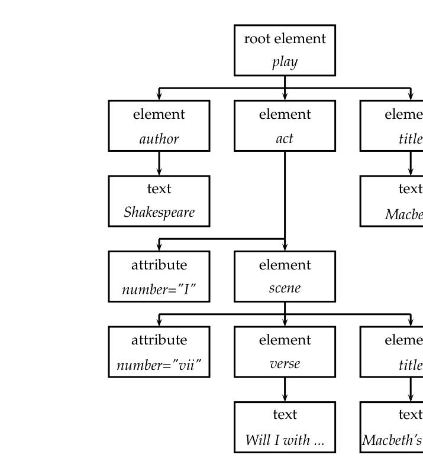
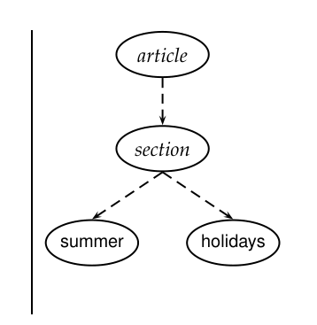
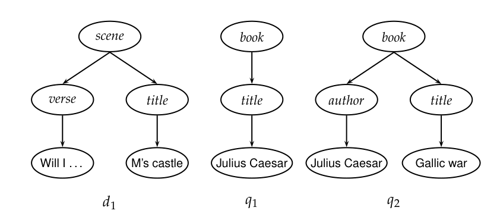
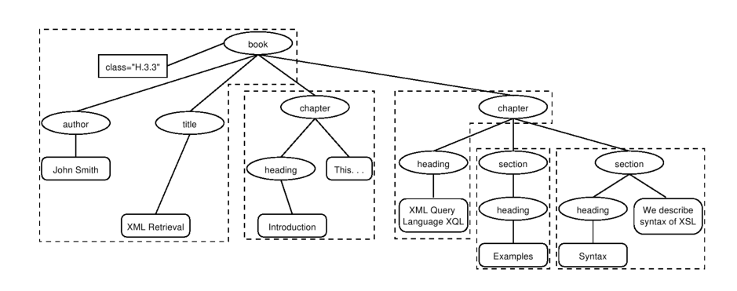
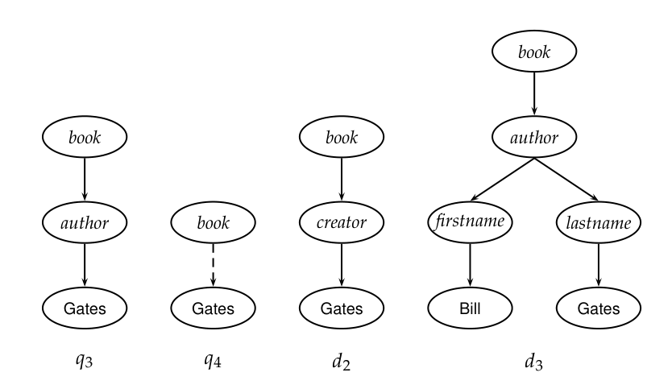
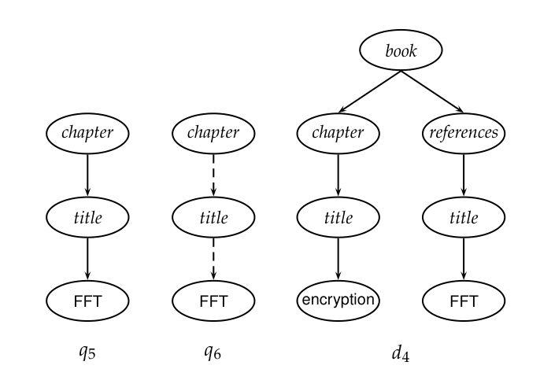
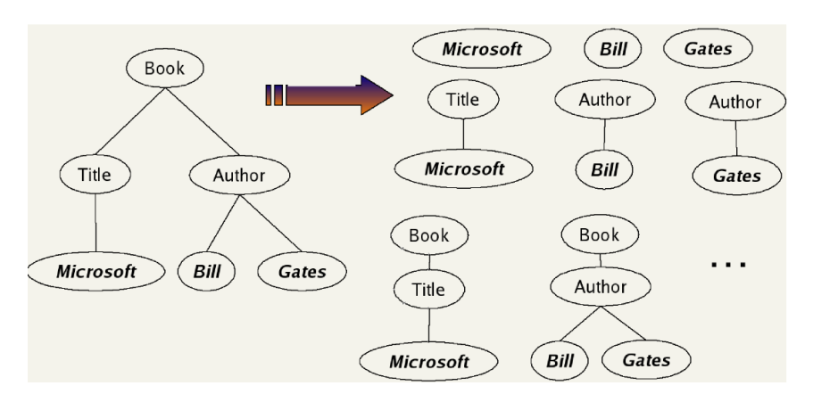
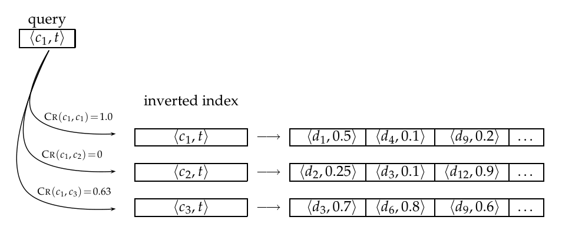
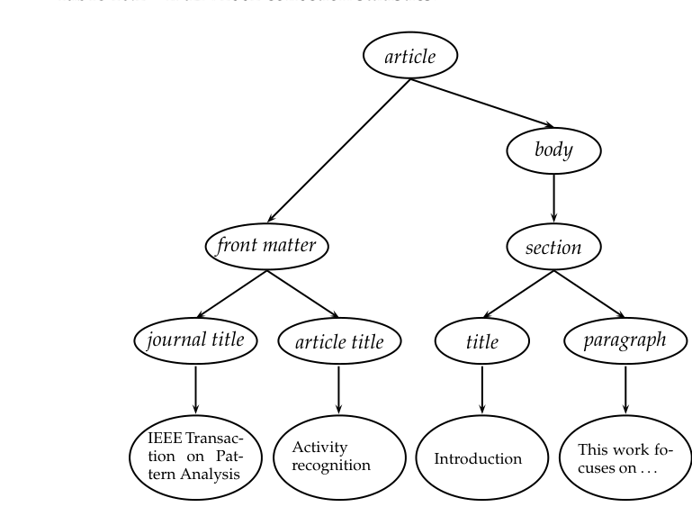

# 第 10 章 XML 检索

[返回系列目录](../introduction-to-information-retrieval.md) · [上一篇：第 9 章 相关反馈与查询扩展](./09-relevance-feedback-and-query-expansion.md) · [下一篇：第 11 章 概率信息检索](./11-probabilistic-information-retrieval.md)

原书印刷页 195–218；PDF 第 232–255 页。

<!-- source: PDF 232; printed: 195 -->

信息检索系统经常被拿来与关系数据库进行对比。传统上，信息检索系统从非结构化文本（unstructured text）中检索信息——我们指的是没有标记（markup）的“原始”文本。数据库则是为查询关系型数据而设计的：这些数据是记录的集合，具有预定义属性（如员工编号、头衔和薪水）的值。如表 10.1 所示，信息检索系统和数据库系统在检索模型、数据结构和查询语言方面存在根本差异。

一些高度结构化的文本搜索问题最有效地由关系数据库处理，例如，如果员工表包含一个用于简短文本职位描述的属性，并且您想查找所有涉及发票处理（invoicing）的员工。在这种情况下，SQL 查询：

```sql
select lastname from employees where job_desc like 'invoic%';
```

可能足以以高查准率和高召回率满足您的信息需求。

然而，许多包含文本的结构化数据源最好被建模为结构化文档，而不是关系型数据。我们将对这类结构化文档的搜索称为结构化检索（structured retrieval）。结构化检索中的查询可以是结构化的，也可以是非结构化的，但在本章中，我们将假设文档集仅由结构化文档组成。结构化检索的应用包括数字图书馆、专利数据库、博客、其中人物和地点等实体已被标记的文本（这一过程称为命名实体标记，named entity tagging），以及像 OpenOffice 这样将文档保存为标记文本的办公套件的输出。在所有这些应用中，我们希望能够运行结合了文本标准和结构标准的查询。这类查询的例子包括：给我一篇关于快速傅里叶变换的完整文章（give me a full-length article on fast fourier transforms）（数字图书馆），给我权利要求中提到 RSA 公钥加密的专利（give me patents whose claims mention RSA public key encryption）

> **脚注 1（原书第 195 页）**：在大多数现代数据库系统中，可以对文本列启用全文搜索。这通常意味着创建了倒排索引并启用了布尔或向量空间搜索，从而有效地将核心数据库与信息检索技术结合起来。

<!-- source: PDF 233; printed: 196 -->

| | RDB 搜索 | 非结构化检索 | 结构化检索 |
|---|---|---|---|
| 对象 | 记录 | 非结构化文档 | 叶节点带有文本的树 |
| 模型 | 关系模型 | 向量空间及其他 | ? |
| 主要数据结构 | 表 | 倒排索引 | ? |
| 查询 | SQL | 自由文本查询 | ? |

**表 10.1 RDB（关系数据库）搜索、非结构化信息检索和结构化信息检索。** 目前对于哪种方法最适合结构化检索尚未达成共识，尽管许多研究人员认为 XQuery（第 215 页）将成为结构化查询的标准。

并且引用了美国专利 4,405,829（and that cite US patent 4,405,829）（专利），或者给我关于梵蒂冈和斗兽场观光游览的文章（give me articles about sightseeing tours of the Vatican and the Coliseum）（实体标记文本）。这三个查询都是结构化查询，无法由未排序的检索系统很好地回答。正如我们在例 1.1（第 15 页）中所讨论的，像布尔模型这样的未排序检索模型存在召回率低的问题。例如，一个未排序的系统可能会返回大量提到梵蒂冈、斗兽场和观光游览的文章，而不会将与查询最相关的文章排在前面。众所周知，大多数用户也非常不擅长精确地陈述结构约束。例如，用户可能不知道搜索系统支持对哪些结构化元素进行搜索。在我们的例子中，用户可能不确定是应该将查询发布为 `sightseeing AND (COUNTRY:Vatican OR LANDMARK:Coliseum)`，还是 `sightseeing AND (STATE:Vatican OR BUILDING:Coliseum)`，抑或是其他形式。用户也可能对结构化搜索和高级搜索界面完全不熟悉，或者不愿意使用它们。在本章中，我们将探讨如何将排序检索方法应用于结构化文档以解决这些问题。

我们将只关注一种用于编码结构化文档的标准：可扩展标记语言（Extensible Markup Language）或 XML，这是目前最广泛使用的此类标准。我们不会涵盖将 XML 与 HTML 和 SGML 等其他类型标记区分开来的具体细节。但我们在本章中所说的大部分内容通常适用于标记语言。

在信息检索的背景下，我们只对作为编码文本和文档的语言的 XML 感兴趣。XML 的一个可能更广泛的用途是编码非文本数据。例如，我们可能希望从企业资源规划（ERP）系统中以 XML 格式导出数据，然后将它们读入分析程序以生成用于演示的图表。XML 的这种应用类型被称为数据中心型（data-centric），因为数值和非文本的属性-值数据占主导地位，而文本通常只占整体数据的一小部分。大多数数据中心型 XML 存储在数据库中——这与我们在本章中介绍的针对文本中心型（text-centric）XML 的基于倒排索引的方法形成对比。

<!-- source: PDF 234; printed: 197 -->

在本章中，我们将 XML 检索称为结构化检索。一些研究人员更喜欢使用半结构化检索（semistructured retrieval）一词，以将 XML 检索与数据库查询区分开来。我们采用了在 XML 检索社区中广泛使用的术语。例如，指代 XML 查询的标准方式是结构化查询，而不是半结构化查询。结构化检索一词很少用于数据库查询，在本书中它始终指代 XML 检索。

还有第二种介于非结构化检索和查询关系数据库之间的信息检索问题：参数化和域搜索，我们在第 6.1 节（第 110 页）中讨论过。在参数化和域搜索的数据模型中，存在参数化字段（如日期或文件大小等关系属性）和域（zone）——每个域都以一块非结构化文本作为值的文本属性，例如图 6.1（第 111 页）中的 author 和 title。该数据模型是平面的（flat），也就是说，不存在属性的嵌套。属性的数量很少。相比之下，XML 文档具有我们在图 10.2 中看到的更复杂的树形结构，其中属性是嵌套的。属性和节点的数量多于参数化和域搜索中的数量。

在第 10.1 节介绍了 XML 的基本概念之后，本章首先讨论我们在 XML 检索中面临的挑战（第 10.2 节）。接下来，我们描述一个用于 XML 检索的向量空间模型（第 10.3 节）。第 10.4 节介绍了 INEX，这是一个已经举办多年的共享任务评估，目前是 XML 检索研究最重要的平台。我们在第 10.5 节中讨论了针对 XML 的数据中心型和文本中心型方法之间的差异。

## 10.1 XML 基本概念

XML 文档是一棵有序的标记树。树的每个节点都是一个 XML 元素（XML element），并使用开始标签和结束标签来编写。一个元素可以有一个或多个 XML 属性（XML attribute）。在图 10.1 的 XML 文档中，scene 元素被 `<scene ...>` 和 `</scene>` 两个标签包围。它有一个值为 vii 的 number 属性，以及两个子元素 title 和 verse。图 10.2 将图 10.1 展示为一棵树。树的叶节点由文本组成，例如 Shakespeare、Macbeth 和 Macbeth's castle。树的内部节点编码了文档的结构（title、act 和 scene）或元数据功能（author）。

访问和处理 XML 文档的标准是 XML 文档对象模型（Document Object Model）或 DOM。DOM 将元素、属性以及元素内的文本表示为树中的节点。图 10.2 是图 10.1 中 XML 文档的简化 DOM 表示。使用 DOM API，我们

> **脚注 2（原书第 197 页）**：该表示在许多方面进行了简化。例如，我们没有显示

<!-- source: PDF 235; printed: 198 -->

```xml
<play>
<author>Shakespeare</author>
<title>Macbeth</title>
<act number="I">
<scene number="vii">
<title>Macbeth's castle</title>
<verse>Will I with wine and wassail ...</verse>
</scene>
</act>
</play>
```

**图 10.1** 一个 XML 文档。



**图 10.2** 图 10.1 中的 XML 文档的简化 DOM 对象表示。

图中文字：root element 根元素；element 元素；attribute 属性；text 文本；play, author, act, title, scene, verse, number="I", number="vii", Shakespeare, Macbeth, Macbeth's castle, Will I with ...

<!-- source: PDF 236; printed: 199 -->

```text
//article
[.//yr = 2001 or .//yr = 2002]
//section
[about(.,summer holidays)]
```



**图 10.3** NEXI 格式的 XML 查询及其部分树状表示。

图中文字：article（文章）、section（节）、summer（夏季）、holidays（假日）。

可以通过从根元素开始，然后从父节点到子节点向下遍历树来处理 XML 文档。

XPath 是一种用于枚举 XML 文档集中路径的标准。在本章中，我们也将路径称为 XML 上下文（XML context）或简称为上下文（context）。为了我们的目的，只需要 XPath 的一小部分子集。XPath 表达式 `node` 选择所有具有该名称的节点。路径中连续的元素由斜杠分隔，因此 `act/scene` 选择所有父元素为 `act` 元素的 `scene` 元素。双斜杠表示路径中可以插入任意数量的元素：`play//scene` 选择出现在 `play` 元素中的所有 `scene` 元素。在图 10.2 中，该集合由单个 `scene` 元素组成，可以从顶部通过路径 `play`、`act`、`scene` 访问它。开头的斜杠表示路径从根元素开始。`/play/title` 选择图 10.1 中剧本的标题，`/play//title` 选择一个包含两个成员（剧本标题和场景标题）的集合，而 `/scene/title` 不选择任何元素。为了符号上的方便，我们允许路径的最后一个元素是词汇表词项（vocabulary term），并通过符号 `#` 将其与元素路径分开，尽管这不符合 XPath 标准。例如，`title#"Macbeth"` 选择所有包含词项 Macbeth 的标题。

在本章中，我们还需要模式（schema）的概念。模式对特定应用程序允许的 XML 文档结构施加了约束。莎士比亚剧本的模式可能规定，场景只能作为幕（act）的子节点出现，并且只有幕和场景具有 `number` 属性。XML 文档模式的两个标准是 XML DTD（文档类型定义）和 XML Schema。只有当用户对文档集的模式有最基本的了解时，他们才能为 XML 检索系统编写结构化查询。

> **脚注（原书第 199 页）**：根节点，且文本未嵌入在文本节点中。参见 http://www.w3.org/DOM/。

<!-- source: PDF 237; printed: 200 -->



**图 10.4** XML 文档和查询的树状表示。

图中文字：scene（场景）、verse（诗行）、title（标题）、book（书）、author（作者）；Will I ...（我是否会……）、M's castle（M 的城堡）、Julius Caesar（尤利乌斯·恺撒）、Gallic war（高卢战记）为文本内容，d1、q1、q2 为文档和查询编号。

XML 查询的一种常见格式是 NEXI（Narrowed Extended XPath I）。我们在图 10.3 中给出了一个示例。为了排版方便，我们将查询显示为四行，但它应被视为一个没有换行符的整体来阅读。特别是，`//section` 嵌入在 `//article` 之下。

图 10.3 中的查询指定搜索关于 summer holidays（暑假）的 section（小节），这些小节是 2001 年或 2002 年 article（文章）的一部分。与 XPath 中一样，双斜杠表示路径中可以插入任意数量的元素。

方括号子句中的点（`.`）指的是该子句所修饰的元素。子句 `[.//yr = 2001 or .//yr = 2002]` 修饰 `//article`。因此，在这种情况下，点指的是 `//article`。类似地，`[about(., summer holidays)]` 中的点指的是该子句修饰的 section。

这两个 `yr` 条件是关系属性约束（relational attribute constraints）。只有 `yr` 属性为 2001 或 2002 的文章（或者包含 `yr` 属性为 2001 或 2002 的元素的文章）才会被考虑。`about` 子句是一个排序约束（ranking constraint）：出现在正确类型文章中的小节，将根据它们与主题 summer holidays 的相关性进行排序。

我们通常通过预过滤（prefiltering）或后过滤（postfiltering）来处理关系属性约束：我们只需从结果集中排除所有不满足关系属性约束的元素。在本章中，我们不会讨论如何高效地执行此操作，而是将重点放在 XML 检索中的核心信息检索问题上，即如何根据 NEXI 查询的 `about` 条件中表达的相关性标准对文档进行排序。

如果我们丢弃关系属性，我们可以将文档表示为只有一种节点类型的树：元素节点（element nodes）。换句话说，我们从 XML 文档中删除所有属性节点，例如图 10.1 中的 `number` 属性。图 10.4 将图 10.1 中文档的子树显示为元素节点树（标记为 $d_1$）。

<!-- source: PDF 238; printed: 201 -->

我们可以用同样的方式将查询表示为树。这是查询语言设计中的一种按例查询（query-by-example）方法，因为用户通过创建满足与文档相同形式描述的对象来提出查询。在图 10.4 中，$q_1$ 搜索的是其 title（标题）在关键词 Julius Caesar 上评分很高的 book（书籍）。$q_2$ 搜索的是其 author（作者）元素在 Julius Caesar 上评分很高，且其 title 元素在 Gallic war 上评分很高的 book。<sup>[3]</sup>

## 10.2 XML 检索中的挑战

在本节中，我们将讨论一些使得结构化检索比非结构化检索更困难的挑战。回顾第 195 页我们在结构化检索中假设的基本设置：文档集由结构化文档组成，查询要么是结构化的（如图 10.3 所示），要么是非结构化的（例如 summer holidays）。

结构化检索中的第一个挑战是，用户希望我们返回文档的各个部分（即 XML 元素），而不是像 IR 系统在非结构化检索中通常做的那样返回整个文档。如果我们在莎士比亚剧本中查询 Macbeth's castle，我们应该返回图 10.2 中的场景（scene）、幕（act）还是整个剧本（play）？在这种情况下，用户可能正在寻找场景。另一方面，如果只是未加具体说明地搜索 Macbeth，则应该返回同名剧本，而不是其子单元。

选择文档最合适部分的一个标准是结构化文档检索原则（structured document retrieval principle）：

**结构化文档检索原则**。系统应始终检索出能够回答查询的文档中最具体的部分。

这一原则激发了一种检索策略，即返回包含所需信息的最小单元，但不会低于该层级。然而，在算法上实现这一原则可能很困难。考虑将查询 `title#"Macbeth"` 应用于图 10.2。悲剧的标题 Macbeth 和第一幕第七场的标题 Macbeth's castle 都是很好的命中结果，因为它们都包含匹配词项 Macbeth。但在这种情况下，悲剧的标题（较高的节点）更受青睐。决定树的哪一层级适合回答查询是困难的。

与向用户返回文档的哪些部分这一问题平行的是，应该对文档的哪些部分进行索引的问题。在第 2.1.2 节（第 20 页）中，我们讨论了在索引和检索中对文档单元（document unit）或索引单元（indexing unit）的需求。在非结构化检索中，通常很清楚正确的文档

> **脚注 3（原书第 201 页）**：为了完整地表示 NEXI 查询的语义，我们还需要将树中的一个节点指定为“目标节点”（target node），例如图 10.3 树中的 section。如果没有指定目标节点，图 10.3 中的树将搜索包含 section 的 article；NEXI 指定的目标则是嵌入在 article 中的 section。

<!-- source: PDF 239; printed: 202 -->



**图 10.5** 将 XML 文档划分为不重叠的索引单元。

图中文字：book（书）、class="H.3.3"（分类属性）、author（作者）、title（标题）、chapter（章）、heading（标题）、section（节）；John Smith（约翰·史密斯）、XML Retrieval（XML 检索）、Introduction（引言）、This ...（这……）、XML Query Language XQL（XML 查询语言 XQL）、Examples（示例）、Syntax（语法）、We describe syntax of XSL（我们介绍 XSL 的语法）。

单元是什么：桌面上的文件、电子邮件、网络上的网页等。在结构化检索中，有许多不同的方法来定义索引单元。

一种方法是将节点分组为不重叠的伪文档（pseudodocuments），如图 10.5 所示。在该示例中，book、chapter 和 section 被指定为索引单元，但没有重叠。例如，最左侧的虚线索引单元仅包含由 book 支配的树中尚未成为其他索引单元一部分的那些部分。这种方法的缺点是伪文档对用户来说可能没有意义，因为它们不是连贯的单元。例如，图 10.5 中最左侧的索引单元合并了三个不同的元素：class、author 和 title 元素。

我们也可以使用最大的元素之一作为索引单元，例如书籍集合中的 book 元素或莎士比亚作品的 play 元素。然后，我们可以对搜索结果进行后处理，为每本书或剧本找到最佳命中的子元素。例如，查询 Macbeth's castle 可能会返回剧本 Macbeth，然后我们可以对其进行后处理，以将第一幕第七场识别为最佳匹配的子元素。不幸的是，这种两阶段检索过程无法为许多查询返回最佳子元素，因为整本书的相关性通常不能很好地预测其中小部分子元素的相关性。

除了检索大单元并识别子元素（自上而下）之外，我们还可以搜索所有叶子节点，选择最相关的叶子节点，然后在后处理中将它们扩展为更大的单元（自下而上）。对于图 10.1 中的查询 Macbeth's castle，我们将在第一遍检索中检索出标题 Macbeth's castle，然后在后处理步骤中决定是返回标题（title）、场景（scene）、幕（act）还是剧本（play）。这种方法与上一种方法存在类似的问题：叶子元素的相关性通常不能很好地预测

<!-- source: PDF 240; printed: 203 -->

包含它的元素的相关性。

限制最少的方法是索引所有元素。这也是有问题的。许多 XML 元素并不是有意义的搜索结果，例如排版元素如 `<b>definitely</b>` 或在没有上下文的情况下无法解释的 ISBN 号。此外，索引所有元素意味着搜索结果将高度冗余。对于查询 *Macbeth's castle*（麦克白城堡）和图 10.1 中的文档，我们将返回根节点和 *Macbeth's castle* 之间路径上的所有 *play*、*act*、*scene* 和 *title* 元素。这样，叶节点将在结果集中出现四次，一次是直接出现，三次是作为其他元素的一部分出现。我们将相互包含的元素称为嵌套（nested）元素。在返回的命中列表中返回冗余的嵌套元素对用户来说非常不友好。

由于嵌套元素引起的冗余，通常会限制有资格被返回的元素集合。限制策略包括：

*   丢弃所有小元素
*   丢弃用户不查看的所有元素类型（这需要一个记录此信息的运行中的 XML 检索系统）
*   丢弃评估者通常认为不相关的所有元素类型（如果存在相关性评估）
*   仅保留系统设计者或图书管理员认为是有用的搜索结果的元素类型

在大多数这些方法中，结果集仍将包含嵌套元素。因此，我们可能希望在后处理步骤中删除某些元素以减少冗余。或者，我们可以在结果列表中折叠几个嵌套元素，并使用查询词项的高亮显示（highlighting）来吸引用户对相关段落的注意力。如果查询词项被高亮显示，那么浏览中等大小的元素（例如，一节）所花的时间比浏览小规模子元素（例如，一段）多不了多少。因此，如果节和段落都出现在结果列表中，只显示节就足够了。这种方法的另一个优点是段落与其上下文（即嵌入它的节）一起呈现。即使段落本身满足查询，这种上下文也可能有助于解释该段落（例如，所报告信息的来源）。

如果用户了解文档集的模式（schema）并且能够指定所需类型的元素，那么冗余问题就会得到缓解，因为很少有嵌套元素具有相同的类型。但正如我们在引言中所讨论的，用户通常不知道文档集中元素的名称是什么（梵蒂冈是一个 *country*（国家）还是一个 *city*（城市）？），或者他们可能根本不知道如何构建结构化查询。

<!-- source: PDF 241; printed: 204 -->


**图 10.6** 模式异构性：中间节点和不匹配的名称。
图中文字：book（书）、author（作者）、creator（创建者）、firstname（名字）、lastname（姓氏）；Gates（盖茨）、Bill（比尔）为姓名，q3、q4、d2、d3 为查询和文档编号。

与嵌套相关的 XML 检索中的一个挑战是，在计算用于排序的词项统计信息时，特别是第 6.2.1 节（原书第 117 页）中定义的逆文档频率（idf）统计信息时，我们可能需要区分词项的不同上下文。例如，节点 *author* 下的词项 Gates 与内容节点（如 *section*）下出现的 Gates（如果用于指代 gate 的复数形式）是不相关的。在这个例子中，为 Gates 计算单一的文档频率（document frequency）意义不大。

一种解决方案是计算 XML 上下文/词项对的 idf，例如，为 `author#"Gates"` 和 `section#"Gates"` 计算不同的 idf 权重。不幸的是，这种方案会遇到数据稀疏问题——也就是说，许多 XML 上下文对出现的频率太低，无法可靠地估计 df（有关稀疏性的讨论，请参见第 13.2 节，原书第 260 页）。一种折衷方案是仅考虑词项的父节点 $x$，而不考虑从根节点到 $x$ 的路径的其余部分来区分上下文。在这种方案中，仍然存在有害的上下文混淆。例如，如果作者名称和公司名称的父节点都是 *name*，我们就不区分它们。但是大多数重要的区别，如示例中 `author#"Gates"` 与 `section#"Gates"` 的对比，将得到保留。

在许多情况下，文档集中会出现几种不同的 XML 模式，因为信息检索应用中的 XML 文档通常来自多个数据源。这种现象被称为模式异构性（schema heterogeneity）或模式多样性（schema diversity），并提出了另一个挑战。如图 10.6 所示，可比较的元素可能具有不同的名称：$d_2$ 中的 *creator* 与 $d_3$ 中的 *author*。在其他情况下，模式的结构组织可能不同：作者（Author）

<!-- source: PDF 242; printed: 205 -->

名称在 $q_3$ 中是节点 *author* 的直接后代，但在 $d_3$ 中存在中间节点 *firstname* 和 *lastname*。如果我们采用树的严格匹配，那么 $q_3$ 将既检索不到 $d_2$ 也检索不到 $d_3$，尽管这两篇文档都是相关的。某种形式的元素名称近似匹配结合不同文档结构的半自动匹配可以在这里提供帮助。人工编辑不同模式中元素的对应关系通常比自动方法效果更好。

模式异构性是导致查询-文档不匹配（如 $q_3/d_2$ 和 $q_3/d_3$）的原因之一。另一个原因是，如前所述，用户通常不熟悉他们搜索的文档集的元素名称和模式结构。这对 XML 检索中的界面设计提出了挑战。理想情况下，用户界面应该暴露文档集的树形结构，并允许用户指定他们正在查询的元素。如果我们采用这种方法，那么在结构化检索中设计查询界面要比非结构化检索中用于关键字查询的搜索框复杂得多。

我们还可以通过将查询中的所有父子关系解释为允许任意数量中间节点的后代关系来支持用户。我们将此类查询称为扩展查询（extended queries）。图 10.3 中的树和图 10.6 中的 $q_4$ 都是扩展查询的例子。我们将解释为后代关系的边显示为虚线箭头。在 $q_4$ 中，一个虚线箭头连接了 *book* 和 Gates。作为 $q_4$ 的伪 XPath 表示法，我们采用 `book//#"Gates"`：一本在其结构某处包含单词 Gates 的书，其中从 book 节点到 Gates 的路径可以任意长。此外还指定 Gates 出现在书的某一节中的扩展查询的伪 XPath 表示法是 `book//section//#"Gates"`。

用户能够发出这样的扩展查询而无需指定查询词项应出现的精确结构配置，这非常方便——要么是因为他们不关心精确的配置，要么是因为他们对文档集的模式了解不够，无法指定它。

在图 10.7 中，用户正在寻找标题为 FFT 的章（$q_5$）。假设文档集中没有这样的章，但有关于 FFT 的书籍的参考文献（$d_4$）。关于 FFT 的书籍的参考文献并不完全是用户正在寻找的内容，但总比什么都不返回要好。扩展查询在这里没有帮助。扩展查询 $q_6$ 也什么都不返回。在这种情况下，我们可能希望将查询中指定的结构约束解释为提示，而不是严格的条件。正如我们将在第 10.4 节中讨论的那样，用户更喜欢对结构约束的宽松解释：不能完美满足结构约束的元素应该被排在较低的位置，但它们不应该从搜索结果中被省略。

<!-- source: PDF 243; printed: 206 -->


**图 10.7** 两个查询与一个文档之间的结构不匹配。
图中文字：chapter（章）、title（标题）、FFT（快速傅里叶变换）、encryption（加密）、references（参考文献）、book（书）；q5、q6、d4 为查询和文档编号。

### 10.3 XML 检索的向量空间模型

在本节中，我们提出了一个用于 XML 检索的简单向量空间模型。它并不旨在成为对最先进系统的完整描述。相反，我们希望让读者体会一下在 XML 检索中如何表示和检索文档。

为了在图 10.4 的检索中考虑结构，我们希望一本名为 Julius Caesar 的书与 $q_1$ 匹配，而与 $q_2$ 不匹配（或具有较低权重的匹配）。在非结构化检索中，向量空间中会有一个单一的维度用于 Caesar。在 XML 检索中，我们必须将标题词 Caesar 与作者名 Caesar 分开。实现这一点的一种方法是让向量空间的每个维度对一个单词及其在 XML 树中的位置进行编码。

图 10.8 说明了这种表示方法。我们首先获取每个文本节点（在我们的设置中始终是叶节点），并将其分解为多个节点，每个单词一个节点。因此，叶节点 Bill Gates 被拆分为两个叶节点 Bill 和 Gates。接下来，我们将向量空间的维度定义为文档的词汇化子树（lexicalized subtrees）——包含至少一个词汇表词项的子树。图中显示了这些可能的词汇化子树的一个子集，但还有其他的——例如，对应于删除了叶节点 Gates 的整个文档的子树。我们现在可以将查询和文档表示为这个词汇化子树空间中的向量，并计算它们之间的匹配。这意味着我们可以将第 6 章中的向量空间形式化方法用于 XML 检索。主要区别在于向量空间的维度

<!-- source: PDF 244; printed: 207 -->

在非结构化检索中是词汇表词项，而在 XML 检索中则是词汇化子树。


**图 10.8** XML 文档（左）到一组词汇化子树（右）的映射。

在空间的维度和查询结果的准确率之间存在一种权衡。如果我们简单地将维度限制为词汇表词项，那么我们就得到了一个标准的向量空间检索系统，它将检索出许多与查询结构不匹配的文档（例如，`Gates` 出现在 `title` 中，而不是 `author` 元素中）。如果我们为文档集中出现的每个词汇化子树创建一个单独的维度，空间的维度就会变得太大。一种折中的方法是索引所有以单个词汇表词项结尾的路径，换句话说，即所有的 XML 上下文/词项对。

<br>

**结构化词项**

我们将这种 XML 上下文/词项对称为**结构化词项**（structural term），并将其表示为 $\langle c, t \rangle$：XML 上下文 $c$ 和词汇表词项 $t$ 的对。图 10.8 中的文档有 9 个结构化词项。图中显示了 7 个（例如，`"Bill"` 和 `Author#"Bill"`），还有 2 个未显示：`/Book/Author#"Bill"` 和 `/Book/Author#"Gates"`。以 `Bill` 和 `Gates` 为叶节点的树是一个词汇化子树，但不是结构化词项。我们使用前面介绍的伪 XPath 表示法来表示结构化词项。

正如我们在上一节中所讨论的，用户不擅长记住关于模式的细节，也不擅长构建符合模式的查询。因此，我们将把所有查询解释为扩展查询——也就是说，对于查询中的任何父子节点对，文档中可以有任意数量的中间节点。例如，我们将图 10.7 中的 $q_5$ 解释为 $q_6$。

但是，我们仍然偏好那些通过

<!-- source: PDF 245; printed: 208 -->

插入较少附加节点而与查询结构紧密匹配的文档。我们通过为每个匹配计算一个权重来确保检索结果尊重这种偏好。衡量查询中的路径 $c_q$ 和文档中的路径 $c_d$ 之间相似度的一个简单度量是以下**上下文相似度**（context resemblance）函数 $\text{CR}$：

<br>

**上下文相似度**

$$ \text{CR}(c_q, c_d) = \begin{cases} \frac{1+|c_q|}{1+|c_d|} & \text{if } c_q \text{ matches } c_d \\ 0 & \text{if } c_q \text{ does not match } c_d \end{cases} \tag{10.1} $$

其中 $|c_q|$ 和 $|c_d|$ 分别是查询路径和文档路径中的节点数，并且当且仅当我们可以通过插入附加节点将 $c_q$ 转换为 $c_d$ 时，$c_q$ 匹配 $c_d$。图 10.6 中的两个例子是 $\text{CR}(c_{q4}, c_{d2}) = 3/4 = 0.75$ 和 $\text{CR}(c_{q4}, c_{d3}) = 3/5 = 0.6$，其中 $c_{q4}, c_{d2}$ 和 $c_{d3}$ 分别是 $q_4, d_2$ 和 $d_3$ 中从顶部到叶节点的相关路径。如果 $q$ 和 $d$ 相同，则 $\text{CR}(c_q, c_d)$ 的值为 1.0。

文档的最终评分计算为余弦度量（第 121 页式（6.10））的一个变体，我们称之为 $\text{SIMNOMERGE}$，其原因稍后会清楚。$\text{SIMNOMERGE}$ 定义如下：

$$ \text{SIMNOMERGE}(q, d) = \sum_{c_k \in B} \sum_{c_l \in B} \text{CR}(c_k, c_l) \sum_{t \in V} \text{weight}(q, t, c_k) \frac{\text{weight}(d, t, c_l)}{\sqrt{\sum_{c \in B, t \in V} \text{weight}^2(d, t, c)}} \tag{10.2} $$

其中 $V$ 是非结构化词项的词汇表；$B$ 是所有 XML 上下文的集合；$\text{weight}(q, t, c)$ 和 $\text{weight}(d, t, c)$ 分别是词项 $t$ 在查询 $q$ 和文档 $d$ 的 XML 上下文 $c$ 中的权重。我们使用第 6 章中的一种权重计算方法（例如 $\text{idf}_t \cdot \text{wf}_{t,d}$）来计算权重。如第 10.2 节所述，逆文档频率 $\text{idf}_t$ 取决于我们使用哪些元素来计算 $\text{df}_t$。相似度度量 $\text{SIMNOMERGE}(q, d)$ 不是真正的余弦度量，因为它的值可能大于 1.0（练习 10.11）。我们除以 $\sqrt{\sum_{c \in B, t \in V} \text{weight}^2(d, t, c)}$ 来进行文档长度归一化（第 121 页第 6.3.1 节）。为了简化公式，我们省略了查询长度归一化。它对排序没有影响，因为对于给定的查询，归一化因子 $\sqrt{\sum_{c \in B, t \in V} \text{weight}^2(q, t, c)}$ 对所有文档都是相同的。

计算文档集中所有文档的 $\text{SIMNOMERGE}$ 的算法如图 10.9 所示。图 10.9 中的数组 *normalizer* 包含每个文档在式（10.2）中的 $\sqrt{\sum_{c \in B, t \in V} \text{weight}^2(d, t, c)}$。

我们在图 10.10 中给出了 $\text{SIMNOMERGE}$ 如何计算查询-文档相似度的一个例子。$\langle c_1, t \rangle$ 是查询中的结构化词项之一。我们依次检索具有相同词汇表词项 $t$ 的结构化词项 $\langle c', t \rangle$ 的所有倒排记录表。图中显示了三个倒排记录表的例子。对于第一个，我们有 $\text{CR}(c_1, c_1) = 1.0$，因为这两个上下文是相同的。下

<!-- source: PDF 246; printed: 209 -->

```text
SCOREDOCUMENTSWITHSIMNOMERGE(q, B, V, N, normalizer)
 1 for n <- 1 to N
 2 do score[n] <- 0
 3 for each <c_q, t> in q
 4 do w_q <- WEIGHT(q, t, c_q)
 5    for each c in B
 6    do if CR(c_q, c) > 0
 7       then postings <- GETPOSTINGS(<c, t>)
 8            for each posting in postings
 9            do x <- CR(c_q, c) * w_q * weight(posting)
10               score[docID(posting)] += x
11 for n <- 1 to N
12 do score[n] <- score[n] / normalizer[n]
13 return score
```
**图 10.9** 使用 $\text{SIMNOMERGE}$ 对文档进行评分的算法。


**图 10.10** 在 $\text{SIMNOMERGE}$ 中对包含一个结构化词项的查询进行评分。

一个上下文与 $c_1$ 没有上下文相似度：$\text{CR}(c_1, c_2) = 0$，相应的倒排记录表被忽略。$c_1$ 与 $c_3$ 的上下文匹配度为 $0.63 > 0$，它将被处理。在这个例子中，排名最高的文档是 $d_9$，其相似度为 $1.0 \times 0.2 + 0.63 \times 0.6 = 0.578$。为了简化图形，假设 $\langle c_1, t \rangle$ 的查询权重为 1.0。

图 10.9 中的查询-文档相似度函数被称为 $\text{SIMNOMERGE}$，因为在计算权重时，不同的 XML 上下文是保持分离的。另一种相似度函数是 $\text{SIMMERGE}$，它在以下三个方面进一步放宽了查询和文档的匹配条件。

<!-- source: PDF 247; printed: 210 -->

• 我们从*所有*与 $c$ 具有非零相似度的上下文中收集用于计算 $\text{weight}(q, t, c)$ 和 $\text{weight}(d, t, c)$ 的统计信息（而不是像 $\text{SIMNOMERGE}$ 中那样仅从 $c$ 中收集）。例如，为了计算结构化词项 `atl#"recognition"` 的文档频率，我们还会计算 `recognition` 在 XML 上下文 `fm/atl`、`article//atl` 等中的出现次数。

• 我们修改式（10.2），将文档中所有与给定查询结构化词项具有非零上下文相似度的结构化词项合并。例如，在与查询词项 `/play/title#"Macbeth"` 匹配时，文档中的上下文 `/play/act/scene/title` 和 `/play/title` 将被合并。

• 上下文相似度函数被进一步放宽：在式（10.1）中 $\text{CR}$ 的定义返回 0 的许多情况下，上下文具有非零相似度。

详情请参见第 10.6 节中的参考文献。

这三个变化缓解了第 10.2 节中讨论的词项统计稀疏问题，并提高了匹配函数对表述不佳的结构化查询的鲁棒性。下一节中对 $\text{SIMNOMERGE}$ 和 $\text{SIMMERGE}$ 的评估表明，$\text{SIMMERGE}$ 放宽的匹配条件提高了 XML 检索的有效性。

**练习 10.1**
考虑将结构化词项的 df 计算为该结构化词项在特定父节点下出现的次数。假设如下：结构化词项 $\langle c, t \rangle = \text{author\#"Herbert"}$ 作为节点 `squib` 的子节点出现 1 次；文档集中有 10 个 `squib` 节点；$\langle c, t \rangle$ 作为 `article` 的子节点出现 1000 次；文档集中有 1,000,000 个 `article` 节点。那么，当 $\langle c, t \rangle$ 作为 `squib` 的子节点出现时，其 idf 权重为 $\log_2 10/1 \approx 3.3$；当作为 `article` 的子节点出现时，其 idf 权重为 $\log_2 1,000,000/1000 \approx 10.0$。(i) 解释为什么这对 $\langle c, t \rangle$ 来说不是一个合适的权重计算方法。为什么 $\langle c, t \rangle$ 在 article 中的权重不应该比在 squib 中高出三倍？(ii) 建议一种更好的计算 idf 的方法。

**练习 10.2**
写出图 10.8 的 XML 文档中出现的所有结构化词项。

**练习 10.3**
图 10.1 中的文档产生了多少个结构化词项？

## 10.4 XML 检索的评估

<br>

**INEX**

XML 检索研究的首要平台是 INEX（INitiative for the Evaluation of XML retrieval，XML 检索评估倡议）项目，这是一项合作计划，已经生成了参考文档集、查询集和相关性判定。每年都会举行 INEX 会议来展示和讨论研究成果。该

<!-- source: PDF 248; printed: 211 -->

## 10.4 XML检索的评价

XML检索研究的首要场所是INEX（XML检索评价倡议，INitiative for the Evaluation of XML retrieval）项目，这是一个协作项目，已经生成了参考文档集、查询集和相关性评判。INEX每年都会举行会议来展示和讨论研究成果。

| | |
|---|---|
| 12,107 | 文档数量 (number of documents) |
| 494 MB | 大小 (size) |
| 1995–2002 | 文章发表时间 (time of publication of articles) |
| 1,532 | 每篇文档的平均XML节点数 (average number of XML nodes per document) |
| 6.9 | 节点的平均深度 (average depth of a node) |
| 30 | CAS主题数量 (number of CAS topics) |
| 30 | CO主题数量 (number of CO topics) |

▶ **表 10.2** INEX 2002 文档集统计数据。



▶ **图 10.11** INEX文档集中文档的简化模式。
图中文字：article（文章）；front matter（前置部分）；body（正文）；journal title（期刊标题）；article title（文章标题）；section（章节）；title（标题）；paragraph（段落）；IEEE Transaction on Pattern Analysis（IEEE模式分析汇刊）；Activity recognition（活动识别）；Introduction（引言）；This work focuses on ...（这项工作侧重于……）

INEX 2002文档集由大约12,000篇IEEE期刊文章组成。我们在表10.2中给出了文档集统计数据，并在图10.11中展示了文档集的部分模式。IEEE期刊文档集在2005年进行了扩充。自2006年起，INEX使用大得多的英文维基百科作为测试文档集。文档的相关性由人类评估员使用第8.1节（第152页）介绍的方法进行评判，并针对结构化文档进行了适当修改，我们稍后将对此进行讨论。

INEX中有两种类型的信息需求或主题：仅内容（content-only）或CO主题，以及内容与结构（content-and-structure，CAS）主题。CO主题与非结构化信息检索中的常规关键字查询相同。CAS主题除了关键字外还有结构约束。我们已经遇到过一个

<!-- source: PDF 249; printed: 212 -->

CAS主题的例子（图10.3）。在这个例子中，关键字是 summer 和 holidays，结构约束指定关键字出现在一个 section 中，而该 section 又是 article 的一部分，并且该 article 具有一个值为 2001 或 2002 的内嵌 year 属性。

由于CAS查询同时具有结构和内容标准，因此相关性评估比非结构化检索更为复杂。INEX 2002将组件覆盖率（component coverage）和主题相关性（topical relevance）定义为相关性的两个正交维度。组件覆盖率维度评估检索到的元素在“结构上”是否正确，即在树中的位置既不太低也不太高。我们区分以下四种情况：

*   精确覆盖（Exact coverage，E）。寻找的信息是该组件的主要主题，且该组件是一个有意义的信息单元。
*   过小（Too small，S）。寻找的信息是该组件的主要主题，但该组件不是一个有意义的（自包含的）信息单元。
*   过大（Too large，L）。寻找的信息存在于该组件中，但不是主要主题。
*   无覆盖（No coverage，N）。寻找的信息不是该组件的主题。

主题相关性维度也有四个级别：高度相关（highly relevant，3）、相当相关（fairly relevant，2）、边缘相关（marginally relevant，1）和不相关（nonrelevant，0）。组件在这两个维度上进行评判，然后将评判结果组合成一个数字-字母代码。2S是一个相当相关但过小的组件，3E是一个高度相关且具有精确覆盖的组件。理论上，覆盖率和相关性有16种组合，但许多组合不可能出现。例如，不相关的组件不可能有精确覆盖，因此组合3N是不可能的。

相关性-覆盖率组合量化如下：

$$
Q(rel, cov) =
\begin{cases}
1.00 & \text{if } (rel, cov) = \text{3E} \\
0.75 & \text{if } (rel, cov) \in \{\text{2E, 3L}\} \\
0.50 & \text{if } (rel, cov) \in \{\text{1E, 2L, 2S}\} \\
0.25 & \text{if } (rel, cov) \in \{\text{1S, 1L}\} \\
0.00 & \text{if } (rel, cov) = \text{0N}
\end{cases}
$$

这种评价方案考虑到了这样一个事实：在非结构化信息检索中作为标准的二元相关性评判（第8.5.1节，第166页）并不适用于XML检索。一个2S组件提供的信息不完整，如果没有更多上下文可能难以解释，但它确实部分地回答了查询。量化函数 $Q$ 不强制要求在相关/不相关之间做出二元选择，而是允许我们将组件评级为部分相关。

<!-- source: PDF 250; printed: 213 -->

| 算法 (algorithm) | 平均查准率 (average precision) |
|---|---|
| SIMNOMERGE | 0.242 |
| SIMMERGE | 0.271 |

▶ **表 10.3** 第10.3节中的向量空间模型在INEX 2002中针对内容与结构（CAS）查询和量化函数 $Q$ 的结果。

那么，在检索到的组件集合 $A$ 中，相关组件的数量可以计算为：

$$
\#(\text{relevant items retrieved}) = \sum_{c \in A} Q(rel(c), cov(c))
$$

作为一种近似，第8章中查准率、召回率和F值的标准定义可以应用于这种修改后的检索相关项定义，但存在一些微妙之处，因为我们对分级（而非二元）相关性评估进行求和。有关进一步的讨论，请参见第10.6节中关于聚焦检索（focused retrieval）的参考文献。

以这种方式衡量相关性的一个缺陷是没有考虑重叠（overlap）。我们在第8.5.1节（第166页）非结构化检索的背景下讨论了边缘相关性（marginal relevance）的概念。这个问题在XML检索中更为严重，因为正如我们在第203页所讨论的，搜索结果中会出现多个嵌套元素的问题。INEX最近的许多重点一直放在开发能够返回非冗余结果列表并对其进行正确评价的算法和评价指标上。参见第10.6节中的参考文献。

表10.3展示了我们在第10.3节中描述的向量空间系统在INEX 2002中的两次运行结果。较好的运行是 SIMMERGE 运行，它结合了较少的结构约束，主要依赖于关键字匹配。SIMMERGE 的中位平均查准率（这里的“中位”是相对于各主题的平均查准率数值而言的）仅为 0.147。XML检索的有效性通常低于非结构化检索，因为XML检索更难。我们不仅要找到一篇文档，还必须找到文档中最符合查询的子部分。此外，当按照此处描述的方式进行评价时，XML检索的有效性可能会低于标准评价下的非结构化检索有效性，因为分级评判会降低测量到的性能。考虑一个系统，它在检索列表的顶部返回一篇分级相关性为 0.6、二元相关性为 1 的文档。那么，在二元评价中，召回率为 0.00 时的插值查准率（参见第158页）为 1.0，但在分级评价中可能低至 0.6。

表10.3让我们对XML检索的典型性能有了一个概念，但它并没有比较结构化检索与非结构化检索。表10.4直接展示了在检索中使用结构的效果。这些结果是针对

<!-- source: PDF 251; printed: 214 -->

| | 仅内容 (content only) | 全结构 (full structure) | 提升 (improvement) |
|---|---|---|---|
| $k=5$ 处的查准率 (precision at 5) | 0.2000 | 0.3265 | 63.3% |
| $k=10$ 处的查准率 (precision at 10) | 0.1820 | 0.2531 | 39.1% |
| $k=20$ 处的查准率 (precision at 20) | 0.1700 | 0.1796 | 5.6% |
| $k=30$ 处的查准率 (precision at 30) | 0.1527 | 0.1531 | 0.3% |

▶ **表 10.4** INEX 2003/2004 中仅内容搜索与全结构搜索的比较。

一个基于语言模型的系统（参见第12章），该系统在INEX 2003和2004的CAS主题子集上进行了评价。评价指标是第8章（第161页）中定义的 $k$ 处查准率（precision at $k$）。用于评价的离散化函数将高度相关的元素（大致对应于为 $Q$ 定义的3E元素）映射为1，将所有其他元素映射为0。仅内容（content-only）系统将查询和文档视为非结构化的词袋。全结构（full-structure）模型将满足结构约束的元素排在不满足约束的元素之上。例如，对于图10.3中的查询，在一个 section 中包含短语 summer holidays 的元素，其评分将高于在一个 abstract 中包含该短语的元素。

该表表明，结构有助于提高结果列表顶部的查准率。在 $k = 5$ 和 $k = 10$ 处的查准率有大幅提升。在 $k = 30$ 处几乎没有改进。这些结果证明了结构化检索的好处。结构化检索对返回的内容施加了额外的约束，通过结构过滤器的文档更有可能相关。召回率可能会受到影响，因为一些相关文档会被过滤掉，但对于以查准率为导向的任务，结构化检索更具优势。

## 10.5 以文本为中心与以数据为中心的XML检索

在本章介绍的结构化检索类型中，XML结构作为一个框架，我们在其中将查询文本与XML文档文本进行匹配。这体现了一个针对以文本为中心的XML（text-centric XML）进行优化的系统。虽然文本和结构都很重要，但我们赋予文本更高的优先级。我们通过调整非结构化检索方法来处理额外的结构约束来实现这一点。我们方法的前提是，XML文档检索具有以下特征：（i）长文本字段（例如，文档的章节），（ii）不精确匹配，以及（iii）按相关性排序的结果。关系数据库不能很好地处理这种用例。

相比之下，以数据为中心的XML（data-centric XML）主要编码数值和非文本的属性-值数据。在查询以数据为中心的XML时，我们在大多数情况下希望施加精确匹配条件。这将重点放在了XML文档和查询的结构方面。一个例子是：

<!-- source: PDF 252; printed: 215 -->

Find employees whose salary is the same this month as it was 12 months ago.（查找本月工资与 12 个月前相同的员工。）

该查询不需要排序。它纯粹是结构化的，对两个时间段的工资进行精确匹配可能就足以满足用户的信息需求。

以文本为中心的方法适用于本质上是文本文档的数据，这些数据被标记为 XML 以捕获文档结构。这正在成为发布文本数据库的事实标准，因为大多数文本文档都具有某种形式的令人感兴趣的结构——段落、小节、脚注等。例子包括装配手册、期刊、莎士比亚全集和新闻专线文章。

以数据为中心的方法通常用于主要包含非文本数据的具有复杂结构的数据集。以文本为中心的检索引擎很难处理生物信息学中的蛋白质组学数据，或者构成导航数据库的城市地图表示（连同街道名称和其他文本描述）。

在以文本为中心的结构化检索模型中难以处理的另外两种查询类型是连接（joins）和排序约束（ordering constraints）。查询工资未变的员工需要连接。以下查询施加了排序约束：

Retrieve the chapter of the book Introduction to algorithms that follows the chapter Binomial heaps.（检索《算法导论》一书中紧跟在“二项堆”这一章后面的章节。）

该查询依赖于 XML 中元素的排序——在本例中是 `book` 节点下 `chapter` 元素的排序。XML 有强大的查询语言可以处理数值属性、连接和排序约束。其中最著名的是 XQuery，这是一种由 W3C 提议标准化的语言。它被设计为广泛适用于使用 XML 的所有领域。由于其复杂性，实现一个基于 XQuery 的、具有用户在信息检索（information retrieval）中所期望的性能特征的排序检索系统是一项挑战。这是目前 XML 检索中最活跃的研究领域之一。

关系数据库能更好地处理许多结构约束，特别是连接（但在数据库框架中排序也很困难——关系演算中关系的元组是无序的）。因此，大多数以数据为中心的 XML 检索系统都是关系数据库的扩展（参见第 10.6 节中的参考文献）。如果文本字段很短，精确匹配能满足用户需求，并且以无序集合形式返回的检索结果是可以接受的，那么使用关系数据库进行 XML 检索是合适的。

<!-- source: PDF 253; printed: 216 -->

## 10.6 References and further reading

有许多关于 XML 的优秀入门读物，包括 (Harold and Means 2004)。表 10.1 受 (van Rijsbergen 1979) 中类似表格的启发。第 10.4 节遵循了 Gövert and Kazai (2003) 对 INEX 2002 的概述，该概述发表在会议论文集 (Fuhr et al. 2003a) 中。随后四次 INEX 会议的论文集分别作为 Fuhr et al. (2003b)、Fuhr et al. (2005)、Fuhr et al. (2006) 和 Fuhr et al. (2007) 出版。一篇最新的概述文章是 Fuhr and Lalmas (2007)。表 10.4 中的结果来自 (Kamps et al. 2006)。Chu-Carroll et al. (2006) 也提供了证据表明，与非结构化查询相比，XML 查询提高了查准率（precision）。INEX 现在不再评估覆盖率和相关性（relevance），而是评估详尽性（exhaustivity）和专指性（specificity）这两个相关但不同的维度 (Lalmas and Tombros 2007)。Trotman et al. (2006) 将 INEX 研究的任务与结构化检索的实际应用（例如互联网书店网站上的结构化图书搜索）联系起来。

结构化文档检索原则（structured document retrieval principle）由 Chiaramella et al. (1996) 提出。图 10.5 来自 (Fuhr and Großjohann 2004)。Rahm and Bernstein (2001) 对适用于 XML 的自动模式匹配进行了综述。第 10.3 节中基于向量空间的 XML 检索方法本质上是 Mass et al. (2003) 和 Carmel et al. (2003) 提出的 IBM Haifa 的 JuruXML 系统。Schlieder and Meuss (2002) 以及 Grabs and Schek (2002) 描述了类似的方法。Carmel et al. (2003) 将查询表示为 XML 片段（XML fragment）。本章中表示 XML 查询的树都是 XML 片段，但 XML 片段也允许在内容节点上使用 `+`、`-` 和 `phrase` 运算符。

我们选择介绍用于 XML 检索的向量空间模型，因为它很简单，并且是第 6 章中非结构化向量空间模型的自然扩展。但是，许多其他非结构化检索方法也已应用于 XML 检索，并取得了至少与向量空间模型一样多的成功。这些方法包括语言模型（language model）（参见第 12 章，例如 Kamps et al. (2004)、List et al. (2005)、Ogilvie and Callan (2005)）、使用关系数据库作为后端的系统 (Mihajlović et al. 2005, Theobald et al. 2005; 2008)、概率加权 (Lu et al. 2007) 以及融合 (Larson 2005)。目前对于什么是 XML 检索的最佳方法尚未达成共识。

早期关于 XML 检索的大多数工作通过关注查询和文档中的单个词项（term）（包括它们的结构上下文）来实现相关性排序。与非结构化信息检索一样，在最近的工作中，有一种趋势是将相关性排序建模为结合来自关于查询、文档及其匹配的不同测量的证据。组合函数可以手动调整 (Arvola et al. 2005, Sigurbjörnsson et al. 2004) 或使用机器学习方法进行训练 (Vittaut and Gal-

<!-- source: PDF 254; printed: 217 -->

linari (2006)，参见第 15.4.1 节，第 341 页）。

XML 检索研究的一个活跃领域是聚焦检索（focused retrieval）(Trotman et al. 2007)，其旨在避免返回共享一个或多个公共子元素的嵌套元素（参见第 10.2 节，第 203 页的讨论）。有证据表明，用户不喜欢由嵌套元素引起的冗余 (Betsi et al. 2006)。聚焦检索需要对冗余结果列表进行惩罚的评估指标 (Kazai and Lalmas 2006, Lalmas et al. 2007)。Trotman and Geva (2006) 认为 XML 检索是段落检索（passage retrieval）的一种形式。在段落检索 (Salton et al. 1993, Hearst and Plaunt 1993, Zobel et al. 1995, Hearst 1997, Kaszkiel and Zobel 1997) 中，检索系统返回短段落而不是整个文档来响应用户查询。虽然 XML 文档中的元素边界是识别段落之间良好片段边界的线索，但最相关的段落通常与 XML 元素并不重合。

在过去几年中，INEX 的查询格式一直是 Trotman and Sigurbjörnsson (2004) 提出的 NEXI 标准。图 10.3 摘自他们的论文。O’Keefe and Trotman (2004) 提供的证据表明，用户无法可靠地区分子轴（child axis）和后代轴（descendant axis）。这证明了在 NEXI（以及 XML 片段）中只允许使用后代轴是合理的。在最近的 INEX 评测中，这些结构约束仅被视为“提示”。即使某个元素违反了 NEXI 查询中指定的某个结构约束，评估人员也可以判断该元素高度相关。

像 NEXI 这样的结构化查询语言的一种替代方案是用于查询构建的更复杂的用户界面 (Tannier and Geva 2005, van Zwol et al. 2006, Woodley and Geva 2006)。

Amer-Yahia and Lalmas (2006) 提供了涵盖数据库和信息检索（IR）方法的 XML 检索的广泛概述，并且可以在 (Amer-Yahia et al. 2005) 中找到关于该主题的广泛参考文献列表。Grossman and Frieder (2004) 的第 6 章是从数据库角度介绍结构化文本检索的优秀入门读物。XQuery 的提议标准可在 http://www.w3.org/TR/xquery/ 获取，其中包括全文查询的扩展 (Amer-Yahia et al. 2006)：http://www.w3.org/TR/xquery-full-text/。研究结合关系数据库和非结构化信息检索方法的工作包括 (Fuhr and Rölleke 1997)、(Navarro and Baeza-Yates 1997)、(Cohen 1998) 和 (Chaudhuri et al. 2006)。

## 10.7 Exercises

**习题 10.4**
在网络上寻找一个规模适中的 XML 文档集（collection）（或使用不同于 XML 的标记语言（如 HTML）的文档集）并下载它。Jon Bosak 制作的莎士比亚作品和各种宗教著作的 XML 版本（位于 http://www.ibiblio.org/bosak/）或维基百科的前 10,000 篇文档都是不错的选择。创建三个 CAS 主题

<!-- source: PDF 255; printed: 218 -->

其类型如图 10.3 所示，你期望它们比类似的 CO 主题表现更好。解释为什么 XML 检索系统能够利用文档的 XML 结构在这些主题上获得比非结构化检索系统更好的检索结果。

**习题 10.5**
对于习题 10.4 中的文档集和主题，(i) 是否存在元素对 $e_1$ 和 $e_2$，其中 $e_2$ 是 $e_1$ 的子元素，使得两者都能回答其中一个主题？分别找出一个 (ii) $e_1$ (iii) $e_2$ 是查询更好答案的例子。

**习题 10.6**
实现第 10.3 节中的 (i) $\operatorname{SIMMERGE}$ (ii) $\operatorname{SIMNOMERGE}$ 算法，并在习题 10.4 的文档集和主题上运行它。(iii) 通过对每种算法检索出的三个列表的前五篇文档分配二元相关性（relevance）判定来评估结果。哪种算法表现更好？

**习题 10.7**
习题 10.4 中的所有元素都适合作为命中结果返回给用户吗？或者是否有你会排除的元素（如第 203 页的 `<b>definitely</b>` 示例）？

**习题 10.8**
我们在第 207 页讨论了结果准确率（accuracy）与向量空间维度之间的权衡。给出一个信息需求的例子，如果我们对所有词汇化子树进行索引，我们可以正确回答该需求，但如果我们只对结构化词项（term）进行索引，则无法回答。

**习题 10.9**
如果我们对所有结构化词项进行索引，索引的大小作为文本大小的函数是什么？

**习题 10.10**
如果我们对所有词汇化子树进行索引，索引的大小作为文本大小的函数是什么？

**习题 10.11**
给出一个查询-文档对的例子，使得 $\operatorname{SIMNOMERGE}(q, d)$ 大于 1.0。

[返回系列目录](../introduction-to-information-retrieval.md) · [上一篇：第 9 章 相关反馈与查询扩展](./09-relevance-feedback-and-query-expansion.md) · [下一篇：第 11 章 概率信息检索](./11-probabilistic-information-retrieval.md)
