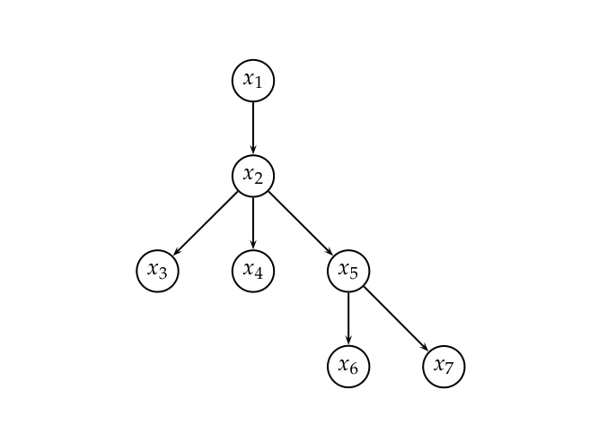

# 第 11 章 概率信息检索

[返回系列目录](../introduction-to-information-retrieval.md) · [上一篇：第 10 章 XML 检索](./10-xml-retrieval.md) · [下一篇：第 12 章 用于信息检索的语言模型](./12-language-models-for-information-retrieval.md)

原书印刷页 219–236；PDF 第 256–273 页。

<!-- source: PDF 256; printed: 219 -->

在第 9.1.2 节讨论相关反馈（relevance feedback）时，我们观察到，如果我们有一些已知的相关和不相关文档，那么我们可以直接开始估计词项 $t$ 出现在相关文档中的概率 $P(t|R = 1)$，并且这可以作为决定文档是否相关的分类器的基础。在本章中，我们将更系统地介绍这种信息检索的概率方法，它为检索模型提供了不同的形式化基础，并产生了不同的词项权重设置技术。

用户从信息需求（information needs）开始，将其转化为查询表示（query representations）。类似地，文档被转换为文档表示（document representations）（后者至少在文本如何进行词元化方面有所不同，但也可能包含根本上更少的信息，例如在使用非位置索引时）。基于这两种表示，系统试图确定文档在多大程度上满足了信息需求。在信息检索的布尔或向量空间模型中，匹配是在形式上定义明确但语义上不精确的索引词项演算中完成的。仅给定一个查询，信息检索系统对信息需求的理解是不确定的。给定查询和文档表示，系统对文档是否包含与信息需求相关的内容的猜测也是不确定的。概率论为这种不确定性下的推理提供了原则性的基础。本章提供了一个答案，说明如何利用这一基础来估计文档与信息需求相关的可能性有多大。

具有概率基础的检索模型不止一种。在这里，我们将介绍概率论和概率排序原理（第 11.1–11.2 节），然后集中讨论二值独立模型（第 11.3 节），这是最初的、也是至今最具影响力的概率检索模型。最后，我们将介绍使用词项计数的相关的扩展方法，包括在经验上取得成功的 Okapi BM25 权重计算方案，以及用于信息检索的贝叶斯网络模型（第 11.4 节）。在第 12 章中，我们将介绍另一种信息检索的概率语言建模（probabilistic language model-

<!-- source: PDF 257; printed: 220 -->

ing）方法，该方法在近年来取得了巨大的成功。

## 11.1 基础概率论回顾

我们希望读者之前已经接触过一些基础概率论知识。我们将进行非常快速的回顾；供进一步阅读的参考文献列在本章末尾。变量 $A$ 表示一个事件（可能结果空间的子集）。等价地，我们可以通过一个**随机变量**（random variable）来表示该子集，它是从结果到实数的函数；该子集是随机变量 $A$ 具有特定值的定义域。通常我们无法确定一个事件在现实世界中是否为真。我们可以询问该事件的概率 $0 \le P(A) \le 1$。对于两个事件 $A$ 和 $B$，两个事件同时发生的联合事件由联合概率 $P(A, B)$ 描述。条件概率 $P(A|B)$ 表示在事件 $B$ 发生的条件下事件 $A$ 发生的概率。联合概率和条件概率之间的基本关系由**链式法则**（chain rule）给出：

$$ P(A, B) = P(A \cap B) = P(A|B)P(B) = P(B|A)P(A) \tag{11.1} $$

在不作任何假设的情况下，联合事件的概率等于其中一个事件的概率乘以在已知第一个事件发生条件下另一个事件的概率。

将事件的补集记为 $P(\bar{A})$，我们同样有：

$$ P(\bar{A}, B) = P(B|\bar{A})P(\bar{A}) \tag{11.2} $$

概率论中还有一个**划分规则**（partition rule），它指出如果一个事件 $B$ 可以被划分为一组详尽且互不相交的子情况，那么 $B$ 的概率就是这些子情况概率的总和。该规则的一个特例给出：

$$ P(B) = P(A, B) + P(\bar{A}, B) \tag{11.3} $$

由此我们可以推导出用于反转条件概率的**贝叶斯法则**（Bayes' Rule）：

$$ P(A|B) = \frac{P(B|A)P(A)}{P(B)} = \left[ \frac{P(B|A)}{\sum_{X \in \{A, \bar{A}\}} P(B|X)P(X)} \right] P(A) \tag{11.4} $$

这个等式也可以被认为是一种更新概率的方法。我们从没有任何其他信息时对事件 $A$ 发生可能性的初始估计开始；这就是**先验概率**（prior probability）$P(A)$。贝叶斯法则允许我们在看到证据 $B$ 后推导出一个**后验概率**（posterior probability）$P(A|B)$，

<!-- source: PDF 258; printed: 221 -->

该推导基于在 $A$ 成立或不成立这两种情况下 $B$ 发生的似然（likelihood）[1]。

最后，讨论事件的**发生比**（odds）通常很有用，它为概率的变化提供了一种乘数：

$$ \text{Odds: } O(A) = \frac{P(A)}{P(\bar{A})} = \frac{P(A)}{1 - P(A)} \tag{11.5} $$

## 11.2 概率排序原理

### 11.2.1 1/0 损失情况

我们假设一个如第 6.3 节所述的排序检索设置，其中有一个文档集，用户发出查询，系统返回一个有序的文档列表。我们还假设如第 8 章所述的二元相关性概念。对于查询 $q$ 和文档集中的文档 $d$，令 $R_{d,q}$ 为一个指示随机变量，表示 $d$ 相对于给定查询 $q$ 是否相关。也就是说，当文档相关时它的值为 1，否则为 0。在上下文中，我们通常将 $R_{d,q}$ 简写为 $R$。

使用概率模型时，向用户呈现文档的明显顺序是根据它们相对于信息需求的估计相关概率进行排序：$P(R = 1|d, q)$。这就是**概率排序原理**（Probability Ranking Principle, PRP）的基础（van Rijsbergen 1979, 113–114）：

> “如果一个参考检索系统对每个请求的响应，是按照对提交请求的用户相关的概率递减的顺序对文档集中的文档进行排序，其中这些概率是基于系统为此目的所获得的所有数据尽可能准确地估计出来的，那么该系统对其用户的整体有效性将是基于这些数据所能获得的最佳效果。”

在 PRP 的最简单情况下，没有检索成本或其他会区分行动或错误权重的效用考虑。返回不相关文档或未能返回相关文档都会让你扣分（这种根据准确率进行评估的二元情况称为 **1/0 损失**，1/0 loss）。目标是作为前 $k$ 篇文档返回尽可能好的结果，对于用户选择查看的任何 $k$ 值都是如此。那么 PRP 指出，只需按照 $P(R = 1|d, q)$ 递减的顺序对所有文档进行排序即可。如果要返回的是一组检索结果而不是一个排序，那么贝叶斯

> **脚注 1（原书第 221 页）**：似然（likelihood）一词只是概率（probability）的同义词。它指在给定模型下事件或数据的概率。该词通常用于人们考虑固定数据而改变模型的情况。

<!-- source: PDF 259; printed: 222 -->

**最优决策规则**（Bayes Optimal Decision Rule，即最小化损失风险的决策）就是简单地返回相关可能性大于不相关可能性的文档：

$$ d \text{ is relevant iff } P(R = 1|d, q) > P(R = 0|d, q) \tag{11.6} $$

**定理 11.1** PRP 是最优的，其意义在于它最小化了 1/0 损失下的期望损失（也称为**贝叶斯风险**，Bayes risk）。

证明可以在 Ripley (1996) 中找到。然而，它要求所有概率都被正确已知。在实践中情况绝非如此。尽管如此，PRP 仍然为开发信息检索模型提供了非常有用的基础。

### 11.2.2 考虑检索成本的 PRP

相反，假设我们假定一个检索成本模型。令 $C_1$ 为未检索到相关文档的成本，$C_0$ 为检索到不相关文档的成本。那么概率排序原理指出，如果对于特定文档 $d$ 和所有尚未检索的文档 $d'$，满足

$$ C_0 \cdot P(R = 0|d) - C_1 \cdot P(R = 1|d) \le C_0 \cdot P(R = 0|d') - C_1 \cdot P(R = 1|d') \tag{11.7} $$

那么 $d$ 就是下一个要检索的文档。这样的模型提供了一个形式化框架，在这个框架中，我们可以在建模阶段（而不是像我们在第 8.6 节（原书第 168 页）中所做的那样仅仅在评估阶段）对假阳性（false positives）和假阴性（false negatives）的差异成本甚至系统性能问题进行建模。但是，我们在本章中将不再进一步考虑损失/效用模型。

## 11.3 二值独立模型

我们在本节中介绍的**二值独立模型**（Binary Independence Model, BIM）是传统上与 PRP 一起使用的模型。它引入了一些简单的假设，使得估计概率函数 $P(R|d, q)$ 变得切实可行。在这里，“二元”等同于布尔值：文档和查询都表示为二元词项关联向量（binary term incidence vectors）。也就是说，文档 $d$ 由向量 $\vec{x} = (x_1, \dots, x_M)$ 表示，其中如果词项 $t$ 出现在文档 $d$ 中，则 $x_t = 1$；如果 $t$ 未出现在 $d$ 中，则 $x_t = 0$。使用这种表示，许多可能的文档具有相同的向量表示。类似地，我们用关联向量 $\vec{q}$ 表示 $q$（$q$ 和 $\vec{q}$ 之间的区别不是那么重要，因为通常 $q$ 是以词集的形式存在的）。

“独立”意味着词项被建模为在文档中独立出现。该模型不承认词项之间存在任何关联。这种假设远非正确，但它在实践中往往能给出令人满意的结果；这就是朴素贝叶斯（Naive Bayes）模型的“朴素”假设，将在第 13.4 节（原书第 265 页）中进一步讨论。事实上，二元独立

<!-- source: PDF 260; printed: 223 -->

## 11.3 二值独立模型

模型与第 13.3 节（第 263 页）介绍的多变量伯努利朴素贝叶斯（multivariate Bernoulli Naive Bayes）模型完全相同。在某种意义上，这一假设等价于向量空间模型的假设，即每个词项都是一个与其他所有词项正交的维度。

我们首先提出一个假设用户具有单步信息需求（single step information need）的模型。正如第 9 章所讨论的，看到一系列结果可能会让用户细化他们的信息需求。幸运的是，正如那里所提到的，扩展二值独立模型以提供相关反馈（relevance feedback）的框架是很直接的，我们将在第 11.3.4 节中介绍该模型。

为了使概率检索策略精确，我们需要估计文档中的词项如何对相关性做出贡献，具体来说，我们希望知道词项频率（term frequency）、文档频率（document frequency）、文档长度以及我们可以计算的其他统计数据如何影响对文档相关性的判断，以及如何合理地组合它们来估计文档相关性的概率。然后，我们按照估计的相关性概率递减的顺序对文档进行排序。

我们在这里假设每篇文档的相关性独立于其他文档的相关性。正如我们在第 8.5.1 节（第 166 页）中指出的，这是不正确的：在实践中，如果该假设允许系统返回重复或近似重复的文档，那么它尤其有害。在 BIM 下，我们通过词项出现向量的概率 $P(R|\vec{x}, \vec{q})$ 来对文档相关的概率 $P(R|d, q)$ 进行建模。然后，使用贝叶斯法则，我们有：

$$
\begin{align}
P(R = 1|\vec{x},\vec{q}) &= \frac{P(\vec{x}|R = 1,\vec{q})P(R = 1|\vec{q})}{P(\vec{x}|\vec{q})} \tag{11.8} \\
P(R = 0|\vec{x},\vec{q}) &= \frac{P(\vec{x}|R = 0,\vec{q})P(R = 0|\vec{q})}{P(\vec{x}|\vec{q})} \nonumber
\end{align}
$$

这里，$P(\vec{x}|R = 1, \vec{q})$ 和 $P(\vec{x}|R = 0, \vec{q})$ 分别表示如果检索到相关或不相关的文档，该文档的表示为 $\vec{x}$ 的概率。你应该将这个量看作是相对于某个领域中可能文档的空间来定义的。我们如何计算所有这些概率？我们永远不知道确切的概率，因此我们必须使用估计值：使用关于实际文档集（document collection）的统计数据来估计这些概率。$P(R = 1|\vec{q})$ 和 $P(R = 0|\vec{q})$ 分别表示对于查询 $\vec{q}$ 检索到相关或不相关文档的先验概率。同样，如果我们知道文档集中相关文档的百分比，那么我们可以使用这个数字来估计 $P(R = 1|\vec{q})$ 和 $P(R = 0|\vec{q})$。由于一篇文档对于查询要么相关要么不相关，我们必然有：

$$
P(R = 1|\vec{x},\vec{q}) + P(R = 0|\vec{x},\vec{q}) = 1 \tag{11.9}
$$

<!-- source: PDF 261; printed: 224 -->

### 11.3.1 推导查询词项的排序函数

给定查询 $q$，我们希望按 $P(R = 1|d, q)$ 降序对返回的文档进行排序。在 BIM 下，这被建模为按 $P(R = 1|\vec{x}, \vec{q})$ 排序。我们不直接估计这个概率，因为我们只对文档的排序感兴趣，而是使用一些更容易计算且能给出相同文档排序的其他量。特别地，我们可以根据文档的相关性发生比（odds of relevance）进行排序（因为相关性发生比与相关性概率是单调递增的）。这使得事情变得更容易，因为我们可以忽略式（11.8）中的公分母，得到：

$$
O(R|\vec{x},\vec{q}) = \frac{P(R = 1|\vec{x},\vec{q})}{P(R = 0|\vec{x},\vec{q})} = \frac{\frac{P(R=1|\vec{q})P(\vec{x}|R=1,\vec{q})}{P(\vec{x}|\vec{q})}}{\frac{P(R=0|\vec{q})P(\vec{x}|R=0,\vec{q})}{P(\vec{x}|\vec{q})}} = \frac{P(R = 1|\vec{q})}{P(R = 0|\vec{q})} \cdot \frac{P(\vec{x}|R = 1,\vec{q})}{P(\vec{x}|R = 0,\vec{q})} \tag{11.10}
$$

式（11.10）最右边表达式中的左侧项对于给定查询是一个常数。由于我们只对文档进行排序，因此我们不需要估计它。然而，右侧项确实需要估计，这最初看起来很困难：我们如何准确估计整个词项出现向量发生的概率？正是在这一点上，我们引入了**朴素贝叶斯**（Naive Bayes）条件独立性假设，即文档中某个词的出现与否独立于任何其他词的出现与否（给定查询）：

$$
\frac{P(\vec{x}|R = 1,\vec{q})}{P(\vec{x}|R = 0,\vec{q})} = \prod_{t=1}^{M} \frac{P(x_t|R = 1,\vec{q})}{P(x_t|R = 0,\vec{q})} \tag{11.11}
$$

因此：

$$
O(R|\vec{x},\vec{q}) = O(R|\vec{q}) \cdot \prod_{t=1}^{M} \frac{P(x_t|R = 1,\vec{q})}{P(x_t|R = 0,\vec{q})} \tag{11.12}
$$

由于每个 $x_t$ 要么是 0 要么是 1，我们可以将这些项分离得到：

$$
O(R|\vec{x},\vec{q}) = O(R|\vec{q}) \cdot \prod_{t:x_t=1} \frac{P(x_t = 1|R = 1,\vec{q})}{P(x_t = 1|R = 0,\vec{q})} \cdot \prod_{t:x_t=0} \frac{P(x_t = 0|R = 1,\vec{q})}{P(x_t = 0|R = 0,\vec{q})} \tag{11.13}
$$

此后，令 $p_t = P(x_t = 1|R = 1,\vec{q})$ 为词项出现在与查询相关的文档中的概率，令 $u_t = P(x_t = 1|R = 0,\vec{q})$ 为词项出现在不相关文档中的概率。这些量可以在以下列和为 1 的列联表中直观显示：

$$
\begin{array}{ll|cc}
\hline
 & \text{文档} & \text{相关 }(R=1) & \text{不相关 }(R=0) \\
\hline
\text{词项出现} & x_t=1 & p_t & u_t \\
\text{词项未出现} & x_t=0 & 1-p_t & 1-u_t \\
\hline
\end{array}
\tag{11.14}
$$

<!-- source: PDF 262; printed: 225 -->

让我们做一个额外的简化假设，即未在查询中出现的词项在相关文档和不相关文档中出现的概率相等：也就是说，如果 $q_t = 0$，那么 $p_t = u_t$。（这个假设是可以改变的，例如在第 11.3.4 节中进行相关反馈时。）那么我们只需要考虑乘积中出现在查询中的词项，因此，

$$
O(R|\vec{q},\vec{x}) = O(R|\vec{q}) \cdot \prod_{t:x_t=q_t=1} \frac{p_t}{u_t} \cdot \prod_{t:x_t=0,q_t=1} \frac{1 - p_t}{1 - u_t} \tag{11.15}
$$

左侧的乘积是针对在文档中找到的查询词项，右侧的乘积是针对未在文档中找到的查询词项。

我们可以对这个表达式进行变换，将文档中找到的查询词项包含到右侧的乘积中，同时在左侧的乘积中除以它们，这样值保持不变。然后我们有：

$$
O(R|\vec{q},\vec{x}) = O(R|\vec{q}) \cdot \prod_{t:x_t=q_t=1} \frac{p_t(1 - u_t)}{u_t(1 - p_t)} \cdot \prod_{t:q_t=1} \frac{1 - p_t}{1 - u_t} \tag{11.16}
$$

左侧的乘积仍然是针对在文档中找到的查询词项，但右侧的乘积现在是针对所有查询词项。这意味着对于特定查询，右侧的乘积是一个常数，就像发生比 $O(R|\vec{q})$ 一样。因此，为了根据对查询的相关性对文档进行排序，唯一需要估计的量是左侧的乘积。我们同样可以根据该项的对数对文档进行排序，因为对数是一个单调函数。在该模型中，用于排序的最终量被称为**检索状态值**（Retrieval Status Value, RSV）：

$$
RSV_d = \log \prod_{t:x_t=q_t=1} \frac{p_t(1 - u_t)}{u_t(1 - p_t)} = \sum_{t:x_t=q_t=1} \log \frac{p_t(1 - u_t)}{u_t(1 - p_t)} \tag{11.17}
$$

所以一切都归结为计算 RSV。定义 $c_t$：

$$
c_t = \log \frac{p_t(1 - u_t)}{u_t(1 - p_t)} = \log \frac{p_t}{(1 - p_t)} + \log \frac{1 - u_t}{u_t} \tag{11.18}
$$

$c_t$ 项是查询中词项的对数发生比率（log odds ratios）。我们有文档相关时词项出现的发生比（$p_t/(1 - p_t)$）以及文档不相关时词项出现的发生比（$u_t/(1 - u_t)$）。**发生比率**（odds ratio）是这两个发生比的比值，最后我们取该量的对数。如果一个词项在相关文档和不相关文档中出现的发生比相等，则该值为 0；如果它更有可能出现在相关文档中，则该值为正。$c_t$ 量在模型中起着词项权重的作用，文档对查询的评分（score）为 $RSV_d = \sum_{x_t=q_t=1} c_t$。在操作上，我们将出现在文档中的查询词项的这些值在累加器中求和，就像第 7.1 节（第 135 页）中讨论的向量空间模型计算一样。我们现在转向如何为特定的文档集和查询估计这些 $c_t$ 量。

<!-- source: PDF 263; printed: 226 -->

### 11.3.2 理论上的概率估计

对于每个词项 $t$，在整个文档集中这些 $c_t$ 值会是什么样子？式（11.19）给出了文档集中文档计数的列联表，其中 $df_t$ 是包含词项 $t$ 的文档数量：

$$
\begin{array}{ll|cc|c}
\hline
 & \text{文档} & \text{相关} & \text{不相关} & \text{总计} \\
\hline
\text{词项出现} & x_t=1 & s & \mathrm{df}_t-s & \mathrm{df}_t \\
\text{词项未出现} & x_t=0 & S-s & (N-\mathrm{df}_t)-(S-s) & N-\mathrm{df}_t \\
\hline
 & \text{总计} & S & N-S & N \\
\hline
\end{array}
\tag{11.19}
$$
使用这个表，$p_t = s/S$ 且 $u_t = (df_t - s)/(N - S)$，并且

$$
c_t = K(N, df_t, S, s) = \log \frac{s/(S - s)}{(df_t - s)/((N - df_t) - (S - s))} \tag{11.20}
$$

为了避免出现零的可能性（例如，如果所有相关文档或没有相关文档包含特定词项），相当标准的做法是向式（11.19）中间 4 项的每个量加上 $\frac{1}{2}$，然后相应地调整边缘计数（总计）（因此，右下角单元格的总计为 $N + 2$）。然后我们有：

$$
\hat{c}_t = K(N, df_t, S, s) = \log \frac{(s + \frac{1}{2})/(S - s + \frac{1}{2})}{(df_t - s + \frac{1}{2})/(N - df_t - S + s + \frac{1}{2})} \tag{11.21}
$$

以这种方式加上 $\frac{1}{2}$ 是一种简单的平滑（smoothing）形式。对于具有分类结果的试验（例如记录词项的出现或不出现），从数据中估计事件概率的一种方法是简单地计算事件发生的次数除以试验总数。这被称为事件的**相对频率**（relative frequency）。将概率估计为相对频率即为**最大似然估计**（maximum likelihood estimate，或 **MLE**），因为该值使得观测数据出现的可能性最大。然而，如果我们简单地使用 MLE，那么赋予我们碰巧看到的事件的概率通常太高，而其他事件可能完全未被看到，将它们的相对频率 0 作为概率估计既是一种低估，通常也会破坏我们的模型，因为任何数乘以 0 都是 0。同时降低已见事件的估计概率并增加未见事件的概率被称为**平滑**（smoothing）。一种简单的平滑方法是向每个观测计数加上一个数字 $\alpha$。这些**伪计数**（pseudocounts）对应于在词汇表上使用均匀分布作为**贝叶斯先验**（Bayesian prior），遵循式（11.4）。我们最初假设事件服从均匀分布，其中 $\alpha$ 的大小表示我们对均匀性信念的强度，然后我们根据观测到的事件更新概率。由于我们对均匀性的信念很弱，我们使用

<!-- source: PDF 264; printed: 227 -->

$\alpha = \frac{1}{2}$。这是最大后验（maximum a posteriori，MAP）估计的一种形式，根据式（11.4），我们基于先验和观察到的证据选择概率的最可能点值。我们将在第 12.2.2 节（第 243 页）进一步讨论平滑估计计数以给出概率模型的方法；目前，对每个观察到的计数加上 $\frac{1}{2}$ 的简单方法就足够了。

### 11.3.3 实践中的概率估计

假设相关文档在文档集中占极小比例，用整个文档集的统计数据来近似非相关文档的统计数据是合理的。在此假设下，$u_t$（查询词项在非相关文档中出现的概率）为 $\text{df}_t/N$，并且

$$
\log[(1 - u_t)/u_t] = \log[(N - \text{df}_t)/\text{df}_t] \approx \log N/\text{df}_t
\tag{11.22}
$$

换句话说，我们可以为我们在第 6.2.1 节中看到的最常用的 idf 权重形式提供理论依据。

式（11.22）中的近似技术不能轻易地扩展到相关文档。量 $p_t$ 可以通过多种方式估计：

1. 我们可以使用词项在已知相关文档中出现的频率（如果我们知道一些的话）。这是反馈循环中相关反馈权重的概率方法的基础，将在下一小节中讨论。
2. Croft and Harper (1979) 提出在他们的组合匹配模型（combination match model）中使用一个常数。例如，我们可以假设对于查询中的所有词项 $x_t$，$p_t$ 是常数，并且 $p_t = 0.5$。这意味着每个词项出现在相关文档中的几率是均等的，因此 $p_t$ 和 $(1 - p_t)$ 因子在 RSV 的表达式中相互抵消。这种估计很弱，但与我们希望搜索词项出现在许多（但不是全部）相关文档中的期望并不严重冲突。将此方法与我们之前对 $u_t$ 的近似相结合，文档排名就简单地由文档中出现的查询词项按其 idf 权重缩放来决定。对于短文档（标题或摘要），在不希望进行迭代搜索的情况下，仅使用此权重项就可以非常令人满意，尽管在许多其他情况下我们希望能做得更好。
3. Greiff (1998) 认为，Croft and Harper (1979) 模型中 $p_t$ 的常数估计在理论上是有问题的，并且在经验上也没有观察到：正如预期的那样，$p_t$ 显示出随 $\text{df}_t$ 增加而增加。基于他的数据分析，一个合理的建议是使用估计值 $p_t = \frac{1}{3} + \frac{2}{3}\text{df}_t/N$。

<!-- source: PDF 265; printed: 228 -->

结合了上述一些想法的迭代估计方法将在下一小节中讨论。

### 11.3.4 相关反馈的概率方法

我们可以使用（伪）相关反馈（也许在迭代估计过程中）来获得更准确的 $p_t$ 估计。相关反馈的概率方法工作原理如下：

1. 猜测 $p_t$ 和 $u_t$ 的初始估计值。这可以使用上一节的概率估计来完成。例如，我们可以假设对于查询中的所有 $x_t$，$p_t$ 是常数，特别是，也许取 $p_t = \frac{1}{2}$。
2. 使用当前对 $p_t$ 和 $u_t$ 的估计来确定相关文档集 $R = \{d : R_{d,q} = 1\}$ 的最佳猜测。使用此模型检索一组候选相关文档，并将其呈现给用户。
3. 我们与用户交互以改进 $R$ 的模型。我们通过从用户对某些文档子集 $V$ 的相关性判断中学习来做到这一点。基于相关性判断，$V$ 被划分为两个子集：$VR = \{d \in V, R_{d,q} = 1\} \subset R$ 和 $VNR = \{d \in V, R_{d,q} = 0\}$，后者与 $R$ 不相交。
4. 我们基于已知的相关和非相关文档重新估计 $p_t$ 和 $u_t$。如果集合 $VR$ 和 $VNR$ 足够大，我们也许能够直接从这些文档中将这些量估计为最大似然估计（maximum likelihood estimates）：

$$
p_t = |VR_t|/|VR|
\tag{11.23}
$$

（其中 $VR_t$ 是 $VR$ 中包含 $x_t$ 的文档集）。在实践中，我们通常需要平滑这些估计。我们可以通过在计数 $|VR_t|$ 和不包含该词项的相关文档数上都加上 $\frac{1}{2}$ 来做到这一点，得到：

$$
p_t = \frac{|VR_t| + \frac{1}{2}}{|VR| + 1}
\tag{11.24}
$$

然而，用户判断的文档集（$V$）通常非常小，因此即使估计经过平滑处理，得到的统计估计也相当不可靠（有噪声）。因此，在贝叶斯更新（Bayesian updating）过程中，将新信息与原始猜测结合起来通常更好。在这种情况下，我们有：

$$
p_t^{(k+1)} = \frac{|VR_t| + \kappa p_t^{(k)}}{|VR| + \kappa}
\tag{11.25}
$$

<!-- source: PDF 266; printed: 229 -->

这里 $p_t^{(k)}$ 是迭代更新过程中 $p_t$ 的第 $k$ 次估计，并在下一次迭代中作为权重为 $\kappa$ 的贝叶斯先验。将此等式与式（11.4）联系起来需要比我们这里介绍的更多的概率论知识（我们需要使用与伯努利随机变量 $X_t$ 共轭的贝塔分布先验）。但所得等式的形式非常直观：我们现在不再均匀分布伪计数，而是根据作为先验分布的先前估计来分布总共 $\kappa$ 个伪计数。在没有其他证据的情况下（并假设用户可能指示了大约 5 个相关或非相关文档），那么 $\kappa = 5$ 左右的值也许是合适的。也就是说，先验被赋予了很大的权重，因此估计值不会因为极少数文档提供的证据而发生太大变化。

5. 从步骤 2 开始重复上述过程，生成一系列对 $R$ 以及 $p_t$ 的近似，直到用户满意为止。

导出此算法的伪相关反馈版本也很直接，我们只需假装 $VR = V$。简而言之：

1. 如上所述假设 $p_t$ 和 $u_t$ 的初始估计。
2. 确定对相关文档集大小的猜测。如果不确定，保守（太小）的猜测可能是最好的。这促使我们使用固定大小的排名最高的文档集 $V$。
3. 改进我们对 $p_t$ 和 $u_t$ 的猜测。我们从式（11.23）和（11.25）的方法中选择来重新估计 $p_t$，只是现在基于集合 $V$ 而不是 $VR$。如果我们令 $V_t$ 为 $V$ 中包含 $x_t$ 的文档子集，并使用加 $\frac{1}{2}$ 平滑，我们得到：

$$
p_t = \frac{|V_t| + \frac{1}{2}}{|V| + 1}
\tag{11.26}
$$

并且如果我们假设未检索到的文档是不相关的，那么我们可以将 $u_t$ 估计更新为：

$$
u_t = \frac{\text{df}_t - |V_t| + \frac{1}{2}}{N - |V| + 1}
\tag{11.27}
$$

4. 转到步骤 2，直到返回结果的排名收敛。

一旦我们有了 $p_t$ 的真实估计，那么在 RSV 值中使用的 $c_t$ 权重看起来几乎就像一个 tf-idf 值。例如，使用式（11.18）、

<!-- source: PDF 267; printed: 230 -->

式（11.22）和式（11.26），我们有：

$$
c_t = \log \left[ \frac{p_t}{1 - p_t} \cdot \frac{1 - u_t}{u_t} \right] \approx \log \left[ \frac{|V_t| + \frac{1}{2}}{|V| - |V_t| + 1} \cdot \frac{N}{\text{df}_t} \right]
\tag{11.28}
$$

但情况并不完全相同：$p_t/(1 - p_t)$ 衡量的是词项 $t$ 出现的（估计的）相关文档比例，而不是词项频率。此外，如果我们应用对数恒等式：

$$
c_t = \log \frac{|V_t| + \frac{1}{2}}{|V| - |V_t| + 1} + \log \frac{N}{\text{df}_t}
\tag{11.29}
$$

我们看到我们现在是将两个对数缩放的组件相加，而不是将它们相乘。

**练习 11.1**
详细推导从式（11.18）和（11.19）到式（11.20）的过程。

**练习 11.2**
标准向量空间 tf-idf 权重和 BIM 概率检索模型（在没有文档相关性信息可用的情况下）之间有什么区别？

**练习 11.3** [$\star\star$]
设 $X_t$ 为指示词项 $t$ 是否出现在文档中的随机变量。假设我们在文档集中有 $|R|$ 个相关文档，并且在 $s$ 个文档中 $X_t = 1$。将观察到的数据仅仅视为 $R$ 中每个文档的 $X_t$ 的这些观察结果。证明参数 $p_t = P(X_t = 1|R = 1, \vec{q})$ 的最大似然估计（MLE），即最大化观察数据概率的 $p_t$ 值，为 $p_t = s/|R|$。

**练习 11.4**
描述向量空间相关反馈和概率相关反馈之间的区别。

## 11.4 评价与一些扩展

### 11.4.1 概率模型的评价

概率方法是信息检索（IR）中最古老的正式模型之一。早在 20 世纪 70 年代，它们就被视为将 IR 置于更坚实理论基础上的一个契机，随着 20 世纪 90 年代计算语言学中概率方法的复兴，这种希望又回来了，概率方法再次成为目前 IR 中最热门的话题之一。传统上，概率 IR 拥有巧妙的想法，但这些方法在性能上从未胜出。为

<!-- source: PDF 268; printed: 231 -->

建立概率 IR 模型是可能的，但它需要一些主要的假设。在 BIM 中，这些假设是：

* 文档/查询/相关性的布尔表示（a Boolean representation of documents/queries/relevance）
* 词项独立性（term independence）
* 不在查询中的词项不影响结果（terms not in the query don’t affect the outcome）
* 文档相关性值是独立的（document relevance values are independent）

也许正是建模假设的严苛性使得难以获得良好的性能。一个普遍的问题似乎是，概率模型要么需要部分相关性信息，要么只允许推导出明显较差的词项权重模型。

到了 20 世纪 90 年代，情况开始发生变化，我们将在下一节讨论的 BM25 权重方案表现出了非常好的性能，并开始被许多研究小组采用作为词项权重方案。“向量空间”和“概率”IR 系统之间的差异并没有那么大：在任何一种情况下，你都可以按照我们在第 7 章中讨论的完全相同的方式构建信息检索方案。对于概率 IR 系统，最后的评分步骤会将向量空间中的余弦相似度和 tf-idf 公式，替换为一个受概率论启发、形式略有不同的评分公式。事实上，有时人们只需采用概率模型中的词项权重公式，就能将现有的向量空间 IR 系统转变为有效的概率系统。在本节中，我们将简要介绍传统概率模型的三个扩展，在下一章中，我们将探讨一种略有不同的概率语言模型 IR 方法。

### 11.4.2 词项间的树状结构依赖

BIM 的一些假设是可以被移除的。例如，我们可以移除词项独立的假设。在实践中，这个假设与事实相去甚远。一个特别违反该假设的例子是像 Hong 和 Kong 这样的词项对，它们具有很强的依赖性。但依赖关系可能以各种复杂的配置出现，例如在词项集合 New, York, England, City, Stock, Exchange 和 University 之间。van Rijsbergen (1979) 提出了一个简单、合理的模型，该模型允许词项依赖的树状结构，如图 11.1 所示。在这个模型中，每个词项只能直接依赖于另一个词项，从而形成依赖的树状结构。当它在 20 世纪 70 年代被发明时，估计问题阻碍了该模型在实践中的成功，但这个想法被 Friedman and Goldszmidt (1996) 重新发明为树增强朴素贝叶斯（Tree Augmented Naive Bayes）模型，他们在各种机器学习数据集上使用它并取得了一些成功。

<!-- source: PDF 269; printed: 232 -->

**图 11.1** 词项间的依赖树。在这种图模型表示中，如果存在一个箭头 $x_k \rightarrow x_i$，则词项 $x_i$ 直接依赖于词项 $x_k$。
图中文字：$x_1$, $x_2$, $x_3$, $x_4$, $x_5$, $x_6$, $x_7$

### 11.4.3 Okapi BM25：一种非二值模型

BIM 最初是为长度相当一致的简短目录记录和摘要而设计的，它在这些上下文中工作得相当好，但对于现代全文搜索文档集，很明显模型应该关注词项频率和文档长度，如第 6 章所述。**BM25 权重**（BM25 weights，通常被称为 **Okapi 权重** Okapi weighting，得名于首次实现它的系统）被开发出来，作为一种构建对这些数量敏感的概率模型的方法，同时又不会在模型中引入太多额外的参数 (Spärck Jones et al. 2000)。我们不会在这里展开该模型背后的完整理论，而只是展示一系列形式，这些形式逐步构建出目前用于文档评分的标准形式。文档 $d$ 的最简单评分就是对出现的查询词项进行 idf 加权，如式（11.22）所示：

$$ RSV_d = \sum_{t \in q} \log \frac{N}{df_t} \tag{11.30} $$

有时，会使用 idf 的替代版本。如果我们从式（11.21）中的公式开始，但在缺乏相关反馈信息的情况下，我们估计 $S = s = 0$，那么我们会得到如下的替代 idf 公式：

$$ RSV_d = \sum_{t \in q} \log \frac{N - df_t + \frac{1}{2}}{df_t + \frac{1}{2}} \tag{11.31} $$

<!-- source: PDF 270; printed: 233 -->

这个变体的表现有些奇怪：如果一个词项出现在文档集中超过一半的文档中，那么该模型会给出一个负的词项权重，这大概是不希望看到的。但是，假设使用了停用词表，这种情况通常不会发生，并且可以为每个加数设定一个下限 0。

我们可以通过将每个词项的频率和文档长度考虑在内，对式（11.30）进行改进：

$$ RSV_d = \sum_{t \in q} \log \left[ \frac{N}{df_t} \right] \cdot \frac{(k_1 + 1)tf_{td}}{k_1((1 - b) + b \times (L_d/L_{ave})) + tf_{td}} \tag{11.32} $$

这里，$tf_{td}$ 是词项 $t$ 在文档 $d$ 中的频率，$L_d$ 和 $L_{ave}$ 分别是文档 $d$ 的长度和整个文档集的平均文档长度。变量 $k_1$ 是一个正的调节参数，用于校准文档词项频率的缩放。$k_1$ 值为 0 对应于二值模型（无词项频率），而较大的值对应于使用原始词项频率。$b$ 是另一个调节参数（$0 \le b \le 1$），它决定了按文档长度缩放的程度：$b = 1$ 对应于按文档长度对词项权重进行完全缩放，而 $b = 0$ 对应于不进行长度归一化。

如果查询很长，那么我们也可以对查询词项使用类似的权重。如果查询是段落长度的信息需求，这是合适的，但对于短查询则没有必要。

$$ RSV_d = \sum_{t \in q} \left[ \log \frac{N}{df_t} \right] \cdot \frac{(k_1 + 1)tf_{td}}{k_1((1 - b) + b \times (L_d/L_{ave})) + tf_{td}} \cdot \frac{(k_3 + 1)tf_{tq}}{k_3 + tf_{tq}} \tag{11.33} $$

其中 $tf_{tq}$ 是词项 $t$ 在查询 $q$ 中的频率，$k_3$ 是另一个正的调节参数，这次用于校准查询的词项频率缩放。在给出的等式中，没有对查询进行长度归一化（就好像这里的 $b = 0$）。查询的长度归一化是不必要的，因为检索是针对单个固定查询进行的。理想情况下，应设置这些公式的调节参数以优化在开发测试集上的性能（见第 153 页）。也就是说，我们可以在一个独立的开发测试集上搜索使性能最大化的这些参数的值（可以手动进行，也可以使用网格搜索或更高级的优化方法），然后在实际的测试集上使用这些参数。在缺乏这种优化的情况下，实验表明合理的值是将 $k_1$ 和 $k_3$ 设置在 1.2 到 2 之间，并将 $b = 0.75$。

如果我们有可用的相关性判定，那么我们可以使用式（11.21）的完整形式来代替式（11.22）中引入的近似值 $\log(N/df_t)$：

$$ RSV_d = \sum_{t \in q} \log \left[ \frac{(|VR_t| + \frac{1}{2}) / (|VNR_t| + \frac{1}{2})}{(df_t - |VR_t| + \frac{1}{2}) / (N - df_t - |VR| + |VR_t| + \frac{1}{2})} \right] \tag{11.34} $$

<!-- source: PDF 271; printed: 234 -->

$$ \times \frac{(k_1 + 1)tf_{td}}{k_1((1 - b) + b(L_d/L_{ave})) + tf_{td}} \times \frac{(k_3 + 1)tf_{tq}}{k_3 + tf_{tq}} $$

这里，$VR_t$、$NVR_t$ 和 $VR$ 的用法与第 11.3.4 节相同。表达式的第一部分反映了相关反馈（如果没有可用的相关性信息，则仅为 idf 权重），第二部分实现了文档词项频率和文档长度的缩放，第三部分考虑了查询中的词项频率。

相关反馈不仅仅是为用户查询中的词项提供一种词项权重方法，它还可以包括使用已知相关文档中按式（11.21）中的相关性因子 $\hat{c}_t$ 排序的前几个（例如 10-20 个）词项来扩充查询（自动或通过人工审查），然后上述公式就可以与这样一个扩充后的查询向量 $\vec{q}$ 一起使用。

BM25 词项权重公式已在各种文档集和搜索任务中得到相当广泛且非常成功的使用。特别是在 TREC 评测中，它们表现良好并被许多研究小组广泛采用。有关实验结果的广泛动机和讨论，请参见 Spärck Jones et al. (2000)。

### 11.4.4 IR 的贝叶斯网络方法

Turtle and Croft (1989; 1991) 将**贝叶斯网络**（Bayesian networks，Jensen and Jensen 2001）（一种概率图模型）的使用引入到信息检索中。我们跳过细节，因为全面介绍贝叶斯网络的形式化体系需要太多的篇幅，但从概念上讲，贝叶斯网络使用有向图来显示变量之间的概率依赖关系，如图 11.1 所示，并促进了用于传播影响的复杂算法的发展，从而允许在任意有向无环图中利用任意知识进行学习和推断。Turtle and Croft 使用了一个复杂的网络来更好地对文档和用户信息需求之间的复杂依赖关系进行建模。

该模型分解为两部分：文档集网络和查询网络。文档集网络很大，但可以预先计算：它从文档映射到词项再映射到概念。概念是对文档中出现的词项基于同义词词典的扩展。查询网络相对较小，但每次有查询进入时都需要构建一个新网络，然后将其附加到文档网络上。查询网络从查询词项映射到查询子表达式（使用概率或“带噪”版本的 AND 和 OR 运算符构建），再映射到用户的信息需求。

结果是一个灵活的概率网络，它可以泛化各种更简单的布尔模型和概率模型。事实上，这是主要的

<!-- source: PDF 272; printed: 235 -->

自然支持结构化查询算子的统计排序检索模型的一个案例。该系统允许高效的大规模检索，并且是马萨诸塞大学（University of Massachusetts）构建的 InQuery 文本检索系统的基础。该系统在 TREC 评估中表现非常出色，并曾一度被商业化销售。另一方面，该模型仍然使用了各种近似和独立性假设，以使参数估计和计算成为可能。沿着这些方向的后续工作并不多，但我们要指出的是，该模型实际上是在使用贝叶斯网络（Bayesian networks）的现代时代的非常早期构建的，并且在理论上已经有了许多后续发展，也许现在正是新一代基于贝叶斯网络的信息检索系统出现的合适时机。

## 11.5 参考文献及进一步阅读

关于概率论的更详细的介绍可以在大多数概率论与数理统计的入门书籍中找到，例如 (Grinstead and Snell 1997, Rice 2006, Ross 2006)。关于贝叶斯效用理论（Bayesian utility theory）的介绍可以在 (Ripley 1996) 中找到。

信息检索（IR）的概率方法起源于 20 世纪 50 年代的英国。概率模型的首次重要展示是 Maron and Kuhns (1960)。Robertson and Jones (1976) 介绍了二值独立模型（BIM）的主要基础，van Rijsbergen (1979) 详细介绍了经典的 BIM 概率模型。概率排序原理（PRP）的思想被不同程度地归功于 S. E. Robertson、M. E. Maron 和 W. S. Cooper（在 Robertson and Jones (1976) 中使用了“概率排序原理”（Probabilistic Ordering Principle）一词，但在后来的工作中 PRP 占据了主导地位）。Fuhr (1992) 是概率 IR 的较新展示，其中包括对概率逻辑和贝叶斯网络等其他方法的介绍。Crestani et al. (1998) 是另一篇综述。Spärck Jones et al. (2000) 是“伦敦学派”（London school）关于概率 IR 实验的权威展示，Robertson (2005) 对该小组参与 TREC 评估进行了回顾，包括对 Okapi BM25 评分（scoring）函数及其发展的详细讨论。Robertson et al. (2004) 将 BM25 扩展到了多个加权域（multiple weighted fields）的情况。

与 Lemur 工具包（http://www.lemurproject.org/）一起发布的开源 Indri 搜索引擎，融合了贝叶斯推理网络和统计语言模型（language modeling）方法（参见第 12 章）的思想，特别是保留了前者对结构化查询算子的支持。

<!-- source: PDF 273; printed: 236 -->

<!-- 原书此页为空白，仅有重复的版本页脚。 -->

[返回系列目录](../introduction-to-information-retrieval.md) · [上一篇：第 10 章 XML 检索](./10-xml-retrieval.md) · [下一篇：第 12 章 用于信息检索的语言模型](./12-language-models-for-information-retrieval.md)
