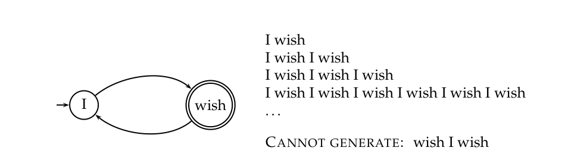
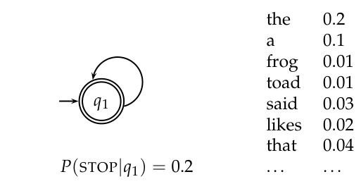
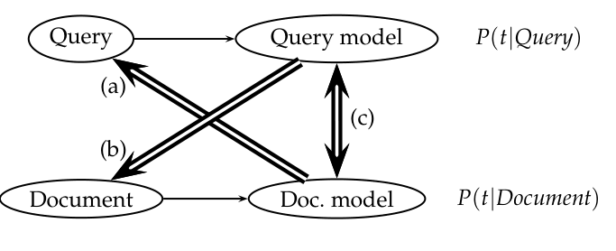

# 第 12 章 用于信息检索的语言模型

[返回系列目录](../introduction-to-information-retrieval.md) · [上一篇：第 11 章 概率信息检索](./11-probabilistic-information-retrieval.md) · [下一篇：第 13 章 文本分类与朴素贝叶斯](./13-text-classification-and-naive-bayes.md)

原书印刷页 237–252；PDF 第 274–289 页。

<!-- source: PDF 274; printed: 237 -->

给用户提出好查询的一个常见建议是，想出那些可能出现在相关文档中的词，并将这些词作为查询。信息检索（IR）的语言模型方法直接对这一想法进行了建模：如果文档模型很可能生成该查询，那么该文档就是一个与查询良好匹配的文档，而如果文档经常包含查询词，这种情况就会发生。因此，这种方法为我们在第 6.2 节（原书第 117 页）中看到的一些文档排序的基本思想提供了一种不同的实现。与传统的信息检索概率方法（第 11 章）中公开对文档 $d$ 与查询 $q$ 的相关性概率 $P(R = 1|q, d)$ 进行建模的做法不同，基本的语言模型方法转而从每个文档 $d$ 构建一个概率语言模型 $M_d$，并基于该模型生成查询的概率 $P(q|M_d)$ 对文档进行排序。

在本章中，我们首先介绍语言模型的概念（第 12.1 节），然后描述信息检索中最基本且最常用的语言模型方法——查询似然模型（Query Likelihood Model，第 12.2 节）。在对语言模型方法与信息检索的其他方法进行了一些比较之后（第 12.3 节），我们最后简要描述了语言模型方法的各种扩展（第 12.4 节）。

## 12.1 Language models

### 12.1.1 Finite automata and language models

文档模型生成查询是什么意思？形式语言理论中常见的那种传统的语言**生成模型**（generative model），既可以用来识别字符串，也可以用来生成字符串。例如，图 12.1 所示的有限自动机可以生成包含图示示例的字符串。能够生成的字符串的完整集合被称为该自动机的**语言**（language）。[1]

<!-- source: PDF 275; printed: 238 -->

**图 12.1** 一个简单的有限自动机及其生成的语言中的一些字符串。$\rightarrow$ 表示自动机的起始状态，双圆圈表示（可能的）结束状态。
图中文字：I wish 表示“我希望”，图中依次将该词序列重复一次、两次、三次、六次，等等；CANNOT GENERATE 表示“无法生成”，对应的词序列是 wish I wish。英文词序保留用于说明自动机的生成规则。

**图 12.2** 一个作为一元语言模型的一状态有限自动机。图中给出了状态发射概率的部分说明。
图中词语说明：STOP 表示停止生成；the 为定冠词，a 为不定冠词，frog 为青蛙，toad 为蟾蜍，said 为“说”，likes 为“喜欢”，that 为“那个”。词语右侧的数值为对应概率。

图中文字：$q_1$ / $P(\text{STOP}|q_1) = 0.2$ / the 0.2 / a 0.1 / frog 0.01 / toad 0.01 / said 0.03 / likes 0.02 / that 0.04 / ... ...

相反，如果每个节点在生成不同词项（term）上都有一个概率分布，我们就得到了一个语言模型。语言模型的概念本质上是概率性的。**语言模型**（language model）是一个对从某个词汇表中提取的字符串赋予概率测度的函数。也就是说，对于字母表 $\Sigma$ 上的语言模型 $M$：

$$ \sum_{s \in \Sigma^*} P(s) = 1 \tag{12.1} $$

一种简单的语言模型等价于一个概率有限自动机，它仅由一个节点组成，该节点在产生不同词项上具有单一的概率分布，使得 $\sum_{t \in V} P(t) = 1$，如图 12.2 所示。在生成每个词之后，我们决定是停止还是循环并产生另一个词，因此该模型还需要一个在结束状态停止的概率。这样的模型在任何词序列上都放置了一个概率分布。通过这种构造，它也提供了一个根据其分布生成文本的模型。

> **脚注 1（原书第 238 页）**：有限自动机的输出可以附加在其状态或弧上；我们在这里使用状态，因为这直接映射到概率自动机通常的形式化方式。

<!-- source: PDF 276; printed: 239 -->

| Model $M_1$ | | Model $M_2$ | |
|---|---|---|---|
| the | 0.2 | the | 0.15 |
| a | 0.1 | a | 0.12 |
| frog | 0.01 | frog | 0.0002 |
| toad | 0.01 | toad | 0.0001 |
| said | 0.03 | said | 0.03 |
| likes | 0.02 | likes | 0.04 |
| that | 0.04 | that | 0.04 |
| dog | 0.005 | dog | 0.01 |
| cat | 0.003 | cat | 0.015 |
| monkey | 0.001 | monkey | 0.002 |
| $\dots$ | $\dots$ | $\dots$ | $\dots$ |

**图 12.3** 两个一元语言模型的部分说明。

**例 12.1：** 为了求出一个词序列的概率，我们只需将模型赋予序列中每个词的概率，连同产生每个词后继续或停止的概率相乘即可。例如，

$$ \begin{aligned} P(\text{frog said that toad likes frog}) &= (0.01 \times 0.03 \times 0.04 \times 0.01 \times 0.02 \times 0.01) \\ &\quad \times (0.8 \times 0.8 \times 0.8 \times 0.8 \times 0.8 \times 0.8 \times 0.2) \\ &\approx 0.000000000001573 \end{aligned} \tag{12.2} $$

如你所见，特定字符串/文档的概率通常是一个非常小的数字！这里我们在第二次生成 frog（青蛙）后停止了。第一行数字是词项发射概率，第二行给出了在生成每个词后继续或停止的概率。根据式（12.1），有限自动机要成为一个形式良好的语言模型，需要一个显式的 STOP 概率。尽管如此，在大多数情况下，我们将省略包含 STOP 和 (1 - STOP) 的概率（正如大多数其他作者所做的那样）。为了比较数据集的两个模型，我们可以计算它们的**似然比**（likelihood ratio），这只需将根据一个模型得到的数据概率除以根据另一个模型得到的数据概率即可。只要停止概率是固定的，包含它就不会改变比较两个语言模型生成字符串的似然度所产生的似然比。因此，它不会改变文档的排序。[2] 尽管如此，在形式上，这些数字将不再是真正的概率，而只是与概率成正比。参见练习 12.4。

**例 12.2：** 现在假设我们有两个语言模型 $M_1$ 和 $M_2$，其部分内容如图 12.3 所示。正如例 12.1 中已经说明的那样，每个模型都给出了一个词项序列的概率估计。

> **脚注 2（原书第 239 页）**：在我们即将讨论的信息检索背景下，假设停止概率在不同模型中是固定的似乎是合理的。这是因为我们正在生成查询，而查询的长度分布是固定的，并且独立于我们用来生成语言模型的文档。

<!-- source: PDF 277; printed: 240 -->

赋予词项序列更高概率的语言模型更有可能生成了该词项序列。这一次，我们将在计算中省略 STOP 概率。对于所示的序列，我们得到：

$$ \begin{array}{llllllll} s & \text{frog} & \text{said} & \text{that} & \text{toad} & \text{likes} & \text{that} & \text{dog} \\ M_1 & 0.01 & 0.03 & 0.04 & 0.01 & 0.02 & 0.04 & 0.005 \\ M_2 & 0.0002 & 0.03 & 0.04 & 0.0001 & 0.04 & 0.04 & 0.01 \end{array} \tag{12.3} $$

$$ P(s|M_1) = 0.00000000000048 $$

$$ P(s|M_2) = 0.000000000000000384 $$

我们看到 $P(s|M_1) > P(s|M_2)$。我们在这里以概率乘积的形式给出公式，但是，正如在概率应用中常见的那样，在实践中通常最好使用对数概率的和（参见原书第 258 页）。

### 12.1.2 Types of language models

我们如何构建词项序列的概率？我们总是可以使用式（11.1）中的链式法则，将事件序列的概率分解为在先前事件条件下每个连续事件的概率：

$$ P(t_1t_2t_3t_4) = P(t_1)P(t_2|t_1)P(t_3|t_1t_2)P(t_4|t_1t_2t_3) \tag{12.4} $$

最简单的语言模型形式直接丢弃所有条件上下文，并独立地估计每个词项。这种模型被称为**一元语言模型**（unigram language model）：

$$ P_{\text{uni}}(t_1t_2t_3t_4) = P(t_1)P(t_2)P(t_3)P(t_4) \tag{12.5} $$

还有许多更复杂的语言模型，例如**二元语言模型**（bigram language model），它以紧挨着的前一个词项为条件，

$$ P_{\text{bi}}(t_1t_2t_3t_4) = P(t_1)P(t_2|t_1)P(t_3|t_2)P(t_4|t_3) \tag{12.6} $$

甚至还有更复杂的基于语法的语言模型，如概率上下文无关文法。这些模型对于语音识别、拼写纠错和机器翻译等任务至关重要，在这些任务中，你需要以周围上下文为条件的词项概率。然而，信息检索中大多数语言建模工作都使用一元语言模型。信息检索并不是你最迫切需要复杂语言模型的地方，因为信息检索并不像语音识别等其他任务那样直接依赖于句子的结构。一元模型通常足以判断文本的主题。此外，正如我们将要看到的，信息检索语言模型经常是从单个文档中估计出来的，因此它

<!-- source: PDF 278; printed: 241 -->

令人怀疑是否有足够的训练数据来做更多的事情。数据稀疏性（参见第 260 页的讨论）带来的损失往往超过了更丰富模型带来的任何收益。这是偏差-方差权衡（bias-variance tradeoff，参见第 14.6 节，第 308 页）的一个例子：在训练数据有限的情况下，受限更多的模型往往表现更好。此外，与高阶模型相比，一元模型的估计和应用效率更高。尽管如此，短语和邻近查询在信息检索（IR）中的重要性总体上表明，未来的工作应该利用更复杂的语言模型，而且一些工作已经开始这样做了（参见第 12.5 节，第 252 页）。事实上，这一举措与第 11 章（第 231 页）中 van Rijsbergen 的模型相呼应。

### 12.1.3 词上的多项式分布

**多项式分布（MULTINOMIAL DISTRIBUTION）** 在一元语言模型下，词的顺序是无关紧要的，因此这类模型通常被称为“词袋”模型，正如第 6 章（第 117 页）所讨论的那样。即使没有对前文语境的条件依赖，该模型仍然给出了特定词项顺序的概率。然而，这个词袋的任何其他排序都将具有相同的概率。因此，实际上，我们得到的是一个词上的多项式分布。只要我们坚持使用一元模型，语言模型的名称和动机就可以被视为历史遗留，而非必须。我们大可以将其简称为多项式模型。从这个角度来看，上面给出的等式并没有表示词袋的多项式概率，因为它们没有像多项式模型的标准表示中的多项式系数（等式右侧的第一项）那样，对这些词的所有可能排序进行求和：

$$ P(d) = \frac{L_d!}{\text{tf}_{t_1,d}!\text{tf}_{t_2,d}! \cdots \text{tf}_{t_M,d}!} P(t_1)^{\text{tf}_{t_1,d}} P(t_2)^{\text{tf}_{t_2,d}} \cdots P(t_M)^{\text{tf}_{t_M,d}} \tag{12.7} $$

这里，$L_d = \sum_{1 \le i \le M} \text{tf}_{t_i,d}$ 是文档 $d$ 的长度，$M$ 是词汇表的大小，现在的乘积是遍历词汇表中的词项，而不是文档中的位置。然而，就像 STOP 概率一样，在实践中我们也可以在计算中省略多项式系数，因为对于特定的词袋，它将是一个常数，因此它对生成特定词袋的两个不同模型的似然比没有影响。多项式分布也出现在第 13.2 节（第 258 页）中。

设计语言模型的基本问题是，我们不知道究竟应该使用什么作为模型 $M_d$。然而，我们通常确实有一个代表该模型的文本样本。这个问题在语言模型的最初、主要用途中是非常合理的。例如，在语音识别中，我们有一个（口语）文本的训练样本。但是我们必须预料到，在未来，用户会使用不同的词，并且以

<!-- source: PDF 279; printed: 242 -->

不同的序列，这是我们以前从未观察到的，因此模型必须泛化到观察到的数据之外，以允许未知的词和序列。这种解释在信息检索（IR）的情况下并不那么清晰，因为文档是有限的，并且通常是固定的。我们在 IR 中采用的策略如下。我们假装文档 $d$ 只是从模型分布中提取的代表性文本样本，将其视为一个细粒度的主题。然后，我们从这个样本中估计出一个语言模型，并使用该模型来计算观察到任何词序列的概率，最后，我们根据它们生成查询的概率对文档进行排序。

**练习 12.1** [*]
如果在计算中包含停止（stop）概率，那么语言中所有长度为 1 的字符串的概率估计之和将是多少？假设你生成一个词，然后决定是否停止（即，空串不是该语言的一部分）。

**练习 12.2** [*]
如果在计算中省略停止概率，那么分配给语言中长度为 1 的字符串的评分之和将是多少？

**练习 12.3** [*]
根据例 12.2 中的 $M_1$ 和 $M_2$，文档的似然比是多少？

**练习 12.4** [*]
例 12.2 中没有出现显式的 STOP 概率。假设每个模型的 STOP 概率为 0.1，这会改变根据这两个模型得出的文档似然比吗？

**练习 12.5** [**]
语言模型如何用于拼写纠错系统？特别地，考虑上下文敏感的拼写纠错情况，以及纠正词的错误用法，例如 *Are you their?* 中的 *their*。（有关此主题的一些文献指南，请参见第 3.5 节，第 65 页。）

## 12.2 查询似然模型

### 12.2.1 在信息检索中使用查询似然语言模型

**查询似然模型（QUERY LIKELIHOOD MODEL）** 语言建模是信息检索中一种非常通用的形式化方法，具有许多变体实现。在信息检索中使用语言模型的最初和基本方法是查询似然模型。在该模型中，我们从文档集中的每个文档 $d$ 构建一个语言模型 $M_d$。我们的目标是按 $P(d|q)$ 对文档进行排序，其中文档的概率被解释为它与查询相关的似然度。使用贝叶斯法则（如第 11.1 节，第 220 页所介绍），我们有：

$$ P(d|q) = P(q|d)P(d)/P(q) $$

<!-- source: PDF 280; printed: 243 -->

$P(q)$ 对于所有文档都是相同的，因此可以忽略。文档的先验概率 $P(d)$ 通常被视为在所有 $d$ 上是均匀的，因此也可以忽略，但我们可以实现一个真正的先验，它可以包括权威性、长度、体裁、新颖性以及以前阅读过该文档的人数等标准。但是，给定这些简化，我们返回的结果只需按 $P(q|d)$ 排序，即在源自 $d$ 的语言模型下查询 $q$ 的概率。因此，语言建模方法试图对查询生成过程进行建模：文档根据查询作为从各自文档模型中随机抽样被观察到的概率进行排序。

最常见的方法是使用多项式一元语言模型，这等同于多项式朴素贝叶斯模型（第 263 页），其中文档是类别，在估计中每个文档都被视为一种独立的“语言”。在这个模型下，我们有：

$$ P(q|M_d) = K_q \prod_{t \in V} P(t|M_d)^{\text{tf}_{t,d}} \tag{12.8} $$

其中，$K_q = L_d! / (\text{tf}_{t_1,d}!\text{tf}_{t_2,d}! \cdots \text{tf}_{t_M,d}!)$ 同样是查询 $q$ 的多项式系数，此后我们将忽略它，因为它对于特定查询是一个常数。

对于基于语言模型（此后简称 LM）的检索，我们将查询的生成视为一个随机过程。该方法是：

1. 为每个文档推断一个 LM。
2. 估计 $P(q|M_{d_i})$，即根据这些文档模型中的每一个生成查询的概率。
3. 根据这些概率对文档进行排序。

基本模型的直觉是，用户脑海中有一个原型文档，并根据出现在该文档中的词生成查询。通常，用户对可能出现在感兴趣文档中的词项有一个合理的想法，并且他们会选择能将这些文档与文档集中其他文档区分开来的查询词项。[3] 文档集统计信息是语言模型不可或缺的一部分，而不是像在许多其他方法中那样被启发式地使用。

### 12.2.2 估计查询生成概率

在本节中，我们描述如何估计 $P(q|M_d)$。给定文档 $d$ 的 LM $M_d$，使用最大似然估计

> **脚注 3（原书第 243 页）**：当然，在其他情况下，他们并没有。在语言建模方法中，对此的答案是翻译语言模型，正如第 12.4 节简要讨论的那样。

<!-- source: PDF 281; printed: 244 -->

（MLE）和一元假设为：

$$ \hat{P}(q|M_d) = \prod_{t \in q} \hat{P}_{\text{mle}}(t|M_d) = \prod_{t \in q} \frac{\text{tf}_{t,d}}{L_d} \tag{12.9} $$

其中 $M_d$ 是文档 $d$ 的语言模型，$\text{tf}_{t,d}$ 是词项 $t$ 在文档 $d$ 中的（原始）词项频率，$L_d$ 是文档 $d$ 中的词元数量。也就是说，我们只需计算每个词出现的次数，然后除以文档 $d$ 中的总词数。这与我们在第 11.3.2 节（第 226 页）中看到的计算 MLE 的方法相同，但现在使用的是词频上的多项式分布。

使用语言模型的经典问题是估计问题（上面 P 上的 $\hat{}$ 符号用于强调模型是估计出来的）：词项在文档中出现得非常稀疏。特别是，有些词可能根本没有出现在文档中，但它们是信息需求中可能的词，用户可能在查询中使用了它们。如果我们对文档 $d$ 中缺失的词项估计 $\hat{P}(t|M_d) = 0$，那么我们会得到一个严格的合取语义：只有当所有查询词项都出现在文档中时，文档才会赋予查询非零概率。零概率在语言模型的其他用途中显然是一个问题，例如在语音识别应用中预测下一个词时，因为许多词在训练数据中的表示将非常稀疏。在信息检索应用中，这是否是一个问题似乎不太清楚。这可以被认为是一个人机交互问题：向量空间系统通常更倾向于宽松匹配，尽管最近的网络搜索发展更倾向于使用这种合取语义进行搜索。无论这里采用哪种方法，都存在一个更普遍的估计问题：出现的词的估计也很糟糕；特别是，在文档中出现一次的词的概率通常被高估了，因为它们出现一次部分是出于偶然。对此的答案（正如我们在第 11.3.2 节，第 226 页中看到的）是平滑（smoothing）。但是，随着人们对 LM 方法的理解越来越深入，很明显，平滑在这个模型中的作用不仅仅是为了避免零概率。词项的平滑实际上实现了词项权重组件的主要部分（练习 12.8）。这不仅仅是因为未平滑的模型具有合取语义；未平滑的模型效果很差，因为它缺乏词项权重组件的部分功能。

因此，我们需要在文档语言模型中平滑概率：对非零概率进行折扣，并将一些概率质量分配给未见过的词。有很多平滑概率分布的方法来处理这个问题。在第 11.3.2 节（第 226 页）中，我们已经讨论了在观察到的

<!-- source: PDF 282; printed: 245 -->

计数并重新归一化以给出一个概率分布。[4] 在本节中，我们将提及其他几种平滑方法，这些方法涉及将观察到的计数与更一般的参考概率分布相结合。一般的方法是，未出现的词项在查询中应该是可能出现的，但其概率应该在某种程度上接近但不超过从整个文档集中随机预期的概率。也就是说，如果 $tf_{t,d} = 0$，那么

$$\hat{P}(t|M_d) \le cf_t/T$$

其中 $cf_t$ 是该词项在文档集中的原始计数，$T$ 是整个文档集的原始大小（词元数量）。一个在实践中效果很好的简单想法是使用特定于文档的多项式分布和从整个文档集估计出的多项式分布之间的混合：

$$\hat{P}(t|d) = \lambda \hat{P}_{mle}(t|M_d) + (1 - \lambda) \hat{P}_{mle}(t|M_c) \tag{12.10}$$

其中 $0 < \lambda < 1$ 且 $M_c$ 是从整个文档集构建的语言模型。这将来自文档的概率与该词的总体文档集频率混合在一起。这种模型被称为线性插值（linear interpolation）语言模型。[5] 正确设置 $\lambda$ 对该模型的良好性能很重要。

另一种替代方法是在贝叶斯更新过程（Bayesian updating process）中，使用从整个文档集构建的语言模型作为先验分布（而不是我们在第 11.3.2 节中看到的均匀分布）。然后我们得到以下等式：

$$\hat{P}(t|d) = \frac{tf_{t,d} + \alpha \hat{P}(t|M_c)}{L_d + \alpha} \tag{12.11}$$

这两种平滑方法在信息检索实验中都表现良好；在本节的其余部分，我们将坚持使用线性插值平滑方法。虽然细节上有所不同，但它们在概念上是相似的：在这两种情况下，对文档中存在的词的概率估计结合了打折的最大似然估计（MLE）和其在整个文档集中普遍程度估计的一部分，而对于文档中不存在的词，该估计仅仅是该词在整个文档集中普遍程度估计的一部分。

平滑在信息检索的语言模型中的作用不仅仅或主要不是为了避免估计问题。当这些模型首次被提出时，这一点并不清楚，但现在人们已经认识到，平滑对于模型的良好性质是必不可少的。

> **脚注 4（原书第 245 页）**：在概率论的背景下，（重新）归一化指的是将覆盖一个事件空间的数字相加，然后除以它们的总和，从而使结果成为一个总和为 1 的概率分布。这与第 2 章中词项归一化的概念以及第 6 章中使用 $L_2$ 范数进行的长度归一化的概念都不同。

> **脚注 5（原书第 245 页）**：它也被称为 Jelinek-Mercer 平滑。

<!-- source: PDF 283; printed: 246 -->

产生这种现象的原因在练习 12.8 中进行了探讨。这两个模型中的平滑程度由 $\lambda$ 和 $\alpha$ 参数控制：较小的 $\lambda$ 值或较大的 $\alpha$ 值意味着更多的平滑。可以使用线搜索（line search）来调整此参数以优化性能（或者，对于线性插值模型，可以通过其他方法，例如期望最大化算法；参见第 16.5 节，第 368 页）。该值不必是常数。一种方法是使该值成为查询大小的函数。这是有用的，因为少量的平滑（一种“类似合取”的搜索）更适合短查询，而大量的平滑更适合长查询。

总结一下，在我们一直考虑的用于信息检索的基本语言模型下，查询 $q$ 的检索排序由下式给出：

$$P(d|q) \propto P(d) \prod_{t \in q} ((1 - \lambda)P(t|M_c) + \lambda P(t|M_d)) \tag{12.12}$$

该等式捕获了用户脑海中的文档实际上是 $d$ 的概率。

**例 12.3：**
假设文档集包含两个文档：

* $d_1$: Xyzzy reports a profit but revenue is down（Xyzzy 报告盈利但收入下降）
* $d_2$: Quorus narrows quarter loss but revenue decreases further（Quorus 缩小了季度亏损但收入进一步下降）

该模型将是来自文档和文档集的 MLE 一元语言模型，并以 $\lambda = 1/2$ 进行混合。
假设查询是 revenue down（收入下降）。那么：

$$\begin{aligned} P(q|d_1) &= [(1/8 + 2/16)/2] \times [(1/8 + 1/16)/2] \\ &= 1/8 \times 3/32 = 3/256 \\ P(q|d_2) &= [(1/8 + 2/16)/2] \times [(0/8 + 1/16)/2] \\ &= 1/8 \times 1/32 = 1/256 \end{aligned} \tag{12.13}$$

因此，排序为 $d_1 > d_2$。

### 12.2.3 Ponte 和 Croft 的实验

Ponte and Croft (1998) 提出了关于信息检索语言模型方法的首批实验。他们的基本方法就是我们到目前为止所介绍的模型。然而，我们介绍的方法中，语言模型是两个多项式分布的混合，这与 (Miller et al. 1999, Hiemstra 2000) 中的方法非常相似，而不是 Ponte 和 Croft 的多元伯努利模型。在语言模型方法的大多数后续工作和信息检索的实验结果中，以及我们在第 13.3 节

<!-- source: PDF 284; printed: 247 -->

| Rec. | tf-idf | LM | %chg |
|---|---|---|---|
| 0.0 | 0.7439 | 0.7590 | +2.0 |
| 0.1 | 0.4521 | 0.4910 | +8.6 |
| 0.2 | 0.3514 | 0.4045 | +15.1 * |
| 0.3 | 0.2761 | 0.3342 | +21.0 * |
| 0.4 | 0.2093 | 0.2572 | +22.9 * |
| 0.5 | 0.1558 | 0.2061 | +32.3 * |
| 0.6 | 0.1024 | 0.1405 | +37.1 * |
| 0.7 | 0.0451 | 0.0760 | +68.7 * |
| 0.8 | 0.0160 | 0.0432 | +169.6 * |
| 0.9 | 0.0033 | 0.0063 | +89.3 |
| 1.0 | 0.0028 | 0.0050 | +76.9 |
| Ave | 0.1868 | 0.2233 | +19.55 * |

**图 12.4** Ponte and Croft (1998) 对 tf-idf 与语言模型（LM）词项权重进行比较的结果。来自 INQUERY 信息检索系统的 tf-idf 版本包含了 tf 的长度归一化。该表给出了根据 11 点平均查准率的评估结果，并根据 Wilcoxon 符号秩检验用 * 标记了显著性。在这些实验中，语言模型方法总是表现得更好，但请注意，该方法显示出显著增益的地方是在较高的召回率水平上。

（第 263 页）中考虑的文本分类的证据中，多项式分布的使用已经成为标准。Ponte 和 Croft 强烈主张来自语言模型方法的词项权重比传统的 tf-idf 权重更有效。我们在图 12.4 中展示了他们的一部分结果，其中他们通过在 TREC 磁盘 2 和 3 上评估 TREC 主题 202–250，比较了 tf-idf 和语言模型。查询是句子长度的自然语言查询。语言模型方法产生了比他们基于 tf-idf 的基线词项权重方法明显更好的结果。事实上，这里显示的收益在后续工作中得到了扩展。

**练习 12.6** [$\star$]
考虑从以下训练文本中制作一个语言模型：

the martian has landed on the latin pop sensation ricky martin（火星人登陆了拉丁流行乐坛轰动人物瑞奇·马丁）

- **a.** 在 MLE 估计的一元概率模型下，$P(\text{the})$ 和 $P(\text{martian})$ 是多少？
- **b.** 在 MLE 估计的二元模型下，$P(\text{sensation}|\text{pop})$ 和 $P(\text{pop}|\text{the})$ 是多少？

<!-- source: PDF 285; printed: 248 -->

**练习 12.7** [$\star\star$]
假设我们有一个由下表中给出的 4 个文档组成的文档集。

| docID | Document text |
|---|---|
| 1 | click go the shears boys click click click（咔嚓，剪刀动起来了，男孩们，咔嚓咔嚓咔嚓） |
| 2 | click click（咔嚓咔嚓） |
| 3 | metal here（这里有金属） |
| 4 | metal shears click here（金属剪刀在这里咔嚓作响） |

为该文档集构建一个查询似然语言模型。假设文档和文档集之间是一个混合模型，两者的权重均为 0.5。使用最大似然估计（mle）将两者都估计为一元模型。计算每个文档对于查询 click、shears 以及 click shears 的模型概率，并使用这些概率对每个查询返回的文档进行排序。将这些概率填入下表：

| Query | Doc 1 | Doc 2 | Doc 3 | Doc 4 |
|---|---|---|---|---|
| click | | | | |
| shears | | | | |
| click shears | | | | |

对于查询 click shears，文档的最终排序是什么？

**练习 12.8** [$\star\star$]
使用练习 12.7 中的计算作为启发或在适当的地方作为示例，各写一句话描述等式（12.10）中的模型对以下每个量的处理方式。包括它是否存在于模型中，以及其效果是原始的还是缩放的。

- **a.** 词项在文档中的词项频率（Term frequency in a document）
- **b.** 词项的文档集频率（Collection frequency of a term）
- **c.** 词项的文档频率（Document frequency of a term）
- **d.** 词项的长度归一化（Length normalization of a term）

**练习 12.9** [$\star\star$]
在查询似然模型的混合模型方法（等式（12.12））中，词项的概率估计基于词在文档中的词项频率以及该词的文档集频率。这样做当然保证了查询中的每个词项（在词汇表中）都有非零的机会被每个文档生成。但它还有一个更微妙但重要的效果，即实现了一种形式的词项权重，这与我们在第 6 章中看到的有关。解释这是如何工作的。特别地，在你的答案中包含一个具体的数字示例，展示这种词项权重是如何起作用的。

## 12.3 语言模型与信息检索中其他方法的比较

语言模型方法提供了一种看待文本检索问题的新颖方式，它将其与语音领域中许多近期的工作联系起来

<!-- source: PDF 286; printed: 249 -->

## 12.3 语言模型与其他信息检索方法的比较

和语言处理领域。正如 Ponte and Croft (1998) 所强调的，信息检索的语言模型方法提供了一种对查询和文档之间匹配进行评分的不同方法，并且希望概率语言模型基础能够改进所使用的权重，从而提高模型的性能。主要问题是文档模型的估计，例如选择如何有效地对其进行平滑。该模型取得了非常好的检索结果。与第 11 章中的 BIM 等其他概率方法相比，最初的主要区别似乎是 LM 方法摒弃了显式地对相关性进行建模（而这是 BIM 方法中评估的核心变量）。但这可能不是思考问题的正确方式，正如第 12.5 节中的一些论文进一步讨论的那样。LM 方法假设文档和信息需求的表达是同一类型的对象，并通过引入语音和自然语言处理中语言模型的工具和方法来评估它们的匹配程度。由此产生的模型在数学上是精确的，概念上是简单的，计算上是易于处理的，并且在直觉上是有吸引力的。这似乎与 XML 检索（第 10 章）的情况类似：在那里，假设查询和文档是同一类型对象的方法也是最成功的方法之一。

另一方面，像所有信息检索模型一样，你也可以对该模型提出异议。文档和信息需求表示之间等价的假设是不切实际的。当前的 LM 方法使用非常简单的语言模型，通常是一元语法（unigram）模型。如果没有显式的相关性概念，相关反馈（relevance feedback）就很难整合到模型中，用户偏好也是如此。为了适应短语或段落匹配或布尔检索运算符的概念，似乎也有必要超越一元语法模型。LM 方法的后续工作已经着眼于解决其中一些问题，包括将相关性重新放回模型中，并允许查询语言和文档语言之间存在语言不匹配。

该模型与传统的 tf-idf 模型有着重要的联系。词项频率（term frequency）在 tf-idf 模型中直接表示，并且最近的许多工作已经认识到文档长度归一化的重要性。将文档生成概率与文档集生成概率混合的效果有点像 idf：在整个文档集中罕见但在某些文档中常见的词项将对文档的排名产生更大的影响。在大多数具体的实现中，这些模型都将词项视为相互独立的。另一方面，其直觉是概率性的而不是几何性的，数学模型更有原则性而不是启发式的，并且如何使用词项频率和文档长度等统计数据的细节也有所不同。如果你主要关心性能数据，最近的工作表明 LM 方法在检索实验中非常有效，击败了 tf-idf 和 BM25 权重。尽管如此，

<!-- source: PDF 287; printed: 250 -->

**图 12.5** 开发语言模型方法的三种方式：(a) 查询似然，(b) 文档似然，以及 (c) 模型比较。
图中文字：Query 查询；Query model 查询模型；Document 文档；Doc. model 文档模型；P(t|Query)；P(t|Document)；(a)；(b)；(c)。

也许仍然没有充分的证据表明其性能大大超过了经过良好调优的传统向量空间检索系统，从而证明更改现有实现是合理的。

## 12.4 扩展的语言模型方法

在本节中，我们将简要提及一些扩展基本语言模型方法的工作。

在信息检索环境中，还有其他方法可以考虑使用语言模型的思想，并且其中许多方法已在后续工作中进行了尝试。与其查看文档语言模型 $M_d$ 生成查询的概率，不如查看查询语言模型 $M_q$ 生成文档的概率。朝着这个方向发展并创建**文档似然模型 (document likelihood model)** 不太吸引人的主要原因是，可用于估计基于查询文本的语言模型的文本要少得多，因此模型的估计会更差，并且将不得不更多地依赖于使用其他语言模型进行平滑。另一方面，很容易看出如何将相关反馈结合到这样的模型中：你可以按照通常的方式使用取自相关文档的词项来扩展查询，从而更新语言模型 $M_q$ (Zhai and Lafferty 2001a)。实际上，通过适当的建模选择，这种方法会引出第 11 章的 BIM 模型。Lavrenko and Croft (2001) 的相关性模型是文档似然模型的一个实例，它将伪相关反馈（pseudo-relevance feedback）结合到语言模型方法中。它取得了非常强大的经验结果。

与其在任一方向上直接生成，我们可以从文档和查询中分别构建一个语言模型，然后询问这两个语言模型之间有多大差异。Lafferty and Zhai (2001) 阐述了

<!-- source: PDF 288; printed: 251 -->

思考该问题的这三种方式（如图 12.5 所示），并为文档检索开发了一种通用的风险最小化方法。例如，对将文档 $d$ 作为与查询 $q$ 相关的文档返回的风险进行建模的一种方法是使用它们各自语言模型之间的 **Kullback-Leibler (KL) 散度 (Kullback-Leibler divergence)**：

$$ R(d; q) = KL(M_d \| M_q) = \sum_{t \in V} P(t|M_q) \log \frac{P(t|M_q)}{P(t|M_d)} \tag{12.14} $$

KL 散度是源于信息论的一种非对称散度度量，它衡量概率分布 $M_q$ 在对 $M_d$ 建模时的糟糕程度 (Cover and Thomas 1991, Manning and Schütze 1999)。Lafferty and Zhai (2001) 提出的结果表明，模型比较方法优于查询似然和文档似然方法。使用 KL 散度作为排序函数的一个缺点是评分（score）在不同查询之间不可比。这对于自组织检索（ad hoc retrieval）并不重要，但在主题跟踪等其他应用中却很重要。Kraaij and Spitters (2003) 提出了一种替代方案，将相似度建模为归一化的对数似然比（或者等价地，作为交叉熵之间的差值）。

基本的语言模型没有解决替代表达（即同义词）的问题，也没有解决查询和文档之间语言使用的任何偏差。Berger and Lafferty (1999) 引入了**翻译模型 (translation model)** 来弥合这种查询-文档差距。翻译模型允许你通过翻译成具有相似含义的替代词项来生成文档中没有的查询词。这也为执行跨语言信息检索提供了基础。我们假设翻译模型可以由词汇表词项之间的条件概率分布 $T(\cdot|\cdot)$ 来表示。那么翻译查询生成模型的形式为：

$$ P(q|M_d) = \prod_{t \in q} \sum_{v \in V} P(v|M_d)T(t|v) \tag{12.15} $$

项 $P(v|M_d)$ 是基本的文档语言模型，而项 $T(t|v)$ 执行翻译。这个模型显然计算量更大，而且我们需要构建一个翻译模型。翻译模型通常使用单独的资源（例如传统的同义词典或双语词典，或统计机器翻译系统的翻译词典）来构建，但如果存在自然地释义或总结其他文本片段的文本片段，也可以使用文档集来构建。候选示例是文档及其标题或摘要，或者在超文本环境中指向文档的锚文本（anchor-text）。

构建扩展的 LM 方法仍然是一个活跃的研究领域。总的来说，翻译模型、相关反馈模型和模型比

<!-- source: PDF 289; printed: 252 -->

较方法都已被证明能够提高基本查询似然语言模型的性能。

## 12.5 参考资料与进一步阅读

有关概率语言模型基本概念和平滑技术的更多详细信息，请参见 Manning and Schütze (1999, Chapter 6) 或 Jurafsky and Martin (2008, Chapter 4)。

开创信息检索语言模型方法的重要早期论文有：(Ponte and Croft 1998, Hiemstra 1998, Berger and Lafferty 1999, Miller et al. 1999)。其他相关论文可以在随后几年的 SIGIR 会议论文集中找到。(Croft and Lafferty 2003) 包含了一个关于语言模型方法的研讨会的论文集，Hiemstra and Kraaij (2005) 回顾了将语言模型方法用于 TREC 任务的一项突出工作。Zhai and Lafferty (2001b) 阐明了平滑在信息检索语言模型中的作用，并对不同的平滑方法进行了详细的实证比较。Zaragoza et al. (2003) 提倡使用完全贝叶斯预测分布而不是 MAP 点估计，但虽然它们优于贝叶斯平滑，却未能优于线性插值。Zhai and Lafferty (2002) 认为，先进行贝叶斯平滑然后进行线性插值的两阶段平滑模型为该任务提供了一个良好的模型，并且比单一形式的平滑表现得更好、更稳定。LM 方法的一个很好的特点是，它提供了一种方便且有原则的方法，将各种先验信息放入模型中；Kraaij et al. (2002) 通过展示链接信息作为先验在提高 Web 入口页面检索性能方面的价值证明了这一点。正如第 16 章（第 353 页）简要讨论的那样，Liu and Croft (2004) 表明，通过使用来自相似文档簇（cluster）的估计值对文档语言模型进行平滑，可以获得一些收益；Tao et al. (2006) 报告了通过进行基于文档相似度的平滑获得了更大的收益。

Hiemstra and Kraaij (2005) 提供的 TREC 结果表明，LM 方法击败了使用 BM25 权重的方法。最近的工作通过超越一元语法模型取得了一些收益，前提是高阶模型使用低阶模型进行平滑 (Gao et al. 2004, Cao et al. 2005)，尽管迄今为止的收益仍然有限。Spärck Jones (2004) 对语言模型方法的基本原理提出了批判性的观点，但 Lafferty and Zhai (2003) 认为，可以对本章介绍的语言模型方法和第 11 章的经典概率信息检索方法背后的概率语义给出一个统一的解释。Lemur 工具包 (http://www.lemurproject.org/) 提供了一个灵活的开源框架，用于研究信息检索的语言模型方法。

[返回系列目录](../introduction-to-information-retrieval.md) · [上一篇：第 11 章 概率信息检索](./11-probabilistic-information-retrieval.md) · [下一篇：第 13 章 文本分类与朴素贝叶斯](./13-text-classification-and-naive-bayes.md)
