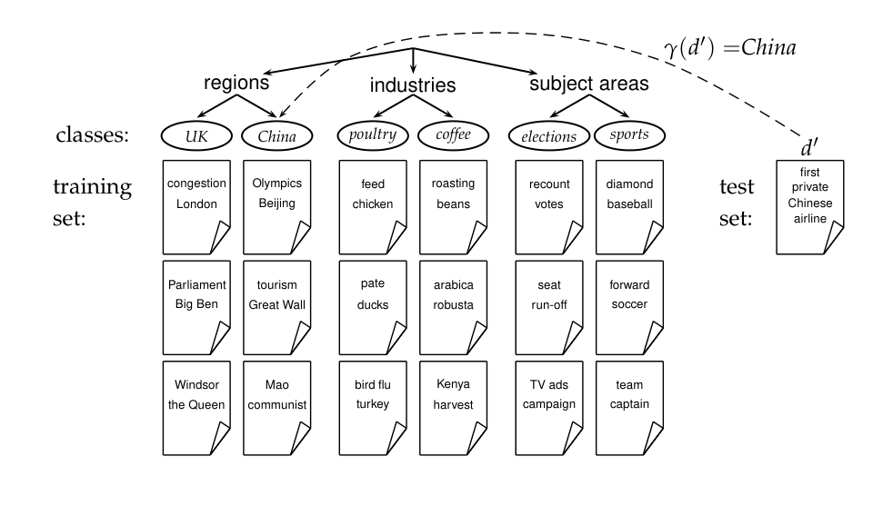
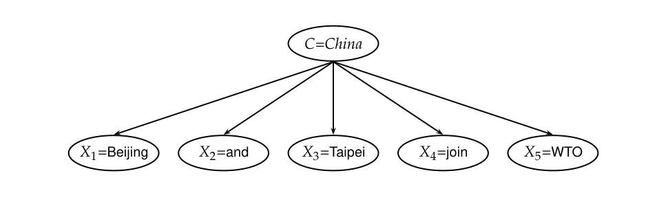
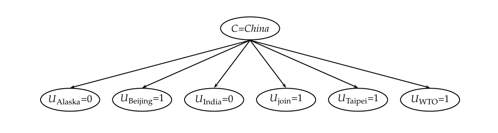
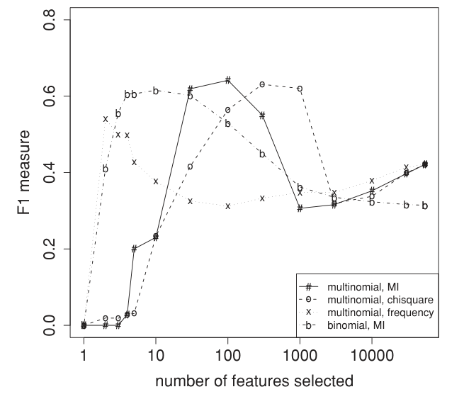

# 第 13 章 文本分类与朴素贝叶斯

[返回系列目录](../introduction-to-information-retrieval.md) · [上一篇：第 12 章 用于信息检索的语言模型](./12-language-models-for-information-retrieval.md) · [下一篇：第 14 章 向量空间分类](./14-vector-space-classification.md)

原书印刷页 253–288；PDF 第 290–325 页。

<!-- source: PDF 290; printed: 253 -->

迄今为止，本书主要讨论了 ad hoc 检索的过程，即用户具有短暂的信息需求，并试图通过向搜索引擎提出一个或多个查询来满足这些需求。然而，许多用户具有持续的信息需求。例如，你可能需要跟踪多核计算机芯片（multicore computer chips）的发展动态。一种方法是每天早晨在一个包含近期新闻报道的索引中提交查询 `multicore AND computer AND chip`。在本章及接下来的两章中，我们将探讨这样一个问题：如何将这种重复性任务自动化？为此，许多系统支持**常设查询**（standing query）。常设查询与其他查询类似，区别在于它会在一个随着时间推移不断有新文档增量加入的文档集上定期执行。

如果你的常设查询仅仅是 `multicore AND computer AND chip`，你往往会漏掉许多使用了其他词项（如 `multicore processors`，多核处理器）的相关新报道。为了获得良好的召回率（查全率），常设查询必须随着时间的推移进行改进，并可能逐渐变得相当复杂。在这个例子中，如果使用带有词干提取功能的布尔搜索引擎，你最终可能会得到类似 `(multicore OR multi-core) AND (chip OR processor OR microprocessor)` 这样的查询。

为了涵盖常设查询所属问题空间的普遍性和范围，我们现在引入**分类**（classification）问题的一般概念。给定一组类别，我们试图确定给定对象属于哪个（或哪些）类别。在上述例子中，常设查询的作用是将新的新闻报道分为两类：关于多核计算机芯片的文档和非关于多核计算机芯片的文档。我们称之为二元分类（two-class classification）。使用常设查询进行分类也称为**路由**（routing）或**过滤**（filtering），我们将在第 15.3.1 节（原书第 335 页）进一步讨论。

一个类别不必像常设查询“多核计算机芯片”那样聚焦于狭窄的领域。通常，类别是一个更宽泛的主题领域，如 `China`（中国）或 `coffee`（咖啡）。这种更宽泛的类别通常被称为主题（topics），此时的分类任务被称为**文本分类**（text classification）、文本归类（text categorization）、主题分类（topic classification）或主题识别（topic spotting）。图 13.1 展示了一个关于 `China` 的例子。常设查询和主题在具体程度上有所不同，但用于

<!-- source: PDF 291; printed: 254 -->

解决路由、过滤和文本分类的方法本质上是相同的。因此，在本章及后续章节中，我们将路由和过滤统归于文本分类的范畴之下。

分类的概念非常广泛，在信息检索（IR）内外都有许多应用。例如，在计算机视觉中，分类器可用于将图像分为风景（landscape）、人像（portrait）以及两者皆非（neither）等类别。这里我们重点关注信息检索中的例子，例如：

*   第 2 章中讨论的建立索引所需的一些预处理步骤：检测文档的编码（ASCII、Unicode UTF-8 等；原书第 20 页）；分词（两个字母之间的空格是否为词边界？原书第 24 页）；真实大小写还原（原书第 30 页）；以及识别文档的语言（原书第 46 页）。
*   自动检测垃圾页面（spam pages，随后这些页面将不被包含在搜索引擎索引中）。
*   自动检测露骨色情内容（仅当用户关闭如 SafeSearch 等选项时，这些内容才会包含在搜索结果中）。
*   **情感检测**（sentiment detection）或将电影或产品评论自动分类为正面或负面。一个应用示例是，用户在购买相机前搜索负面评论，以确保该相机没有不良特性或质量问题。
*   **个人电子邮件排序**（email sorting）。用户可能拥有诸如讲座通知（talk announcements）、电子账单（electronic bills）、亲友邮件（email from family and friends）等文件夹，并可能希望分类器对每封收到的电子邮件进行分类，自动将其移动到相应的文件夹中。在分类好的文件夹中查找邮件比在一个非常大的收件箱中要容易得多。此应用最常见的情况是用于存放所有疑似垃圾邮件的垃圾邮件文件夹。
*   特定主题或**垂直搜索引擎**（vertical search engine）。垂直搜索引擎将搜索限制在特定主题内。例如，在针对 `China`（中国）主题的垂直搜索引擎上查询 `computer science`（计算机科学），将返回一份中国计算机科学系的列表，其查准率和召回率（查全率）会高于在通用搜索引擎上查询 `computer science China`。这是因为垂直搜索引擎不会在其索引中包含那些在不同意义上包含词项 `china`（例如，指代坚硬的白色陶瓷）的网页，但会包含相关的网页，即使它们没有明确提及词项 `China`。
*   最后，ad hoc 信息检索中的排序函数也可以基于文档分类器，我们将在第 15.4 节（原书第 341 页）中对此进行解释。

<!-- source: PDF 292; printed: 255 -->

这个列表展示了分类在信息检索中的普遍重要性。当今大多数检索系统都包含多个使用某种形式分类器的组件。本书中我们将作为示例使用的分类任务是文本分类。

计算机对于分类来说并非必不可少。传统上，许多分类任务都是人工完成的。图书馆里的书籍由图书管理员分配美国国会图书馆分类号。但是人工分类在规模扩展方面成本高昂。多核计算机芯片的例子说明了另一种替代方法：使用常设查询进行分类——这可以被视为**规则**（rules）——通常由人工编写。正如我们的例子 `(multicore OR multi-core) AND (chip OR processor OR microprocessor)` 所示，规则有时等同于布尔表达式。

规则捕获了指示某个类别的特定关键词组合。手工编写的规则具有良好的扩展性，但随着时间的推移，创建和维护它们是劳动密集型的。技术熟练的人员（例如，擅长编写正则表达式的领域专家）可以创建出准确率媲美甚至超过我们稍后将讨论的自动生成分类器的规则集；然而，很难找到具备这种专业技能的人。

除了人工分类和手工制定规则之外，还有第三种文本分类方法，即基于机器学习的文本分类。这是我们在接下来几章中重点关注的方法。在机器学习中，规则集或更一般地说，文本分类器的决策标准，是从训练数据中自动学习得到的。如果学习方法是统计学的，这种方法也称为**统计文本分类**（statistical text classification）。

在统计文本分类中，我们需要为每个类别提供一定数量的优秀示例文档（或训练文档）。人工分类的需求并没有被消除，因为训练文档来自于对它们进行过**打标签**（labeling）的人——打标签指的是用类别对每个文档进行标注的过程。但打标签可以说是一项比编写规则更容易的任务。几乎任何人都可以查看一篇文档并决定它是否与 `China`（中国）有关。有时，这种打标签已经隐含在现有的工作流程中。例如，你可能每天早晨浏览常设查询返回的新闻报道，并通过将相关报道移动到诸如 `multicore-processors` 等特殊文件夹中来提供相关反馈（参见第 9 章）。

我们以对文本分类问题的一般性介绍（包括正式定义，第 13.1 节）开始本章；然后我们介绍朴素贝叶斯（Naive Bayes），这是一种特别简单且有效的分类方法（第 13.2–13.4 节）。我们研究的所有分类算法都在高维空间中表示文档。为了提高这些算法的效率，通常希望降低这些空间的维度；为此，在文本分类中通常会应用一种称为特征选择（feature selection）的技术，

<!-- source: PDF 293; printed: 256 -->

正如第 13.5 节所讨论的。第 13.6 节涵盖了文本分类的评估。在接下来的第 14 章和第 15 章中，我们将探讨另外两类分类方法：向量空间分类器和支持向量机。

## 13.1 文本分类问题

在文本分类中，我们给定一个文档的描述 $d \in \mathbb{X}$，其中 $\mathbb{X}$ 是**文档空间**（document space）；以及一个固定的**类别**（class）集合 $\mathbb{C} = \{c_1, c_2, \dots, c_J\}$。类别也称为分类（categories）或标签（labels）。通常，文档空间 $\mathbb{X}$ 是某种类型的高维空间，而类别是根据应用需求由人工定义的，如上文中的 `China` 和讨论多核计算机芯片的文档等例子。我们给定一个由带标签文档 $\langle d, c \rangle$ 组成的**训练集**（training set）$\mathbb{D}$，其中 $\langle d, c \rangle \in \mathbb{X} \times \mathbb{C}$。例如：

$$\langle d, c \rangle = \langle \text{Beijing joins the World Trade Organization (北京加入世界贸易组织)}, \text{China} \rangle$$

对于单句文档 Beijing joins the World Trade Organization 和类别（或标签）`China`。

使用一种**学习方法**（learning method）或学习算法，我们希望学习到一个**分类器**（classifier）或分类函数 $\gamma$，将文档映射到类别：

$$ \gamma : \mathbb{X} \rightarrow \mathbb{C} \tag{13.1} $$

这种类型的学习被称为**监督学习**（supervised learning），因为监督者（定义类别并为训练文档打标签的人）充当了指导学习过程的教师。我们用 $\Gamma$ 表示监督学习方法，并记作 $\Gamma(\mathbb{D}) = \gamma$。学习方法 $\Gamma$ 将训练集 $\mathbb{D}$ 作为输入，并返回学习到的分类函数 $\gamma$。

大多数学习方法 $\Gamma$ 的名称也用于分类器 $\gamma$。当我们说“朴素贝叶斯具有鲁棒性”时，我们谈论的是朴素贝叶斯（NB）学习方法 $\Gamma$，意思是它可以应用于许多不同的学习问题，并且不太可能产生灾难性失败的分类器。但是当我们说“朴素贝叶斯的错误率为 20%”时，我们描述的是一个实验，在该实验中，一个特定的 NB 分类器 $\gamma$（由 NB 学习方法产生）在某个应用中的错误率为 20%。

图 13.1 展示了一个来自 Reuters-RCV1 文档集（在第 4.2 节，原书第 69 页介绍）的文本分类示例。共有六个类别（`UK`, `China`, ..., `sports`），每个类别有三个训练文档。我们展示了代表每个文档内容的一些助记词。训练集为每个类别提供了一些典型示例，以便我们可以学习分类函数 $\gamma$。一旦我们学习到了 $\gamma$，我们就可以将其应用于**测试集**（test set，或测试数据），例如，类别未知的的新文档 first private Chinese airline（首家中国民营航空公司）。

<!-- source: PDF 294; printed: 257 -->



**图 13.1** 文本分类中的类别、训练集和测试集。
图中文字：classes: 类别；training set: 训练集；test set: 测试集；regions: 地区；industries: 行业；subject areas: 主题领域；UK: 英国；China: 中国；poultry: 家禽；coffee: 咖啡；elections: 选举；sports: 体育；first private Chinese airline: 首家中国民营航空公司；London: 伦敦；congestion: 拥堵；Big Ben: 大本钟；Parliament: 议会；the Queen: 女王；Windsor: 温莎；Beijing: 北京；Olympics: 奥运会；Great Wall: 长城；tourism: 旅游；communist: 共产主义者；Mao: 毛泽东；chicken: 鸡；feed: 饲料；ducks: 鸭子；pate: 肉酱；turkey: 火鸡；bird flu: 禽流感；beans: 豆子；roasting: 烘焙；robusta: 罗布斯塔；arabica: 阿拉比卡；harvest: 收获；Kenya: 肯尼亚；votes: 选票；recount: 重新计票；run-off: 决选；seat: 席位；campaign: 竞选活动；TV ads: 电视广告；baseball: 棒球；diamond: 菱形/棒球场；soccer: 足球；forward: 前锋；captain: 队长；team: 球队。

在图 13.1 中，分类函数将新文档分配给类别 $\gamma(d) = \text{China}$，这是正确的分配。

文本分类中的类别通常具有一些有趣的结构，例如图 13.1 中的层次结构。地区类别、行业类别和主题领域类别各有两例。层次结构可以成为解决分类问题的重要辅助手段；进一步的讨论请参见第 15.3.2 节。在此之前，我们在文本分类的章节中将假设类别构成一个集合，它们之间没有子集关系。

定义（13.1）规定一篇文档恰好属于一个类别。对于图 13.1 中的层次结构来说，这并不是最合适的模型。例如，一篇关于 2008 年奥运会的文档应该属于两个类别：*China*（中国）类和 *sports*（体育）类。这种类型的分类问题被称为多标签（any-of）问题，我们将在第 14.5 节（原书第 306 页）回到这个问题。目前，我们只考虑单标签（one-of）问题，即一篇文档恰好属于一个类别。

我们在文本分类中的目标是在测试数据或新数据上获得高准确率（accuracy）——例如，在多核芯片示例中我们明天早上将遇到的新闻专线文章。在训练集上获得高准确率很容易（例如，我们可以简单地记住标签）。但通常情况下，训练集上的高准确率并不意味着分类器在应用中的

<!-- source: PDF 295; printed: 258 -->

新数据上也能表现良好。当我们使用训练集来为测试数据学习一个分类器时，我们假设训练数据和测试数据是相似的，或者来自相同的分布。我们将这个概念的精确定义推迟到第 14.6 节（原书第 308 页）。

## 13.2 朴素贝叶斯文本分类

我们介绍的第一个监督学习方法是**多项式朴素贝叶斯**（multinomial Naive Bayes）或多项式 NB 模型，这是一种概率学习方法。文档 $d$ 属于类别 $c$ 的概率计算如下：

$$ P(c|d) \propto P(c) \prod_{1 \le k \le n_d} P(t_k|c) \tag{13.2} $$

其中 $P(t_k|c)$ 是词项 $t_k$ 出现在类别 $c$ 的文档中的条件概率。<sup>[1]</sup> 我们将 $P(t_k|c)$ 解释为 $t_k$ 为 $c$ 是正确类别提供了多少证据的度量。$P(c)$ 是文档出现在类别 $c$ 中的先验概率。如果一篇文档的词项没有为某个类别提供比其他类别更明确的证据，我们会选择先验概率更高的那个类别。$\langle t_1, t_2, \ldots, t_{n_d} \rangle$ 是 $d$ 中属于我们用于分类的词汇表（vocabulary）的词元（token），$n_d$ 是 $d$ 中此类词元的数量。例如，对于单句文档 *Beijing and Taipei join the WTO*（北京和台北加入世贸组织），如果我们把词项 *and* 和 *the* 作为停用词（stop word）处理，那么 $\langle t_1, t_2, \ldots, t_{n_d} \rangle$ 可能是 $\langle \text{Beijing}, \text{Taipei}, \text{join}, \text{WTO} \rangle$，此时 $n_d = 4$。

在文本分类中，我们的目标是为文档找到最佳类别。NB 分类中的最佳类别是最可能的或**最大后验**（maximum a posteriori, MAP）类别 $c_{map}$：

$$ c_{map} = \underset{c \in \mathbb{C}}{\arg\max} \hat{P}(c|d) = \underset{c \in \mathbb{C}}{\arg\max} \hat{P}(c) \prod_{1 \le k \le n_d} \hat{P}(t_k|c). \tag{13.3} $$

我们用 $\hat{P}$ 代替 $P$，因为我们不知道参数 $P(c)$ 和 $P(t_k|c)$ 的真实值，而是从训练集中估计它们，我们稍后就会看到。

在式（13.3）中，许多条件概率被相乘，每个位置 $1 \le k \le n_d$ 都有一个。这可能会导致浮点数下溢。因此，最好通过将概率的对数相加而不是将概率相乘来执行计算。具有最高对数概率评分（score）的类别仍然是最可能的类别；$\log(xy) = \log(x) + \log(y)$ 并且对数函数是单调的。因此，在大多数 NB 实现中实际执行的最大化是：

> **脚注 1（原书第 258 页）**：我们将在下一节解释为什么 $P(c|d)$ 是正比于（$\propto$），而不是等于右边的量。

<!-- source: PDF 296; printed: 259 -->

在大多数 NB 实现中实际执行的最大化是：

$$ c_{map} = \underset{c \in \mathbb{C}}{\arg\max} [\log \hat{P}(c) + \sum_{1 \le k \le n_d} \log \hat{P}(t_k|c)]. \tag{13.4} $$

式（13.4）有一个简单的解释。每个条件参数 $\log \hat{P}(t_k|c)$ 都是一个权重，指示 $t_k$ 作为 $c$ 的指示符有多好。类似地，先验 $\log \hat{P}(c)$ 是一个指示 $c$ 的相对频率的权重。较频繁的类别比较不频繁的类别更有可能是正确的类别。对数先验和词项权重之和就是文档属于该类别的证据量度量，式（13.4）选择了我们拥有最多证据的类别。

我们将首先使用多项式 NB 模型的这种直观解释，并将正式推导推迟到第 13.4 节。

我们如何估计参数 $\hat{P}(c)$ 和 $\hat{P}(t_k|c)$？我们首先尝试最大似然估计（maximum likelihood estimation, MLE；第 11.3.2 节，原书第 226 页），它仅仅是相对频率，并且对应于给定训练数据时每个参数的最可能值。对于先验，该估计为：

$$ \hat{P}(c) = \frac{N_c}{N}, \tag{13.5} $$

其中 $N_c$ 是类别 $c$ 中的文档数，$N$ 是文档总数。

我们将条件概率 $\hat{P}(t|c)$ 估计为词项 $t$ 在属于类别 $c$ 的文档中的相对频率：

$$ \hat{P}(t|c) = \frac{T_{ct}}{\sum_{t' \in V} T_{ct'}}, \tag{13.6} $$

其中 $T_{ct}$ 是 $t$ 在来自类别 $c$ 的训练文档中出现的次数，包括一个词项在一篇文档中的多次出现。我们在这里做出了位置独立性假设，我们将在下一节中更详细地讨论：$T_{ct}$ 是训练集文档中所有位置 $k$ 的出现次数的计数。因此，我们不为不同的位置计算不同的估计值，例如，如果一个词在一篇文档中出现了两次，分别在位置 $k_1$ 和 $k_2$，那么 $\hat{P}(t_{k_1}|c) = \hat{P}(t_{k_2}|c)$。

MLE 估计的问题在于，对于在训练数据中没有出现的词项-类别组合，它的值为零。如果在训练数据中词项 WTO 仅出现在 China 文档中，那么对于其他类别（例如 UK）的 MLE 估计将为零：

$$ \hat{P}(\text{WTO}|\text{UK}) = 0. $$

现在，单句文档 *Britain is a member of the WTO*（英国是世贸组织成员）对于 UK 的条件概率将为零，因为我们在式（13.2）中将所有词项的条件概率相乘。显然，该模型应该

<!-- source: PDF 297; printed: 260 -->

```text
TRAINMULTINOMIALNB(C, D)
 1 V ← EXTRACTVOCABULARY(D)
 2 N ← COUNTDOCS(D)
 3 for each c ∈ C
 4 do Nc ← COUNTDOCSINCLASS(D, c)
 5    prior[c] ← Nc/N
 6    textc ← CONCATENATETEXTOFALLDOCSINCLASS(D, c)
 7    for each t ∈ V
 8    do Tct ← COUNTTOKENSOFTERM(textc, t)
 9    for each t ∈ V
10    do condprob[t][c] ← (Tct + 1) / (∑t'(Tct' + 1))
11 return V, prior, condprob

APPLYMULTINOMIALNB(C, V, prior, condprob, d)
 1 W ← EXTRACTTOKENSFROMDOC(V, d)
 2 for each c ∈ C
 3 do score[c] ← log prior[c]
 4    for each t ∈ W
 5    do score[c] += log condprob[t][c]
 6 return arg maxc∈C score[c]
```

**图 13.2** 朴素贝叶斯算法（多项式模型）：训练和测试。

为 UK 类别分配一个高概率，因为出现了词项 *Britain*。问题在于，无论来自其他特征的关于 UK 类别的证据有多强，WTO 的零概率都无法被“条件化消除”。由于**稀疏性**（sparseness），该估计值为 0：训练数据永远不足以充分表示罕见事件的频率，例如 WTO 在 UK 文档中出现的频率。

为了消除零值，我们使用**加一平滑**（add-one smoothing）或拉普拉斯平滑（Laplace smoothing），它简单地将每个计数加一（参见第 11.3.2 节）：

$$ \hat{P}(t|c) = \frac{T_{ct} + 1}{\sum_{t' \in V} (T_{ct'} + 1)} = \frac{T_{ct} + 1}{(\sum_{t' \in V} T_{ct'}) + B}, \tag{13.7} $$

其中 $B = |V|$ 是词汇表中的词项数。加一平滑可以解释为一种均匀先验（每个词项在每个类别中出现一次），然后随着来自训练数据的证据的加入而更新。请注意，这是词项出现的先验概率，而不是我们在式（13.5）中在文档级别估计的类别的先验概率。

<!-- source: PDF 298; printed: 261 -->

▶ **表 13.1** 参数估计示例数据。

| | docID | words in document (文档中的词) | in $c = \text{China}$? |
|---|---|---|---|
| training set (训练集) | 1 | Chinese Beijing Chinese | yes |
| | 2 | Chinese Chinese Shanghai | yes |
| | 3 | Chinese Macao | yes |
| | 4 | Tokyo Japan Chinese | no |
| test set (测试集) | 5 | Chinese Chinese Chinese Tokyo Japan | ? |

▶ **表 13.2** 朴素贝叶斯（NB）的训练和测试时间。

| mode (模式) | time complexity (时间复杂度) |
|---|---|
| training (训练) | $\Theta(\vert \mathbb{D}\vert L_{\text{ave}} + \vert C\vert \vert V\vert )$ |
| testing (测试) | $\Theta(L_a + \vert C\vert M_a) = \Theta(\vert C\vert M_a)$ |

我们现在已经介绍了训练和应用朴素贝叶斯（NB）分类器所需的所有元素。完整的算法在图 13.2 中描述。

**示例 13.1：** 对于表 13.1 中的示例，我们需要用于对测试文档进行分类的多项式参数是先验概率 $\hat{P}(c) = 3/4$ 和 $\hat{P}(\bar{c}) = 1/4$，以及以下条件概率：
$$
\begin{aligned}
\hat{P}(\text{Chinese}|c) &= (5 + 1)/(8 + 6) = 6/14 = 3/7 \\
\hat{P}(\text{Tokyo}|c) = \hat{P}(\text{Japan}|c) &= (0 + 1)/(8 + 6) = 1/14 \\
\hat{P}(\text{Chinese}|\bar{c}) &= (1 + 1)/(3 + 6) = 2/9 \\
\hat{P}(\text{Tokyo}|\bar{c}) = \hat{P}(\text{Japan}|\bar{c}) &= (1 + 1)/(3 + 6) = 2/9
\end{aligned}
$$
分母分别是 $(8 + 6)$ 和 $(3 + 6)$，因为 $\text{text}_c$ 和 $\text{text}_{\bar{c}}$ 的长度分别为 8 和 3，并且因为式（13.7）中的常数 $B$ 为 6（因为词汇表包含六个词项）。

然后我们得到：
$$
\begin{aligned}
\hat{P}(c|d_5) &\propto 3/4 \cdot (3/7)^3 \cdot 1/14 \cdot 1/14 \approx 0.0003 \\
\hat{P}(\bar{c}|d_5) &\propto 1/4 \cdot (2/9)^3 \cdot 2/9 \cdot 2/9 \approx 0.0001
\end{aligned}
$$
因此，分类器将测试文档分配给 $c = \text{China}$。做出此分类决定的原因是，$d_5$ 中正向指示词 Chinese 的三次出现超过了两个负向指示词 Japan 和 Tokyo 的出现。

朴素贝叶斯的时间复杂度是多少？计算参数的复杂度为 $\Theta(|C||V|)$，因为参数集由 $|C||V|$ 个条件概率和 $|C|$ 个先验概率组成。计算参数所需的预处理（提取词汇表、计算词项等）可以通过对训练数据进行一次遍历来完成。这部分的

<!-- source: PDF 299; printed: 262 -->

时间复杂度因此为 $\Theta(|\mathbb{D}|L_{\text{ave}})$，其中 $|\mathbb{D}|$ 是文档数量，$L_{\text{ave}}$ 是文档的平均长度。

我们在这里使用 $\Theta(|\mathbb{D}|L_{\text{ave}})$ 作为 $\Theta(T)$ 的记法，其中 $T$ 是训练文档集的长度。这是非标准的；$\Theta(\cdot)$ 没有为平均值定义。我们更倾向于用 $\mathbb{D}$ 和 $L_{\text{ave}}$ 来表示时间复杂度，因为它们是用于表征训练文档集的主要统计量。

图 13.2 中 APPLYMULTINOMIALNB 的时间复杂度为 $\Theta(|C|L_a)$。$L_a$ 和 $M_a$ 分别是测试文档中的词元（token）数和词型（type）数。APPLYMULTINOMIALNB 可以修改为 $\Theta(L_a + |C|M_a)$（练习 13.8）。最后，假设测试文档的长度是有界的，$\Theta(L_a + |C|M_a) = \Theta(|C|M_a)$，因为对于一个固定常数 $b$，有 $L_a < b|C|M_a$。<sup>[2]</sup>

表 13.2 总结了时间复杂度。通常，我们有 $|C||V| < |\mathbb{D}|L_{\text{ave}}$，因此训练和测试的复杂度在扫描数据所需的时间上都是线性的。因为我们必须至少查看一次数据，所以可以说朴素贝叶斯具有最优的时间复杂度。其高效性是朴素贝叶斯成为流行文本分类方法的原因之一。

### 13.2.1 与多项式一元语言模型的关系

多项式朴素贝叶斯模型在形式上与多项式一元语言模型（第 12.2.1 节，第 242 页）相同。特别是，式（13.2）是第 243 页式（12.12）的特例，我们在这里重复给出 $\lambda = 1$ 时的公式：

$$
P(d|q) \propto P(d) \prod_{t \in q} P(t|M_d). \tag{13.8}
$$

文本分类中的文档 $d$（式（13.2））扮演了语言模型中查询的角色（式（13.8）），而文本分类中的类 $c$ 扮演了语言模型中文档 $d$ 的角色。我们使用式（13.8）根据文档与查询 $q$ 相关的概率对文档进行排序。在朴素贝叶斯分类中，我们通常只对排名最高的类感兴趣。

我们在第 12.2.2 节（第 243 页）中也使用了最大似然估计（MLE），并遇到了由于数据稀疏导致的零估计问题（第 244 页）；但我们在那里没有使用加一平滑，而是使用了两个分布的混合来解决该问题。加一平滑与第 11.3.4 节（第 228 页）中的加 $\frac{1}{2}$ 平滑密切相关。

**练习 13.1**
为什么在表 13.2 中，对于大多数文本集合，预期 $|C||V| < |\mathbb{D}|L_{\text{ave}}$ 成立？

> **脚注 2（原书第 262 页）**：我们这里的假设是测试文档的长度是有界的。对于极长的测试文档，$L_a$ 将超过 $b|C|M_a$。

<!-- source: PDF 300; printed: 263 -->

```text
TRAINBERNOULLINB(C, D)
1  V ← EXTRACTVOCABULARY(D)
2  N ← COUNTDOCS(D)
3  for each c ∈ C
4  do Nc ← COUNTDOCSINCLASS(D, c)
5     prior[c] ← Nc/N
6     for each t ∈ V
7     do Nct ← COUNTDOCSINCLASSCONTAININGTERM(D, c, t)
8        condprob[t][c] ← (Nct + 1)/(Nc + 2)
9  return V, prior, condprob

APPLYBERNOULLINB(C, V, prior, condprob, d)
1  Vd ← EXTRACTTERMSFROMDOC(V, d)
2  for each c ∈ C
3  do score[c] ← log prior[c]
4     for each t ∈ V
5     do if t ∈ Vd
6        then score[c] += log condprob[t][c]
7        else score[c] += log(1 − condprob[t][c])
8  return arg max_{c∈C} score[c]
```

▶ **图 13.3** 朴素贝叶斯算法（伯努利模型）：训练和测试。第 8 行（上）中的加一平滑类似于式（13.7），其中 $B = 2$。

## 13.3 伯努利模型

我们可以用两种不同的方式来建立朴素贝叶斯分类器。我们在上一节中介绍的模型是多项式模型。它在文档的每个位置从词汇表中生成一个词项，这里我们假设了一个生成模型，该模型将在第 13.4 节中更详细地讨论（另见第 237 页）。

多项式模型的一个替代方案是多变量伯努利模型（multivariate Bernoulli model）或**伯努利模型**（Bernoulli model）。它等价于第 11.3 节（第 222 页）的二值独立模型，该模型为词汇表中的每个词项生成一个指示符，1 表示该词项在文档中出现，0 表示未出现。图 13.3 展示了伯努利模型的训练和测试算法。伯努利模型具有与多项式模型相同的时间复杂度。

不同的生成模型意味着不同的估计策略和不同的分类规则。伯努利模型将 $\hat{P}(t|c)$ 估计为包含词项 $t$ 的类 $c$ 的文档所占的比例（图 13.3，TRAINBERNOULLI-

<!-- source: PDF 301; printed: 264 -->

NB，第 8 行）。相比之下，多项式模型将 $\hat{P}(t|c)$ 估计为包含词项 $t$ 的类 $c$ 文档中的*词元比例*或*位置比例*（式（13.7））。在对测试文档进行分类时，伯努利模型使用二元出现信息，忽略出现的次数，而多项式模型则跟踪多次出现。因此，伯努利模型在对长文档进行分类时通常会犯很多错误。例如，它可能会因为词项 *China* 的一次出现而将整本书分配给 *China* 类。

这些模型在分类中如何使用未出现的词项方面也有所不同。它们在多项式模型中不影响分类决定；但在伯努利模型中，计算 $P(c|d)$ 时会考虑未出现的概率（图 13.3，APPLYBERNOULLINB，第 7 行）。这是因为只有伯努利朴素贝叶斯模型显式地对词项的缺失进行建模。

**示例 13.2：** 将伯努利模型应用于表 13.1 中的示例，我们得到与之前相同的先验概率估计：$\hat{P}(c) = 3/4$，$\hat{P}(\bar{c}) = 1/4$。条件概率为：
$$
\begin{aligned}
\hat{P}(\text{Chinese}|c) &= (3 + 1)/(3 + 2) = 4/5 \\
\hat{P}(\text{Japan}|c) = \hat{P}(\text{Tokyo}|c) &= (0 + 1)/(3 + 2) = 1/5 \\
\hat{P}(\text{Beijing}|c) = \hat{P}(\text{Macao}|c) = \hat{P}(\text{Shanghai}|c) &= (1 + 1)/(3 + 2) = 2/5 \\
\hat{P}(\text{Chinese}|\bar{c}) &= (1 + 1)/(1 + 2) = 2/3 \\
\hat{P}(\text{Japan}|\bar{c}) = \hat{P}(\text{Tokyo}|\bar{c}) &= (1 + 1)/(1 + 2) = 2/3 \\
\hat{P}(\text{Beijing}|\bar{c}) = \hat{P}(\text{Macao}|\bar{c}) = \hat{P}(\text{Shanghai}|\bar{c}) &= (0 + 1)/(1 + 2) = 1/3
\end{aligned}
$$
分母分别是 $(3 + 2)$ 和 $(1 + 2)$，因为在 $c$ 中有三个文档，在 $\bar{c}$ 中有一个文档，并且因为式（13.7）中的常数 $B$ 为 2 —— 对于每个词项，需要考虑出现和不出现两种情况。

测试文档对于两个类的评分为：
$$
\begin{aligned}
\hat{P}(c|d_5) &\propto \hat{P}(c) \cdot \hat{P}(\text{Chinese}|c) \cdot \hat{P}(\text{Japan}|c) \cdot \hat{P}(\text{Tokyo}|c) \\
&\quad \cdot (1 - \hat{P}(\text{Beijing}|c)) \cdot (1 - \hat{P}(\text{Shanghai}|c)) \cdot (1 - \hat{P}(\text{Macao}|c)) \\
&= 3/4 \cdot 4/5 \cdot 1/5 \cdot 1/5 \cdot (1 - 2/5) \cdot (1 - 2/5) \cdot (1 - 2/5) \\
&\approx 0.005
\end{aligned}
$$
类似地，
$$
\begin{aligned}
\hat{P}(\bar{c}|d_5) &\propto 1/4 \cdot 2/3 \cdot 2/3 \cdot 2/3 \cdot (1 - 1/3) \cdot (1 - 1/3) \cdot (1 - 1/3) \\
&\approx 0.022
\end{aligned}
$$
因此，分类器将测试文档分配给 $\bar{c} = \text{not-China}$。当仅考虑二元出现情况而不考虑词项频率时，Japan 和 Tokyo 是 $\bar{c}$ 的指示词（$2/3 > 1/5$），并且 Chinese 在 $c$ 和 $\bar{c}$ 的条件概率差异不足以（$4/5$ 对 $2/3$）影响分类决定。

<!-- source: PDF 302; printed: 265 -->

## 13.4 朴素贝叶斯的性质

为了更好地理解这两种模型及其所作的假设，让我们回顾并检查在第 11 章和第 12 章中是如何推导它们的分类规则的。我们通过将文档分配给具有最大后验概率的类别来决定其所属类别（参见第 226 页第 11.3.2 节），计算如下：

$$
\begin{align}
c_{map} &= \underset{c \in \mathbb{C}}{\arg\max} P(c|d) \nonumber \\
&= \underset{c \in \mathbb{C}}{\arg\max} \frac{P(d|c)P(c)}{P(d)} \tag{13.9} \\
&= \underset{c \in \mathbb{C}}{\arg\max} P(d|c)P(c), \tag{13.10}
\end{align}
$$

其中在式（13.9）中应用了贝叶斯法则（第 220 页式（11.4）），并且在最后一步中我们去掉了分母，因为 $P(d)$ 对所有类别都是相同的，不会影响 argmax 的结果。

我们可以将式（13.10）解释为我们在贝叶斯文本分类中所假设的生成过程的描述。为了生成一篇文档，我们首先以概率 $P(c)$ 选择类别 $c$（图 13.4 和 13.5 中的顶部节点）。这两种模型在第二步（即给定类别生成文档）的形式化上有所不同，对应于条件分布 $P(d|c)$：

$$
\begin{align}
\textbf{多项式模型} \quad P(d|c) &= P(\langle t_1, \ldots, t_k, \ldots, t_{n_d} \rangle | c) \tag{13.11} \\
\textbf{伯努利模型} \quad P(d|c) &= P(\langle e_1, \ldots, e_i, \ldots, e_M \rangle | c), \tag{13.12}
\end{align}
$$

其中 $\langle t_1, \ldots, t_{n_d} \rangle$ 是在 $d$ 中出现的词项序列（去除了被排除在词汇表之外的词项），而 $\langle e_1, \ldots, e_i, \ldots, e_M \rangle$ 是一个维度为 $M$ 的二值向量，指示每个词项是否在 $d$ 中出现。

现在应该更清楚为什么我们在定义分类问题时在式（13.1）中引入了文档空间 $\mathbb{X}$。解决文本分类问题的一个关键步骤是选择文档表示。$\langle t_1, \ldots, t_{n_d} \rangle$ 和 $\langle e_1, \ldots, e_M \rangle$ 是两种不同的文档表示。在第一种情况下，$\mathbb{X}$ 是所有词项序列（或者更准确地说，词项词元序列）的集合。在第二种情况下，$\mathbb{X}$ 是 $\{0, 1\}^M$。

我们不能直接使用式（13.11）和（13.12）进行文本分类。对于伯努利模型，我们将不得不估计 $2^M|\mathbb{C}|$ 个不同的参数，每个参数对应 $M$ 个 $e_i$ 值与一个类别的每一种可能组合。多项式情况下的参数数量具有相同的数量

<!-- source: PDF 303; printed: 266 -->


**图 13.4** 多项式朴素贝叶斯模型。
图中文字：C=China 表示类别为“中国”；X1–X5 的取值依次为 Beijing（北京）、and（和）、Taipei（台北）、join（加入）、WTO（世界贸易组织）。英文词元保留用于展示位置变量。

级。<sup>[3]</sup> 这是一个非常大的数量，可靠地估计这些参数是不可行的。

为了减少参数的数量，我们引入朴素贝叶斯**条件独立性假设**（conditional independence assumption）。我们假设在给定类别的情况下，属性值彼此独立：

$$
\begin{align}
\textbf{多项式模型} \quad P(d|c) &= P(\langle t_1, \ldots, t_{n_d} \rangle | c) = \prod_{1 \le k \le n_d} P(X_k = t_k | c) \tag{13.13} \\
\textbf{伯努利模型} \quad P(d|c) &= P(\langle e_1, \ldots, e_M \rangle | c) = \prod_{1 \le i \le M} P(U_i = e_i | c). \tag{13.14}
\end{align}
$$

我们在这里引入了两个随机变量，以使这两种不同的生成模型更加明确。$X_k$ 是文档中位置 $k$ 的**随机变量**（random variable），其取值为词汇表中的词项。$P(X_k = t|c)$ 是在类别为 $c$ 的文档中，词项 $t$ 出现在位置 $k$ 的概率。$U_i$ 是词汇表中第 $i$ 个词项的**随机变量**，其取值为 0（不出现）和 1（出现）。$\hat{P}(U_i = 1|c)$ 是在类别为 $c$ 的文档中，词项 $t_i$ 出现的概率——出现在任何位置且可能出现多次。

我们在图 13.4 和 13.5 中说明了条件独立性假设。类别 China 以一定的概率为五个词项属性（多项式模型）或六个二值属性（伯努利模型）中的每一个生成值，该概率独立于其他属性的值。类别为 China 的文档包含词项 Taipei 这一事实，并不会使其包含 Beijing 的可能性变大或变小。

在现实中，条件独立性假设对于文本数据并不成立。词项之间是条件相关的。但正如我们稍后将讨论的那样，尽管存在条件独立性假设，朴素贝叶斯模型（NB models）的表现依然很好。

> **脚注 3（原书第 266 页）**：事实上，如果文档的长度没有限制，那么多项式情况下的参数数量是无限的。

<!-- source: PDF 304; printed: 267 -->


**图 13.5** 伯努利朴素贝叶斯模型。
图中文字：C=China 表示类别为“中国”；UAlaska=0、UBeijing=1、UIndia=0、Ujoin=1、UTaipei=1、UWTO=1 分别表示 Alaska（阿拉斯加）、Beijing（北京）、India（印度）、join（加入）、Taipei（台北）、WTO（世界贸易组织）这些词项是否出现，1 为出现，0 为未出现。

即使假设了条件独立性，如果我们假设文档中每个位置 $k$ 都有不同的概率分布，那么多项式模型的参数仍然太多。词项在文档中的位置本身并不携带关于类别的信息。尽管 China sues France（中国起诉法国）和 France sues China（法国起诉中国）之间存在差异，但在朴素贝叶斯分类中，China 出现在文档的第 1 个位置还是第 3 个位置并没有用处，因为我们是单独考察每个词项的。条件独立性假设使我们只能以这种方式处理证据。

此外，如果我们假设每个位置 $k$ 都有不同的词项分布，我们将不得不为每个 $k$ 估计一组不同的参数。bean（豆）作为 coffee（咖啡）文档的第一个词项出现的概率可能不同于它作为第二个词项出现的概率，依此类推。由于数据稀疏性，这再次在估计中引起问题。

由于这些原因，我们为多项式模型引入了第二个独立性假设，即**位置独立性**（positional independence）：词项的条件概率是相同的，与它在文档中的位置无关。

$$
P(X_{k_1} = t|c) = P(X_{k_2} = t|c)
$$

对于所有位置 $k_1, k_2$、词项 $t$ 和类别 $c$ 均成立。因此，我们只有一个对所有位置 $k_i$ 都有效的单一词项分布，我们可以使用 $X$ 作为其符号。<sup>[4]</sup> 位置独立性等价于采用词袋模型（bag of words model），我们在第 6 章（第 117 页）的特设检索（ad hoc retrieval）背景下介绍过该模型。

有了条件独立性和位置独立性假设，我们只需要估计 $\Theta(M|\mathbb{C}|)$ 个参数 $P(t_k|c)$（多项式模型）或 $P(e_i|c)$（伯努利

> **脚注 4（原书第 267 页）**：我们的术语是非标准的。随机变量 $X$ 是一个分类变量，而不是多项式变量，相应的朴素贝叶斯模型也许应该被称为序列模型。我们选择在第 13.4.1 节中将这个序列模型和多项式模型作为同一个模型来介绍，因为它们在计算上是相同的。

<!-- source: PDF 305; printed: 268 -->

**表 13.3** 多项式模型与伯努利模型的对比。

| | 多项式模型 (multinomial model) | 伯努利模型 (Bernoulli model) |
|---|---|---|
| 事件模型 (event model) | 词元的生成 (generation of token) | 文档的生成 (generation of document) |
| 随机变量 (random variable(s)) | $X = t$ 当且仅当 $t$ 出现在给定位置 | $U_t = 1$ 当且仅当 $t$ 出现在文档中 |
| 文档表示 (document representation) | $d = \langle t_1, \ldots, t_k, \ldots, t_{n_d} \rangle, t_k \in V$ | $d = \langle e_1, \ldots, e_i, \ldots, e_M \rangle, e_i \in \{0, 1\}$ |
| 参数估计 (parameter estimation) | $\hat{P}(X = t\vert c)$ | $\hat{P}(U_i = e\vert c)$ |
| 决策规则：最大化 (decision rule: maximize) | $\hat{P}(c) \prod_{1 \le k \le n_d} \hat{P}(X = t_k\vert c)$ | $\hat{P}(c) \prod_{t_i \in V} \hat{P}(U_i = e_i\vert c)$ |
| 多次出现 (multiple occurrences) | 考虑在内 (taken into account) | 忽略 (ignored) |
| 文档长度 (length of docs) | 能处理较长的文档 (can handle longer docs) | 最适合短文档 (works best for short docs) |
| 特征数量 (# features) | 能处理更多特征 (can handle more) | 最适合较少特征 (works best with fewer) |
| 词项 the 的估计 (estimate for term the) | $\hat{P}(X = \text{the}\vert c) \approx 0.05$ | $\hat{P}(U_{\text{the}} = 1\vert c) \approx 1.0$ |

模型），每个词项-类别组合对应一个参数，而不是一个在 $M$（词汇表大小）上至少呈指数级的数量。独立性假设将需要估计的参数数量减少了几个数量级。

总而言之，我们在多项式模型（图 13.4）中生成一篇文档，首先以概率 $P(c)$ 选取一个类别 $C = c$，其中 $C$ 是一个取值于 $\mathbb{C}$ 的**随机变量**（random variable）。接下来，对于文档的 $n_d$ 个位置中的每一个，我们以概率 $P(X_k = t_k|c)$ 在位置 $k$ 生成词项 $t_k$。对于给定的 $c$，所有的 $X_k$ 在词项上具有相同的分布。在图 13.4 的例子中，我们展示了 $\langle t_1, t_2, t_3, t_4, t_5 \rangle = \langle \text{Beijing, and, Taipei, join, WTO} \rangle$ 的生成过程，对应于单句文档 Beijing and Taipei join WTO（北京和台北加入世贸组织）。

对于一个完全指定的文档生成模型，我们还必须定义一个关于长度的分布 $P(n_d|c)$。如果没有它，多项式模型就是一个词元生成模型，而不是一个文档生成模型。

我们在伯努利模型（图 13.5）中生成一篇文档，首先以概率 $P(c)$ 选取一个类别 $C = c$，然后为词汇表中的每个词项 $t_i$（$1 \le i \le M$）生成一个二值指示符 $e_i$。在图 13.5 的例子中，我们展示了 $\langle e_1, e_2, e_3, e_4, e_5, e_6 \rangle = \langle 0, 1, 0, 1, 1, 1 \rangle$ 的生成过程，同样对应于单句文档 Beijing and Taipei join WTO（北京和台北加入世贸组织），这里我们假设 and 是一个停用词（stop word）。

我们在表 13.3 中比较了这两种模型，包括估计方程和决策规则。

朴素贝叶斯之所以被称为“朴素”，是因为我们刚刚做出的独立性假设对于自然语言模型来说确实非常朴素。条件独立性假设指出，在给定类别的情况下，特征彼此独立。对于文档中的词项来说，这几乎从来都不是真的。在许多情况下，事实恰恰相反。hong 和 kong 或者 london 和 en-

<!-- source: PDF 306; printed: 269 -->

**表 13.4** 正确的估计意味着准确的预测，但准确的预测并不意味着正确的估计。

| | $c_1$ | $c_2$ | 选择的类别 |
|---|---|---|---|
| 真实概率 $P(c\vert d)$ | 0.6 | 0.4 | $c_1$ |
| $\hat{P}(c) \prod_{1\le k\le n_d} \hat{P}(t_k\vert c)$ （式（13.13）） | 0.00099 | 0.00001 | |
| 朴素贝叶斯估计 $\hat{P}(c\vert d)$ | 0.99 | 0.01 | $c_1$ |

*glish*（图 13.7）是高度相关词项的例子。此外，多项式模型还做出了位置独立性假设。伯努利模型完全忽略了文档中的位置信息，因为它只关心词项的出现与否。这种词袋模型丢弃了自然语言句子中由词序传达的所有信息。当朴素贝叶斯的自然语言模型如此过度简化时，它怎么能成为一个好的文本分类器呢？

答案是，尽管朴素贝叶斯的概率估计质量很低，但其分类决策却出奇地好。考虑一个文档 $d$，其真实概率为 $P(c_1|d) = 0.6$ 和 $P(c_2|d) = 0.4$，如表 13.4 所示。假设 $d$ 包含许多 $c_1$ 的正向指示词项，以及许多 $c_2$ 的负向指示词项。因此，当使用式（13.13）中的多项式模型时，$\hat{P}(c_1) \prod_{1\le k\le n_d} \hat{P}(t_k|c_1)$ 将比 $\hat{P}(c_2) \prod_{1\le k\le n_d} \hat{P}(t_k|c_2)$ 大得多（表中为 0.00099 对 0.00001）。在除以 0.001 以获得格式良好的 $P(c|d)$ 概率后，我们最终得到一个接近 1.0 的估计值和一个接近 0.0 的估计值。这很常见：在朴素贝叶斯分类中，获胜类别的概率通常比其他类别大得多，并且估计值与真实概率的偏差非常显著。但是分类决策是基于哪个类别获得最高评分（score）做出的。估计值的准确程度并不重要。尽管估计很差，朴素贝叶斯对 $c_1$ 估计了更高的概率，因此在表 13.4 中将 $d$ 分配给了正确的类别。正确的估计意味着准确的预测，但准确的预测并不意味着正确的估计。朴素贝叶斯分类器估计得很差，但通常分类得很好。

即使它不是文本准确率最高的方法，朴素贝叶斯也有许多优点，使其成为文本分类的有力竞争者。如果有许多同等重要的特征共同促成分类决策，它的表现会非常出色。它对噪声特征（在下一节中定义）和**概念漂移**（concept drift，即某个类别背后的概念随时间逐渐发生变化，例如 *US president* 从比尔·克林顿变为乔治·W·布什，见第 13.7 节）也具有一定的鲁棒性。像 kNN（第 14.3 节，第 297 页）这样的分类器可以针对特定时间段的特殊属性进行仔细调优。但这会在下一时间段的文档具有略微

<!-- source: PDF 307; printed: 270 -->

**表 13.5** 一组朴素贝叶斯独立性假设存在问题的文档。

| | |
|---|---|
| (1) | He moved from London, Ontario, to London, England. <br> （他从安大略省伦敦搬到了英国伦敦。） |
| (2) | He moved from London, England, to London, Ontario. <br> （他从英国伦敦搬到了安大略省伦敦。） |
| (3) | He moved from England to London, Ontario. <br> （他从英国搬到了安大略省伦敦。） |

不同的属性时损害它们的性能。

伯努利模型对概念漂移特别具有鲁棒性。我们将在图 13.8 中看到，当使用不到十几个词项时，它也能有不错的性能。一个类别最重要的指示词项不太可能发生变化。因此，仅依赖这些特征的模型更有可能在概念漂移中保持一定的准确率。

朴素贝叶斯的主要优势在于其效率：只需对数据进行一次遍历即可完成训练和分类。因为它结合了高效率和良好的准确率，所以经常被用作文本分类研究中的基准。在以下情况下，它通常是首选方法：（i）在文本分类应用中，为了挤出几个百分点的额外准确率而不值得大费周章；（ii）有大量的训练数据可用，并且在大量数据上训练比在较小的训练集上使用更好的分类器能获得更多收益；或者（iii）可以利用其对概念漂移的鲁棒性。

在本书中，我们将朴素贝叶斯作为文本分类器进行讨论。独立性假设对文本并不成立。然而，可以证明，对于独立性假设确实成立的数据，朴素贝叶斯是一个**最优分类器**（optimal classifier，在对新数据的错误率最小的意义上）。

### 13.4.1 多项式模型的一种变体

多项式模型的另一种形式化方法将每个文档 $d$ 表示为一个 $M$ 维的计数向量 $\langle \text{tf}_{t_1,d}, \ldots, \text{tf}_{t_M,d} \rangle$，其中 $\text{tf}_{t_i,d}$ 是 $t_i$ 在 $d$ 中的词项频率。然后按如下方式计算 $P(d|c)$（参见第 243 页的式（12.8））；

$$ P(d|c) = P(\langle \text{tf}_{t_1,d}, \ldots, \text{tf}_{t_M,d} \rangle|c) \propto \prod_{1\le i\le M} P(X = t_i|c)^{\text{tf}_{t_i,d}} \tag{13.15} $$

请注意，我们省略了多项式因子。参见式（12.8）（第 243 页）。

式（13.15）等价于式（13.2）中的序列模型，因为对于未在 $d$ 中出现的词项（$\text{tf}_{t_i,d} = 0$），$P(X = t_i|c)^{\text{tf}_{t_i,d}} = 1$，而出现 $\text{tf}_{t_i,d} \ge 1$ 次的词项将在式（13.2）和式（13.15）中均贡献 $\text{tf}_{t_i,d}$ 个因子。

<!-- source: PDF 308; printed: 271 -->

```text
SELECTFEATURES(D, c, k)
1 V <- EXTRACTVOCABULARY(D)
2 L <- []
3 for each t in V
4 do A(t, c) <- COMPUTEFEATUREUTILITY(D, t, c)
5    APPEND(L, <A(t, c), t>)
6 return FEATURESWITHLARGESTVALUES(L, k)
```

**图 13.6** 用于选择 $k$ 个最佳特征的基本特征选择算法。

**练习 13.2** [*]
表 13.5 中的哪些文档在（i）伯努利模型（ii）多项式模型下具有相同和不同的词袋表示？如果存在差异，请描述它们。

**练习 13.3**
位置独立性假设的理由是，词项出现在文档的第 $k$ 个位置这一事实中没有有用的信息。请找出例外情况。考虑具有固定文档结构的程式化文档。

**练习 13.4**
表 13.3 给出了单词 *the* 的伯努利和多项式估计。请解释它们之间的差异。

## 13.5 特征选择

**特征选择**（feature selection）是选择训练集中出现的词项的一个子集，并在文本分类中仅使用该子集作为特征的过程。特征选择主要有两个目的。首先，它通过减小有效词汇表的大小，使得训练和应用分类器更加高效。这对于那些不像朴素贝叶斯那样训练成本低廉的分类器尤为重要。其次，特征选择通常通过消除噪声特征来提高分类准确率。**噪声特征**（noise feature）是指当添加到文档表示中时，会增加新数据上分类错误的特征。假设一个罕见词项，例如 *arachnocentric*，不包含关于某个类别（例如 *China*）的任何信息，但 *arachnocentric* 的所有实例碰巧都出现在我们训练集的 *China* 文档中。那么学习方法可能会产生一个分类器，将包含 *arachnocentric* 的测试文档错误地分配给 *China*。这种从训练集的偶然属性中得出的错误泛化被称为**过拟合**（overfitting）。

我们可以将特征选择视为一种用较简单的分类器（使用特征子集）替换复杂分类器（使用所有特征）的方法。

<!-- source: PDF 309; printed: 272 -->

乍一看，一个看似较弱的分类器在统计文本分类中具有优势可能显得有悖常理，但在第 14.6 节（第 308 页）讨论偏差-方差权衡（bias-variance tradeoff）时，我们将看到，当可用的训练数据有限时，较弱的模型通常更可取。

基本的特征选择算法如图 13.6 所示。对于给定的类别 $c$，我们计算词汇表中每个词项的效用度量 $A(t, c)$，并选择具有最高 $A(t, c)$ 值的 $k$ 个词项。所有其他词项都被丢弃，不用于分类。在本节中，我们将介绍三种不同的效用度量：互信息 $A(t, c) = I(U_t; C_c)$；$\chi^2$ 检验 $A(t, c) = X^2(t, c)$；以及频率 $A(t, c) = N(t, c)$。

在两种朴素贝叶斯模型中，伯努利模型对噪声特征特别敏感。伯努利朴素贝叶斯分类器需要某种形式的特征选择，否则其准确率将会很低。

本节主要讨论针对两类分类任务（如 *China* 与 *not-China*）的特征选择。第 13.5.5 节简要讨论了针对多于两个类别的系统的优化。

### 13.5.1 互信息

一种常见的特征选择方法是计算 $A(t, c)$ 作为词项 $t$ 和类别 $c$ 的期望**互信息**（mutual information, MI）。<sup>[5]</sup> 互信息衡量了一个词项的出现/不出现对在 $c$ 上做出正确分类决策贡献了多少信息。形式上：

$$ I(U; C) = \sum_{e_t\in\{1,0\}} \sum_{e_c\in\{1,0\}} P(U = e_t, C = e_c) \log_2 \frac{P(U = e_t, C = e_c)}{P(U = e_t)P(C = e_c)}, \tag{13.16} $$

其中 $U$ 是一个随机变量，取值为 $e_t = 1$（文档包含词项 $t$）和 $e_t = 0$（文档不包含 $t$），如第 266 页所定义；$C$ 是一个随机变量，取值为 $e_c = 1$（文档属于类别 $c$）和 $e_c = 0$（文档不属于类别 $c$）。如果从上下文中不清楚我们指的是哪个词项 $t$ 和类别 $c$，我们记为 $U_t$ 和 $C_c$。

对于概率的最大似然估计（MLE），式（13.16）等价于式（13.17）：

$$ \begin{aligned} I(U; C) = {} & \frac{N_{11}}{N} \log_2 \frac{N N_{11}}{N_{1.}N_{.1}} + \frac{N_{01}}{N} \log_2 \frac{N N_{01}}{N_{0.}N_{.1}} \\ & + \frac{N_{10}}{N} \log_2 \frac{N N_{10}}{N_{1.}N_{.0}} + \frac{N_{00}}{N} \log_2 \frac{N N_{00}}{N_{0.}N_{.0}} \end{aligned} \tag{13.17} $$

其中 $N$ 表示具有由两个下标指示的 $e_t$ 和 $e_c$ 值的文档计数。例如，$N_{10}$ 是

> **脚注 5（原书第 272 页）**：注意不要将期望互信息与逐点互信息（pointwise mutual information）混淆，后者定义为 $\log N_{11}/E_{11}$，其中 $N_{11}$ 和 $E_{11}$ 的定义见式（13.18）。这两种度量具有不同的属性。参见第 13.7 节。

<!-- source: PDF 310; printed: 273 -->

包含 $t$（$e_t = 1$）且不在 $c$ 中（$e_c = 0$）的文档数。$N_{1.} = N_{10} + N_{11}$ 是包含 $t$（$e_t = 1$）的文档数，我们在计数时独立于类属关系（$e_c \in \{0, 1\}$）。$N = N_{00} + N_{01} + N_{10} + N_{11}$ 是文档总数。将式（13.16）转换为式（13.17）的 MLE 估计的一个例子是 $P(U = 1, C = 1) = N_{11}/N$。

**例 13.3：** 考虑 Reuters-RCV1 中的类 *poultry* 和词项 *export*。具有四种可能的指示符值组合的文档数如下：

| | $e_c = e_{\text{poultry}} = 1$ | $e_c = e_{\text{poultry}} = 0$ |
|---|---|---|
| $e_t = e_{\text{export}} = 1$ | $N_{11} = 49$ | $N_{10} = 27,652$ |
| $e_t = e_{\text{export}} = 0$ | $N_{01} = 141$ | $N_{00} = 774,106$ |

将这些值代入式（13.17）后，我们得到：

$$
\begin{aligned}
I(U; C) ={}& \frac{49}{801,948} \log_2 \frac{801,948 \cdot 49}{(49+27,652)(49+141)} \\
& + \frac{141}{801,948} \log_2 \frac{801,948 \cdot 141}{(141+774,106)(49+141)} \\
& + \frac{27,652}{801,948} \log_2 \frac{801,948 \cdot 27,652}{(49+27,652)(27,652+774,106)} \\
& + \frac{774,106}{801,948} \log_2 \frac{801,948 \cdot 774,106}{(141+774,106)(27,652+774,106)} \\
\approx{}& 0.0001105
\end{aligned}
$$

为了给给定类选择 $k$ 个词项 $t_1, \ldots, t_k$，我们使用图 13.6 中的特征选择算法：我们计算效用度量 $A(t, c) = I(U_t, C_c)$ 并选择具有最大值的 $k$ 个词项。

互信息衡量了一个词项包含关于该类的多少信息（在信息论意义上）。如果一个词项在类中的分布与在整个文档集中的分布相同，那么 $I(U; C) = 0$。如果该词项是类属关系的完美指示符，即当且仅当文档属于该类时该词项才出现在文档中，MI 达到其最大值。

图 13.7 显示了图 13.1 中六个类的具有高互信息评分的词项。<sup>[6]</sup> 所选词项（例如，对于类 *UK* 的 london、uk、british）对于为其各自的类做出分类决策具有明显的效用。在 *UK* 列表的底部，我们发现像 peripherals 和 tonight 这样的词项（未在图中显示），它们显然对决定

> **脚注 6（原书第 273 页）**：特征评分是在前 100,000 篇文档上计算的，除了 poultry 这个罕见类，使用了 800,000 篇文档。我们从前十名列表中省略了数字和其他特殊词。

<!-- source: PDF 311; printed: 274 -->

| *UK* | | *China* | | *poultry* | |
|---|---|---|---|---|---|
| london | 0.1925 | china | 0.0997 | poultry | 0.0013 |
| uk | 0.0755 | chinese | 0.0523 | meat | 0.0008 |
| british | 0.0596 | beijing | 0.0444 | chicken | 0.0006 |
| stg | 0.0555 | yuan | 0.0344 | agriculture | 0.0005 |
| britain | 0.0469 | shanghai | 0.0292 | avian | 0.0004 |
| plc | 0.0357 | hong | 0.0198 | broiler | 0.0003 |
| england | 0.0238 | kong | 0.0195 | veterinary | 0.0003 |
| pence | 0.0212 | xinhua | 0.0155 | birds | 0.0003 |
| pounds | 0.0149 | province | 0.0117 | inspection | 0.0003 |
| english | 0.0126 | taiwan | 0.0108 | pathogenic | 0.0003 |

| *coffee* | | *elections* | | *sports* | |
|---|---|---|---|---|---|
| coffee | 0.0111 | election | 0.0519 | soccer | 0.0681 |
| bags | 0.0042 | elections | 0.0342 | cup | 0.0515 |
| growers | 0.0025 | polls | 0.0339 | match | 0.0441 |
| kg | 0.0019 | voters | 0.0315 | matches | 0.0408 |
| colombia | 0.0018 | party | 0.0303 | played | 0.0388 |
| brazil | 0.0016 | vote | 0.0299 | league | 0.0386 |
| export | 0.0014 | poll | 0.0225 | beat | 0.0301 |
| exporters | 0.0013 | candidate | 0.0202 | game | 0.0299 |
| exports | 0.0013 | campaign | 0.0202 | games | 0.0284 |
| crop | 0.0012 | democratic | 0.0198 | team | 0.0264 |

**图 13.7** 六个 Reuters-RCV1 类的具有高互信息评分的特征。

文档是否属于该类没有帮助。正如您可能预期的那样，保留信息量大的词项并消除无信息的词项往往会减少噪声并提高分类器的准确率（accuracy）。

这种准确率的提高可以在图 13.8 中观察到，该图显示了 Reuters-RCV1 在特征选择后 $F_1$ 作为词汇表大小的函数。<sup>[7]</sup> 比较 132,776 个特征（对应于选择所有特征）和 10–100 个特征时的 $F_1$，我们看到 MI 特征选择使多项式模型的 $F_1$ 提高了约 0.1，使伯努利模型的 $F_1$ 提高了 0.2 以上。对于伯努利模型，$F_1$ 较早达到峰值，在选择了十个特征时。在这一点上，伯努利模型优于多项式模型。当仅基于少数特征做出分类决策时，仅考虑二值出现更为稳健。对于多项式模型（MI 特征选择），峰值出现得较晚，在 100 个特征处，并且其效果在

> **脚注 7（原书第 274 页）**：我们在前 100,000 篇文档上训练分类器，并在接下来的 100,000 篇文档上计算 $F_1$。图表是五个类的平均值。

<!-- source: PDF 312; printed: 275 -->


**图 13.8** 特征集大小对多项式和伯努利模型准确率的影响。
图中文字：F1 measure F1 值；number of features selected 选择的特征数量；multinomial, MI 多项式，MI；multinomial, chisquare 多项式，卡方；multinomial, frequency 多项式，频率；binomial, MI 二项式，MI。

最后当我们使用所有特征时有所恢复。原因是多项式模型在参数估计和分类中考虑了出现次数，因此比伯努利模型更好地利用了大量特征。尽管这两种方法之间存在差异，但使用精心选择的特征子集比使用所有特征能带来更好的效果。

### 13.5.2 $\chi^2$ 特征选择

<span style="float: left; margin-left: -120px; width: 100px; text-align: right; font-size: 80%; color: gray;">$\chi^2$ 特征选择<br><br>独立性</span>
另一种流行的特征选择方法是 $\chi^2$。在统计学中，$\chi^2$ 检验用于检验两个事件的独立性（independence），其中两个事件 $A$ 和 $B$ 被定义为独立的，如果 $P(AB) = P(A)P(B)$，或者等价地，$P(A|B) = P(A)$ 且 $P(B|A) = P(B)$。在特征选择中，这两个事件是词项的出现和类的出现。然后我们根据以下数量对词项进行排序：

$$
X^2(\mathbb{D}, t, c) = \sum_{e_t \in \{0,1\}} \sum_{e_c \in \{0,1\}} \frac{(N_{e_t e_c} - E_{e_t e_c})^2}{E_{e_t e_c}} \tag{13.18}
$$

<!-- source: PDF 313; printed: 276 -->

其中 $e_t$ 和 $e_c$ 的定义与式（13.16）中相同。$N$ 是在 $\mathbb{D}$ 中的观察频率（observed frequency），$E$ 是期望频率（expected frequency）。例如，$E_{11}$ 是假设词项和类独立的情况下，$t$ 和 $c$ 在同一文档中一起出现的期望频率。

**例 13.4：** 我们首先计算例 13.3 中数据的 $E_{11}$：

$$
\begin{aligned}
E_{11} & = N \times P(t) \times P(c) = N \times \frac{N_{11} + N_{10}}{N} \times \frac{N_{11} + N_{01}}{N} \\
& = N \times \frac{49 + 141}{N} \times \frac{49 + 27652}{N} \approx 6.6
\end{aligned}
$$

其中 $N$ 和前面一样是文档总数。
我们用同样的方法计算其他的 $E_{e_t e_c}$：

| | $e_{\text{poultry}} = 1$ | $e_{\text{poultry}} = 0$ |
|---|---|---|
| $e_{\text{export}} = 1$ | $N_{11} = 49 \quad E_{11} \approx 6.6$ | $N_{10} = 27,652 \quad E_{10} \approx 27,694.4$ |
| $e_{\text{export}} = 0$ | $N_{01} = 141 \quad E_{01} \approx 183.4$ | $N_{00} = 774,106 \quad E_{00} \approx 774,063.6$ |

将这些值代入式（13.18），我们得到 $X^2$ 值为 284：

$$
X^2(\mathbb{D}, t, c) = \sum_{e_t \in \{0,1\}} \sum_{e_c \in \{0,1\}} \frac{(N_{e_t e_c} - E_{e_t e_c})^2}{E_{e_t e_c}} \approx 284
$$

<span style="float: left; margin-left: -120px; width: 100px; text-align: right; font-size: 80%; color: gray;">统计显著性</span>
$X^2$ 衡量了期望计数 $E$ 和观察计数 $N$ 之间的偏差程度。高 $X^2$ 值表明独立性假设（该假设意味着期望计数和观察计数相似）是不正确的。在我们的例子中，$X^2 \approx 284 > 10.83$。根据表 13.6，我们可以拒绝 poultry 和 export 是独立的假设，出错的概率仅为 0.001。<sup>[8]</sup> 等价地，我们说结果 $X^2 \approx 284 > 10.83$ 在 0.001 级别上具有统计显著性（statistically significant）。如果这两个事件是相关的，那么词项的出现会使类的出现更有可能（或更不可能），因此它作为特征应该是有帮助的。这就是 $\chi^2$ 特征选择的理论基础。

计算 $X^2$ 的一种算术上更简单的方法如下：

$$
X^2(\mathbb{D}, t, c) = \frac{(N_{11} + N_{10} + N_{01} + N_{00}) \times (N_{11}N_{00} - N_{10}N_{01})^2}{(N_{11} + N_{01}) \times (N_{11} + N_{10}) \times (N_{10} + N_{00}) \times (N_{01} + N_{00})} \tag{13.19}
$$

这等价于式（13.18）（练习 13.14）。

> **脚注 8（原书第 276 页）**：我们可以做出这种推断，因为如果这两个事件是独立的，那么 $X^2 \sim \chi^2$，其中 $\chi^2$ 是 $\chi^2$ 分布。例如，参见 Rice (2006)。

<!-- source: PDF 314; printed: 277 -->

**表 13.6** 自由度为 1 的 $\chi^2$ 分布的临界值。例如，如果两个事件是独立的，那么 $P(X^2 > 6.63) < 0.01$。因此，对于 $X^2 > 6.63$，可以以 99% 的置信度拒绝独立性假设。

| $p$ | $\chi^2$ critical value |
|---|---|
| 0.1 | 2.71 |
| 0.05 | 3.84 |
| 0.01 | 6.63 |
| 0.005 | 7.88 |
| 0.001 | 10.83 |

**评估 $\chi^2$ 作为特征选择方法**

从统计学的角度来看，$\chi^2$ 特征选择存在问题。对于自由度为 1 的检验，应该使用所谓的耶茨校正（Yates correction，见第 13.7 节），这使得达到统计显著性变得更加困难。此外，每当多次使用统计检验时，至少出现一次错误的概率就会增加。如果拒绝了 1,000 个假设，每个假设的错误概率为 0.05，那么平均会有 $0.05 \times 1000 = 50$ 次检验调用是错误的。然而，在文本分类中，向特征集中添加或从中删除几个额外的词项通常无关紧要。相反，特征的*相对*重要性才是重要的。只要 $\chi^2$ 特征选择仅根据特征的有用性对其进行排序，而不用于对变量的统计相关性或独立性进行断言，我们就不必过度担心它没有严格遵守统计理论。

### 13.5.3 基于频率的特征选择

第三种特征选择方法是**基于频率的特征选择**（frequency-based feature selection），即选择在类中最常见的词项。频率可以定义为文档频率（类 $c$ 中包含词项 $t$ 的文档数）或文档集频率（在 $c$ 的文档中出现的 $t$ 的词元数）。文档频率更适合伯努利模型，文档集频率更适合多项式模型。

基于频率的特征选择会选择一些不包含关于该类的特定信息的频繁词项，例如星期几（Monday, Tuesday, ...），这些词项在新闻专线文本的各个类中都很频繁。当选择成千上万个特征时，基于频率的特征选择通常表现良好。因此，如果可以接受略微次优的准确率，那么基于频率的特征选择可以作为更复杂方法的一个很好的替代方案。然而，图 13.8 展示了一个基于频率的

<!-- source: PDF 315; printed: 278 -->

特征选择的表现比互信息（MI）和 $\chi^2$ 差得多，不应被使用的例子。

### 13.5.4 多分类器的特征选择

在具有大量分类器的实际运行系统中，理想的做法是选择单一的特征集，而不是为每个分类器选择不同的特征集。实现这一点的一种方法是计算 $n \times 2$ 表的 $X^2$ 统计量，其中列是词项的出现和不出现，每一行对应一个类。然后我们可以像以前一样选择具有最高 $X^2$ 统计量的 $k$ 个词项。

更常见的是，首先在 $c$ 与 $\bar{c}$ 的二分类任务上为每个类单独计算特征选择统计量，然后进行组合。一种组合方法为每个特征计算一个单一的评价指标（figure of merit），例如，通过对特征 $t$ 的值 $A(t, c)$ 求平均，然后选择具有最高评价指标的 $k$ 个特征。另一种常用的组合方法是为 $n$ 个分类器中的每一个选择前 $k/n$ 个特征，然后将这 $n$ 个集合组合成一个全局特征集。

与选择 $n$ 个大小为 $k$ 的不同集合相比，为具有 $n$ 个分类器的系统选择 $k$ 个公共特征时，分类准确率通常会下降。但即使如此，由于公共文档表示而带来的效率提升可能值得牺牲一定的准确率。

### 13.5.5 特征选择方法的比较

互信息和 $\chi^2$ 代表了相当不同的特征选择方法。有时即使词项 $t$ 几乎不包含关于文档是否属于类 $c$ 的信息，也可以以高置信度拒绝 $t$ 和类 $c$ 的独立性。对于罕见词项尤其如此。如果一个词项在一个大型文档集中只出现一次，并且这一次出现是在 *poultry*（家禽）类中，那么这在统计上是显著的。但根据信息论对信息的定义，单次出现并没有提供太多信息。因为其标准是显著性，所以与互信息相比，$\chi^2$ 会选择更多罕见词项（这些词项通常是较不可靠的指示词）。但是互信息的选择标准也不一定能选择最大化分类准确率的词项。

尽管这两种方法之间存在差异，但使用 $\chi^2$ 和互信息（MI）选择的特征集的分类准确率似乎没有系统性的差异。在大多数文本分类问题中，存在少数强指示词和许多弱指示词。只要选择了所有强指示词和大量弱指示词，准确率就有望达到良好水平。这两种方法都能做到这一点。

图 13.8 比较了多项式模型中互信息和 $\chi^2$ 特征选择。

<!-- source: PDF 316; printed: 279 -->

两种方法的峰值效果几乎相同。$\chi^2$ 较晚达到这个峰值（在 300 个特征时），可能是因为它最初选择的罕见但高度显著的特征没有覆盖类中的所有文档。然而，后来选择的特征（在 100–300 范围内）的质量优于互信息选择的特征。

所有三种方法——互信息、$\chi^2$ 和基于频率的方法——都是**贪心方法**（greedy methods，**贪心特征选择**）。它们可能会选择对先前选择的特征没有提供增量信息的特征。在图 13.7 中，*kong* 被选为第七个词项，尽管它与先前选择的 *hong* 高度相关，因此是冗余的。尽管这种冗余会对准确率产生负面影响，但由于计算成本的原因，非贪心方法（参考文献见第 13.7 节）在文本分类中很少使用。

**练习 13.5**
考虑在 Reuters-RCV1 的前 100,000 篇文档中，四个词项在 *coffee* 类中的以下频率：

| term | $N_{00}$ | $N_{01}$ | $N_{10}$ | $N_{11}$ |
|---|---|---|---|---|
| brazil | 98,012 | 102 | 1835 | 51 |
| council | 96,322 | 133 | 3525 | 20 |
| producers | 98,524 | 119 | 1118 | 34 |
| roasted | 99,824 | 143 | 23 | 10 |

基于 (i) $\chi^2$、(ii) 互信息、(iii) 频率，从这四个词项中选择两个。

## 13.6 文本分类的评估

从历史上看，经典的 Reuters-21578 文档集是文本分类评估的主要基准。这是一个包含 21,578 篇新闻专线文章的文档集，最初由卡内基集团（Carnegie Group, Inc.）和路透社（Reuters, Ltd.）在开发 CONSTRUE 文本分类系统的过程中收集并标注。它比第 4 章（第 69 页）中讨论的 Reuters-RCV1 文档集小得多，且出现时间更早。这些文章被分配了来自 118 个主题类别的类。一篇文档可以被分配多个类或不分配任何类，但最常见的情况是单一分配（至少有一个类的文档平均获得 1.24 个类）。解决这种 any-of 问题（多值问题，第 14 章，第 306 页）的标准方法是学习 118 个二分类器，每个类一个，其中类 $c$ 的**二分类器**（two-class classifier）是针对类 $c$ 及其补集 $\bar{c}$ 的分类器。

对于这些分类器中的每一个，我们可以测量召回率、查准率和准确率。在最近的研究中，人们几乎总是使用 **ModApte 划分**（ModApte split），它仅包含由人类标引员查看和评估过的文档，

<!-- source: PDF 317; printed: 280 -->

**表 13.7** Reuters-21578 文档集中最大的十个类及其在训练集和测试集中的文档数量。

| class | # train | # test | class | # train | # test |
|---|---|---|---|---|---|
| earn | 2877 | 1087 | trade | 369 | 119 |
| acquisitions | 1650 | 179 | interest | 347 | 131 |
| money-fx | 538 | 179 | ship | 197 | 89 |
| grain | 433 | 149 | wheat | 212 | 71 |
| crude | 389 | 189 | corn | 182 | 56 |

并且包含 9,603 篇训练文档和 3,299 篇测试文档。文档在各个类中的分布非常不均匀，一些研究仅在最大的十个类的文档上评估系统。它们列在表 13.7 中。图 13.9 显示了一篇带有主题的典型文档。

在第 13.1 节中，我们将文本分类的目标设定为最小化测试数据上的分类错误。分类错误等于 1.0 减去分类准确率（正确决策的比例），这是我们在第 8.3 节（第 155 页）中介绍的一种度量标准。如果类中包含的文档百分比较高（可能在 10% 到 20% 或更高），则此度量标准是合适的。但正如我们在第 8.3 节中所讨论的，准确率对于“小”类来说不是一个好的度量标准，因为总是回答“否”（这种策略违背了构建分类器的初衷）将获得很高的准确率。对于相对频率为 1% 的类，总是回答“否”的分类器的准确率为 99%。对于小类，查准率、召回率和 $F_1$ 是更好的度量标准。

我们将使用**效果**（effectiveness）作为评估分类决策质量的度量标准的通用术语，包括查准率、召回率、$F_1$ 和准确率。在本书中，**性能**（performance）指的是分类和信息检索系统的计算**效率**（efficiency）。然而，许多研究人员在使用“性能”一词时，指的是文本分类的效果，而不是效率。

当我们使用多个二分类器处理一个文档集时（例如具有 118 个类的 Reuters-21578），我们通常希望计算一个单一的聚合度量标准，将各个分类器的度量标准结合起来。有两种方法可以做到这一点。**宏平均**（macroaveraging）计算各个类的简单平均值。**微平均**（microaveraging）将跨类的每篇文档决策汇总起来，然后在汇总的列联表上计算效果度量标准。表 13.8 给出了一个例子。

这两种方法之间的差异可能很大。宏平均赋予每个类相等的权重，而微平均赋予每个单篇文档分类决策相等的权重。因为 $F_1$ 度量标准忽略了真负例，并且其大小主要由真正例的数量决定，所以在微平均中，大类主导了小类。在这个例子中，微平均查准率（0.83）更接近于

<!-- source: PDF 318; printed: 281 -->

跨类的分类决策，然后在汇总的列联表上计算效果指标。表 13.8 给出了一个例子。

这两种方法之间的差异可能很大。宏平均赋予每个类相等的权重，而微平均（microaveraging）赋予每个每文档分类决策相等的权重。由于 $F_1$ 测量忽略了真负例（true negatives），且其大小主要由真正例（true positives）的数量决定，因此在微平均中，大类会主导小类。在示例中，微平均查准率（0.83）更接近于 $c_2$ 的查准率（0.9），而不是 $c_1$ 的查准率（0.5），因为 $c_2$ 的大小是 $c_1$ 的五倍。因此，微平均结果实际上是测试集中大类效果的度量。为了了解在小类上的效果，应该计算宏平均结果。

```xml
<REUTERS TOPICS=''YES'' LEWISSPLIT=''TRAIN''
CGISPLIT=''TRAINING-SET'' OLDID=''12981'' NEWID=''798''>
<DATE> 2-MAR-1987 16:51:43.42</DATE>
<TOPICS><D>livestock</D><D>hog</D></TOPICS>
<TITLE>AMERICAN PORK CONGRESS KICKS OFF TOMORROW</TITLE>
<DATELINE> CHICAGO, March 2 - </DATELINE><BODY>The American Pork
Congress kicks off tomorrow, March 3, in Indianapolis with 160
of the nations pork producers from 44 member states determining
industry positions on a number of issues, according to the
National Pork Producers Council, NPPC.
Delegates to the three day Congress will be considering 26
resolutions concerning various issues, including the future
direction of farm policy and the tax law as it applies to the
agriculture sector. The delegates will also debate whether to
endorse concepts of a national PRV (pseudorabies virus) control
and eradication program, the NPPC said. A large
trade show, in conjunction with the congress, will feature
the latest in technology in all areas of the industry, the NPPC
added. Reuter
\&\#3;</BODY></TEXT></REUTERS>
```

**图 13.9** Reuters-21578 文档集中的一个样本文档。

在单标签分类（one-of classification，第 14.5 节，第 306 页）中，微平均 $F_1$ 与准确率相同（练习 13.6）。

表 13.9 给出了朴素贝叶斯在 Reuters-21578 的 ModApte 划分上的微平均和宏平均效果。为了了解朴素贝叶斯（NB）的相对效果，我们将其与线性支持向量机（SVM，最右列；见第 15 章）进行了比较，SVM 是最有效的分类器之一，但其训练成本也比 NB 更高。NB 的微平均 $F_1$ 为 80%，比 SVM（89%）低 9%，相对下降了 10%（“micro-avg-L (90 classes)”行）。因此，考虑到其简单性和高效性，其效果损失小得令人惊讶。然而，在小类上（其中一些在训练集中只有大约十个正例），NB 的表现要差得多。其宏平均 $F_1$ 比 SVM 低 13%，相对下降了 22%（“macro-avg (90 classes)”行）。

该表还将 NB 与本书中涵盖的其他分类器进行了比较：

<!-- source: PDF 319; printed: 282 -->

**表 13.8** 宏平均与微平均。“truth”表示真实类别，“call”表示分类器的决策。在这个例子中，宏平均查准率为 $[10/(10 + 10) + 90/(10 + 90)]/2 = (0.5 + 0.9)/2 = 0.7$。微平均查准率为 $100/(100 + 20) \approx 0.83$。

| | class 1 | | class 2 | | pooled table | |
|---|---|---|---|---|---|---|
| | truth: yes | truth: no | truth: yes | truth: no | truth: yes | truth: no |
| call: yes | 10 | 10 | 90 | 10 | 100 | 20 |
| call: no | 10 | 970 | 10 | 890 | 20 | 1860 |

<br>

**表 13.9** Reuters-21578 上的文本分类效果数据（$F_1$，百分比）。结果来自 Li and Yang (2003) (a)、Joachims (1998) (b: kNN) 和 Dumais et al. (1998) (b: NB, Rocchio, trees, SVM)。

| (a) | NB | Rocchio | kNN | SVM |
|---|---|---|---|---|
| micro-avg-L (90 classes) | 80 | 85 | 86 | 89 |
| macro-avg (90 classes) | 47 | 59 | 60 | 60 |

<br>

| (b) | NB | Rocchio | kNN | trees | SVM |
|---|---|---|---|---|---|
| earn | 96 | 93 | 97 | 98 | 98 |
| acq | 88 | 65 | 92 | 90 | 94 |
| money-fx | 57 | 47 | 78 | 66 | 75 |
| grain | 79 | 68 | 82 | 85 | 95 |
| crude | 80 | 70 | 86 | 85 | 89 |
| trade | 64 | 65 | 77 | 73 | 76 |
| interest | 65 | 63 | 74 | 67 | 78 |
| ship | 85 | 49 | 79 | 74 | 86 |
| wheat | 70 | 69 | 77 | 93 | 92 |
| corn | 65 | 48 | 78 | 92 | 90 |
| micro-avg (top 10) | 82 | 65 | 82 | 88 | 92 |
| micro-avg-D (118 classes) | 75 | 62 | n/a | n/a | 87 |

<br>

Rocchio 和 kNN。此外，我们还给出了决策树（decision trees）的数据，这是一种我们未涵盖的重要分类方法。该表的下半部分表明，不同类之间的差异很大。例如，NB 在 ship 类上击败了 kNN，但在 money-fx 类上却差得多。

比较该表的 (a) 和 (b) 部分，人们会惊讶于所引用论文结果的差异程度。这部分是因为 (b) 中的数字是 118 个类的平均查准率-召回率平衡得分（break-even scores，参见第 161 页），而 (a) 中的数字是真实的 $F_1$ 得分（在没有任何关于

<!-- source: PDF 320; printed: 283 -->

测试集知识的情况下计算得出），是对 90 个类进行平均的结果。不幸的是，这在比较文本分类的不同结果时很典型：实验设置或评估方法通常存在差异，这使得结果的解释变得复杂。

这些以及其他结果表明，当在独立同分布（independent and identically distributed, i.i.d.）数据（即具有统计抽样所有良好特性的均匀数据）上进行训练和测试时，NB 的平均效果无法与 SVM 等分类器竞争。然而，在现实世界中工作时，这些差异通常可能是不可见的，甚至会发生逆转。在现实世界中，训练样本通常是从分类器将要应用的数据子集中提取的，数据的性质会随着时间的推移而漂移，而不是静止不变的（我们在第 269 页提到的概念漂移问题），并且数据中很可能存在错误（以及其他问题）。许多从业者都有过这样的经历：对于某个特定问题，无法构建出一个始终比 NB 表现更好的复杂分类器。

我们从表 13.9 的结果中得出的结论是，尽管大多数研究人员认为 SVM 优于 kNN，而 kNN 优于 NB，但分类器的排名最终取决于类别、文档集和实验设置。在文本分类中，需要了解的总是比仅仅使用了哪种机器学习算法要多，正如我们在第 15.3 节（第 334 页）中进一步讨论的那样。

在执行如表 13.9 所示的评估时，保持训练集和测试集之间的严格分离非常重要。通过使用我们从测试集中收集到的信息，例如某个特定词项在测试集中是一个很好的预测因子（即使在训练集中并非如此），我们可以很容易地在测试集上做出正确的分类决策。使用关于测试集知识的一个更微妙的例子是尝试大量参数值（例如，选择的特征数量），并选择对测试集最好的值。通常，在新数据（我们在应用程序中使用分类器时会遇到的数据类型）上的准确率将远低于分类器针对其进行过调优的测试集上的准确率。我们在第 8.1 节（第 153 页）的特设检索中讨论过同样的问题。

在一个干净的统计文本分类实验中，在开发文本分类系统时，你绝不应该在测试集上运行任何程序，甚至不应该查看测试集。相反，应该留出一个开发集（development set），以便在开发方法时进行测试。当这样一个集合的主要目的是为了寻找一个好的参数值（例如，选择的特征数量）时，它也被称为保留数据（held-out data）。使用不同的参数值在训练集的剩余部分上训练分类器，然后选择在训练集的保留部分上给出最佳结果的值。理想情况下，在最后，当所有参数都已设置且方法已完全指定时，你在测试集上运行一次最终实验并发布结果。因为没有关于

<!-- source: PDF 321; printed: 284 -->

**表 13.10** 参数估计练习的数据。

| | docID | words in document | in $c = \text{China}$? |
|---|---|---|---|
| training set | 1 | Taipei Taiwan | yes |
| | 2 | Macao Taiwan Shanghai | yes |
| | 3 | Japan Sapporo | no |
| | 4 | Sapporo Osaka Taiwan | no |
| test set | 5 | Taiwan Taiwan Sapporo | ? |

<br>

测试集的信息被用于开发分类器，该实验的结果应该能指示实践中的实际性能。

这种理想情况通常无法满足；研究人员倾向于在几年的时间里在同一个测试集上评估多个系统。但尽管如此，不查看测试数据并尽可能少地在测试数据上运行系统仍然非常重要。初学者经常违反这一规则，他们的结果失去了有效性，因为他们仅仅通过运行许多变体系统并保留在测试集上效果最好的系统调整，就隐式地针对测试数据调优了他们的系统。

**练习 13.6** [$\star\star$]
假设测试集中的每个文档都被精确地分配了一个类别，并且分类器也为每个文档精确地分配了一个类别。这种设置被称为单标签分类（one-of classification，第 14.5 节，第 306 页）。证明在单标签分类中，(i) 假正例决策的总数等于假负例决策的总数，且 (ii) 微平均 $F_1$ 和准确率是相同的。

**练习 13.7**
图 13.2 中的类先验概率是作为该类中文档的比例来计算的，而不是作为该类中词元的比例。为什么？

**练习 13.8**
图 13.2 中的函数 $\text{APPLYMULTINOMIALNB}$ 的时间复杂度为 $\Theta(L_a + |C|L_a)$。你将如何修改该函数，使其时间复杂度变为 $\Theta(L_a + |C|M_a)$？

**练习 13.9**
基于表 13.10 中的数据，(i) 估计一个多项式朴素贝叶斯分类器，(ii) 将该分类器应用于测试文档，(iii) 估计一个伯努利朴素贝叶斯分类器，(iv) 将该分类器应用于测试文档。你不需要估计分类测试文档所不需要的参数。

**练习 13.10**
你的任务是将单词分类为英语或非英语。单词由具有以下分布的源生成：

<!-- source: PDF 322; printed: 285 -->

| event (事件) | word (单词) | English? (是否英语？) | probability (概率) |
|---|---|---|---|
| 1 | ozb | no | 4/9 |
| 2 | uzu | no | 4/9 |
| 3 | zoo | yes | 1/18 |
| 4 | bun | yes | 1/18 |

(i) 计算一个使用字母 b、n、o、u 和 z 作为特征的多项式朴素贝叶斯分类器的参数（先验概率和条件概率）。假设有一个完美反映源概率分布的训练集。做出与通常使用词项作为特征进行文本分类的多项式分类器相同的独立性假设。使用平滑计算参数，其中计算结果为零的概率被平滑为概率 0.01，而计算结果非零的概率保持不变。（这种过于简单的平滑可能会导致 $P(A) + P(\bar{A}) > 1$。解答中不需要纠正这一点。） (ii) 该分类器如何对单词 zoo 进行分类？ (iii) 像第 (i) 部分那样使用多项式分类器对单词 zoo 进行分类，但不做位置独立性假设。也就是说，为单词中的每个位置估计单独的参数。你只需要计算分类 zoo 所需的参数。

**练习 13.11**
如果词项和类别完全独立，那么 $I(U_t; C_c)$ 和 $X^2(\mathbb{D}, t, c)$ 的值是多少？如果它们完全相关，这些值又是多少？

**练习 13.12**
式（13.16）中的特征选择方法最适合伯努利模型。为什么？如何针对多项式模型对其进行修改？

**练习 13.13**
特征也可以根据信息增益（information gain, IG）来选择，其定义为：

$$ \operatorname{IG}(\mathbb{D}, t, c) = H(p_{\mathbb{D}}) - \sum_{x \in \{\mathbb{D}_{t+}, \mathbb{D}_{t-}\}} \frac{|x|}{|\mathbb{D}|} H(p_x) $$

其中 $H$ 是熵，$\mathbb{D}$ 是训练集，$\mathbb{D}_{t+}$ 和 $\mathbb{D}_{t-}$ 分别是 $\mathbb{D}$ 中包含词项 $t$ 的子集和不包含词项 $t$ 的子集。$p_A$ 是（子）文档集 $A$ 中的类别分布，例如，如果 $A$ 中四分之一的文档属于类别 $c$，则 $p_A(c) = 0.25, p_A(\bar{c}) = 0.75$。

证明互信息和信息增益是等价的。

**练习 13.14**
证明两个 $X^2$ 公式（式（13.18）和式（13.19））是等价的。

**练习 13.15**
在第 276 页的 $\chi^2$ 示例中，我们有 $|N_{11} - E_{11}| = |N_{10} - E_{10}| = |N_{01} - E_{01}| = |N_{00} - E_{00}|$。证明这在一般情况下成立。

**练习 13.16**
$\chi^2$ 和互信息不区分正相关和负相关的特征。因为大多数好的文本分类特征都是正相关的（即它们在 $c$ 中出现的频率高于在 $\bar{c}$ 中出现的频率），所以人们可能希望明确排除对负面指示词的选择。你会怎么做？

<!-- source: PDF 323; printed: 286 -->

## 13.7 参考资料及进一步阅读

关于统计分类和机器学习的一般性介绍可以在 (Hastie et al. 2001)、(Mitchell 1997) 和 (Duda et al. 2000) 中找到，其中包括许多我们没有涵盖的重要方法（例如，决策树和 boosting）。(Sebastiani 2002) 对文本分类方法和结果进行了全面的综述。Manning and Schütze (1999, 第 16 章) 对文本分类进行了通俗易懂的介绍，涵盖了决策树、感知机和最大熵模型。关于比朴素贝叶斯更准确的机器学习方法的超线性时间复杂度的更多信息，可以在 (Perkins et al. 2003) 和 (Joachims 2006a) 中找到。

Maron and Kuhns (1960) 描述了最早的朴素贝叶斯（NB）文本分类器之一。Lewis (1998) 重点介绍了朴素贝叶斯分类的历史。McCallum and Nigam (1998) 讨论了伯努利模型和多项式模型及其在不同文档集上的准确率。Eyheramendy et al. (2003) 提出了其他的朴素贝叶斯模型。Domingos and Pazzani (1997)、Friedman (1997) 以及 Hand and Yu (2001) 分析了为什么朴素贝叶斯尽管概率估计很差，但表现却很好。第一篇论文还讨论了当数据满足独立性假设时朴素贝叶斯的最优性。Pavlov et al. (2004) 提出了一种修改后的文档表示方法，部分解决了独立性假设不恰当的问题。Bennett (2000) 将朴素贝叶斯概率估计倾向于接近 0 或 1 的现象归因于文档长度的影响。Ng and Jordan (2001) 表明，朴素贝叶斯有时（尽管很少）优于判别式方法，因为它能更快地达到其最佳错误率。本章介绍的基本朴素贝叶斯模型可以通过调优以获得更好的效果 (Rennie et al. 2003; Kołcz and Yih 2007)。Forman (2006) 和 Hand (2006) 讨论了概念漂移问题以及最先进的分类器在实践中并不总是表现出色的其他原因。

在文本分类中，早期使用互信息和 $\chi^2$ 进行特征选择的研究分别是 Lewis and Ringuette (1994) 和 Schütze et al. (1995)。Yang and Pedersen (1997) 回顾了特征选择方法及其对分类效果的影响。他们发现逐点互信息（pointwise mutual information）与其他方法相比没有竞争力。Yang and Pedersen 将期望互信息（式（13.16））称为信息增益（见第 285 页练习 13.13）。(Snedecor and Cochran 1989) 是统计学中 $\chi^2$ 检验的一本很好的参考书，其中包括 $2 \times 2$ 表格的耶茨连续性修正（Yates' correction for continuity）。Dunning (1993) 讨论了当计数较小时 $\chi^2$ 检验存在的问题。Hastie et al. (2001) 描述了非贪心特征选择技术。Cohen (1995) 讨论了使用多重显著性检验的陷阱以及避免这些陷阱的方法。Forman (2004) 评估了用于多个分类器的不同特征选择方法。

David D. Lewis 在 www.daviddlewis.com/resources/testcollections/reuters21578 上基于 Apté et al. (1994) 定义了 ModApte 划分。Lewis (1995) 描述了用于

<!-- source: PDF 324; printed: 287 -->

评估文本分类系统的效用度量（utility measure）。Yang and Liu (1999) 在文本分类方法的评估中采用了显著性检验。

Lewis et al. (2004) 发现支持向量机（SVM，第 15 章）在 Reuters-RCV1 上的表现优于 kNN 和 Rocchio（第 14 章）。

<!-- source: PDF 325; printed: 288 -->

<!-- 原书此页为空白，仅有重复的版本页脚。 -->

[返回系列目录](../introduction-to-information-retrieval.md) · [上一篇：第 12 章 用于信息检索的语言模型](./12-language-models-for-information-retrieval.md) · [下一篇：第 14 章 向量空间分类](./14-vector-space-classification.md)
