# 第 14 章 向量空间分类

[返回系列目录](../introduction-to-information-retrieval.md) · [上一篇：第 13 章 文本分类与朴素贝叶斯](./13-text-classification-and-naive-bayes.md) · [下一篇：第 15 章 支持向量机与文档机器学习](./15-support-vector-machines-and-machine-learning.md)

原书印刷页 289–318；PDF 第 326–355 页。

<!-- source: PDF 326; printed: 289 -->

朴素贝叶斯（Naive Bayes）中的文档表示是一个词项序列或二值向量 $\langle e_1, \ldots, e_{|V|} \rangle \in \{0, 1\}^{|V|}$。在本章中，我们将采用一种不同的文本分类表示方法，即第 6 章中提出的向量空间模型（vector space model）。它将每篇文档表示为一个向量，每个词项对应一个实数值分量，通常是 tf-idf 权重。因此，文档空间 $\mathbb{X}$，即分类函数 $\gamma$ 的定义域，为 $\mathbb{R}^{|V|}$。本章将介绍几种在实值向量上进行操作的分类方法。

使用向量空间模型进行分类的基本假设是**连续性假设**（contiguity hypothesis）。

**连续性假设**。同一类别的文档形成一个连续的区域，并且不同类别的区域互不重叠。

有许多分类任务，特别是我们在第 13 章中遇到的那种文本分类，其中的类别可以通过词汇模式来区分。例如，属于 China 类的文档往往在 Chinese、Beijing 和 Mao 等维度上具有较高的值，而属于 UK 类的文档往往在 London、British 和 Queen 上具有较高的值。因此，这两个类别的文档形成了如图 14.1 所示的不同的连续区域，我们可以绘制边界将它们分开并对新文档进行分类。具体如何做到这一点正是本章的主题。

一组文档是否被映射到一个连续区域，取决于我们对文档表示所做的具体选择：权重计算的类型、停用词表（stop list）等。为了说明文档表示至关重要，考虑由群体编写（written by a group）与由单人编写（written by a single person）这两个类别。第一人称代词 I 的频繁出现是单人编写类别的证据。但如果我们使用停用词表，该信息很可能会从文档表示中被删除。如果选择的文档表示不利，连续性假设将不成立，成功的向量空间分类也就无从谈起。

在第 6 章和第 7 章中，促使我们倾向于使用加权表示（特别是长度归一化的 tf-idf 表示）的相同考虑，也

<!-- source: PDF 327; printed: 290 -->

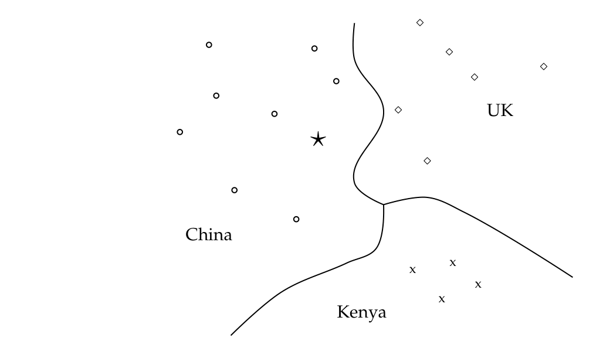
**图 14.1** 划分为三个类别的向量空间分类。
图中文字：China（中国）、Kenya（肯尼亚）、UK（英国）。

同样适用于此。例如，在文档中出现 5 次的词项应该比出现 1 次的词项获得更高的权重，但如果权重是 5 倍大，则会对该词项强调过度。在向量空间分类中，不应使用未加权和未归一化的计数。

本章我们将介绍两种向量空间分类方法：Rocchio 和 kNN。Rocchio 分类（第 14.2 节）将向量空间划分为以质心（centroids）或**原型**（prototypes）为中心的区域，每个类别一个，其计算方式为该类别中所有文档的质心（center of mass）。Rocchio 分类简单高效，但如果类别不近似为半径相似的球体，则不够准确。

kNN 或 k 最近邻分类（k nearest neighbor classification，第 14.3 节）将 k 个最近邻中的多数类别分配给测试文档。kNN 不需要显式的训练，可以直接在分类中使用未处理的训练集。在对文档进行分类时，它的效率低于其他分类方法。如果训练集很大，那么 kNN 在处理非球形和其他复杂类别时比 Rocchio 更好。

大量的文本分类器可以被视为线性分类器（linear classifiers）——即基于特征的简单线性组合进行分类的分类器（第 14.4 节）。此类分类器将特征空间划分为由线性决策超平面（decision hyperplanes）分隔的区域，具体方式将在下文详细说明。由于偏差-方差权衡（bias-variance tradeoff，第 14.6 节），更复杂的非线性模型

<!-- source: PDF 328; printed: 291 -->

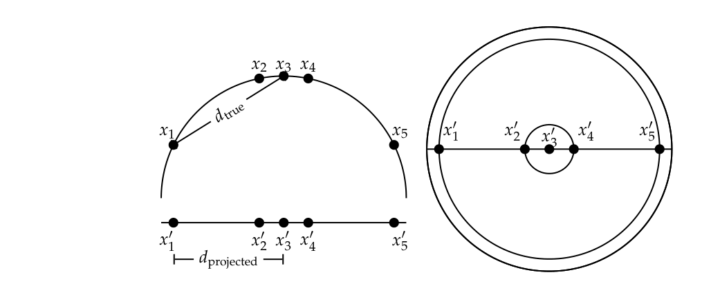
**图 14.2** 单位球面小区域的投影保持距离不变。左图：2D 半圆到 1D 的投影。对于 x 坐标为 $-0.9, -0.2, 0, 0.2, 0.9$ 的点 $x_1, x_2, x_3, x_4, x_5$，距离 $|x_2x_3| \approx 0.201$ 与 $|x'_2x'_3| = 0.2$ 仅相差 0.5%；但是 $|x_1x_3|/|x'_1x'_3| = d_{\text{true}}/d_{\text{projected}} \approx 1.06/0.9 \approx 1.18$ 是投影大区域时产生大失真（18%）的一个例子。右图：3D 半球到 2D 的对应投影。
图中文字：$x_1, x_2, x_3, x_4, x_5, x'_1, x'_2, x'_3, x'_4, x'_5, d_{\text{true}}, d_{\text{projected}}$

并不系统性地优于线性模型。非线性模型有更多的参数需要在有限的训练数据上进行拟合，并且在小规模和嘈杂的数据集上更容易出错。

将二类分类器应用于多于两个类别的分类问题时，存在单类别（one-of）任务——一篇文档必须被分配到几个互斥类别中的恰好一个，以及多类别（any-of）任务——一篇文档可以被分配到任意数量的类别中，正如我们将在第 14.5 节中解释的那样。二类分类器可以解决多类别问题，并且可以组合起来解决单类别问题。

## 14.1 向量空间中的文档表示与相关性度量

与第 6 章一样，在本章中我们将文档表示为 $\mathbb{R}^{|V|}$ 中的向量。为了说明向量分类中文档向量的属性，我们将这些向量绘制为平面上的点，如图 14.1 的例子所示。实际上，文档向量是长度归一化的单位向量，指向超球面（hypersphere）的表面。我们可以将图中的 2D 平面视为（超）球面表面在平面上的投影，如图 14.2 所示。只要我们将范围限制在表面的小区域内并选择合适的投影，球面上的距离和投影平面上的距离就大致相同（练习 14.1）。

<!-- source: PDF 329; printed: 292 -->

许多向量空间分类器的决策都基于距离的概念，例如在 kNN 分类中计算最近邻时。本章我们将使用欧几里得距离（Euclidean distance）作为基础的距离度量。我们之前观察到（第 131 页练习 6.18），对于长度归一化的向量，余弦相似度与欧几里得距离之间存在直接的对应关系。在向量空间分类中，两篇文档的相关性是用相似度还是距离来表示，通常无关紧要。

然而，除了文档之外，质心或向量的平均值在向量空间分类中也起着重要作用。质心不是长度归一化的。对于未归一化的向量，点积、余弦相似度和欧几里得距离通常表现出不同的行为（练习 14.6）。在计算文档与质心之间的相似度时，我们主要关注小的局部区域，区域越小，这三种度量的行为就越相似。

**练习 14.1**
对于小区域，超球面表面的距离可以很好地由其投影上的距离来近似（图 14.2），因为对于小角度有 $\alpha \approx \sin \alpha$。当失真度 $\alpha/\sin(\alpha)$ 为 (i) 1.01，(ii) 1.05 和 (iii) 1.1 时，角度分别是多大？

## 14.2 Rocchio 分类

图 14.1 展示了二维（2D）空间中的三个类别：China、UK 和 Kenya。文档显示为圆圈、菱形和 X。图中的边界（我们称之为**决策边界**，decision boundaries）是为了分隔这三个类别而选择的，但在其他方面是任意的。为了对新文档（在图中描绘为星号）进行分类，我们确定它所在的区域，并将其分配给该区域的类别——在本例中为 China。我们在向量空间分类中的任务是设计算法来计算良好的边界，其中“良好”意味着在训练期间未见过的数据上具有很高的分类准确率（accuracy）。

计算良好类别边界最著名的方法也许是 **Rocchio 分类**（Rocchio classification），它使用**质心**（centroids）来定义边界。类别 $c$ 的质心计算为其成员的向量平均值或质心（center of mass）：

$$ \vec{\mu}(c) = \frac{1}{|D_c|} \sum_{d \in D_c} \vec{v}(d) \tag{14.1} $$

其中 $D_c$ 是 $\mathbb{D}$ 中类别为 $c$ 的文档集合：$D_c = \{d : \langle d, c \rangle \in \mathbb{D}\}$。我们用 $\vec{v}(d)$ 表示 $d$ 的归一化向量（第 122 页式（6.11））。图 14.3 中用实心圆显示了三个质心示例。

Rocchio 分类中两个类别之间的边界是与两个质心距离相等的点集。例如，$|a_1| = |a_2|$，

<!-- source: PDF 330; printed: 293 -->

在图中，$|b_1| = |b_2|$ 且 $|c_1| = |c_2|$。这个点集总是一条直线。

$M$ 维空间中直线的推广是超平面（hyperplane），我们将其定义为满足以下条件的点 $\vec{x}$ 的集合：

$$ \vec{w}^T\vec{x} = b \tag{14.2} $$

其中 $\vec{w}$ 是超平面的 $M$ 维法向量（normal vector），$b$ 是一个常数。这个超平面的定义包括直线（二维空间中的任何直线都可以由 $w_1x_1 + w_2x_2 = b$ 定义）和二维平面（三维空间中的任何平面都可以由 $w_1x_1 + w_2x_2 + w_3x_3 = b$ 定义）。一条直线将一个平面一分为二，一个平面将三维空间一分为二，而超平面将高维空间一分为二。

因此，Rocchio 分类中类区域的边界是超平面。Rocchio 中的分类规则是根据点落入的区域对其进行分类。等价地，我们确定距离该点最近的质心 $\vec{\mu}(c)$，然后将其分配给 $c$。作为一个例子，考虑图 14.3 中的星号。它位于空间的 China 区域，因此 Rocchio 将其分配给 China。我们在图 14.4 中展示了 Rocchio 算法的伪代码。

> **脚注 1（原书第 293 页）**：回顾基础线性代数知识，$\vec{v} \cdot \vec{w} = \vec{v}^T\vec{w}$，即 $\vec{v}$ 和 $\vec{w}$ 的点积等于 $\vec{v}$ 的转置与 $\vec{w}$ 的矩阵乘积。

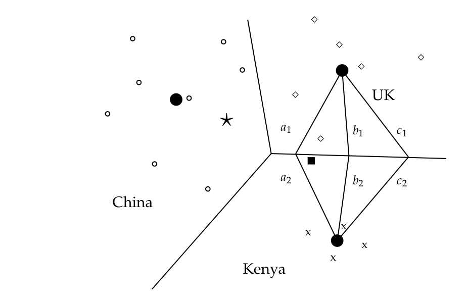
**图 14.3** Rocchio 分类。
图中文字：China（中国）、Kenya（肯尼亚）、UK（英国）；a1、a2、b1、b2、c1、c2 为文档点的标记。

<!-- source: PDF 331; printed: 294 -->

| 向量 | Chinese | Japan | Tokyo | Macao | Beijing | Shanghai |
|---|---|---|---|---|---|---|
| $\vec{d}_1$ | 0 | 0 | 0 | 0 | 1.0 | 0 |
| $\vec{d}_2$ | 0 | 0 | 0 | 0 | 0 | 1.0 |
| $\vec{d}_3$ | 0 | 0 | 0 | 1.0 | 0 | 0 |
| $\vec{d}_4$ | 0 | 0.71 | 0.71 | 0 | 0 | 0 |
| $\vec{d}_5$ | 0 | 0.71 | 0.71 | 0 | 0 | 0 |
| $\vec{\mu}_c$ | 0 | 0 | 0 | 0.33 | 0.33 | 0.33 |
| $\vec{\mu}_{\overline{c}}$ | 0 | 0.71 | 0.71 | 0 | 0 | 0 |

**表 14.1** 表 13.1 中数据的向量和类质心。

**例 14.1**：表 14.1 展示了表 13.1（第 261 页）中五篇文档的 tf-idf 向量表示，如果 $\text{tf}_{t,d} > 0$，则使用公式 $(1+\log_{10} \text{tf}_{t,d}) \log_{10}(4/\text{df}_t)$（式（6.14），第 127 页）。两个类质心分别为 $\vec{\mu}_c = 1/3 \cdot (\vec{d}_1 + \vec{d}_2 + \vec{d}_3)$ 和 $\vec{\mu}_{\overline{c}} = 1/1 \cdot (\vec{d}_4)$。测试文档到质心的距离分别为 $|\vec{\mu}_c - \vec{d}_5| \approx 1.15$ 和 $|\vec{\mu}_{\overline{c}} - \vec{d}_5| = 0.0$。因此，Rocchio 将 $d_5$ 分配给 $\overline{c}$。

在这种情况下，分离超平面具有以下参数：

$$ \begin{aligned} \vec{w} &\approx (0 \ -0.71 \ -0.71 \ 1/3 \ 1/3 \ 1/3)^T \\ b &= -1/3 \end{aligned} $$

关于如何计算 $\vec{w}$ 和 $b$，请参见练习 14.15。我们可以很容易地验证该超平面如预期那样分离了文档：$\vec{w}^T\vec{d}_1 \approx 0 \cdot 0 + -0.71 \cdot 0 + -0.71 \cdot 0 + 1/3 \cdot 0 + 1/3 \cdot 1.0 + 1/3 \cdot 0 = 1/3 > b$（类似地，对于 $i = 2$ 和 $i = 3$，有 $\vec{w}^T\vec{d}_i > b$），并且 $\vec{w}^T\vec{d}_4 = -1 < b$。因此，$c$ 中的文档在超平面上方（$\vec{w}^T\vec{d} > b$），而 $\overline{c}$ 中的文档在超平面下方（$\vec{w}^T\vec{d} < b$）。

图 14.4 中的分配准则是欧几里得距离（APPLYROCCHIO，第 1 行）。另一种选择是余弦相似度：

$$ \text{将 } d \text{ 分配给类 } c = \underset{c'}{\arg\max} \cos\left(\vec{\mu}(c'), \vec{v}(d)\right) $$

正如第 14.1 节所讨论的，这两种分配准则有时会做出不同的分类决策。我们在这里介绍 Rocchio 分类的欧几里得距离变体，因为它强调了 Rocchio 与 K-均值聚类（第 16.4 节，第 360 页）的紧密对应关系。

Rocchio 分类是 Rocchio 相关反馈（第 9.1.1 节，第 178 页）的一种形式。相关文档的平均值，对应于相关反馈中 Rocchio 向量的最重要分量（式（9.3），第 182 页），即为相关文档“类”的质心。我们在 Rocchio 分类中省略了 Rocchio 公式中的查询分量，因为在文本分类中没有查询。Rocchio 分类可以

<!-- source: PDF 332; printed: 295 -->

```text
TRAINROCCHIO(C, D)
1 for each c_j ∈ C
2 do D_j ← {d : ⟨d, c_j⟩ ∈ D}
3    μ⃗_j ← 1/|D_j| ∑_{d∈D_j} v⃗(d)
4 return {μ⃗_1, . . . , μ⃗_J}

APPLYROCCHIO({μ⃗_1, . . . , μ⃗_J}, d)
1 return arg min_j |μ⃗_j − v⃗(d)|
```
**图 14.4** Rocchio 分类：训练与测试。

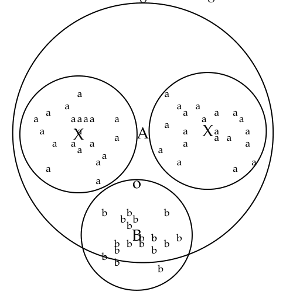
**图 14.5** 多峰类“a”由两个不同的簇组成（以 X 为中心的小圆圈）。Rocchio 分类会将“o”错误分类为“a”，因为它距离“a”类的质心 A 比距离“b”类的质心 B 更近。
图中文字：a, b, o, X, A, B

应用于 $J > 2$ 个类，而 Rocchio 相关反馈旨在仅区分两个类：相关和不相关。

除了遵循连续性假设外，Rocchio 分类中的类必须是半径相近的近似球体。在图 14.3 中，UK 和 Kenya 边界正下方的实心正方形更适合 UK 类，因为 UK 比 Kenya 更分散。但是 Rocchio 将其分配给 Kenya，因为它忽略了类中点分布的细节，仅使用到质心的距离进行分类。

球形假设在图 14.5 中也不成立。我们不

<!-- source: PDF 333; printed: 296 -->

| 模式 | 时间复杂度 |
|---|---|
| 训练 | $\Theta(\vert D\vert L_{\text{ave}} + \vert C\vert \vert V\vert )$ |
| 测试 | $\Theta(L_a + \vert C\vert M_a) = \Theta(\vert C\vert M_a)$ |

**表 14.2** Rocchio 分类的训练和测试时间。$L_{\text{ave}}$ 是每篇文档的平均词元数。$L_a$ 和 $M_a$ 分别是测试文档中的词元数和词型数。计算类质心和文档之间的欧几里得距离的时间复杂度为 $\Theta(|C|M_a)$。

能用单个原型很好地表示“a”类，因为它有两个簇。Rocchio 经常对这种类型的多峰类（multimodal class）进行错误分类。多峰性的一个文本分类例子是像 Burma（缅甸）这样的国家，它在 1989 年将名字改为了 Myanmar。更名国内前后的两个簇在空间中不一定彼此靠近。我们在相关反馈中也遇到过多峰性问题（第 9.1.2 节，第 184 页）。

二分类是类很少像半径相近的球体那样分布的另一种情况。大多数二分类器区分像 China 这样占据空间小区域的类及其广泛分散的补集。假设半径相等会导致大量的假阳性（false positives）。因此，大多数二分类问题需要以下形式的修改后的决策规则：

$$ \text{将 } d \text{ 分配给类 } c \text{ 当且仅当 } |\vec{\mu}(c) - \vec{v}(d)| < |\vec{\mu}(\overline{c}) - \vec{v}(d)| - b $$

其中 $b$ 为正常数。与 Rocchio 相关反馈一样，负篇文档的质心通常根本不被使用，因此决策准则简化为 $|\vec{\mu}(c) - \vec{v}(d)| < b'$，其中 $b'$ 为正常数。

表 14.2 给出了 Rocchio 分类的时间复杂度。<sup>[2]</sup> 将所有文档添加到它们各自的（未归一化的）质心的时间复杂度为 $\Theta(|D|L_{\text{ave}})$（而不是 $\Theta(|D||V|)$），因为我们只需要考虑非零项。将每个向量和除以其类的大小以计算质心的时间复杂度为 $\Theta(|V|)$。总体而言，训练时间与文档集的大小呈线性关系（参见练习 13.1）。因此，Rocchio 分类和朴素贝叶斯（Naive Bayes）具有相同的线性训练时间复杂度。

在下一节中，我们将介绍另一种向量空间分类方法 kNN，它能更好地处理具有非球形、不连通或其他不规则形状的类。

**练习 14.2** [\*]
证明 Rocchio 分类可以为文档分配与其训练集标签不同的标签。

> **脚注 2（原书第 296 页）**：我们将 $\Theta(T)$ 写为 $\Theta(|D|L_{\text{ave}})$，并假设测试文档的长度是有界的，正如我们在第 262 页所做的那样。

<!-- source: PDF 334; printed: 297 -->

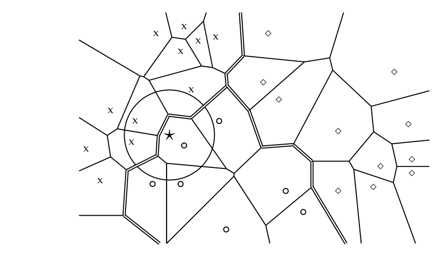
**图 14.6** 1NN 分类中的 Voronoi 剖分和决策边界（双线）。三个类别分别是：X、圆圈和菱形。
图中文字：X, o, ⋄, ⋆

## 14.3 k nearest neighbor

与 Rocchio 不同，**k 最近邻**（k nearest neighbor）或 **kNN 分类**（kNN classification）在局部确定决策边界。对于 1NN，我们将每个文档分配给其最近邻的类别。对于 kNN，我们将每个文档分配给其 $k$ 个最近邻中的多数类，其中 $k$ 是一个参数。kNN 分类的基本原理是，基于连续性假设，我们期望测试文档 $d$ 与位于 $d$ 周围局部区域的训练文档具有相同的标签。

如图 14.6 所示，1NN 中的决策边界是 **Voronoi 剖分**（Voronoi tessellation）的拼接线段。一组对象的 Voronoi 剖分将空间分解为 Voronoi 单元，其中每个对象的单元由所有比其他对象更接近该对象的点组成。在我们的例子中，对象是文档。然后，Voronoi 剖分将平面划分为 $|\mathbb{D}|$ 个凸多边形，每个多边形包含其对应的文档（且没有其他文档），如图 14.6 所示，其中凸多边形是二维空间中由直线边界包围的凸区域。

对于 kNN 中一般的 $k \in \mathbb{N}$，考虑空间中 $k$ 个最近邻集合相同的区域。这同样是一个凸多边形，空间被划分为多个凸多边形，在每个凸多边形内，$k$ 个

<!-- source: PDF 335; printed: 298 -->

最近邻的集合是不变的（练习 14.11）。<sup>[3]</sup>

```text
TRAIN-KNN(ℂ, 𝔻)
1 𝔻' ← PREPROCESS(𝔻)
2 k ← SELECT-K(ℂ, 𝔻')
3 return 𝔻', k

APPLY-KNN(ℂ, 𝔻', k, d)
1 Sk ← COMPUTENEARESTNEIGHBORS(𝔻', k, d)
2 for each c_j ∈ ℂ
3 do p_j ← |Sk ∩ c_j| / k
4 return arg max_j p_j
```

**图 14.7** kNN 训练（带预处理）和测试。$p_j$ 是 $P(c_j|S_k) = P(c_j|d)$ 的估计值。$c_j$ 表示类别 $c_j$ 中所有文档的集合。

1NN 不是很鲁棒。每个测试文档的分类决策依赖于单个训练文档的类别，而该训练文档可能被错误标记或不具代表性。$k > 1$ 的 kNN 更具鲁棒性。它将文档分配给其 $k$ 个最近邻中的多数类，如果出现平局则随机打破。

这个 kNN 分类算法有一个概率版本。我们可以将属于类别 $c$ 的概率估计为 $c$ 中 $k$ 个最近邻的比例。图 14.6 给出了一个 $k = 3$ 的例子。星号属于各类的概率估计为 $\hat{P}(\text{圆圈类}|\text{星号}) = 1/3$，$\hat{P}(\text{X 类}|\text{星号}) = 2/3$，以及 $\hat{P}(\text{菱形类}|\text{星号}) = 0$。3nn 估计（$\hat{P}(\text{圆圈类}|\text{星号}) = 1/3$）和 1nn 估计（$\hat{P}_1(\text{圆圈类}|\text{星号}) = 1$）有所不同，3nn 更倾向于 X 类，而 1nn 更倾向于圆圈类。

kNN 中的参数 $k$ 通常根据经验或手头分类问题的知识来选择。最好将 $k$ 设为奇数以减少平局的可能性。$k = 3$ 和 $k = 5$ 是常见的选择，但也使用 50 到 100 之间大得多的值。设置该参数的另一种方法是选择在训练集的保留部分（held-out portion）上给出最佳结果的 $k$。

我们还可以通过 $k$ 个最近邻的余弦

> **脚注 3（原书第 298 页）**：多边形向高维的推广是多胞形（polytope）。多胞形是 $M$ 维空间中由 $(M-1)$ 维超平面包围的区域。在 $M$ 维空间中，kNN 的决策边界由 $(M-1)$ 维超平面的线段组成，这些线段构成了训练文档集的凸多胞形 Voronoi 剖分。将文档分配给其 $k$ 个最近邻中多数类的决策准则同样适用于 $M=2$（剖分为多边形）和 $M>2$（剖分为多胞形）。

<!-- source: PDF 336; printed: 299 -->

| | |
|---|---|
| **带有训练集预处理的 kNN** | |
| 训练 | $\Theta(\vert \mathbb{D}\vert L_{\text{ave}})$ |
| 测试 | $\Theta(L_a + \vert \mathbb{D}\vert M_{\text{ave}}M_a) = \Theta(\vert \mathbb{D}\vert M_{\text{ave}}M_a)$ |
| **不带训练集预处理的 kNN** | |
| 训练 | $\Theta(1)$ |
| 测试 | $\Theta(L_a + \vert \mathbb{D}\vert L_{\text{ave}}M_a) = \Theta(\vert \mathbb{D}\vert L_{\text{ave}}M_a)$ |

**表 14.3** kNN 分类的训练和测试时间。$M_{\text{ave}}$ 是文档集中文档词汇表的平均大小。

相似度来对它们的“投票”进行加权。在这种方案中，一个类别的评分（score）计算如下：

$$
\operatorname{score}(c, d) = \sum_{d' \in S_k(d)} I_c(d') \cos\left(\vec{v}(d'), \vec{v}(d)\right)
$$

其中 $S_k(d)$ 是 $d$ 的 $k$ 个最近邻的集合，当且仅当 $d'$ 属于类别 $c$ 时 $I_c(d') = 1$，否则为 0。然后我们将文档分配给评分最高的类别。按相似度加权通常比简单投票更准确。例如，如果两个类别在前 $k$ 个最近邻中拥有相同数量的邻居，那么拥有更相似邻居的类别获胜。

图 14.7 总结了 kNN 算法。

**例 14.2**：测试文档与表 14.1 中四个训练文档的距离分别为 $|\vec{d}_1 - \vec{d}_5| = |\vec{d}_2 - \vec{d}_5| = |\vec{d}_3 - \vec{d}_5| \approx 1.41$ 以及 $|\vec{d}_4 - \vec{d}_5| = 0.0$。因此 $d_5$ 的最近邻是 $d_4$，1NN 将 $d_5$ 分配给 $d_4$ 的类别 $\overline{c}$。

### 14.3.1 kNN 的时间复杂度与最优性

表 14.3 给出了 kNN 的时间复杂度。kNN 具有与大多数其他分类算法截然不同的性质。训练 kNN 分类器仅仅包括确定 $k$ 和预处理文档。事实上，如果我们预先选择一个 $k$ 值并且不进行预处理，那么 kNN 根本不需要任何训练。在实践中，我们必须执行诸如词元化（tokenization）之类的预处理步骤。将训练文档的预处理作为训练阶段的一部分执行一次，比每次分类新测试文档时重复执行更有意义。

kNN 的测试时间为 $\Theta(|\mathbb{D}|M_{\text{ave}}M_a)$。它与训练集的大小成线性关系，因为我们需要计算每个训练文档与测试文档的距离。测试时间与类别数量 $J$ 无关。因此，对于 $J$ 很大的问题，kNN 具有潜在的优势。

在 kNN 分类中，我们不执行任何参数估计，这与 Rocchio 分类（质心）或朴素贝叶斯（先验概率和条件概率）不同。kNN 只是简单地记住训练

<!-- source: PDF 337; printed: 300 -->

集中的所有示例，然后将测试文档与它们进行比较。出于这个原因，kNN 也被称为**基于记忆的学习**（memory-based learning）或**基于实例的学习**（instance-based learning）。在机器学习中，通常希望有尽可能多的训练数据。但在 kNN 中，大型训练集会在分类时带来严重的效率损失。

kNN 测试能否比 $\Theta(|\mathbb{D}|M_{\text{ave}}M_a)$ 更高效，或者忽略文档长度，比 $\Theta(|\mathbb{D}|)$ 更高效？对于小维度 $M$，存在快速的 kNN 算法（练习 14.12）。对于大 $M$，也存在一些近似方法，它们为特定的效率提升提供了误差界限（见第 14.7 节）。这些近似方法尚未在文本分类应用中得到广泛测试，因此尚不清楚它们是否能在不显著降低准确率（accuracy）的情况下实现比 $\Theta(|\mathbb{D}|)$ 好得多的效率。

读者可能已经注意到，寻找测试文档的最近邻问题与特设检索（ad hoc retrieval）之间存在相似性，在特设检索中，我们搜索与查询相似度最高的文档（第 6.3.2 节，原书第 123 页）。事实上，这两个问题都是 $k$ 最近邻问题，唯一的区别在于 kNN 中测试文档（的向量）的相对稠密性（几十或几百个非零项）与特设检索中查询（的向量）的稀疏性（通常少于 10 个非零项）。我们在第 1.1 节（原书第 6 页）中引入了倒排索引（inverted index）来实现高效的特设检索。倒排索引也是高效 kNN 的解决方案吗？

倒排索引将搜索限制在那些与查询至少有一个共同词项（term）的文档上。因此，在 kNN 的背景下，如果测试文档与大量训练文档没有词项重叠，倒排索引将是高效的。情况是否如此取决于分类问题。如果文档很长且没有使用停用词表（stop list），那么节省的时间就会较少。但对于短文档和大型停用词表，倒排索引很可能将平均测试时间缩短 10 倍或更多。

倒排索引中的搜索时间是查询中词项的倒排记录表（postings lists）长度的函数。倒排记录表随文档集（collection）长度呈次线性增长，因为词汇表（vocabulary）根据 Heaps 定律增长——如果某些词项的出现概率增加，那么其他词项的出现概率必然减少。然而，大多数新词项是不常见的。因此，我们将倒排索引搜索的复杂度视为 $\Theta(T)$（如第 2.4.2 节，原书第 41 页所讨论的），并且假设平均文档长度不随时间变化，则 $\Theta(T) = \Theta(|\mathbb{D}|)$。

正如我们将在下一章看到的，kNN 的有效性接近于文本分类中最准确的学习方法（表 15.2，原书第 334 页）。衡量一种学习方法质量的指标是其**贝叶斯错误率**（Bayes error rate），即由该方法学习到的分类器在特定问题上的平均错误率。对于贝叶斯错误率非零的问题——即即使是最好的分类器也具有非零分类错误的问题——kNN 并不是最优的。1NN 的错误率渐近地（随着训练集的增加）以

<!-- source: PDF 338; printed: 301 -->

两倍。也就是说，如果最优分类器的错误率为 $x$，那么 1NN 的渐近错误率将小于 $2x$。这是由于噪声的影响——我们在第 13.5 节（原书第 271 页）已经看到了噪声特征形式的噪声示例，但正如我们将在下一节中讨论的那样，噪声也可以采取其他形式。噪声影响 kNN 的两个组成部分：测试文档和最近的训练文档。这两个噪声源是相加的，因此 1NN 的整体错误率是最优错误率的两倍。对于贝叶斯错误率为 0 的问题，随着训练集大小的增加，1NN 的错误率将趋近于 0。

**练习 14.3**
解释为什么 kNN 比 Rocchio 更好地处理多峰类。

## 14.4 线性与非线性分类器

在本节中，我们将展示朴素贝叶斯（Naive Bayes）和 Rocchio 这两种学习方法是线性分类器（linear classifier）的实例，这可能是文本分类器中最重要的一组，并将它们与非线性分类器进行对比。为了简化讨论，我们在本节中仅考虑二元分类器，并将线性分类器定义为通过比较特征的线性组合与阈值来决定类成员身份的二元分类器。

在二维空间中，线性分类器是一条直线。图 14.8 显示了五个例子。这些直线的函数形式为 $w_1x_1 + w_2x_2 = b$。线性分类器的分类规则是：如果 $w_1x_1 + w_2x_2 > b$，则将文档分配给 $c$；如果 $w_1x_1 + w_2x_2 \leq b$，则分配给 $\bar{c}$。这里，$(x_1, x_2)^T$ 是文档的二维向量表示，$(w_1, w_2)^T$ 是参数向量，

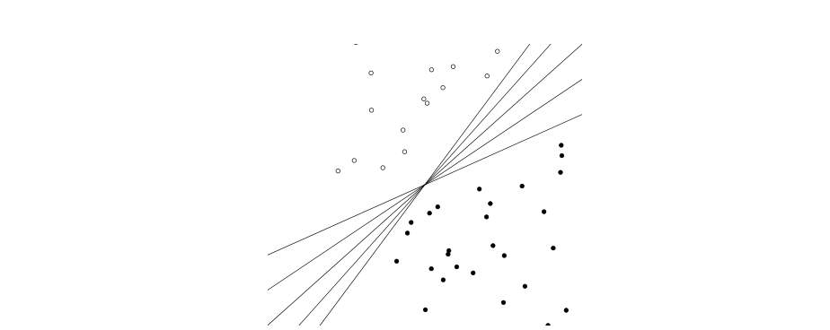

**图 14.8** 有无数个超平面可以将两个线性可分的类分开。

<!-- source: PDF 339; printed: 302 -->

```text
APPLYLINEARCLASSIFIER(w⃗, b, x⃗)
1 score ← ∑_{i=1}^M w_i x_i
2 if score > b
3 then return 1
4 else return 0
```

**图 14.9** 线性分类算法。

它（与 $b$ 一起）定义了决策边界。图 15.7（原书第 343 页）提供了线性分类器的另一种几何解释。

我们可以通过定义一个超平面，将这个二维线性分类器推广到更高维度，正如我们在式（14.2）中所做的那样，这里重复为式（14.3）：

$$ \vec{w}^T\vec{x} = b \tag{14.3} $$

那么分配标准是：如果 $\vec{w}^T\vec{x} > b$ 则分配给 $c$，如果 $\vec{w}^T\vec{x} \leq b$ 则分配给 $\bar{c}$。我们将用作线性分类器的超平面称为决策超平面（decision hyperplane）。

图 14.9 显示了 $M$ 维线性分类的相应算法。鉴于该算法的简单性，线性分类乍一看似乎微不足道。然而，困难在于训练线性分类器，即基于训练集确定参数 $\vec{w}$ 和 $b$。通常，一些学习方法计算出的参数比其他方法好得多，这里我们评估学习方法质量的标准是学习到的线性分类器在新数据上的有效性。

我们现在展示 Rocchio 和朴素贝叶斯是线性分类器。对于 Rocchio，观察到如果向量 $\vec{x}$ 到两个类质心的距离相等，则它位于决策边界上：

$$ |\vec{\mu}(c_1) - \vec{x}| = |\vec{\mu}(c_2) - \vec{x}| \tag{14.4} $$

一些基本的算术运算表明，这对应于一个法向量为 $\vec{w} = \vec{\mu}(c_1) - \vec{\mu}(c_2)$ 且 $b = 0.5 * (|\vec{\mu}(c_1)|^2 - |\vec{\mu}(c_2)|^2)$ 的线性分类器（练习 14.15）。

我们可以从朴素贝叶斯的决策规则推导出其线性，该规则选择具有最大 $\hat{P}(c|d)$ 的类别 $c$（图 13.2，原书第 260 页），其中：

$$ \hat{P}(c|d) \propto \hat{P}(c) \prod_{1 \leq k \leq n_d} \hat{P}(t_k|c) $$

并且 $n_d$ 是文档中属于词汇表的词元数量。将互补类别记为 $\bar{c}$，我们得到对数几率（log odds）：

$$ \log \frac{\hat{P}(c|d)}{\hat{P}(\bar{c}|d)} = \log \frac{\hat{P}(c)}{\hat{P}(\bar{c})} + \sum_{1 \leq k \leq n_d} \log \frac{\hat{P}(t_k|c)}{\hat{P}(t_k|\bar{c})} \tag{14.5} $$

<!-- source: PDF 340; printed: 303 -->

| $t_i$ | $w_i$ | $d_{1i}$ | $d_{2i}$ | $t_i$ | $w_i$ | $d_{1i}$ | $d_{2i}$ |
|---|---|---|---|---|---|---|---|
| prime | 0.70 | 0 | 1 | dlrs | -0.71 | 1 | 1 |
| rate | 0.67 | 1 | 0 | world | -0.35 | 1 | 0 |
| interest | 0.63 | 0 | 0 | sees | -0.33 | 0 | 0 |
| rates | 0.60 | 0 | 0 | year | -0.25 | 0 | 0 |
| discount | 0.46 | 1 | 0 | group | -0.24 | 0 | 0 |
| bundesbank | 0.43 | 0 | 0 | dlr | -0.24 | 0 | 0 |

**表 14.4** 线性分类器。Reuters-21578 中 interest 类（如在 interest rate 中）的线性分类器的维度 $t_i$ 和参数 $w_i$。阈值为 $b = 0$。像 dlr 和 world 这样的词项具有负权重，因为它们是竞争类 currency 的指示词。

如果几率大于 1，或者等价地，如果对数几率大于 0，我们选择类别 $c$。很容易看出，式（14.5）是式（14.3）的一个实例，其中 $w_i = \log[\hat{P}(t_i|c)/\hat{P}(t_i|\bar{c})]$，$x_i = t_i \text{ 在 } d \text{ 中出现的次数}$，且 $b = -\log[\hat{P}(c)/\hat{P}(\bar{c})]$。这里，索引 $i$（$1 \leq i \leq M$）指的是词汇表中的词项（而不是像 $k$ 那样指代在 $d$ 中的位置；参见第 13.4.1 节，原书第 270 页），并且 $\vec{x}$ 和 $\vec{w}$ 是 $M$ 维向量。因此，在对数空间中，朴素贝叶斯是一个线性分类器。

**例 14.3：** 表 14.4 定义了 Reuters-21578 中 interest 类别的线性分类器（参见第 13.6 节，原书第 279 页）。我们将文档 $\vec{d}_1$ “rate discount dlrs world” 分配给 interest，因为 $\vec{w}^T\vec{d}_1 = 0.67 \cdot 1 + 0.46 \cdot 1 + (-0.71) \cdot 1 + (-0.35) \cdot 1 = 0.07 > 0 = b$。我们将 $\vec{d}_2$ “prime dlrs” 分配给互补类（不在 interest 中），因为 $\vec{w}^T\vec{d}_2 = -0.01 \leq b$。为简单起见，我们在本例中假设一个简单的二元向量表示：出现的词项为 1，未出现的词项为 0。

图 14.10 是一个线性问题的图形示例，我们将其定义为两个类的潜在分布 $P(d|c)$ 和 $P(d|\bar{c})$ 被一条直线分开。我们将这条分隔线称为类边界（class boundary）。它是两个类的“真实”边界，我们将其与学习方法计算出用于近似类边界的决策边界区分开来。

正如文本分类中典型的情况一样，图 14.10 中有一些噪声文档（用箭头标记），它们不能很好地融入类的整体分布中。在第 13.5 节（原书第 271 页）中，我们将噪声特征定义为一种误导性特征，当包含在文档表示中时，平均会增加分类错误。类似地，噪声文档（noise document）是指当包含在训练集中时，会误导学习方法并增加分类错误的文档。直观地说，潜在分布将表示空间划分为主要具有同质

<!-- source: PDF 341; printed: 304 -->

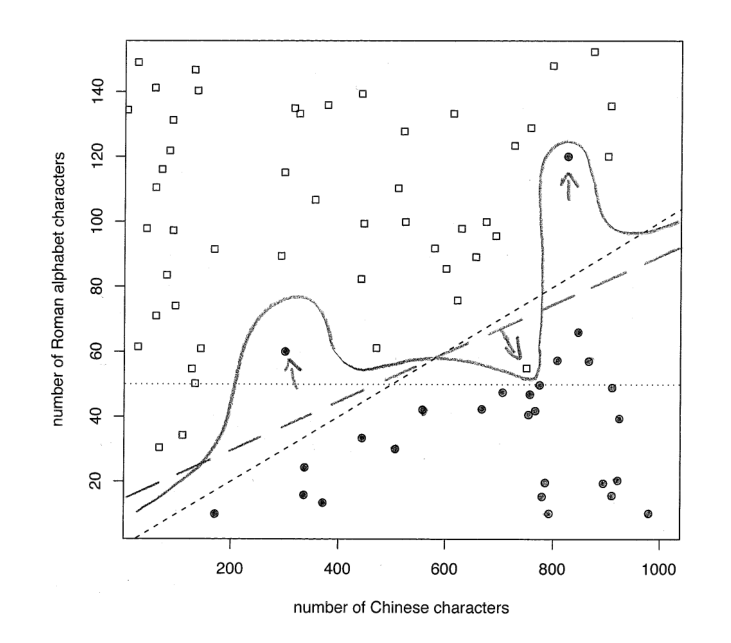

**图 14.10** 带有噪声的线性问题。在这个假设的网页分类场景中，纯中文网页是实心圆，中英混合网页是正方形。这两个类被一个线性类边界（短虚线）分开，除了三个噪声文档（用箭头标记）。
图中文字：number of Roman alphabet characters 罗马字母字符数；number of Chinese characters 中文字符数

类分配的区域。不符合其所在区域主要类别的文档就是噪声文档。

噪声文档是训练线性分类器困难的原因之一。如果在选择分类器的决策超平面时过于关注噪声文档，那么它在新数据上就会不准确。更根本的是，通常很难确定哪些文档是噪声文档，从而具有潜在的误导性。

如果存在一个能完美分开两个类的超平面，那么我们称这两个类是线性可分的（linearly separable）。事实上，如果线性可分性（linear separability）成立，那么就有无数个线性分隔面（练习 14.4），如图 14.8 所示，其中可能的分隔超平面的数量是无限的。

图 14.8 说明了训练线性分类器的另一个挑战。如果我们正在处理一个线性可分的问题，那么我们需要一个标准，在所有能完美分开训练数据的决策超平面中进行选择。通常，这些超平面中的一些在新数据上表现良好，而另一些

<!-- source: PDF 342; printed: 305 -->

通常，这些超平面中有些在处理新数据时表现良好，有些则不然。

kNN 是非线性分类器（nonlinear classifier）的一个例子。在观察图 14.6 这样的例子时，kNN 的非线性是直观可见的。kNN 的决策边界（图 14.6 中的双线）是局部线段，但通常具有复杂的形状，不等同于二维空间中的直线或高维空间中的超平面。

图 14.11 是非线性问题的另一个例子：由于图中左上角存在圆形的“飞地（enclave）”，在分布 $P(d|c)$ 和 $P(d|\overline{c})$ 之间没有好的线性分隔符。线性分类器会将该飞地误分类，而如果训练集足够大，像 kNN 这样的非线性分类器对于此类问题将具有很高的准确率。

如果一个问题是非线性的，并且其类别边界不能用线性超平面很好地近似，那么非线性分类器通常比线性分类器更准确。如果问题是线性的，最好使用更简单的线性分类器。

**练习 14.4**
证明两个类别的线性分隔符的数量要么是无限的，要么是零。

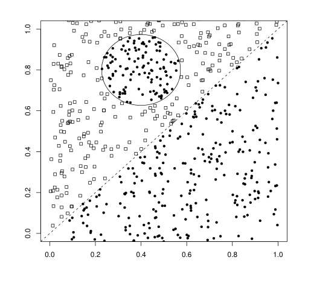
**图 14.11** 一个非线性问题。

<!-- source: PDF 343; printed: 306 -->

## 14.5 多于两类的分类问题

我们可以将两类线性分类器扩展到 $J > 2$ 个类别。使用的方法取决于这些类别是否互斥。

针对非互斥类别的分类被称为任意（any-of）、多标签（multilabel）或多值（multivalue）分类。在这种情况下，一篇文档可以同时属于几个类别，或者属于单个类别，或者不属于任何类别。对一个类别的决定为其他类别保留了所有选项。有时人们会说这些类别彼此独立，但这会产生误导，因为这些类别很少在第 275 页定义的意义上具有统计独立性。根据式（13.1）（原书第 256 页）中分类问题的形式化定义，我们在任意分类中学习 $J$ 个不同的分类器 $\gamma_j$，每个分类器返回 $c_j$ 或 $\overline{c}_j$：$\gamma_j(d) \in \{c_j, \overline{c}_j\}$。

使用线性分类器解决任意分类任务非常直接：

1. 为每个类别构建一个分类器，其中训练集由该类别中的文档集（正标签）及其补集（负标签）组成。
2. 给定测试文档，分别应用每个分类器。一个分类器的决定对其他分类器的决定没有影响。

第二种多于两类的分类是唯一（one-of）分类。在这里，类别是互斥的。每篇文档必须恰好属于其中一个类别。唯一分类也称为多项式（multinomial）、多分支（polytomous）<sup>[4]</sup>、多类（multiclass）或单标签（single-label）分类。形式上，唯一分类中存在一个单一的分类函数 $\gamma$，其值域为 $\mathbb{C}$，即 $\gamma(d) \in \{c_1, \ldots, c_J\}$。kNN 是一个（非线性）唯一分类器。

在文本分类中，真正的唯一分类问题不如任意分类问题常见。对于像英国（UK）、中国（China）、家禽（poultry）或咖啡（coffee）这样的类别，一篇文档可以同时与许多主题相关——例如当英国首相访问中国讨论咖啡和家禽贸易时。

尽管如此，我们经常会像在图 14.1 中那样做出唯一假设，即使类别并非真正互斥。对于识别文档语言的分类问题，唯一假设是一个很好的近似，因为大多数文本只用一种语言编写。在这些情况下，施加唯一约束可以提高分类器的有效性，因为消除了由于任意分类器将文档分配给零个或多个类别而导致的错误。

如图 14.12 所示，$J$ 个超平面并不能将 $\mathbb{R}^{|V|}$ 划分为 $J$ 个不同的区域。因此，当使用两类线性分类器进行唯一分类时，我们必须使用一种组合方法。最简单的方法是

> **脚注 4（原书第 306 页）**：polytomous 的一个同义词是 polychotomous。

<!-- source: PDF 344; printed: 307 -->

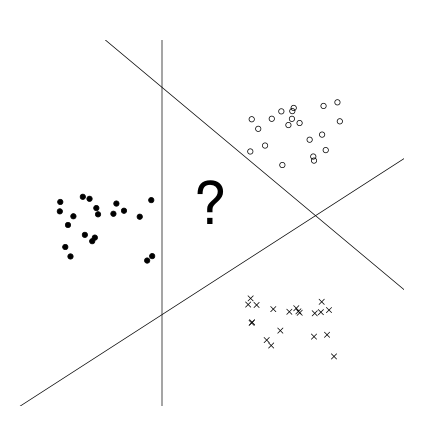
**图 14.12** $J$ 个超平面并不能将空间划分为 $J$ 个不相交的区域。

对类别进行排序，然后选择排名最高的类别。在几何上，排序可以基于到 $J$ 个线性分隔符的距离。靠近某个类别分隔符的文档更有可能被误分类，因此距离分隔符越远，正分类决定正确的可能性就越大。或者，我们可以使用置信度的直接度量来对类别进行排序，例如类别成员的概率。我们可以将使用线性分类器进行唯一分类的算法表述如下：

1. 为每个类别构建一个分类器，其中训练集由该类别中的文档集（正标签）及其补集（负标签）组成。
2. 给定测试文档，分别应用每个分类器。
3. 将文档分配给具有以下特征的类别：
   * 最大评分（score），
   * 最大置信度值，
   * 或最大概率。

混淆矩阵（confusion matrix）是分析 $J > 2$ 个类别的分类器性能的重要工具。混淆矩阵显示了对于每一对类别 $\langle c_1, c_2 \rangle$，有多少来自 $c_1$ 的文档被错误地分配给了 $c_2$。在表 14.5 中，分类器成功地将三个金融类别 *money-fx*、*trade* 和 *interest* 与三个农业类别 *wheat*、*corn* 和 *grain* 区分开来，但在两组内部犯了许多错误。混淆矩阵有助于准确定位提高准确率的机会，

<!-- source: PDF 345; printed: 308 -->

| 真实类别 \ 分配类别 | *money-fx* | *trade* | *interest* | *wheat* | *corn* | *grain* |
| :--- | :--- | :--- | :--- | :--- | :--- | :--- |
| *money-fx* | 95 | 0 | 10 | 0 | 0 | 0 |
| *trade* | 1 | 1 | 90 | 0 | 1 | 0 |
| *interest* | 13 | 0 | 0 | 0 | 0 | 0 |
| *wheat* | 0 | 0 | 1 | 34 | 3 | 7 |
| *corn* | 1 | 0 | 2 | 13 | 26 | 5 |
| *grain* | 0 | 0 | 2 | 14 | 5 | 10 |

**表 14.5** Reuters-21578 的混淆矩阵。例如，14 篇来自 *grain* 的文档被错误地分配给了 *wheat*。改编自 Picca 等人（2006）的研究。

从而改进系统。例如，为了解决表 14.5 中的第二大错误（*grain* 行中的 14），可以尝试引入区分 *wheat* 文档和 *grain* 文档的特征。

**练习 14.5**
创建一个包含 300 篇文档的训练集，分别来自三种不同的语言（例如，英语、法语、西班牙语），每种语言 100 篇。按照相同的过程创建一个测试集，但还要添加 100 篇来自第四种语言的文档。在此训练集上训练 (i) 一个唯一分类器和 (ii) 一个任意分类器，并在测试集上对其进行评估。(iii) 这两个分类器在此任务上的表现是否有任何有趣的差异？

## 14.6 偏差-方差权衡

非线性分类器比线性分类器更强大。对于某些问题，存在分类误差为零的非线性分类器，但不存在这样的线性分类器。这是否意味着我们应该始终使用非线性分类器以在统计文本分类中获得最佳效果？

为了回答这个问题，我们在本节中引入偏差-方差权衡（bias-variance tradeoff），这是机器学习中最重要的概念之一。这种权衡有助于解释为什么没有普遍最优的学习方法。因此，选择合适的学习方法是解决文本分类问题不可避免的一部分。

在整个这一节中，我们将线性分类器和非线性分类器分别作为“较弱”和“较强”学习的原型示例。这是一种简化，原因有几个。首先，许多非线性模型将线性模型作为特例包含在内。例如，像 kNN 这样的非线性学习方法在某些情况下会产生线性分类器。其次，有些非线性模型比线性模型更简单。例如，具有两个参数的二次多项式比 10,000 维的线性分类器更弱。第三，学习的复杂性实际上并不是分类器的属性，因为有许多方面

<!-- source: PDF 346; printed: 309 -->

学习的许多方面（例如特征选择，参见第 13.5 节，第 271 页；正则化；以及第 15 章中的间隔最大化等约束条件）会使得学习方法变得更强或更弱，而不会影响作为学习最终结果的分类器类型——无论该分类器是线性的还是非线性的。我们建议读者参考第 14.7 节中列出的文献，以了解考虑了这些复杂性的偏差-方差权衡（bias-variance tradeoff）的处理方法。在本节中，线性和非线性分类器将仅仅作为文本分类中较弱和较强学习方法的代理。

## 14.6 偏差-方差权衡

我们首先需要更精确地陈述我们在文本分类中的目标。在第 13.1 节（第 256 页）中，我们说过我们希望最小化测试集上的分类错误。这里隐含的假设是，训练文档和测试文档是根据相同的底层分布生成的。我们将此分布记为 $P(\langle d, c\rangle)$，其中 $d$ 是文档，$c$ 是其标签或类别。图 13.4 和 13.5 是生成模型的示例，它们将 $P(\langle d, c\rangle)$ 分解为 $P(c)$ 和 $P(d|c)$ 的乘积。图 14.10 和 14.11 描绘了 $\langle d, c\rangle$ 的生成模型，其中 $d \in \mathbb{R}^2$ 且 $c \in \{\text{square}, \text{solid circle}\}$（正方形，实心圆）。

在本节中，我们不再使用正确分类的测试文档数量（或者等价地，测试文档上的错误率）作为评估指标，转而采用一种解决标注内在不确定性的评估指标。在许多文本分类问题中，给定的文档表示可能源自属于不同类别的文档。这是因为来自不同类别的文档可以映射到相同的文档表示。例如，在词袋模型中，单句文档 *China sues France*（中国起诉法国）和 *France sues China*（法国起诉中国）被映射到相同的文档表示 $d' = \{\text{China}, \text{France}, \text{sues}\}$。但只有后一个文档与类别 $c' = \text{legal actions brought by France}$（法国提起的法律诉讼）（例如，可能由国际贸易律师定义为持续查询）相关。

为了简化本节中的计算，我们在评估分类器时不计算测试集上的错误数量，而是考察分类器对文档属于某个类别的条件概率 $P(c|d)$ 的估计程度。在上述例子中，我们可能有 $P(c'|d') = 0.5$。

那么我们在文本分类中的目标是找到一个分类器 $\gamma$，使得在文档 $d$ 上平均后，$\gamma(d)$ 尽可能接近真实概率 $P(c|d)$。我们使用均方误差（mean squared error）来衡量这一点：

$$
\text{MSE}(\gamma) = E_d[\gamma(d) - P(c|d)]^2 \tag{14.6}
$$

其中 $E_d$ 是关于 $P(d)$ 的期望。均方误差项为 $\gamma$ 做出的接近但不完全正确的决策给予部分分数。

<!-- source: PDF 347; printed: 310 -->

$$
\begin{align}
E[x - \alpha]^2 &= Ex^2 - 2Ex\alpha + \alpha^2 \tag{14.8} \\
&= (Ex)^2 - 2Ex\alpha + \alpha^2 \nonumber \\
&\quad + Ex^2 - 2(Ex)^2 + (Ex)^2 \nonumber \\
&= [Ex - \alpha]^2 \nonumber \\
&\quad + Ex^2 - E2x(Ex) + E(Ex)^2 \nonumber \\
&= [Ex - \alpha]^2 + E[x - Ex]^2 \nonumber
\end{align}
$$

$$
\begin{align}
E_{\mathbb{D}}E_d[\Gamma_{\mathbb{D}}(d) - P(c|d)]^2 &= E_dE_{\mathbb{D}}[\Gamma_{\mathbb{D}}(d) - P(c|d)]^2 \tag{14.9} \\
&= E_d[ \, [E_{\mathbb{D}}\Gamma_{\mathbb{D}}(d) - P(c|d)]^2 \nonumber \\
&\quad + E_{\mathbb{D}}[\Gamma_{\mathbb{D}}(d) - E_{\mathbb{D}}\Gamma_{\mathbb{D}}(d)]^2 \, ] \nonumber
\end{align}
$$

**图 14.13** 偏差-方差分解的算术变换。为了推导式（14.9），我们在式（14.8）中令 $\alpha = P(c|d)$ 且 $x = \Gamma_{\mathbb{D}}(d)$。

**最优分类器（OPTIMAL CLASSIFIER）** 如果分类器 $\gamma$ 最小化了 $\text{MSE}(\gamma)$，我们定义它对于分布 $P(\langle d, c\rangle)$ 是最优的。

最小化 MSE 是分类器的一个理想目标。我们还需要一个针对学习方法的标准。回想一下，我们将学习方法 $\Gamma$ 定义为一个函数，它以带标签的训练集 $\mathbb{D}$ 作为输入并返回一个分类器 $\gamma$。

对于学习方法，我们的目标是找到一个 $\Gamma$，使得在训练集上平均后，学习到的分类器 $\gamma$ 具有最小的 MSE。我们可以将其形式化为最小化**学习误差（LEARNING ERROR）**：

$$
\text{learning-error}(\Gamma) = E_{\mathbb{D}}[\text{MSE}(\Gamma(\mathbb{D}))] \tag{14.7}
$$

其中 $E_{\mathbb{D}}$ 是在带标签训练集上的期望。为了保持简单，我们可以假设训练集具有固定的大小——那么分布 $P(\langle d, c\rangle)$ 就定义了训练集上的分布 $P(\mathbb{D})$。

我们可以使用学习误差作为在统计文本分类中选择学习方法的标准。如果学习方法 $\Gamma$ 最小化了学习误差，那么它对于分布 $P(\mathbb{D})$ 是**最优学习方法（OPTIMAL LEARNING METHOD）**。

为了提高可读性，将 $\Gamma(\mathbb{D})$ 写为 $\Gamma_{\mathbb{D}}$，我们可以将式（14.7）变换如下：

$$
\begin{align}
\text{learning-error}(\Gamma) &= E_{\mathbb{D}}[\text{MSE}(\Gamma_{\mathbb{D}})] \nonumber \\
&= E_{\mathbb{D}}E_d[\Gamma_{\mathbb{D}}(d) - P(c|d)]^2 \tag{14.10} \\
&= E_d[\text{bias}(\Gamma, d) + \text{variance}(\Gamma, d)] \tag{14.11}
\end{align}
$$

<!-- source: PDF 348; printed: 311 -->

$$
\begin{align}
\text{bias}(\Gamma, d) &= [P(c|d) - E_{\mathbb{D}}\Gamma_{\mathbb{D}}(d)]^2 \tag{14.12} \\
\text{variance}(\Gamma, d) &= E_{\mathbb{D}}[\Gamma_{\mathbb{D}}(d) - E_{\mathbb{D}}\Gamma_{\mathbb{D}}(d)]^2 \tag{14.13}
\end{align}
$$

其中式（14.10）和式（14.11）之间的等价性在图 14.13 的式（14.9）中给出。请注意，$d$ 和 $\mathbb{D}$ 是相互独立的。通常，对于随机文档 $d$ 和随机训练集 $\mathbb{D}$，$\mathbb{D}$ 不包含 $d$ 的带标签实例。

**偏差（BIAS）**是 $P(c|d)$（$d$ 属于 $c$ 的真实条件概率）与 $\Gamma_{\mathbb{D}}(d)$（学习到的分类器在训练集上平均后的预测值）之间差值的平方。如果学习方法产生的分类器始终是错误的，则偏差很大。如果满足以下条件之一，则偏差很小：（i）分类器始终是正确的；或者（ii）不同的训练集在不同的文档上导致错误；或者（iii）不同的训练集在相同的文档上导致正向和负向的错误，但平均后接近于 0。如果这三个条件之一成立，那么 $E_{\mathbb{D}}\Gamma_{\mathbb{D}}(d)$（在所有训练集上的期望）就接近于 $P(c|d)$。

像 Rocchio 和朴素贝叶斯（Naive Bayes）这样的线性方法对于非线性问题具有高偏差，因为它们只能对一种类型的类别边界（线性超平面）进行建模。如果生成模型 $P(\langle d, c\rangle)$ 具有复杂的非线性类别边界，则式（14.11）中的偏差项将会很高，因为大量的点将被一致地误分类。例如，图 14.11 中的圆形飞地不适合线性模型，并且将被线性分类器一致地误分类。

我们可以认为偏差源于我们构建到分类器中的领域知识（或缺乏领域知识）。如果我们知道两个类别之间的真实边界是线性的，那么产生线性分类器的学习方法比非线性方法更有可能成功。但是，如果真实的类别边界不是线性的，而我们错误地使分类器偏向于线性，那么平均分类准确率（accuracy）将会很低。

像 kNN 这样的非线性方法具有低偏差。我们可以在图 14.6 中看到，kNN 的决策边界是可变的——根据训练集中文档的分布，学习到的决策边界可能会有很大差异。因此，对于某些训练集，每个文档都有机会被正确分类。因此，平均预测值 $E_{\mathbb{D}}\Gamma_{\mathbb{D}}(d)$ 更接近 $P(c|d)$，并且偏差比线性学习方法更小。

**方差（VARIANCE）**是学习到的分类器预测值的变化：$\Gamma_{\mathbb{D}}(d)$ 与其平均值 $E_{\mathbb{D}}\Gamma_{\mathbb{D}}(d)$ 之间差值的平方的平均值。如果不同的训练集 $\mathbb{D}$ 产生非常不同的分类器 $\Gamma_{\mathbb{D}}$，则方差很大。如果训练集对 $\Gamma_{\mathbb{D}}$ 做出的分类决策（无论正确与否）影响很小，则方差很小。方差衡量的是决策的不一致程度，而不是它们是否正确。

线性学习方法具有低方差，因为大多数随机抽取的训练集会产生相似的决策超平面。产生的决策线

<!-- source: PDF 349; printed: 312 -->

（在图 14.10 和 14.11 中由线性学习方法产生）将根据训练集略微偏离主类别边界，但绝大多数文档（除了那些靠近主边界的文档）的类别分配不会受到影响。图 14.11 中的圆形飞地将被一致地误分类。

像 kNN 这样的非线性方法具有高方差。从图 14.6 中可以明显看出，kNN 可以对两个类别之间非常复杂的边界进行建模。因此，它对图 14.10 中描绘的那种噪声文档很敏感。结果，式（14.11）中的方差项对于 kNN 来说很大：测试文档有时会被误分类——如果它们碰巧靠近训练集中的噪声文档——有时会被正确分类——如果它们附近没有训练集中的噪声文档。这导致了不同训练集之间的高变化。

高方差的学习方法容易对训练数据产生**过拟合（OVERFITTING）**。分类的目标是在一定程度上拟合训练数据，以捕捉底层分布 $P(\langle d, c\rangle)$ 的真实属性。在过拟合中，学习方法也会从噪声中学习。过拟合会增加 MSE，并且通常是高方差学习方法的一个问题。

我们也可以将方差视为模型复杂度，或者等价地，视为学习方法的**记忆容量（MEMORY CAPACITY）**——它能记住训练集的多少细节特征，然后将其应用于新数据。这种容量对应于可用于拟合训练集的独立参数的数量。每个 kNN 邻域 $S_k$ 做出独立的分类决策。这种情况下的参数是图 14.7 中的估计值 $\hat{P}(c|S_k)$。因此，kNN 的容量仅受训练集大小的限制。它可以记住任意大的训练集。相比之下，Rocchio 的参数数量是固定的——每个维度 $J$ 个参数，每个质心一个——并且独立于训练集的大小。Rocchio 分类器（以定义它的质心的形式）无法“记住”训练集中文档分布的细粒度细节。

根据式（14.7），我们选择学习方法的目标是最小化学习误差。式（14.11）捕捉到的基本见解（我们可以简明扼要地表述为：学习误差 = 偏差 + 方差）是，学习误差有两个组成部分，即偏差和方差，它们通常无法同时最小化。在比较两种学习方法 $\Gamma_1$ 和 $\Gamma_2$ 时，在大多数情况下，比较归结为一种方法具有较高的偏差和较低的方差，而另一种方法具有较低的偏差和较高的方差。因此，决定选择一种学习方法而不是另一种，不仅仅是选择在各个训练集中可靠地产生良好分类器的方法（小方差），或者是选择能够学习具有非常困难的决策边界的分类问题的方法（小偏差）。相反，我们必须在我们的应用中权衡偏差和方差各自的优点，并据此做出选择。这种权衡被称为**偏差-方差权衡（BIAS-VARIANCE TRADEOFF）**。

<!-- source: PDF 350; printed: 313 -->

图 14.10 提供了一个说明，虽然有些牵强，但作为权衡的例子会很有用。一些中文文本包含用罗马字母书写的英文单词，如 CPU、ONLINE 和 GPS。考虑区分纯中文网页和中英文混合网页的任务。搜索引擎可能会为不懂英语（但懂 CPU 等外来词）的中国用户提供过滤掉混合网页的选项。我们在该分类任务中使用两个特征：网页上罗马字母字符的数量和中文字符的数量。如前所述，生成模型的分布 $P(\langle d, c\rangle)$ 在短虚线上方（或下方）生成了大部分混合（或纯中文）文档，但也有少量噪声文档。

在图 14.10 中，我们看到三个分类器：

*   **单特征分类器（One-feature classifier）**。显示为水平点线。该分类器仅使用一个特征，即罗马字母字符的数量。假设一种学习方法能够最小化训练集中的误分类数量，水平决策边界的位置不会受到训练集差异（例如，噪声文档）的太大影响。因此，产生此类分类器的学习方法具有低方差。但它的偏差很高，因为它会始终将左下角的正方形和包含超过 50 个罗马字符的“实心圆”文档误分类。

*   **线性分类器（Linear classifier）**。显示为长虚线。学习线性分类器的偏差较小，因为只有噪声文档以及可能少数靠近两类边界的文档被误分类。其方差高于单特征分类器，但仍然很小：长虚线仅略微偏离两类之间的真实边界，几乎所有从训练集中学习到的线性决策边界也是如此。因此，极少数文档（靠近类别边界的文档）会被不一致地分类。

*   **“完美拟合训练集”分类器（“Fit-training-set-perfectly” classifier）**。显示为实线。在这里，学习方法构建了一个完美分离训练集中各个类别的决策边界。该方法的偏差最低，因为没有文档被始终误分类——分类器有时甚至能正确分类测试集中的噪声文档。但是这种学习方法的方差很高。因为噪声文档可以任意移动决策边界，靠近训练集中噪声文档的测试文档将被误分类——这是线性学习方法不太可能发生的情况。

也许令人惊讶的是，许多最著名的文本分类算法都是线性的。其中一些方法，特别是线性支持向量机（SVM）、正

<!-- source: PDF 351; printed: 314 -->

则化逻辑回归和正则化线性回归，是已知最有效的方法之一。偏差-方差权衡（bias-variance tradeoff）为它们的成功提供了深刻的见解。文本分类中的典型类别是复杂的，似乎不太可能用线性模型很好地建模。然而，对于我们在文本应用中通常遇到的高维空间，这种直觉具有误导性。随着维度的增加，线性可分的可能性迅速增加（练习 14.17）。因此，高维空间中的线性模型尽管具有线性特征，但非常强大。更强大的非线性学习方法可以对比较超平面更复杂的决策边界进行建模，但它们对训练数据中的噪声也更敏感。如果训练集很大，非线性学习方法有时表现更好，但绝非在所有情况下都如此。

## 14.7 参考文献及进一步阅读

正如第 9 章所讨论的，Rocchio 相关反馈（relevance feedback）由 Rocchio (1971) 提出。Joachims (1997) 对该方法进行了概率分析。在 20 世纪 90 年代，Rocchio 分类在 TREC 中被广泛用作一种分类方法 (Buckley et al. 1994a;b, Voorhees and Harman 2005)。最初，它被用作一种路由（routing）形式。路由仅仅根据文档与某个类别的相关性对文档进行排序，而不进行分配。关于过滤（filtering）的早期工作由 Ittner et al. (1995) 和 Schapire et al. (1998) 发表，这是一种真正的分类方法，对每个文档做出分配决策。我们这里使用的路由定义不应与另一种含义相混淆。路由也可以指将文档电子分发给订阅者，即所谓的文档分发推模型（push model）。在拉模型（pull model）中，每次向用户传输文档都是由用户发起的——例如，通过搜索或从新闻聚合网站的文档列表中进行选择。

一些作者将 Rocchio 分类这个名称限制在二分类问题上，并使用基于簇的（cluster-based）(Iwayama and Tokunaga 1995) 和基于质心的分类（centroid-based classification）(Han and Karypis 2000, Tan and Cheng 2007) 等术语来指代 $J > 2$ 的 Rocchio 分类。

关于 kNN 的更详细论述可以在 (Hastie et al. 2001) 中找到，包括调整参数 $k$ 的方法。一种近似快速 kNN 算法的例子是基于局部性的哈希（locality-based hashing）(Andoni et al. 2006)。Kleinberg (1997) 提出了一种近似的 $\Theta((M \log^2 M)(M + \log N))$ kNN 算法（其中 $M$ 是空间的维度，$N$ 是数据点的数量），但代价是指数级的存储需求：$\Theta((N \log M)^{2M})$。Indyk (2004) 综述了高维空间中的最近邻方法。

文本分类中 kNN 的早期工作是受到大规模并行硬件架构可用性的启发 (Creecy et al. 1992)。Yang (1994)

<!-- source: PDF 352; printed: 315 -->

使用倒排索引（inverted index）来加速 kNN 分类。1NN 的最优性结果（渐近为贝叶斯错误率的两倍）由 Cover and Hart (1967) 提出。

Rocchio 分类和 kNN 的有效性高度依赖于仔细的参数调整（特别是第 296 页 Rocchio 的参数 $b'$ 和 kNN 的 $k$）、特征工程（第 15.3 节，第 334 页）和特征选择（第 13.5 节，第 271 页）。Buckley and Salton (1995)、Schapire et al. (1998)、Yang and Kisiel (2003) 以及 Moschitti (2003) 探讨了 Rocchio 的这些问题，而 Yang (2001) 以及 Ault and Yang (2002) 探讨了 kNN 的这些问题。Zavrel et al. (2000) 比较了 kNN 的特征选择方法。

偏差-方差权衡由 Geman et al. (1992) 引入。第 14.6 节中的推导是针对 $\operatorname{MSE}(\gamma)$ 的，但该权衡适用于许多损失函数（参见 Friedman (1997), Domingos (2000)）。Schütze et al. (1995) 和 Lewis et al. (1996) 讨论了用于文本的线性分类器，Hastie et al. (2001) 讨论了一般的线性分类器。对本章提及但未描述的算法感兴趣的读者，可以参考 Bishop (2006) 了解神经网络，Hastie et al. (2001) 了解线性和逻辑回归，以及 Minsky and Papert (1988) 了解感知机算法。Anagnostopoulos et al. (2006) 表明，倒排索引可用于任何线性分类器的高效文档分类，前提是该分类器在通过特征选择对适量特征进行训练时仍然有效。

我们仅介绍了将二分类器组合成单类（one-of）分类器的最简单方法。另一种重要方法是使用纠错码（error-correcting codes），其中为每个文档构建不同二分类器的决策向量。然后根据训练集中决策向量的分布对测试文档的决策向量进行“纠正”，该过程将来自所有二分类器的信息及其相关性纳入最终的分类决策中 (Dietterich and Bakiri 1995)。Ghamrawi and McCallum (2005) 也在多类（any-of）分类中利用了类别之间的依赖关系。Allwein et al. (2000) 提出了一个组合二分类器的通用框架。

## 14.8 练习

**练习 14.6**
在图 14.14 中，三个向量 $\vec{a}$、$\vec{b}$ 和 $\vec{c}$ 中哪一个（i）根据点积相似度与 $\vec{x}$ 最相似，（ii）根据余弦相似度与 $\vec{x}$ 最相似，（iii）根据欧几里得距离最接近 $\vec{x}$？

**练习 14.7**
下载 Reuters-21578，并针对 acquisitions、corn、crude、earn、grain、interest、money-fx、ship、trade 和 wheat 类别训练和测试 Rocchio 和 kNN 分类器。使用 ModApte 划分。您可能希望使用许多实现

<!-- source: PDF 353; printed: 316 -->

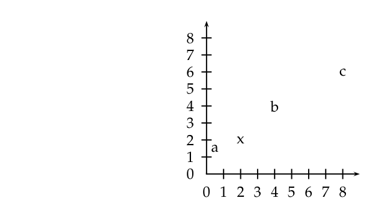
**图 14.14** 欧几里得距离、点积相似度和余弦相似度之间差异的示例。向量为 $\vec{a} = (0.5\ 1.5)^T$，$\vec{x} = (2\ 2)^T$，$\vec{b} = (4\ 4)^T$，以及 $\vec{c} = (8\ 6)^T$。
图中文字：a, x, b, c, 0, 1, 2, 3, 4, 5, 6, 7, 8

Rocchio 分类和 kNN 分类的软件包之一，例如 Bow 工具包 (McCallum 1996)。

**练习 14.8**
下载 20 Newsgroups（第 154 页），并为其 20 个类别训练和测试 Rocchio 和 kNN 分类器。

**练习 14.9**
证明 Rocchio 分类中的决策边界与 kNN 中一样，由 Voronoi 镶嵌（Voronoi tessellation）给出。

**练习 14.10** [*]
对于遍历所有 $M$ 个维度的朴素实现，计算密集质心和稀疏向量之间的距离的时间复杂度为 $\Theta(M)$。基于等式 $\sum(x_i - \mu_i)^2 = 1.0 + \sum \mu_i^2 - 2 \sum x_i \mu_i$ 并假设 $\sum \mu_i^2$ 已经预先计算，写出一个时间复杂度为 $\Theta(M_a)$ 的算法，其中 $M_a$ 是测试文档中不同词项的数量。

**练习 14.11** [***]
证明由具有相同 $k$ 个最近邻的所有点组成的平面区域是一个凸多边形。

**练习 14.12**
设计一个在一维空间中执行高效 1NN 搜索的算法（这里的效率是相对于文档数量 $N$ 而言的）。该算法的时间复杂度是多少？

**练习 14.13** [***]
设计一个在二维空间中执行高效 1NN 搜索的算法，其预处理时间最多为多项式级别（关于 $N$）。

<!-- source: PDF 354; printed: 317 -->

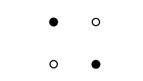
**图 14.15** 一个简单的线性不可分点集。

**习题 14.14** `[***]`
能否沿着你用来解决上一题的思路，为非常大的 $M$ 设计一个精确且高效的 1NN 算法？

**习题 14.15**
证明式（14.4）定义了一个超平面，其中 $\vec{w} = \vec{\mu}(c_1) - \vec{\mu}(c_2)$ 且 $b = 0.5 * (|\vec{\mu}(c_1)|^2 - |\vec{\mu}(c_2)|^2)$。

**习题 14.16**
通过嵌入像图 14.15 所示的线性不可分集，我们可以很容易地在高维空间中构造线性不可分的数据集。考虑将图 14.15 嵌入到 3D 空间中，然后对这 4 个点进行轻微扰动（即，将它们在随机方向上移动一小段距离）。为什么你会预期得到的配置是线性可分的？那么在 $M$ 维空间中，$m \ll M$ 个点组成线性不可分集的可能性有多大？

**习题 14.17**
假设有两个类别，证明对于 $M > 1$，超立方体顶点的线性不可分分配的百分比随着维度 $M$ 的增加而降低。例如，对于 $M = 1$，线性不可分分配的比例为 0；对于 $M = 2$，该比例为 2/16。$M = 2$ 时的两个线性不可分情况之一如图 14.15 所示，另一个是它的镜像。请通过解析方法或模拟方法解答本题。

**习题 14.18**
尽管我们指出了朴素贝叶斯（Naive Bayes）与线性向量空间分类器的相似之处，但在连续向量空间中表示计数向量（NB 中的文档表示）是没有意义的。然而，NB 有一种类似于 Rocchio 的形式化表示。证明 NB 将文档分配给与其 Kullback-Leibler (KL) 散度（第 12.4 节，原书第 251 页）最小的类别（表示为参数向量），其中文档表示为如第 13.4.1 节（原书第 270 页）所述的计数向量，并归一化使其总和为 1。

<!-- source: PDF 355; printed: 318 -->

<!-- 原书此页为空白，仅有重复的版本页脚。 -->

[返回系列目录](../introduction-to-information-retrieval.md) · [上一篇：第 13 章 文本分类与朴素贝叶斯](./13-text-classification-and-naive-bayes.md) · [下一篇：第 15 章 支持向量机与文档机器学习](./15-support-vector-machines-and-machine-learning.md)
