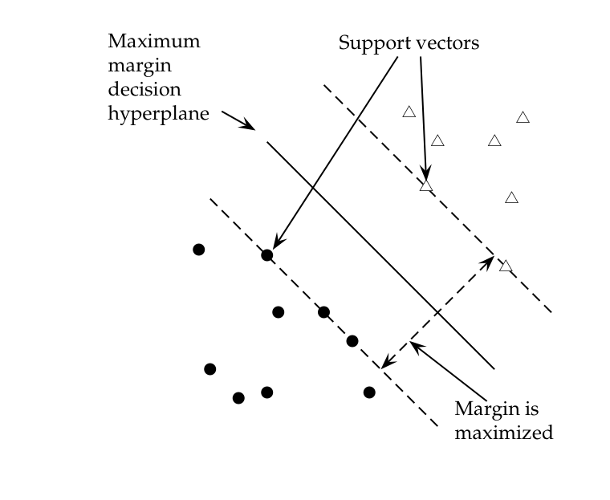
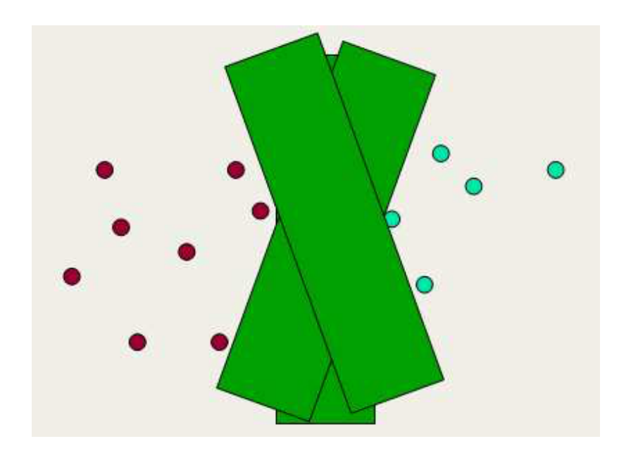
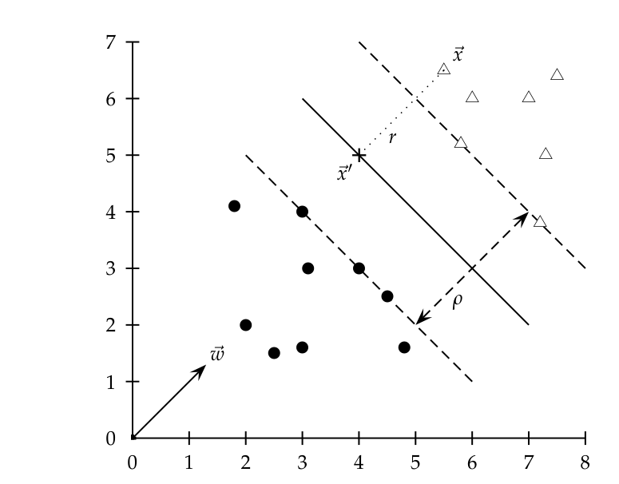
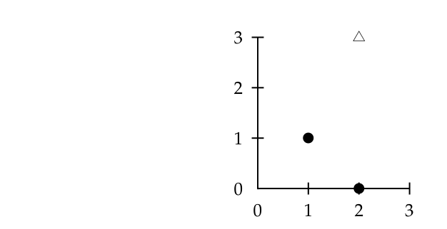
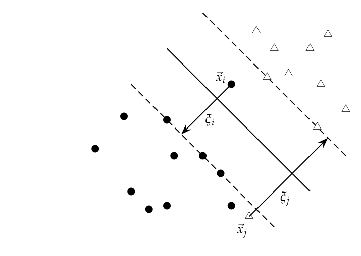
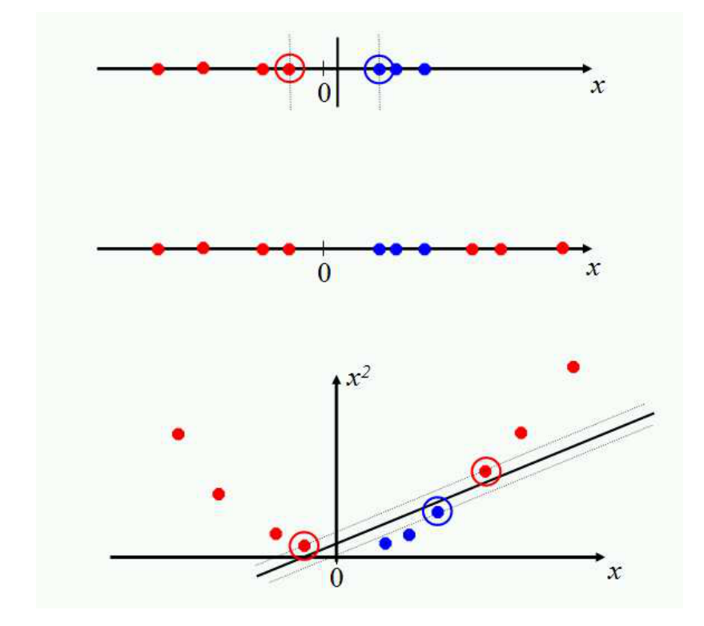
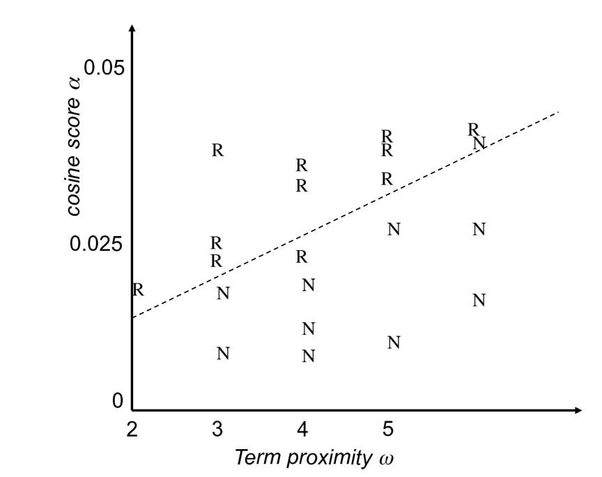

# 第 15 章 支持向量机与文档机器学习

[返回系列目录](../introduction-to-information-retrieval.md) · [上一篇：第 14 章 向量空间分类](./14-vector-space-classification.md) · [下一篇：第 16 章 平面聚类](./16-flat-clustering.md)

原书印刷页 319–348；PDF 第 356–385 页。

<!-- source: PDF 356; printed: 319 -->

在过去的二十年里，提高分类器的有效性一直是机器学习研究的一个密集领域，这项工作催生了新一代最先进的分类器，例如支持向量机（support vector machine）、提升决策树（boosted decision tree）、正则化逻辑回归（regularized logistic regression）、神经网络（neural network）和随机森林（random forest）。其中许多方法，包括本章的主题支持向量机（SVM），已成功应用于信息检索问题，特别是文本分类。SVM 是一种大边缘分类器（large-margin classifier）：它是一种基于向量空间的机器学习方法，其目标是找到两个类别之间的决策边界，该边界距离训练数据中的任何点都尽可能远（可能会将某些点作为异常值或噪声予以忽略）。

我们将首先针对可由线性分类器分离的二类数据集的情况，引出并开发 SVM（第 15.1 节），然后在第 15.2 节中将该模型扩展到不可分数据、多类问题和非线性模型，并对 SVM 的性能进行一些额外的讨论。随后，本章将在第 15.3 节转向探讨文本分类器的实际部署：在什么情况下适合使用哪种分类器，以及如何在分类中利用特定领域的文本特征？最后，我们将探讨如何将我们为文本分类构建的机器学习技术重新应用于学习如何在即席检索（ad hoc retrieval）中对文档进行排序的问题（第 15.4 节）。虽然已有几种机器学习方法应用于此任务，但 SVM 的使用尤为突出。支持向量机不一定比其他机器学习方法更好（除非可能在训练数据很少的情况下），但它们达到了最先进的水平，并且在当前具有很大的理论和经验吸引力。

<!-- source: PDF 357; printed: 320 -->


**图 15.1** 支持向量是紧贴分类器边缘的 5 个点。
图中文字：Maximum margin decision hyperplane 最大边缘决策超平面；Support vectors 支持向量；Margin is maximized 边缘最大化。

## 15.1 支持向量机：线性可分的情况

对于二类可分的训练数据集，例如图 14.8（第 301 页）中的数据集，存在许多可能的线性分离器。直观地说，在两个类别的数​​据项之间的空白区域中间绘制的决策边界似乎比非常接近一个或两个类别的示例的决策边界更好。虽然一些学习方法（如感知机算法，参见第 14.7 节，第 314 页的参考文献）只是找到任意一个线性分离器，但其他方法（如朴素贝叶斯）则根据某种准则寻找最佳的线性分离器。特别是 SVM，它将准则定义为寻找距离任何数据点都尽可能远的决策面。从决策面到最近数据点的这个距离决定了分类器的**边缘**（margin）。这种构造方法必然意味着 SVM 的决策函数完全由定义分离器位置的（通常很小的）数据子集指定。这些点被称为**支持向量**（support vector）（在向量空间中，一个点可以被认为是原点和该点之间的向量）。图 15.1 显示了示例问题的边缘和支持向量。其他数据点在决定所选决策面时不发挥任何作用。

<!-- source: PDF 358; printed: 321 -->


**图 15.2** 大边缘分类的直观理解。坚持大边缘会降低模型的容量：放置较宽决策面的角度范围比决策超平面的角度范围要小（参见图 14.8，第 301 页）。

最大化边缘似乎很好，因为靠近决策面的点代表了非常不确定的分类决策：分类器几乎有 50% 的可能性做出任何一种决定。具有大边缘的分类器不会做出低确定性的分类决策。这为您提供了一个分类安全边缘：测量中的轻微误差或文档的轻微变化不会导致误分类。图 15.2 展示了激发 SVM 的另一种直观理解。通过构造，SVM 分类器坚持在决策边界周围留有较大的边缘。与决策超平面相比，如果您必须在类别之间放置一个较宽的分离器，那么您可以放置它的位置选择就会变少。因此，模型的记忆容量降低了，因此我们期望它正确泛化到测试数据的能力得到提高（参见第 14 章第 312 页关于偏差-方差权衡的讨论）。

让我们用代数形式化 SVM。决策超平面（第 302 页）可以由截距项 $b$ 和垂直于该超平面的决策超平面法向量 $\vec{w}$ 来定义。这个向量通常

<!-- source: PDF 359; printed: 322 -->

在机器学习文献中被称为**权重向量**（weight vector）。为了在所有垂直于法向量的超平面中进行选择，我们指定截距项 $b$。因为超平面垂直于法向量，所以超平面上的所有点 $\vec{x}$ 都满足 $\vec{w}^T\vec{x} = -b$。现在假设我们有一组训练数据点 $\mathbb{D} = \{(\vec{x}_i, y_i)\}$，其中每个成员都是一个点 $\vec{x}_i$ 和与其对应的类标签 $y_i$ 组成的对。<sup>[1]</sup> 对于 SVM，两个数据类别始终命名为 $+1$ 和 $-1$（而不是 $1$ 和 $0$），并且截距项始终显式表示为 $b$（而不是通过添加一个始终开启的额外特征将其折叠到权重向量 $\vec{w}$ 中）。如果以这种方式处理，数学运算会清晰得多，正如我们将几乎立即在函数边缘的定义中看到的那样。那么线性分类器为：

$$ f(\vec{x}) = \operatorname{sign}(\vec{w}^T\vec{x} + b) \tag{15.1} $$

值为 $-1$ 表示一个类别，值为 $+1$ 表示另一个类别。

如果一个点远离决策边界，我们对其分类就很有信心。对于给定的数据集和决策超平面，我们将第 $i$ 个示例 $\vec{x}_i$ 相对于超平面 $\langle\vec{w}, b\rangle$ 的**函数边缘**（functional margin）定义为 $y_i(\vec{w}^T\vec{x}_i + b)$。那么，数据集相对于决策面的函数边缘就是数据集中具有最小函数边缘的任何点的函数边缘的两倍（系数 2 来自于测量整个边缘的宽度，如图 15.3 所示）。然而，直接使用这个定义存在一个问题：该值是欠约束的，因为我们总是可以通过简单地放大 $\vec{w}$ 和 $b$ 来使函数边缘变得任意大。例如，如果我们将 $\vec{w}$ 替换为 $5\vec{w}$，将 $b$ 替换为 $5b$，那么函数边缘 $y_i(5\vec{w}^T\vec{x}_i + 5b)$ 就会变成原来的五倍大。这表明我们需要对 $\vec{w}$ 向量的大小施加一些约束。为了了解如何做到这一点，让我们看看实际的几何形状。

从点 $\vec{x}$ 到决策边界的欧几里得距离是多少？在图 15.3 中，我们用 $r$ 表示这个距离。我们知道点和超平面之间的最短距离垂直于该平面，因此平行于 $\vec{w}$。这个方向上的单位向量是 $\vec{w}/|\vec{w}|$。图中的虚线就是向量 $r\vec{w}/|\vec{w}|$ 的平移。我们将超平面上最接近 $\vec{x}$ 的点标记为 $\vec{x}'$。那么：

$$ \vec{x}' = \vec{x} - yr \frac{\vec{w}}{|\vec{w}|} \tag{15.2} $$

其中乘以 $y$ 只是为了改变 $\vec{x}$ 位于决策面两侧这两种情况的符号。此外，$\vec{x}'$ 位于决策边界上

> **脚注 1（原书第 322 页）**：正如第 14.1 节（第 291 页）所讨论的，我们展示了向量空间中点的普遍情况，但如果这些点是长度归一化的文档向量，那么所有的活动都发生在单位球面的表面上，并且决策面与球面相交。

<!-- source: PDF 360; printed: 323 -->



**图 15.3** 一个点（$r$）的几何间隔与决策边界（$\rho$）。

图中文字：$\vec{x}$, $\vec{x}'$, $r$, $\rho$, $\vec{w}$

因此满足 $\vec{w}^T\vec{x}' + b = 0$。因此：

$$ \vec{w}^T (\vec{x} - y r \frac{\vec{w}}{|\vec{w}|}) + b = 0 \tag{15.3} $$

求解 $r$ 得到：<sup>[2]</sup>

$$ r = y \frac{\vec{w}^T\vec{x} + b}{|\vec{w}|} \tag{15.4} $$

同样，最靠近分离超平面的点是支持向量。分类器的**几何间隔**（geometric margin）是可以划分两类支持向量的带状区域的最大宽度。也就是说，它是式（15.4）中给出的数据点 $r$ 的最小值的两倍，或者等价地，是图 15.2 中所示的胖分隔面的最大宽度。几何间隔显然对参数的缩放具有不变性：如果我们将 $\vec{w}$ 替换为 $5\vec{w}$，将 $b$ 替换为 $5b$，那么几何间隔是相同的，因为它本质上被 $\vec{w}$ 的长度归一化了。这意味着我们可以对 $\vec{w}$ 施加任何我们想要的缩放约束，而不会影响几何间隔。在其他选择中，我们可以像第 6 章那样使用单位向量，通过

> **脚注 2（原书第 323 页）**：回想一下 $|\vec{w}| = \sqrt{\vec{w}^T\vec{w}}$。

<!-- source: PDF 361; printed: 324 -->

要求 $|\vec{w}| = 1$。这将产生使几何间隔与函数间隔相同的效果。

由于我们可以随意缩放函数间隔，为了方便求解大型支持向量机（SVM），我们选择要求所有数据点的函数间隔至少为 1，并且至少对于一个数据向量等于 1。也就是说，对于数据中的所有项：

$$ y_i(\vec{w}^T\vec{x}_i + b) \ge 1 \tag{15.5} $$

并且存在使该不等式取等号的支持向量。由于每个样本到超平面的距离为 $r_i = y_i(\vec{w}^T\vec{x}_i + b)/|\vec{w}|$，几何间隔为 $\rho = 2/|\vec{w}|$。我们的目标仍然是最大化这个几何间隔。也就是说，我们希望找到 $\vec{w}$ 和 $b$，使得：

* $\rho = 2/|\vec{w}|$ 最大化
* 对于所有 $(\vec{x}_i, y_i) \in \mathbb{D}$，$y_i(\vec{w}^T\vec{x}_i + b) \ge 1$

最大化 $2/|\vec{w}|$ 等同于最小化 $|\vec{w}|/2$。这给出了 SVM 作为最小化问题的最终标准形式：

$$ \text{找到 } \vec{w} \text{ 和 } b \text{ 使得：} \tag{15.6} $$

* $\frac{1}{2}\vec{w}^T\vec{w}$ 最小化，并且
* 对于所有 $\{(\vec{x}_i, y_i)\}$，$y_i(\vec{w}^T\vec{x}_i + b) \ge 1$

我们现在是在线性约束下优化一个二次函数。**二次优化**（Quadratic optimization）问题是一类标准且众所周知的数学优化问题，存在许多算法可以求解它们。原则上，我们可以使用标准的二次规划（QP）库来构建我们的 SVM，但最近该领域有大量研究旨在利用 SVM 产生的这类 QP 的结构。因此，现在有更复杂但速度更快、可扩展性更强的库专门用于构建 SVM，几乎所有人都在使用这些库来构建模型。我们在此不介绍此类算法的细节。

然而，了解此类优化问题解的形式将有助于理解后续内容。该解涉及构建一个对偶问题，其中拉格朗日乘子（Lagrange multiplier）$\alpha_i$ 与原问题中的每个约束 $y_i(\vec{w}^T\vec{x}_i + b) \ge 1$ 相关联：

$$ \text{找到 } \alpha_1, \dots \alpha_N \text{ 使得 } \sum \alpha_i - \frac{1}{2} \sum_i \sum_j \alpha_i \alpha_j y_i y_j \vec{x}_i^T \vec{x}_j \text{ 最大化，并且} \tag{15.7} $$

* $\sum_i \alpha_i y_i = 0$
* 对于所有 $1 \le i \le N$，$\alpha_i \ge 0$

那么解的形式为：

<!-- source: PDF 362; printed: 325 -->



**图 15.4** 一个用于 SVM 的包含 3 个数据点的微型训练集。

$$ \begin{aligned} \vec{w} &= \sum \alpha_i y_i \vec{x}_i \\ b &= y_k - \vec{w}^T \vec{x}_k \text{ 对于任意满足 } \alpha_k \neq 0 \text{ 的 } \vec{x}_k \end{aligned} \tag{15.8} $$

在解中，大多数 $\alpha_i$ 为零。每个非零的 $\alpha_i$ 表明对应的 $\vec{x}_i$ 是一个支持向量。分类函数则为：

$$ f(\vec{x}) = \operatorname{sign}(\sum_i \alpha_i y_i \vec{x}_i^T \vec{x} + b) \tag{15.9} $$

对偶问题中要最大化的项和分类函数都涉及点对（$\vec{x}$ 和 $\vec{x}_i$，或 $\vec{x}_i$ 和 $\vec{x}_j$）之间的**点积**（dot product），这也是使用数据的唯一方式——我们稍后将回到这一特性的重要意义上。

简而言之，我们从一个训练数据集开始。该数据集唯一地定义了最佳分离超平面，我们将数据输入二次优化程序以找到该平面。给定一个要分类的新点 $\vec{x}$，式（15.1）或式（15.9）中的分类函数 $f(\vec{x})$ 正在计算该点在超平面法向量上的投影。该函数的符号决定了分配给该点的类别。如果该点在分类器的间隔内（或者在我们可能为了最小化分类错误而确定的另一个置信度阈值 $t$ 内），那么分类器可以返回“不知道”（don't know），而不是两个类别之一。$f(\vec{x})$ 的值也可以转换为分类概率；拟合一个 sigmoid 函数来转换这些值是标准做法（Platt 2000）。此外，由于间隔是恒定的，如果模型包含来自不同来源的维度，可能需要对某些维度进行仔细的重新缩放。然而，如果我们的文档（点）位于单位超球面上，这就不是问题。

**例 15.1**：考虑在图 15.4 所示的（非常小的）数据集上构建 SVM。从几何角度来看，对于这样的例子，最大间隔权重向量将平行于连接两类点的最短线段，即 (1, 1) 和 (2, 3) 之间的连线，从而得到权重向量 (1, 2)。最优决策面与该线段正交，并在中点处与其相交。

<!-- source: PDF 363; printed: 326 -->

因此，它穿过 (1.5, 2)。所以，SVM 决策边界为：

$$ y = x_1 + 2x_2 - 5.5 $$

从代数角度来看，在标准约束 $y_i(\vec{w}^T\vec{x}_i + b) \ge 1$ 下，我们寻求最小化 $|\vec{w}|$。当两个支持向量以等式满足该约束时，就会出现这种情况。此外，我们知道解的形式为 $\vec{w} = (a, 2a)$（对于某个 $a$）。因此我们有：

$$ \begin{aligned} a + 2a + b &= -1 \\ 2a + 6a + b &= 1 \end{aligned} $$

因此，$a = 2/5$ 且 $b = -11/5$。所以最优超平面由 $\vec{w} = (2/5, 4/5)$ 和 $b = -11/5$ 给出。

间隔 $\rho$ 为 $2/|\vec{w}| = 2/\sqrt{4/25 + 16/25} = 2/(2\sqrt{5}/5) = \sqrt{5}$。这个答案可以通过检查图 15.4 在几何上得到证实。

**习题 15.1** [⋆]
对于一个数据集（包含每个类的实例），支持向量的最小数量是多少？

**习题 15.2** [⋆⋆]
能够在 SVM 中使用核函数（见第 15.2.3 节）的基础是分类函数可以写成式（15.9）的形式（其中，对于大型问题，大多数 $\alpha_i$ 为 0）。明确展示对于例 15.1 中的数据集，分类函数如何写成这种形式。也就是说，将 $f$ 写成一个包含数据点且唯一变量是 $\vec{x}$ 的函数。

**习题 15.3** [⋆⋆]
安装一个 SVM 软件包，例如 SVMlight（http://svmlight.joachims.org/），并为例 15.1 中讨论的数据集构建一个 SVM。确认该程序给出的解与正文相同。对于 SVMlight 或其他接受相同训练数据格式的软件包，训练文件将是：

```text
+1 1:2 2:3
-1 1:2 2:0
-1 1:1 2:1
```

SVMlight 的训练命令则是：

```text
svm_learn -c 1 -a alphas.dat train.dat model.dat
```

需要使用 `-c 1` 选项来关闭我们在第 15.2.1 节中讨论的松弛变量的使用。检查权重向量的范数是否与我们在例 15.1 中发现的一致。检查包含 $\alpha_i$ 值的 `alphas.dat` 文件，并确认它们与你在习题 15.2 中的答案一致。

<!-- source: PDF 364; printed: 327 -->



**图 15.5** 带有松弛变量的大间隔分类。

图中文字：$\vec{x}_i$, $\xi_i$, $\vec{x}_j$, $\xi_j$

## 15.2 SVM 模型的扩展

### 15.2.1 软间隔分类

对于文本分类中常见的高维问题，有时数据是线性可分的。但在一般情况下并非如此，而且即使它们是线性可分的，我们也可能更倾向于一种能更好地将大部分数据分开，同时忽略少数奇怪的噪声文档的解决方案。

如果训练集 $\mathbb{D}$ 不是线性可分的，标准的方法是允许较宽的决策间隔犯一些错误（一些点——异常值或噪声样本——位于间隔内部或间隔的错误一侧）。然后，我们为每个错误分类的样本付出代价，该代价取决于它偏离公式（15.5）中给出的间隔要求的程度。为了实现这一点，我们引入**松弛变量（slack variables）** $\xi_i$。$\xi_i$ 的非零值允许 $\vec{x}_i$ 不满足间隔要求，其代价与 $\xi_i$ 的值成正比。参见图 15.5。

带有松弛变量的 SVM 优化问题的形式化表述为：

$$ \text{寻找 } \vec{w}, b, \text{ 以及 } \xi_i \ge 0 \text{ 使得：} \tag{15.10} $$

* $\frac{1}{2}\vec{w}^T\vec{w} + C \sum_i \xi_i$ 最小化
* 并且对于所有 $\{(\vec{x}_i, y_i)\}$，满足 $y_i(\vec{w}^T\vec{x}_i + b) \ge 1 - \xi_i$

<!-- source: PDF 365; printed: 328 -->

此时，优化问题就是在能够使间隔多宽与必须移动多少个点以允许该间隔之间进行权衡。

通过设置 $\xi_i > 0$，点 $\vec{x}_i$ 的间隔可以小于 1，但在最小化过程中，这样做需要付出 $C\xi_i$ 的惩罚代价。$\xi_i$ 的总和给出了训练错误数量的上限。软间隔（Soft-margin）SVM 在最小化训练错误与间隔之间进行权衡。参数 $C$ 是一个**正则化（regularization）**项，它提供了一种控制过拟合的方法：当 $C$ 变大时，以减小几何间隔为代价来不尊重数据变得没有吸引力；当 $C$ 较小时，很容易通过使用松弛变量来解释某些数据点，并放置一个较宽的间隔，从而对大部分数据进行建模。

软间隔分类的对偶问题变为：

$$ \text{寻找 } \alpha_1, \ldots \alpha_N \text{ 使得 } \sum \alpha_i - \frac{1}{2} \sum_i \sum_j \alpha_i \alpha_j y_i y_j \vec{x}_i^T \vec{x}_j \text{ 最大化，并且} \tag{15.11} $$

* $\sum_i \alpha_i y_i = 0$
* $0 \le \alpha_i \le C$ 对于所有 $1 \le i \le N$

松弛变量 $\xi_i$ 及其拉格朗日乘子都没有出现在对偶问题中。我们剩下的只有常数 $C$，它限制了支持向量数据点的拉格朗日乘子的可能大小。和以前一样，具有非零 $\alpha_i$ 的 $\vec{x}_i$ 将是支持向量。对偶问题的解的形式为：

$$ \begin{aligned} \vec{w} &= \sum \alpha_i y_i \vec{x}_i \\ b &= y_k(1 - \xi_k) - \vec{w}^T \vec{x}_k \text{ 对于 } k = \arg \max_k \alpha_k \end{aligned} \tag{15.12} $$

同样，分类时不需要显式地求出 $\vec{w}$，分类可以通过与数据点的点积来完成，如公式（15.9）所示。

通常，支持向量只占训练数据的一小部分。然而，如果问题是不可分的或间隔很小，那么每个被错误分类或位于间隔内的数据点都将具有非零的 $\alpha_i$。如果这个点集变得很大，那么对于我们在第 15.2.3 节中将要讨论的非线性情况，这可能会导致在测试时使用 SVM 的速度大幅下降。

线性 SVM 的训练和测试复杂度如表 15.1 所示。<sup>[3]</sup> 训练 SVM 的时间主要取决于求解底层二次规划（QP）的时间，因此理论和经验复杂度因求解方法的不同而异。求解 QP 的标准结果是，它需要的时间与数据集大小成立方关系（Kozlov et al. 1979）。最近所有关于 SVM 训练的工作都在致力于降低这种复杂度，通常是通过

> **脚注 3（原书第 328 页）**：我们将 $\Theta(|\mathbb{D}|L_{\text{ave}})$ 写为 $\Theta(T)$（第 262 页），并假设测试文档的长度是有界的，正如我们在第 262 页所做的那样。

<!-- source: PDF 366; printed: 329 -->

| Classifier | Mode | Method | Time complexity |
|---|---|---|---|
| NB | training | | $\Theta(\vert \mathbb{D}\vert L_{\text{ave}} + \vert \mathbb{C}\vert \vert V\vert )$ |
| NB | testing | | $\Theta(\vert \mathbb{C}\vert M_a)$ |
| Rocchio | training | | $\Theta(\vert \mathbb{D}\vert L_{\text{ave}} + \vert \mathbb{C}\vert \vert V\vert )$ |
| Rocchio | testing | | $\Theta(\vert \mathbb{C}\vert M_a)$ |
| kNN | training | preprocessing | $\Theta(\vert \mathbb{D}\vert L_{\text{ave}})$ |
| kNN | testing | preprocessing | $\Theta(\vert \mathbb{D}\vert M_{\text{ave}}M_a)$ |
| kNN | training | no preprocessing | $\Theta(1)$ |
| kNN | testing | no preprocessing | $\Theta(\vert \mathbb{D}\vert L_{\text{ave}}M_a)$ |
| SVM | training | conventional | $O(\vert \mathbb{C}\vert \vert \mathbb{D}\vert ^3M_{\text{ave}})$;<br>经验上 $\approx O(\vert \mathbb{C}\vert \vert \mathbb{D}\vert ^{1.7}M_{\text{ave}})$ |
| SVM | training | cutting planes | $O(\vert \mathbb{C}\vert \vert \mathbb{D}\vert M_{\text{ave}})$ |
| SVM | testing | | $O(\vert \mathbb{C}\vert M_a)$ |

**表 15.1** 包括 SVM 在内的各种分类器的训练和测试复杂度。训练是学习方法在 $\mathbb{D}$ 上学习分类器所需的时间，而测试是分类器对一篇文档进行分类所需的时间。对于 SVM，假设多类分类由一组 $|\mathbb{C}|$ 个一对多（one-versus-rest）分类器完成。$L_{\text{ave}}$ 是每篇文档的平均词元（token）数，而 $M_{\text{ave}}$ 是一篇文档的平均词汇表大小（非零特征的数量）。$L_a$ 和 $M_a$ 分别是测试文档中的词元数和词型（type）数。

---

满足于近似解。通常，经验复杂度约为 $O(|\mathbb{D}|^{1.7})$（Joachims 2006a）。尽管如此，传统 SVM 算法的超线性训练时间使得它们很难或不可能用于非常大的训练数据集。在训练样本数量上呈线性的替代传统 SVM 求解算法，在特征数量很大时扩展性很差，而特征数量大正是文本问题的另一个标准属性。然而，一种基于割平面（cutting plane）技术的新训练算法为这个问题提供了一个有希望的答案，其运行时间在训练样本数量和样本中非零特征数量上都是线性的（Joachims 2006a）。尽管如此，进行二次优化的实际速度仍然比像朴素贝叶斯（Naive Bayes）模型中那样简单地计算词项要慢得多。正如在下一节中那样，将 SVM 算法扩展到非线性 SVM，通常会使训练复杂度增加 $|\mathbb{D}|$ 倍（因为需要计算样本之间的点积），从而使其变得不切实际。在实践中，通常更经济的做法是物化（materialize）

<!-- source: PDF 367; printed: 330 -->

高阶特征并训练一个线性 SVM。<sup>[4]</sup>

### 15.2.2 多类 SVM

SVM 本质上是二类分类器。使用 SVM 进行多类分类的传统方法是使用第 14.5 节（第 306 页）中讨论的方法之一。特别地，实践中最常见的技术是构建 $|\mathbb{C}|$ 个一对多（one-versus-rest）分类器（通常称为“一对所有”或 OVA 分类），并选择以最大间隔对测试数据进行分类的类别。另一种策略是构建一组一对一（one-versus-one）分类器，并选择被最多分类器选中的类别。虽然这涉及构建 $|\mathbb{C}|(|\mathbb{C}| - 1)/2$ 个分类器，但训练分类器的时间实际上可能会减少，因为每个分类器的训练数据集要小得多。

然而，这些并不是解决多类问题的非常优雅的方法。构建多类 SVM 提供了一种更好的替代方案，我们在由输入特征和数据类别组成的对所导出的特征向量 $\Phi(\vec{x}, y)$ 上构建一个二类分类器。在测试时，分类器选择类别 $y = \arg \max_{y'} \vec{w}^T \Phi(\vec{x}, y')$。训练期间的间隔是正确类别的该值与最近的其他类别的该值之间的差距，因此二次规划公式将要求 $\forall i\ \forall y \neq y_i\ \vec{w}^T \Phi(\vec{x}_i, y_i) - \vec{w}^T \Phi(\vec{x}_i, y) \ge 1 - \xi_i$。这种通用方法可以扩展为各种线性分类器提供多类公式。它也是分类泛化的一个简单实例，其中类别不仅仅是一组独立的分类标签，还可以是定义了相互关系的任意结构化对象。在 SVM 领域，此类工作属于**结构化支持向量机（structural SVMs）**的范畴。我们将在第 15.4.2 节再次提及它们。

### 15.2.3 非线性 SVM

通过我们目前所介绍的内容，线性可分的数据集（可能有一些例外或一些噪声）得到了很好的处理。但是，如果数据集根本不允许通过线性分类器进行分类，我们该怎么办？让我们看一个一维的例子。图 15.6 顶部的数据集可以直接由线性分类器分类，但中间的数据集则不行。相反，我们需要能够挑出一个区间。解决这个问题的一种方法是将数据映射到更高维的空间，然后在更高维的空间中使用线性分类器。例如，该图的底部显示，线性分离器可以很容易地对数据进行分类

> **脚注 4（原书第 330 页）**：物化特征是指直接计算高阶项和交互项，然后将它们放入线性模型中。

<!-- source: PDF 368; printed: 331 -->

如果我们使用二次函数将数据映射到二维空间（极坐标投影是另一种可能）。其基本思想是将原始特征空间映射到某个更高维的特征空间，在该空间中训练集是可分的。当然，我们希望以保留数据点之间相关性的相关维度的方式来执行此操作，以便生成的分类器仍然具有良好的泛化能力。

SVM 以及许多其他线性分类器提供了一种简单有效的方法来进行这种向高维空间的映射，这被称为**核技巧**（kernel trick）。它实际上并不是一个技巧：它只是利用了我们已经见过的数学知识。SVM 线性分类器依赖于数据点向量之间的点积。令 $K(\vec{x}_i, \vec{x}_j) = \vec{x}_i^T \vec{x}_j$。那么我们目前看到的分类器


**图 15.6** 将线性不可分的数据投影到更高维的空间可以使其变得线性可分。
图中文字：$x$, $x^2$, $0$

<!-- source: PDF 369; printed: 332 -->

为：

$$ f(\vec{x}) = \operatorname{sign}\left(\sum_i \alpha_i y_i K(\vec{x}_i, \vec{x}) + b\right) \tag{15.13} $$

现在假设我们决定通过某种变换 $\Phi: \vec{x} \mapsto \phi(\vec{x})$ 将每个数据点映射到一个更高维的空间。那么点积变为 $\phi(\vec{x}_i)^T \phi(\vec{x}_j)$。如果事实证明这个点积（它只是一个实数）可以根据原始数据点简单有效地计算出来，那么我们就不必实际进行从 $\vec{x} \mapsto \phi(\vec{x})$ 的映射。相反，我们可以简单地计算 $K(\vec{x}_i, \vec{x}_j) = \phi(\vec{x}_i)^T \phi(\vec{x}_j)$ 的值，然后使用式（15.13）中的函数值。**核函数**（kernel function） $K$ 就是这样一个对应于某个扩展特征空间中点积的函数。

**例 15.2：二维空间中的二次核。** 对于二维向量 $\vec{u} = (u_1 \quad u_2)^T$，$\vec{v} = (v_1 \quad v_2)^T$，考虑 $K(\vec{u}, \vec{v}) = (1 + \vec{u}^T \vec{v})^2$。我们希望证明这是一个核，即对于某个 $\phi$，有 $K(\vec{u}, \vec{v}) = \phi(\vec{u})^T \phi(\vec{v})$。考虑 $\phi(\vec{u}) = (1 \quad u_1^2 \quad \sqrt{2}u_1u_2 \quad u_2^2 \quad \sqrt{2}u_1 \quad \sqrt{2}u_2)^T$。那么：

$$ 
\begin{align}
K(\vec{u}, \vec{v}) &= (1 + \vec{u}^T \vec{v})^2 \tag{15.14} \\
&= 1 + u_1^2 v_1^2 + 2u_1 v_1 u_2 v_2 + u_2^2 v_2^2 + 2u_1 v_1 + 2u_2 v_2 \nonumber \\
&= (1 \quad u_1^2 \quad \sqrt{2}u_1u_2 \quad u_2^2 \quad \sqrt{2}u_1 \quad \sqrt{2}u_2)^T (1 \quad v_1^2 \quad \sqrt{2}v_1v_2 \quad v_2^2 \quad \sqrt{2}v_1 \quad \sqrt{2}v_2) \nonumber \\
&= \phi(\vec{u})^T \phi(\vec{v}) \nonumber
\end{align}
$$

用泛函分析的语言来说，什么样的函数是有效的核函数？核函数有时更准确地被称为 **Mercer 核**（Mercer kernels），因为它们必须满足 Mercer 条件：对于任何使得 $\int g(\vec{x})^2 d\vec{x}$ 为有限值的 $g(\vec{x})$，我们必须有：

$$ \int K(\vec{x}, \vec{z}) g(\vec{x}) g(\vec{z}) d\vec{x} d\vec{z} \ge 0 . \tag{15.15} $$

核函数 $K$ 必须是连续的、对称的，并且具有正定的 Gram 矩阵。这样的 $K$ 意味着存在一个到再生核希尔伯特空间（希尔伯特空间是一个在点积下封闭的向量空间）的映射，使得那里的点积给出的值与函数 $K$ 的值相同。如果一个核不满足 Mercer 条件，那么相应的二次规划（QP）问题可能没有解。如果你想更好地理解这些问题，你应该查阅第 15.5 节中提到的关于 SVM 的书籍。否则，你只需知道 90% 的核函数工作都使用下面定义的两个简单的双向量函数族之一即可，它们定义了有效的核。

两个常用的核函数族是多项式核（polynomial kernels）和径向基函数（radial basis functions）。多项式核的形式为 $K(\vec{x}, \vec{z}) = (1 +$

<!-- source: PDF 370; printed: 333 -->

$\vec{x}^T \vec{z})^d$。$d = 1$ 的情况是线性核，这就是我们在本节开始之前所使用的（常数 1 只是改变了阈值）。$d = 2$ 的情况给出了二次核，并且非常常用。我们在例 15.2 中说明了二次核。

径向基函数最常见的形式是高斯分布，计算公式为：

$$ K(\vec{x}, \vec{z}) = e^{-(\vec{x} - \vec{z})^2 / (2\sigma^2)} \tag{15.16} $$

径向基函数（rbf）等效于将数据映射到无限维的希尔伯特空间，因此我们不能像说明二次核那样具体地说明径向基函数。除了这两个函数族之外，还有一些开发其他核的有趣工作，其中一些在文本应用中很有前景。特别是，已经有对字符串核（string kernels）的研究（见第 15.5 节）。

SVM 领域有其自己的语言，这与机器学习中使用的其他语言有很大不同。这些术语确实在数学中有很深的根源，但重要的是不要被这些术语吓倒。实际上，我们讨论的是一些非常简单的事情。多项式核允许我们对特征的合取（最高到多项式的阶数）进行建模。也就是说，如果我们希望能够对词对的出现进行建模，这些词对提供了关于主题分类的独特信息，而这些信息是单个词本身无法提供的，比如 `operating AND system` 或 `ethnic AND cleansing`，那么我们需要使用二次核。如果三个词的组合出现提供了独特的信息，那么我们需要使用三次核。同时，你也会得到基本特征的幂——对于大多数文本应用来说，这可能没有用，但它只是伴随着数学运算而来，希望不会造成损害。径向基函数允许你拥有挑选出圆（超球体）的特征——尽管随着多个此类特征的相互作用，决策边界会变得复杂得多。字符串核让你拥有作为词项字符子序列的特征。所有这些都是直观的概念，它们也以不同的名称在许多其他地方被使用过。

### 15.2.4 实验结果

我们在第 13.6 节中展示的结果表明，SVM 是一种非常有效的文本分类器。表 13.9 中给出的 Dumais 等人（1998）的结果表明，SVM 的表现明显最好。这是当时确立 SVM 在文本分类领域强大声誉的几项工作之一。另一项关于扩展和评估用于文本分类的 SVM 的开创性工作是 (Joachims 1998)。我们在表 15.2 中展示了他的一些结果

<!-- source: PDF 371; printed: 334 -->

| | NB | Rocchio | Dec. Trees | kNN | linear SVM <br> $C=0.5$ | linear SVM <br> $C=1.0$ | rbf-SVM <br> $\sigma \approx 7$ |
|---|---|---|---|---|---|---|---|
| earn | 96.0 | 96.1 | 96.1 | 97.8 | 98.0 | 98.2 | 98.1 |
| acq | 90.7 | 92.1 | 85.3 | 91.8 | 95.5 | 95.6 | 94.7 |
| money-fx | 59.6 | 67.6 | 69.4 | 75.4 | 78.8 | 78.5 | 74.3 |
| grain | 69.8 | 79.5 | 89.1 | 82.6 | 91.9 | 93.1 | 93.4 |
| crude | 81.2 | 81.5 | 75.5 | 85.8 | 89.4 | 89.4 | 88.7 |
| trade | 52.2 | 77.4 | 59.2 | 77.9 | 79.2 | 79.2 | 76.6 |
| interest | 57.6 | 72.5 | 49.1 | 76.7 | 75.6 | 74.8 | 69.1 |
| ship | 80.9 | 83.1 | 80.9 | 79.8 | 87.4 | 86.5 | 85.8 |
| wheat | 63.4 | 79.4 | 85.5 | 72.9 | 86.6 | 86.8 | 82.4 |
| corn | 45.2 | 62.2 | 87.7 | 71.4 | 87.5 | 87.8 | 84.6 |
| microavg. | 72.3 | 79.9 | 79.4 | 82.6 | 86.7 | 87.5 | 86.4 |

**表 15.2** 来自 (Joachims 2002a, p. 114) 的 SVM 分类器查准率-召回率平衡 $F_1$ 值。展示了 Reuters-21578 数据集上 10 个最大类别的结果以及所有 90 个类别的微平均性能。

（接上页）来自 (Joachims 2002a) 的结果。<sup>[5]</sup> Joachims 使用了大量的词项特征，而 Dumais 等人（1998）则使用互信息（MI）特征选择（第 13.5.1 节，第 272 页）来构建特征数量有限得多的分类器。线性 SVM 的成功反映了第 14.6 节（第 308 页）中讨论的关于朴素贝叶斯等其他线性方法的结果。看来，使用简单的词项特征就能取得很大的进展。再次值得注意的是，不同论文对相同机器学习方法的结果差异程度。特别是，根据其他研究人员的复现，(Joachims 1998) 的朴素贝叶斯结果显得太弱，而表 13.9 中的结果应被视为具有代表性。

## 15.3 文本分类中的问题

文本分类在商业领域有许多应用；电子邮件垃圾邮件过滤可能是目前最普遍的。Jackson 和 Moulinier (2002) 写道：“毫无疑问，能够根据内容自动对文档进行分类具有商业价值。有着无数的

> **脚注 5（原书第 334 页）**：这些结果是根据查准率-召回率平衡 $F_1$ 值（见第 8.4 节）得出的。许多研究人员不倾向于将此指标用于文本分类评估，因为它的计算可能涉及插值，而不是系统的实际参数设置，并且不清楚为什么要报告此值，而不是最大 $F_1$ 值或由当前任务驱动的查准率/召回率曲线上的另一个点。虽然 (Joachims 1998) 中的早期结果表明，使用高阶多项式或 rbf 核在此任务上取得了显著的收益，但这是在使用硬间隔 SVM 的情况下。对于软间隔 SVM，使用默认值 $C = 1$ 的简单线性 SVM 表现最好。

<!-- source: PDF 372; printed: 335 -->

这种能力在企业内联网、政府部门和互联网出版商中的潜在应用。”

我们对分类的大部分讨论都集中在介绍各种机器学习方法上，而不是讨论与分类相关的文本文档的特定特征。这种偏向对于教科书来说是合适的，但对于应用程序开发者来说却是不恰当的。通常情况下，利用特定领域的文本特征比从一种机器学习方法切换到另一种方法能获得更大的性能提升。Jackson and Moulinier (2002) 指出：“理解数据是成功分类的关键之一，然而这正是大多数分类工具供应商极其薄弱的领域。市场上许多‘一刀切’的工具并没有在广泛的内容类型上进行过测试。”在本节中，我们希望稍微退后一步，考虑文本分类的应用、可能的解决方案空间以及特定应用启发式方法的效用。

### 15.3.1 选择使用哪种分类器

当面临构建文本分类器的需求时，首先要问的问题是：目前有多少可用的训练数据？没有？很少？相当多？还是数量巨大且每天都在增长？通常，在实际应用中部署机器学习分类器时，最大的实际挑战之一是创建或获取足够的训练数据。对于许多问题和算法，每个类别需要成百上千个示例才能产生高性能的分类器，而且许多现实环境涉及大量的类别集。我们首先假设需要尽快得到分类器；如果有大量时间可用于实现，那么大部分时间可能会花在收集数据资源上。

如果你没有带标签的训练数据，特别是如果有熟悉数据领域的现有员工，那么你永远不应忘记使用手工编写规则的解决方案。也就是说，你编写常设查询，正如我们在第 13 章开头所提到的。例如：

```text
IF (wheat OR grain) AND NOT (whole OR bread) THEN c = grain
（如果包含 wheat 或 grain，且不包含 whole 或 bread，则类别 c = grain）
```

在实践中，规则会比这大得多，并且可以使用比单纯的布尔表达式更复杂的查询语言来表达，包括使用数值评分（scores）。通过精心制作（即由人类在开发数据上调整规则），此类规则的准确率（accuracy）可以变得非常高。Jacobs and Rau (1990) 报告称，在识别关于企业收购的文章时，查准率（precision）达到了 92%，召回率（recall）达到了 88.5%；而 Hayes and Weinstein (1990) 报告称，在路透社新闻文档的 675 个类别中，召回率达到了 94%，查准率达到了 84%。尽管如此，创建这样精心调整的规则所需的工作量是非常大的。一个合理的估计是每个类别需要 2 天时间，并且还需要额外的时间来

<!-- source: PDF 373; printed: 336 -->

进行规则的维护，因为类别中文档的内容会随着时间的推移而发生漂移（参见第 269 页）。

如果你的数据相当少，并且打算训练一个监督分类器，那么机器学习理论表明你应该坚持使用具有高偏差的分类器，正如我们在第 14.6 节（第 308 页）中所讨论的。例如，有理论和经验结果表明，朴素贝叶斯（Naive Bayes）在这种情况下表现良好 (Ng and Jordan 2001, Forman and Cohen 2004)，尽管在实践中对于文本数据的正则化模型不一定能观察到这种效果 (Klein and Manning 2002)。无论如何，像最近邻模型这样偏差非常低的模型可能是禁忌的。不管怎样，模型的质量都会受到有限训练数据的不利影响。

在这里，理论上有趣的答案是尝试应用**半监督学习**（semi-supervised learning）训练方法。这包括诸如自举法（bootstrapping）或 EM 算法等方法，我们将在第 16.5 节（第 368 页）中介绍。在这些方法中，系统获得一些带标签的文档，以及大量未带标签的文档，系统可以尝试在这些未带标签的文档上进行学习。朴素贝叶斯的一大优势是它可以直接扩展为半监督学习算法，但对于支持向量机（SVM），也有被称为**直推式支持向量机**（transductive SVMs）的半监督学习研究。请参阅参考文献以获取指引。

通常，实际的答案是想办法尽快获取更多带标签的数据。最好的方法是将自己置入一个流程中，在这个流程中，人们愿意作为其自然任务的一部分为你标记数据。例如，在许多情况下，人们会为了自己的目的对电子邮件进行分类或路由，而这些操作提供了有关类别的信息。专门为训练分类器的任务寻找人类标注者的替代方案通常很难组织，而且标注质量往往较低，因为这些标签没有嵌入到现实的任务语境中。与其让人类标记所有文档或随机抽样的文档，不如进行**主动学习**（active learning）方面的大量研究，即构建一个系统来决定人类应该标记哪些文档。通常，这些是分类器对正确分类不确定的文档。这可以有效地将标注成本降低 2 到 4 倍，但存在一个问题：用于训练一种类型分类器的好文档，通常不是用于训练另一种类型分类器的好文档。

如果有相当数量的带标签数据，那么你完全可以使用我们介绍过的关于文本分类的所有内容。例如，你可能希望使用支持向量机（SVM）。然而，如果你正在部署一个线性分类器（如 SVM），你可能应该设计一个应用程序，在机器学习分类器之上覆盖一个基于布尔规则的分类器。用户经常喜欢调整那些结果不太正确的东西，如果管理层打来电话，要求立即修复特定文档的分类，那么这要容易得多

<!-- source: PDF 374; printed: 337 -->

通过手工编写规则来实现，而不是想办法在不破坏整体分类准确率的情况下调整 SVM 的权重。这就是为什么像决策树这样能产生用户可解释的类布尔模型的机器学习模型仍然相当受欢迎的原因之一。

如果有海量数据可用，那么分类器的选择可能对你的结果影响不大，而且最佳选择可能并不明确 (参见 Banko and Brill 2001)。最好根据训练的可扩展性甚至运行时的效率来选择分类器。要达到这一点，你需要拥有海量的数据。一般的经验法则是，训练数据量每翻一番，分类器性能就会呈线性增长，但在数据量非常大的情况下，这种改进会变成次线性的。

### 15.3.2 提高分类器性能

对于任何特定的应用，通常有很大的空间可以通过利用特定于领域或文档集（collection）的特征来提高分类器的有效性。文档通常包含对分类特别有用的域（zones）。通常会有特定的子词汇表需要特殊处理以获得最佳的分类效果。

#### 庞大且困难的类别分类体系

如果一个文本分类问题由少量且区分度高的类别组成，那么许多分类算法都可能表现良好。但是，许多实际的分类问题由大量通常非常相似的类别组成。读者可能会想到一些例子，如网络目录（Yahoo! 目录或开放目录项目）、图书馆分类法（杜威十进制或国会图书馆）或法律或医疗应用中使用的分类法。例如，Yahoo! 目录在一个深层层次结构中包含超过 200,000 个类别。在大量密切相关的类别集上进行准确分类本质上是困难的。

大多数大型类别集都具有层次结构，尝试通过进行**层次分类**（hierarchical classification）来利用这种层次结构是一种很有前途的方法。然而，目前与仅仅处理作为层次结构叶子节点的类别相比，这样做所带来的有效性提升仍然有限。<sup>[6]</sup> 但是，该技术对于仅仅提高在大型层次结构上构建分类器的可扩展性非常有用。提高分类器在大型层次结构上可扩展性的另一种简单方法是使用激进的特征选择。我们在第 15.5 节中提供了一些关于层次分类研究的参考文献。

> **脚注 6（原书第 337 页）**：以图 13.1（第 257 页）中的小型层次结构为例，叶子类别是像 poultry（家禽）和 coffee（咖啡）这样的类别，而不是像 industries（工业）这样更高层的类别。

<!-- source: PDF 375; printed: 338 -->

机器学习中的一个普遍结果是，只要多个分类器所犯的错误至少在某种程度上是独立的，你总是可以通过组合多个分类器来获得分类准确率的小幅提升。现在有大量关于投票（voting）、装袋（bagging）和提升（boosting）多个分类器等技术的文献。同样，参考文献中也有一些指引。尽管如此，最终可能需要一种自动/手动混合的解决方案来达到足够的分类准确率。在这种情况下，一种常见的方法是首先运行分类器，并接受其所有高置信度的决策，但将低置信度的决策放入队列中进行人工审查。这样的过程也会自动产生新的训练数据，这些数据可用于未来版本的机器学习分类器。然而，请注意，这是一个典型的例子，由此产生的训练数据显然不是从文档空间中随机抽样的。

#### 文本特征

在特设检索和文本分类中，默认做法是使用词项（terms）作为特征。然而，对于文本分类，通过设计适合特定问题的额外特征，可以获得极大的好处。与信息检索查询语言的情况不同，由于这些特征是分类器内部的，因此不存在向最终用户传达这些特征的问题。这个过程通常被称为**特征工程**（feature engineering）。目前，特征工程仍然是一项人工手艺，而不是由机器学习完成的事情。良好的特征工程通常可以显著提高文本分类器的性能。它在文本分类的一些最重要应用中特别有益，例如垃圾邮件和色情内容过滤。

分类问题通常包含大量可以方便地分组的词项，并且这些词项在文本分类问题中具有相似的投票权重。典型的例子可能是年份的提及或一串感叹号。或者它们可能是更专业的词元（tokens），如 ISBN 或化学公式。通常，直接在分类器中使用它们会大大增加词汇表（vocabulary），而除了知道（例如）存在化学公式之外，并不能提供更多的分类能力。在这种情况下，可以通过使用正则表达式匹配这些项并将它们转换为特定的词元来减少特征数量和特征稀疏性。因此，有效性和分类器速度通常会得到提高。有时所有的数字都被转换为一个单一的特征，但通常通过区分不同种类的数字可以获得一些价值，例如四位数字（通常是年份）与其它基数词与带小数点的实数。类似的技术可以应用于日期、ISBN 号码、体育比赛得分等。

从另一个方向来看，增加特征的数量通常也是有用的——

<!-- source: PDF 376; printed: 339 -->

通过匹配词的部分以及匹配特别具有判别力的选定多词模式来增加特征数量通常是有用的。词的部分通常通过字符 $k$-gram 特征来匹配。在部署分类器时，这类特征特别擅长为未登录词提供分类线索。例如，一个以 *-rase* 结尾的未知词很可能是一种酶，即使它在训练数据中没有出现过。好的多词模式通常是通过寻找显著常见的词对（可能使用词之间的互信息准则，类似于第 13.5.1 节（原书第 272 页）中用于特征选择的方法），然后使用针对类别评估的特征选择方法来发现的。当复合词的组成部分本身作为分类线索会产生误导时，它们就很有用。例如，如果关键词 *ethnic*（民族的）最能指示 *food*（食品）和 *arts*（艺术）类别，关键词 *cleansing*（清洁）最能指示 *home*（家庭）类别，但搭配 *ethnic cleansing*（种族清洗）反而指示 *world news*（世界新闻）类别，情况就是如此。一些文本分类器还利用来自命名实体识别器的特征（参见原书第 195 页）。

像词干提取（stemming）和小写化（lowercasing）（第 2.2 节，原书第 22 页）这样的技术对文本分类有帮助吗？一如既往，最终的检验是在合适的测试文档集上进行的经验评估。但仍然有必要指出，这类技术在分类中有用的机会更为有限。对于信息检索（IR），通常需要将像 *oxygenate* 和 *oxygenation* 这样的词形合并，因为其中任何一个在文档中的出现都是该文档与关于 *oxygenation* 的查询具有相关性（relevance）的良好线索。在给定丰富训练数据的情况下，词干提取必然对文本分类没有价值。如果提取为同一词干的几种词形具有相似的信号，那么为它们所有词形估计的参数将具有相似的权重。像词干提取这样的技术仅有助于补偿数据稀疏性。这可能是一个有用的作用（如本节开头所述），但通常一个词的不同形式可以传达关于正确文档分类的显著不同的线索。过度激进的词干提取很容易降低分类性能。

**文本分类中的文档域**

正如第 6.1 节中已经讨论过的，文档通常具有域（zone），例如邮件消息头（如主题和作者），或研究文章的标题和关键词。文本分类器通常可以从在训练和分类期间利用这些域中获益。

**提高文档域的权重。** 在文本分类问题中，通过对来自不同文档域的贡献进行差异化加权，通常可以很好地提升效果。通常，提高标题词的权重特别有效（Cohen and Singer 1999, p. 163）。根据经验，

<!-- source: PDF 377; printed: 340 -->

在文本分类问题中，将标题词的权重加倍通常是有效的。你也可以通过提高来自某些文本片段的词的权重来获得价值，这些文本片段与其说是明确定义的域，不如说是文档结构或内容的证据表明它们很重要。Murata et al. (2000) 提出，（在特设检索环境中）提高（新闻专线）文档第一句的权重也能带来价值。

**文档域的独立特征空间。** 对于文档域，可以使用两种策略。上面我们提高了出现在特定域中的词的权重。这意味着我们使用的是相同的特征（即参数在不同域之间是“绑定”的，**参数绑定 PARAMETER TYING**），但我们更关注词项在特定域中的出现。另一种策略是为出现在不同域中的词提供完全独立的一组特征和相应的参数。这在原则上更强大：一个词在标题中通常可以指示 *Middle East*（中东）主题，但在文档正文中则指示 *Commodities*（商品）主题。但在实践中，绑定参数通常更成功。拥有独立的特征集意味着参数数量是原来的两倍或更多，其中许多参数在训练数据中会更加稀疏，因此估计效果更差，而提高权重则没有这类不良影响。此外，词在出现在不同域时具有不同偏好的情况非常罕见；主要应该调整的是它们投票的强度。尽管如此，这最终是一个视情况而定的结果，取决于训练数据的性质和数量。

**与文本摘要的联系。** 在第 8.7 节中，我们提到了文本摘要领域，以及该领域的大多数工作如何采用有限的目标，即基于考虑句子位置和内容的句子特征，提取和组装被认为是核心的原始文本片段。这项工作的大部分可用于建议可能对文本分类特别有用的域。例如，Kołcz et al. (2000) 考虑了一种特征选择形式，其中仅基于特定域中的词对文档进行分类。基于文本摘要研究，他们考虑使用 (i) 仅标题，(ii) 仅第一段，(iii) 仅包含最多标题词或关键词的段落，(iv) 前两段或第一段和最后一段，或 (v) 所有包含最少数量标题词或关键词的句子。总的来说，这些基于位置的特征选择方法产生了与互信息（第 13.5.1 节）一样好的结果，并产生了相当有竞争力的分类器。Ko et al. (2004) 也从文本摘要研究中获得灵感，提高了包含标题词或文档内容核心词的句子的权重，从而使分类准确率（accuracy）提高了近 1%。这

<!-- source: PDF 378; printed: 341 -->

大概是因为大多数这样的句子在某种程度上更处于文档关注的核心。

**练习 15.4** [⋆⋆]
垃圾邮件通常利用各种伪装技术试图蒙混过关。一种方法是填充或替换字符，以击败基于词的文本分类器。例如，你在垃圾邮件中会看到如下词项：

Rep1icaRolex (劳力士复刻)
bonmus (奖金/bonus变体)
Viiiaaaagra (伟哥/Viagra变体)
pi11z (药丸/pills变体)
PHARlbdMACY (药房/PHARMACY变体)
[LEV]i[IT]l[RA] (乐威壮/LEVITRA变体)
se^xual (性/sexual变体)
ClAfLlS (犀利士/CIALIS变体)

讨论你将如何设计特征来在很大程度上击败这种策略。

**练习 15.5** [⋆⋆]
垃圾邮件发送者经常使用的另一种策略是，在他们希望发送的消息（例如购买廉价股票等）之后，附上一段来自另一个无害来源（例如新闻文章）的文本。为什么这种策略可能有效？文本分类器该如何应对？

**练习 15.6** [⋆]
还有哪些其他类型的特征似乎在电子邮件垃圾邮件分类器中会有用？

## 15.4 特设信息检索中的机器学习方法

与其像我们在第 6 章中主要做的那样手工设计词项和文档加权函数，我们可以将不同来源的相关性信号（余弦评分、标题匹配等）视为学习问题中的特征。一个被输入了一组查询中每个查询的相关和不相关文档示例的分类器，就可以计算出这些信号的相对权重。如果我们对问题进行配置，使得存在被分配了相关或不相关相关性判断的文档和查询对，那么我们也可以将这个问题视为一个文本分类问题。采用这种分类方法未必是最好的，我们在第 15.4.2 节中提出了一种替代方案。尽管如此，鉴于我们已经涵盖的材料，最简单的起点是将此问题作为分类问题来处理，即根据二元分类器在其相关性决策中的置信度对文档进行排序。而且这一举措并非纯粹为了教学；在实践中，有时正是使用这种方法。

### 15.4.1 机器学习评分的一个简单示例

在本节中，我们将第 6.1.2 节（原书第 113 页）的方法推广到评分函数的机器学习中。在第 6.1.2 节中，我们考虑了必须组合相关性的布尔指示符的情况；在这里，我们考虑更一般的因素，以进一步发展机器学习

<!-- source: PDF 379; printed: 342 -->

相关性的概念。特别是，我们现在考虑的因素超越了第 6.1.2 节中查询词项在文档域中是否存在的布尔函数。

| Example | DocID | Query | Cosine score | $\omega$ | Judgment |
|---|---|---|---|---|---|
| $\Phi_1$ | 37 | linux operating system (linux 操作系统) | 0.032 | 3 | relevant (相关) |
| $\Phi_2$ | 37 | penguin logo (企鹅 图标) | 0.02 | 4 | nonrelevant (不相关) |
| $\Phi_3$ | 238 | operating system (操作系统) | 0.043 | 2 | relevant (相关) |
| $\Phi_4$ | 238 | runtime environment (运行时 环境) | 0.004 | 2 | nonrelevant (不相关) |
| $\Phi_5$ | 1741 | kernel layer (内核 层) | 0.022 | 3 | relevant (相关) |
| $\Phi_6$ | 2094 | device driver (设备 驱动程序) | 0.03 | 2 | relevant (相关) |
| $\Phi_7$ | 3191 | device driver (设备 驱动程序) | 0.027 | 5 | nonrelevant (不相关) |
| $\dots$ | $\dots$ | $\dots$ | $\dots$ | $\dots$ | $\dots$ |

▶ **表 15.3** 机器学习评分的训练示例。

我们在评分函数是两个因素的线性组合的设置中展开这些想法：（1）查询和文档之间的向量空间余弦相似度，以及（2）查询词项所在的最小窗口宽度 $\omega$。正如我们在第 7.2.2 节（原书第 144 页）中指出的，查询词项的邻近度通常非常能指示文档是否切题，尤其是在较长的文档和网络上。除其他外，这个量为我们提供了一种隐式短语的实现。因此，我们有一个依赖于文档中作为词袋的查询词项统计信息的因素，以及另一个依赖于邻近度加权的因素。在展开这些想法时，我们只考虑两个特征，因为双特征的阐述仍然足够简单，易于可视化。该技术可以推广到更多的特征。

与第 6.1.2 节一样，我们获得了一组训练示例，每个示例都是由查询和文档组成的对，以及该文档针对该查询的相关性判断（相关或不相关）。对于每个这样的示例，我们可以计算向量空间余弦相似度，以及窗口宽度 $\omega$。结果是如表 15.3 所示的训练集，它类似于第 6.1.2 节中的图 6.5（原书第 115 页）。

这里，两个特征（表示为 $\alpha$ 的余弦评分和窗口宽度 $\omega$）是实值预测变量。如果我们再次将判断“相关”量化为 1，“不相关”量化为 0，我们寻求一种评分函数，该函数组合特征的值以生成（接近）0 或 1 的值。我们希望这个函数尽可能与我们的训练示例集保持一致。不失一般性，线性分类器将使用以下形式的特征线性组合：

$$ \text{Score}(d, q) = \text{Score}(\alpha, \omega) = a\alpha + b\omega + c, \tag{15.17} $$

其中系数 $a, b, c$ 将从训练数据中学习。虽然它

<!-- source: PDF 380; printed: 343 -->

虽然可以像我们在第 6.1.2 节中所做的那样，将其表述为一个误差最小化问题，但将式（15.17）的几何意义可视化会更有启发性。表 15.3 中的例子可以绘制在一个二维平面上，其坐标轴分别对应余弦评分 $\alpha$ 和窗口宽度 $\omega$。如图 15.7 所示。


**图 15.7** 训练样本集。每个 R 表示标记为相关的训练样本，而每个 N 表示标记为不相关的训练样本。
图中文字：cosine score $\alpha$ 余弦评分 $\alpha$；Term proximity $\omega$ 词项邻近度 $\omega$。

在这种设定下，式（15.17）中的函数 $\text{Score}(\alpha, \omega)$ 表示“悬浮在”图 15.7 上方的一个平面。理想情况下，该平面（在垂直于包含图 15.7 的页面的方向上）在标记为 R 的点上方取值接近 1，而在标记为 N 的点上方取值接近 0。由于平面不太可能在训练样本点上方仅取接近 0 或 1 的值，我们利用阈值处理：给定任何我们希望确定相关性的查询和文档，我们选择一个值 $\theta$，如果 $\text{Score}(\alpha, \omega) > \theta$，我们宣布该文档为相关，否则宣布该文档为不相关。正如我们从图 14.8（原书第 301 页）中所知，所有满足 $\text{Score}(\alpha, \omega) = \theta$ 的点构成一条直线（在图 15.7 中显示为虚线），因此我们得到了一个线性分类器，它将相关的

<!-- source: PDF 381; printed: 344 -->

实例与不相关的实例分离开来。在几何上，我们可以按如下方式找到这条分离线。考虑穿过平面 $\text{Score}(\alpha, \omega)$ 且在包含图 15.7 的页面上方高度为 $\theta$ 的直线。将这条直线向下投影到图 15.7 上；这将是图 15.7 中的虚线。然后，任何落在图 15.7 中虚线下方的后续查询/文档对都被视为不相关；在虚线上方的则视为相关。

因此，在给定上述训练样本的情况下，做出二元相关/不相关判断的问题就变成了学习图 15.7 中将相关训练样本与不相关训练样本分离开来的虚线的问题。由于在 $\alpha$-$\omega$ 平面内，这条线可以写成一个包含 $\alpha$ 和 $\omega$ 的线性方程，带有两个参数（斜率和截距）。我们在第 13-15 章中已经探讨过的线性分类方法为选择这条线提供了方法。只要我们能够构建一个足够丰富的训练样本集，我们就可以完全避免像第 7.2.3 节（原书第 145 页）中那样手动调整评分函数。当然，瓶颈在于是否有能力维护一个具有适当代表性的训练样本集，其相关性评估必须由专家来完成。

### 15.4.2 基于机器学习的结果排序

上述思想可以很容易地推广到包含两个以上变量的函数。还有许多其他评分可以指示文档与查询的相关性，包括静态质量（PageRank 风格的度量，在第 21 章中讨论）、文档年龄、域（zone）的贡献、文档长度等等。只要能够为带有相关性判断的训练文档集计算这些度量，任意数量的此类度量都可以用来训练机器学习分类器。例如，我们可以在二元相关性判断上训练一个支持向量机（SVM），并根据文档的相关性概率对文档进行排序，该概率与文档到决策边界的有符号距离是单调相关的。

然而，像这样处理信息检索（IR）结果排序未必是思考该问题的正确方式。统计学家通常首先将问题划分为分类问题（预测分类变量）和回归（regression）问题（预测实数）。介于两者之间的是有序回归（ordinal regression）这一专门领域，其中预测的是一种排序。用于特设检索的机器学习最恰当地应被视为一个有序回归问题，其目标是在给定同类训练数据的情况下，为一个查询对一组文档进行排序。这种表述提供了一些额外的能力，因为文档可以相对于同一查询的其他候选文档进行评估，而不必映射到一个全局的优劣尺度上；同时这也削弱了问题空间，因为只需要一个排序，而不是相关性的绝对度量。排序问题在 Web 搜索中尤为密切相关，因为在 Web 搜索中，

<!-- source: PDF 382; printed: 345 -->

结果列表最顶部的排序极其重要，而关于文档与查询相关性的绝对判定可能就没那么重要了。这类工作可以并且已经使用我们在第 15.2.2 节中提到的结构化 SVM 框架来进行，其中被预测的类是查询结果的排序，但在这里我们将介绍稍微简单一些的排序 SVM（ranking SVM）。

排序 SVM 的构建过程如下。我们从一组已评判的查询开始。对于每个训练查询 $q$，我们有一组作为查询响应返回的文档，这些文档已经由人工根据与查询的相关性进行了全序排列。我们为每个文档/查询对构建一个特征向量 $\psi_j = \psi(d_j, q)$，使用诸如第 15.4.1 节中讨论的特征以及许多其他特征。对于两个文档 $d_i$ 和 $d_j$，我们接着构造特征差值向量：

$$
\Phi(d_i, d_j, q) = \psi(d_i, q) - \psi(d_j, q)
\tag{15.18}
$$

根据假设，$d_i$ 和 $d_j$ 中有一个已被评判为更相关。如果 $d_i$ 被评判为比 $d_j$ 更相关，记为 $d_i \prec d_j$（在结果排序中 $d_i$ 应排在 $d_j$ 前面），那么我们将为向量 $\Phi(d_i, d_j, q)$ 分配类别 $y_{ijq} = +1$；否则为 $-1$。那么目标就是构建一个分类器，它将返回

$$
\vec{w}^T \Phi(d_i, d_j, q) > 0 \quad \text{当且仅当} \quad d_i \prec d_j
\tag{15.19}
$$

这个 SVM 学习任务的公式化方式与我们之前看到的其他例子非常相似：

$$
\begin{aligned}
&\text{寻找 } \vec{w}, \text{ 以及 } \xi_{i,j} \ge 0 \text{ 使得：} \\
&\bullet \frac{1}{2}\vec{w}^T\vec{w} + C \sum_{i,j} \xi_{i,j} \text{ 最小化} \\
&\bullet \text{并且对于所有 } \{\Phi(d_i, d_j, q) : d_i \prec d_j\}, \vec{w}^T\Phi(d_i, d_j, q) \ge 1 - \xi_{i,j}
\end{aligned}
\tag{15.20}
$$

我们可以在约束条件的陈述中省略 $y_{ijq}$，因为我们只需要考虑单向排序的文档对的约束，因为 $\prec$ 是反对称的。然后像以前一样求解这些约束，得到一个可以对文档对进行排序的线性分类器。这种方法已被用于构建排序函数，在标准数据集的 IR 评估中，其性能优于标准的手工构建的排序函数；有关展示此类结果的论文，请参阅参考文献。

我们刚刚看过的这两种方法都使用了指示相关性的文档特征的线性加权，该领域的大多数工作也是如此。因此，也许有趣的是，许多传统的 IR 加权涉及基本测量值的非线性缩放（例如词项频率的对数加权，或 idf）。目前，机器学习非常擅长为线性组合中的特征生成最佳权重

<!-- source: PDF 383; printed: 346 -->

（或其他类似的受限模型类），但它并不擅长提出基本测量值的良好非线性缩放。这一领域仍然是人类特征工程的范畴。

学习排序函数的想法已经存在多年，但直到最近，充足的机器学习知识、训练文档集和计算能力才结合在一起，使得这种方法变得实用且令人兴奋。因此，现在就对信息检索中基于机器学习的排序方法写下定论还为时过早，但我们完全有理由期待机器学习排序方法的使用和重要性会随着时间的推移而增长。虽然熟练的人类专家在手工定义排序函数方面可以做得非常好，但手工调整很困难，并且对于每个新的文档集和用户类别都必须重新进行。

**习题 15.7**
将表 15.3 的前 7 行绘制在 $\alpha$-$\omega$ 平面上，生成一个类似于图 15.7 的图形。

**习题 15.8**
写出 $\alpha$-$\omega$ 平面上将 R 与 N 分开的直线的方程。

**习题 15.9**
给出一个训练样本（包含 $\alpha, \omega$ 的值和相关性判断），当将其添加到训练集中时，使得无法使用 $\alpha$-$\omega$ 平面上的直线将 R 与 N 分开。

## 15.5 参考文献及进一步阅读

支持向量机（support vector machine）这个有些古怪的名字起源于神经网络文献，在这些文献中，学习算法被视为架构，并经常被称为“机器（machines）”。该模型的独特之处在于，所使用的决策边界完全由少数几个训练数据点（即支持向量）决定（“支撑”）。

关于 SVM 的更详细介绍，(Burges 1998) 是一篇很好的、著名的文章长度的入门指南。Chen et al. (2005) 介绍了较新的 $\nu$-SVM，它为处理不可分问题提供了一种替代的参数化方法，即不需要指定惩罚参数 $C$，而是指定一个参数 $\nu$，该参数限制了可以出现在决策面错误一侧的样本数量。现在也有几本专门介绍 SVM、大间隔学习和核方法的书籍：(Cristianini and Shawe-Taylor 2000) 和 (Schölkopf and Smola 2001) 更偏向数学，而 (Shawe-Taylor and Cristianini 2004) 则旨在更具实用性。关于其创始人奠定的基础，请参见 (Vapnik 1998)。

<!-- source: PDF 384; printed: 347 -->

## 15.5 参考文献与延伸阅读

一些最近出版的关于统计学习的更通用的书籍，例如 (Hastie et al. 2001)，也对支持向量机（SVM）进行了全面的介绍。

多类支持向量机的构建在 (Weston and Watkins 1999)、(Crammer and Singer 2001) 以及 (Tsochantaridis et al. 2005) 中进行了讨论。最后一篇文献介绍了结构化支持向量机（structural SVMs）的通用框架。

核技巧最早在 (Aizerman et al. 1964) 中提出。关于字符串核以及其他用于结构化数据的核函数的更多信息，请参见 (Lodhi et al. 2002) 和 (Gaertner et al. 2002)。神经信息处理系统大会（NIPS）已经成为理论机器学习工作（例如关于 SVM 的工作）的首要会议。其他会议（如 SIGIR）在实验方法和利用特定于文本的特征来提高分类器有效性方面则要强得多。

对大多数当前机器学习分类器的最新比较（尽管针对的问题与典型的文本问题有很大不同）可以在 (Caruana and Niculescu-Mizil 2006) 中找到。第 13.6 节中讨论的 (Li and Yang 2003) 是最近关于机器学习分类器在文本分类上的比较评估。关于分类器在文本问题上的早期研究可以在 (Yang 1999, Yang and Liu 1999, Dumais et al. 1998) 中找到。Joachims (2002a) 详细介绍了他将 SVM 应用于文本问题的工作。Zhang and Oles (2001) 对朴素贝叶斯、正则化逻辑回归和 SVM 分类器进行了富有洞察力的比较。

Joachims (1999) 讨论了使 SVM 学习在大型文本数据集上变得实用的方法。Joachims (2006a) 对这项工作进行了改进。

为了处理待分配类别具有自然层次结构的常见情况，人们开发了许多层次分类方法 (Koller and Sahami 1997, McCallum et al. 1998, Weigend et al. 1999, Dumais and Chen 2000)。在最近一项关于将 SVM 扩展到整个 Yahoo! 目录的大型研究中，Liu et al. (2005) 得出结论，层次分类明显（尽管幅度不大）优于平面分类。对于许多类别而言，由于训练文档数量极少，分类器的有效性仍然受到限制。对于一种更通用的、可应用于对类别间关系（这种关系可能是任意的，而不仅仅是层次结构）进行建模的方法，请参见 Tsochantaridis et al. (2005)。

Moschitti and Basili (2004) 研究了在文本分类中使用复合名词、专有名词和词义作为特征。

Dietterich (2002) 概述了用于分类器组合的集成方法，而 Schapire (2003) 则特别关注提升方法（boosting），该方法在 (Schapire and Singer 2000) 中被应用于文本分类。

Chapelle et al. (2006) 介绍了半监督方法领域的工作，特别包括关于使用 EM 算法进行半监督文本分类的章节 (Nigam et al. 2006) 以及关于直推式支持向量机（transductive SVMs）的章节 (Joachims

<!-- source: PDF 385; printed: 348 -->

2006b)。Sindhwani and Keerthi (2006) 提出了一种针对大型数据集的直推式 SVM 的更高效实现。

Tong and Koller (2001) 探索了使用 SVM 进行文本分类的主动学习；Baldridge and Osborne (2004) 指出，在主动学习环境中，使用一种分类器选择出来进行标注的样本，当用于另一种分类器时，可能并不比随机样本更好。

用于 ad hoc 检索排序的机器学习方法最早由 (Wong et al. 1988)、(Fuhr 1992) 和 (Gey 1994) 开创。但是，有限的训练数据和较差的机器学习技术意味着这些工作只取得了中等的结果，因此它们在当时的影响有限。

Taylor et al. (2006) 研究了使用机器学习来调整 BM25 系列排序函数的参数（第 11.4.3 节，原书第 232 页），从而最大化 NDCG（第 8.4 节，原书第 163 页）。用于有序回归的机器学习方法出现在 (Herbrich et al. 2000) 和 (Burges et al. 2005) 中，并在 (Joachims 2002b) 中应用于点击流数据。Cao et al. (2006) 研究了如何使这种方法在信息检索（IR）中有效，而 Qin et al. (2007) 提出了一种涉及使用多个超平面的扩展方法。Yue et al. (2007) 研究了如何使用结构化 SVM 方法进行排序，并特别展示了如何有效地使用这种构造来直接优化 MAP（第 8.4 节，原书第 158 页），而不是使用准确率或 ROC 曲线下面积等替代指标。Geng et al. (2007) 研究了排序问题的特征选择。

其他学习排序（learning to rank）方法也被证明对 Web 搜索是有效的，例如 (Burges et al. 2005, Richardson et al. 2006)。

[返回系列目录](../introduction-to-information-retrieval.md) · [上一篇：第 14 章 向量空间分类](./14-vector-space-classification.md) · [下一篇：第 16 章 平面聚类](./16-flat-clustering.md)
