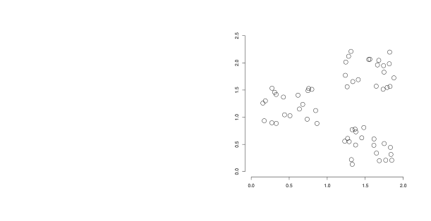
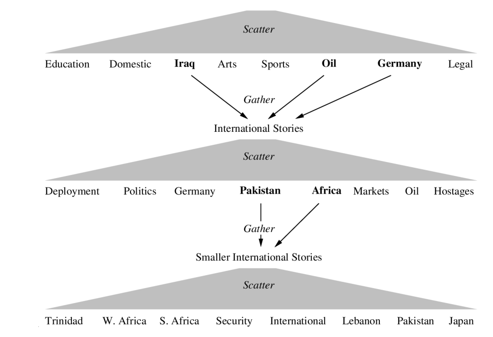
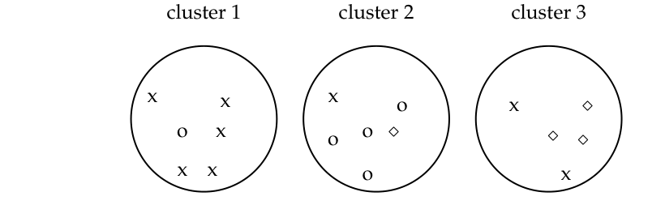
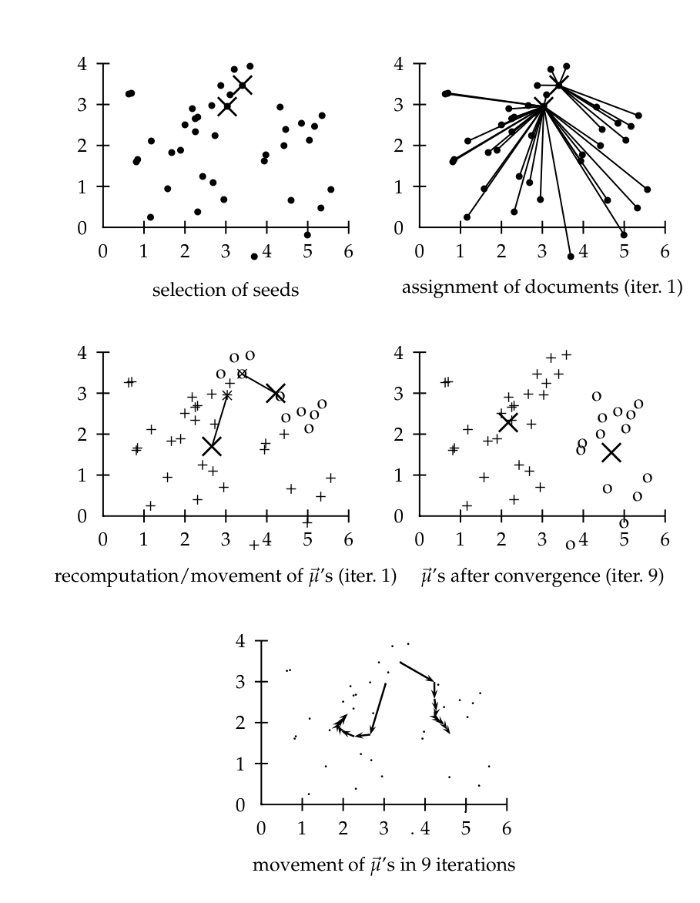
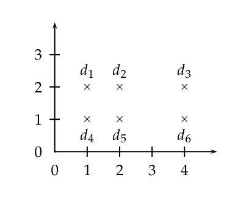
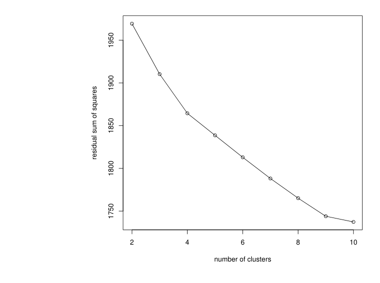

# 第 16 章 平面聚类

[返回系列目录](../introduction-to-information-retrieval.md) · [上一篇：第 15 章 支持向量机与文档机器学习](./15-support-vector-machines-and-machine-learning.md) · [下一篇：第 17 章 层次聚类](./17-hierarchical-clustering.md)

原书印刷页 349–376；PDF 第 386–413 页。

<!-- source: PDF 386; printed: 349 -->

聚类算法将一组文档分组为多个子集或簇（cluster）。算法的目标是创建内部一致但彼此之间明显不同的簇。换句话说，同一个簇内的文档应尽可能相似；而一个簇中的文档与其它簇中的文档应尽可能不相似。


**图 16.1** 具有明显簇结构的数据集示例。

聚类是无监督学习（unsupervised learning）最常见的形式。无监督意味着没有人类专家将文档分配到各个类别中。在聚类中，决定簇归属的是数据的分布和构成。图 16.1 是一个简单的例子。从视觉上可以清楚地看到有三个不同的点簇。本章和第 17 章将介绍以无监督方式发现此类簇的算法。

乍一看，聚类和分类之间的区别似乎不大。毕竟，在这两种情况下，我们都是将一组文档划分成多个组。但正如我们将看到的，这两个问题有着本质的不同。分类是一种有监督学习（第 13 章，第 256 页）：我们的目标是复制人类监督者强加

<!-- source: PDF 387; printed: 350 -->

在数据上的类别区分。在无监督学习（聚类是其最重要的例子）中，我们没有这样的老师来指导我们。

聚类算法的关键输入是距离度量。在图 16.1 中，距离度量是二维平面中的距离。该度量表明图中存在三个不同的簇。在文档聚类中，距离度量通常也是欧几里得距离。不同的距离度量会产生不同的聚类结果。因此，距离度量是我们影响聚类结果的重要手段。

平面聚类（flat clustering）创建一组平面的簇，没有任何将簇相互关联的显式结构。层次聚类（hierarchical clustering）创建簇的层次结构，将在第 17 章中介绍。第 17 章还探讨了自动为簇添加标签这一难题。

第二个重要的区别在于硬聚类和软聚类算法之间。硬聚类（hard clustering）计算硬分配——每个文档恰好是一个簇的成员。软聚类（soft clustering）算法的分配是软的——文档的分配是所有簇上的分布。在软分配中，文档在多个簇中具有部分隶属度。潜在语义索引（latent semantic indexing）是一种降维形式，也是一种软聚类算法（第 18 章，第 417 页）。

本章通过介绍一些应用来阐述在信息检索中使用聚类的动机（第 16.1 节），定义我们在聚类中试图解决的问题（第 16.2 节），并讨论评估聚类质量的指标（第 16.3 节）。然后描述了两种平面聚类算法：K-均值（K-means，第 16.4 节），一种硬聚类算法；以及期望最大化（Expectation-Maximization，或 EM）算法（第 16.5 节），一种软聚类算法。由于其简单性和高效性，K-均值可能是使用最广泛的平面聚类算法。EM 算法是 K-均值的推广，可应用于多种文档表示和分布。

## 16.1 信息检索中的聚类

聚类假设（cluster hypothesis）陈述了我们在信息检索中使用聚类时所做的基本假设。

> **聚类假设**。同一个簇中的文档在对信息需求的响应（相关性）方面表现相似。

该假设指出，如果某个簇中有一篇文档与搜索请求相关，那么同一个簇中的其他文档也很可能相关。这是因为聚类将共享许多词项的文档放在了一起。聚类假设本质上是

<!-- source: PDF 388; printed: 351 -->

第 14 章（第 289 页）中的邻近性假设（contiguity hypothesis）。在这两种情况下，我们都假定相似的文档在相关性方面表现相似。

| 应用 (Application) | 聚类对象 (What is clustered?) | 优势 (Benefit) | 示例 (Example) |
|---|---|---|---|
| 搜索结果聚类 (Search result clustering) | 搜索结果 (search results) | 向用户提供更有效的信息呈现 | 图 16.2 |
| Scatter-Gather | 文档集（的子集） ((subsets of) collection) | 替代的用户界面：“无需打字的搜索” | 图 16.3 |
| 文档集聚类 (Collection clustering) | 文档集 (collection) | 为探索性浏览提供有效的信息呈现 | McKeown et al. (2002), http://news.google.com |
| 语言模型 (Language modeling) | 文档集 (collection) | 提高查准率和/或召回率 | Liu and Croft (2004) |
| 基于聚类的检索 (Cluster-based retrieval) | 文档集 (collection) | 更高的效率：更快的搜索 | Salton (1971a) |

**表 16.1** 聚类在信息检索中的一些应用。

表 16.1 展示了聚类在信息检索中的一些主要应用。它们的区别在于所聚类的文档集（搜索结果、文档集或文档集的子集），以及它们试图改进的信息检索系统的方面（用户体验、用户界面、搜索系统的有效性或效率）。但它们都基于聚类假设所陈述的基本假设。

表 16.1 中提到的第一个应用是搜索结果聚类（search result clustering），这里的搜索结果是指响应查询而返回的文档。信息检索中搜索结果的默认呈现方式是一个简单的列表。用户从上到下浏览列表，直到找到他们正在寻找的信息。相反，搜索结果聚类对搜索结果进行聚类，使得相似的文档出现在一起。浏览几个连贯的组通常比浏览许多单独的文档更容易。如果搜索词项有不同的词义，这尤其有用。图 16.2 中的例子是 jaguar。网络上三个常见的含义是指汽车、动物和苹果操作系统。Vivísimo 搜索引擎（http://vivisimo.com）返回的聚类结果（Clustered Results）面板，在理解搜索结果内容方面，可能比简单的文档列表是一种更有效的用户界面。

更好的用户界面也是 Scatter-Gather（表 16.1 中的第二个应用）的目标。Scatter-Gather 对整个文档集进行聚类，以获得用户可以选择或收集（gather）的文档组。选定的组合并后，结果集再次被聚类。重复此过程，直到找到感兴趣的簇。图 16.3 展示了一个例子。

<!-- source: PDF 389; printed: 352 -->


**图 16.2** 通过搜索结果聚类来提高召回率。排名靠前的结果都没有涵盖 jaguar 的动物含义，但用户可以通过点击左侧聚类结果面板中的 cat 簇（从上往下的第三个箭头）轻松访问它。

像图 16.3 中那样自动生成的簇，不如像 http://dmoz.org 上的开放目录（Open Directory）那样手工构建的层次树组织得整齐。此外，自动为簇寻找描述性标签也是一个难题（第 17.7 节，第 396 页）。但是，基于聚类的导航是关键字搜索（标准的信息检索范式）的一个有趣的替代方案。在用户因为不确定使用哪些搜索词项而更喜欢浏览而不是搜索的场景中，情况尤其如此。

作为 Scatter-Gather 中用户介导的迭代聚类的替代方案，我们也可以计算文档集的静态层次聚类，该聚类不受用户交互的影响（表 16.1 中的“文档集聚类”）。Google News 及其前身 Columbia NewsBlaster 系统就是这种方法的例子。在新闻的情况下，我们需要频繁地重新计算聚类，以确保用户能够访问最新的突发新闻。聚类非常适合访问新闻报道集合，因为阅读新闻与其说是搜索，不如说是选择关于近期事件的报道子集的过程。

<!-- source: PDF 390; printed: 353 -->



**图 16.3** Scatter-Gather 中用户会话的示例。一个包含《纽约时报》新闻报道的文档集被聚类（“分散”，scattered）成八个簇（顶行）。用户手动将其中三个“聚集”（gathers）成一个较小的文档集 International Stories，并执行另一次分散操作。这个过程重复进行，直到找到一个包含相关文档的小簇（例如，Trinidad）。

图中文字：
Scatter 分散
Education 教育 Domestic 国内 Iraq 伊拉克 Arts 艺术 Sports 体育 Oil 石油 Germany 德国 Legal 法律
Gather 聚集
International Stories 国际报道
Scatter 分散
Deployment 部署 Politics 政治 Germany 德国 Pakistan 巴基斯坦 Africa 非洲 Markets 市场 Oil 石油 Hostages 人质
Gather 聚集
Smaller International Stories 更小的国际报道
Scatter 分散
Trinidad 特立尼达 W. Africa 西非 S. Africa 南非 Security 安全 International 国际 Lebanon 黎巴嫩 Pakistan 巴基斯坦 Japan 日本

聚类的第四个应用直接利用聚类假设来改进搜索结果，这是基于对整个文档集的聚类。我们使用标准的倒排索引来识别与查询匹配的初始文档集，但随后我们会添加来自相同簇的其他文档，即使它们与查询的相似度很低。例如，如果查询是 car，并且从 automobile（汽车）文档簇中提取了几个 car 文档，那么我们可以添加该簇中使用 car 以外词项（automobile, vehicle 等）的文档。这可以提高召回率，因为具有高相互相似度的一组文档通常作为一个整体是相关的。

最近，这个想法已被用于语言模型。第 245 页的式（12.10）表明，为了避免信息检索语言模型方法中的数据稀疏问题，文档 $d$ 的模型可以与

<!-- source: PDF 391; printed: 354 -->

文档集模型进行插值。但是文档集包含许多带有 $d$ 中不典型词项的文档。通过用从 $d$ 所在的簇导出的模型替换文档集模型，我们可以更准确地估计 $d$ 中词项的出现概率。

聚类还可以加速搜索。正如我们在第 6.3.2 节（原书第 123 页）中所看到的，向量空间模型中的搜索相当于寻找查询的最近邻。倒排索引支持标准信息检索设置下的快速最近邻搜索。然而，有时我们可能无法有效地使用倒排索引，例如在潜在语义索引（第 18 章）中。在这种情况下，我们可以计算查询与每个文档的相似度，但这很慢。聚类假设提供了一种替代方案：找到最接近查询的簇，并仅考虑这些簇中的文档。在这个小得多的集合中，我们可以穷举计算相似度，并以通常的方式对文档进行排序。由于簇的数量远少于文档的数量，因此找到最接近的簇是很快的；而且由于与查询匹配的文档彼此都很相似，它们往往位于相同的簇中。虽然该算法是不精确的，但搜索质量的预期下降很小。这本质上是第 7.1.6 节（原书第 141 页）中涵盖的聚类应用。

? **习题 16.1**
如果两个文档至少有两个共同的专有名词（如 Clinton 或 Sarkozy），则定义它们为相似的。给出一个信息需求和两个文档的示例，对于这种相似度概念，聚类假设不成立。

**习题 16.2**
构造一个简单的一维示例（即直线上的点），其中包含两个簇，以显示基于聚类的检索的不精确性。在你的示例中，检索靠近查询的簇的效果应该比直接的最近邻搜索差。

## 16.2 问题陈述

我们可以将硬平面聚类的目标定义如下。给定 (i) 一个文档集 $D = \{d_1, \ldots, d_N\}$，(ii) 期望的簇数量 $K$，以及 (iii) 一个评估聚类质量的**目标函数**（objective function），我们希望计算一个分配 $\gamma : D \to \{1, \ldots, K\}$，使得目标函数最小化（或者在其他情况下，最大化）。在大多数情况下，我们还要求 $\gamma$ 是满射的，即 $K$ 个簇中没有一个是空的。

目标函数通常根据文档之间的相似度或距离来定义。在下文中，我们将看到 $K$-均值聚类的目标是最小化文档与其质心之间的平均距离，或者等价地，最大化文档与其质心之间的相似度。关于相似度度量和距离度量的讨论

<!-- source: PDF 392; printed: 355 -->

在第 14 章（原书第 291 页）中的内容也适用于本章。与第 14 章一样，我们同时使用相似度和距离来讨论文档之间的相关程度。

对于文档，我们想要的相似度类型通常是主题相似度，或者在向量空间模型中相同维度上的高值。例如，关于中国的文档在 Chinese、Beijing 和 Mao 等维度上具有高值，而关于英国的文档往往在 London、Britain 和 Queen 上具有高值。我们在向量空间中用余弦相似度或欧几里得距离来近似主题相似度（第 6 章）。如果我们打算捕获主题以外的其他类型的相似度，例如语言的相似度，那么不同的表示可能是合适的。在计算主题相似度时，停用词可以被安全地忽略，但它们是区分英语文档簇（其中 the 频繁出现而 la 很少出现）和法语文档簇（其中 the 很少出现而 la 频繁出现）的重要线索。

**关于术语的说明。** 硬聚类的另一种定义是，一个文档可以是多个簇的完全成员。**划分式聚类**（partitional clustering）始终指每个文档恰好属于一个簇的聚类。（但是在划分式层次聚类（第 17 章）中，一个簇的所有成员当然也是其父簇的成员。）在允许属于多个簇的硬聚类定义下，软聚类和硬聚类之间的区别在于，硬聚类中的成员资格值要么是 0 要么是 1，而在软聚类中它们可以取任何非负值。

一些研究人员区分了将每个文档分配给一个簇的**穷举式**（exhaustive）聚类和非穷举式聚类，在后者中，一些文档将不被分配给任何簇。每个文档要么不属于任何簇，要么属于一个簇的非穷举式聚类被称为**排他性**（exclusive）聚类。在本书中，我们将聚类定义为穷举式的。

### 16.2.1 基数——簇的数量

聚类中的一个难题是确定簇的数量或聚类的**基数**（cardinality），我们用 $K$ 表示。通常 $K$ 只不过是基于经验或领域知识的一个好的猜测。但对于 $K$-均值，我们还将介绍一种选择 $K$ 的启发式方法，并尝试将 $K$ 的选择纳入目标函数中。有时应用程序会对 $K$ 的范围施加约束。例如，由于 20 世纪 90 年代初计算机显示器的尺寸和分辨率限制，图 16.3 中的 Scatter-Gather 界面每层无法显示超过约 $K = 10$ 个簇。

由于我们的目标是优化目标函数，聚类本质上

<!-- source: PDF 393; printed: 356 -->

是一个搜索问题。暴力解决方案是枚举所有可能的聚类并挑选最好的。然而，存在指数级数量的划分，因此这种方法是不可行的。<sup>[1]</sup> 出于这个原因，大多数平面聚类算法迭代地改进初始划分。如果搜索从一个不利的初始点开始，我们可能会错过全局最优解。因此，寻找一个好的起点是我们在平面聚类中必须解决的另一个重要问题。

## 16.3 聚类评估

聚类中典型的目标函数形式化了实现高簇内相似度（簇内的文档是相似的）和低簇间相似度（来自不同簇的文档是不相似的）的目标。这是聚类质量的**内部准则**（internal criterion）。但是，在内部准则上取得好分数并不一定转化为在应用程序中的良好有效性。内部准则的替代方案是在感兴趣的应用程序中进行直接评估。对于搜索结果聚类，我们可能希望测量用户使用不同聚类算法找到答案所需的时间。这是最直接的评估，但它很昂贵，特别是如果需要进行大型用户研究的话。

作为用户判断的替代，我们可以使用评估基准或黄金标准（gold standard）中的一组类别（参见第 8.5 节，原书第 164 页，以及第 13.6 节，原书第 279 页）。理想情况下，黄金标准由具有良好评判者间一致性水平的人类评判者生成（参见第 8 章，原书第 152 页）。然后，我们可以计算一个**外部准则**（external criterion），以评估聚类与黄金标准类别的匹配程度。例如，我们可能想说，图 16.2 中针对 jaguar 的搜索结果的最优聚类由对应于 car（汽车）、animal（动物）和 operating system（操作系统）这三个义项的三个类别组成。在这种类型的评估中，我们仅使用黄金标准提供的划分，而不使用类别标签。

本节介绍聚类质量的四个外部准则。纯度（purity）是一种简单透明的评估度量。归一化互信息（normalized mutual information）可以从信息论的角度进行解释。兰德指数（Rand index）对聚类过程中的假阳性和假阴性决策都进行惩罚。此外，F 测量（F measure）支持对这两种类型的错误进行差异化加权。

为了计算**纯度**（purity），将每个簇分配给该簇中最频繁出现的类别，然后通过计算正确分配的文档数量并除以 $N$ 来测量此分配的准确率。

> **脚注 1（原书第 356 页）**：聚类数量的上限是 $K^N/K!$。将 $N$ 个文档划分为 $K$ 个簇的不同划分的准确数量是第二类斯特林数（Stirling number of the second kind）。参见 http://mathworld.wolfram.com/StirlingNumberoftheSecondKind.html 或 Comtet (1974)。

<!-- source: PDF 394; printed: 357 -->



**图 16.4** 作为簇质量外部评估标准的纯度。三个簇的多数类及其成员数量分别为：x，5（簇 1）；o，4（簇 2）；以及 $\diamond$，3（簇 3）。纯度为 $(1/17) \times (5 + 4 + 3) \approx 0.71$。

图中文字：cluster 1 / 簇 1；cluster 2 / 簇 2；cluster 3 / 簇 3

| | purity | NMI | RI | $F_5$ |
|---|---|---|---|---|
| lower bound (下界) | 0.0 | 0.0 | 0.0 | 0.0 |
| maximum (最大值) | 1 | 1 | 1 | 1 |
| value for Figure 16.4 (图 16.4 的值) | 0.71 | 0.36 | 0.68 | 0.46 |

**表 16.2** 应用于图 16.4 中聚类的四种外部评估指标。

形式化地：

$$ \operatorname{purity}(\Omega, C) = \frac{1}{N} \sum_k \max_j |\omega_k \cap c_j| \tag{16.1} $$

其中 $\Omega = \{\omega_1, \omega_2, \ldots, \omega_K\}$ 是簇的集合，$C = \{c_1, c_2, \ldots, c_J\}$ 是类的集合。在式（16.1）中，我们将 $\omega_k$ 解释为 $\omega_k$ 中的文档集合，将 $c_j$ 解释为 $c_j$ 中的文档集合。

我们在图 16.4 中给出了如何计算纯度（purity）的示例。<sup>[2]</sup> 糟糕的聚类其纯度值接近于 0，完美的聚类其纯度为 1。表 16.2 将纯度与本章讨论的其他三种指标进行了比较。

当簇的数量很大时，很容易实现高纯度——特别是，如果每个文档都有自己的簇，纯度就为 1。因此，我们不能使用纯度来在聚类质量和簇的数量之间进行权衡。

允许我们进行这种权衡的一种指标是归一化互信息（normalized mutual information，NMI）：

> **脚注 2（原书第 357 页）**：在查看本章及下一章中的此图及其他二维图形时，请回想我们在图 14.2（第 291 页）中提出的警告：这些插图可能会产生误导，因为长度归一化向量的二维投影会扭曲点之间的相似度和距离。

<!-- source: PDF 395; printed: 358 -->

$$ \operatorname{NMI}(\Omega, C) = \frac{I(\Omega; C)}{[H(\Omega) + H(C)]/2} \tag{16.2} $$

$I$ 是互信息（参见第 13 章，第 272 页）：

$$ I(\Omega; C) = \sum_k \sum_j P(\omega_k \cap c_j) \log \frac{P(\omega_k \cap c_j)}{P(\omega_k)P(c_j)} \tag{16.3} $$

$$ = \sum_k \sum_j \frac{|\omega_k \cap c_j|}{N} \log \frac{N|\omega_k \cap c_j|}{|\omega_k||c_j|} \tag{16.4} $$

其中 $P(\omega_k)$、$P(c_j)$ 和 $P(\omega_k \cap c_j)$ 分别是文档属于簇 $\omega_k$、类 $c_j$ 以及 $\omega_k$ 和 $c_j$ 交集的概率。对于概率的最大似然估计（maximum likelihood estimation）（即每个概率的估计值是相应的相对频率），式（16.4）等价于式（16.3）。

$H$ 是第 5 章（第 99 页）中定义的熵：

$$ H(\Omega) = -\sum_k P(\omega_k) \log P(\omega_k) \tag{16.5} $$

$$ = -\sum_k \frac{|\omega_k|}{N} \log \frac{|\omega_k|}{N} \tag{16.6} $$

同样，第二个等式基于概率的最大似然估计。

式（16.3）中的 $I(\Omega; C)$ 衡量了当我们被告知簇是什么时，我们关于类的知识增加的信息量。如果聚类相对于类成员关系是随机的，则 $I(\Omega; C)$ 的最小值为 0。在这种情况下，知道文档属于特定簇并不能为我们提供关于其可能属于哪个类的任何新信息。对于完美重建类的聚类 $\Omega_{\text{exact}}$，互信息达到最大值——但如果 $\Omega_{\text{exact}}$ 中的簇被进一步细分为更小的簇，互信息同样达到最大值（练习 16.7）。特别是，具有 $K = N$ 个单文档簇的聚类具有最大的互信息（MI）。因此，MI 存在与纯度相同的问题：它不对大的基数进行惩罚，从而无法形式化我们的偏好，即在其他条件相同的情况下，簇越少越好。

式（16.2）中通过分母 $[H(\Omega) + H(C)]/2$ 进行的归一化解决了这个问题，因为熵往往随着簇的数量增加而增加。例如，$H(\Omega)$ 在 $K = N$ 时达到其最大值 $\log N$，这确保了在 $K = N$ 时 NMI 较低。由于 NMI 是归一化的，我们可以使用它来比较具有不同簇数量的聚类。选择这种特定形式的分母是因为 $[H(\Omega) + H(C)]/2$ 是 $I(\Omega; C)$ 的一个紧上界（练习 16.8）。因此，NMI 始终是 0 到 1 之间的数字。

<!-- source: PDF 396; printed: 359 -->

聚类的这种信息论解释的另一种替代方法是将其视为一系列决策，文档集（collection）中 $N(N - 1)/2$ 个文档对中的每一对都对应一个决策。当且仅当两个文档相似时，我们才希望将它们分配到同一个簇中。真正例（true positive，TP）决策将两个相似的文档分配到同一个簇中，真负例（true negative，TN）决策将两个不相似的文档分配到不同的簇中。我们可能会犯两种类型的错误。假正例（false positive，FP）决策将两个不相似的文档分配到同一个簇中。假负例（false negative，FN）决策将两个相似的文档分配到不同的簇中。兰德指数（Rand index，RI）衡量正确决策的百分比。也就是说，它就是准确率（accuracy）（第 8.3 节，第 155 页）。

$$ \text{RI} = \frac{\text{TP} + \text{TN}}{\text{TP} + \text{FP} + \text{FN} + \text{TN}} $$

作为一个例子，我们计算图 16.4 的 RI。我们首先计算 $\text{TP} + \text{FP}$。这三个簇分别包含 6、6 和 5 个点，因此“正例”或在同一个簇中的文档对的总数为：

$$ \text{TP} + \text{FP} = \binom{6}{2} + \binom{6}{2} + \binom{5}{2} = 40 $$

其中，簇 1 中的 x 对、簇 2 中的 o 对、簇 3 中的 $\diamond$ 对以及簇 3 中的 x 对是真正例：

$$ \text{TP} = \binom{5}{2} + \binom{4}{2} + \binom{3}{2} + \binom{2}{2} = 20 $$

因此，$\text{FP} = 40 - 20 = 20$。

FN 和 TN 的计算方法类似，得到以下列联表：

| | Same cluster (同簇) | Different clusters (不同簇) |
|---|---|---|
| Same class (同类) | TP = 20 | FN = 24 |
| Different classes (不同类) | FP = 20 | TN = 72 |

那么 RI 为 $(20 + 72)/(20 + 20 + 24 + 72) \approx 0.68$。

兰德指数对假正例和假负例赋予相等的权重。将相似的文档分开有时比将不相似的文档对放在同一个簇中更糟糕。我们可以使用 F 测量（F measure）（第 8.3 节，第 154 页），通过选择一个大于 1 的 $\beta$ 值，从而赋予召回率（recall）更大的权重，来对假负例施加比假正例更强的惩罚。

$$ P = \frac{\text{TP}}{\text{TP} + \text{FP}} \qquad R = \frac{\text{TP}}{\text{TP} + \text{FN}} \qquad F_\beta = \frac{(\beta^2 + 1)PR}{\beta^2 P + R} $$

<!-- source: PDF 397; printed: 360 -->

基于列联表中的数字，$P = 20/40 = 0.5$ 且 $R = 20/44 \approx 0.455$。这得出当 $\beta = 1$ 时 $F_1 \approx 0.48$，当 $\beta = 5$ 时 $F_5 \approx 0.456$。在信息检索中，使用 F 测量评估聚类的优势在于该指标已被研究社区所熟知。

**练习 16.3**
将图 16.4 中的每个点 $d$ 替换为同类中 $d$ 的两个相同副本。
（i）与图 16.4 中的 17 个点相比，对这 34 个点进行聚类是更不困难、同样困难还是更困难？（ii）计算包含 34 个点的聚类的纯度、NMI、RI 和 $F_5$。在点数翻倍后，哪些指标增加了，哪些保持不变？（iii）鉴于你在（i）中的评估和（ii）中的结果，哪些指标最适合比较这两种聚类的质量？

## 16.4 K-均值

K-均值（K-means）是最重要的平面聚类（flat clustering）算法。其目标是最小化文档到其簇中心的平均欧几里得距离平方（第 6 章，第 131 页），其中簇中心定义为簇 $\omega$ 中文档的均值或质心（centroid）$\vec{\mu}$：

$$ \vec{\mu}(\omega) = \frac{1}{|\omega|} \sum_{\vec{x} \in \omega} \vec{x} $$

该定义假设文档以我们熟悉的方式表示为实值空间中的长度归一化向量。我们在第 14 章（第 292 页）中将质心用于 Rocchio 分类。它们在这里扮演着类似的角色。

K-均值中理想的簇是一个以质心为重心的球体。理想情况下，簇不应重叠。我们在 Rocchio 分类中对类的期望也是相同的。区别在于，在聚类中我们没有带标签的训练集，无法知道哪些文档应该在同一个簇中。

衡量质心代表其簇成员程度的一个指标是残差平方和（residual sum of squares，RSS），即每个向量到其质心的距离平方在所有向量上的总和：

$$ \text{RSS}_k = \sum_{\vec{x} \in \omega_k} |\vec{x} - \vec{\mu}(\omega_k)|^2 $$

$$ \text{RSS} = \sum_{k=1}^K \text{RSS}_k \tag{16.7} $$

RSS 是 K-均值中的目标函数，我们的目标是最小化它。由于 $N$ 是固定的，最小化 RSS 等价于最小化平均平方距离，这是衡量质心代表其文档程度的一个指标。

<!-- source: PDF 398; printed: 361 -->

```text
K-MEANS({x⃗_1, ..., x⃗_N}, K)
 1 (s⃗_1, s⃗_2, ..., s⃗_K) ← SELECTRANDOMSEEDS({x⃗_1, ..., x⃗_N}, K)
 2 for k ← 1 to K
 3 do µ⃗_k ← s⃗_k
 4 while stopping criterion has not been met
 5 do for k ← 1 to K
 6    do ω_k ← {}
 7    for n ← 1 to N
 8    do j ← arg min_j′ |µ⃗_j′ − x⃗_n|
 9       ω_j ← ω_j ∪ {x⃗_n} (重新分配向量)
10    for k ← 1 to K
11    do µ⃗_k ← 1/|ω_k| ∑_{x⃗∈ω_k} x⃗ (重新计算质心)
12 return {µ⃗_1, ..., µ⃗_K}
```

**图 16.5** K-means 算法。对于大多数信息检索应用，向量 $\vec{x}_n \in \mathbb{R}^M$ 应该进行长度归一化。关于种子选择和初始化的替代方法在第 364 页讨论。

K-means 的第一步是选择 $K$ 个随机选择的文档作为初始簇中心，即种子（seed）。然后，该算法在空间中移动簇中心以最小化 RSS。如图 16.5 所示，这是通过迭代重复两个步骤来完成的，直到满足停止标准：将文档重新分配给具有最近质心的簇；并根据其簇的当前成员重新计算每个质心。图 16.6 显示了一组点在 K-means 算法九次迭代中的快照。表 17.2（第 397 页）的“质心”列显示了质心的示例。

我们可以应用以下终止条件之一。

* 已完成固定次数的迭代 $I$。该条件限制了聚类算法的运行时间，但在某些情况下，由于迭代次数不足，聚类质量会很差。
* 文档到簇的分配（划分函数 $\gamma$）在迭代之间不会改变。除了局部极小值较差的情况外，这会产生良好的聚类，但运行时间可能长得令人无法接受。
* 质心 $\vec{\mu}_k$ 在迭代之间不会改变。这等价于 $\gamma$ 不改变（练习 16.5）。
* 当 RSS 降至阈值以下时终止。该标准确保终止后聚类达到所需的质量。在实践中，我们

<!-- source: PDF 399; printed: 362 -->



**图 16.6** $\mathbb{R}^2$ 中 $K = 2$ 的 K-means 示例。两个质心的位置（在前四个面板中以 X 表示的 $\vec{\mu}$）在九次迭代后收敛。
图中文字：selection of seeds 种子选择；assignment of documents (iter. 1) 文档分配（迭代 1）；recomputation/movement of $\vec{\mu}$'s (iter. 1) $\vec{\mu}$ 的重新计算/移动（迭代 1）；$\vec{\mu}$'s after convergence (iter. 9) 收敛后的 $\vec{\mu}$（迭代 9）；movement of $\vec{\mu}$'s in 9 iterations 9 次迭代中 $\vec{\mu}$ 的移动。

<!-- source: PDF 400; printed: 363 -->

需要将其与迭代次数的上限结合起来以保证终止。

* 当 RSS 的减少量降至阈值 $\theta$ 以下时终止。对于较小的 $\theta$，这表明我们接近收敛。同样，我们需要将其与迭代次数的上限结合起来，以防止运行时间过长。

我们现在通过证明 RSS 在每次迭代中单调递减来证明 K-means 是收敛的。在本节中，我们将使用“递减”来表示递减或保持不变。首先，RSS 在重新分配步骤中递减，因为每个向量都被分配给最近的质心，因此它对 RSS 贡献的距离减小了。其次，它在重新计算步骤中递减，因为新质心是使 $\text{RSS}_k$ 达到最小值的向量 $\vec{v}$。

$$
\text{RSS}_k(\vec{v}) = \sum_{\vec{x} \in \omega_k} |\vec{v} - \vec{x}|^2 = \sum_{\vec{x} \in \omega_k} \sum_{m=1}^M (v_m - x_m)^2
\tag{16.8}
$$

$$
\frac{\partial \text{RSS}_k(\vec{v})}{\partial v_m} = \sum_{\vec{x} \in \omega_k} 2(v_m - x_m)
\tag{16.9}
$$

其中 $x_m$ 和 $v_m$ 分别是它们各自向量的第 $m$ 个分量。将偏导数设为零，我们得到：

$$
v_m = \frac{1}{|\omega_k|} \sum_{\vec{x} \in \omega_k} x_m
\tag{16.10}
$$

这是质心的逐分量定义。因此，当用新质心替换旧质心时，我们最小化了 $\text{RSS}_k$。那么，作为 $\text{RSS}_k$ 之和的 RSS，在重新计算期间也必然递减。

由于可能的聚类集合是有限的，单调递减算法最终将达到（局部）极小值。但是，请注意要一致地打破平局（break ties），例如，如果有几个等距的质心，则将文档分配给索引最小的簇。否则，算法可能会在具有相同代价的聚类循环中永远循环下去。

虽然这证明了 K-means 的收敛性，但遗憾的是，不能保证达到目标函数的全局极小值（global minimum）。如果文档集包含许多离群点（outlier），即远离任何其他文档因此不能很好地融入任何簇的文档，这就成了一个特别的问题。通常，如果选择离群点作为初始种子，那么在随后的迭代中不会有其他向量分配给它。因此，即使可能存在 RSS 更低的聚类，我们最终也会得到一个单元素簇（singleton cluster，即只有一个文档的簇）。图 16.7 显示了由于初始种子选择不当而导致次优聚类的示例。

<!-- source: PDF 401; printed: 364 -->



**图 16.7** K-means 中聚类的结果取决于初始种子。对于种子 $d_2$ 和 $d_5$，K-means 收敛到 $\{\{d_1, d_2, d_3\}, \{d_4, d_5, d_6\}\}$，这是一个次优聚类。对于种子 $d_2$ 和 $d_3$，它收敛到 $\{\{d_1, d_2, d_4, d_5\}, \{d_3, d_6\}\}$，这是 $K = 2$ 时的全局最优解。

另一种经常发生的次优聚类是带有空簇的聚类（练习 16.11）。

种子选择的有效启发式方法包括：(i) 从种子集中排除离群点；(ii) 尝试多个起点并选择代价最低的聚类；(iii) 从层次聚类（hierarchical clustering）等其他方法中获取种子。由于确定性的层次聚类方法比 K-means 更具可预测性，因此对大小为 $iK$（例如，对于 $i = 5$ 或 $i = 10$）的小型随机样本进行层次聚类通常能提供良好的种子（参见第 17 章第 399 页对 Buckshot 算法的描述）。

其他初始化方法计算的种子不是从要聚类的向量中选择的。一种对各种文档分布都很有效的鲁棒方法是为每个簇选择 $i$（例如，$i = 10$）个随机向量，并使用它们的质心作为该簇的种子。有关更复杂的初始化，请参见第 16.6 节。

K-means 的时间复杂度是多少？大部分时间花在计算向量距离上。一次这样的操作花费 $\Theta(M)$。重新分配步骤计算 $KN$ 个距离，因此其整体复杂度为 $\Theta(KNM)$。在重新计算步骤中，每个向量被添加到一个质心一次，因此该步骤的复杂度为 $\Theta(NM)$。对于固定数量的迭代 $I$，整体复杂度因此为 $\Theta(IKNM)$。因此，K-means 在所有相关因素（迭代次数、簇的数量、向量的数量和空间的维数）上都是线性的。这意味着 K-means 比第 17 章中的层次算法更高效。我们必须固定迭代次数 $I$，这在实践中可能很棘手。但在大多数情况下，K-means 很快就能达到完全收敛或接近收敛的聚类。在后一种情况下，如果计算进一步的迭代，少数文档会切换成员身份，但这总体上对聚类质量影响很小。

<!-- source: PDF 402; printed: 365 -->

前面的论述中有一个微妙之处。如果 $\Theta(\dots)$ 的参数之一很大，即使是线性算法也可能相当慢，而 $M$ 通常很大。高维性对于计算两篇文档之间的距离来说不是问题。它们的向量是稀疏的，因此理论上可能的 $M$ 个分量差异中，只有一小部分需要计算。然而，质心是稠密的，因为它们汇集了其簇中任何文档里出现的所有词项。因此，在 K-均值的朴素实现中，距离计算非常耗时。不过，有一些简单有效的启发式方法可以使质心-文档相似度的计算与文档-文档相似度的计算一样快。将质心截断为最显著的 $k$ 个词项（例如，$k = 1000$）几乎不会降低簇的质量，同时能显著加快重新分配步骤的速度（参见第 16.6 节中的参考文献）。

同样的效率问题可以通过 K-中心点（K-medoids）算法来解决，它是 K-均值的一种变体，计算中心点（medoid）而不是质心作为簇中心。我们将簇的中心点定义为最接近质心的文档向量。由于中心点是稀疏的文档向量，因此距离计算很快。

### 16.4.1 K-均值中的簇基数

我们在第 16.2 节中指出，簇的数量 $K$ 是大多数平面聚类算法的输入。如果我们无法对 $K$ 做出合理的猜测，该怎么办？

一种朴素的方法是根据目标函数选择 $K$ 的最优值，即最小化 RSS 的 $K$ 值。将 $\text{RSS}_{\min}(K)$ 定义为具有 $K$ 个簇的所有聚类中的最小 RSS，我们观察到 $\text{RSS}_{\min}(K)$ 是关于 $K$ 的单调递减函数（练习 16.13），当 $K = N$（其中 $N$ 是文档数）时，它达到最小值 0。最终我们会让每篇文档都处于自己的簇中。显然，这不是一个最优的聚类。

绕过这个问题的一种启发式方法是按如下方式估计 $\text{RSS}_{\min}(K)$。我们首先执行 $i$ 次（例如，$i = 10$）具有 $K$ 个簇的聚类（每次使用不同的初始化），并计算每次的 RSS。然后我们取这 $i$ 个 RSS 值中的最小值。我们将此最小值记为 $\widehat{\text{RSS}}_{\min}(K)$。现在我们可以随着 $K$ 的增加检查 $\widehat{\text{RSS}}_{\min}(K)$ 的值，并找到曲线中的“拐点（knee）”——即 $\widehat{\text{RSS}}_{\min}$ 的连续下降变得明显变小的点。在图 16.8 中有两个这样的点，一个在 $K = 4$ 处，梯度略微变平，另一个在 $K = 9$ 处有更明显的变平。这是很典型的：很少有单一的最佳簇数量。我们仍然需要采用外部约束来从多个可能的 $K$ 值（在本例中为 4 和 9）中进行选择。

<!-- source: PDF 403; printed: 366 -->



**图 16.8** K-均值中估计的最小残差平方和作为簇数量的函数。在对 1203 篇 Reuters-RCV1 文档的聚类中，$\widehat{\text{RSS}}_{\min}$ 曲线在两个点处变平：4 个簇和 9 个簇。这些文档选自 China、Germany、Russia 和 Sports 类别，因此 $K = 4$ 的聚类最接近路透社的分类。
图中文字：residual sum of squares 残差平方和；number of clusters 簇数量。

第二类簇基数准则对每个新簇施加惩罚——在概念上，我们从包含所有文档的单个簇开始，然后通过将 $K$ 逐次加一，来搜索最优的簇数量 $K$。为了以这种方式确定簇基数，我们创建了一个广义目标函数，它结合了两个元素：失真（distortion），即文档偏离其簇原型的程度的度量（例如，K-均值的 RSS）；以及模型复杂度（model complexity）的度量。我们在这里将聚类解释为数据的模型。聚类中的模型复杂度通常是簇的数量或其函数。对于 K-均值，我们得到以下 $K$ 的选择准则：

$$ K = \underset{K}{\arg\min} [\text{RSS}_{\min}(K) + \lambda K] \tag{16.11} $$

其中 $\lambda$ 是一个加权因子。较大的 $\lambda$ 值倾向于簇较少的解。对于 $\lambda = 0$，对更多的簇没有惩罚，$K = N$ 是最佳解。

<!-- source: PDF 404; printed: 367 -->

式（16.11）的明显困难在于我们需要确定 $\lambda$。除非这比直接确定 $K$ 更容易，否则我们就又回到了原点。在某些情况下，我们可以选择过去在类似数据集上表现良好的 $\lambda$ 值。例如，如果我们定期对来自新闻专线的新闻报道进行聚类，很可能存在一个固定的 $\lambda$ 值，能在每次连续的聚类中为我们提供正确的 $K$。在这个应用中，我们将无法根据过去的经验来确定 $K$，因为 $K$ 是变化的。

式（16.11）的一个理论依据是赤池信息准则（Akaike Information Criterion）或 AIC，这是一种在失真和模型复杂度之间进行权衡的信息论度量。AIC 的一般形式为：

$$ \text{AIC:}\quad K = \underset{K}{\arg\min} [-2L(K) + 2q(K)] \tag{16.12} $$

其中 $-L(K)$（$K$ 个簇的数据的负最大对数似然）是失真的度量，而 $q(K)$（具有 $K$ 个簇的模型的参数数量）是模型复杂度的度量。我们不打算在这里推导 AIC，但它在直觉上很容易理解。一个好的数据模型的首要属性是每个数据点都能被模型很好地建模。这就是低失真的目标。但模型也应该很小（即具有低模型复杂度），因为一个仅仅描述数据（因此失真为零）的模型是毫无价值的。在选择模型时，AIC 为加权这两个因素（失真和模型复杂度）的一种特定方式提供了理论依据。

对于 K-均值，AIC 可以表述如下：

$$ \text{AIC:}\quad K = \underset{K}{\arg\min} [\text{RSS}_{\min}(K) + 2MK] \tag{16.13} $$

式（16.13）是式（16.11）在 $\lambda = 2M$ 时的特例。

要从式（16.12）推导式（16.13），请注意在 K-均值中 $q(K) = KM$，因为 $K$ 个质心的每个元素都是可以独立变化的参数；并且如果我们把 K-均值底层的模型看作是具有硬分配（hard assignment）、均匀簇先验和相同球形协方差矩阵的高斯混合模型（参见练习 16.19），那么 $L(K) = -(1/2)\text{RSS}_{\min}(K)$（模一个常数）。

AIC 的推导基于许多假设，例如数据是独立同分布的。这些假设对于信息检索中的数据集来说只是近似成立。因此，在文本聚类中，AIC 很少能不加修改地直接应用。在图 16.8 中，向量空间的维度是 $M \approx 50,000$。因此，$2MK > 50,000$ 主导了较小的基于 RSS 的项（$\widehat{\text{RSS}}_{\min}(1) < 5000$，未在图中显示），并且该表达式在 $K = 1$ 时达到最小值。但正如我们所知，$K = 4$（对应于四个类别 China、

<!-- source: PDF 405; printed: 368 -->

Germany、Russia 和 Sports）是比 $K = 1$ 更好的选择。在实践中，式（16.11）通常比式（16.13）更有用——需要注意的是，我们需要提出一个对 $\lambda$ 的估计。

**练习 16.4**
为什么对于概念 car 没有使用相同词项的文档，在 K-均值聚类中很可能会被分到同一个簇中？

**练习 16.5**
K-均值的两个可能的终止条件是（1）分配不发生变化，（2）质心不发生变化（第 361 页）。这两个条件是否互相蕴含？

## 16.5 基于模型的聚类

在本节中，我们将描述 K-均值的一种推广，即 EM 算法。它可以应用于比 K-均值更广泛的文档表示和分布。

在 K-均值中，我们试图找到能够作为良好代表的质心。我们可以将这 $K$ 个质心的集合视为生成数据的模型。在这个模型中生成一篇文档，包括首先随机选取一个质心，然后添加一些噪声。如果噪声呈正态分布，这个过程将产生球形的簇。基于模型的聚类（model-based clustering）假设数据是由某个模型生成的，并试图从数据中恢复原始模型。然后，我们从数据中恢复的模型定义了簇以及文档到簇的分配。

估计模型参数的一个常用准则是最大似然。在 K-均值中，量 $\exp(-\text{RSS})$ 与特定模型（即一组质心）生成数据的似然成正比。对于 K-均值，最大似然和最小 RSS 是等价的准则。我们将模型参数记为 $\Theta$。在 K-均值中，$\Theta = \{\vec{\mu}_1, \dots, \vec{\mu}_K\}$。

更一般地，最大似然准则是选择使生成数据 $D$ 的对数似然最大化的参数 $\Theta$：

$$ \Theta = \underset{\Theta}{\arg\max} L(D|\Theta) = \underset{\Theta}{\arg\max} \log \prod_{n=1}^N P(d_n|\Theta) = \underset{\Theta}{\arg\max} \sum_{n=1}^N \log P(d_n|\Theta) $$

$L(D|\Theta)$ 是衡量聚类优劣的目标函数。给定两个具有相同簇数量的聚类，我们更倾向于 $L(D|\Theta)$ 较高的那一个。

这与我们在第 12 章（第 237 页）中用于语言模型和在第 13.1 节（第 265 页）中用于文本分类的方法相同。在文本分类中，我们选择使生成特定文档的似然最大化的类别。在这里，我们选择最大化

<!-- source: PDF 406; printed: 369 -->

生成给定文档集的似然。一旦我们有了 $\Theta$，我们就可以为每个文档-簇对计算一个分配概率 $P(d|\omega_k; \Theta)$。这组分配概率定义了一个软聚类（soft clustering）。

软分配的一个例子是，一篇关于中国汽车的文档可能在 China 和 automobiles 这两个簇中各具有 0.5 的部分隶属度，这反映了这两个主题都相关的事实。像 K-均值这样的硬聚类无法对这种同时与两个主题相关的情况进行建模。

基于模型的聚类（Model-based clustering）提供了一个框架，用于整合我们关于某个领域的知识。K-均值和第 17 章中的层次算法对数据做出了相当严格的假设。例如，K-均值中的簇被假设为球体。基于模型的聚类提供了更大的灵活性。聚类模型可以适应我们对数据潜在分布的了解，无论是伯努利分布（如表 16.3 中的例子）、具有非球形方差的高斯分布（另一个在文档聚类中很重要的模型），还是不同分布族的成员。

基于模型的聚类中常用的算法是期望最大化算法（Expectation-Maximization algorithm）或 EM 算法。EM 聚类是一种最大化 $L(D|\Theta)$ 的迭代算法。EM 可以应用于许多不同类型的概率建模。这里我们将使用多元伯努利分布的混合模型，这是我们在第 11.3 节（原书第 222 页）和第 13.3 节（原书第 263 页）中了解的分布：

$$ P(d|\omega_k; \Theta) = \left( \prod_{t_m \in d} q_{mk} \right) \left( \prod_{t_m \notin d} (1 - q_{mk}) \right) \tag{16.14} $$

其中 $\Theta = \{\Theta_1, \ldots, \Theta_K\}$，$\Theta_k = (\alpha_k, q_{1k}, \ldots, q_{Mk})$，并且 $q_{mk} = P(U_m = 1|\omega_k)$ 是模型的参数。<sup>[3]</sup> $P(U_m = 1|\omega_k)$ 是来自簇 $\omega_k$ 的文档包含词项 $t_m$ 的概率。概率 $\alpha_k$ 是簇 $\omega_k$ 的先验概率：在没有关于文档 $d$ 的任何信息的情况下，$d$ 属于 $\omega_k$ 的概率。

那么混合模型为：

$$ P(d|\Theta) = \sum_{k=1}^K \alpha_k \left( \prod_{t_m \in d} q_{mk} \right) \left( \prod_{t_m \notin d} (1 - q_{mk}) \right) \tag{16.15} $$

在这个模型中，我们生成一篇文档的过程是：首先以概率 $\alpha_k$ 选择一个簇 $k$，然后根据参数 $q_{mk}$ 生成文档的词项。回想一下，多元伯努利模型的文档表示是一个包含 $M$ 个布尔值的向量（而不是实值向量）。

> **脚注 3（原书第 369 页）**：$U_m$ 是我们在第 13.3 节（原书第 266 页）中为伯努利朴素贝叶斯模型定义的随机变量。它的取值为 1（词项 $t_m$ 出现在文档中）和 0（词项 $t_m$ 未出现在文档中）。

<!-- source: PDF 407; printed: 370 -->

我们如何使用 EM 从数据中推断聚类的参数？也就是说，我们如何选择最大化 $L(D|\Theta)$ 的参数 $\Theta$？EM 与 K-均值相似，它在期望步（expectation step，对应于重新分配）和最大化步（maximization step，对应于重新计算模型参数）之间交替进行。K-均值的参数是质心，本节中 EM 实例的参数是 $\alpha_k$ 和 $q_{mk}$。

最大化步重新计算条件参数 $q_{mk}$ 和先验概率 $\alpha_k$，如下所示：

$$ \textbf{Maximization step:} \quad q_{mk} = \frac{\sum_{n=1}^N r_{nk} I(t_m \in d_n)}{\sum_{n=1}^N r_{nk}} \quad \alpha_k = \frac{\sum_{n=1}^N r_{nk}}{N} \tag{16.16} $$

其中，如果 $t_m \in d_n$，则 $I(t_m \in d_n) = 1$，否则为 0；$r_{nk}$ 是在上一轮迭代中计算出的文档 $d_n$ 到簇 $k$ 的软分配。（我们稍后将讨论初始化问题。）这些是表 13.3（原书第 268 页）中多元伯努利参数的最大似然估计，区别仅在于此处的文档是按比例分配给簇的。这些最大似然估计最大化了给定模型下数据的似然。

期望步在给定当前参数 $q_{mk}$ 和 $\alpha_k$ 的情况下，计算文档到簇的软分配：

$$ \textbf{Expectation step:} \quad r_{nk} = \frac{\alpha_k \left( \prod_{t_m \in d_n} q_{mk} \right) \left( \prod_{t_m \notin d_n} (1 - q_{mk}) \right)}{\sum_{k=1}^K \alpha_k \left( \prod_{t_m \in d_n} q_{mk} \right) \left( \prod_{t_m \notin d_n} (1 - q_{mk}) \right)} \tag{16.17} $$

该期望步应用式（16.14）和式（16.15）来计算 $\omega_k$ 生成文档 $d_n$ 的似然。这是表 13.3 中多元伯努利模型的分类过程。因此，期望步无非就是伯努利朴素贝叶斯分类（包括归一化，即除以分母，以获得簇上的概率分布）。

在表 16.3 中，我们使用 EM 将 11 篇文档的集合聚类为两个簇。在第 25 次迭代收敛后，前 5 篇文档被分配到簇 1（$r_{i,1} = 1.00$），后 6 篇文档被分配到簇 2（$r_{i,1} = 0.00$）。有些反常的是，这里的最终分配是一个硬分配。EM 通常会收敛到软分配。在第 25 次迭代中，簇 1 的先验概率 $\alpha_1$ 为 $5/11 \approx 0.45$，因为 11 篇文档中有 5 篇在簇 1 中。一些词项很快就与一个簇关联起来，因为初始分配可以明确地“传播”给它们。例如，在第一次迭代中，簇 2 的隶属关系从文档 7 传播到文档 8，因为它们共享词项 sugar（在第 1 次迭代中 $r_{8,1} = 0$）。对于出现在模糊上下文中的词项参数，收敛需要更长的时间。种子文档 6 和 7

<!-- source: PDF 408; printed: 371 -->

(a)

| docID | document text | docID | document text |
|---|---|---|---|
| 1 | hot chocolate cocoa beans | 7 | sweet sugar |
| 2 | cocoa ghana africa | 8 | sugar cane brazil |
| 3 | beans harvest ghana | 9 | sweet sugar beet |
| 4 | cocoa butter | 10 | sweet cake icing |
| 5 | butter truffles | 11 | cake black forest |
| 6 | sweet chocolate | | |

(b)

| Parameter | 0 | 1 | 2 | 3 | 4 | 5 | 15 | 25 |
|---|---|---|---|---|---|---|---|---|
| $\alpha_1$ | | 0.50 | 0.45 | 0.53 | 0.57 | 0.58 | 0.54 | 0.45 |
| $r_{1,1}$ | | 1.00 | 1.00 | 1.00 | 1.00 | 1.00 | 1.00 | 1.00 |
| $r_{2,1}$ | | 0.50 | 0.79 | 0.99 | 1.00 | 1.00 | 1.00 | 1.00 |
| $r_{3,1}$ | | 0.50 | 0.84 | 1.00 | 1.00 | 1.00 | 1.00 | 1.00 |
| $r_{4,1}$ | | 0.50 | 0.75 | 0.94 | 1.00 | 1.00 | 1.00 | 1.00 |
| $r_{5,1}$ | | 0.50 | 0.52 | 0.66 | 0.91 | 1.00 | 1.00 | 1.00 |
| $r_{6,1}$ | 1.00 | 1.00 | 1.00 | 1.00 | 1.00 | 1.00 | 0.83 | 0.00 |
| $r_{7,1}$ | 0.00 | 0.00 | 0.00 | 0.00 | 0.00 | 0.00 | 0.00 | 0.00 |
| $r_{8,1}$ | | 0.00 | 0.00 | 0.00 | 0.00 | 0.00 | 0.00 | 0.00 |
| $r_{9,1}$ | | 0.00 | 0.00 | 0.00 | 0.00 | 0.00 | 0.00 | 0.00 |
| $r_{10,1}$ | | 0.50 | 0.40 | 0.14 | 0.01 | 0.00 | 0.00 | 0.00 |
| $r_{11,1}$ | | 0.50 | 0.57 | 0.58 | 0.41 | 0.07 | 0.00 | 0.00 |
| $q_{\text{africa},1}$ | | 0.000 | 0.100 | 0.134 | 0.158 | 0.158 | 0.169 | 0.200 |
| $q_{\text{africa},2}$ | | 0.000 | 0.083 | 0.042 | 0.001 | 0.000 | 0.000 | 0.000 |
| $q_{\text{brazil},1}$ | | 0.000 | 0.000 | 0.000 | 0.000 | 0.000 | 0.000 | 0.000 |
| $q_{\text{brazil},2}$ | | 0.000 | 0.167 | 0.195 | 0.213 | 0.214 | 0.196 | 0.167 |
| $q_{\text{cocoa},1}$ | | 0.000 | 0.400 | 0.432 | 0.465 | 0.474 | 0.508 | 0.600 |
| $q_{\text{cocoa},2}$ | | 0.000 | 0.167 | 0.090 | 0.014 | 0.001 | 0.000 | 0.000 |
| $q_{\text{sugar},1}$ | | 0.000 | 0.000 | 0.000 | 0.000 | 0.000 | 0.000 | 0.000 |
| $q_{\text{sugar},2}$ | | 1.000 | 0.500 | 0.585 | 0.640 | 0.642 | 0.589 | 0.500 |
| $q_{\text{sweet},1}$ | | 1.000 | 0.300 | 0.238 | 0.180 | 0.159 | 0.153 | 0.000 |
| $q_{\text{sweet},2}$ | | 1.000 | 0.417 | 0.507 | 0.610 | 0.640 | 0.608 | 0.667 |

▶ **表 16.3** EM 聚类算法。该表显示了一组文档 (a) 以及 EM 聚类过程中选定迭代的参数值 (b)。显示的参数包括先验概率 $\alpha_1$、软分配评分 $r_{n,1}$（簇 2 的这两个参数均省略）以及几个词项的词汇参数 $q_{m,k}$。作者最初将文档 6 分配给簇 1，将文档 7 分配给簇 2（第 0 次迭代）。EM 在 25 次迭代后收敛。为了平滑，式（16.16）中的 $r_{nk}$ 被替换为 $r_{nk} + \epsilon$，其中 $\epsilon = 0.0001$。

<!-- source: PDF 409; printed: 372 -->

都包含 sweet。结果，该词项花了 25 次迭代才明确地与簇 2 关联起来。（在第 25 次迭代中 $q_{\text{sweet},1} = 0$。）

寻找好的种子对于 EM 来说比对 K-均值更为关键。如果种子选择不当，EM 很容易陷入局部最优。这是一个普遍问题，也出现在 EM 的其他应用中。<sup>[4]</sup> 因此，与 K-均值一样，文档到簇的初始分配通常由不同的算法计算得出。例如，硬 K-均值聚类可以提供初始分配，然后 EM 可以将其“软化”。

**练习 16.6**
我们在上面看到 K-均值的时间复杂度是 $\Theta(IKNM)$。EM 的时间复杂度是多少？

## 16.6 参考资料及进一步阅读

Berkhin (2006b) 对聚类方法进行了全面的最新综述，并特别关注了可扩展性。模式识别中聚类的经典参考文献（涵盖了 K-均值和 EM）是 (Duda et al. 2000)。Rasmussen (1992) 从信息检索的角度介绍了聚类。Anderberg (1973) 提供了面向应用的聚类的一般性介绍。除了欧几里得距离和余弦相似度之外，Kullback-Leibler 散度也经常在聚类中用作衡量文档和簇之间（不）相似程度的指标 (Xu and Croft 1999, Muresan and Harper 2004, Kurland and Lee 2004)。

聚类假设（cluster hypothesis）由 Jardine and van Rijsbergen (1971) 提出，他们将其表述如下：文档之间的关联传达了关于文档与请求相关性的信息。Salton (1971a; 1975)、Croft (1978)、Voorhees (1985a)、Can and Ozkarahan (1990)、Cacheda et al. (2003)、Can et al. (2004)、Singitham et al. (2004) 以及 Altingövde et al. (2008) 研究了基于聚类的检索的效率和有效性。虽然其中一些研究表明在有效性、效率或两者上都有所提高，但对于基于聚类的检索是否在各种场景下都能始终表现良好，目前尚无共识。基于聚类的语言模型由 Liu and Croft (2004) 率先提出。

有充分的证据表明，搜索结果的聚类可以改善用户体验和搜索结果质量 (Hearst and Pedersen 1996, Zamir and Etzioni 1999, Tombros et al. 2002, Käki 2005, Toda and Kataoka 2005)，尽管不如基于精心编辑的类别层次结构进行的搜索结果结构化那样有效 (Hearst 2006)。用于浏览文档集的 Scatter-Gather 界面由 Cutting et al. (1992) 提出。一个用于分-

> **脚注 4（原书第 372 页）**：例如，在自然语言处理中，当使用 EM 来估计隐马尔可夫模型、概率文法和机器翻译模型的参数时，这个问题很常见 (Manning and Schütze 1999)。

<!-- source: PDF 410; printed: 373 -->

alyzing the properties of Scatter/Gather and other information seeking user interfaces is presented by Pirolli (2007)。Schütze and Silverstein (1997) 评估了 LSI（第 18 章）以及质心的截断表示在高效 K-means 聚类中的应用。

Columbia NewsBlaster 系统 (McKeown et al. 2002) 是现在更为著名且完善的 Google News (http://news.google.com) 的先驱，它使用层次聚类（hierarchical clustering，第 17 章）来提供两个层次的新闻主题粒度。详情参见 Hatzivassiloglou et al. (2000)，相关系统参见 Chen and Lin (2000) 和 Radev et al. (2001)。聚类在信息检索中的其他应用包括重复检测（duplicate detection，Yang and Callan (2006)，第 19.6 节，第 438 页）、新颖性检测（novelty detection，参见第 17.9 节的参考文献，第 399 页）以及语义网上的元数据发现 (Alonso et al. 2006)。

对外部评估指标的讨论部分基于 Strehl (2002)。Dom (2002) 提出了一种在理论上比 NMI 更有依据的指标 $Q_0$。$Q_0$ 是在假设簇成员关系已知的情况下，传输类成员关系所需的比特数。Rand 指数由 Rand (1971) 提出。Hubert and Arabie (1985) 提出了一种**调整 Rand 指数**（adjusted Rand index），其取值范围在 $-1$ 到 $1$ 之间，如果簇和类之间仅存在偶然的一致性，则该值为 $0$（类似于第 8 章第 165 页的 $\kappa$）。Basu et al. (2004) 认为 NMI、Rand 指数和 F 测量值这三种评估指标给出的结果非常相似。Stein et al. (2003) 提出将期望边密度（expected edge density）作为一种内部指标，并提供证据表明它是聚类质量的良好预测指标。Kleinberg (2002) 和 Meilă (2005) 提出了用于比较聚类的公理化框架。

通常被认为是 K-means 算法发明者的作者包括 Lloyd (1982)（首次发布于 1957 年）、Ball (1965)、MacQueen (1967) 以及 Hartigan and Wong (1979)。Arthur and Vassilvitskii (2006) 研究了 K-means 的最坏情况复杂度。Bradley and Fayyad (1998)、Pelleg and Moore (1999) 以及 Davidson and Satyanarayana (2003) 通过实验研究了 K-means 的收敛特性及其对初始种子选择的依赖关系。Dhillon and Modha (2001) 比较了 K-means 簇与基于 SVD 的簇（第 18 章）。K-medoid 算法由 Kaufman and Rousseeuw (1990) 提出。EM 算法最初由 Dempster et al. (1977) 引入。对 EM 的深入探讨见 (McLachlan and Krishnan 1996)。关于潜在分析（latent analysis，也可视为软聚类）的出版物，请参见第 18.5 节（第 417 页）。

AIC 由 Akaike (1974) 提出（另见 Burnham and Anderson (2002)）。AIC 的一种替代方法是 BIC，它可以作为一种贝叶斯模型选择过程来获得理论支持 (Schwarz 1978)。Fraley and Raftery (1998) 展示了如何基于 BIC 选择最佳的簇数量。BIC 在 K-means 中的一个应用是 (Pelleg and Moore 2000)。Hamerly and Elkan (2003) 提出了一种 BIC 的替代方法，在他们的实验中表现更好。另一种用于确定簇数量的具有影响力的贝叶斯方法（与

<!-- source: PDF 411; printed: 374 -->

簇分配同时进行）由 Cheeseman and Stutz (1996) 描述。Tibshirani et al. (2001) 提出了两种在没有外部标准的情况下确定基数的方法。

我们在这里只有篇幅介绍经典的完全无监督聚类。当前一个重要的研究课题是如何利用先验知识来指导聚类（例如，Ji and Xu (2006)），以及如何在聚类过程中结合交互式反馈（例如，Huang and Mitchell (2006)）。Fayyad et al. (1998) 提出了一种用于 EM 聚类的初始化方法。对于能够在一次数据扫描中对超大型数据集进行聚类的算法，请参见 Bradley et al. (1998)。

表 16.1 中的应用都是对文档进行聚类。其他信息检索应用则对单词（例如，Crouch 1988）、单词的上下文（例如，Schütze and Pedersen 1995）或同时对单词和文档（例如，Tishby and Slonim 2000, Dhillon 2001, Zha et al. 2001）进行聚类。同时对单词和文档进行聚类是**协同聚类**（co-clustering 或 biclustering）的一个例子。

## 16.7 习题

**习题 16.7**
假设 $\Omega$ 是一个完全重现类结构 $\mathbb{C}$ 的聚类，而 $\Omega'$ 是一个将 $\Omega$ 中的某些簇进一步细分的聚类。证明 $I(\Omega; \mathbb{C}) = I(\Omega'; \mathbb{C})$。

**习题 16.8**
证明 $I(\Omega; \mathbb{C}) \leq [H(\Omega) + H(\mathbb{C})]/2$。

**习题 16.9**
互信息是对称的，即如果互换簇和类的角色，其值不会改变：$I(\Omega; \mathbb{C}) = I(\mathbb{C}; \Omega)$。其他三种评估指标中，哪一种在这个意义上是对称的？

**习题 16.10**
计算图 16.7 中两个聚类的 RSS。

**习题 16.11**
(i) 给出一个点集和三个初始质心（不需要是点集中的成员）的例子，使得 3-means 收敛到一个包含空簇的聚类。(ii) 包含空簇的聚类能否成为关于 RSS 的全局最优解？

**习题 16.12**
下载 Reuters-21578。丢弃未出现在以下 10 个类中的文档：acquisitions、corn、crude、earn、grain、interest、money-fx、ship、trade 和 wheat。丢弃同时出现在这 10 个类中两个类的文档。(i) 计算该子集的 K-means 聚类，将其聚为 10 个簇。有许多实现 K-means 的软件包，例如 WEKA (Witten and Frank 2005) 和 R (R Development Core Team 2005)。(ii) 计算

<!-- source: PDF 412; printed: 375 -->

该聚类相对于这 10 个类的纯度（purity）、归一化互信息（normalized mutual information）、$F_1$ 值和 RI。(iii) 为这 10 个类和 10 个簇编制一个混淆矩阵（confusion matrix，表 14.5，第 308 页）。找出导致假阳性（false positives）和假阴性（false negatives）的类。

**习题 16.13**
证明 $\text{RSS}_{\min}(K)$ 随 $K$ 单调递减。

**习题 16.14**
K-means 有一种软聚类版本，它将文档在簇中的部分隶属度计算为其到质心距离 $\Delta$ 的单调递减函数，例如 $e^{-\Delta}$。针对这种软聚类版本，修改硬 K-means 的重新分配和重新计算步骤。

**习题 16.15**
在表 16.3 的最后一次迭代中，文档 6 位于簇 2 中，尽管它是簇 1 的初始种子。为什么该文档改变了其成员归属？

**习题 16.16**
表 16.3 中第 25 次迭代的参数 $q_{mk}$ 的值是四舍五入后的结果。EM 算法将收敛到的精确值是多少？

**习题 16.17**
对表 16.3 中的文档执行 K-means 聚类。K-means 在多少次迭代后收敛？将结果与表 16.3 中的 EM 聚类进行比较并讨论它们之间的差异。

**习题 16.18** $[\star\star\star]$
针对高斯混合模型修改 EM 算法的期望（expectation）和最大化（maximization）步骤。最大化步骤计算每个簇的最大似然参数估计值 $\alpha_k$、$\vec{\mu}_k$ 和 $\Sigma_k$。期望步骤根据当前参数为每个向量计算对簇（高斯分布）的软分配。写出对应于式（16.16）和式（16.17）的高斯混合模型方程。

**习题 16.19** $[\star\star\star]$
证明如果方差非常小且所有协方差均为 0，K-means 可以被视为高斯混合模型 EM 算法的极限情况。

**习题 16.20** $[\star\star\star]$
聚类的**点内散度**（within-point scatter）定义为 $\sum_k \frac{1}{2} \sum_{\vec{x}_i \in \omega_k} \sum_{\vec{x}_j \in \omega_k} |\vec{x}_i - \vec{x}_j|^2$。证明最小化 RSS 和最小化点内散度是等价的。

**习题 16.21** $[\star\star\star]$
从式（16.12）推导多元伯努利混合模型的 AIC 准则。

<!-- source: PDF 413; printed: 376 -->

<!-- 原书此页为空白，仅有重复的版本页脚。 -->

[返回系列目录](../introduction-to-information-retrieval.md) · [上一篇：第 15 章 支持向量机与文档机器学习](./15-support-vector-machines-and-machine-learning.md) · [下一篇：第 17 章 层次聚类](./17-hierarchical-clustering.md)
