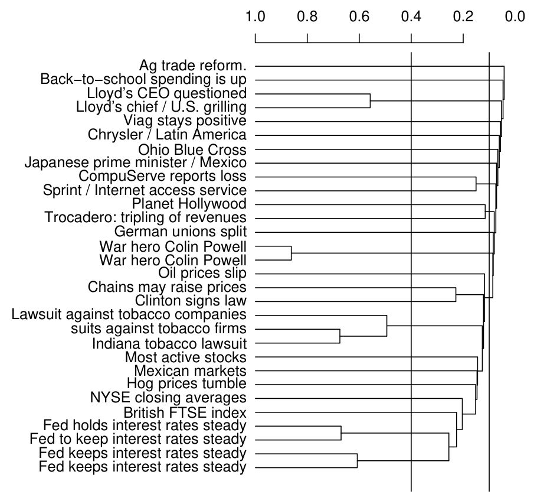
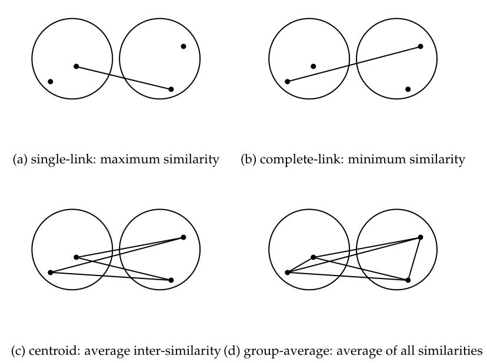
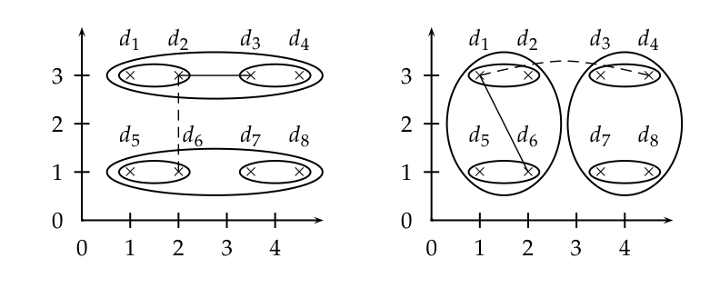
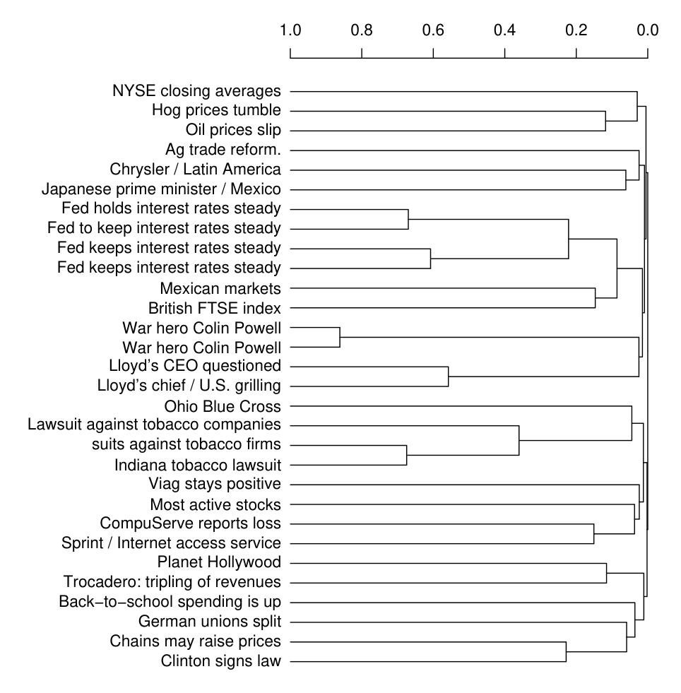
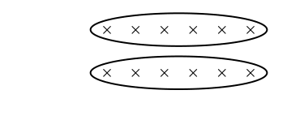
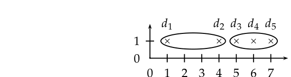
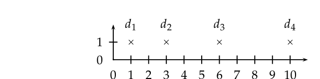
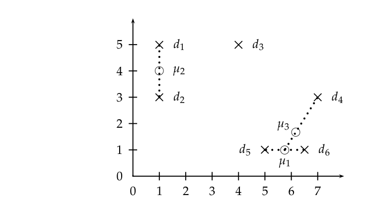
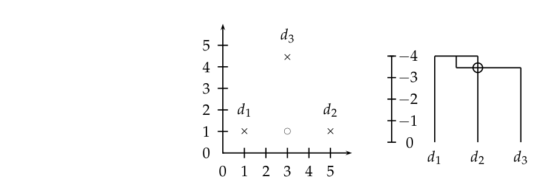
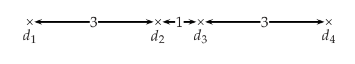

# 第 17 章 层次聚类

[返回系列目录](../introduction-to-information-retrieval.md) · [上一篇：第 16 章 平面聚类](./16-flat-clustering.md) · [下一篇：第 18 章 矩阵分解与潜在语义索引](./18-matrix-decompositions-and-latent-semantic-indexing.md)

原书印刷页 377–402；PDF 第 414–439 页。

<!-- source: PDF 414; printed: 377 -->

平面聚类高效且概念简单，但正如我们在第 16 章中所看到的，它也有一些缺点。第 16 章介绍的算法返回的是一个平面的、无结构的簇集合，需要预先指定簇的数量作为输入，并且是非确定性的。**层次聚类**（hierarchical clustering 或 hierarchic clustering）输出一个层次结构，这种结构比平面聚类返回的无结构簇集合包含更多信息。<sup>[1]</sup> 层次聚类不需要我们预先指定簇的数量，而且在信息检索（IR）中使用的大多数层次聚类算法都是确定性的。层次聚类的这些优点是以较低的效率为代价的。与 K-means 和 EM 的线性复杂度相比（参见第 364 页第 16.4 节），最常见的层次聚类算法的复杂度至少是文档数量的平方。

本章首先介绍凝聚式层次聚类（第 17.1 节），并在第 17.2–17.4 节中提出四种不同的凝聚算法，它们在所采用的相似度度量上有所不同：单连接（single-link）、全连接（complete-link）、组平均（group-average）和质心相似度（centroid similarity）。然后我们在第 17.5 节讨论层次聚类的最优性条件。第 17.6 节介绍自顶向下（或分裂式）层次聚类。第 17.7 节探讨自动为簇贴标签，这是人类在与聚类输出交互时必须解决的问题。我们在第 17.8 节讨论实现问题。第 17.9 节提供进一步阅读的指南，包括本书未涵盖的软层次聚类的参考文献。

在信息检索中，平面聚类和层次聚类的应用几乎没有区别。特别是，层次聚类适用于表 16.1（第 351 页；另见第 372 页第 16.6 节）中所示的任何应用。事实上，我们给出的文档集聚类示例就是层次化的。一般来说，当效率很重要时，我们选择平面聚类；而当平面聚类的潜在问题之一

> **脚注 1（原书第 377 页）**：在本章中，我们只考虑像图 17.1 所示的二叉树层次结构——但层次聚类可以很容易地扩展到其他类型的树。

<!-- source: PDF 415; printed: 378 -->

（结构不够、预定簇数量、非确定性）成为关注点时，我们选择层次聚类。此外，许多研究人员认为层次聚类比平面聚类产生更好的簇。然而，在这个问题上并没有达成共识（见第 17.9 节的参考文献）。

## 17.1 层次凝聚聚类

层次聚类算法要么是自顶向下的，要么是自底向上的。自底向上算法在开始时将每个文档视为一个单元素簇，然后连续合并（或凝聚）簇对，直到所有簇合并为一个包含所有文档的单一簇。因此，自底向上的层次聚类被称为**层次凝聚聚类**（hierarchical agglomerative clustering）或 **HAC**。自顶向下聚类需要一种分裂簇的方法。它通过递归地分裂簇来进行，直到达到单个文档。见第 17.6 节。在信息检索中，HAC 比自顶向下聚类更常用，也是本章的主要主题。

在查看第 17.2–17.4 节中 HAC 使用的具体相似度度量之前，我们首先介绍一种以图形方式描绘层次聚类的方法，讨论 HAC 的几个关键属性，并提出一个计算 HAC 的简单算法。

HAC 聚类通常被可视化为**树状图**（dendrogram），如图 17.1 所示。每次合并由一条水平线表示。水平线的 y 坐标是被合并的两个簇的相似度，其中文档被视为单元素簇。我们将这种相似度称为合并簇的**组合相似度**（combination similarity）。例如，在图 17.1 中，由 *Lloyd’s CEO questioned* 和 *Lloyd’s chief / U.S. grilling* 组成的簇的组合相似度约为 0.56。我们将单元素簇的组合相似度定义为其文档的自相似度（对于余弦相似度，该值为 1.0）。

通过从底层向上移动到顶部节点，树状图允许我们重建导致所描绘聚类的合并历史。例如，我们在图 17.1 中看到，两篇题为 *War hero Colin Powell* 的文档首先被合并，最后一次合并将 *Ag trade reform* 添加到由其他 29 篇文档组成的簇中。

HAC 的一个基本假设是合并操作是**单调的**（monotonic）。单调意味着如果 $s_1, s_2, \ldots, s_{K-1}$ 是 HAC 连续合并的组合相似度，那么 $s_1 \ge s_2 \ge \ldots \ge s_{K-1}$ 成立。非单调的层次聚类包含至少一个**倒置**（inversion）$s_i < s_{i+1}$，并且与我们在每一步都选择最佳可用合并的基本假设相矛盾。我们将在图 17.12 中看到一个倒置的例子。

层次聚类不需要预先指定簇的数量。然而，在某些应用中，我们希望像

<!-- source: PDF 416; printed: 379 -->



**图 17.1** 来自 Reuters-RCV1 的 30 篇文档的单连接聚类树状图。图中显示了树状图的两种可能切割：在 0.4 处切割成 24 个簇，在 0.1 处切割成 12 个簇。

图中文字：

- Ag trade reform.（农产品贸易改革）
- Back-to-school spending is up（返校季消费增加）
- Lloyd's CEO questioned（劳合社首席执行官受到质询）
- Lloyd's chief / U.S. grilling（劳合社负责人在美国受到严厉质询）
- Viag stays positive（Viag 保持乐观）
- Chrysler / Latin America（克莱斯勒／拉丁美洲）
- Ohio Blue Cross（俄亥俄蓝十字）
- Japanese prime minister / Mexico（日本首相／墨西哥）
- CompuServe reports loss（CompuServe 报告亏损）
- Sprint / Internet access service（Sprint／互联网接入服务）
- Planet Hollywood（Planet Hollywood）
- Trocadero: tripling of revenues（Trocadero 收入增至三倍）
- German unions split（德国工会产生分歧）
- War hero Colin Powell（战争英雄科林·鲍威尔）
- War hero Colin Powell（战争英雄科林·鲍威尔）
- Oil prices slip（油价下滑）
- Chains may raise prices（连锁企业可能提价）
- Clinton signs law（克林顿签署法律）
- Lawsuit against tobacco companies（针对烟草公司的诉讼）
- suits against tobacco firms（针对烟草企业的诉讼）
- Indiana tobacco lawsuit（印第安纳州烟草诉讼）
- Most active stocks（交易最活跃的股票）
- Mexican markets（墨西哥市场）
- Hog prices tumble（生猪价格大跌）
- NYSE closing averages（纽约证券交易所收盘平均指数）
- British FTSE index（英国富时指数）
- Fed holds interest rates steady（美联储维持利率不变）
- Fed to keep interest rates steady（美联储将维持利率不变）
- Fed keeps interest rates steady（美联储维持利率不变）
- Fed keeps interest rates steady（美联储维持利率不变）
- 1.0  0.8  0.6  0.4  0.2  0.0

<!-- source: PDF 417; printed: 380 -->

在平面聚类中那样得到不相交簇的划分。在这些情况下，需要在某处对层次结构进行切割。可以使用许多标准来确定切割点：

*   在预先指定的相似度水平上进行切割。例如，如果我们想要最小组合相似度为 0.4 的簇，我们在 0.4 处切割树状图。在图 17.1 中，在 $y = 0.4$ 处切割图形会产生 24 个簇（仅将具有高相似度的文档分组在一起），而在 $y = 0.1$ 处切割会产生 12 个簇（一个大型财经新闻簇和 11 个较小的簇）。
*   在两个连续组合相似度之间差距最大的地方切割树状图。可以说，这样大的差距表明了“自然”的聚类。再增加一个簇会显著降低聚类的质量，因此在这种急剧下降发生之前进行切割是可取的。这种策略类似于在图 16.8（第 366 页）的 K-means 图中寻找拐点（knee）。
*   应用式（16.11）（第 366 页）：

$$ K = \underset{K'}{\arg\min} [\operatorname{RSS}(K') + \lambda K'] $$

其中 $K'$ 指的是导致 $K'$ 个簇的层次结构切割，$\operatorname{RSS}$ 是残差平方和，$\lambda$ 是对每个额外簇的惩罚。除了 $\operatorname{RSS}$，也可以使用其他失真度量。

*   与平面聚类一样，我们也可以预先指定簇的数量 $K$，并选择产生 $K$ 个簇的切割点。

图 17.2 展示了一个简单、朴素的 HAC 算法。我们首先计算 $N \times N$ 的相似度矩阵 $C$。然后，算法执行 $N - 1$ 步，合并当前最相似的簇。在每次迭代中，合并最相似的两个簇，并更新 $C$ 中合并簇 $i$ 的行和列。<sup>[2]</sup> 聚类作为合并列表存储在 $A$ 中。$I$ 指示哪些簇仍然可以被合并。函数 $\operatorname{SIM}(i, m, j)$ 计算簇 $j$ 与簇 $i$ 和 $m$ 的合并簇之间的相似度。对于某些 HAC 算法，$\operatorname{SIM}(i, m, j)$ 仅仅是 $C[j][i]$ 和 $C[j][m]$ 的函数，例如，对于单连接，它是这两个值中的最大值。

我们现在将针对单连接和全连接聚类（第 17.2 节）以及组平均和质心聚类（第 17.3 和 17.4 节）的不同相似度度量来改进该算法。这四种 HAC 变体的合并标准如图 17.3 所示。

> **脚注 2（原书第 380 页）**：我们假设使用确定性的方法来打破平局，例如总是选择相对于文档集 $D$ 的子集全序中排在最前面的簇进行合并。

<!-- source: PDF 418; printed: 381 -->

```text
SIMPLEHAC(d1, . . . , dN)
1  for n ← 1 to N
2  do for i ← 1 to N
3     do C[n][i] ← SIM(dn, di)
4  I[n] ← 1 (跟踪活跃的簇)
5  A ← [] (将聚类组装为一系列合并操作)
6  for k ← 1 to N − 1
7  do ⟨i, m⟩ ← arg max_{⟨i,m⟩:i≠m ∧ I[i]=1 ∧ I[m]=1} C[i][m]
8     A.APPEND(⟨i, m⟩) (存储合并操作)
9     for j ← 1 to N
10    do C[i][j] ← SIM(i, m, j)
11       C[j][i] ← SIM(i, m, j)
12    I[m] ← 0 (停用簇)
13 return A
```

**图 17.2** 一个简单但低效的 HAC 算法。



**图 17.3** 四种 HAC 算法使用的不同簇相似度概念。簇间相似度（inter-similarity）是指来自不同簇的两个文档之间的相似度。

图中文字：(a) single-link: maximum similarity 单链接：最大相似度 (b) complete-link: minimum similarity 全链接：最小相似度 (c) centroid: average inter-similarity 质心：平均簇间相似度 (d) group-average: average of all similarities 组平均：所有相似度的平均值

<!-- source: PDF 419; printed: 382 -->



**图 17.4** 八个文档的单链接（左）和全链接（右）聚类。椭圆对应于连续的聚类阶段。左图：上方两个两点簇的单链接相似度是 $d_2$ 和 $d_3$ 的相似度（实线），它大于左侧两个两点簇的单链接相似度（虚线）。右图：上方两个两点簇的全链接相似度是 $d_1$ 和 $d_4$ 的相似度（虚线），它小于左侧两个两点簇的全链接相似度（实线）。

图中文字：$d_1, d_2, d_3, d_4, d_5, d_6, d_7, d_8$; 0, 1, 2, 3, 4

## 17.2 单链接与全链接聚类

在单链接聚类（single-link clustering 或 single-linkage clustering）中，两个簇的相似度是它们最相似成员的相似度（见图 17.3（a））<sup>[3]</sup>。这种单链接合并准则是局部的。我们仅仅关注两个簇彼此最接近的区域。簇中更远的部分以及簇的整体结构均未被考虑在内。

在全链接聚类（complete-link clustering 或 complete-linkage clustering）中，两个簇的相似度是它们最不相似成员的相似度（见图 17.3（b））。这等价于选择合并后直径最小的簇对。这种全链接合并准则是非局部的；聚类的整体结构会影响合并决策。这导致算法偏好直径较小的紧凑簇，而不喜欢细长、松散的簇，但同时也引起了对异常值（outlier）的敏感性。远离中心的一个单一文档可能会极大地增加候选合并簇的直径，并彻底改变最终的聚类结果。

图 17.4 描绘了八个文档的单链接和全链接聚类。前四个步骤是相同的，每步产生一个由一对（两个）文档组成的簇。然后，单链接聚类将上方两对合并（随后合并下方两对），因为根据簇相似度的最大相似度定义，这两个簇是最接近的。全链接

> **脚注 3（原书第 382 页）**：在本章中，我们将相似度等同于二维聚类图中的接近程度（proximity）。

<!-- source: PDF 420; printed: 383 -->



**图 17.5** 全链接聚类的树状图。图 17.1 中使用单链接聚类对相同的 30 个文档进行了聚类。

**图中标题译文**：农产品贸易改革；返校季消费增加；劳合社首席执行官受到质询；劳合社负责人在美国受到严厉质询；Viag 保持乐观；克莱斯勒／拉丁美洲；俄亥俄蓝十字；日本首相／墨西哥；CompuServe 报告亏损；Sprint／互联网接入服务；Planet Hollywood；Trocadero 收入增至三倍；德国工会产生分歧；战争英雄科林·鲍威尔；油价下滑；连锁企业可能提价；克林顿签署法律；针对烟草公司的诉讼；针对烟草企业的诉讼；印第安纳州烟草诉讼；交易最活跃的股票；墨西哥市场；生猪价格大跌；纽约证券交易所收盘平均指数；英国富时指数；美联储维持利率不变；美联储将维持利率不变；美联储维持利率不变。相同标题的重复出现仍按原图保留。

图中文字：1.0, 0.8, 0.6, 0.4, 0.2, 0.0; NYSE closing averages, Hog prices tumble, Oil prices slip, Ag trade reform., Chrysler / Latin America, Japanese prime minister / Mexico, Fed holds interest rates steady, Fed to keep interest rates steady, Fed keeps interest rates steady, Fed keeps interest rates steady, Mexican markets, British FTSE index, War hero Colin Powell, War hero Colin Powell, Lloyd's CEO questioned, Lloyd's chief / U.S. grilling, Ohio Blue Cross, Lawsuit against tobacco companies, suits against tobacco firms, Indiana tobacco lawsuit, Viag stays positive, Most active stocks, CompuServe reports loss, Sprint / Internet access service, Planet Hollywood, Trocadero: tripling of revenues, Back-to-school spending is up, German unions split, Chains may raise prices, Clinton signs law

<!-- source: PDF 421; printed: 384 -->



**图 17.6** 单链接聚类中的链式效应。单链接聚类中的局部准则可能会导致产生不理想的细长簇。

聚类则将左侧两对合并（然后合并右侧两对），因为根据簇相似度的最小相似度定义，它们是最接近的簇对。<sup>[4]</sup>

图 17.1 是一组文档的单链接聚类示例，图 17.5 是同一组文档的全链接聚类。当在图 17.5 中切断最后一次合并时，我们得到两个大小相似的簇（文档 1–16，从 NYSE closing averages 到 Lloyd’s chief / U.S. grilling，以及文档 17–30，从 Ohio Blue Cross 到 Clinton signs law）。在图 17.1 的树状图中，没有任何一种切割方式能给我们带来同样均衡的聚类结果。

单链接和全链接聚类都有图论（graph-theoretic）解释。定义 $s_k$ 为在第 $k$ 步合并的两个簇的组合相似度（combination similarity），并定义 $G(s_k)$ 为连接所有相似度至少为 $s_k$ 的数据点的图。那么，单链接聚类在第 $k$ 步之后的簇就是 $G(s_k)$ 的连通分量（connected component），而全链接聚类在第 $k$ 步之后的簇则是 $G(s_k)$ 的极大团（maximal clique）。连通分量是一个极大的连通点集，使得每对点之间都有一条路径相连。团（clique）是一个彼此完全链接的点集。

这些图论解释说明了单链接和全链接聚类这两个术语的由来。第 $k$ 步的单链接簇是极大的点集，这些点通过至少一条相似度 $s \ge s_k$ 的链接（单一链接）相连；第 $k$ 步的全链接簇是极大的点集，这些点通过相似度 $s \ge s_k$ 的链接彼此完全链接。

单链接和全链接聚类将簇质量的评估简化为一对文档之间的单一相似度：在单链接聚类中是两个最相似的文档，在全链接聚类中是两个最不相似的文档。基于一对文档的测量无法完全反映簇中文档的分布情况。因此，这两种算法经常产生不理想的簇也就不足为奇了。如图 17.6 所示，单链接聚类会产生松散细长的簇。由于合并准则是严格局部的，一条点链可以延伸很长

> **脚注 4（原书第 384 页）**：如果你对可能出现平局（ties）感到困扰，可以假设 $d_1$ 的坐标为 $(1 + \epsilon, 3 - \epsilon)$，而所有其他点都具有整数坐标。

<!-- source: PDF 422; printed: 385 -->



**图 17.7** 全链接聚类中的离群点。这五个文档的 x 坐标分别为 $1 + 2\epsilon, 4, 5 + 2\epsilon, 6$ 和 $7 - \epsilon$。全链接聚类创建了如图中椭圆所示的两个簇。最直观的两个簇的聚类是 $\{\{d_1\}, \{d_2, d_3, d_4, d_5\}\}$，但在全链接聚类中，离群点 $d_1$ 将 $\{d_2, d_3, d_4, d_5\}$ 分割开来，如图所示。

图中文字：$d_1, d_2, d_3, d_4, d_5, 0, 1, 2, 3, 4, 5, 6, 7$

距离，而不考虑正在形成的簇的整体形状。这种效应被称为**链式效应**（chaining）。

链式效应在图 17.1 中也很明显。单链接聚类的最后 11 次合并（0.1 线以上的那些）添加了单个文档或文档对，对应于一条链。图 17.5 中的全链接聚类避免了这个问题。当我们在最后一次合并处剪断树状图时，文档被分成大小大致相等的两组。通常，这比带有链的聚类是对数据更有用的组织方式。

然而，全链接聚类面临着一个不同的问题。它过于关注离群点（outliers），即那些不能很好地融入簇的全局结构的点。在图 17.7 的例子中，由于左边缘的离群点 $d_1$，四个文档 $d_2, d_3, d_4, d_5$ 被分开了（练习 17.1）。在这个例子中，全链接聚类没有找到最直观的簇结构。

### 17.2.1 HAC 的时间复杂度

图 17.2 中朴素 HAC 算法的复杂度为 $\Theta(N^3)$，因为在 $N - 1$ 次迭代的每一次中，我们都要穷举扫描 $N \times N$ 矩阵 $C$ 以寻找最大相似度。

对于本章讨论的四种 HAC 方法，一种更高效的算法是图 17.8 所示的优先队列算法。其时间复杂度为 $\Theta(N^2 \log N)$。$N \times N$ 相似度矩阵 $C$ 的行 $C[k]$ 在优先队列 $P$ 中按相似度降序排列。然后 $P[k].\operatorname{MAX}()$ 返回 $P[k]$ 中当前与 $\omega_k$ 相似度最高的簇，其中我们像第 16 章一样使用 $\omega_k$ 来表示第 $k$ 个簇。在创建了 $\omega_{k_1}$ 和 $\omega_{k_2}$ 的合并簇之后，$\omega_{k_1}$ 被用作其代表。函数 $\operatorname{SIM}$ 计算潜在合并对的相似度函数：单链接为最大相似度，全链接为最小相似度，GAAC（第 17.3 节）为平均相似度，质心聚类（第

<!-- source: PDF 423; printed: 386 -->

```text
EFFICIENTHAC(\vec{d}_1, \dots, \vec{d}_N)
 1 for n <- 1 to N
 2 do for i <- 1 to N
 3    do C[n][i].sim <- \vec{d}_n \cdot \vec{d}_i
 4       C[n][i].index <- i
 5    I[n] <- 1
 6    P[n] <- priority queue for C[n] sorted on sim
 7    P[n].DELETE(C[n][n]) (不需要自相似度)
 8 A <- []
 9 for k <- 1 to N - 1
10 do k_1 <- arg max_{k:I[k]=1} P[k].MAX().sim
11    k_2 <- P[k_1].MAX().index
12    A.APPEND(<k_1, k_2>)
13    I[k_2] <- 0
14    P[k_1] <- []
15    for each i with I[i] = 1 \wedge i \neq k_1
16    do P[i].DELETE(C[i][k_1])
17       P[i].DELETE(C[i][k_2])
18       C[i][k_1].sim <- SIM(i, k_1, k_2)
19       P[i].INSERT(C[i][k_1])
20       C[k_1][i].sim <- SIM(i, k_1, k_2)
21       P[k_1].INSERT(C[k_1][i])
22 return A
```

| 聚类算法 | $\operatorname{SIM}(i, k_1, k_2)$ |
| :--- | :--- |
| 单链接 (single-link) | $\max(\operatorname{SIM}(i, k_1), \operatorname{SIM}(i, k_2))$ |
| 全链接 (complete-link) | $\min(\operatorname{SIM}(i, k_1), \operatorname{SIM}(i, k_2))$ |
| 质心 (centroid) | $(\frac{1}{N_m}\vec{v}_m) \cdot (\frac{1}{N_i}\vec{v}_i)$ |
| 组平均 (group-average) | $\frac{1}{(N_m+N_i)(N_m+N_i-1)} [(\vec{v}_m + \vec{v}_i)^2 - (N_m + N_i)]$ |

计算 C[5]

| 1 | 2 | 3 | 4 | 5 |
|---|---|---|---|---|
| 0.2 | 0.8 | 0.6 | 0.4 | 1.0 |

创建 P[5]（通过排序）

| 2 | 3 | 4 | 1 |
|---|---|---|---|
| 0.8 | 0.6 | 0.4 | 0.2 |

合并 2 和 3，更新 2 的相似度，删除 3

| 2 | 4 | 1 |
|---|---|---|
| 0.3 | 0.4 | 0.2 |

删除并重新插入 2

| 4 | 2 | 1 |
|---|---|---|
| 0.4 | 0.3 | 0.2 |

**图 17.8** HAC 的优先队列算法。上：算法。中：四种不同的相似度度量。下：处理步骤 6 和 16-19 的示例。这是一个虚构的例子，展示了 $5 \times 5$ 矩阵 $C$ 的 $P[5]$。

<!-- source: PDF 424; printed: 387 -->

```text
SINGLELINKCLUSTERING(d_1, \dots, d_N)
 1 for n <- 1 to N
 2 do for i <- 1 to N
 3    do C[n][i].sim <- SIM(d_n, d_i)
 4       C[n][i].index <- i
 5    I[n] <- n
 6    NBM[n] <- arg max_{X \in \{C[n][i]:n \neq i\}} X.sim
 7 A <- []
 8 for n <- 1 to N - 1
 9 do i_1 <- arg max_{i:I[i]=i} NBM[i].sim
10    i_2 <- I[NBM[i_1].index]
11    A.APPEND(<i_1, i_2>)
12    for i <- 1 to N
13    do if I[i] = i \wedge i \neq i_1 \wedge i \neq i_2
14       then C[i_1][i].sim <- C[i][i_1].sim <- max(C[i_1][i].sim, C[i_2][i].sim)
15       if I[i] = i_2
16       then I[i] <- i_1
17    NBM[i_1] <- arg max_{X \in \{C[i_1][i]:I[i]=i \wedge i \neq i_1\}} X.sim
18 return A
```

**图 17.9** 使用 NBM 数组的单链接聚类算法。在合并两个簇 $i_1$ 和 $i_2$ 之后，第一个簇（$i_1$）代表合并后的簇。如果 $I[i] = i$，则 $i$ 是其当前簇的代表。如果 $I[i] \neq i$，则 $i$ 已经被合并到由 $I[i]$ 代表的簇中，因此在更新 $NBM[i_1]$ 时将被忽略。

17.4 节）。我们给出了如何处理 $C$ 的一行的示例（图 17.8，底部面板）。对于支持在 $\Theta(\log N)$ 时间内进行删除和插入的优先队列实现，第 1-7 行的循环为 $\Theta(N^2)$，第 9-21 行的循环为 $\Theta(N^2 \log N)$。因此，该算法的整体复杂度为 $\Theta(N^2 \log N)$。在函数 $\operatorname{SIM}$ 的定义中，$\vec{v}_m$ 和 $\vec{v}_i$ 分别是 $\omega_{k_1} \cup \omega_{k_2}$ 和 $\omega_i$ 的向量和，$N_m$ 和 $N_i$ 分别是 $\omega_{k_1} \cup \omega_{k_2}$ 和 $\omega_i$ 中的文档数量。

图 17.8 中 `EFFICIENTHAC` 的参数是一组向量（而不是一组通用文档），因为 GAAC 和质心聚类（第 17.3 节和第 17.4 节）需要向量作为输入。`EFFICIENTHAC` 的全链接版本也可以应用于未表示为向量的文档。

对于单链接，我们可以引入一个次优合并（next-best-merge, NBM）数组作为进一步的优化，如图 17.9 所示。NBM 记录每个簇的最佳合并对象。图 17.9 中的两个顶层 for 循环都是 $\Theta(N^2)$，因此单链接聚类的整体复杂度为 $\Theta(N^2)$。

<!-- source: PDF 425; printed: 388 -->



**图 17.10** 全链接聚类不具有最佳合并持久性。起初，$d_2$ 是 $d_3$ 的最佳合并簇。但在合并 $d_1$ 和 $d_2$ 之后，$d_4$ 成为了 $d_3$ 的最佳合并候选。在像单链接这样具有最佳合并持久性的算法中，$d_3$ 的最佳合并簇将是 $\{d_1, d_2\}$。

图中文字：$d_1, d_2, d_3, d_4, 0, 1, 2, 3, 4, 5, 6, 7, 8, 9, 10$

我们也能用 NBM 数组加速其他三种 HAC 算法吗？我们不能，因为只有单链接聚类具有**最佳合并持久性**（best-merge persistent）。假设在单链接聚类中，$\omega_k$ 的最佳合并簇是 $\omega_j$。那么在将 $\omega_j$ 与第三个簇 $\omega_i \neq \omega_k$ 合并后，$\omega_i$ 和 $\omega_j$ 的合并簇将成为 $\omega_k$ 的最佳合并簇（练习 17.6）。换句话说，在单链接聚类中，合并簇的最佳合并候选是其两个组成部分的最佳合并候选之一。这意味着在每次迭代中，$C$ 可以在 $\Theta(N)$ 时间内更新——通过对剩余的 $\le N$ 个簇中的每一个，在图 17.9 的第 14 行取两个值的简单最大值。

图 17.10 表明，全链接聚类不具备最佳合并持久性，这意味着我们不能使用 NBM 数组来加速聚类。在将 $d_3$ 的最佳合并候选 $d_2$ 与簇 $d_1$ 合并后，一个不相关的簇 $d_4$ 成为了 $d_3$ 的最佳合并候选。这是因为全链接合并准则是非局部的，并且可能会受到距离两个合并候选相遇区域很远的那些点的影响。

在实践中，与 $\Theta(N^2)$ 的单链接算法相比，$\Theta(N^2 \log N)$ 算法的效率损失很小，因为计算两个文档之间的相似度（例如，作为点积）比在排序中比较两个标量要慢一个数量级。本章中的所有四种 HAC 算法在相似度计算方面都是 $\Theta(N^2)$ 的。因此，在实践中选择其中一种算法时，复杂度的差异很少成为关注点。

**练习 17.1**
证明全链接聚类会产生如图 17.7 所示的两个簇的聚类结果。

## 17.3 组平均凝聚聚类

**组平均凝聚聚类**（Group-average agglomerative clustering）或 GAAC（见图 17.3 (d)）基于文档之间的所有相似度来评估簇的质量，从而避免了单链接和全链接准则的缺陷，这些准则将簇

<!-- source: PDF 426; printed: 389 -->

相似度等同于单对文档的相似度。GAAC 也被称为组平均聚类（group-average clustering）和平均链接聚类（average-link clustering）。GAAC 计算所有文档对（包括来自同一簇的文档对）的平均相似度 $\operatorname{SIM-GA}$。但是，自身相似度（self-similarities）不包含在该平均值中：

$$ \operatorname{SIM-GA}(\omega_i, \omega_j) = \frac{1}{(N_i + N_j)(N_i + N_j - 1)} \sum_{d_m \in \omega_i \cup \omega_j} \sum_{d_n \in \omega_i \cup \omega_j, d_n \neq d_m} \vec{d}_m \cdot \vec{d}_n \tag{17.1} $$

其中 $\vec{d}$ 是文档 $d$ 的长度归一化向量，$\cdot$ 表示点积，$N_i$ 和 $N_j$ 分别是 $\omega_i$ 和 $\omega_j$ 中的文档数量。

GAAC 的动机在于，我们在 HAC 中选择两个簇 $\omega_i$ 和 $\omega_j$ 作为下一次合并的目标是，合并后生成的簇 $\omega_k = \omega_i \cup \omega_j$ 应该是紧凑一致的（coherent）。为了判断 $\omega_k$ 的紧凑性，我们需要考察 $\omega_k$ 内所有的文档-文档相似度，包括那些发生在 $\omega_i$ 内部和 $\omega_j$ 内部的相似度。

我们可以高效地计算 $\operatorname{SIM-GA}$ 这一指标，因为各个向量相似度之和等于它们向量和的相似度：

$$ \sum_{d_m \in \omega_i} \sum_{d_n \in \omega_j} (\vec{d}_m \cdot \vec{d}_n) = \Big( \sum_{d_m \in \omega_i} \vec{d}_m \Big) \cdot \Big( \sum_{d_n \in \omega_j} \vec{d}_n \Big) \tag{17.2} $$

利用式（17.2），我们得到：

$$ \operatorname{SIM-GA}(\omega_i, \omega_j) = \frac{1}{(N_i + N_j)(N_i + N_j - 1)} \Big[ \Big( \sum_{d_m \in \omega_i \cup \omega_j} \vec{d}_m \Big)^2 - (N_i + N_j) \Big] \tag{17.3} $$

右侧的 $(N_i + N_j)$ 项是 $N_i + N_j$ 个值为 1.0 的自身相似度之和。利用这个技巧，我们可以在常数时间内计算簇相似度（假设我们已经得到了两个向量和 $\sum_{d_m \in \omega_i} \vec{d}_m$ 和 $\sum_{d_m \in \omega_j} \vec{d}_m$），而不是在 $\Theta(N_i N_j)$ 时间内。这很重要，因为我们需要能够在常数时间内计算 EFFICIENTHAC（图 17.8）中第 18 行和第 20 行的 SIM 函数，以实现 GAAC 的高效运行。请注意，对于两个单元素簇，式（17.3）等价于点积。

式（17.2）依赖于点积对向量加法的分配律。由于这对于高效计算 GAAC 聚类至关重要，因此该方法不能轻易应用于非实值向量的文档表示。此外，式（17.2）仅对点积成立。虽然本书中介绍的许多算法在点积、余弦相似度和欧几里得距离方面都有近乎等价的描述（参见第 14.1 节，第 291 页），但式（17.2）只能使用点积来表达。这是单链接/全链接聚类与 GAAC 之间的一个根本区别。前两者只需要一个

<!-- source: PDF 427; printed: 390 -->

相似度的方阵作为输入，并不关心这些相似度是如何计算出来的。

总结来说，GAAC 要求 (i) 文档表示为向量，(ii) 向量进行长度归一化，使得自身相似度为 1.0，以及 (iii) 使用点积作为向量之间以及向量和之间的相似度度量。

GAAC 和全链接聚类的合并算法是相同的，只是我们在图 17.8 中使用式（17.3）作为相似度函数。因此，GAAC 的总体时间复杂度与全链接聚类相同：$\Theta(N^2 \log N)$。与全链接聚类一样，GAAC 不具备最佳合并持久性（best-merge persistent）（练习 17.6）。这意味着 GAAC 不存在类似于图 17.9 中单链接聚类的 $\Theta(N^2)$ 算法。

我们也可以将组平均相似度定义为包含自身相似度：

$$ \operatorname{SIM-GA}'(\omega_i, \omega_j) = \frac{1}{(N_i+N_j)^2} \Big( \sum_{d_m \in \omega_i \cup \omega_j} \vec{d}_m \Big)^2 = \frac{1}{N_i+N_j} \sum_{d_m \in \omega_i \cup \omega_j} [\vec{d}_m \cdot \vec{\mu}(\omega_i \cup \omega_j)] \tag{17.4} $$

其中质心 $\vec{\mu}(\omega)$ 的定义如式（14.1）（第 292 页）所示。这个定义等价于将簇质量直观地定义为文档 $\vec{d}_m$ 与簇质心 $\vec{\mu}$ 的平均相似度。

自身相似度始终等于 1.0，这是长度归一化向量可能的最大值。在式（17.4）中，对于大小为 $i$ 的簇，自身相似度的比例为 $i/i^2 = 1/i$。这给小簇带来了不公平的优势，因为它们将拥有比例更多的自身相似度。对于相似度为 $s$ 的两个文档 $d_1, d_2$，我们有 $\operatorname{SIM-GA}'(d_1, d_2) = (1 + s)/2$。相比之下，$\operatorname{SIM-GA}(d_1, d_2) = s \leq (1 + s)/2$。这两个文档的相似度 $\operatorname{SIM-GA}(d_1, d_2)$ 与单链接、全链接和质心聚类中的相同。我们更倾向于式（17.3）中的定义，即从平均值中排除自身相似度，因为我们不想因为大簇的自身相似度比例较小而对其进行惩罚，并且我们希望在所有四种 HAC 算法中，文档对的相似度值 $s$ 保持一致。

**练习 17.2**
将组平均聚类应用于图 17.6 和 17.7 中的点。将它们映射到三维空间中单位球的表面，以获得长度归一化的向量。组平均聚类与单链接和全链接聚类不同吗？

<!-- source: PDF 428; printed: 391 -->


**图 17.11** 质心聚类的三次迭代。每次迭代合并质心最接近的两个簇。
图中文字：$d_1, d_2, d_3, d_4, d_5, d_6, \mu_1, \mu_2, \mu_3$

## 17.4 质心聚类

在质心聚类（centroid clustering）中，两个簇的相似度被定义为它们质心的相似度：

$$ \operatorname{SIM-CENT}(\omega_i, \omega_j) = \vec{\mu}(\omega_i) \cdot \vec{\mu}(\omega_j) \tag{17.5} $$
$$ = \Big( \frac{1}{N_i} \sum_{d_m \in \omega_i} \vec{d}_m \Big) \cdot \Big( \frac{1}{N_j} \sum_{d_n \in \omega_j} \vec{d}_n \Big) $$
$$ = \frac{1}{N_i N_j} \sum_{d_m \in \omega_i} \sum_{d_n \in \omega_j} \vec{d}_m \cdot \vec{d}_n \tag{17.6} $$

式（17.5）是质心相似度。式（17.6）表明，质心相似度等价于来自不同簇的所有文档对的平均相似度。因此，GAAC 和质心聚类之间的区别在于，GAAC 在计算平均成对相似度时考虑了所有文档对（图 17.3，(d)），而质心聚类排除了来自同一簇的文档对（图 17.3，(c)）。

图 17.11 展示了质心聚类的前三个步骤。前两次迭代形成了以 $\mu_1$ 为质心的簇 $\{d_5, d_6\}$ 和以 $\mu_2$ 为质心的簇 $\{d_1, d_2\}$，因为文档对 $\langle d_5, d_6 \rangle$ 和 $\langle d_1, d_2 \rangle$ 具有最高的质心相似度。在第三次迭代中，$\mu_1$ 和 $d_4$ 之间的质心相似度最高，生成了以 $\mu_3$ 为质心的簇 $\{d_4, d_5, d_6\}$。

与 GAAC 一样，质心聚类不具备最佳合并持久性，因此时间复杂度为 $\Theta(N^2 \log N)$（练习 17.6）。

与其他三种 HAC 算法相反，质心聚类不是单调的（monotonic）。可能会发生所谓的倒置（inversions）：相似度可能会在

<!-- source: PDF 429; printed: 392 -->


**图 17.12** 质心聚类不是单调的。位于 $(1+\epsilon, 1)$ 的文档 $d_1$、位于 $(5, 1)$ 的 $d_2$ 和位于 $(3, 1 + 2\sqrt{3})$ 的 $d_3$ 几乎等距，其中 $d_1$ 和 $d_2$ 彼此之间的距离比它们到 $d_3$ 的距离更近。这三个点的层次聚类中的非单调倒置在树状图中表现为相交的合并线。交点已用圆圈标出。
图中文字：$d_1, d_2, d_3$

聚类过程中增加，如图 17.12 中的例子所示，这里我们将相似度定义为负距离。在第一次合并中，$d_1$ 和 $d_2$ 的相似度为 $-(4 - \epsilon)$。在第二次合并中，$d_1$ 和 $d_2$ 的质心（圆圈）与 $d_3$ 的相似度为 $\approx -\cos(\pi/6) \times 4 = -\sqrt{3}/2 \times 4 \approx -3.46 > -(4 - \epsilon)$。这就是一个倒置的例子：在这两个连续的聚类步骤中，相似度增加了。在单调的 HAC 算法中，相似度在每次迭代中是单调递减的。

在一系列 HAC 聚类步骤中相似度增加，这与“小簇比大簇更紧凑”的基本假设相矛盾。树状图中的倒置表现为一条低于前一条合并线的水平合并线。图 17.1 和 17.5 中的所有合并线都高于它们的前驱节点，因为单链接和全链接聚类是单调聚类算法。

尽管质心聚类具有非单调性，但它仍经常被使用，因为它的相似度度量（两个质心的相似度）在概念上比 GAAC 中所有成对相似度的平均值更简单。只需图 17.11 就能理解质心聚类。而对于 GAAC，没有同样简单的图形可以解释其工作原理。

**练习 17.3**
对于固定的 $N$ 个文档集合，在单链接和全链接聚类中最多有 $N^2$ 个不同的簇间相似度。在 GAAC 和质心聚类中有多少个不同的簇相似度？

<!-- source: PDF 430; printed: 393 -->

## 17.5 HAC 的最优性

为了精确表述层次聚类的最优性条件，我们首先定义聚类 $\Omega = \{\omega_1, \dots, \omega_K\}$ 的组合相似度（combination similarity，记为 $\operatorname{COMB-SIM}$），即其 $K$ 个簇中最小的组合相似度：

$$
\operatorname{COMB-SIM}(\{\omega_1, \dots, \omega_K\}) = \min_k \operatorname{COMB-SIM}(\omega_k)
$$

回顾一下，由 $\omega_1$ 和 $\omega_2$ 合并而成的簇 $\omega$ 的组合相似度就是 $\omega_1$ 和 $\omega_2$ 的相似度（第 378 页）。

**最优聚类（OPTIMAL CLUSTERING）** 那么，如果所有包含 $k$ 个簇（$k \le K$）的聚类 $\Omega'$ 都具有更低的组合相似度，我们就定义 $\Omega = \{\omega_1, \dots, \omega_K\}$ 是最优的（optimal）：

$$
|\Omega'| \le |\Omega| \Rightarrow \operatorname{COMB-SIM}(\Omega') \le \operatorname{COMB-SIM}(\Omega)
$$

图 17.12 表明质心聚类不是最优的。聚类 $\{\{d_1, d_2\}, \{d_3\}\}$（当 $K = 2$ 时）的组合相似度为 $-(4 - \epsilon)$，而 $\{\{d_1, d_2, d_3\}\}$（当 $K = 1$ 时）的组合相似度为 -3.46。因此，在第一次合并中产生的聚类 $\{\{d_1, d_2\}, \{d_3\}\}$ 不是最优的，因为存在一个簇数更少（$\{\{d_1, d_2, d_3\}\}$）但组合相似度更高的聚类。质心聚类不是最优的，因为可能会发生逆转（inversion）。

**组合相似度（COMBINATION SIMILARITY）** 如果上述最优性定义仅适用于聚类及其合并历史，那么它的用途将非常有限。然而，我们可以证明（练习 17.4），对于三种非逆转算法，组合相似度可以直接从簇中读取，而无需知道其历史。这些组合相似度的直接定义如下。

**单链（single-link）** 簇 $\omega$ 的组合相似度是该簇的任意二分划分（bipartition）中的最小相似度，其中二分划分的相似度是来自两个部分中任意两篇文档之间的最大相似度：

$$
\operatorname{COMB-SIM}(\omega) = \min_{\{\omega':\omega'\subset\omega\}} \max_{d_i\in\omega'} \max_{d_j\in\omega-\omega'} \operatorname{SIM}(d_i, d_j)
$$

其中每个 $\langle\omega', \omega - \omega'\rangle$ 都是 $\omega$ 的一个二分划分。

**全链（complete-link）** 簇 $\omega$ 的组合相似度是 $\omega$ 中任意两点之间的最小相似度：$\min_{d_i\in\omega} \min_{d_j\in\omega} \operatorname{SIM}(d_i, d_j)$。

**GAAC** 簇 $\omega$ 的组合相似度是 $\omega$ 中所有成对相似度的平均值（其中自相似度不包含在平均值中）：式（17.3）。

如果我们使用这些组合相似度的定义，那么最优性就是一组簇的属性，而不是产生这组簇的过程的属性。

<!-- source: PDF 431; printed: 394 -->

现在我们可以通过对簇的数量 $K$ 进行数学归纳来证明单链聚类的最优性。我们将给出没有两对文档具有相同相似度的情况下的证明，但它很容易扩展到存在平局（ties）的情况。

证明的归纳基础是，包含 $K = N$ 个簇的聚类的组合相似度为 1.0，这是可能的最大值。归纳假设是，包含 $K$ 个簇的单链聚类 $\Omega_K$ 是最优的：对于所有的 $\Omega'_K$，都有 $\operatorname{COMB-SIM}(\Omega_K) \ge \operatorname{COMB-SIM}(\Omega'_K)$。反证法假设，我们通过合并 $\Omega_K$ 中最相似的两个簇获得的聚类 $\Omega_{K-1}$ 不是最优的，相反，不同的合并序列 $\Omega'_K, \Omega'_{K-1}$ 导致了包含 $K - 1$ 个簇的最优聚类。我们可以将 $\Omega'_{K-1}$ 是最优的而 $\Omega_{K-1}$ 不是最优的这一假设写为 $\operatorname{COMB-SIM}(\Omega'_{K-1}) > \operatorname{COMB-SIM}(\Omega_{K-1})$。

情况 1：由 $s = \operatorname{COMB-SIM}(\Omega'_{K-1})$ 链接的两篇文档在 $\Omega_K$ 中处于同一个簇中。它们只有在产生 $\Omega_K$ 的合并序列中发生过相似度小于 $s$ 的合并时，才可能在同一个簇中。这意味着 $s > \operatorname{COMB-SIM}(\Omega_K)$。因此，$\operatorname{COMB-SIM}(\Omega'_{K-1}) = s > \operatorname{COMB-SIM}(\Omega_K) > \operatorname{COMB-SIM}(\Omega'_K) > \operatorname{COMB-SIM}(\Omega'_{K-1})$。矛盾。

情况 2：由 $s = \operatorname{COMB-SIM}(\Omega'_{K-1})$ 链接的两篇文档在 $\Omega_K$ 中不在同一个簇中。但是 $s = \operatorname{COMB-SIM}(\Omega'_{K-1}) > \operatorname{COMB-SIM}(\Omega_{K-1})$，因此单链合并规则在处理 $\Omega_K$ 时应该已经合并了这两个簇。矛盾。

因此，$\Omega_{K-1}$ 是最优的。

与单链聚类相反，全链聚类和 GAAC 不是最优的，如下例所示：


**示意图（原书未编号）**：证明全链聚类和 GAAC 非最优性的示例。
图中文字：$d_1, d_2, d_3, d_4, 3, 1, 3$

这两种算法都首先合并距离为 1 的两个点（$d_2$ 和 $d_3$），因此无法找到包含两个簇的聚类 $\{\{d_1, d_2\}, \{d_3, d_4\}\}$。但是根据全链聚类和 GAAC 的最优性标准，$\{\{d_1, d_2\}, \{d_3, d_4\}\}$ 是最优的。

然而，全链聚类和 GAAC 的合并标准比单链聚类的合并标准更好地近似了近似球形（approximate sphericity）这一期望特性。在许多应用中，我们需要球形簇。因此，尽管单链聚类可能因为其最优性乍看起来更可取，但在许多文档聚类应用中，它是相对于错误的标准而言的最优。

表 17.1 总结了本章介绍的四种 HAC 算法的性质。我们推荐在文档聚类中使用 GAAC，因为它通常是能为应用产生具有最佳

<!-- source: PDF 432; printed: 395 -->

| 方法 (method) | 组合相似度 (combination similarity) | 时间复杂度 (time compl.) | 最优？(optimal?) | 评论 (comment) |
|---|---|---|---|---|
| 单链 (single-link) | 任意两篇文档的最大簇间相似度 | $\Theta(N^2)$ | 是 | 链式效应 |
| 全链 (complete-link) | 任意两篇文档的最小簇间相似度 | $\Theta(N^2 \log N)$ | 否 | 对离群点敏感 |
| 组平均 (group-average) | 所有相似度的平均值 | $\Theta(N^2 \log N)$ | 否 | 大多数应用的最佳选择 |
| 质心 (centroid) | 平均簇间相似度 | $\Theta(N^2 \log N)$ | 否 | 可能发生逆转 |

▶ **表 17.1** HAC 算法比较。

性质的聚类的方法。它不受链式效应、对离群点敏感以及逆转的影响。

这个推荐有两个例外。首先，对于非向量表示，GAAC 不适用，通常应使用全链方法进行聚类。

**首篇报道检测（FIRST STORY DETECTION）** 其次，在某些应用中，聚类的目的不是创建完整的层次结构或对整个文档集进行穷举划分。例如，首篇报道检测（first story detection）或新颖性检测（novelty detection）是在新闻报道流中检测事件首次出现的任务。解决该任务的一种方法是，在短时间内通过网络发送的文档中找到一个紧密的簇，并且这些文档与之前的所有文档都不相似。例如，在 2001 年 9 月 11 日世界贸易中心遇袭后的几分钟内通过网络发送的文档就构成了这样一个簇。单链聚类的变体可以在这项任务上表现良好，因为在这种情况下，重要的是向量空间中小部分的结构，而不是全局结构。

类似地，我们将在第 19.6 节（第 440 页）中描述一种 Web 上的重复检测方法，其中单链聚类以并查集（union-find）算法的形式被使用。同样，决定一组文档是否互为重复项并不受距离较远的文档的影响，因此单链聚类是重复检测的一个好选择。

**练习 17.4**
证明组合相似度的两种定义的等价性：第 378 页的过程定义和第 393 页的静态定义。

## 17.6 分裂式聚类

**自顶向下聚类（TOP-DOWN CLUSTERING）** 到目前为止，我们只讨论了凝聚式聚类，但簇层次结构也可以自顶向下生成。这种层次聚类的变体被称为自顶向下聚类（top-down clustering）或分裂式聚类（divisive clustering）。我们从顶部开始，将所有文档放在一个簇中。该簇使用平面聚类算

<!-- source: PDF 433; printed: 396 -->

法进行分裂。此过程递归应用，直到每篇文档都处于其自己的单元素簇中。

自顶向下聚类在概念上比自底向上聚类更复杂，因为我们需要第二个平面聚类算法作为“子程序”。它的优点是，如果我们不生成一直向下到单个文档叶节点的完整层次结构，它会更高效。对于固定数量的顶层，使用像 K-means 这样高效的平面算法，自顶向下算法在文档和簇的数量上是线性的。因此，它们的运行速度比 HAC 算法快得多，后者至少是二次方的。

有证据表明，在某些情况下，分裂式算法比自底向上算法产生更准确的层次结构。参见第 17.9 节中关于二分 K-means（bisecting K-means）的参考文献。自底向上的方法基于局部模式做出聚类决策，最初并不考虑全局分布。这些早期的决策是无法撤销的。自顶向下聚类在做出顶层划分决策时，得益于关于全局分布的完整信息。

## 17.7 簇标签分配

在平面聚类和层次聚类的许多应用中，特别是在分析任务和用户界面中（参见第 351 页表 16.1 中的应用），人类用户需要与簇进行交互。在这种环境下，我们必须为簇分配标签（label），以便用户能够了解簇的内容。

**差异性簇标签分配（DIFFERENTIAL CLUSTER LABELING）** 差异性簇标签分配（differential cluster labeling）通过比较一个簇与其他簇中的词项分布来选择簇标签。我们在第 13.5 节（第 271 页）中介绍的特征选择方法都可以用于差异性簇标签分配。<sup>[5]</sup> 特别是，互信息（MI）（第 13.5.1 节，第 272 页）或等价的信息增益以及 $\chi^2$ 检验（第 13.5.2 节，第 275 页）将识别出能够表征一个簇以区别于其他簇的簇标签。将差异性检验与对罕见词项的惩罚相结合，通常能给出最好的标签分配结果，因为罕见词项不一定能代表整个簇。

我们在表 17.2 中将三种标签分配方法应用于 K-means 聚类。在这个例子中，MI 和 $\chi^2$ 之间几乎没有区别。因此我们省略了后者。

**簇内标签分配（CLUSTER-INTERNAL LABELING）** 簇内标签分配（cluster-internal labeling）计算出的标签仅依赖于簇本身，而不依赖于其他簇。用最靠近质心的文档的标题来标记簇是一种簇内方法。标题比词项列表更容易阅读。完整的标题还可以包含未能进入 MI 选择的前 10 个词项的重要上下文。在 Web 上，锚文本可以

> **脚注 5（原书第 396 页）**：选择最频繁的词项是我们在第 13.5 节中讨论的一种非差异性特征选择技术。它也可以用于为簇分配标签。

<!-- source: PDF 434; printed: 397 -->

发挥与标题类似的作用，因为指向页面的锚文本可以作为其内容的简明摘要。

| | | 标签分配方法 (labeling method) | |
|---|---|---|---|
| **簇** | **文档数 (# docs)** | **质心 (centroid)** | **互信息 (mutual information)** | **标题 (title)** |
| 4 | 622 | oil plant mexico production crude power **000 refinery gas bpd** | **plant oil production barrels crude bpd mexico dolly capacity petroleum** | MEXICO: Hurricane Dolly heads for Mexico coast |
| 9 | 1017 | police security russian people military peace killed told **grozny court** | **police killed military security peace told troops forces rebels people** | RUSSIA: Russia's Lebed meets rebel chief in Chechnya |
| 10 | 1259 | 00 000 tonnes traders futures wheat prices **cents september tonne** | **delivery traders futures tonne tonnes desk wheat prices 000 00** | USA: Export Business - Grain/oilseeds complex |

▶ **表 17.2 自动计算的簇标签。** 这是对 Reuters-RCV1 前 10,000 篇文档进行 K-means 聚类得到的十个簇中的三个（4、9 和 10）。最后三列显示了通过三种标签分配方法计算出的簇摘要：质心中权重最高的词项（质心）、互信息，以及最接近簇质心的文档标题（标题）。仅被前两种方法之一选中的词项以粗体显示。

在表 17.2 中，簇 9 的标题表明其许多文档是关于车臣冲突的，而互信息（MI）词项并未揭示这一事实。然而，单个文档不太可能代表簇中的所有文档。簇 4 就是一个例子，其选定的标题具有误导性。该簇的主要主题是石油。关于飓风多莉（Dolly）的文章之所以最终出现在这个簇中，仅仅是因为它对石油价格产生了影响。

我们也可以使用簇质心中具有高权重的词项列表作为标签。这种高权重的词项（或者更好的是短语，特别是名词短语）通常比少数几个标题更能代表该簇，即使它们没有像差异化方法那样经过区分度过滤。然而，与精心设计的标题相比，用户需要花费更多时间来消化短语列表。

簇内方法是高效的，但它们无法区分在整个文档集中频繁出现的词项与仅在簇中频繁出现的词项。像 year 或 Tuesday 这样的词项可能是簇中最频繁出现的，但它们对于理解像石油这样具有特定主题的簇的内容并没有帮助。

在表 17.2 中，质心方法比互信息（MI）方法（forces, desk）选择了更多无信息的词项（000, court, cents, september），但大多数被选

<!-- source: PDF 435; printed: 398 -->

中的词项（无论是哪种方法）都是很好的描述符。通过浏览选定的词项，我们可以很好地了解簇中的文档。

对于层次聚类，簇标签分配会出现额外的复杂性。我们不仅需要区分树中的内部节点与其兄弟节点，还需要区分它与其父节点和子节点。根据定义，子节点中的文档也是其父节点的成员，因此我们不能使用朴素的差异化方法来寻找区分父节点与其子节点的标签。然而，基于整体文档集频率和在给定簇中普遍程度相结合的更复杂的标准，可以确定一个词项对于子节点还是父节点是更具信息量的标签（参见第 17.9 节）。

## 17.8 实现说明

大多数需要计算大量点积的问题都能从倒排索引中受益。层次凝聚聚类（HAC）也是如此。如果存在许多零相似度——要么是因为许多文档不共享任何词项，要么是因为使用了激进的停用词表——那么倒排索引带来的计算节省是巨大的。

在低维空间中，可以进行更激进的优化，使得大多数成对相似度的计算变得不必要（练习 17.10）。然而，在高维空间中尚不知道有这样的算法。我们在 kNN 分类中遇到了同样的问题（参见第 14.7 节，第 314 页）。

在高维空间中对大型文档集使用 GAAC 时，我们必须注意避免密集的质心。对于密集的质心，聚类可能需要 $\Theta(MN^2 \log N)$ 的时间，其中 $M$ 是词汇表的大小，而全链接聚类的时间复杂度为 $\Theta(M_{\text{ave}}N^2 \log N)$，其中 $M_{\text{ave}}$ 是文档词汇表的平均大小。因此，对于大型词汇表，全链接聚类可能比未优化的 GAAC 实现更高效。我们在第 16 章（第 365 页）的 K-means 聚类背景下讨论了这个问题，并提出了两种解决方案：截断质心（仅保留高权重词项）以及使用稀疏中心点（medoids）代替密集质心来表示簇。这些优化也可以应用于 GAAC 和质心聚类。

即使有这些优化，HAC 算法的时间复杂度均为 $\Theta(N^2)$ 或 $\Theta(N^2 \log N)$，因此对于 1,000,000 或更多文档的大型集合是不可行的。对于如此大的集合，HAC 只能与像 K-means 这样的平面聚类算法结合使用。回想一下，K-means 需要一组种子作为初始化（图 16.5，第 361 页）。如果这些种子选择不当，那么产生的聚类质量将会很差。我们可以采用 HAC 算法来计算高质量的种子。如果将 HAC 算法应用于大小为 $\sqrt{N}$ 的文档子集，那么结合 HAC 种子的 K-means 的整体运行时间

<!-- source: PDF 436; printed: 399 -->

生成为 $\Theta(N)$。这是因为将二次算法应用于大小为 $\sqrt{N}$ 的样本，其整体复杂度为 $\Theta(N)$。对于 $\Theta(N^2 \log N)$ 的算法，可以进行适当的调整以保证线性。该算法被称为 **Buckshot 算法** (Buckshot algorithm)。它结合了 HAC 的确定性和较高可靠性以及 K-means 的高效性。

## 17.9 参考文献和进一步阅读

关于聚类的优秀综合综述是 (Jain et al. 1999)。特定 HAC 算法的早期参考文献包括 (King 1967)（单链接）、(Sneath and Sokal 1973)（全链接、GAAC）和 (Lance and Williams 1967)（讨论了多种层次聚类算法）。图 17.9 中的单链接算法类似于构建最小生成树的 **Kruskal 算法** (Kruskal's algorithm)。Cormen 等人 (1990, Theorem 23.1) 提供了 Kruskal 算法正确性的图论证明（类似于第 17.5 节中的证明）。关于最小生成树和单链接聚类之间的联系，请参见练习 17.5。

人们经常声称层次聚类算法比平面聚类算法产生更好的聚类结果 (Jain and Dubes (1988, p. 140), Cutting et al. (1992), Larsen and Aone (1999))，尽管最近有实验结果表明情况恰恰相反 (Zhao and Karypis 2002)。即使在平均表现上没有达成共识，毫无疑问，EM 和 K-means 的结果具有高度可变性，因为它们通常会收敛到质量较差的局部最优解。我们在这里介绍的 HAC 算法是确定性的，因此更具可预测性。

全链接、组平均和质心聚类的复杂度有时被给出为 $\Theta(N^2)$ (Day and Edelsbrunner 1984, Voorhees 1985b, Murtagh 1983)，因为文档相似度计算比简单的比较（在计算出 $N \times N$ 相似度矩阵后的合并步骤中执行的主要操作）要昂贵一个数量级。

这里描述的质心算法归功于 Voorhees (1985b)。Voorhees 建议在检索应用中使用全链接和质心聚类，而不是单链接聚类。Buckshot 算法最初由 Cutting 等人 (1993) 发表。Allan 等人 (1998) 将单链接聚类应用于首发报道检测 (first story detection)。

这里未讨论的一项重要 HAC 技术是 **Ward 方法** (Ward's method) (Ward Jr. 1963, El-Hamdouchi and Willett 1986)，也称为最小方差聚类。在每一步中，它选择具有最小残差平方和（RSS）的合并（第 16 章，第 360 页）。Ward 方法中的合并准则（所有个体到质心距离的函数）与 GAAC 中的合并准则（所有个体到质心相似度的函数）密切相关。

<!-- source: PDF 437; printed: 400 -->

尽管为簇分配标签对于使聚类结果有用非常重要，但在这方面所做的工作相对较少。Popescul 和 Ungar (2000) 结合词项的 $\chi^2$ 和文档集频率取得了良好的结果。Glover 等人 (2002b) 使用信息增益为网页簇分配标签。Stein 和 zu Eissen 的方法是基于本体的 (2004)。层次结构中节点标签分配的更复杂问题（需要区分父节点的更通用标签和子节点的更具体标签）由 Glover 等人 (2002a) 以及 Treeratpituk 和 Callan (2006) 解决。一些聚类算法试图首先找到一组标签，然后围绕这些标签构建（通常是重叠的）簇，从而完全避免了标签分配的问题 (Zamir and Etzioni 1999, Käki 2005, Osiński and Weiss 2005)。我们不知道有任何全面的研究将这种“基于标签”的聚类质量与本章及第 16 章中讨论的聚类算法进行比较。原则上，多文档摘要的工作 (McKeown and Radev 1995) 也适用于簇标签分配，但多文档摘要通常比为簇分配标签所需的短文本片段更长（参见第 8.7 节，第 170 页）。以用户能够理解的方式呈现簇是一个用户界面（UI）问题。我们推荐阅读 (Baeza-Yates and Ribeiro-Neto 1999, ch. 10) 以了解信息检索中的用户界面。

高效的分裂算法的一个例子是二分 K-means (Steinbach et al. 2000)。**谱聚类** (Spectral clustering) 算法 (Kannan et al. 2000, Dhillon 2001, Zha et al. 2001, Ng et al. 2001a)，包括主方向分裂划分 (PDDP)（其二分决策基于 SVD，见第 18 章）(Boley 1998, Savaresi and Boley 2004)，在计算上比二分 K-means 更昂贵，但具有确定性的优点。

与 K-means 和 EM 不同，大多数层次聚类算法没有概率解释。基于模型的层次聚类 (Vaithyanathan and Dom 2000, Kamvar et al. 2002, Castro et al. 2004) 是一个例外。

第 16.3 节（第 356 页）中描述的评估方法也适用于层次聚类。Fowlkes 和 Mallows (1983)、Larsen 和 Aone (1999) 以及 Sahoo 等人 (2006) 讨论了针对层次结构的专门评估指标。

R 环境 (R Development Core Team 2005) 为层次聚类提供了良好的支持。R 函数 `hclust` 实现了单链接、全链接、组平均和质心聚类；以及 Ward 方法。提供的另一个选项是 `median` 聚类，它通过中心点（medoid）来表示每个簇（参见第 16 章中的 k-medoids，第 365 页）。软件包 CLUTO (http://glaros.dtc.umn.edu/gkhome/views/cluto) 提供了对高维空间中向量聚类的支持。

<!-- source: PDF 438; printed: 401 -->

## 17.10 习题

**习题 17.5**
单链接聚类也可以通过图的**最小生成树**（minimum spanning tree）来计算。最小生成树以尽可能小的代价连接图的顶点，其中代价定义为图的所有边的代价之和。在我们的例子中，边的代价是两个文档之间的距离。证明如果 $\Delta_{k-1} > \Delta_k > \ldots > \Delta_1$ 是最小生成树的边的代价，那么这些边对应于构建单链接聚类时的 $k - 1$ 次合并。

**习题 17.6**
证明单链接聚类是最佳合并持久的（best-merge persistent），而 GAAC 和质心聚类不是最佳合并持久的。

**习题 17.7**

- **a.** 考虑在一个包含两种不同语言文档的文档集上运行 2-均值（2-means）聚类。你期望得到什么结果？
- **b.** 当运行 HAC 算法时，你期望得到相同的结果吗？

**习题 17.8**
下载 Reuters-21578。仅保留属于 *crude*、*interest* 和 *grain* 类别的文档。丢弃属于这三个类别中多个类别的文档。计算这些文档的 (i) 单链接聚类，(ii) 全链接聚类，(iii) GAAC，(iv) 质心聚类。(v) 在每个树状图从上往下的第二个分支处进行剪切，以获得 $K = 3$ 个簇。计算这 4 种聚类的兰德指数（Rand index）。哪种聚类方法表现最好？

**习题 17.9**
假设一次 HAC 运行发现 $K = 7$ 的聚类在某个预先选择的聚类优度度量上具有最高值。我们是否在所有 $K = 7$ 的聚类中找到了具有最高值的聚类？

**习题 17.10**
考虑在一条直线上对 $N$ 个点产生单链接聚类的任务：

```text
---x------x---x---x---------x-------x-------x--->
```

证明我们总共只需要计算大约 $N$ 个相似度。对于直线上的一组点，单链接聚类的整体复杂度是多少？

**习题 17.11**
证明单链接、全链接和组平均聚类在第 378 页定义的意义上是单调的。

**习题 17.12**
对于 $N$ 个点，存在 $\le N^K$ 种不同的划分为 $K$ 个簇的平面聚类（第 16.2 节，第 356 页）。$N$ 个文档的不同层次聚类（或树状图）的数量是多少？对于给定的 $K$ 和 $N$，是平面聚类更多还是层次聚类更多？

<!-- source: PDF 439; printed: 402 -->

<!-- 原书此页为空白，仅有重复的版本页脚。 -->

[返回系列目录](../introduction-to-information-retrieval.md) · [上一篇：第 16 章 平面聚类](./16-flat-clustering.md) · [下一篇：第 18 章 矩阵分解与潜在语义索引](./18-matrix-decompositions-and-latent-semantic-indexing.md)
