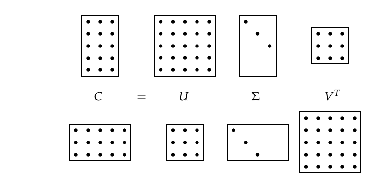
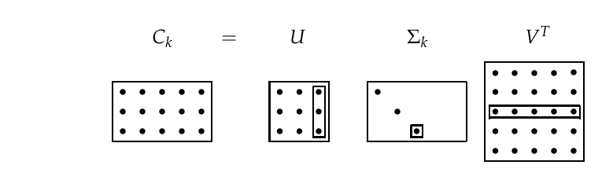
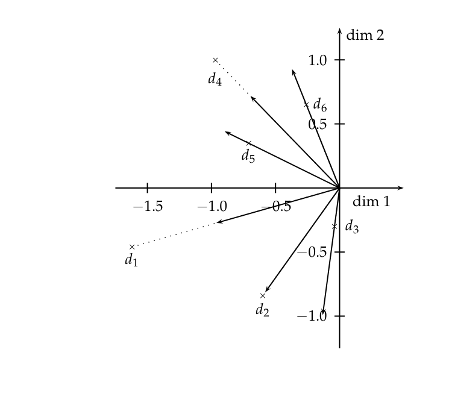

# 第 18 章 矩阵分解与潜在语义索引

[返回系列目录](../introduction-to-information-retrieval.md) · [上一篇：第 17 章 层次聚类](./17-hierarchical-clustering.md) · [下一篇：第 19 章 Web 搜索基础](./19-web-search-basics.md)

原书印刷页 403–420；PDF 第 440–457 页。

<!-- source: PDF 440; printed: 403 -->

在第 123 页，我们引入了词项-文档矩阵（term-document matrix）的概念：一个 $M \times N$ 的矩阵 $C$，其每一行代表一个词项，每一列代表文档集中的一篇文档。即使对于中等规模的文档集，词项-文档矩阵 $C$ 也可能有数万行和数万列。在第 18.1.1 节中，我们首先介绍一类线性代数运算，称为矩阵分解（matrix decomposition）。在第 18.2 节中，我们使用一种特殊形式的矩阵分解来构建词项-文档矩阵的低秩近似（low-rank approximation）。在第 18.3 节中，我们探讨这种低秩近似在文档索引和检索中的应用，该技术被称为潜在语义索引（latent semantic indexing）。尽管潜在语义索引尚未成为信息检索中评分和排序的重要力量，但它仍然是包括文本文档集在内的许多领域中一种引人入胜的聚类方法（第 16.6 节，第 372 页）。了解其全部潜力仍然是活跃的研究领域。

不需要复习线性代数的读者可以跳过第 18.1 节，不过特别推荐阅读例 18.1，因为它突出了我们在本章后面将利用的特征值的一个性质。

## 18.1 线性代数回顾

我们简要回顾一些必要的线性代数背景知识。设 $C$ 为一个元素为实数的 $M \times N$ 矩阵；对于词项-文档矩阵，所有元素实际上都是非负的。矩阵的秩（rank）是其中线性无关的行（或列）的数量；因此，$\operatorname{rank}(C) \leq \min\{M, N\}$。所有非对角线元素均为零的 $r \times r$ 方阵称为对角矩阵（diagonal matrix）；它的秩等于非零对角线元素的数量。如果这种对角矩阵的所有 $r$ 个对角线元素都是 1，则称其为 $r$ 维单位矩阵（identity matrix），用 $I_r$ 表示。

对于 $M \times M$ 方阵 $C$ 和不全为零的向量 $\vec{x}$，满足

<!-- source: PDF 441; printed: 404 -->

$C\vec{x} = \lambda\vec{x}$ 的 $\lambda$ 值

$$ C\vec{x} = \lambda\vec{x} \tag{18.1} $$

称为 $C$ 的特征值（eigenvalue）。满足式（18.1）中特征值 $\lambda$ 的 $N$ 维向量 $\vec{x}$ 是相应的右特征向量（right eigenvector）。对应于绝对值最大的特征值的特征向量称为主特征向量（principal eigenvector）。类似地，$C$ 的左特征向量（left eigenvector）是满足以下条件的 $M$ 维向量 $y$：

$$ \vec{y}^T C = \lambda\vec{y}^T. \tag{18.2} $$

$C$ 的非零特征值的数量最多为 $\operatorname{rank}(C)$。

矩阵的特征值可以通过求解特征方程（characteristic equation）来找到，该方程是通过将式（18.1）重写为 $(C - \lambda I_M)\vec{x} = 0$ 的形式得到的。那么 $C$ 的特征值就是 $|(C - \lambda I_M)| = 0$ 的解，其中 $|S|$ 表示方阵 $S$ 的行列式（determinant）。方程 $|(C - \lambda I_M)| = 0$ 是关于 $\lambda$ 的 $M$ 阶多项式方程，最多可以有 $M$ 个根，这些根就是 $C$ 的特征值。这些特征值通常可以是复数，即使 $C$ 的所有元素都是实数。

我们现在进一步探讨特征值和特征向量的一些性质，为下文第 18.2 节中奇异值分解的核心思想做准备。首先，我们来看矩阵-向量乘法与特征值之间的关系。

**例 18.1：** 考虑矩阵

$$ S = \begin{pmatrix} 30 & 0 & 0 \\ 0 & 20 & 0 \\ 0 & 0 & 1 \end{pmatrix}. $$

显然，该矩阵的秩为 3，并且有 3 个非零特征值 $\lambda_1 = 30$、$\lambda_2 = 20$ 和 $\lambda_3 = 1$，对应的三个特征向量为

$$ \vec{x}_1 = \begin{pmatrix} 1 \\ 0 \\ 0 \end{pmatrix}, \vec{x}_2 = \begin{pmatrix} 0 \\ 1 \\ 0 \end{pmatrix} \text{ 和 } \vec{x}_3 = \begin{pmatrix} 0 \\ 0 \\ 1 \end{pmatrix}. $$

对于每个特征向量，乘以 $S$ 的作用就像我们将该特征向量乘以单位矩阵的某个倍数；每个特征向量的倍数不同。现在，考虑一个任意向量，例如 $\vec{v} = \begin{pmatrix} 2 \\ 4 \\ 6 \end{pmatrix}$。我们总是可以将 $\vec{v}$ 表示为 $S$ 的三个特征向量的线性组合；在当前例子中，我们有

$$ \vec{v} = \begin{pmatrix} 2 \\ 4 \\ 6 \end{pmatrix} = 2\vec{x}_1 + 4\vec{x}_2 + 6\vec{x}_3. $$

<!-- source: PDF 442; printed: 405 -->

假设我们将 $\vec{v}$ 乘以 $S$：

$$
\begin{aligned}
S\vec{v} &= S(2\vec{x}_1 + 4\vec{x}_2 + 6\vec{x}_3) \\
&= 2S\vec{x}_1 + 4S\vec{x}_2 + 6S\vec{x}_3 \\
&= 2\lambda_1\vec{x}_1 + 4\lambda_2\vec{x}_2 + 6\lambda_3\vec{x}_3 \\
&= 60\vec{x}_1 + 80\vec{x}_2 + 6\vec{x}_3.
\end{aligned} \tag{18.3}
$$

例 18.1 表明，即使 $\vec{v}$ 是一个任意向量，乘以 $S$ 的效果也是由 $S$ 的特征值和特征向量决定的。此外，从式（18.3）可以直观地看出，乘积 $S\vec{v}$ 相对不受由 $S$ 的较小特征值产生的项的影响；在我们的例子中，由于 $\lambda_3 = 1$，式（18.3）右侧第三项的贡献很小。事实上，如果我们完全忽略式（18.3）中对应于 $\lambda_3 = 1$ 的第三个特征向量的贡献，那么乘积 $S\vec{v}$ 将被计算为 $\begin{pmatrix} 60 \\ 80 \\ 0 \end{pmatrix}$，而不是正确的乘积 $\begin{pmatrix} 60 \\ 80 \\ 6 \end{pmatrix}$；无论采用何种度量标准（例如它们向量差的长度），这两个向量都相对接近。

这表明小特征值（及其特征向量）对矩阵-向量乘积的影响很小。在第 18.2 节研究矩阵分解和低秩近似时，我们将继续运用这种直觉。在此之前，我们先来考察一些对我们特别有意义的特殊形式矩阵的特征向量和特征值。

对于对称矩阵（symmetric matrix）$S$，对应于不同特征值的特征向量是正交的（orthogonal）。此外，如果 $S$ 既是实矩阵又是对称矩阵，则其特征值全为实数。

**例 18.2：** 考虑实对称矩阵

$$ S = \begin{pmatrix} 2 & 1 \\ 1 & 2 \end{pmatrix}. \tag{18.4} $$

由特征方程 $|S - \lambda I| = 0$，我们得到二次方程 $(2 - \lambda)^2 - 1 = 0$，其解得出特征值为 3 和 1。对应的特征向量 $\begin{pmatrix} 1 \\ -1 \end{pmatrix}$ 和 $\begin{pmatrix} 1 \\ 1 \end{pmatrix}$ 是正交的。

<!-- source: PDF 443; printed: 406 -->

### 18.1.1 矩阵分解

在本节中，我们探讨如何将方阵分解（factored）为由其特征向量导出的矩阵的乘积；我们将此过程称为矩阵分解（matrix decomposition）。与本节类似的矩阵分解将构成我们在第 18.3 节中主要文本分析技术的基础，届时我们将研究非方阵的词项-文档矩阵的分解。本节中的方阵分解较为简单，可以通过充分的数学严谨性进行处理，以帮助读者理解此类分解的工作原理。第 18.2 节中更复杂的分解的详细数学推导超出了本书的范围。

我们首先给出两个关于将方阵分解为三个特殊形式矩阵乘积的定理。第一个定理（定理 18.1）给出了实数方阵分解为三个因子的基本分解。第二个定理（定理 18.2）适用于对称方阵，是定理 18.3 中描述的奇异值分解的基础。

**定理 18.1** （矩阵对角化定理） 设 $S$ 为具有 $M$ 个线性无关特征向量的 $M \times M$ 实数方阵。那么存在特征分解（eigen decomposition）

$$ S = U\Lambda U^{-1}, \tag{18.5} $$

其中 $U$ 的列是 $S$ 的特征向量，$\Lambda$ 是一个对角矩阵，其对角线元素是按降序排列的 $S$ 的特征值

$$ \begin{pmatrix} \lambda_1 & & & \\ & \lambda_2 & & \\ & & \dots & \\ & & & \lambda_M \end{pmatrix}, \lambda_i \geq \lambda_{i+1}. \tag{18.6} $$

如果特征值互不相同，则该分解是唯一的。

为了理解定理 18.1 的工作原理，我们注意到 $U$ 以 $S$ 的特征向量作为列

$$ U = (\vec{u}_1 \vec{u}_2 \cdots \vec{u}_M). \tag{18.7} $$

那么我们有

$$
\begin{aligned}
SU &= S(\vec{u}_1 \vec{u}_2 \cdots \vec{u}_M) \\
&= (\lambda_1\vec{u}_1 \lambda_2\vec{u}_2 \cdots \lambda_M\vec{u}_M) \\
&= (\vec{u}_1 \vec{u}_2 \cdots \vec{u}_M) \begin{pmatrix} \lambda_1 & & & \\ & \lambda_2 & & \\ & & \dots & \\ & & & \lambda_M \end{pmatrix}.
\end{aligned}
$$

<!-- source: PDF 444; printed: 407 -->

因此，我们有 $SU = U\Lambda$，或者 $S = U\Lambda U^{-1}$。

接下来我们陈述一个密切相关的分解，即将对称方阵分解为由其特征向量导出的矩阵的乘积。这将为我们开发文本分析的主要工具——奇异值分解（第 18.2 节）铺平道路。

**定理 18.2** （对称对角化定理） 设 $S$ 是一个具有 $M$ 个线性无关特征向量的 $M \times M$ 实值对称方阵。那么存在一个对称对角分解（symmetric diagonal decomposition）

$$ S = Q\Lambda Q^T, \tag{18.8} $$

其中 $Q$ 的列是 $S$ 的正交且归一化（单位长度，实数）的特征向量，$\Lambda$ 是其元素为 $S$ 的特征值的对角矩阵。此外，$Q$ 的所有元素都是实数，并且我们有 $Q^{-1} = Q^T$。

我们将基于这种对称对角分解来构建词项-文档矩阵的低秩近似。

**习题 18.1**
下面这个 $3 \times 3$ 对角矩阵的秩是多少？
$$
\begin{pmatrix}
1 & 1 & 0 \\
0 & 1 & 1 \\
1 & 2 & 1
\end{pmatrix}
$$

**习题 18.2**
证明 $\lambda = 2$ 是以下矩阵的特征值：
$$
C = \begin{pmatrix}
6 & -2 \\
4 & 0
\end{pmatrix}.
$$
求出对应的特征向量。

**习题 18.3**
计算式（18.4）中 $2 \times 2$ 矩阵的唯一特征分解。

## 18.2 词项-文档矩阵与奇异值分解

我们迄今为止研究的分解都适用于方阵。然而，我们感兴趣的矩阵是 $M \times N$ 的词项-文档矩阵 $C$，其中（除非极少见的巧合）$M \neq N$；此外，$C$ 极不可能是对称的。为此，我们首先描述对称对角分解的一种扩展，称为奇异值分解（singular value decomposition）。然后我们在第 18.3 节中展示如何使用它来构建 $C$ 的近似版本。全面展开奇异值分解背后的数学原理超出了本书的范围；

<!-- source: PDF 445; printed: 408 -->

在陈述定理 18.3 之后，我们将奇异值分解与第 18.1.1 节中的对称对角分解联系起来。给定 $C$，设 $U$ 为 $M \times M$ 矩阵，其列是 $CC^T$ 的正交特征向量，设 $V$ 为 $N \times N$ 矩阵，其列是 $C^TC$ 的正交特征向量。用 $C^T$ 表示矩阵 $C$ 的转置。

**定理 18.3** 设 $r$ 为 $M \times N$ 矩阵 $C$ 的秩。那么，存在 $C$ 的一个奇异值分解（singular-value decomposition，简称 SVD），其形式为

$$ C = U\Sigma V^T, \tag{18.9} $$

其中

1. $CC^T$ 的特征值 $\lambda_1, \dots, \lambda_r$ 与 $C^TC$ 的特征值相同；
2. 对于 $1 \leq i \leq r$，设 $\sigma_i = \sqrt{\lambda_i}$，且 $\lambda_i \geq \lambda_{i+1}$。那么 $M \times N$ 矩阵 $\Sigma$ 的构造方式为：对于 $1 \leq i \leq r$，设 $\Sigma_{ii} = \sigma_i$，其余元素为零。

值 $\sigma_i$ 被称为 $C$ 的奇异值。考察定理 18.3 与定理 18.2 之间的关系是很有启发性的；我们在此进行探讨，而不是去推导定理 18.3 的一般性证明，因为这超出了本书的范围。

将式（18.9）乘以其转置形式，我们得到

$$ CC^T = U\Sigma V^T V\Sigma U^T = U\Sigma^2 U^T. \tag{18.10} $$

注意，在式（18.10）中，左边是一个实值对称方阵，右边表示如定理 18.2 所示的对称对角分解。左边的 $CC^T$ 代表什么？它是一个方阵，其每一行和每一列对应于 $M$ 个词项中的一个。矩阵中的元素 $(i, j)$ 是基于第 $i$ 个和第 $j$ 个词项在文档中的共现情况，对它们之间重叠程度的一种度量。确切的数学意义取决于基于词项权重构建 $C$ 的方式。考虑 $C$ 是第 3 页（如图 1.1 所示）的词项-文档关联矩阵的情况。那么 $CC^T$ 中的元素 $(i, j)$ 就是词项 $i$ 和词项 $j$ 同时出现的文档数量。

在写下 SVD 的数值时，通常将 $\Sigma$ 表示为一个 $r \times r$ 的矩阵，奇异值位于对角线上，因为该子矩阵之外的所有元素均为零。相应地，通常会省略 $U$ 中对应于 $\Sigma$ 这些被省略行的最右侧 $M - r$ 列；同样地，$V$ 的最右侧 $N - r$ 列也会被省略，因为它们在 $V^T$ 中对应的行将与 $\Sigma$ 中 $N - r$ 列的零相乘。这种 SVD 的书写形式有时被称为

<!-- source: PDF 446; printed: 409 -->

**图 18.1** 奇异值分解示意图。在式（18.9）的这个示意图中，我们看到了两种情况。在图的上半部分，我们有一个 $M > N$ 的矩阵 $C$。下半部分说明了 $M < N$ 的情况。
图中文字：$C = U \Sigma V^T$

简化 SVD（reduced SVD）或截断 SVD（truncated SVD），我们将在习题 18.9 中再次遇到它。此后，我们的数值示例和习题将使用这种简化形式。

**例 18.3**：我们现在演示一个秩为 2 的 $4 \times 2$ 矩阵的奇异值分解；奇异值为 $\Sigma_{11} = 2.236$ 和 $\Sigma_{22} = 1$。

$$ C = \begin{pmatrix}
1 & -1 \\
0 & 1 \\
1 & 0 \\
-1 & 1
\end{pmatrix} = \begin{pmatrix}
-0.632 & 0.000 \\
0.316 & -0.707 \\
-0.316 & -0.707 \\
0.632 & 0.000
\end{pmatrix} \begin{pmatrix}
2.236 & 0.000 \\
0.000 & 1.000
\end{pmatrix} \begin{pmatrix}
-0.707 & 0.707 \\
-0.707 & -0.707
\end{pmatrix}. \tag{18.11} $$

与第 18.1.1 节中定义的矩阵分解一样，矩阵的奇异值分解可以通过多种算法来计算，其中许多算法已有公开可用的软件实现；第 18.5 节给出了这些实现的指引。

**习题 18.4**
设

$$ C = \begin{pmatrix}
1 & 1 \\
0 & 1 \\
1 & 0
\end{pmatrix} \tag{18.12} $$

为某个文档集的词项-文档关联矩阵。计算共现矩阵 $CC^T$。当 $C$ 是词项-文档关联矩阵时，$CC^T$ 的对角线元素代表什么含义？

<!-- source: PDF 447; printed: 410 -->

**习题 18.5**
验证式（18.12）中矩阵的 SVD 为

$$ U = \begin{pmatrix}
-0.816 & 0.000 \\
-0.408 & -0.707 \\
-0.408 & 0.707
\end{pmatrix}, \Sigma = \begin{pmatrix}
1.732 & 0.000 \\
0.000 & 1.000
\end{pmatrix} \text{ and } V^T = \begin{pmatrix}
-0.707 & -0.707 \\
0.707 & -0.707
\end{pmatrix}, \tag{18.13} $$

（通过验证定理 18.3 陈述中的所有性质来进行）。

**习题 18.6**
假设 $C$ 是一个二值词项-文档关联矩阵。$C^TC$ 的元素代表什么？

**习题 18.7**
设

$$ C = \begin{pmatrix}
0 & 2 & 1 \\
0 & 3 & 0 \\
2 & 1 & 0
\end{pmatrix} \tag{18.14} $$

为一个元素是词项频率的词项-文档矩阵；因此词项 1 在文档 2 中出现 2 次，在文档 3 中出现 1 次。计算 $CC^T$；观察其元素在两个词项在同一文档中最频繁共同出现的位置是否最大。

## 18.3 低秩近似

接下来我们陈述一个乍看之下似乎与信息检索关系不大的矩阵近似问题。我们描述一种使用奇异值分解来解决该矩阵问题的方法，然后探讨其在信息检索中的应用。

给定一个 $M \times N$ 矩阵 $C$ 和一个正整数 $k$，我们希望找到一个秩最多为 $k$ 的 $M \times N$ 矩阵 $C_k$，以最小化矩阵差 $X = C - C_k$ 的 Frobenius 范数（Frobenius norm），其定义为

$$ \|X\|_F = \sqrt{\sum_{i=1}^M \sum_{j=1}^N X_{ij}^2}. \tag{18.15} $$

因此，$X$ 的 Frobenius 范数衡量了 $C_k$ 和 $C$ 之间的差异；我们的目标是找到一个矩阵 $C_k$ 来最小化这种差异，同时约束 $C_k$ 的秩最多为 $k$。如果 $r$ 是 $C$ 的秩，显然 $C_r = C$，在这种情况下差异的 Frobenius 范数为零。当 $k$ 远小于 $r$ 时，我们将 $C_k$ 称为低秩近似（low-rank approximation）。

奇异值分解可用于解决低秩矩阵近似问题。然后我们从中推导出其在近似词项-文档矩阵中的应用。为此，我们采用以下三步过程：

<!-- source: PDF 448; printed: 411 -->

**图 18.2** 使用奇异值分解进行低秩近似的示意图。虚线框表示受将最小奇异值“置零”影响的矩阵元素。
图中文字：$C_k = U \Sigma_k V^T$

1. 给定 $C$，构造如式（18.9）所示形式的 SVD；因此，$C = U\Sigma V^T$。
2. 从 $\Sigma$ 导出矩阵 $\Sigma_k$，其通过将 $\Sigma$ 对角线上 $r - k$ 个最小的奇异值替换为零而形成。
3. 计算并输出 $C_k = U\Sigma_k V^T$ 作为 $C$ 的秩 $k$ 近似。

$C_k$ 的秩最多为 $k$：这源于 $\Sigma_k$ 最多有 $k$ 个非零值的事实。接下来，我们回顾例 18.1 的直觉：小特征值对矩阵乘积的影响很小。因此，将这些小特征值替换为零似乎不会实质性地改变乘积，使其仍然“接近” $C$。由 Eckart 和 Young 提出的以下定理告诉我们，事实上，该过程产生了具有尽可能最低 Frobenius 误差的秩 $k$ 矩阵。

**定理 18.4.**

$$ \min_{Z| \operatorname{rank}(Z)=k} \|C - Z\|_F = \|C - C_k\|_F = \sigma_{k+1}. \tag{18.16} $$

回想一下奇异值是按递减顺序排列的 $\sigma_1 \ge \sigma_2 \ge \cdots$，我们从定理 18.4 中得知 $C_k$ 是 $C$ 的最佳秩 $k$ 近似，产生的误差（由 $C - C_k$ 的 Frobenius 范数衡量）等于 $\sigma_{k+1}$。因此 $k$ 越大，这个误差就越小（特别地，对于 $k = r$，误差为零，因为 $\Sigma_r = \Sigma$；假设 $r < M, N$，则 $\sigma_{r+1} = 0$，因此 $C_r = C$）。

为了进一步深入理解为什么在 $\Sigma$ 中截断最小的 $r - k$ 个奇异值的过程有助于生成低误差的秩 $k$ 近似，我们检查 $C_k$ 的形式：

$$ C_k = U\Sigma_k V^T \tag{18.17} $$

<!-- source: PDF 449; printed: 412 -->

$$ = U \begin{pmatrix} \sigma_1 & 0 & 0 & 0 & 0 \\ 0 & \cdots & 0 & 0 & 0 \\ 0 & 0 & \sigma_k & 0 & 0 \\ 0 & 0 & 0 & 0 & 0 \\ 0 & 0 & 0 & 0 & \cdots \end{pmatrix} V^T \tag{18.18} $$

$$ = \sum_{i=1}^k \sigma_i \vec{u}_i \vec{v}_i^T, \tag{18.19} $$

其中 $\vec{u}_i$ 和 $\vec{v}_i$ 分别是 $U$ 和 $V$ 的第 $i$ 列。因此，$\vec{u}_i \vec{v}_i^T$ 是一个秩为 1 的矩阵，所以我们刚刚将 $C_k$ 表示为 $k$ 个秩为 1 的矩阵之和，每个矩阵都由一个奇异值加权。随着 $i$ 的增加，秩为 1 的矩阵 $\vec{u}_i \vec{v}_i^T$ 的贡献由一系列不断缩小的奇异值 $\sigma_i$ 加权。

**练习 18.8**
使用如练习 18.13 中的 SVD，计算例 18.12 中矩阵 $C$ 的秩 1 近似 $C_1$。该近似误差的 Frobenius 范数是多少？

**练习 18.9**
现在考虑练习 18.8 中的计算。按照图 18.2 中的示意图，注意对于秩 1 近似，我们有 $\sigma_1$ 作为一个标量。将 $U$ 的第一列记为 $U_1$，将 $V$ 的第一列记为 $V_1$。证明 $C$ 的秩 1 近似可以写为 $U_1 \sigma_1 V_1^T = \sigma_1 U_1 V_1^T$。

**练习 18.10**
练习 18.9 可以推广到秩 $k$ 近似：我们令 $U'_k$ 和 $V'_k$ 分别表示仅保留 $U$ 和 $V$ 的前 $k$ 列而形成的“缩减”矩阵。因此 $U'_k$ 是一个 $M \times k$ 矩阵，而 $V'^T_k$ 是一个 $k \times N$ 矩阵。那么，我们有

$$ C_k = U'_k \Sigma'_k V'^T_k, \tag{18.20} $$

其中 $\Sigma'_k$ 是 $\Sigma_k$ 的 $k \times k$ 方阵子矩阵，其对角线上具有奇异值 $\sigma_1, \ldots, \sigma_k$。使用式（18.20）的主要优点是消除了 $U$ 和 $V$ 中大量冗余的零列，从而显式地消除了与不影响低秩近似的列的乘法；这个版本的 SVD 有时被称为缩减 SVD（reduced SVD）或截断 SVD（truncated SVD），并且是一种在计算上更简单的表示形式，可从中计算低秩近似。

对于例 18.3 中的矩阵 $C$，写出 $\Sigma_2$ 和 $\Sigma'_2$。

## 18.4 潜在语义索引

我们现在讨论使用 SVD 通过较低秩的矩阵来近似词项-文档矩阵（term-document matrix）$C$。对 $C$ 的低秩近似为文档集中的每篇文档产生了一种新的表示。我们也将把查询

<!-- source: PDF 450; printed: 413 -->

映射到这种低秩表示中，使我们能够在这种低秩表示中计算查询-文档相似度评分。这个过程被称为潜在语义索引（latent semantic indexing，通常缩写为 LSI）。

但首先，我们来说明这种近似的动机。回想一下第 6.3 节（原书第 120 页）中介绍的文档和查询的向量空间表示。这种向量空间表示享有许多优点，包括将查询和文档统一处理为向量、基于余弦相似度导出的评分计算、对不同词项赋予不同权重的能力，以及其超越文档检索扩展到聚类和分类等应用的能力。然而，向量空间表示的缺点在于它无法处理自然语言中出现的两个经典问题：同义词（synonymy）和多义词（polysemy）。同义词指的是两个不同的词（例如 car 和 automobile）具有相同含义的情况。因为向量空间表示未能捕获诸如 car 和 automobile 等同义词项之间的关系——在向量空间中为每个词项分配了一个单独的维度。因此，在查询 $\vec{q}$（例如 car）和包含 car 和 automobile 的文档 $\vec{d}$ 之间计算出的相似度 $\vec{q} \cdot \vec{d}$ 低估了用户会感知到的真实相似度。另一方面，多义词指的是诸如 charge 这样的词项具有多重含义的情况，因此计算出的相似度 $\vec{q} \cdot \vec{d}$ 高估了用户会感知到的相似度。我们能否利用词项的共现（例如，charge 是出现在包含 steed 的文档中，还是出现在包含 electron 的文档中）来捕获词项的潜在语义关联并缓解这些问题？

即使对于中等规模的文档集，词项-文档矩阵 $C$ 也可能有几万行和几万列，并且秩也达到几万。在潜在语义索引（有时称为潜在语义分析（latent semantic analysis，LSA））中，我们使用 SVD 构造词项-文档矩阵的低秩近似 $C_k$，其中 $k$ 的值远小于 $C$ 的原始秩。在本节后面引用的实验工作中，$k$ 通常被选择为几百左右。因此，我们将每一行/列（分别对应于词项/文档）映射到一个 $k$ 维空间；该空间由 $CC^T$ 和 $C^TC$ 的 $k$ 个主特征向量（对应于最大特征值）定义。请注意，无论 $k$ 为何值，矩阵 $C_k$ 本身仍然是一个 $M \times N$ 矩阵。

接下来，我们像使用原始表示一样使用新的 $k$ 维 LSI 表示——计算向量之间的相似度。查询向量 $\vec{q}$ 通过以下变换映射到其在 LSI 空间中的表示：

$$ \vec{q}_k = \Sigma_k^{-1} U_k^T \vec{q}. \tag{18.21} $$

现在，我们可以像第 6.3.1 节（原书第 120 页）中那样使用余弦相似度来计算查询与文档之间、两篇文档之间

<!-- source: PDF 451; printed: 414 -->

或两个词项之间的相似度。特别注意，式（18.21）在任何方面都不依赖于 $\vec{q}$ 是一个查询；它仅仅是词项空间中的一个向量。这意味着如果我们有一个文档集的 LSI 表示，不在该文档集中的新文档可以使用式（18.21）“折叠（folded in）”到这个表示中。这允许我们向 LSI 表示中增量添加文档。当然，这种增量添加无法捕获新添加文档的共现（甚至忽略了它们包含的任何新词项）。因此，随着更多文档的添加，LSI 表示的质量将会下降，并最终需要重新计算 LSI 表示。

$C_k$ 对 $C$ 的近似保真度使我们希望余弦相似度的相对值能够被保留：如果一个查询在原始空间中接近某篇文档，那么它在 $k$ 维空间中仍然相对接近。但这本身并不足够有趣，特别是考虑到稀疏查询向量 $\vec{q}$ 在低维空间中变成了稠密查询向量 $\vec{q}_k$。与处理其原生形式的 $\vec{q}$ 的成本相比，这具有显著的计算成本。

**例 18.4：** 考虑词项-文档矩阵 $C =$

| | $d_1$ | $d_2$ | $d_3$ | $d_4$ | $d_5$ | $d_6$ |
|---|---|---|---|---|---|---|
| ship | 1 | 0 | 1 | 0 | 0 | 0 |
| boat | 0 | 1 | 0 | 0 | 0 | 0 |
| ocean | 1 | 1 | 0 | 0 | 0 | 0 |
| voyage | 1 | 0 | 0 | 1 | 1 | 0 |
| trip | 0 | 0 | 0 | 1 | 0 | 1 |

它的奇异值分解是以下三个矩阵的乘积。首先我们有 $U$，在这个例子中是：

| | 1 | 2 | 3 | 4 | 5 |
|---|---|---|---|---|---|
| ship | -0.44 | -0.30 | 0.57 | 0.58 | 0.25 |
| boat | -0.13 | -0.33 | -0.59 | 0.00 | 0.73 |
| ocean | -0.48 | -0.51 | -0.37 | 0.00 | -0.61 |
| voyage | -0.70 | 0.35 | 0.15 | -0.58 | 0.16 |
| trip | -0.26 | 0.65 | -0.41 | 0.58 | -0.09 |

当将 SVD 应用于词项-文档矩阵时，$U$ 被称为 SVD 词项矩阵（SVD term matrix）。奇异值为 $\Sigma =$

$$ \begin{pmatrix} 2.16 & 0.00 & 0.00 & 0.00 & 0.00 \\ 0.00 & 1.59 & 0.00 & 0.00 & 0.00 \\ 0.00 & 0.00 & 1.28 & 0.00 & 0.00 \\ 0.00 & 0.00 & 0.00 & 1.00 & 0.00 \\ 0.00 & 0.00 & 0.00 & 0.00 & 0.39 \end{pmatrix} $$

最后我们有 $V^T$，在词项-文档矩阵的上下文中，它被称为 SVD 文档矩阵（SVD document matrix）：

<!-- source: PDF 452; printed: 415 -->

$$
\begin{array}{r|rrrrrr}
& d_1 & d_2 & d_3 & d_4 & d_5 & d_6 \\
\hline
1 & -0.75 & -0.28 & -0.20 & -0.45 & -0.33 & -0.12 \\
2 & -0.29 & -0.53 & -0.19 & 0.63 & 0.22 & 0.41 \\
3 & 0.28 & -0.75 & 0.45 & -0.20 & 0.12 & -0.33 \\
4 & 0.00 & 0.00 & 0.58 & 0.00 & -0.58 & 0.58 \\
5 & -0.53 & 0.29 & 0.63 & 0.19 & 0.41 & -0.22
\end{array}
$$

通过将 $\Sigma$ 中除了最大的两个奇异值之外的所有奇异值“置零”，我们得到 $\Sigma_2 =$

$$
\begin{pmatrix}
2.16 & 0.00 & 0.00 & 0.00 & 0.00 \\
0.00 & 1.59 & 0.00 & 0.00 & 0.00 \\
0.00 & 0.00 & 0.00 & 0.00 & 0.00 \\
0.00 & 0.00 & 0.00 & 0.00 & 0.00 \\
0.00 & 0.00 & 0.00 & 0.00 & 0.00
\end{pmatrix}
$$

由此，我们计算出 $C_2 =$

$$
\begin{array}{r|rrrrrr}
& d_1 & d_2 & d_3 & d_4 & d_5 & d_6 \\
\hline
1 & -1.62 & -0.60 & -0.44 & -0.97 & -0.70 & -0.26 \\
2 & -0.46 & -0.84 & -0.30 & 1.00 & 0.35 & 0.65 \\
3 & 0.00 & 0.00 & 0.00 & 0.00 & 0.00 & 0.00 \\
4 & 0.00 & 0.00 & 0.00 & 0.00 & 0.00 & 0.00 \\
5 & 0.00 & 0.00 & 0.00 & 0.00 & 0.00 & 0.00
\end{array}
$$

注意，与原始矩阵 $C$ 不同，低秩近似矩阵可以包含负数项。

观察例 18.4 中的 $C_2$ 和 $\Sigma_2$ 可以发现，这些矩阵的最后 3 行全部由零组成。这表明式（18.18）中的 SVD 乘积 $U\Sigma V^T$ 可以在 $\Sigma_2$ 和 $V^T$ 的表示中仅使用两行来执行；然后我们可以将这些矩阵替换为它们的截断版本 $\Sigma'_2$ 和 $(V')^T$。例如，本例中截断的 SVD 文档矩阵 $(V')^T$ 为：

$$
\begin{array}{r|rrrrrr}
& d_1 & d_2 & d_3 & d_4 & d_5 & d_6 \\
\hline
1 & -1.62 & -0.60 & -0.44 & -0.97 & -0.70 & -0.26 \\
2 & -0.46 & -0.84 & -0.30 & 1.00 & 0.35 & 0.65
\end{array}
$$

图 18.3 展示了 $(V')^T$ 中的文档在二维空间中的情况。还要注意，相对于 $C$，$C_2$ 是稠密的。

一般而言，我们可以将 $C$ 的低秩近似 $C_k$ 视为一个约束优化问题：在 $C_k$ 的秩最多为 $k$ 的约束下，我们寻求构成 $C$ 的词项和文档的表示，使得误差 $C - C_k$ 的 Frobenius 范数较小。当被迫将词项/文档压缩到 $k$ 维空间时，SVD 应该将具有相似共现关系的词项聚集在一起。这种直觉表明，降维不仅不会使检索质量受到太大影响，实际上还可能提高检索质量。

<!-- source: PDF 453; printed: 416 -->

**图 18.3** 例 18.4 中的文档在 $(V')^T$ 中降至二维。
图中文字：dim 1（维度 1）、dim 2（维度 2）；d1–d6 为文档向量。

Dumais (1993) 和 Dumais (1995) 使用常用的 Lanczos 算法计算 SVD，在 TREC 文档和任务上进行了 LSI（潜在语义索引）实验。在 20 世纪 90 年代初他们进行这项工作时，在一台机器上对数万篇文档进行 LSI 计算大约需要一天时间。在这些实验中，他们取得了达到或超过 TREC 参与者中位数水平的查准率（precision）。在大约 20% 的 TREC 主题上，他们的系统得分最高，据报道，在约 350 维的 LSI 下，平均而言略好于标准向量空间。以下是他们工作首次提出、随后被许多其他实验证实的一些关于 LSI 的结论。

* SVD 的计算成本非常高昂；在撰写本书时，我们还不知道有超过一百万篇文档的成功实验。这一直是 LSI 被广泛采用的最大障碍。克服这一障碍的一种方法是在文档集的一个随机采样文档子集上构建 LSI 表示，随后将其余文档按照式（18.21）详述的方法“折叠（folded in）”进去。

<!-- source: PDF 454; printed: 417 -->

* 正如预期的那样，随着我们减小 $k$，召回率（查全率）往往会增加。

* 最令人惊讶的是，在一些查询基准测试中，几百左右的 $k$ 值实际上可以提高查准率。这似乎表明，对于合适的 $k$ 值，LSI 解决了一些同义词带来的挑战。

* LSI 在查询和文档之间重叠很少的应用中效果最好。

实验还记录了一些 LSI 无法达到更传统索引和评分计算效果的模式。最值得注意的是（也许是显而易见的），LSI 具有向量空间检索的两个基本缺点：没有表达否定的好方法（例如查找包含 german 但不包含 shepherd 的文档），也没有强制执行布尔条件的方法。

通过将降维空间中的每个维度解释为一个簇（cluster），并将文档在该维度上的值解释为它在该簇中的部分隶属度，LSI 可以被视为**软聚类**（soft clustering）。

## 18.5 参考文献及进一步阅读

Strang (1986) 提供了包括奇异值分解在内的矩阵分解的极佳入门概述。定理 18.4 归功于 Eckart and Young (1936)。信息检索与词项-文档矩阵低秩近似之间的联系在 Deerwester et al. (1990) 中被引入，随后 Berry et al. (1995) 对相关结果进行了综述。Dumais (1993) 和 Dumais (1995) 描述了在 TREC 基准测试上的实验，提供了证据表明至少在某些基准测试上，LSI 可以产生比标准向量空间检索更好的查准率和召回率。http://www.cs.utk.edu/~berry/lsi++/ 和 http://lsi.argreenhouse.com/lsi/LSIpapers.html 提供了关于 LSI 文献和软件的全面指南。Schütze and Silverstein (1997) 评估了 LSI 和质心的截断表示，以实现高效的 K-均值聚类（第 16.4 节）。Bast and Majumdar (2005) 详细说明了 LSI 中降维 $k$ 的作用，以及不同的词项对在不同的 $k$ 值下是如何合并在一起的。LSI 在**跨语言信息检索**（cross-language information retrieval，即对两种或多种不同语言的文档进行索引，并期望用一种语言提出的查询能够检索到其他语言的文档）中的应用在 Berry and Young (1995) 和 Littman et al. (1998) 中得到了发展。LSI（在更一般的环境中被称为 LSA）已被应用于计算机科学中的许多其他问题，从内存建模到计算机视觉。

Hofmann (1999a;b) 提供了基本潜在语义索引技术的初步概率扩展。对于

<!-- source: PDF 455; printed: 418 -->

| DocID | Document text |
|---|---|
| 1 | hello |
| 2 | open house |
| 3 | mi casa |
| 4 | hola Profesor |
| 5 | hola y bienvenido |
| 6 | hello and welcome |

**图 18.4** 练习 18.11 的文档。

| Spanish | English |
|---|---|
| mi | my |
| casa | house |
| hola | hello |
| profesor | professor |
| y | and |
| bienvenido | welcome |

**图 18.5** 练习 18.11 的词汇表。

用于降维的概率潜在变量模型，一个更令人满意的形式化基础是潜在狄利克雷分配（Latent Dirichlet Allocation, LDA）模型 (Blei et al. 2003)，它是一个生成模型，并为训练集之外的文档分配概率。该模型被 Rosen-Zvi et al. (2004) 扩展到了层次聚类（hierarchical clustering）。Wei and Croft (2006) 提出了对 LDA 的首次大规模评估，发现它显著优于第 12.2 节（原书第 242 页）的查询似然模型，但表现不如第 12.4 节（原书第 250 页）中提到的相关性模型——不过后者与 LDA 不同，它进行了额外的逐查询处理。Teh et al. (2006) 进一步推广，提出了层次狄利克雷过程（Hierarchical Dirichlet Processes），这是一种概率模型，允许从无限的潜在主题混合中抽取一个组（对我们来说，即一篇文档），同时仍然允许这些主题在文档之间共享。

**练习 18.11**
假设你有一组文档，每篇文档要么是英语，要么是西班牙语。该文档集如图 18.4 所示。

图 18.5 提供了一个词汇表，将上述西班牙语和英语单词联系起来供你参考。该词汇表对检索系统是**不可见**的：

1. 构建适当的词项-文档矩阵 $C$，用于由这些文档组成的文档集。为简单起见，使用原始词项频率（term frequency）而不是归一化的 tf-idf 权重。确保清楚地标出矩阵的维度。

<!-- source: PDF 456; printed: 419 -->

2. 写出矩阵 $U_2$、$\Sigma'_2$ 和 $V_2$，并由此推导出秩为 2 的近似矩阵 $C_2$。
3. 简明扼要地说明矩阵 $C^T C$ 中 $(i, j)$ 元素的含义。
4. 简明扼要地说明矩阵 $C_2^T C_2$ 中 $(i, j)$ 元素的含义，以及它为什么与 $C^T C$ 中的对应元素不同。

<!-- source: PDF 457; printed: 420 -->

<!-- 原书此页为空白，仅有重复的版本页脚。 -->

[返回系列目录](../introduction-to-information-retrieval.md) · [上一篇：第 17 章 层次聚类](./17-hierarchical-clustering.md) · [下一篇：第 19 章 Web 搜索基础](./19-web-search-basics.md)
