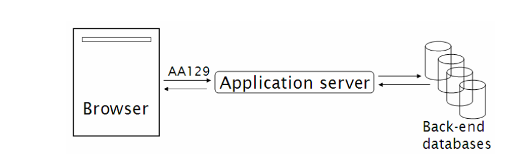
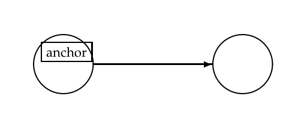
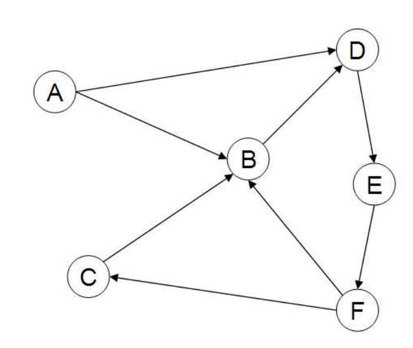
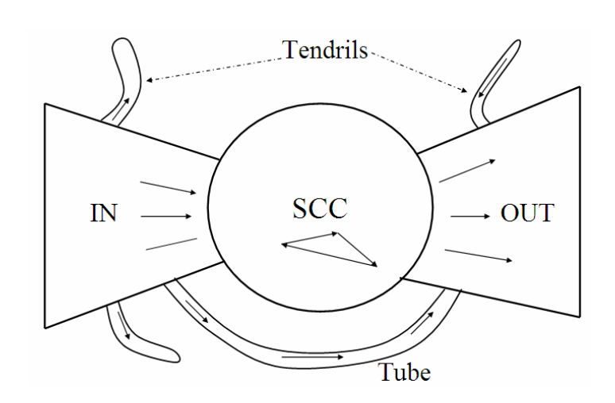
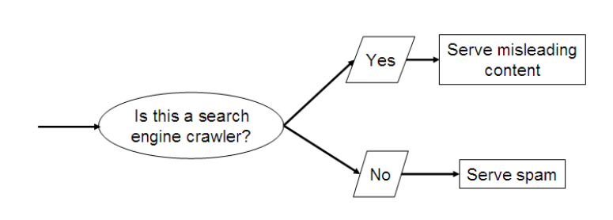
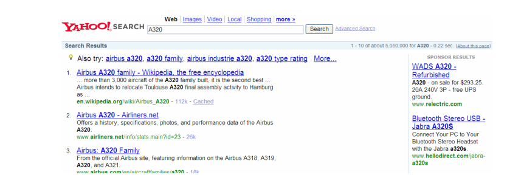
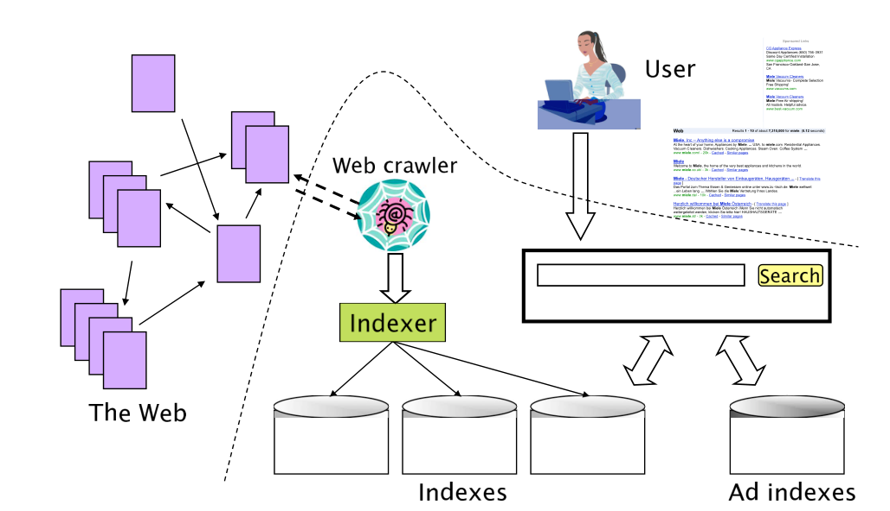
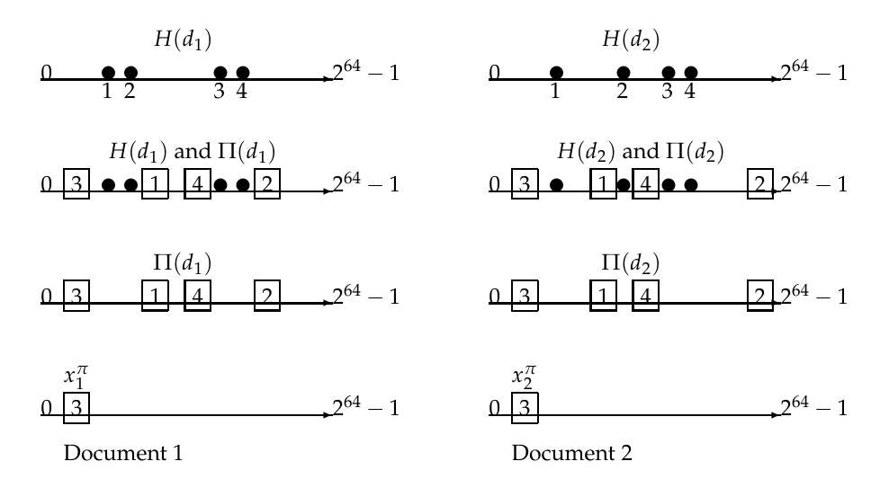

# 第 19 章 Web 搜索基础

[返回系列目录](../introduction-to-information-retrieval.md) · [上一篇：第 18 章 矩阵分解与潜在语义索引](./18-matrix-decompositions-and-latent-semantic-indexing.md) · [下一篇：第 20 章 Web 爬取与索引](./20-web-crawling-and-indexes.md)

原书印刷页 421–442；PDF 第 458–479 页。

<!-- source: PDF 458; printed: 421 -->

在本章及接下来的两章中，我们将讨论 Web 搜索引擎。第 19.1–19.4 节提供了一些背景和历史知识，以帮助读者理解那些使得 Web 变得混乱、快速变化且（从信息检索的角度来看）与本书迄今为止所研究的“传统”文档集截然不同的各种力量。第 19.5–19.6 节分别讨论了估计 Web 搜索引擎索引的文档数量以及在 Web 索引中消除重复文档的问题。最后这两节为后续两章提供了背景材料。

## 19.1 背景与历史

Web 在许多方面都是史无前例的：规模空前，其创建过程中几乎完全缺乏协调也是空前的，参与者背景和动机的多样性同样是空前的。这些因素中的每一个都使得 Web 搜索与搜索“传统”文档有所不同——并且通常要困难得多。

超文本（hypertext）的发明（由 Vannevar Bush 在 20 世纪 40 年代设想，并在 70 年代首次在工作系统中实现）大大早于 20 世纪 90 年代万维网（World Wide Web，我们将简称为 Web）的形成。Web 的使用呈现出巨大的增长，以至于现在它已经将很大一部分人类作为其参与者，这依赖于一个简单、开放的客户端-服务器设计：（1）服务器通过一种轻量级且简单的协议（http 或超文本传输协议，hypertext transfer protocol）与客户端进行通信，异步传输各种有效载荷（文本、图像以及——随着时间的推移——如音频和视频文件等更丰富的媒体），这些载荷使用一种称为 HTML（超文本标记语言，hypertext markup language）的简单标记语言进行编码；（2）客户端——通常是浏览器（browser），即图形用户环境中的一个应用程序——可以忽略它不理解的内容。这些看似无害的特征中的每一个都对 Web 的增长做出了巨大贡献，因此值得进一步探讨。

<!-- source: PDF 459; printed: 422 -->

基本操作如下：客户端（如浏览器）向 Web 服务器发送一个 http 请求。浏览器指定一个 URL（通用资源定位符，Universal Resource Locator），例如 `http://www.stanford.edu/home/atoz/contact.html`。

在这个 URL 示例中，字符串 `http` 指的是用于传输数据的协议。字符串 `www.stanford.edu` 被称为域名（domain），它指定了网页层次结构的根（通常镜像了 Web 服务器底层的的文件系统层次结构）。在这个例子中，`/home/atoz/contact.html` 是该层次结构中的一个路径，其中包含一个文件 `contact.html`，该文件包含了 `www.stanford.edu` 处的 Web 服务器响应此请求而返回的信息。经过 HTML 编码的文件 `contact.html` 包含超链接和内容（在这个例子中，是斯坦福大学的联系信息），以及用于在浏览器中渲染这些内容的格式化规则。因此，这样一个 http 请求允许我们获取页面的内容，这将被证明对我们抓取和索引文档（第 20 章）非常有用。

第一批浏览器的设计者使得查看 URL 内容上的 HTML 标记标签变得很容易。这种简单的便利性使得新用户无需经过大量培训或积累经验就能创建自己的 HTML 内容；相反，他们从自己喜欢的示例内容中学习。在他们这样做的同时，浏览器的第二个特征支持了 Web 内容创建和使用的快速激增：浏览器会忽略它们不理解的内容。这并没有像人们可能担心的那样，导致产生大量互不兼容的 HTML 方言。它所促进的是业余内容创作者，他们可以自由地进行实验并从他们新创建的网页中学习，而不必担心一个简单的语法错误会“使系统崩溃”。在 Web 上发布内容成为一项大众活动，不再局限于少数受过训练的程序员，而是向数千万乃至最终数亿的个人开放。对于大多数用户和大多数信息需求而言，Web 迅速成为提供和消费从罕见疾病到地铁时刻表等各种信息的最佳方式。

除非这些丰富的信息能够被其他用户发现和消费，否则在 Web 上大量发布信息本质上是无用的。早期试图使 Web 信息“可发现”的尝试大致分为两类：（1）全文索引搜索引擎，如 Altavista、Excite 和 Infoseek；（2）在各个类别中填充网页的分类目录（taxonomies），如 Yahoo!。前者为用户提供了一个关键字搜索界面，该界面由倒排索引（inverted indexes）和建立在前面章节介绍的基础之上的排序机制所支持。后者允许用户浏览类别标签的层次树。虽然乍一看，这是查找网页的一种方便且直观的隐喻，但它有许多缺点：首先，将网页准确地分类到分类树节点中在很大程度上是一个人工编辑过程，这很难随着 Web 规模的扩大而扩展。可以说，我们只需要在分类目录中拥有“高质量”的

<!-- source: PDF 460; printed: 423 -->

网页，每个类别只保留最好的网页。然而，仅仅是发现这些网页并将它们准确、一致地分类到分类目录中，就需要大量的人力。此外，为了让用户有效地发现分类到分类树节点中的网页，用户对于特定主题应寻找哪个（些）子树的想法，必须与执行分类的编辑的想法相匹配。随着分类目录规模的增长，这很快变得具有挑战性；Yahoo! 的分类树在相当早的时候就超过了 1000 个不同的节点。鉴于这些挑战，分类目录的受欢迎程度随着时间的推移而下降，尽管也涌现出了一些变体（如 About.com 和开放目录项目 Open Directory Project），由主题专家为每个类别收集和注释网页。

第一代 Web 搜索引擎将前面章节中的经典搜索技术移植到了 Web 领域，重点解决规模上的挑战。最早的 Web 搜索引擎必须处理包含数千万文档的索引，这比公共领域中任何以前的信息检索系统都要大几个数量级。在这种规模下进行索引、查询服务和排序，需要将数十台机器连接在一起以创建高可用性系统，这在面向消费者的搜索应用中也是前所未见的规模。第一代 Web 搜索引擎在解决这些挑战方面取得了很大成功，同时不断索引 Web 的很大一部分，并且始终以亚秒级的响应时间提供查询服务。然而，由于我们在第 19.2 节中讨论的 Web 内容创建的特殊性，Web 搜索结果的质量和相关性（relevance）还有很多不尽如人意之处。这就需要发明新的排序和反作弊（spam-fighting）技术，以确保搜索结果的质量。虽然经典的信息检索技术（如本书前面介绍的那些）对于 Web 搜索仍然是必要的，但它们绝不是充分的。一个关键方面（在第 21 章中进一步展开）是，虽然经典技术衡量的是文档与查询的相关性，但仍然需要根据诸如哪个网站托管该文档等线索来评估文档的权威性（authoritativeness）。

## 19.2 Web 的特征

导致 Web 爆炸性增长的基本特征——去中心化的内容发布，且基本上没有对作者身份的集中控制——结果却成为 Web 搜索引擎在试图索引和检索这些内容时面临的最大挑战。网页作者使用数十种（自然）语言和数千种方言创建内容，因此需要许多不同形式的词干提取（stemming）和其他语言学操作。因为发布

<!-- source: PDF 461; printed: 424 -->

现在向数千万人开放，网页在许多关键方面表现出令人望而生畏的异质性。首先，内容创建不再是受过编辑训练的作家的特权；虽然这代表了内容创建的巨大民主化，但它也导致了语法和风格的巨大差异（在许多情况下，甚至没有可识别的语法或风格）。事实上，Web 发布在某种意义上在全球范围内释放了桌面排版的优点和缺点，使得页面很快充斥着颜色、字体和结构的疯狂变化。一些网页，包括一些大公司专业制作的主页，完全由图像组成（点击这些图像会引出更丰富的文本内容）——因此，没有可索引的文本。

那么网页中文本的实质内容又如何呢？Web 上内容创建的民主化意味着在几乎任何主题上的观点都达到了一个新的粒度级别。这意味着 Web 上大规模地包含了真相、谎言、矛盾和推测。这就引出了一个问题：人们应该信任哪些网页？在一种简单化的方法中，人们可能会认为某些发布者是值得信任的，而另一些则不是——这就回避了一个问题，即搜索引擎如何为每个网站或网页分配这样一种信任度量。在第 21 章中，我们将探讨理解这个问题的方法。更微妙的是，可能不存在普遍的、独立于用户的信任概念；一个网页的内容对一个用户来说是值得信任的，对另一个用户来说可能并非如此。在传统（非 Web）出版中，这不是一个问题：用户会自行选择他们认为值得信任的信息源。因此，一个读者可能会觉得《纽约时报》（The New York Times）的报道是可靠的，而另一个读者可能更喜欢《华尔街日报》（The Wall Street Journal）。但是，当搜索引擎成为用户了解（更不用说选择）大部分内容的唯一可行手段时，这一挑战就变得非常严峻。

虽然“Web 有多大？”这个问题没有简单的答案（见第 19.5 节），但“搜索引擎的索引中有多少网页？”这个问题则更为精确，尽管即使是这个问题也存在争议。到 1995 年底，Altavista 报告称它已经抓取并索引了大约 3000 万个静态网页（static web pages）。静态网页是指其内容在每次请求该页面时都不会发生变化的网页。出于这个目的，一位每周手动更新其主页的教授被认为拥有一个静态网页，但机场的航班状态页面则被认为是动态的。动态页面通常是由应用服务器响应对数据库的查询而机械生成的，如图 19.1 所示。这种页面的一个标志是 URL 中包含字符“?”。由于在 1995 年，静态网页的数量被认为每几个月就会翻一番，因此像 Altavista 这样的早期 Web 搜索引擎不得不不断增加硬件和带宽，以便抓取和索引网页。

<!-- source: PDF 462; printed: 425 -->

**图 19.1** 动态生成的网页。浏览器向 Web 应用程序发送关于 AA129 航班的航班信息请求，Web 应用程序从后端数据库获取信息，然后创建一个动态网页返回给浏览器。

图中文字：Browser 浏览器；AA129 航班号；Application server 应用服务器；Back-end databases 后端数据库

**图 19.2** 由链接连接的 Web 图的两个节点。

图中文字：anchor 锚文本

### 19.2.1 Web 图

我们可以将由静态 HTML 页面以及它们之间的超链接组成的静态 Web 视为一个有向图，其中每个网页是一个节点，每个超链接是一条有向边。

图 19.2 展示了 Web 图中的两个节点 A 和 B，每个节点对应一个网页，并有一条从 A 到 B 的超链接。我们将所有此类节点和有向边的集合称为 Web 图。图 19.2 还显示（正如网页上大多数链接的情况一样），在页面 A 上超链接的起点周围有一些文本。这些文本通常封装在 `<a>`（代表 anchor，即锚点）标签的 `href` 属性中，该标签在页面 A 的 HTML 代码中对超链接进行编码，这些文本被称为锚文本（anchor text）。正如人们可能猜到的那样，这个有向图并不是强连通的：存在一些页面对，使得人们无法通过跟随超链接从这对页面中的一个页面到达另一个页面。我们将指向一个页面的超链接称为入链（in-links），将从一个页面指出的超链接称为出链（out-links）。在多项研究中，一个页面的入链数量（也称为其入度）平均约为 8 到 15。我们类似地将网页的出度定义为从该网页指出的链接数量。

<!-- source: PDF 463; printed: 426 -->

**图 19.3** 一个小型的 Web 图示例。在这个例子中，我们有六个标记为 A-F 的页面。页面 B 的入度为 3，出度为 1。这个示例图不是强连通的：不存在从页面 B-F 中的任何一个到页面 A 的路径。

这些概念在图 19.3 中进行了表示。

有充分的证据表明，这些链接并不是随机分布的；首先，指向一个网页的链接数量的分布并不遵循泊松分布，而如果每个网页都均匀随机地选择其链接的目的地，人们会预期它服从泊松分布。相反，这种分布被广泛报道为幂律（power law）分布，其中入度为 $i$ 的网页总数与 $1/i^\alpha$ 成正比；研究通常报告的 $\alpha$ 值为 2.1。[1] 此外，几项研究表明，连接网页的有向图具有领结（bowtie）形状：网页主要分为三大类，有时被称为 IN、OUT 和 SCC。网络冲浪者可以通过跟随超链接从 IN 中的任何页面到达 SCC 中的任何页面。同样，冲浪者可以从 SCC 中的页面到达 OUT 中的任何页面。最后，冲浪者可以从 SCC 中的任何页面冲浪到 SCC 中的任何其他页面。然而，不可能从 SCC 中的页面到达 IN 中的任何页面，或者从 OUT 中的页面到达 SCC（或因此到达 IN）中的页面。值得注意的是，在几项研究中，IN 和 OUT 的大小大致相等，而

> **脚注 1（原书第 426 页）**：参见第 5 章（第 90 页）中关于文本中单词分布的齐普夫定律（Zipf's law），它是一个 $\alpha = 1$ 的幂律。

<!-- source: PDF 464; printed: 427 -->

**图 19.4** Web 的领结结构。这里我们展示了一个管道和三个触须。

图中文字：IN 入口；SCC 强连通分量；OUT 出口；Tendrils 触须；Tube 管道

SCC 则稍大一些；大多数网页都属于这三个集合之一。剩余的页面形成管道（tubes）和触须（tendrils），管道是 SCC 之外的小型页面集合，直接从 IN 通向 OUT；触须要么从 IN 出发无处可去，要么从无处出发通向 OUT。图 19.4 说明了 Web 的这种结构。

### 19.2.2 垃圾网页（Spam）

在 Web 搜索的早期历史中，人们就清楚地认识到，Web 搜索引擎是连接广告商和潜在买家的重要手段。搜索 maui golf real estate（毛伊岛高尔夫房地产）的用户不仅仅是在寻找关于毛伊岛高尔夫球场住房的新闻或娱乐信息，而是很可能在寻求购买此类房产。因此，此类房产的卖家及其代理人有强烈的动机去创建在该查询上排名靠前的网页。在一个基于词项频率进行评分的搜索引擎中，一个大量重复 maui golf real estate 的网页将会获得很高的排名。这导致了第一代垃圾网页（spam）的产生，（在 Web 搜索的语境下）它是指为了在选定关键字的搜索结果中排名靠前而对网页内容进行的操纵。

为了避免这些重复激怒用户，老练的垃圾网页制造者（spammers）采取了一些伎俩，比如将这些重复的词项渲染成与背景相同的颜色。尽管这些词因此对人类用户是不可见的，但搜索引擎索引器会从

<!-- source: PDF 465; printed: 428 -->

**图 19.5** 垃圾网页制造者使用的隐藏（Cloaking）技术。

图中文字：Is this a search engine crawler? 这是一个搜索引擎爬虫吗？；Yes 是；No 否；Serve misleading content 提供误导性内容；Serve spam 提供垃圾内容

网页的 HTML 表示中解析出这些不可见的词，并将这些词索引为存在于该页面中。

从根本上说，垃圾网页源于 Web 上内容创建动机的异质性。特别是，许多 Web 内容创建者具有商业动机，因此可以从操纵搜索引擎结果中获益。你可能会争辩说，这与一家公司在黄页中使用大字体列出其电话号码没有什么不同；但这通常会使公司花费更多，因此是一个更公平的机制。也许一个更恰当的类比是，使用以一长串 A 开头的公司名称，以便在黄页类别中尽早列出。事实上，黄页中公司为更大/更粗的字体付费的模式已经在 Web 搜索中被复制：在许多搜索引擎中，可以通过付费将自己的网页包含在搜索引擎的索引中——这种模式被称为付费收录（paid inclusion）。不同的搜索引擎对于是否允许付费收录，以及这种付费是否对搜索结果中的排名有任何影响，有着不同的政策。

搜索引擎很快在垃圾网页检测方面变得足够复杂，能够屏蔽掉特定关键字的大量重复。垃圾网页制造者则以更丰富的垃圾网页技术作为回应，我们现在描述其中最著名的技术。这些技术中的第一种是隐藏（cloaking），如图 19.5 所示。在这里，垃圾网页制造者的 Web 服务器会根据 HTTP 请求是来自 Web 搜索引擎的爬虫（搜索引擎中收集网页的部分，将在第 20 章中描述），还是来自人类用户的浏览器，返回不同的页面。前者导致网页被搜索引擎在误导性关键字下建立索引。当用户搜索这些关键字并选择查看该页面时，他收到的网页内容与搜索引擎索引的内容完全不同。这种对搜索索引器的欺骗在传统的信息检索世界中是未知的；它源于页面发布者和 Web 搜索引擎之间的关系并不完全是协作的这一事实。

门页（doorway page）包含精心挑选的文本和元数据，以便获得高排名

<!-- source: PDF 466; printed: 429 -->

针对选定的搜索关键词。当浏览器请求该桥页时，它会被重定向到一个包含更多商业性质内容的页面。更复杂的作弊技术涉及对与页面相关的元数据进行操纵，包括（出于我们将在第 21 章中看到的理由）指向网页的链接。鉴于作弊本质上是一种受经济利益驱使的活动，围绕它涌现出了一个**搜索引擎优化者**（Search Engine Optimizers，简称 SEO）行业，为那些寻求让自己的网页在选定关键词上获得高排名的客户提供咨询服务。Web 搜索引擎对这种试图破译并适应其专有排名技术的业务表示不满，并且确实宣布了他们不容忍的 SEO 行为形式的政策（并且已知会因违反这些政策而关闭来自某些 SEO 的搜索请求）。不可避免地，此类 SEO（他们逐渐推断出每个 Web 搜索引擎排名方法的特征）与 Web 搜索引擎（他们做出相应的调整）之间的交锋是一场无休止的斗争；事实上，**对抗性信息检索**（adversarial information retrieval）这一研究子领域正是围绕这场战斗而兴起的。为了打击操纵其网页文本的作弊者，人们利用了 Web 的链接结构——这种技术被称为链接分析（link analysis）。已知第一个大规模应用链接分析（将在第 21 章中详细介绍）的 Web 搜索引擎是 Google，尽管目前所有 Web 搜索引擎都在使用它（相应地，作弊者现在投入大量精力来破坏它——这被称为**链接作弊**（link spam））。

**练习 19.1**
如果入度为 $i$ 的页面数量与 $1/i^{2.1}$ 成正比，那么随机选择的网页入度为 1 的概率是多少？

**练习 19.2**
如果入度为 $i$ 的页面数量与 $1/i^{2.1}$ 成正比，那么网页的平均入度是多少？

**练习 19.3**
如果入度为 $i$ 的页面数量与 $1/i^{2.1}$ 成正比，那么当最大入度趋于无穷大时，入度为 $i$ 的页面比例是增加、保持不变还是减少？对于 2.1 以外的指数值，你的答案会如何改变？

**练习 19.4**
在 Web 图的一个快照中，所有节点的平均入度为 9。关于该快照中所有节点的平均出度，我们能得出什么结论？

## 19.3 广告作为经济模型

在 Web 发展早期，公司在热门网站（如 MSN、America Online、Yahoo! 和 CNN 等新闻和娱乐网站）的网页上使用图形横幅广告。这些广告的主要目的是品牌推广（branding）：向浏览者传达一种关于

<!-- source: PDF 467; printed: 430 -->

投放广告的公司的品牌的积极感受。通常，这些广告按**千人成本**（cost per mil，CPM）计价：即公司为其横幅广告展示 1000 次所支付的成本。一些网站与其广告商签订合同，其中广告的定价不按展示次数（也称为曝光量，impressions）计算，而是按用户点击它的次数计算。这种定价模型被称为**每次点击成本**（cost per click，CPC）模型。在这种情况下，点击广告会将用户引导至广告商设置的网页，在那里诱导用户进行购买。在这里，广告的目标主要在于促成交易，而非品牌推广。品牌广告和交易导向广告之间的这种区别在广播和印刷等传统媒体中早已得到广泛认可。Web 的交互性使得 CPC 计费模型成为可能——网站可以计量和监控点击量，并向广告商收费。

这个方向的先驱是一家名为 Goto 的公司，该公司在最终被 Yahoo! 收购之前更名为 Overture。传统意义上，Goto 并非搜索引擎；相反，对于每个查询词项 $q$，它接受希望在查询 $q$ 上展示其网页的公司的竞价。作为对查询 $q$ 的响应，Goto 会返回所有对 $q$ 竞价的广告商的页面，并按他们的出价排序。此外，当用户点击其中一个返回结果时，相应的广告商将向 Goto 支付费用（在最初的实现中，该费用等于广告商对 $q$ 的出价）。

Goto 模型的几个方面值得强调。首先，在 Goto 的搜索界面中输入查询 $q$ 的用户正在主动表达与查询 $q$ 相关的兴趣和意图。例如，输入 golf clubs（高尔夫球杆）的用户比仅仅浏览高尔夫新闻的用户更有可能即将购买一套球杆。其次，Goto 只有在用户实际对广告表达出兴趣时——正如用户点击广告所证明的那样——才能获得报酬。综合起来，这些创造了一种将广告商与消费者联系起来的强大机制，迅速将 Goto/Overture 的年收入提高到数亿美元。这种风格的搜索引擎后来被广泛称为**赞助商搜索**（sponsored search）或**搜索广告**（search advertising）。

鉴于这两种搜索引擎——诸如 Google 和 Altavista 之类的“纯”搜索引擎，与赞助商搜索引擎——合乎逻辑的下一步是将它们结合成单一的用户体验。当前的搜索引擎完全遵循这种模型：它们提供纯搜索结果（通常称为**算法搜索结果**，algorithmic search results）作为对用户搜索的主要响应，同时将赞助商搜索结果单独且醒目地显示在算法结果的右侧。如图 19.6 所示。检索赞助商搜索结果并根据查询对其进行排名，现在已经变得比简单的 Goto 方案复杂得多；该过程需要融合来自信息

<!-- source: PDF 468; printed: 431 -->

**图 19.6** 由查询关键词触发的搜索广告。此处查询 A320 返回了关于空客飞机的算法搜索结果，以及编号为 A320 的各种非飞机商品的广告，广告商试图将这些商品推销给进行此查询的用户。缺少飞机广告反映了这样一个事实：很少有营销人员试图在 Web 上销售 A320 飞机。
图中文字：YAHOO! SEARCH 为 Yahoo! 搜索，查询词为 A320；Search Results（搜索结果）、SPONSOR RESULTS（赞助结果）、WADS A320 - Refurbished（WADS A320 翻新产品）、Bluetooth Stereo USB - Jabra A320S（蓝牙立体声 USB 产品——Jabra A320S）。

检索和微观经济学的思想，这超出了本书的范围。对于广告商而言，了解搜索引擎如何进行这种排名，以及如何将营销活动预算分配给不同的关键词和不同的赞助商搜索引擎，已经成为一门被称为**搜索引擎营销**（search engine marketing，SEM）的专业。

赞助商搜索背后固有的经济动机，导致一些参与者试图破坏系统以获取利益。这可以采取多种形式，其中之一被称为**点击作弊**（click spam）。目前对点击作弊没有普遍接受的定义。它指的是（顾名思义）对赞助商搜索结果的点击并非来自真正的搜索用户。例如，一个狡猾的广告商可能会试图通过反复点击（通过使用机器人点击生成器）竞争对手的赞助商搜索广告，来耗尽该竞争对手的广告预算。搜索引擎面临的挑战是，要辨别他们观察到的哪些点击属于点击作弊模式，以避免向其广告商客户收取此类点击的费用。

**练习 19.5**
Goto 方法根据出价对匹配查询的广告进行排名：出价最高的广告商获得最高位置，出价第二高的获得下一个位置，依此类推。当出价最高的广告商投放与查询不相关的广告时，这会出什么问题？为什么拥有不相关广告的广告商可能会以这种方式出高价？

**练习 19.6**
假设除了出价之外，我们还拥有每个广告商的点击率（click-through rate）：即用户历史上点击其广告的次数与广告展示次数的比率。建议对 Goto 方案进行修改，利用这些数据来避免上述练习 19.5 中的问题。

<!-- source: PDF 469; printed: 432 -->

## 19.4 搜索用户体验

我们同样必须了解 Web 搜索的用户。这又是与传统信息检索的一个重大区别，在传统信息检索中，用户通常是专业人士，至少受过一些在他们非常了解其风格和结构的精心编写的文档集上构建查询的技巧培训。相比之下，Web 搜索用户往往不知道（或不关心）Web 内容的异构性、查询语言的语法以及构建查询的技巧；事实上，一个主流工具（正如 Web 搜索已经成为的那样）不应该对数十亿人提出如此繁重的要求。一系列研究得出结论，Web 搜索中的平均关键词数量在 2 到 3 个之间。语法运算符（布尔连接词、通配符等）很少被使用，这同样是受众构成（“普通”人，而非信息科学家）的结果。

显然，Web 搜索引擎吸引的用户流量越多，它从赞助商搜索中赚取的收入就越多。搜索引擎如何使自己与众不同并增加流量？在这里，Google 确定了两个帮助其在竞争对手中脱颖而出并实现增长的原则：（1）关注相关性（relevance），特别是前几个结果中的查准率（precision）而非召回率（recall）；（2）轻量级的用户体验，这意味着搜索查询页面和搜索结果页面都非常整洁，几乎完全是文本，很少有图形元素。第一个原则的效果仅仅是节省了用户查找所需信息的时间。第二个原则的效果是提供一种响应极快的用户体验，或者无论如何都不会受到加载搜索查询或结果页面时间的瓶颈限制。

### 19.4.1 用户查询需求

常见的 Web 搜索查询似乎可以分为三大类：（i）信息型（informational），（ii）导航型（navigational）和（iii）交易型（transactional）。我们现在解释这些类别；应该清楚的是，有些查询会属于其中多个类别，而另一些则不属于这些类别。

**信息型查询**（informational queries）寻求关于一个广泛主题的一般信息，例如 leukemia（白血病）或 Provence（普罗旺斯）。通常没有一个单一的网页包含所寻求的所有信息；事实上，进行信息型查询的用户通常试图从多个网页中吸收信息。

**导航型查询**（navigational queries）寻找用户心目中某个单一实体的网站或主页，例如 Lufthansa airlines（汉莎航空）。在这种情况下，用户的期望是第一个搜索结果就应该是汉莎航空的主页。用户对包含词项 Lufthansa 的大量文档不感兴趣；对于这样的用户，衡量用户满意度的最佳指标是 precision at 1（前 1 个结果的查准率）。

<!-- source: PDF 470; printed: 433 -->

事务型查询（transactional query）是用户在 Web 上执行事务（如购买产品、下载文件或进行预订）的前奏。在这种情况下，搜索引擎应返回提供此类事务表单接口的服务列表。

辨别一个查询属于这些类别中的哪一个可能具有挑战性。该类别不仅决定了算法搜索结果，还决定了该查询是否适合赞助商搜索结果（因为查询可能揭示了购买意图）。对于导航型查询，有人认为搜索引擎应该只返回一个结果，甚至直接返回目标网页。尽管如此，Web 搜索引擎在历史上一直参与一场关于谁索引了更多网页的吹嘘权之争。用户真的在乎吗？也许不在乎，但媒体确实会强调各种搜索引擎规模的估计值（通常在统计上站不住脚）。用户受到这些报道的影响，因此，搜索引擎确实必须关注其索引规模与竞争对手的比较。对于信息型（以及在较小程度上，事务型）查询，用户确实关心搜索引擎的全面性。

图 19.7 展示了 Web 搜索引擎的综合结构图，包括抓取器，以及网页和广告索引。图中曲线虚线以下的部分是搜索引擎的内部结构。

## 19.5 索引规模与估计

作为初步近似，全面性随着索引规模的增加而增长，尽管搜索引擎索引哪些特定页面确实很重要——有些页面比其他页面包含更多信息。也很难推断搜索引擎索引了 Web 的多大比例，因为存在无限数量的动态网页；例如，`http://www.yahoo.com/any_string` 返回一个有效的 HTML 页面而不是错误，礼貌地通知用户 Yahoo! 没有这样的页面。这种“软 404 错误”只是 Web 服务器可以生成无限数量有效网页的众多方式之一。实际上，其中一些是恶意的蜘蛛陷阱（spider traps），旨在使搜索引擎的抓取器（系统地为搜索引擎索引收集网页的组件，在第 20 章中描述）停留在垃圾邮件发送者的网站内并索引该网站的许多页面。

我们可以提出以下定义更明确的问题：给定两个搜索引擎，它们索引的相对规模是多少？甚至这个问题也被证明是不精确的，因为：

1. 在响应查询时，搜索引擎可以返回其尚未（完全甚至部分）索引其内容的网页。一方面，搜索引擎通常只索引网页中的前几千个词。

<!-- source: PDF 471; printed: 434 -->

**图 19.7** Web 搜索引擎的各个组件。
图中文字：User 用户；Web crawler Web 抓取器；Search 搜索；Indexer 索引器；The Web Web；Indexes 索引；Ad indexes 广告索引

在某些情况下，搜索引擎知道一个页面 $p$，该页面被其已索引的页面链接，但尚未索引 $p$ 本身。正如我们将在第 21 章中看到的，在搜索结果中有意义地返回 $p$ 仍然是可能的。

2. 搜索引擎通常将其索引组织成不同的层级和分区，并非在每次搜索时都会检查所有这些层级和分区（回想第 7.2.1 节中的层级索引）。例如，网站深处的网页可能被索引，但在常规 Web 搜索中未被检索到；然而，在用户明确限制在该网站的搜索中，它会作为结果被检索出来（大多数 Web 搜索引擎都提供这种特定站点的搜索）。

因此，搜索引擎索引包含多个类别的已索引页面，因此没有单一的索引规模衡量标准。尽管存在这些问题，人们还是设计了许多技术来粗略估计两个搜索引擎 $E_1$ 和 $E_2$ 的索引规模比率。这些技术背后的基本假设是，每个搜索引擎索引的 Web 部分是独立且均匀随机选择的。这涉及一些值得怀疑的假设：首先，Web 的规模是有限的，每个搜索引擎从中选择一个子集；其次，每个引擎选择的是一个独立的、均匀选择的子集。从第 20 章关于抓取的讨论中可以清楚地看出，这远非事实。然而，如果我们从

<!-- source: PDF 472; printed: 435 -->

这些假设出发，那么我们可以调用一种称为捕获-重新捕获方法（capture-recapture method）的经典估计技术。

假设我们可以从 $E_1$ 的索引中随机选取一个页面，并测试它是否在 $E_2$ 的索引中，对称地，测试来自 $E_2$ 的随机页面是否在 $E_1$ 中。这些实验给出了比例 $x$ 和 $y$，这样我们的估计是 $E_1$ 中有比例为 $x$ 的页面在 $E_2$ 中，而 $E_2$ 中有比例为 $y$ 的页面在 $E_1$ 中。那么，令 $|E_i|$ 表示搜索引擎 $E_i$ 的索引规模，我们有

$$ x|E_1| \approx y|E_2|, $$

由此我们得到我们将使用的形式

$$ \frac{|E_1|}{|E_2|} \approx \frac{y}{x}. \tag{19.1} $$

如果我们关于 $E_1$ 和 $E_2$ 是 Web 的独立且均匀随机子集的假设成立，并且我们的采样过程是无偏的，那么式（19.1）应该为我们提供 $|E_1|/|E_2|$ 的无偏估计。我们在这里区分两种情况。要么测量是由能够访问其中一个搜索引擎索引的人（比如 $E_1$ 的员工）执行的，要么测量是由无法访问任何一个搜索引擎内部的独立第三方执行的。在前一种情况下，我们可以简单地从一个索引中随机选取一篇文档。后一种情况更具挑战性；通过从搜索引擎外部从一个搜索引擎中随机选取一个页面，然后验证该随机页面是否存在于另一个搜索引擎中。

为了实现采样阶段，我们可能会从整个（理想化的、有限的）Web 中生成一个随机页面，并测试它在每个搜索引擎中的存在情况。不幸的是，均匀随机地选取一个网页是一个难题。我们简要概述了几种实现这种采样的尝试，指出每种尝试固有的偏差；在此之后，我们将详细描述一种许多研究都建立在其基础上的技术。

1. 随机搜索（Random searches）：从 Web 搜索的搜索日志开始；将此日志中的随机搜索发送到 $E_1$，并从结果中选取一个随机页面。由于此类日志在搜索引擎外部并未广泛提供，因此一种实现方式是捕获离开某个同意记录其所有搜索的工作组（例如研究中心的科学家）的所有搜索查询。这种方法存在许多问题，包括工作组进行的搜索类型带来的偏差。此外，从发送给 $E_1$ 的这种随机搜索的结果中随机选取的一篇文档，与直接从 $E_1$ 中随机选取的一篇文档是不同的。
2. 随机 IP 地址（Random IP addresses）：第二种方法是生成随机 IP 地址，并向驻留在该随机地址的 Web 服务器发送请求，收集该服务器上的所有页面。这里的偏差包括这样一个事实：

<!-- source: PDF 473; printed: 436 -->

许多主机可能共享一个 IP（由于一种称为虚拟主机（virtual hosting）的做法），或者不接受来自进行实验的主机的 http 请求。此外，这种技术更有可能命中许多页面很少的站点之一，从而使文档概率发生倾斜；如果我们了解网站上页面数量的分布，我们也许能够纠正这种影响。

3. 随机游走（Random walks）：如果 Web 图是一个强连通的有向图，我们可以从任意网页开始运行随机游走。这种游走将收敛到一个稳态分布（有关此内容的更多背景材料，请参见第 21 章第 21.2.1 节），原则上我们可以从中以固定概率选取一个网页。这种方法也有许多偏差。首先，Web 不是强连通的，因此，即使有各种纠正规则，也很难证明我们可以从任何页面开始达到稳态分布。其次，随机游走稳定到这种稳态所需的时间是未知的，并且可能超过实验的长度。

显然，这些方法中的每一种都远非完美。我们现在描述第四种采样方法，随机查询（random queries）。这种方法值得注意的原因有两个：它已成功地被用于一系列日益精确的估计，而反过来，它也被证明是最容易被误解和粗心实现的方法，从而导致误导性的测量。其思想是通过向搜索引擎提出随机查询，从其索引中（几乎）均匀随机地选取一个页面。应该清楚的是，从（比如）韦氏词典（Webster's dictionary）中选取一组随机词项并不是实现这一想法的好方法。一方面，并非所有词汇表词项出现的频率都相同，因此这种方法不会导致从搜索引擎中均匀随机地选择文档。另一方面，Web 文档中有大量词项并未出现在韦氏词典等标准词典中。为了解决不在标准词典中的词汇表词项的问题，我们首先积累一个样本 Web 词典。这可以通过抓取 Web 的有限部分来完成，或者通过抓取手动组装的 Web 代表性子集（如 Yahoo!）来完成（正如使用此方法的最早实验中所做的那样）。考虑一个包含从该词典中随机选择的两个或多个词的合取查询。

在操作上，我们按如下方式进行：我们在 $E_1$ 上使用随机合取查询，并从返回的前 100 个结果中随机选取一个页面 $p$。然后，我们通过在 $p$ 中选择 6-8 个低频词项并将它们用于 $E_2$ 的合取查询中，来测试 $p$ 是否存在于 $E_2$ 中。我们可以通过大量重复实验来改进估计。采样过程和测试过程都存在许多问题。

1. 我们的样本偏向于较长的文档。

<!-- source: PDF 474; printed: 437 -->

2. 从 $E_1$ 的前 100 个结果中进行选择，会引入 $E_1$ 排序算法的偏差。从 $E_1$ 的所有结果中进行选择会使实验变慢。这主要是因为大多数 Web 搜索引擎都设置了防御机制，以防止过度的机器人查询。

3. 在检查阶段，会引入一些额外的偏差：例如，$E_2$ 可能无法正确处理 8 个词的合取查询。

4. $E_1$ 或 $E_2$ 可能会拒绝响应测试查询，将它们视为机器人垃圾信息而不是真正的查询。

5. 可能会出现连接超时等操作问题。

一系列研究建立在这个基本范式之上，以消除其中的一些问题；目前还没有完美的解决方案，但在理解偏差的统计学复杂性方面正在不断提高。主要思想是通过估计每个文档的偏差幅度来解决偏差问题。由此，标准的统计抽样方法可以生成无偏样本。在检查阶段，较新的工作不再使用合取查询，而是转向短语查询和其他表现更好的查询。最后，较新的实验除了随机查询外，还使用了其他抽样方法。其中最著名的是文档随机游走抽样（document random walk sampling），在这种方法中，通过在由文档派生的虚拟图上进行随机游走来选择文档。在这个图中，节点是文档；如果两个文档有两个或多个共同的词，则它们之间由一条边连接。该图从未被实例化；相反，可以通过以下方式在图上进行随机游走：在文档 $d$ 中选择一对关键词，在搜索引擎上运行查询，并从结果中随机选择一个文档，从而从文档 $d$ 移动到另一个文档。详细信息可以在第 19.7 节的参考文献中找到。

**练习 19.7**
两个 Web 搜索引擎 A 和 B 各自从它们的索引中均匀随机地生成大量页面。A 的页面中有 30% 存在于 B 的索引中，而 B 的页面中有 50% 存在于 A 的索引中。A 的索引中的页面数量相对于 B 是多少？

## 19.6 近似重复与 shingling 算法

在第 19.5 节关于索引大小的讨论中，我们忽略了一个方面，即重复（duplication）：Web 包含同一内容的多个副本。据估计，Web 上多达 40% 的页面是其他页面的副本。其中许多是合法的副本；例如，某些信息库被镜像仅仅是为了提供冗余和访问可靠性。搜索引擎试图避免索引同一内容的多个副本，以降低存储和处理开销。

<!-- source: PDF 475; printed: 438 -->

检测重复项的最简单方法是为每个网页计算一个指纹（fingerprint），该指纹是该页面上字符的简洁（例如 64 位）摘要。然后，每当两个网页的指纹相等时，我们就测试页面本身是否相等，如果相等，则声明其中一个是另一个的重复副本。这种简单的方法无法捕捉到 Web 上一个关键且普遍的现象：近似重复（near duplication）。在许多情况下，一个网页的内容与另一个网页的内容完全相同，除了少数几个字符——例如，显示页面最后修改日期和时间的标记。即使在这种情况下，我们也希望能够声明这两个页面足够接近，以至于我们只索引一个副本。如果不穷举比较所有网页对（在数十亿页面的规模下这是一项不可行的任务），我们如何检测并过滤掉这些近似重复项？

我们现在描述一种检测近似重复网页问题的解决方案。答案在于一种称为 shingling 的技术。给定一个正整数 $k$ 和文档 $d$ 中的一个词项序列，将 $d$ 的 $k$-shingles 定义为 $d$ 中所有连续 $k$ 个词项序列的集合。例如，考虑以下文本：a rose is a rose is a rose（一朵玫瑰就是一朵玫瑰就是一朵玫瑰）。该文本的 4-shingles（$k = 4$ 是检测近似重复网页时使用的典型值）是 a rose is a、rose is a rose 和 is a rose is。这些 shingle 中的前两个在文本中各出现两次。直观地说，如果从两个文档生成的 shingle 集合几乎相同，则这两个文档是近似重复的。我们现在将这种直觉精确化，然后开发一种有效计算和比较所有网页的 shingle 集合的方法。

令 $S(d_j)$ 表示文档 $d_j$ 的 shingle 集合。回想一下第 61 页的 Jaccard 系数，它衡量集合 $S(d_1)$ 和 $S(d_2)$ 之间的重叠程度，计算公式为 $|S(d_1) \cap S(d_2)|/|S(d_1) \cup S(d_2)|$；将其记为 $J(S(d_1), S(d_2))$。我们对 $d_1$ 和 $d_2$ 之间近似重复的测试是计算这个 Jaccard 系数；如果它超过预设的阈值（例如 0.9），我们就声明它们是近似重复的，并从索引中消除其中一个。然而，这似乎并没有简化问题：我们仍然必须成对地计算 Jaccard 系数。

为了避免这种情况，我们使用一种哈希形式。首先，我们将每个 shingle 映射到一个大空间（例如 64 位）上的哈希值。对于 $j = 1, 2$，令 $H(d_j)$ 为从 $S(d_j)$ 派生的相应的 64 位哈希值集合。我们现在调用以下技巧来检测其集合 $H()$ 具有较大 Jaccard 重叠的文档对。令 $\pi$ 为从 64 位整数到 64 位整数的随机排列。用 $\Pi(d_j)$ 表示 $H(d_j)$ 中排列后的哈希值集合；因此，对于每个 $h \in H(d_j)$，都有一个对应的值 $\pi(h) \in \Pi(d_j)$。
令 $x^\pi_j$ 为 $\Pi(d_j)$ 中的最小整数。那么

**定理 19.1.**
$$J(S(d_1), S(d_2)) = P(x^\pi_1 = x^\pi_2).$$

<!-- source: PDF 476; printed: 439 -->

**图 19.8** shingle 略图（sketch）说明。我们看到两个文档经历了 shingle 略图计算的四个阶段。在第一步（顶行）中，我们对每个文档中的每个 shingle 应用 64 位哈希，以获得 $H(d_1)$ 和 $H(d_2)$（圆圈）。接下来，我们应用随机排列 $\Pi$ 对 $H(d_1)$ 和 $H(d_2)$ 进行排列，获得 $\Pi(d_1)$ 和 $\Pi(d_2)$（方块）。第三行仅显示 $\Pi(d_1)$ 和 $\Pi(d_2)$，而底行显示每个文档的最小值 $x^\pi_1$ 和 $x^\pi_2$。
图中文字：Document 1 文档 1；Document 2 文档 2；$H(d_1)$ 和 $\Pi(d_1)$；$H(d_2)$ 和 $\Pi(d_2)$

*证明*。我们在一个稍微更一般的设置中给出证明：考虑一个集合族，其元素取自一个共同的全集。将这些集合视为矩阵 $A$ 的列，全集中的每个元素对应一行。如果元素 $i$ 存在于第 $j$ 列所代表的集合 $S_j$ 中，则元素 $a_{ij} = 1$。

令 $\Pi$ 为 $A$ 的行的随机排列；用 $\Pi(S_j)$ 表示对第 $j$ 列应用 $\Pi$ 后得到的列。最后，令 $x^\pi_j$ 为列 $\Pi(S_j)$ 中出现 1 的第一行的索引。然后我们证明，对于任意两列 $j_1, j_2$，

$$P(x^\pi_{j_1} = x^\pi_{j_2}) = J(S_{j_1}, S_{j_2}).$$

如果我们能证明这一点，该定理就成立了。

考虑如图 19.9 所示的两列 $j_1, j_2$。$S_{j_1}$ 和 $S_{j_2}$ 的有序条目对将行划分为四种类型：在这两列中都为 0 的行，在 $S_{j_1}$ 中为 0 且在 $S_{j_2}$ 中为 1 的行，在 $S_{j_1}$ 中为 1 且在 $S_{j_2}$ 中为 0 的行，最后是在这两列中都为 1 的行。实际上，图 19.9 的前四行举例说明了所有这四种类型的行。

<!-- source: PDF 477; printed: 440 -->

| $S_{j_1}$ | $S_{j_2}$ |
| :---: | :---: |
| 0 | 1 |
| 1 | 0 |
| 1 | 1 |
| 0 | 0 |
| 1 | 1 |
| 0 | 1 |

**图 19.9** 两个集合 $S_{j_1}$ 和 $S_{j_2}$；它们的 Jaccard 系数为 2/5。

用 $C_{00}$ 表示两列中都为 0 的行数，$C_{01}$ 表示第二种类型的行数，$C_{10}$ 表示第三种类型的行数，$C_{11}$ 表示第四种类型的行数。那么，

$$
J(S_{j_1}, S_{j_2}) = \frac{C_{11}}{C_{01} + C_{10} + C_{11}}. \tag{19.2}
$$

为了通过证明式（19.2）的右侧等于 $P(x^\pi_{j_1} = x^\pi_{j_2})$ 来完成证明，考虑按行索引递增的顺序扫描列 $j_1, j_2$，直到在任一列中找到第一个非零条目。因为 $\Pi$ 是随机排列，所以这个最小行在两列中都为 1 的概率恰好是式（19.2）的右侧。$\Box$

因此，我们对 shingle 集合的 Jaccard 系数的测试是概率性的：我们比较来自不同文档的计算值 $x^\pi_i$。如果一对值重合，我们就得到了候选的近似重复项。对 200 个随机排列 $\pi$（文献中建议的选择）独立重复该过程。将得到的 200 个 $x^\pi_i$ 值的集合称为 $d_i$ 的草图（sketch）$\psi(d_i)$。然后，我们可以将任意一对文档 $d_i, d_j$ 的 Jaccard 系数估计为 $|\psi_i \cap \psi_j|/200$；如果这超过了预设的阈值，我们就声明 $d_i$ 和 $d_j$ 是相似的。

我们如何快速计算所有对 $i, j$ 的 $|\psi_i \cap \psi_j|/200$？实际上，我们如何表示所有相似的文档对，而不会导致与文档数量呈二次方关系的爆炸式增长？首先，我们使用指纹来移除完全相同的文档，只保留一个副本。我们还可以从 shingle 计算中移除常见的 HTML 标签和整数，以消除在文档中非常常见但不能告诉我们任何关于重复信息的 shingle。接下来，我们使用并查集（union-find）算法来创建包含相似文档的簇。为此，我们必须完成一个关键步骤：从草图集合转到使得 $d_i$ 和 $d_j$ 相似的对 $i, j$ 的集合。

为此，我们计算草图有任何共同成员的任意一对文档的共同 shingle 数量。我们从按 $x^\pi_i$ 排序的列表 $\langle x^\pi_i, d_i \rangle$ 对开始。对于每个 $x^\pi_i$，我们现在可以生成

<!-- source: PDF 478; printed: 441 -->

找出所有在其草图（sketch）中都包含 $x_i^\pi$ 的文档对 $i, j$。由此，对于每一个草图重叠度非零的文档对 $i, j$，我们可以计算它们共有的 $x_i^\pi$ 值的数量。通过应用一个预设的阈值，我们就能知道哪些文档对 $i, j$ 具有高度重叠的草图。例如，如果阈值是 80%，那么对于任何 $i, j$，我们需要该计数至少为 160。在识别出这些文档对时，我们运行并查集（union-find）算法将文档分组为近似重复的“句法簇（syntactic clusters）”。这本质上是第 17.2 节（原书第 382 页）中介绍的单链接聚类（single-link clustering）算法的一个变体。

最后一个技巧可以减少计算文档对 $i, j$ 的 $|\psi_i \cap \psi_j|/200$ 时所需的空间，原则上该计算仍可能需要与文档数量呈平方关系的空间。为了排除那些草图中共有 shingle 很少的文档对 $i, j$，我们对每个文档的草图进行如下预处理：对草图中的 $x_i^\pi$ 进行排序，然后对这个排序后的序列进行 shingle 处理，为每个文档生成一组超级 shingle（super-shingles）。如果两个文档有一个共同的超级 shingle，我们再继续计算 $|\psi_i \cap \psi_j|/200$ 的精确值。这同样是一种启发式方法，但在减少我们需要累加草图重叠计数的 $i, j$ 文档对数量方面非常有效。

**练习 19.8**
Web 搜索引擎 A 和 B 各自抓取了 Web 上相同大小的随机子集。抓取的一些页面是重复的——即在不同 URL 处的完全相同的文本副本。假设重复页面均匀分布在 A 和 B 抓取的页面中。进一步假设，重复页面是指恰好有两个副本的页面——没有任何页面有超过两个副本。A 在不进行重复消除的情况下对页面建立索引，而 B 对每个重复页面只索引一个副本。在进行重复消除之前，这两个随机子集的大小相同。如果 A 索引的 URL 中有 45% 存在于 B 的索引中，而 B 索引的 URL 中有 50% 存在于 A 的索引中，那么 Web 中没有重复页面的页面所占的比例是多少？

**练习 19.9**
不使用图 19.8 中描述的过程，而是考虑以下估计两个集合 $S_1$ 和 $S_2$ 之间重叠的 Jaccard 系数的过程。我们从抽取 $S_1$ 和 $S_2$ 的全集中选取一个随机的元素子集；这相当于在证明中随机选取矩阵 $A$ 的行子集。我们穷举计算这些随机子集的 Jaccard 系数。为什么这个估计值是 $S_1$ 和 $S_2$ 的 Jaccard 系数的无偏估计量？

**练习 19.10**
解释为什么这个估计量在实践中很难使用。

## 19.7 参考文献及进一步阅读

Bush (1945) 在描述一个他称之为 memex 的信息管理系统时，预示了 Web 的出现。Berners-Lee et al. (1992) 描述了 Web 最早的化身之一。Kumar et al. (2000) 和 Broder

<!-- source: PDF 479; printed: 442 -->

et al. (2000) 提供了将 Web 作为图进行研究的综合性报告。锚文本（anchor text）的使用最早在 McBryan (1994) 中被描述。第 19.4 节中 Web 查询的分类法归功于 Broder (2002)。第 19.2.1 节中指数为 2.1 的幂律（power law）观察结果出现在 Kumar et al. (1999) 中。Chakrabarti (2002) 是关于 Web 搜索和分析许多方面的一本很好的参考书。

Web 搜索索引大小的估计有着悠久的发展历史，Bharat and Broder (1998)、Lawrence and Giles (1998)、Rusmevichientong et al. (2001)、Lawrence and Giles (1999)、Henzinger et al. (2000)、Bar-Yossef and Gurevich (2006) 都对此进行了探讨。目前最先进的技术是 Bar-Yossef and Gurevich (2006)，其中包括了第 19.5 节末尾提到的几种消除偏差的技术。Shingling 技术由 Broder et al. (1997) 引入，并被 Bharat et al. (2000) 用于检测完全相同的网站（而不仅仅是页面）。

[返回系列目录](../introduction-to-information-retrieval.md) · [上一篇：第 18 章 矩阵分解与潜在语义索引](./18-matrix-decompositions-and-latent-semantic-indexing.md) · [下一篇：第 20 章 Web 爬取与索引](./20-web-crawling-and-indexes.md)
