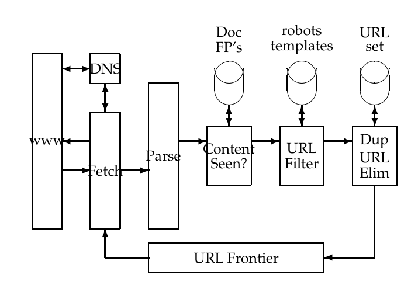
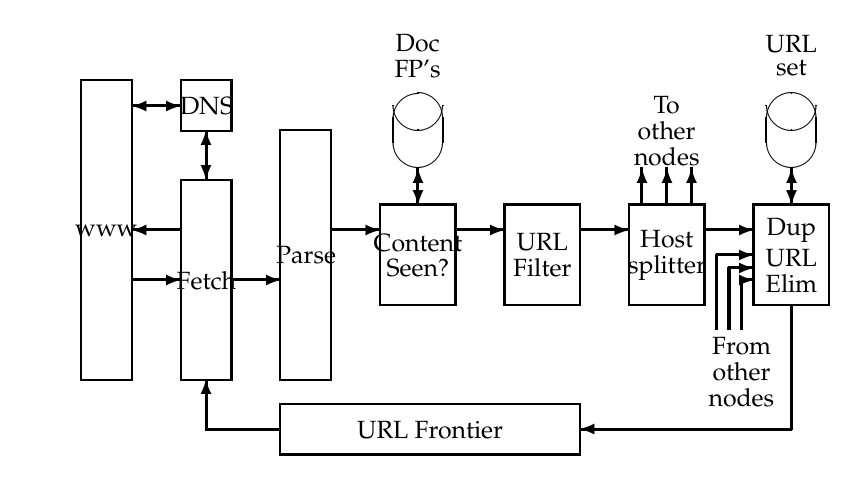
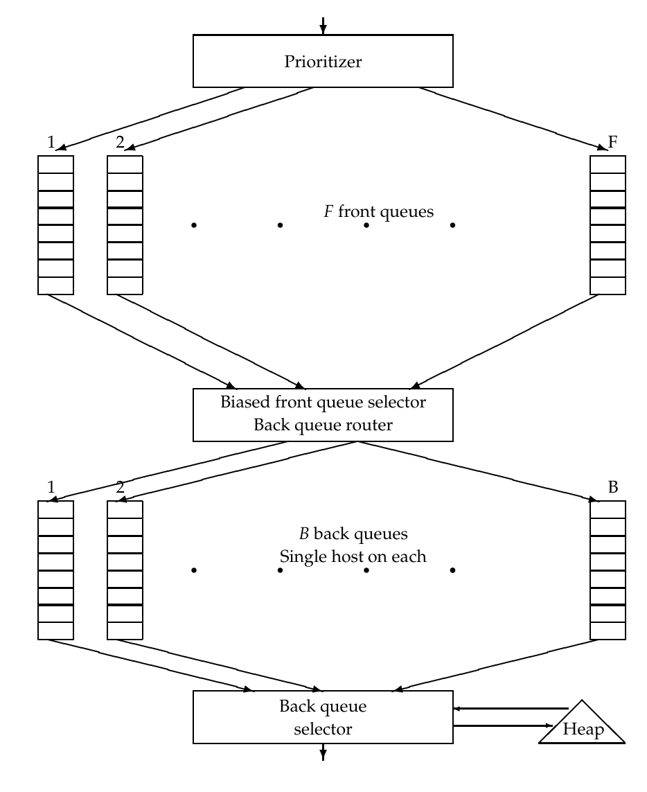

# 第 20 章 Web 爬取与索引

[返回系列目录](../introduction-to-information-retrieval.md) · [上一篇：第 19 章 Web 搜索基础](./19-web-search-basics.md) · [下一篇：第 21 章 链接分析](./21-link-analysis.md)

原书印刷页 443–460；PDF 第 480–497 页。

<!-- source: PDF 480; printed: 443 -->

## 20.1 概述

网络爬虫（Web crawling）是我们从 Web 上收集页面，以便对其进行索引并支持搜索引擎的过程。爬取的目的是快速高效地收集尽可能多的有用网页，以及将它们相互连接的链接结构。在第 19 章中，我们研究了 Web 的复杂性，这种复杂性源于数以百万计的互不协调的个人对其的创建。在本章中，我们将研究由此带来的爬取 Web 的困难。本章的重点是图 19.7 中所示的**网络爬虫（web crawler）**组件；它有时也被称为**蜘蛛（spider）**。

本章的目的不是描述如何为大规模商业 Web 搜索引擎构建爬虫。相反，我们关注的是从学生项目规模到大型研究项目在爬取过程中普遍存在的一系列问题。我们首先（第 20.1.1 节）列出网络爬虫的必备条件，然后在第 20.2 节中讨论如何解决这些问题中的每一个。本章的其余部分描述了满足这些特征的分布式网络爬虫的架构和一些实现细节。第 20.3 节讨论了在 Web 规模的实现中跨多台机器分布索引的问题。

### 20.1.1 爬虫必须提供的功能

我们将网络爬虫的必备条件分为两类：网络爬虫必须（must）提供的功能，以及它们应该（should）提供的功能。

**鲁棒性（Robustness）**：Web 上包含一些创建爬虫陷阱（spider traps）的服务器，这些陷阱是网页生成器，会误导爬虫陷入在特定域名中抓取无限数量网页的困境。爬虫的设计必须能够抵御此类陷阱。并非所有此类陷阱都是恶意的；有些是错误的网站开发无意中造成的副作用。

<!-- source: PDF 481; printed: 444 -->

**礼貌性（Politeness）**：Web 服务器具有隐式和显式的策略来规范爬虫访问它们的速率。必须遵守这些礼貌性策略。

### 20.1.2 爬虫应该提供的功能

**分布式（Distributed）**：爬虫应该具备跨多台机器以分布式方式执行的能力。

**可扩展性（Scalable）**：爬虫架构应该允许通过增加额外的机器和带宽来提高爬取速率。

**性能与效率（Performance and efficiency）**：爬取系统应该高效利用各种系统资源，包括处理器、存储和网络带宽。

**质量（Quality）**：鉴于很大一部分网页在满足用户查询需求方面效用很差，爬虫应该偏向于优先抓取“有用”的页面。

**新鲜度（Freshness）**：在许多应用中，爬虫应该以连续模式运行：它应该获取先前抓取页面的最新副本。例如，搜索引擎爬虫可以借此确保搜索引擎的索引包含每个已索引网页的相当最新的表示。对于这种连续爬取，爬虫应该能够以接近该页面变化率的频率来爬取页面。

**可扩展性（Extensible）**：爬虫的设计应该在许多方面具有可扩展性——以应对新的数据格式、新的抓取协议等。这就要求爬虫架构必须是模块化的。

## 20.2 爬取

任何超文本爬虫（无论是用于 Web、内联网还是其他超文本文档集）的基本操作如下。爬虫从构成种子集（seed set）的一个或多个 URL 开始。它从该种子集中选取一个 URL，然后抓取该 URL 处的网页。然后对抓取到的页面进行解析，以提取页面中的文本和链接（每个链接都指向另一个 URL）。提取的文本被送入文本索引器（在第 4 章和第 5 章中描述）。提取的链接（URL）随后被添加到 URL 前沿（URL frontier）中，该前沿始终由其对应页面尚未被爬虫抓取的 URL 组成。最初，URL 前沿包含种子集；随着页面的抓取，相应的 URL 会从 URL 前沿中删除。整个过程可以看作是遍历 Web 图（见

<!-- source: PDF 482; printed: 445 -->

第 19 章）。在连续爬取中，已抓取页面的 URL 会被重新添加到前沿中，以便将来再次抓取。

这种看似简单的 Web 图递归遍历，由于对实际网络爬取系统的诸多要求而变得复杂：爬虫在抓取高质量页面的同时，必须是分布式的、可扩展的、高效的、礼貌的、鲁棒的且易于扩展的。我们将考察这些问题中每一个的影响。我们的论述遵循 **Mercator** 爬虫的设计，该爬虫已成为许多研究和商业爬虫的基础。作为参考，在为期一个月的爬取中抓取 10 亿个页面（目前仅占静态 Web 的一小部分）需要每秒抓取数百个页面。我们将看到如何使用多线程设计来解决整个爬虫系统中的几个瓶颈，从而达到这种抓取速率。

在进行详细描述之前，我们向可能尝试构建爬虫的读者重申任何非专业爬虫都应满足的一些基本属性：

1. 在任何时候，对任何给定主机只能打开一个连接。
2. 对同一主机的连续请求之间应有几秒钟的等待时间。
3. 应遵守第 20.2.1 节中详述的礼貌性限制。

### 20.2.1 爬虫架构

上文概述的简单爬取方案需要几个模块协同工作，如图 20.1 所示。

1. URL 前沿，包含当前爬取中尚未抓取的 URL（在连续爬取的情况下，某个 URL 可能之前已被抓取过，但又回到了前沿中等待重新抓取）。我们将在第 20.2.3 节中对此进行进一步描述。
2. DNS 解析模块，用于确定从哪个 Web 服务器抓取 URL 指定的页面。我们将在第 20.2.2 节中对此进行进一步描述。
3. 抓取模块，使用 http 协议检索 URL 处的网页。
4. 解析模块，从抓取到的网页中提取文本和链接集合。
5. 去重模块，用于确定提取的链接是否已在 URL 前沿中或最近已被抓取过。

<!-- source: PDF 483; printed: 446 -->


**图 20.1** 基本爬虫架构。
图中文字：www（万维网）、DNS（域名系统）、Fetch（抓取）、Parse（解析）、Content Seen?（内容是否已见）、Doc FP's（文档指纹）、URL Filter（URL 过滤器）、robots templates（robots 规则模板）、Dup URL Elim（重复 URL 消除）、URL set（URL 集合）、URL Frontier（待抓取 URL 队列）。

爬取由一个到可能数百个线程执行，每个线程都在图 20.1 的逻辑循环中循环。这些线程可以在单个进程中运行，也可以划分到在分布式系统不同节点上运行的多个进程中。我们首先假设 URL 前沿已就位且非空，并将 URL 前沿实现的描述推迟到第 20.2.3 节。我们跟踪单个 URL 的进展，它经历了被抓取、通过各种检查和过滤器，然后最终（对于连续爬取）返回到 URL 前沿的循环。

爬虫线程首先从前沿中取出一个 URL，并抓取该 URL 处的网页，通常使用 http 协议。然后将抓取到的页面写入临时存储中，在那里对其执行许多操作。接下来，解析该页面并提取其中的文本以及链接。文本（带有任何标签信息——例如，粗体词项）被传递给索引器。包括锚文本在内的链接信息也被传递给索引器，以用于第 21 章中描述的排序方法。此外，每个提取的链接都要经过一系列测试，以确定是否应将该链接添加到 URL 前沿。

首先，线程测试是否已经在另一个 URL 处看到过具有相同内容的网页。对此最简单的实现是使用简单的指纹（fingerprint），例如校验和（放置在图 20.1 中标记为“Doc FP's”的存储中）。更复杂的测试将使用 shingle（连续词组）代替

<!-- source: PDF 484; printed: 447 -->

第 19 章中描述的指纹。

接下来，使用 URL 过滤器（URL filter）根据几个测试之一来确定提取的 URL 是否应从前沿中排除。例如，抓取可能试图排除某些域名（比如所有 .com URL）——在这种情况下，如果 URL 来自 .com 域名，测试将简单地将其过滤掉。类似的测试也可以是包含性的，而非排他性的。Web 上的许多主机根据称为**机器人排除协议**（Robots Exclusion Protocol）的标准，将其网站的某些部分设置为禁止抓取。这是通过在站点的 URL 层次结构根目录下放置一个名为 `robots.txt` 的文件来实现的。下面是一个 `robots.txt` 文件的示例，它指定除了名为“searchengine”的机器人之外，任何机器人都不得访问文件层次结构中以 `/yoursite/temp/` 开头的任何 URL。

```text
User-agent: *
Disallow: /yoursite/temp/

User-agent: searchengine
Disallow:
```

必须从网站获取 `robots.txt` 文件，以测试正在考虑的 URL 是否通过了机器人限制，从而可以添加到 URL 前沿中。与其在每次将 URL 添加到前沿时都重新获取它进行测试，不如使用缓存来获取该主机最近获取的文件副本。这一点尤为重要，因为从页面中提取的许多链接都属于获取该页面的主机，因此可以根据该主机的 `robots.txt` 文件进行测试。因此，通过在链接提取过程中执行过滤，我们在需要测试 `robots.txt` 文件的主机流中将具有特别高的局部性，从而带来很高的缓存命中率。不幸的是，这违背了网站管理员的礼貌期望。一个 URL（特别是指向低质量或很少更改的文档的 URL）可能会在前沿中停留数天甚至数周。如果我们在将此类 URL 添加到前沿之前执行机器人过滤，那么当该 URL 从前沿出队并被获取时，其 `robots.txt` 文件可能已经发生了变化。因此，我们必须在尝试获取网页之前立即执行机器人过滤。事实证明，维护 `robots.txt` 文件的缓存仍然非常有效；即使在从 URL 前沿出队的 URL 流中，也存在足够的局部性。

接下来，URL 应该在以下意义上进行**归一化**（URL normalization）：通常，网页 $p$ 中链接的 HTML 编码指示了该链接相对于页面 $p$ 的目标。因此，在页面 `en.wikipedia.org/wiki/Main_Page` 的 HTML 中有这样编码的相对链接：

<!-- source: PDF 485; printed: 448 -->

```html
<a href="/wiki/Wikipedia:General_disclaimer" title="Wikipedia:General
disclaimer">Disclaimers</a>
```

指向 URL `http://en.wikipedia.org/wiki/Wikipedia:General_disclaimer`。

最后，检查 URL 以进行重复消除：如果 URL 已经在前沿中，或者（在非连续抓取的情况下）已经被抓取过，我们就不将其添加到前沿中。当 URL 被添加到前沿时，会为其分配一个优先级，最终根据该优先级将其从前沿中移除以进行获取。这种优先级队列的详细信息在第 20.2.3 节中。

某些内务处理任务通常由专用线程执行。该线程通常处于静止状态，除了每隔几秒钟唤醒一次以记录抓取进度统计信息（已抓取的 URL、前沿大小等），决定是否终止抓取，或者（每抓取几个小时）对抓取进行检查点（checkpoint）保存。在检查点保存中，爬虫状态的快照（例如 URL 前沿）被提交到磁盘。如果发生灾难性的爬虫故障，抓取将从最近的检查点重新启动。

**分布式爬虫**

我们已经提到，爬虫中的线程可以在不同的进程下运行，每个进程位于分布式抓取系统的不同节点上。这种分布式处理对于扩展至关重要；它也可用于地理分布的爬虫系统，其中每个节点抓取“靠近”它的主机。可以通过哈希函数或某些更专门定制的策略，在爬虫节点之间对正在抓取的主机进行分区。例如，我们可以在欧洲放置一个爬虫节点以专注于欧洲域名，尽管由于几个原因这并不可靠——数据包在互联网上经过的路由并不总是反映地理上的接近程度，而且无论如何，主机的域名并不总是反映其物理位置。

分布式爬虫的各个节点如何通信和共享 URL？其思想是在每个节点上复制图 20.1 的流程，但有一个本质区别：在 URL 过滤器之后，我们使用主机拆分器（host splitter）将每个保留下来的 URL 分派给负责该 URL 的爬虫节点；因此，正在抓取的主机集合在节点之间被划分。这种修改后的流程如图 20.2 所示。主机拆分器的输出进入分布式系统中每个其他节点的重复 URL 消除器（Duplicate URL Eliminator）模块。

然而，图 20.2 分布式架构中的“内容是否已见过？”（Content Seen?）模块因以下几个因素而变得复杂：

1. 与 URL 前沿和重复消除模块不同，文档指纹/shingle 不能基于主机名进行分区。没有任何东西可以阻止相同（或高度相似）的内容出现在不同的 Web 服务器上。因此，指纹/shingle 集合必须根据指纹的某种属性在节点之间进行分

<!-- source: PDF 486; printed: 449 -->


**图 20.2** 分布式基本抓取架构。
图中文字：www（万维网）、Fetch（抓取）、DNS（域名系统）、Parse（解析）、Content Seen?（内容是否已见）、Doc FP's（文档指纹）、URL Filter（URL 过滤器）、Host splitter（主机分配器）、To other nodes（发往其他节点）、From other nodes（来自其他节点）、Dup URL Elim（重复 URL 消除）、URL set（URL 集合）、URL Frontier（待抓取 URL 队列）。

区（例如，通过对节点数取模来计算指纹）。这种局部性不匹配的结果是，大多数“内容是否已见过？”测试会导致远程过程调用（尽管可以批量处理查找请求）。

2. 文档指纹/shingle 流中几乎没有局部性。因此，缓存流行的指纹没有帮助（因为不存在流行的指纹）。

3. 文档会随着时间的推移而变化，因此，在连续抓取的背景下，我们必须能够从已见内容集合中删除其过时的指纹/shingle。为此，必须将文档的指纹/shingle 连同 URL 本身一起保存在 URL 前沿中。

### 20.2.2 DNS 解析

每个 Web 服务器（实际上是连接到互联网的任何主机）都有一个唯一的 **IP 地址**（IP address）：一个四字节序列，通常表示为由点分隔的四个整数；例如 `207.142.131.248` 是与主机 `www.wikipedia.org` 关联的数字 IP 地址。给定文本形式的 URL（如 `www.wikipedia.org`），将其转换为 IP 地址（在本例中为 `207.142.131.248`）是

<!-- source: PDF 487; printed: 450 -->

一个称为 **DNS 解析**（DNS resolution）或 DNS 查找的过程；这里的 DNS 代表域名服务（Domain Name Service）。在 DNS 解析期间，希望执行此转换的程序（在我们的例子中，是 Web 爬虫的一个组件）联系 **DNS 服务器**（DNS server），该服务器返回转换后的 IP 地址。（在实践中，整个转换可能不会在单个 DNS 服务器上发生；相反，最初联系的 DNS 服务器可能会递归调用其他 DNS 服务器来完成转换。）对于更复杂的 URL，例如 `en.wikipedia.org/wiki/Domain_Name_System`，负责 DNS 解析的爬虫组件会提取主机名——在本例中为 `en.wikipedia.org`——并查找主机 `en.wikipedia.org` 的 IP 地址。

DNS 解析是 Web 抓取中众所周知的瓶颈。由于域名服务的分布式特性，DNS 解析可能需要跨互联网的多次请求和往返，耗时数秒甚至更长。这立刻危及了我们每秒获取数百个文档的目标。一个标准的补救措施是引入缓存：我们最近执行过 DNS 查找的 URL 可能会在 DNS 缓存中找到，从而避免了访问互联网上的 DNS 服务器的需要。然而，遵守礼貌约束（见第 20.2.3 节）限制了缓存命中率。

DNS 解析中还有另一个重要的困难；标准库中的查找实现（开发爬虫的人很可能会使用）通常是同步的。这意味着一旦向域名服务发出请求，该节点上的其他爬虫线程就会被阻塞，直到第一个请求完成。为了规避这个问题，大多数 Web 爬虫都实现自己的 DNS 解析器作为爬虫的一个组件。执行解析器代码的线程 $i$ 向 DNS 服务器发送消息，然后执行定时等待：当收到另一个线程的信号或设定的时间片到期时，它将恢复执行。一个单独的 DNS 线程在标准 DNS 端口（端口 53）上监听来自名称服务的传入响应数据包。收到响应后，它向相应的爬虫线程（在本例中为 $i$）发出信号，如果 $i$ 尚未因为其时间片到期而恢复，则将响应数据包交给它。因为等待时间片到期而恢复的爬虫线程会重试固定次数，每次向 DNS 服务器发送新消息并执行定时等待；Mercator 的设计者建议重试大约 5 次。每次重试时，等待的时间片呈指数级增加；Mercator 从 1 秒开始，到大约 90 秒结束，这是考虑到有些主机名需要几十秒才能解析。

<!-- source: PDF 488; printed: 451 -->

### 20.2.3 URL 前端

节点处的 URL 前端（URL frontier）由其抓取进程（或其他抓取进程的主机拆分器）提供 URL。它维护前端中的 URL，并在爬虫线程请求 URL 时以某种顺序将其吐出（返回）。

有两个重要的考虑因素决定了前端返回 URL 的顺序。首先，频繁变化的高质量页面应优先进行频繁抓取。因此，页面的优先级应该是其变化率和质量（使用某种合理的质量估计）的函数。这种结合是必要的，因为大量的垃圾页面在每次抓取时都会完全改变。

第二个考虑因素是礼貌性（politeness）：我们必须避免在短时间内对同一主机发出重复的抓取请求。由于一种引用局部性（locality of reference）的形式，这种情况发生的可能性被加剧了：许多 URL 链接到同一主机上的其他 URL。因此，实现为简单优先队列的 URL 前端可能会导致对某一主机的抓取请求爆发。即使我们限制爬虫，使得在任何时候最多只有一个线程可以从任何单一主机进行抓取，这种情况也可能发生。一种常见的启发式方法是在对同一主机的连续抓取请求之间插入一个时间间隔，该间隔比最近一次从该主机抓取所花费的时间大一个数量级。

图 20.3 展示了一个具有礼貌性和优先级划分的 URL 前端实现。其目标是确保：（i）在任何时候对任何主机只打开一个连接；（ii）对同一主机的连续请求之间有几秒钟的等待时间；以及（iii）优先抓取高优先级的页面。

两个主要的子模块是图上半部分的一组 $F$ 个前端队列（front queues），以及下半部分的一组 $B$ 个后端队列（back queues）；所有这些都是 FIFO（先进先出）队列。前端队列实现优先级划分，而后端队列实现礼貌性。在添加到前端的 URL 流经前端和后端队列的过程中，优先级分配器（prioritizer）首先根据其抓取历史（考虑到该 URL 处的网页在先前抓取之间的变化率），为该 URL 分配一个介于 1 和 $F$ 之间的整数优先级 $i$。例如，表现出频繁变化的文档将被分配更高的优先级。其他启发式方法可能依赖于应用程序且是显式的——例如，来自新闻服务的 URL 可能总是被分配最高优先级。既然已经被分配了优先级 $i$，该 URL 现在被追加到第 $i$ 个前端队列中。

$B$ 个后端队列中的每一个都维护以下不变量：（i）在抓取进行时它非空，以及（ii）它只包含来自单一主机的 URL<sup>[1]</sup>。一个辅助表 $T$（图 20.4）用于维护从主机到后端队列的映射。每当后端队列为空并从前端队列重新填充时，必须相应地更新表 $T$。

> **脚注 1（原书第 451 页）**：假设主机的数量远远超过 $B$。

<!-- source: PDF 489; printed: 452 -->



**图 20.3** URL 前端。从已抓取页面中提取的 URL 从图的顶部流入。请求 URL 的爬虫线程从图的底部提取它。在途中，URL 流经几个管理其抓取优先级的前端队列之一，随后流经几个管理爬虫礼貌性的后端队列之一。

图中文字：Prioritizer 优先级分配器；F front queues F 个前端队列；Biased front queue selector 带偏好的前端队列选择器；Back queue router 后端队列路由器；B back queues B 个后端队列；Single host on each 每个队列单一主机；Back queue selector 后端队列选择器；Heap 堆

<!-- source: PDF 490; printed: 453 -->

| Host | Back queue |
|---|---|
| stanford.edu | 23 |
| microsoft.com | 47 |
| acm.org | 12 |

**图 20.4** 辅助的主机到后端队列映射表示例。

此外，我们维护一个堆（heap），每个后端队列在其中有一个条目，该条目是对应于该队列的主机可以再次被联系的最早时间 $t_e$。

从前端请求 URL 的爬虫线程提取此堆的根节点，并（如果需要）等待直到对应的时间条目 $t_e$。然后，它获取对应于提取的堆根节点的后端队列 $j$ 头部的 URL $u$，并继续抓取 URL $u$。抓取 $u$ 之后，调用线程检查 $j$ 是否为空。如果为空，它选择一个前端队列并从其头部提取一个 URL $v$。前端队列的选择偏向于（通常通过随机过程）较高优先级的队列，确保高优先级的 URL 更快地流入后端队列。我们检查 $v$ 以确认是否已经有一个后端队列持有来自其主机的 URL。如果是这样，$v$ 被添加到该队列中，我们再回到前端队列寻找另一个候选 URL，以插入到现在为空的队列 $j$ 中。这个过程一直持续到 $j$ 再次非空。在任何情况下，线程都会根据 $j$ 中最后抓取的 URL 的属性（例如其主机上次被联系的时间以及上次抓取所花费的时间），为 $j$ 插入一个具有新的最早时间 $t_e$ 的堆条目，然后继续其处理。例如，新条目 $t_e$ 可以是当前时间加上十倍的上次抓取时间。

前端队列的数量，连同分配优先级和选择队列的策略，决定了我们希望在系统中构建的优先级属性。后端队列的数量决定了我们在遵守礼貌性的同时，能在多大程度上保持所有抓取线程处于忙碌状态。Mercator 的设计者推荐了一个粗略的经验法则：后端队列的数量是爬虫线程数量的三倍。

在 Web 规模的抓取中，URL 前端可能会增长到在节点上需要的内存超过可用内存的程度。解决方案是让大部分 URL 前端驻留在磁盘上。每个队列的一部分保留在内存中，随着内存中的部分被消耗，更多的内容从磁盘调入。

**习题 20.1**
为什么在分布式抓取系统的节点之间划分主机（而不是单个 URL）更好？

**习题 20.2**
为什么主机拆分器应该在重复 URL 消除器之前？

<!-- source: PDF 491; printed: 454 -->

**习题 20.3** [⋆⋆⋆]
在前面的讨论中，我们遇到了两个推荐的“硬常数”——$t_e$ 的增量是上次抓取时间的十倍，以及后端队列的数量是抓取线程数量的三倍。这两个常数之间有什么关系？

## 20.3 分布式索引

在第 4.4 节中，我们描述了分布式索引构建。现在我们考虑在支持查询的大型计算机集群<sup>[2]</sup>上分布索引。

有两种明显的备选索引实现方式：**按词项划分**（partitioning by terms），也称为全局索引组织（global index organization）；以及**按文档划分**（partitioning by documents），也称为局部索引组织（local index organization）。在前者中，索引词项的词典被划分为多个子集，每个子集驻留在一个节点上。与节点上的词项一起，我们保留这些词项的倒排记录（postings）。查询被路由到其查询词项对应的节点。原则上，这允许更大的并发性，因为具有不同查询词项的查询流会命中不同的机器集合。

在实践中，按词汇表词项划分索引被证明并非易事。多词查询需要在节点集之间发送长倒排记录表以进行合并，而这种代价可能会超过更大并发性带来的好处。划分的负载均衡取决于查询词项及其共现的分布，仅靠预先分析相对词项频率无法确定；查询分布可能随时间漂移，也可能突然爆发。实现良好的划分是查询词项共现的函数，并且需要对词项进行聚类以优化不易量化的目标。最后，这种策略使得动态索引的实现变得更加困难。

一种更常见的实现是按文档划分：每个节点包含所有文档子集的索引。每个查询被分发到所有节点，来自各个节点的结果在呈现给用户之前进行合并。这种策略用更多的本地磁盘寻道来换取更少的节点间通信。这种方法的一个困难在于，用于评分的全局统计数据（如 idf）必须在整个文档集上计算，即使任何单个节点上的索引只包含文档的子集。这些数据由分布式的“后台”进程计算，这些进程定期用最新的全局统计数据刷新节点索引。

我们如何决定将文档划分到节点？基于我们在第 20.2.1 节中对爬虫架构的开发，一种简单的方法是将来自同一主机的所有页面分配给单个节点。这种划分可以遵循主机到爬虫节点的划分。

> **脚注 2（原书第 454 页）**：请注意本书其他地方对“集群（clusters）”的不同用法，即第 16 章和第 17 章中“簇”的含义。

<!-- source: PDF 492; printed: 455 -->

可以遵循将主机划分给爬虫节点的划分方式。这种划分的一个危险在于，对于许多查询，绝大多数结果将来自少数主机（因此也来自少数索引节点）的文档。

将每个 URL 哈希到索引节点空间中，可以使查询时的计算在各个节点上分布得更加均匀。在查询时，查询被广播到每个节点，合并每个节点的前 $k$ 个结果以找到该查询的前 $k$ 篇文档。一种常见的实现启发式方法是将文档集（document collection）划分为在大多数查询中更有可能获得高评分（score）的文档索引（例如，使用第 21 章中的技术），以及包含剩余文档的低评分索引。如第 7.2.1 节所述，只有当高评分索引中的匹配项太少时，我们才会搜索低评分索引。

## 20.4 Connectivity servers

出于在第 21 章中会变得更加清晰的原因，Web 搜索引擎需要一个连通性服务器（connectivity server），以支持在 Web 图上进行快速的连通性查询（connectivity queries）。典型的连通性查询包括：*哪些 URL 链接到给定的 URL？*以及*给定的 URL 链接到哪些 URL？*为此，我们希望在内存中存储从 URL 到出链（out-links）以及从 URL 到入链（in-links）的映射。其应用包括爬行控制、Web 图分析、复杂的爬行优化和链接分析（将在第 21 章中介绍）。

假设 Web 有 40 亿个页面，每个页面有 10 个指向其他页面的链接。在最简单的形式下，我们需要 32 位或 4 个字节来指定每个链接的每一端（源和目标），总共需要

$$ 4 \times 10^9 \times 10 \times 8 = 3.2 \times 10^{11} $$

字节的内存。可以利用 Web 图的一些基本属性，将内存需求降低到不到此数值的 10%。乍一看，我们似乎面临一个数据压缩问题——这可以通过各种标准解决方案来处理。然而，我们的目标不仅仅是压缩 Web 图以适应内存；我们必须以一种有效支持连通性查询的方式来做到这一点；这一挑战让人联想到索引压缩（第 5 章）。

我们假设每个网页都由一个唯一的整数表示；用于分配这些整数的具体方案将在下文描述。我们构建一个类似于倒排索引（inverted index）的邻接表：它为每个网页保留一行，各行按相应的整数排序。任何页面 $p$ 的行都包含一个排序的整数列表，每个整数对应一个链接到 $p$ 的网页。该表允许我们响应诸如*哪些页面链接到 $p$？*这类形式的查询。以类似的方式，我们构建一个表，其条目是 $p$ 所链接到的页面。

<!-- source: PDF 493; printed: 456 -->

```text
1: www.stanford.edu/alchemy
2: www.stanford.edu/biology
3: www.stanford.edu/biology/plant
4: www.stanford.edu/biology/plant/copyright
5: www.stanford.edu/biology/plant/people
6: www.stanford.edu/chemistry
```

**图 20.5** 按字典序排列的 URL 集合。

这种表格表示法将朴素表示法（在朴素表示法中，我们用两个端点显式表示每个链接，每个端点是一个 32 位整数）所占用的空间减少了 50%。我们下面的描述将集中在每个页面发出的链接表上；很明显，这些技术同样适用于指向每个页面的链接表。为了进一步减少该表的存储空间，我们利用了以下几个思想：

1. 列表之间的相似性（Similarity between lists）：表中的许多行有许多共同的条目。因此，如果我们为几个相似的行显式表示一个原型行（prototype row），其余的行就可以用该原型行简洁地表达出来。
2. 局部性（Locality）：一个页面的许多链接指向“附近”的页面——例如，同一主机上的页面。这表明在对链接的目标进行编码时，我们通常可以使用较小的整数，从而节省空间。
3. 我们在排序列表中使用间距编码（gap encodings）：我们不存储每个链接的目标，而是存储与行中前一个条目的偏移量。

我们现在展开介绍这些技术中的每一种。

在所有 URL 的字典序排列中，我们将每个 URL 视为一个字母数字字符串并对这些字符串进行排序。图 20.5 显示了这种排序顺序的一个片段。对于网页的真正字典序排序，URL 的域名部分应该反转，使得 `www.stanford.edu` 变成 `edu.stanford.www`，但在这里没有必要，因为我们主要关注的是单个主机本地的链接。

对于每个 URL，我们将其在此排序中的位置分配为唯一标识整数。图 20.6 显示了这种编号和生成的表的一个示例。在这个示例序列中，`www.stanford.edu/biology` 被分配了整数 2，因为它是序列中的第二个。

接下来，我们利用源自大多数网站结构方式的一个属性来获得相似性和局部性。大多数网站都有一个模板，其中包含从网站中每个页面指向网站上一组固定页面的链接集合（例如

<!-- source: PDF 494; printed: 457 -->

```text
1: 1, 2, 4, 8, 16, 32, 64
2: 1, 4, 9, 16, 25, 36, 49, 64
3: 1, 2, 3, 5, 8, 13, 21, 34, 55, 89, 144
4: 1, 4, 8, 16, 25, 36, 49, 64
```

**图 20.6** 链接表的一个四行片段。

它的版权声明、使用条款等）。在这种情况下，对应于网站中页面的行将有许多共同的表条目。此外，在 URL 的字典序排列下，来自同一个网站的页面很可能在表中显示为连续的行。

我们采用以下策略：我们向下遍历该表，根据前面的七行对每个表行进行编码。在图 20.6 的示例中，我们可以将第四行编码为“与偏移量为 2 的行（即表中早两行的位置）相同，将 9 替换为 8”。这需要指定偏移量、丢弃的整数（在本例中为 9）和添加的整数（在本例中为 8）。仅使用前面的七行有两个优点：(i) 偏移量只需 3 个比特即可表示；这种选择是根据经验优化的（为什么是前面七行而不是八行是练习 20.4 的主题）；(ii) 将最大偏移量固定为一个较小的值（如 7），可以避免在许多候选原型中执行昂贵的搜索来表达当前行。

如果前面的七行中没有一行是表达当前行的好原型怎么办？例如，当我们向下遍历表的行时，在不同网站之间的每个边界处就会发生这种情况。在这种情况下，我们只需将该行表示为从空集开始，并“添加”该行中的每个整数。通过使用间距编码来存储每行中的间距（而不是实际的整数），并根据其值的分布对这些间距进行紧凑编码，我们可以进一步减少空间。在第 20.5 节提到的实验中，这里概述的系列技术平均每个链接似乎只使用 3 个比特——与朴素表示法所需的 64 个比特相比，这是一个显著的减少。

虽然这些想法为我们提供了一种可以轻松放入内存的大型 Web 图表示方法，但我们仍然需要支持连通性查询。从这种表示中检索一个页面的链接集合需要什么？首先，我们需要进行索引查找，从 URL（的哈希值）找到其在表中的行号。接下来，我们需要重建这些条目，它们可能是根据其他行中的条目编码的。这需要顺着偏移量来重建这些其他行——原则上，这个过程可能会导致多层间接寻址（indirection）。然而在实践中，这种情况并不经常发生。可以在表的构

<!-- source: PDF 495; printed: 458 -->

建中引入一种启发式方法来控制这一点：当检查前面的七行作为对当前行进行建模的候选行时，我们要求当前行和候选原型之间达到一定的相似度阈值。必须谨慎选择此阈值。如果阈值设置得太高，我们很少使用原型，而是重新表达许多行。如果阈值太低，大多数行都会用原型来表达，这样在查询时，一行的重建会导致通过前面的原型进行多层间接寻址。

**练习 20.4**
我们注意到，用前面的七行之一来表达一行，使我们能够使用不超过三个比特来指定我们使用前面的哪一行作为原型。为什么是前面七行而不是八行？（提示：考虑前面七行中没有一行是好原型的情况。）

**练习 20.5**
我们注意到，对于第 20.4 节中的方案，解码关联到一个 URL 的链接可能会导致多层间接寻址。构造一个示例，其中间接寻址的层数随 URL 的数量线性增长。

## 20.5 References and further reading

第一个 Web 爬虫似乎是 Matthew Gray 在 1993 年春天编写的 Wanderer。Mercator 爬虫由 Najork 和 Heydon（Najork and Heydon 2001; 2002）提出；本章的论述遵循了他们的工作。其他经典的早期 Web 爬行描述包括 Burner (1997)、Brin and Page (1998)、Cho et al. (1998) 以及斯坦福大学 Webbase 系统的创建者（Hirai et al. 2000）。Cho and Garcia-Molina (2002) 对分布式爬虫节点之间不同通信模式进行了分类和比较研究。Robots 排除协议（Robots Exclusion Protocol）标准在 http://www.robotstxt.org/wc/exclusion.html 中有描述。Boldi et al. (2002) 和 Shkapenyuk and Suel (2002) 提供了实现大规模分布式 Web 爬虫的最新细节。

我们对 DNS 解析的讨论（第 20.2.2 节）使用了当前的互联网地址约定，即 IPv4（代表互联网协议第 4 版）——每个 IP 地址是一个四字节的序列。在未来，地址约定（统称为互联网地址空间）可能会使用一种称为 IPv6 (http://www.ipv6.org/) 的新标准。

Tomasic and Garcia-Molina (1993) 以及 Jeong and Omiecinski (1995) 是评估分布式索引的词项划分（term partitioning）与文档划分（document partitioning）的关键早期论文。研究发现文档划分更优，至少在词项分布倾斜时是这样，而这在实践中是典型情况。这一结果在最近的工作中得到了普遍证实（MacFarlane et al. 2000）。但结果取决于分布式系统的细节；

<!-- source: PDF 496; printed: 459 -->

至少有一项研究得出了相反的结论（Ribeiro-Neto and Barbosa 1998, Badue et al. 2001）。Sornil (2001) 主张采用一种介于词项划分和文档划分之间的混合划分方案。Barroso et al. (2003) 描述了 Google 所使用的分布式方法。连通性服务器的首次实现由 Bharat et al. (1998) 进行了描述。本章讨论的方案目前被认为是已发表的最佳方案（编码时每条链接仅需 3 个比特），Boldi and Vigna (2004a;b) 在一系列论文中对其进行了描述。

<!-- source: PDF 497; printed: 460 -->

<!-- 原书此页为空白，仅有重复的版本页脚。 -->

[返回系列目录](../introduction-to-information-retrieval.md) · [上一篇：第 19 章 Web 搜索基础](./19-web-search-basics.md) · [下一篇：第 21 章 链接分析](./21-link-analysis.md)
