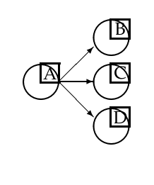
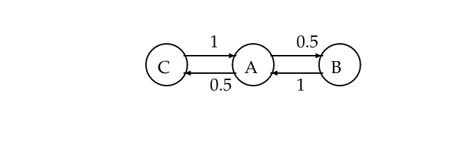
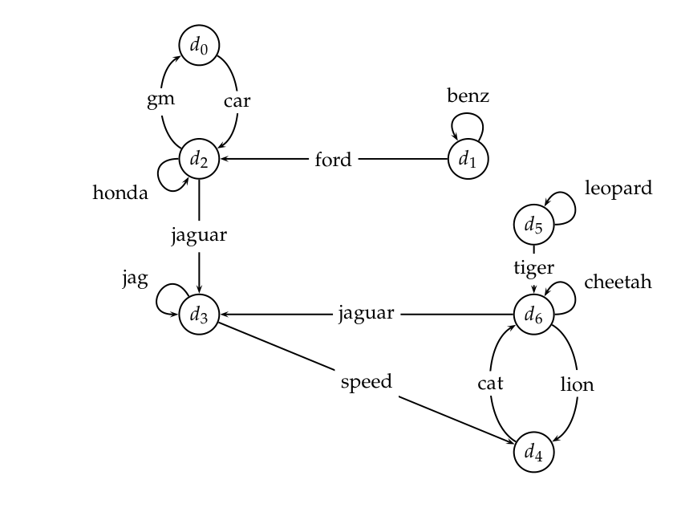
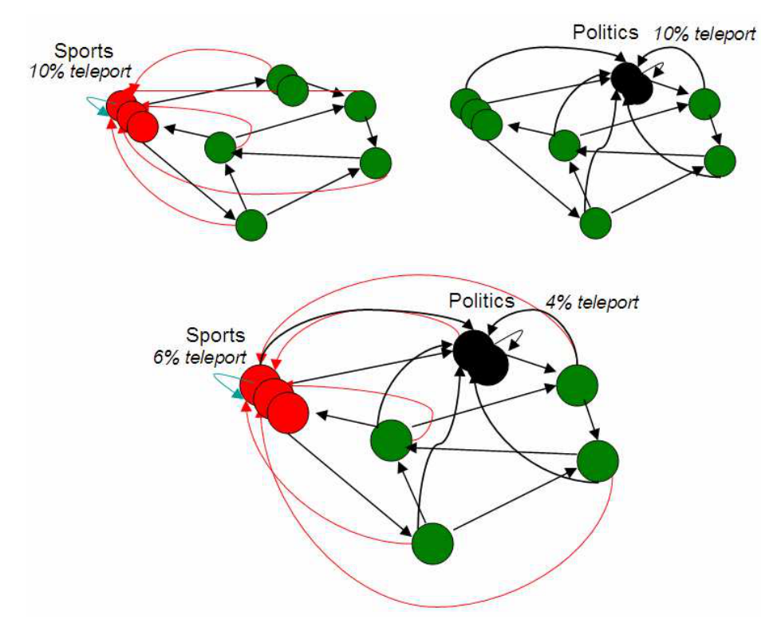
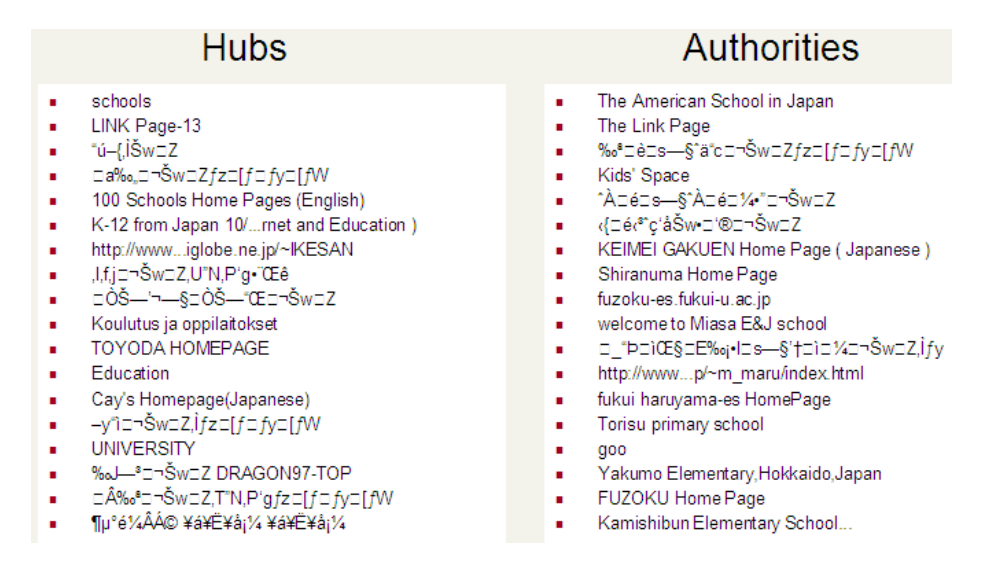
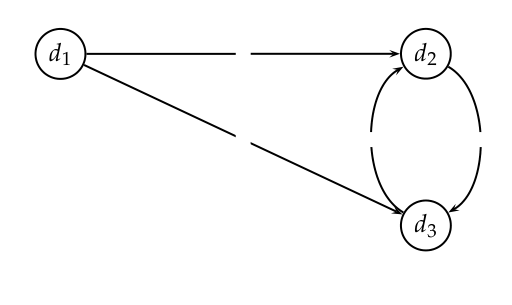

# 第 21 章 链接分析

[返回系列目录](../introduction-to-information-retrieval.md) · [上一篇：第 20 章 Web 爬取与索引](./20-web-crawling-and-indexes.md) · [下一篇：参考文献](./22-bibliography.md)

原书印刷页 461–482；PDF 第 498–519 页。

<!-- source: PDF 498; printed: 461 -->

对超链接和Web图结构的分析在Web搜索的发展中起到了重要作用。在本章中，我们将重点关注如何使用超链接对Web搜索结果进行排序。这种链接分析（link analysis）是Web搜索引擎在计算给定查询下网页综合评分（composite score）时考虑的众多因素之一。我们首先在第 21.1 节回顾将Web视为图的一些基础知识，然后进入用于排序的链接分析要素的技术演进。

Web搜索的链接分析在引文分析（citation analysis）领域有其学术渊源，其某些方面与被称为文献计量学（bibliometrics）的领域有重叠。这些学科试图通过分析学术论文之间的引用模式来量化其影响力。正如引用代表了一篇学术论文向其他论文授予权威性一样，Web上的链接分析将一个网页指向另一个网页的超链接视为一种权威性的授予。显然，并非每一次引用或超链接都意味着这种权威性的授予；因此，仅仅通过入链（in-links，即来自其他页面的引用）的数量来衡量网页的质量是不够稳健的。例如，有人可能会处心积虑地建立多个指向目标网页的网页，意图人为地增加后者的入链数量。这种现象被称为链接作弊（link spam）。尽管如此，引用现象仍然足够普遍和可靠，使得Web搜索引擎能够通过更复杂的链接分析提取出用于排序的有用信号。链接分析也被证明是抓取Web时决定接下来要抓取哪些页面的有用指标；这是通过使用链接分析来指导第 20 章中前端队列的优先级分配来实现的。

第 21.1 节阐述了在链接分析中使用Web图的基本思想。随后，第 21.2 节和第 21.3 节将介绍两种不同的链接分析方法：PageRank 和 HITS。

<!-- source: PDF 499; printed: 462 -->

## 21.1 Web图

回顾第 19.2.1 节中Web图的概念，特别是图 19.2。我们对链接分析的研究建立在两个直觉之上：

1. 指向页面 B 的锚文本（anchor text）是对页面 B 的良好描述。
2. 从 A 到 B 的超链接代表了页面 A 的创建者对页面 B 的认可（endorsement）。情况并非总是如此；例如，单个网站内页面之间的许多链接源于使用了通用模板。例如，大多数企业网站的每个页面都有一个指向包含版权声明页面的链接——这显然不是一种认可。因此，链接分析算法的实现通常会对这种“内部”链接打折扣。

### 21.1.1 锚文本与Web图

以下来自某网页的 HTML 代码片段展示了一个指向《ACM期刊》（Journal of the ACM）主页的超链接：

```html
<a href="http://www.acm.org/jacm/">Journal of the ACM.</a>
```

在这种情况下，链接指向页面 `http://www.acm.org/jacm/`，而锚文本是 Journal of the ACM。显然，在这个例子中，锚文本对目标页面具有描述性。但是，目标页面（B = `http://www.acm.org/jacm/`）本身也包含相同的描述以及关于该期刊的大量附加信息。那么锚文本有什么用呢？

Web上充满了页面 B 没有提供对其自身准确描述的例子。在许多情况下，这取决于页面 B 的发布者选择如何展示自己；这在企业网页中尤为常见，因为Web展示是一种营销声明。例如，在撰写本书时，IBM 公司的主页（`http://www.ibm.com`）的 HTML 代码中没有任何地方包含词项 computer（计算机），尽管 IBM 被广泛认为是世界上最大的计算机制造商。同样，Yahoo! 主页（`http://www.yahoo.com`）的 HTML 代码目前也不包含 portal（门户）一词。

因此，网页中的词项与Web用户描述该网页的方式之间往往存在差距。因此，Web搜索者不需要使用页面中的词项来查询它。此外，许多网页包含丰富的图形和图像，和/或将文本嵌入到这些图像中；在这种情况下，抓取时执行的 HTML 解析将无法提取出对索引这些页面有用的文本。解决这个问题的“标准信息检索（IR）”方法是使用第 9 章和第 12.4 节中概述的方法。其洞察力

<!-- source: PDF 500; printed: 463 -->

背后的洞察力在于，这些方法可以被锚文本所取代，从而利用Web页面作者社区的力量。

许多指向 `http://www.ibm.com` 的超链接的锚文本包含 computer 一词，这一事实可以被Web搜索引擎利用。例如，锚文本词项可以作为索引目标网页的词项包含在内。因此，词项 computer 的倒排记录（postings）将包含文档 `http://www.ibm.com`，而词项 portal 的倒排记录将包含文档 `http://www.yahoo.com`，并使用一个特殊的指示符来表明这些词项是作为锚文本（而不是页面内文本）出现的。与页面内词项一样，锚文本词项通常基于频率进行加权，并对出现频率极高的词项进行惩罚（整个Web的锚文本中最常见的词项是 Click 和 here，使用的方法与 idf 非常相似）。词项的实际权重由机器学习评分决定，如第 15.4.1 节所述；当前的Web搜索引擎似乎为锚文本词项分配了相当大的权重。

锚文本的使用有一些有趣的副作用。在大多数Web搜索引擎上搜索 big blue（蓝色巨人）会返回 IBM 公司的主页作为最高命中结果；这与许多人用来指代 IBM 的流行昵称是一致的。另一方面，曾经（并且继续）有许多实例表明，贬损性的锚文本（如 evil empire，邪恶帝国）会导致在Web搜索引擎上查询这些词项时出现一些意想不到的结果。这种现象在针对特定网站的精心策划的活动中被利用。这种精心策划的锚文本可能是一种作弊（spamming）形式，因为网站可以创建指向自身的误导性锚文本，以提高其在选定查询词项上的排名。检测和打击这种对锚文本的系统性滥用是Web搜索引擎执行的另一种形式的作弊检测。

锚文本周围的文本窗口（有时称为扩展锚文本，extended anchor text）通常可以与锚文本本身以相同的方式使用；例如，考虑Web文本片段 there is good discussion of vedic scripture `<a>here</a>`（这里有关于吠陀经文的精彩讨论）。这已在许多环境中被考虑过，并且已经研究了该窗口的有用宽度；参考文献见第 21.4 节。

**习题 21.1**
在Web图中，是否总是可以沿着有向边（超链接）从任何节点（网页）到达任何其他节点？为什么能或为什么不能？

**习题 21.2**
在Web上找出一个误导性锚文本的实例。

**习题 21.3**
给定网页 $x$ 的锚文本短语集合，提出一种启发式方法，从该集合中选择一个最能描述 $x$ 的词项或短语。

<!-- source: PDF 501; printed: 464 -->


**图 21.1** 节点 A 处的随机冲浪者以 1/3 的概率分别前往 B、C 和 D。
图中文字：A, B, C, D

**习题 21.4**
你在上一题中的启发式方法是否考虑了单个域名 $D$ 中多个页面重复出现指向 $x$ 的锚文本的情况？

## 21.2 PageRank

我们现在重点关注仅从链接结构推导出的评分和排序度量。我们的第一种链接分析技术为Web图中的每个节点分配一个介于 0 和 1 之间的数值评分，称为其 **PageRank**。

节点的 PageRank 将取决于Web图的链接结构。给定一个查询，Web搜索引擎会为每个网页计算一个综合评分，该评分结合了数百个特征，如余弦相似度（第 6.3 节）和词项邻近度（第 7.2.2 节），以及 PageRank 评分。这个使用第 15.4.1 节的方法开发出的综合评分，被用于为查询提供排序后的结果列表。

考虑一个随机冲浪者（random surfer），他从一个网页（Web图的一个节点）开始，并在Web上执行如下的随机游走（random walk）。在每个时间步，冲浪者从他当前的页面 A 前往 A 超链接到的一个随机选择的网页。图 21.1 显示了冲浪者在节点 A 处，从该节点有三个超链接指向节点 B、C 和 D；冲浪者在下一个时间步以 1/3 的同等概率前往这三个节点之一。

随着冲浪者在这种随机游走中从一个节点前进到另一个节点，他访问某些节点的频率会高于其他节点；直观地说，这些节点有许多来自其他频繁访问节点的入链。PageRank 背后的思想是，在这种游走中被访问频率更高的页面更重要。

如果冲浪者当前的位置（节点 A）没有出链怎么办？为了解决这个问题，我们为随机冲浪者引入了一个额外的操作：**瞬移**（teleport）操作。在瞬移操作中，冲浪者从一个节点跳转到Web图中的任何其他节点。这可能是因为他输入了

<!-- source: PDF 502; printed: 465 -->

在浏览器的 URL 栏中输入了一个地址。传送操作的目的地被建模为从所有网页中均匀随机地选择。换句话说，如果 $N$ 是 Web 图中的节点总数$^1$，传送操作将以 $1/N$ 的概率把冲浪者带到每个节点。冲浪者也会以 $1/N$ 的概率传送到他当前的位置。

在为 Web 图的每个节点分配 PageRank 评分时，我们以两种方式使用传送操作：（1）当处于没有出链的节点时，冲浪者调用传送操作。（2）在任何有出链的节点，冲浪者以 $0 < \alpha < 1$ 的概率调用传送操作，并以 $1 - \alpha$ 的概率进行标准随机游走（如 图 21.1 所示，均匀随机地选择一条出链跟随），其中 $\alpha$ 是预先选择的固定参数。通常，$\alpha$ 可以是 0.1。

在第 21.2.1 节中，我们将使用马尔可夫链（Markov chain）理论来证明，当冲浪者遵循这种组合过程（随机游走加上传送）时，他访问 Web 图中每个节点 $v$ 的时间占一个固定比例 $\pi(v)$，该比例取决于（1）Web 图的结构和（2）$\alpha$ 的值。我们将这个值 $\pi(v)$ 称为 $v$ 的 PageRank，并将在第 21.2.2 节中展示如何计算这个值。

### 21.2.1 马尔可夫链

马尔可夫链是一个离散时间随机过程（discrete-time stochastic process）：该过程发生在一系列时间步中，在每个时间步都会做出随机选择。一个马尔可夫链由 $N$ 个状态（state）组成。每个网页将对应于我们将要构建的马尔可夫链中的一个状态。

马尔可夫链由一个 $N \times N$ 的转移概率矩阵（transition probability matrix）$P$ 来表征，其每个元素都在区间 $[0, 1]$ 内；$P$ 中每一行的元素之和为 1。在任何给定的时间步，马尔可夫链可以处于 $N$ 个状态之一；那么，元素 $P_{ij}$ 告诉我们，在当前状态为 $i$ 的条件下，下一个时间步状态为 $j$ 的概率。每个元素 $P_{ij}$ 被称为转移概率（transition probability），并且仅取决于当前状态 $i$；这被称为马尔可夫性质（Markov property）。因此，根据马尔可夫性质，

$$ \forall i, j, P_{ij} \in [0, 1] $$

并且

$$ \forall i, \sum_{j=1}^N P_{ij} = 1. \tag{21.1} $$

满足式（21.1）且元素非负的矩阵被称为随机矩阵（stochastic matrix）。随机矩阵的一个关键性质是它具有一个对应于其最大特征值（即 1）的主左特征向量（principal left eigenvector）。

> **脚注 1（原书第 465 页）**：这与我们使用 $N$ 表示文档集中的文档数量是一致的。

<!-- source: PDF 503; printed: 466 -->


**图 21.2** 具有三个状态的简单马尔可夫链；链接上的数字表示转移概率。

在马尔可夫链中，下一个状态的概率分布仅取决于当前状态，而不取决于马尔可夫链是如何到达当前状态的。图 21.2 展示了一个具有三个状态的简单马尔可夫链。从中间状态 A，我们以 0.5 的（相等）概率前进到 B 或 C。从 B 或 C，我们以概率 1 前进到 A。该马尔可夫链的转移概率矩阵为

$$ \begin{pmatrix} 0 & 0.5 & 0.5 \\ 1 & 0 & 0 \\ 1 & 0 & 0 \end{pmatrix} $$

马尔可夫链在其状态上的概率分布可以被视为一个概率向量（probability vector）：一个所有元素都在区间 $[0, 1]$ 内且元素之和为 1 的向量。一个 $N$ 维概率向量，其每个分量对应于马尔可夫链的 $N$ 个状态之一，可以被视为其状态上的概率分布。对于图 21.2 中的简单马尔可夫链，概率向量将具有 3 个总和为 1 的分量。

我们可以将 Web 图上的随机冲浪者视为一个马尔可夫链，每个网页对应一个状态，每个转移概率表示从一个网页移动到另一个网页的概率。传送操作对这些转移概率有贡献。Web 图的邻接矩阵（adjacency matrix）$A$ 定义如下：如果存在从页面 $i$ 到页面 $j$ 的超链接，则 $A_{ij} = 1$，否则 $A_{ij} = 0$。我们可以很容易地从 $N \times N$ 矩阵 $A$ 推导出马尔可夫链的转移概率矩阵 $P$：

1. 如果 $A$ 的某一行没有 1，则将该行的每个元素替换为 $1/N$。对于所有其他行，按如下方式进行。
2. 将 $A$ 中的每个 1 除以其所在行中 1 的数量。因此，如果某一行有三个 1，那么它们中的每一个都被替换为 $1/3$。
3. 将得到的矩阵乘以 $1 - \alpha$。

<!-- source: PDF 504; printed: 467 -->

4. 将 $\alpha/N$ 加到所得矩阵的每个元素上，得到 $P$。

我们可以用概率向量 $\vec{x}$ 来描述冲浪者在任何时间的概率分布。在 $t = 0$ 时，冲浪者可能从某个状态开始，该状态在 $\vec{x}$ 中对应的元素为 1，而所有其他元素为零。根据定义，冲浪者在 $t = 1$ 时的分布由概率向量 $\vec{x}P$ 给出；在 $t = 2$ 时由 $(\vec{x}P)P = \vec{x}P^2$ 给出，依此类推。我们将在第 21.2.2 节中详细说明这个过程。因此，只要给定初始分布和转移概率矩阵 $P$，我们就可以计算出冲浪者在任何时间在各个状态上的分布。

如果允许马尔可夫链运行许多个时间步，每个状态被访问的频率（各不相同）取决于马尔可夫链的结构。在我们一直使用的类比中，冲浪者访问某些网页（例如，流行的新闻主页）的频率高于其他网页。我们现在将这种直觉精确化，建立这种访问频率收敛到固定的稳态（steady-state）数量的条件。在此之后，我们将每个节点 $v$ 的 PageRank 设置为这个稳态访问频率，并展示如何计算它。

**定义**：如果存在一个正整数 $T_0$，使得对于马尔可夫链中的所有状态对 $i, j$，如果它在时间 0 从状态 $i$ 开始，那么对于所有 $t > T_0$，在时间 $t$ 处于状态 $j$ 的概率大于 0，则称该马尔可夫链是遍历的（ergodic）。

要使马尔可夫链是遍历的，其状态和非零转移概率需要满足两个技术条件；这些条件被称为不可约性（irreducibility）和非周期性（aperiodicity）。通俗地说，前者确保存在从任何状态到任何其他状态的非零概率转移序列，而后者确保状态不会被划分为多个集合，使得所有状态转移都在一个集合到另一个集合之间循环发生。

**定理 21.1** 对于任何遍历的马尔可夫链，存在一个唯一的稳态概率向量 $\vec{\pi}$，它是 $P$ 的主左特征向量，使得如果 $\eta(i, t)$ 是在 $t$ 步中访问状态 $i$ 的次数，那么

$$ \lim_{t \to \infty} \frac{\eta(i, t)}{t} = \pi(i), $$

其中 $\pi(i) > 0$ 是状态 $i$ 的稳态概率。

由定理 21.1 可知，带有传送的随机游走会在诱导的马尔可夫链的状态上产生一个唯一的稳态概率分布。一个状态的这种稳态概率就是相应网页的 PageRank。

<!-- source: PDF 505; printed: 468 -->

### 21.2.2 PageRank 计算

我们如何计算 PageRank 值？回想一下式（18.2）中左特征向量的定义；转移概率矩阵 $P$ 的左特征向量是 $N$ 维向量 $\vec{\pi}$，使得

$$ \vec{\pi} P = \lambda \vec{\pi}. \tag{21.2} $$

主特征向量 $\vec{\pi}$ 中的 $N$ 个元素是带有传送的随机游走的稳态概率，因此也就是相应网页的 PageRank 值。我们可以这样解释式（21.2）：如果 $\vec{\pi}$ 是冲浪者在各个网页上的概率分布，他将保持在稳态分布 $\vec{\pi}$ 中。给定 $\vec{\pi}$ 是稳态分布，我们有 $\vec{\pi} P = 1\vec{\pi}$，所以 1 是 $P$ 的一个特征值。因此，如果我们计算矩阵 $P$ 的主左特征向量——即特征值为 1 的那个特征向量——我们就计算出了 PageRank 值。

有许多算法可用于计算左特征向量；第 18 章末尾和本章的参考文献提供了相关指南。我们在这里给出一个相当基本的方法，有时被称为幂迭代（power iteration）。如果 $\vec{x}$ 是状态上的初始分布，那么在时间 $t$ 的分布是 $\vec{x}P^t$。随着 $t$ 变大，我们期望分布 $\vec{x}P^t$ 与分布 $\vec{x}P^{t+1}$ 非常相似，因为对于较大的 $t$，我们期望马尔可夫链达到其稳态。根据定理 21.1，这与初始分布 $\vec{x}$ 无关。幂迭代方法模拟了冲浪者的游走：从一个状态开始，运行游走大量的步数 $t$，记录每个状态的访问频率。在大量的步数 $t$ 之后，这些频率“稳定下来”，使得计算出的频率变化低于某个预定的阈值。我们宣布这些制成表格的频率即为 PageRank 值。

我们考虑练习 21.6 中的 Web 图，设 $\alpha = 0.5$。带有传送的冲浪者游走的转移概率矩阵为

$$ P = \begin{pmatrix} 1/6 & 2/3 & 1/6 \\ 5/12 & 1/6 & 5/12 \\ 1/6 & 2/3 & 1/6 \end{pmatrix}. \tag{21.3} $$

想象冲浪者从状态 1 开始，对应于初始概率分布向量 $\vec{x}_0 = \begin{pmatrix} 1 & 0 & 0 \end{pmatrix}$。那么，经过一步后，分布为

$$ \vec{x}_0 P = \begin{pmatrix} 1/6 & 2/3 & 1/6 \end{pmatrix} = \vec{x}_1. \tag{21.4} $$

> **脚注 2（原书第 468 页）**：注意 $P^t$ 表示 $P$ 的 $t$ 次方，而不是 $P$ 的转置（记为 $P^T$）。

<!-- source: PDF 506; printed: 469 -->

| $\vec{x}_0$ | 1 | 0 | 0 |
|---|---|---|---|
| $\vec{x}_1$ | 1/6 | 2/3 | 1/6 |
| $\vec{x}_2$ | 1/3 | 1/3 | 1/3 |
| $\vec{x}_3$ | 1/4 | 1/2 | 1/4 |
| $\vec{x}_4$ | 7/24 | 5/12 | 7/24 |
| $\dots$ | $\dots$ | $\dots$ | $\dots$ |
| $\vec{x}$ | 5/18 | 4/9 | 5/18 |

**图 21.3** 概率向量序列。

两步之后它是

$$ \vec{x}_1 P = \begin{pmatrix} 1/6 & 2/3 & 1/6 \end{pmatrix} \begin{pmatrix} 1/6 & 2/3 & 1/6 \\ 5/12 & 1/6 & 5/12 \\ 1/6 & 2/3 & 1/6 \end{pmatrix} = \begin{pmatrix} 1/3 & 1/3 & 1/3 \end{pmatrix} = \vec{x}_2. \tag{21.5} $$

以这种方式继续，得到如图 21.3 所示的概率向量序列。

继续进行几步，我们看到分布收敛到稳态 $\vec{x} = (5/18 \quad 4/9 \quad 5/18)$。在这个简单的例子中，我们可以通过观察马尔可夫链的对称性直接计算出这个稳态概率分布：状态 1 和 3 是对称的，这从式（21.3）中转移概率矩阵的第一行和第三行完全相同这一事实可以明显看出。因此，假设它们都具有相同的稳态概率并将该概率记为 $p$，我们知道稳态分布的形式为 $\vec{\pi} = (p \quad 1 - 2p \quad p)$。现在，利用恒等式 $\vec{\pi} = \vec{\pi}P$，我们求解一个简单的线性方程得到 $p = 5/18$，从而 $\vec{\pi} = (5/18 \quad 4/9 \quad 5/18)$。

网页的 PageRank 值（以及它们之间隐含的排序）独立于用户可能提出的任何查询；因此，PageRank 是一种与查询无关的衡量每个网页静态质量的指标（回想第 7.1.4 节中提到的这种静态质量指标）。另一方面，直观地说，网页的相对排序应该取决于所服务的查询。由于这个原因，搜索引擎仅将 PageRank 等静态质量指标作为对查询的网页进行评分的众多因素之一。实际上，PageRank 对总评分的相对贡献可以再次由第 15.4.1 节中的机器学习评分来决定。

<!-- source: PDF 507; printed: 470 -->



**图 21.4** 一个小型 Web 图。弧线上标注了对应链接的锚文本中出现的词。

图中文字：汽车相关词包括 gm（通用汽车）、car（汽车）、benz（奔驰）、honda（本田）、ford（福特）；jaguar 可指捷豹汽车或美洲豹，jag 为其缩写。动物相关词包括 leopard（豹）、tiger（虎）、cheetah（猎豹）、cat（猫）、lion（狮），speed 表示速度。$d_0$–$d_6$ 为文档节点。原图保留英文锚文本，以展示词义与链接的关系。

**例 21.1：** 考虑图 21.4 中的图。对于 0.14 的瞬移率，其（随机）转移概率矩阵为：

$$ \begin{matrix} 0.02 & 0.02 & 0.88 & 0.02 & 0.02 & 0.02 & 0.02 \\ 0.02 & 0.45 & 0.45 & 0.02 & 0.02 & 0.02 & 0.02 \\ 0.31 & 0.02 & 0.31 & 0.31 & 0.02 & 0.02 & 0.02 \\ 0.02 & 0.02 & 0.02 & 0.45 & 0.45 & 0.02 & 0.02 \\ 0.02 & 0.02 & 0.02 & 0.02 & 0.02 & 0.02 & 0.88 \\ 0.02 & 0.02 & 0.02 & 0.02 & 0.02 & 0.45 & 0.45 \\ 0.02 & 0.02 & 0.02 & 0.31 & 0.31 & 0.02 & 0.31 \end{matrix} $$

该矩阵的 PageRank 向量为：

$$ \vec{x} = (0.05 \quad 0.04 \quad 0.11 \quad 0.25 \quad 0.21 \quad 0.04 \quad 0.31) \tag{21.6} $$

观察图 21.4，节点 $q_2, q_3, q_4$ 和 $q_6$ 是至少有两个入链的节点。其中，$q_2$ 的 PageRank 最低，因为随机游走倾向于漂移出图的顶部——游走者只能通过瞬移返回那里。

<!-- source: PDF 508; printed: 471 -->

### 21.2.3 面向主题的 PageRank

到目前为止，我们讨论的 PageRank 计算中的瞬移操作，是冲浪者均匀随机地跳转到一个网页。现在我们考虑非均匀地瞬移到一个随机网页。通过这样做，我们能够推导出为特定兴趣量身定制的 PageRank 值。例如，体育迷可能希望体育类网页的排名高于非体育类网页。假设体育类网页在 Web 图中彼此“接近”。那么，经常发现自己处于随机体育网页上的随机冲浪者，很可能（在随机游走的过程中）将大部分时间花在体育网页上，从而提升了体育网页的稳态分布。

假设我们的随机冲浪者，像以前一样被赋予了瞬移操作，瞬移到一个关于体育主题的随机网页，而不是瞬移到一个均匀选择的随机网页。我们不会把重点放在如何收集所有关于体育主题的网页上；事实上，我们只需要一个非空的体育相关网页子集 $S$，这样瞬移操作就是可行的。例如，这可以从人工构建的体育网页目录中获得，如开放目录项目（http://www.dmoz.org/）或雅虎的目录。

只要体育相关网页的集合 $S$ 非空，那么就存在一个非空网页集合 $Y \supseteq S$，随机游走在该集合上具有稳态分布；让我们将这个体育 PageRank 分布记为 $\vec{\pi}_s$。对于不在 $Y$ 中的网页，我们将其 PageRank 值设为零。我们将 $\vec{\pi}_s$ 称为体育的**面向主题的 PageRank**（topic-specific PageRank）。

我们并不要求瞬移将随机冲浪者带到一个均匀选择的体育网页；实际上，瞬移目标 $S$ 上的分布可以是任意的。

以类似的方式，我们可以设想针对科学、宗教、政治等多个主题中每一个的面向主题的 PageRank 分布。这些分布中的每一个都为每个网页分配一个区间 $[0, 1)$ 内的 PageRank 值。对于仅对这些主题中的单一主题感兴趣的用户，我们可以在对搜索结果进行评分和排序时调用相应的 PageRank 分布。这使我们有可能考虑搜索引擎知道用户对什么主题感兴趣的场景。这可能是因为用户明确注册了他们的兴趣，或者是因为系统通过长期观察每个用户的行为学习到了这一点。

但是，如果已知用户对多个主题有混合兴趣怎么办？例如，一个用户可能有一个 60% 体育和 40% 政治的兴趣混合（或画像）；我们能为这个用户计算一个**个性化 PageRank**（personalized PageRank）吗？乍一看，这似乎令人望而生畏：我们怎么可能为每个用户画像（可能有无限多个可能的画像）计算不同的 PageRank 分布呢？实际上，只要我们假设个人的兴趣可以很好地近似为线性的

<!-- source: PDF 509; printed: 472 -->



**图 21.5** 面向主题的 PageRank。在这个例子中，我们考虑一个兴趣为 60% 体育和 40% 政治的用户。如果瞬移概率为 10%，则该用户被建模为有 6% 的概率瞬移到体育网页，4% 的概率瞬移到政治网页。

图中文字：Sports（体育）、Politics（政治）；teleport 表示随机跳转。图中的跳转比例分别为：体育 10%、政治 10%，以及体育 6%、政治 4%。

少量主题网页分布的组合。具有这种混合兴趣的用户可以按如下方式瞬移：首先决定是瞬移到已知体育网页的集合 $S$，还是瞬移到已知政治网页的集合。这个选择是随机做出的，60% 的时间选择体育网页，40% 的时间选择政治网页。一旦我们选择某个特定的瞬移步骤是（比如说）到一个随机体育网页，我们就在 $S$ 中均匀随机地选择一个网页进行瞬移。这反过来又导致了一个遍历的马尔可夫链，其稳态分布是个性化于该用户对主题的偏好的（见练习 21.16）。

虽然这个想法具有直观的吸引力，但它的实现似乎很繁琐：它似乎要求我们为每个用户计算一个转移概

<!-- source: PDF 510; printed: 473 -->

率矩阵并计算其稳态分布。幸运的是，马尔可夫链状态上概率分布的演化可以被视为一个线性系统。在练习 21.16 中，我们将证明没有必要为用户对主题兴趣的每种不同组合都计算一个 PageRank 向量；任何用户的个性化 PageRank 向量都可以表示为底层特定主题 PageRank 的线性组合。例如，对于兴趣为 60% 体育和 40% 政治的用户，其个性化 PageRank 向量可以计算为

$$ 0.6\vec{\pi}_s + 0.4\vec{\pi}_p, \tag{21.7} $$

其中 $\vec{\pi}_s$ 和 $\vec{\pi}_p$ 分别是体育和政治的特定主题 PageRank 向量。

**练习 21.5**
写出图 21.2 中例子的转移概率矩阵。

**练习 21.6**
考虑一个包含三个节点 1、2 和 3 的 Web 图。链接如下：1 → 2，3 → 2，2 → 1，2 → 3。对于以下三个跳转概率值，写出带有跳转的冲浪者游走的转移概率矩阵：(a) $\alpha = 0$；(b) $\alpha = 0.5$ 以及 (c) $\alpha = 1$。

**练习 21.7**
浏览器的用户除了可以点击当前正在浏览的页面 $x$ 上的超链接外，还可以使用后退按钮返回到他到达 $x$ 之前的页面。这样的后退按钮用户可以被建模为马尔可夫链吗？我们该如何对重复调用后退按钮进行建模？

**练习 21.8**
考虑一个具有三个状态 A、B 和 C 的马尔可夫链，其转移概率如下。从状态 A，下一个状态为 B 的概率为 1。从 B，下一个状态要么是 A（概率为 $p_A$），要么是状态 C（概率为 $1 - p_A$）。从 C，下一个状态为 A 的概率为 1。对于 $p_A \in [0, 1]$ 的哪些值，该马尔可夫链是遍历的？

**练习 21.9**
证明对于任何有向图，由带有跳转操作的随机游走导出的马尔可夫链是遍历的。

**练习 21.10**
证明每个页面的 PageRank 至少为 $\alpha/N$。当 $\alpha$ 接近 1 时，这意味着（各个页面上的）PageRank 值的差异会怎样？

**练习 21.11**
对于例 21.1 中的数据，编写一个简单的程序或使用科学计算器来计算式（21.6）中给出的 PageRank 值。

<!-- source: PDF 511; printed: 474 -->

**练习 21.12**
假设 Web 图作为邻接表存储在磁盘上，其存储方式使得你只能按照页面存储的顺序查询页面的出链邻居。你无法将整个图加载到主存中，但你可以对整个图进行多次读取。写出在这种设置下计算 PageRank 的算法。

**练习 21.13**
回顾第 21.2.3 节开头介绍的集合 $S$ 和 $Y$。集合 $Y$ 与 $S$ 有什么关系？

**练习 21.14**
集合 $Y$ 总是所有 Web 页面的集合吗？为什么是或为什么不是？

**练习 21.15** [⋆⋆⋆]
集合 $S$ 中任何页面的体育 PageRank 是否至少与其 PageRank 一样大？

**练习 21.16** [⋆⋆⋆]
考虑这样一种情况，我们为每个 Web 页面提供两个特定主题的 PageRank 值：体育 PageRank $\vec{\pi}_s$ 和政治 PageRank $\vec{\pi}_p$。设 $\alpha$ 为计算这两组特定主题 PageRank 时使用的（公共）跳转概率。对于 $q \in [0, 1]$，考虑一个用户，其兴趣分布为 $q$ 的比例在体育上，$1 - q$ 的比例在政治上。证明该用户的个性化 PageRank 是一个随机游走的稳态分布，在该随机游走中——在跳转步骤上——游走以概率 $q$ 跳转到体育页面，以概率 $1 - q$ 跳转到政治页面。

**练习 21.17**
证明对应于练习 21.16 中游走的马尔可夫链是遍历的，因此可以通过计算该马尔可夫链的稳态分布来获得用户的个性化 PageRank。

**练习 21.18**
证明在练习 21.17 的稳态分布中，任何 Web 页面 $i$ 的稳态概率等于 $q\pi_s(i) + (1 - q)\pi_p(i)$。

## 21.3 枢纽与权威 (Hubs and Authorities)

我们现在开发一种方案，在给定查询的情况下，为每个 Web 页面分配两个评分。一个称为其**枢纽评分**（hub score），另一个称为其**权威评分**（authority score）。对于任何查询，我们计算两个排序结果列表而不是一个。一个列表的排序由枢纽评分导出，另一个由权威评分导出。

这种方法源于对 Web 页面创建的一种特定洞察，即有两种主要类型的 Web 页面可作为宽泛主题搜索的有用结果。所谓宽泛主题搜索，我们指的是诸如“我想了解白血病”之类的信息型查询。关于该主题存在权威的信息来源；在这种情况下，国家癌症研究所关于

<!-- source: PDF 512; printed: 475 -->

白血病的页面就是这样的一个页面。我们将此类页面称为**权威网页**（authorities）；在我们即将描述的计算中，它们是那些将以高权威评分脱颖而出的页面。

另一方面，Web 上有许多页面是手工编制的、指向特定主题权威 Web 页面的链接列表。这些**枢纽网页**（hub pages）由对该主题感兴趣的人花时间整理汇编而成；页面本身通常不提供该主题的权威信息。因此，我们将采取的方法是使用这些枢纽网页来发现权威网页。在我们现在开发的计算中，这些枢纽网页是那些将以高枢纽评分脱颖而出的页面。

一个好的枢纽网页是指向许多好的权威网页的页面；一个好的权威网页是被许多好的枢纽网页指向的页面。因此，我们似乎对枢纽和权威有一个循环定义；我们将把它转化为一个迭代计算。假设我们有一个包含好的枢纽和权威网页及其之间超链接的 Web 子集。我们将迭代地计算该子集中每个 Web 页面的枢纽评分和权威评分，至于如何挑选这个子集的讨论将推迟到第 21.3.1 节。

对于我们 Web 子集中的 Web 页面 $v$，我们使用 $h(v)$ 表示其枢纽评分，$a(v)$ 表示其权威评分。最初，我们将所有节点 $v$ 的评分设置为 $h(v) = a(v) = 1$。我们还使用 $v \mapsto y$ 表示存在从 $v$ 到 $y$ 的超链接。迭代算法的核心是对所有页面的枢纽和权威评分进行的一对更新，如式（21.8）所示，这捕捉了好的枢纽指向好的权威以及好的权威被好的枢纽指向的直观概念。

$$
\begin{aligned}
h(v) &\leftarrow \sum_{v \mapsto y} a(y) \\
a(v) &\leftarrow \sum_{y \mapsto v} h(y).
\end{aligned} \tag{21.8}
$$

因此，式（21.8）的第一行将页面 $v$ 的枢纽评分设置为其链接到的页面的权威评分之和。换句话说，如果 $v$ 链接到具有高权威评分的页面，其枢纽评分就会增加。第二行起着相反的作用；如果页面 $v$ 被好的枢纽链接，其权威评分就会增加。

当我们迭代执行这些更新，重新计算枢纽评分，然后基于重新计算的枢纽评分计算新的权威评分，依此类推时，会发生什么？让我们将式（21.8）重写为矩阵-向量形式。设 $\vec{h}$ 和 $\vec{a}$ 分别表示我们 Web 图子集中所有页面的所有枢纽评分和所有权威评分的向量。设 $A$ 表示我们正在处理的 Web 图子集的邻接矩阵：$A$ 是一个方阵，子集中的每个页面对应一行和一列。如果存在从页面 $i$ 到页面 $j$ 的超链接，则矩阵项

<!-- source: PDF 513; printed: 476 -->

$A_{ij}$ 为 1，否则为 0。那么，我们可以将式（21.8）写为

$$
\begin{aligned}
\vec{h} &\leftarrow A\vec{a} \\
\vec{a} &\leftarrow A^T\vec{h},
\end{aligned} \tag{21.9}
$$

其中 $A^T$ 表示矩阵 $A$ 的转置。现在，式（21.9）中每一行的右侧都是一个向量，它正是式（21.9）中另一行的左侧。将它们相互代入，我们可以将式（21.9）重写为

$$
\begin{aligned}
\vec{h} &\leftarrow AA^T\vec{h} \\
\vec{a} &\leftarrow A^TA\vec{a}.
\end{aligned} \tag{21.10}
$$

现在，式（21.10）与一对特征向量方程（第 18.1 节）有着惊人的相似之处；实际上，如果我们用 $=$ 符号替换 $\leftarrow$ 符号并引入（未知的）特征值，式（21.10）的第一行就变成了 $AA^T$ 的特征向量方程，而第二行变成了 $A^TA$ 的特征向量方程：

$$
\begin{aligned}
\vec{h} &= (1/\lambda_h)AA^T\vec{h} \\
\vec{a} &= (1/\lambda_a)A^TA\vec{a}.
\end{aligned} \tag{21.11}
$$

这里我们使用 $\lambda_h$ 表示 $AA^T$ 的特征值，使用 $\lambda_a$ 表示 $A^TA$ 的特征值。

这导致了一些关键的推论：

1. 式（21.8）（或等效地，式（21.9））中的迭代更新，如果按适当的特征值进行缩放，等效于计算 $AA^T$ 和 $A^TA$ 特征向量的幂迭代法。只要 $AA^T$ 的主特征值是唯一的，迭代计算出的 $\vec{h}$ 和 $\vec{a}$ 的项就会稳定在由 $A$ 的项（从而由图的链接结构）决定的唯一稳态值上。
2. 在计算这些特征向量项时，我们并不局限于使用幂迭代法；实际上，我们可以使用任何计算随机矩阵主特征向量的快速方法。

因此，最终的计算采用以下形式：

1. 组装目标 Web 页面子集，形成由它们的超链接导出的图，并计算 $AA^T$ 和 $A^TA$。
2. 计算 $AA^T$ 和 $A^TA$ 的主特征向量，以形成枢纽评分向量 $\vec{h}$ 和权威评分向量 $\vec{a}$。

<!-- source: PDF 514; printed: 477 -->

3. 输出得分最高的枢纽网页和权威网页。

这种链接分析方法被称为 HITS，它是 Hyperlink-Induced Topic Search（超链接诱导主题搜索）的缩写。

**例 21.2：** 假设查询为 jaguar，并且对锚文本包含查询词的链接赋予双倍权重，图 21.4 对应的矩阵 $A$ 如下：

$$
\begin{matrix}
0 & 0 & 1 & 0 & 0 & 0 & 0 \\
0 & 1 & 1 & 0 & 0 & 0 & 0 \\
1 & 0 & 1 & 2 & 0 & 0 & 0 \\
0 & 0 & 0 & 1 & 1 & 0 & 0 \\
0 & 0 & 0 & 0 & 0 & 0 & 1 \\
0 & 0 & 0 & 0 & 0 & 1 & 1 \\
0 & 0 & 0 & 2 & 1 & 0 & 1
\end{matrix}
$$

枢纽和权威向量为：

$$
\vec{h} = (0.03 \quad 0.04 \quad 0.33 \quad 0.18 \quad 0.04 \quad 0.04 \quad 0.35)
$$

$$
\vec{a} = (0.10 \quad 0.01 \quad 0.12 \quad 0.47 \quad 0.16 \quad 0.01 \quad 0.13)
$$

这里，$q_3$ 是主要的权威网页——有两个枢纽网页（$q_2$ 和 $q_6$）通过高权重的 jaguar 链接指向它。

由于迭代更新捕捉到了优质枢纽网页和优质权威网页的直觉，我们输出的高分网页将从目标网页子集中为我们提供优质的枢纽网页和权威网页。在第 21.3.1 节中，我们将描述剩下的细节：我们如何围绕诸如 leukemia（白血病）这样的主题收集目标网页子集？

### 21.3.1 选择 Web 子集

在围绕诸如 leukemia 这样的主题组建网页子集时，我们必须应对这样一个事实：优质的权威网页可能并不包含特定的查询词项 leukemia。正如我们在第 21.1.1 节中指出的，当权威网页利用其 Web 存在来展示某种营销形象时，情况尤其如此。例如，IBM 网站上的许多网页是关于计算机硬件的权威信息源，即使这些网页可能不包含词项 computer 或 hardware。然而，一个汇编计算机硬件资源的枢纽网页很可能会使用这些词项，并且还会链接到 IBM 网站上的相关网页。

基于这些观察，有人提出了以下过程，用于汇编 Web 子集以计算枢纽和权威评分。

<!-- source: PDF 515; printed: 478 -->

1. 给定一个查询（例如 leukemia），使用文本索引获取所有包含 leukemia 的网页。将此称为网页的根集（root set）。
2. 构建网页的基础集（base set），使其包含根集，以及任何链接到根集中网页的网页，或者被根集中网页链接的网页。

然后我们使用基础集来计算枢纽和权威评分。以这种方式构建基础集有三个原因：

1. 优质的权威网页可能不包含查询文本（例如 computer hardware）。
2. 如果文本查询成功地在根集中捕获了一个优质的枢纽网页 $v_h$，那么包含被根集中任何网页链接的所有网页，将会在基础集中捕获所有被 $v_h$ 链接的优质权威网页。
3. 反之，如果文本查询成功地在根集中捕获了一个优质的权威网页 $v_a$，那么包含指向 $v_a$ 的网页将会把其他优质枢纽网页引入基础集。换句话说，将根集“扩展”为基础集丰富了优质枢纽和权威网页的公共池。

在各种查询上运行 HITS 揭示了关于链接分析的一些有趣见解。通常，作为顶级枢纽和权威出现的文档包含查询语言以外的语言。这些网页大概是在组建根集之后被引入基础集的。因此，跨语言检索（用一种语言的查询检索另一种语言的文档）的一些要素在这里很明显；有趣的是，这种跨语言效应纯粹是由链接分析产生的，没有发生任何语言翻译。

我们以关于实现该算法的一些注意事项来结束本节。根集由所有匹配文本查询的网页组成；实际上，实现（参见第 21.4 节中的参考文献）表明，根集使用 200 个左右的网页就足够了，而不是所有匹配文本查询的网页。任何计算特征向量的算法都可以用于计算枢纽/权威评分向量。实际上，我们不需要计算这些评分的精确值；知道评分的相对值就足够了，这样我们就可以识别出顶级的枢纽和权威网页。为此，幂迭代法的少量迭代可能就能产生顶级枢纽和权威网页的相对排序。实验表明，在实践中，式（21.8）的大约五次迭代就能产生相当好的结果。此外，由于 Web 图的链接结构相当稀疏（平均每个网页链接到大约十个其他网页），我们不将这些作为矩阵-向量乘积来执行，而是作为式（21.8）中的加法更新来执行。

<!-- source: PDF 516; printed: 479 -->


**图 21.6** 在查询 japan elementary schools 上运行 HITS 的示例。

图 21.6 显示了在查询 japan elementary schools 上运行 HITS 的结果。该图显示了顶级的枢纽和权威网页；每一行都列出了相应 HTML 页面的 `title` 标签。因为结果字符串不一定是拉丁字符，所以打印出来的结果（在许多情况下）是一串乱码。其中每一个都对应一个不使用拉丁字符的网页，在这种情况下很可能是日文网页。似乎也有其他非英语语言的网页，考虑到查询字符串是英语，这似乎令人惊讶。实际上，这个结果是 HITS 运作方式的典型代表——在组建根集之后，（英语）查询字符串就被忽略了。基础集很可能包含其他语言的网页，例如，如果一个英语枢纽网页链接到日本小学的日语主页。因为随后对顶级枢纽和权威网页的计算完全基于链接，所以其中一些非英语网页将出现在顶级枢纽和权威网页中。

**练习 21.19**
如果所有的枢纽和权威评分都初始化为 1，那么一次迭代后一个节点的枢纽/权威评分是多少？

<!-- source: PDF 517; printed: 480 -->

**练习 21.20**
你将如何解释矩阵 $AA^T$ 和 $A^TA$ 的元素？这与第 18 章中的共现矩阵 $CC^T$ 有什么联系？

**练习 21.21**
$AA^T$ 和 $A^TA$ 的主特征值是什么？


**图 21.7** 练习 21.22 的 Web 图。
图中文字：$d_1$, $d_2$, $d_3$

**练习 21.22**
对于图 21.7 中的 Web 图，计算这三个网页中每一个的 PageRank、枢纽和权威评分。同时给出这 3 个节点在每种评分下的相对排序，并指出任何并列情况。

PageRank：假设在 PageRank 随机游走的每一步中，我们以 0.1 的概率传送到一个随机网页，并且传送到哪个特定网页服从均匀分布。

枢纽/权威：对枢纽（权威）评分进行归一化，使得最大枢纽（权威）评分为 1。

提示 1：利用对称性进行简化并使用线性方程求解可能比使用迭代法更容易。

提示 2：提供这三个节点在三种评分指标下的相对排序（指出任何并列情况）。

## 21.4 参考文献及进一步阅读

Garfield (1955) 在引文分析科学中具有开创性意义。Pinski and Narin (1976) 在此基础上开发了期刊影响力权重（journal influence weight），其定义与 PageRank 指标非常相似。

使用锚文本作为搜索和排序的辅助手段源于 McBryan (1994) 的工作。扩展锚文本在他的工作中是隐含的，Chakrabarti et al. (1998) 报告了系统的实验。

Kemeny and Snell (1976) 是关于马尔可夫链的经典著作。PageRank 指标是在 Brin and Page (1998) 以及 Page et al. (1998) 中提出的。

<!-- source: PDF 518; printed: 481 -->

Berkhin (2005) 和 Langville and Meyer (2006) 综述了许多快速计算 PageRank 值的方法；前者还详细说明了如何将 PageRank 特征向量的求解视为求解一个线性系统，这提供了一种解答练习 21.16 的方法。Baeza-Yates et al. (2005) 和 Boldi et al. (2005) 研究了跳转概率 $\alpha$ 的影响。Haveliwala (2002)、Haveliwala (2003) 以及 Jeh and Widom (2003) 开发了面向特定主题的 PageRank（Topic-specific PageRank）及其变体。Berkhin (2006a) 提出了面向特定主题的 PageRank 的另一种观点。

Ng et al. (2001b) 认为，PageRank 的评分分配比 HITS 更具鲁棒性，因为其评分对图拓扑结构的微小变化不那么敏感。然而，也有人指出，跳转操作在很大程度上促成了 PageRank 在这方面的鲁棒性。PageRank 和 HITS 都可能被精心策划插入 Web 图中的链接所“作弊（spammed）”；实际上，众所周知，Web 上存在这样的链接农场（link farms），它们串通一气，以提高各种链接分析算法分配给某些网页的评分（score）。

HITS 算法由 Kleinberg (1999) 提出。Chakrabarti et al. (1998) 开发了 HITS 的变体，在迭代计算中根据被链接网页中查询词项（query terms）的存在情况对链接进行加权，并将这些结果与几个 Web 搜索引擎的结果进行了比较。Bharat and Henzinger (1998) 进一步开发了这些启发式方法和其他启发式方法，表明某些组合的性能优于基本的 HITS 算法。Borodin et al. (2001) 对 HITS 算法的几种变体进行了系统研究。Ng et al. (2001b) 引入了链接分析的稳定性（stability）概念，认为链接拓扑结构的微小变化不应导致查询结果排序列表的显著变化。许多作者还开发了 HITS 的许多其他变体，其中最著名的可能是 SALSA（Lempel and Moran 2000）。

<!-- source: PDF 519; printed: 482 -->

<!-- 原书此页为空白，仅有重复的版本页脚。 -->

[返回系列目录](../introduction-to-information-retrieval.md) · [上一篇：第 20 章 Web 爬取与索引](./20-web-crawling-and-indexes.md) · [下一篇：参考文献](./22-bibliography.md)
