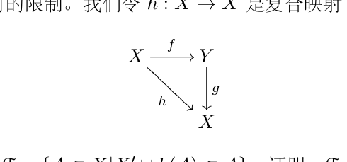

# 3.1 作业:可数与不可数,Schroeder-Bernstein定理

[返回讲义目录](../../../math-analysis-lecture-notes.md) · [学期目录](../../01-math-analysis-i.md) · [章节目录](../03-dedekind-cuts.md) · [校勘记录](../../errata.md) · [上一篇：Dedekind 分割与实数构造](03-01-p0030-0035.md) · [下一篇：极限、级数与 Cauchy 列](../04-limits.md)

<!-- source: PDF 36; printed: 36; transcription: first-pass; proofreading: applied -->

<!-- math-analysis-layout: document-title-normalized -->

> **数学分析一作业 1**
>

## 基本习题

## 习题 A：课堂内容的补充

A1) 假设非空集合 $X \subset \mathbb{R}$ 有上界并且实数 $M$ 是 $X$ 的上界。证明，如下两个命题等价：

- $M = \sup X$。
- 对任意的 $\varepsilon > 0$，都存在 $x \in X$，使得 $x > M - \varepsilon$。

A2) 证明，每个非空开区间都包含无限多个有理数。

A3) $(X, d)$ 是距离空间，$Y \subset X$。我们定义 $Y$ 上的距离函数：
$$
d_Y : Y \times Y \to \mathbb{R}, (y_1, y_2) \mapsto d_Y(y_1, y_2) = d(y_1, y_2).
$$
证明，$d_Y$ 是 $Y$ 上的距离函数，从而 $(Y, d_Y)$ 是度量空间。我们称 $d_Y$ 是 $d$ 在 $Y$ 上的**诱导度量**，$(Y, d_Y)$ 称作是 $(X, d)$ 的**子（度量）空间**。（提示：直接验证定义）

A4) $\mathbb{R}^n = \underbrace{\mathbb{R} \times \mathbb{R} \times \cdots \times \mathbb{R}}_{n\text{个}} = \{(x_1, \cdots, x_n) \mid x_1 \in \mathbb{R}, \cdots, x_n \in \mathbb{R}\}$。对于 $x, y \in \mathbb{R}^n$，我们定义
$$
d(x, y) = \sqrt{(x_1 - y_1)^2 + \cdots + (x_n - y_n)^2}, \ x = (x_1, \cdots, x_n), \ y = (y_1, \cdots, y_n).
$$
证明，$(\mathbb{R}^n, d)$ 是度量空间。（我们默认开方运算和中学的一致，尽管我们现在没有定义开方运算）

A5) (重要) 给定距离空间 $(X, d)$，$Y \subset X$ 是子集。如果对任意的 $x \in X$ 和任意的 $\varepsilon > 0$，都存在 $y \in Y$，使得 $d(y, x) < \varepsilon$，我们就称 $Y$ 在 $X$ 中是**稠密的**。证明，有理数在 $\mathbb{R}$ 中（距离函数由两个数的差的绝对值定义）是稠密的。

A6) 对于 $(x, y) \in \mathbb{R}^2$，如果它的坐标 $x$ 和 $y$ 都是有理数，我们就称这个点是有理点。证明，$(\mathbb{R}^2, d)$（参见习题 A4)）中的有理点是稠密的。

A7) 证明，假定域公理 **(F)** 和序公理 **(O)**，确界原理可以推出 Archimedes 公理 **(A)**。

A8) (无理数的存在性) 令 $X = \{x \in \mathbb{Q} \mid x^2 \leqslant 2\}$，这是一个有界的集合。令 $\sqrt{2} = \sup X$。证明，$\sqrt{2}$ 不是有理数。

<!-- source: PDF 37; printed: 37; transcription: first-pass; proofreading: applied -->

A9) 证明，每个开区间总包含无限多个无理数。

## 习题 B：可数集和不可数集

（鼓励同学们查找图书或者资料来完成这一部分）令 $\mathbb{N}$ 表示自然数的集合（包括 $0$）。$X$ 是一个集合，如果存在单射 $f : X \to \mathbb{N}$，我们就称 $X$ 是**可数的**。如果 $X$ 不是可数的，我们就称它是**不可数的**。

B1) 证明，有限集是可数的。

B2) 证明，可数集合的子集是可数的。

B3) 证明，如果 $X$ 是非空可数集，那么我们总可以将 $X$ 写成 $X = \{x_1, x_2, x_3, \cdots\}$（即可以把 $X$ 中的元素用自然数来标号）。（我们可以从一个开始一个一个的数下去把这些元素都罗列出来，所以叫做可数集）

B4) 证明，有理数 $\mathbb{Q}$ 是可数集。

B5) 证明，可数个可数集合的并集也是可数集，也就是说，如果 $X_1, X_2, \cdots, X_n, \cdots$ 都是可数集合，那么它们的并集 $\bigcup_{n \geqslant 1} X_n$ 也是可数集合。（提示：这是一个需要记住的经典证明，请查阅参考书或者网络）

B6) $X$ 是可数的，映射 $f : X \to Y$ 是满射。证明，$Y$ 是可数的。

B7) 按照以下步骤证明 $\mathbb{R}$ 是不可数的（同学们可以查阅一个用所谓对角线法则的经典证明，我们的证明基于区间套原理）：

B7-1) $J \subset \mathbb{R}$ 是闭区间并且它的长度 $|J| > 0$。证明，对任意的 $x \in \mathbb{R}$，总存在闭区间 $I$，使得 $I \subset J$，$|I| > 0$ 且 $x \notin I$。

B7-2) 证明，如果 $\{x_1, x_2, \cdots\}$ 是 $\mathbb{R}$ 的一个可数子集，那么存在闭区间套 $I_1 \supset I_2 \supset \cdots$，使得对任意的 $n$，$x_n \notin I_n$。

B7-3) 证明，$\mathbb{R}$ 不可数。

B8) 证明，如果 $X$ 是不可数集，$A$ 是 $X$ 的可数子集，那么 $X - A$ 是不可数的。

B9) 证明，任意的长度不为 $0$ 的区间（无论开或闭）都是不可数的。

B10) 证明，复数 $\mathbb{C}$ 是不可数的。

B11) 假设 $\mathcal{J}$ 是 $\mathbb{R}$ 上的某些开区间组成的集合，它满足如下性质：对任意的 $I, J \in \mathcal{J}$，$I \neq J$，那么它们的交集是空集，即 $I \cap J = \emptyset$。证明，$\mathcal{J}$ 是可数集。

<!-- source: PDF 38; printed: 38; transcription: first-pass; proofreading: applied -->

## 课外知识：一个集合论的补充

## 习题 C：Schroeder-Bernstein 定理

假设 $X$ 和 $Y$ 是两个集合，映射 $f : X \to Y$ 和 $g : Y \to X$ 都是单射。我们令 $X' = X - g(Y)$。

C1) 如果 $X$ 是有限集，证明，存在 $\varphi : X \to Y$，使得 $\varphi$ 是双射。

C2) 如果 $X$ 是可数集，证明，存在 $\varphi : X \to Y$，使得 $\varphi$ 是双射。

从现在开始，对 $X$ 不加任何的限制。我们令 $h : X \to X$ 是复合映射 $h = g \circ f$：

C3) 考虑 $X$ 的子集的集合 $\mathcal{F} = \{A \subset X \mid X' \cup h(A) \subset A\}$。证明，$\mathcal{F}$ 是非空。

C4) 证明，如果 $A \in \mathcal{F}$，那么 $X' \cup h(A) \in \mathcal{F}$。

C5) 我们定义
$$
A_0 = \bigcap_{A \in \mathcal{F}} A = \{x \in X \mid \text{对任意的 } A \in \mathcal{F}, \text{ 都有 } x \in A\}.
$$
证明，$A_0 \in \mathcal{F}$。

C6) 证明，$X' \cup h(A_0) = A_0$。

C7) 令 $B_0 = X - A_0$。证明，$f(A_0) \cap g^{-1}(B_0) = \emptyset$ 并且 $f(A_0) \cup g^{-1}(B_0) = Y$。

C8) 我们定义映射 $\varphi : X \to Y$：对于 $x \in X$，我们要求
$$
\varphi(x) = \begin{cases} f(x), & \text{如果} x \in A_0; \\ g^{-1}(x), & \text{如果} x \in B_0. \end{cases}
$$
证明，这是双射。

根据上述，我们证明了

**定理 (Schroeder-Bernstein).** 如果有单射 $f : X \to Y$ 和单射 $g : Y \to X$，那么存在着两个集合之间的双射 $\varphi : X \to Y$。

<!-- source: PDF 39; printed: 39; transcription: first-pass; proofreading: applied -->

## 习题 D：Dedekind 分割证明的细节

这一部分习题的目标是完成课堂上关于 Dedekind 分割乘法结构的部分，从而给出了实数域的构造完整证明。

D1) 证明，如果 $X$ 和 $Y$ 都是 Dedekind 分割，那么讲义中定义的 $X \cdot Y$ 也是 Dedekind 分割，即乘法
$$
\mathbb{R} \times \mathbb{R} \xrightarrow{\cdot} \mathbb{R}, (X, Y) \mapsto X \cdot Y,
$$
是良好定义的。（提示：只要对 $X > 0$，$Y > 0$ 这一种情形证明即可，当然你需要用到课上的练习和结论）

D2) 证明，$(X \cdot Y) \cdot Z = X \cdot (Y \cdot Z)$。($\Rightarrow$(F5))

D3) 证明，$X \cdot Y = Y \cdot X$。($\Rightarrow$(F6))

D4) 证明，$X \cdot (Y + Z) = X \cdot Y + X \cdot Z$。($\Rightarrow$(F9))（提示：略难）

D5) 证明，$\overline{1} \cdot X = X$ 并且 $\overline{1} \neq \overline{0}$。($\Rightarrow$(F7))

D6) 证明，如果 $X \cdot Y = \overline{0}$，那么 $X = \overline{0}$ 或者 $Y = \overline{0}$；再证明，如果 $X \geqslant \overline{0}$，$Y \geqslant \overline{0}$，那么 $X \cdot Y \geqslant \overline{0}$。($\Rightarrow$(O5))

D7) (技术工具) $X$ 是一个正的 Dedekind 分割。证明，对任意的正整数 $n$，总存在 $x \in X$，$x' \in X'$，使得
$$
1 < \frac{x'}{x} < 1 + \frac{1}{n}.
$$

D8) 证明，对任意的 Dedekind 分割 $X$ 和 $Y$，其中 $Y \neq \overline{0}$，存在唯一的 Dedekind 分割 $Z$，使得
$$
Y \cdot Z = X.
$$
我们将 $Z$ 记作 $\frac{X}{Y}$。当 $X = \overline{1}$ 时，我们也将它记作 $Y^{-1}$。($\Rightarrow$(F8))

D9) 请检验，我们已经完整的证明了域公理 **(F)** 和序公理 **(O)**。

[返回讲义目录](../../../math-analysis-lecture-notes.md) · [学期目录](../../01-math-analysis-i.md) · [章节目录](../03-dedekind-cuts.md) · [校勘记录](../../errata.md) · [上一篇：Dedekind 分割与实数构造](03-01-p0030-0035.md) · [下一篇：极限、级数与 Cauchy 列](../04-limits.md)
