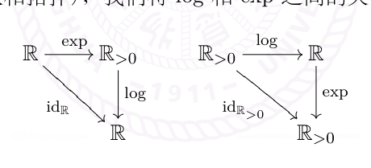

# 9 连续映射与介值定理

[返回讲义目录](../../math-analysis-lecture-notes.md) · [学期目录](../01-math-analysis-i.md) · [校勘记录](../errata.md) · [上一篇：函数的连续性](08-continuity.md) · [下一篇：开闭集、紧集与连续性](10-topology/10-01-p0102-0106.md)

<!-- source: PDF 92; printed: 92; transcription: first-pass; proofreading: applied -->

## 9 距离空间之间的连续映射，介值定理，初等函数的构造

我们首先来复习/学习一下连续性的定义：

**定义 48** (距离空间之间的连续映射). 假设 $(X, d)$ 和 $(Y, d_Y)$ 是两个距离空间，$f : X \to Y$ 是这两个距离空间之间的映射。假设 $x_0 \in X$，$y_0 = f(x_0) \in Y$。如果对任意的 $\varepsilon > 0$，总存在 $\delta > 0$，使得对任意满足 $d(x, x_0) < \delta$ 的 $x \in X$，都有 $d_Y(f(x), f(x_0)) < \varepsilon$，我们就称 $f$ 在 $x_0$ 处连续。如果 $f$ 在 $X$ 的每个点处都连续，那么我们就称 $f$ 是**连续映射**。

**注记.** 当 $Y$ 为 $\mathbb{R}$ 或者 $\mathbb{C}$ 的时候，我们就称 $f$ 为连续函数。另外，我们有

1) 第三次作业中我们用点列的方式定义了连续映射，我们可以仿照 Heine 定理的证明，说明这两个定义方式是等价的。我们将在第四次作业题中证明这个结论。

2) 假设 $X' \subset X$ 是子集，我们用 $d'$ 表示 $d$ 在 $X'$ 上诱导出来的距离函数，从而 $(X', d')$ 是距离空间（参见作业一 A3)）。我们考虑限制映射

$$ f\big|_{X'} : X' \to Y, \ \ x' \in X' \mapsto f(x'). $$

那么，$f\big|_{X'}$ 是 $(X', d')$ 和 $(Y, d_Y)$ 之间的连续映射。简而言之，连续映射的限制仍是连续映射。

3) (距离空间的乘积与连续映射) 假设 $(Y, d_Y)$ 和 $(Z, d_Z)$ 是距离空间，我们定义 $Y \times Z$ 上的距离函数

$$ d_{Y \times Z} : (Y \times Z) \times (Y \times Z) \to \mathbb{R}_{\geqslant 0}, \ \ \big((y_1, z_1), (y_2, z_2)\big) \mapsto \sqrt{d(y_1, y_2)^2 + d(z_1, z_2)^2}. $$

不难验证，$d_{Y \times Z}$ 是 $Y \times Z$ 上的距离函数（当然，我们有很多其他方式定义新的距离函数，这里我们选取和勾股定理类似的一种选择）。此时，我们有两个自然的投影映射

$$ \pi_Y : Y \times Z \to Y, \ (y, z) \mapsto y; \ \pi_Z : Y \times Z \to Z, \ (y, z) \mapsto z. $$

那么，$\pi_Y$ 和 $\pi_Z$ 都是连续映射。

另外，给定距离空间 $(X, d)$ 和 $(Y \times Z, d_{Y \times Z})$ 之间的映射 $F : X \to Y \times Z$，那么，$F$ 连续当且仅当两个复合映射 $\pi_Y \circ F : X \to Y$ 和 $\pi_Z \circ F : X \to Z$ 都连续（即到乘积空间的映射是连续的当且仅当其分量是连续的）。我们将在作业中证明这个性质。

作为例子，我们知道如果在 $\mathbb{R}^n$ 上配有距离 $d_2$（请参考之前的讲义），那么

$$ (\mathbb{R}^n, d_2) = \underbrace{(\mathbb{R}, d_2) \times (\mathbb{R}, d_2) \times \cdots \times (\mathbb{R}, d_2)}_{n\text{个}} $$

假设 $(X, d_X)$ 是距离空间，我们可以将映射 $f : X \to \mathbb{R}^n$ 写成分量的形式：

$$ f : X \to \mathbb{R}^n, \ \ x \mapsto f(x) = (f_1(x), f_2(x), \cdots, f_n(x)). $$

<!-- source: PDF 93; printed: 93; transcription: first-pass; proofreading: applied -->

我们在第 3 次作业中已经证明了 $f$ 连续当且仅当每个 $f_i : X \to \mathbb{R}$ 都连续。这当然是上面关于到乘积空间的映射的连续性的推论。

然而，我们要给出下面著名的反例来说明多个变量的函数如果对每个固定的变量都连续并不能说明函数本身连续：

$$ f : \mathbb{R}^2 \to \mathbb{R}, \ \ (x, y) \mapsto f(x, y) = \begin{cases} \frac{xy}{x^2+y^2}, & \text{如果 } (x, y) \neq (0, 0); \\ 0, & \text{如果 } (x, y) = (0, 0). \end{cases} $$

首先，对于任意的 $x_0$ 固定，$f(x_0, y) : \mathbb{R} \to \mathbb{R}$ 作为 $y$ 的函数是连续的；对于任意的 $y_0$ 固定，$f(x, y_0) : \mathbb{R} \to \mathbb{R}$ 作为 $x$ 的函数是连续的。这是显然的。另外，我们说明 $f$ 在 $(0, 0)$ 处不连续：对任意的 $\lambda \neq 0$，我们可以取 $(x_k, y_k) = (\frac{1}{k}, \frac{\lambda}{k}) \to (0, 0)$，此时，$f(x_k, y_k) \equiv \frac{\lambda}{1 + \lambda^2} \not\to 0$。

作为例子，我们研究矩阵空间上的映射：

**例子.** 映射 $\exp : \mathbf{M}_n(\mathbb{C}) \to \mathbf{M}_n(\mathbb{C})$。

首先回忆一下，$\mathbf{M}_n(\mathbb{C})$ 可以看成是一个 $2n^2$-维的 $\mathbb{R}$-线性空间，对于 $A = (A_{ij}) \in \mathbf{M}_n(\mathbb{C})$，我们有范数

$$ \|A\|_2 = \sqrt{\sum_{i,j=1}^n |A_{ij}|^2}, $$

从而 $(\mathbf{M}_n(\mathbb{C}), \|\cdot\|_2)$ 是一个赋范线性空间。作为距离空间，两个矩阵 $A$ 和 $B$ 之间的距离由 $d_2(A, B) = \|A - B\|_2$ 给出。这个赋范线性空间是完备的（我们证明过 $(\mathbb{R}^N, \|\cdot\|_2)$ 完备，即 Cauchy 列都收敛）。

我们已经定义过映射

$$ \exp : \mathbf{M}_n(\mathbb{C}) \to \mathbf{M}_n(\mathbb{C}), \ \ A \mapsto \sum_{k=0}^\infty \frac{A^k}{k!}. $$

我们现在证明这个映射是连续的。为此，我们首先回忆之前对于 $\exp : \mathbb{R} \to \mathbb{R}$ 的连续性的证明，我们用到了

$$ e^x - e^{x_0} = e^{x_0}(e^{x-x_0} - 1) = e^{x_0} \sum_{k=1}^\infty \frac{(x - x_0)^k}{k!}. $$

然而，对于矩阵的情形，我们评论过 $e^{A+B} = e^A e^B$ 可能并不成立，所以上述第一步可能并不正确。然而不管怎么样，我们先证明 $\exp$ 在 $A = 0$ 处连续（这和实数的情形没有差别！），其中 $e^0 = 1$，其中 $1$ 代表 $\mathbf{I}_{n \times n}$：

$$ \|e^A - 1\|_2 \leqslant \sum_{k=1}^\infty \frac{\|A\|_2^k}{k!} = \|A\|_2 \sum_{k=1}^\infty \frac{\|A\|_2^{k-1}}{k!} \leqslant \|A\|_2 e^{\|A\|_2} < e \|A\|_2. $$

最后我们（不妨）假设了 $\|A\|_2 < 1$。所以当 $A \to 0$ 时或者 $\|A\|_2 \to 0$ 时，我们有 $\|e^A - 1\|_2 \to 0$，这就说明 $\exp$ 在 $A = 0$ 处是连续的。

<!-- source: PDF 94; printed: 94; transcription: first-pass; proofreading: applied -->

在一般的情形，假设 $A \to A_0$，即 $B = A - A_0 \to 0$，我们计算

$$ e^A - e^{A_0} = \sum_{k=1}^\infty \frac{A^k - A_0^k}{k!} = \sum_{k=1}^\infty \frac{(A_0 + B)^k - A_0^k}{k!}. $$

关键的观察如下（我们用到存在常数 $c$，对任意的 $A$ 和 $B$，我们有 $\|A \cdot B\|_2 \leqslant c \|A\|_2 \|B\|_2$（$c$ 是一个不依赖于 $A$ 和 $B$）。）：

$$ \begin{aligned} \|(A_0 + B)^2 - A_0^2\|_2 &= \|A_0 B + B A_0 + B B\|_2 \leqslant \|A_0 B\|_2 + \|B A_0\|_2 + \|B B\|_2 \\ &\leqslant c \|A_0\|_2 \|B\|_2 + \|B\|_2 \|A_0\|_2 + \|B\|_2 \|B\|_2 \\ &= c \left[ \big(\|A_0\|_2 + \|B\|_2\big)^2 - \|A_0\|_2^2 \right]. \end{aligned} $$

类似地，通过把作用范数，我们可以借此消除不交换性而得到

$$ \|(A_0 + B)^k - A_0^k\|_2 \leqslant c^{k-1} \left[ \big(\|A_0\|_2 + \|B\|_2\big)^k - \|A_0\|_2^k \right]. $$

从而，

$$ \begin{aligned} \|e^A - e^{A_0}\|_2 &\leqslant \sum_{k=1}^\infty \frac{\|(A_0 + B)^k - A_0^k\|_2}{k!} \leqslant \sum_{k=1}^\infty \frac{c^{k-1} \left[ \big(\|A_0\|_2 + \|B\|_2\big)^k - \|A_0\|_2^k \right]}{k!} \\ &= \frac{1}{c} \sum_{k=1}^\infty \frac{\left[ \big(c\|A_0\|_2 + c\|B\|_2\big)^k - (c\|A_0\|_2)^k \right]}{k!} \\ &= \frac{1}{c} \left( e^{c\|A_0\|_2 + c\|B\|_2} - e^{c\|A_0\|_2} \right). \end{aligned} $$

现在根据在实数上指数函数的连续性，我们就知道当 $\|B\|_2 \to 0$ 时，右边是连续的，从而 $\exp$ 在 $A_0$ 处连续。

我们再研究几个有代表性的例子（请同学们自己把细节写清楚，借此可以练习一下 $\varepsilon - \delta$ 语言）：

**例子** (连续函数和不连续函数的例子). 先从不连续的例子开始：

1) $X \subset \mathbb{R}$ 是一个子集，由这个子集所定义的**示性函数** $\mathbf{1}_X : \mathbb{R} \to \mathbb{R}$ 指的是：

$$ \mathbf{1}_X(x) = \begin{cases} 1, & x \in X; \\ 0, & x \notin X. \end{cases} $$

假设 $X = [a, b]$ 是一个有限闭区间，$\mathbf{1}_X(x)$ 在 $a$ 处是右连续的但是不是左连续（从而不连续），这个函数在 $x \neq a, b$ 处都是连续的。如果 $X = \mathbb{Q}$，那么 $\mathbf{1}_{\mathbb{Q}}(x)$ 在任何一个点处都是不连续的（函数 $\mathbf{1}_{\mathbb{Q}}(x)$ 通常被称作是 Dirichlet 函数）。

<!-- source: PDF 95; printed: 95; transcription: first-pass; proofreading: applied -->

2) 我们考虑函数

$$ f(x) = \begin{cases} \frac{1}{x}, & x \neq 0; \\ 0, & x = 0. \end{cases} $$

这个函数在 $0$ 处是不连续的（我们可以说函数在 $0$ 处的右极限是正无穷大，在 $0$ 处的左极限是负无穷大）。

3) 我们考虑函数

$$ f(x) = \begin{cases} \frac{1}{q}, & \text{如果 } x = \frac{p}{q} \text{ 是有理数，其中 } p \in \mathbb{Z}, \ q \in \mathbb{Z}_{\geqslant 1} \text{ 且 } p \text{ 和 } q \text{ 互素}; \\ 0, & \text{如果 } x \text{ 是无理数}. \end{cases} $$

我们在第 3 次的作业中已经证明了 $f$ 在有理数上不连续但是在无理数上连续！

**练习.** 是否存在 $\mathbb{R}$ 上的函数 $f$，它在任何一个点处都不连续，但是 $|f|$ 是连续的？

我们现在给出两个最具有代表性的例子，建议大家将课堂笔记整理清楚并搞懂细节，通过这样的方式，也可以加深对连续性的认识。

**例子.** 下面的两个函数在 $0$ 处都是连续的：

1) 我们定义函数

$$ f(x) = \begin{cases} \frac{\sin(x)}{x}, & x \neq 0; \\ 1, & x = 0. \end{cases} $$

为了说明 $f$ 在 $0$ 处连续，当 $x \neq 0$ 时，利用 $\sin(x)$ 的定义，我们有

$$ \frac{\sin(x)}{x} = \sum_{k=0}^\infty \frac{(-1)^k x^{2k}}{(2k + 1)!}. $$

从而，

$$ | \frac{\sin(x)}{x} - 1 | \leqslant \sum_{k=1}^\infty \frac{|x|^{2k}}{(2k + 1)!} = |x|^2 \sum_{k=1}^\infty \frac{|x|^{2k-2}}{(2k + 1)!} \leqslant |x|^2 e^{|x|}. $$

从而，$\lim\limits_{x \to 0} \frac{\sin(x)}{x} = 1$。

2) 我们考虑函数

$$ f(x) = \begin{cases} e^{-\frac{1}{|x|}}, & x \neq 0; \\ 0, & x = 0. \end{cases} $$

为了说明 $f(x)$ 在 $0$ 处连续，对任意的 $\varepsilon > 0$，我们只要选取 $\delta$ 使得 $e^{-\frac{1}{\delta}} < \varepsilon$ 即可，这个很容易做到。

另外，根据与数列版本的类比，我们不难想象出各种版本的对函数连续性进行判断的命题，比如如下两边进行控制的版本：

<!-- source: PDF 96; printed: 96; transcription: first-pass; proofreading: applied -->

**命题 49.** $g_1$ 和 $g_2$ 是区间 $I$ 上定义的 $\mathbb{R}$-值函数，它们在 $x_0$ 处有极限并且 $\lim_{x\to x_0} g_1(x) = \lim_{x\to x_0} g_2(x)$。如果 $f: I \to \mathbb{R}$ 使得对任意的 $x \in I$，都有 $g_1(x) \leqslant f(x) \leqslant g_2(x)$，那么，$f$ 在 $x_0$ 处有极限并且
$$ \lim_{x\to x_0} f(x) = \lim_{x\to x_0} g_1(x) = \lim_{x\to x_0} g_2(x). $$

利用函数收敛的数列版本的定义（根据不同的情形选择需要的形式），这个性质的证明显而易见的。我们只要看到这一点，这个命题也容易记住了。另外，我们指出，这样的命题可能在某些场合（比如说解题目）有用，但是就本身而言，（我觉得）可能不是很有价值。

### 连续函数的基本性质

我们现在来了解连续函数的一些基本性质并利用它们做两件基本的事情：第一，研究 $e^x$ 的性质并定义所有的初等函数；第二，利用连续函数来研究空间的几何性质。

**定理 50.** $I$ 是区间（可开可闭），$f: I \to \mathbb{R}$ 是 $I$ 上的单调函数，那么

1) 对任意 $x_0 \in I$，$f$ 在 $x_0$ 处的左极限 $\lim_{x\to x_0^-} f(x)$ 和右极限 $\lim_{x\to x_0^+} f(x)$ 都存在。

2) $f$ 在 $I$ 上的不连续点的集合是可数的。（这表明单调函数 $f$ 在“大部分”点处都是连续的）

**证明：** 我们不妨假设 $I = \mathbb{R}$，$f$ 是单调上升的函数。我们逐个证明这两个论断：

1) 只证明左极限的情况即可，因为右极限可以类似地证明。我们要说明存在 $y_0$，使得对任意的数列 $\{x_n\}_{n\geqslant 1}$，$x_n < x_0$，$x_n \to x_0$，$\lim_{n\to\infty} f(x_n) = y_0$。实际上，我们令 $y_0 = \sup_{x\in(-\infty, x_0)} f(x)$。根据 $y_0$ 的定义，我们有 $f(x_n) \leqslant y_0$。另外，根据上确界的性质，对任意的 $\varepsilon > 0$，存在 $x' < x_0$，使得 $0 \leqslant y_0 - f(x') < \varepsilon$。由于 $x_n \to x_0$，所以存在 $N$，使得当 $n \geqslant N$ 时，有 $x_n > x'$，从而 $f(x_n) \geqslant f(x') \geqslant y_0 - \varepsilon$。综合上述，对任意的 $\varepsilon > 0$，存在 $N$，使得当 $n \geqslant N$ 时，$y_0 \geqslant f(x_n) \geqslant y_0 - \varepsilon$，所以 $\lim_{n\to\infty} f(x_n) = y_0$。作为证明的推论，我们有

**推论 51.** 假设 $f: I \to \mathbb{R}$ 是区间 $I$ 上的单调递增的函数，对于 $x_0 \in I$，$f$ 在 $x_0$ 处的左右极限由下面的公式给出：
$$ \lim_{x\to x_0^-} f(x) = \sup_{x\in(-\infty, x_0)} f(x), \quad \lim_{x\to x_0^+} f(x) = \inf_{x\in(x_0, +\infty)} f(x). $$
特别地，$\lim_{x\to x_0^-} f(x) \leqslant \lim_{x\to x_0^+} f(x)$。

2) 这是一个值得大家记住的经典证明。考虑 $f$ 的不连续点的集合
$$ Y = \{ y \in I \mid f \text{ 在 } y \text{ 处不连续} \}. $$
对于任意 $y \in Y$，按照定义，$\lim_{x\to y^-} f(x) \neq \lim_{x\to y^+} f(x)$。再利用上面推论中的结论，我们知道，对任意 $y \in Y$，我们有
$$ \lim_{x\to y^-} f(x) < \lim_{x\to y^+} f(x). $$

<!-- source: PDF 97; printed: 97; transcription: first-pass; proofreading: applied -->

据此，对于任意 $y \in Y$，都唯一地确定了一个非空的开区间 $I_y = (\lim_{x \to y^-} f(x), \lim_{x \to y^+} f(x))$，即我们构造了映射

$$Y \to \{\mathbb{R} \text{ 上的全体非空开区间}\}, \quad y \mapsto I_y.$$

利用单调性，我们首先说明对任意的 $y_1, y_2 \in Y$，$y_1 \neq y_2$，$I_{y_1} \cap I_{y_2} = \emptyset$：

不妨假设 $y_1 < y_2$，根据上面的推论的结论，我们可以选取单调下降的数列 $\{x_k\}_{k \geqslant 1}$，使得 $x_k \downarrow y_1$（从右边逼近）并且 $\lim_{k \to \infty} f(x_k)$ 为 $I_{y_1}$ 的右端点；类似地，我们选取单调上升的数列 $\{z_k\}_{k \geqslant 1}$，$z_k \uparrow y_2$（从左边逼近），使得 $\lim_{k \to \infty} f(z_k)$ 为 $I_{y_2}$ 的左端点。由于 $y_1 < y_2$，我们可以假设对任意 $k$ 都有 $x_k < z_k$，所以 $\lim_{k \to \infty} f(x_k) \leqslant \lim_{k \to \infty} f(z_k)$，也就是说 $I_{y_1}$ 的右端点要么在 $I_{y_2}$ 的左端点的左边要么重合，由于这两个区间都是开区间，所以它们的交集是空集。

这样，我们就得到了一组 $\mathbb{R}$ 上两两不相交的非空开区间 $\{I_y | y \in Y\}$，我们在每个开区间 $I_y$ 里选定一个有理数 $q_y$，由于这些开区间互不相交，这些有理数 $q_y$ 也决定了这些开区间。从而，我们得到了单射

$$Y \to \mathbb{Q}, \quad y \mapsto q_y.$$

由于有理数是可数的，所以 $Y$ 可数。 $\square$

我们下面证明著名的介值定理，这个定理有很多其它的证明，都比较有启发性，建议大家查阅资料，比如陈天权，Zorich 或者科大的教材。

**定理 52** (介值定理). $a < b$，$f : [a, b] \to \mathbb{R}$ 是连续函数。

1) 如果 $f(a) < 0$，$f(b) > 0$，那么一定存在 $c \in [a, b]$，使得 $f(c) = 0$。

2) 如果 $f(a) \neq f(b)$，那么对任意介于 $f(a)$ 和 $f(b)$ 之间的数 $y_0$，总存在 $c \in (a, b)$，使得 $f(c) = y_0$。

**证明：** 2) 是 1) 的推论，不妨假设 $f(a) < f(b)$，$y_0 \in (f(a), f(b))$，我们考察连续函数 $F(x) = f(x) - y_0$，此时，$F(a) < 0$，$F(b) > 0$，从而有 $c \in (a, b)$，使得 $F(c) = 0$，这等价于 $f(c) = y_0$。

我们现在利用反证法来证明 1)。如若不然，我们利用采用庄子的二分法：令 $I_0 = [a, b]$。考虑 $\frac{a+b}{2}$，根据反证假设，$f(\frac{a+b}{2}) \neq 0$。如果 $f(\frac{a+b}{2}) > 0$，我们就令 $I_1 = [a, \frac{a+b}{2}]$；如果 $f(\frac{a+b}{2}) < 0$，我们就令 $I_1 = [\frac{a+b}{2}, b]$。假设我们已经有了区间 $I_k = [a_k, b_k]$，区间 $I_{k+1}$ 的构造如下：考虑 $\frac{a_k+b_k}{2}$，根据反证假设，$f(\frac{a_k+b_k}{2}) \neq 0$。如果 $f(\frac{a_k+b_k}{2}) > 0$，我们就令 $I_{k+1} = [a_k, \frac{a_k+b_k}{2}]$；如果 $f(\frac{a_k+b_k}{2}) < 0$，我们就令 $I_{k+1} = [\frac{a_k+b_k}{2}, b_k]$。

通过上述构造，我们得到闭区间套 $I_0 \supset I_1 \supset \cdots$，其中 $f$ 在 $I_k$ 的左端点处取值是负的，在右端点处取值是正的，并且当 $k \to \infty$ 时，$|I_k| \to 0$，所以 $\bigcap_{k \geqslant 0} I_k = \{c\}$ 是单点集。很明显，$c \in [a, b]$。

我们现在说明 $f(c) = 0$（从而得到矛盾命题得证）：如若不然，不妨设 $f(c) > 0$，那么按照函数

<!-- source: PDF 98; printed: 98; transcription: first-pass; proofreading: applied -->

连续性的 $\varepsilon-\delta$ 语言的定义，对于 $\varepsilon = \frac{f(c)}{2}$，存在 $\delta > 0$，使得对任意 $x \in (c - \delta, c + \delta) \cap I$，
$|f(x) - f(c)| < \frac{1}{2} f(c)$。特别地，对于任意的 $x \in (c - \delta, c + \delta) \cap I$，$f(x) > 0$。然而，根据 $c \in I_k$，当 $k$ 很大的时候，必然有 $I_k \subset (c - \delta, c + \delta) \cap I$，但是 $f$ 在 $I_k$ 的左端点处的取值是负的，矛盾。 $\square$

**注记.** 直观连续函数的图像是不会断掉的，这是我们对连续性最朴素的理解。介值定理就是这个直观的数学表达。

另外，我们要指出一个值得注意和讨论的例子：假设函数 $f : I_1 \cup I_2 \to \mathbb{R}$ 定义在两个不相交的开区间的并集上，按照定义，如果 $f$ 在每个点上都连续，$f$ 就是在 $I_1 \cup I_2$ 上连续的。尽管函数图像在 $I_1 \cup I_2$ 是“断开的”，这个函数仍然是连续的（因为连续性本质上是个局部性质，在 $I_1$ 和 $I_2$ 上分别连续即可）。此时，介值定理可能并不成立，因为我们要求 $f$ 的定义域不是断掉的（“连通的”，这是一个拓扑学的概念）。

另外，对于对有理数上定义的连续函数介值定理一般并不成立的，比如说，

$$f : \mathbb{Q} \cap [0, 3] \to \mathbb{R}, \ x \mapsto f(x) = x - e.$$

这和有理数不完备有关系。

连续函数的介值定理有很多经典的应用，特别是在证明方程解的存在性方面。我们给出几个有代表性的例子，在第 4 次作业中有相应的练习。

**例子 (经典应用).**

1) $f : [0, 1] \to [0, 1]$ 是连续映射，那么，$f$ 有不动点，即存在 $x \in [0, 1]$，使得 $f(x) = x$。（请比较压缩映像定理）

   事实上，考虑函数 $F(x) = f(x) - x$，按照 $f$ 的要求，$F(0) \geqslant 0$，$F(1) \leqslant 0$，所以根据介值定理，存在 $x \in [0, 1]$，使得 $F(x) = 0 \Leftrightarrow f(x) = x$。

   对于高维的情形，令 $I^n = [0, 1]^n = \{(x_1, \cdots, x_n) | 0 \leqslant x_1, \cdots, x_n \leqslant 1\}$。那么，连续映射 $f : I^n \to I^n$ 一定有不动点。这是一个深刻的结论，叫做 Brouwer 不动点定理，我们在后面的课程（作业）中会给出证明。

2) 实系数奇数次的多项式一定有实根。

   通过乘一个常数，我们不妨假设 $P(x) = x^{2m+1} + \sum_{0 \leqslant k \leqslant 2m} a_k x^k$，很明显，当 $x \to +\infty$ 时，$P(x) > 0$；当 $x \to -\infty$ 时，$P(x) < 0$。利用介值定理，我们就可以找到一个实根。

   这个性质在很多地方有应用，比如说可以用来证明三维空间的旋转一定有旋转轴（从而可以视作是二维的旋转），还可以与 Galois 理论结合证明代数基本定理。

3) 映射 $f : \mathbb{R}_{\geqslant 0} \to \mathbb{R}_{\geqslant 0}, \ x \mapsto x^2$ 是双射。

   首先，根据序的性质（大小关系），我们知道 $f$ 是单调递增的函数，从而为单射；另外，任意给定 $y_0 \in \mathbb{R}_{>0}$，由于 $f(0) = 0 < y_0$，$f(y_0 + 1) > 2y_0 + 1 > y_0$，根据介值定理，就存在（唯一的） $x_0 \in [0, y_0 + 1]$，使得 $f(x_0) = y_0$，这表明 $f$ 为双射。

<!-- source: PDF 99; printed: 99; transcription: first-pass; proofreading: applied -->

根据这个双射的结论，我们可以定义 $f^{-1} : \mathbb{R}_{\geqslant 0} \to \mathbb{R}_{\geqslant 0}$，这就是我们所熟悉的开根号映射，习惯上，我们把它记做 $f^{-1}(x) = \sqrt{x}$。这是一个有启发性的例子，比如下面的 $\log$ 的定义就是机械地重复一下这个例子的想法。请同学们也与第 2 次作业习题 $E$ 做比较。

再者，我们还关心函数 $\sqrt{x}$ 的连续性，我们有更一般性的定理来处理这一点。

**定理 53.** $f : [a, b] \to \mathbb{R}$ 是在闭区间上定义的连续函数，那么 $f$ 有界的并且能取到最大最小值，即存在 $x_1, x_2 \in [a, b]$，使得 $f(x_1) = \inf_{x \in [a, b]} f(x)$，$f(x_2) = \sup_{x \in [a, b]} f(x)$。

**练习.** 定理叙述中的两个条件“闭区间”和“连续”缺一不可，试举出反例。

**证明：** 用 $I$ 表示闭区间 $[a, b]$。我们用反证法证明 $f$ 是有界的：如若不然，那么存在数列 $\{x_n\}_{n \geqslant 1} \subset I$，使得 $f(x_n) \to +\infty$（不妨设是正无穷）。通过选取 $\{x_n\}_{n \geqslant 1}$ 的子列，我们可以进一步假设 $x_n \to x$。证明的关键点在于 $x \in I$，这是由 $I$ 是闭区间保证的：因为 $x_n \in I \Leftrightarrow a \leqslant x_n \leqslant b$，所以通过取极限（极限和 $\leqslant$ 以及 $\geqslant$ 交换），$a \leqslant x \leqslant b \Leftrightarrow x \in I$。（这是对词语“闭”的基本理解，极限点不能跑到外面去，被封闭在里面了），根据 $f$ 在 $x$ 处的连续性，所以 $f(x_n) \to f(x) \neq \infty$，这不可能。

下面证明 $A = \sup_{x \in I} f(x)$ 一定能被某个点 $x_2$ 所实现，即存在 $x_2 \in I$ 使得，$f(x_2) = A$。我们仍然使用反证法：如若不然，对任意 $x \in I$，$f(x) \neq A$，所以，对任意的 $x \in I$，$f(x) < A$。我们考虑正值的函数

$$g(x) = \frac{1}{A - f(x)}.$$

这个函数自然是良好定义的（因为分母不是零）并且是连续的。然而，由于 $A$ 是 $f(x)$ 取值的上确界，所以存在 $x \in I$，使得 $f(x)$ 可以无限地接近 $A$，从而 $g(x)$ 是无界的：对任意的 $M > 0$，存在 $x \in I$，使得 $A - f(x) < \frac{1}{M}$，从而 $g(x) > M$。这和已经证明的有界性矛盾。 $\square$

**注记.** 上面用来证明最大值能被某个 $x_2$ 实现的方法（在复变函数课程中学习 Liouville 定理的应用时）也可以用来证明代数基本定理。

**定理 54.** $f : [a, b] \to \mathbb{R}$ 是严格递增（或者递减）的连续函数，那么 $f$ 是从 $[a, b]$ 到 $[f(a), f(b)]$ 的双射并且其逆映射 $f^{-1} : [f(a), f(b)] \to [a, b]$ 是连续的。

**注记.** 这是 1-元函数的特殊性质，究其根本，是因为 1 维空间上面 $\mathbb{R}$ 有序关系 $\leqslant$ 而在 $\mathbb{R}^n$ 上是没有的。

**证明：** 首先，我们知道 $f$ 是单射（因为严格递增）并且对任意的 $x \in [a, b]$，$f(x) \in [f(a), f(b)]$。另外，根据介值定理，$f$ 是满射。所以，我们可以定义其逆 $f^{-1} : [f(a), f(b)] \to [a, b]$。我们注意到，$f^{-1}$ 也是严格递增的（否则假设存在 $[f(a), f(b)]$ 中两个点 $y_1 < y_2$，使得 $x_1 = f^{-1}(y_1) \geqslant x_2 = f^{-1}(y_2)$，根据 $f$ 是递增的，$f(x_1) = y_1 \geqslant f(x_2) = y_2$，矛盾）。

为了证明 $f^{-1}$ 是连续的，我们用反证法：如若不然，假设 $y_0 \in [f(a), f(b)]$ 是一个不连续点（假设 $y_0 = f(x_0)$，$x_0 \in [a, b]$）。根据[定理 50](#ma-theorem-50) 关于单调函数不连续点是可数的证明，我们对于 $y_0$ 可以分配一个非空的开区间：

$$I_{y_0} = (x_1, x_2), \ \ x_1 = \sup_{z < y_0} f^{-1}(z) = \lim_{z \to y_0^-} f^{-1}(z), \ \ x_2 = \inf_{z > y_0} f^{-1}(z) = \lim_{z \to y_0^+} f^{-1}(z).$$

<!-- source: PDF 100; printed: 100; transcription: first-pass; proofreading: applied -->

特别地，$x_1 < x_2$。根据单调性，我们知道 $x_1 \leqslant x_0 \leqslant x_2$。另外，对于任意的 $y > y_0$，$f^{-1}(y) \geqslant \inf_{z > y_0} f^{-1}(z) = x_2$；对于任意的 $y < y_0$，$f^{-1}(y) \leqslant \sup_{z < y_0} f^{-1}(z) = x_1$。所以，$(x_1, x_2)$ 之间的数（无限多个）除了可能 $x_0$ 之外，都不落在 $f^{-1}$ 的值域里面，然而它们自然在 $f$ 的定义域里面（按照定义就在 $f^{-1}$ 的值域里），矛盾。 $\square$

第 4 次作业中我们将会解答一个很有意思的问题：

**练习.** 假设连续函数 $f : [a, b] \to \mathbb{R}$ 是单射。如果 $f(a) < f(b)$，证明，$f$ 是严格递增的。

### 连续函数性质的应用：初等函数的构造

**定理 55.** 指数函数 $\exp : \mathbb{R} \to \mathbb{R}_{>0}, \ x \mapsto e^x$ 是双射。我们用 $\log : \mathbb{R}_{>0} \to \mathbb{R}$ 表示 $\exp$ 的反函数并称其为以 $e$ 为底的对数函数，它满足：

1) 对任意 $x, y > 0$，我们有 $\log(xy) = \log(x) + \log(y)$。

2) $\log(x)$ 是 $\mathbb{R}_{>0}$ 上的连续的单调递增函数。

**证明：** 只需要说明 $\exp : \mathbb{R} \to \mathbb{R}_{>0}$ 是满射（单调性意味着是单射）即可，其余的都是前面几个定理的直接推论。对任意的 $y_0 \in \mathbb{R}_{>0}$，我们可以选取 $N$，使得 $e^{-N} < y_0 < e^N$（比如说，令 $N = y_0 + \frac{1}{y_0} + 1$ 即可，请自行验证），所以根据介值定理，存在 $x_0 \in [-N, N]$，使得 $\exp(x_0) = y_0$，这表明 $\exp$ 是满射。至此，我们可以构造 $\exp$ 的逆映射 $\log : \mathbb{R}_{>0} \to \mathbb{R}$。用交换图的语言（交换图的说法值得学习，尤其对于后来学习代数和拓扑），我们将 $\log$ 和 $\exp$ 之间的关系写成：

为了说明 $\log$ 是连续的，我们只需要在 $[e^{-n}, e^n]$ 这个区间上证明 $\log$ 连续即可（连续是局部性质），其中 $n \in \mathbb{Z}$ 是任取的。根据[定理 54](#ma-theorem-54)，$\exp : [-n, n] \to [e^{-n}, e^n]$ 是严格递增的连续映射，所以它的逆 $\log$ 连续。

另外，根据双射性质，$\log(xy) = \log(x) + \log(y)$ 等价于 $\exp(\log(xy)) = \exp(\log(x) + \log(y))$，即 $xy = \exp(\log(x)) \exp(\log(y)) = xy$，所以对任意 $x, y > 0$，$\log(xy) = \log(x) + \log(y)$ 成立。 $\square$

利用 $\exp$ 和 $\log$，我们终于可以定义一般的对数函数和幂函数了：

**定理 56.** 对于 $\alpha \in \mathbb{R}$ 和 $x \in \mathbb{R}_{>0}$，我们定义幂函数 $x^\alpha = e^{\alpha \log(x)}$，那么 $x^\alpha$ 满足

1) 对任意 $x, y > 0$ 和 $\alpha, \beta$，我们有 $(xy)^\alpha = x^\alpha y^\alpha$，$(x^\alpha)^\beta = x^{\alpha\beta}$。

2) $x^\alpha$ 是 $\mathbb{R}_{>0}$ 上的连续函数。

3) 当 $\alpha \in \mathbb{Z}_{\geqslant 0}$ 时，这个定义和经典的定义是一致的，即 $e^{n \log(x)} = \underbrace{x \cdot x \cdot \cdots \cdot x}_{n\text{个}}$。

<!-- source: PDF 101; printed: 101; transcription: first-pass; proofreading: applied -->

对于 $a, x \in \mathbb{R}_{>0}$ 且 $a \neq 1$，我们定义对数函数 $\log_a(x) = \frac{\log x}{\log a}$ 和指数 $a^x = e^{\log(a)x}$，那么它们都是连续函数并且满足下面的性质：

1) $a^{\log_a x} = x$。

2) $a^{x+y} = a^x a^y$，$\log_a(x \cdot y) = \log_a(x) + \log_a(y)$（要求 $x > 0$，$y > 0$）。

**证明：** 定理所有的性质都是 $\exp$ 和 $\log$ 的性质在复合映射下的直接推论。为了验证当 $\alpha$ 为非负整数时，这个定义和经典的一致：我们有 $x^n = e^{n \log(x)} = e^{\log(x)+\cdots+\log(x)} = e^{\log(x)} \cdots e^{\log(x)} = x \cdots x$，所以恰好是 $n$ 个 $x$ 乘起来。对于其余的性质证明不放心的同学，可以在第四次作业中安心地验证这些细节。 $\square$

我们讲一些相关的题外话。中学的数学学习中我们实际上从未定义 $x^{\frac{1}{n}}$（只是想当然的认为这个函数存在），今天我（你）们第一次正确地定义了开方这个运算并且验证了我们之前认为是正确的各种性质（所以我们之后会不假思索地继续应用这些中学熟知的性质）。中学我们对 $e$ 的了解很少，所以和 $e$ 相关的对象反而变得容易理解，因为我们只需要验证关于 $e$ 的很少的几个已经知道的性质即可；然而，对于 $\pi$ 以及相关的 $\sin x$ 等三角函数，我们了解很多它们的性质，这反而给我们新发展的函数理论带来了很大的挑战：我们在定义这些对象的同时要能够证明它们满足所知的所有性质。实际上，我们必须建立了整个微积分的理论之后才能够做到这一点。

日本京都大学的数学家望月新一在他的宇宙际 Teichmüller 理论的论文（他在这一系列论文中声称他证明了 abc 猜想，目前还没有得到承认）里说：Unlike many mathematical papers, which are devoted to verifying properties of mathematical objects that are either well-known or easily constructed from well-known mathematical objects, in the present series of papers, most of our efforts will be devoted to constructing new mathematical objects. 我们这里构造的幂函数就是他所说的“well-known or easily constructed from well-known mathematical objects”。

[返回讲义目录](../../math-analysis-lecture-notes.md) · [学期目录](../01-math-analysis-i.md) · [校勘记录](../errata.md) · [上一篇：函数的连续性](08-continuity.md) · [下一篇：开闭集、紧集与连续性](10-topology/10-01-p0102-0106.md)
