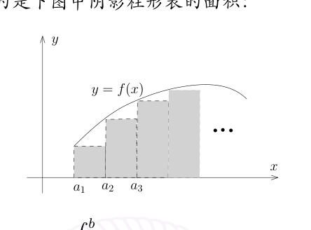

# 12.1：作业：有无穷多素数的拓扑证明

[返回讲义目录](../../../math-analysis-lecture-notes.md) · [学期目录](../../01-math-analysis-i.md) · [章节目录](../12-continuous-functions.md) · [校勘记录](../../errata.md) · [上一篇：连续函数的构造与完备化](12-01-p0119-0125.md) · [下一篇：12.2：期中考试：连续函数环的极大理想](12-05-p0132-0135.md)

<!-- source: PDF 126; printed: 126; transcription: first-pass; proofreading: applied -->

<!-- math-analysis-layout: document-title-normalized -->

## 基本习题

### 连续性与一致收敛

**习题 A：连续，一致连续和一致收敛**

A1) 证明，函数 $e^x$ 在 $\mathbb{R}$ 上不是一致连续的而在 $(-\infty, 0]$ 上是一致连续的。

A2) 证明，幂函数映射 $\mathbb{R}_{>0} \times \mathbb{R}$，$(x, \alpha) \mapsto x^\alpha$ 是 $\mathbb{R}_{>0} \times \mathbb{R}$ 上的连续函数。

A3) 证明，第九次课中定义的幂函数满足如下的性质：对任意 $x, y > 0$ 和 $\alpha, \beta$，我们有 $(xy)^\alpha = x^\alpha y^\alpha$，$(x^\alpha)^\beta = x^{\alpha\beta}$；$a^{\log_a x} = x$；如果 $x > 0$，$y > 0$，那么 $a^{x+y} = a^x a^y$，$\log_a(x \cdot y) = \log_a(x) + \log_a(y)$。

A4) 在 $[0, 1)$ 区间上考虑连续函数的序列 $\{f_n(x)\}_{n \geqslant 1}$，其中 $f_n(x) = x^n$。证明，对任意的 $a < 1$，$\{f_n(x)\}_{n \geqslant 1}$ 在 $[0, a]$ 上一致收敛到 $0$ 这个函数；但是 $\{f_n(x)\}_{n \geqslant 1}$ 在 $[0, 1)$ 上不一致收敛。

A5) 在 $\mathbb{R}$ 上考虑连续函数的序列 $\{f_n(x)\}_{n \geqslant 1}$，其中 $f_n(x) = \frac{nx}{1 + n^2x^2}$。证明，$\{f_n(x)\}_{n \geqslant 1}$ 在 $\mathbb{R}$ 上逐点收敛到 $0$ 这个函数但是 $\{f_n(x)\}_{n \geqslant 1}$ 在 $\mathbb{R}$ 上不一致收敛。

A6) 在 $\mathbb{R}$ 上考虑连续函数的序列 $\{f_n(x)\}_{n \geqslant 1}$，其中 $f_n(x) = \begin{cases} \frac{nx^2}{1 + nx}, & x > 0; \\ \frac{nx^3}{1 + nx^2}, & x \leqslant 0 \end{cases}$。试研究 $\{f_n(x)\}_{n \geqslant 1}$ 在 $\mathbb{R}$ 上逐点收敛性和一致收敛性。

A7) 给定连续函数 $\varphi : \mathbb{R}_{\geqslant 0} \to \mathbb{R}$，满足 $\varphi(0) = 0$，$\lim_{x \to \infty} \varphi(x) = 0$ 并且 $\varphi$ 不恒为零。证明，$\mathbb{R}_{\geqslant 0}$ 上的连续函数的序列 $\{f_n(x)\}_{n \geqslant 1}$ 和 $\{g_n(x)\}_{n \geqslant 1}$ 逐点收敛到 $0$ 这个函数但是不一致收敛，其中 $f_n(x) = \varphi(nx)$，$g_n(x) = \varphi\left(\frac{x}{n}\right)$。

A8)* （一致连续性的应用：积分的定义）$[a, b]$ 是有限闭区间，$f \in C([a, b])$ 是实数值的函数。给定 $n \geqslant 1$，我们将 $[a, b]$ 均分为 $n$ 份：
$$ [a, b] = [a_1, b_1] \cup [a_2, b_2] \cup \cdots \cup [a_n, b_n], \quad a_1 = a, b_k = a_{k+1} \ (k = 1, \cdots, n - 1), b_n = b, $$
其中对于 $k = 1, 2, \cdots, n$，$a_k = a + \frac{k - 1}{n}(b - a)$。我们定义
$$ S_n = \sum_{k=1}^n \frac{b - a}{n} f(a_k). $$

<!-- source: PDF 127; printed: 127; transcription: first-pass; proofreading: applied -->

证明，$\{S_n\}_{n \geqslant 1}$ 收敛，我们用 $\int_a^b f$ 这个符号来记极限 $\lim_{n \to \infty} S_n$。进一步证明，映射
$$ \int_a^b : C([a, b]) \to \mathbb{R}, \quad f \mapsto \int_a^b f $$
是线性映射并且如果我们在 $C([a, b])$ 用距离函数 $d_\infty$ 来考虑，那么这是连续映射。

**注记。** 和式 $S_n$ 直观上计算的是下图中阴影柱形图的面积：

所以，如果 $f$ 是正函数，我们认为 $\int_a^b f$ 表示的是 $f$ 的图像下的面积。

另外，就算是选取 $f(x) = x^m$ 这样简单的函数，$\int_a^b f$ 的计算都很复杂，课程后面关于积分的理论的一个重点是如何计算积分。

（提示：为了证明 $\{S_n\}_{n \geqslant 1}$ 是 Cauchy 列，我们可以将 $S_n$ 和 $S_m$ 都与 $S_{nm}$ 做比较）

A9)* 证明 Cauchy 的一个定理：任给函数 $f : [a, +\infty) \to \mathbb{R}$，我们假设 $f$ 在任意闭子区间 $[a, b]$ 上有界（上界可能依赖于 $b$），那么下面两个式子当等号右边极限存在时成立：
$$ \lim_{x \to +\infty} \frac{f(x)}{x} = \lim_{x \to +\infty} [f(x + 1) - f(x)], $$
$$ \lim_{x \to +\infty} [f(x)]^{1/x} = \lim_{x \to +\infty} \frac{f(x + 1)}{f(x)}, \quad \text{进一步假设对任意的 } x \in [a, \infty), \ f(x) \geqslant c > 0. $$

### 一致连续性与函数极限

**习题 B** 研究下列函数 $f$ 在区间 $I$ 上的一致连续性：

B1) $f(x) = \sqrt[3]{x}$，$I = (0, \infty)$。

B2) $f(x) = \log x$，$I = (0, 1)$。

B3) $f(x) = \cos \frac{1}{x}$，$I = (0, 1)$。

B4) $f(x) = x \cos \frac{1}{x}$，$I = (0, \infty)$。

**习题 C** 研究下列函数极限的存在性：

<!-- source: PDF 128; printed: 128; transcription: first-pass; proofreading: applied -->

C1) $\lim_{x \to 1} \frac{\ln x}{(x - 1)^\alpha}$，$\alpha > 0$。

C2) $\lim_{x \to 1} \frac{e^x - e}{(x - 1)^\alpha}$，$\alpha > 0$。

C3) $\lim_{x \to 1} \frac{x^x - 1}{(x - 1)^\alpha}$，$\alpha > 0$。

C4) $\lim_{x \to 1} \frac{\sqrt[3]{1 - \sqrt{x}}}{(x - 1)^\alpha}$，$\alpha > 0$。

C5) $\lim_{x \to 0} \frac{\sqrt{1 + x^2} - 1}{1 - \cos x}$。

C6) $\lim_{x \to 0} \frac{\sqrt{1 + x^4} - 1}{1 - \cos^2 x}$。

C7) $\lim_{x \to 1} \frac{(x - 1)^\alpha}{\sin(\pi x)}$，$\alpha > 0$。

**习题 D（和一致连续性相关的问题）**

D1) 如果连续函数 $f$ 在开区间（有限或无限）$I \subset \mathbb{R}$ 上是单调并且有界的，那么 $f$ 在 $I$ 上一致连续。

D2) $I$ 是长度有限的区间（不一定是闭的）。证明，$I$ 上的实值函数 $f$ 一致连续的充分必要条件是 $f$ 把 Cauchy 列映成 Cauchy 列（即如果 $\{x_n\}_{n \geqslant 1} \subset I$ 是 Cauchy 列，那么 $\{f(x_n)\}_{n \geqslant 1}$ 也是 Cauchy 列）。

D3) $f$ 在 $\mathbb{R}$ 上一致连续。证明，存在 $a, b \in \mathbb{R}_{>0}$，使得对任意的 $x \in \mathbb{R}$，我们都有
$$ |f(x)| \leqslant a|x| + b. $$

D4) 假设函数 $f$ 在 $[0, \infty)$ 上一致连续并且对任意的 $x \in [0, 1]$，我们都有 $\lim_{n \to +\infty} f(x + n) = 0$（这里 $n$ 是整数）。证明，
$$ \lim_{x \to +\infty} f(x) = 0. $$
如果我们将条件减弱为 $f$ 在 $[0, \infty)$ 连续，结论是否依然成立？证明或举出反例。

D5) 假设 $X$ 是区间，$f : X \to \mathbb{R}$ 是连续函数。如果存在正常数 $L$，使得对任意的 $x, y \in X$，都有
$$ |f(x) - f(y)| \leqslant L|x - y|, $$
我们就称 $f$ 在 $X$ 上满足 Lipschitz 条件。

(a) 证明，$f$ 在 $X$ 上满足 Lipschitz 条件是 $f$ 在 $X$ 一致连续的充分条件。

<!-- source: PDF 129; printed: 129; transcription: first-pass; proofreading: applied -->

(b) 判断上述条件是否是必要条件？证明或举出反例。

(c) 假设 $f$ 在 $[a, +\infty)$ 上满足 Lipschitz 条件，其中 $a > 0$，试证明 $\frac{f(x)}{x}$ 在 $[a, +\infty)$ 一致连续。

### 方程的根与极限计算

**习题 E** 利用连续性研究方程根的存在性（在以下方程中，$x$ 为未知实数）：

E1) 证明，方程 $x^3 + 2x - 1 = 0$ 在 $\mathbb{R}$ 上有唯一的根且此根在 $(0, 1)$ 内。

E2) 设 $0 \leqslant \lambda < 1$，$b > 0$，试判断方程 $x - \lambda \sin x = b$ 的实根的存在性。

E3) 证明，方程 $\sin x = \frac{1}{x}$ 有无穷多个实根。

E4) 假设实数值函数 $f \in C([0, 2])$ 并且 $f(0) = f(2)$。证明，方程 $f(x) - f(x + 1) = 0$ 在 $[0, 1]$ 上有一个根。

**习题 F** 试计算下面函数的极限：

F1) $\lim_{x \to \pi} \frac{\sin mx}{\sin nx}, \quad m, n \in \mathbb{Z}_{\geqslant 0}$,

F2) $\lim_{x \to 0} \frac{1 - \cos x \sqrt[2]{\cos 2x} \sqrt[3]{\cos 3x}}{x^2}$

F3) $\lim_{x \to +\infty} \sin \sqrt{1 + x} - \sin \sqrt{x}$

F4) $\lim_{x \to 0} \frac{\sqrt{1 + x \sin x} - 1}{e^{x^2} - 1}$

F5) $\lim_{n \to \infty} \underbrace{\sin \sin \cdots \sin x}_{n\text{个}}$

## 思考题

**问题 G** 连续函数 $f : \mathbb{R} \to \mathbb{R}$ 满足如下性质：对任意的 $\delta > 0$，我们都有
$$ \lim_{n \to \infty} f(n\delta) = 0. $$
证明，$\lim_{x \to +\infty} f(x) = 0$。

**问题 H** 连续函数 $\varphi : \mathbb{R} \to \mathbb{R}$ 满足如下两个性质：

1) 它在无穷远的行为如下：$\lim_{x \to +\infty} (\varphi(x) - x) = +\infty$。

2) $\varphi$ 的不动点集 $\{x \in \mathbb{R} | \varphi(x) = x\}$ 是非空的有限集。

证明，如果 $f : \mathbb{R} \to \mathbb{R}$ 是连续函数并且满足 $f \circ \varphi = f$，那么 $f$ 一定是常值函数。

**问题 I** 连续函数 $f : \mathbb{R}_{\geqslant 0} \to \mathbb{R}$ 满足 $\lim_{x \to +\infty} \frac{f(x)}{x} = 0$。假设 $\{a_n\}_{n \geqslant 1}$ 是一列非负实数的数列并且数列 $\{\frac{a_n}{n}\}_{n \geqslant 1}$ 是有界的，证明，$\lim_{n \to \infty} \frac{f(a_n)}{n} = 0$

<!-- source: PDF 130; printed: 130; transcription: first-pass; proofreading: applied -->

## 课外补充：拓扑空间的定义

**定义 78**（拓扑空间）。$X$ 是集合，$\mathcal{T} = \{U | U \subset X\}$ 是 $X$ 的某些子集所组成的集合。如果下面三个条件成立

1) $\emptyset \in \mathcal{T}, X \in \mathcal{T}$。

2) 对任意的 $\{U_\alpha\}_{\alpha \in A} \subset \mathcal{T}$，其中 $A$ 为指标集合，我们有 $\bigcup_{\alpha \in A} U_\alpha \in \mathcal{T}$。

3) 对任意有限个 $U_1, U_2, \cdots, U_m \in \mathcal{T}$，我们有 $\bigcap_{1 \leqslant i \leqslant m} U_i \in \mathcal{T}$。

我们就称 $\mathcal{T}$ 是 $X$ 上的一个拓扑，每个 $U \in \mathcal{T}$ 都被称作是（拓扑 $\mathcal{T}$ 下的）开集。我们把二元组 $(X, \mathcal{T})$ 称作是一个拓扑空间。

给定拓扑空间 $(X, \mathcal{T})$，考虑子集 $F \subset X$，如果其补集 $X - F$ 是开集（即 $X - F \in \mathcal{T}$），我们就称 $F$ 是在拓扑 $\mathcal{T}$ 下的）闭集。对于闭集，我们有如下的性质（简单的练习）：

1) $\emptyset$ 和 $X$ 都是闭集。

2) 任意多闭集的交集是闭集。

3) 有限个闭集的并集是闭集。

**娱乐问题** 素数是无限多的拓扑证明 (Furstenberg, 1955)

考虑 $X = \mathbb{Z}$ 为全体整数的集合，对于 $a, b \in \mathbb{Z}$，其中 $a \geqslant 1$，我们定义 $U_{a,b} = \{ka + b | k \in \mathbb{Z}\}$ （就是以 $b$ 为某一项的双边的等差数列）。我们定义 $X$ 的子集的集合 $\mathcal{T}$：如果 $U \in \mathcal{T}$，要么 $U = \emptyset$，要么 $U$ 是某些 $U_{a,b}$ 的并集。

1) $U \in \mathcal{T}$。证明，$x \in U$ 当且仅当存在 $a \geqslant 1$，使得 $U_{a,x} \in \mathcal{T}$。

2) 证明，$\mathbb{Z} \in \mathcal{T}$。

3) 证明，对于任意的 $\{U_i\}_{i \in I} \subset \mathcal{T}$，那么 $\bigcup U_i \in \mathcal{T}$。

4) 证明，如果 $U, V \in \mathcal{T}$，那么 $U \cap V \in \mathcal{T}$。

5) 证明，任何有限集合都不是开集；任何补集是有限的集合都不是闭集。

6) 证明，$U_{a,b}$ 既是开集也是闭集。

7) 证明，$\mathbb{Z} - \{-1, 1\} = \bigcup_{p \text{ 是素数}} U_{p,0}$。

<!-- source: PDF 131; printed: 131; transcription: first-pass; proofreading: applied -->

8) 用反证法证明，有无限多个素数。

---

As for everything else, so for a mathematical theory: beauty can be perceived but not explained.

– A. Cayley

---

[返回讲义目录](../../../math-analysis-lecture-notes.md) · [学期目录](../../01-math-analysis-i.md) · [章节目录](../12-continuous-functions.md) · [校勘记录](../../errata.md) · [上一篇：连续函数的构造与完备化](12-01-p0119-0125.md) · [下一篇：12.2：期中考试：连续函数环的极大理想](12-05-p0132-0135.md)
