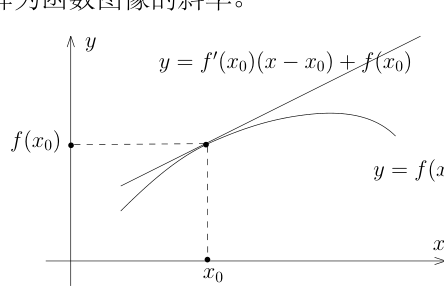
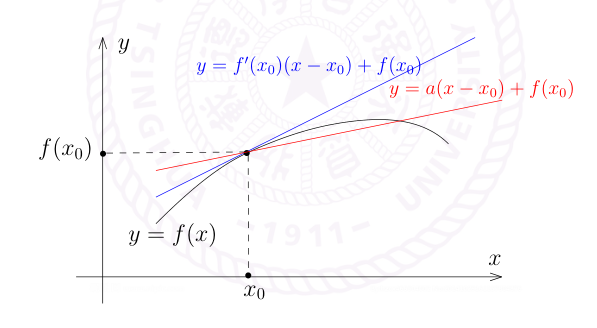
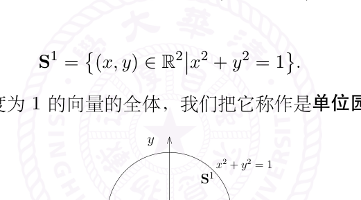
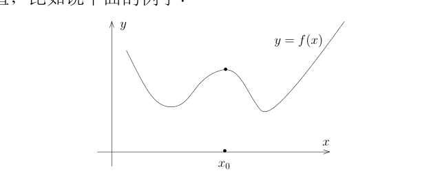
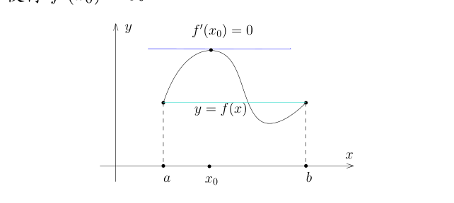
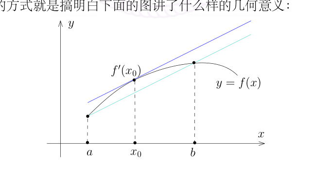

# 14：导数公式与中值定理

[返回讲义目录](../../math-analysis-lecture-notes.md) · [学期目录](../01-math-analysis-i.md) · [校勘记录](../errata.md) · [上一篇：导数与初等函数](13-derivatives.md) · [下一篇：中值定理、微分方程与圆周率](15-derivative-applications/15-01-p0151-0157.md)

<!-- source: PDF 141; printed: 141; transcription: first-pass; proofreading: applied -->

## 反函数求导与高阶导数公式

先证明上次课堂上没有证明的一个重要推论：

$I$ 和 $J$ 是 $\mathbb{R}$ 上的区间，$f: I \to J$ 是实值函数并且它的逆 $f^{-1}: J \to I$ 存在。假设 $f$ 是可微函数。如果 $f'(x_0) \neq 0$，那么 $f^{-1}$ 在 $x_0$ 处可微分并且

$$
(f^{-1})'(f(x_0)) = \frac{1}{f'(x_0)}.
$$

**证明：** 实际上，只要证明 $f^{-1}$ 在 $y_0 = f(x_0)$ 处可微就可以了，因为一旦我们知道 $f^{-1}$ 是可微的，那么我们就可以对 $f \circ f^{-1}$ 来运用复合函数求导的法则了。

我们不妨假设 $f$ 是严格递增的（因为 $f$ 连续并且可逆，根据介值定理，$f$ 是单调的），那么 $f^{-1}$ 是连续的。特别地，在 $J$ 中，当 $y \to y_0$ 时，我们有 $f^{-1}(y) \to f^{-1}(y_0)$。根据介值定理，当 $y$ 从左边到右边遍历 $[-\varepsilon + y_0, y_0 + \varepsilon]$ 时，令 $x = f^{-1}(y)$，从而 $x$ 也恰好从左边到右边遍历了区间 $[x_0 - \delta_1, x_0 + \delta_2]$，其中 $x_0 - \delta_1 = f^{-1}(y_0 - \varepsilon)$，$x_0 + \delta_2 = f^{-1}(y_0 + \varepsilon)$。特别地，在这个区间里面，$x \to x_0$ **等价于** $y \to y_0$。所以，

$$
\begin{aligned}
\lim_{y \to y_0} \frac{f^{-1}(y) - f^{-1}(y_0)}{y - y_0} &= \lim_{y \to y_0} \left( \frac{y - y_0}{f^{-1}(y) - f^{-1}(y_0)} \right)^{-1} \\
&= \lim_{y \to y_0} \left( \frac{f(x) - f(x_0)}{x - x_0} \right)^{-1} = \lim_{x \to x_0} \left( \frac{f(x) - f(x_0)}{x - x_0} \right)^{-1}.
\end{aligned}
$$

上式最后一个不起眼的等号是证明的核心，我们把 $y \to y_0$ 的信息转化为 $x \to x_0$ 的信息。根据极限的四则运算法则，这个极限显然存在。特别地，上述的证明直接给出了反函数求导的公式。 $\square$

我们给出两个著名的公式：

**命题 83**（Leibniz 公式）**。** 假设 $f$ 和 $g$ 是 $\mathbb{R}$ 上定义的两个 $n$-次可导的（实值或复值）函数，那么

$$
(f \cdot g)^{(n)}(x) = \sum_{k=0}^n \binom{n}{k} f^{(k)}(x) g^{(n-k)}(x).
$$

<!-- source: PDF 142; printed: 142; transcription: first-pass; proofreading: applied -->

**证明：** 我们对 $n$ 进行归纳。当 $n=1$ 时，这就是四则运算法则。假设对于 $n$ 命题成立，那么

$$
\begin{aligned}
(f \cdot g)^{(n+1)} &= \frac{d}{dx} (f \cdot g)^{(n)} = \left( \sum_{k=0}^n \binom{n}{k} f^{(k)}(x) g^{(n-k)}(x) \right)' \\
&= \sum_{k=0}^n \binom{n}{k} \big(f^{(k+1)}(x) g^{(n-k)}(x) + f^{(k)}(x) g^{(n-k+1)}(x)\big) \\
&= \sum_{k=0}^{n+1} \left( \binom{n}{k-1} + \binom{n}{k} \right) f^{(k)}(x) g^{(n+1-k)}(x) \\
&= \sum_{k=0}^{n+1} \binom{n+1}{k} f^{(k)}(x) g^{(n+1-k)}(x)
\end{aligned}
$$

最后一步我们利用了组合数的基本性质：从 $n+1$ 个数中选取 $k$ 个数的方式由两种可能，如果第 $n+1$ 个数在这 $k$ 个数中出现，那么剩下的 $k-1$ 个数要在前 $n$ 个数中选取，一共有 $\binom{n}{k-1}$ 种选取方式；如果第 $n+1$ 个数不在这 $k$ 个数中出现，那么这 $k$ 个数要在前 $n$ 个数中选取，一共有 $\binom{n}{k}$ 种选取方式。 $\square$

我们对于复合函数的 $n$ 次导数也有公式：

**命题 84**（Faà di Bruno 公式 **）。**

$$
(f \circ g)^{(n)}(x) = \sum_{m=1}^n \sum_{(k_1, \cdots, k_n) \in \Gamma_m} \frac{n!}{k_1! k_2! \cdots k_n!} f^{(m)}(g(x)) \left( \frac{g^{(1)}(x)}{1!} \right)^{k_1} \left( \frac{g^{(2)}(x)}{2!} \right)^{k_2} \cdots \left( \frac{g^{(n)}(x)}{n!} \right)^{k_n},
$$

其中，集合 $\Gamma_m$ 的定义如下

$$
\Gamma_m = \{ (k_1, \cdots, k_n) \mid k_1, \cdots, k_n \in \mathbb{Z}_{\geqslant 0}, k_1 + k_2 + \cdots + k_n = m, k_1 + 2k_2 + \cdots + nk_n = n \}.
$$

为了对上面的公式有个直观的认识，这次的作业里有对 $n=2$ 或 $3$ 的验证，这是练习链式法则的好例子。由于命题证明的实质是组合数学而和分析学没有更进一步的联系，我们略去，请感兴趣的同学查阅互联网或者其他书籍。

## 导数的几何意义与线性逼近

用导数来研究函数的性质是数学分析中的重要课题，在学习这一部分知识之前，我们重新来审视一下导数的“直观意义”：

首先，导数的精确定义是通过公式 $f'(x_0) = \lim_{x \to x_0} \frac{f(x) - f(x_0)}{x - x_0}$ 给的。通常有如下几种“直观的”解释：

1) 几何的看法，即把导数解释为函数图像的斜率。

<!-- source: PDF 143; printed: 143; transcription: first-pass; proofreading: applied -->

2) 物理的若干看法：$f(t)$ 是一个质点的位置时，导数是瞬间的速度，两次导数是加速度；当 $f$ 代表的是一段线段的质量时，导数是一点处的密度。

下面强调的是**逼近**的解释，我们说过这是分析学中贯穿始终的看问题的方法。

假设 $f$ 在 $x_0$ 处可微，我们定义**线性映射**：

$$
\ell: \mathbb{R} \to \mathbb{R}, \ \ h \mapsto f'(x_0)h,
$$

即令 $\ell(h) = f'(x_0)h$。再令 $\delta(h) = f(x_0 + h) - f(x_0) - f'(x_0)h = (f(x_0 + h) - f(x_0)) - \ell(h)$，按照导数的定义，有 $\lim_{h \to 0} \frac{\delta(h)}{h} = 0$，换而言之，$h \to 0$ 时，$\delta(h) = o(1)h$。我们把这些讨论写成下面的样子：

$$
f(x) - f(x_0) = \ell(x - x_0) + o(1)(x - x_0), \ \ x \to x_0.
$$

上面最后一项 $o(1)(x - x_0)$ 应该理解为一个相对于 $x - x_0$ 很小的项，那么直观上，当 $x \to x_0$ 时，$\ell(x - x_0)$ 已经可以比较好的刻画 $f(x) - f(x_0)$（从而刻画 $f(x)$），因为误差应该相对于 $x - x_0$ 还小很多。换句话说，我们直观上认为线性函数 $\ell(x - x_0) + f(x_0)$ 在 $x_0$ 的附近（很小的邻域）应该是 $f$ 的很好的逼近。实际上，这是 $f$ 的最好的线性逼近（下图中的蓝色线比红色线更好的“贴近”了本来函数的图象）：

考虑另外线性映射 $\ell'(h) = ah$，其中，$\ell' \neq \ell$，即 $f'(x_0) \neq a$。我们用 $\ell$ 和 $\ell'$ 在 $x_0$ 的局部上（即要求 $x - x_0$ 比较小）来逼近 $f(x) - f(x_0)$，也就是说，

$$
\begin{aligned}
f(x) - f(x_0) - \ell(x - x_0) &= \underbrace{o(1)h}_{E_1(h), \text{第一个误差}}, \\
f(x) - f(x_0) - \ell'(x - x_0) &= \underbrace{(f'(x_0) - a)h + o(1)h}_{E_2(h), \text{第二个误差}}.
\end{aligned}
$$

如果令 $h = x - x_0$，这两个误差项有下面的比较

$$
\lim_{h \to 0} \frac{E_2(h)}{E_1(h)} = \lim_{h \to 0} \frac{(f'(x_0) - a)h + o(1)h}{h} = +\infty.
$$

作为总结，我们有

<!-- source: PDF 144; printed: 144; transcription: first-pass; proofreading: applied -->

**注记。** 如果要用一个线性映射 $L: \mathbb{R} \to \mathbb{R}$ 所定义的 $L(x - x_0)$ 在 $x_0$ 附近来逼近 $f(x) - f(x_0)$，那么 $h \mapsto f'(x_0)h$ 是最好的线性逼近。这里有**观点上的重要转变**，如果用

$$
df(x_0): \mathbb{R} \to \mathbb{R}, \ \ h \mapsto f'(x_0)h,
$$

来表示这个线性映射（请注意，$df(x_0)$ 只是一个记号，请不要急于赋予它任何含义），我们把线性映射 $df(x_0): \mathbb{R} \to \mathbb{R}$ 的地位摆的高于了导数 $f'(x_0)$（尽管它是用导数定义出来的）。另外，我们强调过，每写下一个映射都要说清楚它是从哪里映射到何方的，所以，我们把 $df(x_0)$ 的定义域所对应的线性空间 $\mathbb{R}$ 记为 $T_{x_0}\mathbb{R}$，把 $df(x_0)$ 的值域所对应的线性空间 $\mathbb{R}$ 记为 $T_{f(x_0)}\mathbb{R}$，此时，我们可以把上述映射写为更为标准的形式：

$$
df(x_0): T_{x_0}\mathbb{R} \to T_{f(x_0)}\mathbb{R}, \ \ h \mapsto f'(x_0)h.
$$

当我们研究高维甚至是无限维空间（定义域和值域都可以是任意的）的时候，这个新的观点（用线性映射在一点附近来逼近一个映射）有着非常自然的推广。从这个观点来看，我们将要研究的偏导数和微分之间的关系也会更明朗。

**定义 85**（函数在一点处的微分）**。** 我们把上述定义的 $df(x_0): T_{x_0}\mathbb{R} \to T_{f(x_0)}\mathbb{R}$ 称作是 $f$ 在 $x_0$ 处的**微分**。

## 向量值函数的导数

在进一步探究可微函数更为精细的结构之前，如果对比收敛和连续性部分内容，我们很自然会问是否可以将导数的概念推广到其他的空间（值域）？比如说，$f: \mathbb{R} \to \mathbb{C}$ 或者 $f: \mathbb{R} \to \mathbb{R}^N$ 的导数怎么定义？回顾导数的定义：

$$
f'(x_0) = \lim_{x \to x_0} \frac{f(x) - f(x_0)}{x - x_0}.
$$

为了定义的右边，我们用到了 $f: \mathbb{R} \to V$ 的值域 $V$ 的如下性质：

1) 两个值可以减（加）；

2) 可以能除以实数。

所以，只要 $V$ 是实线性空间上述就可以满足。另外，由于要取极限，所以 $V$ 最好是距离空间，因此，如果 $V$ 是赋范线性空间，那么导数就应该能定义了（当然需要要求极限存在）

**定义 86。** 假设 $(V, \|\cdot\|)$ 是赋范线性空间，$I \subset \mathbb{R}$ 是区间，$f: I \to V$ 是一个映射。对任意的 $x_0 \in I$，如果极限

$$
\lim_{x \to x_0} \frac{f(x) - f(x_0)}{x - x_0}
$$

存在，我们就称 $f$ 在 $x_0$ 处**可导**并记此时 $f'(x_0) = \lim_{x \to x_0} \frac{f(x) - f(x_0)}{x - x_0}$。按照定义，$f'(x_0) \in V$ 是 $V$ 中的向量。

<!-- source: PDF 145; printed: 145; transcription: first-pass; proofreading: applied -->

**例子。** 考虑 $V = \mathbb{R}^n$（即选定有限维线性空间的 $V$ 的一组基）以及任一个你喜欢的范数，比如 $\|\cdot\|_2$。我们考虑映射

$$
f : \mathbb{R} \to \mathbb{R}^n, \ x \mapsto f(x) = (f_1(x), \cdots, f_n(x)).
$$

我们已经证明过，向量值的函数取极限等价于对每个分量都取极限，所以，如果 $f$ 在 $x_0$ 处的导数存在当且仅当对每个分量函数 $f_k$，它在 $x_0$ 处的导数都存在并且

$$
f'(x_0) = (f'_1(x_0), \cdots, f'_n(x_0)).
$$

特别地，复值函数的导数就是对实部和虚部分别求导数。作为应用，如果要求 $\sin x$ 和 $\cos x$ 的导数，只要对 $e^{ix}$ 求导数就好。为此，我们迫切希望能有复合函数求导数法则（$z \mapsto iz$）。但是，这要求我们要对定义域是 $\mathbb{C}$ 的函数求导数。这样一来，我们就不得不研究多元函数的微分。这是后话。

另外，我们可以按定义来计算 $e^{ix}$ 的导数是什么，请见本次作业。

我们定义映射

$$
E : \mathbb{R} \to \mathbb{C} = \mathbb{R}^2, \ \theta \mapsto (\cos \theta, \sin \theta).
$$

考虑

$$
\mathbf{S}^1 = \{(x, y) \in \mathbb{R}^2 \mid x^2 + y^2 = 1\}.
$$

这是 $\mathbb{R}^2$ 上用 $\|\cdot\|_2$ 来看长度为 $1$ 的向量的全体，我们把它称作是**单位园**。

试证明 $E(\mathbb{R}) = \mathbf{S}^1$（即单位圆上的每个点都可以写成 $(\sin \theta, \cos \theta)$ 的形式，这不是显然的）。对任意的 $\theta \in \mathbb{R}$，试计算 $E'(\theta)$（这一般被视为是单位圆在一点处的切向量）。这是本次作业的一道题目，是非常有意义的练习。

## 可微函数的性质

导数是局部定义的，我们用导数研究函数的局部性质：

**引理 87。** $I \subset \mathbb{R}$ 是开区间，$f : I \to \mathbb{R}$ 在 $x_0$ 处可微并且 $f(x_0) \neq 0$。我们假设 $f'(x_0) > 0$。那么，存在 $x_0$ 的开临域 $U = (x_0 - \varepsilon, x_0 + \varepsilon)$，使得

1) 对任意的 $x \in U$，$x > x_0$，有 $f(x) > f(x_0)$；

2) 对任意的 $x \in U$，$x < x_0$，有 $f(x) < f(x_0)$。

<!-- source: PDF 146; printed: 146; transcription: first-pass; proofreading: applied -->

如果假设 $f'(x_0) < 0$ 有类似的结论。

**证明：** 根据微分以及极限的定义，由于 $f'(x_0) > 0$，所以对于 $\delta = \frac{1}{2}f'(x_0)$，存在 $\varepsilon > 0$，使得对任意 $|x - x_0| < \varepsilon$，即 $x \in U = (x_0 - \varepsilon, x_0 + \varepsilon)$，我们有

$$ \left| \frac{f(x) - f(x_0)}{x - x_0} - f'(x_0) \right| < \frac{1}{2}f'(x_0) \Rightarrow \frac{f(x) - f(x_0)}{x - x_0} > \frac{1}{2}f'(x_0) > 0. $$

所以 $f(x) - f(x_0)$ 与 $x - x_0$ 同号，从而命题得证。 $\square$

**注记。** 在所谓的临界情形，$f'(x_0) \geqslant 0$，我们不能判断 $f$ 在 $x_0$ 左右的取值和 $f(x_0)$ 之间的大小。试举出例子。

**推论 88。** $I \subset \mathbb{R}$ 是开区间，$f : I \to \mathbb{R}$ 在 $I$ 上可微并且对任意的 $x \in I$，$f'(x) > 0$。那么，$f$ 是 $I$ 上严格递增的函数。

**证明：** 这是因为严格递增是一个局部性质。 $\square$

**注记。** 在所谓的临界情形，$f'(x_0) \geqslant 0$，我们不能判断 $f$ 在 $x_0$ 左右的取值和 $f(x_0)$ 之间的大小。试举出例子。然而，如果对任意的 $x \in I$，$f'(x) \geqslant 0$。那么，$f$ 是 $I$ 上递增（未必严格）函数。我们将用中值定理证明这个性质。

另外，即使 $f'(x_0) > 0$，我们也无法说明存在 $x_0$ 的开临域 $U = (x_0 - \varepsilon, x_0 + \varepsilon)$，使得 $f$ 在整个小领域 $U$ 上是单调上升的，你能否给出这样的反例？（作业）

上面引理有一个重要的推论（然而简单），它可以帮助我们寻找函数的最大最小值（在非数学领域中，这个定理是可能被应用的最多的，比如说经济学和工程里）。为此，我们引入局部极大值和局部极小值的概念。假设 $f : I \to \mathbb{R}$ 是区间 $I \subset \mathbb{R}$ 上定义的函数，$x_0 \in I$，如果存在 $x_0$ 的小邻域 $U \subset I$（这是局部的含义），使得 $f(x_0)$ 是函数 $f$ 在 $U$ 上的最大值，我们就称 $x_0$ 是 $f$ 的一个**局部极大值**；类似地，我们可以定义**局部极小值**。$x_0$ 是 $f$ 的局部极大值并不意味着 $f$ 在 $x_0$ 处取到它的（整体）最大值，比如说下面的例子：

### 极值与中值定理

**定理 89。** 假设 $f$ 是 $I$ 上的可微函数并且 $f$ 在 $x_0 \in I$ 处是局部极大（或者极小）值，那么 $f'(x_0) = 0$。作为应用，为了找 $f(x)$ 的最大值，我们希望研究 $f'(x)$ 的零点。

**证明：** 如若不然，不妨假设 $f'(x_0) > 0$，那么 $f$ 在 $x_0$ 右边的附近的点的取值比 $f(x_0)$ 要大，所以，$x_0$ 就不可能是局部极大值，矛盾。 $\square$

<!-- source: PDF 147; printed: 147; transcription: first-pass; proofreading: applied -->

利用这个定理，证明两个出名的定理（在这两个定理之上有一大类有意思或者困难的习题，然而这两个定理是一元微分学中的结果，在高维空间没有特别有意义的推广）：

**定理 90**（Rolle 中值定理）。假设实值函数 $f \in C^0([a, b])$ 并且在 $(a, b)$ 上可微。如果 $f(a) = f(b)$，那么存在 $x_0 \in (a, b)$，使得 $f'(x_0) = 0$。

**证明：** 如果 $f$ 是常值函数，那么不证自明。如果 $f$ 不是常值函数，不妨设有 $x_1 \in (a, b)$，使得 $f(x_1) > f(a) = f(b)$。由于连续函数在闭区间上有最大值，我们假设 $x_0$ 是 $f(x)$ 的最大值。所以，$f(x_0) \geqslant f(x_1) > f(a) = f(b)$，这表明 $x_0 \in (a, b)$。另外，$x_0$ 自然是局部极大的，所以 $f'(x_0) = 0$。 $\square$

**注记。** Rolle 中值定理对向量值的函数不成立，比如说，我们考虑（先假设 $\pi$ 的存在性以及 $2\pi$ 是 $\sin x$ 和 $\cos x$ 的周期，我们不久就会证明这个性质）：

$$ E : [0, 2\pi] \to \mathbb{R}^2, \ \ x \mapsto (\cos x, \sin x). $$

我们知道，$E(0) = E(2\pi)$，但是，对任意的 $x \in [0, 2\pi]$，$E'(x) \neq 0$。

**定理 91**（Lagrange 中值定理）。假设实值函数 $f \in C^0([a, b])$ 并且在 $(a, b)$ 上可微。那么，存在 $x_0 \in (a, b)$，使得 $f'(x_0) = \frac{f(b) - f(a)}{b - a}$。

最容易记住这个定理的方式就是搞明白下面的图讲了什么样的几何意义：

**证明：** 考虑函数

$$ g(x) = f(x) - \frac{f(b) - f(a)}{b - a}(x - a). $$

我们知道，$g(a) = g(b)$ 都等于 $f(a)$，所以可以用 Rolle 中值定理，存在 $x_0 \in (a, b)$，使得

$$ g'(x_0) = 0 \iff f'(x_0) - \frac{f(b) - f(a)}{b - a} = 0. $$

命题得证。 $\square$

<!-- source: PDF 148; printed: 148; transcription: first-pass; proofreading: applied -->

### 一维反函数定理

我们证明 1 维版本的反函数定理（由于 $\mathbb{R}^1$ 的几何比 $\mathbb{R}^n$ 简单很多，我们可以利用 $\mathbb{R}^1$ 的特殊性来“投机取巧”，所以这个证明比我们将来要学习的高维版本简单很多（所以也不能推广））。另外，这是我们第一次来体会连续可微和可微这两个概念之间的细微（巨大）差别。

**定理 92**（反函数定理（$C^1$ 版本））。$I \subset \mathbb{R}$ 是开区间，$f \in C^1(I; \mathbb{R})$，即连续可微的实值函数。如果 $f'(x_0) \neq 0$，那么 $f$ 在 $x_0$ 的一个邻域上是 $C^1$-同胚，即存在 $x_0$ 的邻域 $(-\varepsilon + x_0, x_0 + \varepsilon)$ 和 $f(x_0)$ 的领域 $(f(x_0) - \delta_1, f(x_0) + \delta_2)$，使得 $f$ 在 $(-\varepsilon + x_0, x_0 + \varepsilon)$ 的限制给出的

$$ f|_{(-\varepsilon + x_0, x_0 + \varepsilon)} : (-\varepsilon + x_0, x_0 + \varepsilon) \longrightarrow f(-\varepsilon + x_0, x_0 + \varepsilon) = (f(x_0) - \delta_1, f(x_0) + \delta_2) $$

是双射并且它的逆

$$ f^{-1} : (f(x_0) - \delta_1, f(x_0) + \delta_2) \longrightarrow (-\varepsilon + x_0, x_0 + \varepsilon) $$

也是连续可微的。

**证明：** 不妨假设 $f'(x_0) > 0$。由于 $f'$ 连续，所以存在 $x_0$ 的邻域 $U = (-\varepsilon + x_0, x_0 + \varepsilon)$，使得 $f'$ 在 $U$ 上的取值都是正的（这里用到了 $f'$ 的连续性！）。所以，$f$ 是 $U$ 上严格递增的函数。在本次课的一开始关于反函数导数的结论中，我们证明了 $f : U \to f(U)$ 是双射（去掉端点）并且 $f^{-1} : f(U) \to U$ 是可微的。剩下只要说明 $f^{-1}$ 是连续可微的即可，这因为

$$ (f^{-1})'(y) = \frac{1}{f'(f^{-1}(y))} $$

是连续函数的复合。 $\square$

**推论 93**（反函数定理-$C^\infty$ 版本）。在上述的定理中，如果我们进一步要求 $f$ 是光滑的，即无限次连续可微（$f \in C^\infty I$），那么它逆 $f^{-1}$ 也是光滑的。

**证明：** 定理已经说明 $f^{-1}$ 是可微的并且 $(f^{-1})'(y) = \frac{1}{f'(f^{-1}(y))}$。根据可微函数的复合仍然可微，所以 $(f^{-1})'$ 还可微的并且可以计算它的导数：

$$ \left((f^{-1})'\right)'(y) = -\frac{(f^{-1})'(y)f''(f^{-1}(y))}{(f'(f^{-1}(y)))^2}. $$

据此，$f^{-1}$ 的二次导数也可微。我们可用归纳的方式继续求导，值得注意的是分母上只有 $f'(f^{-1}(y))$ 出现，它永远不会是零。 $\square$

**注记。** 反函数定理是一个纲领性的定理，凡是用到了微积分的课程它总会出现。定理的本意是如何正确地参数化一个几何对象，由于在一维空间上的结构简单，问题的解决可以依赖于一维空间的特殊性，所以我们体会可能不深。反函数定理在高维空间的情形会以最自然最朴素的方式登场。

另外，这个定理已经包含了所谓的椭圆正则性（偏微分方程中的黑话）的雏形：定理告诉我们，只要知道是 $C^1$ 的，我们就可以“赢得”无限多个导数！

<!-- source: PDF 149; printed: 149; transcription: first-pass; proofreading: applied -->

## 处处不可微的连续函数

如果 $f$ 是 $\mathbb{R}$ 上的可微函数，我们知道 $f$ 是连续函数。然而，连续性不能推出可微性。历史上有一个著名例子说存在 $\mathbb{R}$ 上的实值连续函数 $f$，它在 $\mathbb{R}$ 的每个点处的导数都不存在，这就是 Weierstrass 所构造的函数：

$$ f(x) = \sum_{k=1}^\infty a^k \cos(b^k \pi x). $$

通过这个例子，我们还可以加深对闭区间上连续函数所构成的空间的认识。

我们要求 $a \in (0, 1)$，$b \in \mathbb{Z}_{\geqslant 1}$ 是奇数并且 $ab > M_0$，其中 $M_0$ 是个很大的数，目前待定，在证明结束的时候我们就可以确定它的大小。

首先，对任意固定的 $N > 0$，在连续函数空间 $C([-N, N])$ 中来研究上面函数级数。回忆一下，在 $C([-N, N])$ 上，我们用如下的范数 $\|g\|_\infty = \sup_{x \in [-M, M]} |g(x)|$。由于

$$ \sum_{k=1}^\infty \|a^k \cos(b^k \pi x)\|_\infty \leqslant \sum_{k=1}^\infty a^k < \infty, $$

也就是说级数是绝对收敛的，从而，级数是收敛的。特别地，$f(x) \in C^0([-N, N])$。令 $N \to \infty$，我们就知道 $f(x) \in C(\mathbb{R})$。这表明，$f$ 是 $\mathbb{R}$ 上的连续函数。

为了说明 $f$ 在任何一点处都没有导数，我们先谈一下如下直观的感受：对每个基本的单位 $a^k \cos(b^k \pi x)$ 而言，如果 $b^k$ 很大，它就振荡得很厉害。特别地，它的导数在某些地方（这些点会越来越密）的大小是 $(ab)^k \pi$。这样，我们每次都加上一个振荡很大的基本单位，希望最终得到的函数振荡变成无穷大！

任意固定 $y_0 \in \mathbb{R}$，为了说明 $f$ 在 $y_0$ 处不可微，我们需要找一列点 $\{y_n\}_{n \geqslant 1}$，使得 $y_n \to y_0$ 而

$$ \lim_{y_n \to y_0} \frac{f(y_n) - f(y_0)}{y_n - y_0} $$

不存在。

首先，对任意的正整数 $n$，存在唯一的整数 $z_n$，使得 $b^n y_0 - z_n \in [0.1, 1.1)$，我们令 $y_n = \frac{z_n}{b^n}$。很明显，我们有 $y_n \to y_0$。

其次，我们将要计算的极限拆为两项：

$$ \begin{aligned} \frac{f(y_n) - f(y_0)}{y_n - y_0} &= \sum_{k=1}^\infty a^k \frac{\cos(b^k \pi y_n) - \cos(b^k \pi y_0)}{y_n - y_0} \\ &= \underbrace{\sum_{k=1}^{n-1} (ab)^k \frac{\cos(b^k \pi y_n) - \cos(b^k \pi y_0)}{b^k(y_n - y_0)}}_{S_1} + \underbrace{\sum_{k=0}^\infty a^{n+k} \frac{\cos(b^{n+k} \pi y_n) - \cos(b^{n+k} \pi y_0)}{y_n - y_0}}_{S_2} \end{aligned} $$

<!-- source: PDF 150; printed: 150; transcription: first-pass; proofreading: applied -->

用 Lagrange 中值定理来估计 $S_1$：

$$
|S_1| \leqslant \sum_{k=1}^{n-1}(ab)^k\left|\frac{\cos(b^k\pi y_n)-\cos(b^k\pi y_0)}{b^k(y_n-y_0)}\right|
$$

$$
\leqslant \sum_{k=1}^{n-1}(ab)^k\pi|\cos(\theta_k)| \leqslant \sum_{k=1}^{n-1}\pi(ab)^k
$$

$$
\leqslant \pi\frac{(ab)^n}{ab-1}.
$$

再来估计 $S_2$。首先，由于 $z_k$ 是整数，$b$ 是奇数，按照 $y_n$ 的定义，我们有所以

$$
\cos(b^{n+k}\pi y_n) = \cos(b^k\pi z_n) = (-1)^{z_n}.
$$

另外，如果令 $\vartheta_n = b^n y_0 - z_n \in [0.1, 1.1)$，我们有

$$
\cos(b^{n+k}\pi y_0) = \cos(b^n y_0 \cdot b^k\pi) = \cos(b^k\pi z_n + b^k\pi\vartheta_n) = (-1)^{z_n}\cos(b^k\pi\vartheta_n).
$$

所以，根据 $y_n - y_0 = -\dfrac{\vartheta_n}{b^n}$，我们得到

$$
S_2 = \sum_{k=0}^{\infty}(-1)^{z_n}a^{n+k}\frac{1-\cos(b^k\pi\vartheta_n)}{y_n - y_0}
$$

$$
= \sum_{k=0}^{\infty}(-1)^{z_n+1}(ab)^n a^k \frac{1-\cos(b^k\pi\vartheta_n)}{\vartheta_n}
$$

$$
= (-1)^{z_n+1}(ab)^n \sum_{k=0}^{\infty} a^k \frac{1-\cos(b^k\pi\vartheta_n)}{\vartheta_n}.
$$

利用 $\vartheta_n \geqslant 0.1$（注意 $\vartheta_n$ 的选取），我们知道

$$
\left|\sum_{k=0}^{\infty} a^k \frac{1-\cos(b^k\pi\vartheta_n)}{\vartheta_n}\right| = \sum_{k=0}^{\infty} a^k \frac{1-\cos(b^k\pi\vartheta_n)}{\vartheta_n} \geqslant \frac{1-\cos(\pi\vartheta_n)}{\vartheta_n},
$$

其中，在上面的不等式中，我们就保留了第一项。

根据 $\vartheta_n \in [0.1, 1.1)$，我们知道 $1 - \cos(\pi\vartheta_n) \geqslant \delta_0$，并且 $\vartheta_n \leqslant 1.1$，所以

$$
\left|\sum_{k=0}^{\infty} a^k \frac{1-\cos(b^k\pi\vartheta_n)}{\vartheta_n}\right| \geqslant 1.1^{-1}\delta_0 \geqslant \frac{\delta_0}{10}.
$$

从而，

$$
|S_2| \geqslant \frac{\delta_0}{10}(ab)^n.
$$

综合上述，我们有

$$
|S_1 + S_2| \geqslant |S_2| - |S_1| \geqslant (ab)^n\left(\frac{\delta_0}{10} - \frac{\pi}{ab-1}\right).
$$

为了要求 $S_1 + S_2$ 变的足够大，我们要求

$$
ab > \frac{10\pi}{\delta_0} + 1 = M_0.
$$

此时，当 $n \to \infty$ 时，我们有

$$
\lim_{n \to \infty} \left|\frac{f(y_n)-f(y_0)}{y_n - y_0}\right| = +\infty,
$$

这就完成了构造。

[返回讲义目录](../../math-analysis-lecture-notes.md) · [学期目录](../01-math-analysis-i.md) · [校勘记录](../errata.md) · [上一篇：导数与初等函数](13-derivatives.md) · [下一篇：中值定理、微分方程与圆周率](15-derivative-applications/15-01-p0151-0157.md)
