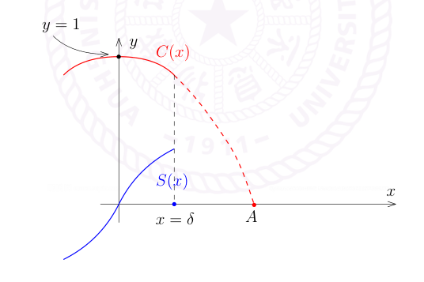

# 中值定理、微分方程与圆周率

[返回讲义目录](../../../math-analysis-lecture-notes.md) · [学期目录](../../01-math-analysis-i.md) · [章节目录](../15-derivative-applications.md) · [校勘记录](../../errata.md) · [上一篇：导数公式与中值定理](../14-mean-value-theorems.md) · [下一篇：15.1：作业：高木贞治函数](15-03-p0158-0165.md)

<!-- source: PDF 151; printed: 151; transcription: first-pass; proofreading: applied -->

## $x \mapsto \exp(xA)$ 的导数及应用

按照导数的定义，如果 $(V, \|\cdot\|)$ 是赋范线性空间，$f : \mathbb{R} \to V$ 是映射，我们可以定义导数
$$
f'(x_0) = \lim_{x \to x_0} \frac{f(x) - f(x_0)}{x - x_0}.
$$
（如果极限存在的话）特别地，$f'(x_0) \in V$。我们来研究我们最爱的例子：$\exp$。令 $V = \mathbf{M}_n(\mathbb{R})$ 为矩阵的空间（复数系数的矩阵的证明是一致的），$A$ 是一个给定的 $n \times n$ 的矩阵，考察映射
$$
f : \mathbb{R} \to \mathbf{M}_n(\mathbb{R}),\ x \mapsto e^{xA}.
$$
我们计算 $f'(x_0)$。按定义，我们有
$$
\frac{f(x_0 + h) - f(x_0)}{h} = \frac{e^{(x_0+h)A} - e^{x_0A}}{h} = e^{x_0A} \frac{e^{hA} - 1}{h},
$$
其中我们用到了矩阵 $x_0A$ 与 $hA$ 可交换。由此可见（在证明 $(e^x)' = e^x$ 的时候也做了同样的事情），只要计算 $f'(0)$ 即可。利用定义，我们有
$$
\frac{e^{hA} - 1}{h} = \sum_{k=1}^{\infty} \frac{1}{k!} h^{k-1} A^k = A + \sum_{k=1}^{\infty} \frac{1}{(k+1)!} h^k A^{k+1}.
$$
根据矩阵乘法对于范数的关系（$\|A \cdot B\| \leqslant c\|A\|\|B\|$，其中 $\|\cdot\|$ 是任意一个指定的范数），我们有
$$
\Big\| \sum_{k=1}^{\infty} \frac{1}{(k+1)!} h^k A^{k+1} \Big\| \leqslant |h| \sum_{k=1}^{\infty} \frac{1}{(k+1)!} c^k \|A\|^{k+1} \leqslant \frac{|h|}{c} e^{c\|A\|}, \qquad |h|\leqslant1.
$$
从而，$f'(0) = A$。进一步，我们知道
$$
f'(x) = A e^{xA} = A f(x).
$$

上一次最后提到了 Lagrange 中值定理的一个推论：

### 微分方程解的唯一性

**推论 94（常微分方程解的存在唯一性-儿童版本）。** $f \in C^0([a, b])$ 并且 $f$ 在 $(a, b)$ 上可微，如果 $f'(x) \equiv 0$ 并且 $f(a) = c$，那么 $f(x) \equiv c$。换而言之，如下的常微分方程
$$
\begin{cases}
f'(x) = 0, \\
f\big|_{x=a} = c,
\end{cases}
$$
存在唯一的解。

<!-- source: PDF 152; printed: 152; transcription: first-pass; proofreading: applied -->

**证明：** 用反证法：如果存在某个 $x_1 \in (a, b)$ 使得 $f(x_1) \neq c$，那么，在 $[a, x_1]$ 上使用 Lagrange 中值定理，就有 $x_0 \in (a, x_1)$，使得
$$
f'(x_0) = \frac{f(x_1) - c}{x_1 - a} \neq 0.
$$
矛盾。 $\hfill\square$

这个推论实际上对于在赋范线性空间中取值的映射也成立：

**命题 95。** 给定映射 $f \in C^0([a, b]; V)$，$f$ 在 $(a, b)$ 上可微。如果 $f'(x) \equiv 0$，$f(a) = c$，那么对任意的 $x \in [a, b]$，$f(x) = c$。

我们满足于 $V = \mathbb{R}^n$ 是有限维的情形，此时，$f : \mathbb{R} \to \mathbb{R}^n$ 可以用分量 $(f_1(x), \cdots, f_n(x))$ 表达并且
$$
f'(x) = (f'_1(x), \cdots, f'_n(x)) = 0 \iff f'_k(x) \equiv 0, \text{ 任意的 } k = 1, \cdots, n.
$$
所以，利用 1 维的情况就可以得到结论。

如果 $V$ 是无限维的赋范线性空间，比如说 $\left( C([0, 1]), \|\cdot\|_{\infty} \right)$，我们一方面没有 Lagrange 中值定理，所以不能用本来的证明；一方面想把问题约化成 1 维的情况的做法不是很容易推广（我们的确能做到这一点）。然而，我们不打算在这个问题上继续深入（除非我们想仔细的研究一下微分方程理论），有限维的情况对我们就足够用了。

作为应用，我们仍然回到 $\exp$ 这个例子：考虑可微映射 $f : \mathbb{R} \to \mathbf{M}_n(\mathbb{R})$，假设它满足如下的微分方程
$$
\begin{cases}
f'(x) = A \cdot f(x), \\
f\big|_{x=0} = \mathbf{I}_n,
\end{cases}
$$
其中，$\mathbf{I}_n$ 为 $n \times n$ 的矩阵。我们知道，$x \mapsto e^{xA}$ 是这个方程的一个解。我们现在说明，这是唯一的解。实际上，我们有
$$
e^{-xA}(f' - Af) = 0 \Rightarrow e^{-xA}f' + \big(e^{-xA}\big)'f = 0.
$$
如果我们有 Leibniz 法则的话（两个函数相乘之后求导数的法则），那么就有
$$
\big(e^{-xA}f\big)' = 0.
$$
这是把一个表达式写成全微分的技巧。根据唯一性的命题，我们知道 $e^{-xA}f(x) \equiv \mathbf{I}$，所以我们就证明了 $f(x) = e^{xA}$（因为 $e^A e^{-A} = \mathbf{I}_n$）。

回到 Leibniz 法则的问题，如果 $f$ 和 $g$ 是 $n \times n$ 矩阵中取值的函数，我们有
$$
\begin{aligned}
(f \cdot g)'(x_0) &= \lim_{h \to 0} \frac{f(x_0 + h)g(x_0 + h) - f(x_0)g(x_0)}{h} \\
&= \lim_{h \to 0} \frac{f(x_0 + h)(g(x_0 + h) - g(x_0))}{h} + \lim_{h \to 0} \frac{(f(x_0 + h) - f(x_0))g(x_0)}{h} \\
&= f(x_0)g'(x_0) + f'(x_0)g(x_0).
\end{aligned}
$$

<!-- source: PDF 153; printed: 153; transcription: first-pass; proofreading: applied -->

这个证明和最基本的函数版本的证明没有任何的区别。

## 单调性与导数的介值性质

利用 Lagrange 中值定理，我们可以进一步联系单调性和导数：

**推论 96。** 假设实值函数 $f \in C^0([a, b])$ 并且 $f$ 在 $(a, b)$ 上可微。那么，下面的两条性质是等价的：

1) $f'(x) \geqslant 0$。

2) $f(x)$ 是递增的。

特别地，如果对任意 $x$，$f'(x) > 0$，那么函数是严格递增的（反之不然）。

**证明：** 2) $\Rightarrow$ 1) 用导数的定义即可：由于 $f(x)$ 递增，所以 $f(x + h) - f(x)$ 与 $h$ 的符号是一致的，从而

$$
\frac{f(x + h) - f(x)}{h} \geqslant 0.
$$

令 $h \to 0$ 即可。

1) $\Rightarrow$ 2) 用反证法：如若不然，存在 $x_1 < x_2$，使得 $f(x_1) > f(x_2)$，根据 Lagrange 中值定理，存在 $x_0 \in [x_1, x_2]$，使得

$$
f'(x_0) = \frac{f(x_2) - f(x_1)}{x_2 - x_1} < 0.
$$

矛盾。

如果 $f'(x) > 0$，为了说明函数是严格递增的，我们仍然用反证法：如若不然，存在 $x_1 < x_2$，使得 $f(x_1) \geqslant f(x_2)$，根据 Lagrange 中值定理，存在 $x_0 \in [x_1, x_2]$，使得

$$
f'(x_0) = \frac{f(x_2) - f(x_1)}{x_2 - x_1} \leqslant 0.
$$

矛盾。 $\square$

我们现在证明导函数的介值定理。

**推论 97**（Darboux）。假设 $f$ 在 $[a, b]$ 上可微，$f'(a) < f'(b)$。那么，对于任意的 $c \in (f'(a), f'(b))$，都存在 $x_0 \in (a, b)$，使得 $f'(x_0) = c$。

**注记。** 存在在 $[a, b]$ 上可微的函数 $f$，它的导数不连续（因此不能直接使用连续函数的介值定理）：

$$
f(x) = \begin{cases}
x^2 \sin(\frac{1}{x}), & x \neq 0; \\
0, & x = 0
\end{cases}
$$

很明显，我们有

$$
f'(x) = \begin{cases}
2x \sin(\frac{1}{x}) - \cos(\frac{1}{x}), & x \neq 0; \\
0, & x = 0
\end{cases}
$$

我们来说明 $f'(x)$ 在 $0$ 处不连续。实际上，我们考虑两个点列 $\{x_n\}_{n \geqslant 1}$ 和 $\{y_n\}_{n \geqslant 1}$，其中

$$
x_n = \frac{1}{2n\pi}, \quad y_n = \frac{1}{(2n + 1)\pi}.
$$

<!-- source: PDF 154; printed: 154; transcription: first-pass; proofreading: applied -->

我们有 $\lim_{n \to \infty} x_n = \lim_{n \to \infty} y_n = 0$，但是，
$$
\lim_{n \to \infty} f'(x_n) = -1, \quad \lim_{n \to \infty} f'(y_n) = 1.
$$

**证明：** 通过把 $f$ 换为 $f(x) - cx$，我们不妨假设 $c = 0$，$f'(a) < 0 < f'(b)$。在这种假设下，$f$ 连续但是不是单调的函数（因为导数是改变符号的），根据介值定理，$f$ 不能是单射。所以，存在 $x_1, x_2 \in [a, b]$，使得 $f(x_1) = f(x_2)$，那么，Rolle 中值定理就给出了 $c$ 的存在性。 $\Box$

### 柯西中值定理

另一个版本的中值定理叫做 Cauchy 中值定理，描述了两个不同函数之间关系：

**命题 98（Cauchy 中值定理）**。假设有实值函数 $f, g \in C^0([a, b])$ 并且 $f$ 和 $g$ 均在 $(a, b)$ 上可微。假设对任意的 $x \in (a, b)$，$g'(x) \neq 0$。那么，存在 $x_0 \in (a, b)$，使得
$$
\frac{f'(x_0)}{g'(x_0)} = \frac{f(b) - f(a)}{g(b) - g(a)}.
$$

我们注意到，结合 Darboux 的定理，$g'(x) \neq 0$ 这个条件意味着 $g'(x)$ 要么恒为正，要么恒为负，所以函数是严格单调的。特别地，这说明 $g(a) \neq g(b)$，从而上式右边是良好定义的。

尽管这个命题可能在一些较难的习题中大显身手，但就本身的深刻程度而言不过是 Rolle 中值定理的一个无关痛痒的推广。然而，我们给出两个不同的证明并且解释怎么理解这个命题。对一个命题有（编）一个感性的认识在学习数学中是非常重要的。

**证明：** 1。我们定义如下的函数：
$$
F(x) = f(x) - f(a) - \frac{f(b) - f(a)}{g(b) - g(a)}(g(x) - g(a)).
$$
因为 $F(b) = F(a) = 0$，所以 Rolle 中值定理可用。这是一个技术性的证明，想法和 Lagrange 中值定理的证明如出一辙。（很多习题册上的题目都是根据这个想法来编的，作业中我们会见到几个例子（比较有技巧性，但其实没有多大意思））。

2. 这个证明比第一个证明复杂很多，然而在概念的层次上要更清晰也包含了更多的理解。

首先，我们观察到如果 $g(x) = x$，那么这个定理就是 Lagrange 中值定理。证明的主旨是将一般的 $g$ 的情况化为这个已知情况，只需要微分几何中一些最朴素的想法。

利用 $g'(x) \neq 0$，我们知道 $g : I = [a, b] \to J = [g(a), g(b)]$ 是同胚，即连续的双射并且逆映射也是连续的。我们需要将 $g$ 想成用 $I$ 来重新参数化 $J = [g(a), g(b)]$。

**注记**。比方说，给定 $\mathbb{R}$ 上的区间 $J = [0, 1]$，我们假设 $\mathbb{R}$ 上用的坐标是 $y$，那么，我们可以用 $y$ 来表示（参数化）$I$ 中的点。考虑映射
$$
g : [0, 2] \to [0, 1], \quad x \mapsto \frac{x}{2}.
$$
此时，我们可以用通过 $g$ 用 $x \in [0, 2]$ 来（参数化）描述 $J$ 中的点：$x = 1$ 对应的是 $J$ 中的 $0.5$ 这个点。

<!-- source: PDF 155; printed: 155; transcription: first-pass; proofreading: applied -->

我们现在认为 $J = [g(a), g(b)]$ 是基本的几何对象。本来 $f$ 是 $I$ 上的函数，我们可以通过上述参数化将 $f$（通过复合）视作是 $[g(a), g(b)]$ 上的函数：
$$
\begin{array}{ccc}
J & \xrightarrow{g^{-1}} & I \\
 & \searrow_{f \circ g^{-1}} & \downarrow_{f} \\
 & & Y
\end{array}
$$
我们要考虑 $f(g^{-1})(y) = f \circ g^{-1}$ 这个函数。根据 Lagrange 中值定理（对 $f \circ g^{-1} : J \to \mathbb{R}$ 来用），我们有
$$
\frac{f \circ g^{-1}(g(a)) - f \circ g^{-1}(g(b))}{g(a) - g(b)} = (f \circ g^{-1})'(c).
$$
不难认出，这就是要证明的等式。这个证明表明，Cauchy 中值定理实际上是 Lagrange 中值定理在不同的参数化下的表述（从这个角度看，$f$ 和 $g$ 的位置不是对等的）。 $\Box$

另外，我们会问这个定理直观上说了什么（有没有比较容易记住的方式）？这里可以看出向量值函数的威力：考虑映射
$$
F : [a, b] \to \mathbb{R}^2, \quad x \mapsto \begin{pmatrix} f(x) \\ g(x) \end{pmatrix}.
$$
这个映射的像是 $\mathbb{R}^2$ 上的一条曲线段。Cauchy 中值定理说的是存在曲线上的点 $x_0$，使得其切线方向 $F'(x_0)$ 和两个端点的连线 $\begin{pmatrix} f(b) \\ g(b) \end{pmatrix} - \begin{pmatrix} f(a) \\ g(a) \end{pmatrix}$ 是同方向的。在图上看起来这与 Rolle/Lagrange 中值定理的几何直观是一致的。事实上，我们还可以定义
$$
\hat{F} : [a, b] \to \mathbf{S}^1, \quad x \mapsto \frac{(f'(x), g'(x))}{\sqrt{f'(x)^2 + g'(x)^2}}.
$$
这个是切线的方向的函数，由于 $\begin{pmatrix} f(b) \\ g(b) \end{pmatrix} - \begin{pmatrix} f(a) \\ g(a) \end{pmatrix}$ 也决定了 $\mathbf{S}^1$ 中的一个方向，这个定理的叙述变得类似于这种情况下的介值定理（$\mathbf{S}^1$ 是 1 维的）。此时，我们很自然地看到为什么需要研究在其它空间上取值的函数（映射）。

## 三角函数的研究

由于有了导数作为新的工具，我们可以来研究 $\sin x$ 和 $\cos x$ 的周期性了。三角函数是解析的方式来定义的，即用级数来定义：
$$
\cos x = \sum_{k=0}^{\infty} \frac{(-1)^k x^{2k}}{(2k)!}, \quad \sin x = \sum_{k=0}^{\infty} \frac{(-1)^k x^{2k+1}}{(2k+1)!}.
$$
它们具有周期性是一个很深刻的事实。我们令
$$
F : \mathbb{R} \to \mathbb{R}^2, \quad x \mapsto F(x) = \begin{pmatrix} \sin x \\ \cos x \end{pmatrix}.
$$

<!-- source: PDF 156; printed: 156; transcription: first-pass; proofreading: applied -->

用 $J$ 表示矩阵 $J = \begin{pmatrix} 0 & 1 \\ -1 & 0 \end{pmatrix}$。那么，根据 $(\cos x)' = -\sin x$ 和 $(\sin x)' = \cos x$，我们发现 $F$ 满足如下的微分方程

$$
\begin{cases}
F' = JF, \\
F\big|_{x=0} = \begin{pmatrix} 0 \\ 1 \end{pmatrix}.
\end{cases}
$$

我们还把 $F(x)$ 写成

$$
F(x) = \big(S(x), C(x)\big), \quad S(x) = \sin(x), \quad C(x) = \cos(x).
$$

**注记。** 如果你采取其它方式定义 $\sin x$ 和 $\cos x$ 的话，比如说按照中学的方式定义的 $\sin x$ 和 $\cos x$，你应该也能证明 $\sin x$ 和 $\cos x$ 满足上述的关系，根据解的唯一性，我们就知道这两种定义方式是一致的。

三角函数的解析表达式没有给出它们更多的信息，我们利用函数的微分来研究 $\cos x$ 和 $\sin x$ 在 $\mathbb{R}_{\geqslant 0}$ 上的行为：

由于 $S'(0) = C(0) = 1$，根据连续性，$S$ 在某个 $[-\delta, \delta]$ 上面是严格递增的（$\delta$ 是较小的正数）。在区间 $(0, \delta)$ 上，由于 $C'(x) = -S(x) < 0$，从而 $C(x)$ 是严格递减；在区间 $(-\delta, 0)$ 上，由于 $S(x) < 0$，从而 $C(x)$ 是严格递增的。这表明 $0$ 是 $C(x)$ 的一个局部最大点（这不意外，因为 $|C(x)| \leqslant 1$ 且 $C(0) = 1$）。这一段推导可以用如下的图像来表示：

我们下面要证明说一定能找到一个 $A > 0$，使得在 $[0, A]$ 上，$C(x)$ 是单调递减的并且在 $A$ 处 $C(x)$ 变成了 $0$。考虑使得 $C$ 在 $[0, A)$ 上都 $> 0$ 的最大可能的 $A$。

我们先说明 $A \neq +\infty$。如若不然，如果 $S' = C > 0$，所以 $S$ 是 $(0, +\infty)$ 上严格递增的函数。在 $x = \delta$，我们令 $s = S(\delta) > 0$，从而，当 $x \geqslant \delta$ 时，$S(x) \geqslant s > 0$。我们考虑如下的代数变形（此时，如果有积分的语言的话会更自然）：

$$
S(x) \geqslant s \Leftrightarrow \big(C(x) + sx\big)' \leqslant 0.
$$

这是把一个表达式写成全微分的技巧。这表明函数 $C(x) + sx$ 在 $[\delta, \infty)$ 上递减，所以，对任意的 $x \geqslant \delta$，由于我们假设了 $C(x) > 0$，所以我们有

$$
C(\delta) + s\delta \geqslant C(x) + sx > sx.
$$

<!-- source: PDF 157; printed: 157; transcription: first-pass; proofreading: applied -->

令 $x \to +\infty$，这自然是不可能的！

此时，上面所描述的 $A < \infty$ 是存在。根据连续性，在 $A$ 处，有 $C(A) = 0$。根据 $C\big|_{[0, A]} \geqslant 0$，我们知道 $S$ 在 $[0, A]$ 上上升，所以 $S(A) > 0$。我们现在计算 $S(A)$ 的值。为此，我们对任意满足上述微分方程的 $S(x)$ 和 $C(x)$，我们都有 $\big(S(x)\big)^2 + \big(C(x)\big)^2 \equiv 1$。证明是利用导数判别：一个函数是常数当且仅当它的导数恒为零。

$$
\Big(\big(S(x)\big)^2 + \big(C(x)\big)^2\Big)' = 2S(x)S'(x) + 2C(x)C'(x) = 0.
$$

而 $\Big(\big(S(x)\big)^2 + \big(C(x)\big)^2\Big)\Big|_{x=0} = 1$。据此，我们知道 $S(A) = 1$。

作为上面推导的总结，我们知道存在常数 $A$，使得 $S(0) = 0$，$S(A) = 1$ 并且 $S$ 在 $[0, A]$ 上严格递增；$C(0) = 1$，$C(A) = 0$ 并且 $C$ 在 $[0, A]$ 上严格递减。

重复上面的推导（请同学自己补充细节），我可以找到 $B > 0$，使得 $S(A) = 1$，$S(A + B) = 0$ 并且 $S$ 在 $[A, A + B]$ 上严格递减；$C(A) = 0$，$C(A + B) = -1$ 并且 $C$ 在 $[A, A + B]$ 上严格递减。

我们定义 $\pi = A + B$，按照上面的推导，它是 $S(x) = \sin x$ 在正实轴上第一个零点。

此时，考虑函数 $\begin{pmatrix} \overline{S}(x) \\ \overline{C}(x) \end{pmatrix} = -\begin{pmatrix} S(x + \pi) \\ C(x + \pi) \end{pmatrix}$。很明显，$\begin{pmatrix} \overline{S} \\ \overline{C} \end{pmatrix}$ 和 $\begin{pmatrix} S \\ C \end{pmatrix}$ 解一样的微分方程（同样的初值），所以根据唯一性，我们得到

$$
S(x) = \overline{S}(x) = -S(x + \pi), \quad C(x) = \overline{C}(x) = -C(x + \pi).
$$

从而，

$$
S(x) = S(x + 2\pi), \quad C(x) = C(x + 2\pi).
$$

这说明 $2\pi$ 是 $S$ 和 $C$ 的周期。另外，$S$ 在 $(0, \pi)$ 上面为正，在 $(\pi, 2\pi)$ 上面为负表明 $2\pi$ 是 $S$ 的最小周期；类似地，$2\pi$ 是 $C$ 的最小周期。

[返回讲义目录](../../../math-analysis-lecture-notes.md) · [学期目录](../../01-math-analysis-i.md) · [章节目录](../15-derivative-applications.md) · [校勘记录](../../errata.md) · [上一篇：导数公式与中值定理](../14-mean-value-theorems.md) · [下一篇：15.1：作业：高木贞治函数](15-03-p0158-0165.md)
