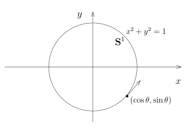
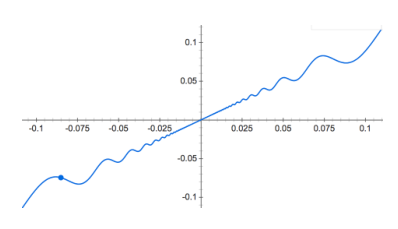
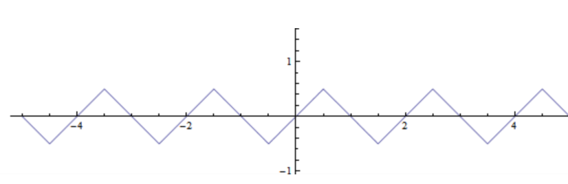
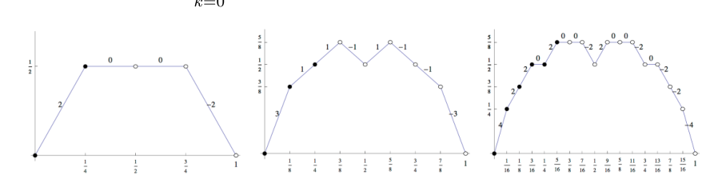
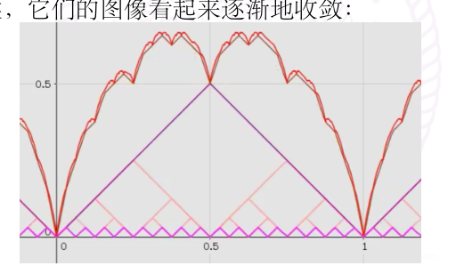
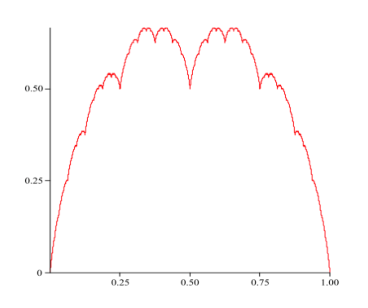
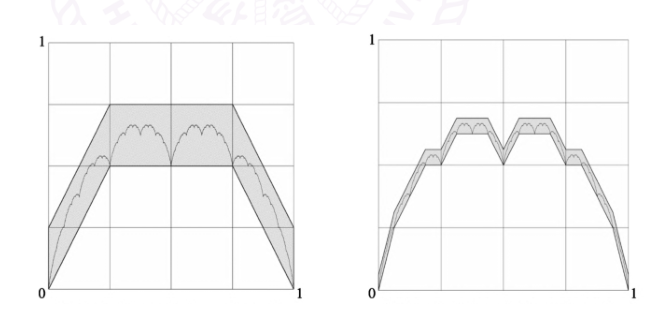

# 15.1：作业：高木贞治函数

[返回讲义目录](../../../math-analysis-lecture-notes.md) · [学期目录](../../01-math-analysis-i.md) · [章节目录](../15-derivative-applications.md) · [校勘记录](../../errata.md) · [上一篇：中值定理、微分方程与圆周率](15-01-p0151-0157.md) · [下一篇：空间填充曲线、L’Hôpital 法则与 Taylor 展开](../16-lhopital-taylor.md)

<!-- source: PDF 158; printed: 158; transcription: first-pass; proofreading: applied -->

<!-- math-analysis-layout: document-title-normalized -->

>

## 基本习题

### 导数的定义与计算

**习题 A：导数的定义和计算**

A1) $\mathbb{R}^n$ 上配有范数 $\|(x_1, \cdots, x_n)\|_2 = \sqrt{(x_1)^2 + \cdots + (x_n)^2}$，我们考虑映射
$$
f : \mathbb{R} \to \mathbb{R}^n, \ \ x \mapsto f(x) = (f_1(x), \cdots, f_n(x)).
$$
证明，$f$ 在 $x_0$ 处的导数存在当且仅当对每个分量函数 $f_k$，它在 $x_0$ 处的导数都存在并且
$$
f'(x_0) = (f'_1(x_0), \cdots, f'_n(x_0)).
$$

A2) 考虑函数 $e^{ix}$，将它视作是映射
$$
f : \mathbb{R} \to \mathbb{C}, \ \ x \mapsto e^{ix}.
$$
利用定义证明，$f'(0) = i \ (\in \mathbb{C})$。仿照课堂上的做法证明 $\left(e^{ix}\right)' = ie^{ix}$。

A3) 利用上面两个问题的结论计算 $\sin x$ 和 $\cos x$ 的导数。

A4) 对 $n = 3$ 来验证 Faà di Bruno 公式。

A5) 定义映射
$$
E : \mathbb{R} \to \mathbb{C} = \mathbb{R}^2, \ \ \theta \mapsto (\cos \theta, \sin \theta).
$$
我们用下面符号表示平面上的单位圆：
$$
\mathbf{S}^1 = \left\{(x, y) \in \mathbb{R}^2 \big| x^2 + y^2 = 1\right\}.
$$

<!-- source: PDF 159; printed: 159; transcription: first-pass; proofreading: applied -->

证明，$\mathbf{S}^1$ 上的点可以写成 $(\sin \theta, \cos \theta)$ 的形式，即 $E(\mathbb{R}) = \mathbf{S}^1$。试计算 $E'(\theta)$ 并验证对于这个映射（$\mathbb{R}^2$ 上取值），Rolle 中值定理并不成立。

A6) 求下列函数的导数（如果 $f$ 在 $x_0$ 不可微，但单侧左导数或右导数存在时，求出左导数或右导数）

(1) $f(x) = a^x, \quad a > 0$。&emsp;&emsp;&emsp;&emsp;&emsp;&emsp;&emsp;&emsp;&emsp;&emsp; (2) $f(x) = \arcsin x$。

(3) $f(x) = \arctan x$ &emsp;&emsp;&emsp;&emsp;&emsp;&emsp;&emsp;&emsp;&emsp;&emsp;&emsp; (4) $f(x) = x^{x^x}, \quad x > 0$

(5) $f(x) = \log\Big(\log\big(\log x\big)\Big)$。&emsp;&emsp;&emsp;&emsp;&emsp;&emsp;&emsp; (6) $f(x) = \sqrt{x + \sqrt{x + \sqrt{x}}}$。

(7) $f(x) = |x|$。&emsp;&emsp;&emsp;&emsp;&emsp;&emsp;&emsp;&emsp;&emsp;&emsp;&emsp;&emsp;&emsp; (8) $f(x) = \log |x|$。

(9) $f(x) = \begin{cases} x^n \sin \frac{1}{x}, & x \neq 0, \\ 0, & x = 0. \end{cases} \qquad n = 1, 2, \cdots.$

A7) 求下列函数的 3-阶导数：

(1) $f(x) = \log(1 + x)$。&emsp;&emsp;&emsp;&emsp;&emsp;&emsp;&emsp;&emsp;&emsp; (2) $f(x) = x^{-1} \log x$。

(3) $f(x) = \frac{x^m}{1 - x}, \ m \in \mathbb{Z}_{\geqslant 0}$。&emsp;&emsp;&emsp;&emsp;&emsp;&emsp;&emsp; (4) $f(x) = x^m e^x, \ m \in \mathbb{Z}_{\geqslant 0}$。

(5) $f(x) = e^{ax} \sin(bx), \ a, b \in \mathbb{R}$。&emsp;&emsp;&emsp;&emsp;&emsp; (6) $f(x) = e^{-x^2}$。

A8) 如果函数 $f$ 在点 $x_0$ 处的导数 $> 0$，不能推出存在该点的邻域 $U$，使得 $f$ 在这个邻域上是递增的：考虑函数
$$
f(x) = \begin{cases} x + 2x^2 \sin\left(\frac{1}{x}\right), & x \neq 0; \\ 0, & x = 0. \end{cases}
$$

证明，$f$ 在 $0$ 处导数存在且大于零，但是对任意的 $\varepsilon > 0$，$f$ 在 $(-\varepsilon, \varepsilon)$ 上的限制都不是单调函数。

A9) （重要）$\mathbf{I}_n$ 是 $n \times n$ 的单位矩阵，$A \in \mathbf{M}_n(\mathbb{R})$，计算 $\frac{d}{dx}\Big|_{x=0} \det(\mathbf{I} + xA)$，即 $\det(\mathbf{I} + xA)$ 在 $x = 0$ 处的导数。

A10) 证明，（可微的）奇函数的导数是偶函数，（可微的）偶函数的导数是奇函数。

<!-- source: PDF 160; printed: 160; transcription: first-pass; proofreading: applied -->

A11) 证明，Riemann 函数 $f(x) = \begin{cases} 1/q, & x = \frac{p}{q} \in \mathbb{Q}, q \geqslant 1, p \text{ 和 } q \text{ 互素}; \\ 0, & x \text{ 是无理数}. \end{cases}$ 在 $\mathbb{R}$ 上处处不可微。

### 习题 B：双曲函数与可微性

B1) 定义双曲函数：
$$
\sinh x = \frac{e^x - e^{-x}}{2}, \quad \cosh x = \frac{e^x + e^{-x}}{2}, \quad \tanh x = \frac{\sinh x}{\cosh x}.
$$

(a) 证明，

(1) $\cosh^2 x - \sinh^2 x = 1$。&emsp;&emsp;&emsp;&emsp;&emsp;&emsp;&emsp;&emsp; (2) $\sinh(x + y) = \sinh x \cosh y + \cosh x \sinh y$。

(3) $\cosh(x + y) = \cosh x \cosh y + \sinh x \sinh y$。&emsp; (4) $\tanh(x + y) = \frac{\tanh x + \tanh y}{1 + \tanh x \tanh y}$。

(b) 求导数 $\sinh'(x)$，$\cosh'(x)$ 和 $\tanh'(x)$。

(c) 证明，存在 $\sinh : \mathbb{R} \to \mathbb{R}$ 的反函数 $\operatorname{arcsinh} : \mathbb{R} \to \mathbb{R}$ 并计算 $\operatorname{arcsinh}'(x)$。

B2) 设 $a, b \in \mathbb{R}, b > 0$，考察函数 $f : [-1, 1] \to \mathbb{R}$，其中
$$
f(x) = \begin{cases} x^a \sin(x^{-b}), & \text{如果} x \neq 0, \\ 0, & \text{如果} x = 0. \end{cases}
$$

证明，下述关于 $f$ 的结论都成立：

(a) $f \in C([-1, 1])$ 当且仅当 $a > 0$；
(b) $f$ 在 $0$ 处可微当且仅当 $a > 1$；
(c) $f'$ 在 $[-1, 1]$ 上有界当且仅当 $a \geqslant 1 + b$；
(d) $f \in C^1([-1, 1])$ 当且仅当 $a > 1 + b$；
(e) $f'$ 在 $0$ 处可微当且仅当 $a > 2 + b$；
(f) $f''$ 在 $[-1, 1]$ 上有界当且仅当 $a \geqslant 2 + 2b$；
(g) $f \in C^2([-1, 1])$ 当且仅当 $a > 2 + 2b$。

### 习题 C（无穷小量与无穷大量的阶的比较）

如果函数 $f$ 在 $x_0$ 的附近（即某个 $x_0$ 的开邻域去掉 $x_0$）满足 $\lim\limits_{x \to x_0} f(x) = 0$，我们就称 $f$ 是 $x \to x_0$ 时的**无穷小量**；类似地，如果 $\lim\limits_{x \to x_0} f(x) = +\infty$ 或者 $\lim\limits_{x \to x_0} f(x) = -\infty$（请注意我们用的“或者”这个词的含义），我们就称 $f$ 是 $x \to x_0$ 时的**无穷大量**。

现在假设 $f, g$ 都是 $x \to x_0$ 时的无穷小量并且 $g(x)$ 在 $x_0$ 的附近不取零值，我们现在引进记号：

<!-- source: PDF 161; printed: 161; transcription: first-pass; proofreading: applied -->

- 如果 $\lim\limits_{x \to x_0} \frac{f(x)}{g(x)} = 0$，我们就称 $f$ 是比 $g$ 高阶的无穷小，记作 $f(x) = o(g(x)), x \to x_0$；

- 如果 $\lim\limits_{x \to x_0} \frac{f(x)}{g(x)} = \ell, \ell \neq 0$，我们就称 $f$ 是与 $g$ 同阶的无穷小；

- 特别地，如果 $f$ 与 $g$ 同阶并且 $\ell = 1$，我们就称 $f$ 是与 $g$ 等价的无穷小，记作 $f(x) \sim g(x), x \to x_0$；

- 如果 $\limsup\limits_{x \to x_0} \frac{|f(x)|}{|g(x)|} < +\infty$，我们将这种情况记作 $f(x) = O(g(x)), x \to x_0$。

类似地，我们可以定义无穷大量的阶之间的比较。这是通用的术语，同学们可参考任一本参考书或者网络。

C1) 假设 $x \to x_0$ 时，函数 $a(x)$ 满足 $a = o(1)$。试证明：

(1) $o(a) + o(a) = o(a)$ &emsp;&emsp;&emsp;&emsp;&emsp;&emsp;&emsp;&emsp;&emsp; (2) $o(ca) = co(a), \quad c \in \mathbb{R}$

(3) $(o(a))^k = o(a^k)$，&emsp;&emsp;&emsp;&emsp;&emsp;&emsp;&emsp;&emsp;&emsp;&emsp;&emsp; (4) $\frac{1}{1 + a} = 1 - a + o(a)$。

C2) 假设 $f(x), g(x)$ 是 $x \to x_0$ 时的无穷小，那么

(a) 证明，$f(x) \sim g(x) \iff f(x) - g(x) = o(g(x)), \quad x \to x_0$。

(b) 如果把 $g$ 作为基本的比较单位（小量），我们可以将另外的无穷小量与 $g(x)^k$（$k$ 是正整数）进行比较。如果 $f(x) \sim cg(x)^k$，我们就称 $cg^k$ 是 $f$ 的主部（这里 $c$ 是常数）。试定出下列无穷小或无穷大的主部（与 $x - x_0$ 或者 $x$ 比较）：

(1) $\frac{1}{\sin \pi x}, \quad x \to 1$。&emsp;&emsp;&emsp;&emsp;&emsp;&emsp;&emsp;&emsp;&emsp;&emsp; (2) $\sqrt{1 + x} - \sqrt{1 - x}, \quad x \to 0$。

(3) $\sin\left(\sqrt{1 + \sqrt{1 + \sqrt{x}}} - \sqrt{2}\right), \quad x \to 0^+$。&emsp; (4) $\sqrt{1 + \tan x} - \sqrt{1 - \sin x}, \quad x \to 0$。

(5) $\sqrt{x + \sqrt{x + \sqrt{x}}}, \quad x \to 0^+$。&emsp;&emsp;&emsp;&emsp;&emsp;&emsp; (6) $\sqrt{x + \sqrt{x + \sqrt{x}}}, \quad x \to +\infty$。

(c) 我们假设 $f(x) \sim cx^k, x \to 0$（即 $f(x) = cx^k + o(x^k)$）。如果 $f(x) - cx^k$ 可以再分出主部 $c'x^{k'}$，其中 $k' > k$，那么我们就将它写为 $f(x) = cx^k + c'x^{k'} + o(x^{k'})$。试将下列无穷小展开到 $o(x^2)$：

(1) $\sqrt{1 + x} - 1$，&emsp;&emsp;&emsp;&emsp;&emsp;&emsp;&emsp;&emsp;&emsp;&emsp;&emsp;&emsp; (2) $\sqrt[m]{1 + x} - 1, m \in \mathbb{Z}_{\geqslant 1}$。

## 思考题：处处连续处处不可微的 Takagi（高木贞治）函数

**习题 T**（Takagi（高木贞治）函数，1903 年）我们先在 $[0, 1]$ 区间上定义 $\psi(x) = \begin{cases} x, & 0 \leqslant x < \frac{1}{2}; \\ 1 - x, & \frac{1}{2} \leqslant x \leqslant 1. \end{cases}$
接下来，以 $1$ 为周期，我们可以将 $\psi$ 延拓成 $\mathbb{R}$ 上的周期函数（连续）并且仍然将它记作 $\psi$，它的函数图像好像是锯齿一般：

<!-- source: PDF 162; printed: 162; transcription: first-pass; proofreading: applied -->

我们定义 Takagi 函数 $T : \mathbb{R} \to \mathbb{R}$ 如下：

$$
T(x) = \sum_{k=0}^{\infty} \frac{1}{2^k} \psi(2^k x).
$$

我们实际上可以考虑部分和 $T_n(x) = \sum_{k=0}^{n} \frac{1}{2^k} \psi(2^k x)$。当 $n = 1, 2, 3$ 时，它们的图像如下：

当 $n$ 越来越大的时候，它们的图像看起来逐渐地收敛：

这个习题的目标是粗略地研究 Takagi 函数的性质。

T1) 证明，$T(x)$ 是 $\mathbb{R}$ 上良好定义的有界连续函数。它图像貌似：

T2) 对于 $x \in [0, 1]$，假设 $x = \sum_{n=1}^{\infty} \frac{a_n}{2^n}$ 是 $x$ 的 2-进制展开，其中 $a_n = 0$ 或者 $1$。我们令 $v_n = \sum_{k=1}^{n} a_k$。

<!-- source: PDF 163; printed: 163; transcription: first-pass; proofreading: applied -->

我们定义函数 $\sigma_n(y) = a_n + (1 - 2a_n)y$，其中 $y = 0$ 或者 $1$。证明，

$$
\psi(2^m x) = \sum_{n=1}^{\infty} \frac{\sigma_{m+1}(a_{m+n})}{2^n}.
$$

T3) 对于 $x \in [0, 1]$，假设 $x = \sum_{n=1}^{\infty} \frac{a_n}{2^n}$ 是 $x$ 的 2-进制展开。证明，

$$
T(x) = \sum_{n=1}^{\infty} \frac{(1 - a_n)v_n + a_n(n - v_n)}{2^n}.
$$

T4) 假设 $x_0 = \frac{k_0}{2^{m_0}} \in (0, 1]$，其中 $k_0 \in \mathbb{Z}_{\geqslant 1}$ 是奇数，$m_0 \in \mathbb{Z}_{\geqslant 0}$。令 $h_n = \frac{1}{2^n}$，其中 $n \in \mathbb{Z}_{\geqslant m_0}$。证明，数列 $\left\{ \frac{T(x + h_n) - T(x)}{h_n} \right\}_{n \geqslant m_0}$ 不收敛。

T5) $f$ 是定义在非空的开区间 $I$ 上实数值函数。如果 $f$ 在 $a$ 处可导，证明，

$$
\lim_{\substack{(h, h') \to (0, 0), \\ h > 0, h' > 0}} \frac{f(a + h) - f(a - h')}{h + h'} = f'(a),
$$

这里极限 $\lim_{\substack{(h, h') \to (0, 0), \\ h > 0, h' > 0}}$ 的意义指的是任意的序列 $(h_n, h'_n) \to (0, 0), h_n > 0, h'_n > 0$ 所对应的序列都收敛。

T6) $f$ 是定义在非空的开区间 $I$ 上实数值函数。假设 $f \in C^1(I)$（连续可微），$a \in I$，证明，

$$
\lim_{\substack{(h, h') \to (0, 0), \\ h + h' \neq 0}} \frac{f(a + h) - f(a - h')}{h + h'} = f'(a).
$$

T7) 假设 $x \in [0, 1]$，使得对任意的正整数 $n$，$2^n x$ 都不是整数。对于每个正整数 $n$，我们用下面的公式定义序列 $\{h_n\}_{n \geqslant 1}$ 和 $\{h'_n\}_{n \geqslant 1}$：

$$
\lfloor 2^n x \rfloor = 2^n(x - h'_n), \quad \lfloor 2^n x \rfloor + 1 = 2^n(x + h_n),
$$

其中函数 $\lfloor y \rfloor$ 按照定义是不超过 $y$ 的最大的整数（即 $y$ 的整数部分（如果 $y \geqslant 0$））。证明，对每个给定的 $n$，$h_n + h'_n = 2^{-n}$ 并且对每个整数 $1 \leqslant \ell \leqslant n - 1$，开区间 $\left( 2^\ell(x - h'_n), 2^\ell(x + h_n) \right)$ 中不包含任何的整数和半整数。

T8) 假设 $x \in [0, 1]$，使得对任意的正整数 $n$，$2^n x$ 都不是整数，我们沿用 T7) 中的符号，证明，数列 $\left\{ \frac{T(x + h_n) - T(x - h'_n)}{h_n + h'_n} \right\}_{n \geqslant 1}$ 不收敛。

T9) 证明，$T(x)$ 是 $\mathbb{R}$ 上处处连续处处不可微的函数。

<!-- source: PDF 164; printed: 164; transcription: first-pass; proofreading: applied -->

T10) 证明，我们有如下的函数方程：

$$
T(x) =
\begin{cases}
2x + \frac{T(4x)}{4}, & 0 \leqslant x < \frac{1}{4}; \\
\frac{1}{2} + \frac{T(4x - 1)}{4}, & \frac{1}{4} \leqslant x < \frac{1}{2}; \\
\frac{1}{2} + \frac{T(4x - 2)}{4}, & \frac{1}{2} \leqslant x < \frac{3}{4}; \\
2 - 2x + \frac{T(4x - 3)}{4}, & \frac{3}{4} \leqslant x \leqslant 1.
\end{cases}
$$

T11) （Takagi 函数图像的自相似性）令 $\Gamma = \{ (x, T(x)) | 0 \leqslant x \leqslant 1 \} \subset \mathbb{R}^2$ 是 $T$ 在区间 $[0, 1]$ 上的函数图像。我们定义如下四个仿射变换 $\Phi_i : \mathbb{R}^2 \to \mathbb{R}^2$：

$$
\Phi_0 \begin{pmatrix} x \\ y \end{pmatrix} = \begin{pmatrix} \frac{1}{4} & 0 \\ \frac{1}{2} & \frac{1}{4} \end{pmatrix} \begin{pmatrix} x \\ y \end{pmatrix}, \qquad \Phi_1 \begin{pmatrix} x \\ y \end{pmatrix} = \begin{pmatrix} \frac{1}{4} & 0 \\ 0 & \frac{1}{4} \end{pmatrix} \begin{pmatrix} x \\ y \end{pmatrix} + \begin{pmatrix} \frac{1}{4} \\ \frac{1}{2} \end{pmatrix},
$$

$$
\Phi_2 \begin{pmatrix} x \\ y \end{pmatrix} = \begin{pmatrix} \frac{1}{4} & 0 \\ 0 & \frac{1}{4} \end{pmatrix} \begin{pmatrix} x \\ y \end{pmatrix} + \begin{pmatrix} \frac{1}{2} \\ \frac{1}{2} \end{pmatrix}, \qquad \Phi_3 \begin{pmatrix} x \\ y \end{pmatrix} = \begin{pmatrix} \frac{1}{4} & 0 \\ -\frac{1}{2} & \frac{1}{4} \end{pmatrix} \begin{pmatrix} x \\ y \end{pmatrix} + \begin{pmatrix} \frac{3}{4} \\ \frac{1}{2} \end{pmatrix}.
$$

证明，$\Phi_i$ 恰好把 $\Gamma$ 变成 $T$ 在区间 $[\frac{i}{4}, \frac{i+1}{4}]$ 上的图像，其中 $i = 0, 1, 2, 3$。

T12) 令 $S_0 = \{ (x, y) \in \mathbb{R}^2 | 0 \leqslant x \leqslant 1, 0 \leqslant y \leqslant 1 \}$ 是 $\mathbb{R}^2$ 上的闭方块。对每个 $n \geqslant 0$，我们定义 $S_{n+1} = \bigcup_{k=0}^{3} \Phi_k(S_n)$。证明，$S_n$ 是平面上一列单调下降的紧集并且 $\Gamma = \bigcap_{n \geqslant 0} S_n$。我们有 $S_1$ 和 $S_2$ 的示意图：

T13) 证明，$\sup_{x \in \mathbb{R}} T(x) \leqslant \frac{2}{3}$。

T14) 找一个 $c \in [0, 1]$，使得 $T(c) = \frac{2}{3}$。

T15) （$T^{-1}(\frac{2}{3})$ 的 Cantor 集的结构）对于 $x \in [0, 1]$，假设 $x = \sum_{n=1}^{\infty} \frac{b_n}{4^n}$ 是 $x$ 的 4-进制展开，其中 $b_n = 0, 1, 2, 3$。证明，

$$
\left\{ x \in [0, 1] \middle| T(x) = \frac{2}{3} \right\} = \left\{ x \in [0, 1] \middle| x = \sum_{n=1}^{\infty} \frac{b_n}{4^n}, b_n \in \{1, 2\} \right\}.
$$

<!-- source: PDF 165; printed: 165; transcription: first-pass; proofreading: applied -->

T16) 仿照 T11)，研究 $\Phi_1$ 和 $\Phi_2$ 在集合 $\left\{ (x, T(x)) \middle| x \in [0, 1], T(x) = \frac{2}{3} \right\}$ 上自相似的作用。（这是一个 Hausdorff 维数为 $\frac{1}{2}$ 的集合）。

[返回讲义目录](../../../math-analysis-lecture-notes.md) · [学期目录](../../01-math-analysis-i.md) · [章节目录](../15-derivative-applications.md) · [校勘记录](../../errata.md) · [上一篇：中值定理、微分方程与圆周率](15-01-p0151-0157.md) · [下一篇：空间填充曲线、L’Hôpital 法则与 Taylor 展开](../16-lhopital-taylor.md)
