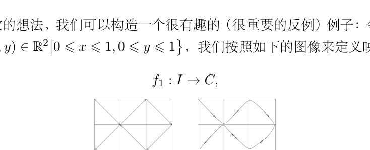
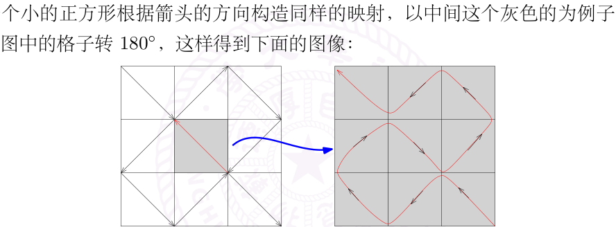
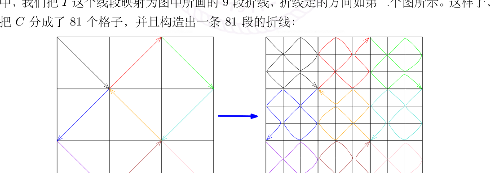

# 16：空间填充曲线、L’Hôpital 法则与 Taylor 展开

[返回讲义目录](../../math-analysis-lecture-notes.md) · [学期目录](../01-math-analysis-i.md) · [校勘记录](../errata.md) · [上一篇：15.1：作业：高木贞治函数](15-derivative-applications/15-03-p0158-0165.md) · [下一篇：凸函数与 Jensen 不等式](17-convexity/17-01-p0175-0182.md)

<!-- source: PDF 166; printed: 166; transcription: first-pass; proofreading: applied -->

## 空间填充曲线

利用一致收敛的想法，我们可以构造一个很有趣的（很重要的反例）例子：令 $I = \left\{ x \in \mathbb{R} \mid 0 \leqslant x \leqslant 1 \right\}$，$C = \left\{ (x, y) \in \mathbb{R}^2 \mid 0 \leqslant x \leqslant 1, 0 \leqslant y \leqslant 1 \right\}$，我们按照如下的图像来定义映射

$$f_1 : I \to C,$$

我们对每一个小的正方形根据箭头的方向构造同样的映射，以中间这个灰色的为例子，我们要把刚才第一个图中的格子转 $180^\circ$，这样得到下面的图像：

其中，我们把 $I$ 这个线段映射为图中所画的 9 段折线，折线走的方向如第二个图所示。这样子，我们把 $C$ 分成了 81 个格子，并且构造出一条 81 段的折线：

上面这个图对应着映射：

$$f_2 : I \to C,$$

重复上面的操作，我们就得到了一串连续映射：

$$f_n : I \to C,$$

<!-- source: PDF 167; printed: 167; transcription: first-pass; proofreading: applied -->

其中 $n \geqslant 1$，并且这是一个 $9^n$ 段的折线。按照这些映射的构造方式，我们知道，对任意的 $N \geqslant 1$，对任意的 $n, m \geqslant N$，$f_n$ 和 $f_m$ 都是对 $f_N$ 的每个边长为 $3^{-N}$ 的方块里面进行修改，特别地，对任意的 $x \in I$，我们就知道 $f_n(x)$ 和 $f_m(x)$ 都落在同一个边长为 $3^{-N}$ 的方块里，所以

$$|f_n(x) - f_m(x)| \leqslant \sqrt{2} \cdot 3^{-N},$$

即

$$\|f_n - f_m(x)\|_{L^\infty} \leqslant \sqrt{2} \cdot 3^{-N},$$

这表明 $\{f_n\}_{n \geqslant 1}$ 是 $\left( C(I; \mathbb{R}^2), \| \cdot \|_\infty \right)$ 中的 Cauchy 列，从而存在连续映射

$$f_\infty : I \to C,$$

使得 $f_n \xrightarrow{C(I;\mathbb{R}^2)} f_\infty$。根据 $f_n$ 的构造，对任意的 $p \in C$，$p$ 一定落在 $f_n$ 所对应的 $9^n$ 个小方块中的某一个，所以有 $x \in I$，使得 $p$ 和 $f(x)$ 的距离不超过 $\sqrt{2} \cdot 3^{-n}$，据此，我们知道 $f_\infty$ 的像 $f_\infty(I) \subset C$ 是稠密的。由于 $I$ 是紧集，所以它在连续映射下的像是紧的，从而是闭的，再用稠密性，我们就知道 $f_\infty(I) = C$。最终，我们得到连续的满射：

$$f_\infty : I \to C.$$

## 洛必达法则

我们回到导数的学习，上次课证明了 Cauchy 中值定理：实值函数 $f, g \in C^0([a, b])$ 并且 $f$ 和 $g$ 均在 $(a, b)$ 上可微，若对任意的 $x \in (a, b)$，$g'(x) \neq 0$。那么，存在 $x_0 \in (a, b)$，使得

$$\frac{f'(x_0)}{g'(x_0)} = \frac{f(b) - f(a)}{g(b) - g(a)}.$$

Cauchy 中值定理的重要应用是用来证明 L'Hôpital 法则：

**命题 99**（L'Hôpital 法则）。假设 $f$ 和 $g$ 是区间 $(a, b)$ 上的可微实值函数，我们假设即 $f(x), g(x) = o(x - a)$，即

$$\lim_{x \to a^+} f(x) = 0, \quad \lim_{x \to a^+} g(x) = 0.$$

我们假设对任意的 $x \in (a, b)$，$g'(x) \neq 0$。如果极限 $\displaystyle\lim_{x \to a^+} \frac{f'(x)}{g'(x)}$ 存在（可以是 $\pm\infty$），那么

$$\lim_{x \to a^+} \frac{f(x)}{g(x)} = \lim_{x \to a^+} \frac{f'(x)}{g'(x)}.$$

**证明**：根据 $f(x), g(x) = o(x - a)$，我们知道对任意的 $x \in (a, b)$，$f$ 和 $g$ 是在区间 $[a, x]$ 上连续并且在 $(a, x)$ 上可微。所以，利用 Cauchy 中值定理，存在 $\xi(x) \in (a, x)$，使得

$$\frac{f(x)}{g(x)} = \frac{f(x) - f(a)}{g(x) - g(a)} = \frac{f'(\xi(x))}{g'(\xi(x))}.$$

特别地，当 $x \to a^+$ 时，由于 $a < \xi(x) < x$，所以 $\xi(x) \to a^+$。对上面的式子取极限，我们就得到：

$$\lim_{x \to a^+} \frac{f(x)}{g(x)} = \frac{f(x) - f(a)}{g(x) - g(a)} = \lim_{x \to a^+} \frac{f'(\xi(x))}{g'(\xi(x))} = \lim_{x \to a^+} \frac{f'(x)}{g'(x)}.$$

命题得证。$\square$

<!-- source: PDF 168; printed: 168; transcription: first-pass; proofreading: applied -->

我们还有一个版本 L'Hôpital 法则：

**推论 100**（L'Hôpital 法则）。实值函数 $f$ 和 $g$ 在区间 $(a, +\infty)$ 上可微并且

$$\lim_{x \to +\infty} f(x) = 0, \quad \lim_{x \to +\infty} g(x) = 0.$$

假设对任意的 $x \in (a, +\infty)$，$g'(x) \neq 0$。如果极限 $\displaystyle\lim_{x \to +\infty} \frac{f'(x)}{g'(x)}$ 存在（可以是 $\pm\infty$），那么我们有

$$\lim_{x \to +\infty} \frac{f(x)}{g(x)} = \lim_{x \to +\infty} \frac{f'(x)}{g'(x)}.$$

**证明：** 不妨假设 $a > 0$，考虑坐标变换：

$$\varphi : \left(0, \frac{1}{a}\right) \to (a, \infty), \quad x \mapsto \frac{1}{x}.$$

从而，$\widetilde{f} = f \circ \varphi$ 是 $\left(0, \frac{1}{a}\right)$ 上的函数，即 $\widetilde{f}(x) = f\!\left(\dfrac{1}{x}\right)$；类似地，我们定义 $\left(0, \frac{1}{a}\right)$ 上的函数 $\widetilde{g} = g \circ \varphi$ 是。由于 $x \to +\infty$ 等价于 $\varphi(x) \to 0^+$，所以

$$\lim_{x \to 0^+} \widetilde{f}(x) = 0, \quad \lim_{x \to 0^+} \widetilde{g}(x) = 0.$$

此时，我们有

$$\lim_{x \to 0^+} \frac{\widetilde{f}'(x)}{\widetilde{g}'(x)} = \lim_{x \to +\infty} \frac{-\dfrac{f'(x)}{x^2}}{-\dfrac{g'(x)}{x^2}} = \lim_{x \to +\infty} \frac{f'(x)}{g'(x)}.$$

所以，根据前一版本的 L'Hôpital 法则，我们有

$$\lim_{x \to +\infty} \frac{f(x)}{g(x)} = \lim_{x \to 0^+} \frac{\widetilde{f}(x)}{\widetilde{g}(x)} = \lim_{x \to +\infty} \frac{f'(x)}{g'(x)}.$$

这就证明了命题。$\square$

**推论 101。** $n \geqslant 1$ 是整数，$f$ 和 $g$ 是区间 $(a, b)$ 上 $n$-次可微的实值函数。假设对任意的 $0 \leqslant k \leqslant n-1$，都有

$$\lim_{x \to a^+} f^{(k)}(x) = 0, \quad \lim_{x \to a^+} g^{(k)}(x) = 0,$$

并且极限 $\displaystyle\lim_{x \to a^+} \frac{f^{(n)}(x)}{g^{(n)}(x)}$ 存在（可以是 $\pm\infty$）。如果对 $x \in (a, b)$，$g^{(n)}(x) \neq 0$，那么

$$\lim_{x \to a^+} \frac{f(x)}{g(x)} = \lim_{x \to a^+} \frac{f^{(n)}(x)}{g^{(n)}(x)}.$$

**证明：** 我们 $n$ 用归纳法就立即得到了证明，但是每次都要检验导数不为零的条件：由于 $f^{(n)}(x) \neq 0$，根据 Darboux 介值定理，$f^{(n)}(x)$ 恒正或者恒负，所以函数严格单调。由于 $f^{(n-1)}(a) = 0$，所以 $f^{(n-1)}(x)$ 恒为正或者恒为负。以此类推，所有导数都非零。$\square$

我们还有其它两个类型的 L'Hôpital 法则：

<!-- source: PDF 169; printed: 169; transcription: first-pass; proofreading: applied -->

**推论 102**（L'Hôpital 法则）。假设 $f$ 和 $g$ 是区间 $(a, b)$ 上的可微实值函数，我们假设

$$\lim_{x \to a^+} |f(x)| = \infty, \quad \lim_{x \to a^+} |g(x)| = \infty.$$

我们假设对任意的 $x \in (a, b)$，$g'(x) \neq 0$。如果极限 $\displaystyle\lim_{x \to a^+} \frac{f'(x)}{g'(x)}$ 存在（可以是 $\pm\infty$），那么

$$\lim_{x \to a^+} \frac{f(x)}{g(x)} = \lim_{x \to a^+} \frac{f'(x)}{g'(x)}.$$

**推论 103**（L'Hôpital 法则）。实值函数 $f$ 和 $g$ 在区间 $(a, +\infty)$ 上可微并且

$$\lim_{x \to +\infty} |f(x)| = 0, \quad \lim_{x \to +\infty} |g(x)| = 0.$$

假设对任意的 $x \in (a, +\infty)$，$g'(x) \neq 0$。如果极限 $\displaystyle\lim_{x \to +\infty} \frac{f'(x)}{g'(x)}$ 存在（可以是 $\pm\infty$），那么我们有

$$\lim_{x \to +\infty} \frac{f(x)}{g(x)} = \lim_{x \to +\infty} \frac{f'(x)}{g'(x)}.$$

这两个推论的证明我们留成本次作业。

L'Hôpital 法则可以用来计算极限：

**例子。** 我们举几个例子：

*1)* 计算 $\displaystyle\lim_{x \to 0} \frac{\sin x}{x}$：

$$\lim_{x \to 0} \frac{\sin x}{x} = \lim_{x \to 0} \frac{\cos x}{1} = 1.$$

*2)* 计算 $\displaystyle\lim_{x \to 0} \frac{\cos x}{x^2}$：

$$\lim_{x \to 0} \frac{\cos x}{x^2} = \lim_{x \to 0} \frac{-2\cos x \sin x}{x} = \lim_{x \to 0} \frac{-2(\cos x)^2 + 2(\sin x)^2}{1} = -\frac{1}{2}.$$

*3)* 计算 $\displaystyle\lim_{x \to 0} \frac{e^x - x - 1}{x^2}$：

$$\lim_{x \to 0} \frac{e^x - x - 1}{x^2} = \lim_{x \to 0} \frac{e^x - 1}{2x} = \lim_{x \to 0} \frac{e^x}{2} = \frac{1}{2}.$$

*4)* 证明 $\displaystyle\lim_{x \to \infty} \frac{x^n}{e^x} = 0$：

$$\lim_{x \to \infty} \frac{x^n}{e^x} = \lim_{x \to \infty} \frac{nx^{n-1}}{e^x} = \lim_{x \to \infty} \frac{n(n-1)x^{n-2}}{e^x} = \cdots = \lim_{x \to \infty} \frac{n!}{e^x} = 0.$$

*5)* 计算 $\displaystyle\lim_{x \to \infty} \frac{x}{\sqrt{x^2 + 1}}$。

<!-- source: PDF 170; printed: 170; transcription: first-pass; proofreading: applied -->

第一次运用 L'Hôpital 法则，我们就会有

$$
\lim_{x\to\infty} \frac{x}{\sqrt{x^2+1}} = \lim_{x\to\infty} \frac{1}{\frac{x}{\sqrt{x^2+1}}} = \lim_{x\to\infty} \frac{\sqrt{x^2+1}}{x}.
$$

再用一次就得到

$$
\lim_{x\to\infty} \frac{\sqrt{x^2+1}}{x} = \lim_{x\to\infty} \frac{x}{\sqrt{x^2+1}}.
$$

所以一直不会停止。对于这个例子 L'Hôpital 法则并不好用。

6) 计算 $\lim_{x\to 0} \frac{\sin x}{e^x}$。如果我们不检验 $f(x)$ 和 $g(x)$ 在 $0$ 处是否是零而直接运用 L'Hôpital 法则，我们就会有

$$
\lim_{x\to 0} \frac{\sin x}{e^x} = \lim_{x\to 0} \frac{\cos x}{e^x} = 1.
$$

这个结论自然是错误的！

## 泰勒展开与多项式逼近

L'Hôpital 法则只是一种计算极限的方法，它之所以有用（更多是做习题的时候）主要因为它可以把求极限这种分析上的操作转化为求导数的问题，而求导数的操作一般而言都是代数操作（因为我们可以背过很多导数）。然而，对于微积分的学习，这个法则似乎无关主旨，我们应该尽量早的学习 Taylor 展开的技术，这才是真正要紧的东西：

**定理 104**（Taylor 展开公式：用多项式逼近）。我们给出 Taylor 展开的三种不同余项的叙述：

1) **Peano 余项**。假设函数 $f:[a,b]\to\mathbb{R}$（或者 $\mathbb{C}$）在 $a$ 处的一直到 $n$-次导数 $f'(a), \cdots, f^{(n)}(a)$ 都存在。那么，当 $x\to a^+$ 时，我们有

$$
f(x) = \sum_{k=0}^n \frac{f^{(k)}(a)}{k!}(x-a)^k + o((x-a)^n).
$$

2) **Lagrange 余项**。假设函数 $f\in C^n([a,b])$ （在 $\mathbb{R}$ 或 $\mathbb{C}$ 中取值），特别地，$f$ 在 $a$ 处的 $n$-次导数 $f'(a), \cdots, f^{(n)}(a)$ 都存在。如果 $f$ 在 $(a,b)$ 上 $n+1$ 次可导。那么，我们有

$$
f(x) = \sum_{k=0}^n \frac{f^{(k)}(a)}{k!}(x-a)^k + R_n(x),
$$

其中 $R_n(x) = \frac{f^{(n+1)}(\xi)}{(n+1)!}(x-a)^{n+1}$，$\xi\in[a,x]$ 由 $x$ 决定（未必唯一）。

3) **Cauchy 余项**。假设函数 $f\in C^n([a,b])$ （在 $\mathbb{R}$ 或 $\mathbb{C}$ 中取值），特别地，$f$ 在 $a$ 处的 $n$-次导数 $f'(a), \cdots, f^{(n)}(a)$ 都存在。如果 $f$ 在 $(a,b)$ 上 $n+1$ 次可导。那么，我们有

$$
f(x) = \sum_{k=0}^n \frac{f^{(k)}(a)}{k!}(x-a)^k + \overline{R}_n(x),
$$

其中 $\overline{R}_n(x) = \frac{f^{(n+1)}(\xi)}{n!}(x-\xi)^n(x-a)$，$\xi\in[a,x]$ 由 $x$ 决定（未必唯一）。

<!-- source: PDF 171; printed: 171; transcription: first-pass; proofreading: applied -->

**注记。** *Peano* 余项的公式只在 $a$ 的附近成立，而 *Lagrange* 和 *Taylor* 的情况是整体的公式。

我们注意到当 $n = 1$ 时，*Peano* 余项的公式就是导数的定义。

当 $n = 0$ 时，*Lagrange* 余项的公式就是 *Lagrange* 中值定理。

另外，如果要求 $f$ 是 $n$-次连续可微的并且 $n + 1$ 次导数存在，那么 *Lagrange* 余项（或者 *Taylor* 余项）的公式成立，此时，根据连续性，*Peano* 余项的公式明显成立。

**证明：** 1) Peano 余项公式等价于证明

$$\lim_{x \to a^+} \frac{f(x) - \displaystyle\sum_{k=0}^{n} \frac{f^{(k)}(a)}{k!}(x-a)^k}{(x-a)^n} = 0.$$

我们利用 L'Hôpital 法则逐次求导数（容易验证该法则所要求的条件）：

$$\lim_{x \to a^+} \frac{f(x) - \displaystyle\sum_{k=0}^{n} \frac{f^{(k)}(a)}{k!}(x-a)^k}{(x-a)^n} = \cdots = \lim_{x \to a^+} \frac{f^{(n-1)}(x) - f^{(n-1)}(a) - f^{(n)}(a)(x-a)}{n!(x-a)}$$

$$= \frac{1}{n!} \lim_{x \to a^+} \left(\frac{f^{(n-1)}(x) - f^{(n-1)}(a)}{x - a} - f^{(n)}(a)\right)$$

$$= 0.$$

最后一步是利用导数的定义。

2) 将 $x$ 视作是固定的，我们定义

$$F(t) = \sum_{k=0}^{n} \frac{f^{(k)}(t)}{k!}(x-t)^k = f(t) + \sum_{k=1}^{n} \frac{f^{(k)}(t)}{k!}(x-t)^k.$$

我们对 $t$ 求导数得到：

$$F'(t) = f'(t) + \sum_{k=1}^{n} \frac{f^{(k+1)}(t)}{k!}(x-t)^k + \sum_{k=1}^{n} \frac{(-1)f^{(k)}(t)}{(k-1)!}(x-t)^{k-1}$$

$$= f'(t) + \sum_{k=1}^{n} \frac{f^{(k+1)}(t)}{k!}(x-t)^k - \sum_{\ell=0}^{n-1} \frac{f^{(\ell+1)}(t)}{\ell!}(x-t)^\ell.$$

所以，

$$F'(t) = \frac{f^{(n+1)}(t)}{n!}(x-t)^n.$$

现在考虑另一个关于 $t$ 的函数（定义在 $[a, x]$ 上）：

$$G(t) = \left(\frac{x-t}{x-a}\right)^{n+1}$$

很明显，$G'(t)$ 在 $(a, x)$ 上不是零。根据 Cauchy 中值定理，存在 $\xi \in (a, x)$，使得

$$\frac{F'(\xi)}{G'(\xi)} = \frac{F(x) - F(a)}{G(x) - G(a)}.$$

<!-- source: PDF 172; printed: 172; transcription: first-pass; proofreading: applied -->

即

$$\frac{\dfrac{f^{(n+1)}(\xi)}{n!}(x-\xi)^n}{\dfrac{-(n+1)(x-\xi)^n}{(x-a)^{n+1}}} = \frac{F(x) - F(a)}{-G(a)} = F(x) - F(a) = f(x) - \sum_{k=0}^{n} \frac{f^{(k)}(a)}{k!}(x-a)^k.$$

整理即得 Lagrange 余项的公式。

3) 为了证明 Cauchy 余项的公式，我们同样考虑上述的 $F(t)$，但是我们将选取一个不同的 $G$：

$$G(t) = \frac{x-t}{x-a}$$

很明显，$G'(t)$ 在 $(a, x)$ 上不是零。根据 Cauchy 中值定理，存在 $\xi \in (a, x)$，使得

$$\frac{F'(\xi)}{G'(\xi)} = \frac{F(x) - F(a)}{G(x) - G(a)}.$$

即

$$\frac{\dfrac{f^{(n+1)}(\xi)}{n!}(x-\xi)^n}{\dfrac{-1}{x-a}} = \frac{F(x) - F(a)}{-G(a)} = F(x) - F(a) = f(x) - \sum_{k=0}^{n} \frac{f^{(k)}(a)}{k!}(x-a)^k.$$

整理即得 Cauchy 余项的公式。

$\square$

上面 Lagrange 余项的证明很有技巧性，（我）很难理解。如果有了积分作工具，我们可以给出一个最自然的证明。我们现在给出另一个证明：我们知道，当 $n = 1$ 时 Lagrange 余项的公式是 Lagrange 中值定理，我们下面利用中值定理证明的方法，来给出一个相对自然的（容易记住）证明。为此，首先推广 Rolle 定理到高阶导数的情形：

**引理 105。** 假设 $f \in C^n([a, b])$ 并且在 $(a, b)$ 上 $n + 1$ 次可导。如果 $f$ 在 $a$ 处的 $n$-次导数全为零，即 $f'(a) = 0, \cdots, f^{(n)}(a) = 0$ 并且 $f(a) = f(b)$，那么存在 $x_0 \in (a, b)$，使得 $f^{(n+1)}(c) = 0$。

**证明：** 我们只要不停地用 Rolle 中值定理即可：由于 $f(a) = f(b)$，根据 Rolle 中值定理，存在 $x_1 \in (a, b)$，使得 $f'(x_1) = 0$；由于 $f'(a) = f'(x_1) = 0$，再用 Rolle 中值定理，我们就找到 $x_2 \in (a, x_1)$，使得 $f''(x_2) = 0$；如此下去，我们得到 $f''(x_2) = f'''(x_3) = \cdots = 0$。最后一步，就得到了 $f^{(n+1)}(x_{n+1}) = 0$。选取 $x_0 = x_{n+1}$ 即可。$\square$

我们仿照 Lagrange 中值定理的证明：先构造多项式 $P(x)$，使得 $P(a) = f(a)$，$P'(a) = f'(a)$，$\cdots$，$P^{(n)}(a) = f^{(n)}(a)$，比如，我们取

$$P_n(x) = \sum_{k=0}^{n} \frac{f^{(k)}(a)}{k!}(x-a)^k.$$

**练习。** 证明，如果多项式 $P(x)$ 的次数 $\leqslant n$，那么满足上面条件的多项式是唯一的。

<!-- source: PDF 173; printed: 173; transcription: first-pass; proofreading: applied -->

为了应用高阶导数的 Rolle 定理，我们对 $P_n(x)$ 略加改造：选取 $\lambda \in \mathbb{R}$（存在且唯一），使得 $P(b) = f(b)$，其中 $P(x) = P_n(x) + \lambda(x-a)^{n+1}$，$\lambda = \dfrac{f(b) - P_n(b)}{(b-a)^{n+1}}$。我们现在考虑函数 $f(x) - P(x)$，它满足高阶导数 Rolle 定理的条件，所以存在 $c \in (a, b)$，使得

$$f^{(n+1)}(c) - P^{(n+1)}(c) = 0.$$

利用 $\lambda$ 的表达式，我们得到

$$f^{(n+1)}(c) - (n+1)! \frac{f(b) - P_n(b)}{(b-a)^{n+1}} = 0.$$

如果改写为 $c = \xi$，$b = x$，这就是 Lagrange 余项的 Taylor 公式。

**注记。** 满足 Peano 余项的 *Taylor* 展开公式是唯一的，即若假设函数 $f : [a, b] \to \mathbb{R}$（或者 $\mathbb{C}$）在 $a$ 处的一直到 $n$-次导数 $f'(a), \cdots, f^{(n)}(a)$ 都存在。那么，如果存在次数不超过 $n$ 的多项式 $P(x)$，使得当 $x \to a^+$ 时，我们有

$$f(x) = P(x) + o\!\left((x-a)^n\right).$$

那么，

$$P(x) = \sum_{k=0}^{n} \frac{f^{(k)}(a)}{k!}(x-a)^k.$$

令 $Q(x) = P(x) - \displaystyle\sum_{k=0}^{n} \frac{f^{(k)}(a)}{k!}(x-a)^k$，实际上按照 Peano 余项的 Taylor 展开公式，我们必然有

$$\lim_{x \to a^+} \frac{Q(x)}{(x-a)^n} = \lim_{x \to a^+} \frac{P(x) - \sum_{k=0}^{n} \frac{f^{(k)}(a)}{k!}(x-a)^k}{(x-a)^n} = 0.$$

由于 $\deg Q \leqslant n$，所以 $Q = 0$。

由此可见，如果限定的多项式的次数 $\leqslant n$，那么 $\displaystyle\sum_{k=0}^{n} \frac{f^{(k)}(a)}{k!}(x-a)^k$ 是在 $a$ 附近对 $f(x)$ 最佳的逼近。

### 泰勒展开的局限与例子

**例子。** 我们有两个比较极端的例子：

1) 正弦函数 $\sin x$：我们可以在 $x = 0$ 处计算其导数（偶数次的导数都是零），从而得到它的 *Peano* 展开为：

$$\sin x = \sum_{k=0}^{n} \frac{(-1)^k x^{2k+1}}{(2k+1)!} + o(|x|^{2n+2}).$$

这和 $\sin x$ 的解析表达式之间似乎是一致的（我们暂时不研究这一点）。

2) 我们考虑如下的函数

$$f(x) = \begin{cases} e^{-\frac{1}{x^2}}, & x > 0; \\ 0, & x \leqslant 0 \end{cases}$$

<!-- source: PDF 174; printed: 174; transcription: first-pass; proofreading: applied -->

那么函数在 $0$ 点处的所有导数都是 $0$，从而对任意的 $n \geqslant 1$，

$$f(x) = o(|x|^n).$$

当然，$f(x)$ 不是零。

[返回讲义目录](../../math-analysis-lecture-notes.md) · [学期目录](../01-math-analysis-i.md) · [校勘记录](../errata.md) · [上一篇：15.1：作业：高木贞治函数](15-derivative-applications/15-03-p0158-0165.md) · [下一篇：凸函数与 Jensen 不等式](17-convexity/17-01-p0175-0182.md)
