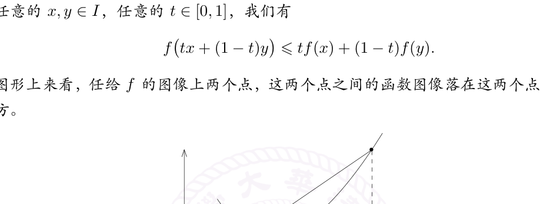
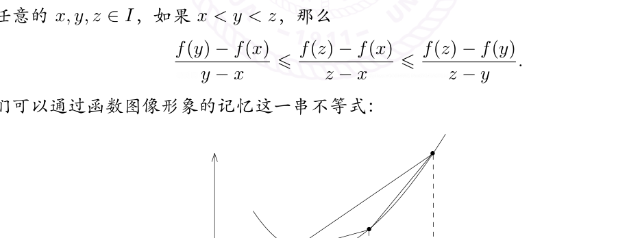
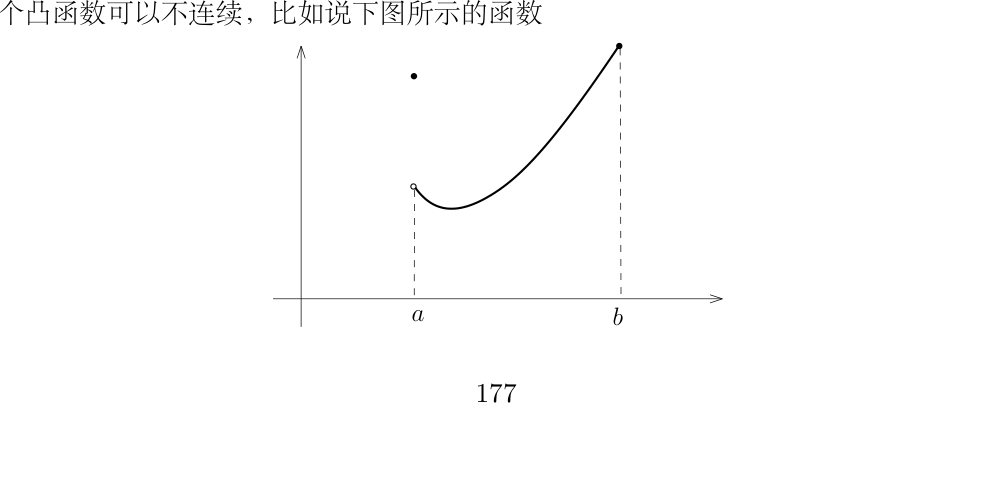
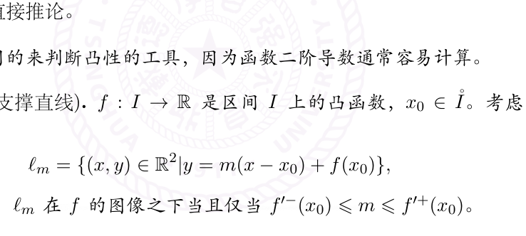

# 凸函数与 Jensen 不等式

[返回讲义目录](../../../math-analysis-lecture-notes.md) · [学期目录](../../01-math-analysis-i.md) · [章节目录](../17-convexity.md) · [校勘记录](../../errata.md) · [上一篇：空间填充曲线、L’Hôpital 法则与 Taylor 展开](../16-lhopital-taylor.md) · [下一篇：17.1 作业:Émile Borel引理,Peano的证明](17-03-p0183-0188.md)

<!-- source: PDF 175; printed: 175; transcription: first-pass; proofreading: applied -->

## 17 凸函数，利用 Jensen 不等式证明常见的不等式

### 微分的应用：凸函数的性质和常用不等式

我们给出凸函数的五种刻画：

**定理 106.** $I$ 是 $\mathbb{R}$ 上的区间，给定 $I$ 上定义的实值函数 $f : I \to \mathbb{R}$。那么，五个性质是等价的：

*1)* 对任意的 $x, y \in I$，任意的 $t \in [0, 1]$，我们有

$$f\bigl(tx + (1-t)y\bigr) \leqslant tf(x) + (1-t)f(y).$$

从图形上来看，任给 $f$ 的图像上两个点，这两个点之间的函数图像落在这两个点所连线段的下方。

*2)* 对任意的 $x, y, z \in I$，如果 $x < y < z$，那么

$$\frac{f(y)-f(x)}{y-x} \leqslant \frac{f(z)-f(x)}{z-x} \leqslant \frac{f(z)-f(y)}{z-y}.$$

我们可以通过函数图像形象的记忆这一串不等式：

*3)* 对任意 $a \in I$，如下定义的函数

$$I - \{a\} \to \mathbb{R},\quad x \mapsto \frac{f(x)-f(a)}{x-a},$$

是变量 $x$ 的增函数。

<!-- source: PDF 176; printed: 176; transcription: first-pass; proofreading: applied -->

*4)* 对任意的 $x, y, z \in I$，如果 $x < y < z$，那么

$$\det\begin{pmatrix} 1 & 1 & 1 \\ x & y & z \\ f(x) & f(y) & f(z) \end{pmatrix} \geqslant 0.$$

*5)* 集合 $\Gamma_{\geqslant f} = \bigl\{(x,y) \mid x \in I,\, y \geqslant f(x)\bigr\} \subset \mathbb{R}^2$（即函数图像上方的部分）是凸集

如果函数 $f$ 满足上述条件之一，我们就称 $f$ 是**凸函数**。如果 $-f$ 是凸函数，我们就称 $f$ 是**凹函数**。

**注记.** $V$ 是 $\mathbb{R}$-线性空间，$C \subset V$ 是子集。如果对任意的 $x, y \in C$，任意的 $t \in [0,1]$，$tx+(1-t)y \in C$，即 $x$ 和 $y$ 所连线段落在 $C$ 中，我们就称 $C$ 是**凸集**。

**注记.** 上述对凸性的刻画本质上是几何的，叙述中并没有涉及到函数的连续性等。有意思的是，凸性的几何定义可以推出函数的若干分析性质，比如连续性、可微性之类的。

**证明：** 我们转一圈来证明前面四个命题之间的等价性：

1) $\Rightarrow$ 2) 由于 $y \in (x,z)$，所以存在 $t \in (0,1)$，使得 $y = tx + (1-t)z$，其中 $t = \dfrac{y-z}{x-z}$。所以，

$$f(y) \leqslant tf(x) + (1-t)f(z) = \frac{y-z}{x-z}f(x) + \frac{x-y}{x-z}f(z).$$

这个不等式等价于 2) 中的不等式（直接计算）。

2) $\Leftrightarrow$ 3) 2) 中左侧的不等式讲的就是这个函数是递增的。

3) $\Rightarrow$ 4) 我们注意到

$$\det\begin{pmatrix} 1 & 1 & 1 \\ x & y & z \\ f(x) & f(y) & f(z) \end{pmatrix} = (z-x)(y-x)\left(\frac{f(z)-f(x)}{z-x} - \frac{f(y)-f(x)}{y-x}\right).$$

利用 3) 中的单调性，这个值明显是非负的。

4) $\Rightarrow$ 1) 我们不妨设 $x \leqslant y$，我们对下面的式子展开：

$$\det\begin{pmatrix} 1 & 1 & 1 \\ x & tx+(1-t)y & y \\ f(x) & f(tx+(1-t)y) & f(y) \end{pmatrix} \geqslant 0.$$

这等价于

$$(y-x)\Bigl((1-t)\bigl(f(y)-f(x)\bigr) - \bigl(f(tx+(1-t)y)-f(x)\bigr)\Bigr) \geqslant 0.$$

整理立得。

<!-- source: PDF 177; printed: 177; transcription: first-pass; proofreading: applied -->

最终，我们来证明5) $\Leftrightarrow$ 1)：假设 $\Gamma_{\geqslant f}$ 是凸集，那么对任意的 $x, y \in I$，我们有 $(x, f(x)), (y, f(y)) \in \Gamma_{\geqslant f}$，所以，对任意的 $t \in [0, 1]$，我们有

$$
(tx + (1-t)y,\, tf(x) + (1-t)f(y)) \in \Gamma_{\geqslant f}.
$$

按照 $\Gamma_{\geqslant f}$ 的定义，我们有 $f(tx + (1-t)y) \leqslant tf(x) + (1-t)f(y)$。

反之，假设1) 成立，任选 $(x_1, y_1), (x_2, y_2) \in \Gamma_{\geqslant f}$，按照定义 $y_1 \geqslant f(x_1)$，$y_2 \geqslant f(x_2)$。考虑这两个点所连线段上的任意一个点 $(x, y) = t(x_1, y_1) + (1-t)(x_2, y_2)$，其中 $t \in [0, 1]$。根据1)，我们知道

$$
f(x) \leqslant tf(x_1) + (1-t)f(x_2) \leqslant ty_1 + (1-t)y_2 = y,
$$

所以 $(x, y) \in \Gamma_{\geqslant f}$。$\square$

根据等价定义中的第一条，我们可以证明：

**命题 107** (Jensen 不等式). 假设 $f : I \to \mathbb{R}$ 是凸函数，那么对任意的 $x_1, \cdots, x_n \in I$ 和任意的 $t_1, \cdots, t_n \in [0, 1]$，其中 $t_1 + t_2 + \cdots + t_n = 1$，我们有

$$
f(t_1 x_1 + \cdots + t_n x_n) \leqslant t_1 f(x_1) + \cdots + t_n f(x_n).
$$

**证明：** 我们对 $n$ 进行归纳。$n = 2$ 时，这是定义；假设对 $n$ 成立，考虑 $n+1$ 的情形。对任意给定的 $x_1, \cdots, x_{n+1} \in I$，$t_1, \cdots, t_{n+1} \in [0, 1]$，其中 $t_1 + t_2 + \cdots + t_{n+1} = 1$。当 $t_{n+1}=1$ 时结论显然；以下设 $t_{n+1}<1$，我们有

$$
f(t_1 x_1 + \cdots + t_n x_n + t_{n+1} x_{n+1}) = f\!\left((1 - t_{n+1})\frac{t_1 x_1 + \cdots + t_n x_n}{1 - t_{n+1}} + t_{n+1} x_{n+1}\right).
$$

不难看出，$\dfrac{t_1 x_1 + \cdots + t_n x_n}{1 - t_{n+1}} \in I$，此时我们用等价定义中的第一条，就得到

$$
\begin{aligned}
f(t_1 x_1 + \cdots + t_n x_n + t_{n+1} x_{n+1}) &\leqslant (1 - t_{n+1}) f\!\left(\frac{t_1}{1 - t_{n+1}} x_1 + \cdots + \frac{t_n}{1 - t_{n+1}} x_n\right) + t_{n+1} f(x_{n+1}) \\
&\leqslant (1 - t_{n+1}) \left(\frac{t_1}{1 - t_{n+1}} f(x_1) + \cdots + \frac{t_n}{1 - t_{n+1}} f(x_n)\right) + t_{n+1} f(x_{n+1}) \\
&= t_1 f(x_1) + \cdots + t_{n+1} f(x_{n+1}).
\end{aligned}
$$

这就完成了证明。$\square$

**注记.** 我们会利用这个命题来证明很多经典的不等式。

一个凸函数可以不连续，比如说下图所示的函数

<!-- source: PDF 178; printed: 178; transcription: first-pass; proofreading: applied -->

它在左端点处不连续。然而,这是一个凸函数可能不连续的唯一方式:

**定理 108.** $I \subset \mathbb{R}$ 是区间，$f : I \to \mathbb{R}$ 是凸函数，我们令 $\mathring{I}$ 为 $I$ 的内部（对于 $I = [a,b], [a,b), (a,b]$ 或 $(a,b)$，那么 $\mathring{I} = (a,b)$），那么

1) $f \in C(\mathring{I})$。

2) 对任意的 $x_0 \in \mathring{I}$，$f$ 在 $x_0$ 处的左导数 $f'_-(x_0)$ 和右导数 $f'_+(x_0)$ 存在。进一步，它们满足

$$f'_-(x_0) \leqslant f'_+(x_0).$$

3) 对任意的 $x, y \in \mathring{I}$，如果 $x < y$，那么我们有

$$f'_-(x) \leqslant \frac{f(y) - f(x)}{y - x} \leqslant f'_+(y).$$

4) 左右导数 $f'^{\pm} : \mathring{I} \to \mathbb{R}$ 是递增的函数。

**证明：** 任意选定 $x_0 \in \mathring{I}$。存在 $h_1, h_2 > 0$，$x_0 - h_1, x_0 + h_2 \in \mathring{I}$，对三个点 $x_0 - h_1, x_0$ 和 $x_0 + h_2$ 用凸性的第二个等价定义，我们得到

$$\frac{f(x_0) - f(x_0 - h_1)}{h_1} \leqslant \frac{f(x_0 + h_2) - f(x_0)}{h_2},$$

根据凸性的第三个等价定义，由于上述不等式的右边是 $h_2$ 的增函数，令 $h_2 \to 0$，我们立即得到右导数的存在性；类似地，如果令 $h_1 \to 0$，我们就得到左导数存在性。既然左右导数都存在，那么，$f$ 自然在 $\mathring{I}$ 上连续。

为了证明 3)，我们先令 $h_2 \to 0$，从而，

$$\frac{f(x_0) - f(x_0 - h_1)}{h_1} \leqslant f'_+(x_0),$$

令 $x_0 = y$，$x_0 - h_1 = x$，我们就得到了 3) 中不等式的右边；左边类似可得。

为了证明 4)，我们考虑 3) 中的不等式

$$f'_-(x) \leqslant \frac{f(x) - f(y)}{x - y} \leqslant \frac{f(x) - f(z)}{x - z},$$

其中 $x < z < y$，后一个不等式是运用凸性的第三个等价定义。再令 $z \to x$（$z > x$）就证明了结论。$\square$

上述分析性质基本上刻画了凸函数：

**定理 109.** 假设 $I$ 是**开**区间，$f : I \to \mathbb{R}$ 是函数。如下两个性质等价：

1) $f$ 是凸函数；

2) $f$ 是连续函数，$f$ 的右导数处处存在并且是增函数。

<!-- source: PDF 179; printed: 179; transcription: first-pass; proofreading: applied -->

**证明：** 只要说明 2)$\Rightarrow$ 1) 即可：我们固定 $I$ 中的三个点 $x < y < z$，对任意的 $t \in [y, z]$，我们有 $f'_+(y) \leqslant f'_+(t) \leqslant f'_+(z)$。我们定义函数

$$g : [y, z] \to \mathbb{R}, \quad t \mapsto f(t) - t f'_+(y).$$

那么，对于 $t \in (y, z)$，$g$ 在 $t$ 处的右导数 $g'_+(t) = f'_+(t) - f'_+(y) \geqslant 0$。把这个和导数的性质做类比，我们想说明 $g$ 是 $t \in (y, z)$ 的增函数：

**引理 110.** 假设 $g : [a, b] \to \mathbb{R}$ 是连续函数并且右导数在每个点处都定义。如果对任意的 $t \in (a, b)$，我们都有 $g'_+(t) \geqslant 0$，那么 $g(a) \leqslant g(b)$。

先假设引理是成立的，那么我们有 $g(z) \geqslant g(y)$，经过整理，我们得到

$$f'_+(y) \leqslant \frac{f(z) - f(y)}{z - y}.$$

类似地，我们可以证明

$$f'_+(y) \geqslant \frac{f(y) - f(x)}{y - x}.$$

从而，

$$\frac{f(y) - f(x)}{y - x} \leqslant \frac{f(z) - f(y)}{z - y}.$$

所以，我们有

$$\det \begin{pmatrix} 1 & 1 & 1 \\ x & y & z \\ f(x) & f(y) & f(z) \end{pmatrix} = \det \begin{pmatrix} 1 & 0 & 0 \\ x & y-x & z-y \\ f(x) & f(y)-f(x) & f(z)-f(y) \end{pmatrix} \geqslant 0.$$

这表明 $f$ 是凸函数。$\square$

**引理的证明.**（证明的重要想法：退 $\varepsilon$-步海阔天空）任意选定 $\varepsilon > 0$，令

$$\varphi_\varepsilon : [a, b] \to \mathbb{R}, \quad x \mapsto -(g(x) - g(a)) - \varepsilon(x - a).$$

此时，$\varphi'^+_\varepsilon \leqslant -\varepsilon < 0$，我们实质上想证明这是一个递减的函数，如果成立的话，那么

$$\varphi_\varepsilon(a) \geqslant \varphi_\varepsilon(b) \Rightarrow \underbrace{0 \geqslant \varphi_\varepsilon(b)}_{\text{过渡的结论}} \Rightarrow g(b) - g(a) \geqslant -\varepsilon(b - a).$$

令 $\varepsilon \to 0$ 就得到了要证明的结论。

我们现在直接证明上述过渡的结论。为此，定义

$$X_\varepsilon = \left\{ x \in [a, b] \,\middle|\, \varphi_\varepsilon(x) \leqslant \varepsilon \right\}$$

由于 $X_\varepsilon = [a, b] \cap (\varphi_\varepsilon)^{-1}\bigl((-\infty, \varepsilon]\bigr)$ 是闭集，所以它的上确界 $c = \sup X_\varepsilon \in X_\varepsilon$。我们想证明 $b \in X_\varepsilon$（从而，$\varepsilon \geqslant \varphi_\varepsilon(b)$，令 $\varepsilon \to 0$，过渡性结论就成立了），即要证明 $c = b$。

<!-- source: PDF 180; printed: 180; transcription: first-pass; proofreading: applied -->

因为 $\varphi_\varepsilon(a) = 0$，所以 $a \in X_\varepsilon$。特别地，根据 $\varphi_\varepsilon(x)$ 的连续性，存在 $\delta > 0$，使得 $[a, a+\delta) \subset X_\varepsilon$。所以 $X_\varepsilon \neq \emptyset$ 并且 $c > a$。

我们用反证法证明 $c = b$：如若不然，我们假设 $c < b$。先说明 $\varphi_\varepsilon(c) = \varepsilon$，这因为按照定义 $\varphi_\varepsilon(c) \leqslant \varepsilon$，如果等号不成立，那么 $\varphi_\varepsilon(c) < \varepsilon$，根据 $\varphi_\varepsilon(x)$ 的连续性，存在比 $c$ 略大的数使得其值仍然不超过 $\varepsilon$，这就与 $c = \sup X_\varepsilon$ 矛盾。

其次根据右导数的信息，$\varphi'^+_\varepsilon(c) \leqslant -\varepsilon$，利用右导数的定义，存在 $h_0 > 0$，使得当 $h \in [0, h_0)$ 时，我们有

$$\frac{\varphi_\varepsilon(c + h) - \varphi_\varepsilon(c)}{h} < -\frac{1}{2}\varepsilon.$$

从而，

$$\varphi_\varepsilon(c + h) < \varepsilon - \frac{1}{2}\varepsilon h < \varepsilon.$$

这表明 $[c, c + h_0) \subset X_\varepsilon$，这和 $c$ 是上确界矛盾。$\square$

**推论 111.** 假设 $I \subset \mathbb{R}$ 是开区间，$f$ 是 $I$ 上二次可微的实值函数。如下两个陈述是等价的：

1) $f$ 是凸函数；

2) $f'' \geqslant 0$。

**证明：** 这是上面定理的直接推论。$\square$

**注记.** 这个推论是最常用的来判断凸性的工具，因为函数二阶导数通常容易计算。

**推论 112**（函数图像的支撑直线）. $f : I \to \mathbb{R}$ 是区间 $I$ 上的凸函数，$x_0 \in \mathring{I}$。考虑 $\mathbb{R}^2$ 上的过 $(x_0, f(x_0))$ 直线

$$\ell_m = \{(x, y) \in \mathbb{R}^2 \mid y = m(x - x_0) + f(x_0)\},$$

其中斜率 $m \in \mathbb{R}$。那么，$\ell_m$ 在 $f$ 的图像之下当且仅当 $f'^-(x_0) \leqslant m \leqslant f'^+(x_0)$。

**证明：** 定理的证明过程表明，当 $x > x_0$ 时，我们有

$$f'^+(x_0) \leqslant \frac{f(x) - f(x_0)}{x - x_0} \Rightarrow f(x) \geqslant f(x_0) + (x - x_0)f'^+(x_0).$$

反过来，当 $x < x_0$ 时，我们有

$$f(x) \geqslant f(x_0) + (x - x_0)f'^-(x_0).$$

<!-- source: PDF 181; printed: 181; transcription: first-pass; proofreading: applied -->

据此，当 $m \leqslant f'^+(x_0)$ 时，在 $x_0$ 的右边，该直线在 $f$ 的图像之下；当 $m \geqslant f'^-(x_0)$ 时，在 $x_0$ 的左边，该直线在 $f$ 的图像之下。

反之，假设 $\ell_m$ 在 $f$ 的图像之下，在 $x_0$ 处的右边的时候，我们有 $f(x) \geqslant m(x - x_0) + f(x_0)$，从而

$$f'^+(x_0) = \lim_{x \to x_0^+} \frac{f(x) - f(x_0)}{x - x_0} \geqslant m.$$

类似地，我们可以证明另一边的不等式。$\square$

## 用凸函数证明常见的不等式

我们给出两个例子：Minkowski 不等式和算术-几何平均值不等式。

1) 假设 $p \geqslant 1$，对于 $x \in [0, 1]$，函数 $f(x) = (1 - x^{\frac{1}{p}})^p$ 是凸函数，这因为

$$f'(x) = -x^{\frac{1}{p}-1}\bigl(1 - x^{\frac{1}{p}}\bigr)^{p-1}$$

是递增的函数（求两次导数的表达式不是很简单）。假设 $a_i, b_i \in \mathbb{R}_{\geqslant 0}$ 并且假设 $a_i + b_i \neq 0$，其中 $i = 1, 2, \cdots, n$。我们令

$$x_i = \frac{a_i^p}{(a_i + b_i)^p}, \quad t_i = \frac{(a_i + b_i)^p}{\displaystyle\sum_{k=1}^{n}(a_k + b_k)^p}.$$

Jensen 不等式给出了如下所谓的 Minkowski 不等式：

$$\Bigl(\sum_{k=1}^{n}(a_k + b_k)^p\Bigr)^{\frac{1}{p}} \leqslant \Bigl(\sum_{k=1}^{n}a_k^p\Bigr)^{\frac{1}{p}} + \Bigl(\sum_{k=1}^{n}b_k^p\Bigr)^{\frac{1}{p}}.$$

作为推论，对于线性空间 $V = \mathbb{R}^n$，我们定义

$$\|x\|_p = \Bigl(\sum_{k=1}^{n}|x_k|^p\Bigr)^{\frac{1}{p}},$$

其中，$x = (x_1, \cdots, x_n)$。此时，Minkowski 不等式讲的是

$$\|x\|_p + \|y\|_p \geqslant \|x + y\|_p.$$

这表明 $\|x\|_p$ 是范数（$p = 2$ 或者 $1$ 我们更熟悉）。另外，我们还可以采取如下的范数：

$$\|x\|_\infty = \sup_{k \leqslant n} |x_k|.$$

2) 函数 $-\log x$ 是 $\mathbb{R}_{>0}$ 上的凸函数，这因为

$$(-\log x)'' = \frac{1}{x^2} \geqslant 0$$

<!-- source: PDF 182; printed: 182; transcription: first-pass; proofreading: applied -->

假设 $x_1, \cdots, x_n$ 是正数，根据 Jensen 不等式，我们有

$$-\log\left(\frac{1}{n}x_1 + \cdots + \frac{1}{n}x_n\right) \leqslant -\frac{1}{n}\log(x_1) - \cdots - \frac{1}{n}\log(x_n).$$

这个等价于算术-几何平均值不等式：

$$\frac{1}{n}\left(x_1 + \cdots + x_n\right) \geqslant \left(x_1 \cdots x_n\right)^{\frac{1}{n}}.$$

[返回讲义目录](../../../math-analysis-lecture-notes.md) · [学期目录](../../01-math-analysis-i.md) · [章节目录](../17-convexity.md) · [校勘记录](../../errata.md) · [上一篇：空间填充曲线、L’Hôpital 法则与 Taylor 展开](../16-lhopital-taylor.md) · [下一篇：17.1 作业:Émile Borel引理,Peano的证明](17-03-p0183-0188.md)
