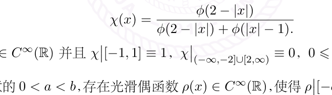

# 17.1：作业：Émile Borel引理，Peano的证明

[返回讲义目录](../../../math-analysis-lecture-notes.md) · [学期目录](../../01-math-analysis-i.md) · [章节目录](../17-convexity.md) · [校勘记录](../../errata.md) · [上一篇：凸函数与 Jensen 不等式](17-01-p0175-0182.md) · [下一篇：Riemann 积分的定义](../18-riemann-integral.md)

<!-- source: PDF 183; printed: 183; transcription: first-pass; proofreading: applied -->

<!-- math-analysis-layout: document-title-normalized -->

## 基本习题

### 中值定理与泰勒展开

**习题 A：中值定理和 Taylor 展开**

如果不额外说明，$f$ 总代表一个区间 $I$ 上定义的函数。

A1) 设 $f$ 在点 $x$ 处有二阶导数。证明，下面的极限给出了二阶导数：

$$f''(x) = \lim_{h \to 0} \frac{f(x+h) + f(x-h) - 2f(x)}{h^2}$$

A2)（Taylor 展开式的唯一性，Peano 余项）。假设 $f$ 是 $x_0$ 附近的函数，并且当 $x \to x_0$ 时，满足

$$f(x) = a_0 + a_1(x - x_0) + a_2(x - x_0)^2 + \cdots + a_n(x - x_0)^n + o(|x - x_0|^n)$$

$$= b_0 + b_1(x - x_0) + b_2(x - x_0)^2 + \cdots + b_n(x - x_0)^n + o(|x - x_0|^n)$$

其中 $a_i, b_i, i = 0, \cdots, n$ 是实数，那么，对任意的 $i$，我们都有 $a_i = b_i$。

A3) 假设 $f$ 在 $0$ 处有 $n$ 阶导数。证明，如果 $f(x)$ 是偶函数（奇函数），$f$ 在 $0$ 处的 Taylor 展开式（Peano 余项）中只有 $x$ 的偶次项（奇数项）。

A4)（Rolle 定理的简单推广）设函数在有限或无穷的区间 $(a, b)$ 上可微并且 $\lim_{x \to a^+} f(x) = \lim_{x \to b^-} f(x)$。证明，存在 $x_0 \in (a, b)$，使得 $f'(x_0) = 0$。

A5) 设函数 $f \in C^0([a, b])$ 并且在 $(a, b)$ 上可微。证明，$f$ 在 $[a, b]$ 上严格递增的充分必要条件是对任意 $x \in (a, b)$，$f'(x) \geqslant 0$ 并且在任意子区间 $(c, d) \subset (a, b)$ 上，$f'(x)$ 不恒等于 $0$。

A6) $g \in C(\mathbb{R})$ 在 $\mathbb{R}$ 上可微。假设存在常数 $M$，使得 $\sup_{x \in \mathbb{R}} |g'(x)| \leqslant M$。对任意的 $\varepsilon > 0$，我们定义

$$f_\varepsilon(x) = x + \varepsilon g(x).$$

证明，存在仅依赖于 $M$ 的常数 $\delta = \delta(M) > 0$，使得当 $\varepsilon < \delta$ 时，$f : \mathbb{R} \to \mathbb{R}$ 是双射。

A7) 设函数 $f$ 在 $[a, b]$ 上有两阶导数并且 $f'(a) = f'(b) = 0$。证明，存在 $c \in (a, b)$ 使得

$$|f''(c)| \geqslant \frac{4}{(b-a)^2} |f(b) - f(a)|$$

<!-- source: PDF 184; printed: 184; transcription: first-pass; proofreading: applied -->

A8) 假设 $f$ 在 $\mathbb{R}$ 上二次可导，对 $k = 0, 1, 2$，我们假设 $M_k = \sup_{x \in \mathbb{R}} |f^{(k)}(x)|$ 都是有限的。证明，$M_1^2 \leq 2M_0 M_2$。

A9) 假设 $f$ 在 $(0, +\infty)$ 上二次可导，$f''$ 在 $(0, +\infty)$ 上有界并且 $\lim_{x \to +\infty} f(x) = 0$。证明，$\lim_{x \to +\infty} f'(x) = 0$。

### 洛必达法则与极值

**习题 B** 用 L'Hôpital 法则求极限：

$$\begin{aligned}
&(1)\ \lim_{x \to +\infty} \frac{\log x}{x^a}, \quad a > 0 \qquad
(2)\ \lim_{x \to +\infty} \frac{x^a}{b^x}, \quad a > 0, b > 1 \qquad
(3)\ \lim_{x \to 0} \frac{e^{ax} - e^{bx}}{\sin ax - \sin bx} \\
&(4)\ \lim_{x \to 0} \frac{\tan x - x}{x - \sin x} \qquad
(5)\ \lim_{x \to 0} \frac{1 - \cos x^2}{x^2 \sin x^2} \qquad
(6)\ \lim_{x \to 1} \frac{\sqrt{2x - x^4} - \sqrt[3]{x}}{1 - x^{4/3}} \\
&(7)\ \lim_{x \to 1^-} \log(x) \log(1-x) \qquad
(8)\ \lim_{x \to 0^+} \frac{\log \sin ax}{\log \sin bx}, \quad a, b > 0 \qquad
(9)\ \lim_{x \to 0^+} x^x \\
&(10)\ \lim_{x \to 1} x^{\frac{1}{1-x}} \qquad
(11)\ \lim_{x \to 1} \left( \frac{1}{\log x} - \frac{1}{x-1} \right) \qquad
(12)\ \lim_{x \to 0^+} (\sin x)^x \\
&(13)\ \lim_{x \to 0} \left( \frac{\sin x}{x} \right)^{1/(1-\cos x)} \qquad
(14)\ \lim_{x \to a} \frac{a^x - x^a}{x - a}, \quad a > 0 \qquad
(15)\ \lim_{x \to +\infty} \frac{(1 + 1/x)^x - e}{1/x} \\
&(16)\ \lim_{x \to +\infty} \frac{x^{\log x}}{(\log x)^x} \qquad
(17)\ \lim_{x \to +\infty} \left[ (x+a)^{1+1/x} - x^{1 + \frac{1}{x+a}} \right]
\end{aligned}$$

$$(18)\ \lim_{x \to +\infty} \left[ \sqrt[3]{x^3 + x^2 + x + 1} - \sqrt{x^2 + x + 1} \cdot \frac{\log(e^x + x)}{x} \right]$$

**习题 C** 求下列函数在给定区间上的最大值和最小值：

1) $f(x) = x^4 - 2x^2 + 5$，$x \in [-2, 2]$；

2) $f(x) = \dfrac{2x}{1 + x^2}$，$x \in \mathbb{R}$；

3) $f(x) = \arctan x - \dfrac{1}{2} \log(1 + x^2)$；

4) $f(x) = x \log x$，$x \in (0, +\infty)$；

5) $f(x) = \sqrt{x} \log x$，$x \in (0, +\infty)$；

6) $f(x) = 2\tan x - \tan^2 x$，$x \in [0, \frac{\pi}{2})$。

**习题 D**（极大值的判定，**重要**）$f$ 在 $(a, b)$ 上可微。假设对于 $x_0 \in (a, b)$，我们有 $f'(x_0) = 0$。

D1) 证明，$f$ 在 $x_0$ 处取局部极大值的一个充分条件是：存在某一邻域 $(x_0 - \delta, x_0 + \delta) \subset (a, b)$，使得

$$f'(x) = \begin{cases} > 0, & \text{对所有的} \ x \in (x_0 - \delta, x_0); \\ < 0, & \text{对所有的} \ x \in (x_0, x_0 + \delta). \end{cases}$$

D2)（**最重要的判别方法，有很多应用**）证明，如果 $f''(x_0)$ 存在并且 $f''(x_0) < 0$，那么 $f$ 在 $x_0$ 处取局部极大值。

D3) 假定 $f$ 在 $x_0$ 处有 $n$ 阶导数，$f'(x_0) = \cdots = f^{(n-1)}(x_0) = 0$ 并且 $f^{(n)}(x_0) \neq 0$，试讨论 $f$ 在 $x_0$ 处取局部极大值的条件（对 $n$ 分奇偶讨论）。

<!-- source: PDF 185; printed: 185; transcription: first-pass; proofreading: applied -->

**习题 E**（提示：利用中值定理和 $n$-次多项式的至多（恰好）有 $n$ 个根）

E1) 证明，如果实系数多项式 $P_n(x) = a_n x^n + a_{n-1} x^{n-1} + \cdots + a_0$ 的根都是实数（不妨设 $a_n \neq 0$），那么它的逐次导函数 $P_n'(x)$，$P_n''(x)$，$\cdots$，$P_n^{(n-1)}(x)$ 的根也都是实数。

E2) 证明，Legendre 多项式 $P_n(x) = \dfrac{1}{2^n n!} \dfrac{d^n}{dx^n}(x^2-1)^n$ 的根都是实数并且包含于区间 $(-1,1)$ 中。

E3) 证明，$L_n(x) = \dfrac{e^x}{n!} \dfrac{d^n}{dx^n}(e^{-x} x^n)$ 是多项式（被称作是 Laguerre 多项式）并且它所有的根都是正实数。

E4) 证明，$H_n(x) = (-1)^n e^{x^2} \dfrac{d^n}{dx^n}(e^{-x^2})$ 是多项式（被称作是 Hermite 多项式）并且它所有的根都是实数。

### 光滑函数与指定导数

**习题 F**（Émile Borel 引理）

第一部分：截断函数的构造

F1) 定义函数 $\phi : \mathbb{R} \to \mathbb{R}$：

$$\phi(x) = \begin{cases} e^{-\frac{1}{x^2}}, & x > 0; \\ 0, & x \leqslant 0. \end{cases}$$

证明，$\phi \in C^\infty(\mathbb{R})$。

F2) 定义函数 $\chi : \mathbb{R} \to \mathbb{R}$：

$$\chi(x) = \frac{\phi(2 - |x|)}{\phi(2 - |x|) + \phi(|x| - 1)}.$$

证明，$\chi(x) \in C^\infty(\mathbb{R})$ 并且 $\chi\big|_{[-1,1]} \equiv 1$，$\chi\big|_{(-\infty,-2]\cup[2,\infty)} \equiv 0$，$0 \leqslant \chi(x) \leqslant 1$ 并且是偶函数。

F3) 证明，对任意的 $0 < a < b$，存在光滑偶函数 $\rho(x) \in C^\infty(\mathbb{R})$，使得 $\rho\big|_{[-a,a]} \equiv 1$，$\rho\big|_{(-\infty,-b]\cup[b,\infty)} \equiv 0$，$0 \leqslant \rho(x) \leqslant 1$。

F4) 证明，存在偶函数 $\psi \in C^\infty(\mathbb{R}^n)$，使得 $\psi\big|_{\{x\,|\,|x|\leqslant 1\}} \equiv 1$，$\psi\big|_{\{x\,|\,|x|\geqslant 2\}} \equiv 0$，$0 \leqslant \psi(x) \leqslant 1$。

第二部分：逐项求导定理

$I = [a,b]$ 是闭区间，$\{f_k\}_{k\geqslant 0}$ 是 $C^1(I)$ 的一列函数，我们假设 $\displaystyle\sum_{k=0}^{\infty} f_k$ 在 $I$ 上逐点收敛，即对任意的 $x \in I$，$\displaystyle\sum_{k=0}^{\infty} f_k(x)$ 收敛，我们记 $f(x) = \displaystyle\sum_{k=0}^{\infty} f_k(x)$。

<!-- source: PDF 186; printed: 186; transcription: first-pass; proofreading: applied -->

F5) 我们假设函数级数 $\displaystyle\sum_{k=0}^{\infty} f'_k(x)$ 在 $I$ 上绝对收敛，即数项的级数 $\displaystyle\sum_{k=0}^{\infty} \|f'_k\|_\infty$ 收敛，其中 $\|f\|_\infty = \sup_{x\in I}|f(x)|$。证明，$f$ 是可导的并且 $f'(x) = \displaystyle\sum_{k=0}^{\infty} f'_k(x)$。（提示：设法将求和拆 $\displaystyle\sum_{k=0}^{\infty} = \sum_{k=0}^{N} + \sum_{k=N+1}^{\infty}$）

F6)（逐项求导定理）$I = [a, b]$ 是闭区间，$\{f_k\}_{k\geqslant 0}$ 是 $C^1(I)$ 的一列函数，我们假设 $\displaystyle\sum_{k=0}^{\infty} f_k$ 在 $I$ 上逐点收敛。如果函数级数 $\displaystyle\sum_{k=0}^{\infty} f'_k(x)$ 在 $I$ 上一致收敛，那么 $f$ 是可导的并且 $f'(x) = \displaystyle\sum_{k=0}^{\infty} f'_k(x)$。

F7) 试利用逐项求导定理计算 $e^x$ 的导数。

第三部分：Borel 引理的证明

我们现在任意给定一个数列 $\{a_k\}_{k\geqslant 0}$。

F8) 对任意给定的正数 $t_k > 0$，试计算函数 $f_k(x) = \dfrac{a_k}{k!} x^k \chi(t_k x)$ 在 $x = 0$ 处的任意阶导数（包括零阶）。

F9) 证明，当 $k \geqslant 2n$ 时，我们有

$$f_k^{(n)}(x) = a_k \sum_{\ell=0}^{n} \binom{n}{\ell} \frac{t_k^{n-\ell}}{(k-\ell)!} x^{k-\ell} \chi^{(n-\ell)}(t_k x).$$

F10)（Borel 引理）任意给定一个数列 $\{a_k\}_{k\geqslant 0}$，证明，存在 $\mathbb{R}$ 上的光滑函数 $f$，使得对任意的 $k \geqslant 0$，$f^{(k)}(0) = a_k$。（提示：略难。）

第四部分：Peano 对 Borel 引理的证明（选做部分）

F11) $\{c_k\}_{k\geqslant 0}$ 和 $\{b_k\}_{k\geqslant 0}$ 是两个序列，其中 $b_k$ 都是正数。证明，

$$\left(\frac{c_k x^k}{1 + b_k x^2}\right)^{(n)}(0) = \begin{cases} n!(-1)^j c_{n-2j} b_{n-2j}^j, & \text{若 } k = n-2j,\ j \in \mathbb{Z}_{\geqslant 0}; \\ 0, & \text{其它情形.} \end{cases}$$

F12) 证明，存在常数 $C$，对任意的 $k \geqslant n+2$，对任意的 $x$，我们有

$$\left|\left(\frac{c_k x^k}{1 + b_k x^2}\right)^{(n)}(x)\right| \leqslant C(n+1)! \frac{|c_k| k!}{b_k} |x|^{k-n-2}.$$

F13) 证明，当 $\{c_k\}_{k\geqslant 0}$ 给定的时候，我们可以选取 $b_k$，使得 $b_k$ 仅依赖于 $c_k$ 的选取，并且函数级数 $f(x) = \displaystyle\sum_{k=0}^{\infty} \dfrac{c_k x^k}{1 + b_k x^2}$ 是无限次可微分的。

<!-- source: PDF 187; printed: 187; transcription: first-pass; proofreading: applied -->

F14) 证明，$f(0) = c_0$，$f'(0) = c_1$，并且当 $n \geqslant 2$ 时，我们有

$$\frac{f^{(n)}(0)}{n!} = c_n + \sum_{j=1}^{\lfloor n/2 \rfloor} (-1)^j c_{n-2j} b_{n-2j}^j.$$

F15) 证明，我们可以通过恰当的选取 $\{c_k\}_{k\geqslant 0}$ 和 $\{b_k\}_{k\geqslant 0}$ 来证明 Borel 引理。

## 以下为上学期期中考试的 B 部分，供同学参考

**题目 B** 考虑在整个实数上定义的函数 $f : \mathbb{R} \to \mathbb{R}$。

- 如果存在正实数 $A$（不是无穷），使得对任意的 $x \in \mathbb{R}$，都有 $|f(x)| \leqslant A$，我们就称 $f$ 是有界的。我们将 $\mathbb{R}$ 上定义的所有有界函数的集合记作 $\mathcal{B}$。

- 如果存在正实数 $B$（不是无穷），使得对任意的 $x, y \in \mathbb{R}$，都有 $|f(x) - f(y)| \leqslant B|x - y|$，我们就称 $f$ 是 Lipschitz 函数。我们将 $\mathbb{R}$ 上定义的所有 Lipschitz 函数的集合记作 $\mathcal{L}$。

假设 $a, \lambda \in \mathbb{R}$，$f \in \mathcal{B} \cap \mathcal{L}$，这个问题的目的是找到一个函数 $F \in \mathcal{L}$ 来解下面的函数方程：

$$F(x) - \lambda F(x + a) = f(x), \quad x \in \mathbb{R}. \quad \cdots\cdots(\star)$$

### 第一部分：Lipschitz 函数的基本性质

B1) 证明，如果 $f, g \in \mathcal{B} \cap \mathcal{L}$，那么它们的乘积 $fg \in \mathcal{L}$。

B2) 证明，如果 $f$ 是 $\mathbb{R}$ 上的可微函数并且 $f \in \mathcal{L}$，那么 $f' \in \mathcal{B}$。

B3) 证明，如果 $f$ 是 $\mathbb{R}$ 上的可微函数并且 $f' \in \mathcal{B}$，那么 $f \in \mathcal{L}$。

B4) 如果 $f \in \mathcal{B}$ 并且存在正实数 $B$，使得对任意的 $x, y \in \mathbb{R}$，$|x - y| \leqslant 1$，我们都有 $|f(x) - f(y)| \leqslant B|x - y|$，证明，$f \in \mathcal{L}$。

### 第二部分：当 $|\lambda| < 1$ 时，方程 $(\star)$ 的解，其中 $f \in \mathcal{B} \cap \mathcal{L}$。

我们在这一部分假设 $|\lambda| < 1$。

B5) 假设 $F$ 满足 $(\star)$，证明，对任意的 $x \in \mathbb{R}$ 和 $n \in \mathbb{Z}_{\geqslant 1}$，我们都有

$$F(x) = \lambda^n F(x + na) + \sum_{k=0}^{n-1} \lambda^k f(x + ka) \quad \text{和} \quad F(x) = \lambda^{-n} F(x - na) - \sum_{k=0}^{n-1} \lambda^{-k} f(x - ka).$$

请任选其一来证明即可。

<!-- source: PDF 188; printed: 188; transcription: first-pass; proofreading: applied -->

B6) 证明，对任意的 $x \in \mathbb{R}$，级数 $\displaystyle\sum_{k\geqslant 0} \lambda^k f(x+ka)$ 是收敛的。

B7) 根据上述，对每个 $x \in \mathbb{R}$，我们定义 $F(x) = \displaystyle\sum_{k\geqslant 0} \lambda^k f(x+ka)$。证明，$F \in \mathcal{L}$ 并且解方程 $(\star)$。

B8) 证明，如果 $F_1, F_2 \in \mathcal{L}$ 都满足方程 $(\star)$，那么 $F_1 = F_2$。

B9) 在 $(\star)$ 中取函数 $f(x) \equiv 1$，试求方程的解 $F_1$；

在 $(\star)$ 中取函数 $f(x) = \cos(x)$，证明，$F_2(x) = \dfrac{\cos(x) - \lambda\cos(x-a)}{1 - 2\lambda\cos(a) + \lambda^2}$ 是 $(\star)$ 的解。

**第三部分：当 $|\lambda| > 1$ 时，方程 $(\star)$ 的解，其中 $f \in \mathcal{B} \cap \mathcal{L}$。**

B10) 参照第二部分的结论，试陈述当 $|\lambda| > 1$ 时应当如何来解方程。你的陈述不要超过 100 个汉字。

B11) 当 $|\lambda| > 1$ 时，在 $(\star)$ 中取函数 $f(x) \equiv 1$，试求方程的解 $F_1$；当 $|\lambda| > 1$ 时，在 $(\star)$ 中取函数 $f(x) = \cos(x)$，试求 $(\star)$ 的解 $F_2(x)$。

**第四部分：当 $|\lambda| = 1$ 时的情形。**

B12) 假设 $\lambda = 1$。证明，存在非零的函数 $F \in \mathcal{L}$，使得对任意的 $x$，我们都有 $F(x) - F(x+a) = 0$。

B13) 假设 $\lambda = 1$。在 $(\star)$ 中取函数 $f(x) = \cos(x)$。证明，如果 $\cos(a) \neq 1$，那么存在 $F \in \mathcal{L}$ 是 $(\star)$ 的解。进一步阐述这个解是否唯一？

B14) 假设 $\lambda = 1$。在 $(\star)$ 中取函数 $f(x) = \cos(x)$。证明，如果 $a = 2\pi$，那么我们不能在 $\mathcal{L}$ 中找到 $F$，使得 $F$ 是 $(\star)$ 的解。

B15) 假设 $\lambda = -1$。证明，存在非零的函数 $F \in \mathcal{L}$，使得对任意的 $x$，我们都有 $F(x) + F(x+a) = 0$。

B16) 假设 $\lambda = -1$，$a = 1$，$f \in \mathcal{L}$，$f$ 是递减的并且 $\displaystyle\lim_{x \to +\infty} f(x) = 0$，$f$ 可微并且 $f'$ 是递增的。证明，存在 $F \in \mathcal{L}$，解如下方程：

$$F(x) + F(x+1) = f(x), \quad x \in \mathbb{R}.$$

进一步，如果我们要求 $F \in \mathcal{L}$ 并且 $\displaystyle\lim_{x \to +\infty} F(x) = 0$，那么这样的解是存在唯一的。

[返回讲义目录](../../../math-analysis-lecture-notes.md) · [学期目录](../../01-math-analysis-i.md) · [章节目录](../17-convexity.md) · [校勘记录](../../errata.md) · [上一篇：凸函数与 Jensen 不等式](17-01-p0175-0182.md) · [下一篇：Riemann 积分的定义](../18-riemann-integral.md)
