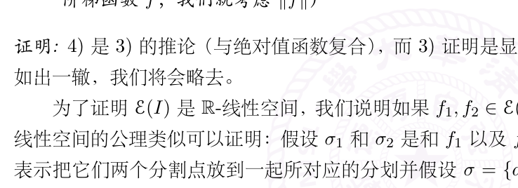

# 18：Riemann 积分的定义

[返回讲义目录](../../math-analysis-lecture-notes.md) · [学期目录](../01-math-analysis-i.md) · [校勘记录](../errata.md) · [上一篇：17.1：作业：Émile Borel引理，Peano的证明](17-convexity/17-03-p0183-0188.md) · [下一篇：Riemann 和与 Darboux 上下和](19-darboux-sums/19-01-p0199-0203.md)

<!-- source: PDF 189; printed: 189; transcription: first-pass; proofreading: applied -->

## 分划与阶梯函数

假设 $a < b$ 是实数，$I = [a, b]$ 是一个闭区间，我们定义所谓的分划的概念：选取 $n + 1$ 个实数 $a_0, a_1, a_2, \cdots, a_n$，使得 $a = a_0 < a_1 < \cdots < a_{n-1} < a_n = b$。这些有序的数将 $I$ 分成了 $n$ 份，

$$I = [a_0, a_1] \cup [a_1, a_2] \cup \cdots \cup [a_{n-1}, a_n]$$

我们将上面的对象（这 $n + 1$ 个有序实数）称为是 $I$ 的一个（有限）**分划**。我们把 $I$ 上所有分划所组成的集合记作 $\mathcal{S}(I)$，为了简单起见，我们通常把它写成 $\mathcal{S}$。给定一个分划 $\sigma \in \mathcal{S}$，假设它对应着上述的 $n + 1$ 个数 $a = a_0 < a_1 < \cdots < a_{n-1} < a_n = b$，我们把下面的量称作是分划 $\sigma$ 的**步长**：

$$|\sigma| = \max_{0 \leqslant i \leqslant n-1} |a_i - a_{i+1}|.$$

我们把 $\{a_0, a_1, a_2, \cdots, a_n\}$ 称作是分划 $\sigma$ 的**分割点**。很明显，给定 $I$ 的一个分划 $\sigma \in \mathcal{S}$ 等价于给定包含 $I$ 两个端点的（$I$ 的）有限子集（$=$ 分割点的集合）。

**例子。** 我们可以将 $I$ 均分为 $n$ 份：$a_k = a + \dfrac{k}{n}(b - a)$，其中 $k = 0, 1, \cdots, n$。这是 $I$ 的一个步长为 $\dfrac{b - a}{n}$ 的分划。

考虑 $I$ 的两个分划 $\sigma, \sigma' \in \mathcal{S}$，如果 $\sigma$ 的分割点的集合是 $\sigma'$ 的分割点的集合的子集，我们就称 $\sigma'$ **比 $\sigma$ 细**并记作 $\sigma' \prec \sigma$。对于 $\sigma' \prec \sigma$，我们还说 $\sigma'$ 是 $\sigma$ 的**加细**。特别地，任给两个 $\sigma_1$ 和 $\sigma_2$，我们用 $\sigma_1 \cup \sigma_2$ 表示把它们两个分割点放到一起所对应的分划，这是 $\sigma_1$ 和 $\sigma_2$ 共同的加细。很明显，$(\mathcal{S}, \prec)$ 满足下面的三条性质：

1) 如果 $\sigma \prec \sigma'$，$\sigma' \prec \sigma$，那么 $\sigma = \sigma'$；

2) 如果 $\sigma \prec \sigma'$，$\sigma' \prec \sigma''$，那么 $\sigma \prec \sigma''$；

3) 对任意的 $\sigma, \sigma' \in \mathcal{S}$，一定存在 $\sigma''$，使得 $\sigma'' \prec \sigma$ 并且 $\sigma'' \prec \sigma'$。

在定义积分之前，我们先做如下的注解：

**注记。** 在下面关于积分的构造过程中，尽管我们只考虑实值函数，但是大部分的理论对函数 $f : I \to V$ 都成立，其中 $V$ 是一个赋范线性空间。在应用的时候，$V = \mathbb{C}$ 或者 $\mathbf{M}_n(\mathbb{R})$ 是重要的。另外，我们注意到 $\mathbf{M}_n(\mathbb{R})$ 的时候两个函数还可以相乘，此时和乘积有关的定理也都成立。

### 阶梯函数

**定义 113。** 给定函数 $f : I \to \mathbb{R}$，如果存在一个分划 $\sigma = \{a = a_0 < a_1 < \cdots < a_{n-1} < a_n = b\}$，使得 $f$ 在每个开区间 $(a_i, a_{i+1})$ 上面都是常值，我们就称 $f$ 是**阶梯函数**或者**简单函数**。我们将 $I$ 上阶梯函数的全体记作 $\mathcal{E}(I)$。

<!-- source: PDF 190; printed: 190; transcription: first-pass; proofreading: applied -->

**注记。** 首先，函数在分割点 $a_i$ 的值可以任意选取，这对于后面定义积分是无关紧要的。

其次，对给定的 $f \in \mathcal{E}(I)$，可能存在另一个分划 $\sigma' = \{a = a'_0 < a'_1 < \cdots < a'_{m-1} < a'_m = b\}$，使得 $f$ 在每个开区间 $(a'_j, a'_{j+1})$ 上面都是常值。

**引理 114。** 给定有界闭区间 $I$，它上面的阶梯函数空间 $\mathcal{E}(I)$ 满足如下的性质：

1) $\mathcal{E}(I)$ 是 $\mathbb{R}$-线性空间。（如果 $f$ 在一个 $\mathbb{C}$-线性空间中取值，那么 $\mathcal{E}(I)$ 是 $\mathbb{C}$-线性空间）

2) 对任意的 $f, g \in \mathcal{E}(I)$，$fg \in \mathcal{E}(I)$。（如果 $V = \mathbb{C}$ 或者 $\mathbf{M}_n(\mathbb{C})$，这个结论仍然成立）

3) 任意给定映射 $\varphi : \mathbb{R} \to \mathbb{R}$，那么复合函数 $\varphi \circ f$ 是阶梯函数。（对于在赋范线性空间 $V$ 中取值的阶梯函数 $f$ 和任意的赋范线性空间之间的映射 $\varphi : V \to V'$，它们的复合仍然是阶梯函数）

4) 假设 $f \in \mathcal{E}(I)$，那么 $|f| : x \mapsto |f(x)|$ 是阶梯函数。（对于在赋范线性空间 $(V, \|\cdot\|)$ 中取值的阶梯函数 $f$，我们就考虑 $\|f\|$）

**证明：** 4) 是 3) 的推论（与绝对值函数复合），而 3) 的证明是显然的。我们现在来证明 1)，2) 的证明如出一辙，我们将会略去。

为了证明 $\mathcal{E}(I)$ 是 $\mathbb{R}$-线性空间，我们说明如果 $f_1, f_2 \in \mathcal{E}(I)$，那么 $f_1 + f_2 \in \mathcal{E}(I)$，其余的关于线性空间的公理类似可以证明：假设 $\sigma_1$ 和 $\sigma_2$ 是和 $f_1$ 以及 $f_2$ 相对应的分划，我们用 $\sigma = \sigma_1 \cup \sigma_2$ 表示把它们两个分割点放到一起所对应的分划并假设 $\sigma = \{a = a_0 < a_1 < \cdots < a_{n-1} < a_n = b\}$。很明显，$f_1$ 和 $f_2$ 在每一个 $(a_i, a_{i+1})$ 上都是常数，所以 $f_1 + f_2$ 在每一个 $(a_i, a_{i+1})$ 上都是常数，其中 $i = 0, 1, \cdots, n - 1$。$\square$

### 阶梯函数的积分

我们现在来定义 $f \in \mathcal{E}(I)$ 的函数图像所围出的面积（可以有符号）：

假设 $f$ 是与 $\sigma \in \mathcal{S}$ 相容的阶梯函数，其中 $\sigma = \{a = a_0 < a_1 < \cdots < a_{n-1} < a_n = b\}$，令 $f\big|_{(a_i, a_{i+1})} \equiv f_i$，我们按照直观来定义：

$$S_\sigma(f) = (a_1 - a_0)f_1 + (a_2 - a_1)f_2 + \cdots + (a_n - a_{n-1})f_n.$$

然而，可能存在另外一个分划 $\sigma' \in \mathcal{S}$，$\sigma'$ 与 $f$ 也相容。如果 $\sigma' = \{a = a'_0 < a'_1 < \cdots < a'_{m-1} < a'_m = b\}$，那么 $f\big|_{(a'_i, a'_{i+1})} \equiv f'_i$，所以我们还可以如下地定义面积：

$$S_{\sigma'}(f) = (a'_1 - a'_0)f'_1 + (a'_2 - a'_1)f'_2 + \cdots + (a'_m - a'_{m-1})f'_m.$$

<!-- source: PDF 191; printed: 191; transcription: first-pass; proofreading: applied -->

为了说明我们的面积是良好定义的，就需要说明 $S_\sigma(f) = S_{\sigma'}(f)$。实际上，考虑这两个分划共同的加细 $\sigma \cup \sigma'$，$f$ 与这个新的分划也相容，所以只要说明当 $\bar{\sigma} \prec \sigma$ 时，$S(f) = S'(f)$ 即可：因为 $\sigma \cup \sigma' \prec \sigma$，$\sigma \cup \sigma' \prec \sigma'$，所以

$$S_\sigma(f) = S_{\sigma \cup \sigma'}(f) = S_{\sigma'}(f).$$

这个简单的推理在之后会重复出现。

**引理 115。** 对于给定的阶梯函数 $f \in \mathcal{E}(I)$，假设 $\sigma$ 和 $\sigma'$ 都是与 $f$ 相容的分划并且 $\sigma' \prec \sigma$，那么 $S_\sigma(f) = S_{\sigma'}(f)$。

**证明：** 我们为 $\sigma'$ 的分割点按照如下的方式从小到大编号：

$$a_{0,0}, a_{0,1}, \cdots, a_{0,m_0-1}; a_{1,0}, a_{1,1}, \cdots, a_{1,m_1-1}; \cdots; a_{n-1,0}, a_{n-1,1}, \cdots, a_{n-1,m_{n-1}-1}; a_{n,0},$$

其中，$a_{0,0}, a_{1,0}, \cdots, a_{n,0}$ 恰好是 $\sigma$ 的分割点。我们假设 $f\big|_{(a_{k,0}, a_{k+1,0})} = f_k$，其中 $k = 0, 1, \cdots, n-1$，那么

$$S_{\sigma'}(f) = \sum_{k=0}^{n-1} \sum_{l=0}^{m_k-1} f_k(a_{k,l+1} - a_{k,l}) = \sum_{k=0}^{n-1} f_k(a_{k+1,0} - a_{k,0}) = S_\sigma(f).$$

这就完成了证明。$\square$

上面的讨论，表明映射

$$\int_a^b : \mathcal{E}(I) \to \mathbb{R}, \quad f \mapsto S(f),$$

是良好定义的。我们将 $S(f)$ 记作 $\displaystyle\int_I f$ 或者 $\displaystyle\int_a^b f$ 并称它为 $f$ 的**积分**，其中 $f$ 是阶梯函数。

关于阶梯函数的积分，我们有如下的性质：

**定理 116。** 积分 $\displaystyle\int_a^b : \mathcal{E}(I) \to \mathbb{R}$ 是 $\mathbb{R}$-线性映射。进一步，它满足

1) 对于 $f \in \mathcal{E}(I)$，我们有

$$\left| \int_a^b f \right| \leqslant \int_a^b |f|.$$

2)（区间可加性）假设 $a < c < b$，那么对于任意的 $f \in \mathcal{E}(I)$，我们有 $f$ 在 $[a, c]$ 和 $[c, b]$ 上的限制都是阶梯函数，并且

$$\int_a^b f = \int_a^c f + \int_c^b f.$$

**证明：** 我们先证明积分的线性，只需要证明如果 $f, g \in \mathcal{E}(I)$，那么

$$\int_a^b f + g = \int_a^b f + \int_a^b g$$

<!-- source: PDF 192; printed: 192; transcription: first-pass; proofreading: applied -->

即可，其余性质可以类似地验证。为此，我们取 $\sigma \in \mathcal{S}$，使得 $\sigma$ 与 $f$ 和 $g$ 都相容。假设 $\sigma = \{a = a_0 < a_1 < \cdots < a_{n-1} < a_n = b\}$，$f\big|_{(a_i, a_{i+1})} \equiv f_i$，$g\big|_{(a_i, a_{i+1})} \equiv g_i$，其中 $0 \leqslant i \leqslant n-1$，那么，

$$S_\sigma(f + g) = \sum_{i=0}^{n-1} (f_i + g_i)(a_{i+1} - a_i) = \sum_{i=0}^{n-1} f_i(a_{i+1} - a_i) + \sum_{i=0}^{n-1} g_i(a_{i+1} - a_i)$$

$$= S_\sigma(f) + S_\sigma(g)$$

这就证明了线性。

为了证明 1)，我们利用距离的三角不等式：

$$\left| S_\sigma(f) \right| = \left| \sum_{i=0}^{n-1} (a_{i+1} - a_i) f_i \right| \leqslant \sum_{i=0}^{n-1} (a_{i+1} - a_i) |f_i| = S_\sigma(|f|).$$

为了证明 2)，我们可以选取分划 $\sigma = \{a = a_0 < a_1 < \cdots < a_{n-1} < a_n = b\}$，使得 $c = a_{i_0}$ 为某一个分割点，此时，

$$S_\sigma(f) = \sum_{i=0}^{n-1} f_i(a_{i+1} - a_i) = \sum_{i=0}^{i_0-1} f_i(a_{i+1} - a_i) + \sum_{i=i_0}^{n-1} f_i(a_{i+1} - a_i)$$

$$= \int_a^c f + \int_c^b f.$$

命题成立。$\square$

关于阶梯函数的积分，我们还有如下的性质：

**命题 117。** 对于 $f \in \mathcal{E}(I)$，如果除去有限个点之外，$f \geqslant 0$，我们就称 $f$ 是正的阶梯函数。我们有如下的性质：

1) 假设 $f \in \mathcal{E}(I)$ 是正的阶梯函数，那么 $\displaystyle\int_a^b f \geqslant 0$。

2) 假设 $f, g \in \mathcal{E}(I)$ 使得 $f \geqslant g$，那么 $\displaystyle\int_a^b f \geqslant \int_a^b g$。

3) 对任意的 $f \in \mathcal{E}(I)$，我们有如下的估计：

$$\left\| \int_a^b f \right\| \leqslant |b - a| \|f\|_{L^\infty(I)},$$

其中任取与 $f$ 相容的分划 $\sigma = \{a = a_0 < a_1 < \cdots < a_{n-1} < a_n = b\}$，假设 $f\big|_{(a_{i-1}, a_i)} = f_i$，$i = 1, \cdots, n$，我们定义

$$\|f\|_{L^\infty(I)} = \sup_{1 \leqslant i \leqslant n} |f_i|.$$

特别地，如果我们只改动 $f$ 在有限个点处的值，那么 $\|f\|_{L^\infty(I)}$ 不发生变化。

<!-- source: PDF 193; printed: 193; transcription: first-pass; proofreading: applied -->

**证明**：按照定义，1) 是显然的；2) 是 1) 和积分线性的推论。为了证明 3)，我们可以选取分划
$\sigma = \{a = a_0 < a_1 < \cdots < a_{n-1} < a_n = b\}$ 与 $f$ 相容，那么

$$|S_\sigma(f)| = \left|\sum_{i=0}^{n-1} f_i(a_{i+1} - a_i)\right| \leqslant \sum_{i=0}^{n-1} \|f\|_{L^\infty(I)}(a_{i+1} - a_i)$$

$$= \|f\|_{L^\infty(I)}(b - a).$$

证明完毕。$\square$

## 阶梯函数逼近与黎曼可积性

我们对阶梯函数这一类函数定义了积分。这样的函数比较特殊，我们想尽量扩大可以定义积分的函数的类，比如说，要包含连续函数类，使得我们仍然能够定义它们图像下的面积。最基本的想法是利用阶梯函数来逼近这些可以积分的函数。能够被阶梯函数在好的意义下逼近的函数将会被称作是 Riemann 可积的函数。我们的处理方式和传统的直接用 Riemann 和或 Darboux 上下和的定义方式有所差别（我们会证明两者的等价性），然而，整个套路上和我们下学期要定义的抽象积分可以一一对应，很容易做推广。实际上，如果我们允许分划更一般一些（不仅仅是分成若干个闭区间的并），这些更一般的分划所对应的阶梯函数也会更一般一些，同样的处理方式（逼近）就给出了 Lebesgue 的积分理论。另外，我们指出，上面关于阶梯函数的定义并不依赖于所谓的面积（目前我们还没有定义什么叫做面积）。

为了定义 Riemann 积分，我们需要一个技术性的引理（定义）：

**引理 118。** $I = [a, b]$ 是有界闭区间，$f : I \to \mathbb{R}$ 是函数，如下命题是等价的：

*1)* 对任意的 $\varepsilon > 0$，存在两个阶梯函数 $F_\varepsilon : I \to \mathbb{R}$ 和 $\Psi_\varepsilon : I \to \mathbb{R}$，使得对任意的 $x \in I$，都有

$$\left|f(x) - F_\varepsilon(x)\right| < \Psi_\varepsilon(x),$$

并且

$$\int_I \Psi_\varepsilon < \varepsilon.$$

*2)* 存在两个阶梯函数的序列 $\{f_n\}_{n \geqslant 1} \subset \mathcal{E}(I)$ 和 $\{\psi_n\}_{n \geqslant 1} \subset \mathcal{E}(I)$，使得对任意的 $x \in I$，我们都有

$$\left|f(x) - f_n(x)\right| < \psi_n(x),$$

并且

$$\lim_{n \to \infty} \int_I \psi_n = 0.$$

用 $\varepsilon - \delta$ 语言描述函数在一点的连续性与用序列来描述函数在一点的连续性是等价的，这个引理的描述与此相似。

**证明**：1)$\Rightarrow$ 2) 是显然的，因为对每个 $\varepsilon = \dfrac{1}{n}$，我们可以选取阶梯函数 $f_n = F_\varepsilon : I \to \mathbb{R}$ 和 $\psi_n = \Psi_\varepsilon : I \to \mathbb{R}$，使得对任意的 $x \in I$，都有

$$\left|f(x) - f_n(x)\right| < \Psi_\varepsilon(x)$$

<!-- source: PDF 194; printed: 194; transcription: first-pass; proofreading: applied -->

并且

$$\int_I \psi_n < \varepsilon.$$

反过来，假设2) 成立，我们证明1)：按照定义，对于任意给定的 $\varepsilon$，存在 $N$，使得当 $n \geqslant N$ 时，我们有

$$\int_I \psi_n < \varepsilon.$$

我们就选取 $F_\varepsilon = f_N$，$\Psi_\varepsilon = \psi_N$。$\square$

**定义 119。** 如果函数 $f$ 满足上述引理中的条件之一，我们通常称它可以被阶梯函数或简单函数逼近，我们就说 $f$ 是**区间 $I$ 上 Riemann 可积的函数**。我们用 $\mathcal{R}(I)$ 表示区间 $I$ 上 Riemann 可积函数的全体。

**注记。** 如果我们在这里考虑向量值的函数 $f : I \to V$，我们通常需要假设 $V$ 是完备的赋范线性空间以避免各种不收敛的因素。

对于 $f \in \mathcal{R}(I)$，根据定义，我们任意选取上述引理中的一列逼近函数 $\{f_n\}_{n \geqslant 1}$。我们定义它的积分为：

$$\int_a^b f = \lim_{n \to \infty} \int_a^b f_n.$$

我们首先证明上面的极限存在：根据

$$|f_n(x) - f_m(x)| \leqslant |f(x) - f_n(x)| + |f(x) - f_m(x)| \leqslant |\psi_m(x)| + |\psi_n(x)|.$$

根据阶梯函数的积分性质，我们有

$$\left| \int_a^b f_n - \int_a^b f_m \right| \leqslant \int_a^b |f_n - f_m| \leqslant \int_a^b \psi_n + \int_a^b \psi_m \to 0.$$

从而，$\left\{\int_a^b f_n\right\}_{n \geqslant 0}$ 是 Cauchy 列，所以极限存在。

为了证明 $\int_a^b f$ 是良好定义的，我们再来说明它实际上不依赖于逼近序列 $\{(f_n, \psi_n)\}_{n \geqslant 1}$ 的选取。我们假设另有 $f'_n : I \to \mathbb{R}$ 和 $\psi'_n : I \to \mathbb{R}$，使得对任意的 $x \in I$，$|f(x) - f_n(x)| < \psi'_n(x)$ 并且 $\lim_{n \to \infty} \int_I \psi'_n = 0$，那么，

$$|f_n(x) - f'_n(x)| \leqslant |f(x) - f_n(x)| + |f(x) - f_{n}'(x)| \leqslant \psi_n(x) + \psi'_n(x).$$

从而，

$$\left| \lim_{n \to \infty} \int_a^b f_n - \lim_{n \to \infty} \int_a^b f'_n \right| \leqslant \lim_{n \to \infty} \int_a^b \psi_n + \int_a^b \psi'_n = 0.$$

**定义 120**（Riemann 积分的定义）**。** 根据上面的证明，我们可以定义积分：

$$\int_I = \int_a^b : \mathcal{R}(I) \to V, \quad f \mapsto \lim_{n \to \infty} \int_a^b f_n.$$

<!-- source: PDF 195; printed: 195; transcription: first-pass; proofreading: applied -->

### 可积函数空间与积分的性质

我们来研究 Riemann 可积函数空间 $\mathcal{R}(I)$ 的基本性质：

1) $\mathcal{E}(I) \subset \mathcal{R}(I)$。

   对于阶梯函数 $f \in E(I)$，我们可以选取 $f_n = f$，$\psi_n \equiv 0$，从而满足 Riemann 可积分函数定义中的要求。特别地，它的 Riemann 积分就是 $f$ 作为阶梯函数的积分。

2) 假设 $f \in \mathcal{R}(I)$，那么 $f$ 是有界函数。

   利用 Riemann 可积函数中的等价定义1)：取 $\varepsilon = 1$，此时存在两个阶梯函数 $F_1 : I \to \mathbb{R}$ 和 $\Psi_1 : I \to \mathbb{R}$，使得对任意的 $x \in I$，都有

   $$\left| f(x) - F_1(x) \right| < \Psi_1(x).$$

   由于阶梯函数都有界，所以

   $$\left| f(x) \right| \leqslant |f(x) - F_1(x)| + \left| F_1(x) \right| < \Psi_1(x) + \left| F_1(x) \right|.$$

   是有界的。

3) $C(I) \subset \mathcal{R}(I)$。

   假设 $f \in C(I)$，根据 $f$ 的一致连续性，对任意的 $\varepsilon > 0$，存在 $n \in \mathbb{Z}_{\geqslant 1}$，使得对任意的 $x, y \in I$，当 $|x - y| \leqslant \dfrac{b-a}{n}$ 时，我们有

   $$|f(x) - f(y)| < \frac{\varepsilon}{b - a}.$$

   此时，我们令

   $$F(x) = \sum_{k=1}^n f\!\left(a + k\frac{b-a}{n}\right) \mathbf{1}_{[a+(k-1)\frac{b-a}{n},\, a+k\frac{b-a}{n})}(x) + f(b)\mathbf{1}_{\{b\}}(x),$$

   其中，$\mathbf{1}_{[a+(k-1)\frac{b-a}{n},\, a+k\frac{b-a}{n})}$ 和 $\mathbf{1}_{\{b\}}$ 均为相应集合的示性函数。这个 $F(x)$ 显然是阶梯函数。由一致连续性，我们知道

   $$\left| f(x) - F(x) \right| < \Psi(x) \equiv \frac{\varepsilon}{b - a}.$$

   所以，$\displaystyle\int_a^b \Psi = \varepsilon$。从而，$f$ 是 Riemann 可积的函数。

4) $\mathcal{R}(I)$ 是 $\mathbb{R}$-线性空间。

   我们来证明如果 $f, g \in \mathcal{R}(I)$，那么 $f + g \in \mathcal{R}(I)$，其余的关于线性空间的性质可以类似地验证。按照定义，存在阶梯函数的序列 $(f_n, \psi_n)$ 和 $(g_n, \chi_n)$，使得

   $$|f(x) - f_n(x)| < \psi_n(x), \quad \lim_{n \to \infty} \int_I \psi_n = 0,$$

   $$|g(x) - g_n(x)| < \chi_n(x), \quad \lim_{n \to \infty} \int_I \chi_n = 0.$$

<!-- source: PDF 196; printed: 196; transcription: first-pass; proofreading: applied -->

现在考虑阶梯函数序列 $(f_n + g_n)_{n\geqslant 1}$，由于 $f(x)$ 有界，我们有

$$\left|\bigl(f(x) + g(x)\bigr) - \bigl(f_n(x) + g_n(x)\bigr)\right| \leqslant \left|f(x) - f_n(x)\right| + \left|g_n(x) - g(x)\right| \leqslant \psi_n(x) + \chi_n(x).$$

很明显，$\displaystyle\int_I \psi_n + \chi_n \to 0$。所以我们可以选取 $(f_n + g_n, \psi_n + \chi_n)$ 作为 $f + g$ 的逼近序列。

5) 如果 $f, g \in \mathcal{R}(I)$，那么 $fg \in \mathcal{R}(I)$（对于在 $V$ 中取值的 Riemann 可积函数也成立，其中 $V = \mathbb{C}$ 或者 $\mathbf{M}_n(\mathbb{C})$）

这个性质的证明与上面的类似，但是需要做技术上的改动：对于 $f, g \in \mathcal{R}(I)$，存在阶梯函数的序列 $(f_n, \psi_n)$ 和 $(g_n, \chi_n)$，使得

$$|f(x) - f_n(x)| < \psi_n(x), \quad \lim_{n\to\infty} \int_I \psi_n = 0,$$

$$|g(x) - g_n(x)| < \chi_n(x), \quad \lim_{n\to\infty} \int_I \chi_n = 0.$$

现在考虑阶梯函数序列 $(f_n g_n)_{n\geqslant 1}$。由于 $f$ 是 Riemann 可积的函数，所以它有界，假设对任意的 $x \in I$，我们有 $|f(x)| \leqslant M$，从而

$$|f(x)g(x) - f_n(x)g_n(x)| \leqslant |f(x) - f_n(x)||g_n(x)| + |f(x)||g_n(x) - g(x)|$$

$$\leqslant |\psi_n(x)||g_n(x)| + M|\chi_n(x)|.$$

我们想选取阶梯函数

$$\vartheta_n(x) = |\psi_n(x)||g_n(x)| + M|\chi_n(x)|$$

作为逼近中的控制函数。然而，由于 $g_n(x)$ 还是依赖于 $n$ 的，它不容易被控制住。我们观察到，如果是一开始就知道 $|g_n(x)| \leqslant N$，那么 $\vartheta_n(x)$ 的积分就会有如下的控制：

$$\int_I \vartheta_n \leqslant \int_I N\psi_n(x) + M\chi_n(x) \to 0.$$

从而，命题得到证明。

为了保证 $g_n$ 有界，我们在一开始选择逼近序列的 $\{g_n\}_{n\geqslant 1}$ 时候就要加以限制：令 $N = \sup_{x\in I}|g(x)|$，定义

$$\overline{g_n}(x) = \begin{cases} g_n(x), & \text{如果} \chi_n(x) \leqslant N; \\ 0, & \text{如果} \chi_n(x) > N. \end{cases}$$

这是一列阶梯函数（容易验证）。此时，我们定义

$$\overline{\chi_n}(x) = \begin{cases} \chi_n(x), & \text{如果} \chi_n(x) \leqslant N; \\ N, & \text{如果} \chi_n(x) > N. \end{cases}$$

<!-- source: PDF 197; printed: 197; transcription: first-pass; proofreading: applied -->

很明显，我们有 $|\overline{g_n}(x)| \leqslant 2N$ 并且 $|g(x) - \overline{g_n}(x)| \leqslant \overline{\chi_n}(x)$。由于 $\overline{\chi_n} \leqslant \chi_n$，所以 $\int_I \overline{\chi_n} \to 0$（利用关于阶梯函数的积分的不等式）。我们用 $(\overline{g_n}, \overline{\chi_n})$ 来代替原来的 $(g_n, \chi_n)$，其中 $\overline{g_n}$ 是一致有界的。

（如果 $f : I \to \mathbb{R}$，$g : I \to V$ 是 Riemann 可积的函数，其中 $V$ 是某个赋范线性空间，上面的推理也成立）

6) 假设 $f \in \mathcal{R}(I)$，那么 $|f| : x \mapsto |f(x)|$ 也是 Riemann 可积的函数。

对于 $f \in \mathcal{R}(I)$，存在阶梯函数的序列 $(f_n, \psi_n)$ 使得

$$|f(x) - f_n(x)| < \psi_n(x), \quad \lim_{n\to\infty} \int_I \psi_n = 0.$$

我们令 $F_n(x) = |f_n(x)|$，此时，

$$\bigl||f(x)| - F_n(x)\bigr| \leqslant |f(x) - f_n(x)| < \psi_n(x).$$

所以，我们选取阶梯函数的序列 $(F_n, \psi_n)$ 来逼近 $|f|$ 即可。

7) 我们考虑 $f$ 在有限维线性空间中取值的情况：$f : I \to \mathbb{R}^n$，$x \mapsto (f_1(x), \cdots, f_n(x))$，其中 $f_i$ 是 $f$ 的每个分量。那么，$f$ 是 Riemann 可积分的当且仅当对每个分量 $f_i$，$f_i \in \mathcal{R}(I)$，其中 $i = 1, 2, \cdots, n$。在此情形下，我们还有

$$\int_a^b f = \left(\int_a^b f_1, \cdots, \int_a^b f_n\right).$$

特别地，当 $f : \mathbb{R} \to \mathbb{C}$ 是复值函数时，我们有

$$\int_a^b f = \int_a^b \Re f + i \int_a^b \Im f,$$

其中 $\Re f$ 和 $\Im f$ 分别为 $f$ 的实部和虚部。

**定理 121。** 积分 $\displaystyle\int_a^b : \mathcal{R}(I) \to \mathbb{R}$ 满足下面的性质：

1) $\displaystyle\int_a^b : \mathcal{R}(I) \to V$ 是线性映射。（显然，直接对逼近序列进行线性操作即可）

2) 对于 $f \in \mathcal{R}(I)$，假设 $\varphi : V \to V'$ 是连续线性映射，那么 $\displaystyle\int_a^b \varphi \circ f = \varphi\!\left(\int_a^b f\right)$。

3)（三角不等式）对于 $f \in \mathcal{R}(I)$，我们有 $\displaystyle\left\|\int_a^b f\right\| \leqslant \int_a^b |f|$。

4)（对区间的可加性）假设 $a < c < b$，那么对于任意的 $f \in \mathcal{R}(I)$，我们有 $f$ 在 $[a, c]$ 和 $[c, b]$ 上的限制都是 Riemann 可积函数，并且

$$\int_a^b f = \int_a^c f + \int_c^b f.$$

<!-- source: PDF 198; printed: 198; transcription: first-pass; proofreading: applied -->

**证明：** 2) 目前我们可以假设 $V$ 和 $V'$ 都是有限维的，$\varphi$ 是线性映射，那么对于任意的 $v \in V$，我们都有 $\|\varphi(v)\| \leqslant M\|v\|$（为什么？）。此时，假设 $(f_n, \psi_n)$ 是 $f$ 的逼近序列，我们只要取 $(\varphi \circ f_n, M\psi_n)$ 即可。$\square$

最后，大家可以通过设想如何定义高维的积分仔细体会 Riemann 积分的定义。我们首先要定义所谓的阶梯函数，这个依赖于如何定义最基本的分划：1 维的时候我们用闭区间来分割区域，2 维的时候，我们可能可以用小长方体来分割整个区域。下一步，我们要求阶梯函数在这样的长方体上面是常数（在 Lebesgue 积分的理论中，长方体将会被换成是可测集合）。然而，在 2 维的时候，没有几个区域可以被分解为有限个方体的并，这是和 1 维积分不一样的。高维几何的复杂程度导致了积分理论的困难。

[返回讲义目录](../../math-analysis-lecture-notes.md) · [学期目录](../01-math-analysis-i.md) · [校勘记录](../errata.md) · [上一篇：17.1：作业：Émile Borel引理，Peano的证明](17-convexity/17-03-p0183-0188.md) · [下一篇：Riemann 和与 Darboux 上下和](19-darboux-sums/19-01-p0199-0203.md)
