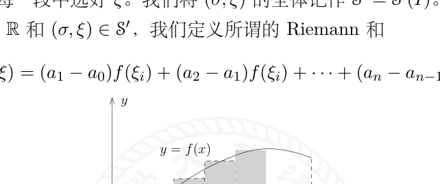
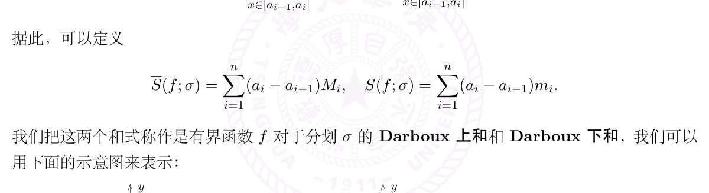

# Riemann 和与 Darboux 上下和

[返回讲义目录](../../../math-analysis-lecture-notes.md) · [学期目录](../../01-math-analysis-i.md) · [章节目录](../19-darboux-sums.md) · [校勘记录](../../errata.md) · [上一篇：Riemann 积分的定义](../18-riemann-integral.md) · [下一篇：19.1：作业：Sturm-Louville理论的一个例子](19-02-p0204-0209.md)

<!-- source: PDF 199; printed: 199; transcription: first-pass; proofreading: applied -->

## 黎曼和与积分

我们介绍如何利用经典的 Riemann 和以及 Darboux 上下和的观点来研究 Riemann 可积的函数。值得强调的是，Riemann 和（以及上节课用阶梯函数来定义积分的方式）对于在赋范线性空间中取值的函数可以定义，然而 Darboux 上下和只对实数值的函数可行（原因是我们需要用到实数域上的序结构）。

任意给定分划 $\sigma \in \mathcal{S}$，假设 $\sigma = \{a = a_0 < a_1 < \cdots < x_{n-1} < a_n = b\}$，我们在每一小段上面选取 $\xi = (\xi_1, \cdots, \xi_n)$，使得 $\xi_i \in [a_{i-1}, a_i]$。为了简单起见，我们用 $\xi$ 表示这些 $\xi_i$，用 $(\sigma, \xi)$ 表示给定了分划 $\sigma$ 并在每一段中选好 $\xi$。我们将 $(\sigma, \xi)$ 的全体记作 $\mathcal{S}' = \mathcal{S}'(I)$。

给定函数 $f : I \to \mathbb{R}$ 和 $(\sigma, \xi) \in \mathcal{S}'$，我们定义所谓的 Riemann 和

$$S(f; \sigma, \xi) = (a_1 - a_0)f(\xi_1) + (a_2 - a_1)f(\xi_2) + \cdots + (a_n - a_{n-1})f(\xi_n).$$

我们证明，对于 Riemann 可积的函数 $f$，在正确的意思下，有

$$\lim_{|\sigma| \to 0} S(f; \sigma, \xi) = \int_a^b f.$$

**定理 122。** 假设 $I \subset \mathbb{R}$ 是有界闭区间，$f \in \mathcal{R}(I)$。对任意的 $\varepsilon > 0$，存在 $\delta > 0$，使得对任意的 $(\sigma, \xi) \in \mathcal{S}'(I)$，如果其步长 $|\sigma| < \delta$，那么

$$\left| S(f; \sigma, \xi) - \int_a^b f \right| < \varepsilon.$$

**证明：** 根据 Riemann 可积的定义，我们选定阶梯函数 $F \in \mathcal{E}(I)$ 和 $\psi \in \mathcal{E}(I)$，使得 $|f(x) - F(x)| \leqslant \psi(x)$ 并且 $\displaystyle\int_a^b \psi(x) < \dfrac{\varepsilon}{4}$。我们进一步假设 $F$ 和 $\psi$ 都对应着分划 $\sigma_0 = \{b_0 < b_1 < \cdots < b_m\}$，即它们在每一段 $(b_i, b_{i+1})$ 上的限制都是常数。

现在，任意选取分划 $\sigma = \{a = a_0 < a_1 < \cdots < x_{n-1} < a_n = b\}$，我们要求 $|\sigma|$ 比 $\sigma_0$ 中最短区间的长度还要小。利用积分的线性，我们有

$$\left| S(f; \sigma, \xi) - \int_a^b f \right| \leqslant \sum_{i=1}^n \left| \int_{a_{i-1}}^{a_i} f(x) - f(\xi_i) \right|$$

我们想逐项地控制上面右端的每一个积分项 $\left| \displaystyle\int_{a_{i-1}}^{a_i} f(x) - f(\xi_i) \right|$。为此，我们需要讨论两个分划 $\sigma_0$ 和 $\sigma$ 之间的相对关系。对每个 $i$，我们有两种情况：

<!-- source: PDF 200; printed: 200; transcription: first-pass; proofreading: applied -->

- **情形 1：** $[a_{i-1}, a_i]$ 中不包含 $\sigma_0$ 的任何一个分割点 $b_k$。

  此时，$\psi$ 和 $F$ 在 $(a_{i-1}, a_i)$ 都是常数。所以，对任意的 $x \in (a_{i-1}, a_i)$ 上，我们有

  $$|f(x) - f(\xi_i)| \leqslant |f(x) - F(x)| + |F(x) - f(\xi_i)|$$

  $$= |f(x) - F(x)| + |F(\xi_i) - f(\xi_i)|$$

  $$\leqslant \psi(x) + \psi(\xi_i) = 2|\psi(x)|.$$

  所以，我们有

  $$\left| \int_{a_{i-1}}^{a_i} f(x) - f(\xi_i) \right| \leqslant 2 \int_{a_{i-1}}^{a_i} \psi.$$

- **情形 2：** $[a_{i-1}, a_i]$ 中包含某个 $\sigma_0$ 的某一个分割点 $b_{k_0}$。（我们注意到，由于 $|\sigma|$ 比 $\sigma_0$ 中的最短区间的长度还小，所以 $[a_{i-1}, a_i]$ 恰好只包含 $b_{k_0}$ 的这一个 $\sigma_0$ 中的分割点。）这样的区间的个数不会超过 $m$ 个，因为 $\sigma_0$ 的分割点一共就 $m$ 个。

  此时，我们用 $\|f\|_\infty$ 来控制 $f(x)$，从而有

  $$\left| \int_{a_{i-1}}^{a_i} f(x) - f(\xi_i) \right| \leqslant |a_i - a_{i-1}| \|f\|_\infty + |a_i - a_{i-1}| |f(\xi_i)|$$

  $$\leqslant 2|\sigma| \|f\|_\infty.$$

综合上面的讨论，当 $|\sigma| < |\sigma_0|$ 时，我们有

$$\left| S(f; \sigma, \xi) - \int_a^b f \right| \leqslant \underbrace{2 \sum \int_{a_{i-1}}^{a_i} \psi}_{\text{第一种情况}} + \underbrace{2m|\sigma| \|f\|_\infty}_{\text{第二种情况}}$$

$$\leqslant 2 \int_a^b \psi + 2m|\sigma| \|f\|_\infty$$

$$\leqslant \frac{1}{2}\varepsilon + 2m|\sigma| \|f\|_\infty.$$

由于 $m$ 是固定的，当 $|\sigma|$ 足够小的时候，上面的式子明显小于 $\varepsilon$，证明完毕。$\square$

**注记。** 我们通常将定理写作 $\displaystyle\lim_{|\sigma| \to 0} S(f; \sigma, \xi) = \int_a^b f$，其中 $f \in \mathcal{R}(I)$。实际上，任意选取一个序列 $\{(\sigma_n, \xi_n)\}_{n \geqslant 1} \subset \mathcal{S}'(I)$，上面的定理表明只要当 $|\sigma_n| \to 0$，我们就有 $\lim_{n \to \infty} S(f; \sigma_n, \xi_n) = \int_a^b f$。根据这个定理，我们可以选择方便计算的 Riemann 和来计算积分。另外，这个定理还提供了一个很重要的观点用来计算极限：如果某个极限过程是某个 Riemann 和取极限的话，那么我们可以利用积分算极限（当然，这需要我们有足够好的手段来计算积分）。

## 上积分与下积分

下面来定义所谓的上积分和下积分的概念。假设 $f : I \to \mathbb{R}$ 是在 $\mathbb{R}$ 中取值的有界函数，我们要利用 $\mathbb{R}$ 中序关系。定义

$$\overline{\mathcal{E}_f}(I) = \{\varphi \in \mathcal{E}(I) \mid \varphi(x) \geqslant f(x)\},$$

$$\underline{\mathcal{E}_f}(I) = \{\varphi \in \mathcal{E}(I) \mid \varphi(x) \leqslant f(x)\}.$$

<!-- source: PDF 201; printed: 201; transcription: first-pass; proofreading: applied -->

由于 $f$ 是有界函数，所以这两个集合是非空的：假设对任意的 $x \in I$，$-M \leqslant f(x) \leqslant M$，那么常值函数 $M \in \overline{\mathcal{E}_f}(I)$，常值函数 $-M \in \underline{\mathcal{E}_f}(I)$。据此，我们定义

$$\overline{\int_a^b} f = \inf_{\varphi \in \overline{\mathcal{E}_f}(I)} \int_a^b \varphi, \quad \underline{\int_a^b} f = \sup_{\varphi \in \underline{\mathcal{E}_f}(I)} \int_a^b \varphi.$$

由于对任意的 $\varphi \in \overline{\mathcal{E}_f}(I)$，$\varphi(x) \geqslant -M$，所以 $\int_a^b \varphi \geqslant -M(b-a)$，这说明 $\overline{\int_a^b} f$ 是良好定义的；类似地，$\underline{\int_a^b} f$ 也是良好定义的。这两个式子分别被称作是有界函数 $f$ 的**上积分**和**下积分**。按照定义，我们有如下平凡的不等式：

$$\overline{\int_a^b} f \geqslant \underline{\int_a^b} f.$$

### 达布上下和与可积性

现在引入 Darboux 上下和的概念：假设 $f : I \to \mathbb{R}$ 是有界函数，$\sigma \in S(I)$ 是一个分划，其中 $\sigma = \{a = a_0 < a_1 < \cdots < a_{n-1} < a_n = b\}$。根据 $f$ 有界，对每个 $i = 1, 2, \cdots, n$，我们令

$$M_i = \sup_{x \in [a_{i-1}, a_i]} f(x), \quad m_i = \inf_{x \in [a_{i-1}, a_i]} f(x),$$

据此，可以定义

$$\overline{S}(f; \sigma) = \sum_{i=1}^n (a_i - a_{i-1}) M_i, \quad \underline{S}(f; \sigma) = \sum_{i=1}^n (a_i - a_{i-1}) m_i.$$

我们把这两个和式称作是有界函数 $f$ 对于分划 $\sigma$ 的 **Darboux 上和**和 **Darboux 下和**，我们可以用下面的示意图来表示：

上图中，左边代表的是 Darboux 下和，右边代表的是 Darboux 上和。很明显，我们有

$$\overline{S}(f; \sigma) \geqslant \underline{S}(f; \sigma).$$

实际上，我们有更强的结论：

**引理 123。** 对于任意两个分划 $\sigma, \sigma' \in S(I)$，我们有

$$\underline{S}(f; \sigma) \leqslant \overline{S}(f; \sigma').$$

<!-- source: PDF 202; printed: 202; transcription: first-pass; proofreading: applied -->

**证明：** 事实上，我们只需要证明当 $\sigma \prec \sigma'$ 时，我们有

$$\underline{S}(f; \sigma) \leqslant \overline{S}(f; \sigma'), \quad \underline{S}(f; \sigma') \leqslant \overline{S}(f; \sigma),$$

即可。我们把这个性质的证明留作作业。$\square$

另外，当 $\sigma \prec \sigma'$ 时，我们有

$$\overline{S}(f; \sigma) \leqslant \overline{S}(f; \sigma'), \quad \underline{S}(f; \sigma) \geqslant \underline{S}(f; \sigma').$$

这个的证明也是显然的。

我们定义

$$\overline{D}(f) = \inf_{\sigma \in S(I)} \overline{S}(f; \sigma), \quad \underline{D}(f) = \sup_{\sigma \in S(I)} \underline{S}(f; \sigma).$$

下面的命题将 Darboux 上下和与上下积分联系起来：

**命题 124。** 假设 $f : I \to \mathbb{R}$ 是有界函数，那么

$$\overline{D}(f) = \overline{\int_a^b} f, \quad \underline{D}(f) = \underline{\int_a^b} f.$$

**证明：** 根据对称性，我们证明 $\underline{D}(f) = \underline{\int_a^b} f$ 即可。证明分为两步。

- 按照定义，对任意的 $\sigma$，我们定义函数 $\phi\big|_{[a_{i-1}, a_i)} = m_i$（$1 \leqslant i \leqslant n$），$\phi(b) = m_n$，从而 $\phi \in \underline{\mathcal{E}_f}(I)$。另外，我们有 $\underline{S}(f; \sigma) = \int_a^b \phi$。按照下积分的定义，我们有 $\int_a^b \phi \leqslant \underline{\int_a^b} f$，从而 $\underline{S}(f; \sigma) \leqslant \underline{\int_a^b} f$。再用 $\underline{D}(f)$ 的定义（对 $\sigma$ 取上确界），我们得到

$$\underline{D}(f) \leqslant \underline{\int_a^b} f.$$

- 其次，对任意选定的 $\varepsilon$，按照下极限的定义，我们可以选取 $\psi \in \underline{\mathcal{E}_f}(I)$（其中 $\sigma_0 = \{b_0 < b_1 < \cdots < b_l\}$ 是相应的分划），使得

$$\underline{\int_a^b} f \leqslant \varepsilon + \int_a^b \psi.$$

  按照定义，我们知道 $\psi(x) \leqslant f(x)$。我们现在任意选取 $I$ 的分划 $\sigma = \{a_0 < a_1 < \cdots < a_n\}$，我们想要比较 $\int_a^b \psi$ 和 $\underline{S}(f; \sigma)$：

$$\int_a^b \psi - \underline{S}(f; \sigma) = \sum_{i=1}^n \int_{a_{i-1}}^{a_i} (\psi - m_i)$$

  现在有两个分划 $\sigma_0$ 和 $\sigma$，我们需要讨论它们之间的相对关系。假设 $i$ 是固定的，那么我们有两种情况：

<!-- source: PDF 203; printed: 203; transcription: first-pass; proofreading: applied -->

– 情形1：$[a_{i-1}, a_i]$ 中不包含 $\sigma_0$ 的任何一个分割点 $b_k$。此时，$\psi$ 在 $[a_{i-1}, a_i]$ 的取值是常数。特别地，根据 $\psi(x) \leqslant f(x)$，我们知道 $\psi(x) \leqslant \inf_{[a_{i-1},a_i]} f(x) = m_i$，从而

$$\int_{a_{i-1}}^{a_i} (\psi(x) - m_i) \leqslant 0.$$

– 情形2：$[a_{i-1}, a_i]$ 中包含某个 $\sigma_0$ 的（恰好一个，如果我们假设 $|\sigma|$ 足够小）一个分割点 $b_{k_0}$。此时，我们用 $M = \sup_{x \in I} f(x)$ 来控制 $\psi(x)$，从而有

$$\left| \int_{a_{i-1}}^{a_i} \psi(x) - m_i \right| \leqslant (a_i - a_{i-1})(M - m) \leqslant |\sigma|(M - m).$$

其中 $m = \inf_{x \in I} f(x)$。

综合上述两种情况，我们得到

$$\int_a^b \psi - \underline{S}(f;\sigma) \leqslant \underbrace{0}_{\text{第一种情况}} + 2 \overbrace{\ell}^{\text{第二种区间的个数}} \underbrace{|\sigma|(M-m)}_{\text{第二种情况}}.$$

只要取得 $|\sigma|$ 足够小，我们就得到

$$\int_a^b \psi \leqslant \underline{S}(f;\sigma) + \varepsilon \leqslant \underline{D}(f) + \varepsilon,$$

即

$$\underline{\int_a^b} f \leqslant \underline{D}(f) + 2\varepsilon.$$

令 $\varepsilon \to 0$，我们得到

$$\underline{D}(f) \geqslant \underline{\int_a^b} f.$$

命题得到了证明。$\square$

**注记。** 课后，有同学讲第二步可以很简单地证明：

对任意的 $\varphi \in \underline{\mathcal{E}}_f(I)$，选取与 $\varphi$ 相容的分划 $\sigma = \{a_0 < a_1 < \cdots < a_n\}$，此时，由于 $\varphi\big|_{(a_{i-1},a_i)} \equiv \varphi_i$ 是常数并且 $\varphi \leqslant f$，所以，$\varphi_i \leqslant m_i$。据此，我们知道

$$\int_a^b \varphi = \sum_{i=1}^n \varphi_i(a_i - a_{i-1}) \leqslant \sum_{i=1}^n (a_i - a_{i-1}) m_i = \underline{S}(f;\sigma).$$

从而，对任意的 $\varphi \in \underline{\mathcal{E}}_f(I)$

$$\int_a^b \varphi \leqslant \sup_{\sigma \in \mathcal{S}(I)} \underline{S}(f;\sigma) = \underline{D}(f).$$

再对所有可能的 $\varphi$ 取上确界即可。

[返回讲义目录](../../../math-analysis-lecture-notes.md) · [学期目录](../../01-math-analysis-i.md) · [章节目录](../19-darboux-sums.md) · [校勘记录](../../errata.md) · [上一篇：Riemann 积分的定义](../18-riemann-integral.md) · [下一篇：19.1：作业：Sturm-Louville理论的一个例子](19-02-p0204-0209.md)
