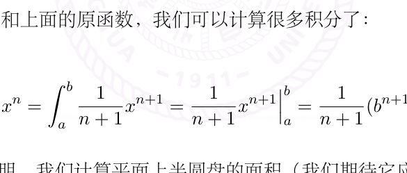

# Newton-Leibniz 公式与积分计算

[返回讲义目录](../../../math-analysis-lecture-notes.md) · [学期目录](../../01-math-analysis-i.md) · [章节目录](../20-fundamental-theorem.md) · [校勘记录](../../errata.md) · [上一篇：19.1 作业:Sturm-Louville理论的一个例子](../19-darboux-sums/19-02-p0204-0209.md) · [下一篇：20.1 作业:Dini定理,多项式逼近与Weierstrass-Stone定理](20-03-p0219-0223.md)

<!-- source: PDF 210; printed: 210; transcription: first-pass; proofreading: applied -->

## 20 紧区间上 Riemann 可积函数的刻画，Newton-Leibniz 公式，分部积分公式，变量替换公式，原函数的计算，圆面积的计算：证明 $\pi$ 的几何意义

我们现在可以对紧区间 $I$ 上的 Riemann 可积函数做全面的刻画：

**定理 125.** 假设 $I = [a, b]$（$-\infty < a < b < +\infty$）是有界的闭区间，$f : I \to \mathbb{R}$ 是函数，那么如下四条性质是等价的：

1. $f \in \mathcal{R}(I)$；

2. 存在常数 $\mathbf{I}$，对任意的 $\varepsilon > 0$，存在 $\delta > 0$，使得对任意的 $(\sigma, \xi) \in \mathcal{S}'(I)$，只要步长 $|\sigma| < \delta$，就有

$$\left| S(f; \sigma, \xi) - \mathbf{I} \right| < \varepsilon.$$

3. $f$ 是有界函数并且 $\underline{D}(f) = \overline{D}(f)$；

4. $f$ 是有界函数并且 $\underline{\int_a^b} f = \overline{\int_a^b} f$。

当上面的任意一个条件成立时，我们就有

$$\underline{D}(f) = \overline{D}(f) = \underline{\int_a^b} f = \overline{\int_a^b} f = \int_a^b f.$$

**证明：** 1)$\Rightarrow$ 2) 就是[定理122](../19-darboux-sums/19-01-p0199-0203.md#ma-theorem-122)，其中，$\mathbf{I}$ 取为 $\displaystyle\int_a^b f$。

2)$\Rightarrow$ 3) 任意给定 $\varepsilon > 0$，按照定义，存在 $\delta$，当 $|\sigma| < \delta$ 时，对任意的 $(\sigma, \xi)$ 我们都有 $|S(f; \sigma, \xi) - \mathbf{I}| < \varepsilon$。我们选定一个 $\sigma_0 = \{a_0 < a_1 < \cdots < a_n\}$，使得 $|\sigma_0| < \delta$。

我们令 $\xi_i = a_i, i \neq i_0$，$\xi_{i_0} = x \in [a_{i_0-1}, a_{i_0}]$ 可以任意选择。根据 $|S(f; \sigma, \xi)| < |\mathbf{I}| + \varepsilon$，我们知道

$$|(a_{i_0} - a_{i_0-1})f(x)| \leqslant \sum_{i \neq i_0} (a_i - a_{i-1})|f(\xi_i)| + |S(f; \sigma, \xi)|$$

$$\leqslant \sum_{i \neq i_0} (a_i - a_{i-1})|f(a_i)| + |\mathbf{I}| + \varepsilon.$$

除了 $x$ 之外，上面的式子中每个值都是给定的，这就证明了 $f$ 在 $[a_{i_0-1}, a_{i_0}]$ 上是有界的，从而在 $I$ 上有界。

现在令 $m_i = \displaystyle\inf_{x \in [a_{i-1}, a_i]} f(x)$，按照定义，存在 $\zeta_i \in [a_{i-1}, a_i]$，使得 $m_i \leqslant f(\zeta_i) \leqslant m_i + \dfrac{\varepsilon}{b - a}$。这样定义的 $S(f; \sigma, \zeta)$ 很明显满足

$$S(f; \sigma, \zeta) \leqslant \underline{S}(f; \sigma) + \varepsilon \leqslant \underline{D}(f) + \varepsilon.$$

<!-- source: PDF 211; printed: 211; transcription: first-pass; proofreading: applied -->

从而

$$\mathbf{I} \leqslant \underline{D}(f) + 2\varepsilon.$$

类似地，我们有

$$\mathbf{I} \geqslant \overline{D}(f) - 2\varepsilon.$$

上面两个式子一起就给出了 $\underline{D}(f) = \overline{D}(f)$，其中，最终我们令 $\varepsilon \to 0$。

3)$\Leftrightarrow$ 4) 就是前一个命题。

4)$\Rightarrow$ 1) 根据上下极限的定义，对任意的 $\varepsilon > 0$，存在两个阶梯函数 $\overline{f}(x)$ 和 $\underline{f}(x)$，使得 $\overline{f}(x) \geqslant f(x) \geqslant \underline{f}(x)$，并且

$$0 \leqslant \int_a^b \overline{f}(x) - \int_a^b \underline{f}(x) < \varepsilon.$$

从而，我们令 $F(x) = \underline{f}(x)$ 和 $\psi(x) = \overline{f}(x) - \underline{f}(x) \in \mathcal{E}(I)$，我们自然有

$$|f(x) - F(x)| \leqslant \psi(x), \quad \int_a^b \psi < \varepsilon.$$

这说明 $f \in \mathcal{R}(I)$。另外，我们自然有

$$\int_a^b \underline{f} \leqslant \int_a^b f \leqslant \int_a^b \overline{f},$$

这就证明定理中要求的积分的等式。$\square$

我们已经建立了比较完备的积分理论，下面我们要发展一个最基本的工具来联系积分与微分并以此进行计算。先引入原函数的概念：假设 $f$ 是定义在 $I$ 上的函数（$I$ 可以是任意区间，$f$ 可以在任意赋范线性空间中取值），如果存在 $I$ 上定义的函数 $F$，使得 $F$ 可微分并且 $F' = f$，我们就称 $F$ 是 $f$ 的**原函数**。假设 $F$ 是 $f$ 的一个原函数，那么 $f$ 的所有原函数的集合是 $\{F + c \mid c \in \mathbb{R}\}$，这是因为一个函数的导数恒为零当且仅当这个函数是常值函数。

**命题 126.** 对任意的 $f \in \mathcal{R}(I)$，对任意的 $x \in I$，我们定义 $F(x) = \displaystyle\int_a^x f$，即 $f$ 在 $[a, x]$ 上的积分。那么，$F(x)$ 是 $I = [a, b]$ 上的连续函数。进一步，如果 $f$ 在 $x_0$ 处是右连续的，那么 $F$ 在 $x_0$ 的右导数存在并且等于 $f(x_0^+) = \displaystyle\lim_{h \to 0, h > 0} f(x_0 + h)$。特别地，当 $f \in C(I)$ 时，$F(x) = \displaystyle\int_a^x f(y)dy$ 是 $f$ 的原函数。

**证明：** 首先证明 $F \in C(I)$。假设 $|f| \leqslant M$。对任意的 $x \in I$，对任意的 $h > 0$，我们有

$$|F(x - h) - F(x)| = \left| -\left( \int_a^x f - \int_a^{x-h} f \right) \right| = \left| \int_{x-h}^x f \right| \leqslant |h| \times M = O(h).$$

从而，$F$ 在 $x$ 处左连续。类似地，可以证明右连续性，所以 $F$ 在 $x$ 处连续。特别地，这个证明表明 $F(a) = 0$。

<!-- source: PDF 212; printed: 212; transcription: first-pass; proofreading: applied -->

进一步假设 $f$ 在 $x_0$ 处右连续，令 $f(x_0^+)$ 为 $f$ 在 $x_0$ 处的右极限，即 $f(x_0^+) = \lim_{h\to 0^+} f(x_0 + h)$。按定义，对任意的 $\varepsilon$，存在 $\delta > 0$，使得当 $h \in (0, \delta)$ 时，我们有 $|f(x_0 + h) - f(x_0^+)| < \varepsilon$。据此，我们计算

$$|F(x_0 + h) - F(x_0) - f(x_0^+)h| = \left|\left(\int_a^{x_0+h} f - \int_a^{x_0} f\right) - f(x_0^+)h\right| = \left|\int_{x_0}^{x_0+h} \left(f(x) - f(x_0^+)\right)dx\right| \leqslant \varepsilon h.$$

由于 $\varepsilon$ 是任意选取的，所以

$$F(x_0 + h) - F(x_0) - f(x_0^+)h = o(h).$$

这表明，$f(x_0^+)$ 是 $F$ 在 $x_0$ 处的右导数。$\square$

**推论 127.** 假设 $f \in C(I)$，那么 $F(x) = \displaystyle\int_a^x f \in C^1(I)$ 并且 $F' = f$（即 $F$ 是 $f$ 的原函数）。

**定理 128**（微积分基本定理：Newton-Leibniz 公式）. 假设 $I$ 是有界闭区间，$f \in \mathcal{R}(I)$。如果 $f$ 有原函数 $F$，那么

$$\int_a^b f = F(x)\Big|_a^b.$$

其中，$F(x)\Big|_a^b = F\Big|_{x=a}^{x=b} = F(b) - F(a)$

**证明：** 我们注意到，如果 $f \in C(I)$ 是连续函数，上面命题的推论表明

$$F(b) = \int_a^b f, \quad F' = f.$$

另外，$F(a) = 0$，所以 Newton-Leibniz 公式此时成立（在 $F \in C^1(I)$ 的时候）。

现在考虑一般情况：我们要证明，对任意的 $\varepsilon > 0$，都有

$$\left|F(b) - F(a) - \int_a^b f\right| < \varepsilon.$$

此时，由于 $f$ 可能在某些点处不连续，所以 $\displaystyle\int_a^x f(y)dy$ 未必可微分。特别地，我们未必有 $F(x) = \displaystyle\int_a^x f(y)dy$。实际上，一个可微函数的导数未必是 Riemann 可积的：比如说，在区间 $[-1, 1]$ 上定义的函数

$$[-1, 1] \to \mathbb{R}, \quad x \mapsto \begin{cases} x^2 \sin\left(\dfrac{1}{x^2}\right), & x \neq 0; \\ 0, & x = 0. \end{cases}$$

这个函数是可微的但是它的导数是无界的，所以不是 Riemann 可积分的。

根据 $f$ 是 Riemann 可积的，我们可以选取 $g, \psi \in \mathcal{E}(I)$，使得

$$|f(x) - g(x)| \leqslant \psi(x), \quad \forall x \in I; \qquad \int_a^b \psi < \varepsilon.$$

<!-- source: PDF 213; printed: 213; transcription: first-pass; proofreading: applied -->

我们再选取分划 $\sigma = \{a = a_0 < \cdots < a_n = b\}$，使得该分划与 $g$ 和 $\psi$ 两个阶梯函数相容。按照定义，$g$ 和 $\psi$ 在每个区间 $(a_{i-1}, a_i)$ 上的限制是常值函数：我们令

$$y_i = g\Big|_{(a_{i-1}, a_i)}, \quad z_i = \psi\Big|_{(a_{i-1}, a_i)}.$$

为了控制 $\left|F(b) - F(a) - \displaystyle\int_a^b f\right|$，我们自然考虑它较好的一个逼近：

$$F(b) - F(a) - \int_a^b g = \sum_{i=1}^n \left(F(a_i) - F(a_{i-1})\right) - \sum_{i=1}^n \int_{a_{i-1}}^{a_i} g$$

$$= \sum_{i=1}^n \left(F(a_i) - F(a_{i-1}) - (a_i - a_{i-1})y_i\right)$$

$$= \sum_{i=1}^n \left(\left(F(a_i) - a_i y_i\right) - \left(F(a_{i-1}) - a_{i-1} y_i\right)\right).$$

在每个区间 $[a_{i-1}, a_i]$ 上，我们考虑函数 $x \mapsto F(x) - y_i x$。根据 Lagrange 中值定理，存在 $\xi_i \in [a_{i-1}, a_i]$，使得

$$\left|\left(F(a_i) - a_i y_i\right) - \left(F(a_{i-1}) - a_{i-1} y_i\right)\right|$$

$$= \left|F'(\xi_i) - y_i\right|(a_i - a_{i-1})$$

$$= \left|f(\xi_i) - g(\xi_i)\right|(a_i - a_{i-1})$$

$$\leqslant \psi(\xi_i)(a_i - a_{i-1})$$

$$= z_i(a_i - a_{i-1}).$$

所以，我们得到

$$\left|F(b) - F(a) - \int_a^b g\right| \leqslant \sum_{i=1}^n z_i(a_i - a_{i-1}) = \int_a^b \psi < \varepsilon.$$

最终，我们有

$$\left|F(b) - F(a) - \int_a^b f\right| \leqslant \left|F(b) - F(a) - \int_a^b g\right| + \left|\int_a^b f - g\right|$$

$$\leqslant \varepsilon + \int_a^b \psi < 2\varepsilon$$

令 $\varepsilon \to 0$，我们就证明了微积分基本定理。$\square$

**注记.** *Newton-Leibniz 公式最常用的形式是：$f \in C^1(I)$，我们有*

$$\int_a^b f' = f(x)\Big|_a^b.$$

<!-- source: PDF 214; printed: 214; transcription: first-pass; proofreading: applied -->

给定一个函数 $f$，我们用 $\int f$ 来表示它（某个）原函数，我们注意到，按照原函数的定义，一个函数的原函数在差一个常数的意义下是才是良好定义的，但是这种差别不是本质的，没有必要纠结，所以，我们之后谈论原函数的时候，总是随便取一个就好，尽管这是从概念上而言不严格。另外，即便 $f$ 是 Riemann 可积的，它未必具有原函数，这是因为如果 $f$ 有原函数 $F$，那么 $F' = f$，根据 Darboux 定理，$f$ 具有介值性，而我们随便选取的阶梯函数大都不具有这个性质。

我们罗列几个基本的原函数：

$$\int x^\alpha = \frac{1}{\alpha+1} x^{\alpha+1}, \ \alpha \neq -1; \qquad \int \frac{1}{x} = \log x; \qquad \int \log x = x\log x - x;$$

$$\int \sin x = -\cos x; \qquad \int \cos x = \sin x; \qquad \int e^x = e^x;$$

$$\int \frac{1}{a^2+x^2} = \frac{1}{a}\arctan\frac{x}{a}; \qquad \int \frac{1}{\sqrt{a^2-x^2}} = \arcsin\frac{x}{a}; \qquad \int \tan ax = -\frac{1}{a}\log\cos ax.$$

还有几个稍微复杂但是也会见到的：

$$\int \sec x = \log|\sec x + \tan x| = 2\tanh^{-1}\!\left(\tan\frac{x}{2}\right);$$

$$\int \sec^2 ax = \frac{\tan ax}{a}; \qquad \int \frac{1}{\sin x} = \log\left|\tan\frac{x}{2}\right|.$$

**注记.** 我们将会看到，关于原函数的计算（如果可以用初等函数表示的话），本质上是代数的变形，所以，我们需要记忆并熟练的运用以上几个例子。

这些例子的证明是平凡的，我们只需要对原函数求导来验证它恰好给出了所求的函数即可。利用 Newton-Leibniz 公式和上面的原函数，我们可以计算很多积分了：

1) 单项式的积分：

$$\int_a^b x^n = \int_a^b \left(\frac{1}{n+1} x^{n+1}\right)\!\prime = \frac{1}{n+1} x^{n+1}\Big|_a^b = \frac{1}{n+1}(b^{n+1} - a^{n+1}).$$

2) $\bar{\pi} = \pi$ 的第一个证明。我们计算平面上半圆盘的面积（我们期待它应该是 $\dfrac{r^2}{2}\pi$）：

这就是函数 $f(x) = \sqrt{r^2 - x^2}$ 下的面积，其中，$x \in [-r, r]$。换而言之，我们要计算如下的积分：

$$\int_{-r}^{r} f = \int_{-r}^{r} \sqrt{r^2 - x^2}.$$

我们发现，计算 $\sqrt{1-x^2}$ 的原函数并不简单（至少不是一目了然）。我们需要发展一点工具来计算原函数（积分）然后再来计算这个积分。

<!-- source: PDF 215; printed: 215; transcription: first-pass; proofreading: applied -->

作为 Newton-Leibniz 公式应用，我们现在来证明分部积分公式和变量替换公式。

**命题 129**（分部积分公式）. 假设 $f, g \in C^1(I)$。那么，我们有

$$\int_a^b f' \cdot g = (f \cdot g)\Big|_a^b - \int_a^b f \cdot g'.$$

**证明：** 对 $(f \cdot g)'$ 用 Newton-Leibniz 公式，所以

$$(f \cdot g)\Big|_a^b = \int_a^b \left(f \cdot g\right)' = \int_a^b f' \cdot g + \int_a^b f \cdot g'.$$

这自然等价于分部积分公式。$\square$

**注记.** 我们回忆一下所谓的 Abel 求和公式：假设 $\{a_k\}_{k\geqslant 1}$ 和 $\{b_k\}_{k\geqslant 1}$ 是复数（矩阵）的序列，那么

$$\sum_{k=1}^n a_k b_k = S_n b_n + \sum_{k=1}^{n-1} S_k(b_k - b_{k+1}),$$

其中我们用 $S_n = a_1 + a_2 + \cdots + a_n$ 表示数列 $\{a_k\}_{k\geqslant 1}$ 的部分和。这和分部积分公式非常相似：我们将 $S_k$ 和 $b_k$ 看成在 $\mathbb{Z}_{\geqslant 1}$ 定义的函数，那么，如下的对应

$$S_k \longrightarrow f, \quad b_k \longrightarrow g, \quad \mathbb{Z}_{\geqslant 1} \longrightarrow [a, b],$$

就可以把 Abel 求和公式看成分部积分。（我们下个学期会学习抽象的积分理论把这个对应说清楚）

**命题 130**（变量替换公式）. 假设 $\Phi : I \to J$ 是两个有界闭紧区间之间的连续可微的单调递增的映射，其中 $I = [a, b]$，$J = [c, d]$。$f \in C(J)$，那么对于 $I$ 中任意的 $\alpha < \beta$，都有

$$\int_\alpha^\beta \left((f \circ \Phi) \cdot \Phi'\right) = \int_{\Phi(\alpha)}^{\Phi(\beta)} f.$$

**证明：** 我们先假设 $\Phi(\beta) > \Phi(\alpha)$. 根据 $f \in C(J)$ 和 $\Phi \in C^1(I)$，我们知道上面两个积分的被积函数都是连续的，所以都是 Riemann 可积的。根据复合函数求导公式，令 $F(x)$ 为 $f(x)$ 的一个原函数，那么我们有

$$F(\Phi(x))' = f(\Phi(x))\Phi'(x) \quad \Leftrightarrow \quad \left(F \circ \Phi\right)' = (f \circ \Phi) \cdot \Phi'.$$

所以利用 Newton-Leibniz 公式，我们有

$$\int_\alpha^\beta (f \circ \Phi) \cdot \Phi' = \int_\alpha^\beta \left(F \circ \Phi\right)' = F \circ \Phi\Big|_\alpha^\beta = F(\Phi(\beta)) - F(\Phi(\alpha)).$$

另外，由于 $f(x)$ 是连续的，所以我们可以选取 $F$ 为

$$F(x) = \int_c^x f.$$

从而，

$$F(\Phi(\beta)) - F(\Phi(\alpha)) = \int_c^{\Phi(\beta)} f - \int_c^{\Phi(\alpha)} f = \int_{\Phi(\alpha)}^{\Phi(\beta)} f.$$

命题得证。$\square$

<!-- source: PDF 216; printed: 216; transcription: first-pass; proofreading: applied -->

**注记.** 注意到，我们假设了 $\Phi(\alpha) < \Phi(\beta)$ 是递增的，这是人为的原因的：对于区间 $I = [a, b]$，最好的积分的符号应该是 $\int_I f$。然而，由于传统的原因，我们经常使用 $\int_a^b f$，这里，我们已经默认了 $a < b$ 的假设。从这角度看，$\int_a^b$ 不是一个太好的符号。然而，重新观察证明，我们发现等式

$$\int_\alpha^\beta (f \circ \Phi) \cdot \Phi' = F(\Phi(\beta)) - F(\Phi(\alpha))$$

是永远成立的，所以，当 $\Phi(\beta) < \Phi(\alpha)$ 的时候，我们需要将 $\int_{\Phi(\alpha)}^{\Phi(\beta)} f$ 解释为

$$\int_{\Phi(\alpha)}^{\Phi(\beta)} f = -\int_{\Phi(\beta)}^{\Phi(\alpha)} f = -(F(\Phi(\alpha)) - F(\Phi(\beta)))$$

即可。换而言之，作为约定，我们规定

$$\int_a^b f = -\int_b^a f.$$

作为换元积分公式的推论，我们证明两个基本的命题。尽管这两个命题的证明不值一提，但是由于下面的平移和相似变换是 $\mathbb{R}$ 上最基本的对称性（共形变换群），所以它们占有特殊的位置：

- 假设 $f \in \mathcal{R}(I)$，我们定义函数 $g(x) = f(x + x_0)$，即函数 $g = f \circ \tau_{x_0} : [a - x_0, b - x_0] \to \mathbb{R}$，其中 $\tau_{x_0} : [a - x_0, b - x_0] \to [a, b]$ 是平移 $x \mapsto x + x_0$。此时，我们有

$$\int_{a-x_0}^{b-x_0} g = \int_a^b f.$$

- 假设 $f \in \mathcal{R}(I)$，$\lambda > 0$，我们定义函数 $g(x) = f(\lambda x)$，即函数 $g = f \circ m_\lambda : [\frac{a}{\lambda}, \frac{b}{\lambda}] \to \mathbb{R}$，其中 $m_\lambda : [\frac{a}{\lambda}, \frac{b}{\lambda}] \to [a, b]$ 是相似变化 $x \mapsto \lambda x$。此时，我们有

$$\lambda \int_{\frac{a}{\lambda}}^{\frac{b}{\lambda}} g = \int_a^b f.$$

当 $\lambda < 0$ 时，我们要将 $\int_{\frac{a}{\lambda}}^{\frac{b}{\lambda}}$ 换做 $\int_{\frac{b}{\lambda}}^{\frac{a}{\lambda}}$。

**注记（符号的解释）.** 根据变量替换公式的形式，我们倾向于将积分写成传统的形式：$\int_a^b f(x)dx$。

为了讲的更清楚，我们回忆微分（不是导数！）的定义。给定一个两个区间之间的可微的映射 $\Phi : X \to Y$，对于每个点 $x_0 \in X$，我们给它分配一个线性空间 $T_{x_0}X \simeq \mathbb{R}$；对于 $y_0 \in Y$，我们给它分配一个线性空间 $T_{y_0}Y \simeq \mathbb{R}$。那么，映射 $\Phi$ 在 $x_0$ 处的微分定义为：

$$d\Phi(x_0) : T_{x_0}X \to T_{\Phi(x_0)}Y, \quad h \mapsto \Phi'(x_0)h.$$

<!-- source: PDF 217; printed: 217; transcription: first-pass; proofreading: applied -->

假设 $X = Y$，我们选取一个特殊的 $\Phi$，即恒同映射 $x \mapsto x$。我们就把这个映射记作 $x$。特别地，此时 $\Phi' = 1$。所以，微分现在可以被写为

$$dx(x_0) : T_{x_0}X \to T_{\Phi(x_0)}X, \quad h \mapsto h.$$

比较上面两个映射，我们知道，作为 $T_{x_0}X \to T_{\Phi(x_0)}Y$ 之间的映射，我们可以把上面的映射写成

$$d\Phi(x_0) = \Phi'(x_0)dx(x_0).$$

忽略掉上面式子对点的依赖性，我们就得到了

$$d\Phi = \Phi'(x)dx.$$

所以，如果我们用传统的积分记号，换元积分公式就可以想象成用变元 $y$ 代替 $\Phi(x)$，即 $y = \Phi(x)$，公式可以写成

$$\int_\alpha^\beta f\bigl(\Phi(x)\bigr) \underbrace{\Phi'(x)dx}_{d\Phi(x)} = \int_{\Phi(\alpha)}^{\Phi(\beta)} f(y)dy.$$

我们强调，目前这种写法只是形式的记法，到下个学期我们用正确的测度的观点或者微分形式的观点，就可以完美地解释这种记号。大家大可不必纠结你是否理解这个记法，因为这目前是一个帮助记忆的方式，仅此而已。

我们可以看一下如何利用分部积分和换元积分公式进行积分的计算。在一定的意义上，这已经不属于分析的范畴了（不用取极限或者 $\varepsilon$ 语言），而算是组合或者是代数上的操作了：

**例子.** 我们先来完成关于圆的面积的计算：

1) 我们用如下的变量替换 $x = r\sin\theta$，即考虑 $\Phi : [-\pi, \pi] \to [-r, r]$。从而，

$$\int_{-r}^{r} \sqrt{r^2 - x^2}\,dx = \int_{-\frac{\pi}{2}}^{\frac{\pi}{2}} \sqrt{r^2 - (r\sin\theta)^2}\, r\cos\theta\,d\theta$$

$$= r^2 \int_{-\frac{\pi}{2}}^{\frac{\pi}{2}} (\cos\theta)^2\,d\theta = \frac{r^2}{2} \int_{-\frac{\pi}{2}}^{\frac{\pi}{2}} (\cos(2\theta) + 1)\,d\theta$$

$$= \frac{r^2}{2} \left( \int_{-\frac{\pi}{2}}^{\frac{\pi}{2}} \cos(2\theta)\,d\theta + \pi \right) \overset{\vartheta = 2\theta}{=} \frac{r^2}{2} \left( \frac{1}{2} \int_{-\pi}^{\pi} \cos(\vartheta)\,d\vartheta + \pi \right)$$

另外，根据 $\sin x$ 的周期性，我们知道 $\sin(\pi) = \sin(-\pi)$，所以

$$\int_{-\pi}^{\pi} \cos(\vartheta)\,d\vartheta = \sin\vartheta\Big|_{-\pi}^{\pi} = 0.$$

所以，

$$\int_{-r}^{r} \sqrt{r^2 - x^2}\,dx = \frac{r^2}{2}\pi.$$

所以，半径为 $r$ 的圆盘的面积是 $\pi r^2$。至此我们验证了 $\pi = \pi$，其中 $\pi$ 是大家想象中的 $\pi$。

<!-- source: PDF 218; printed: 218; transcription: first-pass; proofreading: applied -->

*2)* 计算 $\displaystyle\int_0^{\frac{3\pi}{2}} \sin^2 x \cos x\,dx$。我们将积分分为几块然后用换元积分公式：

$$
\int_0^{\frac{3\pi}{2}} \sin^2 x \cos x\,dx = \left(\int_0^{\frac{\pi}{2}} + \int_{\frac{\pi}{2}}^{\pi} + \int_{\pi}^{\frac{3\pi}{2}}\right) \sin^2 x\,d\sin x
$$

$$
= \int_0^1 y^2\,dy - \int_0^1 y^2\,dy + \int_0^1 y^2\,dy
$$

$$
= \frac{1}{3} - \frac{1}{3} + \frac{1}{3} = 1.
$$

请尤其注意第二项的换元积分，因为这时候对应着之前 $\Phi(\beta) < \Phi(\alpha)$ 的情形。

*3)* 计算 $\displaystyle\int_0^{\frac{\pi}{2}} x \sin x \cos x\,dx$。这个积分的计算需要用到分部积分公式来除掉 $x$：

$$
\int_0^{\frac{\pi}{2}} x \sin x \cos x\,dx = \frac{1}{2}\int_0^{\frac{\pi}{2}} x \sin(2x)\,dx = -\frac{1}{4}\int_0^{\frac{\pi}{2}} x\left(\cos(2x)\right)'dx
$$

$$
= \frac{1}{4}\int_0^{\frac{\pi}{2}} \cos(2x)\,dx - \frac{1}{4}x\cos(2x)\Big|_0^{\frac{\pi}{2}}
$$

$$
= \frac{1}{8}\int_0^{\frac{\pi}{2}} \left(\sin(2x)\right)'dx + \frac{1}{8}\pi = \frac{1}{8}\pi.
$$

*4)* 计算 $\displaystyle\int_1^2 \frac{1}{x\sqrt{1+x^2}}\,dx$。在这个计算中，我们将 $x$ 换成 $\dfrac{1}{y}$：

$$
\int_1^2 \frac{1}{x\sqrt{1+x^2}}\,dx = \int_{\frac{1}{2}}^1 \frac{1}{\sqrt{1+y^2}}\,dy.
$$

为了计算上面的积分，我们首先声明 $\displaystyle\int \frac{1}{\sqrt{1+x^2}} = \log(x + \sqrt{1+x^2})$，据此，

$$
\int_{\frac{1}{2}}^1 \frac{1}{\sqrt{1+y^2}}\,dy = \log\frac{2+2\sqrt{2}}{1+\sqrt{5}}.
$$

很明显，上面的不定积分的计算是有难度的，这样的技巧我们留到后面来谈。我们给一个更透明的计算，想法是注意到 $1+x^2$ 的形式让我们联想到双曲三角函数，我们做变量替换 $y = \sinh z$，从而

$$
\int_{\frac{1}{2}}^1 \frac{1}{\sqrt{1+y^2}}\,dy = \int_{\alpha}^{\beta} \frac{1}{\cosh z}\cosh z\,dz = \beta - \alpha,
$$

其中，$\sinh(\alpha) = \dfrac{1}{2}$，$\sinh(\beta) = 1$。通过解二次方程，我们就可以确定 $\alpha$ 和 $\beta$。

[返回讲义目录](../../../math-analysis-lecture-notes.md) · [学期目录](../../01-math-analysis-i.md) · [章节目录](../20-fundamental-theorem.md) · [校勘记录](../../errata.md) · [上一篇：19.1 作业:Sturm-Louville理论的一个例子](../19-darboux-sums/19-02-p0204-0209.md) · [下一篇：20.1 作业:Dini定理,多项式逼近与Weierstrass-Stone定理](20-03-p0219-0223.md)
