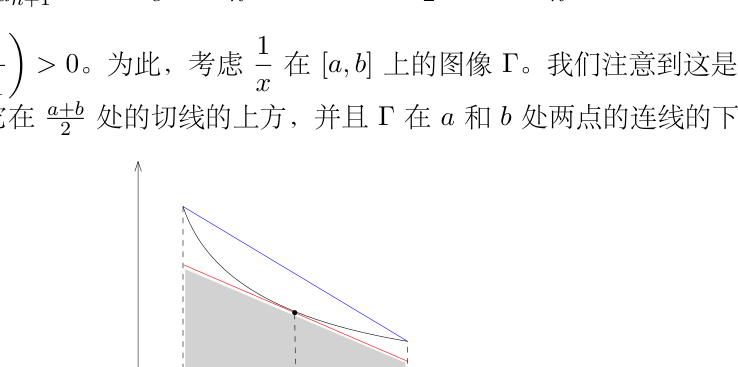

# 22：反常积分、Euler 常数与 Stirling 公式

[返回讲义目录](../../math-analysis-lecture-notes.md) · [学期目录](../01-math-analysis-i.md) · [校勘记录](../errata.md) · [上一篇：振幅、零测集与 Lebesgue 定理](21-lebesgue-criterion.md) · [下一篇：微积分历史与含参积分](23-parameter-integrals/23-01-p0239-0245.md)

<!-- source: PDF 229; printed: 229; transcription: first-pass; proofreading: applied -->

## 积分与极限的交换

给定有界闭区间 $[a, b]$，我们知道连续函数的空间 $C\bigl([a, b]\bigr)$ 是 $\mathcal{R}\bigl([a, b]\bigr)$ 的线性子空间。我们在 $C\bigl([a, b]\bigr)$ 上配备范数 $\|\cdot\|_\infty$，即

$$\|f\|_\infty = \sup_{x \in [a,b]} |f(x)|.$$

此时，我们有映射

$$\int_a^b : C\bigl([a, b]\bigr) \longrightarrow \mathbb{R}, \quad f \mapsto \int_a^b f.$$

这是一个连续线性映射：因为对任意的 $f, g \in C\bigl([a, b]\bigr)$，我们有

$$\left| \int_a^b f - \int_a^b g \right| \leqslant \int_a^b |f - g| \leqslant \int_a^b \|f - g\|_\infty = (b - a) d_\infty(f, g).$$

特别地，如果 $f_n \to f$ 是 $C\bigl([a, b]\bigr)$ 一致收敛的序列，那么

$$\lim_{n \to \infty} \int_a^b f_n = \int_a^b f.$$

**练习。** 存在 $f_n, f \in C\bigl([a, b]\bigr)$，使得对任意的 $x \in [a, b]$，当 $n \to \infty$ 时，$f_n(x) \to f(x)$，但是

$$\lim_{n \to \infty} \int_a^b f_n \neq \int_a^b f.$$

## 可积函数的基本性质

我们上一次课证明了关于 Riemann 积分的 Lebesgue 定理：$f \in \mathcal{R}\bigl([a, b]\bigr)$ 当且仅当 $f$ 有界并且其不连续点所构成的集合是零测集。作为应用，我们有

**推论 137**（对值域进行复合）。$f : I \to J \subset \mathbb{R}$ 是可积的，$g : J \to \mathbb{R}$（或某个赋范线性空间 $V$）是连续映射，那么 $g \circ f$ 是可积的。特别地，$f : I \to \mathbb{C}$ 是可积的并且 $|f(x)| \geqslant \delta > 0$，那么 $\dfrac{1}{f}$ 是可积的。

**证明：** 这是因为如果 $f$ 在 $x_0$ 处连续，那么 $g \circ f$ 在 $x_0$ 处连续。所以，$g \circ f$ 的不连续点的集合是 $f$ 的不连续点的子集，所以仍然是零测集。

对于 $f : I \to \mathbb{C}$，我们按照实部和虚部分解，有 $f = f_1 + i f_2$，此时，$f_1$ 和 $f_2$ 都是可积的。那么

$$\frac{1}{f} = \frac{f_1}{(f_1)^2 + (f_2)^2} - i \frac{f_2}{(f_1)^2 + (f_2)^2},$$

是可积的。$\square$

<!-- source: PDF 230; printed: 230; transcription: first-pass; proofreading: applied -->

**推论 138。** $f : [a, b] \to \mathbb{R}_{\geqslant 0}$ 是 Riemann 可积的。那么，$\displaystyle\int_a^b f = 0$ 当且仅当 $\{x \in [a, b] \mid f(x) \neq 0\}$ 是零测集。

**证明：** 如果 $\displaystyle\int_a^b f = 0$，为了说明 $\left\{x \in [a, b] \mid f(x) \neq 0\right\}$ 是零测集，我们证明在任意连续点 $x_0$ 处，$f(x_0) = 0$：因为 Lebesgue 定理，$\left\{x \in [a, b] \mid f(x) \neq 0\right\}$ 只能是不连续点，所以测度为零。我们用反证法：假设 $f$ 在 $x_0$ 处连续，但是 $f(x_0) \neq 0$，所以 $f(x_0) > 0$。特别地，存在正数 $\delta$ 和 $\varepsilon$，使得对任意的 $x \in (x_0 - \delta, x_0 + \delta)$，$f(x) \geqslant \varepsilon$。我们现在构造阶梯函数 $\varphi(x)$ 使得

$$\varphi(x) = \begin{cases} \varepsilon, & x \in (x_0 - \delta, x_0 + \delta), \\ 0, & x \notin (x_0 - \delta, x_0 + \delta). \end{cases}$$

由于 $f : [a, b] \to \mathbb{R}_{\geqslant 0}$，所以 $f \geqslant \varphi$，从而 $\displaystyle\int_a^b f \geqslant \int_a^b \varphi = \varepsilon\delta$，矛盾。

反过来，我们假设 $\left\{x \in [a, b] \mid f(x) \neq 0\right\}$ 是零测集。根据 $f \geqslant 0$，存在阶梯函数 $\varphi(x) \geqslant 0$，使得 $\varphi(x) \leqslant f(x)$ 并且 $\displaystyle\int_a^b (f - \varphi) \leqslant \varepsilon$：我们只需要用足够细的 Darboux 下和所对应的阶梯函数即可！

由于 $0 \leqslant \varphi(x) \leqslant f(x)$，所以 $\left\{x \in [a, b] \mid \varphi(x) \neq 0\right\} \subset \left\{x \in [a, b] \mid f(x) \neq 0\right\}$，从而是零测集。由于 $\varphi$ 是阶梯函数，所以 $\left\{x \in [a, b] \mid \varphi(x) \neq 0\right\}$ 是有限集合，所以 $\displaystyle\int_a^b \varphi = 0$。根据 $\varphi$ 和 $f$ 之间的关系，我们有

$$\int_a^b f = \int_a^b (f - \varphi) + \int_a^b \varphi \leqslant \varepsilon + 0.$$

令 $\varepsilon \to 0$，我们就证明了 $\displaystyle\int_a^b f = 0$。$\square$

另外一个推论讲的是在一个零测集上改变一个函数的值不会改变这个函数的积分：

**推论 139。** $f, g \in \mathcal{R}\bigl([a, b]\bigr)$ 是 Riemann 可积的，除去可数个点之外，它们是相同的，即

$$\{x \in [a, b] \mid f(x) \neq g(x)\}$$

是可数集，那么，$\displaystyle\int_a^b f = \int_a^b g$。

**证明：** 根据线性，我们只需要证明，如果 $\left\{x \in [a, b] \mid f(x) \neq 0\right\}$ 是零测集，那么，$\displaystyle\int_a^b f = 0$。为此，我们可以用上下积分的定义（它们都等于函数的积分）：对任意的 $x$，存在阶梯函数 $\varphi$，使得

$$\varphi(x) \geqslant f(x), \quad \forall x \in [a, b]; \qquad \varepsilon + \int_a^b f \geqslant \int_a^b \varphi.$$

根据 $f$ 的性质，我们知道 $\left\{x \in [a, b] \mid \varphi(x) < 0\right\}$ 是零测集。由于 $\varphi(x)$ 是阶梯函数，所以 $\left\{x \in [a, b] \mid \varphi(x) < 0\right\}$ 是零测集只能是有限点集，从而存在一个分划 $\sigma$，其中 $\sigma = \{a_0 < a_1 < \cdots < a_n\}$，

<!-- source: PDF 231; printed: 231; transcription: first-pass; proofreading: applied -->

使得对每个 $i \geqslant 1$，$\varphi\big|_{(a_{i-1},a_i)}$ 是非负的常数。特别地，我们有

$$
\int_a^b \varphi \geqslant 0 \implies \int_a^b f \geqslant -\varepsilon.
$$

令 $\varepsilon \to 0$，我们就得到 $\int_a^b f \geqslant 0$；同理，我们有 $\int_a^b f \leqslant 0$。这就证明了命题。$\square$

## 积分余项的泰勒公式

我们现在离开 Lebesgue，再回到 Newton-Leibniz 公式的场合。利用这个公式，我们可以给出积分余项的 Taylor 展开公式：

**命题 140**（积分余项的 Taylor 公式）。考虑区间 $I = [a, b]$ 上的 $m+1$ 次连续可微函数 $f \in C^{m+1}(I)$，其中 $m \in \mathbb{Z}_{\geqslant 0}$（函数可以在赋范线性空间中取值），我们有

$$
f(b) = \sum_{k=0}^{m} \frac{(b-a)^k}{k!} f^{(k)}(a) + \int_a^b \frac{(b-x)^m}{m!} f^{(m+1)}(x)dx.
$$

**证明**：对 $m = 0$，这就是 Newton-Leibniz 公式；对于一般的 $m$，我们进行归纳：假设命题对 $m$ 是成立的，即

$$
f(b) = \sum_{k=0}^{m} \frac{(b-a)^k}{k!} f^{(k)}(a) + \int_a^b \frac{(b-x)^m}{m!} f^{(m+1)}(x)dx,
$$

所以，利用 Newton-Leibniz 公式，我们有

$$
f(b) = \sum_{k=0}^{m} \frac{(b-a)^k}{k!} f^{(k)}(a) + \int_a^b \frac{(b-x)^m}{m!} f^{(m+1)}(x)dx
$$

$$
= \sum_{k=0}^{m} \frac{(b-a)^k}{k!} f^{(k)}(a) + \int_a^b \frac{(b-x)^m}{m!} \left( f^{(m+1)}(a) + \int_a^x f^{(m+2)}(y)dy \right) dx
$$

$$
= \sum_{k=0}^{m+1} \frac{(b-a)^k}{k!} f^{(k)}(a) + \int_a^b \frac{(b-x)^m}{m!} \left( \int_a^x f^{(m+2)}(y)dy \right) dx.
$$

我们对最后一项用分部积分公式（注意到边界项是零）：

$$
f(b) = \sum_{k=0}^{m+1} \frac{(b-a)^k}{k!} f^{(k)}(a) - \int_a^b \left( \frac{(b-x)^{m+1}}{(m+1)!} \right)' \left( \int_a^x f^{(m+2)}(y)dy \right) dx
$$

$$
= \sum_{k=0}^{m+1} \frac{(b-a)^k}{k!} f^{(k)}(a) + \int_a^b \frac{(b-x)^{m+1}}{(m+1)!} \left( \int_a^x f^{(m+2)}(y)dy \right)' dx
$$

由于 $f^{(m+2)}(x)$ 是连续函数，所以 $\int_a^x f^{(m+2)}(y)dy$ 是 $f^{(m+2)}$ 的原函数，从而，$\left( \int_a^x f^{(m+2)}(y)dy \right)' = f^{(m+2)}(x)$，这就完成了归纳证明。$\square$

<!-- source: PDF 232; printed: 232; transcription: first-pass; proofreading: applied -->

## 反常积分的概念

如果一个函数不是定义在一个有界闭区间上，我们也可以定义积分，这就是所谓的反常积分。

给定函数 $f : [a, b) \to \mathbb{R}$，其中 $b$ 可以是 $+\infty$。假设对任意的 $b^- \in [a, b)$，$f$ 是区间 $[a, b^-]$ 上的 Riemann 可积函数。如果极限

$$
\lim_{\substack{b^- \to b \\ b^- < b}} \int_a^{b^-} f(x)dx
$$

存在，我们就称 $f$ 在 $[a, b)$ 上**（反常）可积**并记

$$
\int_a^b f(x)dx = \lim_{b^- \to b} \int_a^{b^-} f(x)dx.
$$

我们经常说 $f$ 的（反常）积分在 $[a, b)$ 上收敛。我们必须指出，如果 $b < \infty$，这个符号是有欺骗性的，因为从符号本身看不出来这是一个反常积分，所以，我们每次研究这样的问题的时候要先搞清楚函数的定义域。类似地，我们可以 $(a, b]$ 上定义反常积分。

在开区间 $(a, b)$ 上定义反常积分需要额外的小心（其中 $a$ 和 $b$ 可以取正负无穷）：假设对任意的 $c \in (a, b)$，使得 $f$ 在 $(a, c]$ 和 $[c, b)$ 都反常可积，那么我们就称 $f$ 在开区间 $(a, b)$ 上**反常可积**。

**注记。** 根据极限的线性，我们知道在一个区间 $I$ 上的反常可积的函数构成一个 $\mathbb{R}$-线性空间。

我们对定义用如下的几个例子加以解释：

1) 考虑函数 $f(x) = \sin x$ 在 $[0, \infty)$ 上的反常积分的收敛性。首先，如果我们选取 $x_n = 2n\pi$，那么，容易看到，

$$
\lim_{n \to \infty} \int_a^{x_n} f(x)dx = \lim_{n \to \infty} 0 = 0.
$$

然而，如果我们换一个收敛到无穷的子列 $y_n = 2n\pi + \dfrac{\pi}{2}$，那么

$$
\lim_{n \to \infty} \int_a^{y_n} f(x)dx = \lim_{n \to \infty} 1 = 1.
$$

所以，$\lim_{b^- \to \infty} \int_a^{b^-} f(x)dx$ 并不存在，因为函数极限的存在要求所算出来的极限值不依赖于子列的选取。

2) 考虑函数 $f(x) = \sin x$ 在 $(-\infty, \infty)$ 上的可积性。它自然不可积分，因为前面的一个例子已经说明了这一点。然而，

$$
\lim_{R \to \infty} \int_{-R}^{R} f(x)dx = \lim_{R \to \infty} 0 = 0.
$$

所以，在开区间上定义积分时 $(a, b)$ 采取类似于 $\lim_{\varepsilon \to 0^+} \int_{a+\varepsilon}^{b-\varepsilon} f(x)dx$ 的方式是不可取的。

### 反常积分的例子与控制收敛

我们来研究几个最为经典的例子，它们展现了函数衰减／增长的速度对（反常）积分收敛性的影响。大家应该熟记这些计算和结论：

<!-- source: PDF 233; printed: 233; transcription: first-pass; proofreading: applied -->

**例子。**

1) $\displaystyle\int_1^{\infty} \frac{1}{x^\alpha}$，讨论 $\alpha$ 的范围。

当 $\alpha \neq -1$ 时，对任意的 $M > 0$，我们有

$$\int_1^M \frac{1}{x^\alpha} = \frac{1}{\alpha+1}\left(M^{\alpha+1} - 1\right).$$

从而，为了要求 $M \to \infty$ 极限存在，需要 $\alpha < -1$（$\alpha = -1$ 的情况可以类似地的排除）。

2) $\displaystyle\int_0^1 \frac{1}{x^\alpha}$，讨论 $\alpha$ 的范围，其中反常积分的积分区域是 $(0,1]$。

当 $\alpha \neq -1$ 时，对任意的 $\varepsilon > 0$，我们有

$$\int_\varepsilon^1 \frac{1}{x^\alpha} = \frac{1}{\alpha+1}\left(1 - \varepsilon^{\alpha+1}\right).$$

从而，为了要求 $\varepsilon \to 0$ 极限存在，需要 $\alpha > -1$（$\alpha = -1$ 的情况可以类似地的排除）。

3) $\displaystyle\int_2^{\infty} \frac{1}{x \log x} dx$。

对任意的 $M > 0$，我们有

$$\int_2^M \frac{1}{x \log x} dx = \int_2^M \frac{1}{\log x} d\log x = \log\log M - \log\log 2.$$

当 $M \to \infty$ 时，上式的极限是无穷大，从而这个反常积分不收敛。

4) $\displaystyle\int_{100}^{\infty} \frac{1}{x \log x \log\log x}$。对任意的 $M > 0$，我们有

$$\int_{100}^M \frac{1}{x \log x \log\log x} dx = \int_{100}^M \frac{1}{\log\log x} d\log\log x = \log\log\log M - \log\log\log(100).$$

当 $M \to \infty$ 时，上式的极限是无穷大，从而这个反常积分不收敛。

5) $\displaystyle\int_2^{\infty} \frac{1}{x \log^\alpha(x)}$，其中 $\alpha > 1$。

对任意的 $M > 0$，我们有

$$\int_2^M \frac{1}{x \log^\alpha(x)} dx = \int_2^M \frac{1}{\log^\alpha(x)} d\log x = \frac{1}{-\alpha+1}\left(\frac{1}{(\log M)^{\alpha-1}} - \frac{1}{(\log 2)^{\alpha-1}}\right).$$

当 $M \to \infty$ 时，上式的极限为 $\dfrac{1}{(\alpha-1)(\log 2)^{\alpha-1}}$，从而这个反常积分收敛。

6) 假设函数 $f$ 在 $[0, \infty)$ 上可积分，这并不意味着当 $x \to \infty$ 时，$f \to 0$。

比如说，我们构造如下的函数：对任意的 $n \in \mathbb{Z}_{\geqslant 1}$，我们要求

$$f(x) = n, \quad x \in \left[n - \frac{1}{n^3}, n\right].$$

在其余的地方，$f(x) \equiv 0$。此时，

$$\int_0^{\infty} f = \sum_{n=1}^{\infty} \frac{1}{n^2} \text{ 是收敛的。}$$

很明显，$\displaystyle\lim_{x \to \infty} f(x) \neq 0$。

<!-- source: PDF 234; printed: 234; transcription: first-pass; proofreading: applied -->

关于不定积分，我们有如下的收敛判别法（不令人惊讶）：

**引理 141。** $f$ 和 $F$ 在区间 $I$ 上定义，即 $f : I \to \mathbb{R}$，$F : I \to \mathbb{R}$ 并且对任意的有界闭区间 $J \subset I$，$f$ 和 $F$ 均为 $J$ 上的 Riemann 可积函数。假设对任意的 $x \in I$，我们都有

$$\left| f(x) \right| \leqslant F(x).$$

如果 $F$ 在区间 $I$ 上的反常积分收敛，那么 $f$ 在区间 $I$ 上的反常积分也收敛。

*证明*：我们把它留成作业题。$\square$

### 面积法

作为积分的基本应用，我们用所谓的面积方法来研究级数的大小。我们大多假设 $f(x)$ 是一个单调的函数（有时候它不单调，我们就需要更细致地分析，但是思路是一致的），比如说是递增的，我们考虑 $f$ 在区间 $[1, n]$ 上的积分。我们可以构造两个阶梯函数：

$$\underline{f} = \sum_{k=1}^{n-1} f(k) \mathbf{1}_{[k,k+1]}(x), \quad \overline{f} = \sum_{k=1}^{n-1} f(k+1) \mathbf{1}_{[k,k+1]}(x).$$

很明显，$\underline{f} \leqslant f \leqslant \overline{f}$，所以

$$\int_1^n \underline{f} \leqslant \int_1^n f \leqslant \int_1^n \overline{f}.$$

这表明

$$\sum_{k=1}^{n-1} f(k) \leqslant \int_1^n f, \quad \sum_{k=2}^{n} f(k) \geqslant \int_1^n f.$$

这就可以用积分 $\displaystyle\int_1^n$ 给出级数 $\displaystyle\sum_{k=1}^{\infty} f(k)$ 的部分和的一个估计。由于上面两个阶梯函数的积分我们形象地将它们看成是直方图下的面积，所以我们也称这个方法为面积法。

**注记。** 这个方法的核心是**用一个方便计算的积分来逼近级数**。

我们来看几个经典的例子：

**例子。**

1) $\displaystyle\sum_{1 \leqslant n \leqslant N} n^\alpha = \dfrac{N^{\alpha+1} - 1}{\alpha + 1} + O(N^\alpha)$，其中 $\alpha > 0$。也就是说，存在常数 $M > 0$，使得

$$\left| \frac{\displaystyle\sum_{1 \leqslant n \leqslant N} n^\alpha - \dfrac{N^{\alpha+1}-1}{\alpha+1}}{N^\alpha} \right| \leqslant M.$$

我们用 $f(x) = x^\alpha$ 的积分来控制 $\displaystyle\sum_{1 \leqslant n \leqslant N} n^\alpha$：

$$\sum_{1 \leqslant n \leqslant N} n^\alpha \leqslant \int_1^{N+1} x^\alpha dx = \frac{(N+1)^{\alpha+1} - 1}{\alpha + 1}.$$

<!-- source: PDF 235; printed: 235; transcription: first-pass; proofreading: applied -->

这表明

$$\sum_{1 \leqslant n \leqslant N} n^\alpha - \frac{N^{\alpha+1} - 1}{\alpha + 1} \leqslant (N+1)^{\alpha+1} - N^{\alpha+1} + O(1).$$

根据 Lagrange 中值定理，我们有 $(N+1)^{\alpha+1} - N^{\alpha+1} \leqslant CN^\alpha$，其中 $C$ 是一个常数。我们还有

$$1 + \sum_{2 \leqslant n \leqslant N} n^\alpha \geqslant 1 + \int_1^N x^\alpha dx = 1 + \frac{N^{\alpha+1} - 1}{\alpha + 1}.$$

这表明

$$\sum_{1 \leqslant n \leqslant N} n^\alpha - \frac{N^{\alpha+1} - 1}{\alpha + 1} \leqslant N^{\alpha+1} - (N-1)^{\alpha+1} + O(1) = O(N^\alpha).$$

这就证明了命题。

2) 关于 $\displaystyle\sum_{k=1}^{n} \log k$ 的增长估计。

利用函数 $f(x) = \log x$。我们首先有

$$\sum_{k=1}^{n} \log k \geqslant \int_1^n \log x = n \log n - n + 1.$$

我们还有

$$\sum_{k=1}^{n} \log k \leqslant \int_2^{n+1} \log x = (n+1)\log(n+1) - n + 1 - 2\log 2.$$

我们现在说明 $(n+1)\log(n+1) - n + 1 - \log 4 \leqslant n \log n - n + 1 + \log n$，通过代数变形，这等价于 $\left(1 + \dfrac{1}{n}\right)^{n+1} \leqslant 4$，这对于比较大的 $n$ 自然成立（对所有的 $n$ 其实都成立）。综上所述，我们有

$$n \log n - n + 1 \leqslant \sum_{k=1}^{n} \log k \leqslant n \log n - n + 1 + \log n.$$

这个等价于

$$e \leqslant \frac{e^n n!}{n^n} \leqslant en.$$

我们马上就证明所谓的 Stirling 公式，这将给出更精细的估计。

3) Euler 常数 $\gamma$。

定义数列 $a_n = 1 + \dfrac{1}{2} + \dfrac{1}{3} + \cdots + \dfrac{1}{n} - \log n$，一个不平凡的事实是这个数列的极限是存在的，我们把这个极限定义为 Euler 常数：

$$\gamma = \lim_{n \to \infty} \left( 1 + \frac{1}{2} + \frac{1}{3} + \cdots + \frac{1}{n} - \log n \right).$$

对 $x^{-1}$ 这个函数用面积法，我们有

$$1 + \frac{1}{2} + \frac{1}{3} + \cdots + \frac{1}{n} \geqslant \int_1^{n+1} \frac{dx}{x} = \log(n+1).$$

<!-- source: PDF 236; printed: 236; transcription: first-pass; proofreading: applied -->

我们还有

$$1 + \frac{1}{2} + \frac{1}{3} + \cdots + \frac{1}{n} \leqslant 1 + \int_1^n \frac{dx}{x} = \log n + 1.$$

由此可见 $1 + \frac{1}{2} + \frac{1}{3} + \cdots + \frac{1}{n}$ 的增长和 $\log(n)$ 是一致的。实际上，上面两个不等式表明

$$\log\left(1 + \frac{1}{n}\right) \leqslant 1 + \frac{1}{2} + \frac{1}{3} + \cdots + \frac{1}{n} - \log n \leqslant 1$$

然而，这不足以说明 $\gamma$ 的存在性，所以，我们对 $a_n$ 要做更精确的表述：

$$a_n = \frac{1}{n} + \sum_{k=1}^{n-1} \left(\frac{1}{k} - \int_k^{k+1} \frac{dx}{x}\right) = \frac{1}{n} + \sum_{k=1}^{n-1} \int_k^{k+1} \left(\frac{1}{k} - \frac{1}{x}\right) dx.$$

由此可见，这是一个单调递减的序列，上面的证明已经说明 $\{a_n\}_{n\geqslant 1}$ 是有界的，所以极限存在。

我们将在作业题中证明

$$a_n - \gamma = O\!\left(\frac{1}{n}\right).$$

根据这个计算，我们还知道

$$1 - \frac{1}{2} + \frac{1}{3} - \frac{1}{4} + \cdots + (-1)^{n-1}\frac{1}{n} + \cdots = \log 2.$$

**注记。** 人们猜想 $\gamma$ 应该是无理数（超越数），这个猜想到今天还没有被证明。$\log 2$ 是无理数？历史。

## Wallis 积分与 Stirling 公式：三角函数积分的一个应用

### 瓦利斯积分

历史上，Wallis 研究过如下的定积分

$$I_n = \int_0^{\frac{\pi}{2}} \sin^n x\, dx.$$

很明显，$I_0 = \dfrac{\pi}{2}$，$I_1 = 1$。由于 $\sin x \leqslant 1$，我们知道 $\{I_n\}_{n\geqslant 1}$ 是单调递减的。我们利用积分的基本技术来推理数列 $\{I_n\}_{n\geqslant 1}$ 的递归关系：

$$I_{n+2} - I_n = \int_0^{\frac{\pi}{2}} \sin^n x(-\cos^2 x)dx = -\frac{1}{n+1}\int_0^{\frac{\pi}{2}} \cos x\, d\!\left(\sin^{n+1} x\right)$$

$$= -\frac{\sin^{n+1}(x)}{n+1}\cos x\bigg|_0^{\frac{\pi}{2}} - \frac{1}{n+1}\underbrace{\int_0^{\frac{\pi}{2}} \sin^{n+2} x\, dx}_{I_{n+2}}.$$

从而，我们得到递推公式

$$I_{n+2} = \frac{n+1}{n+2} I_n.$$

<!-- source: PDF 237; printed: 237; transcription: first-pass; proofreading: applied -->

据此，我们就可以得到

$$I_{2p} = \frac{(2p)!}{2^{2p}(p!)^2}\frac{\pi}{2}, \quad I_{2p+1} = \frac{2^{2p}(p!)^2}{(2p+1)!}.$$

由于 $\{I_n\}_{n\geqslant 1}$ 是单调递减的，所以

$$\frac{n+1}{n+2} = \frac{I_{n+2}}{I_n} \leqslant 1.$$

从而，$\displaystyle\lim_{n\to\infty} \frac{I_{n+1}}{I_n} = 1$。另外，根据上面的计算，我们还知道

$$I_{2p} I_{2p+1} = \frac{\pi}{2(2p+1)}$$

根据这些结果，我们考虑序列 $\{x_n\}_{n\geqslant 1}$，其中

$$x_n = \sqrt{\frac{2n}{\pi}}\, I_n.$$

所以，$\dfrac{x_{n+2}}{x_n} = \dfrac{n+1}{\sqrt{n(n+2)}} \geqslant 1$，所以这是一个在奇数项或者偶数项递增的序列。再根据

$$x_{2p} x_{2p+1} = \frac{2p}{2p+1},$$

我们很容易得到 $\displaystyle\lim_{n\to\infty} x_n = 1$，所以

$$I_n \sim \sqrt{\frac{\pi}{2n}}, \quad \text{即} \quad \lim_{n\to\infty} \frac{I_n}{\sqrt{\dfrac{\pi}{2n}}} = 1.$$

这就是所谓的 **Wallis 积分的渐进公式**。

### 斯特林公式

我们现在用 Wallis 积分的计算来推导 Stirling 公式：考虑数列 $\{a_n\}_{n\geqslant 1}$，其中

$$a_n = \frac{e^n n!}{n^{n+\frac{1}{2}}}.$$

我们要证明 $\displaystyle\lim_{n\to\infty} a_n = \sqrt{2\pi}$。我们先比较相邻的两项：

$$\log \frac{a_n}{a_{n+1}} = \log\left(\frac{1}{e}\left(1 + \frac{1}{n}\right)^{n+\frac{1}{2}}\right) = \left(n + \frac{1}{2}\right)\log\!\left(1 + \frac{1}{n}\right) - 1.$$

我们要来证明 $\log\left(\dfrac{a_n}{a_{n+1}}\right) > 0$。为此，考虑 $\dfrac{1}{x}$ 在 $[a,b]$ 上的图像 $\Gamma$。我们注意到这是凸函数（算二阶导数），所以 $\Gamma$ 在它在 $\dfrac{a+b}{2}$ 处的切线的上方，并且 $\Gamma$ 在 $a$ 和 $b$ 处两点的连线的下方：

<!-- source: PDF 238; printed: 238; transcription: first-pass; proofreading: applied -->

通过观察面积，我们知道

$$\frac{1}{2}\left(\frac{1}{a} + \frac{1}{b}\right)(b-a) > \int_a^b \frac{1}{x} > \frac{1}{\frac{a+b}{2}}(b-a).$$

令 $b = n+1$，$a = n$，后一个不等式给出了 $\log \dfrac{a_n}{a_{n+1}} > 0$，从而数列 $\{a_n\}_{n\geqslant 1}$ 是递减。特别地，它有极限。根据 Wallis 积分的计算，我们有

$$\sqrt{2(2p+1)}\, I_{2p+1} = \sqrt{2(2p+1)}\, \frac{2^{2p}(p!)^2}{(2p+1)!} \to \sqrt{\pi}.$$

从而，

$$\sqrt{\pi} = \lim_{n\to\infty} \frac{(n!)^2 2^{2n}}{(2n)!\sqrt{n}} = \lim_{n\to\infty} \frac{a_n^2}{a_{2n}\sqrt{2}}.$$

由于 $a_n$ 的极限存在，所以

$$\lim_{n\to\infty} a_n = \lim_{n\to\infty} \frac{e^n n!}{n^{n+\frac{1}{2}}} = \sqrt{2\pi}.$$

我们得到 Stirling 公式

$$n! \sim \sqrt{2\pi n}\left(\frac{n}{e}\right)^n.$$

[返回讲义目录](../../math-analysis-lecture-notes.md) · [学期目录](../01-math-analysis-i.md) · [校勘记录](../errata.md) · [上一篇：振幅、零测集与 Lebesgue 定理](21-lebesgue-criterion.md) · [下一篇：微积分历史与含参积分](23-parameter-integrals/23-01-p0239-0245.md)
