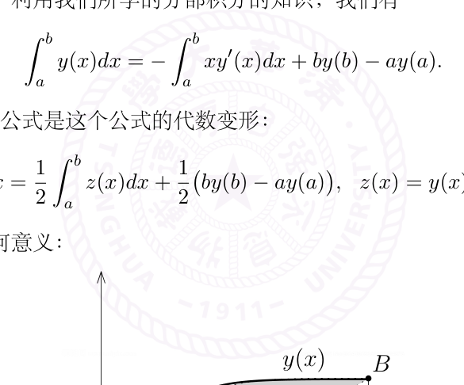
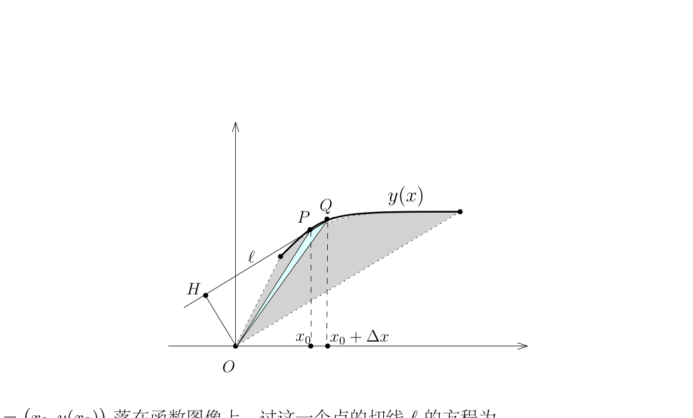
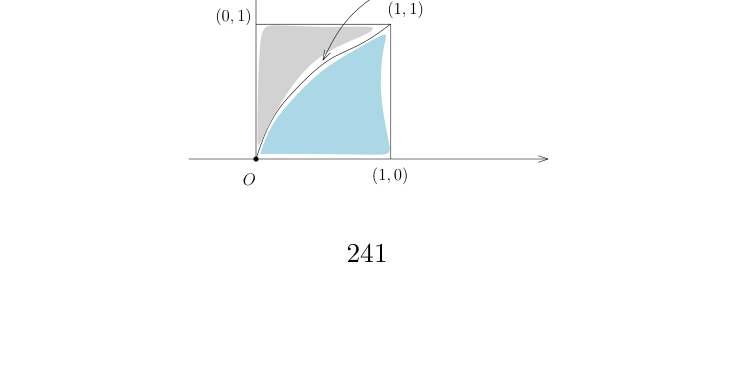

# 微积分历史与含参积分

[返回讲义目录](../../../math-analysis-lecture-notes.md) · [学期目录](../../01-math-analysis-i.md) · [章节目录](../23-parameter-integrals.md) · [校勘记录](../../errata.md) · [上一篇：反常积分、Euler 常数与 Stirling 公式](../22-improper-integrals.md) · [下一篇：23.1 作业：ζ(2) 的无理性](23-03-p0246-0249.md)

<!-- source: PDF 239; printed: 239; transcription: first-pass; proofreading: applied -->

## 23 历史注记：Newton 和 Leibniz 时代的微积分，Leibniz 对 $\dfrac{\pi}{4}$ 的级数表示，微分与积分的交换定理，利用含参积分的计算积分

上次课的开始，我们陈述并证明了下述积分算子：

$$\int_a^b : C\bigl([a,b]\bigr) \longrightarrow \mathbb{R}, \quad f \mapsto \int_a^b f.$$

是连续线性映射。特别地，如果 $f_n \to f$ 是 $C\bigl([a,b]\bigr)$ 一致收敛的序列，那么

$$\lim_{n\to\infty} \int_a^b f_n = \int_a^b f.$$

我们来讲一下这个命题的历史渊源（参见史记-牛顿莱布尼兹列传）。为此，我们考虑级数版本的陈述：假设 $\{f_n\}_{n\geqslant 1} \subset C\bigl([a,b]\bigr)$，考虑 $C\bigl([a,b]\bigr)$ 中的函数项级数

$$f = f_1 + f_2 + f_3 + \cdots$$

我们假设这个级数在 $\|\cdot\|_\infty$ 所定义的距离下是收敛到 $f$ 的，即部分函数和

$$S_n = f_1 + f_2 + \cdots + f_n$$

一致收敛到 $f$。比如说，如果 $f = f_1 + f_2 + f_3 + \cdots$ 绝对收敛，即级数 $\displaystyle\sum_{k=1}^{\infty} \|f_k\|_\infty$，那么这个性质是满足的。此时，我们有

$$\int_a^b \left( \sum_{k=1}^{\infty} f_k(x) \right) dx = \sum_{k=1}^{\infty} \left( \int_a^b f_k(x)\,dx \right).$$

Newton 对于微积分理论的很大贡献来自于他对（广义）二项式展开的研究，用今天的语言来讲，他研究可以用无穷幂级数的形式所给出的函数（他大概相信所有的函数都可以写长这样的形式）。由于时代的限制，他醉心于形如

$$f(x) = a_0 + a_1 x + a_2 x^2 + a_3 x^3 + \cdots$$

的函数的流数术（微分）与反流数术（积分）。他首先发现了形如 $(P + PQ)^{\frac{m}{n}}$ 型函数的二项式展开公式，用今天的话说，我们有

$$(1+x)^{\frac{m}{n}} = 1 + \sum_{k=1}^{\infty} \frac{\dfrac{m}{n}\left(\dfrac{m}{n}-1\right)\cdots\left(\dfrac{m}{n}-k\right)}{(k+1)!} x^k.$$

Newton 本人后来还推导了正弦三角函数 $\sin x$ 的级数表达式：

$$\sin x = x - \frac{1}{6}x^3 + \frac{1}{120}x^5 - \cdots.$$

<!-- source: PDF 240; printed: 240; transcription: first-pass; proofreading: applied -->

他还能够将 $f(x) = a_0 + a_1 x + a_2 x^2 + a_3 x^3 + \cdots$ 的反函数用级数表达，姑且不论其严格性，这在当时是非常了不起的成就。由于当时他知道如何计算形如 $x^m$ 的函数的微分与原函数，所以利用这些函数的级数表达，Newton 可以自由地计算一个给定函数的流数与反流数：

$$f'(x) = a_1 + 2a_2 x^1 + 3a_3 x^2 + \cdots, \quad \int_0^1 f = a_1 + \frac{a_2}{2} + \frac{a_3}{3} + \cdots.$$

当然，从现在的观点看，Newton 假设了对一个级数可以逐项的求微分或者求积分（我们需要某种一致收敛性），这自然不严格。无论怎样，Newton 的成就在于通过级数的理论可以对非常一般的函数进行微分和积分！另外，我们也看到了，级数在微积分的历史上是如何以优雅的方式在极限的概念出现之前登场！这是我们为什么在讲极限的理论的时候一定要同时研究级数（因为这是历史上最自然的极限过程）。

有了这个背景，我们来谈论一下 Leibniz 的某些贡献，他不仅引入了 $dx$ 和 $\int$ 的符号，还和 Newton 分别证明了不同形式的 Newton-Leibniz 公式。假设 $y = y(x)$ 是一个（为了方便起见，递增的）连续可微的函数，利用我们所学的分部积分的知识，我们有

$$\int_a^b y(x)\,dx = -\int_a^b x y'(x)\,dx + b y(b) - a y(a).$$

Leibniz 证明了分部积分公式是这个公式的代数变形：

$$\int_a^b y(x)\,dx = \frac{1}{2}\int_a^b z(x)\,dx + \frac{1}{2}\bigl(b y(b) - a y(a)\bigr), \quad z(x) = y(x) - x y'(x).$$

他的公式有很清晰的几何意义：

函数 $y(x)$ 在 $[a,b]$ 区间上所对应的面积是 $\displaystyle\int_a^b y(x)\,dx$，表达式 $\dfrac{1}{2}\bigl(b y(b) - a y(a)\bigr)$ 是三角形 $\triangle ObB$ 与三角形 $\triangle OaA$ 的面积之差，而 $\dfrac{1}{2}\displaystyle\int_a^b z(x)\,dx$ 是灰色区域的面积。为了说明 $\dfrac{1}{2}\displaystyle\int_a^b z(x)\,dx$ 是面积，我们观察下面的图（由于历史的原因，这个方法有时候被称作是微元法，实质上就是用 Riemann 和来定义积分）：

<!-- source: PDF 241; printed: 241; transcription: first-pass; proofreading: applied -->

点 $P = \left(x_0, y(x_0)\right)$ 落在函数图像上，过这一个点的切线 $l$ 的方程为

$$y - y(x_0) = y'(x_0)(x - x_0).$$

从而，$O$ 到 $l$ 的距离为 $|OH| = \dfrac{|y(x_0) - y'(x_0)x_0|}{\sqrt{y'(x_0)^2 + 1}} = \dfrac{|z(x_0)|}{\sqrt{y'(x_0)^2 + 1}}$。假设 $Q = \left(x_0 + \Delta x, y(x_0 + \Delta x)\right)$，当 $\Delta x$ 很小的时候，我们可以认为上面淡蓝色三角形的底边 $PQ$ 和 $l$ 是同一条直线，它高是 $OH$。由于 $|PQ| = \sqrt{y'(x_0)^2 + 1}\Delta x$，所以，

$$|\triangle OPQ| = \frac{1}{2} \times \frac{|z(x_0)|}{\sqrt{y'(x_0)^2 + 1}} \times \sqrt{y'(x_0)^2 + 1}\Delta x = \frac{1}{2}|z(x_0)|\Delta x.$$

将所有这样的小三角形加起来自然是灰色区域的面积。

Leibniz 的时代自然知道如何计算圆的面积，所以，四分之一圆弧

$$\left\{(x, y)\,\middle|\,(x-1)^2 + y^2 = 1,\, x \in [0,1],\, y \geqslant 0\right\}$$

下的面积是 $\dfrac{1}{4}\pi$。此时，函数 $y = \sqrt{2x - x^2}$，所以我们有

$$\frac{\pi}{4} = \int_0^1 y(x)dx = \int_0^1 \sqrt{2x - x^2}\,dx.$$

我们注意到，$\sqrt{2x - x^2}$ 的 Taylor 展开或者级数展开并不容易计算。Leibniz 利用他的分部积分公式得到

$$\frac{\pi}{4} = \int_0^1 y(x)dx = \frac{1}{2}\int_0^1 z(x)dx + \frac{1}{2}, \quad z(x) = y(x) - xy'(x) = \sqrt{\frac{x}{2-x}}.$$

<!-- source: PDF 242; printed: 242; transcription: first-pass; proofreading: applied -->

为了计算 $\int_0^1 z(x)dx$，我们注意到这加上灰色区域的面积恰好是整个正方形的面积（这只是直观解释，我们将要在作业里证明下面的等式），即

$$\int_0^1 z(x)dx + \int_0^1 x(z)dz = 1.$$

所以，

$$\frac{\pi}{4} = \int_0^1 y(x)dx = 1 - \frac{1}{2}\int_0^1 x(z)dz = 1 - \int_0^1 \frac{z^2}{1 + z^2}dz.$$

我们可以想象在 Leibniz 那个时代应该没有换元积分公式等技术，所以这种直观的几何方法反而是最自然最简单的思考方式。这种变形所得到的被积函数容易展开成级数的形式，所以 Newton 的反流数术可以派得上用场：

$$\frac{\pi}{4} = \int_0^1 \frac{1}{1 + z^2}dz = \int_0^1 \sum_{k=0}^{\infty}(-1)^k z^{2k}dz = \sum_{k=0}^{\infty}\frac{(-1)^k}{2k + 1}.$$

这就证明我们在第四次课中提到的重要极限：

$$1 - \frac{1}{3} + \frac{1}{5} - \cdots + \frac{(-1)^{n-1}}{2n - 1} + \cdots = \frac{\pi}{4}.$$

这是 Leibniz 的原始证明。当然，为了使得最后一步推理严格，我们注意到，对任意的 $\varepsilon$，在 $[0, 1-\varepsilon]$ 上，级数 $\sum_{k=0}^{\infty}(-1)^k z^{2k}$ 一致收敛到 $\dfrac{1}{1 + z^2}$，所以，我们有

$$\int_0^{1-\varepsilon} \frac{1}{1 + z^2}dz = \int_0^{1-\varepsilon} \sum_{k=0}^{\infty}(-1)^k z^{2k}dz = \sum_{k=0}^{\infty}\frac{(-1)^k(1 - \varepsilon)^{2k+1}}{2k + 1}.$$

我们需要证明当 $\varepsilon \to 0$ 时，两边的极限可以取到，我们将这一步留作作业。Huygens 对 Leibniz 的这个公式大加赞许，认为这个公式 *will be celebrated among mathematicians forever*。然而，由于同一时代的英国数学家 James Gregory 研究的了 $\arctan x$ 的级数展开（你是否能证明）：

$$\arctan x = x - \frac{1}{3}x^3 + \frac{1}{5}x^5 - \cdots,$$

这个公式也为后面 Leibniz 与 Newton 在微积分发明权上的争执埋下了伏笔。

### 一些无法计算原函数的定积分的计算

**命题 142**（微分与积分的交换定理，Riemann 积分的版本）. 假设二元函数

$$f(x, t) : [a, b] \times [t_0 - c, t_0 + c] \to \mathbb{R}$$

是连续函数。对于每个 $x \in [a, b]$，我们假设 $\dfrac{df}{dt}(x, t)$ 存在并且

$$\frac{df}{dt} : [a, b] \times [t_0 - c, t_0 + c] \to \mathbb{R}$$

<!-- source: PDF 243; printed: 243; transcription: first-pass; proofreading: applied -->

是连续函数，那么对于每个固定的 $x \in [a, b]$，映射

$$[t_0 - c, t_0 + c] \to \mathbb{R}, \quad t \mapsto \int_a^b f(x, t)dx$$

是关于变量 $t$ 的可微函数并且有如下的等式：

$$\frac{d}{dt}\bigg|_{t=t_0}\left(\int_a^b f(x, t)dx\right) = \int_a^b \frac{df}{dt}(x, t_0)dx.$$

**证明：** 固定 $x \in [a, b]$，我们令 $F(t) = \int_a^b f(x, t)dx$。根据 Lagrange 中值定理，我们有

$$\frac{F(t_0 + h) - F(t_0)}{h} = \int_a^b \frac{df}{dt}\left(x, t_0 + \theta(x, h)h\right),$$

其中 $\theta(x, h) \in [0, 1]$。从而，

$$\frac{F(t_0 + h) - F(t_0)}{h} - \int_a^b \frac{df}{dt}(x, t_0)dx = \int_a^b \left(\frac{df}{dt}\left(x, t_0 + \theta(x, h)h\right) - \frac{df}{dt}(x, t_0)\right).$$

按照要求，$\dfrac{df}{dt}(x, t)$ 是紧集合 $[a, b] \times [t_0 - c, t_0 + c]$ 上的连续函数，从而是一致连续的函数。按照定义，对任意的 $\varepsilon$，存在 $\delta > 0$，只要 $|(x, t) - (x', t')| < \delta$，就有 $|\frac{df}{dt}(x, t) - \frac{df}{dt}(x', t')| < \varepsilon$。据此，当 $|h| < \delta$ 时，我们有

$$\left|\frac{F(t_0 + h) - F(t_0)}{h} - \int_a^b \frac{df}{dt}(x, t_0)dx\right| < \int_a^b \varepsilon = (b - a)\varepsilon.$$

即 $\lim_{h \to 0}\left|\dfrac{F(t_0 + h) - F(t_0)}{h} - \int_a^b \dfrac{df}{dt}(x, t_0)dx\right| = 0$，这就证明命题。$\square$

在这个证明中，最核心的技术是利用如下的引理

**引理 143.** 假设 $f : (X, d) \to \mathbb{R}$ 是紧的距离空间上的连续函数，那么 $f$ 是一致连续的。

**证明：** 任选 $\varepsilon > 0$，按照定义，对任意的 $x$，存在 $\delta_x > 0$，使得对任意的 $y \in B(x, 2\delta_x)$，我们都有 $|f(y) - f(x)| < \dfrac{1}{2}\varepsilon$。很明显，开球的集合 $\{B(x, \delta_x) \mid x \in X\}$ 是 $X$ 的开覆盖，根据紧性，存在 $B(x_1, \delta_1), B(x_2, \delta_2), \cdots, B(x_n, \delta_n)$（其中 $\delta_k = \delta_{x_k}$），它们构成了 $X$ 的一个有限开覆盖。令 $\delta = \min(\delta_1, \cdots, \delta_n)$。此时，任选 $y, y' \in X$，使得 $d(y, y') < \delta$。存在某个 $i_0$，使得 $y \in B(x_{i_0}, \delta_{i_0})$，从而，$y' \in B(x_{i_0}, 2\delta_{i_0})$。据此，我们知道：

$$|f(y) - f(x_{i_0})| < \frac{1}{2}\varepsilon, \quad |f(y') - f(x_{i_0})| < \frac{1}{2}\varepsilon \quad \Rightarrow \quad |f(y) - f(y')| < \varepsilon.$$

这就证明了 $f$ 是一致连续的。$\square$

通过变动参数 $t$，我们可以用连续变换的思想来研究积分的值（依赖于 $t$）：

**例子.** （梗概）

<!-- source: PDF 244; printed: 244; transcription: first-pass; proofreading: applied -->

*1) Euler 关于 $n!$ 的积分公式：*

$$\int_0^\infty x^n e^{-x} dx = n!.$$

我们自然可以通过分部积分将积分化为 $\int_0^\infty e^{-x} dx = 1$ 来进行计算。我们要注意到，一般而言，分部积分公式可能对反常积分并不成立。为此，我们需要用极限来表达反常积分才可以，我们在此略去细节。

另外一个有趣的方法是利用积分和导数可以交换的性质：通过换元 $x \mapsto tx$，我们有

$$\int_0^\infty e^{-tx} dx = \frac{1}{t}.$$

我们对 $t$ 求 $n$ 次导数，得到

$$\int_0^\infty x^n e^{-tx} dx = n! \frac{1}{t^{n+1}}.$$

令 $t = 1$ 即可。当然，我们并不知道上面的关于积分和导数可以交换的性质在此情况下是否能够运用，但是，不难看出，每次求导数之后，函数 $x^n e^{-tx}$ 是关于 $(x, t) \in [0, \infty) \times [\frac{1}{2}, \frac{3}{2}]$ 的一致连续的函数，所以命题仍然成立。

*2) (Gauss 积分)* $\displaystyle\int_{-\infty}^{\infty} e^{-x^2} dx = \sqrt{\pi}$（应该熟记这个结论）。

我们定义

$$I = \int_0^\infty e^{-\frac{x^2}{2}} dx, \quad F(t) = \int_0^\infty \frac{e^{-\frac{t^2(1+x^2)}{2}}}{1 + x^2} dx.$$

由于积分因子在 $[1, \infty)$ 上被 $\frac{1}{x^2}$ 控制，所以 $F(t)$ 收敛。我们对 $t$ 求导数，它可以与积分号交换（和上面一个道理），从而

$$F'(t) = -t e^{-\frac{t^2}{2}} \int_0^\infty e^{-\frac{t^2 x^2}{2}} dx = -I e^{-\frac{t^2}{2}},$$

其中。我们注意到 $F(0) = \frac{\pi}{2}$。另外，我们有

$$F(\infty) = \lim_{t \to \infty} F(t) = 0.$$

这因为

$$\int_0^\infty \frac{e^{-\frac{t^2(1+x^2)}{2}}}{1 + x^2} \leqslant \int_0^\infty \frac{2}{t^2(1+x^2)^2} = \frac{2}{t^2} \times \int_0^\infty \frac{dx}{(1+x^2)^2} = O\!\left(\frac{1}{t^2}\right).$$

我们有

$$\frac{\pi}{2} = -\int_0^\infty F'(t) dt = I^2.$$

据此，我们就算得了 Gauss 积分。

*3) 我们研究积分 $\displaystyle\int_0^\infty e^{-tx} \frac{\sin x}{x} dx$，其中 $t \in [0, \infty)$。*

我们注意到

<!-- source: PDF 245; printed: 245; transcription: first-pass; proofreading: applied -->

- 当 $t > 0$ 时，

为此，我们令 $F(t) = \displaystyle\int_0^\infty e^{-tx} \frac{\sin x}{x} dx$，那么（为什么），$F'(t) = -\displaystyle\int_0^\infty e^{-tx} \sin x\, dx$。我们可以计算不定积分

$$\int e^{ax} \sin x\, dx = \frac{a \sin x - \cos x}{1 + a^2} e^{ax}.$$

所以，

$$F'(t) = \frac{t \sin x + \cos x}{1 + t^2} e^{-tx} \Big|_{x=0}^{x=\infty} = -\frac{1}{1 + t^2}.$$

从而，$F(t) = -\arctan t + C$，其中 $C$ 为常数。为了确定 $C$，我们令 $t \to \infty$ 即可。特别地，令 $t = 0$，我们得到

$$\int_0^\infty \frac{\sin x}{x} dx = \frac{\pi}{2}.$$

$$\int_0^\infty e^{-tx} \frac{\sin x}{x} dx = \frac{\pi}{2} - \arctan t。$$

[返回讲义目录](../../../math-analysis-lecture-notes.md) · [学期目录](../../01-math-analysis-i.md) · [章节目录](../23-parameter-integrals.md) · [校勘记录](../../errata.md) · [上一篇：反常积分、Euler 常数与 Stirling 公式](../22-improper-integrals.md) · [下一篇：23.1 作业：ζ(2) 的无理性](23-03-p0246-0249.md)
