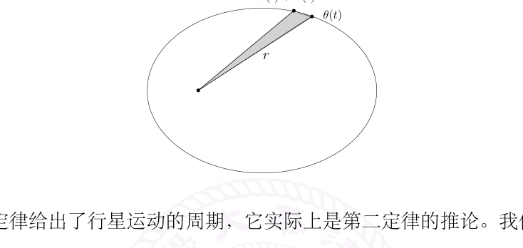
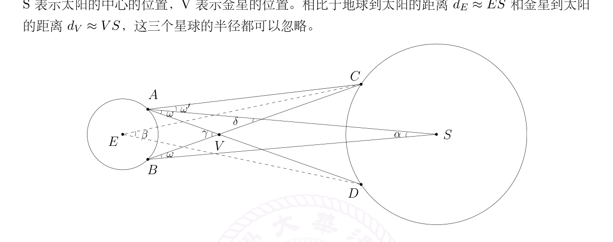
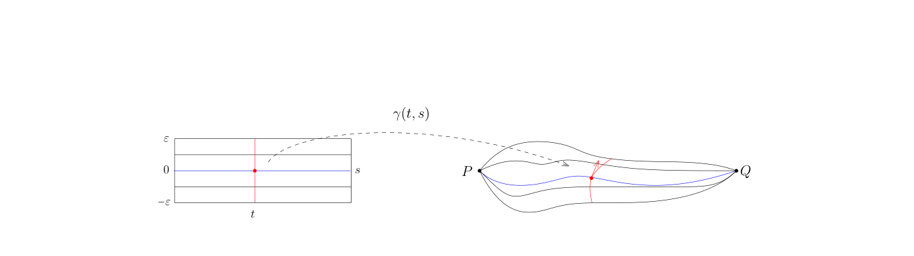

# 24：常微分方程、Kepler 定律与变分法

[返回讲义目录](../../math-analysis-lecture-notes.md) · [学期目录](../01-math-analysis-i.md) · [校勘记录](../errata.md) · [上一篇：23.1：作业：ζ(2) 的无理性](23-parameter-integrals/23-03-p0246-0249.md) · [下一篇：最速降线与积分第一中值定理](25-brachistochrone/25-01-p0262-0266.md)

<!-- source: PDF 250; printed: 250; transcription: first-pass; proofreading: applied -->

## 常微分方程解的存在唯一性

回忆一下，在第七次课中，我们证明如下压缩映像定理：

$(X, d)$ 是完备的距离空间。假设映射 $T : X \to X$ 是压缩映射，即存在常数 $0 < \gamma < 1$，使得对任意的 $x, x' \in X$，我们都有

$$d(T(x), T(x')) \leqslant \gamma d(x, x').$$

那么，$T$ 必有唯一的不动点，即存在唯一的 $x_* \in X$，使得 $T(x_*) = x_*$。

不动点定理与微积分基本定理结合，可以证明常微分方程解的存在唯一性定理：

**定理 144**（Cauchy-Lipschitz）。给定完备的赋范线性空间 $V$（通常我们假设 $V = \mathbb{R}^n$），$\Omega \subset V$ 是开集，$I \subset \mathbb{R}$ 是开区间，$f : \Omega \times I \to V$ 是给定的连续函数（映射）。假设存在 $C > 0$，对任意的 $t \in I$，映射

$$\Omega \to V, \quad x \mapsto f(x, t)$$

是 $C$-Lipschitz 映射，即对任意的 $x, y \in \Omega$，有如下估计

$$|f(x, t) - f(y, t)| \leqslant C|x - y|.$$

那么，对任意的（初始值）$(x_0, t_0) \in \Omega \times I$，存在 $\delta > 0$（可能依赖于 $(x_0, t_0)$），存在唯一的映射 $x(t) : (t_0 - \delta, t_0 + \delta) \to \Omega$，满足如下的常微分方程：

$$\begin{cases} x'(t) = f(x(t), t), \\ x(t_0) = x_0. \end{cases}$$

假设我们想解常微分方程（以 $V = \mathbb{R}$ 为例子）

$$x'(t) = f(x(t), t).$$

这个定理讲的是对任意给定的初值 $x_0$，即要求 $x(t_0) = x_0$，总能存在比较小的的一个时间窗口 $(t_0 - \delta, t_0 + \delta)$，使得我们能找到唯一一个函数

$$x : (t_0 - \delta, t_0 + \delta) \to \mathbb{R}$$

满足方程和初值条件。换句话说，这样的常微分方程系统局部上总是有解的，当然，我们必须要求 $f(x, t)$ 对 $x$ 有比较好的光滑性假设（Lipschitz）。

**注记。** 定理 *Lipschitz* 的假设是重要的：

<!-- source: PDF 251; printed: 251; transcription: first-pass; proofreading: applied -->

1) 如果只假设 $f$ 对于 $x$ 变量是连续的，即不进一步要求 Lipschitz 条件 $|f(x, t) - f(y, t)| \leqslant C|x - y|$ 成立，那么定理的结论并不成立。实际上，我们仍然可以证明上面的常微分方程系统局部上有解（Peano 定理），但是解可能并不唯一。

2) 在应用这个定理的时候，$f(t, x)$ 通常都是非常光滑的函数，比如说对任意的 $t \in I$，映射 $x \mapsto f(t, x)$ 是 $C^1$ 的（$x \in \mathbb{R}$）。我们进一步假设（这个条件在应用的时候一般也都成立）函数 $(t, x) \mapsto \dfrac{df}{dx}(t, x)$ 是连续映射。所以，通过适当的缩小 $\Omega$ 和 $I$，就存在 $C > 0$，使得

$$\sup_{(t,x) \in I \times \Omega} \left| \frac{df}{dx}(t, x) \right| \leqslant C.$$

根据 Lagrange 中值定理，我们有

$$|f(x, t) - f(y, t)| = \left| \frac{df}{dx}(t, x + \theta(y - x))(x - y) \right| \leqslant C|x - y|.$$

此时，定理的条件是成立的。

**证明：** 我们首先利用 Newton-Leibniz 公式将问题转化为一个积分方程的问题。假设 $x'(t)$ 是方程

$$\begin{cases} x'(t) = f(x(t), t), \\ x(t_0) = x_0. \end{cases}$$

的解，这个解自然是连续的。根据 Newton-Leibniz 公式，我们必然有

$$\boxed{x(t)} = x_0 + \int_{t_0}^{t} f(\boxed{x(\tau)}, \tau) d\tau, \quad t \in I.$$

如果我们将 $x(t)$ 视为某个空间中的点，那么上面的积分等式可以被理解为一个不动点的表达式。我们可以精确地描述这个问题：令 $X = \left( C\left([t_0 - \delta, t_0 + \delta]\right), \|\cdot\|_\infty \right)$，这是一个完备的距离空间，其中 $\delta$ 待定。我们定义 $X$ 到自身的映射：

$$T : C\left([t_0 - \delta, t_0 + \delta]\right) \to C\left([t_0 - \delta, t_0 + \delta]\right), \quad x(t) \mapsto x_0 + \int_{t_0}^{t} f(\boxed{x(\tau)}, \tau) d\tau.$$

所以，积分形式的问题可以表述为

$$Tx = x.$$

为了证明不动点的存在性，我们需要验证压缩映像的条件：对任意的 $x(t), y(t) \in C\left([t_0 - \delta, t_0 + \delta]\right)$，对给定的 $t \in [t_0 - \delta, t_0 + \delta]$，我们有

$$\begin{aligned} \left| T\left(x(t)\right) - T\left(y(t)\right) \right| &\leqslant \int_{t_0}^{t} |f(x(\tau), \tau) - f(y(\tau), \tau)| d\tau \\ &\leqslant \int_{t_0}^{t} C|x(\tau) - y(\tau)| d\tau \leqslant C \sup_{x \in [t_0 - \delta, t_0 + \delta]} \int_{t_0}^{t} d\tau \\ &\leqslant C\delta\, d_\infty\left(x(t), y(t)\right). \end{aligned}$$

<!-- source: PDF 252; printed: 252; transcription: first-pass; proofreading: applied -->

由于这对任意的 $t \in [t_0 - \delta, t_0 + \delta]$ 都成立，所以

$$d_\infty\Big(T\big(x(t)\big), T\big(y(t)\big)\Big) \leqslant C\delta d_\infty\big(x(t), y(t)\big).$$

只要 $\delta C \leqslant \frac{1}{2}$，我们就有 $d_\infty\Big(T\big(x(t)\big), T\big(y(t)\big)\Big) \leqslant \frac{1}{2} d_\infty\big(x(t), y(t)\big)$，根据不动点定理，存在唯一的 $x(t) \in X$，满足

$$x(t) = x(t_0) + \int_{t_0}^{t} f(x(\tau), \tau) d\tau.$$

很明显，$x(t_0) = x_0$ 由于 $x(t) \in C\big([t_0 - \delta, t_0 + \delta]\big)$，所以右边的积分项定义的函数是连续可微的，从而 $x(t)$ 连续可微。通过求微分，我们得到

$$x'(t) = f(x(t), t).$$

命题得到了证明。$\square$

在应用的时候，我们经常会遇到二阶的微分方程

$$\begin{cases} x''(t) = f(x'(t), x(t), t), \\ \big(x(t_0), x'(t_0)\big) = (x_0, v_0) \end{cases}$$

这样的系统可以约化为一阶的系统：定义 $X(t) = \begin{pmatrix} x(t) \\ x'(t) \end{pmatrix}$，那么，上述方程就变成了

$$\begin{cases} X'(t) = F(X(t), t), \\ X(t_0) = \begin{pmatrix} x_0 \\ v_0 \end{pmatrix}, \end{cases} \qquad F\!\left(\begin{pmatrix}u\\v\end{pmatrix},t\right)=\begin{pmatrix}v\\f(v,u,t)\end{pmatrix}.$$

从而，仍然局部有解。当然，为了解这个方程，我们需要一开始给定两个初始值。比如说，考虑方程

$$f'' + f = 0.$$

如果初始值给的是 $f(0) = 0$，$f'(0) = 1$，那么就唯一的锁定了 $\sin x$ 作为上述方程的解；如果初始值给的是 $f(0) = 1$，$f'(0) = 0$，那么就得到 $\cos x$ 作为上述方程的解。上面从二阶方程到一阶方程的转变过程也体现了向量值函数的微积分理论的威力。

**练习。** 你是否能写出下面方程的解：

$$\begin{cases} f'' + f = 0, \\ (f(0), f'(0)) = (c_0, c_1). \end{cases}$$

## 行星运动的 Kepler 定律：Newton 的数学推导

我们中学学习过经典力学中 Newton 的三个运动定律：

<!-- source: PDF 253; printed: 253; transcription: first-pass; proofreading: applied -->

1) 任何物体都保持静止或匀速直线运动的状态，直到受到其它物体的作用力迫使它改变这种状态为止。

2) 物体在受到合外力的作用会产生加速度，加速度的方向和合外力的方向相同，加速度的大小正比于合外力的大小与物体的惯性质量成反比。

3) 两个物体之间的作用力和反作用力，在同一条直线上，大小相等，方向相反。

我们再回忆 Newton 的万有引力定律：

给定两个质点，它们之间引力的大小正比于每个质点的质量，反比于距离的平方：

$$F = \frac{Gm_1 m_2}{r^2}, \quad G = 6.67 \times 10^{-11} \frac{\text{N} \cdot \text{m}^2}{\text{kg}^2},$$

其中 $m_1$ 和 $m_2$ 是两个质点的质量，$r$ 是他们之间的距离。其中，根据标准的单位制，$\text{N} = \dfrac{\text{kg} \cdot \text{m}}{\text{s}^2}$。

对于太阳系中行星的运动，我们可以做如下理想的数学假设：

1) 把太阳和行星都想象成质点，这因为星球本身的半径和运动轨道的尺度相比较可以忽略；

2) 假设行星之间并没有相互引力，这因为太阳的质量大概占了太阳系质量的 99.8% 以上，其它行星的质量贡献太小可以忽略不计。

行星运动的空间我们用 $\mathbb{R}^3$ 来描述，通过选取坐标系，可以假设太阳（质量 $= M$）在原点 $(0, 0, 0) \in \mathbb{R}^3$ 处。假设在时刻 $t$ 时，行星（质量 $= m$）所处的位置是 $x(t) \in \mathbb{R}^3$，所谓行星运动的刻画就是描述映射 $t \mapsto x(t)$，比如说，知道 2019 年 12 月 9 日早上 9：50 数学分析课开始的时候地球在太阳系的位置 $x(2019)$ 和速度 $x'(2019)$，我们要知道 1750000000 年后地球的位置（据说地球上的生物还有机会生活至少 17.5 亿年）。

根据 Newton 第二定律（速度的导数是加速度），我们有

$$F = mx''(t) = -\frac{GMm}{r^2} \frac{x(t)}{r},$$

其中 $r(t) = |x(t)|$ 是行星到太阳的距离，$-\dfrac{x(t)}{r}$ 是它受力的方向。所以说，行星的运动轨迹 $x(t)$ 满足如下的常微分方程：

$$x''(t) = -GM \frac{x(t)}{r^3}.$$

我们注意到上面的方程和行星本身的质量 $m$ 没有关系，只和太阳的质量 $M$ 有关！

这个问题本身很明显是不依赖于坐标系的选择的，我们为了方便才引入的坐标系。所以，通过适当的选取坐标系统，我们假设在开始的时刻 $x(0) = x_0$ 和 $x'(0) = v_0$ 都落在坐标平面 $z = 0$ 上，即 $x_0$ 和 $v_0$ 的第三个坐标是零。

我们来观察运动方程 $x''(t) = -GM\dfrac{x(t)}{r^3}$ 中第三个坐标 $z(t)$ 满足的方程：

$$\begin{cases} z''(t) = -\dfrac{GM}{r^3} z(t), \\ (z(0), z'(0)) = (0, 0). \end{cases}$$

<!-- source: PDF 254; printed: 254; transcription: first-pass; proofreading: applied -->

我们可以将 $r$ 看做是已经给定的函数（如果有解的话）并且假设 $r \neq 0$（如果 $r = 0$ 的话行星就撞上太阳了！）。那么，$z(t) \equiv 0$ 是上述方程的一个解。根据常微分方程的解的存在唯一性，我们知道

$$z(t) \equiv 0.$$

所以，如果初始时刻行星的位置和速度处于一个平面，那么自始至终，行星都在这个平面上运动。根据这些推导，我们可以假设行星只做平面运动，即 $x(t) \in \mathbb{R}^2$。

**注记。** 上面的论证可以在物理上用角动量守恒来证明，我们走了捷径。下面的推导可以通过能量守恒来考虑（在常微分方程的理论中，这被称作是首次积分），为了篇幅和时间的考虑，我们不再追究背后的这些深层次的原因。

用平面上的极坐标系改写 Newton 的运动方程（$x(t) = r(t)e^{i\theta(t)}$ 用复数的形式表达），那么 $r(t)$ 和 $\theta(t)$ 也是可微的（为什么）。此时，我们有

$$x''(t) = \left[r''(t) - r(t)|\theta'(t)|^2 + i\left(2r'(t)\theta'(t) + r(t)\theta''(t)\right)\right]e^{i\theta(t)}.$$

代入方程，比较系数就得到

$$\begin{cases} 2r'(t)\theta'(t) + r(t)\theta''(t) = 0, \\ r''(t) - r(t)|\theta'(t)|^2 = -\dfrac{GM}{r(t)^2}. \end{cases}$$

第一个方程等价于 $\left(r^2\theta'(t)\right)' = 0$，所以，存在常数 $c$，使得

$$r(t)^2\theta(t)' = c.$$

如果一开始 $c = 0$，那么只能是 $\theta(t)' = 0$，即 $\theta(t)$ 恒为常数，所以行星做直线运动，这样它或者远离太阳或者冲向太阳，我们不关心这种情况。

我们假设 $c > 0$（通过对换 $x$ 轴和 $y$ 轴，我们总可以假设行星逆时针运动）。特别地，$\theta$ 局部上是 $t$ 的增函数，所以局部上我们可以考虑 $t \mapsto \theta(t)$ 的逆映射，也就是说我们认为 $t$（至少在局部上）是 $\theta$ 的函数。再定义函数 $s(t) = \dfrac{1}{r(t)}$。转换一下视角：我们现在用 $\theta$ 作为变量，来描述 $s(t) = s(\theta)$ 的运动。

按照定义，第一个方程可以写成

$$\theta'(t) = c \cdot s(t)^2.$$

根据链式法则，我们有

$$r'(t) = -\frac{s'(t)}{s^2(t)} = -\frac{1}{s(t)^2}\frac{ds}{d\theta}(\theta(t))\theta'(t) = -c\frac{ds}{d\theta}(t).$$

所以，我们有

$$r''(t) = \left(-c\frac{ds}{d\theta}(\theta(t))\right)' = -c^2 s(t)^2 \frac{d^2 s}{d\theta^2}(\theta(t)) \quad \Leftrightarrow \quad r''(t) = -c^2 s^2 \frac{d^2 s}{d\theta^2}.$$

<!-- source: PDF 255; printed: 255; transcription: first-pass; proofreading: applied -->

代入第二个方程，我们得到

$$-c^2 s^2 \ddot{s} - c^2 s^3 = -GMs^2,$$

其中 $\dot{s}$ 代表对 $\theta$ 求导数。经过整理，我们得到

$$\ddot{s} + s = \frac{GM}{c^2}.$$

这个方程的解不容易一下子猜出来。但是我们观察到，如果右边没有常数 $\dfrac{GM}{c^2}$，解这个方程就是在解关于 $\sin$ 和 $\cos$ 的方程。从而，我们知道方程的解一定形如

$$s(\theta) = B\cos\theta + A\sin\theta + \frac{GM}{c^2},$$

这里 $A$ 和 $B$ 都是待定的常数。

我们选取行星近地点（即离着太阳最近的时候）作为初始时刻：数学上来说，就是 $\theta = 0$ 时，$s$ 最大，所以

$$s'(0) = 0, \quad s''(0) \leqslant 0$$

代入 $s(\theta)$ 的待定表达式，我们得到

$$s(\theta) = B\cos\theta + \frac{GM}{c^2}, \quad B \geqslant 0.$$

从而，我们得到

$$r = \frac{\dfrac{c^2}{GM}}{1 + \dfrac{Bc^2}{GM}\cos\theta}.$$

这是圆锥曲线方程在极坐标下的表达。令 $e = \dfrac{Bc^2}{GM}$，$\ell = \dfrac{c^2}{GM}$，方程变化为

$$r = \frac{\ell}{1 + e\cos\theta},$$

其中 $e \geqslant 0$ 是圆锥曲线的离心率。按照离心率的大小，我们有如下的分类

- $e = 0$。此时，行星的运动轨迹恰好是一个圆，半径为 $a = \ell$。

- $0 < e < 1$。此时，行星的运动轨迹恰好是一个椭圆。我们回忆一下，椭圆的半短轴 $b$ 和半长轴 $a$ 的比例为 $\sqrt{1-e^2} = \dfrac{b}{a}$，那么 $\ell = a(1-e^2) = \dfrac{b^2}{a}$。

- $e = 1$。此时，行星的运动轨迹恰好是一个抛物线。

- $e > 1$。此时，行星的运动轨迹恰好是一个双曲线的一支。

我们回忆一下，Kepler 通过研究前人的观测数据，发现和总结了关于行星运动的三个定律：

(1) 每个行星都沿各自的椭圆轨道环绕太阳运行，太阳处在椭圆的一个焦点上。

(2) 在相等时间内，太阳和运动着的行星的连线所扫过的面积都是相等的。

<!-- source: PDF 256; printed: 256; transcription: first-pass; proofreading: applied -->

(3) 行星绕太阳公转周期的平方和它们的椭圆轨道的半长轴的立方成正比。

至此，我们已经严格从数学上论证了 Kepler 的第一定律！

我们现在证明 Kepler 的第二定律，这等价于说面积的变化率是常数。当然，迄今为止，我们并未定义面积（严格的定义和二重积分密切相关）。我们给出不严格的论证：在上面的计算中，我们已经证明 $r^2(t)\theta'(t) = c$，它的一半就是面积的变化率，因为当 $t$ 从 $t$ 变为 $t+\Delta t$ 时，$\theta$ 变为 $\theta + \theta'(t)\Delta t$，而面积的变化大约为 $\frac{1}{2}r^2\theta'(t)\Delta t$，请参见下图的灰色三角形：

Kepler 第三定律给出了行星运动的周期，它实际上是第二定律的推论。我们首先计算椭圆的面积：

**练习。** 给定 $\mathbb{R}^2$ 上由方程 $\dfrac{x^2}{a^2} + \dfrac{y^2}{b^2} = 1$ 定义的椭圆，它的面积为 $\pi ab$。实际上，我们可以用积分来定义这个叙述：

$$4\int_0^a \sqrt{b^2\left(1 - \frac{x^2}{a^2}\right)}\,dx = \pi ab.$$

于是，周期 $T = \dfrac{2\pi ab}{c}$（因为 $c/2$ 是面积的变化率）。通过之前对各个参数的计算，我们立即得到

$$T^2 = \frac{4\pi^2 a^3}{GM}.$$

这就是第三定律。我们特别强调，上面的表达式中 $M$ 是太阳的质量。

### 跑题：太阳质量的测量

根据 Kepler 第三定律的公式，太阳的质量可以用 $M = \dfrac{4\pi^2 a^3}{GT^2}$ 来计算。在这个公式中，$\pi$ 和 $G$ 是已知的参数。由于我们绕太阳转一周就是一年，所以 $T$ 也已经知道。参数 $a$（几乎）是地球到太阳的距离，所以如果能测量日地距离（需要一把稍长的尺子），我们就能称太阳的重量！关于日地距离的计算，我们用金星凌日法。所谓的金星凌日就是太阳、地球和金星这三个点在一条直线上的天文现象（我国古人称之为太白犯主：太白主兵，与日合，大不详），历史上有记载的玄武门之变之前有金星凌日！1677 年，Halley 预测了 1761 年的会发生金星凌日，他认为通过在地球上若干个地点的观测再加上对金星运动周期的观测数据，就可能算出太阳的距离。他晚年的时候又提出了利用金星凌日计算日地距离的精确方法。然而，老英雄 Halley 壮志未酬，因为 1656 年生的他注定等不到这一天的来临。1769 年（1761 年那次金星凌日由于技术原因没有成功），通过欧洲的

<!-- source: PDF 257; printed: 257; transcription: first-pass; proofreading: applied -->

科学家的观测以及与在 Tahiti 岛的英国航海家 James Cook 船长的观测（英法正处战争，法国政府特别下令要保护 Cook 的船以保证测量的进行），之后不久法国人 Lalande 据此算出了地球与太阳间的距离大约为 1.5 亿公里（$\approx 1.5 \times 10^{11}\,\text{m}$）。据此，我们可以算出太阳的质量是 $2 \times 10^{30}\,\text{kg}$。

我们现在简单描述金星凌日的基本想法。在下图中，我们用 $E$ 表示地球的球心所在的位置，用 $S$ 表示太阳的中心的位置，$V$ 表示金星的位置。相比于地球到太阳的距离 $d_E \approx ES$ 和金星到太阳的距离 $d_V \approx VS$，这三个星球的半径都可以忽略。

在金星凌日的时刻，我们假设在地球上的上半球 $A$ 点有人观测太阳，他将看到金星在太阳上的影子在 $D$ 处；同样地，我们不妨假设在下半球对称的位置 $B$ 处有人观测，她将看到金星的影子投在了太阳上的 $C$ 处。根据照片上 $C$ 和 $D$ 的位置以及相机焦距的性质，我们可以算出角度 $\beta$，也就是说 $\beta$ 是通过测量可以知道的。

由于地球和太阳相距特别远，所以我们可以假设 $\omega + \omega' = \angle CAD \approx \angle CED = \beta$。类似地，我们有 $\omega \approx \omega'$。根据三角形外角的性质，我们有

$$\gamma = \omega + \omega + \alpha \approx \omega + \omega' + \alpha = \beta + \alpha.$$

从而，$\gamma \approx \alpha + \beta$。根据正弦定理，我们有

$$\frac{\frac{1}{2}AB}{AV} = \sin\!\left(\frac{1}{2}\gamma\right) \approx \frac{1}{2}\gamma, \qquad \frac{\frac{1}{2}AB}{AS} = \sin\!\left(\frac{1}{2}\alpha\right) \approx \frac{1}{2}\alpha.$$

上面我们用到了当 $x$ 足够小的时候，$\sin x \approx x$。从而，我们得到如下的近似等式

$$\frac{\gamma}{\alpha} \approx \frac{AS}{AV} \approx \frac{ES}{EV} = \frac{d_E}{d_E - d_V} = \frac{1}{1 - \dfrac{d_V}{d_E}}.$$

又因为 $\gamma = \alpha + \beta$，所以

$$\frac{\alpha + \beta}{\alpha} \approx \frac{1}{1 - \dfrac{d_V}{d_E}} \Rightarrow \alpha \approx \left(\frac{d_E}{d_V} - 1\right)\beta.$$

另外，我们可以通过天文观测来得到地球和金星的运行周期（地球恰好是 1 年！），根据 Kepler 的第三个定律，我们就可以计算 $\dfrac{d_E}{d_V}$（这因为这两个行星的轨道差不多就是圆）。据此，我们可以计算角度 $\alpha$。我们可以在地球上计算 $AB$ 之间的距离（测量！），根据

$$\frac{\frac{1}{2}AB}{AC} = \sin\!\left(\frac{1}{2}\alpha\right) \approx \frac{1}{2}\alpha \quad AC \approx d_E,$$

<!-- source: PDF 258; printed: 258; transcription: first-pass; proofreading: applied -->

我们得到计算公式

$$d_E \approx \frac{AB}{\left(\frac{d_E}{d_V}-1\right)\beta}.$$

据此，我们就可以计算地球到太阳的距离了。

## 空间曲线的长度

我们引入（空间）曲线和曲线的长度的概念。假设 $I = [a, b] \subset \mathbb{R}$ 是有界区间，考虑 $C^1$ 的映射

$$\gamma : I \to \mathbb{R}^n,$$

如果 $\gamma$ 是 $C^1$ 的，我们就将映射 $\gamma$ 称作是一条 $C^1$ 的**（空间）曲线**。有些书籍的作者会要求 $\gamma'(x) \neq 0$，这和子流形的概念相关，我们会在下个学期进行系统的学习。习惯上，我们倾向于把映射的像 $\gamma([a,b])$ 看做是曲线。在做计算的时候，我们则更关心如何通过一个映射 $\gamma$ 用一个区间 $I = [a,b]$ 将这个曲线参数化的：假设我们有连续可微的可逆的递增映射 $\varphi : J = [a', b'] \to [a, b]$，那么我们可以考虑曲线的另一个参数化 $\gamma \circ \varphi : [a', b'] \to \mathbb{R}^n$：

$$\begin{array}{ccc} J & \xrightarrow{\varphi} & I \\ {\scriptstyle \gamma\circ\varphi} \searrow & & \downarrow {\scriptstyle \gamma} \\ & \mathbb{R}^n & \end{array}$$

很明显，这两个参数化给出的曲线的像是一致的，但是我们认为这是两条不同的曲线。

任意给定曲线 $\gamma : [a, b] \to \mathbb{R}^n$，我们定义它的**长度**为（= 速度的积分）：

$$\ell(\gamma) = \int_a^b |\gamma'(t)| dt.$$

我们强调，对于 $\gamma'(t) = (\gamma_1'(t), \cdots, \gamma_n'(t))$，其长度 $|\gamma'(t)|$ 指的是

$$|\gamma'(t)| = \sqrt{\sum_{j=1}^n |\gamma_j'(t)|^2}.$$

如果换了参数化，根据换元积分公式，我们可以做如下的计算（按照分量来计算！）：

$$\ell(\gamma \circ \varphi) = \int_{a'}^{b'} |\varphi'(t) \cdot \gamma'(\varphi(t))| dt = \int_{a'}^{b'} |\gamma'(\varphi(t))| \varphi'(t) dt \overset{\tau = \varphi(t)}{=} \int_a^b |\gamma'(\tau)| d\tau = \ell(\gamma).$$

这表明一条曲线的长度的定义不依赖于参数化的选取。

**注记。** 如果我们仅仅要求 $\gamma$ 是连续的而不是连续可微的，我们就可以造出很奇怪的曲线，比如说我们已经证明了存在可以填充 $[0,1] \to [0,1] \times [0,1]$ 的曲线。

如果只能学习两条曲线的话，那么我们没有选择：

<!-- source: PDF 259; printed: 259; transcription: first-pass; proofreading: applied -->

**例子。** 我们研究直线和圆：

1) **直线段**。假设 $P = (x_1, \cdots, x_n)$ 和 $Q = (y_1, \cdots, y_n)$ 是 $\mathbb{R}^n$ 中的两点，它们之间的线段用 $\overline{PQ}$ 表示。我们用 $[0,1]$ 区间来参数化它：

$$\gamma : [0,1] \to \mathbb{R}^n, \quad t \mapsto P + t(Q - P) = \left(\cdots, x_j + t(y_j - x_j), \cdots\right).$$

据此，我们有

$$\ell(\overline{PQ}) = \int_0^1 \sqrt{\sum_{j=1}^n |y_j - x_j|^2} \, dt = \sqrt{(x_1 - y_1)^2 + \cdots + (x_n - y_n)^2}$$

2) **圆周**。我们把平面 $\mathbb{R}^2$ 上到原点的距离为 $R$ 的点所组成的集合 $\left\{(x,y) \mid x^2 + y^2 = R^2\right\}$ 称作是半径 $R$ 的圆周。根据对称性，我们只考虑 $x \geqslant 0$ 和 $y \geqslant 0$ 的部分（在第一象限的圆周），也就是四分之一个圆周，它可以被下面的映射参数化：

$$[0, R] \to \mathbb{R}^2, \quad x \mapsto \left(x, \sqrt{R^2 - x^2}\right).$$

我们还可以令 $x = R\sin\theta$，其中 $\theta \in \left[0, \dfrac{\pi}{2}\right]$（我们这里利用了 $\sin : \left[0, \dfrac{\pi}{2}\right] \to [0,1]$ 是连续可微的单调的可逆映射），那么就有四分之一个圆周的另一个参数化

$$\left[0, \frac{\pi}{2}\right] \to \mathbb{R}^2, \quad \theta \mapsto (R\sin(\theta), R\cos(\theta)).$$

我们只利用解析意义下定义的 $\sin$ 和 $\cos$ 的性质（这个参数化实际上就已经说明了经典意义下所定义的三角函数和我们所定义的是一致的）。根据第二个参数化，我们有

$$\ell = \int_0^{\frac{\pi}{2}} \left|(R\cos(\theta), -R\sin(\theta))\right| d\theta = \frac{1}{2}\pi R.$$

所以圆的周长公式为 $4 \times \dfrac{1}{2}\pi R = 2\pi R$，这就说明我们定义的 $\pi$ 和经典意义下的 $\pi$ 是一致的。另外，如果利用第一个参数化，我们就有

$$\ell = \int_0^R \sqrt{\frac{R^2}{R^2 - x^2}} \, dx.$$

关于这个积分的计算实际上还是要做变量替换 $x = R\cos(\theta)$ 和 $y = R\sin(\theta)$。

## 变分法与线段最短

我们中学知道两点之间线段最短，然而，只有有了微积分，才可以正确的叙述并证明这个结论：给定 $P, Q \in \mathbb{R}^n$，我们考虑连接 $P$ 和 $Q$ 的一族曲线：

$$\gamma(t, s) : [0,1] \times [-\varepsilon, \varepsilon] \to \mathbb{R}^n,$$

其中对于每个固定的 $s \in [-\varepsilon, \varepsilon]$，$t \mapsto \gamma(t, s)$ 都是曲线。我们还要求所有曲线的起点和终点都分别是 $P$ 和 $Q$，即 $\gamma(0, s) \equiv P$，$\gamma(1, s) \equiv Q$：

<!-- source: PDF 260; printed: 260; transcription: first-pass; proofreading: applied -->

我们可以认为这族曲线是曲线 $\gamma(t, 0)$ 的附近的一个小的扰动。按照定义，曲线 $\gamma_s(t) = \gamma(t, s)$ 的长度为：

$$
\ell(\gamma_s) = \int_0^1 \sqrt{\left(\dot{\gamma}_1(t,s)\right)^2 + \left(\dot{\gamma}_2(t,s)\right)^2 + \cdots + \left(\dot{\gamma}_n(t,s)\right)^2}\, dt.
$$

其中，我们用 $\dot{\gamma}(t, s)$ 表示对 $t$ 的导数。如果 $\gamma_0$ 的长度是最短的，那么根据极值的导数判定，我们就应该有

$$
\left.\frac{d\ell(\gamma_s)}{ds}\right|_{s=0} = 0.
$$

此时，我们假设以上给出的曲线族是足够光滑的，即 $\dot{\gamma}(t, s)$ 在 $[0,1] \times [-\varepsilon, \varepsilon]$ 上是连续的并且 $\frac{d}{ds}(\dot{\gamma}(t, s))$ 也是连续的。这样，我们就可以交换积分和求导，得到

$$
\left.\frac{d\ell(\gamma_s)}{ds}\right|_{s=0} = \int_0^1 \frac{\dot{\gamma}(t,0)}{|\dot{\gamma}(t,0)|} \cdot \frac{d}{ds}(\dot{\gamma}(t,0))\, dt
$$

$$
= \int_0^1 \frac{\dot{\gamma}(t,0)}{|\dot{\gamma}(t,0)|} \cdot \frac{d}{dt}\left(\frac{d}{ds}(\gamma(t,0))\right) dt
$$

$$
= -\int_0^1 \frac{d}{dt}\left(\frac{\dot{\gamma}(t,0)}{|\dot{\gamma}(t,0)|}\right) \cdot \frac{d}{ds}(\gamma(t,0))\, dt.
$$

最后一步是用了分部积分公式，边界项消失是因为这族曲线在 $P$ 和 $Q$ 处是不动的：我们看看 $\frac{d}{ds}(\gamma(t,0))$ 的几何意义（它被称作是这一族曲线的**变分向量场**）。在每个点 $\gamma(t_0, 0)$ 处，它表示的是曲线 $s \mapsto \gamma(t_0, s)$ 在这个点处的切线，如上面图形中红色向量所示。这个计算中的红色等号成立是因为我们交换了两个算子 $\frac{d}{dt}$ 和 $\frac{d}{ds}$，这是关于偏导数的基本性质，我们下个学期会证明。

关键的观察是如果 $\gamma_0$ 的长度是最短，不仅仅对于上面选定的这族曲线，无论对于什么样的曲线族，上面的导数都是 $0$。特别地，任意给定连续可微的 $X : [0,1] \to \mathbb{R}^n$，下面这一族曲线

$$
[0,1] \times [-\varepsilon, \varepsilon] \to \mathbb{R}^n, \quad (t, s) \to \gamma_0(t) + sX(t)
$$

它的变分向量场恰好就是 $X$。所以，对任意的连续可微的向量场 $X(t)$，我们都必须有

$$
\int_0^1 \frac{d}{dt}\left(\frac{\dot{\gamma}(t,0)}{|\dot{\gamma}(t,0)|}\right) \cdot X(t)\, dt = 0.
$$

特别地，我们可以取 $X = \frac{d}{dt}\left(\frac{\dot{\gamma}(t,0)}{|\dot{\gamma}(t,0)|}\right)$，所以，

$$
\int_0^1 \left|\frac{d}{dt}\left(\frac{\dot{\gamma}(t,0)}{|\dot{\gamma}(t,0)|}\right)\right|^2 dt = 0.
$$

<!-- source: PDF 261; printed: 261; transcription: first-pass; proofreading: applied -->

这表明存在 $v_0 \in \mathbb{R}^n$，使得对任意的 $t \in [0,1]$

$$
\frac{d}{dt}\left(\frac{\dot{\gamma}(t,0)}{|\dot{\gamma}(t,0)|}\right) = 0 \quad \Leftrightarrow \quad \dot{\gamma}(t,0) = f(t)v_0.
$$

所以，$\gamma_0$ 这条曲线为

$$
t \mapsto P + \left(\int_0^t f(\tau)\, d\tau\right) v_0.
$$

这显然是直线段。

当然，你可能会对上面的证明有质疑，因为两个点之间的最长的距离对这种求导数计算也成立，想一下为什么这个不会发生。实际上，我们还可以计算 $\ell_s$ 的二阶导数来说明 $\left.\dfrac{d^2\ell_s}{ds^2}\right|_{s=0} \geqslant 0$ 来说明这是最小值，这里就不再展开讨论了。

[返回讲义目录](../../math-analysis-lecture-notes.md) · [学期目录](../01-math-analysis-i.md) · [校勘记录](../errata.md) · [上一篇：23.1：作业：ζ(2) 的无理性](23-parameter-integrals/23-03-p0246-0249.md) · [下一篇：最速降线与积分第一中值定理](25-brachistochrone/25-01-p0262-0266.md)
