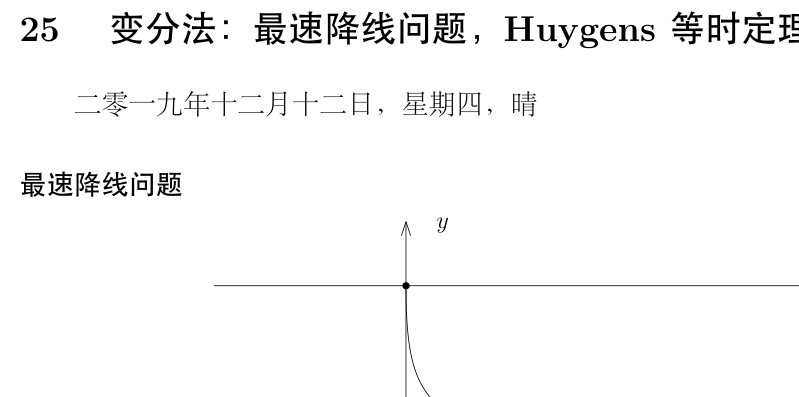
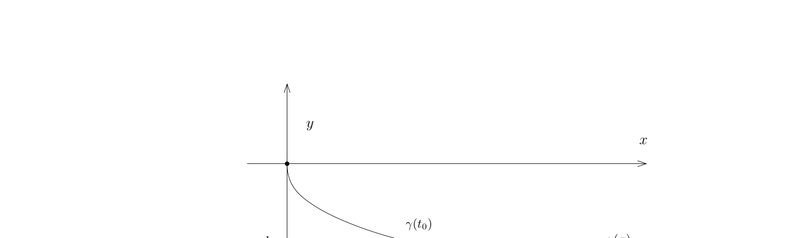
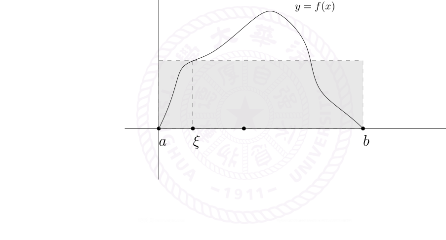

# 最速降线与积分第一中值定理

[返回讲义目录](../../../math-analysis-lecture-notes.md) · [学期目录](../../01-math-analysis-i.md) · [章节目录](../25-brachistochrone.md) · [校勘记录](../../errata.md) · [上一篇：常微分方程、Kepler 定律与变分法](../24-ode-variation.md) · [下一篇：25.1 作业:可写成两个完全平方数的和的整数的密度](25-02-p0267-0274.md)

<!-- source: PDF 262; printed: 262; transcription: first-pass; proofreading: applied -->

## 25 变分法：最速降线问题，Huygens 等时定理，积分第一中值定理

### 最速降线问题

从点 $(x, f(x))$ 到 $(x + \Delta x, f(x + \Delta x))$ 的距离是 $\sqrt{1 + f'(x)^2}\Delta x$。根据重力势能到动能的转化（能量守恒），我们知道

$$\frac{1}{2}mv^2 = -mGf(x).$$

在 $(x, f(x))$ 处，小球的速度应该是 $\sqrt{-2Gf(x)}$，所以从 $(x, f(x))$ 到 $\left(x + \Delta x, f(x + \Delta x)\right)$ 所需要的时间是

$$\Delta t = \frac{\sqrt{1 + f'(x)^2}\Delta x}{\sqrt{-2Gf(x)}}$$

这样，如果曲线 $\gamma_s$ 由函数 $f_s(x) = f(x, s)$ 给出，即

$$\gamma_s : [0, a] \to \mathbb{R}^2, \quad x\mapsto (x, f_s(x)).$$

小球经过整个曲线需要的时间为

$$T(s) = \int_0^a \sqrt{\frac{1 + f'(x, s)^2}{-2Gf(x, s)}}\, dx.$$

其中，$f'$ 指的是对 $f(x, s)$ 的 $x$ 变量求导数。为了保证曲线的两个端点是固定的，我们还要求

$$f(0, s) \equiv 0, \quad f(a, s) \equiv -h.$$

对于最速降线 $f_0$ 而言，我们必然有

$$\frac{d}{ds}T(s)\bigg|_{s=0} = 0.$$

为此，我们假设 $L(f, f') = \sqrt{\frac{1+f'(x,s)^2}{-2Gf(x,s)}}$，即在函数

$$L(X, V) = \sqrt{\frac{1 + V^2}{-2GX}}$$

<!-- source: PDF 263; printed: 263; transcription: first-pass; proofreading: applied -->

中代换变量 $X = f$，$V = f'$。此时，我们有（我们总是假设足够的光滑性使得积分与导数可以交换）：

$$\frac{d}{ds}T(s) = \int_0^a \frac{d}{ds}\bigl(L(f_s, f'_s)\bigr)dx$$

$$= \int_0^a \left(\frac{dL}{dX}\right)(f_s, f'_s)\frac{d}{ds}f(x, s) + \left(\frac{dL}{dV}\right)(f_s, f'_s)\frac{d}{ds}f'(x, s)dx$$

最后一项中，我们利用两个导数可以交换（下学期），所以 $\frac{d}{ds}f'(x, s) = \left(\frac{d}{ds}f(x, s)\right)'$。令 $s = 0$ 并记 $f = f_0$，我们就有

$$\frac{d}{ds}T(s)\bigg|_{s=0} = \int_0^a \left(\frac{dL}{dX}\right)(f, f')\frac{d}{ds}f(x, 0) + \left(\frac{dL}{dV}\right)(f, f')\left(\frac{d}{ds}f(x, s)\bigg|_{s=0}\right)'dx$$

$$= \int_0^a \left(\left(\frac{dL}{dX}\right)(f, f') - \frac{d}{dx}\left(\frac{dL}{dV}\right)(f, f')\right)\frac{df(x, 0)}{ds}\, dx.$$

最后一步分部积分的过程中，我们用到了 $f(0, s) \equiv 0$，$f(a, s) \equiv -h$，从而

$$\frac{d}{ds}f(0, s) \equiv 0, \quad \frac{d}{ds}f(a, s) \equiv 0.$$

另外，对任意的函数 $g$（$g(0) = g(a) = 0$），我们通过定义 $f(x, s) = f(x) + sg(x)$ 就可以使得

$$\frac{d}{ds}f(x, s)\bigg|_{s=0} = g(x).$$

所以，通过选取

$$g(x) = \left(\frac{dL}{dX}\right)(f, f') - \frac{d}{dx}\left(\frac{dL}{dV}\right)(f, f'),$$

我们就得到了 $f$ 必须满足的方程（这被称作是 Euler-Lagrange 方程）：

$$\left(\frac{dL}{dX}\right)(f, f') - \frac{d}{dx}\left(\left(\frac{dL}{dV}\right)(f, f')\right) = 0.$$

假设上述方程成立，那么

$$\frac{d}{dx}\left(\left(V\frac{dL}{dV} - L\right)(f, f')\right) = \frac{d}{dx}\left(f'\frac{dL}{dV}(f, f') - L(f, f')\right)$$

$$= f''\frac{dL}{dV}(f, f') + f'\frac{d}{dx}\left(\frac{dL}{dV}(f, f')\right) - f'\frac{dL}{dX}(f, f') - f''\frac{dL}{dV}(f, f')$$

$$= 0.$$

这表明，存在常数 $C$，使得

$$\left(V\frac{dL}{dV} - L\right)(f, f') \equiv C$$

按照定义，我们有

$$\frac{dL}{dX} = G\frac{(1 + V^2)^{\frac{1}{2}}}{(-2GX)^{\frac{3}{2}}}, \quad \frac{dL}{dV} = \frac{V}{\left(-2GX(1 + V^2)\right)^{\frac{1}{2}}}.$$

<!-- source: PDF 264; printed: 264; transcription: first-pass; proofreading: applied -->

所以，

$$\frac{(f')^2}{\left(-2Gf(1+(f')^2)\right)^{\frac{1}{2}}} - \sqrt{\frac{1+(f')^2}{-2Gf}} = C, \quad \Leftrightarrow \quad f\left(1+(f')^2\right) = -C_1.$$

我们令 $f(x) = -g(x)$，那么，我们就有

$$g'(x) = \sqrt{\frac{C_1 - g}{g}}$$

如果把 $g$ 看作参数，$x = x(g)$，那么，根据反函数的导数的计算，我们有

$$\frac{dx}{dg} = \sqrt{\frac{g}{C_1 - g}}$$

从而，作为原函数，我们有

$$x(t) = \int \sqrt{\frac{t}{C_1 - t}}\, dt.$$

为了能积分出这个函数，我们做变量替换

$$t = C_1 \sin^2 \theta,$$

从而，

$$x(\theta) = 2C_1 \int \tan\theta \cdot \cos\theta \cdot \sin\theta\, d\theta = C_1\left(\theta - \frac{1}{2}\sin(2\theta)\right).$$

这样子，我们就得到了这条曲线的参数方程（原函数差一个常数 $C_2$）

$$\theta \mapsto \left(\frac{C_1}{2}(2\theta - \sin(2\theta)) + C_2,\ -\frac{C_1}{2}(1 - \cos(2\theta))\right)$$

重新参数化之后，我们得到一条曲线

$$\gamma : [\theta_1, \theta_2] \to \mathbb{R}^2, \quad \theta \mapsto \left(c(\theta - \sin\theta) + C,\ -c(1 - \cos\theta)\right)$$

这种曲线叫做被称作是摆线或者旋轮线。我们注意到，初始时刻 $y(\theta_1) = 0$，所以，$\cos\theta_1 = 1$，这表明 $\theta_1 = 2k\pi$，$C = -2ck\pi$，通过再次调整 $\theta \mapsto \theta - 2k\pi$，我们可以假设 $\theta_1 = 0$，$C = 0$，所以我们要找的参数曲线为

$$\gamma : [0, \Theta] \to \mathbb{R}^2, \quad \theta \mapsto \left(c(\theta - \sin\theta),\ -c(1 - \cos\theta)\right)$$

从而，

$$c(\Theta - \sin\Theta) = a, \quad -c(1 - \cos\Theta) = -h$$

可以确定 $\Theta \in (0, 2\pi)$ 和 $c$。

**命题 145**（等时性，Huygens）. 考虑摆线

$$\gamma : \left[0, \pi\right] \to \mathbb{R}^2, \quad \theta \mapsto \left(c(\theta - \sin\theta),\ -c(1 - \cos\theta)\right).$$

<!-- source: PDF 265; printed: 265; transcription: first-pass; proofreading: applied -->

那么，从任意一点 $\gamma(\theta_0)$（$0\leqslant\theta_0<\pi$）出发的小球滚动到 $\gamma(\pi) = (c\pi, -2c)$ 的时间都是一样的。

**证明**：实际上，小球在 $\gamma(\theta)$ 到 $\gamma(\theta + \Delta\theta)$ 处要经过的距离为：

$$\Delta = |\gamma'(\theta)|\Delta\theta = c\sqrt{2 - 2\cos\theta}\,\Delta\theta$$

小球的速度为：

$$v = \sqrt{2Gc(\cos\theta_0 - \cos\theta)}.$$

所以，从 $\gamma(\theta_0)$ 滑到底一共需要

$$T(\theta_0) = \sqrt{\frac{c}{G}} \int_{\theta_0}^{\pi} \sqrt{\frac{1 - \cos\theta}{\cos\theta_0 - \cos\theta}}\, d\theta$$

$$= \sqrt{\frac{c}{G}} \int_{\theta_0}^{\pi} \frac{\sin\left(\frac{\theta}{2}\right)}{\sqrt{\cos^2\left(\frac{\theta_0}{2}\right) - \cos^2\left(\frac{\theta}{2}\right)}}\, d\theta$$

我们可以令 $s = \cos\left(\frac{\theta}{2}\right)$ 进行换元积分，据此，得到 $T(\theta_0) \equiv \pi\sqrt{\dfrac{c}{G}}$。$\square$

## 积分中值定理

**定理 146**（第一积分中值定理）. $[a, b]$ 是有界闭区间，$f, g \in \mathcal{R}([a, b])$ 是实值 Riemann 可积函数。我们假设对任意的 $x \in [a, b]$，$g(x) \geqslant 0$。令

$$m = \inf_{x \in [a,b]} f(x), \quad M = \sup_{x \in [a,b]} f(x).$$

那么，存在 $\ell \in [m, M]$，使得

$$\int_a^b fg = \ell \int_a^b g.$$

特别地，如果进一步要求 $f$ 是连续函数，那么存在 $\xi \in [a, b]$，使得

$$\int_a^b fg = f(\xi) \int_a^b g.$$

<!-- source: PDF 266; printed: 266; transcription: first-pass; proofreading: applied -->

**证明:** 由于 $m \leqslant f(x) \leqslant M$，根据 $g \geqslant 0$ 以及积分保持不等号的性质，我们有

$$m \int_a^b g \leqslant \int_a^b fg \leqslant M \int_a^b g.$$

如果 $\int_a^b g \neq 0$，显然存在 $l \in [m, M]$ 使得命题成立；如果 $\int_a^b g = 0$，由于 $g \geqslant 0$，所以 $g$ 在一个零测集之外恒为 $0$，从而 $fg$ 在一个零测集之外都是 $0$，从而 $\int_a^b fg = 0$，所以 $l$ 可以任意选。

如果 $f$ 是连续的，所以 $f$ 在 $[a, b]$ 可以取到最大值 $M$ 和最小值 $m$，即有 $x_1, x_2 \in [a, b]$，使得 $f(x_1) = m$，$f(x_2) = M$，根据连续函数的中值定理，存在 $x_1$ 与 $x_2$ 之间的数 $\xi$，使得 $f(\xi) = l$。$\square$

**推论 147.** 假设 $f$ 是连续函数，那么存在 $\xi \in [a, b]$，使得

$$\int_a^b f = f(\xi)(b - a)。$$

**证明:** 只要取 $g \equiv 1$ 即可。$\square$

[返回讲义目录](../../../math-analysis-lecture-notes.md) · [学期目录](../../01-math-analysis-i.md) · [章节目录](../25-brachistochrone.md) · [校勘记录](../../errata.md) · [上一篇：常微分方程、Kepler 定律与变分法](../24-ode-variation.md) · [下一篇：25.1 作业:可写成两个完全平方数的和的整数的密度](25-02-p0267-0274.md)
