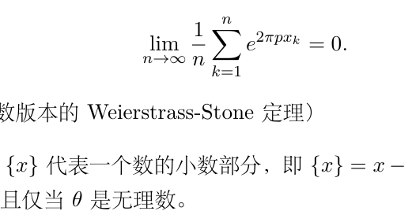
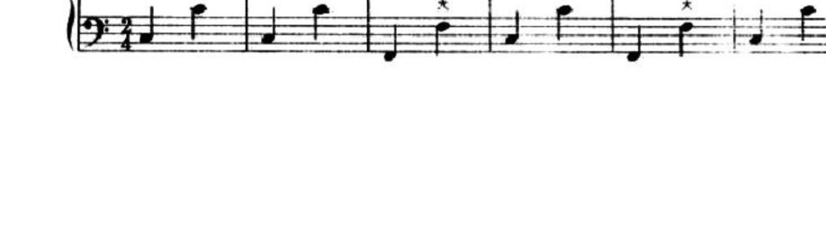

# 29.3：寒假作业

[返回讲义目录](../../../math-analysis-lecture-notes.md) · [学期目录](../../01-math-analysis-i.md) · [章节目录](../29-oscillation-decay.md) · [校勘记录](../../errata.md) · [上一篇：29.1–29.2：建议阅读与数学分析一期末考试](29-03-p0313-0319.md)

<!-- source: PDF 320; printed: 320; transcription: first-pass; proofreading: applied -->

<!-- math-analysis-layout: document-title-normalized -->

**清华大学数学分析 1 —— 寒假作业**（冬练三九）

## 积分不等式

**题目 A（Young 不等式）** $f : \mathbb{R}_{\geqslant 0} \to \mathbb{R}_{\geqslant 0}$ 是连续可微的函数。假设 $f(0) = 0$，$\lim_{x \to \infty} f(x) = +\infty$ 并且对任意的 $x \geqslant 0$，都有 $f'(x) > 0$。我们用 $g(x)$ 表示 $f^{-1}(x)$，即 $f$ 的反函数。

A1) 证明，对任意的 $a \geqslant 0$，我们有

$$af(a) = \int_0^a f(x)dx + \int_0^{f(a)} g(y)dy.$$

A2) 证明 Young 不等式：对任意的 $a, b \geqslant 0$，我们有

$$ab \leqslant \int_0^a f(x)dx + \int_0^b g(y)dy.$$

A3) 假设 $f : \mathbb{R}_{\geqslant 0} \to \mathbb{R}_{\geqslant 0}$ 是连续严格递增的函数，并且 $f(0) = 0$，$\lim_{x \to \infty} f(x) = +\infty$。试重新证明 A2) 中的不等式。

A4) 假设 $a, b \geqslant 0$，$p > 1$，$q > 1$ 并且 $\dfrac{1}{p} + \dfrac{1}{q} = 1$。证明 Young 不等式并确定取等号的条件：

$$ab \leqslant \frac{a^p}{p} + \frac{b^q}{q}.$$

（提示：考虑函数 $f(x) = x^{p-1}$）

### 函数与导数的积分估计

**题目 B（一个 Sobolev 不等式）** Sobolev 不等式的一个重要的观点就是用函数以及它的导数的积分来控制函数的最大值。在这个问题中，$[a, b]$ 是任意给定的有界闭区间。

B1)（Cauchy-Schwarz 不等式）假设 $f, g \in \mathcal{R}([a, b])$，利用多项式

$$P(t) = \int_a^b \left(f(x) + tg(x)\right)^2 dx$$

**证明：**

$$\left|\int_a^b f(x)g(x)dx\right| \leqslant \left(\int_a^b |f(x)|^2 dx\right)^{\frac{1}{2}} \left(\int_a^b |g(x)|^2 dx\right)^{\frac{1}{2}}.$$

B2) 证明，对任意的 $\varepsilon > 0$，存在常数 $C_\varepsilon > 0$，使得对任意的 $f \in C^1\!\left([a, b]\right)$，对任意的 $x \in [a, b]$，我们都有

$$\left|f(x)^2 - f(a)^2\right| \leqslant C_\varepsilon \int_a^b f(x)^2 dx + \varepsilon \int_a^b f'(x)^2 dx.$$

B3) 证明，对任意的 $\varepsilon > 0$，存在常数 $D_\varepsilon > 0$，使得对任意的 $f \in C^1\!\left([a, b]\right)$，我们都有

$$\sup_{x \in [a,b]} |f(x)|^2 \leqslant D_\varepsilon \int_a^b f(x)^2 dx + \varepsilon \int_a^b f'(x)^2 dx.$$

<!-- source: PDF 321; printed: 321; transcription: first-pass; proofreading: applied -->

### 维尔廷格不等式与等周问题

**题目 C（Wirtinger 不等式）** 令 $E = \left\{f \in C^1\!\left([0,1]\right) \middle| f(0) = f(1) = 0\right\}$。

C1) 对任意的 $f \in E$，我们定义反常积分

$$\mathbf{I}_1 = \int_0^1 \frac{f(x)f'(x)}{\tan(\pi x)}dx, \quad \mathbf{I}_2 = \int_0^1 \frac{f(x)^2}{\tan^2(\pi x)}(1 + \tan^2(\pi x))dx.$$

证明，上述反常积分收敛；当 $f$ 不恒为 $0$ 时，确定它们的比值。

C2) 证明（Wirtinger 不等式），对任意的 $f \in E$，我们有

$$\int_0^1 f(x)^2 dx \leqslant \pi^{-2} \int_0^1 f'(x)^2 dx.$$

C3) 试找出所有的 $f \in E$，使得上面的不等式取等号。

C4) 假设 $f \in \mathcal{R}\left([0, 2\pi]\right)$，试找出 $A \in \mathbb{R}$，使得积分 $\displaystyle\int_0^{2\pi} |f(x) - A|^2 dx$ 最小。

C5) 证明另一种版本的 Wirtinger 不等式，对任意的 $f \in C^1([0, 2\pi])$，如果 $f(0)=f(2\pi)$ 且 $\displaystyle\int_0^{2\pi} f(x)dx = 0$，那么

$$\int_0^{2\pi} f(x)^2 dx \leqslant \int_0^{2\pi} f'(x)^2 dx,$$

并且等号成立当且仅当 $f$ 是 $\sin x$ 和 $\cos x$ 的一个线性组合。

C6*) （等周不等式的证明）假设 $\gamma : [0, 2\pi] \to \mathbb{R}^2$ 是一条 $C^1$ 的闭曲线（$\gamma(0) = \gamma(2\pi)$），不妨记 $\gamma(t) = \left(x(t), y(t)\right)$，我们假设 $\gamma$ 不自交（即 $\gamma$ 在 $[0, 2\pi)$ 上是单射）并且其长度为 $L$，即

$$L = \int_0^{2\pi} \sqrt{x'(t)^2 + y'(t)^2}\, dt.$$

根据 Stokes 公式（下学期），$\gamma$ 所围成图形的面积为

$$A = \left|\int_0^{2\pi} x'(t)y(t)dt\right|.$$

证明，$L^2 \geqslant 4\pi A$ 并且等号成立的当且仅当 $\gamma$ 给出一个圆。

## 正交多项式与高斯求积

**题目 D（Gauss 逼近）** 对任意的 $n \geqslant 1$，我们定义 Legendre 多项式 $P_n(x) = \dfrac{1}{2^n n!}\left(\dfrac{d}{dx}\right)^n\!\left((x^2-1)^n\right)$。为了方便起见，我们令 $P_0(x) \equiv 1$。

D1) 证明，任意给定连续函数 $\varphi(x) \in C([-1,1])$，对任意的 $\varepsilon > 0$，存在正整数 $N$ 和实数 $c_0, c_1, c_2, \cdots, c_N$，使得

$$\left\|\varphi(x) - \sum_{k=0}^N c_k P_k(x)\right\|_\infty < \varepsilon.$$

<!-- source: PDF 322; printed: 322; transcription: first-pass; proofreading: applied -->

D2) 证明，对任意的 $n \geqslant 1$，$P_n(x)$ 满足下面的微分方程：

$$
(1 - x^2)f'' - 2xf' + n(n+1)f = 0.
$$

D3) 证明，对任意的 $n, m \geqslant 1$，我们有

$$
\int_{-1}^{1} P_n(x) P_m(x) dx = \begin{cases} 0, & m \neq n; \\ \dfrac{2}{2n+1}, & m = n. \end{cases}
$$

D4) 给定 $n \geqslant 1$。证明，如果 $Q(x)$ 是次数不超过 $n-1$ 的多项式，那么

$$
\int_{-1}^{1} Q(x) P_n(x) dx = 0.
$$

D5) 证明，对任意的 $n \geqslant 1$，$P_n(x)$ 恰有 $n$ 个实数根并且悉数落在 $(-1, 1)$ 上。我们将这些根记作 $x_1^{(n)} < x_2^{(n)} < \cdots < x_n^{(n)}$。

D6) 证明，对任意的 $n \geqslant 1$，存在实数 $\alpha_1^{(n)}, \alpha_2^{(n)}, \cdots, \alpha_n^{(n)}$，使得对任意的次数不超过 $2n-1$ 的多项式 $Q(x)$，我们都有

$$
\int_{-1}^{1} Q(x) dx = \sum_{i=1}^{n} \alpha_i^{(n)} Q(x_i^{(n)}).
$$

D7) Gauss 对积分的一个逼近公式：对任意的连续函数 $\varphi(x) \in C([-1,1])$，我们令

$$
G_n(\varphi) = \sum_{i=1}^{n} \alpha_i^{(n)} \varphi(x_i^{(n)}).
$$

证明，$\displaystyle\lim_{n \to \infty} G_n(\varphi) = \int_{-1}^{1} \varphi(x) dx$。

## 数列的等分布

**题目 E（等分布问题）** 给定一个数列 $\{x_k\}_{k \geqslant 1}$，其中 $\{x_k\}_{k \geqslant 1} \subset [0,1]$。对任意的 $0 \leqslant a < b \leqslant 1$，我们令 $S_n([a,b])$ 等于该数列的前 $n$ 个数（即 $x_1, x_2, \cdots, x_n$）中落在 $[a,b]$ 中的数的数目，即

$$
S_n([a,b]) = \left| \{ k \mid 1\leqslant k \leqslant n,\, x_k \in [a,b] \} \right|.
$$

如果对任意的 $0 \leqslant a < b \leqslant 1$，我们都有

$$
\lim_{n \to \infty} \frac{S_n([a,b])}{n} = b - a,
$$

我们就称数列 $\{x_k\}_{k \geqslant 1}$ 在 $[0,1]$ 上**等分布**。

E1) 证明，如果数列 $\{x_k\}_{k \geqslant 1}$ 在 $[0,1]$ 上等分布，那么 $\{x_k\}_{k \geqslant 1}$ 是 $[0,1]$ 的稠密子集。

E2) 试构造 $[0,1]$ 的稠密子集 $\{x_k\}_{k \geqslant 1}$，使得数列 $\{x_k\}_{k \geqslant 1}$ 在 $[0,1]$ 上不是等分布的。

<!-- source: PDF 323; printed: 323; transcription: first-pass; proofreading: applied -->

E3) 任意给定数列 $\{x_k\}_{k \geqslant 1} \subset [0,1]$，我们令

$$
D_n = \sup_{0 \leqslant a < b \leqslant 1} \left| \frac{S_n([a,b])}{n} - (b-a) \right|, \quad D_n^* = \sup_{0 < b < 1} \left| \frac{S_n([0,b])}{n} - b \right|.
$$

证明，$D_n^* \leqslant D_n \leqslant 2D_n^*$。

E4) 证明，数列 $\{x_k\}_{k \geqslant 1}$ 在 $[0,1]$ 上等分布当且仅当 $\displaystyle\lim_{n \to \infty} D_n^* = 0$。

E5) 证明，数列 $\{x_k\}_{k \geqslant 1}$ 在 $[0,1]$ 上等分布当且仅当对任意的连续函数 $f \in C\bigl([0,1]\bigr)$，我们都有

$$
\lim_{n \to \infty} \frac{1}{n} \sum_{k=1}^{n} f(x_k) = \int_0^1 f(x) dx.
$$

（提示：试用连续函数逼近 $\mathbf{1}_{[a,b]}$）

E6) 证明 Weyl 判定准则：数列 $\{x_k\}_{k \geqslant 1}$ 在 $[0,1]$ 上等分布当且仅当对任意 $p \in \mathbb{Z}_{\geqslant 1}$，我们都有

$$
\lim_{n \to \infty} \frac{1}{n} \sum_{k=1}^{n} e^{2\pi i p x_k} = 0.
$$

（提示：利用三角函数版本的 Weierstrass-Stone 定理）

E7) 假设 $\theta > 0$ 是实数，$\{x\}$ 代表一个数的小数部分，即 $\{x\} = x - \lfloor x \rfloor$。那么，数列 $\bigl\{ \{n\theta\} \bigr\}_{n \geqslant 1}$ 在 $[0,1]$ 上等分布当且仅当 $\theta$ 是无理数。

E8) 证明，数列 $\{\xi_n\}_{n \geqslant 1} = \bigl\{ \{\sqrt{n}\} \bigr\}_{n \geqslant 1}$ 在 $[0,1)$ 上是等分布的。

E9) 任给实数 $a \neq 0$，$\sigma \in (0,1)$。证明，数列 $\{\xi_n\}_{n \geqslant 1} = \bigl\{ \{an^\sigma\} \bigr\}_{n \geqslant 1}$ 在 $[0,1)$ 上是等分布的。

E10) 证明，对任意的 $a \in \mathbb{R}$，数列 $\{\xi_n\}_{n \geqslant 1} = \bigl\{ \{a \log n\} \bigr\}_{n \geqslant 1}$ 在 $[0,1)$ 上不是等分布的。

## 环绕数与代数基本定理

**题目 F（平面闭曲线的环绕数）** 令 $E = \{ f : \mathbb{R} \to \mathbb{C}^\times \mid f \text{ 连续可微并且以 } 2\pi \text{ 为周期} \}$，其中 $\mathbb{C}^\times = \mathbb{C} - \{0\}$。对于这样的函数 $f$，它在 $[0, 2\pi]$ 上的限制给出了 $\mathbb{C}$ 上不过原点的一条闭曲线。

对任意的 $f \in E$，我们定义

$$
d(f) = \frac{1}{2\pi i} \int_0^{2\pi} \frac{f'(t)}{f(t)} dt.
$$

<!-- source: PDF 324; printed: 324; transcription: first-pass; proofreading: applied -->

F1) 证明 $d(f)$ 是良好定义的并且对下面这一族曲线

$$f_n : \mathbb{R} \to \mathbb{C}^\times, \quad x \mapsto f_n(x) = e^{inx}$$

计算其环绕数 $d(f_n)$（直观上，上述曲线是用 $[0, 2\pi]$ 区间将单位圆周绕 $n$ 圈，其中 $n$ 的正负与绕的方向相关）。

F2) 试用 $\mathbb{C}$ 上的极坐标系来写下 $d(f)$ 的定义（即将 $f(t)$ 写为 $\rho(t)e^{i\theta(t)}$），这个计算给出了 $d(f)$ 的直观含义。

F3) 利用函数 $\psi(t) = \exp\!\left(\int_0^t \dfrac{f'(s)}{f(s)} ds\right)$ 证明 $d(f)$ 是整数。（提示：证明 $\psi$ 与 $f$ 解同一个 1 阶常微分方程）

F4) 证明，对任意的 $f \in E$，存在 $\varepsilon > 0$，对任意的 $g \in E$，如果 $\|f - g\|_\infty < \varepsilon$，那么 $d(g) = d(f)$。

F5) 你是否可以利用 F4) 的结论对于函数 $f : \mathbb{R} \to \mathbb{C}^\times$，其中 $f$ 连续并且以 $2\pi$ 为周期来定义 $d(f)$？（提示：可以利用三角函数的 Weierstrass-Stone 定理）

F6) 证明同伦不变性：假设 $F(t, \tau) : \mathbb{R} \times [0, 1] \to \mathbb{C}^\times$ 是连续映射并且使得对任意的 $\tau \in [0, 1]$，$F(\cdot, \tau) \in E$，那么

$$d\!\left(F(x, 0)\right) = d\!\left(F(x, 1)\right).$$

F7) 假设 $P(x) = x^n + c_{n-1}x^{n-1} + \cdots + c_1 x + c_0$ 是一个 $n$ 次的首一复系数多项式，假设 $P(0) \neq 0$，证明，存在 $\varepsilon_0 > 0$，使得对任意的 $\varepsilon \in (0, \varepsilon_0)$，函数 $f_\varepsilon(x) = P(\varepsilon e^{ix}) \in E$ 并计算 $d(f_\varepsilon)$。

F8) 假设 $P(x) = x^n + c_{n-1}x^{n-1} + \cdots + c_1 x + c_0$ 是一个 $n$ 次的首一复系数多项式，假设 $P(0) \neq 0$，证明，存在 $R_0 > 0$，使得对任意的 $R \in (R_0, \infty)$，函数 $f_R(x) = P(Re^{ix}) \in E$ 并计算 $d(f_R)$。

F9) 证明代数基本定理：对任意 $n\geqslant1$ 次的复系数多项式 $P(x)$，它至少有一个根。（提示：反证法）

## 函数构造与收敛

**题目 G（另一个处处连续处处不可微的函数：Bolzano 曲线）** 我们按照归纳的方式定义 $[0, 1]$ 上的函数列 $\{f_n\}_{n \geqslant 0}$，其中，$f_0(x) = x$，对于 $n \geqslant 0$ 且整数 $0 \leqslant k < 3^n$，我们有

$$\begin{cases} f_{n+1}\!\left(\dfrac{k}{3^n}\right) = f_n\!\left(\dfrac{k}{3^n}\right), \\[6pt] f_{n+1}\!\left(\dfrac{k}{3^n} + \dfrac{1}{3^{n+1}}\right) = f_n\!\left(\dfrac{k}{3^n} + \dfrac{2}{3^{n+1}}\right), \\[6pt] f_{n+1}\!\left(\dfrac{k}{3^n} + \dfrac{2}{3^{n+1}}\right) = f_n\!\left(\dfrac{k}{3^n} + \dfrac{1}{3^{n+1}}\right). \end{cases}$$

另令 $f_{n+1}(1)=f_n(1)$，并且 $f_{n+1}$ 在形如 $\left[\dfrac{k}{3^{n+1}}, \dfrac{k+1}{3^{n+1}}\right]$ 的区间上是线性函数。

G1) 证明，对任意的 $n \geqslant 0$，对任意的 $0 \leqslant x, y \leqslant 1$，我们都有

$$\left|f_n(x) - f_n(y)\right| \leqslant 2^n |x - y|.$$

<!-- source: PDF 325; printed: 325; transcription: first-pass; proofreading: applied -->

G2) 证明，对任意的 $n \geqslant 0$，对任意的 $0 \leqslant x \leqslant 1$，我们都有

$$\left|f_{n+1}(x) - f_n(x)\right| \leqslant \frac{2^n}{3^{n+1}}.$$

G3) 证明，函数列 $\{f_n\}_{n\geqslant 0}$ 在 $[0, 1]$ 上一致收敛到某个连续函数 $f \in C([0, 1])$。

G4) 证明，对任意的 $n \geqslant 1$，对任意的 $0 \leqslant k \leqslant 3^n$，我们有 $f\!\left(\dfrac{k}{3^n}\right) = f_n\!\left(\dfrac{k}{3^n}\right)$。

G5) 证明，对任意的 $n \geqslant 1$，对任意的 $0 \leqslant k \leqslant 3^n$，$f$ 在 $\dfrac{k}{3^n}$ 处不可微。

G6) 证明，$f$ 在 $[0, 1]$ 上处处不可微。（提示：考虑函数 $(h, k) \mapsto \dfrac{f(x+h) - f(x-k)}{h+k}$）

### 函数级数的收敛与稠密性

**题目 H** 考虑有界闭区间 $[a, b]$ 上的连续函数列 $\{f_n\}_{n\geqslant 1} \subset C([a, b])$。我们假设数项的级数

$$\sum_{n=1}^{\infty} \left(\int_a^b |f_n(x)|dx\right)$$

收敛。

H1) 是否对任意的 $x_0 \in [a, b]$，级数 $\displaystyle\sum_{n=1}^{\infty} |f_n(x_0)|$ 收敛？

H2) 令 $E = \left\{x_0 \in [a, b] \,\middle|\, \text{级数} \displaystyle\sum_{n=1}^{\infty} |f_n(x_0)| \text{ 收敛}\right\}$。证明，$E \subset [a, b]$ 是稠密的。

H3) 令 $F = \left\{x_0 \in [a, b] \,\middle|\, \text{级数} \displaystyle\sum_{n=1}^{\infty} |f_n(x_0)| \text{ 发散}\right\}$。试构造 $[a, b]$ 上的连续函数列 $\{f_n\}_{n\geqslant 1} \subset C([a, b])$ 使得级数 $\displaystyle\sum_{n=1}^{\infty} \left(\int_a^b |f_n(x)|dx\right)$ 收敛并且 $F \subset [a, b]$ 是稠密的。

## 级数与黎曼函数

**题目 I** 在这个问题中，我们用 $\{x\}$ 代表 $x \in \mathbb{R}$ 的小数部分。

### 第一部分：锯齿函数的级数表示

I-1-1) 对任意的 $x \in \mathbb{R}$ 和 $q \in \mathbb{Z}_{\geqslant 1}$，我们令

$$S_q(x) = \sum_{p=1}^{q} \frac{\sin(2p\pi x)}{p\pi}.$$

证明，

$$S_q(x) = \int_0^x \frac{\sin\left((2q+1)\pi u\right)}{\sin(\pi u)} du - x.$$

<!-- source: PDF 326; printed: 326; transcription: first-pass; proofreading: applied -->

I-1-2) 我们定义 $(-1, 1)$ 上的函数 $\varphi$：

$$\varphi(x) = \begin{cases} \dfrac{1}{\sin(\pi x)} - \dfrac{1}{\pi x}, & x \in (-1, 0) \cup (0, 1), \\ 0, & x = 0. \end{cases}$$

证明，$\varphi \in C^1\!\left((-1, 1)\right)$。

I-1-3) 证明，存在常数 $A_1 > 0$，使得对任意的 $x \in \left[0, \dfrac{1}{2}\right]$ 和 $q \in \mathbb{Z}_{\geqslant 1}$，我们有

$$\left|S_q(x) + x - \frac{1}{\pi} \int_0^{(2q+1)\pi x} \frac{\sin u}{u} du\right| \leqslant \frac{A_1}{q}.$$

I-1-4) 计算 $\displaystyle\int_0^{\infty} \frac{\sin u}{u} du$。（提示：选取特殊的 $x_0$ 考虑 $S_q(x_0)$）

I-1-5) 证明，存在常数 $A_2 > 0$，使得对任意的 $x \in \mathbb{R}$ 和 $q \in \mathbb{Z}_{\geqslant 1}$，我们有

$$|S_q(x)| \leqslant A_2.$$

I-1-6) 试写下函数 $S(x)$ 的解析表达式，使得对任意的 $x \in \mathbb{R}$，$\displaystyle\lim_{q \to \infty} S_q(x) = S(x)$。这是一致收敛的么？

I-1-7) 证明，如果 $K \subset \mathbb{R}$ 是紧集并且 $K \cap \mathbb{Z} = \emptyset$，那么 $S_q(x)$ 在 $K$ 上一致收敛到 $S(x)$。

I-1-8) 证明，对任意的有界闭区间 $[a, b]$ 和任意的在 $\mathbb{C}$ 中取值的连续函数 $f \in C([a, b]; \mathbb{C})$，我们都有

$$\int_a^b f(x)\left(\frac{1}{2} - \{x\}\right) dx = \frac{1}{\pi} \sum_{p=1}^{+\infty} \frac{1}{p} \int_a^b f(x) \sin(2p\pi x) dx.$$

### 第二部分：黎曼函数的延拓

在这一部分，我们假设 $z = s + it \in \mathbb{C}$。对于 $x > 0$，我们定义 $x^z := e^{z \log x}$。字母 $n$ 将代表一个正整数。另外，Riemann 的 $\zeta$ 函数形式上记作

$$\zeta(z) = \sum_{n=1}^{\infty} \frac{1}{n^z}.$$

我们知道，当 $z \in (1, +\infty)$ 时，$\zeta$ 有定义。

I-2-1) 对任意给定的 $z \in \mathbb{C}$，函数 $x \mapsto x^{-z}$ 的原函数是什么？

I-2-2) 证明如下的等式：

$$\sum_{k=1}^{n} k^{-z} = 1 + \int_1^n x^{-z} dx - z \int_1^n \{x\} x^{-z-1} dx.$$

<!-- source: PDF 327; printed: 327; transcription: first-pass; proofreading: applied -->

I-2-3) $s$ 是 $z$ 的实部。如果 $s > 1$，证明如下的极限（说明等式两边都存在并且相等）：

$$\lim_{n\to\infty}\left(\sum_{k=1}^{n}k^{-z} - \frac{z}{z-1}\right) = -z\int_1^{\infty}\{x\}x^{-z-1}dx.$$

I-2-4) 令 $\Omega = \left\{z = s + it \in \mathbb{C}\mid s > 0, z \neq 1\right\}$，我们定义

$$\zeta_1(z) = \frac{z}{z-1} - z\int_1^{\infty}\{x\}x^{-z-1}dx.$$

证明，当 $s > 1$ 时，我们有 $\zeta_1(z) = \zeta(z)$。从此，我们将 $\zeta_1(z)$ 也记作 $\zeta(z)$，它是 $\zeta(z)$ 在 $\Omega$ 中的自然扩展（解析延拓）。

I-2-5) 证明，对任意的 $z \in \Omega$，任意的 $y \geqslant n$，我们有

$$\zeta(z) - \sum_{k=1}^{n}k^{-z} = \frac{n^{1-z}}{z-1} - \frac{1}{2}n^{-z} + z\int_y^{+\infty}\left(\frac{1}{2} - \{x\}\right)x^{-z-1}dx$$

$$+ \frac{z}{\pi}\sum_{p=1}^{+\infty}\frac{1}{p}\int_n^{y}x^{-z-1}\sin(2p\pi x)dx.$$

I-2-6) 任意给定正整数 $p$，任意给定 $t \in [-n, n]$，我们定义函数

$$g : [n, +\infty) \to \mathbb{R}, \quad x \mapsto g(x) = \frac{-x^{-\frac{3}{2}}}{2p\pi - \dfrac{t}{x}}.$$

证明，存在常数 $B_1$，使得对任意的 $x \geqslant n$，我们都有

$$g'(x) \leqslant \frac{B_1}{p} x^{-\frac{5}{2}}.$$

证明，存在常数 $B_2$，使得对任意的 $y \geqslant n$，我们有

$$\left|\int_n^{y} x^{-\frac{3}{2}-it}e^{2ip\pi x}dx\right| \leqslant \frac{B_2}{n^{\frac{3}{2}}p}, \quad \left|\int_n^{y} x^{-\frac{3}{2}-it}\sin(2p\pi x)dx\right| \leqslant \frac{B_2}{n^{\frac{3}{2}}p}.$$

I-2-7) 证明，存在常数 $B_3$，使得对任意的 $n \geqslant 1$ 和任意的 $t \in [-n, n]$，我们有

$$\left|\zeta\left(\frac{1}{2} + it\right) - \sum_{k=1}^{n}k^{-\frac{1}{2}-it}\right| \leqslant B_3\frac{\sqrt{n}}{1+|t|}.$$

### 第三部分：临界线上的均方估计

字母 $n$ 将代表一个大于等于 $2$ 的正整数。

I-3-1) 证明，对任意的 $x > 0$，我们有 $\log(x) - 1 + \dfrac{1}{x} \geqslant 0$。

<!-- source: PDF 328; printed: 328; transcription: first-pass; proofreading: applied -->

I-3-2) 证明，存在常数 $C_1$，使得如下的不等式成立（当 $n = 2$ 时我们将不等式的左边取作 $0$）：

$$\sum_{\substack{j,k \\ 1\leqslant k\leqslant n,\, \frac{k}{2}<j<k}} \frac{1}{\sqrt{kj}\log\left(\dfrac{k}{j}\right)} \leqslant \sqrt{2}\sum_{\substack{h,k \\ 1\leqslant h\leqslant k\leqslant n}}\frac{1}{h} \leqslant C_1 n\log n.$$

I-3-3) 证明，存在常数 $C_2$，使得如下的不等式成立：

$$\sum_{\substack{j,k \\ 1\leqslant k\leqslant n,\, 1\leqslant j\leqslant \frac{k}{2}}} \frac{1}{\sqrt{kj}\log\left(\dfrac{k}{j}\right)} \leqslant \frac{1}{\log 2}\left(\sum_{k=1}^{n}\frac{1}{\sqrt{k}}\right)^2 \leqslant C_2 n.$$

I-3-4) 证明，存在常数 $C_3$，使得如下的等式／不等式成立：

$$\int_0^{n}\left|\sum_{k=1}^{n}k^{-\frac{1}{2}-it}\right|^2 dt = n\sum_{k=1}^{n}\frac{1}{k} + i\sum_{\substack{j,k,\, j\neq k \\ 1\leqslant j,k\leqslant n}} \frac{\left(\dfrac{k}{j}\right)^{-in} - 1}{\sqrt{kj}\log\left(\dfrac{k}{j}\right)} \leqslant C_3 n\log n.$$

I-3-5) 证明，存在常数 $C$，使得对任意的 $T \geqslant 2$，都有

$$\int_0^{T}\left|\zeta\left(\frac{1}{2} + it\right)\right|^2 dt \leqslant CT\log T.$$

## 函数逼近与一致收敛

**题目 J（拟周期函数）** 令 $E$ 是由 $\left\{\cos(\omega x), \sin(\omega x)\mid \omega \in \mathbb{R}\right\}$ 所生成的 $\mathbb{R}$-线性空间，很明显，$E \subset C(\mathbb{R})$ 是线性子空间。

- J1) 令 $F = \left\{f \in C(\mathbb{R})\mid \text{存在}\{f_n\}_{n\geqslant 1}\subset E\text{ 使得}f_n\text{ 一致收敛到}f\right\}$（即 $F$ 为 $E$ 在 $(C_b(\mathbb{R}), \|\cdot\|_\infty)$ 中的闭包，其中 $C_b(\mathbb{R})$ 表示有界连续函数空间），证明，$F$ 是 $\mathbb{R}$-线性空间并且对任意的 $f, g \in F$，它们的乘积 $f \cdot g \in F$。

- J2) 如果 $\varphi \in C(\mathbb{R})$，$f \in F$，证明，$\varphi \circ f \in F$。

- J3) 任意给定 $\omega \in \mathbb{R}$ 和 $f \in F$，证明，如下的极限存在

$$\widetilde{f}(\omega) = \lim_{T\to\infty}\frac{1}{2T}\int_{-T}^{T}e^{-i\omega x}f(x)dx.$$

- J4) 任意给定 $f \in F$，证明，除了至多可数个可能的 $\omega \in \mathbb{R}$ 以外，我们有 $\widetilde{f}(\omega) = 0$。

### 正算子与多项式逼近

**题目 K（Korovkin 定理）** $E = C([0,1])$。考虑 $\mathbb{R}$-线性映射 $T : E \to E$：如果对任意的 $[0,1]$ 上的连续正函数 $f \geqslant 0$（即在每个点的取值都是非负的），$Tf$ 也是正函数，我们就称 $T$ 是一个**正算子**。

- K1) 假设 $T : E \to E$ 是正算子。证明，存在常数 $C$，使得对任意的 $f \in E$，我们都有

$$\|Tf\|_\infty \leqslant C\|f\|_\infty.$$

<!-- source: PDF 329; printed: 329; transcription: first-pass; proofreading: applied -->

K2) 给定 $f \in E$。证明，对任意的 $\varepsilon > 0$，存在常数 $C_\varepsilon$，使得对任意的 $x, y \in [0, 1]$，我们有

$$|f(x) - f(y)| \leqslant \varepsilon + C_\varepsilon(x - y)^2.$$

K3)（Korovkin）对于 $n \in \mathbb{Z}_{\geqslant 0}$，$P_n(x) = x^n$ 是一族 $E$ 中的正函数。假设 $T_n$ 是一族 $E$ 上的正算子。如果对任意的 $m \in \mathbb{Z}_{\geqslant 0}$，函数序列 $\{T_n(P_m)\}_{n \geqslant 1}$ 在 $E$ 中一致收敛到 $P_m$，证明，对任意的 $f \in E$，函数序列 $\{T_n(f)\}_{n \geqslant 1}$ 在 $E$ 中一致收敛到 $f$。

K4)（应用：用 Bernstein 多项式一致逼近连续函数）对于 $f \in E = C([0, 1])$，我们定义一族算子

$$B_n : E \to E, \quad f \mapsto B_n(f)(x) = \sum_{k=0}^{n} \binom{n}{k} f\!\left(\frac{k}{n}\right) x^k (1-x)^{n-k}.$$

证明，函数序列 $\{B_n(f)\}_{n \geqslant 1}$ 在 $E$ 中一致收敛到 $f$。

## 三角函数的级数展开

**题目 L（余切函数的 Euler 展开）** 对于任意的 $x \in \mathbb{R}-\mathbb{Z}$，我们令 $f(x) = \lim_{n \to \infty} \sum_{k=-n}^{n} \dfrac{1}{x+k}$。

L1) 证明，$f$ 在 $\mathbb{R} - \mathbb{Z}$ 上是良好定义的。

L2) 证明，对任意的 $x \in \mathbb{R} - \mathbb{Z}$，我们有 $f(-x) = -f(x)$，$f(x+1) = f(x)$；对任意的 $x\in\mathbb{R} - \dfrac{1}{2}\mathbb{Z}$，我们有 $2f(2x) = f(x) + f\!\left(x + \dfrac{1}{2}\right)$。

L3) 证明，函数 $x \mapsto f(x) - \pi\operatorname{cotan}(\pi x)$ 可以在 $x \in \mathbb{Z}$ 处定义从而可以被视作是 $\mathbb{R}$ 上的函数。

L4) 证明，对于 $x \notin \mathbb{Z}$，我们有 $f(x) \equiv \pi\operatorname{cotan}(\pi x)$。

## 函数与光滑性的综合问题

**题目 M（一个一致收敛的判定准则）** 假设 $\{f_n\}_{n \geqslant 1}$ 是在 $[0, 1]$ 上定义的一列函数（未必连续），它们满足如下的条件：对任意的收敛的数列 $\{x_n\}_{n \geqslant 1} \subset [0, 1]$，数列 $\{f_n(x_n)\}_{n \geqslant 1}$ 也收敛。

M1) 证明，存在 $[0, 1]$ 上定义的函数 $f : [0, 1] \to \mathbb{R}$，使得对每个点 $x \in [0, 1]$，$\lim_{n \to \infty} f_n(x) = f(x)$。

M2) 证明，$f$ 是连续函数。

M3) 证明，$f_n$ 一致收敛到 $f$，即

$$\lim_{n \to \infty} \sup_{x \in [0,1]} |f_n(x) - f(x)| = 0.$$

### 万有弦定理

**题目 N（Paul Lévy，万有弦定理）** 令 $E = \{f \in C([0,1]) \mid f(0) = f(1)\}$。对于任意的 $f \in E$，我们定义

$$\Lambda(f) = \{\sigma \in [0,1] \mid \text{存在} x \in [0,1-\sigma]，\text{使得} f(x+\sigma) = f(x)\}.$$

<!-- source: PDF 330; printed: 330; transcription: first-pass; proofreading: applied -->

N1) 证明，$\bigcap_{f\in E}\Lambda(f)$ 是紧集并且

$$\{0\}\cup\left\{\frac{1}{n}\,\middle|\,n\in\mathbb{Z}_{\geqslant 1}\right\}\subset\bigcap_{f\in E}\Lambda(f).$$

N2) 证明，对任意的 $f\in E$，存在 $\varepsilon>0$，使得

$$[0,\varepsilon]\cup\left\{\frac{1}{n}\,\middle|\,n\in\mathbb{Z}_{\geqslant 1}\right\}\subset\Lambda(f).$$

N3) 证明，

$$\{0\}\cup\left\{\frac{1}{n}\,\middle|\,n\in\mathbb{Z}_{\geqslant 1}\right\}=\bigcap_{f\in E}\Lambda(f).$$

N4)（万有弦定理）考虑连续函数 $f:[a,b]\to\mathbb{R}$ 的图像 $\Gamma_f=\{(x,f(x))\subset\mathbb{R}^2\mid x\in[a,b]\}$。$\overline{AB}$ 是图像的两个端点 $A=(a,f(a))$ 和 $B=(b,f(b))$ 所连的线段，证明，对任意的整数 $n\geqslant 1$，总存在 $c,d\in[a,b]$，使得 $C=(c,f(c))$ 和 $D=(d,f(d))$ 所连的线段与 $\overline{AB}$ 平行并且其长度恰好是 $\overline{AB}$ 长度的 $\dfrac{1}{n}$。如果 $n\geqslant 1$ 不是整数，结论是否成立？

N5) 司马迁参加 100 米赛跑，成绩是 10 秒。证明，能够找到连续的 5 秒，他恰好跑了 50 米。（我们假设人类的运动是连续的）

### 光滑函数与积分矩

**题目 O（除法定理）** 假设 $f\in C^{\infty}(\mathbb{R})$ 并且 $f(0)=0$。

O1) 证明，函数

$$g:\mathbb{R}\to\mathbb{R},\quad x\mapsto g(x)=\begin{cases}\dfrac{f(x)}{x}, & x\neq 0;\\[6pt] f'(0), & x=0.\end{cases}$$

是 $\mathbb{R}$ 上的光滑函数。

O2) 假设对任意的 $x\neq 0$，$f(x)>0$ 并且假设 $f''(0)\neq 0$。证明，存在光滑函数 $g\in C^{\infty}(\mathbb{R})$，使得

$$g^2=f.$$

**题目 P** 证明，对任意的整数 $n\geqslant 0$，如下的反常积分均为 0：

$$\int_0^{\infty} x^n\sin\!\left(x^{\frac{1}{4}}\right)e^{-x^{\frac{1}{4}}}dx=0.$$

**题目 Q** 给定严格递增的实数数列 $\{a_n\}_{n\geqslant 0}$，其中 $a_0=0$。我们假设如下的级数是发散的

$$\frac{1}{a_1}+\frac{1}{a_2}+\frac{1}{a_3}+\frac{1}{a_4}+\cdots.$$

<!-- source: PDF 331; printed: 331; transcription: first-pass; proofreading: applied -->

证明，对于 $f\in C([0,1])$，如果对任意的 $n\geqslant 0$，我们都有

$$\int_0^1 x^{a_n}f(x)dx=0,$$

那么 $f\equiv 0$。

**题目 R** 假设 $f\in C^{\infty}(\mathbb{R})$，$f(0)f'(0)\geqslant 0$ 并且 $\lim_{x\to\infty}f(x)=0$。证明，存在 $0\leqslant x_1<x_2<\cdots<x_n<\cdots$，使得

$$f^{(n)}(x_n)=0.$$

## 紧空间中的映射与不动点

**题目 S（距离空间上的等距映射）** 假设 $(X,d)$ 是紧的距离空间，映射 $f:X\to X$。

S1) 如果 $f$ 是等距映射，即对任意的 $x,y\in X$，我们都有 $d(f(x),f(y))=d(x,y)$。证明，$f$ 是双射。

S2) 如果对任意的 $x,y\in X$，我们都有 $d(f(x),f(y))\geqslant d(x,y)$。证明，$f$ 是等距映射。

S3) 如果对任意的 $x,y\in X$，我们都有 $d(f(x),f(y))\leqslant d(x,y)$ 并且 $f$ 是满射。证明，$f$ 是等距映射。

**题目 T（不动点定理的变体）** 假设 $(X,d)$ 是完备的距离空间，映射 $f:X\to X$。

T1) 如果 $(X,d)$ 是紧的并且对任意的 $x\neq y\in X$，都有 $d(f(x),f(y))<d(x,y)$。证明，$f$ 具有唯一的不动点。

T2) 当 $X$ 非紧的时候，试举出 T1) 的一个反例。

T3) $\omega:[0,\infty)\to\mathbb{R}$ 是一个右连续的函数，其中 $\omega(0)=0$ 并且当 $t>0$ 时，$0\leqslant\omega(t)<t$。假设对任意的 $x,y\in X$，有

$$d(f(x),f(y))\leqslant\omega(d(x,y)).$$

证明，$f$ 具有唯一的不动点。

## 矩阵与函数空间的代数问题

**题目 U（Hamilton-Cayley 定理）** 假设 $A\in\mathbf{M}_n(\mathbb{C})$ 是 $n\times n$ 的复矩阵，$P(X)$ 是它的特征多项式，即

$$P(X)=\det(X\mathbf{I}_n-A).$$

U1) 证明，如果 $A$ 可对角化，那么 $P(A)=0$ 是零矩阵（将多项式中的不定元 $X$ 换成 $A$）。

U2) 证明，映射

$$\mathbf{M}_n(\mathbb{C})\to\mathbf{M}_n(\mathbb{C}),\quad A\mapsto P(A),$$

是连续映射。

<!-- source: PDF 332; printed: 332; transcription: first-pass; proofreading: applied -->

U3) 证明，对任意的 $A \in \mathbf{M}_n(\mathbb{C})$，对任意的 $\varepsilon > 0$，总存在 $B \in \mathbf{M}_n(\mathbb{C})$，使得

- $\|B\|_2 < \varepsilon$；
- $A + B$ 可被对角化。

U4) 证明 Hamilton-Cayley 定理：对任意的 $A \in \mathbf{M}_n(\mathbb{C})$，我们有 $P(A) = 0$。

**题目 V** 考虑 $E = C(\mathbb{R})$，$F = C^\infty(\mathbb{R})$。

V1) 试找出所有的 $E$ 的 $\mathbb{R}$-线性子空间 $V$，使得对任意的 $f_1, f_2 \in V$，都有 $f_1 f_2 \in V$。

V2)（求导数的平方根）求导数运算 $\dfrac{d}{dx} : F \to F$ 是线性映射。是否存在线性映射 $T : F \to F$，使得 $T \circ T = \dfrac{d}{dx}$？

## 超越性与综合练习

**题目 W**（$e$ 的超越性） 假设 $P(X)$ 是一个 $n$-次的实数系数的多项式。我们定义

$$I(t) = \int_0^t e^{t-x} P(x) dx.$$

W1) 证明，$I(t) = e^t \displaystyle\sum_{i=0}^n P^{(i)}(0) - \sum_{i=0}^n P^{(i)}(t)$。

W2) 假设存在整数 $a_0, a_1, a_2, \cdots, a_n$，$a_0 \neq 0$，使得

$$a_0 + a_1 e + a_2 e^2 + \cdots + a_n e^n = 0.$$

对于 $p \in \mathbb{Z}_{\geqslant 1}$，我们选取多项式

$$P(X) = X^{p-1}(X-1)^p(X-2)^p \cdots (X-n)^p$$

并定义

$$J = a_0 I(0) + a_1 I(1) + \cdots + a_n I(n).$$

证明，$J$ 是整数并且 $(p-1)!$ 整除 $J$。

W3) 证明，如果 $p$ 是素数并且足够大，那么 $J \neq 0$。从而，$|J| \geqslant (p-1)!$

W4) 证明，存在 $C > 0$，使得对一切 $p \in \mathbb{Z}_{\geqslant 1}$，我们都有 $|J| \leqslant C^p$。

W5) 证明 $e$ 是超越数，即不存在整数 $a_0, a_1, a_2, \cdots, a_n$，$a_0 \neq 0$，使得

$$a_0 + a_1 e + a_2 e^2 + \cdots + a_n e^n = 0.$$

<!-- source: PDF 333; printed: 333; transcription: first-pass; proofreading: applied -->

**题目 X** 给定 $3n$ 个实数 $\alpha_1, \cdots, \alpha_n, \beta_1, \cdots, \beta_n, \gamma_1, \cdots, \gamma_n$，其中，每个 $\beta_i$ 都不是 $0$。证明，函数

$$f(x) = \sum_{k=1}^n \alpha_k \cos(\beta_k x + \gamma_k)$$

在 $\mathbb{R}$ 上有无限个零点。

**题目 Y** 假设 $\lambda_1, \cdots, \lambda_{2019}$ 是两两不同的实数，$c_1, \cdots, c_{2019}$ 是实数，满足

$$\lim_{x \to +\infty} \left( c_1 e^{i\lambda_1 x} + c_2 e^{i\lambda_2 x} + \cdots + c_{2019} e^{i\lambda_{2019} x} \right) = 0.$$

证明，$c_1 = c_2 = \cdots = c_{2019} = 0$。

**题目 Z** 是否能够构造一个实数的序列 $\{a_k\}_{k \geqslant 1}$，使得级数

$$a_1^\ell + a_2^\ell + \cdots + a_n^\ell + \cdots$$

在 $\ell = 5$ 时是发散的并且当 $\ell$ 为其它正的奇数时是收敛的？

[返回讲义目录](../../../math-analysis-lecture-notes.md) · [学期目录](../../01-math-analysis-i.md) · [章节目录](../29-oscillation-decay.md) · [校勘记录](../../errata.md) · [上一篇：29.1–29.2：建议阅读与数学分析一期末考试](29-03-p0313-0319.md)
