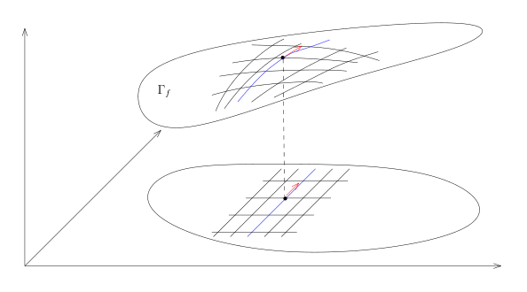

# 30：方向导数、偏导数与微分

[返回讲义目录](../../math-analysis-lecture-notes.md) · [学期目录](../02-math-analysis-ii.md) · [校勘记录](../errata.md) · [上一篇：数学分析二课程简介](30-00-course-overview.md) · [下一篇：映射的微分与 Jacobi 矩阵](31-differential-maps/31-01-p0344-0351.md)

<!-- source: PDF 335; printed: 335; transcription: first-pass; proofreading: applied -->

## 高维的微分学

在人们谈论高维的 $\mathbb{R}^n$ 的时候，经常会有如下感觉：

- $\mathbb{R}^n$ 上的每个点就是一个数组 $(x_1, x_2, \cdots, x_n)$；

- 两个不同场合的 $\mathbb{R}^n$ 是同一个 $\mathbb{R}^n$。

我们对此加以说明（上学期我们讲过，所谓的空间是一个集合加上一个结构）：令 $\mathbb{R}$ 是实数的集合（上学期我们证明了它的存在性（唯一，在同构的意义下），我们在这学期课程中**假设取定**这样的一个实数域），我们定义
$$
\mathbb{R}^n = \underbrace{\mathbb{R} \times \mathbb{R} \times \cdots \times \mathbb{R}}_{n\text{个}}.
$$
按照这个定义，$\mathbb{R}^n$ 是按照确定的方式定义的（所以是唯一的）。特别地，按照集合乘积的定义，$x \in \mathbb{R}^n$ 就是一个数组 $(x_1, x_2, \cdots, x_n)$，其中 $x_i \in \mathbb{R}$。特别地，我们在 $\mathbb{R}^n$ 上指定了一个特定的坐标系统 $(x_1, \cdots, x_n)$。

从函数的观点来看，给定 $\mathbb{R}^n$ 上的一个点，它的第 $i$ 个坐标定义出 $\mathbb{R}^n$ 到 $\mathbb{R}$ 的一个（坐标）映射（函数）：
$$
\pi_i : \mathbb{R}^n \to \mathbb{R}, \quad (x_1, \cdots, x_n) \mapsto x_i.
$$

**注记。** 微分学的一个核心话题是如何利用其它的坐标系统 $(y_1, \cdots, y_n)$ 来描述 $\mathbb{R}^n$ 上的光滑/可微函数。其中，所谓一个新的坐标系统 $(y_1, \cdots, y_n)$ 目前可以简单地想象为 $n$ 个函数
$$
y_i : \mathbb{R}^n \to \mathbb{R}, \quad (x_1, x_2, \cdots, x_n) \mapsto y_i(x_1, x_2, \cdots, x_n),
$$
其中 $i = 1, 2, \cdots, n$。我们要求把它们放在一起得到的映射
$$
\mathbb{R}^n \to \mathbb{R}^n, (x_1, \cdots, x_n) \mapsto \big(y_1(x_1, \cdots, x_n), \cdots, y_n(x_1, \cdots, x_n)\big).
$$
是一个双射。

在这个学期的课程中，如果不另加说明，我们总假设 $\Omega$ 是 $\mathbb{R}^n$ 中的一个开集，有时候我们把它称作是一个**（开）区域**。

上学期的课程中，我们对定义在 $\mathbb{R}^1$ 上的函数定义了导数的概念（如果存在）。我们做简单的回忆：假设 $f$ 是定义在区间 $I \subset \mathbb{R}$ 上的实值函数，$x_0 \in I$ 是一个给定的点，如果极限
$$
\lim_{h \to 0} \frac{f(x_0 + h) - f(x_0)}{h}
$$

<!-- source: PDF 336; printed: 336; transcription: first-pass; proofreading: applied -->

存在，我们就用 $f'(x_0)$ 表示这个极限并称它为 $f$ 的导数。我们还定义了 $f$ 在点 $x_0$ 处的微分 $df(x_0)$，这是一个线性映射（我们暂且不管它定义）。这两个概念都可以对 $\Omega \subset \mathbb{R}^n$ 上的函数来定义。在给出推广之前，我们必须要指出：$df(x_0)$ 是比 $f'(x_0)$ 更好的概念，因为它不依赖于坐标系统的选取。

## 方向导数与偏导数

导数在高维正确的推广是方向导数：

**定义 175**（方向导数）。给定函数 $f : \Omega \to \mathbb{R}$，$x_0 \in \Omega$，$v \in \mathbb{R}^n$。如果下面的极限
$$
\lim_{h \to 0} \frac{f(x_0 + hv) - f(x_0)}{h}
$$
存在，我们就称函数 $f$ 在 $x_0$ 处沿 $v$ 的（方向）导数存在，并将它记作
$$
(\nabla_v f)(x_0) = \lim_{h \to 0} \frac{f(x_0 + hv) - f(x_0)}{h}.
$$
习惯上，我们还把 $\nabla_v f$ 写成 $\frac{\partial f}{\partial v}$。

**注记**。在这个定义中，我们并没有使用 $\mathbb{R}^n$ 上的坐标系。特别地，如果 $f : V \to \mathbb{R}$ 是一个赋范线性空间上的函数，我们可以同样的对 $v \in V$ 定义方向导数。

如果使用坐标系，我们就有几个特殊的向量，比如说 $e_i = (0, \cdots, 0, 1, 0, \cdots, 0)$（第 $i$ 个位置为 $1$），我们约定用如下的符号代表这个向量
$$
\frac{\partial}{\partial x_i} = \underbrace{(0, \cdots, 0, 1, 0, \cdots, 0)}_{\text{第 } i \text{ 个位置上为 } 1 \text{，其余为 } 0}.
$$

此时，我们用下面的符号表示方向导数：
$$
\frac{\partial f}{\partial x_i}(x_0) = \left( \nabla_{\frac{\partial}{\partial x_i}} f \right) (x_0).
$$

习惯上，我们称它为偏导数。

**注记**。我们假设对任意的 $v \in \mathbb{R}^n$，$f$ 在 $x_0$ 处的方向导数都存在。此时，我们有映射（这个“几乎”就是微分的定义）：
$$
\mathbb{R}^n \to \mathbb{R}, \quad v \mapsto (\nabla_v f)(x_0).
$$
我们希望这个映射与 $\mathbb{R}^n$ 上的线性结构相容，即成为一个线性映射：

- 对任意的 $\lambda \in \mathbb{R}$，我们有
$$
(\nabla_{\lambda v} f)(x_0) = \lambda (\nabla_v f)(x_0).
$$

特别地，$\nabla_0 f = 0$。

只要按照定义验证即可。

<!-- source: PDF 337; printed: 337; transcription: first-pass; proofreading: applied -->

- 对任意的 $v, w \in \mathbb{R}^n$，我们希望有
$$
(\nabla_{v+w} f)(x_0) = (\nabla_v f)(x_0) + (\nabla_w f)(x_0).
$$

这个命题需要多一点的条件才可以证明，仅仅用每个方向导数存在是不够的。这个性质对我们将要证明的可微函数总是成立的。

**例子**。我们有两个基本的例子

1) 假设函数 $f : \mathbb{R}^2 \to \mathbb{R}$ 只依赖于 $x$-坐标，我们习惯上将它写成 $f(x, y) = f(x)$，那么，
$$
\frac{\partial f}{\partial y} \equiv 0.
$$

为此，只需要按定义计算即可：
$$
\frac{\partial f}{\partial y} = \lim_{h \to 0} \frac{f(x, y + h) - f(x)}{h} = 0.
$$

2) 考虑 $\mathbb{R}^2$ 上定义的函数
$$
f(x, y) = \begin{cases}
\frac{xy}{x^2 + y^2}, & (x, y) \neq (0, 0) \\
0, & (x, y) = (0, 0).
\end{cases}
$$

那么，$f(x, y)$ 在 $(0,0)$ 处的两个偏导数 $\frac{\partial f}{\partial x}$ 和 $\frac{\partial f}{\partial y}$ 均为 $0$。另外，如果 $v = (v_1, v_2)$ 其中 $v_1 v_2 \neq 0$，那么
$$
\nabla_v f(0) = \lim_{h \to 0} \frac{v_1 v_2}{h(v_1^2 + v_2^2)}
$$
是不存在的。由此可见，偏导数存在不能保证其它的方向导数存在。

### 方向导数的几何解释

**注记**（方向导数的几何解释）。方向导数本质上是一维的导数，这个从定义的写法本身就不难看出。假设 $I = (-a, a)$（$a > 0$）是一个区间，假设
$$
\gamma : I \to \mathbb{R}^n, \quad t \mapsto \gamma(t) = (\gamma_1(t), \gamma_2(t), \cdots, \gamma_n(t)),
$$
是 $C^1$-的映射（上学期证明过这等价于 $\gamma$ 的每个分量都是 $C^1$ 的）。我们将这样的映射 $\gamma$ 称作是 $\mathbb{R}^n$ 中的一条**曲线**。对于这样的曲线，我们称 $\gamma'(0) \in \mathbb{R}^n$ 是 $\gamma$ 在 $\gamma(0)$ 处的**切向量**。我们要强调的是每个切向量都与基准点 $\gamma(0)$ 相关并且我们认为不同点上的切向量是不相关的。

1) 最基本的曲线是直线：假设 $x_0 \in \Omega$，$v \in \mathbb{R}^n$，考虑曲线
$$
\ell_v : (-a, a) \to \Omega, \quad t \to x_0 + tv.
$$

这是 $\Omega$ 中过 $x_0$ 点以 $v$ 为切向量的一段直线。我们记 $L = \ell((-a, a))$，这是直线这个几何**对象**。我们应该注意区分下面的数学对象：$\ell$ 的像是“直线”这个几何对象，但是我们用（区间 $(-a, a)$ 是 $\ell$ 的定义域）$\ell$ 来参数化这个对象。

<!-- source: PDF 338; printed: 338; transcription: first-pass; proofreading: applied -->

现在给定函数 $f : \Omega \to \mathbb{R}$，我们用 $f\big|_L$ 表示 $f$ 在 $L$ 上的限制。那么，$(\nabla_v f)(x_0)$ 就是函数

$$(f\big|_L) \circ \ell : I \to \mathbb{R}$$

在 $0$ 处的导数，即

$$\left.\frac{d}{dt}\right|_{t=0} \left( (f\big|_L) \circ \ell \right) = (\nabla_{\ell'(0)} f)(\ell(0)).$$

当然，我们可以采取别的方式对 $L$ 进行参数化，比如取 $\lambda>0$，并令

$$\ell' : \left(-\frac{a}{\lambda}, \frac{a}{\lambda}\right) \to \mathbb{R}^n, \quad t \mapsto x_0 + \lambda t v.$$

它的像 $\operatorname{Im}(\ell')$ 也是 $\operatorname{Im}(\ell)$，但是 $\ell'$ 的在 $\ell'(0) = \ell(0)$ 处的切向量是 $\lambda \cdot v$。所以参数化的改变可能使得曲线的切向量发生改变。

2) 更一般的，给定取值于 $\Omega$ 的 $C^1$-曲线，并假设 $f$ 在 $\gamma(0)$ 处可微：

$$\gamma : (-a, a) \to \Omega, \quad t \mapsto \gamma(t).$$

我们令 $C = \operatorname{Im}(\gamma)$，那么

$$\left.\frac{d}{dt}\right|_{t=0} \left( (f\big|_C) \circ \gamma \right) = (\nabla_{\gamma'(0)} f)(\gamma(0)).$$

这个结论的证明我们留作作业。

3) 有一类曲线的例子尤为重要，它们可以用来刻画高维空间中的曲面。假设函数 $f : \Omega \to \mathbb{R}$ 的所有偏导数 $\frac{\partial f}{\partial x_i}$ 在 $\Omega$ 上都有定义且连续。我们考虑它的图像

$$\Gamma_f = \{ (x, f(x)) \in \Omega \times \mathbb{R} \subset \mathbb{R}^{n+1} | x \in \Omega \}.$$

这是 $\mathbb{R}^{n+1}$ 中的一张超曲面。给定 $x = (x_1, \cdots, x_n) \in \Omega$，我们就给定了 $\Gamma_f$ 上的一个点；反之亦然，以为我们只要取 $\Gamma_f$ 上的点的前 $n$ 个坐标就给出了 $\Omega$ 上的点。我们可以形象地认为 $\Omega$ 坐标网通过 $x \mapsto (x, f(x))$ 给出了 $\Gamma$ 上的一个坐标网。固定点 $p = (p_1, \cdots, p_n)$，我们考虑 $\Omega$ 上的曲线（直线）：

$$\gamma_k : (-a, a) \to \Omega, \quad t \mapsto (p_1, p_2, \cdots, p_{k-1}, p_k + t, p_{k+1}, \cdots, p_n).$$

<!-- source: PDF 339; printed: 339; transcription: first-pass; proofreading: applied -->

这是过 $p$ 点的 $x_k$ 这个坐标轴的参数表示。我们可以把这条曲线提升到 $\Gamma_f$ 上，从而得到

$$\tilde{\gamma}_k : (-a, a) \to \mathbb{R}^{n+1}, \quad t \mapsto (\gamma_k(t), f(\gamma_k(t))).$$

它们在图中对应的是两条蓝色的曲线。

按照定义，第一条曲线在 $p$ 处的切向量为 $e_k = \frac{\partial}{\partial x_k}$，我们在图中用红色表示；第二条曲线在 $(p, f(p))$ 处的切向量为

$$E_k = \frac{\partial}{\partial x_k} + \frac{\partial f}{\partial x_k}(p) \frac{\partial}{\partial x_{n+1}}.$$

如果我们用 $T_{(p, f(p))} \Gamma_f$ 表示该曲面在点 $(p, f(p))$ 处的切空间（暂且不管如何定义），那么，这些 $E_k$ 应该恰好张成这个切空间。

这里，我们通过曲线提升的方式，计算了一个曲面的切空间（利用了偏导数）。这类作为函数的图像出现的超曲面是多元微积分中最基本的几何对象，我们在后面的课程中会无限次见到它们。

## 函数的微分

我们现在来定义函数的微分：

**定义 176**（函数的微分）。给定函数 $f : \Omega \to \mathbb{R}$ 和 $x_0 \in \Omega$。如果存在 $\mathbb{R}$-线性映射 $A : \mathbb{R}^n \to \mathbb{R}$，使得对于 $v \to 0$ 时，其中 $v \in \mathbb{R}^n$，我们有

$$f(x_0 + v) = f(x_0) + A(v) + o(v),$$

也就是说

$$\lim_{v \to 0} \frac{|f(x_0 + v) - f(x_0) - A(v)|}{|v|} = 0,$$

其中向量的长度 $|v|$ 可以选取任意的范数（比如勾股定理所定义的 $\|\cdot\|_2$），我们就称 $f$ 在 $x_0$ 处可微并且称线性映射 $A$ 是 $f$ 在 $x_0$ 的微分。我们通常将 $A$ 写成下面的样子：

$$df\big|_{x=x_0} = df(x_0) : \mathbb{R}^n \to \mathbb{R}.$$

如果 $f$ 在 $\Omega$ 的每个点处都可微，我们就称 $f$ 是 $\Omega$ 上的可微函数。

当 $n = 1$ 时，我们上个学期已经证明了，如果 $f$ 在 $x_0$ 处的导数存在，那么 $df(x_0)$ 也存在并且它可以写成

$$df(x_0) : \mathbb{R} \to \mathbb{R}, \quad v \mapsto f'(x_0) \cdot v,$$

其中 $\cdot$ 是一个数乘以一个 $1$ 维的向量。

另外，根据定义，如果 $f$ 在 $x_0 \in \Omega$ 处可微，那么 $f$ 在 $x_0$ 处连续。这几乎是显然的：

$$f(x_0 + v) - f(x_0) = A(v) + o(v) = o(1).$$

<!-- source: PDF 340; printed: 340; transcription: first-pass; proofreading: applied -->

**注记。** 在微分的定义中，我们根本就没有用到 $\mathbb{R}^n$ 上的坐标系：我们只用到了 $v$ 的长度的概念。所以，可以自然地对在一个赋范线性空间 $(V,\|\cdot\|)$ 上定义的函数来定义其微分：给定函数 $f:V\to\mathbb{R}$ 和 $x_0\in V$，其中 $(V,\|\cdot\|)$ 是一个（$\mathbb{R}$ 或者 $\mathbb{C}$ 上的）赋范线性空间；复赋范空间在此视为实赋范空间。如果存在连续的 $\mathbb{R}$-线性映射 $A:V\to\mathbb{R}$，使得

$$
\lim_{v\to0}\frac{|f(x_0+v)-f(x_0)-A(v)|}{\|v\|}=0,
$$

我们就称 $f$ 在 $x_0$ 处可微并且称 $A$ 是 $f$ 在 $x_0$ 的微分，我们还把 $A$ 记作 $df|_{x=x_0}=df(x_0)$。

### 微分的坐标表示

**命题 177**（微分的计算：微分与方向导数之间的关系）。假设 $f:\Omega\to\mathbb{R}$ 在 $x_0$ 处可微，那么 $f$ 在 $x_0$ 的任意方向导数都存在。特别地，对于 $v=(v_1,\cdots,v_n)=\sum_{i=1}^n v_i\frac{\partial}{\partial x_i}$（请回忆：我们约定 $\frac{\partial}{\partial x_i}$ 代表向量 $\underbrace{(0,\cdots,1,\cdots,0)}_{\text{第 }i\text{ 个位置上为 }1}$），那么

$$
df(x_0)(v)=(\nabla_v f)(x_0)=\sum_{j=1}^n\frac{\partial f}{\partial x_j}(x_0)v_j.
$$

这也表明映射

$$
\mathbb{R}^n\to\mathbb{R},\quad v\mapsto(\nabla_v f)(x_0)
$$

是线性映射。

**证明：** 任意给定 $v\in\mathbb{R}^n$，令 $h\to0$，根据微分的定义，我们有

$$
f(x_0+hv)-f(x_0)=(df(x_0))(hv)+o(hv).
$$

所以，我们可以利用定义来计算方向导数

$$
(\nabla_v f)(x_0)=\lim_{h\to0}\frac{h(df(x_0))(v)+o(hv)}h=(df(x_0))(v).
$$

这也表明 $\mathbb{R}^n\to\mathbb{R},\quad v\mapsto(\nabla_v f)(x_0)$ 是线性。为了用偏导数具体地计算 $df(x_0)$，根据上面的结果，我们有

$$
(df(x_0))(v)=(\nabla_v f)(x_0)=\sum_{i=1}^n v_i(\nabla_{\frac{\partial}{\partial x_i}}f)(x_0)=\sum_{j=1}^n\frac{\partial f}{\partial x_j}(x_0)v_j.
$$

命题得证。$\square$

**注记。** 在微积分学习中，最有歧义的一个数学符号是所谓的 $dx$。现在我们用微分的语言定义 $dx_i$。假定在 $\mathbb{R}^n$ 上我们事先选好了坐标系 $(x_1,\cdots,x_n)$。此时，

$$
\pi_i:\mathbb{R}^n\to\mathbb{R},\quad(x_1,\cdots,x_n)\mapsto x_i
$$

<!-- source: PDF 341; printed: 341; transcription: first-pass; proofreading: applied -->

是一个函数，传统上我们就把 $\pi_i$ 写成 $x_i$，所以当给定了一个点 $p\in\mathbb{R}^n$ 之后，$dx_i(p)$ 指代的就是线性映射 $d\pi_i(p)$。很明显，通过定义线性映射

$$
A:\mathbb{R}^n\to\mathbb{R},\quad\frac{\partial}{\partial x_j}\mapsto\begin{cases}
0,&i\neq j;\\
1,&i=j.
\end{cases}.
$$

这就是 $d\pi_i$ 在某个点 $p$ 处的微分。

用传统的 Kronecker 符号来记，我们有

$$
((dx_i)(p))\left(\frac{\partial}{\partial x_j}\right)=\delta_j^i.
$$

### 可微性与偏导数连续的判据

我们之前证明了如果函数的微分存在，那么方向导数也存在。反过来并不成立，实际上，下面的例子表明 $f$ 甚至可以不连续，尽管其方向导数都存在：

**例子。** 考虑函数在 $\mathbb{R}^2$ 定义函数：

$$
f(x,y)=\begin{cases}
\dfrac{y^2}{x},&x\neq0\\
0,&x=0.
\end{cases}
$$

那么，$f$ 在 $(0,0)$ 处的任意一个方向导数都存在：假设 $v=(v_1,v_2)\in\mathbb{R}^2$ 且 $v\neq0$。那么，我们有

1）如果 $v_1=0$，那么

$$
\nabla_v f(0)=\lim_{t\to0}\frac{0-0}{t}=0.
$$

2）如果 $v_1\neq0$，那么

$$
\nabla_v f(0)=\lim_{t\to0}\frac{t\frac{v_2^2}{v_1}}{t}=\frac{v_2^2}{v_1}.
$$

然而，$f$ 在 $(0,0)$ 处不可微，这因为 $f$ 在 $(0,0)$ 不连续：可以选取点列 $\{(\frac1{n^2},\frac1n)\}_{n\geqslant1}$，函数在这些点上取值不收敛到 $0$。

这个例子也说明，只考虑方向导数并不能对函数在一个点附近的行为有效地进行控制。

然而，如果方向导数的具有连续性，情况就大不相同。直观上，连续性允许我们从一点的信息出发理解这点附近的情况。

**命题 178。** 给定开区域 $\Omega\subset\mathbb{R}^n$ 和 $x_0\in\Omega$，$f$ 是在 $\Omega$ 上定义的函数。假设 $f$ 的所有偏导数 $\frac{\partial f}{\partial x_i}$ 在 $x_0$ 的附近（不妨设在 $\Omega$ 上）存在并且 $\frac{\partial f}{\partial x_i}$ 均为连续函数，其中 $i=1,2,\cdots,n$，那么 $f$ 在 $x_0$ 处可微。

这个命题可以非常方便地用来判断一个函数的可微性，比如说，考虑 $\mathbb{R}^3$ 上的函数

$$
f(x,y,z)=3y+e^{yz},
$$

它的偏导数很容易计算并且很明显是连续的。所以，$f$ 是可微的。

<!-- source: PDF 342; printed: 342; transcription: first-pass; proofreading: applied -->

**证明：** 假设函数 $f$ 在 $x_0$ 处的微分存在，那么它可以用偏导数来表示，即

$$
df(x_0)v=\sum_{j=1}^n\frac{\partial f}{\partial x_j}(x_0)v_j,\quad v\in\mathbb{R}^n.
$$

据此，我们定义线性映射

$$
D:\mathbb{R}^n\to\mathbb{R},\quad v\mapsto\sum_{j=1}^n\frac{\partial f}{\partial x_j}(x_0)v_j.
$$

我们只要证明 $r(v)=f(x_0+v)-f(x_0)-D(v)$ 是一个 $o(v)$ 项即可，其中 $v\to0$。我们将 $x_0$ 用坐标写成

$$
x_0=(x_{0,1},x_{0,2},\cdots,x_{0,n}).
$$

按定义，我们有

$$
\begin{aligned}
r(v)&=f((x_{0,1}+v_1,\cdots,x_{0,n}+v_n))-f((x_{0,1},\cdots,x_{0,n}))-\sum_{j=1}^n\frac{\partial f}{\partial x_j}(x_0)v_j\\
&=f((x_{0,1}+v_1,x_{0,2},\cdots,x_{0,n}))-f((x_{0,1},\cdots,x_{0,n}))-\frac{\partial f}{\partial x_1}(x_0)v_1\\
&\quad+f((x_{0,1}+v_1,x_{0,2}+v_2,x_{0,3},\cdots,x_{0,n}))-f((x_{0,1}+v_1,x_{0,2},\cdots,x_{0,n}))-\frac{\partial f}{\partial x_2}(x_0)v_2\\
&\quad+\cdots\\
&\quad+f((x_{0,1}+v_1,\cdots,x_{0,n}+v_n))-f((x_{0,1}+v_1,\cdots,x_{0,n-1}+v_{n-1},x_{0,n}))-\frac{\partial f}{\partial x_n}(x_0)v_n\\
&=\sum_{j=1}^n\left[\underbrace{\big(f(\cdots,x_{0,j}+v_j,x_{0,j+1},\cdots)-f(\cdots,x_{0,j-1}+v_{j-1},x_{0,j},x_{0,j+1},\cdots)\big)}_{\text{Lagrange 中值定理}}-\frac{\partial f}{\partial x_j}(x_0)v_j\right]\\
&=\sum_{j=1}^n\left(\frac{\partial f}{\partial x_j}(\widetilde{x}_j)-\frac{\partial f}{\partial x_j}(x_0)\right)v_j.
\end{aligned}
$$

在上面我们运用 Lagrange 中值定理的时候，假设除了第 $j$ 个位置的其它变量都是固定的，我们知道，此时求偏导数的运算就是 $1$ 维情形时的导数运算，所以可以用中值定理。换句话说，我们在以 $(x_{0,1}+v_1,\cdots,x_{0,j-1}+v_{j-1},x_{0,j},\cdots,x_{0,n})$ 和 $(x_{0,1}+v_1,\cdots,x_{0,j}+v_j,x_{0,j+1},\cdots,x_{0,n})$ 为端点的线段上用 Lagrange 中值定理，其中 $\widetilde{x}_j$ 是在这个线段上的一个点。当 $v\to0$ 时，很明显 $\widetilde{x}_j\to x_0$。上面的计算表明

$$
|r(v)|\leqslant\sum_{j=1}^n\left|\frac{\partial f}{\partial x_j}(\widetilde{x}_j)-\frac{\partial f}{\partial x_j}(x_0)\right||v|.
$$

根据连续性，$r(v)=o(v)$。$\square$

**注记。** 上面证明的关键想法是把问题转化成在某条直线或者曲线上讨论（维数 $=1$，当然，我们还没有定义什么是维数），从而可以利用一元微分学的结论，这是处理多变量函数最基本的想法之一。上个学期我们证明两点之间线段最短的时候就是用的这个想法，那个场合研究的空间是所有曲线的空间，维数甚至是无穷！

<!-- source: PDF 343; printed: 343; transcription: first-pass; proofreading: applied -->

## 微分与函数极值

我们再看上面想法的一个应用：这个例子对于实际应用非常的重要，因为我们可以用来计算多元函数的最大最小值：

**命题 179。** 假设 $f:\Omega\to\mathbb{R}$ 在 $x_0$ 处可微并且 $x_0$ 是 $f$ 在 $\Omega$ 上的最大，那么 $df(x_0)=0$。

**证明：** 任意给定方向 $v\in\mathbb{R}^n$，我们考虑通过 $x_0$ 的直线段

$$
\gamma:(-\varepsilon,\varepsilon)\to\Omega,\quad t\mapsto x_0+tv,
$$

其中 $\varepsilon$ 足够小使得线段本身落在 $\Omega$ 中，我们考虑 $f\circ\gamma$。简单而言，研究 $(-\varepsilon,\varepsilon)$ 上的函数 $g(t)=f(x_0+tv)$。之前的计算表明：

$$
\left.\frac{d}{dt}\right|_{t=0}f\circ\gamma=\nabla_v f(x_0)=df(x_0)(v).
$$

很明显，$0$ 是 $f\circ\gamma$ 的最大值点，所以 $(f\circ\gamma)'(0)=0$，这表明对任意的 $v\in\mathbb{R}^n$，$df(x_0)(v)=0$。所以，作为线性映射，$df(x_0)=0$。$\square$

另一个有趣的应用如下：

**命题 180。** 假设 $\Omega$ 是一个开的凸集[^p0343-7]（可以替换为连通性），$f:\Omega\to\mathbb{R}$ 是可微函数。如果对任意的 $x\in\Omega$，我们都有 $df(x)=0$，那么 $f$ 是常数。

**证明：** 证明我们留作作业。基本想法如下：固定 $x_0\in\Omega$，对任意的 $x\in\Omega$，我们考虑 $x_0$ 到 $x$ 的线段并将 $f$ 限制在这条线段上。这就可以帮助我们走到 $1$ 维的情况。$\square$

我们引入一些符号来结束本次的课程：

**注记。** 给定可微 $f:\Omega\to\mathbb{R}$，对于任意的 $x\in\Omega$，$df(x)$ 都是 $\mathbb{R}^n$ 上的一个线性函数，即

$$
df(x):\mathbb{R}^n\to\mathbb{R}.
$$

为了强调对 $x$ 的依赖性，我们把 $df(x)$ 的定义域这个 $\mathbb{R}^n$ 用 $T_x\Omega$ 来表示。换句话说，$df(x)$ 是一族线性函数，他们的定义域随着空间点位置的改变而改变，这不是我们通常意义上的函数。在课程的后面，我们会考虑 $\Omega\subset\mathbb{R}^n$ 是曲面（子流形）的情形，那时这些讨论会变得异常清晰。

[返回讲义目录](../../math-analysis-lecture-notes.md) · [学期目录](../02-math-analysis-ii.md) · [校勘记录](../errata.md) · [上一篇：数学分析二课程简介](30-00-course-overview.md) · [下一篇：映射的微分与 Jacobi 矩阵](31-differential-maps/31-01-p0344-0351.md)

[^p0343-7]: $\Omega$ 是凸集指的是对任意的 $p,q\in\Omega$，连接它们的线段整个都落在 $\Omega$ 中。
