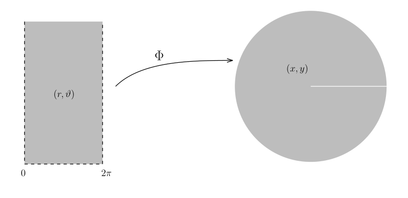

# 映射的微分与 Jacobi 矩阵

[返回讲义目录](../../../math-analysis-lecture-notes.md) · [学期目录](../../02-math-analysis-ii.md) · [章节目录](../31-differential-maps.md) · [校勘记录](../../errata.md) · [上一篇：方向导数、偏导数与微分](../30-multivariable-derivatives.md) · [下一篇：31.1：作业：齐次函数与Euler公式](31-03-p0352-0356.md)

<!-- source: PDF 344; printed: 344; transcription: first-pass; proofreading: applied -->

## 映射微分的定义

我们上次课最后讲到一个函数的高阶导数是比较难定义的。

---

In the fall of 1972 President Nixon announced that the rate of increase of inflation was decreasing. This was the first time a sitting president used the third derivative to advance his case for re-election.

– Hugo Rossi

---

给定函数 $f : \Omega \to \mathbb{R}$，我们上次课定义它的微分 $df(x)$。当 $x$ 给定的时候，这是一个 $\mathbb{R}^n$ 上的线性函数。仿照 1 维的理论，对 1 阶导数求导就应该得到 2 阶导数。然而，此时为了定义 $f$ 的二阶导数，我们就需要对 $x \mapsto df(x)$ 求微分。此时，（不严格地讲）映射 $f : x \mapsto df(x)$ 是一个从 $\Omega$ 到 $\operatorname{Hom}(\mathbb{R}^n, \mathbb{R}) \simeq \mathbb{R}^n$ 的映射，这是向量值的函数。所以，我们自然地想到对向量值的函数 $f : \Omega \to \mathbb{R}^m$ 定义微分。当然，我们还可以考虑 $df(x)$ 的每个分量（依赖于坐标系的选取）然后要求每个分量都可微，至少从形式上看，后一种做法失于简洁和美观。

**定义 181**（微分）。假设 $\Omega$ 是 $\mathbb{R}^n$ 中的区域，$\Omega'$ 是 $\mathbb{R}^m$ 中的区域，给定映射 $f : \Omega \to \Omega'$。如果存在线性映射

$$
df\big|_{x=x_0} = df(x_0) : \mathbb{R}^n \to \mathbb{R}^m,
$$

使得对于 $\mathbb{R}^n$ 中的 $v \to 0$ 时，我们有

$$
f(x_0 + v) = f(x_0) + df(x_0)v + o(v),
$$

即

$$
\lim_{v \to 0} \frac{|f(x_0 + v) - f(x_0) - df(x_0)v|}{|v|} = 0,
$$

我们就称 $f$ 在 $x_0$ 处可微并且称线性映射 $df(x_0)$ 是 $f$ 在 $x_0$ 的微分。如果 $f$ 在 $\Omega$ 的每个点处都可微，我们就称 $f$ 是 $\Omega$ 上面的**可微映射**。

**注记**。*1) 在上述微分的定义中，我们完全没有用到 $\mathbb{R}^n$ 和 $\mathbb{R}^m$ 上的坐标系。实际上，在下面的极限中*

$$
\lim_{v \to 0} \frac{\color{blue}{|} \overbrace{f( \underbrace{x_0 + v}_{\text{用到 } \mathbb{R}^n \text{ 上的加法结构}} ) - f(x_0) - df(x_0)v}^{\text{用到 } \mathbb{R}^m \text{ 上的加法结构}} \color{blue}{|}}{\color{red}{|} v \color{red}{|}} = 0,
$$

*我们只用到了 $\mathbb{R}^n$ 和 $\mathbb{R}^m$ 上的线性结构和它们上面的范数（我们分别用了蓝色和红色表示，其中红色的是定义域 $\mathbb{R}^n$ 上的范数，蓝色的是值域 $\mathbb{R}^m$ 上的范数）。*

<!-- source: PDF 345; printed: 345; transcription: first-pass; proofreading: applied -->

*据此，我们可以将上述定义进行推广：给定赋范线性空间 $(V_1, \|\cdot\|_1)$ 和 $(V_2, \|\cdot\|_2)$，$\Omega_1 \subset V_1$ 和 $\Omega_2 \subset V_2$ 是非空的开集，$f : \Omega_1 \to \Omega_2$ 是映射。如果存在线性映射*

$$
df\big|_{x=x_0} = df(x_0) : V_1 \to V_2,
$$

*使得对于 $V_1$ 中的 $v \to 0$ 时，我们有*

$$
\lim_{v \to 0} \frac{\|f(x_0 + v) - f(x_0) - df(x_0)v\|_2}{\|v\|_1} = 0,
$$

*我们就称 $f$ 在 $x_0$ 处可微并且称线性映射 $df(x_0)$ 是 $f$ 在 $x_0$ 的**微分**。*

*2) 假设 $f$ 在 $\Omega$ 上可微。那么，给定 $x \in \Omega$，$df(x) \in \operatorname{Hom}(\mathbb{R}^n, \mathbb{R}^m) \simeq \mathbb{R}^{mn}$（可以视作是 $mn$ 的矩阵，这里我们用坐标比较方便）也在一个向量空间中取值的。（然而，如果在一般的（无限维的）的赋范线性空间上定义微分，我们会要求 $df(x) \in \operatorname{Hom}(V, W)$ 是所谓的连续线性映射，这里不展开讨论，有兴趣的同学可以在泛函分析的课程上学习）。所以，当 $x$ 变化的时候，我们就得到一个映射*

$$
\Omega \to \mathbb{R}^{nm}, \quad x \mapsto df(x).
$$

*我们可以对它求导数来定义它的微分。高阶的微分不是这门课程的重点。*

*3) 假设 $f$ 在 $x_0 \in \Omega$ 处可微分，我们就有映射*

$$
df(x_0) : \mathbb{R}^n \to \mathbb{R}^m.
$$

*由于这些映射依赖于点，特别地，依赖于 $x_0 \in \Omega$（和 $f(x_0) \in \Omega'$），我们用 $T_{x_0}\Omega$ 代表它的定义域的线性空间 $\mathbb{R}^n$，用 $T_{f(x_0)}\Omega'$ 代表它的值域的线性空间 $\mathbb{R}^m$，这样子，我们形式上就有*

$$
df(x_0) : T_{x_0}\Omega \to T_{f(x_0)}\Omega'.
$$

*符号 $T_{x_0}\Omega$ 代表的是 $\Omega$ 在 $x_0$ 处的切空间（$=$切平面），$T_{f(x_0)}\Omega'$ 代表的是 $\Omega'$ 在 $f(x_0)$ 处的切空间，我们会有专门的例子来理解这个对象，目前大家可以暂时将它们理解为好的记号。*

### 雅可比矩阵与微分的坐标表示

我们上次课定义了方向导数和偏导数，这都是 1 维的对象。下面的命题表明，我们可以用偏导数这些 1 维的对象来描述 $df(x_0)$ 这个高维的对象：

**命题 182**（微分的计算）。*假设 $V = \mathbb{R}^n$ 和 $W = \mathbb{R}^m$，我们在 $V$ 上用坐标系 $\{x_i\}_{i=1,\cdots,n}$，在 $W$ 上用坐标系 $\{y_j\}_{j=1,\cdots,m}$（把空间写成 $V$ 和 $W$ 是强调这些空间可以不用具体的坐标来描述）。考虑 $f : V \to W$（我们也可以考虑 $f$ 定义在 $V$ 中某个区域上），用坐标来写，我们有：*

$$
x \mapsto f(x) = \big(f_1(x_1, \cdots, x_n), f_2(x_1, \cdots, x_n), \cdots, f_m(x_1, \cdots, x_n)\big).
$$

*有时候还写成*

$$
y_1 = f_1(x_1, \cdots, x_n), \ y_2 = f_2(x_1, \cdots, x_n), \cdots, y_m = f_m(x_1, \cdots, x_n).
$$

*那么，我们有*

<!-- source: PDF 346; printed: 346; transcription: first-pass; proofreading: applied -->

*1) 假设 $f$ 在 $x_0$ 处可微，那么每个分量函数 $f_j$ 在 $x_0$ 处都可微，其中 $j = 1, 2, \cdots, m$。*

*2) 如果每个分量函数 $f_j$ 在 $x_0$ 处都可微（其中 $j = 1, 2, \cdots, m$），那么 $f$ 在 $x_0$ 处可微。*

*特别地，如果 $f$ 在 $x_0$ 处可微，那么映射 $df(x_0) : \mathbb{R}^n \to \mathbb{R}^m$ 可以用 $m \times n$ 的矩阵*

$$
\left( \frac{\partial f_i}{\partial x_j}(x_0) \right)_{\substack{i=1,\cdots,m \\ j=1,\cdots,n}}
$$

*来表示（我们将这个矩阵称作是 $f$ 在 $x$ 处的 **Jacobi 矩阵**，并记作 $\operatorname{Jac}(f)$ 或者 $\mathbf{J}(f)$，$\color{blue}{\text{它只是微分在一个特殊的坐标系下的表达}}$）。*

**证明：** 我们首先证明，$f$ 在 $x_0$ 可微等价于每个分量 $f_j$（$j = 1, \cdots, m$）都可微。假设 $f$ 在 $x_0$ 处可微，此时 $df : \mathbb{R}^n \to \mathbb{R}^m$ 有定义并且是线性映射。由于我们在 $\mathbb{R}^n$ 上选定了基 $\{\frac{\partial}{\partial x_i}\}_{i \leqslant n}$，在 $\mathbb{R}^m$ 上选定了基 $\{\frac{\partial}{\partial y_j}\}_{j \leqslant m}$，我们可以把这个线性映射用矩阵 $(J_{ji})_{\substack{j \leqslant m, \\ i \leqslant n}}$ 来表示。

首先，用分量表达，我们有

$$
\begin{aligned}
\frac{|f(x_0 + v) - f(x_0) - df(x_0)v|}{|v|} &= \frac{\big|(\cdots, f_j(x_0 + v) - f_j(x_0), \cdots) - (\cdots, \sum_{i=1}^n J_{ji}v_i, \cdots)\big|}{|v|} \\
&= \frac{\sqrt{\sum_{j=1}^m \big|f_j(x_0 + v) - f_j(x_0) - \sum_{i=1}^n J_{ji}v_i\big|^2}}{|v|}
\end{aligned}
$$

由于当 $v \to 0$ 时，上述左边为 $o(1)$，所以，限制到每个分量，我们就有

$$
o(1) \geqslant \frac{\big|f_j(x_0 + v) - f_j(x_0) - \sum_{i=1}^n J_{ji}v_i\big|}{|v|}.
$$

按定义，这表明 $f_j$ 是可微分的（因为我们用线性映射在 $x_0$ 附近逼近了 $f_j$）。反过来，假设对每个 $j \leqslant m$，我们都有

$$
\frac{\big|f_j(x_0 + v) - f_j(x_0) - \sum_{i=1}^n J_{ji}v_i\big|}{|v|} = o(1),
$$

那么，

$$
\begin{aligned}
\frac{|f(x_0 + v) - f(x_0) - df(x_0)v|}{|v|} &= \frac{\sqrt{\sum_{j=1}^m \big|f_j(x_0 + v) - f_j(x_0) - \sum_{i=1}^n J_{ji}v_i\big|^2}}{|v|} \\
&\leqslant \sum_{j=1}^m \frac{\big|f_j(x_0 + v) - f_j(x_0) - \sum_{i=1}^n J_{ji}v_i\big|}{|v|} = m \times o(1) = o(1),
\end{aligned}
$$

<!-- source: PDF 347; printed: 347; transcription: first-pass; proofreading: applied -->

所以 $df(x_0)$ 存在。

我们令 $v = t \frac{\partial}{\partial x_{i_0}}$，即 $v_{i_0} = t$ 而其它分量 $= 0$。此时，根据微分的定义，上面的式子的左边是 $o(1)$ 项（$t \to 0$）。计算右边，我们得到

$$
o(1) = \frac{\sqrt{\sum_{j=1}^m \Big| f_j\big(x_0 + \overbrace{(0, \cdots, 0, t, 0 \cdots, 0)}^{\text{只有第 } i_0 \text{ 个位置非 } 0}\big) - f_j(x_0) - J_{ji_0}t \Big|^2}}{|t|}.
$$

对于一个特定的指标 $j_0$，我们自然有

$$
\begin{aligned}
&\sqrt{\sum_{j=1}^m \Big| f_j\big(x_0 + (0, \cdots, 0, t, 0 \cdots, 0)\big) - f_j(x_0) - J_{ji_0}t \Big|^2} \\
\geqslant &\Big| f_{j_0}\big(x_0 + (0, \cdots, 0, t, 0 \cdots, 0)\big) - f_{j_0}(x_0) - J_{j_0i_0}t \Big|.
\end{aligned}
$$

所以，

$$
o(1) = \Big| f_{j_0}\big(x_0 + (0, \cdots, 0, t, 0 \cdots, 0)\big) - f_{j_0}(x_0) - J_{j_0i_0}t \Big| / |t|.
$$

按照定义，这表明 $f_{j_0}$ 的沿着 $x_{i_0}$ 偏导数存在并且等于 $J_{j_0i_0}$，这表明

$$
J_{ji} = \frac{\partial f_j}{\partial x_i}(x_0).
$$

命题得证。 $\Box$

**注记**。上述命题表明，映射可求微分等价于其分量可求微分，所以，我们可以通过继续对分量求微分来引入 $k$-次可导的概念（就是每次求完微分之后这个微分的每个分量都能再求微分）。所以，我们可以定义 $C^k(\Omega, \mathbb{R}^m)$，这是 $k$ 次微分仍然连续的映射的空间。根据上次课程用偏导数判定微分存在性的定理，我们知道只要 $f$ 的连续 $k$ 次偏导数（可能是沿着不同方向的）存在并且 $\color{red}{\text{连续}}$，那么映射就是 $C^k$ 的。这是一个非常方便有效的判断方式。

## 复合映射的链式法则

我们现在研究符合映射的微分，也就是所谓的链式法则。

**命题 183**。（链式法则）*假设 $\Omega_j \subset \mathbb{R}^{m_j}$ 是开集，其中 $j = 1, 2, 3$，$f : \Omega_1 \to \Omega_2$，$g : \Omega_2 \to \Omega_3$ 是映射。假设 $f$ 在点 $x_1 \in \Omega_1$ 处可微，$g$ 在点 $x_2 = f(x_1) \in \Omega_2$ 处可微，那么复合映射 $g \circ f$ 在 $x_1$ 处可微，并且*

$$
\big(d(g \circ f)\big)(x_1) = (dg)(f(x_1)) \circ df(x_1).
$$

**注记**。*上述映射的复合可以用下面的交换图来表示：*

$$
\begin{array}{ccc}
\Omega_1 & \xrightarrow{f} & \Omega_2 \\
& \searrow_{g \circ f} & \downarrow g \\
& & \Omega_3
\end{array}
$$

<!-- source: PDF 348; printed: 348; transcription: first-pass; proofreading: applied -->

那么，它们所对应的微分（在线性的层次上）也可以用类似的交换图来表示：

$$
\begin{array}{ccc}
\mathbb{R}^{m_1} & \xrightarrow{df(x_1)} & \mathbb{R}^{m_2} \\
& \searrow_{d(g \circ f)(x_1)} & \downarrow_{dg(f(x_1))} \\
& & \mathbb{R}^{m_3}
\end{array}
$$

我们之前引入的符号更好的描述了这个场景：对于映射 $df(x_1) : \mathbb{R}^{m_1} \to \mathbb{R}^{m_2}$，我们将 $x_1$ 所对应的 $\mathbb{R}^{m_1}$ 记作 $T_{x_1}\Omega_1$，将 $\mathbb{R}^{m_2}$ 记作是 $T_{f(x_1)}\Omega_2$，那么，我们有映射

$$
df|_{x=x_1} : T_{x_1}\Omega_1 \to T_{f(x_1)}\Omega_2.
$$

从而，上面的交换图表可以写成

$$
\begin{array}{ccc}
T_{x_1}\Omega_1 & \xrightarrow{df|_{x=x_1}} & T_{f(x_1)}\Omega_2 \\
& \searrow_{d(g \circ f)|_{x=x_1}} & \downarrow_{dg|_{x=f(x_1)}} \\
& & T_{g(f(x_1))}\Omega_3
\end{array}
$$

**证明：** 链式法则的推导与 1 维的情形如出一辙：令 $x_2 = f(x_1) \in \Omega_2$，按照定义有

$$
f(x_1 + h) = f(x_1) + df(x_1)h + \delta(h),
$$

$$
g(f(x_1) + \ell) = g(f(x_1)) + dg(x_2)\ell + \Delta(\ell),
$$

其中 $h \in \mathbb{R}^{m_1}$，$\ell \in \mathbb{R}^{m_2}$，$\lim_{h \to 0} \frac{|\delta(h)|}{|h|} = \lim_{\ell \to 0} \frac{|\Delta(\ell)|}{|\ell|} = 0$。据此，我们有

$$
\begin{aligned}
g(f(x_1 + h)) - g(f(x_1)) &= g(f(x_1) + df(x_1)h + \delta(h)) - g(f(x_1)) \\
&= dg(x_2)(df(x_1)h + \delta(h)) + \Delta(df(x_1)h + \delta(h)) \\
&= \underbrace{dg(x_2)(df(x_1)h)}_{=dg(x_2) \circ df(x_1)(h)} + dg(x_2)(\delta(h)) + \Delta(df(x_1)h + \delta(h)).
\end{aligned}
$$

所以，

令 $k(h)=df(x_1)h+\delta(h)$，并令 $\eta(\ell)=|\Delta(\ell)|/|\ell|$（$\ell\neq0$），$\eta(0)=0$，则 $\eta(\ell)\to0$。所以，

$$
\begin{aligned}
&\frac{\left|g(f(x_1+h))-g(f(x_1))-dg(x_2)\circ df(x_1)(h)\right|}{|h|}\\
\leqslant& C\frac{|\delta(h)|}{|h|}+\eta(k(h))\frac{|k(h)|}{|h|}\\
\leqslant& C\frac{|\delta(h)|}{|h|}+\eta(k(h))\left(\|df(x_1)\|+\frac{|\delta(h)|}{|h|}\right).
\end{aligned}
$$

由此可见，这是一个 $o(1)$ 项，按照微分的定义，

$$
d(g \circ f)(x_1) = dg(x_2) \circ df(x_1).
$$

这就完成了证明。 $\Box$

<!-- source: PDF 349; printed: 349; transcription: first-pass; proofreading: applied -->

### 逆映射的微分

作为推论，我们可以计算反函数（逆映射）的微分：

**推论 184。** 给定区域 $\Omega_1 \subset \mathbb{R}^{n_1}$ 和 $\Omega_2 \subset \mathbb{R}^{n_2}$ 和可微映射 $f : \Omega_1 \to \Omega_2$。假设 $f$ 是双射并且其逆映射 $f^{-1} : \Omega_2 \to \Omega_1$ 是可微的，那么

- $n_1 = n_2$；

- $df(x)$ 是可逆的（等价于 $\operatorname{Jac}(f)(x)$ 的行列式是非零的）。

此时，对于任意的 $y \in \Omega_2$，我们有

$$
df^{-1}(y) = \left( df|_{x=f^{-1}(y)} \right)^{-1}.
$$

**证明：** 我们令 $\Omega_3 = \Omega_1$，$g = f^{-1}$，$x_1 = x$，$x_2 = y$，$g \circ f = \operatorname{Id}$，其中

$$
\operatorname{Id} : \Omega_1 \to \Omega_1, \quad x \mapsto x,
$$

是单位映射，它的微分在每个点处都是单位映射（线性）。根据链式法则，我们就有

$$
\operatorname{Id} = dg(y) \circ df(x).
$$

根据矩阵的秩的理论，我们知道 $n_1 \leqslant n_2$。用 $f^{-1}$ 替换 $f$，我们就得到 $n_2 \leqslant n_1$。这就证明了维数的部分。上面的等式已经蕴含了逆映射的微分的计算。 $\Box$

## 矩阵指数映射的微分

**例子（指数映射的微分）。** 上个学期我们对于 $n \times n$ 的矩阵定义了指数映射

$$
\exp : \mathbf{M}_n(\mathbb{R}) \to \mathbf{M}_n(\mathbb{R}), \quad A \mapsto e^A = \sum_{k=0}^{\infty} \frac{A^k}{k!}.
$$

我们现在计算它的微分 $d\exp$。固定 $A \in \mathbf{M}_n(\mathbb{R})$，我们要找到

$$
d\exp(A) : \mathbf{M}_n(\mathbb{R}) \to \mathbf{M}_n(\mathbb{R}),
$$

其中，我们把 $\mathbf{M}_n(\mathbb{R})$ 视作是 $\mathbb{R}^{n^2}$。对于任意较小的 $V \in \mathbf{M}_n(\mathbb{R})$，我们有

$$
e^{A+V} - e^A = \sum_{n=0}^{\infty} \frac{1}{n!} \left( (A+V)^n - A^n \right)
$$

现在强行展开 $(A+V)^n - A^n$（注意矩阵 $A$ 和 $V$ 的乘法未必交换）。通过将 $V$ 的二次项（以及更高次数的项）放到一起，我们得到

$$
(A+V)^n - A^n = \sum_{k=0}^{n-1} A^k V A^{n-1-k} + Q_n(V),\quad n\geqslant1.
$$

二项式展开的一共不超过 $2^n$ 项，所以 $Q_n(V)$ 中至多有 $2^n$ 项。我们上学期证明过（无论你选取什么样的范数），存在常数 $c$（依赖于范数），使得对任意的 $n \times n$ 的矩阵 $A$ 和 $B$，我们都有

$$
\|A \cdot B\| \leqslant c\|A\|\|B\|.
$$

<!-- source: PDF 350; printed: 350; transcription: first-pass; proofreading: applied -->

上述 $Q_n(V)$ 的一个通项形如 $AAVVAA\cdots AA$，这是一个由 $n$ 个 $A$ 和 $V$ 排出来的长度为 $n$ 的字符串，其中至少有 $2$ 个 $V$。增大上页乘法估计的常数使 $c\geqslant1$，令 $M=\max(1,\|A\|)$。因为最终令 $V\to0$，我们只需考虑 $\|V\|\leqslant1$。其中 $Q_0=Q_1=0$，对于 $n\geqslant2$，每个至少有两个 $V$ 的通项，其余因子的范数都不超过 $M$，所以

$$
\|AAVVAA\cdots AA\| \leqslant c^n \|A\|\|A\|\|V\|\|V\|\|A\|\|A\|\cdots \|A\|\|A\|.
$$

那么，我们得到

$$
\|Q_n(V)\| \leqslant 2^n c^n \|V\|^2 M^{n-2},\quad n\geqslant2.
$$

从而，我们有

$$
\begin{aligned}
&\left\| \exp(A+V)-\exp(A)-\sum_{n=1}^{\infty}\frac1{n!}\left(\sum_{k=0}^{n-1}A^kVA^{n-1-k}\right)\right\|\\
\leqslant&\sum_{n=2}^{\infty}\frac1{n!}\|Q_n(V)\|\\
\leqslant&\left(\sum_{n=2}^{\infty}\frac{(2c)^nM^{n-2}}{n!}\right)\|V\|^2
\leqslant\frac{e^{2cM}}{M^2}\|V\|^2.
\end{aligned}
$$

那么，我们注意到右端的项是 $o(\|V\|)$ 并且 $\sum_{n=1}^{\infty} \frac{1}{n!} \left( \sum_{k=0}^{n-1} A^k V A^{n-1-k} \right)$ 是收敛的。所以，

$$
d\exp(A)(V) = \sum_{n=1}^{\infty} \frac{1}{n!} \left( \sum_{k=0}^{n-1} A^k V A^{n-1-k} \right)
$$

特别地，如果 $A$ 和 $V$ 可交换，那么 $d\exp(A)(V) = \exp(A)V$。我们还有

$$
d\exp(0) = \operatorname{Id}.
$$

有了链式法则，我们可以讨论更换坐标系的问题。这是个核心的话题，我们在中学的时候就已经在使用这个概念，比如说我们经常在极坐标和 Descartes 坐标系之间转换。我们首先用映射的语言来描述极坐标：令

$$
\Omega_1 = \mathbb{R}^2 - \{(x, 0) | x \geqslant 0\} \subset \mathbb{R}^2, \quad \Omega_2 = \mathbb{R}_{>0} \times (0, 2\pi) = \{(r, \vartheta) | r > 0, \vartheta \in (0, 2\pi)\}.
$$

<!-- source: PDF 351; printed: 351; transcription: first-pass; proofreading: applied -->

我们通常用的 $x = r \cos \vartheta$ 和 $y = r \sin \vartheta$ 可以用如下的映射来写：

$$
\Phi : \Omega_2 \to \Omega_1, \quad (r, \vartheta) \mapsto (r \cos \vartheta, r \sin \vartheta).
$$

由于在 $\Omega_1$ 上我们给定了 $(x, y)$ 作为坐标，在 $\Omega_2$ 上我们给定了 $(r, \vartheta)$ 作为坐标，所以我们可以用 Jacobi 矩阵来表示上述映射的微分：

$$
d\Phi = \operatorname{Jac}(\Phi) = \begin{pmatrix} \frac{\partial x}{\partial r} & \frac{\partial x}{\partial \vartheta} \\ \frac{\partial y}{\partial r} & \frac{\partial y}{\partial \vartheta} \end{pmatrix} = \begin{pmatrix} \cos \vartheta & -r \sin \vartheta \\ \sin \vartheta & r \cos \vartheta \end{pmatrix}.
$$

这个线性映射自然是可逆的，它的行列式是 $r$。

[返回讲义目录](../../../math-analysis-lecture-notes.md) · [学期目录](../../02-math-analysis-ii.md) · [章节目录](../31-differential-maps.md) · [校勘记录](../../errata.md) · [上一篇：方向导数、偏导数与微分](../30-multivariable-derivatives.md) · [下一篇：31.1：作业：齐次函数与Euler公式](31-03-p0352-0356.md)
