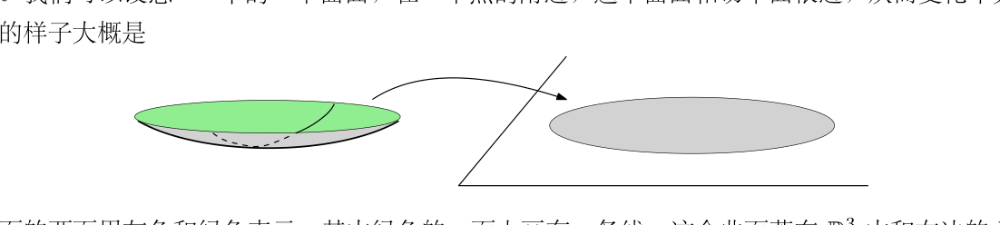
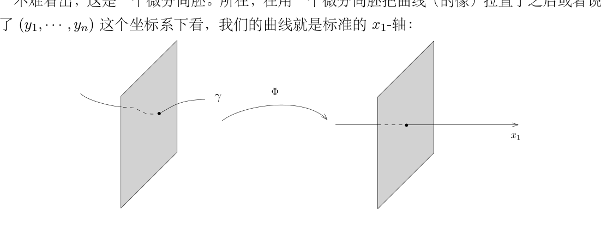
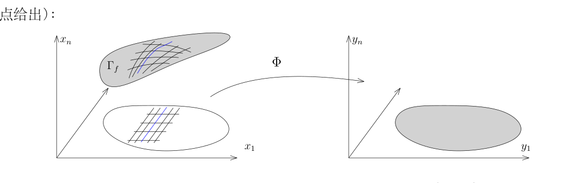
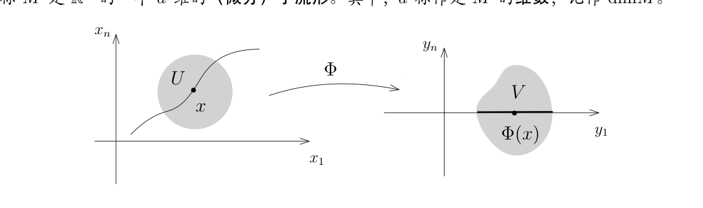
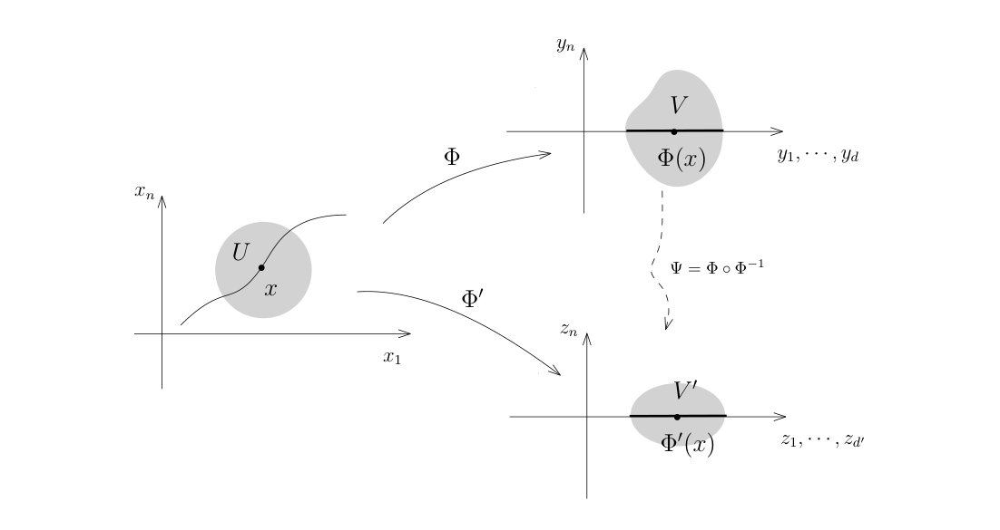

# 32 坐标变换、多元 Taylor 展开与子流形

[返回讲义目录](../../math-analysis-lecture-notes.md) · [学期目录](../02-math-analysis-ii.md) · [校勘记录](../errata.md) · [上一篇：31.1 作业:齐次函数与Euler公式](31-differential-maps/31-03-p0352-0356.md) · [下一篇：子流形与反函数定理](33-inverse-function/33-01-p0368-0374.md)

<!-- source: PDF 357; printed: 357; transcription: first-pass; proofreading: applied -->

## 32 微分同胚，坐标变换，Clairaut-Schwarz 定理（偏导数可交换），多元函数的 Taylor 展开，$\mathbb{R}^n$ 中光滑子流形的定义

### 微分同胚与坐标变换

给定映射 $f: \Omega_1 \to \mathbb{R}^{n_2}$，其中开区域 $\Omega_1 \subset \mathbb{R}^{n_1}$，用坐标分量表示，我们有

$$
f = (f_1, f_2, \cdots, f_{n_2}).
$$

如果对任意的 $k \in \{1, \cdots, n_2\}$ 对任意的 $N \geqslant 1$，对任意的 $N$ 个正整数 $k_1, k_2, \cdots, k_N \in \{1, 2, \cdots, n_1\}$，偏导数

$$
\frac{\partial}{\partial x_{k_N}} \left( \frac{\partial}{\partial x_{k_{N-1}}} \left( \cdots \left( \frac{\partial f_k}{\partial x_{k_1}} \right) \cdots \right) \right)
$$

都存在并且是连续的，那么我们就称 $f$ 是**光滑的**。如果 $n_2 = 1$，我们就称之为**光滑函数**，并记为 $C^\infty(\Omega_1)$。

**练习.** 证明以下三个关于光滑函数的基本性质：

1) $C^\infty(\Omega_1)$ 是一个 $\mathbb{R}$-代数，即对任意的 $f, g \in C^\infty(\Omega_1)$，它们的任意实线性组合以及乘积都是光滑函数。

2) 假设 $f \in C^\infty(\Omega_1)$。如果对任意的 $x \in \Omega_1$，$f(x) \neq 0$，那么 $\frac{1}{f}$ 也是光滑函数。

3) 证明，对任意的 $i \in \{1, 2, \cdots, n_1\}$，对任意的 $f \in C^\infty(\Omega_1)$，有 $\frac{\partial f}{\partial x_i} \in C^\infty(\Omega_1)$。

对于两个开区域 $\Omega_1 \subset \mathbb{R}^{n_1}$ 和 $\Omega_2 \subset \mathbb{R}^{n_2}$，如果存在双射映射 $f: \Omega_1 \to \Omega_2$，使得

$$
f: \Omega_1 \to \Omega_2, \quad f^{-1}: \Omega_2 \to \Omega_1
$$

都是光滑的，我们就称 $\Omega_1$ 和 $\Omega_2$ 是**微分同胚的**（光滑同胚）。

我们把 $\Omega_1$ 到 $\Omega_2$ 之间的光滑映射的全体记作是 $C^\infty(\Omega_1, \Omega_2)$。当然，光滑的映射不见得是光滑的同胚。

**例子.** 考虑如下映射

$$
f: \mathbb{R} \to \mathbb{R}, \quad x \mapsto x^3.
$$

很明显，$f$ 是光滑的并且是双射。但是 $f^{-1}(y) = \sqrt[3]{y}$ 不是光滑的。

根据上次课逆映射微分的命题，我们一定有 $n_1 = n_2$（维数相同）。

**注记.**

<!-- source: PDF 358; printed: 358; transcription: first-pass; proofreading: applied -->

1) 微分同胚是两个区域的一种等价性，这个等价性是用双射及其光滑的逆映射定义的，且双射本身也光滑。一个好的类比是研究线性空间：两个线性空间之间等价指的是用线性的双射定义的线性同构。

2) 两个区域微分同胚，但是上述的映射 $f$ 不一定唯一。比如说，令 $\Omega_1 = \Omega_2 = \mathbb{R}^n$，任意一个可逆的线性映射都可以被选作 $f$。

有了微分同胚这个概念，我们可以讨论坐标变换。考虑两个开区域 $\Omega_1 \subset \mathbb{R}^{n_1}$ 和 $\Omega_2 \subset \mathbb{R}^{n_2}$，其中 $n_1 = n_2 = n$（为了区别起见）。我们在第一个 $\mathbb{R}^{n_1}$ 上面用 $(x_1, \cdots, x_n)$ 作为坐标系，在第二个 $\mathbb{R}^{n_2}$ 上面用 $(y_1, \cdots, y_n)$ 作为坐标系，假设存在光滑的同胚：

$$
\Phi: \Omega_1 \to \Omega_2.
$$

我们认为通过 $\Phi$ 这个映射可以用 $\Omega_1$ 上的点来**参数化** $\Omega_2$ 上的点：用 $(x_1, \cdots, x_n)$ 这个坐标系统也可以描述 $\Omega_2$ 上的点。比如说，给定坐标 $(x_1, \cdots, x_n)$，它对应的 $\Omega_2$ 中的点是 $\Phi(x_1, \cdots, x_n)$；根据双射的性质，对任意的 $p \in \Omega_2$，我们总能找到 $(x_1, \cdots, x_n) \in \Omega_1$，使得 $\Phi(x_1, \cdots, x_n) = p$。所以，我们有两种不同的方式描述 $\Omega_2$ 上的同一个点 $p \in \Omega_2$：

- 第一种方式是 $p$ 的 $y_i$-坐标 $(y_1(p), \cdots, y_n(p))$；

- 第二种是 $\Phi^{-1}(p)$ 的 $x_i$-坐标 $(x_1(\Phi^{-1}(p)), \cdots, x_n(\Phi^{-1}(p)))$。

我们强调之前所谈论的坐标函数的含义：$x_i$ 和 $y_i$ 分别视作是 $\Omega_1$ 和 $\Omega_2$ 上的函数。

所以，给定了 $(x_1, \cdots, x_n)$ 来描述 $p \in \Omega_2$，它所对应的 $(y_1, \cdots, y_n)$ 的坐标应该是

$$
(\Phi_1(x_1, \cdots, x_n), \cdots, \Phi_n(x_1, \cdots, x_n)).
$$

很多文献习惯上将这个写成 $(y_1(x_1, \cdots, x_n), \cdots, y_n(x_1, \cdots, x_n))$。

同学们也许会发现，上面这段讨论实际上根本没有用到 $\Phi$ 和 $\Phi^{-1}$ 是光滑的，只需要 $\Phi$ 是双射就好：实际上，光滑性保证了光滑函数的拉回还是光滑的。当给定了 $\Omega_2$ 上的一个函数 $f: \Omega_2 \to \mathbb{R}$，通过复合映射，我们可以将它看作是 $\Omega_1$ 的函数，我们通常将它记作 $\Phi^* f = f \circ \Phi$（称作是 $f$ 被 $\Phi$ 的**拉回**），下面的交换图表给出了拉回的定义：

$$
\begin{array}{ccc}
\Omega_1 & \xrightarrow{\Phi} & \Omega_2 \\
& \searrow \scriptstyle{\Phi^* f} & \downarrow \scriptstyle{f} \\
& & \mathbb{R}
\end{array}
$$

**引理 185.** 假设 $f \in C^\infty(\Omega_2)$（即 $f$ 是 $\Omega_2$ 上的光滑函数），那么 $\Phi^* f \in C^\infty(\Omega_1)$。

**证明：** 我们只需证明对任意的 $\Omega_2$ 上的光滑函数，对任意的 $N$，$\Phi^* f$ 的各阶偏导数

$$
\frac{\partial}{\partial x_{k_N}} \left( \frac{\partial}{\partial x_{k_{N-1}}} \left( \cdots \left( \frac{\partial (f \circ \Phi)}{\partial x_{k_1}} \right) \cdots \right) \right)
$$

<!-- source: PDF 359; printed: 359; transcription: first-pass; proofreading: applied -->

都存在且连续即可。对所求的偏导数的次数 $N$ 进行归纳。如果 $N = 0$，由于 $\Phi$ 是连续映射，根据连续映射的复合仍然连续，我们知道此时 $\Phi^* f$ 是连续的。假设对任意的 $f$，$\Phi^* f$ 的连续 $N$ 次的偏导数存在且连续，那么根据链式法则，我们知道

$$
\left. \frac{\partial (f \circ \Phi)}{\partial x_i} \right|_{x=x_0} = \sum_{k=1}^n \frac{\partial \Phi^k}{\partial x_i}(x_0) \frac{\partial f}{\partial y_k}(\Phi(x_0)) = \sum_{k=1}^n \frac{\partial \Phi^k}{\partial x_i} \cdot \left. \left( \Phi^* \frac{\partial f}{\partial y_k} \right) \right|_{x=x_0}.
$$

此时，每一个 $\frac{\partial \Phi^k}{\partial x_i}$ 都是光滑函数，对 $\frac{\partial f}{\partial y_k}$ 利用归纳假设（这是那个被拉回的函数），对上述函数再求 $N$ 次偏导数也连续，所以命题成立。 $\square$

**注记.** 上面的证明仅仅用到了 $\Phi$ 的光滑性，换句话说，我们证明了如下的命题，如果 $f$ 是光滑函数，$\Phi$ 是光滑映射，那么它们的复合 $f \circ \Phi$ 是光滑函数，其中，我们假设 $f: \Omega_2 \to \mathbb{R}$，$\Phi: \Omega_1 \to \Omega_2$。

最终，我们考虑常见的但是容易产生混淆的一种情形：我们假设有两个坐标系统 $(x_i)$ 和 $(y_i)$ 来描述 $\Omega$ 中的点。此时，我们把每一个坐标函数都理解为 $\Omega$ 上的函数，那么，如果用第一个坐标系统来描述第二个坐标系统的坐标函数，我们就可以写成

$$
y_1 = y_1(x_1, \cdots, x_n), \cdots, y_n = y_n(x_1, \cdots, x_n).
$$

反过来，我们可以用第二个坐标系统来描述第一个坐标系统的坐标函数：

$$
x_1 = x_1(y_1, \cdots, y_n), \cdots, x_n = x_n(y_1, \cdots, y_n).
$$

假设 $f: \Omega \to \mathbb{R}$ 是 $\Omega$ 上的函数。通过利用不同的坐标，我们可以将 $f$ 写成 $f(x_1, \cdots, x_n)$ 或者 $f(y_1, \cdots, y_n)$。如此用变量来写函数很容易产生混乱。当然，如果 $f$ 是用第二个坐标系统写的，即 $f(y_1, \cdots, y_n)$，我们所说的 $f(x_1, \cdots, x_n)$ 应该是

$$
f(x_1, \cdots, x_n) = f(y_1(x_1, \cdots, x_n), \cdots, y_n(x_1, \cdots, x_n)).
$$

事实上，我们应该将 $\Omega_1 = \Omega$ 和 $\Omega_2 = \Omega$ 区分开，在 $\Omega_1 \subset \mathbb{R}^{n_1}$ 中我们用 $(x_i)$ 作为坐标，在 $\Omega_2 \subset \mathbb{R}^{n_2}$ 中我们用 $(y_i)$ 作为坐标，其中 $n_1 = n_2 = n$。我们考虑映射

$$
\Phi: \Omega_1 \to \Omega_2, \quad (x_1, \cdots, x_n) \mapsto (y_1(x_1, \cdots, x_n), \cdots, y_n(x_1, \cdots, x_n)).
$$

它的逆映射就是

$$
\Phi^{-1}: \Omega_2 \to \Omega_1, \quad (y_1, \cdots, y_n) \mapsto (x_1(y_1, \cdots, y_n), \cdots, x_n(y_1, \cdots, y_n)).
$$

此时，上面谈到的函数 $f$ 是 $\Omega_2$ 上的函数。

另外 $f$ 的偏导数（或者微分）也可以用 $(x_i)$ 来表达，这就是说要计算 $f \circ \Phi$ 的偏导数（用 $(y_i)$ 坐标来算，就是 $\frac{\partial f}{\partial y_i}$）。

<!-- source: PDF 360; printed: 360; transcription: first-pass; proofreading: applied -->

**练习 (重要).** 利用链式法则证明：

$$
\frac{\partial f}{\partial x_i} = \sum_{j=1}^n \frac{\partial y_j}{\partial x_i}(x_1, \cdots, x_n) \frac{\partial f}{\partial y_j}(y_1(x_1, \cdots, x_n), \cdots, y_n(x_1, \cdots, x_n)).
$$

据此可知，由偏导数的定义是依赖于坐标系的选取的。特别地，在不同的坐标系之间它们的差别由坐标变换（即上述的 $\Phi$）的 Jacobi 矩阵决定。

**注记.** 偏导数的定义不是内蕴的，它依赖于具体坐标系的选取。然而，微分 $df$（按定义）不依赖于坐标系统的选取，是内蕴的。

我们现在回到学习的主线上来。我们现在证明偏导数运算具有可交换性（这个定理的几何表述是函数的 Hasse 算子是对称的）：

**定理 186 (Clairaut-Schwarz).** 给定 $\mathbb{R}^n$ 上的开集 $\Omega$（$n \geqslant 2$）和函数 $f : \Omega \to \mathbb{R}$ 是函数，$i, j \in \{1, 2, \cdots, n\}$ 是两个不同的指标。假设在 $\Omega$ 上，函数 $\frac{\partial f}{\partial x_i}(x)$，$\frac{\partial f}{\partial x_j}(x)$ 和 $\frac{\partial}{\partial x_i}\Big(\frac{\partial f}{\partial x_j}\Big)(x)$ 存在并且连续。那么，$\frac{\partial}{\partial x_j}\Big(\frac{\partial f}{\partial x_i}\Big)(x)$ 也存在并且对任意的 $x \in \Omega$，我们有

$$
\frac{\partial}{\partial x_i}\Big(\frac{\partial f}{\partial x_j}\Big)(x) = \frac{\partial}{\partial x_j}\Big(\frac{\partial f}{\partial x_i}\Big)(x).
$$

为了证明这个命题，我们从一个引理开始：

**引理 187.** 假设函数 $f : \mathbb{R}^2 - \{(0, 0)\} \to \mathbb{R}$ 在 $(0, 0) \in \mathbb{R}^2$ 处的极限 $\lim_{(x, y) \to (0, 0)} f(x, y)$ 存在。如果存在 $\varepsilon_0 > 0$，使得对于任意给定的 $y_0 \in (-\varepsilon_0, \varepsilon_0)$，极限 $\lim_{x \to 0} f(x, y_0)$ 都存在。那么，极限 $\lim_{y \to 0} \big(\lim_{x \to 0} f(x, y)\big)$ 存在并且

$$
\lim_{y \to 0} \big(\lim_{x \to 0} f(x, y)\big) = \lim_{(x, y) \to (0, 0)} f(x, y).
$$

*引理的证明.* 按照距离空间中函数极限存在的定义，$\lim_{(x, y) \to (0, 0)} f(x, y)$ 存在指的是存在 $L$，使得对任意的 $\varepsilon > 0$，存在 $\delta > 0$，当 $\sqrt{x^2 + y^2} < \delta$ 时，有 $|f(x, y) - L| < \varepsilon$。

任意固定 $\varepsilon > 0$。在上述极限的定义中，我们现在选取 $\delta$ 使得 $\delta \leqslant \varepsilon_0$。考虑任意一个 $y$，其中 $|y| < \delta$。下面认为 $y$ 是固定的。

那么，自然有 $x$，使得 $\sqrt{y^2 + x^2} < \delta$。此时，我们令 $x \to 0$，我们就有（因为 $|y| < \varepsilon_0$）：

$$
|\lim_{x \to 0} f(x, y) - L| \leqslant \varepsilon.
$$

即对任意的 $\varepsilon > 0$，我们找到了 $\delta > 0$，使得对任意的 $|y| < \delta$，上面的不等式成立。按照极限的定义，这就是说 $\lim_{y \to 0} \big(\lim_{x \to 0} f(x, y)\big)$ 存在并且等于 $L$。 $\square$

<!-- source: PDF 361; printed: 361; transcription: first-pass; proofreading: applied -->

*Clairaut-Schwarz 定理的证明.* 不妨假设 $i = 1$，$j = 2$。为了简单期间，我们将函数 $f$ 记为

$$
f(x_1, x_2, \cdots, x_n) = f(x, y, Z),
$$

其中 $(x, y) = (x_1, x_2)$，$Z = (x_3, \cdots, x_n) \in \mathbb{R}^{n-2}$。对充分小的 $h, \ell \in \mathbb{R}$，定义

$$
\Delta(h, \ell) = f(x + h, y + \ell, Z) - f(x + h, y, Z) - f(x, y + \ell, Z) + f(x, y, Z).
$$

根据 Lagrange 中值定理，我们有

$$
\begin{aligned}
\frac{\Delta(h, \ell)}{h\ell} &= \frac{1}{h} \left( \frac{f(x + h, y + \ell, Z) - f(x + h, y, Z)}{\ell} - \frac{f(x, y + \ell, Z) - f(x, y, Z)}{\ell} \right) \\
&= \frac{1}{h} \left( \frac{\partial f}{\partial y}(x + h, y + \theta_1 \ell, Z) - \frac{\partial f}{\partial y}(x, y + \theta_2 \ell, Z) \right)
\end{aligned}
$$

其中 $\theta_1, \theta_2 \in [0, 1]$。当然，简单地运用中值定理不能保证 $\theta_1 = \theta_2$。为说明基本的想法，我们先假设 $\theta_1 = \theta_2 = \theta$。此时，根据二阶导数存在，我们可以继续运用中值定理：

$$
\frac{\Delta(h, \ell)}{h\ell} = \frac{\partial}{\partial x}\left(\frac{\partial f}{\partial y}\right)(x + \theta' h, y + \theta \ell, Z),
$$

其中，$\theta' \in [0, 1]$。再根据 $\frac{\partial}{\partial x}\left(\frac{\partial f}{\partial y}\right)$ 的连续性，我们知道 $\lim_{(h, \ell) \to 0} \frac{\Delta(h, \ell)}{h\ell}$ 存在。

我们要对函数

$$
\{(h,\ell):0<|h|<\delta,\ 0<|\ell|<\delta\}\to\mathbb{R}, \ \ (h, \ell) \to \frac{\Delta(h, \ell)}{h\ell},
$$

其中 $\delta>0$ 选得足够小，来运用前面引理的去坐标轴局部版本（其证明完全相同）。我们可以先令 $\ell \to 0$，根据定义，我们有

$$
\begin{aligned}
\lim_{h \to 0} \left( \lim_{\ell \to 0} \frac{\Delta(h, \ell)}{h\ell} \right) &= \lim_{h \to 0} \left(\lim_{\ell\to0} \frac{1}{h} \left( \frac{f(x + h, y + \ell, Z) - f(x + h, y, Z)}{\ell} - \frac{f(x, y + \ell, Z) - f(x, y, Z)}{\ell} \right) \right) \\
&= \lim_{h \to 0} \frac{1}{h} \left( \frac{\partial f}{\partial y}(x + h, y, Z) - \frac{\partial f}{\partial y}(x, y, Z) \right) \\
&= \frac{\partial}{\partial x}\left(\frac{\partial f}{\partial y}\right)(x, y, Z).
\end{aligned}
$$

反过来，我们也可以先令 $h \to 0$。由同一引理，外层极限存在，因而反向混合偏导存在，并且我们得到

$$
\lim_{\ell \to 0} \left( \lim_{h \to 0} \frac{\Delta(h, \ell)}{h\ell} \right) = \frac{\partial}{\partial y}\left(\frac{\partial f}{\partial x}\right)(x, y, Z).
$$

根据引理，上面两式子左端的极限是相同的，这就证明了命题。

最终，我们解决上述 $\theta_1 = \theta_2$ 的技术性问题。我们把函数写成：

$$
\frac{\Delta(h, \ell)}{h\ell} = \frac{1}{h} \left( \frac{\big[f(x + h, y + \ell, Z) - f(x, y + \ell, Z)\big] - \big[f(x + h, y, Z) - f(x, y, Z)\big]}{\ell} \right).
$$

我们只需要将 $f(x + h, y, Z) - f(x, y, Z)$ 作为整体视作是 $y$ 的函数（此时，$x, h, Z$ 都是固定的）来运用 Lagrange 中值定理即可。 $\square$

<!-- source: PDF 362; printed: 362; transcription: first-pass; proofreading: applied -->

**注记.** 基于这个命题，我们可以引入一个方便的记号来记多重的偏导数：令 $\alpha = (\alpha_1, \cdots, \alpha_n)$ 为一个多重指标，也就是说对于每个 $i \leqslant n$，有 $\alpha_i \in \mathbb{Z}_{\geqslant 0}$，我们用 $\partial^\alpha f$ 表示 $\alpha_1$ 个 $\frac{\partial}{\partial x_1}$，$\alpha_2$ 个 $\frac{\partial}{\partial x_2}$，$\cdots$，$\alpha_n$ 个 $\frac{\partial}{\partial x_n}$ 作用在 $f$ 上，即

$$
\partial^\alpha f = \left(\frac{\partial}{\partial x_n}\right)^{\alpha_n} \circ \left(\frac{\partial}{\partial x_{n-1}}\right)^{\alpha_{n-1}} \circ \cdots \circ \left(\frac{\partial}{\partial x_1}\right)^{\alpha_1} (f).
$$

当 $f$ 足够多次连续可微时，上述命题保证了这些算子的复合不依赖于它们作用的顺序。我们还令

$$
|\alpha| = \alpha_1 + \cdots + \alpha_n,
$$

传统上我们还把上面的多重偏导数 $\partial^\alpha$ 记作

$$
\frac{\partial^{|\alpha|}}{\partial x_1^{\alpha_1} \cdots x_n^{\alpha_n}}.
$$

比如说，我们经常看到

$$
\frac{\partial^2 f}{\partial x^2}, \ \ \frac{\partial^2 f}{\partial x \partial y}.
$$

**例子 (Clairaut-Schwarz 的反例).** 如果 Clairaut-Schwarz 定理中的连续性不成立，那么命题可能并不成立。考察函数

$$
f(x, y) = \begin{cases}
\frac{xy(x^2 - y^2)}{x^2 + y^2}, & (x, y) \neq (0, 0); \\
0, & (x, y) = (0, 0).
\end{cases}
$$

那么，我们有

$$
\frac{\partial f}{\partial x}(x, y) = \frac{x^4 y + 4x^2 y^3 - y^5}{(x^2 + y^2)^2}.
$$

从而，我们有

$$
\frac{\partial}{\partial y}\Big(\frac{\partial f}{\partial x}\Big)(0, 0) = \lim_{y \to 0} \frac{\frac{\partial f}{\partial x}(0, y) - \frac{\partial f}{\partial x}(0, 0)}{y} = -1.
$$

类似地（利用对称性），我们有

$$
\frac{\partial}{\partial x}\Big(\frac{\partial f}{\partial y}\Big)(0, 0) = 1.
$$

这表明 Clairaut-Schwarz 定理并不成立。请思考定理中的哪个条件没有被满足。

### 多元函数的 Taylor 展开

我们现在来证明高维空间 Lagrange 余项 Taylor 公式，也就是在一个点附近用高次的多项式函数来逼近函数。证明的想法很直接：将问题沿不同的方向化为 1 维的情形。其余余项的 Taylor 公式证明是类似的。

<!-- source: PDF 363; printed: 363; transcription: first-pass; proofreading: applied -->

**定理 188.** 假设 $\Omega \subset \mathbb{R}^n$ 是凸的开集，$f$ 在 $\Omega$ 上 $k + 1$ 次可微分（我们通常要求更多的条件：$f$ 不超过 $k + 1$ 阶的偏导数存在并且连续，这对于应用来说是足够的）。那么，对于任意的 $x, y \in \Omega$，其中 $x = (x_1, \cdots, x_n)$，$y = (y_1, \cdots, y_n)$，存在 $\vartheta \in [0, 1]$（可能依赖于 $x$ 和 $y$），使得

$$
f(y_1, \cdots, y_n) = \sum_{|\alpha| \leqslant k} \frac{\partial^\alpha f(x)}{\alpha!} (y - x)^\alpha + \sum_{|\alpha| = k + 1} \frac{\partial^\alpha f(x + \vartheta(y - x))}{\alpha!} (y - x)^\alpha,
$$

其中，

$$
(y - x)^\alpha = (y_1 - x_1)^{\alpha_1} \cdots (y_n - x_n)^{\alpha_n}, \ \ \alpha! = \alpha_1! \cdots \alpha_n!.
$$

*证明：* 我们考虑 $x$ 与 $y$ 之间的连线并把函数 $f$ 限制到这条线上。用分析的语言写，我们考虑函数

$$
g : (-\varepsilon, 1 + \varepsilon) \to \mathbb{R}, \ \ g(t) = f\big(x + t(y - x)\big).
$$

这里用到了 $\Omega$ 的凸性。我们首先来计算 $g$ 的 $k$-次导数（$k \geqslant 0$）：

$$
g^{(k)}(t) = \sum_{|\alpha| = k} \frac{k!}{\alpha!} (\partial^\alpha f)\big(x + t(y - x)\big) (y - x)^\alpha.
$$

这个式子可以用归纳法来证明：$k = 0$ 是显然的。假设

$$
g^{(k-1)}(t) = \sum_{|\alpha| = k - 1} \frac{(k - 1)!}{\alpha!} (\partial^\alpha f)\big(x + t(y - x)\big) (y - x)^\alpha.
$$

根据方向导数的性质，对任意的可微函数 $f$，我们有

$$
\frac{d}{dt} f(x + tv) \Big|_{t=0} = v^i \frac{\partial f}{\partial x_i}(x).
$$

所以，

$$
\begin{aligned}
g^{(k)}(t) &= \sum_{|\alpha| = k - 1} \frac{(k - 1)!}{\alpha!} \Big[ (\partial^\alpha f)\big(x + t(y - x)\big) \Big]' (y - x)^\alpha \\
&= \sum_{|\alpha| = k - 1} \frac{(k - 1)!}{\alpha!} \Big[ \sum_{m=1}^n (y_m - x_m) \Big( \frac{\partial}{\partial x_m} (\partial^\alpha f) \Big) \big(x + t(y - x)\big) \Big] (y - x)^\alpha \\
&= \sum_{|\beta| = k} \frac{k!}{\beta!} (\partial^\beta f)\big(x + t(y - x)\big) (y - x)^\beta.
\end{aligned}
$$

最后一个等号需要搞清楚如下的组合性质：为了从前一步的某个 $|\alpha| = k - 1$ 得到固定的 $\beta$，其中 $|\beta| = k$，对满足 $\beta_m>0$ 的指标 $m$，有如下可能性（只取非负的多重指标）：

$$
\alpha_1 = (\beta_1 - 1, \cdots, \beta_n) \longrightarrow \beta, \ \alpha_2 = (\beta_1, \beta_2 - 1, \cdots, \beta_n) \longrightarrow \beta, \cdots, \alpha_n = (\beta_1, \cdots, \beta_n - 1) \longrightarrow \beta.
$$

所以，所求的系数应该是（这个等价于 $\beta_1 + \cdots + \beta_n = k$）：

$$
\sum_{\substack{1\leqslant m\leqslant n\\\beta_m>0}} \frac{(k - 1)!}{\alpha_m!} = \frac{k!}{\beta!}.
$$

现在对 $g$ 用 Taylor 公式（在 $0$ 和 $1$）之间，我们有 $\vartheta \in [0, 1]$，使得

$$
g(1) = \sum_{\ell \leqslant k} \frac{g^{(\ell)}(0)}{\ell!} + \frac{g^{(k+1)}(\vartheta)}{(k + 1)!}.
$$

将 $g(t)$ 的值代入即可。 $\square$

<!-- source: PDF 364; printed: 364; transcription: first-pass; proofreading: applied -->

## **$\mathbb{R}^n$ 中的光滑子流形：曲线和曲面的定义**

在 $\mathbb{R}^n$ 中，我们考虑 $\mathbb{R}^k \subset \mathbb{R}^n$，此时的 $\mathbb{R}^k$ 是按照下面精确的方式定义的
$$
\mathbb{R}^k = \{(x_1, \cdots, x_n) \mid x_n = x_{n-1} = \cdots = x_{k+1} = 0\}.
$$
这是由 $n-k$ 个线性函数的零点定义出来的线性子空间。这就是最基本的 $k$-维子流形的例子。所谓的 $k$ 子流形，$\mathbb{R}^n$ 中的一个子集，在每个局部上来看，它长得样子就像是线性的 $\mathbb{R}^k$ 落在 $\mathbb{R}^n$ 中一样。我们可以设想 $\mathbb{R}^3$ 中的一个曲面，在一个点的附近，这个曲面和切平面很近，从而变化不大。它的样子大概是

曲面的两面用灰色和绿色表示，其中绿色的一面上画有一条线。这个曲面落在 $\mathbb{R}^3$ 中和右边的 $\mathbb{R}^3$ 中的 $\mathbb{R}^2$ 上的圆盘很相似。

为了理解子流形的概念，我们先看两个（不平凡的）例子，它们维数或者余维数为 $1$（在 $\mathbb{R}^3$ 种这已经给出了所有的维数）。维数为 $0$ 的基本例子是 $\mathbb{R}^n$ 中的点，余维数为 $0$ 基本例子是 $\mathbb{R}^n$ 本身，这些都没有太多的意思。另外，子流形是一个局部的概念，所以我们现在只关心局部的情况。

我们首先研究曲线。

假设 $\gamma : (-\varepsilon, \varepsilon) \to \mathbb{R}^n$ 是光滑的映射（$C^1$ 就可以），我们要求对任意的 $t \in (-\varepsilon, \varepsilon)$，$\gamma'(t) \neq 0$。这个条件称作是曲线的非退化条件，一定程度上可以认为是要排除 $\gamma(t) \equiv p$ 这种极端的例子（此时，我们得到的是一个点而不是曲线）。由于 $\gamma'(0) \neq 0$，我们不妨假设 $\gamma_1'(0) > 0$（$< 0$ 的情况可以类似地讨论），即 $\gamma(t)$ 的 $x_1$ 分量在 $0$ 附近（我们总可以假设 $\varepsilon$ 很小）是严格递增的。我们要说明 $\gamma$ 在 $\gamma(0)$ 附近与 $x_1$ 轴 $\mathbb{R}^1 = \{(x_1, 0, \cdots, 0)\}$ 非常相似。事实上，我们构造映射
$$
\Phi : \gamma_1((-\varepsilon,\varepsilon))\times\mathbb{R}^{n-1}\to(-\varepsilon,\varepsilon)\times\mathbb{R}^{n-1}, \quad (x_1, x_2, \cdots, x_n) \mapsto (\gamma_1^{-1}(x_1), x_2 - \gamma_2(\gamma_1^{-1}(x_1)), , \cdots, x_n - \gamma_n(\gamma_1^{-1}(x_1))).
$$
在 $\gamma(0)$ 附近，这是一个良好定义并且是可逆的映射：它的逆可以用下面的公式表达
$$
\Phi^{-1} : (-\varepsilon,\varepsilon)\times\mathbb{R}^{n-1}\to\gamma_1((-\varepsilon,\varepsilon))\times\mathbb{R}^{n-1}, \quad (y_1, y_2, \cdots, y_n) \mapsto (\gamma_1(y_1), y_2 + \gamma_2(y_1), , \cdots, y_n + \gamma_n(y_1)).
$$
不难看出，这是一个微分同胚（若 $\gamma$ 只为 $C^1$，这里及以下拉直结论取 $C^1$ 类别）。所以，在用一个微分同胚把曲线（的像）拉直了之后或者说换到了 $(y_1, \cdots, y_n)$ 这个坐标系下看，我们的曲线就是标准的 $x_1$-轴：

<!-- source: PDF 365; printed: 365; transcription: first-pass; proofreading: applied -->

其次，我们研究由方程的图像定义的曲面。给定光滑函数 $f : \mathbb{R}^{n-1} \to \mathbb{R}$。我们考虑它的图像
$$
\Gamma_f = \{(x, f(x)) \in \mathbb{R}^{n-1} \times \mathbb{R} \subset \mathbb{R}^n \mid x \in \mathbb{R}^{n-1}\}.
$$
这是 $\mathbb{R}^n$ 中的超曲面（余维数为 $1$）。我们定义映射
$$
\Phi : \mathbb{R}^n \to \mathbb{R}^n, \quad (x_1, x_2, \cdots, x_n) \mapsto (y_1, \cdots, y_n) = (x_1, x_2, \cdots, x_n - f(x_1, \cdots, x_{n-1})).
$$
很明显，$\Phi$ 是双射，其逆映射为
$$
\Phi^{-1} : \mathbb{R}^n \to \mathbb{R}^n, \quad (y_1, y_2, \cdots, y_n) \mapsto (x_1, \cdots, x_n) = (y_1, y_2, \cdots, y_n + f(y_1, \cdots, y_{n-1})).
$$
这两个映射显然是光滑的，所以 $\Phi$ 是微分同胚。从而，通过用一个微分同胚把这个曲面拉直了之后或者说换到了 $(y_1, \cdots, y_n)$ 这个坐标系下看，我们的曲线就是标准的 $\mathbb{R}^{n-1}$（由一个线性方程的零点给出）：

最终，我们再研究一个经典的例子，考虑 $3$ 维空间中的单位球面 $\mathbf{S}^2 \subset \mathbb{R}^3$，也即是
$$
\mathbf{S}^2 = \{(x, y, z) \mid x^2 + y^2 + z^2 = 1.\}
$$
很明显，$\mathbf{S}^2$ 可以被写成 $6$ 个半球面的并：
$$
\mathbf{S}^2 = \mathbf{S}^2_{x>0} \cup \mathbf{S}^2_{x<0} \cup \mathbf{S}^2_{y>0} \cup \mathbf{S}^2_{y<0} \cup \mathbf{S}^2_{z>0} \cup \mathbf{S}^2_{z<0}.
$$
每一个部分都是一个函数的图像，比如说，
$$
\mathbf{S}^2_{y<0} = \{(x, f(x, z), z) \mid f(x, z) = -\sqrt{1 - x^2 - z^2}, x^2 + z^2 < 1\},
$$
其中，函数 $f$ 定义在 $(x, z)$ 平面的一个单位圆盘的内部。所以说，$\mathbf{S}^2$ 在局部上来看是一个微分子流形。

**练习.** 证明，$\mathbf{S}^2 \subset \mathbb{R}^3$ 在如下的意义下永远都不是一个函数的图像：不存在微分同胚
$$
\Phi : \mathbb{R}^3 \to \mathbb{R}^2_{y_1, y_2} \times \mathbb{R}^1_{y_3},
$$
和 $\mathbb{R}^2_{y_1, y_2}$ 中的区域（任意区域不一定是开集）$\Omega$ 以及 $\Omega$ 上的光滑函数 $f$，使得 $\Phi(\mathbf{S}^2)$ 是 $f$ 的图像
$$
\Gamma_f = \{(y_1, y_2, f(y_1, y_2)) \in \mathbb{R}^2_{y_1, y_2} \times \mathbb{R}^1_{y_3} \mid (y_1, y_2) \in \Omega\}.
$$

<!-- source: PDF 366; printed: 366; transcription: first-pass; proofreading: applied -->

将这些例子作为基本的图像，我们就可想办法定义 $\mathbb{R}^n$ 中的子流形了，这是所有的那些在局部上复合一个微分同胚（换一下坐标系）之后就变成了线性子空间的一部分的那样的子集合。[^p0366-8]

**定义 189** ($d$-维子流形). 假设 $M \subset \mathbb{R}^n$ 是非空子集，这个 $\mathbb{R}^n$ 中的坐标用 $(x_i)$ 表示。如果存在整数 $0\leqslant d\leqslant n$，使得对任意的 $x \in M$，存在开集 $U \subset \mathbb{R}^n$，$x \in U$ 以及（可能是另外一个）$\mathbb{R}^n$ 中的开集（这个 $\mathbb{R}^n$ 中的坐标用 $(y_i)$ 表示）$V$ 以及微分同胚
$$
\Phi : U \to V
$$
使得
$$
\Phi(U \cap M) = V \cap (\mathbb{R}^d \times \{0\}),
$$
其中我们把 $\mathbb{R}^n = \mathbb{R}^{d+(n-d)}$ 写成 $\mathbb{R}^d \times \mathbb{R}^{n-d}$，上述的表达式要求后面的 $n-d$ 个坐标都取 $0$，我们就称 $M$ 是 $\mathbb{R}^n$ 的一个 $d$-维的（微分）子流形。其中，$d$ 称作是 $M$ 的维数，记作 $\dim M$。

**注记.** 我们还把 $\operatorname{codim} M = n - \dim M$ 称作是 $M$ 的余维数，它有着如下局部的含义：在 $U$ 上存在 $\operatorname{codim} M$ 个函数，使得 $M\cap U$ 恰好是这些函数的公共零点集合。实际上，我们可以取 $f_j = \Phi^* y_j$，其中 $j = d+1, d+2, \cdots, n$。

我们需要说明维数 $d$ 是良好的定义。换句话说，把 $M$ 局部上看成是某个 $d$ 维的线性子空间中的集合的方式又可能不唯一。按照定义，对于给定的 $x$，我们有可能有（很明显有很多）另外的 $0\leqslant d'\leqslant n$ 和开集 $U'$，$x \in U'$ 以及（可能是另外一个）$\mathbb{R}^n$ 中的开集（这个 $\mathbb{R}^n$ 中的坐标用 $(z_i)$ 表示）$V'$ 以及微分同胚
$$
\Phi' : U' \to V'
$$
使得
$$
\Phi'(U' \cap M) = V' \cap (\mathbb{R}^{d'} \times \{0\}),
$$
通过考虑 $U \cap U'$，我们可以要求 $U = U'$。

<!-- source: PDF 367; printed: 367; transcription: first-pass; proofreading: applied -->

我们考虑映射
$$
\Psi = \Phi' \circ \Phi^{-1} : V \to V'.
$$
这是两个微分同胚的复合，所以还是微分同胚。特别地，如果我们把映射 $\Psi$ 限制到 $V \cap (\mathbb{R}^d \times \{0\})$ 上面，我们就得到了微分同胚
$$
\Psi : V \cap (\mathbb{R}^d \times \{0\}) \to V' \cap (\mathbb{R}^{d'} \times \{0\}).
$$
这是 $\mathbb{R}^d$ 和 $\mathbb{R}^{d'}$ 中的两个开集之间的微分同胚，我们上周已经利用复合映射的链式法则证明了 $d = d'$。

[返回讲义目录](../../math-analysis-lecture-notes.md) · [学期目录](../02-math-analysis-ii.md) · [校勘记录](../errata.md) · [上一篇：31.1 作业:齐次函数与Euler公式](31-differential-maps/31-03-p0352-0356.md) · [下一篇：子流形与反函数定理](33-inverse-function/33-01-p0368-0374.md)

[^p0366-8]: 根据 Whitney 的定理，这个定义实际上包含了所有的微分流形。
