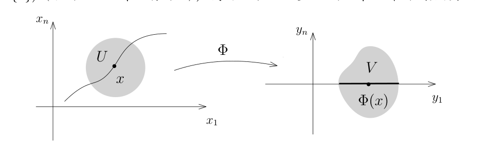
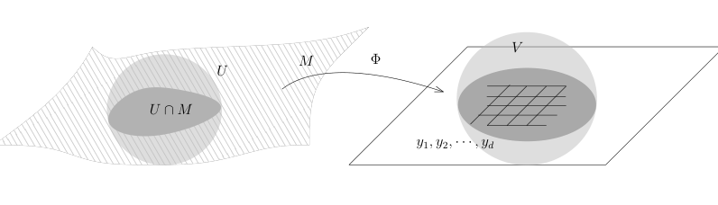
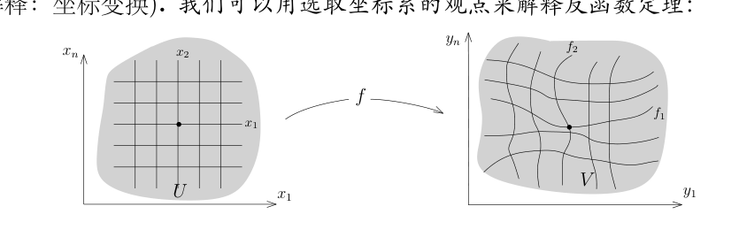

# 子流形与反函数定理

[返回讲义目录](../../../math-analysis-lecture-notes.md) · [学期目录](../../02-math-analysis-ii.md) · [章节目录](../33-inverse-function.md) · [校勘记录](../../errata.md) · [上一篇：坐标变换、多元 Taylor 展开与子流形](../32-coordinate-changes.md) · [下一篇：33.1：习题课：拓扑空间](33-03-p0375-0377.md)

<!-- source: PDF 368; printed: 368; transcription: first-pass; proofreading: applied -->

## 子流形定义的一个注解

我们首先简单回顾一下子流形的定义：

**定义 190**（$d$-维子流形）。假设 $M \subset \mathbb{R}^n$ 是非空子集。如果存在整数 $0\leqslant d\leqslant n$，使得对任意的 $x \in M$，存在开集 $U \subset \mathbb{R}^n$，$x \in U$ 以及 $\mathbb{R}^n$ 中的开集 $V$ 以及微分同胚 $\Phi : U \to V$ 使得 $\Phi(U \cap M) = V \cap (\mathbb{R}^d \times \{0\})$（后面 $n - d$ 个坐标为 $0$），我们就称 $M$ 是 $\mathbb{R}^n$ 的一个 $d$-维的（微分）子流形。

**注记。** （子流形上的局部行为）

1) 由于 $V \cap (\mathbb{R}^d \times \{0\})$ 是 $\mathbb{R}^d$ 中的开集，所以，$U \cap M$ 与 $\mathbb{R}^d$ 中的一个开集是微分同胚的，所以 $M$ 的每个点的附近（与 $\mathbb{R}^n$ 中的某个开集 $U$ 的交）都与 $\mathbb{R}^d$ 中的某个开集是微分同胚的。我们通常说，局部上 $M$ 是 $\mathbb{R}^d$，因为我们可以进一步取更小的邻域，使得 $U \cap M$ 与 $\mathbb{R}^d$ 中的开球是微分同胚的。

2) 由于在 $V \cap \mathbb{R}^d$ 上可以选取 $y_1, \cdots, y_d$ 作为坐标，所以 $\{\Phi^*y_i\}_{i \leqslant d}$ 可以作为 $M \cap U$ 上的一个局部坐标。所以，我们可以局部上用 $d$ 个坐标来标记 $M$ 上的点。当然，我们可能有很多种不同的方式来选取这样的坐标。

**注记。** （子流形局部上作为函数的公共零点）根据 $\Phi : U \to V$，在右边的 $V$ 上有 $n - d$ 个光滑函数 $y_{d+1}, \cdots, y_n$，它们的公共零点集合

$$ \{ (y_1, \cdots, y_n) \in V \mid y_{d+1} = y_{d+2} = \cdots = y_n = 0 \} $$

恰好给出了 $V \cap \mathbb{R}^d$；所以，通过微分同胚 $\Phi$，我们知道在左边的 $U$ 上也存在 $n - d$ 个光滑函数 $\Phi^*y_{d+1}, \cdots, \Phi^*y_n$，它们的公共零点集恰好是 $M \cap U$。

<!-- source: PDF 369; printed: 369; transcription: first-pass; proofreading: applied -->

这是我们基本的几何直观：每一个 $\Phi^*y_i = 0$ 给出了一个关系，使得空间的维数降低了恰好 $1$ 维。我们在线性代数的课上很熟悉这样的例子：如果

$$ L_k : V \to \mathbb{R}, \quad x \mapsto L_k(x) $$

是 $n$-维 $\mathbb{R}$-线性空间 $V$ 上的 $s$ 个线性函数，那么它们的公共零点集

$$ W = \{ x \in V \mid L_1(x) = \cdots = L_s(x) = 0 \} $$

是 $n - s$ 维的线性空间。当然，我们必须要求这些 $L_k$ 们是线性无关的。所谓的隐函数定理就是说如果 $U$ 上有 $s$ 个“无关”的光滑函数，那么它们的公共零点集就是一个 $n - s$ 维的子流形。

## 反函数定理

### 逆映射的正则性

简单而言，反函数（和隐函数）定理说的是映射的线性化（微分）决定了映射的局部性质。我们先看一个有意思的例子，它讲的是在一定条件下微分是线性同构这个代数事实保证了映射的逆具有连续可微性这个分析的性质。

**引理 191**（正则性引理）。给定开集 $U \subset \mathbb{R}^n$ 和开集 $V \subset \mathbb{R}^n$，映射 $f : U \to V$ 是同胚，即 $f$ 是双射并且 $f$ 和 $f^{-1}$ 都是连续的。如果 $f \in C^1(U, V)$，那么如下两条是等价的：

1) $f^{-1}$ 是 $C^1$ 的；

2) 对任意的 $x \in U$，$df(x) : T_xU \to T_{f(x)}V$ 是同构（即其 Jacobi 矩阵的行列式非零）。

**注记。** 当第二个条件不成立的时候，$f^{-1}$ 可能不是可微的，比方说，我们可以考虑

$$ f : \mathbb{R} \to \mathbb{R}, \quad x \mapsto x^3. $$

此时，$f$ 和 $f^{-1}$ 都是连续的，但是 $f^{-1}$ 在原点处不可微。

**证明：** 我们注意到 1) $\Rightarrow$ 2) 是显然的，因为如果 $g = f^{-1}$ 也可微，所以对 $g \circ f = \operatorname{Id}_U$ 和 $f \circ g = \operatorname{Id}_V$ 求微分，我们就得到了 $dg$ 的逆，这实际上在推倒逆映射的微分公式时我们已经证明过了，请参考第二次课的笔记。

下面证明 2) $\Rightarrow$ 1)。为了行文方便，我们先引入几个记号：对于给定的 $x \in U$，令 $y = f(x) \in V$，$f^{-1} = g$，$A = df(x)$，$B = A^{-1}$（我们假设了 $A$ 可逆），我们要证明 $g$ 在 $y$ 处可微并且其微分恰为 $B$，即

$$ \lim_{h \to 0} \frac{|\Delta(h)|}{|h|} = 0, $$

其中

$$ \Delta(h) = g(y + h) - g(y) - B(h). $$

由于 $f$ 在 $x$ 处是可微的，所以对任意的 $k \in \mathbb{R}^n$，$k \to 0$，我们有

$$ f(x + k) = f(x) + A(k) + \delta(k), $$

<!-- source: PDF 370; printed: 370; transcription: first-pass; proofreading: applied -->

其中 $\delta(k) = o(k)$。根据 $g = f^{-1}$ 的连续性，我们有

$$ \begin{aligned} y + h &= f(g(y + h)) = f(x + \overbrace{B(h) + \Delta(h)}^{o(1)}) \\ &= y + A(B(h) + \Delta(h)) + \delta(B(h) + \Delta(h)). \end{aligned} $$

左右两边消去相同的项，我们得到

$$ 0 = A(\Delta(h)) + \delta(B(h) + \Delta(h)). $$

作用上 $A$ 的逆，我们得到

$$ \begin{aligned} |\Delta(h)| &= \left| B \left( \delta(B(h) + \Delta(h)) \right) \right| \\ &\leqslant C_1 |\delta(B(h) + \Delta(h))| \leqslant o(B(h)) + o(\Delta(h)) \\ &= o(h) + o(\Delta(h)). \end{aligned} $$

从而，当 $h$ 较小时，我们有

$$ |\Delta(h)| \leqslant o(h) + 0.01 |\Delta(h)| \quad \Rightarrow \quad |\Delta(h)| \leqslant \frac{100}{99} o(h) = o(h). $$

为了完成命题的证明，我们还需要说明 $f^{-1}$ 的微分是连续的。然而，根据逆映射的微分公式（现在 $g$ 可微所以可以用这个公式了），我们有

$$ dg(y) = \left( df(g(y)) \right)^{-1}. $$

由于 $df$ 连续，$g$ 连续并且矩阵的求逆也是连续的，所以 $dg$ 连续。 \hfill $\square$

我们现在可以证明反函数定理

### 反函数定理与不动点方法

**定理 192**（反函数定理）。$\Omega \subset \mathbb{R}^n$ 是开集，$f : \Omega \to \mathbb{R}^n$ 是 $C^1$ 的。如果对于点 $x_0 \in \Omega$，$f$ 在此点的微分 $df(x_0)$ 是可逆的，那么 $f$ 在 $x_0$ 的局部上是 $C^1$ 的微分同胚，即存在开集 $U \subset \Omega$，$x_0 \in U$ 和开集 $V \subset \mathbb{R}^n$，使得 $f$ 在 $U$ 上的限制给出的 $f : U \to V$ 双射并且 $f$ 与 $f^{-1}$ 均为 $C^1$。

我们先回忆如下的不动点定理（已经证明，参考上学期第七课的讲义），这是我们证明的主要工具：

**定理 193**（Banach/Picard 不动点定理）。$(X, d)$ 是完备的距离空间，$T : X \to X$ 是一个压缩映射，即存在正常数 $\gamma < 1$，使得对任意的 $x, x' \in X$，都有

$$ d(T(x), T(x')) \leqslant \gamma d(x, x'). $$

那么，$T$ 有唯一的不动点，即存在唯一的 $x_0 \in X$，使得 $T(x_0) = x_0$。

<!-- source: PDF 371; printed: 371; transcription: first-pass; proofreading: applied -->

**反函数定理的证明。** 问题的证明分为三步，其难点在于局部上能构造出映射 $f$ 的逆。我们不妨假设 $x_0=0$，$f(x_0)=0$ 并且 $df(x_0)=\mathrm{Id}$，也就是说作为 $\mathbb{R}^n\to\mathbb{R}^n$ 的线性映射可以用单位矩阵来表示。事实上，我们可以考虑，映射

$$
F:\{x\in\mathbb{R}^n:x_0+x\in\Omega\}\to\mathbb{R}^n,\quad x\mapsto df(x_0)^{-1}\big((f(x_0+x)-f(x_0))\big).
$$

用 $F$ 来代替 $f$，那么 $F$ 就满足上述要求。然而，如果考虑

$$
df(x_0):\mathbb{R}^n\to\mathbb{R}^n,\quad x\mapsto df(x_0)(x),
$$

和

$$
\tau_v:\mathbb{R}^n\to\mathbb{R}^n,\quad x\mapsto x+v,
$$

那么，$f=\tau_{f(x_0)}\circ df(x_0)\circ F\circ\tau_{-x_0}$，这是 $F$ 和一些微分同胚的复合，所以 $f$ 局部上也是微分同胚。

我们以下假定 $f$ 满足这些要求。

**第一步，翻译成不动点问题。** 先来证明局部上是满射，即对于 $y\in V$（某个 $V$，后面会有具体的限制），要找 $x\in\Omega$，使得

$$
f(x)=y.
$$

上面的式子等价于

$$
x-f(x)+y=x
$$

所以，我们定义 $T(x)=x-f(x)+y$，$T$ 的不动点 $x$ 即为所求。

**第二步，验证映射的压缩条件。** 首先注意到

$$
dT(0)=\mathrm{Id}-df(0)=0.
$$

根据 $df$ 的连续性，存在 $r>0$，使得 $\overline{B(0,r)}\subset\Omega$，并且对任意的 $x\in\overline{B(0,r)}$（这是中心在原点半径为 $r$ 的小球）上，我们有

$$
\|dT(x)\|<\frac1{10}.
$$

其中，矩阵的范数 $\|dT(x)\|$ 取为所选向量范数诱导的算子范数。

首先考虑 $T(x)-T(x')$，$x,x'\in B(0,r)$。我们定义 $x$ 与 $x'$ 连线上的函数，即

$$
g(t)=f(tx+(1-t)x')-(tx+(1-t)x').
$$

请注意，这是向量值的函数，我们仍然可以定义积分（即在每个分量上定义）。根据 Newton-Leibniz 公式，我们有

$$
\begin{aligned}
T(x)-T(x')&=(x-f(x))-(x'-f(x'))\\
&=-(g(1)-g(0))=-\int_0^1g'(t)dt\\
&=\int_0^1\big(\mathrm{Id}-df(tx+(1-t)x')\big)(x-x')dt.
\end{aligned}
$$

<!-- source: PDF 372; printed: 372; transcription: first-pass; proofreading: applied -->

从而，

$$
\begin{aligned}
\|T(x)-T(x')\|&\leqslant\int_0^1\|dT(tx+(1-t)x')(x-x')\|dt\\
&\leqslant\int_0^1\frac1{10}\|(x-x')\|dt\\
&=\frac1{10}\|(x-x')\|.
\end{aligned}
$$

从而，$T$ 是压缩的。

另外，为了利用压缩映像定理，我们要找到距离空间 $X$，使得 $T(X)\subset X$。实际上，我们取 $X=\overline{B(0,r)}$。根据上面的不等式，对于 $x'=0$ 和 $x\in\overline{B(0,r)}$，按照定义，我们有

$$
\begin{aligned}
\|T(x)\|&\leqslant\|T(x)-T(0)\|+\|T(0)\|\\
&\leqslant\frac1{10}|x|+|y|\\
&<r.
\end{aligned}
$$

其中，我们要求 $y\in B(0,\frac r2)$（实际上，这里就选取了 $V$）。这表明 $T(x)\in B(0,r)$。所以，对于 $X=\overline{B(0,r)}$（这是 $\mathbb{R}^n$ 中的闭球所以完备），我们有

$$
T:X\to X.
$$

根据不动点定理，对任意的 $y\in B(0,\frac r2)$，都存在唯一的 $x\in B(0,r)$，使得 $f(x)=y$，即 $T(x)=x$。

综合上面的讨论，我们令

$$
U=B(0,r)\cap f^{-1}(B(0,\frac r2)),\quad V=B(0,\frac r2).
$$

很明显，这是两个开集。按照我们的构造方式我们有满射

$$
f:U\to V.
$$

这实际上是一个双射。为此，我们利用 $df(x)$ 的连续性，对任意的 $\varepsilon>0$，只要 $r$ 实现选的足够小，我们就有 $\|df(x)-\mathrm{Id}\|<0.1$。我们可以选 $\varepsilon=0.1$，此时 $r$ 也可以确定。如果 $f(x)=f(x')$，令

$$
h(t)=f(tx+(1-t)x').
$$

那么，我们通过对 $h(t)$ 用 Newton-Leibniz 公式，就有

$$
\begin{aligned}
0&=f(x)-f(x')=\int_0^1df(tx+(1-t)x')(x-x')dt\\
&=x-x'+\int_0^1\big(df(tx+(1-t)x')-\mathrm{Id}\big)(x-x')dt.
\end{aligned}
$$

从而，

$$
\|x-x'\|\leqslant\int_0^1 0.1\times\|x-x'\|dt=0.1\times\|x-x'\|.
$$

<!-- source: PDF 373; printed: 373; transcription: first-pass; proofreading: applied -->

所以，$x=x'$。

**第三步，正则性条件。** 为了利用正则性引理，我们需要说明 $g=f^{-1}$ 是连续的。任取 $y,y'\in V$，假设 $g(y)=x$，$g(y')=x'$，按照构造，我们有

$$
\begin{aligned}
|g(y)-g(y')|&=|x-x'|=|T(x)-T(x')+(y-y')|\leqslant|T(x)-T(x')|+|y-y'|\\
&\leqslant\frac1{10}|x-x'|+|y-y'|\\
&=\frac1{10}|g(y)-g(y')|+|y-y'|.
\end{aligned}
$$

从而

$$
|g(y)-g(y')|\leqslant\frac{10}{9}|y-y'|.
$$

这表明 $g$ 是连续的。$\square$

**注记。** 反函数定理对任意的（无限维）完备赋范线性空间都成立，建议有兴趣的同学可以查阅并对比我们的证明。

我们还可以要求反函数定理中的映射有更高的正则性：

### 高阶光滑性与坐标变换

**推论 194。** 假设 $k\geqslant2$ 是整数。在反函数定理的假设中，如果我们进一步要求 $f\in C^k(\Omega)$，那么得到的逆映射 $f^{-1}\in C^k(V)$。

**证明：** 根据链式法则，$f^{-1}$ 的微分是 $d(f^{-1})(y)=(df)^{-1}(f^{-1}(y))$，其中 $y\in V$。令 $g=f^{-1}$。我们在 $U$ 和 $V$ 上任意选取坐标 $(x_i)$ 和 $(y_j)$，假设 $f$ 和 $g$ 的 Jacobi 矩阵分别是 $A$ 和 $B$，即

$$
df(x)=A(x)=(A_{ij}(x_1,\cdots,x_n)),\quad dg(y)=B(y)=(B_{ij}(y_1,\cdots,y_n)).
$$

根据要求 $A_{ij}\in C^{k-1}(U)$。然而，$B(y)=A^{-1}(g(y))$。根据逆矩阵的计算，我们知道 $B_{ij}$ 形如

$$
B_{ij}(y)=\sum\frac{A_{i'j'}(g(y))A_{i''j''}(g(y))\cdots A_{i'''j'''}(g(y))}{\det A(g(y))}.
$$

由链式法则，在求 $\ell$ 次导数的时候，$g$ 的导数至多出现到 $\ell$ 阶。已知 $g\in C^1$，由 $dg=A^{-1}\circ g$ 逐阶归纳：若 $g\in C^j$ 且 $1\leqslant j\leqslant k-1$，则 $dg\in C^j$，因而 $g\in C^{j+1}$。据此，我们知道 $B_{ij}(y)$ 是 $C^{k-1}$ 的，从而 $g=f^{-1}$ 是 $C^k$ 的。$\square$

**注记。** 为了说明 $f^{-1}$ 是高阶光滑的，这个引理说只要验证 $f$ 的一阶导数就可以做到这一点，这在技术上提供了莫大的方便。

**注记**（几何解释：坐标变换）。我们可以用选取坐标系的观点来解释反函数定理：

<!-- source: PDF 374; printed: 374; transcription: first-pass; proofreading: applied -->

为了描述 $V$ 上的点，通过 $f$，我们实际上可以选取 $(x_1,\cdots,x_n)$ 作为坐标系（而不是 $(y_1,\cdots,y_n)$），也就是说用 $U$ 中的点（的坐标）来参数化 $V$。

[返回讲义目录](../../../math-analysis-lecture-notes.md) · [学期目录](../../02-math-analysis-ii.md) · [章节目录](../33-inverse-function.md) · [校勘记录](../../errata.md) · [上一篇：坐标变换、多元 Taylor 展开与子流形](../32-coordinate-changes.md) · [下一篇：33.1：习题课：拓扑空间](33-03-p0375-0377.md)
