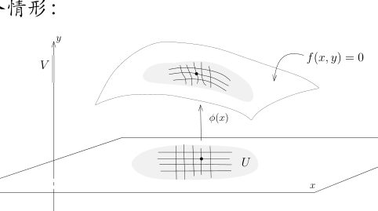
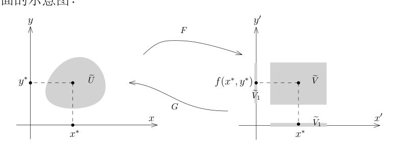
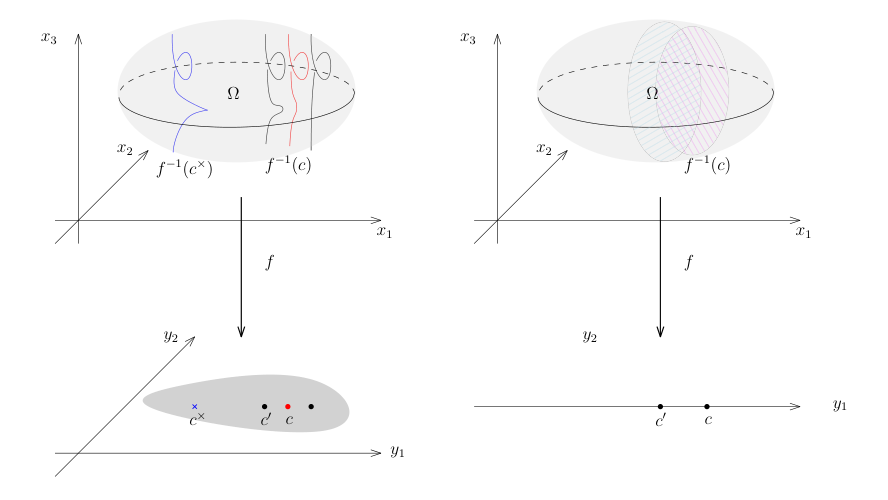
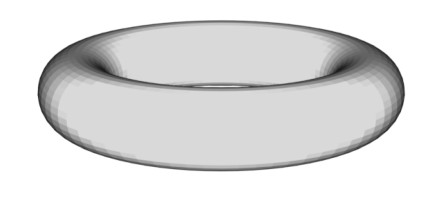
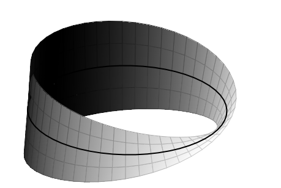

# 34：隐函数定理与子流形参数化

[返回讲义目录](../../math-analysis-lecture-notes.md) · [学期目录](../02-math-analysis-ii.md) · [校勘记录](../errata.md) · [上一篇：33.2：作业：反函数和隐函数定理](33-inverse-function/33-04-p0378-0383.md) · [下一篇：原像定理、切空间与法向量](35-tangent-spaces/35-01-p0394-0400.md)

<!-- source: PDF 384; printed: 384; transcription: first-pass; proofreading: applied -->

## 隐函数定理

我们假设 $\Omega \subset \mathbb{R}^{n+p}$ 是开集。为了定理的叙述方便，我们将 $\mathbb{R}^{n+p}$ 写成乘积结构 $\mathbb{R}^n \times \mathbb{R}^p$。在 $\mathbb{R}^n$ 上面我们用坐标 $x = (x_1, \cdots, x_n)$，在 $\mathbb{R}^p$ 上面我们用坐标 $y = (y_1, \cdots, y_p)$。对于 $\Omega$ 上的映射 / 函数 $f$，我们用 $f(x, y)$ 这样的二元函数来表示，其中 $x \in \mathbb{R}^n, y \in \mathbb{R}^p$。为了行文方便，我们引入下面（不标准的）符号：将 $y$ 固定，我们就可以将 $f(x, y)$ 看作是 $x$ 的函数，即
$$f(\cdot,y):\{x\in\mathbb{R}^n:(x,y)\in\Omega\}\to\mathbb{R}^m,$$
从而我们可以对 $x$ 的微分，我们将这个微分记作 $d_x f(x, y)$；类似地，我们可以定义 $d_y f(x, y)$。

我们首先给出隐函数定理的经典叙述（和证明），然后用子流形的语言就可以有更清晰的几何表述。

**定理 198**（隐函数定理）。给定正整数 $n$ 和 $p$ 和非空开集 $\Omega \subset \mathbb{R}^n \times \mathbb{R}^p$，映射 $f : \Omega \to \mathbb{R}^p$ 是连续可微的（$C^1$ 的）。

假设 $(x^*, y^*) \in \Omega$，使得 $f(x^*, y^*) = 0$，其中 $x^* \in \mathbb{R}^n, y^* \in \mathbb{R}^p, 0 \in \mathbb{R}^p$。如果 $(d_y f)(x^*, y^*)$ 是可逆的，即 Jacobi 矩阵 $\left( \frac{\partial f_i}{\partial y_j} \right)_{1 \leqslant i,j \leqslant p}$ 在 $(x^*, y^*)$ 点是可逆的。那么，存在开集 $U \subset \mathbb{R}^n, x^* \in U$，存在开集 $V \subset \mathbb{R}^p, y^* \in V$，存在连续可微的映射 $\phi : U \to V$，并可取 $U\times V\subset\Omega$，使得对任意的点 $(x, y) \in \Omega$，如下两条是等价的：

• $(x, y) \in U \times V$ 并且 $f(x, y) = 0$；

• $x \in U$ 并且 $y = \phi(x)$。

我们进一步还有 $d\phi(x)=-(d_y f(x,\phi(x)))^{-1}\circ d_x f(x,\phi(x))$。

**注记。** ” 隐” 函数说的是方程 $f(x, y) = 0$ 实际上隐含地将 $y$ 定义成 $x$ 的函数，定理具体地将这个函数构造了出来：$y = \phi(x)$。当 $p = 1$ 时，$f(x, y) = 0$ 在空间中所定义的曲面局部上就可以表达成 $y = \phi(x)$ 的形式，也就是说它局部上可以看成是函数的图像，从而是 $\mathbb{R}^{n+1}$ 中余 1 维的子流形，下面的图很好地总结了这个情形：

<!-- source: PDF 385; printed: 385; transcription: first-pass; proofreading: applied -->

**例子。** 隐函数定理的叙述乍看起来晦涩难懂。最简单的就是如下的情形：$\Omega = \mathbb{R}^n \times \mathbb{R}^p$，$f$ 是投影映射：
$$f : \mathbb{R}^n \times \mathbb{R}^p \to \mathbb{R}^p, \quad (x_1, \cdots, x_n, y_1, \cdots, y_p) \mapsto (y_1, \cdots, y_p).$$
此时，$U = \mathbb{R}^n, V = \mathbb{R}^p$ 而
$$\phi : \mathbb{R}^n \to \mathbb{R}^p, \quad x \mapsto 0.$$
这显然满足定理的要求，因为 $f(x, y) = 0 \iff y = 0$。隐函数定理本质上说只要选取适当的坐标系这是唯一的例子。

**证明：** 我们利用反函数定理来证明隐函数定理。为此，我们通过把 $f$ 的值域空间加一些维数来定义一个新的映射。注意到，对于 $x \in \mathbb{R}^n$，$f(x, y) \in \mathbb{R}^p$（如果 $(x, y)$ 落在 $f$ 的定义域里的话）。所以，以下的映射是良好定义的：
$$F : \Omega \to \mathbb{R}^n \times \mathbb{R}^p, \quad (x, y) \mapsto F(x, y) = (x, f(x, y)).$$
很明显，$F$ 是连续可微的（因为它的每个分量都是连续可微的）。我们可以计算 $F$ 在 $(x, y)$ 处微分，用 Jacobi 矩阵来显然可以表达成：
$$dF = \begin{pmatrix} \operatorname{id} & 0 \\ d_x f & d_y f \end{pmatrix}, \tag{1}$$
这是一个 $(n + p) \times (n + p)$ 的方阵。由于 $(d_y f)(x^*, y^*)$ 可逆，所以分块矩阵 $(dF)(x^*, y^*)$ 也是可逆的。所以，我们可以对映射 $F$ 在 $(x^*, y^*)$ 处用反函数定理：存在开集 $\widetilde{U} \subset \Omega$，$(x^*, y^*) \in \widetilde{U}$，存在开集 $\widetilde{V} \subset \mathbb{R}^{n+p}$ 并且通过将它缩小我们可以假设它具有乘积结构 $\widetilde{V} = \widetilde{V}_1 \times \widetilde{V}_2$ 以及连续可微的映射 $G : \widetilde{V} \to \widetilde{U}$（这是 $F$ 的逆），使得
$$G \circ F = \operatorname{id}_{\widetilde{U}}, \quad F \circ G = \operatorname{id}_{\widetilde{V}}.$$

我们可以参考下面的示意图：

我们将 $F$ 的值域（即 $G$ 的定义域）上的坐标用 $(x', y')$ 来表示。按照分量的记法，可以将 $G$ 写成
$$G(x', y') = (\overbrace{G_1(x', y')}^{\in \mathbb{R}^n}, \overbrace{G_2(x', y')}^{\in \mathbb{R}^p}).$$

<!-- source: PDF 386; printed: 386; transcription: first-pass; proofreading: applied -->

我们把反函数定理给出的两个等式用分量写出来，就有
$$G \circ F = \operatorname{id}_{\widetilde{U}} \implies G_1(x, f(x, y)) = x, \quad G_2(x, f(x, y)) = y;$$
$$F \circ G = \operatorname{id}_{\widetilde{V}} \implies G_1(x', y') = x', \quad f(x', G_2(x', y')) = y'.$$
总结一下，我们得到了
$$\begin{cases} G(x', y') = (x', G_2(x', y')), \\ G_2(x, f(x, y)) = y, \\ f(x', G_2(x', y')) = y'. \end{cases}$$

按照 $F$ 和 $G$ 的定义，对于给定的 $(x, y) \in \widetilde{U}$，我们有如下的等价关系
$$f(x, y) = 0 \iff F(x, y) = (x, 0) \iff (x, y) = F^{-1}(x, 0) = G(x, 0) = (x, G_2(x, 0)).$$
所以，如果我们令 $\phi(x) = G_2(x,0):\widetilde V_1\to \mathbb{R}^p$，那么，给定的 $(x, y) \in \widetilde{U}$，我们有如下的等价关系
$$f(x, y) = 0 \iff y = \phi(x).$$
所以，由 $\phi(x^*)=y^*$ 和连续性，我们可以取 $x^*$ 的开邻域 $U\subset\widetilde V_1$ 与 $y^*$ 的开邻域 $V\subset\mathbb R^p$，使得 $U\times V\subset\widetilde U$ 且 $\phi(U)\subset V$。这就证明了隐函数定理的主要论述。

最终，为了计算微分，我们对 $f(x, \phi(x)) = 0$ 求微分，即对映射
$$U \to \mathbb{R}^p, \quad x \mapsto f(x, \phi(x))$$
求微分。我们得到
$$df_x(x, y) + df_y(x, y) \cdot d\phi(x) = 0, \quad \text{其中 } y = \phi(x).$$
在 $(x^*, y^*)$ 的附近，$df_y(x, y)$ 是可逆的，所以 $d\phi(x) = -(d_y f(x, y))^{-1} \circ d_x f(x, y)$。 $\quad \square$

**注记。** 如果我们把反函数定理条件中映射改为 $C^\infty$ 的，那么结论中的函数和映射也是 $C^\infty$，这从反函数定理的叙述就可以看出来。

## 隐函数定理的子流形叙述

利用子流形这个概念，我们可以更形象地理解隐函数定理。反过来，隐函数定理给出了一种非常实用的判断子流形的方法。

假设 $M \subset \mathbb{R}^N$ 是一个 $d$-维的子流形，所以对任意的 $x \in M$，存在开集 $U \subset \mathbb{R}^N$ 包含 $x$，$\mathbb{R}^N$ 中的开集 $V$ 以及微分同胚 $\phi : U \to V$ 使得
$$\phi(U\cap M)= V \cap (\mathbb{R}^d \times \{0\}),$$
我们现在沿用隐函数定理中的符号。我们令
$$M = \{ (x, y) \in \Omega \mid f(x, y) = 0 \}.$$

<!-- source: PDF 387; printed: 387; transcription: first-pass; proofreading: applied -->

由于 $f(x, y) = 0$ 实际上是 $p$ 个方程（以为 $f:\Omega\to\mathbb{R}^p$），所以，我们将上述集合是 $\mathbb{R}^{n+p}$ 中由 $p$ 个方程的零点集合。如果 $f$ 的某些导数为非退化的（参考隐函数定理的叙述），那么局部上这个 $M$ 可以表达成映射的图像的形式，即对任意的 $(x, y) \in M$，局部上都等价于 $y = \phi(x)$。从另外一种观点来看，$M$ 可以被 $x$ 参数化，即给定 $x$，就唯一地确定了 $M$ 上的一个点。

为了说明 $M$ 实际上是微分子流形，我们需要构造一个映射 $\Phi:\Omega\to\mathbb{R}^{n+p}$，使得 $\Phi$ 是微分同胚（局部上）并且将 $M$ 映射成右边 $\mathbb{R}^{n+p}$ 上的由 $y_1 = \cdots = y_p = 0$ 所给出来的线性子空间。这个映射就是定理证明中的 $F$：
$$F(x, y) = (x, f(x, y)) = (x, 0), \quad \text{其中 } (x, y) \in M.$$
这样，我们就证明了 $M$ 实际上（局部上）是一个微分子流形。

我们把上面的讨论总结为如下的定理：

**定理 199**（隐函数：子流形版本）。给定正整数 $n'$ 和 $p$（$n = n' + p$）和非空开集 $\Omega \subset \mathbb{R}^{n'+p} = \mathbb{R}^n$，映射 $f : \Omega \to \mathbb{R}^p$ 是光滑的。令
$$M = \{ (x,y)\in\Omega\subset\mathbb R^{n\prime}\times\mathbb R^p\mid f(x,y) = 0 \}.$$
假设 $(x^*, y^*) \in M$ 使得 Jacobi 矩阵 $\left( \frac{\partial f_i}{\partial y_j} \right)_{1 \leqslant i,j \leqslant p}$ 在 $(x^*, y^*)$ 点是可逆的。那么，存在包含 $(x^*,y^*)$ 的开集 $U\subset\Omega$ 使得 $U \cap M$ 是 $\mathbb{R}^n$ 中的 $n'$ 维子流形。

这个版本有如下重要的推论：

**推论 200**（子流形的判断准则）。假设 $f : \Omega \to \mathbb{R}^p$ 是光滑映射，其中 $\Omega \subset \mathbb{R}^n$ 是开集，$n \geqslant p$。对于 $c\in f(\Omega)\subset\mathbb R^p$，我们把 $c$ 上纤维定义为的 $c$ 在 $f$ 下的逆像：
$$f^{-1}(c) = \{ x\in\Omega\mid f(x) = c \}.$$
如果对任意的 $x \in f^{-1}(c)$，$\operatorname{Rank} df(x) = p$。那么，纤维 $f^{-1}(c)$ 是余维数为 $p$ 的子流形。

**证明：** 我们要在 $\mathbb{R}^n$ 上的选取坐标系 $x_1, \cdots, x_n$。根据 $\operatorname{Rank} df(x) = p$，通过调整 $x_1, \cdots, x_n$ 的标号，我们可以使得后面 $p$ 个坐标 $x_{n-p+1}, \cdots, x_n$ 满足
$$\det\left(\frac{\partial f_i}{\partial x_{n+1-j}}\right)_{1\leqslant i,j\leqslant p}(x)\neq0,$$
其中 $x$ 是任意选定的 $x\in f^{-1}(c)$ 上的点。我们选取函数 $f - c$ 并且将后 $p$ 个坐标用 $y_1, \cdots, y_p$ 来表示，这就化成了隐函数定理的情况。特别地，纤维 $f^{-1}(c)$ 在任意一点附近都是 $n-p$ 维子流形，所以 $f^{-1}(c)$ 是 $n-p$-维子流形。 $\quad \square$

**注记。** 我们注意到定理本身的叙述不需要任何的坐标系，而证明本身很好地解释了不依赖于坐标和选取坐标系之间的关系。

我们应该和线性代数的情况做类比：给定 $n$ 维线性空间上的 $p$ 个齐次线性方程，它们的公共零点是 $n - p$ 的线性子空间当且仅当这 $p$ 个线性方程的秩是 $p$。

<!-- source: PDF 388; printed: 388; transcription: first-pass; proofreading: applied -->

**注记（几何图像）。** 我们可以用下图形象地记忆并表示这个命题，这是关于隐函数定理最干净最形象的表述：

左图代表是余维数为 2 的情形。我们假设 $f : \Omega \to f(\Omega)$，其中 $f(\Omega)$ 是下面灰色的区域。对于每个 $c\in f(\Omega)$，我们可以把它的原像想象成插在这个点上面的一个纤维。特别地，$\Omega$ 可以被写成这些纤维的无交并：
$$\Omega = \coprod_{c \in f(\Omega)} f^{-1}(c).$$

然而，我们需要在每个 $x \in f^{-1}(c)$ 点处要求一个非退化的条件才能保证 $f^{-1}(c)$ 是光滑的子流形。上面的图形表示，在 $c$ 的纤维如果满足这个非退化的条件，那么它附近的 $c'$ 处的纤维 $f^{-1}(c')$ 也是光滑的子流形：实际上，我们需要对 $f^{-1}(c)$ 限制才可以（比如纤维是紧的），但是很多情况下这一点都成立，大概的原因是 $\operatorname{Rank} df(x) = p$ 如果成立，就在附近的一个开集上面成立。然而，离着 $c$ 比较远的点，这个条件就可能退化，比如说上面的蓝色 $c^\times$ 点，它的纤维就“打折”了。

右图代表是余维数为 1 的情形，对于每个 $c$，我们形象的认为纤维是 $\Omega$ 的一个“切片”。事实上，为了研究高维子流形的结构，我们经常通过这种切片化成低维数子流形的情况来研究。在后面的课程和作业中，我们会用这个方法研究几个重要的例子。

下面的命题是隐函数定理几何版本的逆命题：子流形总是可以（在局部上）由 $\operatorname{codim} M = n - \operatorname{dim} M$ 个方程的零点来定义。我们已经在第四次课的开始证明了这个结论，为了完备起见（也为了再次复习子流形的定义），我们概述一下证明。

**命题 201。** 假设 $M^d \subset \mathbb{R}^n$ 是 $d$ 维的子流形。那么，对任意的 $p \in M$，存在开集 $U \subset \mathbb{R}^n$，$p \in U$ 和 $n-d$ 个光滑函数 $f_1, \dots, f_{n-d} \in C^\infty(U)$，使得
$$M^d\cap U=\{x\in U \mid f_1(x) = \dots = f_{n-d}(x) = 0\}.$$

特别地，映射的微分
$$f : U \to \mathbb{R}^{n-d}, \quad x \mapsto (f_1(x), \dots, f_{n-d}(x))$$
在每个点 $x\in M\cap U$ 处的秩都是 $n-d$。

<!-- source: PDF 389; printed: 389; transcription: first-pass; proofreading: applied -->

**证明：** 按子流形的定义，存在开集 $U \subset \mathbb{R}^n$ 包含 $p$，$\mathbb{R}^n$ 中的开集 $V$ 以及微分同胚 $\varphi : U \to V$，使得
$$
\varphi(U\cap M)= V \cap (\mathbb{R}^d \times \{0\}).
$$
我们用 $y_1, \cdots, y_n$ 表示 $V$ 上的坐标函数，那么我们选取 $f_i=\varphi^*y_{d+i}=y_{d+i}\circ\varphi$ 即可，其中 $i=1,\cdots,n-d$。 \hfill $\square$

**注记。** 我们沿用上述由坐标拉回选取的函数，对整数 $0\leqslant k\leqslant n-d$，如果令
$$
M^{d+k} = \{x \in U \mid f_1(x) = \cdots = f_{n-d-k}(x) = 0\},
$$
那么，$M^{d+k}$ 是 $d+k$ 维的子流形（作业中会证明）。换句话说，每次加上一个 $f_j(x) = 0$ 的限制，子流形的维数恰好降低 1 维。

我们现在给出隐函数定理的几个应用，首先是用来判定子流形，现在我们只需要做一些简单的代数计算即可：

1) $\mathbb{R}^n$ 中的球面 $\mathbf{S}^{n-1} = \{x \in \mathbb{R}^n \mid x_1^2 + \cdots + x_n^2 = 1\}$ 是一个 $n-1$ 维的子流形。

球面可以被视作是函数
$$
f(x_1, \cdots, x_n) = (x_1)^2 + (x_2)^2 + \cdots + (x_n)^2 - 1
$$
的零点集。所以，只要验证它的微分 $df(x)$ 的秩为 1 即可。然而，用矩阵来写
$$
\begin{aligned}
df(x) &= \left( \frac{\partial f}{\partial x_1}(x), \cdots, \frac{\partial f}{\partial x_n}(x) \right) \\
&= 2(x_1, \cdots, x_n).
\end{aligned}
$$
由于在 $\mathbf{S}^{n-1}$ 上，$|x| = 1$，上面的向量显然非零，所以这是光滑子流形。这比之前我们把球面 $\mathbf{S}^2$ 拆成六块（参见第三课讲义）并且将每块写成函数的图像要方便很多。

2) 我们考虑 $\mathbb{R}^4 = \mathbb{C}^2$ 中的曲面
$$
\mathbf{T}^2 = \left\{ (z_1, z_2) \middle| |z_1| = 1, |z_2| = 1 \right\}.
$$
如果我们用 $(x, y, z, w)$ 作为坐标，那么这个曲面实际上是
$$
f(x, y, z, w) = x^2 + y^2 - 1, \quad g(x, y, z, w) = z^2 + w^2 - 1
$$
这两个方程的公共零点集。我们需要计算
$$
\mathbb{R}^4 \to \mathbb{R}^2, \quad (x, y, z, w) \mapsto (f(x, y, z, w), g(x, y, z, w)),
$$
的 Jacobi 矩阵并判断它的秩。这个矩阵显然是
$$
\begin{pmatrix}
2x & 2y & 0 & 0 \\
0 & 0 & 2z & 2w
\end{pmatrix}.
$$
由于在 $\mathbf{T}^2$ 上面，$x^2 + y^2 = 1$，$z^2 + w^2 = 1$，所以上面这个矩阵的秩是 2，从而 $\mathbf{T}^2$ 是 2 维的子流形。它实际上是一个环面（甜甜圈）：

<!-- source: PDF 390; printed: 390; transcription: first-pass; proofreading: applied -->

## $\mathbb{R}^3$ 中由方程定义的曲线和曲面

在经典的微积分课程中，$\mathbb{R}^3$ 中由一个方程或者两个方程定义的曲线和曲面是最基本的几何对象。我们首先引入如下的定义：

**定义 202。** 假设 $M \subset \mathbb{R}^n$ 是子流形。如果 $\operatorname{dim} M = 1$，我们就称之为 $\mathbb{R}^n$ 中的一条**光滑曲线**；如果 $\operatorname{dim} M = 2$，我们就称之为 $\mathbb{R}^n$ 中的一个**光滑曲面**；如果 $\operatorname{dim} M = n-1$，我们就称之为 $\mathbb{R}^n$ 中的一个**光滑超曲面**。

**注记。** 这里曲线的概念和上个学期所讲的曲线略有不同：之前是所谓的参数化曲线，即曲线是一个映射 $\gamma : I \to \mathbb{R}^n$，其中 $I \subset \mathbb{R}$ 是一个区间。这里的曲线只是 $\mathbb{R}^n$ 中的一个子集，然而根据隐函数定理的结论，我们在局部上可以给它一个参数化。

我们关心的是如下的对象，他们有着更特殊的要求：

**引理 203。** 假设 $f : \mathbb{R}^n \to \mathbb{R}$ 是光滑函数，如果对于任意的 $x_0 \in f^{-1}(0)$，$df(x_0) \neq 0$，那么 $f^{-1}(0)$ 是超曲面。我们把这种超曲面称为由一个方程整体定义的光滑超曲面。

我们把（显然的）证明留作作业。特别地，在 $\mathbb{R}^3$ 中，我们有

**引理 204。** 假设 $f(x, y, z)$ 是 $\mathbb{R}^3$ 上的光滑函数，如果对于任意满足 $f(x_0, y_0, z_0) = 0$ 的点 $(x_0, y_0, z_0)$，我们有
$$
\left( \frac{\partial f}{\partial x}, \frac{\partial f}{\partial y}, \frac{\partial f}{\partial z} \right)(x_0, y_0, z_0) \neq 0,
$$
那么
$$
\{(x, y, z) \in \mathbb{R}^3 \mid f(x, y, z) = 0\}
$$
是光滑曲面。我们把这种超曲面称为由一个方程整体定义的光滑曲面。

**例子。** $\mathbb{R}^3$ 中的柱面由如下方程
$$
x^2 + y^2 = 1
$$
定义，这是一个光滑曲面：我们取 $f(x, y, z) = x^2 + y^2 - 1$，此时，
$$
\left( \frac{\partial f}{\partial x}, \frac{\partial f}{\partial y}, \frac{\partial f}{\partial z} \right) = (2x, 2y, 0) \neq 0,
$$
我们还有用两个方程定义的曲线：

<!-- source: PDF 391; printed: 391; transcription: first-pass; proofreading: applied -->

**引理 205。** 假设 $f(x, y, z)$ 和 $g(x, y, z)$ 是 $\mathbb{R}^3$ 上的光滑函数，如果对于任意同时满足 $f(x_0, y_0, z_0) = 0$ 和 $g(x_0, y_0, z_0) = 0$ 的点 $(x_0, y_0, z_0)$，如果如下两个向量线性无关：
$$
\left( \frac{\partial f}{\partial x}, \frac{\partial f}{\partial y}, \frac{\partial f}{\partial z} \right)(x_0, y_0, z_0), \quad \left( \frac{\partial g}{\partial x}, \frac{\partial g}{\partial y}, \frac{\partial g}{\partial z} \right)(x_0, y_0, z_0),
$$
那么
$$
\{(x, y, z) \in \mathbb{R}^3 \mid f(x, y, z) = 0, g(x, y, z) = 0\}
$$
是光滑曲线。我们把这种曲线称为由两个方程整体定义的光滑曲线。

我们把（显然的）证明留作作业。

## 子流形的参数化

在结束关于隐函数定理的几何讨论之前，我们给出隐函数定理的一个对偶版本。这个版本本身和隐函数是无关的，之所以是对偶的，是因为隐函数定理研究从 $\mathbb{R}^n$ 到 $\mathbb{R}^p$ 的映射，其中 $n \geqslant p$，其结论说映射的逆像或者纤维是子流形。而这个定理（证明非常简单，只要验证定义）研究从 $\mathbb{R}^n$ 到 $\mathbb{R}^p$ 的映射，其中 $n \leqslant p$，其结论说映射的像是子流形。

**定理 206**（参数化子流形）。$\Omega \subset \mathbb{R}^n$ 是开集，$f : \Omega \to \mathbb{R}^{n+p}$ 是光滑映射。假设对于点 $x^* \in \Omega$，有 $\operatorname{rank} df(x^*) = n$，那么，存在开集 $U\subset\Omega$，$x^* \in U$，使得 $f(U) \subset \mathbb{R}^{n+p}$ 是 $n$ 维的子流形。

**证明：** 在 $\Omega$ 上选取坐标系统 $x_1, \cdots, x_n$，在 $\mathbb{R}^{n+p}$ 上选取坐标坐标系统 $y_1, \cdots, y_n, z_1, \cdots, z_p$。我们把 $f$ 用坐标分量写成
$$
f(x) = (f_1(x), \cdots, f_{n+p}(x)),
$$
其中每个 $f_i(x)$ 都是 $\Omega$ 上的光滑函数。由于有 $\operatorname{rank} df(x^*) = n$，通过调换目标空间坐标及 $\{f_i\}$ 分量的指标，我们不妨假设
$$
\operatorname{det} \left( \frac{\partial f_i}{\partial x_j} \right)_{i,j \leqslant n} (x^*) \neq 0.
$$
我们现在考虑 $F = \pi_y \circ f$，其中 $\pi_y : \mathbb{R}^{n+p} \to \mathbb{R}^n$ 是取前 $n$ 个坐标，即
$$
\begin{array}{ccc}
\Omega & \xrightarrow{\quad f \quad} & \mathbb{R}^{n+p} \\
& \underset{F}{\searrow} & \downarrow \pi_y \\
& & \mathbb{R}^n
\end{array}
$$
换句话说，我们定义了 $F(x) = (f_1(x), f_2(x), \cdots, f_n(x))$。根据上述行列式非零的条件，$F$ 为局部微分同胚（反函数定理）。令 $U$ 为 $x^*$ 在 $\Omega$ 中的开集，使得 $F : U \to F(U)$ 为这个微分同胚并令 $V = F(U)$。此时，我们考察 $f(U) \subset \mathbb{R}^{n+p}$。对于 $x \in U$，令 $y = F(x)$，$f(x) \in \mathbb{R}^{n+p}$ 可以写成
$$
\begin{aligned}
(f_1(x), \cdots, f_n(x); f_{n+1}(x), \cdots, f_{n+p}(x)) &= (y; f_{n+1}(x), \cdots, f_{n+p}(x)) \\
&= (y, f_{n+1}(F^{-1}(y)), f_{n+2}(F^{-1}(y)), \cdots, f_{n+p}(F^{-1}(y))).
\end{aligned}
$$
所以，它可以被视作是 $V$ 上定义的向量值函数 $y \mapsto f_{n+1}(F^{-1}(y)), f_{n+2}(F^{-1}(y)), \cdots, f_{n+p}(F^{-1}(y))$ 的图像，这是一个用 $y$ 做为坐标来参数化的子流形（在本次作业中证明）。 \hfill $\square$

<!-- source: PDF 392; printed: 392; transcription: first-pass; proofreading: applied -->

### 莫比乌斯带与整体定义方程

在 $\mathbb{R}^3$ 还有一个经典曲面：**Möbius 带**。我们用参数的方式可以把它写作
$$
M = \left\{ (x, y, z) \in \mathbb{R}^3 \;\middle|\; \begin{cases} x = (1 + r \cos \frac{\theta}{2}) \cos \theta, \\ y = (1 + r \cos \frac{\theta}{2}) \sin \theta, \\ z = r \sin \frac{\theta}{2} \end{cases} \theta \in [0, 2\pi], r \in (-1, 1) \right\}.
$$
适当改变一下书写方式更有启发：
$$
(x, y, z) = (\cos \theta, \sin \theta, 0) + \left( r \cos \frac{\theta}{2} \cos \theta, r \cos \frac{\theta}{2} \sin \theta, r \sin \frac{\theta}{2} \right).
$$
当 $r = 0$ 时，我们得到一个用 $\theta$ 来参数化的基本圆周 $(\cos \theta, \sin \theta, 0)$。给定 $\theta$，就给定了这个圆周上的一个点 $(\cos \theta, \sin \theta, 0)$。固定这个 $\theta$，当 $r$ 在 $(-1, 1)$ 之间变化的时候，我们就在这个点插上了一个小线段并且这个线段的方向的变化是 $\theta$ 的一半。所以，当 $\theta$ 从 $0$ 变化到 $2\pi$，基本圆周上的点旅行了一周又回到了原来的点，但是它上面所插的小线段只转动了 $180^\circ$。

我们下面证明一个不明显的命题，为此，我们先选择好的记号：把 $r = 0$ 光滑圆周写成参数形式：
$$
\gamma : [0, 2\pi] \to \mathbb{R}^3, \quad \theta \mapsto (\cos \theta, \sin \theta, 0).
$$
给定 $\theta$ 处，我们用 $e_0$ 表示 $\gamma$ 在 $\gamma(\theta)$ 处的切方向 $\gamma'(\theta)$，即令 $e_0 = (-\sin \theta, \cos \theta, 0)$。和 $e_0$ 垂直的方向有两个，我们分别记作
$$
e_1(\theta) = (\cos \theta, \sin \theta, 0), \quad e_2(\theta) = (0, 0, 1).
$$
据此，我们把 $M$ 的参数化写成：
$$
M = \left\{ (x, y, z) = (\cos \theta, \sin \theta, 0) + r \cos \frac{\theta}{2} e_1(\theta) + r \sin \frac{\theta}{2} e_2(\theta), \; \theta \in [0, 2\pi], r \in (-1, 1) \right\}.
$$
根据刚刚证明的定理，这是 $\mathbb{R}^3$ 中的一个光滑曲面（参见本次作业）。

**命题 207。** 不存在光滑函数 $f \in C^\infty(\mathbb{R}^3)$，使得
$$
M = \{(x, y, z) \mid f(x, y, z) = 0\}
$$
且 $df(x, y, z)$ 在 $M$ 上的每点处不为零，即 $M$ 不能只用一个方程零点来整体定义。

<!-- source: PDF 393; printed: 393; transcription: first-pass; proofreading: applied -->

**注记**。我们需要运用关于由一个方程定义的光滑曲面的特殊性质（基于连续函数的介值定理）：给定 $f \in C^\infty(\mathbb{R}^3)$，假设对任意的 $x \in \Omega$，$df(x) \neq 0$，$f^{-1}(0) \subset \Omega$ 是光滑子流形并且由一个方程定义。任意选定 $x\in f^{-1}(0)$，考虑 $x$ 处的邻域 $U$（足够小）。由于 $df(x) \neq 0$，我们不妨选 $v\in\mathbb R^3$，使得

$$\nabla_v f(x) = df(x)(v) > 0.$$

从而，在当 $\varepsilon > 0$ 足够小时，$p_\pm = x \pm \varepsilon v \in U$ 并且 $f(p_+) > 0$，$f(p_-) < 0$。我们声明，任何一条连接 $p_+$ 和 $p_-$ 的曲线都要经过 $f^{-1}(0)$，即对任意的连续映射 $\gamma:[0,1]\to\mathbb R^3$，其中起点 $\gamma(0) = p_-$ 和终点 $\gamma(1) = p_+$），一定存在 $t_0 \in (0, 1)$，使得 $\gamma(t_0) \in f^{-1}(0)$（等价于说 $f(\gamma(t_0)) = 0$）。实际上，$f(\gamma(t))$ 为连续函数，按照 $p_\pm$ 的选取方式，我们有

$$f(\gamma(0)) = f(p_-) < 0, \quad f(\gamma(1)) = f(p_+) > 0,$$

所以连续函数的介值定理就给出了 $t_0$。

我们现在证明关于 Möbius 带的命题：

**证明**：我们给出证明的梗概，证明的细节留给同学们在作业中完成。如若不然，假设 $f$ 是 $M$ 的定义方程。任选 $p = (\cos \theta, \sin \theta, 0) \in M$，直观上（实际上也是）这个附近的小邻域 $U$ 被 $M=f^{-1}(0)$ 分成了两个部分：在一部分中，$f > 0$；在另一部分中，$f < 0$。我们选取在 $p$ 点处和整个曲面垂直的法向量

$$\nu(\theta) = \cos \frac{\theta}{2} e_2(\theta) - \sin \frac{\theta}{2} e_1(\theta)$$

我们考虑曲线

$$\beta : [0, 2\pi] \to \mathbb{R}^3, \quad\theta\mapsto(\cos\theta,\sin\theta,0)+\varepsilon\nu(\theta).$$

我们可以适当的选取比较小的 $\varepsilon$（可正可负），使得 $f(\beta(0)) > 0$。然而，$\beta(2\pi)=\gamma(0)-\varepsilon\nu(0)$，而 $\beta(0)=\gamma(0)+\varepsilon\nu(0)$，两点位于曲面的相反侧，从而，$f(\beta(2\pi)) < 0$。很明显，这条曲线与曲面 $M$ 不相交，矛盾。\quad $\square$

[返回讲义目录](../../math-analysis-lecture-notes.md) · [学期目录](../02-math-analysis-ii.md) · [校勘记录](../errata.md) · [上一篇：33.2：作业：反函数和隐函数定理](33-inverse-function/33-04-p0378-0383.md) · [下一篇：原像定理、切空间与法向量](35-tangent-spaces/35-01-p0394-0400.md)
