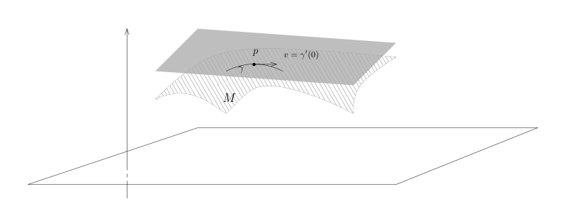
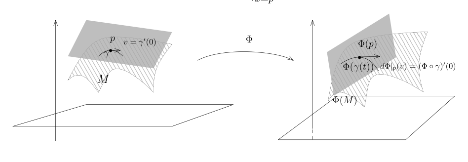
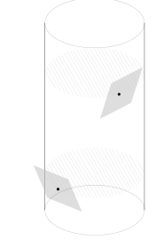

# 原像定理、切空间与法向量

[返回讲义目录](../../../math-analysis-lecture-notes.md) · [学期目录](../../02-math-analysis-ii.md) · [章节目录](../35-tangent-spaces.md) · [校勘记录](../../errata.md) · [上一篇：隐函数定理与子流形参数化](../34-implicit-function.md) · [下一篇：35.1 作业:隐函数与反函数定理,隐函数定理在多项式和矩阵上的一个重要应用,经典群的子流形结构](35-03-p0401-0405.md)

<!-- source: PDF 394; printed: 394; transcription: first-pass; proofreading: applied -->

## 35 子流形的原像定理，切空间的定义，超曲面的切空间与法向量，

上次课我们证明了隐函数定理并给出了它的几何叙述。

我们已经证明如果 $f : \mathbb{R}^n \to \mathbb{R}^m$ 满足正确的非退化条件，那么隐函数定理等价于说对于 $0 \in \mathbb{R}^m$，它的逆像 $f^{-1}(0)$ 是 $\mathbb{R}^n$ 中的子流形，其中，$\operatorname{codim} f^{-1}(0) = m$。我们注意到，$0 \in \mathbb{R}^m$ 是 $0$-维的子流形，它在 $\mathbb{R}^m$ 中的余维数是也是 $m$。如果 $S \subset \mathbb{R}^m$ 是子流形，我们同样地可以考虑它的逆像

$$f^{-1}(S) = \{ x \in \mathbb{R}^n \mid f(x) \in S \}.$$

我们有如下漂亮的定理：

**命题 208** (子流形的原像). 给定开集 $\Omega \subset \mathbb{R}^n$ 和光滑映射 $f : \Omega \to \mathbb{R}^m$，$S \subset \mathbb{R}^m$ 是子流形。如果对任意的 $x \in f^{-1}(S)$，$\operatorname{rank} df(x) = m$，那么 $f^{-1}(S) \subset \Omega$ 是余维数为 $\operatorname{codim} S$ 的子流形。

**证明**：假设 $\dim S = s$。利用隐函数定理，这个命题的证明非常简单：任取 $y \in S$，$S$ 在 $y$ 的附近可以被 $m-s$ 个函数定义：存在 $V \subset \mathbb{R}^m$ 以及 $V$ 上的 $m-s$ 个光滑函数 $g_1, \cdots, g_{m-s}$，使得

$$\begin{cases}

1) & S \cap V = g_1^{-1}(0) \cap \cdots \cap g_{m-s}^{-1}(0); \\
2) & \text{对任意 } y' \in S \cap V, dg_1(y'), \cdots, dg_{m-s}(y') \text{ 线性无关.}
\end{cases}$$

现在对于任意的 $x \in f^{-1}(S)$，假设 $y = f(x) \in S$，我们要证明 $f^{-1}(S)$ 在 $x$ 附近是一个子流形。我们可以选取包含 $x$ 的开集 $U = f^{-1}(V)$，利用上面对 $S$ 的描述，我们也可以用方程的零点来描述 $f^{-1}(S)$：

$$\begin{aligned}
f^{-1}(S) \cap U &= \{ x \in \Omega \mid f(x) \in S \cap V \} \\
&= \{ x\in U\mid g_1(f(x))=\cdots=g_{m-s}(f(x))=0 \} \\
&= (g_1 \circ f)^{-1}(0) \cap \cdots \cap (g_{m-s} \circ f)^{-1}(0).
\end{aligned}$$

所以 $f^{-1}(S) \cap U$ 是函数 $f^*g_1, \cdots, f^*g_{m-s}$ 的公共零点集。为了说明这是子流形，只要验证这些 $f^*g_1, \cdots, f^*g_{m-s}$ 的微分在 $x$ 处秩是 $m-s$ 即可。这就是链式法则的简单应用：我们考虑如下两个映射的复合：

$$\begin{array}{ccc}
U & \xrightarrow{\quad f \quad} & V \\
& \searrow_{f^*G} \quad \swarrow_G & \\
& \mathbb{R}^{m-s} &
\end{array}$$

<!-- source: PDF 395; printed: 395; transcription: first-pass; proofreading: applied -->

其中 $G : V \to \mathbb{R}^{m-s}$ 就是函数映射 $G(y) = (g_1(y), \cdots, g_{m-s}(y))$。所以，要求的微分的秩就是映射

$$d(f^*G)(x)=dG(y)\circ df(x)$$

的秩。根据 $\operatorname{rank} df(x) = m$ 以及 $\operatorname{rank} dG(y) = m-s$，所以 $\operatorname{rank} d(f^*G)(x) = m-s$。命题得到证明。 $\square$

### 隐函数定理的其它经典应用举例

最著名的例子是考虑多项式的解对多项式系数的光滑依赖性。给定 $c = (c_1, \cdots, c_n) \in \mathbb{R}^n$，考虑实系数多项式 $P_c(X) = X^n + c_1 X^{n-1} + \cdots + c_n = 0$。我们假设 $c^* = (c_1^*, \cdots, c_n^*) \in \mathbb{R}^n$，使得 $P_{c^*}(X)$ 恰好有 $n$ 个两两不同的实根 $z_1(c_1^*, \cdots, c_n^*) < \cdots < z_n(c_1^*, \cdots, c_n^*)$。那么，存在 $(c_1^*, \cdots, c_n^*) \in \mathbb{R}^n$ 的开邻域 $\Omega$ 和 $\Omega$ 上的光滑函数 $z_1, \cdots, z_n$，使得对任意的 $(c_1, \cdots, c_n) \in \Omega$，我们有

$$z_1(c_1, \cdots, c_n) < z_2(c_1, \cdots, c_n) < \cdots < z_n(c_1, \cdots, c_n)$$

并且

$$P_c(z_1(c_1,\cdots,c_n))=P_c(z_2(c_1,\cdots,c_n))=\cdots=P_c(z_n(c_1,\cdots,c_n))=0.$$

类似地，如果一个实数系数的矩阵的特征值都是实数且两两不同，那么，这些特征值也是光滑地依赖于矩阵的系数的。

请参考本周的习题。

### 子流形的切空间

我们一下总是假定 $M^d \subset \mathbb{R}^n$ 是一个 $d$ 维光滑子流形。我们要发展子流形上的微分学，这是我们对多元微分学的自然推广，在实际中有着重要的应用。为此，首先定义最重要的一个几何对象：切空间。我们应该做如下的类比：所谓的微分，是映射在一点处的线性逼近，反函数／隐函数定理讲的是映射在一点处的线性逼近决定了映射自身的若干性质。我们应该把切空间视作是流形在一点处用“线性”子流形进行逼近。

首先，我们要考虑的是通过一点 $p \in M$ 的参数化的 $C^\infty$-曲线（可以要求是 $C^1$ 的），即

$$\gamma : (-\varepsilon, \varepsilon) \to \mathbb{R}^n, \quad t \mapsto \gamma(t), \quad \varepsilon > 0, \quad \gamma(0) = p.$$

我们将

$$\gamma'(0) = \left. \frac{d}{dt} \gamma \right|_{t=0}$$

称作该曲线在 $p$ 处的切向量。如果 $\gamma((-\varepsilon, \varepsilon)) \subset M$，我们就说 $\gamma$ 是 $M$ 上的参数)曲线。所谓的 $M$ 在 $p$ 的切空间，就是由在 $M$ 上的通过 $p$ 曲线的曲线的切向量所构成的空间：

**定义 209**. 微分子流形在 $p \in M$ 处的切空间 $T_p M$ 是 $\mathbb{R}^n$ 的子空间，它的定义如下：

$$T_p M = \{ \gamma'(0) \in \mathbb{R}^n \mid \gamma \text{ 是经过 } p \text{ 点的 } M \text{ 上的一条参数曲线} \}.$$

<!-- source: PDF 396; printed: 396; transcription: first-pass; proofreading: applied -->

我们首先来看一个“线性”的例子：

**例子**. 假设 $M$ 由 $x_{d+1} = x_{d+2} = \cdots = x_n = 0$ 定义，即

$$M = \{ (x_1, \cdots, x_d, 0, \cdots, 0) \mid x_i \in \mathbb{R}, 1 \leqslant i \leqslant d \}.$$

那么，对于 $p=(p_1,\cdots,p_d,0,\cdots,0)$，我们来计算 $T_p M$。实际上，我们有

$$T_p M = \mathbb{R}^d \times 0 = \{ (x_1, \cdots, x_d, 0, \cdots, 0) \}$$

按照定义，我们选取特殊的曲线

$$\gamma_i : (-1, 1) \to \mathbb{R}^n, \quad t\mapsto p+(0,\cdots,t,0,\cdots),$$

其中，$t$ 出现在第 $i$ 个位置，$i \leqslant d$。这条曲线自然落在 $M$ 中，所以，通过求导数，我们就知道 $(0, \cdots, 1, \cdots, 0) \in T_p M$，其中，$1$ 出现在第 $i$ 个位置。进一步，对任意 $v\in\mathbb R^d\times\{0\}$，曲线 $t\mapsto p+tv$ 落在 $M$ 中且在零点导数为 $v$。所以，$\mathbb{R}^d\times\{0\}\subset T_pM$。

为了说明 $T_pM\subset\mathbb R^d\times\{0\}$，我们考虑任意一条曲线落在 $M$ 中的曲线 $\gamma$。按照 $M$ 的定义，它可以写成

$$\gamma : (-\varepsilon, \varepsilon) \to \mathbb{R}^n, \quad t \mapsto \gamma(t) = (\gamma_1(t), \cdots, \gamma_d(t), 0, \cdots, 0),$$

对 $t$ 求导数，我们得到

$$\gamma'(0) = (\gamma_1'(0), \cdots, \gamma_d'(0), 0, \cdots, 0).$$

这显然是 $\mathbb{R}^d\times\{0\}$ 中的一个向量。

我们要强调关于这个例子的一个事实：上面的计算表明，$T_p M$ 作为 $\mathbb{R}^n$ 的线性子空间是不依赖于 $p$ 的，这只是（混淆视听的）巧合。

**命题 210**. 切空间在微分同胚下不变，即若 $\Phi : U \to V$ 是微分同胚，$M \subset U$ 是子流形，$p\in M$，其中 $U$ 和 $V$ 是 $\mathbb{R}^n$ 中的开集。那么，$\Phi(M)$ 是子流形并且 $\Phi(p)$ 的切空间为

$$T_{\Phi(p)}\Phi(M) = d\Phi\big|_{x=p}(T_p M).$$

<!-- source: PDF 397; printed: 397; transcription: first-pass; proofreading: applied -->

**证明**：$\Phi(M) \subset V$ 是子流形是平凡的，请参考本周的作业。为了说明 $T_{\Phi(p)}\Phi(M) = d\Phi\big|_{x=p}(T_p M)$，我们考虑经过 $p$ 点的 $M$ 上的一条参数曲线

$$\gamma : (-\varepsilon, \varepsilon) \to M, \quad t \mapsto \gamma(t).$$

通过与 $\Phi$ 复合，我们得到了 $V$ 中的曲线 $\Phi \circ \gamma$。按照定义，这是子流形 $\Phi(M)$ 上的通过 $\Phi(p)$ 点曲线。很明显，（通过考虑 $\Phi^{-1} \circ \alpha$）$\Phi(M)$ 上的任何一条曲线通过 $\Phi(p)$ 点的曲线都可以通过这种方式得到。所以，我们可以通过复合 $\Phi$，$M$ 上通过 $p$ 点曲线与 $\Phi(M)$ 通过 $\Phi(p)$ 点曲线是一一对应的。

现在可以对曲线求导数来计算 $T_{\Phi(p)}\Phi(M)$。假设 $v \in T_p M$，按照定义，这意味着存在 $M$ 上过 $p$ 点的曲线 $\gamma$，使得 $\gamma'(0) = v$。我们现在证明：

$$\left. d\Phi \right|_{x=p}(v) = \left. \frac{d}{dt} \right|_{t=0} \Phi(\gamma(t)),$$

即 $\Phi : U \to V$ 的微分将 $\gamma$ 的切向量映射成 $\Phi \circ \gamma$ 的切向量。按照微分定义，我们有

$$\gamma(t) = p + t\gamma'(0) + o(t)$$

以及

$$\Phi(p+h) = \Phi(p) + d\Phi(p)(h) + o(h),$$

所以

$$\begin{aligned}
(\Phi \circ \gamma)(t) &= \Phi(p + t\gamma'(0) + o(t)) \\
&= \Phi(p) + d\Phi(p)(t\gamma'(0) + o(t)) + o(\gamma'(0)t + o(t)) \\
&= \Phi(p) + t d\Phi(p)(\gamma'(0)) + o(t).
\end{aligned}$$

所以，

$$(\Phi \circ \gamma)'(0) = d\Phi(p)(\gamma'(0)).$$

这就是要证明的等式。这个式子表明 $\left.d\Phi\right|_{x=p}(T_pM)\subset T_{\Phi(p)}\Phi(M)$。由于 $\Phi(M)$ 中的每条曲线都是这么来的，所以 $\left. d\Phi \right|_{x=p}(T_p M) = T_{\Phi(p)}\Phi(M)$。 $\square$

**定理 211**. $T_p M$ 是 $\mathbb{R}^n$ 的一个 $d$ 维线性子空间。

进一步，按照 $M$ 的（局部）定义方式，我们有如下两种方式刻画切空间：

1) 按子流形的定义，存在开集 $U \subset \mathbb{R}^n$ 包含 $p$ 和 $\mathbb{R}^n$ 中的开集 $V$ 以及微分同胚 $\Phi : U \to V$ 使得 $\Phi(U\cap M)=V \cap (\mathbb{R}^d \times \{0\})$。那么，

$$T_p M = d(\Phi^{-1})\Big|_{\Phi(p)}(\mathbb{R}^d \times \{0\}).$$

<!-- source: PDF 398; printed: 398; transcription: first-pass; proofreading: applied -->

2) 假设 $M$ 在 $p$ 的局部上由 $n - d$ 个光滑函数 $f_1, \cdots, f_{n-d}$ 的零点定义, 即存在开集 $U \subset \mathbb{R}^n$, 使得 $p \in U$, 满足
$$M\cap U=\{x\in U \mid f_1(x) = \cdots = f_{n-d}(x) = 0\}$$
并且对任意的 $x\in M\cap U$，$n-d$ 个线性函数 $df_1(x),\cdots,df_{n-d}(x)$ 是线性无关的, 那么
$$T_p M = \bigcap_{i=1}^{n-d}\ker df_i\Big|_{x=p} = \ker df \Big|_{x=p}.$$
其中 $f = (f_1, \cdots, f_{n-d})$。

**证明**: 我们首先看 1), 由于 $\Phi(M\cap U)$ 为 $\mathbb{R}^d \times \{0\}$ 中的开集, 根据前面的命题以及线性情况的计算, 我们有
$$\mathbb{R}^d \times \{0\} = T_{\Phi(p)}\Phi(M\cap U)=d\Phi \Big|_{x=p}(T_p M).$$
两边同时取 $d\Phi \Big|_{x=p}$ 的逆就完成了证明。特别地, $T_p M$ 具有线性子空间的结构, 就是通过这个映射:

$$\begin{array}{ccc}
T_p M & \xrightarrow{\quad d\Phi \quad} & \mathbb{R}^d \times \{0\} \\
\downarrow & & \downarrow \\
\mathbb{R}^n & \xrightarrow{\quad d\Phi \quad} & \mathbb{R}^n
\end{array},$$

因为我们可以把 $T_p M$ 与 $\mathbb{R}^d \times \{0\}$ 等同, 所以我们就用 $\mathbb{R}^d \times \{0\}$ 上的线性空间结构作为 $T_p M$ 上的线性空间结构就好。特别地, 因为 $\mathbb{R}^d \times \{0\}$ 的维数是 $d$, 所以 $T_p M$ 的维数也是 $d$。[^p0398-9]

现在证明 2), 我们任取 $v \in T_p M$, 按照定义, 存在 $M$ 上的过 $p$ 点的曲线 $\gamma$, 使得 $\gamma'(0) = v$。由于 $M$ 是 $f_i$ 的零点集, 所以
$$f_i(\gamma(t)) \equiv 0, \quad \text{对任意的 } t.$$
对 $t$ 求导数, 链式法则给出我们
$$df_i(p)(\gamma'(0)) = 0, \quad \Leftrightarrow \quad df_i(p)(v) = 0.$$
这表明 $T_pM\subset\bigcap_{i=1}^{n-d}\ker df_i(p)$。另外, 由于 $\dim\bigcap_{i=1}^{n-d}\ker df_i(p)=d$, 通过比较维数, 我们就知道这两个空间是一致的。 $\square$

**注记.** (**重要**) 切空间是内蕴定义的, 完全不依赖于坐标系, 因为在定义中我们是用 $M$ 上的曲线来定义的。上面定理中对切空间的描述或者依赖于坐标 $\varphi$ 的选取或者依赖于 $M$ 的定义函数 $f_i$ 的选取。然而, 因为切空间是内蕴定义的, 所以我们可以用任意的坐标或者定义函数来计算(我们在应用的时候总是选最容易计算的坐标或函数)。

<!-- source: PDF 399; printed: 399; transcription: first-pass; proofreading: applied -->

**例子** (超曲面的切空间与法向量的概念). 假设 $M$ 是 $\mathbb{R}^n$ 中由一个函数 $f$ 整体定义的超曲面 ($\mathbb{R}^3$ 中的曲面是我们最常见的例子), 它的定义函数为 $f \in C^\infty(\mathbb{R}^n)$。此时, 我们在 $\mathbb{R}^n$ 选定坐标系。按照定义, 对于 $p=(x_1,\dots,x_n)\in M$, 那么
$$T_p M = \ker df(p) = \{v \in \mathbb{R}^n \mid df(p)(v) = 0\}.$$

用坐标系 (矩阵的语言) 来写, 我们有
$$v = (v_1, \dots, v_n), \quad df(p) = \left( \frac{\partial f}{\partial x_1}, \frac{\partial f}{\partial x_2}, \dots, \frac{\partial f}{\partial x_n} \right)(p),$$

所以,
$$df(p)(v) = 0 \iff \sum_{i=1}^n v_i \frac{\partial f}{\partial x_i}(p) = 0.$$

我们**假定**在 $\mathbb{R}^n$ 中取定一个 Euclid 内积 $\langle \cdot, \cdot \rangle$, 使得 $\left\{ \frac{\partial}{\partial x_i} \right\}_{i \leqslant n}$ 恰好是标准正交基。此时, 我们用如下的符号表示上述向量
$$\nabla f(p) = \left( \frac{\partial f}{\partial x_1}, \frac{\partial f}{\partial x_2}, \dots, \frac{\partial f}{\partial x_n} \right)(p).$$

那么, 上面的关系就可以表达为
$$\langle v, \nabla f(p) \rangle = 0.$$

换句话说, $\nabla f(p)$ 是切平面的**法向量**。由于 $\nabla f(p) \neq 0$, 我们经常把这个向量正规化成长度为 $1$ 的向量:
$$\frac{\nabla f(p)}{|\nabla f(p)|}.$$

我们习惯上把 $\nabla f(p)$ 称作 $f$ 在 $p$ 处的**梯度**。在绝大多数的应用中, 我们都 (无意识地) 自动**假定**在 $\mathbb{R}^n$ 中有上述 Euclid 内积。[^p0399-10]

利用上面的讨论, 我们很容易计算 $\mathbb{R}^3$ 中曲面的切空间, 比如说, 我们来看柱面的例子:

**例子**. 柱面的定义方程是 $f = 0$, 其中
$$f(x, y, z) = x^2 + y^2 - 1$$

<!-- source: PDF 400; printed: 400; transcription: first-pass; proofreading: applied -->

对任意给定的 $(x, y, z)$, 很容易算出
$$\nabla f(p) = (2x, 2y, 0)$$

所以, 我们知道 $(-y, x, 0)$ 和 $(0, 0, 1)$ 都和这个点垂直, 所以, 这两个向量就张成的切空间。特别地, 我们也可以从图形或者这个计算上清楚的看出, 切空间 $T_p M$ 是依赖于它的基准点 $p$。和之前线性子空间的切空间的例子对比, 我们强调说不同点的切空间可以不同。我们之所以认为它们有时候是一样的, 是因为我们把它们都看成了 $\mathbb{R}^n$ 的子空间所以它们有可能相同。

[返回讲义目录](../../../math-analysis-lecture-notes.md) · [学期目录](../../02-math-analysis-ii.md) · [章节目录](../35-tangent-spaces.md) · [校勘记录](../../errata.md) · [上一篇：隐函数定理与子流形参数化](../34-implicit-function.md) · [下一篇：35.1 作业:隐函数与反函数定理,隐函数定理在多项式和矩阵上的一个重要应用,经典群的子流形结构](35-03-p0401-0405.md)

[^p0398-9]: 这里线性空间的结构的定义依赖于 $\Phi : U \to V$ 的选取, 我们将在习题课中说明这个选取实际上不依赖于 $\Phi$ 的选取。

[^p0399-10]: 从微分几何的观点, 这一点有待商榷, 有兴趣的同学可以在学习 Riemann 几何的时候回头思考这个问题。
