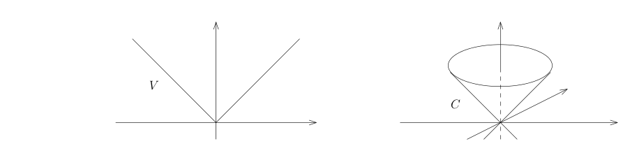

# 35.1：作业：隐函数与反函数定理，隐函数定理在多项式和矩阵上的一个重要应用，经典群的子流形结构

[返回讲义目录](../../../math-analysis-lecture-notes.md) · [学期目录](../../02-math-analysis-ii.md) · [章节目录](../35-tangent-spaces.md) · [校勘记录](../../errata.md) · [上一篇：原像定理、切空间与法向量](35-01-p0394-0400.md) · [下一篇：切丛与 Lagrange 乘子法](../36-tangent-bundles.md)

<!-- source: PDF 401; printed: 401; transcription: first-pass; proofreading: applied -->

<!-- math-analysis-layout: document-title-normalized -->

> 

## A. 子流形的基本习题（课堂相关）

A1) $M \subset \mathbb{R}^n$ 和 $N \subset \mathbb{R}^m$ 是光滑子流形。证明，$M \times N \subset \mathbb{R}^{n+m}$ 也是光滑子流形。

A2) $M \subset \mathbb{R}^n$ 是光滑子流形，$\varphi : \mathbb{R}^n \to \mathbb{R}^n$ 是微分同胚。证明，$M$ 在改映射下的像 $\varphi(M)$ 也是光滑子流形。

A3) （光滑超曲面的判定）假设 $f : \mathbb{R}^n \to \mathbb{R}$ 是光滑函数，如果对于任意的 $x_0 \in f^{-1}(0)$，存在某个 $i \leqslant n$（指标 $i$ 可能依赖于 $x_0$），使得 $\frac{\partial f}{\partial x_i}(x_0) \neq 0$，那么 $f^{-1}(0)$ 是光滑超曲面。

A4) 假设 $\Omega \subset \mathbb{R}^n$ 是开集，$f_1, \cdots, f_k$ 是给定的 $k$ 个光滑函数，其中 $k \leqslant n$。令
$$Z_i = \{x \in \Omega \mid f_i(x) = 0\}.$$

假设 $x \in \bigcap_{i \leqslant k} Z_i$ 并且 $df_1(x), \cdots, df_k(x)$ 线性无关。证明，存在 $x$ 附近的开集 $U$，使得对任意的 $\ell \leqslant k$，$U\cap\bigcap_{i\leqslant\ell}Z_i$ 是维数为 $n - \ell$ 的子流形。

A5) 假设 $f(x, y, z)$ 和 $g(x, y, z)$ 是 $\mathbb{R}^3$ 上的光滑函数，如果对于任意同时满足 $f(x_0, y_0, z_0) = 0$ 和 $g(x_0, y_0, z_0) = 0$ 的点 $(x_0, y_0, z_0)$，如果如下两个向量线性不相关：
$$\left(\frac{\partial f}{\partial x}, \frac{\partial f}{\partial y}, \frac{\partial f}{\partial z}\right)(x_0, y_0, z_0), \quad \left(\frac{\partial g}{\partial x}, \frac{\partial g}{\partial y}, \frac{\partial g}{\partial z}\right)(x_0, y_0, z_0),$$
证明，
$$\{(x, y, z) \in \mathbb{R}^3 \mid f(x, y, z) = 0, g(x, y, z) = 0\}$$
是光滑曲线。

A6) $\Omega \subset \mathbb{R}^n$ 是开集，$f : \Omega \to \mathbb{R}^m$ 是光滑映射。证明，$f$ 的图像
$$\Gamma_f = \{(x, y) \in \mathbb{R}^{n+m} \mid x\in\Omega,y\in\mathbb{R}^m, y = f(x)\}$$
是 $\mathbb{R}^{n+m}$ 中的 $n$ 维光滑子流形。

<!-- source: PDF 402; printed: 402; transcription: first-pass; proofreading: applied -->

A7) 完整证明课堂上的命题：Möbius 带 $M$ 不能用一个光滑函数的零点定义（要求函数的微分在 $M$ 上非零）。

A8) 假设 $M \subset \mathbb{R}^n$ 是 $0$-维子流形。证明，对任意的 $x \in M$，存在开集 $U \subset \mathbb{R}^n$，使得 $U \cap M = \{x\}$。（零维子流形局部上就是单点集）

A9) 假设 $M \subset \mathbb{R}^n$ 是 $n$-维子流形。证明，$M$ 是 $\mathbb{R}^n$ 中的开集。

## B. 隐函数与反函数定理的习题

B1) 实值函数 $f \in C^\infty(\mathbb{R})$ 满足下面的的性质：存在 $\delta > 0$，使得对任意 $x \in \mathbb{R}$，都有
$$f'(x) \geqslant \delta$$
证明，$f : \mathbb{R} \to \mathbb{R}$ 是微分同胚。如果 $\delta = 0$，试举一个反例。

B2) $a$ 和 $b$ 是实数，我们定义映射
$$f : \mathbb{R}^2 \to \mathbb{R}^2, \quad (x, y) \mapsto (x + a \sin y, y + b \sin x).$$
**证明：** $f$ 是 $\mathbb{R}^2$ 到自身的微分同胚当且仅当 $ab \in (-1, 1)$。

B3) （隐函数定理的经典练习）假设 $f : \mathbb{R}^n \to \mathbb{R}^n$ 是光滑映射，$0$ 是 $f$ 的不动点，即 $f(0) = 0$。假设 $1$ 不是 $f$ 在 $0$ 处的微分
$$df(0) : \underbrace{T_0 \mathbb{R}^n}_{\mathbb{R}^n} \longrightarrow \underbrace{T_0 \mathbb{R}^n}_{\mathbb{R}^n}$$
的特征值。

- 证明，$0$ 是一个孤立的不动点，即存在开集 $U$，使得 $0 \in U$，$f$ 在 $U$ 有且仅有 $0$ 为其不动点。
- 任意给定 $g \in C^1(\mathbb{R}^n, \mathbb{R}^n)$。对任意的 $\lambda \in \mathbb{R}$，我们定义映射
$$f_\lambda : \mathbb{R}^n \longrightarrow \mathbb{R}^n, \quad x \mapsto f(x) + \lambda g(x),$$
证明，存在 $\varepsilon > 0$，存在 $0$ 在 $\mathbb{R}^n$ 的开邻域 $U$ 以及 $C^1$ 的映射
$$\omega:(-\varepsilon,\varepsilon)\to U, \quad \lambda \mapsto \omega(\lambda),$$
使得对任意的 $\lambda \in (-\varepsilon, \varepsilon)$，$f_\lambda$ 在 $U$ 中恰好有一个不动点 $\omega(\lambda)$。

B4) 证明，对任意的 $t \in (-0.5, 0.5)$，方程
$$\sin(tx) + \cos(tx) = x$$
存在唯一一个解 $x = \varphi(t) \in \mathbb{R}$。进一步证明 $\varphi(t)$ 是 $t$ 的光滑函数并计算 $\varphi''(0)$。

<!-- source: PDF 403; printed: 403; transcription: first-pass; proofreading: applied -->

B5) 证明，如下两个方程定义出 $\mathbb{R}^3$ 中的一条光滑曲线：
$$x^2 + y^2 + z^2 = 14, \quad x^3 + y^3 + z^3 = 36.$$
对于曲线上的每一点，计算它的切空间。

B6) 在 $\mathbb{R}^2$ 中考虑如下的集合
$$M = \{(x, y) \mid x^3 + y^3 - 3xy = 1\}.$$

- 证明，在 $(0, 1) \in M$ 附近，存在 $\mathbb{R}$ 上 $0$ 的邻域 $\Omega$ 以及 $\Omega$ 上的光滑函数 $\phi \in C^\infty(\Omega)$，使得 $M$ 在 $(0,1)$ 的一个邻域内是 $\phi$ 的图像并且 $\phi(0) = 1$。
- 试计算 $\phi'(0)$ 和 $\phi''(0)$。
- 证明，$M$ 是光滑曲线。
- 任意给定 $(x_0, y_0) \in M$，试计算 $M$ 在此点处的切空间。

B8) 证明，如下两个方程定义的集合 $\Sigma$
$$\begin{cases} x^2 + 2y^2 + 3z^2 + 4t^2 = 4 \\ x + y = z + t \end{cases}$$
是 $\mathbb{R}^4$ 中的光滑曲面。

B9) （承接上一问题）对那一些 $t$（$t$ 固定），如下集合
$$\Sigma_t = \{(x, y, z) \in \mathbb{R}^3 \mid x^2 + 2y^2 + 3z^2 + 4t^2 = 4, x + y = z + t\}$$
是 $\mathbb{R}^3$ 中的光滑曲线？（我们用时间把 $\Sigma$ 切成曲线“片”）

## C 子流形上生活着很多曲线

C1) 假设 $M \subset \mathbb{R}^n$ 是子流形并且 $\dim M \geqslant 1$，$p \in M$。那么，存在光滑曲线（作为映射）
$$\gamma : (-1, 1) \to \mathbb{R}^n,$$
使得 $\gamma(0) = p$，$\gamma'(0) \neq 0$ 并且 $\gamma((-1, 1)) \subset M$。

C2) 令 $V = \{(x, y) \in \mathbb{R}^2 \mid y = |x|\}$ 为 $\mathbb{R}^2$ 中的 V-型，它在原点处有一个尖，看起来不光滑。证明，$V$ 不是 $\mathbb{R}^2$ 的光滑子流形。

**注记。** 实际上我们是利用切空间的概念证明 $V$ 不是子流形。

<!-- source: PDF 404; printed: 404; transcription: first-pass; proofreading: applied -->

C3) 考虑 $\mathbb{R}^3$ 中的锥
$$C = \{(x_0, x_1, x_2) \mid -x_0^2 + x_1^2 + x_2^2 = 0\}.$$
令 $O = (0, 0, 0)$，证明，$C - \{O\}$ 是子流形。

C4) 证明，$C$ 不是（光滑）子流形。

## D 隐函数定理在多项式和矩阵上的一个重要应用（熟记）

D1) 对任意的 $c \in \mathbb{R}^n$，我们可以定义一个为 $n$ 的实系数多项式 $P_c$，即我们有映射
$$\mathbb{R}^n\to\mathbb{R}[X], \quad c \mapsto X^n + c_1 X^{n-1} + \cdots + c_n.$$
给定 $b \in \mathbb{R}^n$，我们假设 $P_b$ 有一个实数根 $x_b \in \mathbb{R}$ 并且这个根的重数是 1。证明，存在 $b$ 在 $\mathbb{R}^n$ 中的开邻域 $U$ 和 $x_b$ 在 $\mathbb{R}$ 中的开邻域 $V$，使得对任意的 $c \in U$，$P_c$ 在 $V$ 中恰有一个根 $z(c)$ 并且重数是 1。进一步证明映射
$$U \to \mathbb{R}, \quad c \mapsto z(c)$$
是光滑的。

D2) （根对系数的光滑依赖性）考虑实系数多项式 $P(X) = X^n + c_1 X^{n-1} + \cdots + c_n = 0$。如果对 $(c_1^*, \cdots, c_n^*) \in \mathbb{R}^n$，$P(X)$ 恰好有 $n$ 个两两不同的实根 $z_1(c_1^*, \cdots, c_n^*) < \cdots < z_n(c_1^*, \cdots, c_n^*)$。证明，存在 $(c_1^*, \cdots, c_n^*) \in \mathbb{R}^n$ 的开邻域 $\Omega$ 和 $\Omega$ 上的光滑函数 $z_1, \cdots, z_n$，使得对任意的 $(c_1, \cdots, c_n) \in \Omega$，我们有
$$z_1(c_1, \cdots, c_n) < z_2(c_1, \cdots, c_n) < \cdots < z_n(c_1, \cdots, c_n)$$
并且
$$P_c(z_1(c_1,\cdots,c_n))=P_c(z_2(c_1,\cdots,c_n))=\cdots=P_c(z_n(c_1,\cdots,c_n))=0.$$

D3*) 你是否能将上面的结论推广到复系数的多项式上去？

D4) 考虑 $n \times n$ 的实矩阵 $A = (A_{ij})_{i,j \leqslant n}$，假设 $A$ 有 $n$ 个不同的实特征值 $\lambda_1 < \lambda_2 < \cdots < \lambda_n$。证明，存在 $\varepsilon > 0$，使得对任意的 $n \times n$ 的实矩阵 $B = (B_{ij})_{i,j \leqslant n}$，如果对每对指标 $(i, j)$，$|A_{ij} - B_{ij}| < \varepsilon$，那么 $B$ 有 $n$ 个不同的实特征值 $\lambda_1(B) < \lambda_2(B) < \cdots < \lambda_n(B)$。进一步证明，如果将每个 $\lambda_i$ 看做是 $B$ 的系数 $B_{ij}$ 的函数，这些函数在区域 $|B_{ij} - A_{ij}| < \varepsilon$（其中 $i, j \leqslant n$）中是光滑函数。

<!-- source: PDF 405; printed: 405; transcription: first-pass; proofreading: applied -->

D5*) 你是否能将上面的结论推广到复系数的矩阵上去？

## E 经典群的子流形结构

$\mathbf{M}_n(\mathbb{R})$ 是全体 $n \times n$ 的实系数矩阵。我们定义**特殊线性群**
$$\mathbf{SL}_n(\mathbb{R}) = \{ A \in \mathbf{M}_n(\mathbb{R}) \mid \det A = 1 \},$$
和**正交群**
$$\mathbf{O}(n) = \{ A \in \mathbf{M}_n(\mathbb{R}) \mid A \cdot {}^tA = \mathbf{I}_n \},$$
其中 $\mathbf{I}_n$ 是单位矩阵。

E1) 证明，在矩阵乘法下，上面两个对象都是群。

E2) 证明，$\mathbf{SL}_n(\mathbb{R})$ 是 $\mathbf{M}_n(\mathbb{R}) = \mathbb{R}^{n^2}$ 中的光滑子流形并计算它的维数。（提示：将行列式映射 $A \mapsto \det A$ 视作是 $\mathbb{R}^{n^2}$ 上的光滑函数）

E3) 证明，$\mathbf{SL}_n(\mathbb{R})$ 在 $\mathbf{I}_n$ 处的切空间是
$$\mathfrak{sl}_n(\mathbb{R}) := \{ a \in \mathbf{M}_n(\mathbb{R}) \mid \operatorname{tr} a = 0 .\}$$

E4) 证明，$\mathbf{O}(n)$ 是 $\mathbf{M}_n(\mathbb{R}) = \mathbb{R}^{n^2}$ 中的光滑子流形并计算它的维数（提示：令 $\operatorname{Sym}_n(\mathbb{R})$ 是全体对称的 $n \times n$ 的实系数矩阵，考虑映射 $f : \mathbf{M}_n(\mathbb{R}) \to \operatorname{Sym}_n(\mathbb{R})$，$A \mapsto A \cdot {}^tA - \mathbf{I}_n$）。

E5) 证明，$\mathbf{O}_n(\mathbb{R})$ 在 $\mathbf{I}_n$ 处的切空间是
$$\mathfrak{o}(n) := \{ a \in \mathbf{M}_n(\mathbb{R}) \mid a + {}^ta = 0 .\}$$

E6) 令 $G = \mathbf{SL}_n(\mathbb{R})$ 或者 $\mathbf{O}(n)$。证明，映射
$$G \to G, \quad g \mapsto g^{-1}$$
是光滑的。

E7) 回忆一下，$G \times G$ 可以被视作是 $\mathbf{M}_n(\mathbb{R}) \times \mathbf{M}_n(\mathbb{R})$ 的子流形。证明，映射
$$G \times G \to G, \quad (g_1, g_2) \mapsto g_1 \cdot g_2$$
也是光滑的。（至此，证明了 $\mathbf{SL}_n(\mathbb{R})$ 和 $\mathbf{O}(n)$ 是 Lie 群）

E8) 令 $G = \mathbf{SL}_n(\mathbb{R})$（或 $\mathbf{O}(n)$），$\mathfrak{g} = \mathfrak{sl}_n(\mathbb{R})$（或 $\mathfrak{o}(n)$），证明，指数映射 $\exp$ 把 $\mathfrak{g}$ 映射到 $G$ 中去。

[返回讲义目录](../../../math-analysis-lecture-notes.md) · [学期目录](../../02-math-analysis-ii.md) · [章节目录](../35-tangent-spaces.md) · [校勘记录](../../errata.md) · [上一篇：原像定理、切空间与法向量](35-01-p0394-0400.md) · [下一篇：切丛与 Lagrange 乘子法](../36-tangent-bundles.md)
