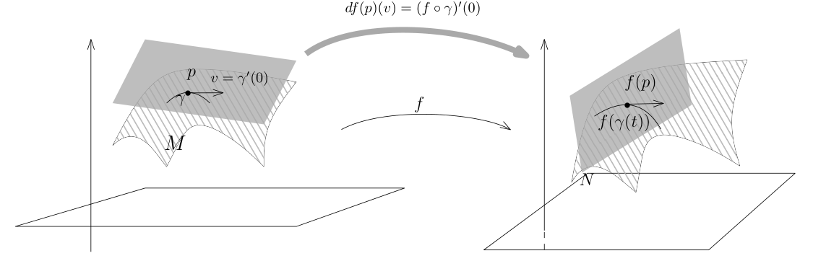
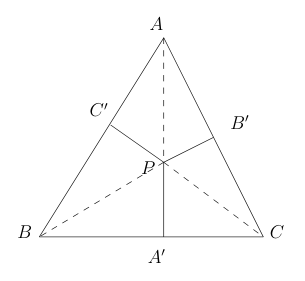

# 36：切丛与 Lagrange 乘子法

[返回讲义目录](../../math-analysis-lecture-notes.md) · [学期目录](../02-math-analysis-ii.md) · [校勘记录](../errata.md) · [上一篇：35.1：作业：隐函数与反函数定理，隐函数定理在多项式和矩阵上的一个重要应用，经典群的子流形结构](35-tangent-spaces/35-03-p0401-0405.md) · [下一篇：Hesse 矩阵、极值与凸函数](37-hessian-convexity/37-01-p0418-0424.md)

<!-- source: PDF 406; printed: 406; transcription: first-pass; proofreading: applied -->

## 子流形之间的映射

给定两个子流形 $M \subset \mathbb{R}^m$ 和 $N \subset \mathbb{R}^n$，其中，$M$ 和 $N$ 的维数是任意的，我们定义它们之间的光滑映射 $f : M \to N$ 和以及 $f$ 的微分 $df$。最常见的例子中通常 $N = \mathbb{R}$，这实际上是 $M$ 上的光滑函数。

**定义 212**。$M \subset \mathbb{R}^m$ 和 $N \subset \mathbb{R}^n$ 是子流形，$f : M \to N$ 是映射。如果 $f$ 满足如下任意一个条件：

1) （$f$ 局部上是 $\mathbb{R}^m$ 上的映射的限制）对任意 $p \in M$，存在包含 $p$ 的开集 $U \subset \mathbb{R}^m$，存在 $C^\infty$ 的映射 $F : U \to \mathbb{R}^n$，使得
$$
f\vert_{U \cap M} = F\vert_{U \cap M}.
$$

2) 对任意 $p \in M$，按子流形的定义，存在包含 $p$ 的开集 $U \subset \mathbb{R}^m$，$\mathbb{R}^m$ 中的开集 $V$ 以及微分同胚 $\Phi : U \to V$ 使得 $\Phi(U \cap M) = V \cap (\mathbb{R}^d \times \{0\})$。那么，映射
$$
f_\Phi = (\Phi^{-1})^* f = f \circ \Phi^{-1}
$$
是在 $V \cap (\mathbb{R}^d \times \{0\}) \subset \mathbb{R}^d$ 上定义并在 $\mathbb{R}^n$ 中取值的 $C^\infty$ 映射：
$$
\begin{array}{ccc}
V \cap (\mathbb{R}^d \times \{0\}) & \xrightarrow{\Phi^{-1}} & M \cap U \\
& \mathop{\searrow}\limits_{f_\Phi} & \quad \downarrow f \\
& & N \subset \mathbb{R}^n
\end{array}
$$
我们就称 $f$ 是 $M$ 与 $N$ 之间的 $C^\infty$ 的映射并且将所有这样的映射的全体记作 $f \in C^\infty(M, N)$。

**注记**。在严格的证明上述定义是规范的之前，我们先指出这个定义最经常地以如下的方式出现：$M \subset \mathbb{R}^m$ 和 $N \subset \mathbb{R}^n$ 是子流形，$F : \mathbb{R}^m \to \mathbb{R}^n$ 是光滑映射，如果 $F(M) \subset N$，那么，根据定义中的第一条，$F$ 在 $M$ 上的限制就给出了子流形之间的光滑映射：
$$
F\vert_M : M \to N.
$$

**例子**。考虑 $M = N = \mathbf{S}^2$，这是 $\mathbb{R}^3$ 中的单位球面。考虑正交矩阵 $A \in \mathbf{O}(3)$，即 $3 \times 3$ 的方阵 $A$，使得 $^tA \cdot A = \mathbf{I}$，其中 $\mathbf{I}$ 是单位矩阵。我们可以将 $A$ 看作是 $\mathbb{R}^3$ 上的线性（光滑）映射：
$$
A : \mathbb{R}^3 \to \mathbb{R}^3, \quad x \mapsto A \cdot x.
$$

<!-- source: PDF 407; printed: 407; transcription: first-pass; proofreading: applied -->

由于正交矩阵 $A$ 保持向量的长度，所以
$$
A : \mathbf{S}^2 \to \mathbf{S}^2.
$$
这是 $\mathbf{S}^2$ 到自身的光滑映射，这是 $\mathbf S^2$ 上的一个正交变换；当 $\det A=1$ 时，我们通常把它称为旋转。

我们需要说明上述定义是规范的，这包含了如下两个内容：

a) 定义 2) 中我们用了子流形的定义，然而，子流形定义中所选取的局部微分同胚 $\Phi$ 不是唯一的。对 $p \in M$，可以存在另外的包含 $p$ 的开集 $U' \subset \mathbb{R}^m$，$\mathbb{R}^m$ 中的开集 $V'$ 以及微分同胚 $\Phi' : U' \to V'$，使得 $\Phi'(U' \cap M) = V' \cap (\mathbb{R}^d \times \{0\})$。那么，映射
$$
f_{\Phi'} = (\Phi'^{-1})^* f = f \circ \Phi'^{-1}
$$
是否是在 $V' \cap (\mathbb{R}^d \times \{0\}) \subset \mathbb{R}^d$ 上的 $C^\infty$ 映射？
$$
\begin{array}{ccc}
V' \cap (\mathbb{R}^d \times \{0\}) & \xrightarrow{\Phi'^{-1}} & M \cap U' \\
& \mathop{\searrow}\limits_{\text{光滑?}} & \quad \downarrow f \\
& & N \subset \mathbb{R}^n
\end{array}
$$
对任意的 $p$，我们考虑 $\tilde{U} = U \cap U'$，此时，上述的 $\Phi$ 和 $\Phi'$ 在 $\tilde{U}$ 上都能定义，我们令 $\tilde{V} = \Phi(\tilde{U})$，$\tilde{V}' = \Phi'(\tilde{U})$，我们就有如下的交换图表：
$$
\begin{array}{ccccc}
& & \stackrel{\Psi = \Phi' \circ \Phi^{-1}}{\curvearrowright} & &
\\
\tilde{V} \cap (\mathbb{R}^d \times \{0\}) & \xrightarrow{\Phi^{-1}} & M \cap \tilde{U} & \xleftarrow{\Phi'^{-1}} & \tilde{V}' \cap (\mathbb{R}^d \times \{0\}) \\
& \searrow_{f_\Phi} & \downarrow f & \swarrow_{f_{\Phi'}} &
\\
& & N \subset \mathbb{R}^n & &
\end{array}
$$
很明显，$f_{\Phi\prime}=f_\Phi\circ\Psi^{-1}$，而 $\Psi$ 是两个微分同胚的复合也光滑，所以 $f_{\Phi'}$ 光滑。

b) 我们要说明 1) 和 2) 是等价的。

1) $\Rightarrow$ 2)。我们考虑如下的交换图表：
$$
\begin{array}{ccccc}
V \cap (\mathbb{R}^d \times \{0\}) & \xrightarrow{\Phi^{-1}} & M \cap U & \xrightarrow{\iota} & U \\
& \searrow_{f_\Phi} & \downarrow f & \swarrow_F &
\\
& & N \subset \mathbb{R}^n & &
\end{array}
$$
其中，映射 $\iota$ 是包含映射，即
$$
\iota : M \cap U \to U, \quad x \mapsto x.
$$
按照 1) 的要求，$F$ 是光滑的。所以，$f_\Phi = F \circ \iota \circ \Phi^{-1}$ 是光滑的。

<!-- source: PDF 408; printed: 408; transcription: first-pass; proofreading: applied -->

2) $\Rightarrow$ 1)。我们考虑如下的交换图表：
$$
\begin{array}{ccc}
V & \xrightarrow{\Phi^{-1}} & U \\
\uparrow{\iota} & \stackrel{\tilde{F}}{\searrow} & \uparrow{\iota} \quad \searrow{F} \\
V \cap (\mathbb{R}^d \times \{0\}) & \xrightarrow{\Phi^{-1}} & M \cap U \\
& \searrow_{f_\Phi} & \downarrow{f} \\
& & N \subset \mathbb{R}^n
\end{array}
$$
按照 2) 的要求，下面的三角形的图表中的映射都是光滑的。特别地，$f_\Phi$ 用坐标来表达（$\mathbb{R}^d \times \{0\}$ 上用 $x_1, \dots, x_d$ 作为坐标）可以写成
$$
V\cap(\mathbb R^d\times\{0\})\to \mathbb{R}^n, \quad (x_1, \dots, x_d) \mapsto f_\Phi(x_1, \dots, x_d).
$$
把 $V$ 缩小为切向坐标与法向坐标的乘积邻域，使得 $(x_1,\dots,x_d,0,\dots,0)\in V$ 对每个 $x\in V$ 成立后，我们可以把 $f_\Phi$ 拓展成 $V$ 上的函数：
$$
\tilde{F} : V \to \mathbb{R}^n, \quad (x_1, \dots, x_d, x_{d+1},\dots,x_m) \mapsto f_\Phi(x_1, \dots, x_d).
$$
很明显，$\tilde{F}$ 在 $V\cap(\mathbb R^d\times\{0\})$ 上的限制就是 $f_\Phi$。根据上面的图表，我们令 $F = \tilde{F} \circ \Phi$ 即可。

**注记**。当 $N = \mathbb{R}$ 时，我们就定义了 $M$ 上的光滑函数 $C^\infty(M)$。与 $\mathbb{R}^n$ 中一个区域上的光滑函数类似，我们有（请参考本次作业作业）

1) $C^\infty(M)$ 是一个 $\mathbb{R}$-代数，即对任意的 $f,g\in C^\infty(M)$，它们的任意实线性组合以及乘积都是光滑函数。

2) 假设 $f \in C^\infty(M)$。如果对任意的 $x \in M$，$f(x) \neq 0$，那么 $\frac{1}{f}$ 也是光滑函数。

另外，对于一般的 $N \subset M$，$C^k(M, N)$ 通常不是线性空间，因为对于任意的 $f, g \in C^k(M, N)$，$x \in M$，点 $f(x) + g(x)$ 不见得在 $N$ 上。

**注记**。我们所定义光滑函数的方式不是内蕴的：第一个定义要求子流形上的光滑函数是背景空间（$\mathbb{R}^m$）上的光滑函数的限制，这依赖于背景空间；第二个要求光滑函数在某个局部的模型下是光滑函数，这依赖于微分同胚的选取（我们当然已经证明了这个选取不重要）。然而，我们要强调能够在子流形上定义光滑函数是子流形理论最核心的一点，比如说，通过上次的作业，我们知道如下的 $V$-形不是 $\mathbb{R}^2$ 中的子流形：
$$
V = \{(x,y)\in\mathbb R^2 \mid y = |x|\}.
$$
实际上，这是一个所谓的拓扑子流形，即我们可以定义如下的同胚（参考第一次习题课）
$$
\Phi : \mathbb{R}^2 \to \mathbb{R} \times \mathbb{R}, \quad (x, y) \to (x, y - |x|).
$$
这个映射是连续的但是不光滑（在 $(0, 0)$ 处）。我们可以在背景空间上选取函数 $f : \mathbb{R}^2 \to \mathbb{R}, (x, y) \mapsto y$ 是光滑的，但是它所对应的 $f_\Phi$ 用我们的第二个定义就不是光滑的。

<!-- source: PDF 409; printed: 409; transcription: first-pass; proofreading: applied -->

从函数论的观点，子流形的定义要求局部上的同胚 $\Phi$ 是可微的原因就是容许我们在子流形上面定义光滑函数。

在我们的课程中不再会进一步的深入到如何完全内蕴地定义几何对象的层次，我们总是借助于背景空间（$\mathbb{R}^n$）来讨论。下面将要定义的光滑向量场就是一个很好的例子。

### 子流形之间光滑映射的微分

对于子流形之间的光滑映射，我们可以定义微分：

**定义 213**。假设 $M \subset \mathbb{R}^m, N \subset \mathbb{R}^n$ 是子流形，$f : M \to N$ 是光滑映射。对任意的 $v \in T_p M$，按定义，存在（不止一条）参数化的曲线
$$
\gamma : (-\varepsilon, \varepsilon) \to \mathbb{R}^m,
$$
使得 $\gamma(( -\varepsilon,\varepsilon))\subset M$、$\gamma(0)=p$ 且 $\gamma'(0) = v$。通过和 $f$ 复合，我们得到 $N$ 上过 $f(p)$ 点的曲线：
$$
f \circ \gamma : (-\varepsilon, \varepsilon) \to \mathbb{R}^n, \quad t \mapsto f(\gamma(t)).
$$
我们把这条曲线的在 $f(p)$ 处切向量定义为
$$
df(p)(v) := \left.\frac{d}{dt}\right|_{t=0} f(\gamma(t)) \in T_{f(p)} N.
$$
从而，我们定义了
$$
df(p) : T_p M \to T_{f(p)} N.
$$

**注记**。如果子流形之间的映射 $f$ 是由某个全空间上的 $F : \mathbb{R}^m \to \mathbb{R}^n$ 所诱导的，即 $F\vert_M = f$：
$$
\begin{array}{ccc}
\mathbb{R}^m & \xrightarrow{F} & \mathbb{R}^n \\
\uparrow{\iota} & & \uparrow{\iota} \\
M & \xrightarrow{f} & N
\end{array}
$$
那么，$df(p) : T_p M \to T_{f(p)} N$ 就是 $dF(p) : \mathbb{R}^m \to \mathbb{R}^n$ 在 $T_p M$ 上的限制（$T_p M$ 是 $\mathbb{R}^m$ 的线性子空间），即
$$
\begin{array}{ccc}
T_p \mathbb{R}^m & \xrightarrow{dF(p)} & T_{f(p)} \mathbb{R}^n \\
\uparrow{\iota_*} & & \uparrow{\iota_*} \\
T_p M & \xrightarrow{df(p)} & T_{f(p)} N
\end{array}
$$

<!-- source: PDF 410; printed: 410; transcription: first-pass; proofreading: applied -->

特别地，这个观察还说明了上面定义中的映射不依赖于曲线 $\gamma$ 的选取。当然，我们还可以直接证明，其参考下面的习题：

**练习**。证明，上述定义不依赖于 $\gamma$ 的选取，即 $\lambda(t)$ 是过 $p$ 的 $M$ 上的参数曲线且 $\lambda'(0) = v$，那么
$$\left.\frac{d}{dt}\right|_{t=0} f(\gamma(t)) = \left.\frac{d}{dt}\right|_{t=0} f(\lambda(t)).$$

**命题 214**。假设 $M \subset \mathbb{R}^m$，$N \subset \mathbb{R}^n$ 是子流形，$f : M \to N$ 是光滑映射。那么，对任意的 $p \in M$，微分
$$df(p) : T_p M \to T_{f(p)} N$$
是线性映射。

**证明：** 这是显然的，因为 $df(p)$ 是线性映射 $dF(p)$ 的限制，其中按定义可在 $p$ 的某个开邻域 $U\subset\mathbb R^m$ 上选取光滑映射 $F:U\to\mathbb R^n$，使得 $F|_{M\cap U}=f|_{M\cap U}$。 $\Box$

## 切向量场与切丛

在微分学这一部分，我们最后引进的一个对象叫做向量场，向量场在经典的物理中有着无比重要的应用，我们在后面的课程中会逐步展示这些相关的例子。我们来定义一个子流形上全体切向量的集合：

**定义 215**（向量场与切丛）。假设 $M \subset \mathbb{R}^n$ 是子流形。对任意的 $p \in M$，$T_p M$ 是在这一点处的 $M$ 的切向量的全体。我们把这些不同点的切向量放在一起定义为 $M$ 的切丛，我们强调这是所有的 $T_p M$ 的无交并集，即不同点处的切向量是不同的：
$$TM = \coprod_{p \in M} T_p M.$$
我们有自然的投影映射 $\pi : TM \to M$，对于 $p \in M$，这个映射把 $T_p M$ 中的元素全部映射成 $p$，即 $T_p M = \pi^{-1}(p)$。

如果对于每个点 $p \in M$，我们都指定一个切向量 $X(p) \in T_p M$，我们就得到了一个映射
$$X : M \to TM, \quad p \mapsto X(p),$$
我们把这样一个映射称作是 $M$ 上的一个（切）向量场。

按照定义，切向量场满足满足 $\pi \circ X = \operatorname{id}_M$：
$$
\begin{array}{ccc}
M & \xrightarrow{\quad X \quad} & TM \\
& \searrow_{\operatorname{id}} & \downarrow \pi \\
& & M
\end{array}
$$

**注记**（向量场光滑性的一种折衷的定义）。由于所讨论的子流形 $M$ 在 $\mathbb{R}^n$ 中，对任意的 $p$，我们总可以将 $X(p)$ 看作是 $\mathbb{R}^n$ 中的向量，所以我们可以 $X$ 看作是映射 $X : M \to \mathbb{R}^n$（要求 $X(p) \in T_p M$）。此时，我们就可以谈论 $X$ 的光滑性。如果映射 $X : M \to \mathbb{R}^n$ 是光滑的，我们就称 $X$ 为光滑的（切）向量场。我们将 $M$ 上的光滑切向量的全体记作 $\Gamma(M, TM)$。

<!-- source: PDF 411; printed: 411; transcription: first-pass; proofreading: applied -->

对任意的 $M$ 上的光滑函数 $f$，任意的 $M$ 上的光滑切向量场 $X$ 和 $Y$，我们可以定义它们之间的乘法和加法：
$$(fX)(p) = f(p)X(p), \quad (X + Y)(p) = X(p) + Y(p).$$

我们有如下简单的命题：

**命题 216**。假设 $M \subset \mathbb{R}^n$ 是子流形，那么，$\Gamma(M, TM)$ 是 $C^\infty(M)$-模，即对任意的 $M$ 上的光滑函数 $f$，任意的 $M$ 上的光滑切向量场 $X$ 和 $Y$，$fX$ 和 $X + Y$ 都是 $M$ 上的光滑向量场。

证明是平凡的，我们留作作业。

对于一个向量 $v \in TM$，我们假设 $p = \pi(v)$，即 $v \in T_p M$，这样子，我们可以认为 $TM$ 是 $\mathbb{R}^n \times \mathbb{R}^n$ 的子集：
$$TM \hookrightarrow \mathbb{R}^n \times \mathbb{R}^n, \quad v \mapsto (\pi(v), v).$$

我们有如下漂亮的定理：

**定理 217**。假设 $M \subset \mathbb{R}^n$ 是子流形，那么
$$TM = \{(x, v) \in \mathbb{R}^n \times \mathbb{R}^n \mid x \in M, v \in T_x M\}$$
是 $\mathbb{R}^{2n}$ 的子流形并且 $\dim TM = 2\dim M$。

**证明：** 令 $d = \dim M$。任意选取 $v \in T_p M$，我证明 $TM$ 在 $(p,v)$ 附近是子流形。先在 $p$ 的附近用光滑函数的零点来定义 $M$：选取开集 $U \subset \mathbb{R}^n$，其中 $p\in U$ 以及 $n - d$ 个光滑函数 $f_i \in C^\infty(U)$，其中 $i \leqslant n - d$，使得 $M \cap U = \bigcap_{i\leqslant n-d}f_i^{-1}(0)$ 并且对任意的 $q \in U$，微分 $df_1(q), \cdots, df_{n-d}(q)$ 是线性无关的。然而，我们知道对任意的 $q\in M\cap U$，该点处的切空间为
$$T_q M = \bigcap_{i \leqslant n-d} \ker df_i(q),$$
所以该点处的切空间可以实现为 $df_1(q), \cdots, df_{n-d}(q)$ 的公共零点集。据此，我们有
$$TM \cap (U \times \mathbb{R}^n) = \left\{ (x, y) \in U \times \mathbb{R}^n \;\middle|\; \begin{cases} f_1(x)=\cdots=f_{n-d}(x)=0, \\ df_1(x)(y) = 0, \cdots, df_{n-d}(x)(y) = 0. \end{cases} \right\}.$$

所以，$TM$ 在开集 $U \times \mathbb{R}^n$ 上由 $2(n - d)$ 个光滑函数 $f_1, \cdots, f_{n-d}, df_1(x)(y), \cdots, df_{n-d}(x)(y)$ 的公共零点定义。我们下面说明的微分是线性无关的即可。为此，我们令
$$f : U \to \mathbb{R}^{n-d}, \quad x \mapsto (f_1(x), \cdots, f_{n-d}(x));$$
$$df : U \times \mathbb{R}^n \to \mathbb{R}^{n-d}, \quad (x, y) \mapsto (df_1(x)(y), \cdots, df_{n-d}(x)(y)).$$

定义 $F$ 为
$$F : U \times \mathbb{R}^n \to \mathbb{R}^{n-d} \times \mathbb{R}^{n-d}, \quad (x, y) \mapsto (f(x), df(x)(y)).$$

<!-- source: PDF 412; printed: 412; transcription: first-pass; proofreading: applied -->

从而，$TM \cap U \times \mathbb{R}^n = F^{-1}(0)$。为了说明 $\operatorname{rank} dF = 2(n - d)$（满秩），我们可以计算它的 Jacobi 矩阵：
$$dF(x, y) = \begin{pmatrix} df(x) & 0 \\ * & df(x) \end{pmatrix},$$
由于 $\operatorname{rank} df = n - d$，所以 $\operatorname{rank} dF = 2(n - d)$。命题证明完毕。 $\Box$

**注记**。假设 $M \subset \mathbb{R}^m$，$N \subset \mathbb{R}^n$ 是子流形，$f : M \to N$ 是光滑映射。对于固定的点 $p$，我们知道微分 $df(p)$ 是如下的线性映射：
$$df(p) : T_p M \to T_{f(p)} N.$$
当 $p$ 变化时，我们得到映射：
$$df : TM \to TN.$$
我们将它称作是 $f$ 的微分或者切映射。由于 $TM$ 和 $TN$ 都是子流形，这是子流形之间的映射，我们还可以证明 $df : TM \to TN$ 是光滑映射，我们把证明留作作业。

## 应用：在子流形上的微分学

假设 $M \subset \mathbb{R}^m$ 是子流形，我们可以利用 $M$ 上的向量场 $X$ 对 $M$ 上的光滑函数求方向导数，即我们可以把向量场这种几何对象看做是求微分这种代数操作：
$$\Gamma(M, TM) \xrightarrow{\quad \text{方向导数} \quad} \text{一阶微分算子}$$

实际上，对于 $f \in C^\infty(M)$，$p \in M$，$X(p) \in T_p M$ 由曲线 $\gamma(t)$ 所定义。我们可以定义 $f$ 在 $p$ 处的方向导数为
$$\nabla_{X(p)} f(p) = \left.\frac{d}{dt}\right|_{t=0} f(\gamma(t)).$$
为了方便，我们还用 $X(f)(p)$ 表示上面的方向导数。我们选取向量场 $X \in \Gamma(M, TM)$。当 $p$ 变化时，我们就得到了 $M$ 上的函数 $X(f) = \nabla_X f$，即
$$X(f)(p) = (\nabla_{X(p)} f)(p).$$
（这实际上是用 $\frac{\partial}{\partial x_i}$ 来表示向量场的原因）

**命题 218**。上面定义的 $X(f)$ 是光滑函数，即
$$X : C^\infty(M) \to C^\infty(M).$$

**证明：** 按照定义，如果 $X$ 给定，$X(f)$ 只与 $f$ 和 $X$ 在 $M$ 上的值有关系。所以，对每个 $p\in M$，在它的某个开邻域 $U\subset\mathbb R^m$ 上选取光滑函数 $F$ 和光滑向量值函数 $Y:U\to\mathbb R^m$，使得 $F|_{M\cap U}=f|_{M\cap U}$、$Y|_{M\cap U}=X|_{M\cap U}$。那么，上面的定义就是在计算 $F$ 在 $U$ 沿着 $Y$ 的方向导数，所以 $\nabla_Y F$ 光滑的，它的限制就给出了 $\nabla_X f$，从而光滑。 $\Box$

如果 $M$ 上的可微函数有极值，那么我们也有

<!-- source: PDF 413; printed: 413; transcription: first-pass; proofreading: applied -->

**命题 219**。假设 $M \subset \mathbb{R}^m$ 是子流形，$f \in C^\infty(M)$，$p$ 是 $f$ 的最大值（局部）点，那么，$df(p) = 0$。

**证明：** 根据微分的定义，我们要证明对任意的 $v \in T_pM$，$(\nabla_v f)(p) = 0$ 即可。实际上，我们考虑 $M$ 上通过 $p$ 的曲线
$$\gamma : (-\varepsilon, \varepsilon) \to M, \quad t \mapsto \gamma(t),$$
其中 $\gamma(0) = p$，$\gamma'(0) = v$。我们有
$$\left. \frac{d}{dt} \right|_{t=0} f \circ \gamma = (\nabla_v f)(p).$$
由于 $0$ 是 $f\circ\gamma$ 的局部最大值点，所以 $(f \circ \gamma)'(0) = 0$，这表明对任意的 $v \in T_pM$，$(\nabla_v f)(p) = 0$。我们注意到这个证明在形式上和在 $\mathbb{R}^n$ 的一个开集上的证明一模一样，我们都是把证明化简为一元微分学的形式。 $\square$

## 求极值问题

利用上面证明的命题，我们可以用几何的眼光来看所谓的 **Lagrange 乘子法**，这是多元微积分在求极值方面的重要方法。

我们先把要讨论的问题说清楚：假设 $\mathbb{R}^n$ 上有光滑函数 $f(x_1, \cdots, x_n)$，我们想要计算它的最大值（比如说），然而，这个问题是所谓的**带有约束条件的**。所谓的约束条件指的是点 $x \in \mathbb{R}^n$ 必须满足 $m$ 个方程：
$$
\begin{cases}
g_1(x_1, x_2, \cdots, x_n) = 0, \\
g_2(x_1, x_2, \cdots, x_n) = 0, \\
\quad \cdots \cdots, \\
g_m(x_1, x_2, \cdots, x_n) = 0.
\end{cases}
$$
我们通常要求 $m \leqslant n$（不能有太多的约束）。我们用更简洁的语言来叙述这个问题。令
$$g : \mathbb{R}^n \to \mathbb{R}^m, \quad x \mapsto g(x) = (g_1(x), \cdots, g_m(x)),$$
我们要找到 $x \in g^{-1}(0)$，使得 $x$ 是 $f$ 的局部极大值。以下我们进一步假定 $g$ 是光滑的，$M = g^{-1}(0)$ 并且对任意 $x \in M$，$\operatorname{rank}dg(x)=m$。此时，$M$ 是 $\mathbb{R}^n$ 中的子流形。那么，我们的约束条件极值问题等价于求函数 $f$ 在子流形 $M$ 上的极值。

经典的 Lagrange 乘子法是这样说的：为了解决上面的极值问题，我们应该考虑 $\mathbb{R}^n \times \mathbb{R}^m$ 上的函数
$$L(x_1, \cdots, x_n, \lambda_1, \cdots, \lambda_m) = f(x_1, \cdots, x_n) - \sum_{i=1}^m \lambda_i g_i(x_1, \cdots, x_n),$$
其中实变量 $\lambda_1, \cdots, \lambda_m$ 被称为 **Lagrange 乘子**。有些文献上将上面的函数称作是这个极值问题的 **Lagrange 函数**。Lagrange 乘子法给出 $f$ 的约束极值的必要条件：存在 $(x_1,\cdots,x_n,\lambda_1,\cdots,\lambda_m)\in\mathbb R^n\times\mathbb R^m$，使得 $dL(x,\lambda)=0$。因此先找 $L$ 的临界点，再检查所对应的 $x$ 是否为约束极值。

<!-- source: PDF 414; printed: 414; transcription: first-pass; proofreading: applied -->

假设 $x \in M$ 是 $f$ 在 $M$ 上的一个局部极值，那么对任意的 $v \in T_xM$，我们有 $df(x)(v) = (\nabla_v f)(x) = 0$，即 $df(x)(T_xM)\equiv0$，这表明，$T_xM\subset\operatorname{ker}df(x)$。然而，$T_xM=\operatorname{ker}dg(x)$，所以，我们得到如下的结论

- $f|_M$ 在 $x \in M$ 处取局部极值的必要条件是
$$\operatorname{ker} df(x) \supset \operatorname{ker} dg(x) = \bigcap_{j=1}^m \operatorname{ker} dg_j(x).$$

这表明在 $x$ 处，存在常数 $\lambda_1, \lambda_2, \cdots, \lambda_m$，使得
$$df(x) = \lambda_1 \cdot dg_1(x) + \lambda_2 \cdot dg_2(x) + \cdots + \lambda_m \cdot dg_m(x).$$

用矩阵的语言来写，对任意的 $i \leqslant n$，我们有
$$\frac{\partial f}{\partial x_i}(x_1, \cdots, x_n) - \sum_{k=1}^m \lambda_k \frac{\partial g_k}{\partial x_i}(x_1, \cdots, x_n) = 0.$$

换句话说，为了找到 $f$ 在约束下的极值，一个必要条件就是找到 $(x_1, \cdots, x_n)$ 满足约束和 $m$ 个实数 $\lambda_1, \cdots, \lambda_m$，使得上面的 $n$ 个式子成立。为了记忆这个等式，我们可以考虑 Lagrange 函数
$$L(x_1, \cdots, x_n, \lambda_1, \cdots, \lambda_m) = f(x_1, \cdots, x_n) - \sum_{i=1}^m \lambda_i g_i(x_1, \cdots, x_n)$$
的微分，它对 $x_i$ 偏导数恰好为上面的 $n$ 个方程而对 $\lambda_i$ 的偏导数恰好给出约束条件，所以，极值点的必要条件可以等价地写成：
$$dL(x, \lambda) = 0.$$

这就是传统的 Lagrange 乘子法给出的求极值的必要条件。

我们可以给出 Lagrange 乘子法的几个经典的应用。

**例子**。如果只有一个约束方程 $g : \mathbb{R}^n \to \mathbb{R}$，我们假设 $g(x) = 0$，我们要求 $f(x)$ 的最大值，此时，上述条件变成了
$$\frac{\partial f}{\partial x_i}(x_1, \cdots, x_n) - \lambda\frac{\partial g}{\partial x_i}(x_1, \cdots, x_n) = 0,$$
其中 $i = 1, 2 \cdots, n$。用梯度来表示，这等价于

- 在 $g^{-1}(0)$ 上找一个点，使得 $\nabla f(x)$ 与 $\nabla g(x)$ 共线。

我们令 $f(x) = d(x, z)^2 = (x_1 - z_1)^2 + \cdots + (x_n - z_n)^2$，即我们要在曲面上 $g(x) = 0$ 上找一个点 $x$，使得该点到一个给定的点的距离是最短的。中学的经验告诉我们我们需要从 $z$ 点到这个曲面做垂线，我们用 Lagrange 乘子法来解读这个问题。首先，我们计算 $\nabla f$
$$\nabla f(x) = 2(x_1 - z_1, x_2 - z_2, \cdots, x_n - z_n).$$

<!-- source: PDF 415; printed: 415; transcription: first-pass; proofreading: applied -->

这是从 $x$ 点到 $z$ 的连线。我们已经证明过 $\nabla g(x)$ 是和曲面 $g^{-1}(0)$ 在这点处的切平面垂直的，所以 $\nabla f(x)$ 与 $\nabla g(x)$ 共线等价于说从 $z$ 到 $x$ 的连线和该曲垂直。

我们利用这个例子也可以看到，这一类问题的解可能不是唯一的，比如说如果 $g(x) = x_1^2 + \cdots + x_n^2 - 1$，这定义了单位球面。如果我们选取 $z = 0$，那么任意一个 $x$ 都是这个极值问题的解。

**例子**（一个初等几何问题）。给定平面三角形 $\triangle ABC$（非退化），$P$ 是三角形内部的点，从 $P$ 点向三条边作垂线得到 $A', B'$ 和 $C'$，我们要找到这样的 $P$ 使得三条线段长度的乘积
$$|PA'||PB'||PC'|$$
最大。

假设 $\triangle ABC$ 的三个高为 $h_A, h_B$ 和 $h_C$，面积为 $S$ 而 $\triangle PBC, \triangle PAC$ 和 $\triangle PAB$ 的面积分别为 $u, v$ 和 $w$。通过简单的计算面积，我们知道这个问题等价于求如下函数的最大值：
$$f(u, v, w) = \frac{uvw}{h_A h_B h_C}, \quad u + v + w = S.$$
当然，我们要求 $u, v, w$ 都是正数。根据 Lagrange 乘子法，我们要求
$$\nabla f - \lambda \nabla g = 0 \quad \Leftrightarrow \quad (vw, uw, uv) = \lambda (1, 1, 1).$$
这说明 $uv=vw=uw$，所以 $u = v = w$，这表明这个点到三边的距离分别与对应的高成比例，所以是三角形的重心。类似的，我们可以看到其实这里的推理已经可以用来证明算数-几何平均值不等式。

**例子**（Hadamard 不等式）。我们考虑这样的函数
$$f : \underbrace{\mathbb{R}^n \times \mathbb{R}^n \times \cdots \times \mathbb{R}^n}_{n \text{ 个}} \to \mathbb{R}, \quad (v_1, v_2, \cdots, v_n) \mapsto \operatorname{det}(v_1, \cdots, v_n).$$
上面最右边是把 $n$ 个向量排成一排所组成的矩阵。我们在 $\mathbb{R}^n$ 上用标准的 Euclid 内积，假设 $|v_1| = |v_2| = \cdots = |v_n| = 1$，我们想求 $f$ 的最大值。
我们观察到 $f$ 是定义在 $\mathbb{R}^{n^2}$ 中的函数，其中，我们取坐标 $v_{ij} \in \mathbb{R}, 1 \leqslant i, j \leqslant n$。我们现在有 $n$ 个约束函数
$$g_i(v) = -1 + \sum_{j=1}^n v_{ij}^2.$$

<!-- source: PDF 416; printed: 416; transcription: first-pass; proofreading: applied -->

很明显，$g_i$ 们的公共零点定义了微分子流形，它实际上是 $\underbrace{S^{n-1} \times S^{n-1} \times \cdots \times S^{n-1}}_{n \text{ 个}}$，这是一个紧集（有界闭集），所以连续函数 $f$ 在它上面有最大值。我们现在用 Lagrange 乘子法，存在 $\lambda_1, \cdots, \lambda_n$，使得对于任意一个固定的 $1 \leqslant i_0 \leqslant n$，对任意的 $1 \leqslant j \leqslant n$，我们有
$$\frac{\partial f}{\partial v_{i_0 j}} - \lambda_{i_0} \frac{\partial g_{i_0}}{\partial v_{i_0j}} = 0 \quad \Leftrightarrow \quad v_{i_0 j} \text{ 的代数余子式与 } v_{i_0 j} \text{ 成比例。}$$
如果我们用 $v_{ij}^*$ 表示 $v_{ij}$ 的代数余子式。在最大值点，由单位矩阵可行可知 $f\geqslant1$，将第 $i$ 行的比例关系与该行内积并用 Laplace 展开，得到 $2\lambda_i=f>0$。那么（一个矩阵如果有两行一样的话它的行列式值就是 0），那么当 $i \neq i'$ 时，上面的比例关系表明
$$\sum_{j=1}^n v_{ij} v_{i'j} = 0.$$
这表明这些 $v_i$ 两两垂直。此时，矩阵 $(v_{ij})$ 是正交矩阵，所以 $f$ 的最大值是 1；对 $|f|$ 而言，等号成立当且仅当 $v_1, \cdots, v_n$ 两两垂直。据此，我们就得到一般情况下的 Hadamard 不等式：

**命题 220**（Hadamard）。对任意的非零向量 $v_1, v_2, \cdots, v_n \in \mathbb{R}^n$，我们有
$$|\operatorname{det}(v_1, v_2, \cdots, v_n)| \leqslant |v_1||v_2| \cdots |v_n|.$$
上面的不等式取等号当且仅当这些向量两两之间垂直。

## 子流形上的反函数定理和隐函数定理

我们还可以考虑子流形之间的反函数定理，其叙述和 $\mathbb{R}^n$ 上版本是一致的：

**定理 221**（反函数定理）。假设 $M \subset \mathbb{R}^m$ 和 $N \subset \mathbb{R}^n$ 是两个 $d$ 维子流形，$f : M \to N$ 是光滑映射，$p \in M$，$f(p) = q$。假设
$$df(p) : T_pM \to T_{f(p)}N$$
是可逆的，那么存在 $\mathbb{R}^m$ 中包含 $p$ 的开邻域 $U\subset\mathbb R^m$ 和 $\mathbb{R}^n$ 中包含 $q$ 的开邻域 $V\subset\mathbb R^n$，使得
$$f|_{U \cap M} : U \cap M \to V \cap N$$
是微分同胚，即 $f|_{U \cap M}$ 有逆并且也是光滑的。

**证明：** 我们把问题化到 $\mathbb{R}^d$ 的情况。首先，在 $p$ 处取开集 $U$，微分同胚 $\Phi : U \to U' \subset \mathbb{R}^m$，使得 $\Phi$ 将 $U \cap M$ 映射为 $U' \cap \mathbb{R}^d \times \{0\}$；在 $q$ 处取开集 $V$，微分同胚 $\Psi:V\to V\prime\subset\mathbb R^n$，使得 $\Psi$ 将 $V \cap N$ 映射为 $V' \cap \mathbb{R}^d \times \{0\}$。我们考虑如下的交换图表：
$$
\begin{array}{ccc}
U' \cap (\mathbb{R}^d \times \{0\}) & \xrightarrow{\quad \widehat{f} \quad} & V' \cap (\mathbb{R}^d \times \{0\}) \\
\Phi \uparrow & & \uparrow \Psi \\
M \cap U & \xrightarrow{\quad f \quad} & N \cap V
\end{array}
$$
其中，$\widehat{f} = \Psi \circ f \circ \Phi^{-1}$。

<!-- source: PDF 417; printed: 417; transcription: first-pass; proofreading: applied -->

我们令 $\widehat{p} = \Phi(p)$，$\widehat{q} = \Psi(q)$，那么，$\widehat{f}(\widehat{p}) = \widehat{q}$。根据链式法则，我们知道

$$d\widehat{f}(\widehat{p}) = d\Psi(q) \circ df(p) \circ d\Phi^{-1}(\widehat{p})$$

是线性同构，所以我们可以在上述交换图表的第一层用反函数定理（此时，我们用 $\mathbb{R}^d$）中的反函数定理。然后用 $\Psi$ 和 $\Phi$ 来复合就得到下面一层上的反函数定理，细节留给同学们自己来验证。 $\square$

隐函数定理的几何形式更容易推广到子流形的情况：

**命题 222**（子流形的原像）。假设 $M \subset \mathbb{R}^m$ 和 $N \subset \mathbb{R}^n$ 是子流形，$f : M \to N$ 是光滑映射，$S \subset N$
也是 $\mathbb{R}^n$ 的子流形。如果对任意的 $x \in f^{-1}(S)$，$\operatorname{rank} df(x) = \dim N$，那么 $f^{-1}(S) \subset M$ 是子流形
并且其维数满足等式

$$\dim M - \dim f^{-1}(S) = \dim N - \dim S.$$

由于这个命题和后面课程的关系不大，我们在此略去它的证明。实际上，证明很简单，我们也可以仿照隐函数定理的方法化成某个 $\mathbb{R}^\ell$ 的情形。

[返回讲义目录](../../math-analysis-lecture-notes.md) · [学期目录](../02-math-analysis-ii.md) · [校勘记录](../errata.md) · [上一篇：35.1：作业：隐函数与反函数定理，隐函数定理在多项式和矩阵上的一个重要应用，经典群的子流形结构](35-tangent-spaces/35-03-p0401-0405.md) · [下一篇：Hesse 矩阵、极值与凸函数](37-hessian-convexity/37-01-p0418-0424.md)
