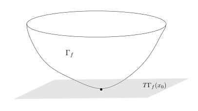

# Hesse 矩阵、极值与凸函数

[返回讲义目录](../../../math-analysis-lecture-notes.md) · [学期目录](../../02-math-analysis-ii.md) · [章节目录](../37-hessian-convexity.md) · [校勘记录](../../errata.md) · [上一篇：切丛与 Lagrange 乘子法](../36-tangent-bundles.md) · [下一篇：37.1：习题课：球极投影](37-03-p0425-0427.md)

<!-- source: PDF 418; printed: 418; transcription: first-pass; proofreading: applied -->

## Hesse 矩阵与极值点的二阶导数判定

为了避免张量的概念，我们考虑 $\mathbb{R}^n$ 中的开集 $\Omega$ 并假设 $\mathbb{R}^n$ 中已经选取坐标 $(x_1, \cdots, x_n)$。我们假设 $f$ 是 $\Omega$ 上至少两次连续可微的函数。对于给定的点 $p \in \Omega$，我们定义 $f$ 在 $p$ 处的 Hesse 矩阵为

$$
\nabla^2 f(p) = H_f(p) = \left( \frac{\partial^2 f}{\partial x_i \partial x_j}(p) \right) = \begin{pmatrix}
\frac{\partial^2 f}{\partial x_1^2}(p) & \frac{\partial^2 f}{\partial x_1 \partial x_2}(p) & \cdots & \frac{\partial^2 f}{\partial x_1 \partial x_n}(p) \\
\frac{\partial^2 f}{\partial x_2 \partial x_1}(p) & \frac{\partial^2 f}{\partial x_2^2}(p) & \cdot & \frac{\partial^2 f}{\partial x_2 \partial x_n}(p) \\
\cdots & \cdot & \cdots & \cdot \\
\frac{\partial^2 f}{\partial x_n \partial x_1}(p) & \frac{\partial^2 f}{\partial x_n \partial x_2}(p) & \cdots & \frac{\partial^2 f}{\partial x_n^2}(p)
\end{pmatrix}
$$

根据 Clairaut-Schwarz 的定理，这是一个对称矩阵。另外，根据线性代数中所学的知识，我们还可以将 Hesse 矩阵看成是 $\mathbb{R}^n$ 上的二次型：

$$
H_f(p) : \mathbb{R}^n \otimes \mathbb{R}^n \to \mathbb{R}, \quad (v, w) \mapsto \sum_{1 \leqslant i, j \leqslant n} \frac{\partial^2 f}{\partial x_i \partial x_j} v_i w_j.
$$

我们假设在 $\mathbb{R}^n$ 给了内积 $\langle \cdot, \cdot \rangle$，使得 $\left\{ \frac{\partial}{\partial x_i} \right\}_{i \leqslant n}$ 恰好是标准正交基。那么上面的二次型还可以写成

$$
H_f(v, w) = \langle v, \nabla^2 f(w) \rangle.
$$

另外，我们的 Taylor 公式在 2 阶的时候可以写成

$$
f(x) = f(x_0) + \langle \nabla f(x_0), x - x_0 \rangle + \frac{1}{2} \langle x - x_0, \nabla^2 f(x_0)(x - x_0) \rangle + o(|x - x_0|^2).
$$

对于实对称矩阵，我们可以讨论它是否正定／负定。我们简单回忆线性代数中的概念：矩阵／二次型 $\nabla^2 f$ 是正定（半正定）的，指的是它满足如下条件之一：

1) 对任意的非零 $v\in\mathbb R^n$，$H_f(v,v)>0$（$H_f(v, v) \geqslant 0$）；

2) 矩阵 $\nabla^2 f$ 的特征值都是正（非负）的。

我们用 $\nabla^2 f > 0$ 和 $\nabla^2 f \geqslant 0$ 表示正定和半正定的二次型；负定的情形类似。

**命题 223**。给定 $f \in C^2(\Omega)$，其中 $\Omega \subset \mathbb{R}^d$ 是开集，如果 $x_0 \in \Omega$ 是 $f$ 的最小值点，那么，$\nabla f(x_0) = 0$ 并且 $\nabla^2f(x_0)\geqslant0$（半正定）。

**证明**：首先，$\nabla f(x_0) = 0$ 即 $df(x_0) = 0$，这是明显的。为了说明 $\nabla^2 f(x_0) \geqslant 0$，我们用反证法，假设 $\nabla^2 f$ 有一个负特征值 $\lambda < 0$，我们用 $v$ 表示相应的一个特征向量（非零）。考虑 $x = x_0 + tv$ 并

<!-- source: PDF 419; printed: 419; transcription: first-pass; proofreading: applied -->

利用 Taylor 公式（一阶导数项自动为零）：

$$
\begin{aligned}
f(x) &= f(x_0) + \frac{1}{2} \langle tv, \nabla^2 f(x_0)(tv) \rangle + o(|x - x_0|^2) \\
&= f(x_0) + \lambda \times \frac{|v|^2 t^2}{2} + o(t^2 |v|^2)
\end{aligned}
$$

根据 $o(|t|^2)$ 的定义，存在 $\varepsilon > 0$，当 $0<|t|<\varepsilon$ 时，我们有 $o(t^2 |v|^2) < \frac{1}{2} |\lambda| \frac{|v|^2 t^2}{2}$。根据 $\lambda < 0$，从而

$$
f(x) < f(x_0) + \lambda \times \frac{|v|^2 t^2}{4} < f(x_0)
$$

这与 $x_0$ 是最小值矛盾。

这个证明可以用来证明一个接近于上述命题逆命题的命题：

**命题 224**。给定 $f \in C^2(\Omega)$，其中 $\Omega \subset \mathbb{R}^d$ 是开集，如果 $x_0 \in \Omega$ 满足 $\nabla f(x_0) = 0$ 并且 $\nabla^2 f(x_0) > 0$（正定），那么，$x_0$ 是 $f$ 的局部最小值点，即存在开集 $U \subset \Omega$，使得 $x_0$ 是 $f$ 在 $U$ 上的最小值。

**证明**：由于 $\nabla^2 f(x_0) > 0$，我们令 $0 < \lambda_1 \leqslant \lambda_2 \leqslant \cdots \leqslant \lambda_n$ 是它的特征值，其中 $\lambda_1$ 是最小的特征值。根据线性代数的知识，我们可以选取相应于上述特征值的特征向量 $v_1, v_2, \cdots, v_n$，其中它们都是单位向量并且两两正交。据此，对任意的 $w \in \mathbb{R}^n$，我们可以把 $w$ 写成

$$
w = a_1 v_1 + \cdots + a_n v_n, \quad \sqrt{\sum_{i \leqslant n}(a_i)^2}=|w|.
$$

由于 $\nabla^2 f(x_0)(w) = \lambda_1 a_1 v_1 + \cdots + \lambda_n a_n v_n$，所以，我们有

$$
|\nabla^2 f(x_0)(w)| = \sqrt{\sum_{i \leqslant n} (\lambda_i a_i)^2} \geqslant \lambda_1 |w|.
$$

另外，$\langle w,\nabla^2f(x_0)(w)\rangle=\sum_i\lambda_i a_i^2\geqslant\lambda_1|w|^2$。根据 Taylor 公式（一阶导数项自动为零），我们有

$$
\begin{aligned}
f(x) &= f(x_0) + \frac{1}{2} \langle x - x_0, \nabla^2 f(x_0)(x - x_0) \rangle + o(|x - x_0|^2) \\
&\geqslant f(x_0)+\frac{\lambda_1}{2}|x-x_0|^2+o(|x - x_0|^2)
\end{aligned}
$$

根据 $o(|x - x_0|^2)$ 的定义，存在 $\varepsilon > 0$，当 $0<|x-x_0|<\varepsilon$ 时（我就选取 $U = B_\varepsilon(x_0)$），我们有 $|o(|x-x_0|^2)|<\frac{1}{2}\lambda_1\frac{|x-x_0|^2}{2}$。从而

$$
f(x) > f(x_0)+\lambda_1\times\frac{|x-x_0|^2}{4} > f(x_0)
$$

这说明 $x_0$ 是 $U$ 中的最小值点。

<!-- source: PDF 420; printed: 420; transcription: first-pass; proofreading: applied -->

## 二阶导数与凸函数

给定凸集 $\Omega \subset \mathbb{R}^n$（即对任意的 $x, y \in \Omega$，对任意的 $t \in [0, 1]$，$tx + (1 - t)y \in \Omega$），$f : \Omega \to \mathbb{R}$ 是在凸集上定义的函数，如果对任意的 $x, y \in \Omega$，对任意的 $t \in [0, 1]$，都有

$$
f(tx + (1 - t)y) \leqslant t f(x) + (1 - t) f(y).
$$

我们就称 $f$ 是**凸函数**。（如果 $-f$ 是凸函数，就称 $f$ 是**凹函数**）

另外，如果对任意不同的 $x,y\in\Omega$，对任意的 $t \in (0, 1)$，都有

$$
f(tx + (1 - t)y) < t f(x) + (1 - t) f(y).
$$

我们就称 $f$ 是**严格凸**的。

换而言之，对于任意 $\Omega$ 中的线段，$f$ 在这个线段上的限制是 1 维的凸函数。另外，我们可以同样地证明 Jensen 不等式（请参见上学期第十八次课，证明完全可以照搬）：

**命题 225**（Jensen 不等式）。假设 $f : \Omega \to \mathbb{R}$ 是凸函数，其中 $\Omega \subset \mathbb{R}^n$ 为凸集，那么对任意的 $x_1, \cdots, x_n \in \Omega$ 和任意的 $t_1, \cdots, t_n \in [0, 1]$，其中 $t_1 + t_2 + \cdots + t_n = 1$，我们有

$$
f(t_1 x_1 + \cdots + t_n x_n) \leqslant t_1 f(x_1) + \cdots + t_n f(x_n).
$$

**例子**。我们先看几个凸函数的例子（我们总假设 $\Omega \subset \mathbb{R}^n$ 是凸集）

1) $f(x) = a_1 x_1 + \cdots + a_n x_n + b$ 是 $\Omega$ 上的仿射函数。

2) 假设 $\|\cdot\| : \mathbb{R}^n \to \mathbb{R}$ 是任意一个范数，那么，这是一个凸函数，因为

$$
\|tx + (1 - t)y\| \leqslant \|tx\| + \|(1 - t)y\| = t\|x\| + (1 - t)\|y\|.
$$

3) 假设 $A$ 是一个 $n \times n$ 的半正定矩阵，那么，二次型

$$
f(x) = \langle x, Ax \rangle
$$

是凸函数。实际上，我们可以验证代数恒等式：

$$
(1 - t)f(x) + tf(y) - f((1 - t)x + ty) = t(1 - t)f(x - y).
$$

右边的值是非负的。

### 凸函数的连续性

**定理 226**（凸函数在开集上的连续性）。假设 $\Omega \subset \mathbb{R}^n$ 是凸的开集，$f : \Omega \to \mathbb{R}$ 是凸函数，那么，$f$ 是连续函数。

**证明**：假设 $0 \in \Omega$，我们只要证明 $f$ 在 $0$ 处连续即可，其余的点类似。我们不妨假设如下的向量

$$
\pm e_1 = (\pm 1, 0, \cdots, 0), \cdots, \pm e_n = (0, \cdots, 0, \pm 1)
$$

<!-- source: PDF 421; printed: 421; transcription: first-pass; proofreading: applied -->

都在 $\Omega$ 中（否则做适当的放缩即可，或者选取 $\pm\varepsilon e_i$ 来代替这些向量）。我们注意到，当 $r$ 足够小的时候，任意的 $|x| < r$，如果 $x$ 在第一相限（即坐标都是非负的），存在 $\lambda_1, \cdots, \lambda_n \in [0, 1)$ 使得
$$x = \lambda_1 e_1 + \lambda_2 e_2 + \cdots + \lambda_n e_n.$$
如果 $r$ 足够小，我们还可以要求 $\lambda_1 + \cdots + \lambda_n < 1$，这是因为
$$\lambda_1 + \cdots + \lambda_n \leqslant \sqrt{n(\lambda_1^2 + \cdots + \lambda_n^2)} = |x|\sqrt{n}.$$
选定这样一个 $r$。此时，我们令 $\lambda_0 = 1 - \lambda_1 \cdots - \lambda_n$，所以
$$x = \lambda_0 \cdot 0 + \lambda_1 e_1 + \lambda_2 e_2 + \cdots + \lambda_n e_n.$$
根据凸函数的性质（Jensen 不等式），我们就有
$$\begin{aligned}
f(x) &\leqslant \lambda_0 f(0) + \lambda_1 f(e_1) + \lambda_2 f(e_2) + \cdots + \lambda_n f(e_n) \\
&= f(0) + \lambda_1 (f(e_1) - f(0)) + \cdots + \lambda_n (f(e_n) - f(0)).
\end{aligned}$$
从而，
$$\begin{aligned}
f(x) - f(0) &\leqslant \lambda_1 (f(e_1) - f(0)) + \cdots + \lambda_n (f(e_n) - f(0)) \\
&\leqslant \sqrt{\lambda_1^2 + \cdots + \lambda_n^2} \sqrt{|f(e_1) - f(0)|^2 + \cdots + |f(e_n) - f(0)|^2}.
\end{aligned}$$
即（对其他相限类似可以证明）
$$f(x) - f(0) \leqslant C|x|, \quad \text{对任意的 } |x| < r.$$
仍假设 $x$ 在第一象限（其他象限相应改变基向量的符号），我们还可以用 $x,-e_1, \cdots, -e_n$ 的凸组合来表示 $0$，实际上，利用 $x$ 的坐标，我们选取
$$\lambda_0 = \frac{1}{x_1 + \cdots + x_n + 1}, \quad \lambda_i = \lambda_0 x_i, i \geqslant 1.$$
此时，我们有
$$0 = \lambda_0 x + \lambda_1(-e_1) + \lambda_2(-e_2) + \cdots + \lambda_n(-e_n).$$
所以，
$$\begin{aligned}
f(0) &\leqslant \lambda_0 f(x) + \lambda_1 f(-e_1) + \lambda_2 f(-e_2) + \cdots + \lambda_n f(-e_n) \\
&= \lambda_0(f(x)+x_1f(-e_1)+x_2f(-e_2) + \cdots + x_n f(-e_n)).
\end{aligned}$$
从而，
$$f(0) - f(x) \leqslant \underbrace{(\lambda_0 - 1)f(x) + \lambda_0(x_1f(-e_1)+x_2f(-e_2) + \cdots + x_n f(-e_n))}_{\text{类似前述, } \leqslant C'|x|}.$$

<!-- source: PDF 422; printed: 422; transcription: first-pass; proofreading: applied -->

对于第一项，我们有
$$|(\lambda_0 - 1)f(x)| \leqslant \frac{x_1+\cdots+x_n}{1+x_1+\cdots+x_n} |f(x)| \leqslant C''|x||f(x)|.$$
从而，
$$\begin{aligned}
f(0) - f(x) &\leqslant C''|x||f(x)| + C'|x| \\
&\leqslant C''|x||f(x) - f(0)| + C''|x||f(0)| + C'|x|.
\end{aligned}$$
综合之前的不等式，我们就得到
$$|f(x) - f(0)| \leqslant C''|x||f(x) - f(0)| + C''''|x|.$$
不妨假设选取的 $|x|$ 使得 $C''|x| < 0.5$，从而，
$$|f(x) - f(0)| \leqslant 2C''''|x|.$$
这就说明了 $f(x)$ 是连续的（实际上是局部 Lipschitz 的）。 $\square$

如果 $f$ 具有一阶导数的话，我们可以用几何的方式（大约是切平面）来描述凸函数（请参考上学期第十八次课中凸函数的五个等价定义）：

### 凸性的微分判据

**命题 227**。假设 $\Omega \subset \mathbb{R}^n$ 是凸的开集，$f : \Omega \to \mathbb{R}$ 是可微函数（即微分 $df$ 逐点存在），我们用 $\Gamma_f$ 表示 $f$ 在 $\Omega \times \mathbb{R} \subset \mathbb{R}^n \times \mathbb{R}$ 中的图像：
$$\Gamma_f = \{(x, y) \in \mathbb{R}^n \times \mathbb{R} \mid x \in \Omega, y = f(x)\}.$$
该图像在 $(x_0, f(x_0))$ 处的切平面我们定义为
$$T\Gamma_f(x_0) = \{(x,f(x_0)+df(x_0)(x-x_0)) \mid x \in \mathbb{R}^n\}.$$
那么，如下命题是等价的：

1) $f$ 是 $\Omega$ 上的凸函数；

2) 对任意的 $x_0 \in \Omega$，函数图像 $\Gamma_f$ 都在切平面 $T\Gamma_f(x_0)$ 上方，即
$$f(x) \geqslant L_{x_0}(x),$$
其中 $L_{x_0}(x) = f(x_0) + df(x_0)(x - x_0)$，$x \in \Omega$。

<!-- source: PDF 423; printed: 423; transcription: first-pass; proofreading: applied -->

**证明：** 证明分两个方向：

1) 假设 $f$ 是凸函数，所以对任意的 $x, y \in \Omega$，函数 $f(tx + (1 - t)y)$ 是凸函数并且
$$f((1 - t)x + ty) \leqslant (1 - t)f(x) + tf(y) = f(x) + t(f(y) - f(x)).$$
另外，根据 Taylor 公式以及可微性，我们有
$$f((1 - t)x + ty) = f(x + t(y - x)) = f(x) + tdf(x)(y - x) + o(t).$$
令 $t \to 0$，我们就得到
$$df(x)(y - x) \leqslant f(y) - f(x).$$
令 $x = x_0, y = x$，整理就得到 2) 中的等式。

2) 反过来，我们假设 2) 中不等式成立，对于给定的 $x, y \in \Omega, t \in [0, 1]$，我们令 $z = (1 - t)x + ty$。
对 $z$ 用不等式，我们有
$$f(w) \geqslant f(z) + df(z)(w - z).$$
令 $w = x$ 和 $w = y$，我们得到
$$\begin{aligned}
f(x) &\geqslant f(z) - tdf(z)(y - x), \\
f(y) &\geqslant f(z) + (1 - t)df(z)(y - x), .
\end{aligned}$$
将第一个不等式乘 $(1 - t)$，将第二个不等式乘 $t$，然后相加就得到所要的结论。

我们还可以将函数限制到线段上用 1 维结论直接说明等价性，这留给同学思考。 $\square$

如果我们的函数是 2 阶可微的，类似于 1 维的情况，我们也有对凸函数的二阶导数的判定：

**命题 228**。假设 $\Omega \subset \mathbb{R}^n$ 是凸的开集，$f : \Omega \to \mathbb{R}$ 是 $C^2$ 的函数，那么，$f$ 是凸函数当且仅当 $f$ 在每个点处的 Hesse 矩阵都是半正定的。进一步，如果在每个点处 Hesse 矩阵都是正定的，那么 $f$ 是严格凸的。

**证明：** 首先假设 $f$ 是凸函数。我们在 $x_0$ 处将 $f$ 进行 Taylor 展开：
$$\begin{aligned}
f(x) &= \underbrace{f(x_0) + \langle \nabla f(x_0), x - x_0 \rangle}_{L_{x_0}(x)} + \frac{1}{2}\langle x - x_0, \nabla^2 f(x_0)(x - x_0)\rangle + o(|x - x_0|^2) \\
&\geqslant L_{x_0}(x).
\end{aligned}$$
从而，对任意的 $x \to x_0$，我们有
$$\frac{1}{2}\langle x - x_0, \nabla^2 f(x_0)(x - x_0)\rangle + o(|x - x_0|^2) \geqslant 0.$$

<!-- source: PDF 424; printed: 424; transcription: first-pass; proofreading: applied -->

令 $x - x_0 = tv, t = |x - x_0|$，其中 $v$ 是任意的长为 1 的向量，从而
$$t^2 \frac{1}{2}\langle v, \nabla^2 f(x_0)(v)\rangle + o(t^2) \geqslant 0 \implies \frac{1}{2}\langle v, \nabla^2 f(x_0)(v)\rangle \geqslant o(1).$$
令 $t \to 0$，我们就得到了
$$\langle v, \nabla^2 f(x_0)(v)\rangle \geqslant 0,$$
其中 $v$ 是任意的长为 1 的向量，所以 $\nabla^2f(x_0)$ 是半正定的。

反过来，我们假设在任何一点 $x_0 \in \Omega$ 处，我们有 $\nabla^2 f(x_0) \geqslant 0$。此时，根据 Talyor 展开公式（Lagrange 余项），我们有
$$f(x)-L_{x_0}(x) = \frac{1}{2}\langle x - x_0, \nabla^2 f(x')(x - x_0)\rangle \geqslant 0,$$
其中 $x'$ 位于 $x_0$ 与 $x$ 之间。根据前面一阶导数的命题，$f$ 是凸的。 $\square$

[返回讲义目录](../../../math-analysis-lecture-notes.md) · [学期目录](../../02-math-analysis-ii.md) · [章节目录](../37-hessian-convexity.md) · [校勘记录](../../errata.md) · [上一篇：切丛与 Lagrange 乘子法](../36-tangent-bundles.md) · [下一篇：37.1：习题课：球极投影](37-03-p0425-0427.md)
