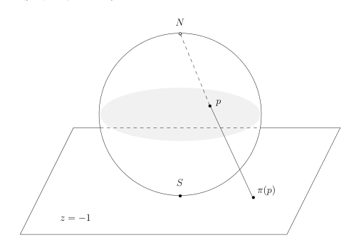

# 37.1：习题课：球极投影

[返回讲义目录](../../../math-analysis-lecture-notes.md) · [学期目录](../../02-math-analysis-ii.md) · [章节目录](../37-hessian-convexity.md) · [校勘记录](../../errata.md) · [上一篇：Hesse 矩阵、极值与凸函数](37-01-p0418-0424.md) · [下一篇：37.2：作业：Lagrange乘子法，Morse引理，横截相交性](37-04-p0428-0432.md)

<!-- source: PDF 425; printed: 425; transcription: first-pass; proofreading: applied -->

<!-- math-analysis-layout: document-title-normalized -->

> 
> 隐函数定理与子流形之间切映射的计算（球极投影）

## 隐函数定理的习题

**第三次作业 B3)**

假设 $f : \mathbb{R}^n \to \mathbb{R}^n$ 是光滑映射，$0$ 是 $f$ 的不动点，即 $f(0) = 0$。假设 $1$ 不是 $f$ 在 $0$ 处的微分
$$
df(0) : \underbrace{T_0 \mathbb{R}^n}_{\mathbb{R}^n} \longrightarrow \underbrace{T_0 \mathbb{R}^n}_{\mathbb{R}^n}
$$
的特征值。

* 证明，$0$ 是一个孤立的不动点，即存在开集 $U$，使得 $0 \in U$，$f$ 在 $U$ 有且仅有 $0$ 为其不动点。
* 任意给定 $g \in C^1(\mathbb{R}^n, \mathbb{R}^n)$。对任意的 $\lambda \in \mathbb{R}$，我们定义映射
$$
f_\lambda : \mathbb{R}^n \longrightarrow \mathbb{R}^n, \quad x \mapsto f(x) + \lambda g(x),
$$
证明，存在 $\varepsilon > 0$，存在 $0$ 在 $\mathbb{R}^n$ 的开邻域 $U$ 以及 $C^1$ 的映射
$$
\omega:(-\varepsilon,\varepsilon)\to U, \quad \lambda \mapsto \omega(\lambda),
$$
使得对任意的 $\lambda \in (-\varepsilon, \varepsilon)$，$f_\lambda$ 在 $U$ 中恰好有一个不动点 $\omega(\lambda)$。

**第三次作业 D2)**

（根对系数的光滑依赖性）考虑实系数多项式 $P(X) = X^n + c_1 X^{n-1} + \cdots + c_n = 0$。如果对 $(c_1^*, \cdots, c_n^*) \in \mathbb{R}^n$，$P(X)$ 恰好有 $n$ 个两两不同的实根 $z_1(c_1^*, \cdots, c_n^*) < \cdots < z_n(c_1^*, \cdots, c_n^*)$。证明，存在 $(c_1^*, \cdots, c_n^*) \in \mathbb{R}^n$ 的开邻域 $\Omega$ 和 $\Omega$ 上的光滑函数 $z_1, \cdots, z_n$，使得对任意的 $(c_1, \cdots, c_n) \in \Omega$，我们有
$$
z_1(c_1, \cdots, c_n) < z_2(c_1, \cdots, c_n) < \cdots < z_n(c_1, \cdots, c_n)
$$
并且
$$
P_c(z_1(c_1,\cdots,c_n))=P_c(z_2(c_1,\cdots,c_n))=\cdots=P_c(z_n(c_1,\cdots,c_n))=0.
$$

<!-- source: PDF 426; printed: 426; transcription: first-pass; proofreading: applied -->

## 子流形

**子流形的切空间的线性结构（参考第六课讲义的脚注）**

假设 $M \subset \mathbb{R}^n$ 是子流形，我们想要说明 $T_p M$ 是线性空间。根据定义，存在开集 $U \subset \mathbb{R}^n$，$p \in U$，存在开集 $V \subset \mathbb{R}^n$ 以及微分同胚，使得 $\Phi : U \to V$ 是微分同胚。所以，我们有
$$
\Phi : M \cap U \to V \cap \mathbb{R}^d \times \{0\}.
$$
对于 $V \cap \mathbb{R}^d \times \{0\} \subset \mathbb{R}^n$ 这种情况，我们课上已经计算了 $\Phi(p)$ 处的切空间，这是一个 $T_{\Phi(p)}\mathbb R^n$ 的 $d$ 维线性子空间。另外，根据切空间的微分不变性，我们有
$$
\mathbb{R}^d \times \{0\} = T_{\Phi(p)} \left( V \cap \mathbb{R}^d \times \{0\} \right) = T_{\Phi(p)} \Phi(U \cap M) = d\Phi \Big|_{x=p} (T_p M).
$$
由于 $d\Phi(p):T_p\mathbb R^n\to T_{\Phi(p)}\mathbb R^n$ 是线性同构，所以，$T_p M$ 作为一个线性子空间的逆像还是线性子空间。

你是否能说明，$T_p M$ 作为线性空间结构不依赖于开集 $U \subset \mathbb{R}^n$，$p \in U$，开集 $V \subset \mathbb{R}^n$ 以及微分同胚 $\Phi : U \to V$ 的选取？

## 球极投影（未完待续）

我们考虑 $\mathbb{R}^3$（用坐标 $(x, y, z)$）中的单位球面 $S^2$，令 $N = (0, 0, 1)$ 为其北极，$S = (0, 0, -1)$ 为其南极。我们知道，过南极的仿射切平面 $S+T_SS^2$ 就是平面 $z=-1$，我们用 $\Sigma$ 来表示这个平面。对任意的 $p \in S^2$，$p \neq N$，我们考虑从 $N$ 到 $p$ 的连线，它与 $\Sigma$ 恰好相交于一个点 $\pi(p)$。于是，我们有映射
$$
\pi : S^2 - \{N\} \to \Sigma, \quad p \mapsto \pi(p).
$$
这个映射被称作是从北极到南极切平面的球极投影。

* 证明，$\mathbb{R}^3$ 中的任意的平面（由某个线性函数 $ax + by + cz - d$ 的零点定义）与 $S^2$ 上的交是圆（如果非空的话，半径可以是 $0$）。我们称它们为球面上的圆。
* 证明，$\pi$ 是子流形之间的光滑映射并且给出了 $S^2 - \{N\}$ 于 $\Sigma$ 之间的微分同胚。
* 证明，对任意的 $p \in S^2 - \{N\}$，试计算微分 $d\pi(p):T_pS^2\to T_{\pi(p)}\Sigma=\mathbb R^2\times\{0\}$。

<!-- source: PDF 427; printed: 427; transcription: first-pass; proofreading: applied -->

* 证明，这个映射是所谓的共形映射，即它保持角度：对于任意非零的 $v,w\in T_pS^2$，我们有（用 $\mathbb{R}^3$ 中的内积）
$$
\frac{\langle d\pi(p)(v), d\pi(p)(w) \rangle}{|d\pi(p)(v)| |d\pi(p)(w)|} = \frac{\langle v, w \rangle}{|v| |w|}.
$$

* $\pi$ 把 $S^2$ 上不过北极的圆映成圆，把过北极的圆映射成直线并且 $\Sigma$ 上的每个圆和直线都可以这么得到。
* 如果把 $\Sigma$ 换成其他点 $q$ 处的切空间，上面的结论是否成立？

[返回讲义目录](../../../math-analysis-lecture-notes.md) · [学期目录](../../02-math-analysis-ii.md) · [章节目录](../37-hessian-convexity.md) · [校勘记录](../../errata.md) · [上一篇：Hesse 矩阵、极值与凸函数](37-01-p0418-0424.md) · [下一篇：37.2：作业：Lagrange乘子法，Morse引理，横截相交性](37-04-p0428-0432.md)
