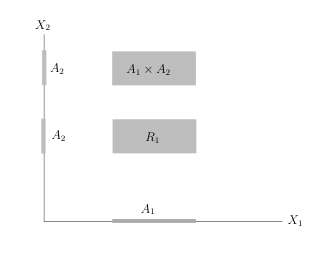
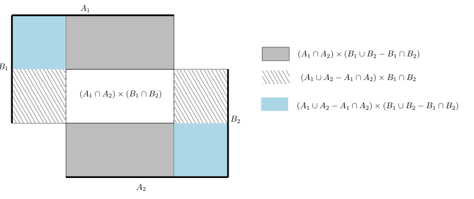
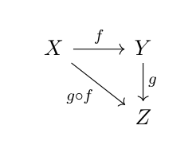
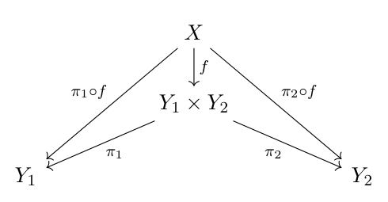
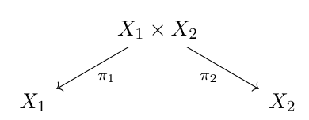

# 38 σ-代数与可测映射

[返回讲义目录](../../math-analysis-lecture-notes.md) · [学期目录](../02-math-analysis-ii.md) · [校勘记录](../errata.md) · [上一篇：37.2 作业:Lagrange乘子法,Morse引理,横截相交性](37-hessian-convexity/37-04-p0428-0432.md) · [下一篇：测度与 Carathéodory 扩张定理](39-measure-extension.md)

<!-- source: PDF 433; printed: 433; transcription: first-pass; proofreading: applied -->

## 38 $\sigma$-代数, 由某些子集生成的 $\sigma$-代数, Borel-代数, $\sigma$-代数的张量积, $\mathbb{R}^2$ 上的 Borel 代数与 $\mathbb{R}^1$ 上的 Borel 代数之间的关系, 单调类, 单调类 + 代数 $\Rightarrow \sigma$-代数, 可测空间, 可测映射, $\sigma$-代数的拉回, 可测性的生成元判据, 到乘积空间可测性的判据, 距离空间的乘积空间上的 $\sigma$-代数, 可测函数的性质

### 积分理论

我们引入一些集合论的常用记号: 给定集合 $X$, 我们用 $\mathcal{P}(X)$ 表示其幂集合 (即所有子集所构成的集合)。给定 $A, B \in \mathcal{P}(X)$, 我们用 $A^c$ 表示 $A$ 的补集并记 $A - B = A \setminus B = A \cap B^c$。

为了描述一下所要寻求的“积分”的大体轮廓, 我们应该把上学期学过的 Riemann 积分理论作为原型, 特别是用简单函数/阶梯函数的逼近的想法。大多数情况下, $X$ 应该是 $\mathbb{R}^n$ 中的一个开集 $\Omega$, 我们首先要明确, 我们并不是要对每个函数都定义它的积分 (Riemann 积分理论中就有不可积分的函数), 特别地, 对于 $X$ 中的某个子集 $A \subset X$, 它的面积可能没有定义, 也就是说示性函数 $\mathbf{1}_A$ 不可积分 (比如说 $\mathbb{Q} \cap [0, 1]$, 根据 Lebesgue 定理, 它的示性函数处处不连续, 所以在 Riemann 的意义下不可积)。我们关心的是 $X$ 中能定义面积的集合, 它们的全体我们将用 $\mathcal{A}$ 来表示, 一般而言, 这是一个很大的集合, 比如说, 在 $\Omega \subset \mathbb{R}^n$ 上, 我们希望这个集合包含所有的长方体以及所有可以用长方体铺出的集合 (用这些长方体并出来)。所以, 对于 $\mathcal{A}$ 中的元素 (即 $X$ 的子集), 我们希望能够做一些基本的集合上的操作, 比如并集等, 这就是所谓的 $\sigma$-代数的结构。有了这些集合 (对应于 Riemann 积分中的区间), 我们就可以考虑它们所对应的示性函数的积分, 这实际上要求对 $\mathcal{A}$ 中的每个元素定义它的“长度”或者“面积” (回忆上学期 Stieltjes 积分是非常有帮助的), 这就是所谓的测度的概念。一旦有了测度, 我们就可以对简单函数积分了, 然后就可以对一切能被简单函数逼近的函数进行积分。用上学期学过的简单函数做逼近来定义 Riemann 积分的观点来看, 经典意义上的 Riemann 积分也是这条路, 只不过是用 Riemann 和的方式代替了简单函数逼近。我们要发展一套抽象的理论, 它将囊括大部分可能的积分, 比如说级数的求和与概率空间上的积分等。这个理论是在任意的集合上来构造的, 从技术上而言要比 Riemann 积分更简单, 从应用的角度而言会更广, 从计算的角度而言它们没有太大的区别。我们也会在作业中展示和比较传统的 Riemann 积分理论和我们的理论。

<!-- source: PDF 434; printed: 434; transcription: first-pass; proofreading: applied -->

### $\sigma$-代数

先抽象地定义我们想定义面积的集合:

**定义 229**. 给定集合 $X$。$\mathcal{A} \subset \mathcal{P}(X)$ 是集合 $X$ 的某些子集所构成的集合, 如果它满足如下三条性质:

1) 空集 $\emptyset \in \mathcal{A}$;

2) 如果 $A \in \mathcal{A}$, 那么 $A^c \in \mathcal{A}$;

3) 如果 $A_i \in \mathcal{A}\ (i \in I)$, 其中指标集 $i \in I$ 为有限集, 那么 $\bigcup_{i \in I} A_i \in \mathcal{A}$。

我们就称 $\mathcal{A}$ 是 $X$ 上的一个代数。如果在上述条件 3) 中, 允许 $I$ 为可数集, 那么称 $\mathcal{A}$ 为 $X$ 上的一个 $\sigma$-代数。

换句话说, $\sigma$-代数在可数次并的操作下封闭。

**注记**. 对于 $\sigma$-代数 $\mathcal{A}$, 我们很明显有 $X \in \mathcal{A}$ 以及如下性质:

4) 如果 $A_i \in \mathcal{A}\ (i \in I)$, 其中指标集 $i \in I$ 为可数集, 那么 $\bigcap_{i \in I} A_i \in \mathcal{A}$。

这因为并和交的操作在取补集的操作下是对偶的。

**定义 230**. 对于 $X$ 上的 $\sigma$-代数 $\mathcal{A}$, 如果其子集 $\mathcal{A}' \subset \mathcal{A}$ 也是 $\sigma$-代数, 那么就称 $\mathcal{A}'$ 为 $\mathcal{A}$ 的**子 $\sigma$-代数**, 或者成为 **$\sigma$-子代数**, 也简称为**子代数**。

**例子**. 我们先给出三个接近于平凡的例子:

1) $\mathcal{A} = \mathcal{P}(X)$ 是 $X$ 上的 $\sigma$-代数;

2) $\mathcal{A} = \{\emptyset, X\}$ 是 $X$ 上的 $\sigma$-代数;

3) 假设 $X$ 是可数集, 对任意的 $x\in X$，$\{x\} \in \mathcal{A}$, 那么 $\mathcal{A} = \mathcal{P}(X)$。

**命题 231**. 任意给定指标集合 $J$, 如果对每个 $j \in J$, $\mathcal{A}_j$ 都是 $X$ 上的 $\sigma$-代数, 那么
$$
\mathcal{A} := \bigcap_{j \in J} \mathcal{A}_j
$$
也是 $X$ 上的 $\sigma$-代数。

**证明**: 证明即为定义的验证:

1) 因为对任意的 $j$, $\emptyset \in \mathcal{A}_j$, 所以 $\emptyset \in \mathcal{A}$。

2) 如果 $A \in \mathcal{A}$, 那么, 对任意的 $j \in J$, $A \in \mathcal{A}_j$, 从而, $A^c \in \mathcal{A}_j$。这表明, $A^c \in \bigcap_{j \in J} \mathcal{A}_j$, 即 $A^c \in \mathcal{A}$。

<!-- source: PDF 435; printed: 435; transcription: first-pass; proofreading: applied -->

3) 如果 $A_1, A_2, \cdots \in \mathcal{A}$ (可数个), 那么, 对任意的 $j \in J$, $A_1, A_2, \cdots \in \mathcal{A}_j$, 所以, $\bigcup_{i=1}^\infty A_i \in \mathcal{A}_j$。
从而, $\bigcup_{i=1}^\infty A_i \in\bigcap_{j\in J}\mathcal A_j=\mathcal A$。 $\square$

**注记** (由某些子集生成的 $\sigma$-代数). 根据这个命题, 我们可以引入如下重要的概念: 假定 $\mathcal{M} \subset \mathcal{P}(X)$ 为任意给定的子集 (这是 $X$ 中某些子集的集合), 令
$$
\Sigma = \{ \mathcal{A} \mid \mathcal{A} \supset \mathcal{M}, \mathcal{A} \text{ 为 } \sigma\text{-代数} \}.
$$
很明显, $\Sigma$ 不是空集, 因为我们有 $\mathcal P(X)\in\Sigma$。令
$$
\sigma(\mathcal{M}) := \bigcap_{\mathcal{A} \in \Sigma} \mathcal{A}.
$$
这是包含 $\mathcal{M}$ 的最小的 $\sigma$-代数, 我们称它是由 $\mathcal{M}$ **生成的 $\sigma$ 代数**。

**定义 232**. 给定一个距离空间 (拓扑空间) $X$, 由 $X$ 中一切开集所生成的 $\sigma$-代数被称作是 $X$ 上的 **Borel-代数**, 用符号 $\mathcal{B}(X)$。我们把 Borel-代数中的元素称作是 $X$ 上的 **Borel-集**。

对多元微积分而言, 最重要的对象是 $\mathcal{B}(\mathbb{R}^n)$, 我们可以对着里面的集合定义面积/体积。如果不特别指出, 我们都假定 $\mathbb{R}^n$ 上的距离就是标准的 Euclid 空间上的距离。首先研究一下 1 维的情况。按照定义, 下面的性质是显然的:

**注记**. 给定 $X$ 中的某些子集所组成的集合 $\mathcal{M}$ 和 $\mathcal{M}'$, 如果 $\mathcal{M} \subset \mathcal{M}'$, 那么 $\sigma(\mathcal{M}) \subset \sigma(\mathcal{M}')$。

按照定义, $\mathcal{B}(\mathbb{R}^1)$ 是有所有的开集生成的, 实际上, 它可以由更少的集合 (可数个) 生成:

**命题 233**. $\mathbb{R}$ 上的 Borel-代数可以由 $\{ (-\infty, a) \mid a \in \mathbb{Q} \}$ 生成。

**证明**: 我们上学期证明过如下的命题: 如果 $U$ 是 $\mathbb{R}$ 上的开集, 那么 $U$ 可以写成可数个不相交的开区间的并集:
$$
U = \bigcup_{k=1}^\infty (a_k, b_k), \quad \text{其中 } (a_k, b_k) \cap (a_{k'}, b_{k'}) = \emptyset, \ k \neq k'.
$$
其中某个 $a_k$ 可以是 $-\infty$, 某个 $b_{k'}$ 可以是 $+\infty$。这表明 $\mathcal{B}(\mathbb{R}^1)$ 可以由所有的开区间生成。

我们现在说明 $\mathcal{B}\mathbb{R}^1$ 可以由 $\{ (-\infty, a) \mid a \in \mathbb{R} \}$ 生成, 为此, 令 $\mathcal{A} = \sigma(\{ (-\infty, a) \mid a \in \mathbb{R} \})$。由于 $\sigma$-代数在交、并的可数操作以及取补下是封闭的, 所以, 对任意的 $a, b \in \mathbb{R}, a < b$, 我们有
$$
[a, b) = (-\infty, b) \cap (\mathbb{R} - (-\infty, a)) \in \mathcal{A}.
$$
从而,
$$
(a, b) = \bigcup_{k \geqslant 1} [a + \frac{1}{k}, b) \in \mathcal{A}.
$$

<!-- source: PDF 436; printed: 436; transcription: first-pass; proofreading: applied -->

这表明, 所有的开区间都落在 $\mathcal{A}$ 中, 所以 $\mathcal{A} = \mathcal{B}(\mathbb{R}^1)$。

最终, 为了说明 $\mathcal{B}(\mathbb{R}^1) = \sigma(\{ (-\infty, a) \mid a \in \mathbb{Q} \})$, 我们注意到对于任意的 $a \in \mathbb{R}$, 我们可以选取递增的有理数列 $q_k$, 使得 $q_k \to a$, 所以
$$
(-\infty, a) = \bigcup_{k \geqslant 1} (-\infty, q_k).
$$
所以, $\mathcal{A}$ 中的生成元都落在 $\sigma(\{ (-\infty, a) \mid a \in \mathbb{Q} \})$ 中, 所以 $\mathcal{A} = \mathcal{B}(\mathbb{R}^1)$ 可以由这个集合生成。 $\square$

在 $\mathbb{R}^n$ 上发展积分理论, 我们要充分利用到 $\mathbb{R}^n$ 的定义 (参见本学期第一次课程), 它是更低维数的 $\mathbb{R}$ 通过乘积得到的。为此, 我们在抽象的层次上研究两个集合的乘积上的 $\sigma$-代数: 乘积空间上所对应的 $\sigma$-代数的张量积。对于指标 $i = 1, 2$, 我们假定集合 $X_i$ 和配备了 $\sigma$-代数 $\mathcal{A}_i$。在乘积空间 $X_1 \times X_2$ 上, 仿照平面上矩形的定义, 我们优先考虑如下子集的集合:
$$
\mathcal{R} := \{ A_1 \times A_2 \mid A_1 \in \mathcal{A}_1, A_2 \in \mathcal{A}_2 \}.
$$
我们把上述集合中的的元素叫做“**矩形**” (字母 $\mathcal{R}$ 是 rectangle 的首字母)。

我们定义如下的集合
$$
\widetilde{\mathcal{R}} := \{ A \subset X_1 \times X_2 \mid A \text{ 为有限个两两不交的矩形的并} \}.
$$
按照定义, 每个 $\widetilde{\mathcal{R}}$ 中的元素 $A$ 形如
$$
A = \bigcup_{i \leqslant N} (A_i^{(1)} \times A_i^{(2)}),
$$
其中, 对任意的 $i, j \leqslant N, i \neq j, (A_i^{(1)} \times A_i^{(2)}) \cap (A_j^{(1)} 
\times A_j^{(2)}) = \emptyset$。

**命题 234**. $\widetilde{\mathcal{R}}$ 是 $X_1 \times X_2$ 上的代数。

**证明**: 我们需要耐心地验证定义。我们约定 $X = X_1 \times X_2$, 选取 $\widetilde{\mathcal{R}}$ 中元素 $A = \bigcup_{i \leqslant N} (A_i^{(1)} \times A_i^{(2)})$
和 $B = \bigcup_{j \leqslant M} (B_j^{(1)} \times B_j^{(2)})$。为了书写简洁, 我们通常把它们写成
$$
A = \bigcup (A_i^{(1)} \times A_i^{(2)}), \quad B = \bigcup (B_j^{(1)} \times B_j^{(2)}).
$$
证明分三步:

<!-- source: PDF 437; printed: 437; transcription: first-pass; proofreading: applied -->

1) $A \cup B \in \widetilde{R}$。这因为（空集也可写成一个空矩形，以保持有限指标集非空）

$$
\begin{aligned}
A \cup B &= \bigcup_{i,j} ((A_i^{(1)} \times A_i^{(2)}) \cup (B_j^{(1)} \times B_j^{(2)})) \\
&= \bigcup_{i,j} \left[ ((A_i^{(1)} \cap B_j^{(1)}) \times (A_i^{(2)} \cap B_j^{(2)})) \cup ((A_i^{(1)} \cap B_j^{(1)}) \times (A_i^{(2)} - B_j^{(2)})) \right. \\
&\qquad \left. \cup ((A_i^{(1)} - B_j^{(1)}) \times (A_i^{(2)} \cap B_j^{(2)})) \cup((A_i^{(1)}-B_j^{(1)})\times(A_i^{(2)}-B_j^{(2)}))\cup(B_j^{(1)}\times B_j^{(2)})\right],
\end{aligned}
$$

上述出现的每个括号里的集合都是矩形，每组中的前四项两两不交，但各组之间及它们与 $B$ 矩形未必不交。用所有出现的坐标集合及其补在两个 $X_i$ 中分别作有限共同分割，再选取落在 $A\cup B$ 内的乘积格子，就得到两两不交的矩形并，所以 $A\cup B\in\widetilde R$。下面的图给出了上述分解的示意图：

2) $A \cap B \in \widetilde{R}$。

这也是显然的，因为

$$
\begin{aligned}
A \cap B &= \bigcup_{i,j} ((A_i^{(1)} \times A_i^{(2)}) \cap (B_j^{(1)} \times B_j^{(2)})) \\
&= \bigcup_{i,j} ((A_i^{(1)} \cap B_j^{(1)}) \times (A_i^{(2)} \cap B_j^{(2)})),
\end{aligned}
$$

上述矩形很明显两两不交。

3) $A^c \in \widetilde{R}$。

这因为

$$
\begin{aligned}
A^c &= \left( \bigcup_i (A_i^{(1)} \times A_i^{(2)}) \right)^c = \bigcap_i (A_i^{(1)} \times A_i^{(2)})^c \\
&= \bigcap_i \underbrace{((A_i^{(1)c} \times A_i^{(2)c}) \cup (A_i^{(1)c} \times A_i^{(2)}) \cup (A_i^{(1)} \times A_i^{(2)c}))}_{\text{在 } \widetilde{R} \text{ 中}},
\end{aligned}
$$

再利用刚得到的关于相交的性质即可。

至此，我们证明了代数的定义中所要求的三个条件，命题得证。

<!-- source: PDF 438; printed: 438; transcription: first-pass; proofreading: applied -->

**定义 235** ($\sigma$-代数的张量积). 我们用 $\mathcal{A}_1 \otimes \mathcal{A}_2$ 表示由 $\mathcal{R}$ 生成的 $\sigma$-代数，即 $\mathcal{A}_1 \otimes \mathcal{A}_2 = \sigma(\mathcal{R})$。我们把它称作是 $\mathcal{A}_1$ 和 $\mathcal{A}_2$ 的张量积。

**注记.** $\mathcal{A}_1 \otimes \mathcal{A}_2$ 是乘积空间 $X_1 \times X_2$ 上的 $\sigma$-代数，它当然也可以由所有的矩形生成，即 $\mathcal{A}_1 \otimes \mathcal{A}_2 = \sigma(\mathcal{R})$。

作为例子，我们研究 $\mathbb{R}^2$ 上的 Borel 集的结构。

**引理 236.** $\mathbb{R}^2$ 中任一开集都可以写成可数个方块 $(a, b) \times (c, d)$ 的并（可能有交集），其中，我们可以要求 $(a, b)$ 和 $(c, d)$ 都是有限的区间。

**证明:** 假设 $\Omega \subset \mathbb{R}^2$ 是开集。我们可以把 $\mathbb{R}^2$ 写成可数个开球的并：
$$
\mathbb{R}^2 = \bigcup_{n \geqslant 1} B_n(0).
$$
所以，
$$
\Omega = \bigcup_{n \geqslant 1} (\Omega \cap B_n(0)).
$$
这是可数个有界开集的并。所以，只要对有界的开集证明我们的结论即可。在 $\mathbb{R}^2$，一个开方块 $(a, b) \times (c, d)$ 的坐标如果都是有理数的话，我们就称它是一个有理开方块，很显然，有理开方块的集合 $\mathcal{C}_{\mathbb{Q}}$ 是一个可数集。令 $\mathcal{F} = \{C \in \mathcal{C}_{\mathbb{Q}} \mid C \subset \Omega\}$。由于 $\Omega$ 中的每个点都生活在某个小的（完全落在 $\Omega$ 中的）有理方块中，所以 $\mathcal{F}$ 中这些有理方块（至多可数个）的并集就是 $\Omega$。 $\square$

利用这个引理，我们可以刻画可以看出 $\mathcal{B}(\mathbb{R}^2)$ 与 $\mathcal{B}(\mathbb{R}^1)$ 之间的关系：

**定理 237.** $\mathbb{R}^2$ 上的 Borel 代数是 $\mathbb{R}^1$ 上的 Borel 代数与自身的张量积，即 $\mathcal{B}(\mathbb{R}^2) = \mathcal{B}(\mathbb{R}) \otimes \mathcal{B}(\mathbb{R})$。

**证明:** 我们先证明一个平凡的包含关系。由于 $\mathcal{B}(\mathbb{R}^2)$ 是由所有的开集生成，而根据上面的引理，开集是可数个方块 $(a, b) \times (c, d)$ 的并，所以，我们有
$$
\mathcal{B}(\mathbb{R}^2) = \sigma\left( \{ I \times J \mid I, J \subset \mathbb{R} \text{ 是开区间} \} \right).
$$
另外，根据 $\mathcal{B}(\mathbb{R}) \otimes \mathcal{B}(\mathbb{R})$ 的定义，我们有
$$
\mathcal{B}(\mathbb{R}) \otimes \mathcal{B}(\mathbb{R}) = \sigma\left( \{ A \times B \mid A,B\text{ 是 }\mathbb R^1 \text{ 上的 Borel 集} \} \right).
$$
而任意开区间都是 $\mathbb{R}^1$ 上的 Borel 集，这就说明 $\mathcal{B}(\mathbb{R}^2) \subset \mathcal{B}(\mathbb{R}) \otimes \mathcal{B}(\mathbb{R})$。

为了说明反过来的包含关系，我们先证明如下的辅助命题：给定开集 $A_0 \subset \mathbb{R}^1$，那么

- $\mathcal{B} = \{ B \subset \mathbb{R} \mid A_0 \times B \in \mathcal{B}(\mathbb{R}^2) \}$ 是 $\mathbb{R}^1$ 上的 $\sigma$-代数。
  - 很明显 $A_0 \times \emptyset = \emptyset$, $A_0 \times \mathbb{R}$ 是 $\mathbb{R}^2$ 上的开集从而落在 $\mathcal{B}(\mathbb{R}^2)$ 中，所以 $\emptyset, \mathbb{R} \in \mathcal{B}$。

<!-- source: PDF 439; printed: 439; transcription: first-pass; proofreading: applied -->

  - 如果 $\{B_n\}_{n \geqslant 1} \subset \mathcal{B}$，按照定义，$\{A_0 \times B_n\}_{n \geqslant 1} \subset \mathcal{B}(\mathbb{R}^2)$。由于 $\mathcal{B}(\mathbb{R}^2)$ 是 $\sigma$-代数，所以
$$
\bigcup_{n \geqslant 1} (A_0 \times B_n) = A_0 \times \left( \bigcup_{n \geqslant 1} B_n \right) \in \mathcal{B}(\mathbb{R}^2).
$$
按照 $\mathcal{B}$ 的定义，我们就有
$$
\bigcup_{n \geqslant 1} B_n \in \mathcal{B}.
$$

  - 如果 $B\in\mathcal B$，按照定义，$A_0 \times B \in \mathcal{B}(\mathbb{R}^2)$。由于 $A_0 \times \mathbb{R} \in \mathcal{B}(\mathbb{R}^2)$，所以
$$
A_0 \times B^c = A_0 \times \mathbb{R} - A_0 \times B \in \mathcal{B}(\mathbb{R}^2).
$$
按照 $\mathcal{B}$ 的定义，我们就有 $B^c \in \mathcal{B}$。

至此，我们验证了 $\mathcal{B}$ 满足 $\sigma$-代数的定义

我们知道对任意的开集 $B \subset \mathbb{R}$，$A_0 \times B \in \mathcal{B}(\mathbb{R}^2)$（因为 $A_0 \times B$ 是 $\mathbb{R}^2$ 中的开集，请参考本次作业），所以 $\mathcal{B}$ 包含了所有的 $\mathbb{R}$ 中的开集，由于 $\mathcal{B}(\mathbb{R})$ 是包含开集的最小的 $\sigma$-代数，所以，$\mathcal{B} \supset \mathcal{B}(\mathbb{R}^1)$。

特别地，上面的证明表明，对任意的开集 $A \subset \mathbb{R}^1$，对任意的 $B \in \mathcal{B}(\mathbb{R}^1)$，我们都有 $A \times B \in \mathcal{B}(\mathbb{R}^2)$。现在固定一个 Borel 集 $B_0$，我们再证明一个辅助命题：

- $\mathcal{A} = \{ A \subset \mathbb{R} \mid A \times B_0 \in \mathcal{B}(\mathbb{R}^2) \}$ 是 $\mathbb{R}^1$ 上的 $\sigma$-代数。
  - 很明显 $\emptyset \times B_0 \in \mathcal{B}(\mathbb{R}^2)$。根据刚上面的结论，由于 $\mathbb{R}$ 是开集，所以 $\mathbb{R} \times B_0 \in \mathcal{B}(\mathbb{R}^2)$ 中，所以 $\emptyset, \mathbb{R} \in \mathcal{A}$。
  - 如果 $\{A_n\}_{n \geqslant 1} \subset \mathcal{A}$，按照定义，$\{A_n \times B_0\}_{n \geqslant 1} \subset \mathcal{B}(\mathbb{R}^2)$。所以
$$
\bigcup_{n \geqslant 1} (A_n \times B_0) = \left( \bigcup_{n \geqslant 1} A_n \right) \times B_0 \in \mathcal{B}(\mathbb{R}^2).
$$
按照 $\mathcal{A}$ 的定义，我们就有
$$
\bigcup_{n \geqslant 1} A_n \in \mathcal{A}.
$$

  - 如果 $A \in \mathcal{A}$，按照定义，$A \times B_0 \in \mathcal{B}(\mathbb{R}^2)$。由于 $\mathbb{R} \times B_0 \in \mathcal{B}(\mathbb{R}^2)$，所以
$$
A^c \times B_0 = \mathbb{R} \times B_0 - A \times B_0 \in \mathcal{B}(\mathbb{R}^2).
$$
按照 $\mathcal{A}$ 的定义，我们就有 $A^c\in\mathcal A$。

至此，我们验证了 $\mathcal{A}$ 满足 $\sigma$-代数的定义。

类似的，$\mathcal{A}$ 包含了所有的开集（因为对任意的开集 $A \subset \mathbb{R}^1$，对任意的 $B \in \mathcal{B}(\mathbb{R}^1)$，我们都有 $A \times B \in \mathcal{B}(\mathbb{R}^2)$），所以 $\mathcal{A} \supset \mathcal{B}(\mathbb{R}^1)$，从而，对任意的 Borel 集 $A$，我们都有 $A \times B_0 \in \mathcal{B}(\mathbb{R}^2)$，当 $B_0$ 也变动时，我们就证明了对任意的 $A, B \in \mathcal{B}(\mathbb{R}^1)$，$A \times B \in \mathcal{B}(\mathbb{R}^2)$。这说明 $\mathcal{B}(\mathbb{R}^2)$ 包含了所有的矩形 $\mathcal{R}$，从而，$\mathcal{B}(\mathbb{R}^2) \supset \mathcal{B}(\mathbb{R}) \otimes \mathcal{B}(\mathbb{R})$。 $\square$

<!-- source: PDF 440; printed: 440; transcription: first-pass; proofreading: applied -->

我们现在引入比 $\sigma$-代数略广泛的概念，这个概念在应用的时候非常有效，它可以帮助我们把大部分 $\sigma$-的东西（即可数的）转化为有限的。

所谓的 $X$ 中单调上升的子集序列指的是
$$
A_1 \subset A_2 \subset \cdots \subset A_n \subset \cdots.
$$
我们令 $\lim_{n \to \infty} A_n = \bigcup_{n=1}^\infty A_n$。类似地，对于 $X$ 中子集的序列
$$
B_1 \supset B_2 \supset \cdots \supset B_n \supset \cdots
$$
我们称它们是单调下降的，并记 $\lim_{n \to \infty} B_n = \bigcap_{n=1}^\infty B_n$。

**定义 238.** 给定集合 $X$，$\mathcal{M}$ 是 $X$ 的某些子集所构成的集合。如果 $\mathcal{M}$ 中的每个单调上升或者下降的序列，其极限也在 $\mathcal{M}$ 中，我们就称 $\mathcal{M}$ 是 $X$ 上的一个单调类。

**注记.** 根据定义，$\sigma$-代数是单调类。类似于 $\sigma$-代数的情形，我们很容易证明如下的命题（请参考作业）：假设对任意的 $j \in J$，$M_j$ 都是 $X$ 上的单调类，那么
$$
\mathcal{M} := \bigcap_{j \in J} M_j
$$
也是 $X$ 上的单调类。根据这个命题，我们可以定义由 $X$ 的一些子集所生成的单调类：假设 $\mathcal{N}$ 是 $X$ 中的一些子集所组成的集合，所有的包含 $\mathcal{N}$ 的单调类（至少包含 $\mathcal{P}(X)$）的交就是 $\mathcal{N}$ 生成的单调类。这是包含 $\mathcal{N}$ 的最小的单调类。

**命题 239.** 如果 $X$ 上的代数 $\mathcal{A}$ 是单调类，那么 $\mathcal{A}$ 为 $\sigma$-代数。

我们指出，代数与 $\sigma$-代数的区别在于可数的并不一定是封闭的。

**证明:** 假设 $A_1, A_2, \cdots, A_n, \cdots \in \mathcal{A}$，我们要证明 $\bigcup_{n \geqslant 1} A_n \in \mathcal{A}$。为此，我们定义
$$
S_n = \bigcup_{k \leqslant n} A_k \in \mathcal{A}.
$$
按照代数的定义，我们知道 $\{S_n\}_{n \geqslant 1} \subset \mathcal{A}$。这显然是单调上升的序列，所以，$\bigcup_{n \geqslant 1} S_n \in \mathcal{A}$。按照定义，我们知道
$$
\bigcup_{n \geqslant 1} A_n = \bigcup_{n \geqslant 1} S_n.
$$
所以，$\bigcup_{n \geqslant 1} A_n \in \mathcal{A}$。 $\square$

下面的定理在理论构建上非常重要，它的证明也是非常有启发性的：

<!-- source: PDF 441; printed: 441; transcription: first-pass; proofreading: applied -->

**定理 240.** 假设 $\mathcal{A}$ 为 $X$ 上的代数, $\mathcal{M}$ 为 $\mathcal{A}$ 所生成单调类, 那么我们有
$$
\mathcal{M} = \sigma(\mathcal{A}).
$$

**证明:** 由于 $\sigma$-代数为单调类, 按定义, 我们有 $\mathcal{M} \subset \sigma(\mathcal{A})$, 这是因为 $\mathcal{M}$ 是包含 $\mathcal{A}$ 的最小的单调类。另外一个包含方向的证明是不平凡的。根据上一个命题, 我们只需要证明 $\mathcal{M}$ 为代数就可以了, 因为此时 $\mathcal{M}$ 也是 $\sigma$-代数, 它将包含 $\sigma(\mathcal{A})$。为此, 对每个 $A \in \mathcal{P}(X)$, 我们定义
$$
\Phi_{\mathcal{M}}(A) := \left\{ B \in \mathcal{P}(X) \mid A \cup B, A - B, B - A \in \mathcal{M} \right\}.
$$
根据定义中 $A$ 和 $B$ 的对称性, 我们有 $B \in \Phi_{\mathcal{M}}(A) \Leftrightarrow A \in \Phi_{\mathcal{M}}(B)$。

首先来说明集合 $\Phi_{\mathcal{M}}(A)$ 为单调类。为此, 任意选取 $\{A_i\}_{i \geqslant 1}$ 和 $\{B_i\}_{i \geqslant 1}$, 它们分别为 $\Phi_{\mathcal{M}}(A)$ 中单调上升和单调下降的序列, 我们要证明这两个序列的极限仍然在 $\Phi_{\mathcal{M}}(A)$ 中:

1) $\lim_{i \to \infty} A_i \in \Phi_{\mathcal{M}}(A)$。我们来验证定义:
   - 为了说明 $A \cup \lim_{i \to \infty} A_i \in \mathcal{M}$, 我们观察到
$$
A \cup \lim_{i \to \infty} A_i = A \cup \left( \bigcup_{i \geqslant 1} A_i \right) = \bigcup_{i \geqslant 1} (A \cup A_i).
$$
由于 $\{A \cup A_i\}_{i \geqslant 1}$ 为 $\mathcal{M}$ 中单调上升的序列而 $\mathcal{M}$ 为单调类, 所以以上式最后一项在 $\mathcal{M}$ 中, 所以 $A \cup \lim_{i \to \infty} A_i \in \mathcal{M}$。

   - 为了说明 $A - \lim_{i \to \infty} A_i \in \mathcal{M}$, 我们观察到
$$
A - \lim_{i \to \infty} A_i = A - \bigcup_{i \geqslant 1} A_i = \bigcap_{i \geqslant 1} (A - A_i).
$$
由于 $\{A - A_i\}_{i \geqslant 1}$ 为 $\mathcal{M}$ 中单调下降的序列, 所以它的交也在 $\mathcal{M}$ 中。所以, $A - \lim_{i \to \infty} A_i \in \mathcal{M}$。

   - 为了说明 $\lim_{i \to \infty} A_i - A \in \mathcal{M}$, 我们观察到
$$
\lim_{i \to \infty} A_i - A = \left( \bigcup_{i \geqslant 1} A_i \right) - A = \bigcup_{i \geqslant 1} (A_i - A).
$$
类似地, 右边这一项也在 $\mathcal{M}$ 中。

2) $\lim_{i \to \infty} B_i \in \Phi_{\mathcal{M}}(A)$。这里的证明和上面如出一辙:
   - 注意到 $A \cup \lim_{i \to \infty} B_i = A \cup \left( \bigcap_{i \geqslant 1} B_i \right) = \bigcap_{i \geqslant 1} (A \cup B_i)$。由于 $\{A \cup B_i\}_{i \geqslant 1}$ 为 $\mathcal{M}$ 中单调下降的序列, 它们的交在 $\mathcal{M}$ 中, 从而 $A \cup \lim_{i \to \infty} B_i \in \mathcal{M}$。
   - 我们有 $A - \lim_{i \to \infty} B_i = A - \bigcap_{i \geqslant 1} B_i = \bigcup_{i \geqslant 1} (A - B_i) \in \mathcal{M}$, 这因为 $\{A - B_i\}_{i \geqslant 1}$ 为 $\mathcal{M}$ 中单调上升的序列。

<!-- source: PDF 442; printed: 442; transcription: first-pass; proofreading: applied -->

   - 我们还有 $\lim_{i \to \infty} B_i - A = \left( \bigcap_{i \geqslant 1} B_i \right) - A = \bigcap_{i \geqslant 1} (B_i - A) \in \mathcal{M}$。

综上所述, 我们证明了 $\Phi_{\mathcal{M}}(A)$ 为单调类。

我们现在取 $A \in \mathcal{A}$, 由于 $\mathcal{A}$ 为代数, 所以 $\mathcal{A}$ 的元素 $B$ 都满足 $\Phi_{\mathcal{M}}(A)$ 的定义中的要求, 所以 $\mathcal{A} \subset \Phi_{\mathcal{M}}(A)$。进一步, 根据 $\mathcal{M}$ 是包含 $\mathcal{A}$ 的最小的单调类, 我们得到 $\mathcal{M} \subset \Phi_{\mathcal{M}}(A)$。也就是说, 对每一个 $B \in \mathcal{M}$, 我们有 $B \in \Phi_{\mathcal{M}}(A)$。根据对称性, 我们也有 $A \in \Phi_{\mathcal{M}}(B)$。根据 $A$ 的选取的任意性, 我们知道 $\mathcal{A} \subset \Phi_{\mathcal{M}}(B)$, 从而有 $\mathcal{M} \subset \Phi_{\mathcal{M}}(B)$, 其中 $B$ 可以是 $\mathcal{M}$ 中的任意元素。按照 $\Phi_{\mathcal{M}}(\cdot)$ 的定义, 我们立即得到 $\mathcal{M}$ 中元素对于并和差的操作是封闭的, 这就说明了 $\mathcal{M}$ 是一个代数。 $\quad \square$

## 可测空间与可测映射

**定义 241.** 给定一个集合 $X$ 和它上面的一个 $\sigma$-代数 $\mathcal{A}$, 我们将二元组 $(X, \mathcal{A})$ 称作是一个**可测空间**。

**推论 242.** 给定两个可测空间 $(X_1, \mathcal{A}_1)$ 和 $(X_2, \mathcal{A}_2)$, $X_1 \times X_2$ 上的 $\sigma$-代数 $\mathcal{A}_1 \otimes \mathcal{A}_2$ 是由 $\widetilde{\mathcal{R}}$ 所生成的单调类。

**证明:** 我们已经证明了 $\mathcal A_1\otimes\mathcal A_2=\sigma(\widetilde{\mathcal R})$ 而 $\widetilde{\mathcal R}$ 是代数，所以由[定理 240](#ma-theorem-240) 得到结论。 $\quad \square$

**定义 243.** $(X, \mathcal{A})$ 和 $(Y, \mathcal{B})$ 是两个可测空间, 如果映射
$$
f : X \to Y, \quad x \mapsto f(x)
$$
满足如下性质:

对每个 $B \in \mathcal{B}$, 其逆像 $f^{-1}(B) \in \mathcal{A}$。(请比较拓扑空间之间的连续映射的定义)

那么, 我们称 $f$ 是这两个可测空间之间的**可测映射**。

**注记.** 可测映射的复合还是可测的: 假设 $(X, \mathcal{A})$, $(Y, \mathcal{B})$ 和 $(Z, \mathcal{C})$ 是可测空间, $f : X \to Y$, $g : Y \to Z$ 是可测映射, 那么对于 $C \in \mathcal{C}$, $g^{-1}(C) \in \mathcal{B}$, 从而 $f^{-1}\left(g^{-1}(C)\right) \in \mathcal{A}$, 即 $(g \circ f)^{-1}(C) \in \mathcal{A}$。

我们下面研究映射 $f : X \to Y$ 以及 $\sigma$-代数的函子性质。类似于映射和函数的拉回, 我们可以定义 $\sigma$-代数的拉回:

**定义 244.** $X$ 是集合, $(Y, \mathcal{B})$ 是可测空间, $f : X \to Y$。令
$$
f^* \mathcal{B} = f^{-1}(\mathcal{B}) = \left\{ f^{-1}(B) \subset X \mid B \in \mathcal{B} \right\}.
$$
这是 $X$ 上的 $\sigma$-代数, 我们称它为 $\mathcal{B}$ 的**拉回**。

<!-- source: PDF 443; printed: 443; transcription: first-pass; proofreading: applied -->

我们将在作业中证明 $f^* \mathcal{B}$ 的确是 $\sigma$-代数。根据定义, 我们有如下两个显然的性质(我们沿用定义中的符号):

1) 若 $\mathcal{B}' \subset \mathcal{B}$ 为子代数, 那么 $f^*(\mathcal{B}')$ 也是 $f^*(\mathcal{B})$ 的子代数。

2) 若 $g : Z \to X$ 映射, 那么 $(f \circ g)^*(\mathcal{B}) = g^*(f^*(\mathcal{B}))$。

我们现在证明, 只要拉回生成元就可以生成拉回的 $\sigma$-代数了:

**引理 245.** 假定 $\mathcal{M} \subset \mathcal{P}(Y)$ 是 $Y$ 中某些子集所组成的集合, $\mathcal{B} = \sigma(\mathcal{M})$ 是 $\mathcal{M}$ 生成的($Y$ 上的) $\sigma$-代数, $f : X \to Y$ 是映射。那么, $f^*(\mathcal{B})$ 由 $f^*(\mathcal{M})$ 生成, 即
$$
f^*(\sigma(\mathcal{M})) = \sigma(f^*(\mathcal{M})).
$$

**证明:** 由于 $\mathcal{M} \subset \sigma(\mathcal{M})$, 所以 $f^* \mathcal{M} \subset f^* \sigma(\mathcal{M})$, 从而 $\sigma(f^*(\mathcal{M})) \subset f^*(\sigma(\mathcal{M}))$。

另一方面, 我们令
$$
\mathcal{B}' = \left\{ B \subset Y \mid f^{-1}(B) \in \sigma(f^{-1}(\mathcal{M})) \right\},
$$
很明显, $\mathcal{M} \subset \mathcal{B}'$。

由于对任何可数个 $Y$ 的子集 $\{B_i\}_{i \geqslant 1}$, 我们都有
$$
f^{-1}\left( \bigcup_{i \geqslant 1} B_i \right) = \bigcup_{i \geqslant 1} f^{-1}(B_i).
$$
据此, 我们很容易证明 $\mathcal{B}'$ 为 $\sigma$-代数(请参考本周的作业)。所以, $\sigma(\mathcal{M}) \subset \mathcal{B}'$。再根据 $\mathcal{B}'$ 的定义, 有 $f^*(\mathcal{B}') \subset \sigma(f^*(\mathcal{M}))$, 从而 $f^*(\sigma(\mathcal{M})) \subset \sigma(f^*(\mathcal{M}))$, 这就完成了证明。 $\quad \square$

**推论 246 (可测性的生成元判据).** 给定两个可测空间 $(X, \mathcal{A})$ 和 $(Y, \mathcal{B})$, 假设 $\mathcal{B}$ 是由 $\mathcal{M} \subset \mathcal{P}(Y)$ 所生成的 $\sigma$-代数。那么, 映射 $f : X \to Y$ 是可测的当且仅当 $f^*(\mathcal{M}) \subset \mathcal{A}$。

**证明:** 这是因为如果 $f^*(\mathcal{M}) \subset \mathcal{A}$, 那么 $\sigma(f^*(\mathcal{M})) \subset \mathcal{A}$。根据上面的命题, $f^*(\sigma(\mathcal{M})) \subset \mathcal{A}$, 即 $f^* \mathcal{B} \subset \mathcal{A}$。 $\quad \square$

**推论 247.** $(X, \mathcal{A})$ 为可测空间, $(Y, d)$ 是距离空间(拓扑空间), 我们在 $Y$ 上配备上 Borel 代数。那么, 映射 $f : X \to Y$ 是可测的当且仅当对每个开集 $U \subset Y$, 都有 $f^{-1}(U) \in \mathcal{A}$。特别地, 如果 $X$ 和 $Y$ 均为距离空间(拓扑空间), 它们上面都配备了 Borel 代数, $f$ 为 $X$ 与 $Y$ 之间的连续映射, 那么 $f$ 是可测映射。

**证明:** 这是显然的, 因为 Borel 代数是由开集生成的。当 $f$ 为连续映射时, 开集的逆像是开集。 $\quad \square$

**注记.** 这个命题的是简单的, 但是其重要性不言而喻: 拓扑空间之间的连续映射一定是可测的。一般而言, 连续性是非常容易验证的。特别地, 我们现在有一大类可测映射的例子(连续映射)。

<!-- source: PDF 444; printed: 444; transcription: first-pass; proofreading: applied -->

**推论 248.** 给定可测空间 $(Y_1, \mathcal{B}_1)$ 和 $(Y_2, \mathcal{B}_2)$, 我们在乘积空间 $Y_1 \times Y_2$ 上配备 $\sigma$-代数 $\mathcal{B}_1 \otimes \mathcal{B}_2$。我们称 $(Y_1 \times Y_2, \mathcal{B}_1 \otimes \mathcal{B}_2)$ 是这两个可测空间的乘积。那么, 自然的投影映射
$$
\pi_1 : Y_1 \times Y_2 \to Y_1, \quad (y_1, y_2) \mapsto y_1,
$$
$$
\pi_2 : Y_1 \times Y_2 \to Y_2, \quad (y_1, y_2) \mapsto y_2,
$$
是可测映射。

**证明:** 考虑 $\pi_1$, 对任意的 $B_1 \in \mathcal{B}_1$, $\pi_1^{-1}(B_1) = B_1 \times Y_2$, 这是 $Y_1 \times Y_2$ 上的“矩形”, 自然落在 $\mathcal{B}_1 \otimes \mathcal{B}_2$ 中。 $\quad \square$

**推论 249 (到乘积空间可测性的判据).** 给定可测空间 $(Y_1, \mathcal{B}_1)$, $(Y_2, \mathcal{B}_2)$ 和 $(X, \mathcal{A})$。那么, 映射 $f : X \to Y_1 \times Y_2$ 是可测的当且仅当每个 $f_i = \pi_i \circ f$ 均为可测的, 其中 $i = 1, 2$。

**证明:** 如果 $f$ 可测, 那么复合映射 $f_i = \pi_i \circ f$ 自然可测; 反过来对于 $Y_1 \times Y_2$ 矩形上的 $B_1 \times B_2$, 其中 $B_i \in \mathcal{B}_i$, 我们有
$$
f^{-1}(B_1 \times B_2) = f_1^{-1}(B_1) \cap f_2^{-1}(B_2),
$$
其中 $f_i = \pi_i \circ f$, $i = 1, 2$。由于 $f_i$ 是可测的, 所以 $f_i^{-1}(B_i) \in \mathcal{A}$, 从而它们的交集也在 $\mathcal{A}$ 中, 这就完成了证明。 $\quad \square$

在所谓的可分的距离空间上, 要检测一个映射是否是可测的, 我们可以只对开球进行检测。我们先回忆一下所谓的可分公理(定义):

**定义 250.** 假设 $(X, d)$ 是距离空间。如果 $X$ 具有稠密的可数子集, 即可以找到 $\{x_k\}_{k \geqslant 1} \subset X$, 使得对任意的 $x \in X$, 对任意的 $\varepsilon > 0$, 存在某个 $x_k$, 使得 $d(x, x_k) < \varepsilon$, 那么我们就称 $(X, d)$ 是**可分的距离空间**。

**例子.** 我们常见的几个距离空间都是可分的:

1) $\mathbb{R}^n$ 是可分的, 因为所有的坐标为有理数的点所构成的集合是可数并且稠密的。

2) $C([0, 1])$ 是可分的, 其中, 对于任意的 $f, g \in C([0, 1])$, $d(f, g) = \|f - g\|_\infty = \sup_{x \in [0, 1]} |f(x) - g(x)|$。事实上, 根据 Weierstrass-Stone 的定理, 所有的系数为有理数的多项式所构成的集合是可数并且稠密的。

可分距离空间中的开集可以用可数个开球并出来:

<!-- source: PDF 445; printed: 445; transcription: first-pass; proofreading: applied -->

**命题 251**. $(X, d)$ 是距离空间, 对于 $x_0 \in X$, $r > 0$, 我们令 $B_r(x_0) = \{x \in X \mid d(x, x_0) < r\}$。如果 $X$ 是可分的, 那么存在可数个开球 $\mathfrak{B} = \{B_{r_i}(x_i)\}_{i \ge 1}$, 使得对任意开集 $U \subset X$, 可以从 $\mathfrak{B}$ 中选取 $B_1, B_2, \dots, B_m, \dots$, 使得
$$U = B_1 \cup B_2 \cup \dots \cup B_m \cup \dots.$$

**证明:** 根据可分性, 我们在 $X$ 中选取可数个点 $P = \{x_k\}_{k \ge 1}$, 使得 $P$ 在 $X$ 中稠密。对于每个点 $x_k \in P$, 选取可数个开球 \{$B(x_k, q) \mid q \in \mathbb{Q}$\}, 我们把所有这样的小球放在一起组成了
$$\mathfrak{B} = \{B(x, q) \mid x \in P, q \in \mathbb{Q}_{>0}\}.$$
这是一个可数集 (因为可数个可数集的并还是可数的)。

任取开集 $U$, 我们定义 (这里的想法与之前证明 $\mathbb{R}^2$ 上的开集都是可数个形如 $(a, b) \times (c, d)$ 的矩形的并是一样的)
$$\mathfrak{B}_U = \{B \in \mathfrak{B} \mid B \subset U\}.$$
当然, $\mathfrak{B}_U$ 中只有可数个开球并且 $\bigcup_{B \in \mathfrak{B}_U} B \subset U$。只需要证明 $U \subset \bigcup_{B \in \mathfrak{B}_U} B$: 任选 $x \in U$, 由于 $U$ 是开集, 所以存在 $r > 0$, 使得 $B_r(x) \subset U$。根据 $P$ 的稠密性, 存在 $x_k \in P$, 使得 $d(x_k, x) < \frac{r}{4}$, 再选取有理数 $q\in(r/4,r/2)$，那么 $B(x_k,q)\subset U$（从而属于 $\mathfrak B_U$）包含 $x$, 这说明 $x \in \bigcup_{B \in \mathfrak{B}_U} B$。 $\Box$

我们做如下的**约定**: 从此往后, 如果没有特别指出, 每个距离空间 $(X, d)$ (拓扑空间) 都被视作是可测空间, 我们默认它配有相应的 Borel-代数 (由开集生成的 $\sigma$-代数)。为了方便起见, 我们还把它记作 $(X, \mathcal{B}_X)$, 其中 $\mathcal{B}_X$ 为 Borel-代数。

作为上面命题的推论, 我们有

**推论 252**. 假设 $(X, \mathcal{A})$ 是可测空间, $(Y, d)$ 是可分的距离空间。那么, 映射 $f : X \to Y$ 是可测的当且仅当对每个 $B\in\mathfrak B$ (见上述命题的叙述), 我们有 $f^{-1}(B) \in \mathcal{A}$。特别地, 如果对于每个 $(Y, d)$ 中的开球 $B$, 我们都有 $f^{-1}(B) \in \mathcal{A}$, 我们就可以断言 $f$ 是可测的。

之前我们仔细研究了 $\mathbb{R}^2$ 上的 Borel 代数与 $\mathbb{R}^1$ 上的 Borel 代数之间的关系, 这个命题可以推广到一般的可分距离空间上。我们首先回忆一下距离空间的乘积:

假设 $(X_1, d_1)$ 和 $(X_2, d_2)$ 是距离空间, 我们在 $X_1 \times X_2$ 上可以定义距离函数
$$d : (X_1 \times X_2) \times (X_1 \times X_2) \to \mathbb{R}, \quad ((x_1, x_2), (x'_1, x'_2)) \mapsto d((x_1, x_2), (x'_1, x'_2)).$$
我们通常选取
$$d((x_1, x_2), (x'_1, x'_2)) = \sqrt{d_1(x_1,x_1\prime)^2+d_2(x_2,x_2\prime)^2}.$$

<!-- source: PDF 446; printed: 446; transcription: first-pass; proofreading: applied -->

(我们也可选取
$$d((x_1, x_2), (x'_1, x'_2)) = d_1(x_1,x_1\prime)+d_2(x_2,x_2\prime)$$
或者
$$d((x_1, x_2), (x'_1, x'_2)) = \sup\{d_1(x_1,x_1\prime),d_2(x_2,x_2\prime)\}.$$
这些距离都是等价的)

另外, 我们还有投影映射
$$\begin{aligned}
\pi_1 : X_1 \times X_2 \to X_1, & \quad (x_1, x_2) \mapsto x_1, \\
\pi_2 : X_1 \times X_2 \to X_2, & \quad (x_1, x_2) \mapsto x_2.
\end{aligned}$$

**定理 253**. 给定距离空间 $(X_1, d_1)$ 和 $(X_2,d_2)$, 我们用 $(X, d) = (X_1, d_1) \times (X_2, d_2)$ 表示它们的乘积距离空间。如果 $X_1$ 和 $X_2$ 是可分的, 那么 $X$ 也是可分的。进一步, $X$ 上的 Borel 代数恰为 $X_1$ 和 $X_2$ 上 Borel 代数的张量积, 集
$$\mathcal B_X=\mathcal B_{X_1}\otimes\mathcal B_{X_2},$$
(在测度空间的范畴里看距离空间, 可分距离空间的乘积与测度空间的乘积是一致的)

**证明:** 假设 $P_1$ 和 $P_2$ 分别是 $X_1$ 和 $X_2$ 的可数稠密子集, 那么 $P_1 \times P_2$ 是 $X_1 \times X_2$ 中的稠密子集: 任选 $(x_1, x_2) \in X$, 对任意的 $\varepsilon > 0$, 我们可以找到 $p_1 \in P_1, p_2 \in P_2$, 使得
$$d_1(p_1, x_1) < \frac{\varepsilon}{\sqrt{2}}, \quad d_2(p_2,x_2) < \frac{\varepsilon}{\sqrt{2}}.$$
所以,
$$d((p_1, p_2), (x_1, x_2)) < \sqrt{\frac{\varepsilon^2}{2} + \frac{\varepsilon^2}{2}} = \varepsilon.$$

我们现在来研究 Borel 代数。根据定义, 我们有 $\mathcal{B}_X = \sigma(\{U \mid U \subset X_1 \times X_2 \text{ 为开集}\}$)。实际上, 我们可以做的更好
$$\mathcal{B}_X = \sigma(\{B_1 \times B_2 \mid B_1 \in \mathfrak{B}_1, B_2 \in \mathfrak{B}_2\}),$$
其中, $\mathfrak{B}_i$ 是 $X_i$ 中的可数个开球的集合, 使得 $X_i$ 中的每个开集都可以表示成 $\mathfrak{B}_i$ 中若干个小球的并, 这里 $i = 1$ 或 $2$。我们把这个论断的证明留成作业题 (重复[命题 251](#ma-proposition-251) 的证明即可)。

根据乘积空间上矩形的定义, 我们显然有
$$\mathcal{B}_X \subset \sigma(\mathcal{R}) = \mathcal{B}_{X_1} \otimes \mathcal{B}_{X_2}.$$

我们现在证明上述包含关系为等式。为此, 考虑恒同映射:
$$\iota : (X, \mathcal{B}_X) \to (X, \mathcal{B}_{X_1} \otimes \mathcal{B}_{X_2}), \quad x \mapsto x.$$
这是同一个集合上的映射, 但是配备了不同的 $\sigma$-代数。对于每个 $i = 1$ 或 $2$, 对于任意 $X_i$ 中的开集 $U_i$, 我们有 当 $i=1$ 时，$(\pi_1\circ\iota)^{-1}(U_1)=U_1\times X_2\in\mathcal B_X$；当 $i=2$ 时，$(\pi_2\circ\iota)^{-1}(U_2)=X_1\times U_2\in\mathcal B_X$。根据乘积空间可测性的判据, 映射 $\iota$ 是可测的。特别的, 我们有
$$\mathcal{B}_{X_1} \otimes \mathcal{B}_{X_2} = \iota^*(\mathcal{B}_{X_1} \otimes \mathcal{B}_{X_2}) \subset \mathcal{B}_X.$$
这就证明了结论。 $\Box$

<!-- source: PDF 447; printed: 447; transcription: first-pass; proofreading: applied -->

**注记**. 上述证明最后一部分表明, 无论空间可分与否, $\mathcal{B}_X$ 要更细致 (包含了更多的集合), 即 $\mathcal{B}_{X_1} \otimes \mathcal{B}_{X_2} \subset \mathcal{B}_X$。另外, 比较之前 $\mathcal{B}(\mathbb{R}^2) = \mathcal{B}(\mathbb{R}) \otimes \mathcal{B}(\mathbb{R})$ 的证明, 我们看到测度空间的乘积结构使得证明简洁了很多。

### 可测函数的性质

对于复数域 $\mathbb{C}$ 或者实数域 $\mathbb{R}$, 它们上面都有距离的结构, 所以自然地配有 Borel-代数。我们称从可测空间 $(X, \mathcal{A})$ 到 $\mathbb{R}$ 或 $\mathbb{C}$ 的可测映射为**可测函数**。可测函数在代数操作和求极限操作下表现良好:

**定理 254**. 如果 $(X, \mathcal{A})$ 上的函数 $f$ 和 $g$ 是可测的, 那么 $|f|$, $f \pm g$ 和 $f \cdot g$ 也是可测的。如果对任意的点 $x \in X$, $g(x) \neq 0$, 那么 $\frac{f}{g}$ 是可测的。

**证明:** 根据映射到乘积空间的可测性判据, 下面的映射
$$\begin{aligned}
h : X & \to \mathbb{C} \times \mathbb{C}, \\
x & \mapsto (f(x), g(x)),
\end{aligned}$$
是可测的。我们将 $h$ 与可测映射 (因为它是连续的!)
$$\begin{aligned}
\mathbb{C} \times \mathbb{C} & \to \mathbb{C}, \\
(a, b) & \mapsto a \pm b \text{ 或 } a \cdot b,
\end{aligned}$$
复合, 就说明了 $f \pm g$ 和 $f \cdot g$ 是可测的。其余的情况我们留成本周的作业。 $\Box$

下一个定理说明可测函数列的极限函数也是可测的:

**定理 255**. $(X, \mathcal{A})$ 是可测空间, $(Y, d)$ 是距离空间 (通常是 $\mathbb{R}$ 或者 $\mathbb{C}$), 给定可测映射的序列 $\{f_n\}_{n \ge 1}$, 其中, 对于每个 $n \ge 1$, 函数 $f_n : X \to Y$。如果这个映射序列是逐点收敛的, 即对每个 $x \in X$, 都有
$$\lim_{n \to \infty} f_n(x) = f(x),$$
那么极限映射 $f(x)$ 也是可测的。

**注记**. 如果 $E\subset Y$ 是一个非空子集, 我们可以定义如下的函数
$$\begin{aligned}
d(\cdot, E) : Y & \to \mathbb{R}, \\
x & \mapsto d(x, E) = \inf_{e \in E} d(x, e).
\end{aligned}$$
这个函数衡量的是一个点到子集 $E$ 的距离。

如果 $F$ 是闭集, 根据定义, $F^c$ 是开集, 那么, 对于每个 $x \notin F$, $x \in F^c$, 所以存在 $\varepsilon > 0$, 使得 $B(x, \varepsilon) \subset F^c$, 即 $B(x, \varepsilon) \cap F = \emptyset$, 这表明, $d(x, F) \ge \varepsilon$。从而, 对于闭集 $F$ 而言, $x \notin F$ 等价于 $d(x, F) > 0$。

**证明:** 任取 $Y$ 中的开集 $U$；$U=Y$ 的逆像显然可测，以下设 $U\ne Y$，我们定义 $Y$ 中上升的 (Borel 集) 子集序列:
$$U_n = \left\{ x \in U \;\middle|\; d(x, U^c) > \frac{1}{n} \right\}.$$

<!-- source: PDF 448; printed: 448; transcription: first-pass; proofreading: applied -->

很明显, 每个 $U_n$ 都是开集。由于 $U^c$ 是闭集, 所以
$$U = \lim_{n \to \infty} U_n = \bigcup_{n \ge 1} U_n.$$

另外, 根据 $\lim_{i \to \infty} f_i(x) = f(x)$, 我们知道如果 $x \in f^{-1}(U_n) \Leftrightarrow f(x) \in U_n$ ($U_n$ 为开集), 那么存在 $m$, 使得当 $q \ge m$ 时, $x \in f_q^{-1}(U_n) \Leftrightarrow f_q(x) \in U_n$, 这表明
$$f^{-1}(U) = \bigcup_{n \ge 1} f^{-1}(U_n) = \bigcup_n \bigcup_m \bigcap_{q \ge m} f_q^{-1}(U_n).$$

由于每个 $f_q$ 都是可测的, 所以上面每个 $f_q^{-1}(U_n)$ 都是 $\mathcal{A}$ 中的元素, 所以它们的可数的交和并得到的集合 $f^{-1}(U) \in \mathcal{A}$。这表明 $f$ 是可测的。 $\Box$

[返回讲义目录](../../math-analysis-lecture-notes.md) · [学期目录](../02-math-analysis-ii.md) · [校勘记录](../errata.md) · [上一篇：37.2 作业:Lagrange乘子法,Morse引理,横截相交性](37-hessian-convexity/37-04-p0428-0432.md) · [下一篇：测度与 Carathéodory 扩张定理](39-measure-extension.md)
