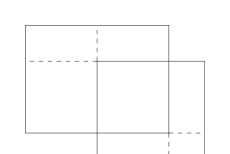

# 40：Lebesgue 测度与测度空间的完备化

[返回讲义目录](../../math-analysis-lecture-notes.md) · [学期目录](../02-math-analysis-ii.md) · [校勘记录](../errata.md) · [上一篇：测度与 Carathéodory 扩张定理](39-measure-extension.md) · [下一篇：抽象积分与 Beppo Levi 定理](41-abstract-integrals/41-01-p0470-0477.md)

<!-- source: PDF 457; printed: 457; transcription: first-pass; proofreading: applied -->

## 知识的回顾和总结

所谓的**可测空间** $(X, \mathcal{A})$ 指的是一个集合 $X$ 配上一个由它某些的子集的集合 $\mathcal{A}$，其中，我们要求 $\mathcal{A}$ 是所谓的 $\sigma$-代数，即它满足如下三个条件：

1) 空集 $\emptyset \in \mathcal{A}$；

2) 如果 $A \in \mathcal{A}$，那么 $A^c \in \mathcal{A}$；

3) 如果 $A_1, A_2, \cdots, A_n, \cdots \in \mathcal{A}$，那么 $\bigcup_{i=1}^\infty A_i \in \mathcal{A}$。

利用定义，我们知道 $\mathcal{A}$ 中任意可数个元素的交和并仍然落在 $\mathcal{A}$ 中。

所谓的**测度空间** $(X, \mathcal{A}, \mu)$ 指的是一个可测空间 $(X, \mathcal{A})$ 配备上一个测度函数
$$
\mu : \mathcal{A} \to [0, \infty],
$$
其中，我们要求 $\mu(\emptyset) = 0$ 并且对于 $\mathcal{A}$ 中两两不交的可数个元素 $A_i$，我们有
$$
\mu\Big(\bigcup_{i=1}^\infty A_i\Big) = \sum_{i=1}^\infty \mu(A_i)
$$

测度有一个很重要的性质，它与单调序列的极限可以交换，即若 $\{A_i\}_{i\geqslant 1}$ 是给 $\mathcal{A}$ 中的序列，那么，如果如下条件之一被满足：

1) 如果序列 $\{A_i\}_{i\geqslant 1}$ 是上升的；

2) 如果序列 $\{A_i\}_{i\geqslant 1}$ 是下降的并且对某个 $i_0$ 有 $\mu(A_{i_0}) < \infty$，

那么，
$$
\mu(\lim_{i\to\infty} A_i) = \lim_{i\to\infty} \mu(A_i).
$$

对于两个可测空间 $(X, \mathcal{A})$ 和 $(Y, \mathcal{B})$ 之间的映射 $f : X \to Y$，如果对任意的 $B \in \mathcal{B}$，$f^{-1}(B) \in \mathcal{A}$，我们就称这个映射是**可测的**。如果只考虑映射 $f : X \to Y$ 而忘掉 $X$ 上的 $\sigma$-代数 $\mathcal{A}$，我们可以用 $f$ 把 $Y$ 上的 $\sigma$-代数拉回来：
$$
f^*\mathcal{B} = \{f^{-1}(B) \mid B \in \mathcal{B}\}.
$$
这是 $X$ 上的一个 $\sigma$-代数。所以，$f$ 可测等价于 $f^*\mathcal{B} \subset \mathcal{A}$。

<!-- source: PDF 458; printed: 458; transcription: first-pass; proofreading: applied -->

### 测度的推出

我们对于测度可以定义所谓的**测度的推出**：假设我们可测空间 $(X, \mathcal{A}, \mu)$ 和 $(Y, \mathcal{B})$ 以及它们之间的可测映射：
$$
f : X \to Y.
$$
其中，我们假定了 $X$ 上配备了测度 $\mu$。据此，我们可以定义 $Y$ 上的一个测度 $f_*\mu$ 使得 $(Y, \mathcal{B}, f_*\mu)$ 称为测度空间。这个测度 $f_*\mu$ 被称作是 $\mu$ 在 $f$ 下的**像测度**，其定义如下：对每个 $B \in \mathcal{B}$，根据 $f$ 的可测性，$f^{-1}(B) \in \mathcal{A}$，所以，我们可以用 $\mu$ 来衡量 $f^{-1}(B)$ 的“面积”：
$$
(f_*\mu)(B) := \mu(f^{-1}(B)).
$$
在本周的作业中，我们会验证 $f_*\mu$ 是 $\mathcal{B}$ 上的测度，从而和 $(Y, \mathcal{B}, f_*\mu)$ 是测度空间。

**注记。** 测度的像是很重要的概念，这是积分的坐标变换公式的抽象推广。我们将要证明，如果 $\Phi : U \to V$ 是 $\mathbb{R}^n$ 中两个区域之间的微分同胚，其中，$U$ 上的坐标我们用 $x = (x_1, \cdots, x_n)$ 表示，$V$ 上的坐标我们用 $y = (y_1, \cdots, y_n)$ 表示，那么，它所对应的多元函数的 Riemann 积分的换元公式就是
$$
\Phi_*\Big(|\operatorname{det}(\operatorname{Jac}(\Phi))|\mathrm{d}x\Big) = \mathrm{d}y,
$$
其中，$\mathrm{d}x$ 和 $\mathrm{d}y$ 分别是 $U$ 和 $V$ 上的 Lebesgue 测度，$\operatorname{Jac}(\Phi)$ 是 $\Phi$ 的 Jacobi 矩阵。这是多元微积分三大基本定理之一（另外两个是 Fubini 定理和 Stokes 公式）。

我们最后回忆上次的 Carathéodory 的测度扩张定理：

假定 $\mathcal{A}$ 为 $X$ 上的代数，$\mu$ 为 $\mathcal{A}$ 上 $\sigma$-有限加性函数，我们想在 $\sigma(\mathcal{A})$ 上定义一个测度 $\mu'$，使得 $\mu'|_{\mathcal{A}} = \mu$。如果 $\mu(X) < \infty$，那么下述条件保证了延拓测度 $\mu'$ 的存在性：

**条件 (C)。** 对任意单调下降的序列 $\{A_i\}_{i\geqslant 0} \subset \mathcal{A}$，如果 $\mu(A_0) < \infty$ 并且 $\lim_{i\to\infty} A_i = \emptyset$，那么 $\lim_{i\to\infty}\mu(A_i)=0$。

如果 $\mu(X) = +\infty$，还需要再加上如下条件：

**条件 ($\mathbf{C}_\infty$)。** 存在单调上升的序列 $\{X_i\}_{i\geqslant 1} \subset \mathcal{A}$，$\lim_{i\to\infty} X_i = X$ 并对任意的 $i \geqslant 1$ 都有 $\mu(X_i) < \infty$，满足对任意的 $A \in \mathcal{A}$，$\mu(A) = +\infty$，我们都有 $\lim_{i\to\infty} \mu(A \cap X_i) = +\infty$。

在 Carathéodory 定理的证明过程中，我们实际上给出了这个测度 $\mu'$ 的具体构造：对任意的 $E\in\sigma(\mathcal A)$，我们有
$$
\mu^*(E) = \inf_{\substack{A_i \in \mathcal{A}, \\ E \subset \bigcup A_i}} \left( \sum_{i=1}^\infty \mu(A_i) \right).
$$
我们还可以要求上面公式中的 $\{A_i\}_{i\geqslant 1}$ 是两两不相交的。

Carathéodory 的测度扩张定理是我们构造测度的最有效工具。

<!-- source: PDF 459; printed: 459; transcription: first-pass; proofreading: applied -->

## $\mathbb{R}^1$ 上的 Lebesgue 测度：长度的定义

在 $\mathbb{R}^1$ 上，我们考虑由所有的开集所生成的 $\sigma$-代数 $\mathcal{B}(\mathbb{R}^1)$，我们将要在 $\mathbb{R}^1$ 上构造 Lebesgue 测度。先规范一下术语：当我们谈论一个区间的时候，我们指的是形如 $[a, b], (a, b), (a, b], [a, b)$ 的区间，其中 $a$ 和 $b$ 可以分别取到 $-\infty$ 和 $+\infty$。对于任意上述一个区间 $I$，无论它是开的还是闭的，我们定义它的长度为
$$
|I| = b - a.
$$
当然，我们容许 $|I| = +\infty$。

任意给定两个区间，如果它们的并集合不构成新的区间，我们就称这两个区间是**分离的**，比如说，$(0, 1)$ 与 $(1, 2)$ 是分离的，因为 $(0, 1) \cup (1, 2)$ 不是区间；$(1, 2)$ 与 $[1, +\infty)$ 就不是分离的，因为它们的并为 $[1,\infty)$ 是一个区间。再比如 $[-1, 0]$ 与 $[2019, 2020]$ 是分离的而 $[1, 2020]$ 与 $[2019, 2021]$ 就不是分离的。

**定义 260。** 令 $\mathcal{A}(\mathbb{R}^1)$ 为 $\mathbb{R}^1$ 上有限个区间的并所构成的集合的全体，即
$$
\mathcal{A}(\mathbb{R}^1) = \{I_1 \cup I_2 \cup \cdots \cup I_m \mid m \in \mathbb{Z}_{\geqslant 1}, I_i \text{ 为区间}, 1 \leqslant i \leqslant m\}.
$$
按照定义，$\mathcal{A}(\mathbb{R}^1)$ 是 $\mathbb{R}^1$ 上的代数，因为任意两个 $\mathcal{A}(\mathbb{R}^1)$ 中东西的并还在 $\mathcal{A}(\mathbb{R}^1)$ 中。

考虑 $\mathcal{A}(\mathbb{R}^1)$ 中的元素 $I_1 \cup I_2 \cup \cdots \cup I_m$，如果某个 $I_k$ 和 $I_\ell$ 不是分离的，不妨假设 $k = m-1, \ell = m$，那么我们可以把这两个区间并在一起得到一个新的区间 $I_{m-1}' = I_{m-1} \cup I_m$，这样子令 $I_1' = I_1, I_2' = I_2, \cdots, I_{m-2}' = I_{m-2}$，我们就可以把这个元素重新写成 $I_1' \cup I_2' \cup \cdots \cup I_{m-1}'$。我们可以重复这种操作一直到 $I_1 \cup I_2 \cup \cdots \cup I_m$ 中的区间两两都是分离的。所以，$\mathcal{A}(\mathbb{R}^1)$ 中元素可以写成有限个分离的区间的并。另外，$\mathcal{A}(\mathbb{R}^1)$ 中元素只能以唯一的方式写成有限个分离的区间的并，我们把这个性质的证明留成作业。

在 $\mathcal{A}(\mathbb{R}^1)$ 上有一个自然的加性函数 $m$：对于 $P = I_1 \cup I_2 \cup \cdots \cup I_m \in \mathcal{A}(\mathbb{R}^1)$，其中，$\{I_k\}_{1\leqslant k \leqslant m}$ 是 $m$ 个两两分离的区间的并，我们定义
$$
m(P) = |I_1| + |I_2| + \cdots + |I_m| \in [0, \infty].
$$
为了说明 $m : \mathcal{A}(\mathbb{R}^1) \to [0, +\infty]$ 是加性函数，我们固定 $P = I_1 \cup I_2 \cup \cdots \cup I_m \in \mathcal{A}(\mathbb{R}^1)$，只要说明对于任意的区间 $I$，$I \cap P = \emptyset$，我们有
$$
m(P \cup I) = m(P) + |I|
$$
即可，因为对于一般的 $Q = J_1 \cup J_2 \cup \cdots \cup J_n \in \mathcal{A}(\mathbb{R}^1)$，我们可以把 $P \cup Q$ 看作是每次并上一个 $J_i$ 从而用这个结论归纳得到。为此，我们分情况讨论。我们可以假设所出现的区间的长度都是有限的，否则就没有什么可以证明的。另外，我们可以把所有的小区间的端点都去掉，这样对于区间的长度没有影响，从而，$I \cap P = \emptyset$ 意味着 $I$ 与任意的 $I_i$ 都是分离的，所以
$$
m(P \cup I) = |I_1| + |I_2| + \cdots + |I_m| + |I|.
$$

<!-- source: PDF 460; printed: 460; transcription: first-pass; proofreading: applied -->

我们想要把加性函数 $m$ 扩张到 $\mathcal{B}(\mathbb{R}^1) = \sigma(\mathcal{A}(\mathbb{R}^1))$ 上去（仍然记作 $m$）：
$$
\begin{array}{ccc}
\mathcal{A}(\mathbb{R}^1) & \xrightarrow{\quad m \quad} & [0, \infty] \\
\iota \downarrow & \nearrow m & \\
\mathcal{B}(\mathbb{R}^1) & &
\end{array}
$$

我们要使用 Carathéodory 扩张定理。先验证**条件 ($\mathbf{C}_\infty$)**：令 $X_p = [-p, p]$，那么，$\{X_p\}_{p\geqslant1}\subset\mathcal A(\mathbb R^1)$ 并且 $\lim_{p\to\infty} X_p = \mathbb{R}^1$。对于任意的 $P = I_1 \cup I_2 \cup \cdots \cup I_m \in \mathcal{A}(\mathbb{R}^1)$，假设 $m(P) = \infty$，我们不妨设 $|I_1| = \infty$。那么，
$$
m(X_p \cap P) \geqslant m(X_p \cap I_1) \to \infty, \quad p \to \infty.
$$
所以**条件 ($\mathbf{C}_\infty$)** 成立。

现在来验证**条件 (C)**。我们将用到 $\mathbb{R}^1$ 上紧集的性质。我们首先观察到，如果 $P = I_1 \cup I_2 \cup \cdots \cup I_m \in \mathcal{A}(\mathbb{R}^1)$ 的长度是有限的，即
$$
|I_1| + |I_2| + \cdots + |I_m| < \infty,
$$
那么，我们可以在差一个 $\varepsilon > 0$ 的意义下把所有的 $I_i$ 都修改称有界闭区间，从而把 $P$ 修改称略小的紧集合。实际上，对任意的 $i \leqslant m$，我们假设 $I_i$ 的左端点为 $a_i$，右端点为 $b_i$，那么，我们考虑 对于 $a_i<b_i$，令 $\eta_i=\min\{\varepsilon/2^{i+2},(b_i-a_i)/4\}$，取 $I_i'=[a_i+\eta_i,b_i-\eta_i]\subset I_i$；若 $I_i$ 是单点则保留 $I_i'=I_i$（空区间略去），从而，$P' = I_1' \cup I_2' \cup \cdots \cup I_m' \in \mathcal{A}(\mathbb{R}^1)$ 是紧集（有界闭集），并且
$$
m(P)-\varepsilon<m(P')\leqslant m(P).
$$

现在任取 $\mathcal{A}(\mathbb{R}^1)$ 中下降的序列 $\{A_i\}_{i\geqslant 1}$，其中 $m(A_1) < \infty$ 并且 $\lim_{i\to\infty} A_i = \emptyset$，**条件 (C)** 要求我们来验证 $\lim_{i\to\infty} m(A_i) = 0$。用反证法：如果不然，那么 $\lim_{i\to\infty} m(A_i) = a > 0$（极限总是存在的因为 $\{m(A_i)\}_{i\geqslant 1}$ 是单调下降的）。利用刚才讨论的性质，对每个 $i \geqslant 1$，我们选取 $\mathcal{A}(\mathbb{R}^1)$ 中紧集 $A_i' \subset A_i$，使得 $m(A_i - A_i') < \frac{a}{2^{i+1}}$。当然，我们序列 $\{A_i'\}_{i\geqslant 1}$ 可能不再是下降的序列了，我们要对它们加以修正：定义
$$
\widetilde{A}_i = \bigcap_{j\leqslant i} A_j' \subset A_i.
$$
很明显，序列 $\{\widetilde{A}_i\}_{i\geqslant 1} \subset \mathcal{A}(\mathbb{R}^1)$ 是下降的紧集序列。我们有
$$
A_i - \widetilde{A}_i \subset \bigcup_{j\leqslant i} (A_i - A_j').
$$
从而，
$$
\begin{aligned}
m(A_i-\widetilde A_i)&\leqslant\sum_{j\leqslant i} m(A_i - A_j') \\
& \leqslant \sum_{j\leqslant i} m(A_j - A_j') \leqslant \sum_{j\leqslant i} \frac{a}{2^{j+1}} < \frac{a}{2}.
\end{aligned}
$$

<!-- source: PDF 461; printed: 461; transcription: first-pass; proofreading: applied -->

所以，我们得到紧集 $\widetilde{A}_i \searrow \emptyset$，并且上面的不等式表明
$$\lim_{i\to\infty}m(\widetilde A_i)\geqslant\frac a2 > 0.$$
这显然是不可能的，因为紧集序列 $\widetilde{A}_i \searrow \emptyset$ 意味着从某个 $i_0$ 开始，后面的 $\widetilde A_i$ 全为空集！（我们将在作业中重新证明这个重要的命题，同学们应该熟记它）

根据 Carathéodory 定理，我们就有如下重要的定理：

**定理 261。** 在 $\mathbb{R}^1$ 配备 Borel-代数 $\mathcal{B}(\mathbb{R}^1)$，存在唯一的测度 $m$（称为 Lebesgue 测度），使得对任意的区间 $I\subset\mathbb R$，我们有 $m(I) = |I|$。特别地，对任意的 $E \in \mathcal{B}(\mathbb{R}^1)$，它的测度可由如下公式计算
$$m(E) = \inf_{\substack{E \subset \bigcup I_i, \\ I_i \text{是区间}}} \sum_{i=1}^\infty |I_i|.$$

## $\mathbb{R}^n$ 上的 Lebesgue 测度：体积的定义

在 $\mathbb{R}^n$ 上，我们称形如 $C = I_1 \times \dots \times I_n$ 的集合为方块，即
$$C = \{(x_1, x_2, \dots, x_n) \mid x_1 \in I_1, \dots, x_n \in I_n\},$$
其中，对每个 $i \leqslant n$，$I_i$ 均为 $\mathbb{R}^1$ 上的区间。我们强调，这里的方块的边是和坐标轴平行的。

**定义 262。** 令 $\mathcal{A}(\mathbb{R}^n)$ 为 $\mathbb{R}^n$ 上有限个方块的并所构成的集合的全体，即
$$\mathcal{A}(\mathbb{R}^n) = \{C_1 \cup C_2 \cup \dots \cup C_m \mid m \in \mathbb{Z}_{\geqslant 1}, C_i \text{ 为方块}, 1 \leqslant i \leqslant m\}.$$
按照定义，$\mathcal{A}(\mathbb{R}^n)$ 是 $\mathbb{R}^n$ 上的代数。

**命题 263。** $\mathcal{A}(\mathbb{R}^n)$ 中每个元素都可以被写成有限个不交的方块的并（方式不是唯一的）。

**证明：** 这个命题的证明是显然，因为任意两方块的并集都可以写成更小的不交方块的并集，我们用下面的示意图来表示：

其中，两个方块用虚线切成了更小的方块。 $\square$

我们要在 $\mathcal{A}(\mathbb{R}^n)$ 上定义一个加性函数 $m$。对于方块 $C = I_1 \times I_2 \times \dots \times I_n$，我们令
$$m(C) = m(I_1) \times m(I_2) \times \dots \times m(I_n) = |I_1| \times |I_2| \times \dots \times |I_n| \in [0, \infty].$$
其中，$|I_j|$ 是区间 $I_j$ 的长度。我们约定，在 $[0, \infty]$ 上，$0$ 乘以任何数（包括 $+\infty$）都得 $0$，$+\infty$ 乘以任何非零的数都得 $+\infty$。

<!-- source: PDF 462; printed: 462; transcription: first-pass; proofreading: applied -->

对于 $\mathcal{A}(\mathbb{R}^n)$ 中任意给定的元素 $S$，我们可以假设 $S = C_1 \cup C_2 \cup \dots \cup C_m$，其中 $\{C_i\}_{i \leqslant m}$ 是两两不交的方块。我们就定义
$$m(S) = \sum_{i \leqslant m} m(C_i) \in [0, \infty].$$
由于 $S$ 有可能可以写成其他形式的两两不交的方块的并 $S = C_1' \cup C_2' \cup \dots \cup C_{m'}'$，我们必须说明 $m(S)$ 的定义不依赖于分解 $S = C_1 \cup C_2 \cup \dots \cup C_m$ 或者 $S = C_1' \cup C_2' \cup \dots \cup C_{m'}'$ 的选取。与上个学期对区间的分划进行加细是一个道理，利用上面命题的图示，我们可以选取两两不交的方块分解 $S = C_1'' \cup C_2'' \cup \dots \cup C_{m''}''$，使得每个 $C_i$ 或者 $C_{i'}'$ 都是若干个 $C_{i''}''$ 的并，从而
$$\sum_{i \leqslant m} m(C_i) = \sum_{i'' \leqslant m''} m(C_{i''} '') = \sum_{i' \leqslant m'} m(C_{i'}').$$
证明的细节我们留作本次的作业。

这样，我们就得到了 $\mathcal{A}(\mathbb{R}^n)$ 上的加性函数：
$$m:\mathcal A(\mathbb R^n)\to[0,\infty].$$

我们现在要把 $m$ 扩张到整个 $\mathcal{B}(\mathbb{R}^n) = \sigma(\mathcal{A}(\mathbb{R}^n))$ 上，其中 Borel-代数 $\mathcal{B}(\mathbb{R}^n)$ 是 $\mathbb{R}^n$ 上所有开集所生成的 $\sigma$-代数。当然，我们可以用更少的开集来生成 $\mathcal{B}(\mathbb{R}^n)$：

**命题 264。** $\mathcal{B}(\mathbb{R}^n)$ 可以由所有顶点为有理点（即每个坐标都是有理数）的闭正方体生成。

**证明：** 实际上就第九次课中[引理 236](38-measurability.md#ma-lemma-236) 的证明就可以给出这个结论，我们不再重复。 $\square$

我们准备再次运用 Carathéodory 测度扩张定理来定义 $\mathcal{B}(\mathbb{R}^n)$ 上的 Lebesgue 测度。对比 $\mathbb{R}^1$ 的情形，我们先证明一个引理：

**引理 265。** 对任意的 $S \in \mathcal{A}(\mathbb{R}^n)$，如果 $m(S) < \infty$，那么对任意的 $\varepsilon > 0$，存在 $S' \in \mathcal{A}(\mathbb{R}^n)$，使得 $S'$ 是有限个有界闭方块的并（因而为紧集），$S' \subset S$ 并且
$$m(S - S') < \varepsilon.$$

**证明：** 证明是直截了当的：$S = C_1 \cup C_2 \cup \dots \cup C_m$，所以只要对每个方块 $C_i$ 考虑即可（它的测度 $m(C_i)$ 自然是有限的）。对于零体积方块可以取空集；正有限体积方块的各边均有界且长度为正，取稍短的闭区间即可使体积损失任意小。 $\square$

先验证条件 $(\mathbf{C}_\infty)$：令 $X_p = [-p, p] \times [-p, p] \times \dots \times [-p, p]$，那么，$\{X_p\}_{p\geqslant1}\subset\mathcal A(\mathbb R^n)$ 并且 $\lim_{p \to \infty} X_p = \mathbb{R}^n$。对于任意的 $S = C_1 \cup C_2 \cup \dots \cup C_m \in\mathcal A(\mathbb R^n)$，假设 $m(S) = +\infty$，我们不妨设 $m(C_1) = \infty$。那么，
$$m(X_p \cap S) \geqslant m(X_p \cap C_1) \to \infty, \quad p \to \infty.$$
上面后面的极限是两个方体之间的相交，所以是显然的。据此，条件 $(\mathbf{C}_\infty)$ 成立。

现在来验证条件 $(\mathbf{C})$。现在任取 $\mathcal{A}(\mathbb{R}^n)$ 中下降的序列 $\{A_i\}_{i \geqslant 1}$，其中 $m(A_1) < \infty$ 并且 $\lim_{i \to \infty} A_i = \emptyset$，我们要证明 $\lim_{i \to \infty} m(A_i) = 0$。如若不然，那么 $\lim_{i \to \infty} m(A_i) = a > 0$（极限存在因

<!-- source: PDF 463; printed: 463; transcription: first-pass; proofreading: applied -->

为 $\{m(A_i)\}_{i \geqslant 1}$ 单调下降）。利用上述引理，对每个 $i \geqslant 1$，我们选取 $\mathcal{A}(\mathbb{R}^n)$ 中紧集 $A_i' \subset A_i$，使得 $m(A_i - A_i') < \frac{a}{2^{i+1}}$。和 1 维的情形一样，我们对 $\{A_i'\}_{i \geqslant 1}$ 加以修正来得到单调下降的序列。为此，定义
$$\widetilde{A}_i = \bigcap_{j \leqslant i} A_j' \subset A_i.$$
所以，$\{\widetilde{A}_i\}_{i \geqslant 1} \subset\mathcal A(\mathbb R^n)$ 是下降的紧集序列。我们有
$$A_i - \widetilde{A}_i \subset \bigcup_{j \leqslant i} (A_i - A_j').$$
从而，
$$\begin{aligned}
m(A_i-\widetilde A_i)&\leqslant \sum_{j \leqslant i} m(A_i - A_j') \\
&\leqslant \sum_{j \leqslant i} m(A_j - A_j') \leqslant \sum_{j \leqslant i} \frac{a}{2^{j+1}} < \frac a2.
\end{aligned}$$
由于，$\widetilde{A}_i \subset A_i$，所以 $\widetilde{A}_i \searrow \emptyset$ 并且上面
$$\lim_{i\to\infty}m(\widetilde A_i)\geqslant\frac a2 > 0.$$
因为紧集序列 $\widetilde{A}_i \searrow \emptyset$ 意味着从某个 $i_0$ 开始，后面的 $\widetilde A_i$ 全为空集，所以矛盾！在证明中，我们再次用到了如下的性质：

**命题 266**（紧集区间套原理）。给定 $\mathbb{R}^n$ 中紧集的序列 $\{K_i\}_{i \geqslant 1}$，如果这个序列是下降的并且 $\bigcap_{i \geqslant 1} K_i = \emptyset$，那么，存在 $i_0 \geqslant 1$，使得当 $i \geqslant i_0$ 时，$K_i = \emptyset$。

我们把上述命题的证明留成本次作业。

根据 Carathéodory 定理，我们得到多元微积分中最基本的一个定理：

**定理 267。** 在 $\mathbb{R}^n$ 配备 Borel-代数 $\mathcal{B}(\mathbb{R}^n)$，存在唯一的测度 $m$（称为 Lebesgue 测度），使得对任意的方块 $C\subset\mathbb R^n$，其中 $C = I_1 \times I_2 \times \dots \times I_n$，我们有
$$m(C) = |I_1| \times |I_2| \times \dots \times |I_n|.$$
特别地，对任意的 $E\in\mathcal B(\mathbb R^n)$，它的测度可由如下公式计算
$$m(E) = \inf_{\substack{E \subset \bigcup C_i, \\ C_i \text{是方块}}} \sum_{i=1}^\infty m(C_i).$$

## Lebesgue 测度的基本性质

我们来学习 Lebesgue 测度的基本性质。在 $\mathbb{R}^n$ 上，我们可以定义平移变换。这个变换本质上刻画了 Lebesgue 测度（局部紧的拓扑群也具有这样的一个测度，它在群的作用下不变，这是所谓的 Haar 测度）。对任意的 $v \in \mathbb{R}^n$，我们定义平移
$$\tau_v : \mathbb{R}^n \to \mathbb{R}^n, \quad x \mapsto x + v.$$

<!-- source: PDF 464; printed: 464; transcription: first-pass; proofreading: applied -->

很明显，$\tau_{-v}$ 是 $\tau_v$ 的逆，这也是平移。另外，对于 $\mathbb{R}^n$ 的子集 $A \subset \mathbb{R}^n$，我们令
$$\tau_v(A) = \{x + v \mid x \in A\}.$$
按定义，我们有 $(\tau_{-v})^{-1}(A) = \tau_v(A)$。

### 平移、伸缩与旋转下的测度

**命题 268**（Lebesgue 测度的平移不变性）。$\mathbb{R}^n$ 上的 Lebesgue 测度具有平移不变性，这指的是对任意的 $v \in \mathbb{R}^n$

1) 平移 $\tau_v : (\mathbb{R}^n, \mathcal{B}(\mathbb{R}^n)) \to (\mathbb{R}^n, \mathcal{B}(\mathbb{R}^n))$ 是可测变换。
2) 对任意的 $A \in \mathcal{B}(\mathbb{R}^n)$，我们有 $m(\tau_v(A)) = m(A)$，即 $(\tau_v)_* m = m$。

反之，平移不变性在如下的意义下刻画了 Lebesgue 测度：假定 $\mu$ 是可测空间 $(\mathbb{R}^n, \mathcal{B}(\mathbb{R}^n))$ 上的测度，使得对任意的 $v \in \mathbb{R}^n$，我们有 ${\tau_v}_* \mu = \mu$。如果
$$\mu \Big( \underbrace{[0,1]\times\dots\times[0,1]}_{n \text{ 个}} \Big) = 1,$$
那么 $\mu = m$。

这是一个值得学习的证明，它巧妙地运用了 Carathéodory 定理的唯一性部分。

**证明：** 我们首先证明平移变换 $\tau_v$ 是可测的（一方面，这是显然的，因为连续映射是可测的），其中 $v \in \mathbb{R}^n$ 是给定的向量。实际上，为了验证可测性，我们对 $\mathcal{B}(\mathbb{R}^n)$ 的生成元来验证即可，因为 $\mathcal{B}(\mathbb{R}^n) = \sigma(\mathcal{A}(\mathbb{R}^n))$，对于任意的 $S = C_1 \cup C_2 \cup \dots \cup C_m \in \mathcal{A}(\mathbb{R}^n)$，我们有
$$\tau_v^{-1}(S) = \tau_{-v}(C_1) \cup \tau_{-v}(C_2) \cup \dots \cup \tau_{-v}(C_m).$$
这仍然是一些方块的并，所以，$(\tau_v)^{-1}(S) \in \mathcal{A}(\mathbb{R}^n) \subset \mathcal{B}(\mathbb{R}^n)$，所以 $\tau_v$ 可测。这个证明还表明
$$\tau_v : \mathcal{B}(\mathbb{R}^n) \to \mathcal{B}(\mathbb{R}^n)$$
是双射，即 Borel-集经过平移之后仍是 Borel-集。

我们现在证明 Lebesgue 测度的平移不变性，即 $(\tau_v)_* m = m$。为此，我们定义一个新的测度 $\mu = (\tau_v)_* m$，即对每个 $B \in \mathcal{B}(\mathbb{R}^n)$，
$$\mu(B) = m((\tau_v)^{-1}B).$$
对于 $S = C_1 \cup C_2 \cup \dots \cup C_m \in \mathcal{A}(\mathbb{R}^n)$，我们假设这些方块两两不交。根据上面的公式，我们有
$$\begin{aligned}
\mu(S) &= m(\tau_{-v}(C_1) \cup \tau_{-v}(C_2) \cup \dots \cup \tau_{-v}(C_m)) \\
&= \sum_{i \leqslant m} m(\tau_{-v}(C_i)) = \sum_{i \leqslant m} m(C_i) = m(S).
\end{aligned}$$

<!-- source: PDF 465; printed: 465; transcription: first-pass; proofreading: applied -->

上面换行处的等号成立是因为平移不会改变一个方块的各个边的长度。由于 $\mu$ 和 $m$ 在 $\mathcal{A}(\mathbb{R}^n)$ 上的取值是一样的，所以它们都是同一个加性函数的扩张。根据 Carathéodory 测度扩张定理的唯一性，我们知道 $m = \mu = (\tau_v)_* m$。

我们现在证明平移不变性刻画了 Lebesgue 测度：这是一个思路清晰的“几何”证明。我们研究几种情况：

1) 对任意的自然数 $k \geqslant 1$，我们考虑一个每个边都与坐标轴平行的边长为 $\frac{1}{k}$ 的（闭）正方体 $C_{\frac{1}{k}}$，根据平移不变性，无论这个正方体的位置在哪里，它的测度 $\mu(C_{\frac1k})$ 是固定的。

2) 我们考虑 $C_{\frac{1}{k}}$ 的一个面，比如说，
$$C_{\frac{1}{k}} = \left[ 0, \frac{1}{k} \right] \times \left[ 0, \frac{1}{k} \right] \times \cdots \times \left[ 0, \frac{1}{k} \right]$$
的面
$$E = \{0\} \times \left[ 0, \frac{1}{k} \right] \times \cdots \times \left[ 0, \frac{1}{k} \right]$$
很明显，对任意的 $N$，我们可以把 $E$ 的 $N+1$ 个平移（两两不相交）$\left\{\tau_{\frac{i}{Nk}e_1}(E)\right\}_{i=0,1,\cdots,N}$ 放到 $C_{1/k}$ 中去，所以
$$\mu(C_1) \geqslant \mu(C_{\frac{1}{k}}) \geqslant \sum_{i=0}^{N}\mu\left(\tau_{\frac{i}{Nk}e_1}(E)\right)=(N+1)\mu(E).$$
令 $N \to \infty$，我们就知道 $E$ 的测度为零。

3) 我们可以用 $k^n$ 个 $C_{\frac{1}{k}}$ 拼出来 $C_1$，其中 $C_1 = \underbrace{[0,1]\times\cdots\times[0,1]}_{n \text{ 个}}$。这 $k^n$ 个小正方体可能在它们的边界上相交，这些所有边界给出的集合的测度为零，这是 2) 的结论，所以
$$k^n \mu(C_{\frac{1}{k}}) = \mu(C_1) = 1,$$
从而，$\mu(C_{\frac{1}{k}}) = k^{-n} = m(C_{\frac{1}{k}})$。

4) 如果方块的边长是有理数，那么我们可以用若干个 3) 中的正方体拼出来，它们只在边界上相交，而边界的测度为零，所以，对于每边长为有理数的方块 $C$，我们有 $\mu(C) = m(C)$。

上面的 4) 表明 $m$ 和 $\mu$ 在有理端点方块生成的代数上取值相同；该代数生成 $\mathcal B(\mathbb R^n)$，且可由有限测度的有理方块覆盖，所以，利用 Carathéodory 定理，我们就有 $m = \mu$。 $\square$

**推论 269**。对任意的 $\lambda > 0$，我们可以定义 $\mathbb{R}^n$ 上的伸缩变换：
$$\rho_{\lambda} : \mathbb{R}^n \to \mathbb{R}^n, \quad x \mapsto \lambda x.$$
那么，我们有 $(\rho_{\lambda})_* m = \lambda^{-n} m$，即对任意的 $A \in \mathcal{B}(\mathbb{R}^n)$，我们有 $m(\rho_{\lambda}(A)) = \lambda^n m(A)$。

<!-- source: PDF 466; printed: 466; transcription: first-pass; proofreading: applied -->

**证明：** 证明很直接：考虑测度 $\mu=\lambda^n(\rho_\lambda)_*m$。由于方块在伸缩变换下还变成方块（只是每条边变长了 $\lambda$ 倍），所以 $\mu$ 和 $m$ 在方块上的取值是一样的。我们利用 Carathéodory 定理的结论即可。 $\square$

**推论 270**。对任意的正交矩阵 $R \in \mathrm{O}(n)$，我们可以定义 $\mathbb{R}^n$ 上的旋转变换：
$$R : \mathbb{R}^n \to \mathbb{R}^n, \quad x \mapsto R \cdot x.$$
其中，$R \cdot x$ 是矩阵和列向量的乘法。那么，我们有 $R_* m = m$，即对任意的 $A \in \mathcal{B}(\mathbb{R}^n)$，我们有 $m(R(A)) = m(A)$。

根据我们的方块的定义，它们的边必须和坐标轴平行，所以旋转之后方块的体积很难计算。我们把这个有意思又有意义的结论留成本次的作业。

**注记**。（$\mathbb{R}^n$ 的子集）对于 $X \subset \mathbb{R}^n$，令 $\iota : X \hookrightarrow \mathbb{R}^n$ 为标准的包含映射，即
$$\iota : X \hookrightarrow \mathbb{R}^n, \quad x \mapsto x.$$
那么，我们可以将 $\mathcal{B}(\mathbb{R}^n)$ 拉回使得 $X$ 称为可测空间，即令
$$\mathcal{B}(X) := \iota^* \mathcal{B}(\mathbb{R}^n) = \left\{ \iota^{-1}(B) = B \cap X \mid B \in \mathcal{B}(\mathbb{R}^n) \right\},$$
我们称上述 $\sigma$-代数为 $X$ 上的 Borel-代数。

在今后的应用中，我们只会考虑 $X$ 为开集或闭集的情形，此时 $\mathcal{B}(X)$ 就是 $X$ 中的开集或者闭集生成的 $\sigma$-代数。所以，当 $X$ 为开集或闭集时，$\mathcal{B}(X)$ 中的元素就是 $\mathcal{B}(\mathbb{R}^n)$ 中的元素，我们仍然可以计算它的 Lebesgue 测度。

## 测度空间的完备化（补充材料）

类似于度量空间，我们可以对测度空间进行完备化。我们先引入一个概念：

**定义 271**。$(X, \mathcal{A}, \mu)$ 是测度空间。对于 $A \in \mathcal{A}$，如果 $\mu(A) = 0$，我们就称它是 $\mu$-**零测集**并且大部分情况都称它为**零测集**。如果对任意的零测集，它的子集仍然是 $\mathcal{A}$ 中的元素，我们就称测度空间 $(X, \mathcal{A}, \mu)$ 是**完备的**。

**定理 272**。对每个测度空间 $(X, \mathcal{A}, \mu)$，存在一个完备的测度空间 $(X, \mathcal{A}', \mu')$，使得

1) $\mathcal{A} \subset \mathcal{A}'$ 并且 $\mu'|_{\mathcal{A}} = \mu$；

2) 对每个 $A' \in \mathcal{A}'$，存在 $A_1, A_2 \in \mathcal{A}$，使得 $A_1 \subset A' \subset A_2$ 且 $\mu(A_2 - A_1) = 0$。

**证明：** 进行完备化的基本想法是手动加入所有零测集的子集。为此，我们定义
$$\mathcal{A}' := \left\{ A' \subset X \mid \text{存在 } B, C \in \mathcal{A}, \text{ 使得 } B \subset A' \subset C \text{ 且 } \mu(C - B) = 0 \right\}.$$
证明分为三步：

<!-- source: PDF 467; printed: 467; transcription: first-pass; proofreading: applied -->

1) $\mathcal{A}'$ 为 $\sigma$-代数。

对于 $A' \in \mathcal{A}'$，有 $B, C \in \mathcal{A}$，使得 $B \subset A' \subset C$ 且 $\mu(C - B) = 0$，所以，$B^c \supset {A'}^c \supset C^c$ 并且 $\mu(B^c - C^c) = 0$，从而，${A'}^c \in \mathcal{A}'$。对于任意的可数个 $A'_i \in \mathcal{A}'$，其中 $i = 1, 2, \cdots$，我们可以选取相应的 $B_i, C_i \in \mathcal{A}$，使得 $B_i \subset A'_i \subset C_i$ 并且 $\mu(C_i - B_i) = 0$。那么，对于 $A' = \bigcup_{i \geqslant 1} A'_i$ 而言，我们令 $B = \bigcup_{i \geqslant 1} B_i$，$C = \bigcup_{i \geqslant 1} C_i$，从而 $B, C \in \mathcal{A}$ 并且 $B \subset A' \subset C$。另外，
$$\mu(C-B)\leqslant\sum_{i=1}^{\infty}\mu(C_i-B_i) = 0,$$
从而，$A' \in \mathcal{A}'$。这就说明了 $\mathcal{A}'$ 为 $\sigma$-代数。

2) 测度 $\mu'$ 的定义。

对于 $A' \in \mathcal{A}'$，存在 $B, C \in \mathcal{A}$，使得 $B \subset A' \subset C$ 且 $\mu(C - B) = 0$，我们令
$$\mu'(A') := \mu(B).$$
当然，我们可能有别的选择，即存在 $\overline{B}, \overline{C} \in \mathcal{A}$，使得 $\overline{B} \subset A' \subset \overline{C}$ 且 $\mu(\overline{C} - \overline{B}) = 0$。为了说明上式是良好定义的，我们要说明
$$\mu(B) = \mu(\overline{B}).$$
实际上，我们有
$$\mu(B - B \cap \overline{B}) \leqslant \mu(C\cup\overline C-B\cap\overline B) \leqslant \mu(C - B) + \mu(\overline{C} - \overline{B}) = 0.$$
所以，$\mu(B) = \mu(B \cap \overline{B})$。同理，$\mu(\overline{B}) = \mu(B \cap \overline{B})$。至此，我们定义了映射
$$\mu' : \mathcal{A}' \to [0, \infty].$$
为了验证这是良好定义测度，对于任意的可数个两两不交的 $A'_i \in \mathcal{A}'$，其中 $i = 1, 2, \cdots$，我们选取相应的 $B_i, C_i \in \mathcal{A}$，使得 $B_i \subset A'_i \subset C_i$ 并且 $\mu(C_i - B_i) = 0$。根据 1)，对于 $A' = \bigcup_{i \geqslant 1} A'_i$ 和 $B = \bigcup_{i \geqslant 1} B_i$，$C = \bigcup_{i \geqslant 1} C_i$ 是相应的集合。我们注意到 $\{B_i\}_{i \geqslant 1}$ 两两不交，所以
$$\mu'(A') = \mu(B) = \mu\left(\bigcup_{i \geqslant 1} B_i\right) = \sum_{i \geqslant 1} \mu(B_i) = \sum_{i \geqslant 1} \mu'(A'_i).$$
这说明 $\mu\prime$ 是测度。

3) $(X, \mathcal{A}', \mu')$ 是完备的。

任选零测集 $A' \in \mathcal{A}'$，我们取 $B = \emptyset$，$C \in \mathcal{A}$ 是零测集。那么，对于任意的 $A'' \subset A'$，我们仍然选取 $B = \emptyset$ 和 $C$ 作为 $A''$ 定义中的集合，所以 $A'' \in \mathcal{A}'$。

<!-- source: PDF 468; printed: 468; transcription: first-pass; proofreading: applied -->

综上所述，命题得证。 $\square$

**注记**。上述证明给出了测度空间完备化的一个**特定的构造**，我们将按照这种方式给出的测度空间 $(X, \mathcal{A}', \mu')$ 称为原来测度空间的完备化。我们在二年级要学习的实变函数 / 实分析理论，实际上研究的是 $(\mathbb{R}^n, \mathcal{B}(\mathbb{R}^n), m)$ 的完备化上的各种分析，这对我们将要学习的多元微积分没有任何影响，我们就不再展开叙述。从此往后，我们只关心 $(\mathbb{R}^n, \mathcal{B}(\mathbb{R}^n), m)$。

## 积分理论

我们先做如下的约定：**从此往后，除非特别强调，所有的映射都是可测的。**

### 简单函数与积分的准备

给定一个测度空间 $(X, \mathcal{A}, \mu)$，我们先定义阶梯函数或者说简单函数的概念：

**定义 273**。给定可测函数 $f : X \to \mathbb{C}$，如果 $f$ 满足如下两个条件：

1) $f$ 只取有限多个值，即 $|f(X)| < \infty$；

2) $f$ 的非零值的逆像的测度有限，即对任意的 $\lambda \in \mathbb{C}$ 并且 $\lambda \neq 0$（根据可测性，$f^{-1}(\lambda) \in \mathcal{A}$），那么 $\mu(f^{-1}(\lambda)) < \infty$，

我们就称 $f$ 是一个**简单函数**或者**阶梯函数**。我们用 $\mathcal{E}(X, \mathcal{A}, \mu)$ 表示 $(X, \mathcal{A}, \mu)$ 上简单函数的全体，为了简单起见，我们通常把它写成 $\mathcal{E}(X)$。

**注记**。同学们应该查阅上学期的笔记对比两边简单函数定义的异同。

任意给定 $f \in \mathcal{E}(X)$，假设 $\lambda_0, \lambda_1, \cdots, \lambda_m$ 是 $f$ 所有可能的取值，其中 $\lambda_0=0$（必要时补上零取值），当 $i\geqslant1$ 时，$\lambda_i\ne0$。所以，$f$ 可以写成下面的形式：
$$f(x) = \sum_{i=0}^{m} \lambda_i \cdot \mathbf{1}_{A_i}(x),$$
其中，$A_i \in \mathcal{A}$ 并且对于 $i \geqslant 1$，$\mu(A_i) < \infty$。在上面的表达式中，我们用 $\mathbf{1}_{A_i}$ 表示 $A_i$ 的示性函数。

反过来，对任意的 $m+1$ 个（可能相同）值 $\lambda_0, \lambda_1, \cdots, \lambda_m$（要求 $\lambda_0=0$，当 $i\geqslant1$ 时，$\lambda_i\ne0$），对任意的 $A_i \in \mathcal{A}$（$i = 0, 1, \cdots, m$）并且当 $i \geqslant 1$ 时，$\mu(A_i) < \infty$，我们考虑函数
$$f(x) = \sum_{i=0}^{m} \lambda_i \cdot \mathbf{1}_{A_i}(x).$$
这是显然是一个简单函数。

综上所述，我们得到下面的命题

**引理 274**。一个简单函数 $f \in \mathcal{E}(X)$ 总是可以表示成
$$f(x) = \sum_{i=0}^{m} \lambda_i \cdot \mathbf{1}_{A_i}(x).$$
的形式，其中，$\lambda_0=0,\lambda_1,\cdots,\lambda_m\in\mathbb C$ 并且当 $i \geqslant 1$ 时，$\lambda_i \neq 0$；对每个 $i = 0, 1, \cdots, m$，$A_i \in \mathcal{A}$ 并且当 $i \geqslant 1$ 时，$\mu(A_i) < \infty$。

<!-- source: PDF 469; printed: 469; transcription: first-pass; proofreading: applied -->

**推论 275。** 简单函数 $\mathcal{E}(X)$ 是 $\mathbb{C}$-线性空间。

**证明：** 这是显然的，因为任取两个简单函数
$$
f(x) = \sum_{i=0}^m \alpha_i \cdot \mathbf{1}_{A_i}(x), \quad g(x) = \sum_{i=0}^n \beta_i \cdot \mathbf{1}_{B_i}(x),
$$
它们的和形如
$$
\sum_{i=0}^m \alpha_i \cdot \mathbf{1}_{A_i}(x) + \sum_{i=0}^n \beta_i \cdot \mathbf{1}_{B_i}(x).
$$
这显然还是简单函数。 $\square$

[返回讲义目录](../../math-analysis-lecture-notes.md) · [学期目录](../02-math-analysis-ii.md) · [校勘记录](../errata.md) · [上一篇：测度与 Carathéodory 扩张定理](39-measure-extension.md) · [下一篇：抽象积分与 Beppo Levi 定理](41-abstract-integrals/41-01-p0470-0477.md)
