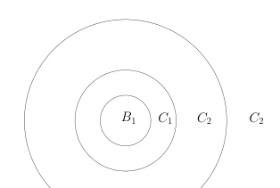

# 42：Lebesgue 积分与控制收敛定理

[返回讲义目录](../../math-analysis-lecture-notes.md) · [学期目录](../02-math-analysis-ii.md) · [校勘记录](../errata.md) · [上一篇：41.1：作业：子流形与零测集，Stieltjies 测度的构造，Borel-Cantelli 定理和无理数的逼近](41-abstract-integrals/41-03-p0478-0483.md) · [下一篇：积分与求导交换、乘积测度](43-product-measures/43-01-p0496-0502.md)

<!-- source: PDF 484; printed: 484; transcription: first-pass; proofreading: applied -->

## 抽象积分理论的一些具体例子与讨论

给定测度空间 $(X, \mathcal{A}, \mu)$，正可测函数 $f : X \to [0, +\infty]$ 的积分被定义为：

$$
\int_X f d\mu := \sup_{\substack{\varphi\in\mathcal E_+(X) \\ 0 \leqslant \varphi \leqslant f}} \int_X \varphi d\mu.
$$

对于一般的可测函数 $f : X \to \mathbb{C}$，如果 $\int_X |f| d\mu < \infty$，我们就说 $f$ 是可积的。

我们先看一个例子：

**例子。** 假设 $X = \mathbb{Z}_{\geqslant 1} = \{1, 2, \cdots, n, \cdots\}$，$\mathcal{A} = \mathcal{P}(X)$ 是 $X$ 上所有的子集所组成的 $\sigma$-代数。我们考虑数集合元素个数的测度：

$$
\mu:\mathcal P(\mathbb Z_{\geqslant1})\to[0,\infty], \quad A \mapsto \mu(A) = |A|.
$$

从而，我们得到了测度空间 $(\mathbb{Z}_{\geqslant 1}, \mathcal{P}(\mathbb{Z}_{\geqslant 1}), \mu)$。这个空间上函数

$$
f : \mathbb{Z}_{\geqslant 1} \to \mathbb{C}, \quad n \mapsto f(n),
$$

就是一个复数的数列。很明显，任意这样的函数都是可测的（因为 $\mathcal{A} = \mathcal{P}(X)$）。我们将要在本次作业中证明，$f$ 可积分当且仅当

$$
\sum_{n=1}^\infty |f(n)| < \infty
$$

并且此时

$$
\int_{\mathbb{Z}_{\geqslant 1}} f d\mu = \sum_{n=1}^\infty f(n).
$$

所以，我们所熟悉的级数求和实际上是一种积分理论。

### 可积性的比较判别

类似于上学期我们所学的关于级数收敛或者反常积分的判别法，我们对于积分的收敛性（即一个函数是否可积分）有如下的判别准则：

**命题 282。** $f$ 和 $h$ 是测度空间 $(X, \mathcal{A}, \mu)$ 上的可测函数。如果 $h$ 正的可积函数，并且不等式

$$
|f(x)| \leqslant h(x)
$$

几乎处处成立，那么 $f$ 是可积函数。

<!-- source: PDF 485; printed: 485; transcription: first-pass; proofreading: applied -->

**证明：** 令 $B = \{x \in X \mid |f(x)| > h(x)\}$，按照命题中的要求，$\mu(B) = 0$。我们令 $f_1(x) = f(x)\mathbf{1}_{B^c}(x)$，那么，对所有的 $x \in X$，我们都有

$$
|f_1(x)| \leqslant h(x).
$$

作为正函数，我们自然有

$$
\int_X |f_1| d\mu \leqslant \int_X |h| d\mu < \infty.
$$

所以 $f_1(x)$ 是可积的。为了说明 $f(x)$ 是可积分的，我们比较 $|f(x)|$ 与 $|f_1(x)|$：对于任意的 $x$，都有 $|f_1(x)| \leqslant |f(x)|$，所以

$$
\int_X |f_1| d\mu \leqslant \int_X |f| d\mu.
$$

这两个函数只在零测集 $B$ 上有差别。按照积分的定义，我们有

$$
\int_X |f| d\mu := \sup_{\substack{\varphi\in\mathcal E_+(X) \\ 0 \leqslant \varphi \leqslant |f|}} \int_X \varphi d\mu.
$$

对于简单函数而言，表现在一个零测集上改变函数值（全改为零）是不影响它的积分的，这可以用简单函数的积分定义直接看出，所以，我们总是可以假设上面积分定义中的函数 $\varphi$ 在 $B$ 上取零。此时，$\varphi\in\mathcal E_+(X)$ 并且 $0\leqslant\varphi\leqslant|f|$ 意味着 $\varphi\in\mathcal E_+(X)$ 并且 $0 \leqslant \varphi \leqslant |f_1|$，这说明

$$
\int_X |f_1| d\mu = \int_X |f| d\mu.
$$

这就给出了命题的证明。 $\hfill\square$

尽管我们现在还没有足够好的工具计算积分（目前只会计算简单函数的积分！），但是通过这个比较的判别法，我们可以判断函数的可积性。下面的几个例子很有启发性：

**例子。**

1) 给定 $\mathbb{R}^n$ 上的可测函数 $f$（我们用 Lebesgue 测度），假设对几乎处处的 $x \in \mathbb{R}^n$，$f$ 满足如下的控制：

$$
|f(x)| \leqslant \frac{C}{1 + |x|^{n+\varepsilon}},
$$

其中 $\varepsilon > 0$。那么，$f$ 是可积函数。

根据上面的判断法则，我们只要证明函数 $f(x) = \frac{C}{1 + |x|^{n+\varepsilon}}$ 可积即可。由于工具的限制，这个性质的证明目前并不简单，我们这里给出证明的细节（借此机会复习 Lebesgue 测度的积分性质）。我们把 $\mathbb{R}^n$ 分成一些环面的并（这个分解和所谓的 Littlewood-Paley 分解相关，我们将在数学分析三（如果存在的话）中学习）。令 $B_R = \{x \in \mathbb{R}^n \mid |x| \leqslant R\}$，我们令 $C_k=B_{2^k}-B_{2^{k-1}}$，那么，

$$
\mathbb{R}^n = B_1 \cup C_1 \cup C_2 \cup \cdots \cup C_k \cup \cdots
$$

<!-- source: PDF 486; printed: 486; transcription: first-pass; proofreading: applied -->

尽管我们现在还不能计算这些环面或者球面的体积，但是，由于 $B_1$ 和 $C_1$ 都被一个边长为 $4$ 的方块覆盖，所以我们知道存在常数 $a$，使得 $m(C_1) + m(B_1) \leqslant a$。另外，每个 $C_k$ 都可以由 $C_1$ 通过伸缩变换

$$
\mathbb{R}^n \to \mathbb{R}^n, \quad x\mapsto2^{k-1}x,
$$

得到，按照 Lebesgue 测度在伸缩变换下的性质，我们知道

$$
m(C_k)=(2^{k-1})^nm(C_1)\leqslant2^{(k-1)n}a.
$$

在每个 $C_k$ 上，我们有

$$
f(x)=\frac C{1+|x|^{n+\varepsilon}}\leqslant\frac C{1+|2^{k-1}|^{n+\varepsilon}}\leqslant\frac C{|2^{k-1}|^{n+\varepsilon}}.
$$

我们构造可测非负函数（有限截断为非负简单函数）

$$
h(x)=C\mathbf1_{B_1}+\sum_{k=1}^\infty\frac C{|2^{k-1}|^{n+\varepsilon}}\mathbf1_{C_k}.
$$

很明显，$f(x) \leqslant h(x)$。而 $h$ 的积分可以直接计算：

$$
\begin{aligned}
\int_{\mathbb{R}^n} h dm &= C m(B_1) + \sum_{k=1}^\infty \frac{C}{|2^{k-1}|^{n+\varepsilon}} m(C_k) \\
&\leqslant C m(B_1) + \sum_{k=1}^\infty \frac{C}{|2^{k-1}|^{n+\varepsilon}} 2^{(k-1)n} a = C m(B_1) + C a \sum_{k=1}^\infty \frac{1}{2^{(k-1)\varepsilon}}.
\end{aligned}
$$

上面的级数显然是有限的。

2) 我们考虑 $\mathbb{R}$ 上的函数 $f(x) = \frac{\sin(x)}{x}$。我们上学期证明了作为 Riemann 积分的反常积分，$f$ 是可积分的。然而，在 Lebesgue 的意义，$f$ 的可积性说的是 $\left| \frac{\sin(x)}{x} \right|$ 可积分，这个积分是无限大，我们可以仿照 1) 中的想法来证明，同学们会在本周的作业中完成。

下面的命题很有用，它的证明也很值得学习：

**命题 283。** $f$ 测度空间 $(X, \mathcal{A}, \mu)$ 上的正可测函数。那么如下命题是等价的：

1) $f$ 几乎处处为零；

2) $\int_X f d\mu = 0$。

<!-- source: PDF 487; printed: 487; transcription: first-pass; proofreading: applied -->

**证明：** 我们上次课证明了 1) $\Rightarrow$ 2)。反之，假设 $\int_X f d\mu = 0$。对每个自然数 $n$，我们考虑集合

$$
A_n = \left\{ x \in X \;\middle|\; f(x) \geqslant \frac{1}{n} \right\}.
$$

根据定义，我们自然有 $f(x) \geqslant \frac{1}{n} \mathbf{1}_{A_n}(x)$。所以，我们有如下积分不等式：

$$
0 = \int_X f d\mu \geqslant \int_X \frac{1}{n} \mathbf{1}_{A_n} d\mu = \frac{1}{n} \mu(A_n).
$$

从而对所有 $n \geqslant 1$，$\mu(A_n) = 0$。然而，由于 $f$ 是正函数，我们显然有

$$
\{x \mid f(x) \neq 0\} = \{x \mid f(x) > 0\} = \bigcup_{n \geqslant 1} A_n.
$$

所以，$\mu(\{x \mid f(x) \neq 0\}) = 0$，即 $f$ 几乎处处为零。 $\hfill\square$

## 黎曼积分与勒贝格积分的联系

在 $\mathbb{R}^1$ 上配备 Lebesgue 测度 $m$，如果一个可测函数 $f : \mathbb{R}^1 \to \mathbb{C}$ 在这个测度下是可积的，我们就称这个函数是 Lebesgue 可积的。我们可以探讨我们刚刚建立的抽象积分理论与上学期 Riemann 积分的联系。为了简单期间，我们在下面的定理中假设 $f$ 是实值的。

**定理 284。** 假定 $f$ 是闭区间 $[a, b]$ 上的 Riemann 可积的函数（有界），那么 $f$ 在 Lebesgue 测度的完备化上可测并且其 Lebesgue 积分恰为其 Riemann 积分。本定理中的 Lebesgue 可测性及积分均在该完备化上理解。

**证明：** 我们利用 Darboux 上下和来逼近函数的积分。为此，任取 $[a, b]$ 区间的分划 $\mathcal{J} = [x_0, x_1] \cup [x_1, x_2] \cup \cdots \cup [x_{n-1}, x_n]$，其中 $x_0 = a, x_n = b, x_0 < x_1 < \cdots < x_n$。令

$$
M_k = \sup_{x \in [x_{k-1}, x_k]} f(x), \quad m_k = \inf_{x \in [x_{k-1}, x_k]} f(x).
$$

我们现在用 Borel-可测的简单函数来代替 Darboux 上下和：令 $I_k=[x_{k-1},x_k)$（$k<n$），$I_n=[x_{n-1},x_n]$，使各 $I_k$ 两两不交。

$$
\overline F_{\mathcal J}(x)=\sum_{k=1}^nM_k\mathbf1_{I_k}(x),\quad\underline F_{\mathcal J}(x)=\sum_{k=1}^nm_k\mathbf1_{I_k}(x).
$$

那么，

$$
\int_{[a,b]} \overline{F}_{\mathcal{J}} dm, \quad \int_{[a,b]} \underline{F}_{\mathcal{J}} dm
$$

恰好是分划 $\mathcal{J}$ 的 Darboux 上下和，其中，上面积分是用我们的测度对简单函数进行积分（Lebesgue 积分的意义下）。

我们现在选取特殊分划：对任意的 $n$，分划 $\mathcal{J}_n$ 对应为区间 $[a, b]$ 的 $2^n$ 等分。此时，我们将对应的简单函数 $\overline{F}_{\mathcal{J}_n}(x)$ 和 $\underline{F}_{\mathcal{J}_n}(x)$ 简记为 $\overline{F}_n$ 和 $\underline{F}_n$。很明显，我们就得到两个单调的序列 $\{\overline{F}_n\}_{n \geqslant 1}$ 和 $\{\underline{F}_n\}_{n \geqslant 1}$。由于有界单调数列一定有极限，所以，存在可测函数 $\overline{F}$ 和 $\underline{F}$，使得

$$
\overline{F}_n \searrow \overline{F}, \quad \underline{F}_n \nearrow \underline{F}.
$$

<!-- source: PDF 488; printed: 488; transcription: first-pass; proofreading: applied -->

由于 $\overline{F}_n \geqslant \underline{F}_n$，所以 $\overline{F} \geqslant \underline{F}$。按照 Riemann 积分的定义，上和的极限等于下和的极限（都等于该函数的积分），即
$$\lim_{n\to\infty} \int_{[a,b]} \overline{F}_n dm = \lim_{n\to\infty} \int_{[a,b]} \underline{F}_n dm.$$

上下函数一致有界，可先加减常数化为非负上升列：对下函数应用 Beppo Levi，对上函数用常数减去它后应用 Beppo Levi。于是
$$\int_{[a,b]} \overline{F}dm = \int_{[a,b]} \underline{F}dm = \underbrace{\int_a^b f(x)dx}_{\text{Riemann 积分}}.$$

所以，（利用积分的线性，即将证明）
$$\int_{[a,b]} \overline{F} - \underline{F} = 0.$$

从而，由于 $\overline{F} - \underline{F} \geqslant 0$，所以，在一个零测集之外，我们有
$$\overline{F} = \underline{F}, \quad \text{几乎处处.}$$

另外，按照定义，我们还有
$$\overline{F} \geqslant f \geqslant \underline{F}$$
这说明，在差一个零测度的子集意义下（要用到测度的完备性，我们不去追究这个细节），我们有 $\overline{F} = f = \underline{F}$。所以，上述的论证说明了 $f$ 是可测的并且它的 Riemann 积分与 Lebesgue 积分是一致的。 $\square$

**注记。** 如果 $f$ 是区间 $[a, b]$ 上可测有界的函数，它明显是可积的（抽象积分意义下），所以，Lebesgue 积分中有更多的可积函数。然而，我们通常关心的函数大多都有很好的连续性，所以这两种积分理论没有区别，这正是上面定理的内容。

## 单调收敛定理的应用

我们上周课程最后讲到了 Beppo Levi 定理以及一个技术性的逼近定理（存在上升的简单函数列逼近正可测函数）。利用这个两个结论，我们有很多有趣有意义的推论：

**推论 285。** $f$ 和 $g$ 是测度空间 $(X, \mathcal{A}, \mu)$ 上的正可测函数。那么，对任意的非负实数 $a, b \in \mathbb{R}_{\geqslant 0}$，我们有
$$\int_X af + bg d\mu = a \int_X f d\mu + b \int_X g d\mu.$$

**证明：** 我们选取单调上升的简单函数序列 $\{f_i\}_{i\geqslant 1}$ 和 $\{g_i\}_{i\geqslant 1}$，使得它们分别逐点收敛到 $f$ 和 $g$。所以，$\{af_i + bg_i\}_{i\geqslant 1}$ 也是单调上升的简单函数序列并且逐点收敛到 $af + bg$。根据积分的对于简单函数的线性，对每个 $i$，我们有
$$\int_X af_i + bg_i d\mu = a \int_X f_i d\mu + b \int_X g_i d\mu.$$
令 $i \to \infty$，由 Beppo Levi 定理，左右两端分别收敛到推论中要证明等式的左右两端。 $\square$

<!-- source: PDF 489; printed: 489; transcription: first-pass; proofreading: applied -->

### 法图引理

Beppo Levi 定理的一个重要推论是 Fatou 引理：

**定理 286**（Fatou）。$\{f_i\}_{i\geqslant 1}$ 是测度空间 $(X, \mathcal{A}, \mu)$ 上的正可测函数序列。那么，我们有如下的积分不等式：
$$\int_X \liminf_{i\to\infty} f_i d\mu \leqslant \liminf_{i\to\infty} \int_X f_i d\mu,$$
其中，对任意的 $x \in X$，$\left(\liminf\limits_{i\to\infty} f_i\right)(x) = \liminf\limits_{i\to\infty} f_i(x)$。特别地，如果函数列 $\{f_i\}_{i\geqslant 1}$ 逐点地收敛到 $f$，即对任意的 $x$，$\lim\limits_{i\to\infty} f_i(x) = f(x)$，那么，我们有
$$\int_X f d\mu \leqslant \liminf_{i\to\infty} \int_X f_i d\mu.$$

**注记。** Fatou 引理叙述中的不等式一般而言不能取到等号，同学们可以（作业）构造函数列 $\{f_i\}_{i\geqslant 1}$ 逐点地收敛到 $f$，使得
$$\int_X f d\mu < \liminf_{i\to\infty} \int_X f_i d\mu.$$

证明之前，有必要回忆“下极限”的概念：给定实数序列 $\{a_i\}_{i\geqslant 1}$，序列 $\{\inf_{i\geqslant p} a_i\}_{p\geqslant 1}$ 是递增的。我们定义
$$\liminf_{i\to\infty} a_i = \lim_{p\to\infty} \left(\inf_{i\geqslant p} a_i\right).$$

**证明：** 令 $f(x) = \liminf\limits_{p\to\infty} f_p(x)$。我们定义函数列 $\{g_p(x)\}_{p\geqslant 1}$，其中
$$g_p(x) = \inf_{i\geqslant p} f_i(x).$$
那么，$\{g_p(x)\}_{p\geqslant 1}$ 为上升的正函数序列并且逐点地收敛到 $f(x)$。根据 Beppo Levi 定理，我们有
$$\lim_{p\to\infty} \int_X g_p d\mu = \int_X f d\mu.$$
然而，根据 $g_p(x)$ 的定义，对每个 $x \in X$，我们有 $g_p(x) \leqslant f_p(x)$。从而，
$$\int_X g_p d\mu \leqslant \int_X f_p d\mu.$$
这表明
$$\lim_{p\to\infty} \int_X g_p d\mu = \liminf_{p\to\infty} \int_X g_p d\mu \leqslant \liminf_{p\to\infty} \int_X f_p d\mu.$$
上面不等式左边就是 $\int_X f d\mu$，这就完成了 Fatou 引理第一部分的证明。第二部分是第一部分的直接推论。 $\square$

<!-- source: PDF 490; printed: 490; transcription: first-pass; proofreading: applied -->

## 可积函数空间与积分的线性

**定义 287**（可积函数空间与 $L^1(X, \mathcal{A}, \mu)$ 空间）。给定测度空间 $(X, \mathcal{A}, \mu)$，我们把这个空间上所有可积函数的全体记作 $\mathcal{L}^1(X, \mathcal{A}, \mu)$。和传统的微积分课程中处理的函数有所不同，在可积函数的定义中，由于函数被写成正函数的组合，非负积分的定义允许 $+\infty$ 值；可积的扩展值函数只可能在零测集上取无穷值。为使这里的 $\mathcal L^1$ 具有处处定义的线性运算，先在这些零测集上置零，取处处有限的复值代表。这样的修改不改变后面的 $L^1$ 等价类与积分。

这是线性子空间：对于任意的 $f, g \in \mathcal{L}^1(X, \mathcal{A}, \mu)$，$\alpha, \beta \in \mathbb{C}$，按照定义，正函数 $|f|$ 和 $|g|$ 是可积分的。根据上面的推论，$|\alpha||f| + |\beta||g|$ 也是可积的。此时，我们注意到，对任意的 $x \in X$，有
$$|\alpha f(x)+\beta g(x)|\leqslant |\alpha||f(x)| + |\beta||g(x)|,$$
所以，$\alpha f + \beta g \in \mathcal{L}^1(X, \mathcal{A}, \mu)$。

考虑几乎处处为零的函数
$$\mathcal{N} = \{ f \in \mathcal{L}^1(X, \mathcal{A}, \mu) \mid f \text{ 几乎处处为零} \}.$$
很明显，$\mathcal{N}$ 是 $\mathcal{L}^1(X, \mathcal{A}, \mu)$ 的线性子空间：对任意的 $f, g \in \mathcal{N}$，按照定义，存在零测集 $A$ 和 $B$，使得 $f|_{A^c} \equiv 0$，$g|_{B^c} \equiv 0$。那么，对任意的 $\alpha, \beta \in \mathbb{C}$，我们有
$$(\alpha f + \beta g)|_{(A\cup B)^c} \equiv 0.$$
而 $A \cup B$ 还是零测集，所以，$\alpha f + \beta g \in \mathcal{N}$。

我们定义 $L^1(X, \mathcal{A}, \mu)$ 空间为如下的等价类的集合（商空间）：
$$L^1(X, \mathcal{A}, \mu) = \mathcal{L}^1(X, \mathcal{A}, \mu) / \mathcal{N}.$$
也就是说，$L^1(X, \mathcal{A}, \mu)$ 中的元素是函数的等价类，同一个类中的任两个函数之差为一个几乎处处为零的函数（这将对积分没有贡献）。我们在多元微积分的课程中不对此做进一步的解读，同学们会在实分析的课上对这个空间做深入的了解。

**注记。** 对于 $f \in \mathcal{L}^1(X, \mathcal{A}, \mu)$，我们把它看成一组函数的等价类 $[f] \subset \mathcal{L}^1(X, \mathcal{A}, \mu)$，$f \in [f]$ 是里面的一个代表。那么，在 $L^1(X, \mathcal{A}, \mu)$ 中 $[f] = 0$ 的意思是 $f \in \mathcal{N}$ 或者 $[f] = \mathcal{N}$。另外，$f$ 几乎处处为零等价于 $|f|$ 几乎处处为零。所以，对于 $f \in \mathcal{L}^1(X, \mathcal{A}, \mu)$，$[f]=0$ 当且仅当 $\int_X|f|\,d\mu=0$。

我们现在终于可以证明积分算子的线性了：

**定理 288。** $\mathcal{L}^1(X, \mathcal{A}, \mu)$ 为 $\mathbb{C}$-线性空间且积分算子
$$\int_X - d\mu : \mathcal{L}^1(X, \mathcal{A}, \mu) \to \mathbb{C}, \quad f \mapsto \int_X f d\mu,$$
是 $\mathbb{C}$-线性映射。进一步，对于 $f \in \mathcal{L}^1(X, \mathcal{A}, \mu)$，我们
$$\left| \int_X f d\mu \right| \leqslant \int_X |f| d\mu.$$

**证明：** 我们已经证明了 $\mathcal{L}^1(X, \mathcal{A}, \mu)$ 是 $\mathbb{C}$-线性空间。我们详细分情形来证明积分算子的线性。任选 $f, g \in \mathcal{L}^1(X, \mathcal{A}, \mu)$。

<!-- source: PDF 491; printed: 491; transcription: first-pass; proofreading: applied -->

1) 如果 $f$ 和 $g$ 都是正函数并且 $a, b \geqslant 0$，我们已经证明了
$$\int_X af + bg d\mu = a \int_X f d\mu + b \int_X g d\mu.$$

2) $f$ 和 $g$ 都是正函数，$a = 1, b = -1$ 的情况。我们要证明
$$\int_X f - g d\mu = \int_X f d\mu - \int_X g d\mu.$$
为此，令 $h = f - g$。我们可以把 $h$ 写成正部和负部的差，即 $h = h_+ - h_-$。所以，
$$h^+ + g = h^- + f.$$
根据正函数的线性，我们得到
$$\int_X h^+ d\mu + \int_X g d\mu = \int_X h^- d\mu + \int_X f d\mu.$$
再根据 $\int_X h d\mu$ 的定义，我们有
$$\int_X h d\mu = \int_X h^+ d\mu - \int_X h^- d\mu,$$
所以
$$\int_X f - g d\mu = \int_X h d\mu = \int_X h^+ d\mu - \int_X h^- d\mu = \int_X f d\mu - \int_X g d\mu.$$

3) $f$ 和 $g$ 都是实值函数，$a, b \in \mathbb{R}_{\geqslant 0}$ 的情况。此时，我们有
$$\begin{aligned}
\int_X af + bg d\mu &= \int_X (af_+ + bg_+) - (af_- + bg_-) d\mu \\
&= \int_X (af_+ + bg_+) d\mu - \int_X (af_- + bg_-) d\mu \\
&= a \int_X f_+ d\mu + b \int_X g_+ d\mu - a \int_X f_- d\mu - b \int_X g_- d\mu.
\end{aligned}$$

4) $f$ 和 $g$ 都是实值函数，$a, b \in \mathbb{R}$ 的情况。按照积分的定义，我们自然有
$$\int_X -f d\mu = \int_X f_- d\mu - \int_X f_+ d\mu = -\left(\int_X f_+\,d\mu-\int_X f_-\,d\mu\right) = -\int_X f d\mu.$$
此时，对于 $a$ 和 $b$ 可能的正负情况逐一讨论即可。

5) $f$ 和 $g$ 都是复值函数，$a, b \in \mathbb{C}$ 的情况。我们 $f, g, a$ 和 $b$ 都用它们的实部和虚部写出来，展开即可，这些繁琐且无启发性的细节留给同学们在课下验证。

至此，我们完整地证明了积分的线性。为了证明定理中的不等式，选取复数 $e^{i\theta_0}$，使得
$$e^{i\theta_0} \int_X f d\mu = \left| \int_X f d\mu \right|.$$

<!-- source: PDF 492; printed: 492; transcription: first-pass; proofreading: applied -->

根据积分的线性，我们有
$$ \left| \int_X f d\mu \right| = \int_X e^{i\theta_0} f d\mu. $$

所以，函数 $e^{i\theta_0}f$ 的虚数部分对积分没有贡献，从而
$$ \int_X e^{i\theta_0} f d\mu = \int_X \operatorname{Re}(e^{i\theta_0} f) d\mu \leqslant \int_X \operatorname{Re}(e^{i\theta_0} f)_+ d\mu \leqslant \int_X |f| d\mu. $$

最后一步，我们用到了 $\operatorname{Re}(e^{i\theta_0} f)_+ \leqslant |f|$，这是显然的。 $\square$

一旦有了积分的线性，我们就可以方便地证明很多命题了

**推论 289**（积分的区域可加性）。给定测度空间 $(X, \mathcal{A}, \mu)$，$f$ 是 $X$ 上的可积函数。我们定义 $f$ 的支集 $\operatorname{supp} f$ 为
$$ \operatorname{supp} f = \{ x \in X \mid f(x) \neq 0 \}. $$

假设 $\operatorname{supp} f \subset A \in \mathcal{A}$，我们也把 $\int_X f d\mu$ 写成 $\int_A f d\mu$。对于任意的 $A, B \in \mathcal{A}$，$A \cap B = \emptyset$，我们有 $f \cdot 1_A$ 和 $f \cdot 1_B$ 均可积并且
$$ \int_{A \cup B} f = \int_A f d\mu + \int_B f d\mu. $$

**证明：** 由于 $|f \cdot 1_A| \leqslant |f|$，所以 $f \cdot 1_A$ 可积。推论中的等式就是对 $f \cdot 1_A + f \cdot 1_B$ 的积分应用线性。 $\square$

**推论 290**。在零测集上改变函数的值不会影响其积分，也就是说，如果 $f_1, f_2 \in L^1(X, \mathcal{A}, \mu)$，使得 $f_1 = f_2$ 几乎处处，那么
$$ \int_X f_1 d\mu = \int_X f_2 d\mu. $$

**证明：** 按照要求，$f = f_1 - f_2$ 几乎处处是 $0$，所以其积分为 $0$，从而
$$ 0 = \int_X f d\mu = \int_X f_1 - f_2 d\mu = \int_X f_1 d\mu - \int_X f_2 d\mu. $$
$\square$

**推论 291**（$L^1(X, \mathcal{A}, \mu)$ 是赋范线性空间）。映射
$$ \|\cdot\|_{L^1(X,\mathcal{A},\mu)} : L^1(X, \mathcal{A}, \mu) \to \mathbb{R}_{\geqslant 0}, \quad [f] \mapsto \int_X |f| d\mu, $$
是范数。我们这个范数称作是 $L^1$ 范数，对于 $f \in L^1(X, \mathcal{A}, \mu)$，我们把它的范数简记为 $\|f\|_{L^1}$。从而，$(L^1(X, \mathcal{A}, \mu), \|\cdot\|_{L^1})$ 是赋范线性空间。

**证明：** 首先，对于等价类 $[f]$ 中的任何两个代表元 $f_1, f_2 \in [f]$，它们几乎处处相等，所以 $|f_1| = |f_2|$ 几乎处处，从而，
$$ \|[f]\|_{L^1} = \int_X |f_1| d\mu = \int_X |f_2| d\mu. $$

<!-- source: PDF 493; printed: 493; transcription: first-pass; proofreading: applied -->

这表明映射是良好定义的。另外，我们知道 $\left| \int_X |f| d\mu \right| = 0$ 等价于在 $L^1(X, \mathcal{A}, \mu)$ 中 $f = 0$。所以，$\|f\|_{L^1} = 0$ 等价于在 $L^1(X, \mathcal{A}, \mu)$ 中 $f = 0$。对于任意的 $a, b \in \mathbb{C}$ 和 $f, g \in L^1(X, \mathcal{A}, \mu)$，根据积分的线性，我们有
$$ \|af + bg\|_{L^1} = \int_X |af + bg| d\mu \leqslant \int_X |a||f| + |b||g| d\mu = |a| \|f\|_{L^1} + |b| \|g\|_{L^1}. $$

这就说明了 $\|\cdot\|_{L^1}$ 是范数。 $\square$

**注记**。我们将证明 $(L^1(X, \mathcal{A}, \mu), \|\cdot\|_{L^1})$ 是完备的赋范线性空间。

**注记**（子空间上的积分）。假定 $Y \in \mathcal{A}$，我们定义 $\mathcal{A}|_Y = \{ A \in \mathcal{A} \mid A \subset Y \}$，这 $\sigma$-代数：实际上，如果令
$$ \iota : Y \to X, \quad y \mapsto y, $$
那么，$\mathcal{A}|_Y = \iota^* \mathcal{A}$。我们可以将测度 $\mu$ 限制到 $\mathcal{A}|_Y$ 上得到一个测度 $\mu|_Y$：对任意的 $A\cap Y\in\mathcal A|_Y$，我们定义
$$ \mu|_Y(A \cap Y) = \mu(A \cap Y). $$
这样，我们就得到了测度空间 $(Y, \mathcal{A}|_Y, \mu|_Y)$ 从而可以对 $Y$ 上定义的函数进行积分。另外，对于 $Y$ 上定义函数，还可以将它用零延拓成 $X$ 上的函数从而将该函数视作是整个空间 $X$ 上的函数，然后我们可以在 $X$ 上积分。这两种做法是等价的，我们会在作业中证明。

我们还必须做出如下的澄清：当 $X=\mathbb R^n$ 且 $\mu$ 为 Lebesgue 测度，$Y$ 是子流形时（余维数至少是 1），那么 $\mu|_Y$ 在任何集合上取值都是 $0$（因为此时子流形的测度是零）。多元微积分的课程要专门研究子流形上的积分理论，通常的微积分教材里把这些积分称作是曲线和曲面上的积分。

## 控制收敛定理

我们现在可以证明积分理论中最重要的收敛定理了，它的应用渗透到近代分析的每个角落：

**定理 292**（Lebesgue 控制收敛定理）。假定测度空间 $(X, \mathcal{A}, \mu)$ 上的可测函数列 $\{f_i\}_{i \geqslant 1}$ 几乎处处收敛到可测函数 $f$，即存在零测集 $N \in \mathcal{A}$，使得对任意的 $x \in N^c$，我们有 $\lim_{i \to \infty} f_i(x) = f(x)$。如果存在所谓的控制函数 $h \in L^1(X, \mathcal{A}, \mu)$，使得对每个 $i$，$|f_i(x)| \leqslant h(x)$ 几乎处处成立（即存在零测集 $N_i \in \mathcal{A}$，使得对任意的 $x \in (N_i)^c$，$|f_i(x)| \leqslant h(x)$），那么，我们有
$$ \lim_{i \to \infty} \int_X |f_i - f| d\mu = 0. $$

特别地，我们有
$$ \lim_{i \to \infty} \int_X f_i d\mu = \int_X f d\mu. $$

**证明：** 我们要应用 Beppo Levi 定理。先在零测集 $N\cup\bigcup_iN_i\cup\{h<0\}$ 上把 $f_i,f,h$ 全部置零；取处处有限的可积控制函数代表，这不改变各积分。于是所有点上都有 $|f_i|\leqslant h$、$|f|\leqslant h$，且 $f_i\to f$。首先，定义正函数序列 $\{g_i\}_{i \geqslant 1}$：
$$ g_i(x) = 2h(x) - \sup_{k \geqslant i} |f(x) - f_k(x)|. $$

<!-- source: PDF 494; printed: 494; transcription: first-pass; proofreading: applied -->

按照构造方式，这是单调上升的函数序列。根据定理的条件，$\{g_i\}_{i \geqslant 1}$ 几乎处处收敛到 $2h$，即对于任意的 $x \notin N$，我们有 $\lim_{i \to \infty} g_i(x) = 2h(x)$。

我们考虑集合 $N \cup \bigcup_{i \geqslant 1} N_i$，这是一个零测集。在 $X-\left(N\cup\bigcup_{i\geqslant1}N_i\right)$ 上，我们有
$$ g_i(x) \geqslant 0, \quad g_i(x) \to 2h(x). $$

利用 Beppo Levi 定理，我们知道
$$ \lim_{i \to \infty} \int_X \left( 2h(x) - \sup_{k \geqslant i} |f(x) - f_k(x)| \right) d\mu = \lim_{i \to \infty} \int_X g_i d\mu = 2 \int_X h d\mu. $$

在方程的两边同时减掉 $2 \int_X h d\mu$，我们就得到
$$ \lim_{i \to \infty} \int_X \sup_{k \geqslant i} |f(x) - f_k(x)| d\mu = 0. $$

我们只要简单地去掉 $\sup$ 就证明了 Lebesgue 控制收敛定理。 $\square$

**注记**。在 Lebesgue 控制收敛定理的证明过程中，我们得到了更强的结论：
$$ \lim_{i \to \infty} \int_X \sup_{k \geqslant i} |f(x) - f_k(x)| d\mu = 0. $$

### 积分对参数的连续依赖性

下面的两个推论有着众多的应用，我们会在作业和考试中展现它们：

**推论 293**（积分对参数的连续依赖性）。假定参数空间 $\Omega$ 为距离空间（一般而言，$\Omega$ 是 $\mathbb{R}^n$ 中的一个开集），$(X, \mathcal{A}, \mu)$ 是测度空间。函数
$$ f : X \times \Omega \to \mathbb{C}, \quad (x, t) \mapsto f(x, t), $$
满足如下条件：

1) 对每个固定的 $t \in \Omega$，函数 $x \mapsto f(x, t)$ 是可测的；
2) 对几乎处处的 $x$，映射 $t \mapsto f(x, t)$ 在 $t_0 \in \Omega$ 处连续（即存在零测集 $N$，使得对任意的 $x \in N^c$，映射 $t \mapsto f(x, t)$ 在 $t_0 \in \Omega$ 处连续）；
3) 存在正函数 $h \in L^1(X, \mathcal{A}, \mu)$，使得对每个 $t \in \Omega$，我们有
$$ |f(x, t)| \leqslant h(x) $$
对几乎处处的 $x$ 成立（即存在存在零测集 $N_t$，使得对任意的 $x \notin N_t$，我们有 $|f(x, t)| \leqslant h(x)$）。

<!-- source: PDF 495; printed: 495; transcription: first-pass; proofreading: applied -->

那么，函数
$$ F : \Omega \to \mathbb{C}, \quad t \mapsto F(t) = \int_X f(x, t) d\mu(x) $$
是良好定义的并且在 $t_0$ 处连续。

**证明：** 由于 $|f(x, t)| \leqslant h(x)$，所以对于固定的 $t$，$f(x, t)$ 是可积的，从而函数 $F(t)$ 是良好定义的。我们来证明 $F$ 在 $t_0$ 处的连续性。为此，任取点列 $t_k \to t_0$，我们希望证明
$$ \int_X f(x, t_k) d\mu(x) \to \int_X f(x, t_0) d\mu(x). $$

这就是 Lebesgue 控制收敛定理的内容，因为我们可以选取 $h$ 作为控制函数。 $\square$

[返回讲义目录](../../math-analysis-lecture-notes.md) · [学期目录](../02-math-analysis-ii.md) · [校勘记录](../errata.md) · [上一篇：41.1：作业：子流形与零测集，Stieltjies 测度的构造，Borel-Cantelli 定理和无理数的逼近](41-abstract-integrals/41-03-p0478-0483.md) · [下一篇：积分与求导交换、乘积测度](43-product-measures/43-01-p0496-0502.md)
